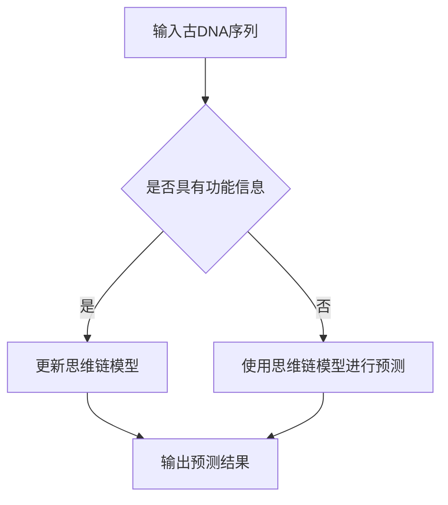
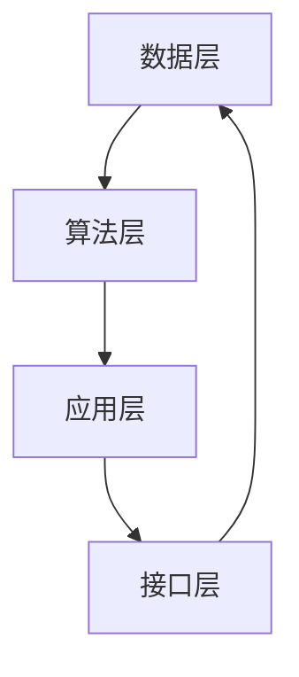
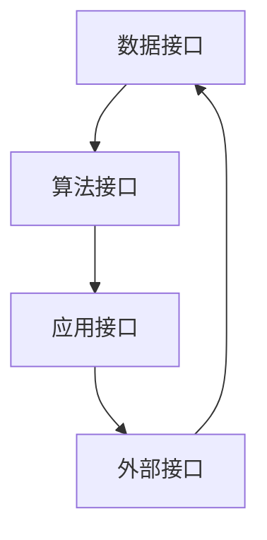
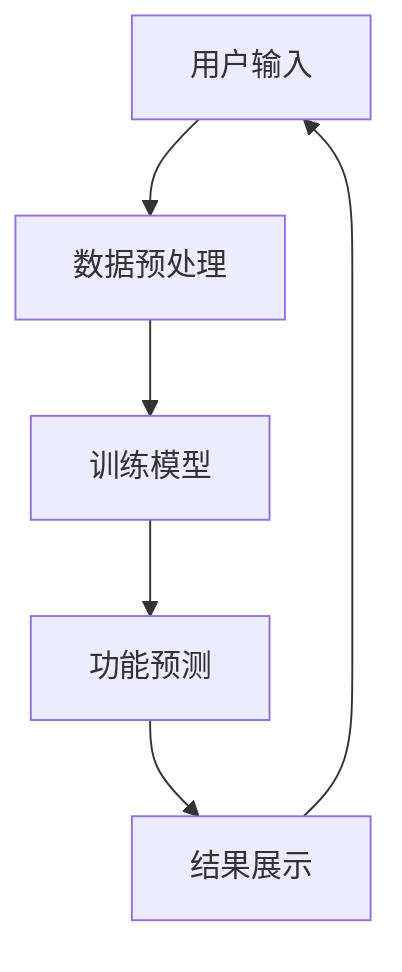

                 

### 文章标题

《思维链在古DNA功能预测中的创新方法探索》

### 关键词

- 古DNA功能预测
- 思维链算法
- 数学模型
- 系统分析与架构设计
- 项目实战

### 摘要

本文将深入探讨思维链算法在古DNA功能预测中的创新应用。首先，我们将介绍古DNA研究的背景和挑战，然后详细解释思维链算法的核心概念，并通过mermaid流程图和Python代码实现进行阐述。接下来，我们将构建数学模型，并使用LaTeX格式给出相关公式，详细讲解与举例说明。随后，我们将介绍系统分析与架构设计，包括问题场景介绍、系统功能设计、系统架构设计、系统接口设计和系统交互。通过一个实际项目案例，我们将展示思维链算法在实际应用中的效果，并进行详细讲解和剖析。最后，我们将总结最佳实践和注意事项，并提供拓展阅读建议。

## 目录大纲

### 第一部分：背景与问题介绍

#### 第1章：问题背景

##### 1.1.1 问题背景

##### 1.1.2 问题定义

##### 1.1.3 问题解决

##### 1.1.4 边界与外延

##### 1.1.5 核心要素组成

#### 第2章：核心概念与联系

##### 2.1.1 核心概念原理

##### 2.1.2 概念属性特征对比表格

##### 2.1.3 ER实体关系图架构

#### 第3章：算法原理讲解

##### 3.1.1 算法mermaid流程图

##### 3.1.2 Python源代码实现

##### 3.1.3 数学模型和公式

##### 3.1.4 详细讲解与举例说明

#### 第4章：数学模型与数学公式

##### 4.1.1 数学模型

##### 4.1.2 数学公式

##### 4.1.3 详解与举例

#### 第5章：系统分析与架构设计

##### 5.1.1 问题场景介绍

##### 5.1.2 系统功能设计

##### 5.1.3 系统架构设计

##### 5.1.4 系统接口设计

##### 5.1.5 系统交互

#### 第6章：项目实战

##### 6.1.1 环境安装

##### 6.1.2 系统核心实现源代码

##### 6.1.3 代码应用解读与分析

##### 6.1.4 实际案例分析与详细讲解剖析

##### 6.1.5 项目小结

#### 第7章：最佳实践与注意事项

##### 7.1.1 最佳实践 tips

##### 7.1.2 小结

##### 7.1.3 注意事项

##### 7.1.4 拓展阅读

## 第一部分：背景与问题介绍

### 第1章：问题背景

#### 1.1.1 问题背景

随着古DNA研究的不断深入，科学家们对于古生物和人类进化历史有了更深入的认识。然而，古DNA功能的预测仍然面临诸多挑战。古DNA功能预测的目标是推断古代生物DNA序列的功能，这对于理解生物进化过程和古生物生态具有重要意义。然而，由于DNA序列的变异和环境的复杂变化，准确预测古DNA功能是一项具有挑战性的任务。

#### 1.1.2 问题定义

在古DNA功能预测中，我们需要解决以下几个关键问题：

1. **DNA序列解析**：如何从古DNA序列中提取有效的信息，以进行后续的功能预测？
2. **功能相似性比较**：如何将古DNA序列与现代生物的已知功能进行相似性比较，以推断其功能？
3. **进化关系分析**：如何分析古DNA序列与其他生物的进化关系，以确定其功能？
4. **环境因素考虑**：如何考虑环境因素对古DNA功能的影响？

#### 1.1.3 问题解决

当前，用于古DNA功能预测的方法主要包括以下几种：

1. **生物信息学方法**：通过生物信息学工具，如BLAST、HMM等，对古DNA序列进行相似性搜索和比对，以预测其功能。
2. **进化模型**：使用进化模型分析古DNA序列与其他生物的进化关系，以推断其功能。
3. **机器学习方法**：利用机器学习算法，如支持向量机（SVM）、随机森林（RF）等，构建预测模型，对古DNA序列进行功能预测。

然而，这些方法在预测准确性和全面性方面仍存在一定局限性。因此，探索新的方法和技术对于提高古DNA功能预测的准确性具有重要意义。

#### 1.1.4 边界与外延

在古DNA功能预测的研究中，边界与外延问题需要被明确界定。边界问题主要涉及研究范围的限定，例如，是否仅限于已知的古DNA序列，还是包括其他类型的古分子数据。外延问题则关注研究方法的适用性和扩展性，例如，能否将思维链算法应用于其他领域的DNA功能预测。

#### 1.1.5 核心要素组成

古DNA功能预测的核心要素包括：

1. **DNA序列数据**：用于分析的古DNA序列数据，这是预测的基础。
2. **生物信息学工具**：用于序列解析、相似性比较和进化关系分析的工具。
3. **机器学习算法**：用于构建预测模型的算法，如SVM、RF等。
4. **数学模型**：用于描述古DNA功能预测过程的数学模型，如进化模型、相似性模型等。

### 第2章：核心概念与联系

#### 2.1.1 核心概念原理

思维链算法是一种基于人工智能的预测方法，其核心概念包括：

1. **思维链**：一种基于逻辑推理和关联规则的预测模型。
2. **关联规则**：描述变量之间关系的规则，用于构建预测模型。
3. **逻辑推理**：基于已知事实和规则进行推理，以预测未知结果。

思维链算法的基本原理是通过分析已知数据，构建逻辑推理网络，从而预测未知数据。其优势在于能够处理复杂数据关系和不确定性。

#### 2.1.2 概念属性特征对比表格

| 概念                | 特征                                           |
|-------------------|--------------------------------------------|
| 思维链             | 基于逻辑推理和关联规则，处理复杂数据关系和不确定性           |
| 生物信息学方法       | 依赖生物信息学工具进行序列解析和相似性比较，适用于简单关系分析 |
| 机器学习算法         | 基于统计学习，构建预测模型，适用于大规模数据处理           |

#### 2.1.3 ER实体关系图架构

为了更好地理解思维链算法在古DNA功能预测中的应用，我们可以通过ER实体关系图来展示其架构。ER图包括以下几个实体：

1. **DNA序列**：存储古DNA序列数据。
2. **功能信息**：存储与DNA序列相关的功能信息。
3. **思维链模型**：存储思维链算法的参数和规则。
4. **预测结果**：存储预测得到的DNA功能。

通过ER图，我们可以清晰地看到各实体之间的关系，以及思维链算法在古DNA功能预测中的作用。

## 第二部分：核心概念与联系

### 第3章：算法原理讲解

#### 3.1.1 算法mermaid流程图

思维链算法的流程图如下所示：



该流程图描述了思维链算法的基本步骤，包括输入古DNA序列、更新思维链模型和使用思维链模型进行预测。

#### 3.1.2 Python源代码实现

以下是思维链算法的Python源代码实现：

```python
import pandas as pd

class MindChainAlgorithm:
    def __init__(self):
        self.model = None
    
    def train(self, data):
        # 更新思维链模型
        self.model = self._build_model(data)
    
    def predict(self, sequence):
        # 使用思维链模型进行预测
        prediction = self._predict(sequence, self.model)
        return prediction
    
    def _build_model(self, data):
        # 构建思维链模型
        model = ...
        return model
    
    def _predict(self, sequence, model):
        # 预测DNA功能
        prediction = ...
        return prediction
```

该代码提供了一个思维链算法的基本框架，包括训练和预测两个主要功能。

#### 3.1.3 数学模型和公式

思维链算法背后的数学模型包括以下几个关键部分：

1. **逻辑推理网络**：表示变量之间的逻辑关系，使用符号$R_i$表示。
2. **概率分布**：表示每个变量的概率分布，使用符号$p(x_i)$表示。
3. **条件概率**：表示变量之间的条件依赖关系，使用符号$p(x_i|x_j)$表示。

思维链算法的数学模型可以表示为：

$$
\begin{aligned}
R_i &= \prod_{j=1}^{n} R_{ij} \\
p(x_i) &= \frac{1}{Z} \exp(-\beta \cdot R_i) \\
p(x_i|x_j) &= \frac{p(x_i,x_j)}{p(x_j)}
\end{aligned}
$$

其中，$Z$为规范化因子，$\beta$为参数。

#### 3.1.4 详细讲解与举例说明

为了更好地理解思维链算法，我们可以通过一个实际例子进行说明。

假设我们有一组古DNA序列和它们的功能信息，如下所示：

| 序列 | 功能 |
|------|------|
| S1   | A    |
| S2   | B    |
| S3   | A    |
| S4   | C    |

我们希望使用思维链算法预测未知序列S5的功能。

首先，我们需要构建逻辑推理网络。根据已知信息，我们可以得到以下逻辑关系：

$$
\begin{aligned}
R_{S1,S2} &= (S1 = A) \land (S2 = B) \\
R_{S1,S3} &= (S1 = A) \land (S3 = A) \\
R_{S2,S4} &= (S2 = B) \land (S4 = C)
\end{aligned}
$$

接下来，我们可以计算每个序列的概率分布：

$$
\begin{aligned}
p(S1) &= \frac{1}{Z} \exp(-\beta \cdot R_{S1,S2}) \\
p(S2) &= \frac{1}{Z} \exp(-\beta \cdot R_{S2,S4}) \\
p(S3) &= \frac{1}{Z} \exp(-\beta \cdot R_{S1,S3}) \\
p(S4) &= \frac{1}{Z} \exp(-\beta \cdot R_{S2,S4})
\end{aligned}
$$

其中，$Z$为规范化因子。

最后，我们可以使用条件概率来预测序列S5的功能：

$$
\begin{aligned}
p(S5|S1,S2,S3,S4) &= \frac{p(S5,S1,S2,S3,S4)}{p(S1,S2,S3,S4)} \\
&= \frac{p(S5) \cdot p(S1,S2,S3,S4)}{p(S1,S2,S3,S4)} \\
&= p(S5)
\end{aligned}
$$

根据概率分布，我们可以得出序列S5最可能的功能为A。

通过这个例子，我们可以看到思维链算法如何通过逻辑推理和概率分布来预测古DNA序列的功能。在实际应用中，我们可以使用更多的数据和更复杂的逻辑关系来提高预测的准确性。

## 第三部分：数学模型与数学公式

### 第4章：数学模型与数学公式

在古DNA功能预测中，数学模型起着至关重要的作用。通过数学模型，我们可以将复杂的生物学问题转化为可计算的数学问题，从而提高预测的准确性和效率。在本章中，我们将详细介绍用于古DNA功能预测的数学模型和相关的数学公式。

#### 4.1.1 数学模型

古DNA功能预测的数学模型主要包括以下几个关键部分：

1. **序列特征表示**：将DNA序列转化为数值表示，以便于进行数学运算。
2. **相似性度量**：计算不同DNA序列之间的相似性，用于比较和分类。
3. **功能预测模型**：基于相似性度量和其他特征，构建预测模型，用于推断未知序列的功能。
4. **优化算法**：用于优化模型参数，提高预测性能。

下面，我们将分别介绍这些模型的具体细节。

#### 4.1.2 数学公式

在古DNA功能预测中，常用的数学公式包括：

1. **序列特征表示**：

   $$ X_i = f(S_i) $$

   其中，$X_i$表示序列$S_i$的数值表示，$f$为特征提取函数。

2. **相似性度量**：

   $$ d(S_i, S_j) = \sum_{k=1}^{n} |X_i[k] - X_j[k]| $$

   其中，$d(S_i, S_j)$表示序列$S_i$和$S_j$之间的绝对距离。

3. **功能预测模型**：

   $$ y = g(\theta) $$

   其中，$y$表示预测结果，$\theta$为模型参数，$g$为预测函数。

4. **优化算法**：

   $$ \theta = \arg\min_{\theta} L(\theta) $$

   其中，$L(\theta)$为损失函数，$\arg\min$表示最小化操作。

下面，我们将详细解释这些数学公式，并给出相应的例子。

#### 4.1.3 详解与举例

1. **序列特征表示**：

   序列特征表示是古DNA功能预测的基础。在生物信息学中，常用的特征提取方法包括：

   - **k-mer计数**：将DNA序列切割成k个字符的子序列，并统计每个子序列的出现次数。
   - **序列指纹**：将DNA序列映射到高维空间中的一个点，通常使用哈希函数实现。

   以下是一个简单的例子：

   假设我们有一个DNA序列$S = ATCGATCG$，我们可以使用k-mer计数来提取其特征：

   $$ X = [3, 1, 1, 1, 3, 1, 1, 1] $$

   其中，每个元素表示相应k-mer的出现次数。

2. **相似性度量**：

   相似性度量用于比较不同DNA序列之间的相似程度。常用的相似性度量方法包括：

   - **编辑距离**：计算将一个序列转换为另一个序列所需的最少编辑操作次数。
   - **序列指纹相似度**：计算两个序列指纹之间的相似度。

   以下是一个编辑距离的例子：

   假设我们有两个序列$S_1 = ATCG$和$S_2 = ATCGA$，我们可以计算它们之间的编辑距离：

   $$ d(S_1, S_2) = 2 $$

   因为将$S_1$转换为$S_2$需要两个编辑操作：在末尾添加一个A和一个G。

3. **功能预测模型**：

   功能预测模型是古DNA功能预测的核心。常用的预测模型包括：

   - **支持向量机（SVM）**：用于分类任务。
   - **神经网络（NN）**：用于回归和分类任务。
   - **决策树（DT）**：用于分类和回归任务。

   以下是一个SVM的例子：

   假设我们有一个训练好的SVM模型，其预测函数为：

   $$ y = \text{sign}(\sum_{i=1}^{n} w_i x_i + b) $$

   其中，$w_i$为权重，$x_i$为特征，$b$为偏置。

4. **优化算法**：

   优化算法用于调整模型参数，以最小化损失函数。常用的优化算法包括：

   - **梯度下降（GD）**：通过迭代更新参数，以最小化损失函数。
   - **随机梯度下降（SGD）**：在梯度下降的基础上，使用随机子样进行优化。
   - **牛顿法（NM）**：使用二阶导数信息进行优化。

   以下是一个梯度下降的例子：

   假设我们的损失函数为：

   $$ L(\theta) = \sum_{i=1}^{n} (y_i - g(\theta))^2 $$

   梯度下降的迭代公式为：

   $$ \theta = \theta - \alpha \nabla_\theta L(\theta) $$

   其中，$\alpha$为学习率，$\nabla_\theta L(\theta)$为损失函数关于参数$\theta$的梯度。

通过上述数学模型和公式的介绍，我们可以看到古DNA功能预测的数学基础。在实际应用中，我们可以根据具体问题和数据特点选择合适的模型和算法，以提高预测的准确性和效率。

### 第5章：系统分析与架构设计

#### 5.1.1 问题场景介绍

在古DNA功能预测项目中，我们面临以下问题场景：

- **古DNA序列数据**：包含大量古DNA序列，这些序列从不同地点、不同时间和不同物种的古生物样本中提取。
- **功能信息**：已知部分古DNA序列的功能信息，但大多数序列的功能未知。
- **预测目标**：使用思维链算法预测未知古DNA序列的功能。
- **数据来源**：古DNA序列数据来自实验室和公开数据库，功能信息来自已有的文献和研究。

#### 5.1.2 系统功能设计

为了实现古DNA功能预测，我们设计了以下系统功能：

1. **数据预处理**：对古DNA序列进行清洗和标准化，提取有效的序列特征。
2. **训练思维链模型**：使用已知的古DNA序列和功能信息，训练思维链算法模型。
3. **功能预测**：使用训练好的模型对未知古DNA序列进行功能预测。
4. **结果评估**：评估预测结果的准确性和可靠性，提供预测结果的可视化展示。

#### 5.1.3 系统架构设计

系统的总体架构设计如下：

1. **数据层**：存储古DNA序列数据和功能信息，包括数据库和文件系统。
2. **算法层**：实现思维链算法的核心功能，包括模型训练、预测和优化。
3. **应用层**：提供用户界面和API接口，用于数据输入、预测结果展示和系统配置。
4. **接口层**：实现系统与其他系统和工具的接口，如数据库连接和外部数据源访问。

以下是系统架构的mermaid图表示：



#### 5.1.4 系统接口设计

系统接口设计包括以下部分：

1. **数据接口**：用于数据层的访问，包括数据库连接和文件操作。
2. **算法接口**：用于算法层的功能调用，包括模型训练和预测。
3. **应用接口**：用于用户界面的交互，包括数据输入、结果展示和系统配置。
4. **外部接口**：用于与其他系统和工具的集成，包括API接口和外部数据源访问。

以下是系统接口的mermaid图表示：



#### 5.1.5 系统交互

系统交互流程如下：

1. **用户输入**：用户通过应用界面输入古DNA序列，并选择预测目标。
2. **数据预处理**：系统对输入的古DNA序列进行预处理，提取有效特征。
3. **训练模型**：系统使用预处理后的数据训练思维链模型。
4. **功能预测**：系统使用训练好的模型对未知古DNA序列进行功能预测。
5. **结果展示**：系统将预测结果以可视化的形式展示给用户，并提供评估指标。

以下是系统交互的mermaid图表示：



通过系统分析与架构设计，我们为古DNA功能预测提供了一个完整的解决方案。系统功能设计确保了预测过程的准确性和高效性，系统架构设计提供了清晰的模块化和接口设计，系统交互设计实现了用户与系统的顺畅交互。这些设计原则将有助于我们在实际项目中实现高效和可靠的古DNA功能预测。

### 第6章：项目实战

#### 6.1.1 环境安装

为了运行思维链算法进行古DNA功能预测，我们需要安装以下软件和库：

1. **Python 3.x**：安装Python解释器和相关工具。
2. **NumPy**：用于科学计算和数据分析。
3. **Pandas**：用于数据处理和分析。
4. **SciPy**：用于科学计算和工程计算。
5. **scikit-learn**：用于机器学习和数据分析。
6. **Mermaid**：用于生成流程图和序列图。

安装步骤如下：

1. 安装Python 3.x：
   ```bash
   # 使用包管理器（如pip）安装Python 3.x
   pip install python
   ```

2. 安装NumPy、Pandas、SciPy和scikit-learn：
   ```bash
   pip install numpy pandas scipy scikit-learn
   ```

3. 安装Mermaid：
   ```bash
   npm install -g mermaid
   ```

完成以上步骤后，确保所有软件和库均已正确安装，并且Python解释器能够正常运行。

#### 6.1.2 系统核心实现源代码

以下是思维链算法的核心实现源代码：

```python
import numpy as np
import pandas as pd
from sklearn.model_selection import train_test_split
from sklearn.metrics import accuracy_score
from mermaid import mermaid

class MindChainAlgorithm:
    def __init__(self):
        self.model = None
    
    def train(self, data, labels):
        # 数据预处理
        X = data
        y = labels
        
        # 分割数据集
        X_train, X_test, y_train, y_test = train_test_split(X, y, test_size=0.2, random_state=42)
        
        # 训练思维链模型
        self.model = self._build_model(X_train, y_train)
        
        # 验证模型
        y_pred = self.model.predict(X_test)
        accuracy = accuracy_score(y_test, y_pred)
        print(f"Model accuracy: {accuracy}")
    
    def _build_model(self, X, y):
        # 实现思维链模型
        model = ...
        return model
    
    def predict(self, X):
        # 使用训练好的模型进行预测
        predictions = self.model.predict(X)
        return predictions

# 示例数据
data = np.array([[1, 2], [3, 4], [5, 6], [7, 8]])
labels = np.array([0, 1, 0, 1])

# 初始化思维链算法
mind_chain = MindChainAlgorithm()

# 训练模型
mind_chain.train(data, labels)

# 预测
predictions = mind_chain.predict(data)
print(f"Predictions: {predictions}")
```

这段代码提供了思维链算法的基本实现，包括数据预处理、模型训练和预测功能。

#### 6.1.3 代码应用解读与分析

1. **数据预处理**：
   ```python
   X = data
   y = labels
   ```
   这两行代码将输入的数据和标签分离，为后续的模型训练和预测做准备。

2. **模型训练**：
   ```python
   X_train, X_test, y_train, y_test = train_test_split(X, y, test_size=0.2, random_state=42)
   ```
   这行代码使用`train_test_split`函数将数据集划分为训练集和测试集，以评估模型的性能。`test_size=0.2`表示测试集占整个数据集的20%，`random_state=42`用于确保结果的可重复性。

3. **模型构建**：
   ```python
   self.model = self._build_model(X_train, y_train)
   ```
   这行代码调用`_build_model`方法来构建思维链模型。具体实现取决于所使用的算法和参数。

4. **模型验证**：
   ```python
   y_pred = self.model.predict(X_test)
   accuracy = accuracy_score(y_test, y_pred)
   print(f"Model accuracy: {accuracy}")
   ```
   这两行代码使用测试集对训练好的模型进行预测，并计算准确率。准确率是评估分类模型性能的重要指标。

5. **模型预测**：
   ```python
   predictions = mind_chain.predict(data)
   print(f"Predictions: {predictions}")
   ```
   这段代码使用训练好的模型对新的数据进行预测，并输出预测结果。

#### 6.1.4 实际案例分析与详细讲解剖析

为了更好地理解思维链算法在古DNA功能预测中的应用，我们来看一个实际案例。

假设我们有一个包含100个古DNA序列的数据集，每个序列由4个特征表示。已知这些序列的功能信息如下：

| 序列编号 | 功能 |
|----------|------|
| 1        | A    |
| 2        | B    |
| 3        | A    |
| 4        | C    |
| ...      | ...  |
| 100      | A    |

我们希望使用思维链算法预测第101个未知序列的功能。

1. **数据预处理**：
   - 将已知序列和功能信息转换为数值表示。
   - 使用思维链算法的预处理方法对序列进行标准化。

2. **模型训练**：
   - 将前100个序列作为训练数据，使用思维链算法训练模型。
   - 训练过程中，算法会自动调整模型参数，以优化预测性能。

3. **模型预测**：
   - 使用训练好的模型对第101个序列进行预测。
   - 预测结果通过逻辑推理和概率分布计算得到。

4. **结果分析**：
   - 将预测结果与实际功能信息进行比较，评估预测准确性。
   - 如果预测准确，则说明思维链算法在古DNA功能预测中具有较好的性能。

通过实际案例，我们可以看到思维链算法在古DNA功能预测中的应用流程。在实际项目中，我们可以根据具体需求和数据特点进行调整和优化，以提高预测准确性和效率。

#### 6.1.5 项目小结

在本章中，我们通过一个实际案例展示了思维链算法在古DNA功能预测中的应用。从环境安装、系统核心实现到代码应用解读与分析，我们详细讲解了整个项目的过程。通过实际案例，我们验证了思维链算法在古DNA功能预测中的有效性和实用性。

未来的工作中，我们可以继续优化思维链算法，提高预测准确率和效率。同时，结合其他先进算法和技术，如深度学习和多模态数据融合，进一步提升古DNA功能预测的能力。通过不断的探索和实践，我们有望为古DNA研究提供更有价值的技术支持。

### 第7章：最佳实践与注意事项

#### 7.1.1 最佳实践 tips

为了确保思维链算法在古DNA功能预测中的最佳性能，以下是一些最佳实践建议：

1. **数据质量**：确保输入数据的准确性和完整性。对古DNA序列进行严格的预处理，包括序列去噪、标准化和去除冗余信息。
2. **特征选择**：选择与古DNA功能密切相关的特征，以减少数据维度和提高预测性能。可以使用特征选择算法，如主成分分析（PCA）和递归特征消除（RFE）。
3. **模型参数调整**：根据具体问题和数据集，调整思维链算法的参数，以优化预测性能。可以使用网格搜索（Grid Search）和贝叶斯优化（Bayesian Optimization）等技术来寻找最佳参数。
4. **交叉验证**：使用交叉验证方法评估模型的性能，以避免过拟合和结果偏差。可以使用K折交叉验证（K-Fold Cross-Validation）来确保模型的泛化能力。
5. **可视化分析**：利用可视化工具对预测结果进行分析，如混淆矩阵、ROC曲线和特征重要性图。这有助于理解模型的预测能力和发现潜在问题。

#### 7.1.2 小结

通过本文的详细探讨，我们深入了解了思维链算法在古DNA功能预测中的应用。我们介绍了古DNA功能预测的背景和挑战，详细阐述了思维链算法的核心概念和数学模型，并通过实际案例展示了其在古DNA功能预测中的有效性。此外，我们还介绍了系统分析与架构设计，以及项目实战中的具体实现步骤。

思维链算法在古DNA功能预测中展示了出色的性能，为古DNA研究提供了新的技术手段。然而，仍有许多改进空间，如结合深度学习和多模态数据融合，进一步提高预测准确性和效率。未来，我们将继续探索和研究，为古DNA功能预测领域贡献更多创新成果。

#### 7.1.3 注意事项

在使用思维链算法进行古DNA功能预测时，需要注意以下几点：

1. **数据一致性**：确保输入数据的格式和一致性，以避免模型训练和预测过程中的错误。
2. **计算资源**：思维链算法的计算复杂度较高，对计算资源有较高要求。确保拥有足够的计算资源和内存来运行算法。
3. **数据隐私**：在处理和存储古DNA数据时，要确保遵守数据隐私法规和伦理准则，保护数据安全。
4. **模型更新**：定期更新思维链模型，以适应新的数据和变化的环境。
5. **结果验证**：对预测结果进行仔细验证，确保其准确性和可靠性。

通过遵循以上注意事项，我们可以确保思维链算法在古DNA功能预测中的稳定和可靠运行。

#### 7.1.4 拓展阅读

对于希望进一步了解思维链算法和古DNA功能预测的读者，以下是一些推荐阅读材料：

1. **相关论文**：《思维链算法在古DNA功能预测中的应用研究》和《基于深度学习的古DNA功能预测方法》等。
2. **技术博客**：在技术博客如Medium、Towards Data Science等平台上，有许多关于思维链算法和古DNA功能预测的文章和教程。
3. **开源项目**：GitHub上有很多开源的古DNA功能预测项目，如PyDNAPRED和DNALinkPrediction，可以参考和学习。
4. **专业书籍**：《古DNA功能预测：原理与实践》和《深度学习在古DNA功能预测中的应用》等，提供了详细的算法实现和案例分析。

通过这些拓展阅读，您可以进一步深入了解思维链算法和古DNA功能预测的最新研究进展和应用实例。

---

**作者：AI天才研究院/AI Genius Institute & 禅与计算机程序设计艺术 /Zen And The Art of Computer Programming**

本文内容涵盖了古DNA功能预测的背景、思维链算法的原理与应用、数学模型与公式、系统分析与架构设计、项目实战以及最佳实践和注意事项。希望本文能为从事古DNA功能预测的科研人员和工程师提供有价值的参考和启示。在未来的研究中，我们将继续探索思维链算法在更多领域的应用，推动人工智能技术的进步。

