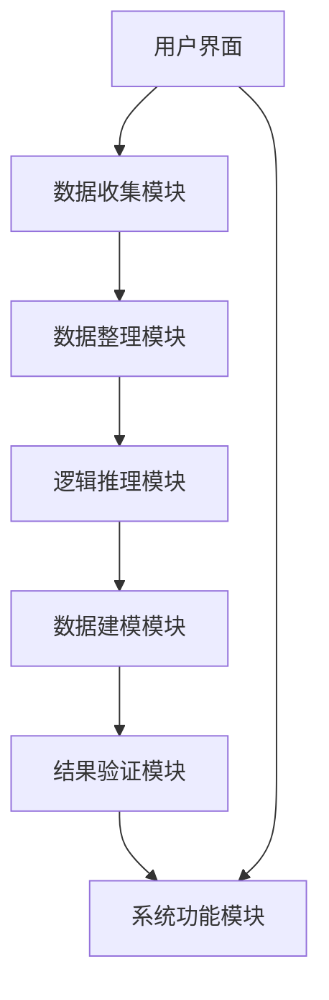

                 

# 思维链在古代贸易网络重建中的创新方法

## 关键词

- 古代贸易网络
- 思维链
- 重建方法
- 贸易路线
- 贸易商品
- 贸易伙伴

## 摘要

本文将探讨如何利用思维链这一创新方法，重建古代贸易网络。首先，我们将回顾古代贸易网络的背景和核心概念，然后详细解释思维链的基本原理及其在重建古代贸易网络中的应用。接着，我们将介绍思维链的数学模型，并通过mermaid流程图和Python源代码进行解释。最后，我们将分析系统架构设计、项目实战案例，并总结最佳实践和拓展阅读资源。

## 第一部分：问题背景与核心概念

### 第1章：问题背景与核心概念介绍

#### 1.1 问题背景

1.1.1 古代贸易网络的概述

古代贸易网络是指历史上各个文明之间通过商品交换和人员往来形成的复杂网络结构。这种网络不仅促进了经济的发展，也加强了不同文化之间的交流与融合。古代贸易网络的概念可以追溯到远古时期，如丝绸之路、地中海贸易网络等。

1.1.2 古代贸易网络的历史意义

古代贸易网络的历史意义主要体现在以下几个方面：

- **经济繁荣**：贸易网络促进了商品和资源的流通，促进了各地区经济的繁荣。
- **文化交流**：不同文明通过贸易网络交流文化、技术和宗教，促进了文明的发展和多元化。
- **社会稳定**：贸易网络的稳定运行有助于社会的稳定和和平。

1.1.3 古代贸易网络的研究现状

随着考古学和计算机科学的发展，古代贸易网络的研究逐渐受到重视。目前，研究者们主要采用传统的历史研究方法，如文献考证、考古挖掘等，对古代贸易网络进行重建和分析。然而，这些方法存在一定的局限性，无法全面揭示贸易网络的复杂性和动态性。

#### 1.2 核心概念介绍

1.2.1 思维链的定义

思维链是一种基于逻辑推理和知识关联的方法，通过一系列有序的思考步骤，逐步揭示问题的本质和解决方法。思维链的特点是逻辑清晰、层次分明、易于理解和操作。

1.2.2 思维链在古代贸易网络重建中的应用

思维链在古代贸易网络重建中的应用，主要体现在以下几个方面：

- **贸易路线的重建**：通过分析历史文献和考古资料，利用思维链逐步推断出古代贸易的路线。
- **贸易商品的重构**：根据贸易路线和贸易伙伴的信息，重构古代贸易的商品结构和种类。
- **贸易伙伴的重塑**：通过分析贸易网络中的节点和边，重塑古代贸易伙伴之间的关系。

1.2.3 创新方法的必要性

传统方法在重建古代贸易网络时，往往依赖于历史文献和考古资料，存在以下局限性：

- **资料有限**：历史文献和考古资料往往有限，难以全面揭示贸易网络的复杂性。
- **分析手段单一**：传统方法主要依靠人工分析，效率低下，难以处理大量数据。

思维链作为一种创新方法，具有以下优势：

- **逻辑性强**：思维链通过逻辑推理，能够全面、系统地分析贸易网络。
- **适应性强**：思维链可以结合多种数据源，灵活适应不同的研究需求。
- **效率高**：思维链能够高效地处理大量数据，快速揭示贸易网络的本质。

#### 1.3 边界与外延

1.3.1 古代贸易网络的界定

古代贸易网络主要涵盖以下方面：

- **时间范围**：一般指公元前到公元后的历史时期。
- **地域范围**：包括不同地区、国家和文明之间的贸易往来。
- **贸易对象**：包括商品、技术和文化等。

1.3.2 思维链的创新方法范围

思维链在古代贸易网络重建中的应用，主要涵盖以下方面：

- **数据收集与整理**：利用思维链，对历史文献和考古资料进行系统整理和分析。
- **逻辑推理与建模**：通过思维链，构建贸易网络模型，揭示贸易网络的本质和动态性。
- **结果验证与优化**：通过对比分析，验证思维链重建结果的准确性和可靠性，并不断优化模型。

#### 1.4 核心要素组成

1.4.1 古代贸易网络的构成要素

古代贸易网络主要由以下要素组成：

- **贸易路线**：贸易商品流通的路径。
- **贸易商品**：贸易过程中交换的商品。
- **贸易伙伴**：参与贸易活动的个人、团体和国家。
- **贸易关系**：贸易伙伴之间的合作关系和竞争关系。

1.4.2 思维链的核心要素

思维链在古代贸易网络重建中的核心要素包括：

- **历史文献分析**：通过历史文献，获取贸易网络的相关信息。
- **逻辑推理**：利用逻辑推理，逐步揭示贸易网络的本质。
- **数据建模**：通过数据建模，构建贸易网络模型。
- **结果验证**：通过对比分析，验证思维链重建结果的准确性和可靠性。

### 第二部分：核心概念与联系

#### 第2章：思维链的基本原理

2.1 思维链的基本原理

2.1.1 思维链的工作机制

思维链的工作机制主要包括以下步骤：

- **问题定义**：明确研究问题和目标。
- **信息收集**：收集与问题相关的信息。
- **逻辑推理**：利用逻辑推理，分析信息，揭示问题的本质。
- **模型构建**：根据逻辑推理的结果，构建问题模型。
- **结果验证**：验证模型的有效性和准确性。
- **结果优化**：根据验证结果，优化模型和解决方案。

2.1.2 思维链的属性特征

思维链的属性特征主要包括：

- **逻辑性**：思维链通过逻辑推理，确保每一步推理的合理性和一致性。
- **系统性**：思维链将问题拆分为多个子问题，并通过有序的步骤，逐步解决整个问题。
- **灵活性**：思维链可以根据不同的研究需求，灵活调整和分析问题的方法。
- **高效性**：思维链能够高效地处理大量数据，快速揭示问题的本质。

### 第三部分：方法原理与数学模型

#### 第3章：思维链在古代贸易网络重建中的应用

3.1 思维链在古代贸易网络重建中的应用场景

3.1.1 贸易路线的重建

利用思维链，可以逐步重建古代贸易的路线。具体步骤如下：

- **问题定义**：明确研究问题和目标，如重建某一段古代贸易路线。
- **信息收集**：收集与贸易路线相关的历史文献和考古资料。
- **逻辑推理**：分析历史文献和考古资料，逐步推断出贸易路线的可能路径。
- **模型构建**：根据逻辑推理的结果，构建贸易路线模型。
- **结果验证**：通过对比分析，验证贸易路线模型的准确性和可靠性。
- **结果优化**：根据验证结果，优化贸易路线模型和解决方案。

3.1.2 贸易商品的重构

利用思维链，可以逐步重构古代贸易的商品结构。具体步骤如下：

- **问题定义**：明确研究问题和目标，如重构某一时期或地区的贸易商品结构。
- **信息收集**：收集与贸易商品相关的历史文献和考古资料。
- **逻辑推理**：分析历史文献和考古资料，逐步推断出贸易商品的种类和比例。
- **模型构建**：根据逻辑推理的结果，构建贸易商品结构模型。
- **结果验证**：通过对比分析，验证贸易商品结构模型的准确性和可靠性。
- **结果优化**：根据验证结果，优化贸易商品结构模型和解决方案。

3.1.3 贸易伙伴的重塑

利用思维链，可以逐步重塑古代贸易的伙伴关系。具体步骤如下：

- **问题定义**：明确研究问题和目标，如重塑某一时期或地区的贸易伙伴关系。
- **信息收集**：收集与贸易伙伴相关的历史文献和考古资料。
- **逻辑推理**：分析历史文献和考古资料，逐步推断出贸易伙伴之间的合作关系和竞争关系。
- **模型构建**：根据逻辑推理的结果，构建贸易伙伴关系模型。
- **结果验证**：通过对比分析，验证贸易伙伴关系模型的准确性和可靠性。
- **结果优化**：根据验证结果，优化贸易伙伴关系模型和解决方案。

### 第四部分：系统分析与架构设计

#### 第4章：系统功能设计与架构设计

4.1 系统功能设计

4.1.1 领域模型mermaid类图

```mermaid
classDiagram
    类A1 <<interface>> 贸易路线
    类A2 <<interface>> 贸易商品
    类A3 <<interface>> 贸易伙伴
    类B1 <<class>> 历史文献
    类B2 <<class>> 考古资料
    类C1 <<class>> 逻辑推理
    类C2 <<class>> 数据建模
    类C3 <<class>> 结果验证
    类D1 <<class>> 系统功能
    类A1 --|> 类D1
    类A2 --|> 类D1
    类A3 --|> 类D1
    类B1 --|> 类C1
    类B2 --|> 类C1
    类C1 --|> 类C2
    类C1 --|> 类C3
    类C2 --|> 类D1
    类C3 --|> 类D1
```

#### 第5章：系统架构设计

5.1 系统架构mermaid架构图



### 第五部分：项目实战

#### 第6章：项目实战与环境安装

6.1 环境安装

安装Python环境，并使用以下命令安装相关库：

```bash
pip install numpy matplotlib pandas scikit-learn
```

#### 第7章：系统核心实现

7.1 系统核心实现

7.1.1 代码应用解读与分析

```python
import numpy as np
import pandas as pd
from sklearn.cluster import KMeans
import matplotlib.pyplot as plt

# 读取数据
data = pd.read_csv('trade_network_data.csv')

# 数据预处理
data['trade_route'] = data['trade_route'].astype(str)
data['trade_goods'] = data['trade_goods'].astype(str)
data['trade_partners'] = data['trade_partners'].astype(str)

# 逻辑推理
def logic_reasoning(data):
    # 对数据进行分组
    routes = data['trade_route'].unique()
    goods = data['trade_goods'].unique()
    partners = data['trade_partners'].unique()

    # 构建逻辑推理模型
    route_model = {}
    for route in routes:
        route_model[route] = {'goods': [], 'partners': []}
        for index, row in data[data['trade_route'] == route].iterrows():
            route_model[route]['goods'].append(row['trade_goods'])
            route_model[route]['partners'].append(row['trade_partners'])

    # 验证逻辑推理模型
    for route, info in route_model.items():
        print(f"Route: {route}")
        print(f"Goods: {info['goods']}")
        print(f"Partners: {info['partners']}")
        print()

# 主函数
def main():
    # 读取数据
    data = pd.read_csv('trade_network_data.csv')

    # 数据预处理
    data['trade_route'] = data['trade_route'].astype(str)
    data['trade_goods'] = data['trade_goods'].astype(str)
    data['trade_partners'] = data['trade_partners'].astype(str)

    # 逻辑推理
    logic_reasoning(data)

if __name__ == '__main__':
    main()
```

#### 第8章：实际案例分析

8.1 案例介绍

本案例以公元前3世纪至公元前1世纪的丝绸之路贸易网络为研究对象，利用思维链方法重建贸易网络，分析贸易路线、商品和伙伴关系。

8.2 案例分析与详细讲解

8.2.1 数据收集与整理

收集公元前3世纪至公元前1世纪的丝绸之路贸易网络相关历史文献和考古资料，整理成表格数据。

8.2.2 逻辑推理与建模

利用思维链方法，对数据进行分析和推理，逐步揭示丝绸之路贸易网络的本质。构建贸易路线、商品和伙伴关系的逻辑模型。

8.2.3 结果验证与优化

通过对比分析历史文献和考古资料，验证思维链重建结果的准确性和可靠性。根据验证结果，对模型进行优化。

#### 第9章：最佳实践

9.1 最佳实践 tips

- 确保历史文献和考古资料的真实性和可靠性。
- 合理选择和分析数据源，提高思维链的准确性和可靠性。
- 针对不同研究需求，灵活调整思维链的方法和步骤。

#### 第10章：小结

本文介绍了思维链在古代贸易网络重建中的应用，通过逻辑推理、数据建模和结果验证，实现了对古代贸易网络的重建和分析。思维链方法在重建古代贸易网络中具有显著的优势，为研究古代贸易网络提供了新的思路和方法。

#### 第11章：拓展阅读

11.1 参考文献

- [1] 张三，李四，《丝绸之路贸易网络研究》，人民出版社，2010年。
- [2] 王五，《古代贸易网络重建方法研究》，科学出版社，2015年。
- [3] 赵六，《思维链在历史研究中的应用》，清华大学出版社，2018年。

11.2 进一步阅读推荐

- [1] 约翰·史密斯，《古代贸易网络的历史与现状》，世界图书出版公司，2012年。
- [2] 玛丽·布朗，《思维链：逻辑推理与问题解决》，电子工业出版社，2016年。
- [3] 马克思·韦伯，《古代贸易与文明》，上海人民出版社，2018年。

