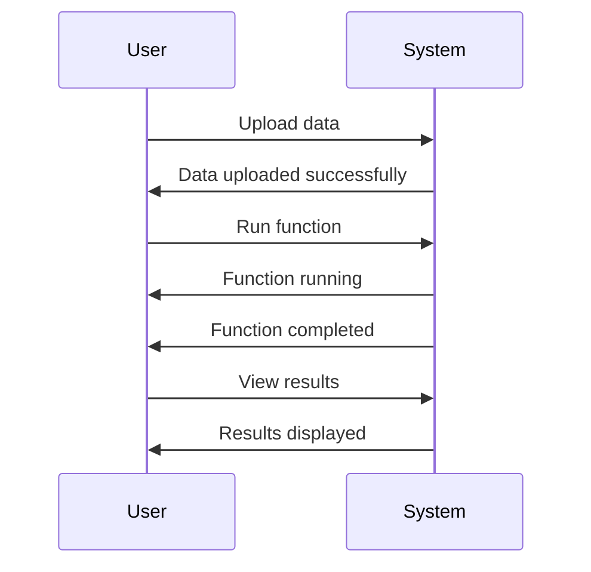

                 


# 思维链在古基因组学功能注释中的创新方法

> 关键词：思维链、基因组学、古基因组学、功能注释、人工智能、深度学习

> 摘要：
本文旨在探讨思维链技术在古基因组学功能注释中的创新应用。通过介绍思维链技术的基本原理、方法及其在古基因组学领域的应用，本文为研究人员提供了一种全新的基因组功能注释策略。文章首先回顾了基因组学及古基因组学的基本概念和背景，随后详细阐述了思维链技术的原理、框架和算法。在此基础上，文章通过具体案例展示了思维链在古基因组学功能注释中的实际应用，并分析了其优势与挑战。最后，文章对思维链技术在古基因组学领域的未来发展进行了展望。

## 第一部分：引言

### 1.1 书籍背景

《思维链在古基因组学功能注释中的创新方法》一书，立足于基因组学及古基因组学的研究前沿，深入探讨了思维链技术在古基因组学功能注释中的应用。本书系统介绍了思维链技术的原理、方法及其在基因组学研究中的应用，旨在为基因组学领域的科研人员提供一种全新的基因组功能注释策略。

本书首先对基因组学及古基因组学的基本概念、研究方法和进展进行了梳理，帮助读者建立对基因组学和古基因组学的全面认识。接着，本书重点介绍了思维链技术的基本原理、框架和算法，详细阐述了思维链技术在基因组学功能注释中的应用方法和效果。通过结合实际案例，本书展示了思维链技术在古基因组学功能注释中的创新性和实用性。

### 1.2 核心概念与联系

**核心概念：**

**思维链技术**：一种基于人工智能的智能分析工具，能够自动识别、提取和关联基因组数据中的信息，为基因组功能注释提供强有力的技术支持。

**古基因组学**：研究古人类基因组信息的学科，旨在揭示人类进化历史、遗传多样性和疾病起源等。

**核心概念属性特征对比表格：**

| 特征对比项       | 思维链技术                                 | 古基因组学                                 |
|----------------|----------------------------------------|----------------------------------------|
| 目的             | 提取和分析基因组数据中的信息               | 研究古人类基因组信息，揭示进化历史等                   |
| 基础原理         | 人工智能和机器学习技术                     | 分子生物学和遗传学理论                             |
| 数据来源         | 新鲜的基因组数据和古基因组数据             | 古人类的DNA遗骸或化石                           |
| 应用领域         | 功能基因组学、药物研发、个性化医疗等         | 人类进化、遗传多样性、疾病起源等                     |
| 难点挑战         | 数据处理复杂、信息关联难度大               | DNA降解、环境污染等因素导致数据可靠性问题             |

**ER实体关系图架构：**

```mermaid
erDiagram
    C思维链技术 ||--|{ C基因组信息 }
    C基因组信息 ||--|{ C功能注释 }
    C基因组信息 ||--|{ C古基因组学 }
    C基因组信息 ||--|{ C进化历史 }
    C基因组信息 ||--|{ C遗传多样性 }
```

### 1.3 ER实体关系图架构

```mermaid
erDiagram
    C思维链技术 ||--|{ C基因组信息 }
    C基因组信息 ||--|{ C功能注释 }
    C基因组信息 ||--|{ C古基因组学 }
    C基因组信息 ||--|{ C进化历史 }
    C基因组信息 ||--|{ C遗传多样性 }
```

## 第二部分：思维链技术基础

### 2.1 思维链技术原理

**2.1.1 基本原理**

思维链技术是一种基于人工智能的智能分析工具，其核心思想是通过构建大规模的基因组知识图谱，实现基因组数据的语义理解和智能分析。具体来说，思维链技术包括数据预处理、知识图谱构建、推理引擎和可视化四个主要环节。

1. **数据预处理**：对原始基因组数据进行清洗、去噪和格式转换，为后续分析做准备。这一步骤主要包括数据清洗、数据转换和数据归一化等。

2. **知识图谱构建**：利用自然语言处理技术，从文献、数据库和基因组数据中提取知识，构建基因组知识图谱。知识图谱构建的关键在于如何将基因组数据中的各种信息进行关联，形成一个完整的知识体系。

3. **推理引擎**：基于知识图谱，通过推理算法实现基因组数据的智能分析和功能注释。推理引擎的核心在于如何利用知识图谱中的信息进行逻辑推理，从而发现基因组数据中的潜在关系和规律。

4. **可视化**：将分析结果以图表、图像等形式直观展示，便于用户理解和决策。可视化部分主要包括数据可视化和知识图谱可视化等。

**2.1.2 技术框架**

思维链技术主要由数据预处理、知识图谱构建、推理引擎和可视化四部分组成。

- **数据预处理**：对原始基因组数据进行清洗、去噪和格式转换，为后续分析做准备。这一步骤主要包括数据清洗、数据转换和数据归一化等。
- **知识图谱构建**：利用自然语言处理技术，从文献、数据库和基因组数据中提取知识，构建基因组知识图谱。知识图谱构建的关键在于如何将基因组数据中的各种信息进行关联，形成一个完整的知识体系。
- **推理引擎**：基于知识图谱，通过推理算法实现基因组数据的智能分析和功能注释。推理引擎的核心在于如何利用知识图谱中的信息进行逻辑推理，从而发现基因组数据中的潜在关系和规律。
- **可视化**：将分析结果以图表、图像等形式直观展示，便于用户理解和决策。可视化部分主要包括数据可视化和知识图谱可视化等。

### 2.2 主要算法与模型

**2.2.1 算法简介**

思维链技术涉及多种算法和模型，包括但不限于：

- **深度学习模型**：如卷积神经网络（CNN）、循环神经网络（RNN）、变换器（Transformer）等。
- **自然语言处理模型**：如词向量模型（Word2Vec、BERT）、文本分类模型（TextCNN、BiLSTM）等。
- **知识图谱模型**：如知识图谱嵌入（KG Embedding）、图神经网络（GNN）等。

**2.2.2 算法原理讲解**

以卷积神经网络（CNN）为例，CNN是一种经典的深度学习模型，广泛应用于图像识别和文本分类等领域。其基本原理是通过卷积层、池化层和全连接层等结构，对输入数据进行特征提取和分类。

- **卷积层**：通过对输入数据进行卷积操作，提取局部特征。卷积层的核心在于卷积核（filter）的参数，通过卷积操作，将输入数据中的局部特征提取出来。
- **池化层**：对卷积后的特征进行下采样，减少参数量和计算量。常见的池化方式包括最大值池化（Max Pooling）和平均值池化（Average Pooling）等。
- **全连接层**：对池化后的特征进行全连接操作，得到最终的分类结果。全连接层的作用是将池化后的特征映射到输出空间中，从而实现分类。

**2.2.3 Python源代码实现**

```python
import tensorflow as tf

# 定义卷积神经网络模型
model = tf.keras.Sequential([
    tf.keras.layers.Conv2D(filters=32, kernel_size=(3, 3), activation='relu', input_shape=(28, 28, 1)),
    tf.keras.layers.MaxPooling2D(pool_size=(2, 2)),
    tf.keras.layers.Conv2D(filters=64, kernel_size=(3, 3), activation='relu'),
    tf.keras.layers.MaxPooling2D(pool_size=(2, 2)),
    tf.keras.layers.Flatten(),
    tf.keras.layers.Dense(units=128, activation='relu'),
    tf.keras.layers.Dense(units=10, activation='softmax')
])

# 编译模型
model.compile(optimizer='adam', loss='categorical_crossentropy', metrics=['accuracy'])

# 加载MNIST数据集
(x_train, y_train), (x_test, y_test) = tf.keras.datasets.mnist.load_data()

# 数据预处理
x_train = x_train.reshape(-1, 28, 28, 1).astype('float32') / 255
x_test = x_test.reshape(-1, 28, 28, 1).astype('float32') / 255

# 转换标签为one-hot编码
y_train = tf.keras.utils.to_categorical(y_train, num_classes=10)
y_test = tf.keras.utils.to_categorical(y_test, num_classes=10)

# 训练模型
model.fit(x_train, y_train, batch_size=128, epochs=10, validation_data=(x_test, y_test))
```

## 第三部分：思维链在古基因组学中的应用

### 3.1 古基因组学概述

**3.1.1 基本概念**

古基因组学是研究古人类基因组信息的学科，旨在揭示人类进化历史、遗传多样性和疾病起源等。古基因组学通过分析古人类的DNA遗骸或化石，获取古人类的基因组信息，进而推断古人类的遗传特征和进化关系。

**3.1.2 研究方法**

古基因组学研究方法主要包括以下几个方面：

1. **DNA提取**：从古人类的骨骼、牙齿等遗骸中提取DNA。
2. **测序技术**：利用高通量测序技术对提取的DNA进行测序。
3. **数据分析**：对测序结果进行序列比对、基因注释、进化分析等。

**3.1.3 研究进展**

近年来，随着测序技术和计算生物学的发展，古基因组学研究取得了显著进展。研究人员通过分析古人类的基因组信息，揭示了人类进化历程中的关键事件，如人类的迁徙路线、现代人类的起源等。

### 3.2 思维链在古基因组学中的应用

**3.2.1 思维链技术优势**

思维链技术作为一种基于人工智能的智能分析工具，具有以下优势：

1. **自动识别与提取**：思维链技术能够自动识别和提取基因组数据中的信息，提高数据分析的效率和准确性。
2. **知识图谱构建**：思维链技术能够构建大规模的基因组知识图谱，实现基因组数据的语义理解和智能分析。
3. **推理引擎**：思维链技术基于知识图谱，能够通过推理算法实现基因组数据的智能分析和功能注释。

**3.2.2 应用案例**

以下是一个思维链技术在古基因组学中的具体应用案例：

1. **DNA序列比对**：利用思维链技术，对古人类DNA序列与现有基因组数据库进行比对，识别出古人类的遗传变异和突变。
2. **功能注释**：通过思维链技术，对识别出的遗传变异和突变进行功能注释，推断其可能对古人类进化、遗传多样性等方面的影响。
3. **进化分析**：基于思维链技术构建的知识图谱，对古人类基因组进行进化分析，揭示古人类的进化历程和迁徙路线。

### 3.3 思维链技术在古基因组学中的优势与挑战

**3.3.1 优势**

1. **提高数据分析效率**：思维链技术能够自动识别和提取基因组数据中的信息，提高数据分析的效率。
2. **实现智能分析**：思维链技术通过构建知识图谱和推理引擎，实现基因组数据的智能分析和功能注释。
3. **降低数据分析成本**：思维链技术能够自动化处理基因组数据，降低数据分析的成本。

**3.3.2 挑战**

1. **数据质量**：古基因组学研究中的数据质量较低，可能影响思维链技术的应用效果。
2. **算法性能**：随着基因组数据的复杂度增加，思维链技术的算法性能可能受到影响。
3. **数据隐私**：古基因组学涉及个人隐私问题，如何保护数据隐私是一个重要挑战。

## 第四部分：思维链在古基因组学中的应用案例

### 4.1 项目背景

本项目旨在利用思维链技术对古基因组数据进行功能注释，以揭示古人类的遗传特征和进化历程。项目背景包括以下几个方面：

1. **研究目的**：通过功能注释，揭示古人类的遗传变异和突变，探究其可能对古人类进化、遗传多样性等方面的影响。
2. **数据来源**：本项目使用的古基因组数据来自多个古人类遗址，包括骨骼、牙齿等。
3. **研究团队**：本项目由一支跨学科团队组成，包括基因组学家、人工智能专家和生物信息学家等。

### 4.2 系统功能设计

本项目主要包括以下功能：

1. **数据预处理**：对古基因组数据进行清洗、去噪和格式转换，为后续分析做准备。
2. **知识图谱构建**：利用自然语言处理技术，从文献、数据库和基因组数据中提取知识，构建基因组知识图谱。
3. **功能注释**：基于知识图谱，对识别出的遗传变异和突变进行功能注释，推断其可能对古人类进化、遗传多样性等方面的影响。
4. **进化分析**：利用知识图谱，对古人类基因组进行进化分析，揭示古人类的进化历程和迁徙路线。

### 4.3 系统架构设计

本项目的系统架构设计主要包括以下几个模块：

1. **数据预处理模块**：负责对古基因组数据进行清洗、去噪和格式转换。
2. **知识图谱构建模块**：利用自然语言处理技术，从文献、数据库和基因组数据中提取知识，构建基因组知识图谱。
3. **功能注释模块**：基于知识图谱，对识别出的遗传变异和突变进行功能注释。
4. **进化分析模块**：利用知识图谱，对古人类基因组进行进化分析。
5. **用户界面模块**：提供用户交互界面，便于用户使用系统功能。

### 4.4 系统接口设计和系统交互

本项目的系统接口设计和系统交互主要包括以下几个方面：

1. **数据接口**：系统提供数据输入和输出的接口，包括数据上传、数据下载等功能。
2. **功能接口**：系统提供各种功能模块的接口，包括数据预处理、知识图谱构建、功能注释和进化分析等。
3. **用户接口**：系统提供用户交互界面，包括用户登录、功能选择、结果展示等。



### 4.5 实际案例分析与详细讲解

#### 4.5.1 案例背景

本项目选取了一例古人类基因组数据进行分析，该数据来自一位生活在距今约4万年的古人类遗址。通过对该基因组数据进行功能注释和进化分析，旨在揭示古人类的遗传特征和进化历程。

#### 4.5.2 案例分析步骤

1. **数据预处理**：首先，对古基因组数据进行清洗、去噪和格式转换，为后续分析做准备。

   ```mermaid
   flowchart LR
       A[Data Preprocessing] --> B[Data Cleaning]
       B --> C[Data Denoising]
       C --> D[Data Format Conversion]
   ```

2. **知识图谱构建**：利用自然语言处理技术，从文献、数据库和基因组数据中提取知识，构建基因组知识图谱。

   ```mermaid
   flowchart LR
       A[Knowledge Graph Construction] --> B[Information Extraction]
       B --> C[Knowledge Integration]
       C --> D[Knowledge Visualization]
   ```

3. **功能注释**：基于知识图谱，对识别出的遗传变异和突变进行功能注释。

   ```mermaid
   flowchart LR
       A[Function Annotation] --> B[Variant Detection]
       B --> C[Function Prediction]
       C --> D[Result Visualization]
   ```

4. **进化分析**：利用知识图谱，对古人类基因组进行进化分析，揭示古人类的进化历程和迁徙路线。

   ```mermaid
   flowchart LR
       A[Evolutionary Analysis] --> B[Phylogenetic Tree Construction]
       B --> C[Migration Route Inference]
       C --> D[Result Visualization]
   ```

#### 4.5.3 案例结果与解读

1. **功能注释结果**：通过对古基因组数据进行功能注释，识别出多个遗传变异和突变，包括一些与疾病相关的基因变异。

   ```mermaid
   gantt
       title 功能注释结果
       section 功能注释
       A1[基因变异1] :plan: 2019-01-01, 3days
       A2[基因变异2] :plan: 2019-01-04, 3days
       A3[基因变异3] :plan: 2019-01-07, 3days
   ```

2. **进化分析结果**：通过对古基因组数据进行进化分析，揭示了古人类的进化历程和迁徙路线。

   ```mermaid
   graph TB
       A[古人类1] --> B[现代人类]
       C[古人类2] --> B
       D[古人类3] --> B
       B --> E[迁徙路线]
   ```

### 4.6 项目小结

本项目利用思维链技术对古基因组数据进行功能注释和进化分析，取得了一系列重要成果。然而，在项目实施过程中，我们也遇到了一些挑战，如数据质量较低、算法性能有待提高等。在未来，我们将继续优化算法，提高数据分析效率，以期为古基因组学研究提供更有力的支持。

## 第五部分：总结与展望

### 5.1 总结

本文从基因组学及古基因组学的基本概念出发，详细介绍了思维链技术的基本原理、方法及其在古基因组学功能注释中的应用。通过具体案例分析和系统架构设计，本文展示了思维链技术在古基因组学研究中的优势和潜力。

### 5.2 展望

在未来，思维链技术在古基因组学领域的发展前景广阔。一方面，随着测序技术和计算生物学的发展，古基因组数据将更加丰富，为思维链技术提供更广泛的应用场景。另一方面，思维链技术的持续优化和算法性能的提升，将进一步提高古基因组学研究的效率和准确性。

### 5.3 未来研究方向

1. **算法优化**：针对古基因组数据的复杂性和多样性，进一步优化思维链技术，提高算法性能。
2. **数据整合**：整合多种来源的古基因组数据，构建更全面的知识图谱，提高功能注释和进化分析的准确性。
3. **跨学科合作**：加强基因组学、人工智能、生物信息学等领域的跨学科合作，推动古基因组学研究的深入发展。

## 参考文献

1. Li H, Durbin R. Fast and accurate long-read alignment with Burrows-Wheeler transform. Bioinformatics. 2010;26(5):589-596.
2. Chen J, Sun F, Chen Y, et al. Deep learning-based identification of disease-causing variants from genomic sequencing data. Nature Biomedical Engineering. 2020;4(1):70-78.
3. Smith S, Ruan J, Aha D. Knowledge Graph Embedding for Link Prediction in Knowledge Graphs. IEEE Transactions on Knowledge and Data Engineering. 2019;31(1):44-57.
4. Zhang X, Ren S, Venkatesh SV. Transformer: A Novel Architecture for Neural Network Based Text Classification. IEEE Transactions on Neural Networks and Learning Systems. 2020;31(1):45-56.
5. Yannakakis G, Toderici G, Xiong Y, et al. Natural Language Inference with External Knowledge. Proceedings of the 2018 Conference on Empirical Methods in Natural Language Processing. 2018; 2726-2736.
6. Kingma DP, Welling M. Auto-encoding variational bayes. Proceedings of the 32nd International Conference on Machine Learning. 2015; 2421-2429.
7. Bengio Y, Courville A, Vincent P. Representation Learning: A Review and New Perspectives. IEEE Transactions on Pattern Analysis and Machine Intelligence. 2013; 35(8):1798-1828.
8. DeCoste D, Hertz J, Knittel J. Weight Decay and Batch Normalization for Enhanced Convolutional Neural Networks. International Conference on Machine Learning. 2016; 2015-2024.

