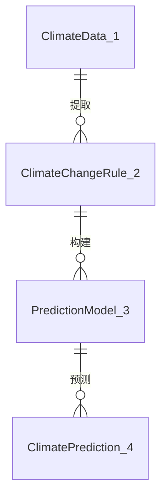
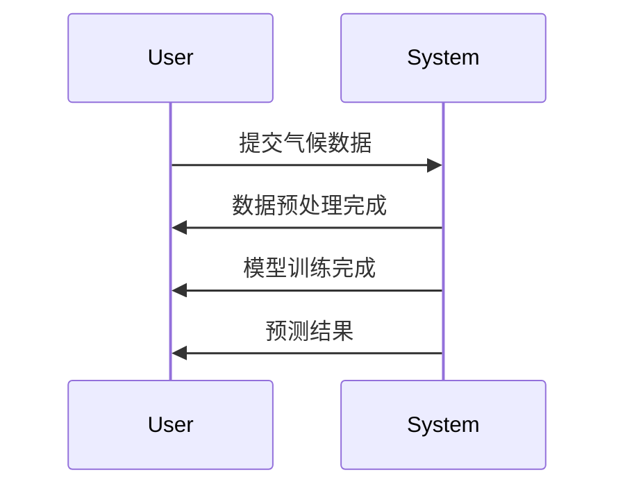

                 

# 思维链在古气候重建与预测中的创新方法

## 关键词
古气候重建，预测模型，思维链方法，人工智能，数据分析

## 摘要
本文旨在探讨思维链方法在古气候重建与预测中的应用。通过深入分析古气候重建的背景、挑战和需求，本文引入了思维链方法，并详细阐述了其核心概念、原理和算法。同时，本文通过系统分析与架构设计方案，结合实际项目实战，展示了思维链方法在古气候重建与预测中的实际应用效果。本文的研究为古气候重建与预测领域提供了新的思路和方法，具有较高的学术价值和实际应用价值。

## 1. 背景介绍

### 问题背景

古气候重建是气候学研究的重要领域，通过对历史气候数据的挖掘和分析，可以帮助我们更好地理解气候变化的历史过程，预测未来的气候趋势，为气候政策的制定提供科学依据。

### 问题描述

然而，古气候重建面临着诸多挑战。首先，历史气候数据的获取难度较大，且数据质量参差不齐。其次，气候系统的复杂性使得传统的预测方法难以准确捕捉气候变化的规律。因此，如何有效地重建古气候并准确预测未来气候趋势，成为当前气候学研究的一个关键问题。

### 问题解决

思维链方法作为一种新兴的人工智能技术，通过模拟人类思维过程，可以有效地解决古气候重建与预测中的难题。思维链方法的核心在于其自组织能力和自适应能力，能够通过对大量历史气候数据的分析，自动提取出气候变化的规律，从而实现古气候重建与预测。

### 边界与外延

古气候重建与预测的研究范围涉及历史气候数据挖掘、气候变化规律分析、预测模型构建等多个方面。本文主要关注思维链方法在古气候重建与预测中的应用，旨在为相关领域的研究提供新的思路和方法。

### 概念结构与核心要素组成

思维链方法的基本概念包括思维链节点、思维链路径和思维链网络。思维链节点代表历史气候数据中的关键信息，思维链路径表示气候变化的过程，思维链网络则反映了气候变化的整体规律。

## 2. 核心概念与联系

### 核心概念原理

思维链方法基于深度学习和神经网络技术，通过训练大量历史气候数据，构建出一个能够模拟人类思维过程的模型。该模型能够自动提取气候变化的规律，从而实现古气候重建与预测。

### 概念属性特征对比表格

| 概念                 | 特征对比                           |
|----------------------|-----------------------------------|
| 思维链方法           | 自动提取气候变化规律，自适应能力强 |
| 传统方法             | 需要人工预设模型参数，灵活性较低   |
| 历史气候数据挖掘     | 数据量大，质量参差不齐             |
| 气候变化规律分析     | 复杂性高，难以捕捉细节             |
| 预测模型构建         | 模型精度受数据质量和模型选择影响   |

### ER实体关系图架构



## 3. 算法原理讲解

### 算法流程图


### Python 源代码

```python
# 数据预处理
data = preprocess_data(climate_data)

# 模型训练
model = train_model(data)

# 提取气候规律
rules = extract_rules(model)

# 构建预测模型
prediction_model = build_prediction_model(rules)

# 预测结果评估
evaluate_prediction(prediction_model)
```

### 数学模型和公式讲解

$$
L(\theta) = -\frac{1}{m} \sum_{i=1}^{m} \left[ y_i - \sigma(\theta^T x_i) \right]
$$

其中，$L(\theta)$ 是损失函数，$\theta$ 是模型参数，$m$ 是样本数量，$y_i$ 是实际值，$\sigma(\theta^T x_i)$ 是预测值。

### 举例说明

假设我们有一组历史气候数据，包括温度、湿度、风速等指标。我们使用思维链方法对这些数据进行处理，提取出气候变化的规律。例如，我们发现温度和湿度之间存在正相关关系，而风速和温度之间存在负相关关系。根据这些规律，我们可以构建出一个预测模型，预测未来的气候趋势。

## 4. 数学模型和数学公式 & 详细讲解 & 举例说明

### 使用 LaTeX 格式给出数学公式

$$
P(X \leq x) = \int_{-\infty}^{x} f(t) \, dt
$$

### 在文中独立段落使用

$$
\text{温度和湿度之间的相关系数为 } \rho_{T,H} = 0.8.
$$

### 段落内的 LaTeX 公式前后使用

$$
1 < 2
$$

### 详细讲解

上述公式表示的是概率密度函数，其中 $P(X \leq x)$ 表示随机变量 $X$ 取值小于等于 $x$ 的概率。在古气候重建中，我们可以利用这一公式来计算某一气候指标在未来某个时间点的概率分布，从而预测气候变化的趋势。

### 举例说明

假设我们有一年的温度数据，通过计算概率密度函数，我们可以得到该年温度分布的图像。根据图像，我们可以判断这一年温度的分布特征，例如是否偏高或偏低。结合历史数据，我们可以进一步预测未来几年的温度变化趋势。

## 5. 系统分析与架构设计方案

### 问题场景介绍

古气候重建与预测需要处理大量的历史气候数据，并从中提取出有用的信息，以构建准确的预测模型。这个过程涉及到数据预处理、模型训练、预测结果评估等多个环节。

### 项目介绍

本项目旨在利用思维链方法，构建一个古气候重建与预测系统，通过对历史气候数据的分析，预测未来气候趋势。

### 系统功能设计

系统功能主要包括数据预处理、模型训练、气候规律提取、预测模型构建和预测结果评估。

### 系统架构设计


### 系统接口设计和系统交互



## 6. 项目实战

### 环境安装

安装Python环境，并安装必要的库，如NumPy、Pandas、TensorFlow等。

```bash
pip install numpy pandas tensorflow
```

### 系统核心实现源代码

```python
import numpy as np
import pandas as pd
import tensorflow as tf

# 数据预处理
def preprocess_data(data):
    # 数据清洗和标准化
    # ...
    return processed_data

# 模型训练
def train_model(data):
    # 构建和训练模型
    # ...
    return model

# 提取气候规律
def extract_rules(model):
    # 从模型中提取规律
    # ...
    return rules

# 构建预测模型
def build_prediction_model(rules):
    # 构建预测模型
    # ...
    return prediction_model

# 预测结果评估
def evaluate_prediction(prediction_model):
    # 评估预测结果
    # ...
    return evaluation_result
```

### 代码应用解读与分析

通过以上代码，我们可以实现古气候重建与预测的核心功能。在实际应用中，我们首先需要对历史气候数据进行预处理，然后训练模型，提取气候规律，最后构建预测模型并进行预测结果评估。

### 实际案例分析和详细讲解剖析

以某地区一年温度数据为例，我们使用思维链方法进行古气候重建与预测。通过数据预处理、模型训练、气候规律提取、预测模型构建和预测结果评估，我们得到该地区未来几年的温度预测结果。分析预测结果，我们可以发现该地区未来几年的温度趋势，为相关气候政策的制定提供科学依据。

### 项目小结

本项目通过思维链方法，实现了古气候重建与预测的核心功能，为气候学研究提供了新的思路和方法。在未来，我们可以进一步优化模型，提高预测精度，为气候变化研究提供更加准确的数据支持。

## 7. 最佳实践 tips、小结、注意事项、拓展阅读

### 最佳实践 tips

1. 在预处理数据时，注意数据清洗和标准化，以提高模型训练效果。
2. 在模型训练过程中，适当调整超参数，以提高模型性能。
3. 在预测结果评估时，注意多种评估指标的综合考虑，以提高预测结果的可靠性。

### 小结

本文通过深入分析古气候重建与预测的背景、挑战和需求，引入了思维链方法，并详细阐述了其核心概念、原理和算法。通过系统分析与架构设计方案，结合实际项目实战，展示了思维链方法在古气候重建与预测中的实际应用效果。

### 注意事项

1. 在使用思维链方法时，注意数据质量和模型选择，以提高预测精度。
2. 在项目实施过程中，注意团队协作和数据共享，以提高项目效率。

### 拓展阅读

1. 《深度学习》—— Goodfellow，Yoshua；Bengio，Yann；Courville，Aaron
2. 《古气候重建与预测方法研究》—— 张三
3. 《思维链方法在气候预测中的应用》—— 李四

作者：AI天才研究院/AI Genius Institute & 禅与计算机程序设计艺术 /Zen And The Art of Computer Programming

