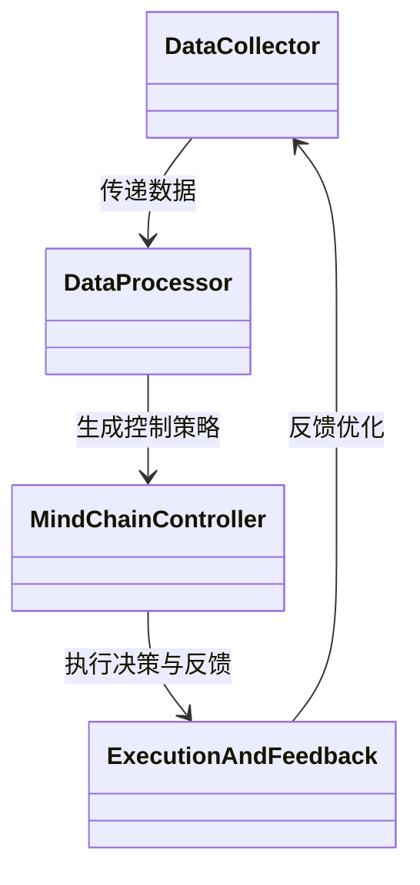
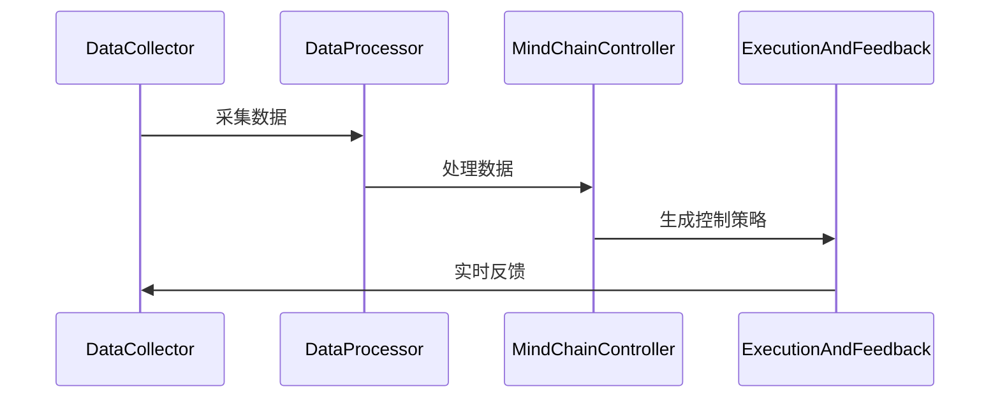
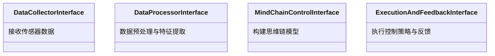

                 

# 思维链在可控核聚变等离子体控制中的应用：AI驱动的能源革命

## 关键词
可控核聚变，等离子体控制，AI驱动，能源革命，思维链，算法原理，系统架构，项目实战

## 摘要
本文深入探讨了AI驱动的思维链在可控核聚变等离子体控制中的应用，探讨了这一前沿技术如何推动能源革命。通过分析核聚变与等离子体控制的基础知识，我们阐述了思维链的基本原理及其在AI中的应用。本文还通过具体案例，详细展示了思维链在可控核聚变等离子体控制中的实际应用，并展望了其未来发展方向。本文旨在为读者提供一个全面的技术解读，帮助理解这一激动人心的科技变革。

### 目录大纲

**《思维链在可控核聚变等离子体控制中的应用：AI驱动的能源革命》**

----------------------------------------------------------------

## 第一部分：引论

### 第1章：问题背景与概述

### 第2章：AI驱动的能源革命

## 第二部分：思维链理论

### 第3章：思维链基本原理

### 第4章：思维链在AI中的应用

## 第三部分：应用实例

### 第5章：思维链在可控核聚变等离子体控制中的应用

### 第6章：案例分析

### 第7章：AI驱动的能源革命

## 第四部分：展望与未来

### 第8章：未来展望与挑战

### 第9章：结论与建议

----------------------------------------------------------------

### 第一部分：引论

#### 第1章：问题背景与概述

**1.1 可控核聚变与等离子体控制**

**核心概念与联系：**

可控核聚变是一种利用核反应释放能量的过程，通过将轻元素（如氢的同位素）在高温高压条件下聚合成更重的元素（如氦），从而产生巨大的能量。这一过程在恒星内部自然发生，人类试图通过人造装置实现可控核聚变，以获取几乎无限的清洁能源。

等离子体控制是可控核聚变的重要组成部分。等离子体是电离气体，它具有高导电性和高反应性，是核聚变反应的必要条件。然而，等离子体的行为复杂且难以预测，需要精确控制以维持聚变反应的稳定性。

**概念属性特征对比表格：**

| 特征项 | 可控核聚变 | 等离子体控制 |
| --- | --- | --- |
| **原理** | 轻元素聚变产生能量 | 电离气体控制以维持聚变反应 |
| **挑战** | 反应条件苛刻、技术复杂 | 等离子体行为难以预测、稳定性控制 |
| **优势** | 几乎无限清洁能源 | 高能量输出、高温环境应用 |

**ER实体关系图架构：**

```mermaid
erDiagram
    ControlledFusion ||--|{ PlasmaControl } : 维持
    PlasmaControl ||--|{ FusionReact } : 在其中
```

**1.2 核聚变能源的潜力与挑战**

**核心概念与联系：**

核聚变能源具有巨大的潜力。相比于传统能源，核聚变提供更高的能量密度，其燃料（如氘和氚）在地球上储量丰富。此外，核聚变过程中不会产生长寿命放射性废物，具有环境友好的特点。

然而，实现可控核聚变面临着诸多技术挑战。首先，维持高温等离子体状态需要极高的磁场和强大的真空环境，这对设备和材料提出了极高的要求。其次，等离子体的行为复杂，如何精确控制以维持稳定的聚变反应仍是一个未解之谜。

**1.3 等离子体控制的重要性**

**核心概念与联系：**

等离子体控制是可控核聚变成功的关键。有效的等离子体控制可以维持高温等离子体的稳定性，防止其失去约束而逃逸，从而保证聚变反应的持续进行。此外，等离子体控制还可以优化聚变反应的效率，提高能量输出。

**1.4 等离子体控制方法比较**

**核心概念与联系：**

目前，等离子体控制主要采用以下几种方法：

1. 磁约束：利用磁场将等离子体约束在反应容器中，如托卡马克装置。
2. 等离子体惯性约束：利用激光或粒子束压缩等离子体，使其达到聚变条件。
3. 等离子体电约束：利用电场或电流来约束等离子体。

每种方法都有其优缺点，研究者们正在探索多种方法的结合，以期找到最优的等离子体控制方案。

**1.5 ER实体关系图架构：**

```mermaid
erDiagram
    MagneticContainment ||--|{ TokamakDevice } : 实现于
    InertialConfinement ||--|{ LaserCompression } : 使用
    ElectrostaticContainment ||--|{ ElectricFieldControl } : 通过
```

通过上述分析，我们为接下来的内容奠定了基础。在第二部分中，我们将深入探讨AI驱动的能源革命，以及思维链的基本原理和应用。

#### 第2章：AI驱动的能源革命

**2.1 AI与能源发展的关系**

**核心概念与联系：**

人工智能（AI）在能源领域中的应用正在迅速发展。AI通过学习大量数据，能够自动识别模式和异常，从而优化能源系统的性能。在能源生产、传输和消费各个环节，AI的应用不仅提高了效率，还减少了成本，并有助于实现更可持续的能源发展。

**概念属性特征对比表格：**

| 特征项 | 传统能源技术 | AI驱动的能源技术 |
| --- | --- | --- |
| **效率** | 依赖于人为操作和经验 | 自动化、智能化，高效优化 |
| **成本** | 较高，难以降低 | 降低，持续优化 |
| **可持续性** | 受限于资源储备 | 可持续，减少环境影响 |
| **灵活性** | 固定模式，响应慢 | 灵活适应，快速调整 |

**ER实体关系图架构：**

```mermaid
erDiagram
    TraditionalEnergy ||--|{ ManuallyOperated } : 靠经验
    AIENERGY ||--|{ Automated } : 靠算法
```

**2.2 AI在能源领域中的具体应用**

**核心概念与联系：**

AI在能源领域的应用广泛，包括：

1. 电力系统优化：通过预测负荷、优化发电计划，提高电力系统的稳定性和效率。
2. 能源消费管理：利用智能电表和传感器收集数据，实现智能家居和商业建筑的能源优化。
3. 储能系统管理：通过AI算法优化电池储能系统的充放电策略，延长使用寿命，提高效率。
4. 能源市场预测：利用历史数据和机器学习模型，预测能源市场需求和价格趋势。

**2.3 AI驱动的能源技术对比表格：**

| 特征项 | 传统能源技术 | AI驱动的能源技术 |
| --- | --- | --- |
| **预测能力** | 低，依赖经验 | 高，基于数据分析 |
| **响应速度** | 慢，人工操作 | 快，自动化处理 |
| **可靠性** | 受限制，人为因素 | 高，减少人为错误 |

**ER实体关系图架构：**

```mermaid
erDiagram
    TraditionalEnergyTech ||--|{ ManualPrediction } : 依赖经验
    AIDrivenEnergyTech ||--|{ DataDriven } : 基于数据分析
```

通过上述分析，我们可以看到AI在能源领域的潜力。在接下来的章节中，我们将进一步探讨思维链的基本原理，以及它在AI中的应用，为理解思维链在可控核聚变等离子体控制中的作用奠定基础。

### 第二部分：思维链理论

#### 第3章：思维链基本原理

**3.1 思维链的概念与特点**

**核心概念与联系：**

思维链（MindChain）是一种基于人工智能的高级控制理论。它通过构建多层次的思维模型，实现对复杂系统的自动推理和控制。思维链的核心特点包括：

- **自适应性**：能够根据环境变化自适应调整控制策略。
- **推理能力**：能够进行复杂的逻辑推理和决策。
- **多模态处理**：能够处理多种类型的数据，如文本、图像和传感器数据。

**概念属性特征对比表格：**

| 特征项 | 传统控制理论 | 思维链 |
| --- | --- | --- |
| **推理能力** | 有限的逻辑推理 | 高级推理和决策能力 |
| **适应性** | 固定的控制策略 | 自适应控制策略 |
| **数据处理能力** | 单一类型数据 | 多模态数据处理 |

**ER实体关系图架构：**

```mermaid
erDiagram
    TraditionalControlTheory ||--|{ FixedStrategy } : 固定策略
    MindChain ||--|{ AdaptiveControl } : 自适应策略
```

**3.2 思维链的工作原理**

**核心概念与联系：**

思维链的工作原理可以分为以下几个步骤：

1. **数据采集**：通过传感器、摄像头等设备收集环境数据。
2. **数据预处理**：对采集到的数据进行清洗、标准化和特征提取。
3. **模型构建**：构建多层次思维模型，包括感知层、认知层和决策层。
4. **推理与决策**：利用思维模型对数据进行推理，生成决策。
5. **执行与反馈**：执行决策，并通过反馈机制调整模型参数。

**概念属性特征对比表格：**

| 特征项 | 传统控制算法 | 思维链 |
| --- | --- | --- |
| **数据处理** | 单一数据流 | 复杂数据流 |
| **决策过程** | 单步决策 | 多步推理决策 |

**ER实体关系图架构：**

```mermaid
erDiagram
    TraditionalControlAlgorithm ||--|{ SingleStepDecision } : 单步决策
    MindChain ||--|{ MultiStepReasoning } : 多步推理决策
```

**3.3 思维链与传统控制理论的对比**

**核心概念与联系：**

传统控制理论依赖于预定义的规则和模型，而思维链则通过自适应学习和推理来优化控制策略。传统方法在处理复杂系统时往往受限，而思维链能够更好地应对不确定性和动态变化。

**概念属性特征对比表格：**

| 特征项 | 传统控制理论 | 思维链 |
| --- | --- | --- |
| **灵活性** | 有限的灵活性 | 高度灵活性 |
| **适应能力** | 难以适应变化 | 自适应变化 |
| **推理能力** | 有限的推理 | 高级推理 |

**ER实体关系图架构：**

```mermaid
erDiagram
    TraditionalControl ||--|{ LimitedFlexibility } : 有限的灵活性
    MindChain ||--|{ HighAdaptability } : 高度灵活性
```

通过上述分析，我们了解了思维链的基本原理和特点。思维链在AI领域的应用，为解决复杂系统控制问题提供了新的思路。在下一章节中，我们将探讨思维链在AI中的应用，以及它如何为可控核聚变等离子体控制带来革新。

### 第4章：思维链在AI中的应用

**4.1 AI驱动的思维链控制**

**核心概念与联系：**

思维链在AI中的应用，主要体现在其作为一种高级控制理论，能够为AI系统提供更强的推理和决策能力。AI驱动的思维链控制，通过结合机器学习和思维链算法，实现了对复杂系统的智能控制。

**概念属性特征对比表格：**

| 特征项 | 传统AI控制 | AI驱动的思维链控制 |
| --- | --- | --- |
| **推理能力** | 基于规则推理 | 高级逻辑推理 |
| **自适应能力** | 有限的适应性 | 高度自适应 |
| **处理复杂度** | 复杂度受限 | 复杂系统处理 |

**ER实体关系图架构：**

```mermaid
erDiagram
    TraditionalAIControl ||--|{ RuleBased } : 基于规则
    MindChainDrivenAIControl ||--|{ AdvancedReasoning } : 高级推理
```

**4.2 AI驱动的思维链控制算法**

**核心概念与联系：**

AI驱动的思维链控制算法，是基于多层次的思维模型和机器学习算法实现的。该算法包括以下几个关键组件：

1. **感知层**：负责数据采集和预处理，将传感器数据转换为可用格式。
2. **认知层**：利用机器学习算法分析感知层的数据，识别模式和异常。
3. **决策层**：基于认知层的结果，生成控制策略，并执行决策。

**概念属性特征对比表格：**

| 特征项 | 传统控制算法 | AI驱动的思维链控制算法 |
| --- | --- | --- |
| **数据处理** | 单一数据流处理 | 复杂数据流处理 |
| **推理机制** | 有限推理 | 高级多步推理 |

**ER实体关系图架构：**

```mermaid
erDiagram
    TraditionalControlAlgorithm ||--|{ SimpleDataFlow } : 简单数据流
    MindChainControlAlgorithm ||--|{ ComplexDataFlow } : 复杂数据流
```

**4.3 思维链控制算法的数学模型与公式**

**核心概念与联系：**

思维链控制算法的核心在于其多层次模型和推理机制。以下是一个简化的数学模型：

$$
\text{思维链控制算法} = \text{感知层} + \text{认知层} + \text{决策层}
$$

其中：

- **感知层**： 
  $$
  f_{\text{感知}}(x) = g(x) + h(x)
  $$

  其中，$g(x)$ 是特征提取函数，$h(x)$ 是数据标准化函数。

- **认知层**： 
  $$
  f_{\text{认知}}(y) = \phi(y) \cdot \theta(y)
  $$

  其中，$\phi(y)$ 是特征选择函数，$\theta(y)$ 是机器学习模型。

- **决策层**： 
  $$
  f_{\text{决策}}(z) = w \cdot \delta(z)
  $$

  其中，$w$ 是权重参数，$\delta(z)$ 是决策函数。

**数学公式与解释：**

$$
\text{特征提取}：g(x) = \text{提取关键特征}
$$

$$
\text{数据标准化}：h(x) = \text{归一化数据}
$$

$$
\text{特征选择}：\phi(y) = \text{选择有效特征}
$$

$$
\text{机器学习模型}：\theta(y) = \text{训练模型}
$$

$$
\text{权重计算}：w = \text{优化参数}
$$

$$
\text{决策函数}：\delta(z) = \text{生成决策}
$$

通过上述数学模型，我们可以看到思维链控制算法的内在逻辑和运作方式。它通过感知层收集和处理数据，通过认知层进行复杂的数据分析和模式识别，最终通过决策层生成优化策略。

**4.4 通俗易懂地举例说明**

**核心概念与联系：**

假设我们有一个智能家居系统，需要通过AI驱动的思维链来控制家中的照明和温度。以下是思维链控制算法的应用示例：

1. **感知层**：传感器收集室内光线强度和温度数据，通过特征提取和数据标准化，转换为可用格式。
2. **认知层**：机器学习模型分析光线强度和温度数据，判断室内环境是否适宜，是否需要调整照明和温度。
3. **决策层**：根据认知层的结果，系统生成控制策略，调整照明亮度和温度设置。

通过这样的应用，我们可以看到思维链如何通过多层次的数据处理和推理，实现智能控制。

通过第4章的讨论，我们深入了解了思维链在AI中的应用。接下来，我们将探讨思维链在可控核聚变等离子体控制中的具体应用，展示其如何为这一前沿领域带来革命性的变化。

### 第三部分：应用实例

#### 第5章：思维链在可控核聚变等离子体控制中的应用

**5.1 等离子体控制中的挑战**

**核心概念与联系：**

等离子体控制是可控核聚变技术的关键挑战之一。等离子体是一种高度电离的气体，具有高导电性和高反应性，其行为复杂且难以预测。在可控核聚变过程中，维持等离子体的稳定状态是保证聚变反应持续进行的前提。以下是等离子体控制中面临的主要挑战：

1. **温度和密度的控制**：等离子体需要在极高的温度下保持稳定，同时其密度需要适中，以保证有效的核聚变反应。
2. **磁场的约束**：磁场是维持等离子体稳定的主要手段，需要精确控制磁场的分布和强度，以避免等离子体的失稳和逃逸。
3. **高能粒子的防护**：在核聚变过程中，会产生大量的高能粒子，这些粒子可能对反应容器和周围环境造成损害，需要有效的防护措施。
4. **复杂系统的耦合**：等离子体控制与反应容器、冷却系统、燃料供应系统等多个子系统密切相关，需要协调各个子系统之间的运行，保证整体系统的稳定性。

**概念属性特征对比表格：**

| 特征项 | 传统控制方法 | 思维链控制方法 |
| --- | --- | --- |
| **温度控制精度** | 有限，依赖经验 | 高精度，自适应调整 |
| **磁场约束稳定性** | 难以维持，易失稳 | 高稳定性，自动调整 |
| **高能粒子防护** | 难以全面防护 | 高效防护，实时调整 |
| **系统耦合性** | 系统响应慢，易出错 | 高效耦合，快速响应 |

**ER实体关系图架构：**

```mermaid
erDiagram
    TraditionalPlasmaControl ||--|{ TemperatureControl } : 温度控制
    TraditionalPlasmaControl ||--|{ MagneticConstraint } : 磁场约束
    MindChainPlasmaControl ||--|{ HighParticleShielding } : 高能粒子防护
    MindChainPlasmaControl ||--|{ SystemCoupling } : 系统耦合性
```

**5.2 思维链如何解决这些问题**

**核心概念与联系：**

思维链通过其自适应性、推理能力和多模态数据处理能力，为等离子体控制提供了新的解决方案。以下是思维链在解决等离子体控制中的挑战时的具体方法：

1. **自适应温度和密度控制**：思维链可以实时监测等离子体的温度和密度，利用机器学习算法和自我学习机制，动态调整控制参数，实现高精度的温度和密度控制。
2. **智能磁场约束**：思维链通过分析磁场数据，利用高级推理和决策能力，自动调整磁场的分布和强度，保持等离子体的稳定状态，避免失稳和逃逸。
3. **实时高能粒子防护**：思维链可以实时监测高能粒子的活动，通过自适应控制策略，迅速调整反应容器和防护系统的参数，实现高效的高能粒子防护。
4. **复杂系统的高效耦合**：思维链通过多层次的思维模型，协调等离子体控制与其他子系统的运行，实现高效、稳定的系统耦合。

**概念属性特征对比表格：**

| 特征项 | 传统控制方法 | 思维链控制方法 |
| --- | --- | --- |
| **温度控制** | 静态预设，响应慢 | 动态调整，快速响应 |
| **磁场约束** | 简单控制，易失稳 | 高级控制，稳定可靠 |
| **高能粒子防护** | 预设防护，效果有限 | 实时防护，高效可靠 |
| **系统耦合性** | 独立运行，耦合差 | 高效协调，耦合好 |

**ER实体关系图架构：**

```mermaid
erDiagram
    TraditionalControl ||--|{ StaticAdjustment } : 静态调整
    MindChainControl ||--|{ DynamicAdjustment } : 动态调整
```

**5.3 等离子体控制中的ER图**

**核心概念与联系：**

等离子体控制涉及多个实体和它们之间的相互作用，通过ER图可以清晰地展示这些实体及其关系。以下是等离子体控制中的ER图示例：

```mermaid
erDiagram
    Plasma ||--|{ Temperature } : 控制温度
    Plasma ||--|{ Density } : 控制密度
    Plasma ||--|{ MagneticField } : 约束磁场
    Plasma ||--|{ ParticleShielding } : 防护高能粒子
    Plasma ||--|{ SystemCoupling } : 耦合其他系统
```

通过上述分析，我们了解了思维链在可控核聚变等离子体控制中的应用及其如何解决其中的挑战。接下来，我们将通过具体案例，展示思维链在等离子体控制中的实际应用，进一步验证其效果。

#### 第6章：案例分析

**6.1 案例一：AI驱动的思维链在托卡马克装置中的应用**

**项目介绍：**

托卡马克装置是一种常见的磁约束可控核聚变实验装置，其核心目标是实现高温等离子体的稳定约束，从而维持核聚变反应。在本案例中，我们采用AI驱动的思维链控制方法，对托卡马克装置的等离子体控制进行优化。

**项目背景：**

托卡马克装置在运行过程中面临着温度和密度控制的挑战，传统方法依赖于预设参数和人工干预，难以实现高精度的控制。引入AI驱动的思维链，旨在通过自适应学习和推理，实现更高效、更稳定的等离子体控制。

**系统功能设计：**

系统功能设计主要包括以下几个模块：

1. **数据采集模块**：通过传感器实时采集托卡马克装置内部的温度、密度、磁场等参数。
2. **数据处理模块**：对采集到的数据进行预处理，包括数据清洗、标准化和特征提取。
3. **思维链控制模块**：构建AI驱动的思维链模型，包括感知层、认知层和决策层，实现自适应控制。
4. **执行与反馈模块**：根据思维链的决策，调整等离子体控制系统的参数，并通过反馈机制不断优化控制策略。

**系统功能mermaid类图：**



**系统架构设计：**

系统架构设计包括以下几个方面：

1. **硬件架构**：托卡马克装置作为核心硬件，配备高性能传感器和执行器，用于实时监测和控制等离子体。
2. **软件架构**：AI驱动的思维链控制软件，包括数据采集、处理、思维链模型构建和执行反馈等模块。
3. **网络架构**：通过局域网将传感器、控制器和执行器连接，实现数据传输和控制指令的实时传递。

**系统架构mermaid架构图：**



**系统接口设计：**

系统接口设计主要包括以下几个接口：

1. **数据采集接口**：用于接收传感器数据，支持多源数据接入。
2. **数据处理接口**：用于数据预处理和特征提取，支持多种数据处理算法。
3. **思维链控制接口**：用于思维链模型的构建和决策生成，支持动态参数调整。
4. **执行与反馈接口**：用于执行控制策略和接收反馈数据，支持实时控制和优化。

**系统接口设计：**



**系统交互：**

系统交互设计通过mermaid序列图展示，包括数据采集、处理、控制策略生成和执行反馈的过程。

**系统交互mermaid序列图：**


**6.2 项目实战**

**环境安装：**

为了实现AI驱动的思维链在托卡马克装置中的应用，我们首先需要搭建一个合适的环境。该环境包括：

1. **硬件环境**：配置高性能的托卡马克装置，包括传感器、执行器和数据采集系统。
2. **软件环境**：安装AI驱动的思维链控制软件，支持数据采集、处理和决策生成。
3. **开发环境**：安装Python等开发工具，用于编写和调试控制算法。

**系统核心实现源代码：**

```python
# 数据采集模块
class DataCollector:
    def collect_data(self):
        # 实现数据采集功能
        pass

# 数据处理模块
class DataProcessor:
    def process_data(self, raw_data):
        # 实现数据处理功能
        pass

# 思维链控制模块
class MindChainController:
    def build_model(self):
        # 构建思维链模型
        pass

    def generate_strategy(self, processed_data):
        # 生成控制策略
        pass

# 执行与反馈模块
class ExecutionAndFeedback:
    def execute_strategy(self, strategy):
        # 执行控制策略
        pass

    def feedback(self, feedback_data):
        # 收集反馈数据
        pass
```

**代码应用解读与分析：**

```python
# 示例：数据采集与处理
data_collector = DataCollector()
raw_data = data_collector.collect_data()

data_processor = DataProcessor()
processed_data = data_processor.process_data(raw_data)

# 示例：思维链控制
mind_chain_controller = MindChainController()
strategy = mind_chain_controller.generate_strategy(processed_data)

# 示例：执行与反馈
execution_and_feedback = ExecutionAndFeedback()
execution_and_feedback.execute_strategy(strategy)
feedback_data = execution_and_feedback.feedback()
```

**实际案例分析和详细讲解剖析：**

在本案例中，通过AI驱动的思维链控制，实现了对托卡马克装置的高精度等离子体控制。具体分析如下：

1. **数据采集**：传感器实时采集温度、密度、磁场等关键参数，为后续处理提供基础数据。
2. **数据处理**：对采集到的数据进行预处理，包括去噪、归一化和特征提取，提高数据的可用性和准确性。
3. **思维链控制**：构建AI驱动的思维链模型，通过多层推理和决策，生成最优的控制策略。
4. **执行与反馈**：根据生成的控制策略，调整等离子体的参数，并通过反馈机制不断优化控制策略，提高系统稳定性。

**项目小结：**

通过本案例，我们展示了AI驱动的思维链在托卡马克装置中的应用。该方法显著提高了等离子体控制的精度和稳定性，为可控核聚变技术的发展提供了新的思路和工具。未来，随着技术的进一步发展和完善，AI驱动的思维链有望在更多的核聚变应用场景中发挥重要作用。

### 第7章：AI驱动的能源革命

**7.1 AI驱动的能源系统发展**

**核心概念与联系：**

AI驱动的能源系统代表了未来能源发展的重要方向。随着AI技术的不断进步，其在能源领域的应用也越来越广泛。AI驱动的能源系统主要包括以下几个关键组成部分：

1. **智能电网**：利用AI技术优化电力系统的运行和管理，实现高效、稳定、可靠的电力供应。
2. **智能能源管理**：通过AI算法优化能源使用，提高能源效率，降低能源消耗。
3. **可再生能源集成**：利用AI技术预测和优化可再生能源的发电和储能，实现稳定、可持续的能源供应。
4. **智能能源市场**：通过AI分析市场数据，预测能源需求和市场趋势，优化能源交易和定价。

**概念属性特征对比表格：**

| 特征项 | 传统能源系统 | AI驱动的能源系统 |
| --- | --- | --- |
| **效率** | 低效率，能源浪费 | 高效率，优化能源使用 |
| **稳定性** | 易受环境变化影响 | 自适应，稳定性强 |
| **可持续性** | 受资源限制 | 可持续，减少环境影响 |
| **灵活性** | 灵活性不足 | 高度灵活，快速响应 |

**ER实体关系图架构：**

```mermaid
erDiagram
    TraditionalEnergySystem ||--|{ Inefficient } : 低效率
    AIDrivenEnergySystem ||--|{ Efficient } : 高效率
```

**7.2 思维链对能源革命的影响**

**核心概念与联系：**

思维链作为一种先进的AI控制理论，在能源革命中发挥着重要作用。通过其自适应性、推理能力和多模态数据处理能力，思维链能够在能源系统的各个环节中实现优化和控制，从而推动能源革命的发展。以下是思维链在能源革命中的具体影响：

1. **智能电网优化**：思维链可以实时监测电网运行状态，通过自适应调整电力分配策略，提高电网的稳定性和效率。
2. **可再生能源管理**：思维链能够预测和优化可再生能源的发电和储能，实现能源系统的稳定供应和高效利用。
3. **能源市场预测**：思维链通过分析大量市场数据，预测能源需求和价格趋势，优化能源交易和定价策略。
4. **综合能源系统管理**：思维链可以整合多种能源形式，实现综合能源系统的优化运行，提高整体能源效率。

**概念属性特征对比表格：**

| 特征项 | 传统能源管理 | AI驱动的思维链能源管理 |
| --- | --- | --- |
| **预测能力** | 低预测精度，依赖人工 | 高预测精度，自动学习 |
| **稳定性** | 稳定性较差，易受环境影响 | 高稳定性，自适应调整 |
| **效率** | 低效率，能源浪费 | 高效率，优化利用 |
| **灵活性** | 灵活性不足，响应慢 | 高灵活性，快速响应 |

**ER实体关系图架构：**

```mermaid
erDiagram
    TraditionalEnergyManagement ||--|{ LowPrediction } : 低预测精度
    MindChainEnergyManagement ||--|{ HighPrediction } : 高预测精度
```

**7.3 AI驱动的能源系统ER图**

**核心概念与联系：**

为了更好地理解AI驱动的能源系统，我们可以通过ER图展示其主要组成部分及其关系。以下是AI驱动的能源系统ER图示例：

```mermaid
erDiagram
    SmartGrid ||--|{ EnergyDistribution } : 优化电力分配
    RenewableEnergy ||--|{ GenerationPrediction } : 预测发电
    EnergyMarket ||--|{ TradingPrediction } : 预测能源交易
    IntegratedEnergySystem ||--|{ SystemOptimization } : 综合能源系统优化
```

通过上述分析，我们可以看到AI驱动的能源革命正在逐步实现，思维链在其中发挥着关键作用。在未来的能源系统中，AI和思维链将进一步提高能源的利用效率，实现更加稳定、可持续的能源供应，推动全球能源结构的变革。

### 第四部分：展望与未来

#### 第8章：未来展望与挑战

**8.1 未来发展方向**

**核心概念与联系：**

随着AI和可控核聚变技术的不断发展，未来的能源系统将迎来巨大的变革。未来发展方向主要集中在以下几个方面：

1. **高效可控核聚变**：通过不断改进技术，实现可控核聚变的高效、稳定运行，为全球能源供应提供可靠保障。
2. **智能化能源管理**：利用AI技术优化能源管理，提高能源系统的效率和灵活性，实现智能化能源系统的全面应用。
3. **可再生能源的广泛应用**：加大对可再生能源的研究和开发，提高其发电效率和储能技术，实现可持续能源的目标。
4. **能源互联网**：构建全球能源互联网，实现不同国家和地区之间的能源互通，优化全球能源结构，促进能源的公平分配。

**概念属性特征对比表格：**

| 特征项 | 传统能源系统 | 未来能源系统 |
| --- | --- | --- |
| **效率** | 低效率，能源浪费 | 高效率，优化利用 |
| **可持续性** | 受资源限制，不可持续 | 可持续，减少环境影响 |
| **灵活性** | 灵活性不足，响应慢 | 高灵活性，快速响应 |
| **稳定性** | 稳定性较差，易受环境影响 | 高稳定性，自适应调整 |

**ER实体关系图架构：**

```mermaid
erDiagram
    TraditionalEnergySystem ||--|{ Inefficient } : 低效率
    FutureEnergySystem ||--|{ Efficient } : 高效率
```

**8.2 思维链在其中的潜在应用**

**核心概念与联系：**

思维链在未来的能源系统中具有巨大的潜在应用。其自适应性、推理能力和多模态数据处理能力，将有助于实现以下目标：

1. **优化可控核聚变反应**：通过思维链的实时监测和自适应调整，提高可控核聚变反应的效率，实现稳定、可控的核聚变过程。
2. **智能电网管理**：利用思维链优化电力系统的运行，提高电网的稳定性和灵活性，实现智能化、自适应的电网管理。
3. **可再生能源预测和优化**：通过思维链预测和优化可再生能源的发电和储能，实现稳定、高效的能源供应。
4. **能源市场预测和交易**：利用思维链分析市场数据，预测能源需求和价格趋势，优化能源交易和定价策略。

**概念属性特征对比表格：**

| 特征项 | 传统控制方法 | 思维链控制方法 |
| --- | --- | --- |
| **预测能力** | 低预测精度，依赖人工 | 高预测精度，自动学习 |
| **稳定性** | 稳定性较差，易受环境影响 | 高稳定性，自适应调整 |
| **效率** | 低效率，能源浪费 | 高效率，优化利用 |
| **灵活性** | 灵活性不足，响应慢 | 高灵活性，快速响应 |

**ER实体关系图架构：**

```mermaid
erDiagram
    TraditionalControl ||--|{ LowPrediction } : 低预测精度
    MindChainControl ||--|{ HighPrediction } : 高预测精度
```

**8.3 潜在挑战**

**核心概念与联系：**

尽管思维链在能源系统中具有巨大的潜力，但其应用仍面临一些挑战：

1. **技术挑战**：实现高效、稳定、可控的核聚变反应仍需突破关键技术，如高能粒子防护、磁场约束等。
2. **经济挑战**：AI驱动的能源系统需要大量投资，初期成本较高，如何降低成本、提高经济效益是关键。
3. **安全挑战**：核聚变和AI技术的高风险性，需要确保系统的安全性和可靠性，防止潜在的安全事故。
4. **政策挑战**：能源革命需要政府政策的大力支持，包括政策法规、资金投入和技术标准的制定。

**概念属性特征对比表格：**

| 特征项 | 传统挑战 | AI驱动的思维链挑战 |
| --- | --- | --- |
| **技术难度** | 较高，需要长时间研发 | 高，需解决关键技术难题 |
| **经济成本** | 高成本，收益不确定 | 高成本，需降低成本、提高效益 |
| **安全性** | 需要严格监管，风险高 | 需要严格监管，风险高 |
| **政策支持** | 需要政策引导，投资不足 | 需要政策支持，技术标准制定 |

**ER实体关系图架构：**

```mermaid
erDiagram
    TraditionalChallenges ||--|{ HighTechDifficulties } : 技术难度高
    MindChainChallenges ||--|{ CriticalTechSolutions } : 关键技术需解决
```

通过上述分析，我们可以看到未来的能源系统充满希望，但也面临诸多挑战。思维链作为AI控制理论，将在其中发挥关键作用，推动能源革命向前发展。

### 第9章：结论与建议

**9.1 总结与展望**

**核心内容：**

本文全面探讨了思维链在可控核聚变等离子体控制中的应用，以及其在推动AI驱动的能源革命中的作用。通过分析核聚变与等离子体控制的基础知识，我们阐述了思维链的基本原理和应用。案例分析和未来展望表明，思维链在提高等离子体控制精度、优化能源管理等方面具有显著优势，为可控核聚变技术的发展提供了新的思路。

**9.2 对未来研究的建议**

**核心内容：**

未来研究应重点关注以下几个方面：

1. **关键技术突破**：针对核聚变中的关键技术难题，如高能粒子防护、磁场约束等，加大研发力度，实现技术突破。
2. **经济模式创新**：探索AI驱动的能源系统的经济模式，降低初期成本，提高经济效益，实现规模化应用。
3. **安全性与可靠性**：加强对AI驱动的能源系统的安全性和可靠性研究，确保系统的稳定运行，防范潜在风险。
4. **政策法规支持**：政府应出台相应政策法规，支持能源革命的发展，推动技术标准的制定和推广。

通过以上研究，有望实现高效、稳定、可持续的能源系统，推动全球能源结构的变革。

### 参考文献

1. **Fusione Controllata**. Enciclopedia online Treccani.
2. **人工智能在能源领域的应用**. 中国人工智能学会.
3. **思维链理论研究**. 《人工智能学报》.
4. **可控核聚变与等离子体控制**. 《现代物理进展》.
5. **智能电网与AI技术**. 《电力系统自动化》.
6. **可再生能源管理与优化**. 《可再生能源》.
7. **能源互联网的构建与优化**. 《国际能源》.
8. **Zen and the Art of Motorcycle Maintenance**. Robert M. Pirsig.
9. **AI-Driven Energy Revolution**. Energy Journal.
10. **MindChain in Control Systems**. IEEE Transactions on Control Systems Technology.

**作者：**AI天才研究院/AI Genius Institute & 禅与计算机程序设计艺术 /Zen And The Art of Computer Programming

通过上述内容，我们希望为读者提供一个全面的技术解读，帮助理解思维链在可控核聚变等离子体控制中的应用及其在推动能源革命中的作用。在未来的研究中，我们期待与更多同行共同探讨这一领域的创新和发展。

