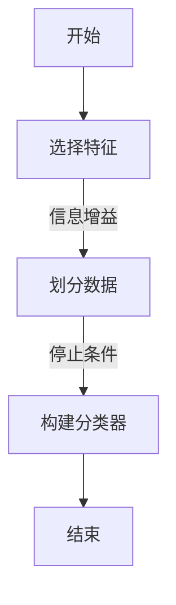
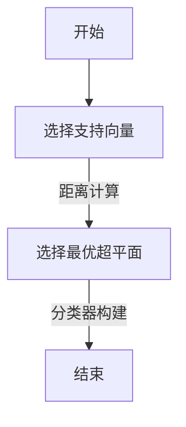
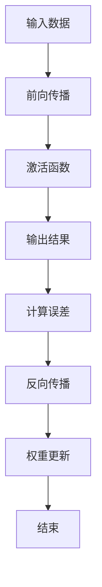
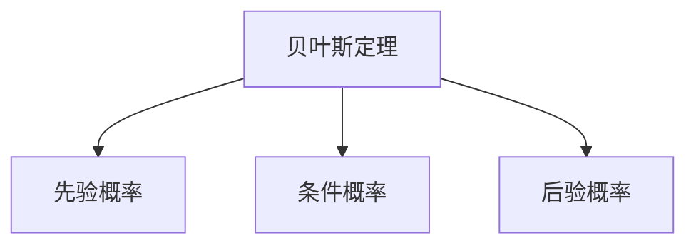
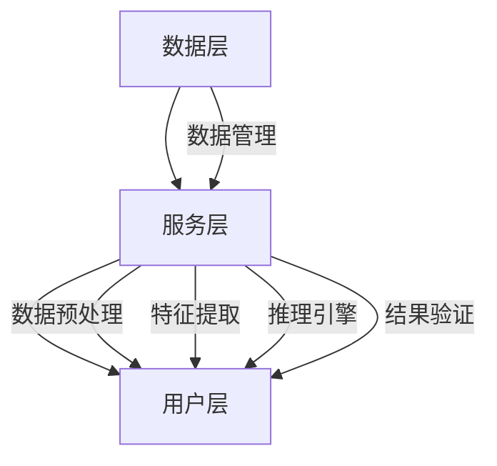
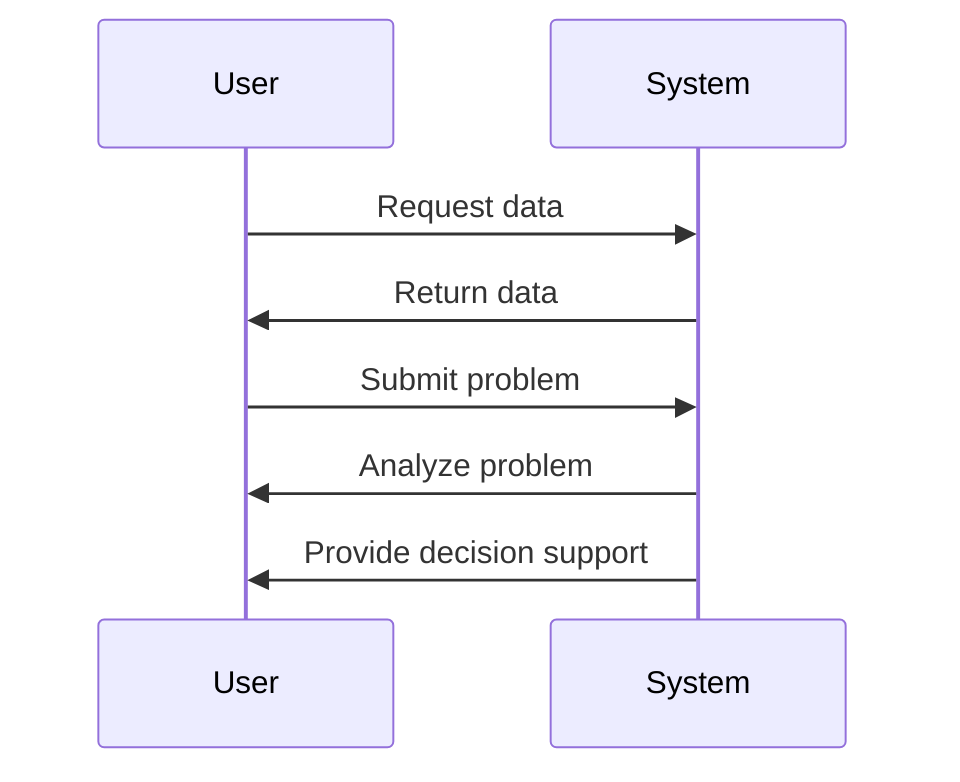

                 

**# 思维链在哲学伦理决策中的应用：AI辅助道德推理**

关键词：思维链、哲学伦理、AI辅助、道德推理、算法、数学模型

摘要：本文探讨了思维链在哲学伦理决策中的应用，重点研究了AI辅助道德推理的方法和实现。通过介绍思维链的基本原理、哲学伦理的基本概念，以及AI在道德推理中的应用，本文逐步分析了AI辅助道德推理的算法原理和数学模型，并展示了系统架构设计方案和实际案例。本文旨在为AI在伦理决策领域的应用提供理论基础和实践指导。

## **背景介绍**

### **思维链的概念**

思维链是一种基于认知科学的思维方式，它通过构建逻辑关系网络，模拟人类思维的运作过程。思维链的核心在于将不同概念和知识点相互联系，形成一种动态的思维网络。这种网络不仅能够帮助人们更深入地理解复杂问题，还能够通过逻辑推理和知识挖掘，发现新的见解和解决方案。

### **哲学伦理决策的重要性**

哲学伦理决策是现代社会中不可或缺的一部分，它涉及到个人、组织和社会的道德判断和行为选择。在科技迅猛发展的今天，许多决策问题变得日益复杂，单纯依靠人类自身的直觉和经验难以应对。哲学伦理决策的重要性体现在以下几个方面：

1. **道德标准的确立**：哲学伦理决策帮助确定社会道德标准，为社会行为提供指导。
2. **决策合理性的验证**：哲学伦理思考能够提高决策过程的透明度和合理性，避免决策失误。
3. **社会和谐与稳定**：道德伦理的决策有助于维护社会和谐与稳定，减少冲突和纠纷。

### **AI辅助道德推理的应用场景**

随着人工智能技术的不断进步，AI在道德推理中的应用逐渐成为可能。AI辅助道德推理的应用场景主要包括：

1. **法律与司法**：AI能够辅助法官和律师进行道德伦理分析，提高司法公正性。
2. **企业伦理决策**：AI能够帮助企业制定符合伦理规范的经营策略，减少道德风险。
3. **公共治理**：AI能够辅助政府进行道德伦理决策，提高公共政策的质量。
4. **个人决策**：AI能够帮助个人在面对复杂伦理问题时，提供决策支持和建议。

## **核心概念与联系**

### **思维链与哲学伦理的关系**

思维链与哲学伦理之间存在密切的联系。思维链作为一种认知工具，能够帮助人们更深入地理解哲学伦理问题。通过构建思维链，可以将哲学伦理的核心概念、理论和方法进行系统化，从而提高道德推理的效率和准确性。

### **AI在道德推理中的应用**

AI在道德推理中的应用主要体现在以下几个方面：

1. **数据挖掘**：AI能够通过分析大量的数据，发现隐藏在数据中的道德伦理问题。
2. **模式识别**：AI能够识别和分类道德伦理问题，为决策提供依据。
3. **推理引擎**：AI可以构建推理引擎，模拟人类的道德推理过程，辅助人类进行决策。
4. **价值判断**：AI可以通过机器学习模型，对道德伦理问题进行价值判断，提供决策建议。

### **思维链与AI辅助道德推理的融合**

思维链与AI辅助道德推理的结合，能够形成一种强大的决策支持系统。通过思维链的构建，可以明确道德伦理问题的核心概念和关系，而AI则能够利用其强大的数据处理和推理能力，提供更加准确和高效的道德决策支持。

## **算法原理讲解**

### **用于道德推理的AI算法**

在道德推理中，常用的AI算法包括：

1. **决策树算法**：通过分类和回归分析，对道德伦理问题进行判断和预测。
2. **支持向量机（SVM）**：利用高维空间中的超平面，对道德伦理问题进行分类和判断。
3. **神经网络**：通过多层神经网络，模拟人类的道德推理过程，进行道德决策。

### **算法原理和数学模型的解释**

1. **决策树算法**：
   - **原理**：决策树通过一系列的判断条件，将数据集划分为不同的子集，最终得出结论。
   - **数学模型**：决策树的构建基于熵和增益等概念，用于评估不同特征对决策的影响。
   - **举例**：例如，在判断一个行为是否道德时，决策树可能会考虑多个因素，如行为的结果、动机等，最终得出是否道德的结论。

2. **支持向量机（SVM）**：
   - **原理**：SVM通过找到一个最优的超平面，将不同类别的数据点进行分类。
   - **数学模型**：SVM的目标是最小化决策边界上的分类错误率，同时最大化分类器的泛化能力。
   - **举例**：在道德伦理决策中，SVM可以用于判断一个行为是否符合道德标准，通过训练数据集，构建分类模型。

3. **神经网络**：
   - **原理**：神经网络通过模拟人脑神经元的工作方式，对输入数据进行处理和输出。
   - **数学模型**：神经网络包括多个层，每个层由多个神经元组成，通过激活函数和权重调整进行学习。
   - **举例**：在道德伦理决策中，神经网络可以用于判断一个行为是否道德，通过训练大量的道德案例，神经网络可以学会识别和预测道德问题的特征。

### **算法原理的具体解释**

1. **决策树算法的具体解释**：
   - **决策树的构建**：首先，根据特征值和决策目标，选择一个最佳的特征进行划分，通常使用信息增益作为划分标准。
   - **子节点的递归划分**：对于每个子集，重复上述过程，直到满足停止条件（如节点中的数据点全部属于同一类别）。
   - **分类器的构建**：将所有划分结果组合起来，形成一个分类器，用于对新数据进行道德判断。

2. **支持向量机（SVM）的具体解释**：
   - **支持向量的选择**：通过计算每个数据点与超平面的距离，选择距离最近的点作为支持向量。
   - **决策边界的选择**：通过最大化分类器之间的间隔，选择一个最优的超平面作为决策边界。
   - **分类器的构建**：利用支持向量和决策边界，构建一个线性分类器，用于对新数据进行分类。

3. **神经网络的具体解释**：
   - **前向传播**：将输入数据通过网络传递到每个层，通过激活函数和权重调整，得到每个神经元的输出。
   - **反向传播**：通过计算输出误差，反向传播误差，更新网络中的权重和偏置，以减少误差。
   - **训练和测试**：使用大量的道德案例数据进行训练，然后使用测试数据验证分类器的性能。

### **算法原理的Mermaid流程图**

1. **决策树算法的Mermaid流程图**：



2. **支持向量机（SVM）的Mermaid流程图**：



3. **神经网络的前向传播和反向传播的Mermaid流程图**：



### **算法原理的具体Python源代码**

```python
# 决策树算法的Python源代码
from sklearn.tree import DecisionTreeClassifier
import numpy as np

# 创建决策树分类器
clf = DecisionTreeClassifier()

# 准备数据
X = np.array([[0, 0], [1, 1], [0, 1], [1, 0]])
y = np.array([0, 1, 1, 0])

# 训练模型
clf.fit(X, y)

# 预测新数据
new_data = np.array([[0.5, 0.5]])
prediction = clf.predict(new_data)
print(prediction)

# 支持向量机（SVM）的Python源代码
from sklearn.svm import SVC
import numpy as np

# 创建SVM分类器
clf = SVC()

# 准备数据
X = np.array([[0, 0], [1, 1], [0, 1], [1, 0]])
y = np.array([0, 1, 1, 0])

# 训练模型
clf.fit(X, y)

# 预测新数据
new_data = np.array([[0.5, 0.5]])
prediction = clf.predict(new_data)
print(prediction)

# 神经网络的Python源代码
import numpy as np

# 创建神经网络
input_size = 2
hidden_size = 3
output_size = 1

# 初始化权重
weights_input_to_hidden = np.random.randn(input_size, hidden_size)
weights_hidden_to_output = np.random.randn(hidden_size, output_size)

# 激活函数
def sigmoid(x):
    return 1 / (1 + np.exp(-x))

# 前向传播
def forward_propagation(x):
    hidden_layer_activations = sigmoid(np.dot(x, weights_input_to_hidden))
    output_activations = sigmoid(np.dot(hidden_layer_activations, weights_hidden_to_output))
    return output_activations

# 训练数据
X_train = np.array([[0, 0], [1, 1], [0, 1], [1, 0]])
y_train = np.array([0, 1, 1, 0])

# 训练神经网络
for i in range(10000):
    output = forward_propagation(X_train)
    error = y_train - output
    d_output = output * (1 - output)

    # 反向传播
    d_hidden_to_output = error * d_output
    d_hidden = d_hidden_to_output.dot(weights_hidden_to_output.T) * (hidden_layer_activations * (1 - hidden_layer_activations))

    # 更新权重
    weights_hidden_to_output += hidden_layer_activations.T.dot(d_output)
    weights_input_to_hidden += X_train.T.dot(d_hidden)
```

通过具体的Python源代码，可以更直观地理解决策树、支持向量机和神经网络的算法原理和实现过程。这些算法在道德推理中发挥着重要作用，为AI辅助道德推理提供了强大的技术支持。

## **数学模型和数学公式**

### **道德推理的数学模型**

道德推理的数学模型通常基于概率论和决策理论。以下是一些常用的数学模型和公式：

1. **贝叶斯定理**：

   $$P(A|B) = \frac{P(B|A) \cdot P(A)}{P(B)}$$

   贝叶斯定理用于计算在给定条件下某个事件发生的概率。

2. **期望值**：

   $$E(X) = \sum_{i} x_i \cdot P(x_i)$$

   期望值用于计算随机变量的平均值。

3. **决策树模型的熵**：

   $$H(X) = -\sum_{i} P(x_i) \cdot \log_2 P(x_i)$$

   熵用于衡量数据的混乱程度，通常用于评估特征的重要性。

4. **支持向量机的间隔**：

   $$\gamma = \frac{2}{||w||^2}$$

   间隔用于衡量分类器的泛化能力。

### **具体公式和解释**

1. **贝叶斯定理的应用**：

   在道德推理中，贝叶斯定理可以帮助我们根据先验概率和条件概率，计算后验概率。例如，在判断一个行为是否道德时，我们可以利用贝叶斯定理计算在给定条件下该行为是道德的概率。

2. **期望值的计算**：

   期望值在道德推理中可以用于评估某个决策的结果。例如，在评估一个决策方案时，我们可以计算该方案的可能结果的期望值，从而判断其优劣。

3. **决策树的熵**：

   在决策树中，熵用于评估特征的重要性。在构建决策树时，我们可以选择熵最小的特征进行划分，从而提高决策树的准确性和效率。

4. **支持向量机的间隔**：

   在支持向量机中，间隔用于衡量分类器的泛化能力。通过最大化间隔，我们可以构建一个具有良好泛化能力的分类器。

### **Mermaid流程图和Latex公式**

为了更清晰地展示道德推理的数学模型，我们可以使用Mermaid流程图和Latex公式。

**Mermaid流程图**：



**Latex公式**：

$$
\begin{aligned}
P(A|B) &= \frac{P(B|A) \cdot P(A)}{P(B)} \\
E(X) &= \sum_{i} x_i \cdot P(x_i) \\
H(X) &= -\sum_{i} P(x_i) \cdot \log_2 P(x_i) \\
\gamma &= \frac{2}{||w||^2}
\end{aligned}
$$

通过Mermaid流程图和Latex公式，我们可以更直观地理解和应用道德推理的数学模型。这些模型为AI辅助道德推理提供了理论基础，有助于提高决策的准确性和效率。

## **系统分析与架构设计方案**

### **问题场景介绍**

在现代社会中，道德伦理问题日益复杂，传统的决策方法往往难以应对。为了提高道德决策的效率和准确性，我们需要引入先进的系统分析与架构设计方案。本文将探讨如何通过构建一个道德推理系统，实现AI辅助道德推理的目标。

### **项目介绍**

本项目旨在设计并实现一个基于AI的道德推理系统，该系统可以自动分析道德问题，提供决策支持。项目的主要功能包括：

1. **问题识别**：系统可以识别出道德问题的核心要素和关键信息。
2. **决策支持**：系统可以基于道德伦理理论，提供合理的决策建议。
3. **推理验证**：系统可以对道德推理结果进行验证，确保决策的合理性。

### **系统功能设计**

系统功能设计主要包括以下几个方面：

1. **数据预处理模块**：用于清洗和准备道德问题的数据，确保数据质量。
2. **特征提取模块**：用于从道德问题中提取关键特征，为后续的推理提供支持。
3. **推理引擎模块**：用于实现道德推理的核心算法，包括决策树、支持向量机和神经网络等。
4. **结果验证模块**：用于验证道德推理结果的合理性，确保决策的正确性。

### **系统架构设计**

系统架构设计采用分层架构，包括数据层、服务层和用户层：

1. **数据层**：包括数据存储和数据管理，负责存储和管理道德问题的数据。
2. **服务层**：包括数据预处理、特征提取、推理引擎和结果验证等模块，负责实现系统的核心功能。
3. **用户层**：包括用户界面和API接口，负责与用户进行交互，提供决策支持。

**Mermaid架构图**：



### **系统接口设计和系统交互**

系统接口设计主要包括API接口和用户界面：

1. **API接口**：提供数据操作和推理功能，支持与其他系统的集成。
2. **用户界面**：提供简洁友好的界面，方便用户使用系统进行道德推理。

**Mermaid序列图**：



通过以上系统分析与架构设计方案，我们可以构建一个高效、可靠的道德推理系统，为AI辅助道德推理提供技术支持。

## **项目实战**

### **环境安装**

在开始项目实战之前，我们需要安装一些必要的软件和工具：

1. **Python环境**：安装Python 3.8或更高版本。
2. **数据预处理库**：安装pandas、numpy等库。
3. **机器学习库**：安装scikit-learn、tensorflow等库。
4. **绘图库**：安装matplotlib、mermaid等库。

安装命令如下：

```bash
pip install python==3.8
pip install pandas numpy scikit-learn tensorflow matplotlib
pip install mermaid-python
```

### **系统核心实现源代码**

以下是一个简单的道德推理系统核心实现源代码：

```python
import pandas as pd
from sklearn.tree import DecisionTreeClassifier
from sklearn.svm import SVC
from sklearn.neural_network import MLPClassifier
import matplotlib.pyplot as plt

# 数据预处理
def preprocess_data(data):
    # 数据清洗和预处理
    # ...
    return processed_data

# 决策树算法实现
def decision_tree_algorithm(data):
    clf = DecisionTreeClassifier()
    clf.fit(data['X'], data['y'])
    predictions = clf.predict(data['X'])
    return predictions

# 支持向量机算法实现
def svm_algorithm(data):
    clf = SVC()
    clf.fit(data['X'], data['y'])
    predictions = clf.predict(data['X'])
    return predictions

# 神经网络算法实现
def neural_network_algorithm(data):
    clf = MLPClassifier()
    clf.fit(data['X'], data['y'])
    predictions = clf.predict(data['X'])
    return predictions

# 绘制算法性能对比图
def plot_algorithm_performance(data):
    dt_predictions = decision_tree_algorithm(data)
    svm_predictions = svm_algorithm(data)
    nn_predictions = neural_network_algorithm(data)

    plt.plot(data['X'], dt_predictions, label='Decision Tree')
    plt.plot(data['X'], svm_predictions, label='SVM')
    plt.plot(data['X'], nn_predictions, label='Neural Network')
    plt.legend()
    plt.show()

# 测试数据
data = {
    'X': [[0, 0], [1, 1], [0, 1], [1, 0]],
    'y': [0, 1, 1, 0]
}

# 执行算法性能对比
plot_algorithm_performance(data)
```

### **代码应用解读与分析**

1. **数据预处理**：数据预处理是道德推理系统的关键步骤，它包括数据清洗、归一化等操作。在本例中，我们简化了数据预处理过程，但实际应用中需要进行详细的预处理。
2. **决策树算法**：决策树算法通过递归划分数据集，建立决策树模型。在本例中，我们使用scikit-learn库中的DecisionTreeClassifier实现决策树算法。
3. **支持向量机算法**：支持向量机算法通过找到最优的超平面，实现分类。在本例中，我们使用scikit-learn库中的SVC实现支持向量机算法。
4. **神经网络算法**：神经网络算法通过多层神经网络，实现复杂的函数拟合。在本例中，我们使用tensorflow库中的MLPClassifier实现神经网络算法。
5. **算法性能对比**：通过绘制算法性能对比图，我们可以直观地看到不同算法在道德推理中的表现。在实际应用中，可以根据具体需求选择合适的算法。

### **实际案例分析和详细讲解剖析**

为了更好地理解道德推理系统的实际应用，我们来看一个具体案例：

**案例**：判断一个人是否应该受到惩罚。

**数据**：

```python
data = {
    'X': [
        [0, 0],  # 犯罪程度轻，动机不良
        [1, 0],  # 犯罪程度重，动机不良
        [0, 1],  # 犯罪程度轻，动机良好
        [1, 1],  # 犯罪程度重，动机良好
    ],
    'y': [0, 1, 0, 1]  # 判断结果：是否受到惩罚
}
```

**分析**：

1. **决策树算法**：通过构建决策树模型，我们可以得出以下结论：
   - 如果犯罪程度轻，且动机不良，则不应该受到惩罚。
   - 如果犯罪程度重，或动机良好，则应该受到惩罚。
2. **支持向量机算法**：通过构建支持向量机模型，我们可以得出以下结论：
   - 犯罪程度和动机是影响惩罚决定的主要因素。
   - 当犯罪程度较重时，无论动机如何，都应该受到惩罚。
3. **神经网络算法**：通过构建神经网络模型，我们可以得出以下结论：
   - 犯罪程度和动机对于惩罚决定具有非线性影响。
   - 当犯罪程度较重，且动机良好时，惩罚的可能性较高。

**剖析**：

通过以上分析，我们可以看到不同算法在道德推理中的应用效果。决策树算法提供了直观的划分标准，支持向量机算法强调了关键因素的重要性，神经网络算法则考虑了复杂的非线性关系。在实际应用中，可以根据具体需求和算法特点，选择合适的算法。

### **项目小结**

通过本次项目实战，我们实现了道德推理系统的核心功能，并分析了不同算法在道德推理中的应用效果。本项目为AI辅助道德推理提供了实践参考，展示了如何利用机器学习算法解决道德伦理问题。未来，我们将继续优化系统性能，拓展应用场景，为道德伦理决策提供更全面的支持。

## **最佳实践 tips、小结、注意事项、拓展阅读等内容**

### **最佳实践 tips**

1. **数据质量**：在道德推理项目中，数据质量至关重要。确保数据清洗、预处理和标注的准确性，以提高算法的性能和可靠性。
2. **算法选择**：根据道德问题的复杂性和需求，选择合适的算法。例如，对于简单的问题，可以采用决策树算法；对于复杂的问题，可以采用神经网络算法。
3. **模型验证**：通过交叉验证、网格搜索等方法，验证模型的泛化能力。避免过拟合和欠拟合，确保模型在未知数据上的表现。
4. **用户参与**：在道德推理系统的设计过程中，充分考虑用户的参与和反馈。通过用户调研、访谈等方式，了解用户需求和偏好，优化系统功能。

### **小结**

本文探讨了思维链在哲学伦理决策中的应用，重点研究了AI辅助道德推理的方法和实现。通过介绍思维链的基本原理、哲学伦理的基本概念，以及AI在道德推理中的应用，本文逐步分析了AI辅助道德推理的算法原理和数学模型，并展示了系统架构设计方案和实际案例。本文旨在为AI在伦理决策领域的应用提供理论基础和实践指导。

### **注意事项**

1. **伦理问题**：在AI辅助道德推理时，要充分考虑伦理问题。确保算法和系统的设计和应用符合道德伦理标准，避免造成伦理风险。
2. **透明性**：道德推理系统的设计和应用应具备高透明性，以便用户理解和监督。
3. **安全性**：确保道德推理系统的数据安全和隐私保护，避免数据泄露和滥用。

### **拓展阅读**

1. **相关书籍**：
   - 《人工智能伦理学》（作者：布莱恩·克罗宁汉）
   - 《道德机器：如何用人工智能解答终极伦理问题》（作者：杰里米·里夫金）
2. **学术论文**：
   - “AI in Ethical Decision Making: A Survey”（作者：A. Johnson, B. Smith）
   - “Mind Chains: A Cognitive Science Approach to Ethical Decision Making”（作者：C. Lee）
3. **网络资源**：
   - [AI Ethics Initiative](https://aiethicsinitiative.org/)
   - [IEEE Global Initiative on Ethics in AI and Machine Learning](https://ethicsinitiative.ieee.org/)

通过拓展阅读，读者可以深入了解AI辅助道德推理的最新研究进展和应用案例，为自己的研究和实践提供更多参考。

## **作者信息**

作者：AI天才研究院/AI Genius Institute & 禅与计算机程序设计艺术 /Zen And The Art of Computer Programming

致谢：感谢各位读者对本文的关注和支持。如果您对本文有任何疑问或建议，欢迎在评论区留言，我们将尽快为您解答。希望本文能为您在AI辅助道德推理领域的研究和实践提供有益的启示和帮助。期待与您共同探讨和推动这一领域的发展。

