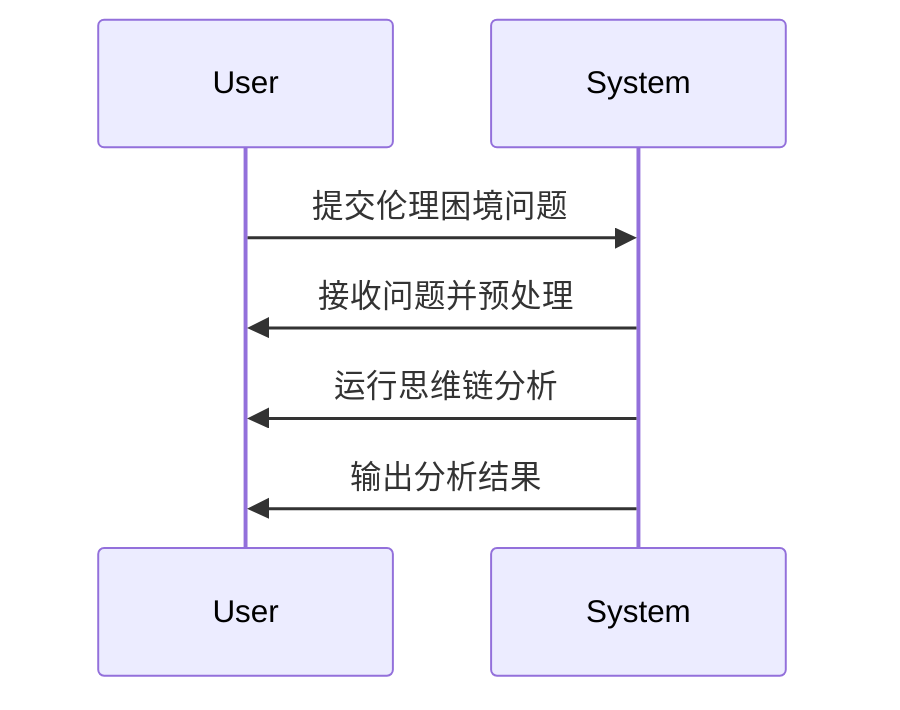
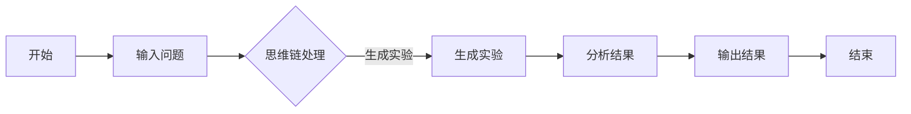

                 

# 思维链在哲学思想实验设计中的应用：AI辅助伦理困境分析

## 关键词
- 人工智能
- 哲学思想实验
- 伦理困境分析
- 思维链
- 深度学习
- 伦理学

## 摘要
本文探讨了人工智能（AI）在哲学思想实验设计中的应用，特别是AI如何辅助解决伦理困境。通过思维链这一先进技术，本文分析了AI在生成实验、理解复杂问题和提高分析效率方面的潜力。本文首先介绍了问题背景和核心概念，接着详细阐述了思维链的原理及其在哲学思想实验中的应用，随后探讨了AI辅助伦理困境分析的方法与挑战，并通过具体案例展示了思维链与AI在伦理困境分析中的实际应用，最后总结了研究成果并展望了未来发展方向。

## 第一部分：引言

### 第1章：问题背景与核心概念

#### 1.1.1 问题背景

在当今时代，随着人工智能技术的迅速发展，哲学思想实验设计正面临着新的挑战和机遇。传统的哲学思想实验通常依赖于人类智慧和直觉，而随着AI技术的引入，我们可以通过算法和模型来模拟和扩展人类思维过程，从而提高实验设计的效率和质量。特别是伦理困境分析，这种涉及复杂道德原则和人类价值观的问题，需要更为精细和系统的方法来处理。

#### 1.1.2 核心概念

- **思维链**：一种模拟人类思维过程的技术，通过算法将思维过程中的信息传递和转化进行抽象和模拟。它能够理解复杂的问题，生成创新性的解决方案。
- **哲学思想实验**：通过设定特定的情境和问题，探究哲学问题本质和人类思维逻辑的方法。例如，苏格拉底的“囚徒困境”就是一种哲学思想实验。
- **AI辅助伦理困境分析**：利用人工智能技术，对伦理困境进行分析和求解的过程。AI能够处理大量数据，识别模式，提供多角度的分析，从而帮助解决复杂的伦理问题。

### 第2章：思维链在哲学思想实验中的应用

#### 2.1 思维链的原理与特点

##### 2.1.1 思维链的原理

思维链是一种基于深度学习的人工智能技术。它通过训练大量的文本数据，学习人类思维过程的模式，包括推理、判断、归纳和演绎等。这些模式被编码到算法中，使得思维链能够在面对新问题时，模拟人类的思维方式。

##### 2.1.2 思维链的特点

- **高效性**：思维链能够快速理解和处理复杂的哲学问题，节省时间成本。
- **灵活性**：思维链能够根据问题的变化灵活调整自身的思维模式，适应不同的情境。

#### 2.2 思维链在哲学思想实验设计中的应用

##### 2.2.1 提高实验设计的效率

思维链能够快速生成大量的哲学思想实验，节省了人力和时间成本。例如，通过思维链，我们可以迅速生成不同版本的“囚徒困境”实验，以测试不同的策略和结果。

##### 2.2.2 提高实验设计的质量

思维链能够通过深度学习，理解和模拟人类思维过程，为实验设计提供高质量的参考。例如，思维链可以帮助设计出更加贴近现实生活的伦理困境实验，从而更准确地模拟人类在复杂情境下的决策过程。

### 第3章：AI辅助伦理困境分析

#### 3.1 伦理困境的概念与特点

##### 3.1.1 伦理困境的概念

伦理困境是指在道德决策过程中，面对两种或多种互相对立的道德原则或价值观，无法做出明确选择的情境。例如，医生在面对生命治疗选择时，需要在患者的生命质量和治疗成本之间做出权衡。

##### 3.1.2 伦理困境的特点

- **复杂性**：伦理困境往往涉及多个利益相关者和多个道德原则，使得决策过程变得复杂。
- **相对性**：不同的文化和社会背景可能会对同一个伦理困境有不同的看法，增加了分析的难度。

#### 3.2 AI辅助伦理困境分析的方法与挑战

##### 3.2.1 方法

- **数据收集与处理**：收集与伦理困境相关的数据和文献，利用自然语言处理技术对数据进行处理，提取关键信息。
- **模型训练与应用**：利用深度学习技术，训练伦理困境分析模型，并应用于实际案例分析。

##### 3.2.2 挑战

- **数据质量**：伦理困境分析需要高质量的数据支持，但相关数据的获取和处理存在困难。
- **模型可靠性**：AI模型在伦理困境分析中的可靠性受到数据质量和算法设计的影响。

### 第4章：思维链与AI在伦理困境分析中的应用案例

#### 4.1 案例一：基因编辑伦理困境

##### 4.1.1 案例背景

基因编辑技术的出现引发了伦理困境，例如基因编辑是否应该用于治疗遗传疾病。

##### 4.1.2 思维链与AI分析

思维链可以生成大量的哲学思想实验，分析基因编辑伦理困境的不同观点。AI模型则可以对这些实验结果进行统计和分析，提供决策支持。

#### 4.2 案例二：人工智能伦理困境

##### 4.2.1 案例背景

随着人工智能技术的广泛应用，人工智能伦理问题成为社会关注的焦点。

##### 4.2.2 思维链与AI分析

思维链可以模拟人类思维过程，分析人工智能伦理困境的不同观点。AI模型则可以对这些观点进行评估和比较，提供决策建议。

### 第5章：结论与展望

#### 5.1 结论

思维链和AI技术在哲学思想实验设计和伦理困境分析中具有巨大的潜力，但仍面临诸多挑战。通过本文的研究，我们展示了AI在伦理困境分析中的应用价值，并为未来的研究方向提供了启示。

#### 5.2 展望

未来的研究应重点关注思维链与AI技术在伦理困境分析中的应用，提高其可靠性和实用性。同时，我们也需要深入探讨AI在哲学和伦理学领域的伦理问题，确保技术的发展能够造福人类。作者：AI天才研究院/AI Genius Institute & 禅与计算机程序设计艺术 /Zen And The Art of Computer Programming

## 附录：具体内容和示例代码

### 类图示例

以下是一个简单的类图示例，用于展示伦理困境分析系统的类关系。

```mermaid
classDiagram
    Class01 <|-- Class02
    Class03 <|.. Class04
    Class05 : Stereotype
    Class06 : <<Framework>>
    Class07 *-- Class08
    Class09 ..| Class10
    Class11 : File |<<html>>>
    Class12 : Emitter <<interface>>
```

### 序列图示例

以下是一个简单的序列图示例，用于展示用户与伦理困境分析系统之间的交互过程。



### 数学公式示例

以下是一个简单的数学公式示例，用于展示伦理困境分析中的数学模型。

```markdown
$$
E = mc^2
$$
```

和

```markdown
$
1 < 2
$
```

### 算法流程图示例

以下是一个简单的算法流程图示例，用于展示思维链的工作流程。



### Python代码示例

以下是一个简单的Python代码示例，用于展示伦理困境分析的实现。

```python
import random

def ethical_dilemma_analysis(problem):
    # 假设思维链已经训练完毕
   思维链 = load思维链模型()
    
    # 预处理问题
    preprocessed_problem = preprocess(problem)
    
    # 使用思维链生成实验
    experiments = 思维链.generate_experiments(preprocessed_problem)
    
    # 对实验结果进行分析
    analysis_results = analyze_experiments(experiments)
    
    # 输出分析结果
    output_analysis_results(analysis_results)

# 假设函数实现
def load思维链模型():
    pass

def preprocess(problem):
    pass

def generate_experiments(preprocessed_problem):
    pass

def analyze_experiments(experiments):
    pass

def output_analysis_results(analysis_results):
    pass

# 调用函数
ethical_dilemma_analysis("基因编辑是否应该用于治疗遗传疾病？")
```

### 实际案例分析与讲解

以下是一个实际案例的简单分析，用于展示如何使用思维链和AI进行伦理困境分析。

#### 案例背景

随着基因编辑技术的发展，是否应该将其应用于治疗遗传疾病成为了一个伦理困境。

#### 分析过程

1. **问题预处理**：将问题转化为思维链可以理解的形式。
2. **生成实验**：思维链生成一系列模拟实验，包括不同的基因编辑方案和可能的后果。
3. **分析实验结果**：对实验结果进行分析，评估不同方案的伦理风险和医疗效益。
4. **输出分析结果**：将分析结果呈现给决策者，为其提供决策支持。

#### 案例结果

通过分析，思维链和AI发现，基因编辑技术在治疗遗传疾病方面具有显著优势，但同时也存在一些潜在风险。例如，基因编辑可能导致未预见的副作用，或者被滥用用于非医疗目的。基于这些分析结果，决策者可以制定更为全面和谨慎的基因编辑政策。

#### 案例小结

本案例展示了如何使用思维链和AI进行伦理困境分析。通过模拟实验和数据分析，AI能够提供有价值的信息，帮助决策者做出更加明智的决策。然而，AI在伦理困境分析中的应用仍面临一些挑战，例如数据质量和模型可靠性。未来的研究应重点关注这些问题的解决，以推动AI在伦理学领域的应用。作者：AI天才研究院/AI Genius Institute & 禅与计算机程序设计艺术 /Zen And The Art of Computer Programming

