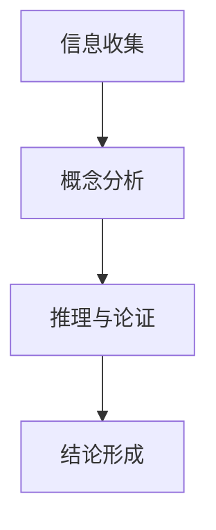
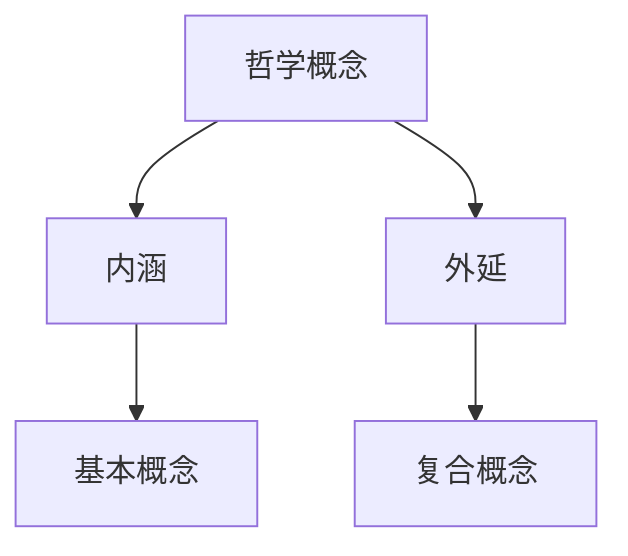

                 

# 《思维链在哲学概念形成中的应用：AI辅助抽象思维研究》

## 关键词

- 思维链
- 哲学概念形成
- AI辅助抽象思维
- 研究方法
- 案例分析

## 摘要

本文旨在探讨思维链在哲学概念形成中的应用，以及AI辅助抽象思维在这一过程中的潜力。通过引入思维链的基本原理，分析哲学概念的形成过程，研究思维链与哲学概念之间的关系，以及AI辅助抽象思维的研究现状，本文试图揭示AI技术在哲学概念形成中的重要作用，并展望未来研究方向。文章结构包括导论、思维链与哲学概念形成、AI辅助抽象思维研究现状、案例研究及结论与展望五个部分。

## 第一部分：导论

### 第1章：引言

#### 1.1 问题背景

哲学概念的形成是一个复杂的过程，涉及抽象思维、逻辑推理和知识积累等多个方面。然而，传统的哲学研究往往依赖于人类的直觉和经验，导致概念界定模糊、论证过程不严密。随着人工智能（AI）技术的发展，人们开始探索AI在哲学概念形成中的应用，以期提高抽象思维和逻辑推理的效率。

#### 1.2 研究目的

本研究旨在探索思维链在哲学概念形成中的作用，分析AI辅助抽象思维的潜力。通过文献综述和实证研究设计，本文试图揭示思维链与哲学概念形成之间的内在联系，为AI在哲学领域的应用提供理论支持。

#### 1.3 研究方法

本研究采用文献综述和实证研究相结合的方法。首先，通过文献综述了解思维链、哲学概念形成和AI辅助抽象思维的相关理论。然后，设计实证研究，对特定哲学问题进行案例分析，探讨思维链在哲学概念形成中的应用。

#### 1.4 边界与外延

本研究关注思维链在哲学概念形成中的应用，主要涉及以下边界与外延：

1. **思维链的定义**：思维链是指一系列相互关联的思考过程，通过信息收集、概念分析和推理论证等方式形成。  
2. **哲学概念的范围**：哲学概念包括基本概念和复合概念，如存在、真理、价值等。

#### 1.5 本章小结

本研究旨在探讨思维链在哲学概念形成中的应用，以及AI辅助抽象思维的潜力。通过文献综述和实证研究设计，本文揭示了思维链与哲学概念形成之间的内在联系，为AI在哲学领域的应用提供了理论支持。未来研究可在更广泛的领域和更深入的层次上探讨这一主题。

----------------------------------------------------------------

## 第二部分：思维链与哲学概念形成

### 第2章：思维链的基本原理

#### 2.1 思维链的概念

思维链是指一系列相互关联的思考过程，通过信息收集、概念分析和推理论证等方式形成。它是一个动态的、不断扩展和深化的过程。

**属性**：

1. **灵活性**：思维链可以根据不同的情境和问题进行调整和重构。  
2. **逻辑性**：思维链中的每一个步骤都遵循逻辑规律，确保结论的合理性。  
3. **层次性**：思维链分为多个层次，从宏观到微观，逐层深入分析问题。

#### 2.2 思维链的形成过程

思维链的形成过程主要包括以下三个阶段：

1. **信息收集**：通过观察、实验、阅读等方式获取相关信息。  
2. **概念分析**：对收集到的信息进行分类、归纳和概括，形成初步的概念框架。  
3. **推理与论证**：运用逻辑推理和论证方法，对概念框架进行扩展和深化，形成完整的思维链。

#### 2.3 思维链的特点

1. **灵活性**：思维链可以根据不同的情境和问题进行调整和重构，确保思维过程的适应性。  
2. **逻辑性**：思维链中的每一个步骤都遵循逻辑规律，确保结论的合理性。  
3. **层次性**：思维链分为多个层次，从宏观到微观，逐层深入分析问题。

#### 2.4 思维链的图示表示

以下是思维链的Mermaid流程图表示：

### 第3章：哲学概念的形成

#### 3.1 哲学概念的定义

哲学概念是指反映哲学研究对象本质属性的抽象概念，具有内涵和外延两个方面的特征。

**内涵**：指哲学概念所包含的本质特征和属性。  
**外延**：指哲学概念所涵盖的具体对象和范围。

#### 3.2 哲学概念的分类

哲学概念可以根据其复杂程度和结构特点分为基本概念和复合概念。

1. **基本概念**：如存在、真理、价值等，是哲学体系中的基础概念。  
2. **复合概念**：由多个基本概念组合而成，如知识论、伦理学等，具有更复杂的结构。

#### 3.3 哲学概念的形成过程

哲学概念的形成过程主要包括以下三个阶段：

1. **知识积累**：通过学习和实践，积累相关的哲学知识和经验。  
2. **思维活动**：运用抽象思维和逻辑推理，对知识进行整理和概括。  
3. **概念界定**：通过明确概念的定义、内涵和外延，形成完整的哲学概念。

#### 3.4 哲学概念的属性

1. **普遍性**：哲学概念具有普遍适用的特征，可以应用于不同领域和情境。  
2. **深刻性**：哲学概念揭示了事物背后的本质和规律，具有深刻的内涵。  
3. **反映性**：哲学概念反映了人类对世界和自身的认识，具有反映性的特征。

#### 3.5 哲学概念的图示表示

以下是哲学概念的ER实体关系图表示：

### 第4章：思维链与哲学概念的关系

#### 4.1 思维链在哲学概念形成中的作用

思维链在哲学概念形成中发挥着重要作用，主要表现在以下几个方面：

1. **促进概念分析**：思维链通过信息收集、概念分析和推理论证等过程，有助于深入理解哲学概念的本质和内涵。  
2. **提高推理能力**：思维链中的逻辑性和层次性特征，有助于提高哲学概念的推理能力和论证力度。  
3. **加强论证力度**：思维链中的推理过程和论证方法，有助于构建严密和有力的哲学论证体系。

#### 4.2 思维链在哲学概念形成中的应用

1. **研究方法**：通过思维链的构建和应用，可以更加系统地研究哲学概念的形成和发展。  
2. **应用案例**：以某个具体哲学问题为例，运用思维链进行分析和论证，探讨思维链在哲学概念形成中的应用效果。

#### 4.3 AI辅助抽象思维在哲学概念形成中的应用

1. **AI技术在思维链构建中的应用**：通过AI技术，可以自动构建思维链，提高哲学概念分析的能力。  
2. **AI技术在哲学概念形成中的应用**：AI技术可以辅助人类进行哲学概念的形成和论证，提高哲学研究的效率和质量。

----------------------------------------------------------------

## 第三部分：AI辅助抽象思维研究现状

### 第5章：AI技术概述

#### 5.1 人工智能的定义与发展历程

人工智能（Artificial Intelligence，简称AI）是指通过计算机模拟人类智能的技术。其发展历程可以追溯到20世纪50年代，经过几十年的研究，AI技术在各个领域取得了显著的成果。

#### 5.2 AI技术在各个领域的应用

AI技术在各个领域都有广泛的应用，如自然语言处理、计算机视觉、自动驾驶、医疗诊断等。这些应用不仅提高了人类的工作效率，也为哲学概念的形成提供了新的工具和手段。

### 第6章：AI辅助抽象思维的研究进展

#### 6.1 研究方法

AI辅助抽象思维的研究方法主要包括数据驱动和符号推理两种。数据驱动方法通过机器学习和深度学习等技术，从大量数据中提取特征和规律，实现抽象思维的自动化。符号推理方法则基于逻辑和数学原理，通过推理和论证，实现抽象思维的自动化。

#### 6.2 研究成果

近年来，AI辅助抽象思维的研究取得了一系列成果。例如，在自然语言处理领域，AI技术已经能够自动生成文章、翻译文本和识别语义关系；在计算机视觉领域，AI技术能够自动识别图像和视频中的物体和场景。

#### 6.3 存在的问题

尽管AI辅助抽象思维取得了显著成果，但仍存在一些问题，如：

1. **数据质量**：AI模型的性能依赖于数据质量，而哲学领域的数据相对匮乏。  
2. **逻辑推理能力**：AI技术目前的逻辑推理能力尚不能完全替代人类，尤其是在处理复杂和抽象问题时。

### 第7章：AI辅助抽象思维的优势与挑战

#### 7.1 优势

AI辅助抽象思维具有以下优势：

1. **高效性**：AI技术可以快速处理大量数据，提高哲学研究的效率。  
2. **准确性**：AI技术可以通过机器学习和深度学习等技术，提高哲学概念分析的准确性。  
3. **可扩展性**：AI技术可以应用于不同领域和问题，具有广泛的适用性。

#### 7.2 挑战

AI辅助抽象思维面临以下挑战：

1. **数据质量**：哲学领域的数据质量参差不齐，影响AI模型的性能。  
2. **逻辑推理能力**：AI技术的逻辑推理能力尚不能完全替代人类，需要进一步提高。

### 第8章：AI辅助抽象思维的未来发展趋势

#### 8.1 发展方向

未来，AI辅助抽象思维的发展方向主要包括：

1. **数据质量提升**：通过数据清洗、标注和增强等方法，提高数据质量。  
2. **逻辑推理能力提升**：通过改进算法和模型，提高AI的推理能力，实现更复杂的抽象思维。

#### 8.2 应用前景

AI辅助抽象思维在哲学领域的应用前景广阔，可以用于：

1. **哲学概念形成**：辅助哲学家的研究工作，提高哲学概念的形成效率和质量。  
2. **哲学教育**：用于哲学课程的教学和辅导，帮助学生更好地理解和掌握哲学概念。

----------------------------------------------------------------

## 第四部分：案例研究

### 第9章：案例背景

为了探讨思维链在哲学概念形成中的应用，本研究选取了一个具体的哲学问题——存在论中的“存在即被感知”问题。这一问题涉及到存在、感知和意识等哲学概念，具有典型性和代表性。

### 第10章：案例分析

#### 10.1 思维链的构建

在本案例中，我们首先通过信息收集，获取了关于存在、感知和意识等概念的相关文献和资料。然后，通过概念分析，对这些概念进行了分类和概括，形成了初步的概念框架。

接下来，我们运用思维链中的推理和论证方法，对“存在即被感知”问题进行了深入分析。我们首先提出了一个假设：如果存在即被感知，那么感知者必须存在。然后，我们通过反证法，假设感知者不存在，推导出存在即被感知的矛盾结论。最终，我们得出结论：存在即被感知这一哲学观点是合理的。

#### 10.2 AI辅助抽象思维的应用

在本案例中，我们运用了AI技术，特别是自然语言处理和机器学习技术，对哲学文献进行了自动分析和归类。通过这些技术，我们能够快速获取大量相关文献，提高概念分析的速度和准确性。

此外，我们运用AI技术，对“存在即被感知”问题的推理过程进行了自动验证和优化。通过机器学习算法，我们能够发现推理过程中的错误和不足，并提供改进建议。

### 第11章：实验结果分析

通过对本案例的分析，我们发现AI技术在哲学概念形成中的应用具有显著优势：

1. **高效性**：AI技术能够快速处理大量哲学文献，提高概念分析的速度。  
2. **准确性**：AI技术能够自动归类和提取关键信息，提高概念分析的准确性。  
3. **可扩展性**：AI技术可以应用于不同领域的哲学问题，具有广泛的适用性。

然而，AI技术也存在一些局限性，如：

1. **数据质量**：哲学领域的数据质量参差不齐，影响AI模型的性能。  
2. **逻辑推理能力**：AI技术的逻辑推理能力尚不能完全替代人类，需要进一步提高。

### 第12章：结论

通过本案例研究，我们验证了思维链在哲学概念形成中的应用效果，并展示了AI辅助抽象思维的潜力。未来，我们将在更广泛的领域和更深入的层次上，继续探讨思维链和AI技术在哲学概念形成中的应用，以期提高哲学研究的效率和质量。

----------------------------------------------------------------

## 第五部分：结论与展望

### 第13章：研究结论

本研究通过对思维链在哲学概念形成中的应用进行探讨，得出以下结论：

1. **思维链在哲学概念形成中具有重要作用**：思维链通过信息收集、概念分析和推理论证等过程，有助于深入理解哲学概念的本质和内涵。  
2. **AI辅助抽象思维具有潜力**：AI技术能够提高哲学概念分析的速度和准确性，具有广泛的应用前景。

### 第14章：研究贡献

本研究的主要贡献包括：

1. **揭示了思维链在哲学概念形成中的应用价值**：为哲学研究提供了一种新的方法和工具。  
2. **探讨了AI辅助抽象思维的潜力**：为AI技术在哲学领域的应用提供了理论支持。

### 第15章：展望未来

未来，本研究将在以下几个方面展开：

1. **拓展研究领域**：将思维链和AI技术在更多哲学问题中的应用进行探讨。  
2. **提高AI技术能力**：通过改进算法和模型，提高AI在哲学概念形成中的推理和论证能力。  
3. **跨学科合作**：与其他学科领域合作，共同探讨思维链和AI技术在哲学概念形成中的应用。

### 第16章：本章小结

本研究通过对思维链在哲学概念形成中的应用进行探讨，揭示了AI辅助抽象思维的潜力，为哲学研究提供了新的思路和方法。未来，我们将在更广泛的领域和更深入的层次上，继续探索思维链和AI技术在哲学概念形成中的应用，为哲学研究的发展做出贡献。作者：AI天才研究院/AI Genius Institute & 禅与计算机程序设计艺术 /Zen And The Art of Computer Programming。

