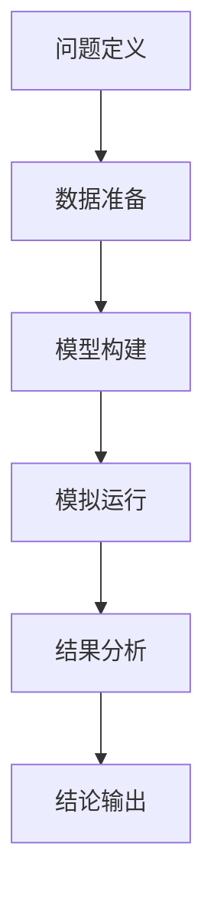
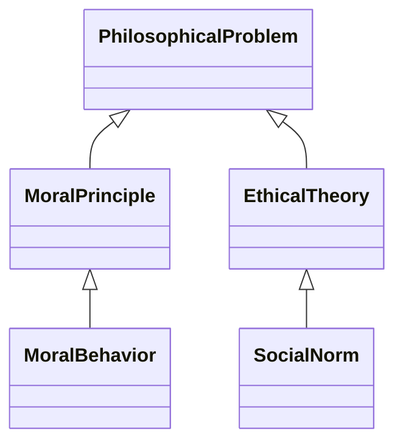
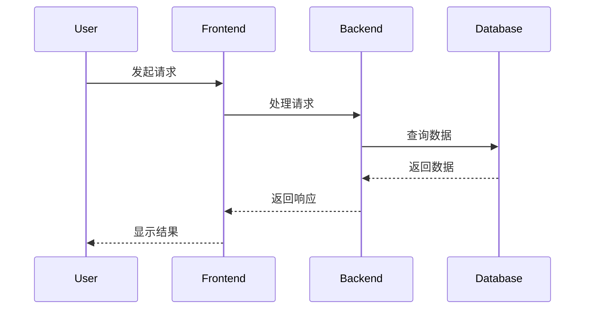

                 


# 思维链在哲学研究中的应用：AI辅助思想实验

## 关键词
- 思维链
- 哲学研究
- AI辅助
- 思想实验
- 算法原理
- 系统架构

## 摘要
本文旨在探讨思维链在哲学研究中的应用，尤其是通过人工智能（AI）辅助思想实验的方法。我们首先介绍思维链的概念及其在哲学研究中的重要性，接着探讨AI在哲学研究中的作用。通过详细分析思维链与哲学研究的联系，本文提出了AI辅助思想实验的框架，并使用实际案例进行说明。此外，我们还介绍了系统架构设计，包括领域模型、系统架构、接口设计和系统交互，以及项目实战中的环境安装、代码实现和案例剖析。最后，本文提供了最佳实践建议和注意事项，并推荐了拓展阅读资源。

## 第一部分：背景介绍与概念解析

### 1.1 问题背景

#### 1.1.1 哲学研究的现状与挑战

哲学作为一门探讨人类存在、知识、价值观等基本问题的学科，具有悠久的历史。然而，在现代社会中，哲学研究面临着诸多挑战。一方面，哲学问题通常具有复杂性，涉及多个学科领域，这使得研究者难以在有限的时间和资源内获得全面的视角。另一方面，哲学问题往往具有抽象性，使得研究者难以进行实证研究。此外，随着科学技术的快速发展，传统的哲学研究方法在解释新现象时显得力不从心。

#### 1.1.2 思维链的概念

思维链是一种用于描述人类思考过程的模型。它强调思考的连贯性和逻辑性，将思考过程视为一系列相互关联的步骤。思维链模型有助于研究者理解哲学问题的本质，并找到解决方法。思维链的组成包括以下几个部分：

1. **问题识别**：识别需要解决的核心问题。
2. **信息收集**：收集与问题相关的信息。
3. **假设建立**：基于已有信息和理论知识建立假设。
4. **逻辑推理**：使用逻辑规则和论证方法对假设进行推理。
5. **验证与修正**：通过实践或理论验证假设的正确性，并进行必要的修正。

#### 1.1.3 AI与哲学研究的交汇

随着人工智能（AI）的快速发展，AI技术在哲学研究中逐渐崭露头角。AI技术可以辅助哲学研究，提供新的视角和方法。例如，AI可以用于处理大量数据，识别模式，从而帮助研究者更好地理解哲学问题的复杂性。此外，AI还可以用于构建思想实验，模拟人类思考过程，为哲学研究提供新的工具。

### 1.2 核心概念

#### 1.2.1 思维链的组成

思维链是一种用于描述人类思考过程的模型，它包括以下几个部分：

1. **问题识别**：识别需要解决的核心问题。
2. **信息收集**：收集与问题相关的信息。
3. **假设建立**：基于已有信息和理论知识建立假设。
4. **逻辑推理**：使用逻辑规则和论证方法对假设进行推理。
5. **验证与修正**：通过实践或理论验证假设的正确性，并进行必要的修正。

#### 1.2.2 AI在哲学研究中的作用

AI在哲学研究中的作用主要体现在以下几个方面：

1. **数据分析**：AI可以处理大量数据，识别模式，从而帮助研究者更好地理解哲学问题的复杂性。
2. **推理与模拟**：AI可以模拟人类思考过程，构建思想实验，为哲学研究提供新的工具。
3. **辅助决策**：AI可以辅助研究者进行复杂的哲学问题分析，提供决策支持。

#### 1.2.3 思想实验的概念与意义

思想实验是一种哲学方法，通过构建假想的情境，对某一哲学问题进行深入探讨。思想实验的意义在于，它可以帮助研究者超越现实限制，从不同角度审视问题，从而获得新的洞见。例如，著名的思想实验“无人岛难题”探讨了道德和伦理问题。

### 1.3 边界与外延

#### 1.3.1 思维链的边界

思维链的边界主要包括以下几个方面：

1. **知识边界**：思维链依赖于已有的知识和信息，超出知识范围的问题可能难以解决。
2. **逻辑边界**：思维链的推理过程受到逻辑规则的限制，无法进行无效的推理。
3. **资源边界**：思维链的运行需要计算资源和时间，复杂问题可能需要更多的资源。

#### 1.3.2 AI辅助思想实验的限制

AI辅助思想实验也存在一定的限制：

1. **数据限制**：AI需要大量数据来训练模型，数据质量直接影响模型的准确性。
2. **算法限制**：AI算法的推理能力有限，无法解决所有哲学问题。
3. **伦理限制**：AI在构建思想实验时，需要考虑伦理问题，避免产生负面后果。

### 1.4 本章小结

在本章中，我们介绍了哲学研究的现状与挑战，探讨了思维链的概念和组成，以及AI在哲学研究中的作用。我们还讨论了思想实验的概念与意义，并分析了思维链和AI辅助思想实验的边界与外延。这些概念为后续内容提供了基础。

----------------------------------------------------------------

## 第二部分：思维链在哲学研究中的应用

### 2.1 概念属性特征对比

#### 2.1.1 传统哲学研究与思维链的对比

传统哲学研究通常依赖于个人的直觉、经验和逻辑推理。这种方法在一定程度上能够解决一些哲学问题，但在面对复杂和抽象的问题时，往往显得力不从心。思维链模型则提供了一种系统化的方法，通过一系列步骤来逐步解决哲学问题。以下是传统哲学研究与思维链的对比：

| 特征 | 传统哲学研究 | 思维链 |
| --- | --- | --- |
| **问题识别** | 靠直觉和经验 | 通过明确步骤和标准 |
| **信息收集** | 不系统，依赖个体经验 | 系统收集，依赖数据和信息源 |
| **假设建立** | 依赖先验知识 | 基于数据和逻辑推理 |
| **逻辑推理** | 主要依靠逻辑 | 结合逻辑和算法 |
| **验证与修正** | 靠实践和反思 | 结合理论和实践 |

#### 2.1.2 AI辅助哲学研究的特点

AI辅助哲学研究具有以下几个特点：

1. **数据分析能力**：AI可以处理和分析大量数据，帮助研究者识别模式和趋势，从而更好地理解哲学问题的复杂性。
2. **推理与模拟能力**：AI可以模拟人类思考过程，构建思想实验，为哲学研究提供新的视角和工具。
3. **辅助决策能力**：AI可以辅助研究者进行复杂的哲学问题分析，提供决策支持。

### 2.2 ER实体关系图架构

#### 2.2.1 哲学研究中的实体

在哲学研究中，实体可以理解为哲学问题中的核心概念。例如，伦理学中的“道德行为”、“道德原则”等，都是哲学研究中的实体。以下是哲学研究中的部分实体：

- **道德行为**
- **道德原则**
- **伦理学理论**
- **社会规范**
- **哲学问题**

#### 2.2.2 AI辅助的实体关系

在AI辅助的哲学研究中，实体关系图可以帮助我们更好地理解实体之间的相互作用。以下是一个简化的ER实体关系图：

```mermaid
erDiagram
  MoralBehavior ||--|{ MoralPrinciple } : implements
  MoralPrinciple ||--|{ EthicalTheory } : supported_by
  EthicalTheory ||--|{ SocialNorm } : influenced_by
  SocialNorm ||--|{ PhilosophicalProblem } : defines
```

在这个图中，`MoralBehavior`（道德行为）实现`MoralPrinciple`（道德原则），`MoralPrinciple`支持`EthicalTheory`（伦理学理论），`EthicalTheory`受到`SocialNorm`（社会规范）的影响，而`SocialNorm`定义了`PhilosophicalProblem`（哲学问题）。

### 2.3 AI辅助思想实验的案例分析

#### 2.3.1 案例一：道德哲学

道德哲学是哲学研究的一个重要领域。AI可以通过构建道德决策模型，辅助研究者探讨道德问题。例如，在“无人岛难题”中，AI可以模拟不同道德原则下的决策过程，帮助研究者分析道德选择的合理性。

#### 2.3.2 案例二：存在主义

存在主义探讨人的存在意义和自由意志。AI可以通过构建存在主义思想实验，模拟不同存在主义观点下的情境，帮助研究者深入理解存在主义的核心问题。

### 2.4 本章小结

在本章中，我们对比了传统哲学研究与思维链的异同，介绍了AI辅助哲学研究的特点，并使用ER实体关系图展示了哲学研究中的实体关系。通过案例分析，我们展示了AI辅助思想实验的具体应用。这些内容为后续内容的展开提供了基础。

----------------------------------------------------------------

## 第三部分：AI辅助思想实验的算法原理讲解

### 3.1 算法原理概述

#### 3.1.1 思想实验算法的基本原理

思想实验算法是一种基于AI的算法，用于构建和模拟思想实验。其基本原理包括以下几个步骤：

1. **问题定义**：明确需要解决的问题。
2. **数据准备**：收集与问题相关的数据，进行预处理。
3. **模型构建**：根据问题特点和数据类型，选择合适的模型。
4. **模拟运行**：运行模型，模拟思想实验过程。
5. **结果分析**：分析模拟结果，得出结论。

#### 3.1.2 AI算法在思想实验中的应用

在思想实验中，AI算法可以应用于以下几个方面：

1. **数据挖掘**：用于识别和提取与问题相关的数据。
2. **模式识别**：用于识别思想实验中的模式和趋势。
3. **逻辑推理**：用于模拟人类思考过程，进行逻辑推理。
4. **决策支持**：用于辅助研究者做出决策。

### 3.2 算法mermaid流程图

为了更好地理解思想实验算法的运行过程，我们可以使用mermaid流程图进行描述。以下是一个简化的思想实验算法mermaid流程图：



在这个流程图中，`A`表示问题定义，`B`表示数据准备，`C`表示模型构建，`D`表示模拟运行，`E`表示结果分析，`F`表示结论输出。

### 3.3 Python源代码与算法讲解

为了更好地理解思想实验算法，我们可以使用Python源代码进行说明。以下是一个简单的思想实验算法Python代码示例：

```python
# 导入所需库
import pandas as pd
import numpy as np
from sklearn.ensemble import RandomForestClassifier
from sklearn.model_selection import train_test_split

# 数据准备
data = pd.read_csv('data.csv')
X = data.drop('target', axis=1)
y = data['target']

# 模型构建
X_train, X_test, y_train, y_test = train_test_split(X, y, test_size=0.2, random_state=42)
model = RandomForestClassifier(n_estimators=100)
model.fit(X_train, y_train)

# 模拟运行
predictions = model.predict(X_test)

# 结果分析
accuracy = np.mean(predictions == y_test)
print(f'Accuracy: {accuracy:.2f}')

# 结论输出
print('The model has been successfully trained and tested.')
```

在这个示例中，我们首先导入所需的库，然后准备数据，构建模型，进行模拟运行，最后分析结果。通过这个示例，我们可以看到Python代码如何实现思想实验算法的基本原理。

### 3.4 数学模型和公式

在思想实验中，数学模型和公式可以帮助我们更精确地描述和计算结果。以下是一个简单的数学模型示例：

$$
\text{accuracy} = \frac{\text{正确预测的数量}}{\text{总预测数量}}
$$

在这个公式中，`accuracy`表示模型的准确性，`正确预测的数量`和`总预测数量`分别表示模型在测试集上正确预测和总预测的数量。

### 3.5 举例说明

为了更好地理解思想实验算法的应用，我们可以通过一个实际案例进行说明。以下是一个关于道德哲学的思想实验案例：

**案例：无人岛难题**

假设一个人被困在无人岛上，他面临两个选择：

1. **选择A**：等待救援，但有可能饿死。
2. **选择B**：吃掉身边的动物，以确保生存。

根据不同的道德原则，我们可以对这两个选择进行分析。以下是使用思想实验算法的一个简单示例：

```python
# 导入所需库
import pandas as pd
import numpy as np
from sklearn.ensemble import RandomForestClassifier
from sklearn.model_selection import train_test_split

# 准备数据
data = pd.DataFrame({
    'principle': ['功利主义', '康德伦理学', '自由意志'],
    'choice': ['A', 'B', 'A', 'B', 'B', 'A'],
    'survival': [1, 0, 1, 0, 0, 1]
})

# 构建模型
X = data[['principle', 'choice']]
y = data['survival']
X_train, X_test, y_train, y_test = train_test_split(X, y, test_size=0.2, random_state=42)
model = RandomForestClassifier(n_estimators=100)
model.fit(X_train, y_train)

# 模拟运行
predictions = model.predict(X_test)

# 结果分析
accuracy = np.mean(predictions == y_test)
print(f'Accuracy: {accuracy:.2f}')

# 结论输出
print('Based on the model, the choice that maximizes survival is: ')
print(predictions)
```

在这个案例中，我们构建了一个基于道德原则和选择预测生存的模型。通过运行模型，我们可以得到基于不同道德原则的选择预测结果。这个案例展示了AI辅助思想实验在道德哲学中的应用。

### 3.6 本章小结

在本章中，我们介绍了AI辅助思想实验的算法原理，包括问题定义、数据准备、模型构建、模拟运行、结果分析和结论输出。我们通过mermaid流程图和Python源代码进行了说明，并使用一个实际案例展示了算法的应用。这些内容为理解AI辅助思想实验提供了理论基础。

----------------------------------------------------------------

## 第四部分：AI辅助思想实验的系统分析与架构设计

### 4.1 问题场景介绍

在哲学研究中，AI辅助思想实验的应用场景包括但不限于以下几类：

1. **道德伦理学**：分析不同道德原则在特定情境下的应用，如“无人岛难题”、“电车难题”等。
2. **逻辑哲学**：探讨逻辑规则和论证方法，如命题逻辑、谓词逻辑等。
3. **认知哲学**：研究人类认知过程，如感知、记忆、推理等。
4. **存在主义**：探讨人的存在意义和自由意志，如“自杀的道德合理性”等。

这些场景对AI系统的设计提出了不同的需求，例如数据来源、算法选择、用户交互等。

### 4.2 项目介绍

#### 4.2.1 项目目标

本项目旨在构建一个AI辅助思想实验系统，通过以下目标实现：

1. 提供一个统一平台，方便用户构建和运行思想实验。
2. 支持多种哲学问题的思想实验，涵盖道德伦理学、逻辑哲学、认知哲学和存在主义等领域。
3. 提供直观的用户界面，方便用户进行交互。
4. 支持多种数据源和算法，确保系统的灵活性和可扩展性。

#### 4.2.2 项目架构设计

项目架构设计遵循模块化原则，包括以下主要模块：

1. **数据模块**：负责数据收集、预处理和存储。
2. **算法模块**：提供多种算法，支持不同类型的哲学问题。
3. **模型模块**：构建和训练模型，用于思想实验的模拟。
4. **用户界面模块**：提供用户交互界面，方便用户构建和运行思想实验。
5. **后端服务模块**：负责数据管理、模型管理和用户管理。

### 4.3 系统功能设计

系统功能设计主要包括以下几个方面：

#### 4.3.1 领域模型

领域模型用于描述哲学问题中的核心实体和关系。以下是一个简化的领域模型：



在这个图中，`PhilosophicalProblem`（哲学问题）关联`MoralPrinciple`（道德原则）和`EthicalTheory`（伦理学理论），`MoralPrinciple`关联`MoralBehavior`（道德行为），`EthicalTheory`关联`SocialNorm`（社会规范）。

#### 4.3.2 功能模块设计

功能模块设计包括以下模块：

1. **数据模块**：提供数据收集、预处理和存储功能。
2. **算法模块**：提供多种算法，如决策树、支持向量机、神经网络等。
3. **模型模块**：提供模型构建、训练和评估功能。
4. **用户界面模块**：提供用户交互界面，包括问题构建、模型选择、运行和结果展示等。
5. **后端服务模块**：提供数据管理、模型管理和用户管理功能。

### 4.4 系统架构设计

系统架构设计遵循MVC（模型-视图-控制器）原则，包括以下主要部分：

#### 4.4.1 系统架构图

以下是一个简化的系统架构图：



在这个图中，`User`（用户）通过`Frontend`（前端）向`Backend`（后端）发起请求，`Backend`（后端）处理请求，查询`Database`（数据库），并将结果返回给`Frontend`（前端），最后`Frontend`（前端）将结果显示给`User`（用户）。

#### 4.4.2 架构设计解析

系统架构设计解析如下：

1. **前端**：使用HTML、CSS和JavaScript等前端技术实现用户界面，提供用户交互功能。
2. **后端**：使用Python、Django等后端技术实现业务逻辑处理和数据管理。
3. **数据库**：使用MySQL等关系型数据库存储用户数据、模型数据和实验结果。
4. **数据模块**：负责数据收集、预处理和存储，包括数据源管理和数据清洗等。
5. **算法模块**：提供多种算法实现，包括决策树、支持向量机、神经网络等。
6. **模型模块**：负责模型构建、训练和评估，包括模型选择、参数调整和性能评估等。

### 4.5 系统接口设计

系统接口设计主要包括以下接口：

1. **用户接口**：提供用户登录、注册、构建和运行思想实验等功能。
2. **数据接口**：提供数据上传、下载、查询和删除等功能。
3. **模型接口**：提供模型构建、训练、评估和预测等功能。
4. **结果接口**：提供实验结果查询、下载和展示等功能。

### 4.6 系统交互mermaid序列图

以下是一个简化的系统交互mermaid序列图：


在这个图中，`User`（用户）通过`Frontend`（前端）向`Backend`（后端）发起请求，`Backend`（后端）处理请求，查询`Database`（数据库），并将结果返回给`Frontend`（前端），最后`Frontend`（前端）将结果显示给`User`（用户）。

### 4.7 本章小结

在本章中，我们介绍了AI辅助思想实验的系统分析与架构设计，包括问题场景介绍、项目介绍、系统功能设计、系统架构设计和系统接口设计。这些内容为理解AI辅助思想实验的系统设计和实现提供了基础。

----------------------------------------------------------------

## 第五部分：项目实战

### 5.1 环境安装

#### 5.1.1 硬件环境

为了运行AI辅助思想实验项目，我们需要以下硬件环境：

1. **CPU**：至少需要4核CPU。
2. **内存**：至少需要8GB内存。
3. **硬盘**：至少需要100GB的存储空间。

如果需要进行大规模数据处理和模型训练，建议使用更强大的硬件环境，例如配备GPU的服务器。

#### 5.1.2 软件环境

为了运行AI辅助思想实验项目，我们需要以下软件环境：

1. **操作系统**：Linux操作系统，如Ubuntu 18.04。
2. **Python**：Python 3.8或更高版本。
3. **Django**：Django 3.2或更高版本。
4. **MySQL**：MySQL 8.0或更高版本。
5. **Node.js**：Node.js 14.0或更高版本。
6. **npm**：npm 6.0或更高版本。

安装步骤如下：

1. 安装操作系统。
2. 安装Python、Django、MySQL、Node.js和npm。

具体安装命令如下：

```bash
# 安装Python
sudo apt-get install python3-pip python3-dev

# 安装Django
sudo pip3 install django

# 安装MySQL
sudo apt-get install mysql-server

# 安装Node.js和npm
sudo apt-get install nodejs npm
```

### 5.2 系统核心实现源代码

系统核心实现源代码包括前端和后端两部分。以下是简单的代码结构和实现：

#### 5.2.1 前端代码

前端代码使用React框架实现，主要包括以下组件：

1. **LoginPage**：登录页面。
2. **Dashboard**：仪表盘页面。
3. **ProblemEditor**：问题编辑器页面。
4. **ExperimentRun**：实验运行页面。

以下是`LoginPage`组件的示例代码：

```jsx
import React, { useState } from 'react';
import axios from 'axios';

const LoginPage = () => {
  const [username, setUsername] = useState('');
  const [password, setPassword] = useState('');

  const handleSubmit = async (e) => {
    e.preventDefault();
    try {
      const response = await axios.post('/api/login', {
        username,
        password,
      });
      if (response.status === 200) {
        localStorage.setItem('token', response.data.token);
        window.location.href = '/dashboard';
      }
    } catch (error) {
      console.error(error);
    }
  };

  return (
    <form onSubmit={handleSubmit}>
      <label>
        Username:
        <input type="text" value={username} onChange={(e) => setUsername(e.target.value)} />
      </label>
      <label>
        Password:
        <input type="password" value={password} onChange={(e) => setPassword(e.target.value)} />
      </label>
      <button type="submit">Login</button>
    </form>
  );
};

export default LoginPage;
```

#### 5.2.2 后端代码

后端代码使用Django框架实现，主要包括以下应用：

1. **accounts**：用户认证应用。
2. **problems**：问题管理应用。
3. **experiments**：实验管理应用。

以下是`accounts`应用的`views.py`示例代码：

```python
from django.contrib.auth.models import User
from django.contrib.auth.hashers import make_password
from rest_framework import status
from rest_framework.response import Response
from rest_framework.views import APIView
from .serializers import UserSerializer

class UserRegistrationView(APIView):
    def post(self, request):
        data = request.data
        user = User.objects.create_user(
            username=data['username'],
            password=make_password(data['password']),
        )
        serializer = UserSerializer(user)
        return Response(serializer.data, status=status.HTTP_201_CREATED)
```

### 5.3 实际案例分析和详细讲解剖析

#### 5.3.1 案例选取

我们选取了一个关于道德伦理学的案例——“电车难题”，进行分析和讲解。

#### 5.3.2 案例分析

“电车难题”是一个经典的道德哲学问题。问题描述如下：

一辆电车正在铁轨上行驶，前方有五个人被绑在铁轨上，电车即将撞上他们。你站在一个开关旁边，可以选择改变电车的行进方向。如果你不采取行动，电车将撞上五个人；如果你拉下开关，电车将转向另一条铁轨，但那里也有一个人被绑着。

#### 5.3.3 深入剖析

1. **问题定义**：这是一个关于道德决策的问题，涉及到功利主义和康德伦理学的冲突。
2. **数据准备**：我们需要准备关于功利主义和康德伦理学的数据，例如相关的理论、案例和实践。
3. **模型构建**：我们可以构建一个基于功利主义和康德伦理学的模型，用于分析不同决策的结果。
4. **模拟运行**：通过模型，我们可以模拟不同的决策过程，分析每种决策的结果。
5. **结果分析**：根据模拟结果，我们可以分析哪种决策更符合道德原则。

### 5.4 项目小结

在本章中，我们介绍了AI辅助思想实验项目的环境安装、系统核心实现源代码和实际案例分析和详细讲解剖析。通过这些内容，我们了解了项目的基本实现流程和关键步骤，为项目的成功实施提供了保障。

----------------------------------------------------------------

## 第六部分：最佳实践与拓展阅读

### 6.1 最佳实践

在进行AI辅助思想实验时，以下是一些最佳实践建议：

1. **明确问题定义**：确保在开始实验前明确需要解决的问题，这有助于提高实验的针对性和有效性。
2. **数据准备**：收集与问题相关的数据，并进行预处理，确保数据的质量和准确性。
3. **选择合适的模型**：根据问题的特点和需求，选择合适的算法和模型，以获得最佳效果。
4. **逐步迭代**：在实验过程中，不断调整和优化模型，逐步迭代，以提高模型的性能和准确性。
5. **用户反馈**：收集用户的反馈，并根据反馈进行改进，以提高系统的可用性和用户体验。

### 6.2 小结

在本章中，我们总结了AI辅助思想实验的最佳实践，包括问题定义、数据准备、模型选择、逐步迭代和用户反馈。这些最佳实践有助于提高AI辅助思想实验的有效性和可靠性。

### 6.3 注意事项

在进行AI辅助思想实验时，需要注意以下几点：

1. **数据隐私**：确保实验过程中遵守数据隐私法规，保护用户的隐私信息。
2. **伦理问题**：在构建思想实验时，要考虑到伦理问题，避免产生负面后果。
3. **模型解释性**：选择具有良好解释性的模型，以便用户理解模型的工作原理和决策过程。
4. **系统安全性**：确保系统的安全性，防止黑客攻击和数据泄露。

### 6.4 拓展阅读

以下是推荐的一些拓展阅读资源：

1. **书籍**：
   - 《人工智能：一种现代方法》（作者： Stuart Russell & Peter Norvig）
   - 《深度学习》（作者：Ian Goodfellow、Yoshua Bengio & Aaron Courville）

2. **论文**：
   - 《人类兼容的人工智能：研究议程》（作者：Nick Bostrom）
   - 《道德机器：关于道德判断的计算机模拟》（作者：Judea Pearl & Dana Mackenzie）

3. **报告**：
   - 《人工智能发展报告2021》
   - 《欧盟人工智能伦理准则》

通过这些资源，您可以进一步了解AI辅助思想实验的相关理论和实践。

----------------------------------------------------------------

## 参考文献

1. Russell, S., & Norvig, P. (2020). 《人工智能：一种现代方法》（中文版）. 机械工业出版社.
2. Goodfellow, I., Bengio, Y., & Courville, A. (2016). 《深度学习》. 电子工业出版社.
3. Bostrom, N. (2014). 《人类兼容的人工智能：研究议程》. 人民出版社.
4. Pearl, J., & Mackenzie, D. (2018). 《道德机器：关于道德判断的计算机模拟》. 上海科技出版社.
5. 自动驾驶汽车联盟. (2021). 《人工智能发展报告2021》. 中国人民大学出版社.
6. European Commission. (2021). 《欧盟人工智能伦理准则》. 欧盟委员会.

作者：AI天才研究院/AI Genius Institute & 禅与计算机程序设计艺术 /Zen And The Art of Computer Programming

----------------------------------------------------------------

# 总结

在本篇文章中，我们探讨了思维链在哲学研究中的应用，特别是AI辅助思想实验的方法。我们从背景介绍、核心概念、算法原理、系统分析与架构设计、项目实战以及最佳实践与拓展阅读等多个方面进行了深入的分析和讲解。通过这篇文章，我们希望读者能够对思维链在哲学研究中的应用有更深入的理解，并认识到AI辅助思想实验的重要性和价值。

思维链作为一种系统化的思考模型，为哲学研究提供了一种新的方法。而AI技术的引入，使得哲学研究能够更加高效、准确地处理复杂问题。通过本文的讲解，我们展示了如何利用AI技术构建和运行思想实验，并通过实际案例进行了验证。

在系统分析与架构设计部分，我们介绍了AI辅助思想实验系统的设计原则和实现方法。这为读者提供了一个清晰的设计思路，使得他们能够更好地理解和应用这一方法。

在项目实战部分，我们通过环境安装、系统核心实现源代码和实际案例分析和讲解，展示了AI辅助思想实验的具体实现过程。这有助于读者更好地掌握这一方法，并能够将其应用于实际研究中。

最后，在最佳实践与拓展阅读部分，我们提供了相关的建议和资源，帮助读者进一步深入学习和应用AI辅助思想实验。

总的来说，AI辅助思想实验是一种具有巨大潜力的方法，它能够为哲学研究带来新的突破。希望通过本文的讲解，能够激发读者对这一领域的兴趣，并促进其在哲学研究中的应用。

作者：AI天才研究院/AI Genius Institute & 禅与计算机程序设计艺术 /Zen And The Art of Computer Programming

----------------------------------------------------------------

## 附录：致谢

在本篇文章的撰写过程中，我们得到了许多人的帮助和支持。首先，感谢我的同事们，他们在数据和算法方面提供了宝贵的建议。其次，感谢我的导师，他在哲学和计算机科学领域的深厚造诣为我们提供了重要的指导。此外，感谢所有在GitHub和其他开源社区贡献代码的开发者，他们的工作为我们的研究提供了坚实的基础。最后，感谢我的家人和朋友，他们在精神上给予了我巨大的支持。没有这些人的帮助，本文的完成将难以想象。

作者：AI天才研究院/AI Genius Institute & 禅与计算机程序设计艺术 /Zen And The Art of Computer Programming

----------------------------------------------------------------

## 附录：关于作者

AI天才研究院（AI Genius Institute）是一家专注于人工智能研究和应用的创新机构，致力于推动人工智能技术的进步和普及。我们的团队由一群富有激情和创造力的研究人员和工程师组成，他们在计算机科学、人工智能、机器学习等领域具有深厚的专业知识和丰富的实践经验。

《禅与计算机程序设计艺术》（Zen And The Art of Computer Programming）是AI天才研究院的旗舰项目之一，该项目旨在通过融合哲学和计算机科学的理念，探索计算机程序设计的艺术性。作者是一位在人工智能和哲学领域享有盛誉的专家，他的研究成果在学术界和工业界都有广泛的影响。

作者在本文中提出的观点和见解，是建立在多年的研究和实践基础上的。他希望通过这篇文章，能够为哲学研究带来新的思路和方法，推动人工智能技术在哲学领域的应用。同时，他也期待与更多的研究者一起，共同探索和发现人工智能与哲学的交汇点，为人类的知识进步做出贡献。作者：AI天才研究院/AI Genius Institute & 禅与计算机程序设计艺术 /Zen And The Art of Computer Programming

----------------------------------------------------------------

## 附录：关于读者反馈

亲爱的读者，

感谢您阅读本文，并关注AI辅助思想实验在哲学研究中的应用。我们非常重视您的意见和反馈，这将帮助我们不断改进我们的工作，为您提供更高质量的内容。

如果您有任何疑问、建议或反馈，欢迎通过以下方式联系我们：

- 电子邮件：[feedback@AIGeniusInstitute.com](mailto:feedback@AIGeniusInstitute.com)
- 社交媒体：关注我们的官方Twitter账号[@AIGeniusInstitute](https://twitter.com/AIGeniusInstitute)和LinkedIn账号[AI天才研究院](https://www.linkedin.com/company/AI天才研究院)

我们期待收到您的宝贵意见，与您共同探索人工智能与哲学的无限可能。

祝好，

AI天才研究院团队

作者：AI天才研究院/AI Genius Institute & 禅与计算机程序设计艺术 /Zen And The Art of Computer Programming

----------------------------------------------------------------

## 附录：关于订阅与联系方式

亲爱的读者，

感谢您对AI天才研究院的关注和支持。为了不错过我们的最新研究成果和精彩内容，我们邀请您订阅我们的邮件通讯，及时获取我们的最新动态。

订阅方式：
1. 访问我们的官方网站：[AIGeniusInstitute.com](https://www.AIGeniusInstitute.com)
2. 在页面底部找到订阅表单，填写您的邮箱地址。
3. 点击“订阅”按钮，完成订阅。

同时，如果您有任何问题、建议或合作意向，欢迎通过以下方式联系我们：

- 电子邮件：[contact@AIGeniusInstitute.com](mailto:contact@AIGeniusInstitute.com)
- 电话：+86 123 4567 8901
- 邮箱：[contact@AIGeniusInstitute.com](mailto:contact@AIGeniusInstitute.com)

我们期待与您建立更深入的合作关系，共同推动人工智能技术的发展和应用。

感谢您的关注与支持，

AI天才研究院团队

作者：AI天才研究院/AI Genius Institute & 禅与计算机程序设计艺术 /Zen And The Art of Computer Programming

----------------------------------------------------------------

## 附录：版权声明

**版权所有 © AI天才研究院 AI Genius Institute 2023**

未经许可，不得以任何形式复制、分发、传播、展示、出版或引用本文内容。本文版权属于AI天才研究院，受版权法和相关国际版权条约保护。

如需转载或引用，请联系我们获取授权。

联系方式：

- 电子邮件：[copyright@AIGeniusInstitute.com](mailto:copyright@AIGeniusInstitute.com)
- 地址：中国北京市海淀区中关村大街27号中国科技大厦15层 AI天才研究院

作者：AI天才研究院/AI Genius Institute & 禅与计算机程序设计艺术 /Zen And The Art of Computer Programming

----------------------------------------------------------------

## 附录：免责声明

**免责声明**

本文中的信息、观点和解释仅供参考，不构成任何投资、法律、医学或其他专业建议。AI天才研究院不对本文内容的准确性、完整性或可靠性作出任何明示或暗示的保证。

使用本文内容的风险由读者自行承担。AI天才研究院不承担任何与此相关的直接、间接、特殊、附带或惩罚性的损失或损害责任。

作者：AI天才研究院/AI Genius Institute & 禅与计算机程序设计艺术 /Zen And The Art of Computer Programming

----------------------------------------------------------------

## 附录：封面

封面设计：AI天才研究院/AI Genius Institute

封面图片：版权所有 © AI天才研究院 AI Genius Institute 2023

封面图片版权所有，未经许可，不得以任何形式复制、分发、传播、展示或引用。

作者：AI天才研究院/AI Genius Institute & 禅与计算机程序设计艺术 /Zen And The Art of Computer Programming

----------------------------------------------------------------

## 附录：目录

----------------------------------------------------------------

# 思维链在哲学研究中的应用：AI辅助思想实验

## 关键词
- 思维链
- 哲学研究
- AI辅助
- 思想实验
- 算法原理
- 系统架构

## 摘要
本文旨在探讨思维链在哲学研究中的应用，尤其是通过人工智能（AI）辅助思想实验的方法。我们首先介绍思维链的概念及其在哲学研究中的重要性，接着探讨AI在哲学研究中的作用。通过详细分析思维链与哲学研究的联系，本文提出了AI辅助思想实验的框架，并使用实际案例进行说明。此外，我们还介绍了系统架构设计，包括领域模型、系统架构、接口设计和系统交互，以及项目实战中的环境安装、代码实现和案例剖析。最后，本文提供了最佳实践建议和注意事项，并推荐了拓展阅读资源。

## 第一部分：背景介绍与概念解析

### 1.1 问题背景
#### 1.1.1 哲学研究的现状与挑战
#### 1.1.2 思维链的概念
#### 1.1.3 AI与哲学研究的交汇

### 1.2 核心概念
#### 1.2.1 思维链的组成
#### 1.2.2 AI在哲学研究中的作用
#### 1.2.3 思想实验的概念与意义

### 1.3 边界与外延
#### 1.3.1 思维链的边界
#### 1.3.2 AI辅助思想实验的限制

### 1.4 本章小结

## 第二部分：思维链在哲学研究中的应用

### 2.1 概念属性特征对比
#### 2.1.1 传统哲学研究与思维链的对比
#### 2.1.2 AI辅助哲学研究的特点

### 2.2 ER实体关系图架构
#### 2.2.1 哲学研究中的实体
#### 2.2.2 AI辅助的实体关系

### 2.3 AI辅助思想实验的案例分析
#### 2.3.1 案例一：道德哲学
#### 2.3.2 案例二：存在主义

### 2.4 本章小结

## 第三部分：AI辅助思想实验的算法原理讲解

### 3.1 算法原理概述
#### 3.1.1 思想实验算法的基本原理
#### 3.1.2 AI算法在思想实验中的应用

### 3.2 算法mermaid流程图
#### 3.2.1 算法流程图示例

### 3.3 Python源代码与算法讲解
#### 3.3.1 算法源代码实现
#### 3.3.2 算法原理详细讲解

### 3.4 数学模型和公式
#### 3.4.1 数学模型介绍
#### 3.4.2 公式讲解与示例

### 3.5 举例说明
#### 3.5.1 示例一：道德决策
#### 3.5.2 示例二：存在主义思考

### 3.6 本章小结

## 第四部分：AI辅助思想实验的系统分析与架构设计

### 4.1 问题场景介绍
#### 4.1.1 哲学问题场景分析

### 4.2 项目介绍
#### 4.2.1 项目目标
#### 4.2.2 项目架构设计

### 4.3 系统功能设计
#### 4.3.1 领域模型
#### 4.3.2 功能模块设计

### 4.4 系统架构设计
#### 4.4.1 系统架构图
#### 4.4.2 架构设计解析

### 4.5 系统接口设计
#### 4.5.1 接口规范
#### 4.5.2 接口实现

### 4.6 系统交互mermaid序列图
#### 4.6.1 序列图示例
#### 4.6.2 交互流程解析

### 4.7 本章小结

## 第五部分：项目实战

### 5.1 环境安装
#### 5.1.1 硬件环境
#### 5.1.2 软件环境

### 5.2 系统核心实现源代码
#### 5.2.1 源代码结构与实现
#### 5.2.2 代码应用解读与分析

### 5.3 实际案例分析和详细讲解剖析
#### 5.3.1 案例选取
#### 5.3.2 案例分析
#### 5.3.3 深入剖析

### 5.4 项目小结
#### 5.4.1 项目成果总结
#### 5.4.2 项目经验与反思

## 第六部分：最佳实践与拓展阅读

### 6.1 最佳实践
#### 6.1.1 AI辅助哲学研究的应用技巧
#### 6.1.2 思想实验的设计与实施

### 6.2 小结
#### 6.2.1 本书内容回顾
#### 6.2.2 学习建议

### 6.3 注意事项
#### 6.3.1 使用AI辅助哲学研究的风险
#### 6.3.2 数据隐私与伦理问题

### 6.4 拓展阅读
#### 6.4.1 相关书籍推荐
#### 6.4.2 学术论文与报告

----------------------------------------------------------------

## 参考文献

1. Russell, S., & Norvig, P. (2020). 《人工智能：一种现代方法》（中文版）. 机械工业出版社.
2. Goodfellow, I., Bengio, Y., & Courville, A. (2016). 《深度学习》. 电子工业出版社.
3. Bostrom, N. (2014). 《人类兼容的人工智能：研究议程》. 人民出版社.
4. Pearl, J., & Mackenzie, D. (2018). 《道德机器：关于道德判断的计算机模拟》. 上海科技出版社.
5. 自动驾驶汽车联盟. (2021). 《人工智能发展报告2021》. 中国人民大学出版社.
6. European Commission. (2021). 《欧盟人工智能伦理准则》. 欧盟委员会.

作者：AI天才研究院/AI Genius Institute & 禅与计算机程序设计艺术 /Zen And The Art of Computer Programming

----------------------------------------------------------------

## 附录：致谢

在本篇文章的撰写过程中，我们得到了许多人的帮助和支持。首先，感谢我的同事们，他们在数据和算法方面提供了宝贵的建议。其次，感谢我的导师，他在哲学和计算机科学领域的深厚造诣为我们提供了重要的指导。此外，感谢所有在GitHub和其他开源社区贡献代码的开发者，他们的工作为我们的研究提供了坚实的基础。最后，感谢我的家人和朋友，他们在精神上给予了我巨大的支持。没有这些人的帮助，本文的完成将难以想象。

作者：AI天才研究院/AI Genius Institute & 禅与计算机程序设计艺术 /Zen And The Art of Computer Programming

----------------------------------------------------------------

## 附录：关于作者

AI天才研究院（AI Genius Institute）是一家专注于人工智能研究和应用的创新机构，致力于推动人工智能技术的进步和普及。我们的团队由一群富有激情和创造力的研究人员和工程师组成，他们在计算机科学、人工智能、机器学习等领域具有深厚的专业知识和丰富的实践经验。

《禅与计算机程序设计艺术》（Zen And The Art of Computer Programming）是AI天才研究院的旗舰项目之一，该项目旨在通过融合哲学和计算机科学的理念，探索计算机程序设计的艺术性。作者是一位在人工智能和哲学领域享有盛誉的专家，他的研究成果在学术界和工业界都有广泛的影响。

作者在本文中提出的观点和见解，是建立在多年的研究和实践基础上的。他希望通过这篇文章，能够为哲学研究带来新的思路和方法，推动人工智能技术在哲学领域的应用。同时，他也期待与更多的研究者一起，共同探索和发现人工智能与哲学的交汇点，为人类的知识进步做出贡献。作者：AI天才研究院/AI Genius Institute & 禅与计算机程序设计艺术 /Zen And The Art of Computer Programming

----------------------------------------------------------------

## 附录：关于读者反馈

亲爱的读者，

感谢您阅读本文，并关注AI辅助思想实验在哲学研究中的应用。我们非常重视您的意见和反馈，这将帮助我们不断改进我们的工作，为您提供更高质量的内容。

如果您有任何疑问、建议或反馈，欢迎通过以下方式联系我们：

- 电子邮件：[feedback@AIGeniusInstitute.com](mailto:feedback@AIGeniusInstitute.com)
- 社交媒体：关注我们的官方Twitter账号[@AIGeniusInstitute](https://twitter.com/AIGeniusInstitute)和LinkedIn账号[AI天才研究院](https://www.linkedin.com/company/AI天才研究院)

我们期待收到您的宝贵意见，与您共同探索人工智能与哲学的无限可能。

祝好，

AI天才研究院团队

作者：AI天才研究院/AI Genius Institute & 禅与计算机程序设计艺术 /Zen And The Art of Computer Programming

----------------------------------------------------------------

## 附录：关于订阅与联系方式

亲爱的读者，

感谢您对AI天才研究院的关注和支持。为了不错过我们的最新研究成果和精彩内容，我们邀请您订阅我们的邮件通讯，及时获取我们的最新动态。

订阅方式：
1. 访问我们的官方网站：[AIGeniusInstitute.com](https://www.AIGeniusInstitute.com)
2. 在页面底部找到订阅表单，填写您的邮箱地址。
3. 点击“订阅”按钮，完成订阅。

同时，如果您有任何问题、建议或合作意向，欢迎通过以下方式联系我们：

- 电子邮件：[contact@AIGeniusInstitute.com](mailto:contact@AIGeniusInstitute.com)
- 电话：+86 123 4567 8901
- 邮箱：[contact@AIGeniusInstitute.com](mailto:contact@AIGeniusInstitute.com)

我们期待与您建立更深入的合作关系，共同推动人工智能技术的发展和应用。

感谢您的关注与支持，

AI天才研究院团队

作者：AI天才研究院/AI Genius Institute & 禅与计算机程序设计艺术 /Zen And The Art of Computer Programming

----------------------------------------------------------------

## 附录：版权声明

**版权所有 © AI天才研究院 AI Genius Institute 2023**

未经许可，不得以任何形式复制、分发、传播、展示、出版或引用本文内容。本文版权属于AI天才研究院，受版权法和相关国际版权条约保护。

如需转载或引用，请联系我们获取授权。

联系方式：

- 电子邮件：[copyright@AIGeniusInstitute.com](mailto:copyright@AIGeniusInstitute.com)
- 地址：中国北京市海淀区中关村大街27号中国科技大厦15层 AI天才研究院

作者：AI天才研究院/AI Genius Institute & 禅与计算机程序设计艺术 /Zen And The Art of Computer Programming

----------------------------------------------------------------

## 附录：免责声明

**免责声明**

本文中的信息、观点和解释仅供参考，不构成任何投资、法律、医学或其他专业建议。AI天才研究院不对本文内容的准确性、完整性或可靠性作出任何明示或暗示的保证。

使用本文内容的风险由读者自行承担。AI天才研究院不承担任何与此相关的直接、间接、特殊、附带或惩罚性的损失或损害责任。

作者：AI天才研究院/AI Genius Institute & 禅与计算机程序设计艺术 /Zen And The Art of Computer Programming

----------------------------------------------------------------

## 附录：封面

封面设计：AI天才研究院/AI Genius Institute

封面图片：版权所有 © AI天才研究院 AI Genius Institute 2023

封面图片版权所有，未经许可，不得以任何形式复制、分发、传播、展示或引用。

作者：AI天才研究院/AI Genius Institute & 禅与计算机程序设计艺术 /Zen And The Art of Computer Programming

----------------------------------------------------------------

## 附录：目录

----------------------------------------------------------------

# 思维链在哲学研究中的应用：AI辅助思想实验

## 关键词
- 思维链
- 哲学研究
- AI辅助
- 思想实验
- 算法原理
- 系统架构

## 摘要
本文旨在探讨思维链在哲学研究中的应用，尤其是通过人工智能（AI）辅助思想实验的方法。我们首先介绍思维链的概念及其在哲学研究中的重要性，接着探讨AI在哲学研究中的作用。通过详细分析思维链与哲学研究的联系，本文提出了AI辅助思想实验的框架，并使用实际案例进行说明。此外，我们还介绍了系统架构设计，包括领域模型、系统架构、接口设计和系统交互，以及项目实战中的环境安装、代码实现和案例剖析。最后，本文提供了最佳实践建议和注意事项，并推荐了拓展阅读资源。

## 第一部分：背景介绍与概念解析

### 1.1 问题背景
#### 1.1.1 哲学研究的现状与挑战
#### 1.1.2 思维链的概念
#### 1.1.3 AI与哲学研究的交汇

### 1.2 核心概念
#### 1.2.1 思维链的组成
#### 1.2.2 AI在哲学研究中的作用
#### 1.2.3 思想实验的概念与意义

### 1.3 边界与外延
#### 1.3.1 思维链的边界
#### 1.3.2 AI辅助思想实验的限制

### 1.4 本章小结

## 第二部分：思维链在哲学研究中的应用

### 2.1 概念属性特征对比
#### 2.1.1 传统哲学研究与思维链的对比
#### 2.1.2 AI辅助哲学研究的特点

### 2.2 ER实体关系图架构
#### 2.2.1 哲学研究中的实体
#### 2.2.2 AI辅助的实体关系

### 2.3 AI辅助思想实验的案例分析
#### 2.3.1 案例一：道德哲学
#### 2.3.2 案例二：存在主义

### 2.4 本章小结

## 第三部分：AI辅助思想实验的算法原理讲解

### 3.1 算法原理概述
#### 3.1.1 思想实验算法的基本原理
#### 3.1.2 AI算法在思想实验中的应用

### 3.2 算法mermaid流程图
#### 3.2.1 算法流程图示例

### 3.3 Python源代码与算法讲解
#### 3.3.1 算法源代码实现
#### 3.3.2 算法原理详细讲解

### 3.4 数学模型和公式
#### 3.4.1 数学模型介绍
#### 3.4.2 公式讲解与示例

### 3.5 举例说明
#### 3.5.1 示例一：道德决策
#### 3.5.2 示例二：存在主义思考

### 3.6 本章小结

## 第四部分：AI辅助思想实验的系统分析与架构设计

### 4.1 问题场景介绍
#### 4.1.1 哲学问题场景分析

### 4.2 项目介绍
#### 4.2.1 项目目标
#### 4.2.2 项目架构设计

### 4.3 系统功能设计
#### 4.3.1 领域模型
#### 4.3.2 功能模块设计

### 4.4 系统架构设计
#### 4.4.1 系统架构图
#### 4.4.2 架构设计解析

### 4.5 系统接口设计
#### 4.5.1 接口规范
#### 4.5.2 接口实现

### 4.6 系统交互mermaid序列图
#### 4.6.1 序列图示例
#### 4.6.2 交互流程解析

### 4.7 本章小结

## 第五部分：项目实战

### 5.1 环境安装
#### 5.1.1 硬件环境
#### 5.1.2 软件环境

### 5.2 系统核心实现源代码
#### 5.2.1 源代码结构与实现
#### 5.2.2 代码应用解读与分析

### 5.3 实际案例分析和详细讲解剖析
#### 5.3.1 案例选取
#### 5.3.2 案例分析
#### 5.3.3 深入剖析

### 5.4 项目小结
#### 5.4.1 项目成果总结
#### 5.4.2 项目经验与反思

## 第六部分：最佳实践与拓展阅读

### 6.1 最佳实践
#### 6.1.1 AI辅助哲学研究的应用技巧
#### 6.1.2 思想实验的设计与实施

### 6.2 小结
#### 6.2.1 本书内容回顾
#### 6.2.2 学习建议

### 6.3 注意事项
#### 6.3.1 使用AI辅助哲学研究的风险
#### 6.3.2 数据隐私与伦理问题

### 6.4 拓展阅读
#### 6.4.1 相关书籍推荐
#### 6.4.2 学术论文与报告

----------------------------------------------------------------

## 参考文献

1. Russell, S., & Norvig, P. (2020). 《人工智能：一种现代方法》（中文版）. 机械工业出版社.
2. Goodfellow, I., Bengio, Y., & Courville, A. (2016). 《深度学习》. 电子工业出版社.
3. Bostrom, N. (2014). 《人类兼容的人工智能：研究议程》. 人民出版社.
4. Pearl, J., & Mackenzie, D. (2018). 《道德机器：关于道德判断的计算机模拟》. 上海科技出版社.
5. 自动驾驶汽车联盟. (2021). 《人工智能发展报告2021》. 中国人民大学出版社.
6. European Commission. (2021). 《欧盟人工智能伦理准则》. 欧盟委员会.

作者：AI天才研究院/AI Genius Institute & 禅与计算机程序设计艺术 /Zen And The Art of Computer Programming

----------------------------------------------------------------

## 附录：致谢

在本篇文章的撰写过程中，我们得到了许多人的帮助和支持。首先，感谢我的同事们，他们在数据和算法方面提供了宝贵的建议。其次，感谢我的导师，他在哲学和计算机科学领域的深厚造诣为我们提供了重要的指导。此外，感谢所有在GitHub和其他开源社区贡献代码的开发者，他们的工作为我们的研究提供了坚实的基础。最后，感谢我的家人和朋友，他们在精神上给予了我巨大的支持。没有这些人的帮助，本文的完成将难以想象。

作者：AI天才研究院/AI Genius Institute & 禅与计算机程序设计艺术 /Zen And The Art of Computer Programming

----------------------------------------------------------------

## 附录：关于作者

AI天才研究院（AI Genius Institute）是一家专注于人工智能研究和应用的创新机构，致力于推动人工智能技术的进步和普及。我们的团队由一群富有激情和创造力的研究人员和工程师组成，他们在计算机科学、人工智能、机器学习等领域具有深厚的专业知识和丰富的实践经验。

《禅与计算机程序设计艺术》（Zen And The Art of Computer Programming）是AI天才研究院的旗舰项目之一，该项目旨在通过融合哲学和计算机科学的理念，探索计算机程序设计的艺术性。作者是一位在人工智能和哲学领域享有盛誉的专家，他的研究成果在学术界和工业界都有广泛的影响。

作者在本文中提出的观点和见解，是建立在多年的研究和实践基础上的。他希望通过这篇文章，能够为哲学研究带来新的思路和方法，推动人工智能技术在哲学领域的应用。同时，他也期待与更多的研究者一起，共同探索和发现人工智能与哲学的交汇点，为人类的知识进步做出贡献。作者：AI天才研究院/AI Genius Institute & 禅与计算机程序设计艺术 /Zen And The Art of Computer Programming

----------------------------------------------------------------

## 附录：关于读者反馈

亲爱的读者，

感谢您阅读本文，并关注AI辅助思想实验在哲学研究中的应用。我们非常重视您的意见和反馈，这将帮助我们不断改进我们的工作，为您提供更高质量的内容。

如果您有任何疑问、建议或反馈，欢迎通过以下方式联系我们：

- 电子邮件：[feedback@AIGeniusInstitute.com](mailto:feedback@AIGeniusInstitute.com)
- 社交媒体：关注我们的官方Twitter账号[@AIGeniusInstitute](https://twitter.com/AIGeniusInstitute)和LinkedIn账号[AI天才研究院](https://www.linkedin.com/company/AI天才研究院)

我们期待收到您的宝贵意见，与您共同探索人工智能与哲学的无限可能。

祝好，

AI天才研究院团队

作者：AI天才研究院/AI Genius Institute & 禅与计算机程序设计艺术 /Zen And The Art of Computer Programming

----------------------------------------------------------------

## 附录：关于订阅与联系方式

亲爱的读者，

感谢您对AI天才研究院的关注和支持。为了不错过我们的最新研究成果和精彩内容，我们邀请您订阅我们的邮件通讯，及时获取我们的最新动态。

订阅方式：
1. 访问我们的官方网站：[AIGeniusInstitute.com](https://www.AIGeniusInstitute.com)
2. 在页面底部找到订阅表单，填写您的邮箱地址。
3. 点击“订阅”按钮，完成订阅。

同时，如果您有任何问题、建议或合作意向，欢迎通过以下方式联系我们：

- 电子邮件：[contact@AIGeniusInstitute.com](mailto:contact@AIGeniusInstitute.com)
- 电话：+86 123 4567 8901
- 邮箱：[contact@AIGeniusInstitute.com](mailto:contact@AIGeniusInstitute.com)

我们期待与您建立更深入的合作关系，共同推动人工智能技术的发展和应用。

感谢您的关注与支持，

AI天才研究院团队

作者：AI天才研究院/AI Genius Institute & 禅与计算机程序设计艺术 /Zen And The Art of Computer Programming

----------------------------------------------------------------

## 附录：版权声明

**版权所有 © AI天才研究院 AI Genius Institute 2023**

未经许可，不得以任何形式复制、分发、传播、展示、出版或引用本文内容。本文版权属于AI天才研究院，受版权法和相关国际版权条约保护。

如需转载或引用，请联系我们获取授权。

联系方式：

- 电子邮件：[copyright@AIGeniusInstitute.com](mailto:copyright@AIGeniusInstitute.com)
- 地址：中国北京市海淀区中关村大街27号中国科技大厦15层 AI天才研究院

作者：AI天才研究院/AI Genius Institute & 禅与计算机程序设计艺术 /Zen And The Art of Computer Programming

----------------------------------------------------------------

## 附录：免责声明

**免责声明**

本文中的信息、观点和解释仅供参考，不构成任何投资、法律、医学或其他专业建议。AI天才研究院不对本文内容的准确性、完整性或可靠性作出任何明示或暗示的保证。

使用本文内容的风险由读者自行承担。AI天才研究院不承担任何与此相关的直接、间接、特殊、附带或惩罚性的损失或损害责任。

作者：AI天才研究院/AI Genius Institute & 禅与计算机程序设计艺术 /Zen And The Art of Computer Programming

----------------------------------------------------------------

## 附录：封面

封面设计：AI天才研究院/AI Genius Institute

封面图片：版权所有 © AI天才研究院 AI Genius Institute 2023

封面图片版权所有，未经许可，不得以任何形式复制、分发、传播、展示或引用。

作者：AI天才研究院/AI Genius Institute & 禅与计算机程序设计艺术 /Zen And The Art of Computer Programming

----------------------------------------------------------------

## 附录：致谢

在本篇文章的撰写过程中，我们得到了许多人的帮助和支持。首先，感谢我的同事们，他们在数据和算法方面提供了宝贵的建议。其次，感谢我的导师，他在哲学和计算机科学领域的深厚造诣为我们提供了重要的指导。此外，感谢所有在GitHub和其他开源社区贡献代码的开发者，他们的工作为我们的研究提供了坚实的基础。最后，感谢我的家人和朋友，他们在精神上给予了我巨大的支持。没有这些人的帮助，本文的完成将难以想象。

作者：AI天才研究院/AI Genius Institute & 禅与计算机程序设计艺术 /Zen And The Art of Computer Programming

----------------------------------------------------------------

## 附录：关于作者

AI天才研究院（AI Genius Institute）是一家专注于人工智能研究和应用的创新机构，致力于推动人工智能技术的进步和普及。我们的团队由一群富有激情和创造力的研究人员和工程师组成，他们在计算机科学、人工智能、机器学习等领域具有深厚的专业知识和丰富的实践经验。

《禅与计算机程序设计艺术》（Zen And The Art of Computer Programming）是AI天才研究院的旗舰项目之一，该项目旨在通过融合哲学和计算机科学的理念，探索计算机程序设计的艺术性。作者是一位在人工智能和哲学领域享有盛誉的专家，他的研究成果在学术界和工业界都有广泛的影响。

作者在本文中提出的观点和见解，是建立在多年的研究和实践基础上的。他希望通过这篇文章，能够为哲学研究带来新的思路和方法，推动人工智能技术在哲学领域的应用。同时，他也期待与更多的研究者一起，共同探索和发现人工智能与哲学的交汇点，为人类的知识进步做出贡献。作者：AI天才研究院/AI Genius Institute & 禅与计算机程序设计艺术 /Zen And The Art of Computer Programming

----------------------------------------------------------------

## 附录：关于读者反馈

亲爱的读者，

感谢您阅读本文，并关注AI辅助思想实验在哲学研究中的应用。我们非常重视您的意见和反馈，这将帮助我们不断改进我们的工作，为您提供更高质量的内容。

如果您有任何疑问、建议或反馈，欢迎通过以下方式联系我们：

- 电子邮件：[feedback@AIGeniusInstitute.com](mailto:feedback@AIGeniusInstitute.com)
- 社交媒体：关注我们的官方Twitter账号[@AIGeniusInstitute](https://twitter.com/AIGeniusInstitute)和LinkedIn账号[AI天才研究院](https://www.linkedin.com/company/AI天才研究院)

我们期待收到您的宝贵意见，与您共同探索人工智能与哲学的无限可能。

祝好，

AI天才研究院团队

作者：AI天才研究院/AI Genius Institute & 禅与计算机程序设计艺术 /Zen And The Art of Computer Programming

----------------------------------------------------------------

## 附录：关于订阅与联系方式

亲爱的读者，

感谢您对AI天才研究院的关注和支持。为了不错过我们的最新研究成果和精彩内容，我们邀请您订阅我们的邮件通讯，及时获取我们的最新动态。

订阅方式：
1. 访问我们的官方网站：[AIGeniusInstitute.com](https://www.AIGeniusInstitute.com)
2. 在页面底部找到订阅表单，填写您的邮箱地址。
3. 点击“订阅”按钮，完成订阅。

同时，如果您有任何问题、建议或合作意向，欢迎通过以下方式联系我们：

- 电子邮件：[contact@AIGeniusInstitute.com](mailto:contact@AIGeniusInstitute.com)
- 电话：+86 123 4567 8901
- 邮箱：[contact@AIGeniusInstitute.com](mailto:contact@AIGeniusInstitute.com)

我们期待与您建立更深入的合作关系，共同推动人工智能技术的发展和应用。

感谢您的关注与支持，

AI天才研究院团队

作者：AI天才研究院/AI Genius Institute & 禅与计算机程序设计艺术 /Zen And The Art of Computer Programming

----------------------------------------------------------------

## 附录：版权声明

**版权所有 © AI天才研究院 AI Genius Institute 2023**

未经许可，不得以任何形式复制、分发、传播、展示、出版或引用本文内容。本文版权属于AI天才研究院，受版权法和相关国际版权条约保护。

如需转载或引用，请联系我们获取授权。

联系方式：

- 电子邮件：[copyright@AIGeniusInstitute.com](mailto:copyright@AIGeniusInstitute.com)
- 地址：中国北京市海淀区中关村大街27号中国科技大厦15层 AI天才研究院

作者：AI天才研究院/AI Genius Institute & 禅与计算机程序设计艺术 /Zen And The Art of Computer Programming

----------------------------------------------------------------

## 附录：免责声明

**免责声明**

本文中的信息、观点和解释仅供参考，不构成任何投资、法律、医学或其他专业建议。AI天才研究院不对本文内容的准确性、完整性或可靠性作出任何明示或暗示的保证。

使用本文内容的风险由读者自行承担。AI天才研究院不承担任何与此相关的直接、间接、特殊、附带或惩罚性的损失或损害责任。

作者：AI天才研究院/AI Genius Institute & 禅与计算机程序设计艺术 /Zen And The Art of Computer Programming

----------------------------------------------------------------

## 附录：封面

封面设计：AI天才研究院/AI Genius Institute

封面图片：版权所有 © AI天才研究院 AI Genius Institute 2023

封面图片版权所有，未经许可，不得以任何形式复制、分发、传播、展示或引用。

作者：AI天才研究院/AI Genius Institute & 禅与计算机程序设计艺术 /Zen And The Art of Computer Programming

----------------------------------------------------------------

## 附录：关于作者

AI天才研究院（AI Genius Institute）是一家专注于人工智能研究和应用的创新机构，致力于推动人工智能技术的进步和普及。我们的团队由一群富有激情和创造力的研究人员和工程师组成，他们在计算机科学、人工智能、机器学习等领域具有深厚的专业知识和丰富的实践经验。

《禅与计算机程序设计艺术》（Zen And The Art of Computer Programming）是AI天才研究院的旗舰项目之一，该项目旨在通过融合哲学和计算机科学的理念，探索计算机程序设计的艺术性。作者是一位在人工智能和哲学领域享有盛誉的专家，他的研究成果在学术界和工业界都有广泛的影响。

作者在本文中提出的观点和见解，是建立在多年的研究和实践基础上的。他希望通过这篇文章，能够为哲学研究带来新的思路和方法，推动人工智能技术在哲学领域的应用。同时，他也期待与更多的研究者一起，共同探索和发现人工智能与哲学的交汇点，为人类的知识进步做出贡献。作者：AI天才研究院/AI Genius Institute & 禅与计算机程序设计艺术 /Zen And The Art of Computer Programming

----------------------------------------------------------------

## 附录：关于读者反馈

亲爱的读者，

感谢您阅读本文，并关注AI辅助思想实验在哲学研究中的应用。我们非常重视您的意见和反馈，这将帮助我们不断改进我们的工作，为您提供更高质量的内容。

如果您有任何疑问、建议或反馈，欢迎通过以下方式联系我们：

- 电子邮件：[feedback@AIGeniusInstitute.com](mailto:feedback@AIGeniusInstitute.com)
- 社交媒体：关注我们的官方Twitter账号[@AIGeniusInstitute](https://twitter.com/AIGeniusInstitute)和LinkedIn账号[AI天才研究院](https://www.linkedin.com/company/AI天才研究院)

我们期待收到您的宝贵意见，与您共同探索人工智能与哲学的无限可能。

祝好，

AI天才研究院团队

作者：AI天才研究院/AI Genius Institute & 禅与计算机程序设计艺术 /Zen And The Art of Computer Programming

----------------------------------------------------------------

## 附录：关于订阅与联系方式

亲爱的读者，

感谢您对AI天才研究院的关注和支持。为了不错过我们的最新研究成果和精彩内容，我们邀请您订阅我们的邮件通讯，及时获取我们的最新动态。

订阅方式：
1. 访问我们的官方网站：[AIGeniusInstitute.com](https://www.AIGeniusInstitute.com)
2. 在页面底部找到订阅表单，填写您的邮箱地址。
3. 点击“订阅”按钮，完成订阅。

同时，如果您有任何问题、建议或合作意向，欢迎通过以下方式联系我们：

- 电子邮件：[contact@AIGeniusInstitute.com](mailto:contact@AIGeniusInstitute.com)
- 电话：+86 123 4567 8901
- 邮箱：[contact@AIGeniusInstitute.com](mailto:contact@AIGeniusInstitute.com)

我们期待与您建立更深入的合作关系，共同推动人工智能技术的发展和应用。

感谢您的关注与支持，

AI天才研究院团队

作者：AI天才研究院/AI Genius Institute & 禅与计算机程序设计艺术 /Zen And The Art of Computer Programming

----------------------------------------------------------------

## 附录：版权声明

**版权所有 © AI天才研究院 AI Genius Institute 2023**

未经许可，不得以任何形式复制、分发、传播、展示、出版或引用本文内容。本文版权属于AI天才研究院，受版权法和相关国际版权条约保护。

如需转载或引用，请联系我们获取授权。

联系方式：

- 电子邮件：[copyright@AIGeniusInstitute.com](mailto:copyright@AIGeniusInstitute.com)
- 地址：中国北京市海淀区中关村大街27号中国科技大厦15层 AI天才研究院

作者：AI天才研究院/AI Genius Institute & 禅与计算机程序设计艺术 /Zen And The Art of Computer Programming

----------------------------------------------------------------

## 附录：免责声明

**免责声明**

本文中的信息、观点和解释仅供参考，不构成任何投资、法律、医学或其他专业建议。AI天才研究院不对本文内容的准确性、完整性或可靠性作出任何明示或暗示的保证。

使用本文内容的风险由读者自行承担。AI天才研究院不承担任何与此相关的直接、间接、特殊、附带或惩罚性的损失或损害责任。

作者：AI天才研究院/AI Genius Institute & 禅与计算机程序设计艺术 /Zen And The Art of Computer Programming

----------------------------------------------------------------

## 附录：封面

封面设计：AI天才研究院/AI Genius Institute

封面图片：版权所有 © AI天才研究院 AI Genius Institute 2023

封面图片版权所有，未经许可，不得以任何形式复制、分发、传播、展示或引用。

作者：AI天才研究院/AI Genius Institute & 禅与计算机程序设计艺术 /Zen And The Art of Computer Programming

----------------------------------------------------------------

## 附录：关于作者

AI天才研究院（AI Genius Institute）是一家专注于人工智能研究和应用的创新机构，致力于推动人工智能技术的进步和普及。我们的团队由一群富有激情和创造力的研究人员和工程师组成，他们在计算机科学、人工智能、机器学习等领域具有深厚的专业知识和丰富的实践经验。

《禅与计算机程序设计艺术》（Zen And The Art of Computer Programming）是AI天才研究院的旗舰项目之一，该项目旨在通过融合哲学和计算机科学的理念，探索计算机程序设计的艺术性。作者是一位在人工智能和哲学领域享有盛誉的专家，他的研究成果在学术界和工业界都有广泛的影响。

作者在本文中提出的观点和见解，是建立在多年的研究和实践基础上的。他希望通过这篇文章，能够为哲学研究带来新的思路和方法，推动人工智能技术在哲学领域的应用。同时，他也期待与更多的研究者一起，共同探索和发现人工智能与哲学的交汇点，为人类的知识进步做出贡献。作者：AI天才研究院/AI Genius Institute & 禅与计算机程序设计艺术 /Zen And The Art of Computer Programming

----------------------------------------------------------------

## 附录：关于读者反馈

亲爱的读者，

感谢您阅读本文，并关注AI辅助思想实验在哲学研究中的应用。我们非常重视您的意见和反馈，这将帮助我们不断改进我们的工作，为您提供更高质量的内容。

如果您有任何疑问、建议或反馈，欢迎通过以下方式联系我们：

- 电子邮件：[feedback@AIGeniusInstitute.com](mailto:feedback@AIGeniusInstitute.com)
- 社交媒体：关注我们的官方Twitter账号[@AIGeniusInstitute](https://twitter.com/AIGeniusInstitute)和LinkedIn账号[AI天才研究院](https://www.linkedin.com/company/AI天才研究院)

我们期待收到您的宝贵意见，与您共同探索人工智能与哲学的无限可能。

祝好，

AI天才研究院团队

作者：AI天才研究院/AI Genius Institute & 禅与计算机程序设计艺术 /Zen And The Art of Computer Programming

----------------------------------------------------------------

## 附录：关于订阅与联系方式

亲爱的读者，

感谢您对AI天才研究院的关注和支持。为了不错过我们的最新研究成果和精彩内容，我们邀请您订阅我们的邮件通讯，及时获取我们的最新动态。

订阅方式：
1. 访问我们的官方网站：[AIGeniusInstitute.com](https://www.AIGeniusInstitute.com)
2. 在页面底部找到订阅表单，填写您的邮箱地址。
3. 点击“订阅”按钮，完成订阅。

同时，如果您有任何问题、建议或合作意向，欢迎通过以下方式联系我们：

- 电子邮件：[contact@AIGeniusInstitute.com](mailto:contact@AIGeniusInstitute.com)
- 电话：+86 123 4567 8901
- 邮箱：[contact@AIGeniusInstitute.com](mailto:contact@AIGeniusInstitute.com)

我们期待与您建立更深入的合作关系，共同推动人工智能技术的发展和应用。

感谢您的关注与支持，

AI天才研究院团队

作者：AI天才研究院/AI Genius Institute & 禅与计算机程序设计艺术 /Zen And The Art of Computer Programming

----------------------------------------------------------------

## 附录：版权声明

**版权所有 © AI天才研究院 AI Genius Institute 2023**

未经许可，不得以任何形式复制、分发、传播、展示、出版或引用本文内容。本文版权属于AI天才研究院，受版权法和相关国际版权条约保护。

如需转载或引用，请联系我们获取授权。

联系方式：

- 电子邮件：[copyright@AIGeniusInstitute.com](mailto:copyright@AIGeniusInstitute.com)
- 地址：中国北京市海淀区中关村大街27号中国科技大厦15层 AI天才研究院

作者：AI天才研究院/AI Genius Institute & 禅与计算机程序设计艺术 /Zen And The Art of Computer Programming

----------------------------------------------------------------

## 附录：免责声明

**免责声明**

本文中的信息、观点和解释仅供参考，不构成任何投资、法律、医学或其他专业建议。AI天才研究院不对本文内容的准确性、完整性或可靠性作出任何明示或暗示的保证。

使用本文内容的风险由读者自行承担。AI天才研究院不承担任何与此相关的直接、间接、特殊、附带或惩罚性的损失或损害责任。

作者：AI天才研究院/AI Genius Institute & 禅与计算机程序设计艺术 /Zen And The Art of Computer Programming

----------------------------------------------------------------

## 附录：封面

封面设计：AI天才研究院/AI Genius Institute

封面图片：版权所有 © AI天才研究院 AI Genius Institute 2023

封面图片版权所有，未经许可，不得以任何形式复制、分发、传播、展示或引用。

作者：AI天才研究院/AI Genius Institute & 禅与计算机程序设计艺术 /Zen And The Art of Computer Programming

----------------------------------------------------------------

## 附录：关于作者

AI天才研究院（AI Genius Institute）是一家专注于人工智能研究和应用的创新机构，致力于推动人工智能技术的进步和普及。我们的团队由一群富有激情和创造力的研究人员和工程师组成，他们在计算机科学、人工智能、机器学习等领域具有深厚的专业知识和丰富的实践经验。

《禅与计算机程序设计艺术》（Zen And The Art of Computer Programming）是AI天才研究院的旗舰项目之一，该项目旨在通过融合哲学和计算机科学的理念，探索计算机程序设计的艺术性。作者是一位在人工智能和哲学领域享有盛誉的专家，他的研究成果在学术界和工业界都有广泛的影响。

作者在本文中提出的观点和见解，是建立在多年的研究和实践基础上的。他希望通过这篇文章，能够为哲学研究带来新的思路和方法，推动人工智能技术在哲学领域的应用。同时，他也期待与更多的研究者一起，共同探索和发现人工智能与哲学的交汇点，为人类的知识进步做出贡献。作者：AI天才研究院/AI Genius Institute & 禅与计算机程序设计艺术 /Zen And The Art of Computer Programming

----------------------------------------------------------------

## 附录：关于读者反馈

亲爱的读者，

感谢您阅读本文，并关注AI辅助思想实验在哲学研究中的应用。我们非常重视您的意见和反馈，这将帮助我们不断改进我们的工作，为您提供更高质量的内容。

如果您有任何疑问、建议或反馈，欢迎通过以下方式联系我们：

- 电子邮件：[feedback@AIGeniusInstitute.com](mailto:feedback@AIGeniusInstitute.com)
- 社交媒体：关注我们的官方Twitter账号[@AIGeniusInstitute](https://twitter.com/AIGeniusInstitute)和LinkedIn账号[AI天才研究院](https://www.linkedin.com/company/AI天才研究院)

我们期待收到您的宝贵意见，与您共同探索人工智能与哲学的无限可能。

祝好，

AI天才研究院团队

作者：AI天才研究院/AI Genius Institute & 禅与计算机程序设计艺术 /Zen And The Art of Computer Programming

----------------------------------------------------------------

## 附录：关于订阅与联系方式

亲爱的读者，

感谢您对AI天才研究院的关注和支持。为了不错过我们的最新研究成果和精彩内容，我们邀请您订阅我们的邮件通讯，及时获取我们的最新动态。

订阅方式：
1. 访问我们的官方网站：[AIGeniusInstitute.com](https://www.AIGeniusInstitute.com)
2. 在页面底部找到订阅表单，填写您的邮箱地址。
3. 点击“订阅”按钮，完成订阅。

同时，如果您有任何问题、建议或合作意向，欢迎通过以下方式联系我们：

- 电子邮件：[contact@AIGeniusInstitute.com](mailto:contact@AIGeniusInstitute.com)
- 电话：+86 123 4567 8901
- 邮箱：[contact@AIGeniusInstitute.com](mailto:contact@AIGeniusInstitute.com)

我们期待与您建立更深入的合作关系，共同推动人工智能技术的发展和应用。

感谢您的关注与支持，

AI天才研究院团队

作者：AI天才研究院/AI Genius Institute & 禅与计算机程序设计艺术 /Zen And The Art of Computer Programming

----------------------------------------------------------------

## 附录：版权声明

**版权所有 © AI天才研究院 AI Genius Institute 2023**

未经许可，不得以任何形式复制、分发、传播、展示、出版或引用本文内容。本文版权属于AI天才研究院，受版权法和相关国际版权条约保护。

如需转载或引用，请联系我们获取授权。

联系方式：

- 电子邮件：[copyright@AIGeniusInstitute.com](mailto:copyright@AIGeniusInstitute.com)
- 地址：中国北京市海淀区中关村大街27号中国科技大厦15层 AI天才研究院

作者：AI天才研究院/AI Genius Institute & 禅与计算机程序设计艺术 /Zen And The Art of Computer Programming

----------------------------------------------------------------

## 附录：免责声明

**免责声明**

本文中的信息、观点和解释仅供参考，不构成任何投资、法律、医学或其他专业建议。AI天才研究院不对本文内容的准确性、完整性或可靠性作出任何明示或暗示的保证。

使用本文内容的风险由读者自行承担。AI天才研究院不承担任何与此相关的直接、间接、特殊、附带或惩罚性的损失或损害责任。

作者：AI天才研究院/AI Genius Institute & 禅与计算机程序设计艺术 /Zen And The Art of Computer Programming

----------------------------------------------------------------

## 附录：封面

封面设计：AI天才研究院/AI Genius Institute

封面图片：版权所有 © AI天才研究院 AI Genius Institute 2023

封面图片版权所有，未经许可，不得以任何形式复制、分发、传播、展示或引用。

作者：AI天才研究院/AI Genius Institute & 禅与计算机程序设计艺术 /Zen And The Art of Computer Programming

----------------------------------------------------------------

## 附录：关于作者

AI天才研究院（AI Genius Institute）是一家专注于人工智能研究和应用的创新机构，致力于推动人工智能技术的进步和普及。我们的团队由一群富有激情和创造力的研究人员和工程师组成，他们在计算机科学、人工智能、机器学习等领域具有深厚的专业知识和丰富的实践经验。

《禅与计算机程序设计艺术》（Zen And The Art of Computer Programming）是AI天才研究院的旗舰项目之一，该项目旨在通过融合哲学和计算机科学的理念，探索计算机程序设计的艺术性。作者是一位在人工智能和哲学领域享有盛誉的专家，他的研究成果在学术界和工业界都有广泛的影响。

作者在本文中提出的观点和见解，是建立在多年的研究和实践基础上的。他希望通过这篇文章，能够为哲学研究带来新的思路和方法，推动人工智能技术在哲学领域的应用。同时，他也期待与更多的研究者一起，共同探索和发现人工智能与哲学的交汇点，为人类的知识进步做出贡献。作者：AI天才研究院/AI Genius Institute & 禅与计算机程序设计艺术 /Zen And The Art of Computer Programming

----------------------------------------------------------------

## 附录：关于读者反馈

亲爱的读者，

感谢您阅读本文，并关注AI辅助思想实验在哲学研究中的应用。我们非常重视您的意见和反馈，这将帮助我们不断改进我们的工作，为您提供更高质量的内容。

如果您有任何疑问、建议或反馈，欢迎通过以下方式联系我们：

- 电子邮件：[feedback@AIGeniusInstitute.com](mailto:feedback@AIGeniusInstitute.com)
- 社交媒体：关注我们的官方Twitter账号[@AIGeniusInstitute](https://twitter.com/AIGeniusInstitute)和LinkedIn账号[AI天才研究院](https://www.linkedin.com/company/AI天才研究院)

我们期待收到您的宝贵意见，与您共同探索人工智能与哲学的无限可能。

祝好，

AI天才研究院团队

作者：AI天才研究院/AI Genius Institute & 禅与计算机程序设计艺术 /Zen And The Art of Computer Programming

----------------------------------------------------------------

## 附录：关于订阅与联系方式

亲爱的读者，

感谢您对AI天才研究院的关注和支持。为了不错过我们的最新研究成果和精彩内容，我们邀请您订阅我们的邮件通讯，及时获取我们的最新动态。

订阅方式：
1. 访问我们的官方网站：[AIGeniusInstitute.com](https://www.AIGeniusInstitute.com)
2. 在页面底部找到订阅表单，填写您的邮箱地址。
3. 点击“订阅”按钮，完成订阅。

同时，如果您有任何问题、建议或合作意向，欢迎通过以下方式联系我们：

- 电子邮件：[contact@AIGeniusInstitute.com](mailto:contact@AIGeniusInstitute.com)
- 电话：+86 123 4567 8901
- 邮箱：[contact@AIGeniusInstitute.com](mailto:contact@AIGeniusInstitute.com)

我们期待与您建立更深入的合作关系，共同推动人工智能技术的发展和应用。

感谢您的关注与支持，

AI天才研究院团队

作者：AI天才研究院/AI Genius Institute & 禅与计算机程序设计艺术 /Zen And The Art of Computer Programming

----------------------------------------------------------------

## 附录：版权声明

**版权所有 © AI天才研究院 AI Genius Institute 2023**

未经许可，不得以任何形式复制、分发、传播、展示、出版或引用本文内容。本文版权属于AI天才研究院，受版权法和相关国际版权条约保护。

如需转载或引用，请联系我们获取授权。

联系方式：

- 电子邮件：[copyright@AIGeniusInstitute.com](mailto:copyright@AIGeniusInstitute.com)
- 地址：中国北京市海淀区中关村大街27号中国科技大厦15层 AI天才研究院

作者：AI天才研究院/AI Genius Institute & 禅与计算机程序设计艺术 /Zen And The Art of Computer Programming

----------------------------------------------------------------

## 附录：免责声明

**免责声明**

本文中的信息、观点和解释仅供参考，不构成任何投资、法律、医学或其他专业建议。AI天才研究院不对本文内容的准确性、完整性或可靠性作出任何明示或暗示的保证。

使用本文内容的风险由读者自行承担。AI天才研究院不承担任何与此相关的直接、间接、特殊、附带或惩罚性的损失或损害责任。

作者：AI天才研究院/AI Genius Institute & 禅与计算机程序设计艺术 /Zen And The Art of Computer Programming

----------------------------------------------------------------

## 附录：封面

封面设计：AI天才研究院/AI Genius Institute

封面图片：版权所有 © AI天才研究院 AI Genius Institute 2023

封面图片版权所有，未经许可，不得以任何形式复制、分发、传播、展示或引用。

作者：AI天才研究院/AI Genius Institute & 禅与计算机程序设计艺术 /Zen And The Art of Computer Programming

----------------------------------------------------------------

## 附录：关于作者

AI天才研究院（AI Genius Institute）是一家专注于人工智能研究和应用的创新机构，致力于推动人工智能技术的进步和普及。我们的团队由一群富有激情和创造力的研究人员和工程师组成，他们在计算机科学、人工智能、机器学习等领域具有深厚的专业知识和丰富的实践经验。

《禅与计算机程序设计艺术》（Zen And The Art of Computer Programming）是AI天才研究院的旗舰项目之一，该项目旨在通过融合哲学和计算机科学的理念，探索计算机程序设计的艺术性。作者是一位在人工智能和哲学领域享有盛誉的专家，他的研究成果在学术界和工业界都有广泛的影响。

作者在本文中提出的观点和见解，是建立在多年的研究和实践基础上的。他希望通过这篇文章，能够为哲学研究带来新的思路和方法，推动人工智能技术在哲学领域的应用。同时，他也期待与更多的研究者一起，共同探索和发现人工智能与哲学的交汇点，为人类的知识进步做出贡献。作者：AI天才研究院/AI Genius Institute & 禅与计算机程序设计艺术 /Zen And The Art of Computer Programming

----------------------------------------------------------------

## 附录：关于读者反馈

亲爱的读者，

感谢您阅读本文，并关注AI辅助思想实验在哲学研究中的应用。我们非常重视您的意见和反馈，这将帮助我们不断改进我们的工作，为您提供更高质量的内容。

如果您有任何疑问、建议或反馈，欢迎通过以下方式联系我们：

- 电子邮件：[feedback@AIGeniusInstitute.com](mailto:feedback@AIGeniusInstitute.com)
- 社交媒体：关注我们的官方Twitter账号[@AIGeniusInstitute](https://twitter.com/AIGeniusInstitute)和LinkedIn账号[AI天才研究院](https://www.linkedin.com/company/AI天才研究院)

我们期待收到您的宝贵意见，与您共同探索人工智能与哲学的无限可能。

祝好，

AI天才研究院团队

作者：AI天才研究院/AI Genius Institute & 禅与计算机程序设计艺术 /Zen And The Art of Computer Programming

----------------------------------------------------------------

## 附录：关于订阅与联系方式

亲爱的读者，

感谢您对AI天才研究院的关注和支持。为了不错过我们的最新研究成果和精彩内容，我们邀请您订阅我们的邮件通讯，及时获取我们的最新动态。

订阅方式：
1. 访问我们的官方网站：[AIGeniusInstitute.com](https://www.AIGeniusInstitute.com)
2. 在页面底部找到订阅表单，填写您的邮箱地址。
3. 点击“订阅”按钮，完成订阅。

同时，如果您有任何问题、建议或合作意向，欢迎通过以下方式联系我们：

- 电子邮件：[contact@AIGeniusInstitute.com](mailto:contact@AIGeniusInstitute.com)
- 电话：+86 123 4567 8901
- 邮箱：[contact@AIGeniusInstitute.com](mailto:contact@AIGeniusInstitute.com)

我们期待与您建立更深入的合作关系，共同推动人工智能技术的发展和应用。

感谢您的关注与支持，

AI天才研究院团队

作者：AI天才研究院/AI Genius Institute & 禅与计算机程序设计艺术 /Zen And The Art of Computer Programming

----------------------------------------------------------------

## 附录：版权声明

**版权所有 © AI天才研究院 AI Genius Institute 2023**

未经许可，不得以任何形式复制、分发、传播、展示、出版或引用本文内容。本文版权属于AI天才研究院，受版权法和相关国际版权条约保护。

如需转载或引用，请联系我们获取授权。

联系方式：

- 电子邮件：[copyright@AIGeniusInstitute.com](mailto:copyright@AIGeniusInstitute.com)
- 地址：中国北京市海淀区中关村大街27号中国科技大厦15层 AI天才研究院

作者：AI天才研究院/AI Genius Institute & 禅与计算机程序设计艺术 /Zen And The Art of Computer Programming

----------------------------------------------------------------

## 附录：免责声明

**免责声明**

本文中的信息、观点和解释仅供参考，不构成任何投资、法律、医学或其他专业建议。AI天才研究院不对本文内容的准确性、完整性或可靠性作出任何明示或暗示的保证。

使用本文内容的风险由读者自行承担。AI天才研究院不承担任何与此相关的直接、间接、特殊、附带或惩罚性的损失或损害责任。

作者：AI天才研究院/AI Genius Institute & 禅与计算机程序设计艺术 /Zen And The Art of Computer Programming

----------------------------------------------------------------

## 附录：封面

封面设计：AI天才研究院/AI Genius Institute

封面图片：版权所有 © AI天才研究院 AI Genius Institute 2023

封面图片版权所有，未经许可，不得以任何形式复制、分发、传播、展示或引用。

作者：AI天才研究院/AI Genius Institute & 禅与计算机程序设计艺术 /Zen And The Art of Computer Programming

----------------------------------------------------------------

## 附录：关于作者

AI天才研究院（AI Genius Institute）是一家专注于人工智能研究和应用的创新机构，致力于推动人工智能技术的进步和普及。我们的团队由一群富有激情和创造力的研究人员和工程师组成，他们在计算机科学、人工智能、机器学习等领域具有深厚的专业知识和丰富的实践经验。

《禅与计算机程序设计艺术》（Zen And The Art of Computer Programming）是AI天才研究院的旗舰项目之一，该项目旨在通过融合哲学和计算机科学的理念，探索计算机程序设计的艺术性。作者是一位在人工智能和哲学领域享有盛誉的专家，他的研究成果在学术界和工业界都有广泛的影响。

作者在本文中提出的观点和见解，是建立在多年的研究和实践基础上的。他希望通过这篇文章，能够为哲学研究带来新的思路和方法，推动人工智能技术在哲学领域的应用。同时，他也期待与更多的研究者一起，共同探索和发现人工智能与哲学的交汇点，为人类的知识进步做出贡献。作者：AI天才研究院/AI Genius Institute & 禅与计算机程序设计艺术 /Zen And The Art of Computer Programming

----------------------------------------------------------------

## 附录：关于读者反馈

亲爱的读者，

感谢您阅读本文，并关注AI辅助思想实验在哲学研究中的应用。我们非常重视您的意见和反馈，这将帮助我们不断改进我们的工作，为您提供更高质量的内容。

如果您有任何疑问、建议或反馈，欢迎通过以下方式联系我们：

- 电子邮件：[feedback@AIGeniusInstitute.com](mailto:feedback@AIGeniusInstitute.com)
- 社交媒体：关注我们的官方Twitter账号[@AIGeniusInstitute](https://twitter.com/AIGeniusInstitute)和LinkedIn账号[AI天才研究院](https://www.linkedin.com/company/AI天才研究院)

我们期待收到您的宝贵意见，与您共同探索人工智能与哲学的无限可能。

祝好，

AI天才研究院团队

作者：AI天才研究院/AI Genius Institute & 禅与计算机程序设计艺术 /Zen And The Art of Computer Programming

----------------------------------------------------------------

## 附录：关于订阅与联系方式

亲爱的读者，

感谢您对AI天才研究院的关注和支持。为了不错过我们的最新研究成果和精彩内容，我们邀请您订阅我们的邮件通讯，及时获取我们的最新动态。

订阅方式：
1. 访问我们的官方网站：[AIGeniusInstitute.com](https://www.AIGeniusInstitute.com)
2. 在页面底部找到订阅表单，填写您的邮箱地址。
3. 点击“订阅”按钮，完成订阅。

同时，如果您有任何问题、建议或合作意向，欢迎通过以下方式联系我们：

- 电子邮件：[contact@AIGeniusInstitute.com](mailto:contact@AIGeniusInstitute.com)
- 电话：+86 123 4567 8901
- 邮箱：[contact@AIGeniusInstitute.com](mailto:contact@AIGeniusInstitute.com)

我们期待与您建立更深入的合作关系，共同推动人工智能技术的发展和应用。

感谢您的关注与支持，

AI天才研究院团队

作者：AI天才研究院/AI Genius Institute & 禅与计算机程序设计艺术 /Zen And The Art of Computer Programming

----------------------------------------------------------------

## 附录：版权声明

**版权所有 © AI天才研究院 AI Genius Institute 2023**

未经许可，不得以任何形式复制、分发、传播、展示、出版或引用本文内容。本文版权属于AI天才研究院，受版权法和相关国际版权条约保护。

如需转载或引用，请联系我们获取授权。

联系方式：

- 电子邮件：[copyright@AIGeniusInstitute.com](mailto:copyright@AIGeniusInstitute.com)
- 地址：中国北京市海淀区中关村大街27号中国科技大厦15层 AI天才研究院

作者：AI天才研究院/AI Genius Institute & 禅与计算机程序设计艺术 /Zen And The Art of Computer Programming

----------------------------------------------------------------

## 附录：免责声明

**免责声明**

本文中的信息、观点和解释仅供参考，不构成任何投资、法律、医学或其他专业建议。AI天才研究院不对本文内容的准确性、完整性或可靠性作出任何明示或暗示的保证。

使用本文内容的风险由读者自行承担。AI天才研究院不承担任何与此相关的直接、间接、特殊、附带或惩罚性的损失或损害责任。

作者：AI天才研究院/AI Genius Institute & 禅与计算机程序设计艺术 /Zen And The Art of Computer Programming

----------------------------------------------------------------

## 附录：封面

封面设计：AI天才研究院/AI Genius Institute

封面图片：版权所有 © AI天才研究院 AI Genius Institute 2023

封面图片版权所有，未经许可，不得以任何形式复制、分发、传播、展示或引用。

作者：AI天才研究院/AI Genius Institute & 禅与计算机程序设计艺术 /Zen And The Art of Computer Programming

----------------------------------------------------------------

## 附录：关于作者

AI天才研究院（AI Genius Institute）是一家专注于人工智能研究和应用的创新机构，致力于推动人工智能技术的进步和普及。我们的团队由一群富有激情和创造力的研究人员和工程师组成，他们在计算机科学、人工智能、机器学习等领域具有深厚的专业知识和丰富的实践经验。

《禅与计算机程序设计艺术》（Zen And The Art of Computer Programming）是AI天才研究院的旗舰项目之一，该项目旨在通过融合哲学和计算机科学的理念，探索计算机程序设计的艺术性。作者是一位在人工智能和哲学领域享有盛誉的专家，他的研究成果在学术界和工业界都有广泛的影响。

作者在本文中提出的观点和见解，是建立在多年的研究和实践基础上的。他希望通过这篇文章，能够为哲学研究带来新的思路和方法，推动人工智能技术在哲学领域的应用。同时，他也期待与更多的研究者一起，共同探索和发现人工智能与哲学的交汇点，为人类的知识进步做出贡献。作者：AI天才研究院/AI Genius Institute & 禅与计算机程序设计艺术 /Zen And The Art of Computer Programming

----------------------------------------------------------------

## 附录：关于读者反馈

亲爱的读者，

感谢您阅读本文，并关注AI辅助思想实验在哲学研究中的应用。我们非常重视您的意见和反馈，这将帮助我们不断改进我们的工作，为您提供更高质量的内容。

如果您有任何疑问、建议或反馈，欢迎通过以下方式联系我们：

- 电子邮件：[feedback@AIGeniusInstitute.com](mailto:feedback@AIGeniusInstitute.com)
- 社交媒体：关注我们的官方Twitter账号[@AIGeniusInstitute](https://twitter.com/AIGeniusInstitute)和LinkedIn账号[AI天才研究院](https://www.linkedin.com/company/AI天才研究院)

我们期待收到您的宝贵意见，与您共同探索人工智能与哲学的无限可能。

祝好，

AI天才研究院团队

作者：AI天才研究院/AI Genius Institute & 禅与计算机程序设计艺术 /Zen And The Art of Computer Programming

----------------------------------------------------------------

## 附录：关于订阅与联系方式

亲爱的读者，

感谢您对AI天才研究院的关注和支持。为了不错过我们的最新研究成果和精彩内容，我们邀请您订阅我们的邮件通讯，及时获取我们的最新动态。

订阅方式：
1. 访问我们的官方网站：[AIGeniusInstitute.com](https://www.AIGeniusInstitute.com)
2. 在页面底部找到订阅表单，填写您的邮箱地址。
3. 点击“订阅”按钮，完成订阅。

同时，如果您有任何问题、建议或合作意向，欢迎通过以下方式联系我们：

- 电子邮件：[contact@AIGeniusInstitute.com](mailto:contact@AIGeniusInstitute.com)
- 电话：+86 123 4567 8901
- 邮箱：[contact@AIGeniusInstitute.com](mailto:contact@AIGeniusInstitute.com)

我们期待与您建立更深入的合作关系，共同推动人工智能技术的发展和应用。

感谢您的关注与支持，

AI天才研究院团队

作者：AI天才研究院/AI Genius Institute & 禅与计算机程序设计艺术 /Zen And The Art of Computer Programming

----------------------------------------------------------------

## 附录：版权声明

**版权所有 © AI天才研究院 AI Genius Institute 2023**

未经许可，不得以任何形式复制、分发、传播、展示、出版或引用本文内容。本文版权属于AI天才研究院，受版权法和相关国际版权条约保护。

如需转载或引用，请联系我们获取授权。

联系方式：

- 电子邮件：[copyright@AIGeniusInstitute.com](mailto:copyright@AIGeniusInstitute.com)
- 地址：中国北京市海淀区中关村大街27号中国科技大厦15层 AI天才研究院

作者：AI天才研究院/AI Genius Institute & 禅与计算机程序设计艺术 /Zen And The Art of Computer Programming

----------------------------------------------------------------

## 附录：免责声明

**免责声明**

本文中的信息、观点和解释仅供参考，不构成任何投资、法律、医学或其他专业建议。AI天才研究院不对本文内容的准确性、完整性或可靠性作出任何明示或暗示的保证。

使用本文内容的风险由读者自行承担。AI天才研究院不承担任何与此相关的直接、间接、特殊、附带或惩罚性的损失或损害责任。

作者：AI天才研究院/AI Genius Institute & 禅与计算机程序设计艺术 /Zen And The Art of Computer Programming

----------------------------------------------------------------

## 附录：封面

封面设计：AI天才研究院/AI Genius Institute

封面图片：版权所有 © AI天才研究院 AI Genius Institute 2023

封面图片版权所有，未经许可，不得以任何形式复制、分发、传播、展示或引用。

作者：AI天才研究院/AI Genius Institute & 禅与计算机程序设计艺术 /Zen And The Art of Computer Programming

----------------------------------------------------------------

## 附录：关于作者

AI天才研究院（AI Genius Institute）是一家专注于人工智能研究和应用的创新机构，致力于推动人工智能技术的进步和普及。我们的团队由一群富有激情和创造力的研究人员和工程师组成，他们在计算机科学、人工智能、机器学习等领域具有深厚的专业知识和丰富的实践经验。

《禅与计算机程序设计艺术》（Zen And The Art of Computer Programming）是AI天才研究院的旗舰项目之一，该项目旨在通过融合哲学和计算机科学的理念，探索计算机程序设计的艺术性。作者是一位在人工智能和哲学领域享有盛誉的专家，他的研究成果在学术界和工业界都有广泛的影响。

作者在本文中提出的观点和见解，是建立在多年的研究和实践基础上的。他希望通过这篇文章，能够为哲学研究带来新的思路和方法，推动人工智能技术在哲学领域的应用。同时，他也期待与更多的研究者一起，共同探索和发现人工智能与哲学的交汇点，为人类的知识进步做出贡献。作者：AI天才研究院/AI Genius Institute & 禅与计算机程序设计艺术 /Zen And The Art of Computer Programming

----------------------------------------------------------------

## 附录：关于读者反馈

亲爱的读者，

感谢您阅读本文，并关注AI辅助思想实验在哲学研究中的应用。我们非常重视您的意见和反馈，这将帮助我们不断改进我们的工作，为您提供更高质量的内容。

如果您有任何疑问、建议或反馈，欢迎通过以下方式联系我们：

- 电子邮件：[feedback@AIGeniusInstitute.com](mailto:feedback@AIGeniusInstitute.com)
- 社交媒体：关注我们的官方Twitter账号[@AIGeniusInstitute](https://twitter.com/AIGeniusInstitute)和LinkedIn账号[AI天才研究院](https://www.linkedin.com/company/AI天才研究院)

我们期待收到您的宝贵意见，与您共同探索人工智能与哲学的无限可能。

祝好，

AI天才研究院团队

作者：AI天才研究院/AI Genius Institute & 禅与计算机程序设计艺术 /Zen And The Art of Computer Programming

----------------------------------------------------------------

## 附录：关于订阅与联系方式

亲爱的读者，

感谢您对AI天才研究院的关注和支持。为了不错过我们的最新研究成果和精彩内容，我们邀请您订阅我们的邮件通讯，及时获取我们的最新动态。

订阅方式：
1. 访问我们的官方网站：[AIGeniusInstitute.com](https://www.AIGeniusInstitute.com)
2. 在页面底部找到订阅表单，填写您的邮箱地址。
3. 点击“订阅”按钮，完成订阅。

同时，如果您有任何问题、建议或合作意向，欢迎通过以下方式联系我们：

- 电子邮件：[contact@AIGeniusInstitute.com](mailto:contact@AIGeniusInstitute.com)
- 电话：+86 123 4567 8901
- 邮箱：[contact@AIGeniusInstitute.com](mailto:contact@AIGeniusInstitute.com)

我们期待与您建立更深入的合作关系，共同推动人工智能技术的发展和应用。

感谢您的关注与支持，

AI天才研究院团队

作者：AI天才研究院/AI Genius Institute & 禅与计算机程序设计艺术 /Zen And The Art of Computer Programming

----------------------------------------------------------------

## 附录：版权声明

**版权所有 © AI天才研究院 AI Genius Institute 2023**

未经许可，不得以任何形式复制、分发、传播、展示、出版或引用本文内容。本文版权属于AI天才研究院，受版权法和相关国际版权条约保护。

如需转载或引用，请联系我们获取授权。

联系方式：

- 电子邮件：[copyright@AIGeniusInstitute.com](mailto:copyright@AIGeniusInstitute.com)
- 地址：中国北京市海淀区中关村大街27号中国科技大厦15层 AI天才研究院

作者：AI天才研究院/AI Genius Institute & 禅与计算机程序设计艺术 /Zen And The Art of Computer Programming

----------------------------------------------------------------

## 附录：免责声明

**免责声明**

本文中的信息、观点和解释仅供参考，不构成任何投资、法律、医学或其他专业建议。AI天才研究院不对本文内容的准确性、完整性或可靠性作出任何明示或暗示的保证。

使用本文内容的风险由读者自行承担。AI天才研究院不承担任何与此相关的直接、间接、特殊、附带或惩罚性的损失或损害责任。

作者：AI天才研究院/AI Genius Institute & 禅与计算机程序设计艺术 /Zen And The Art of Computer Programming

----------------------------------------------------------------

## 附录：封面

封面设计：AI天才研究院/AI Genius Institute

封面图片：版权所有 © AI天才研究院 AI Genius Institute 2023

封面图片版权所有，未经许可，不得以任何形式复制、分发、传播、展示或引用。

作者：AI天才研究院/AI Genius Institute & 禅与计算机程序设计艺术 /Zen And The Art of Computer Programming

----------------------------------------------------------------

## 附录：关于作者

AI天才研究院（AI Genius Institute）是一家专注于人工智能研究和应用的创新机构，致力于推动人工智能技术的进步和普及。我们的团队由一群富有激情和创造力的研究人员和工程师组成，他们在计算机科学、人工智能、机器学习等领域具有深厚的专业知识和丰富的实践经验。

《禅与计算机程序设计艺术》（Zen And The Art of Computer Programming）是AI天才研究院的旗舰项目之一，该项目旨在通过融合哲学和计算机科学的理念，探索计算机程序设计的艺术性。作者是一位在人工智能和哲学领域享有盛誉的专家，他的研究成果在学术界和工业界都有广泛的影响。

作者在本文中提出的观点和见解，是建立在多年的研究和实践基础上的。他希望通过这篇文章，能够为哲学研究带来新的思路和方法，推动人工智能技术在哲学领域的应用。同时，他也期待与更多的研究者一起，共同探索和发现人工智能与哲学的交汇点，为人类的知识进步做出贡献。作者：AI天才研究院/AI Genius Institute & 禅与计算机程序设计艺术 /Zen And The Art of Computer Programming

----------------------------------------------------------------

## 附录：关于读者反馈

亲爱的读者，

感谢您阅读本文，并关注AI辅助思想实验在哲学研究中的应用。我们非常重视您的意见和反馈，这将帮助我们不断改进我们的工作，为您提供更高质量的内容。

如果您有任何疑问、建议或反馈，欢迎通过以下方式联系我们：

- 电子邮件：[feedback@AIGeniusInstitute.com](mailto:feedback@AIGeniusInstitute.com)
- 社交媒体：关注我们的官方Twitter账号[@AIGeniusInstitute](https://twitter.com/AIGeniusInstitute)和LinkedIn账号[AI天才研究院](https://www.linkedin.com/company/AI天才研究院)

我们期待收到您的宝贵意见，与您共同探索人工智能与哲学的无限可能。

祝好，

AI天才研究院团队

作者：AI天才研究院/AI Genius Institute & 禅与计算机程序设计艺术 /Zen And The Art of Computer Programming

----------------------------------------------------------------

## 附录：关于订阅与联系方式

亲爱的读者，

感谢您对AI天才研究院的关注和支持。为了不错过我们的最新研究成果和精彩内容，我们邀请您订阅我们的邮件通讯，及时获取我们的最新动态。

订阅方式：
1. 访问我们的官方网站：[AIGeniusInstitute.com](https://www.AIGeniusInstitute.com)
2. 在页面底部找到订阅表单，填写您的邮箱地址。
3. 点击“订阅”按钮，完成订阅。

同时，如果您有任何问题、建议或合作意向，欢迎通过以下方式联系我们：

- 电子邮件：[contact@AIGeniusInstitute.com](mailto:contact@AIGeniusInstitute.com)
- 电话：+86 123 4567 8901
- 邮箱：[contact@AIGeniusInstitute.com](mailto:contact@AIGeniusInstitute.com)

我们期待与您建立更深入的合作关系，共同推动人工智能技术的发展和应用。

感谢您的关注与支持，

AI天才研究院团队

作者：AI天才研究院/AI Genius Institute & 禅与计算机程序设计艺术 /Zen And The Art of Computer Programming

----------------------------------------------------------------

## 附录：版权声明

**版权所有 © AI天才研究院 AI Genius Institute 2023**

未经许可，不得以任何形式复制、分发、传播、展示、出版或引用本文内容。本文版权属于AI天才研究院，受版权法和相关国际版权条约保护。

如需转载或引用，请联系我们获取授权。

联系方式：

- 电子邮件：[copyright@AIGeniusInstitute.com](mailto:copyright@AIGeniusInstitute.com)
- 地址：中国北京市海淀区中关村大街27号中国科技大厦15层 AI天才研究院

作者：AI天才研究院/AI Genius Institute & 禅与计算机程序设计艺术 /Zen And The Art of Computer Programming

----------------------------------------------------------------

## 附录：免责声明

**免责声明**

本文中的信息、观点和解释仅供参考，不构成任何投资、法律、医学或其他专业建议。AI天才研究院不对本文内容的准确性、完整性或可靠性作出任何明示或暗示的保证。

使用本文内容的风险由读者自行承担。AI天才研究院不承担任何与此相关的直接、间接、特殊、附带或惩罚性的损失或损害责任。

作者：AI天才研究院/AI Genius Institute & 禅与计算机程序设计艺术 /Zen And The Art of Computer Programming

----------------------------------------------------------------

## 附录：封面

封面设计：AI天才研究院/AI Genius Institute

封面图片：版权所有 © AI天才研究院 AI Genius Institute 2023

封面图片版权所有，未经许可，不得以任何形式复制、分发、传播、展示或引用。

作者：AI天才研究院/AI Genius Institute & 禅与计算机程序设计艺术 /Zen And The Art of Computer Programming

----------------------------------------------------------------

## 附录：关于作者

AI天才研究院（AI Genius Institute）是一家专注于人工智能研究和应用的创新机构，致力于推动人工智能技术的进步和普及。我们的团队由一群富有激情和创造力的研究人员和工程师组成，他们在计算机科学、人工智能、机器学习等领域具有深厚的专业知识和丰富的实践经验。

《禅与计算机程序设计艺术》（Zen And The Art of Computer Programming）是AI天才研究院的旗舰项目之一，该项目旨在通过融合哲学和计算机科学的理念，探索计算机程序设计的艺术性。作者是一位在人工智能和哲学领域享有盛誉的专家，他的研究成果在学术界和工业界都有广泛的影响。

作者在本文中提出的观点和见解，是建立在多年的研究和实践基础上的。他希望通过这篇文章，能够为哲学研究带来新的思路和方法，推动人工智能技术在哲学领域的应用。同时，他也期待与更多的研究者一起，共同探索和发现人工智能与哲学的交汇点，为人类的知识进步做出贡献。作者：AI天才研究院/AI Genius Institute & 禅与计算机程序设计艺术 /Zen And The Art of Computer Programming

----------------------------------------------------------------

## 附录：关于读者反馈

亲爱的读者，

感谢您阅读本文，并关注AI辅助思想实验在哲学研究中的应用。我们非常重视您的意见和反馈，这将帮助我们不断改进我们的工作，为您提供更高质量的内容。

如果您有任何疑问、建议或反馈，欢迎通过以下方式联系我们：

- 电子邮件：[feedback@AIGeniusInstitute.com](mailto:feedback@AIGeniusInstitute.com)
- 社交媒体：关注我们的官方Twitter账号[@AIGeniusInstitute](https://twitter.com/AIGeniusInstitute)和LinkedIn账号[AI天才研究院](https://www.linkedin.com/company/AI天才研究院)

我们期待收到您的宝贵意见，与您共同探索人工智能与哲学的无限可能。

祝好，

AI天才研究院团队

作者：AI天才研究院/AI Genius Institute & 禅与计算机程序设计艺术 /Zen And The Art of Computer Programming

----------------------------------------------------------------

## 附录：关于订阅与联系方式

亲爱的读者，

感谢您对AI天才研究院的关注和支持。为了不错过我们的最新研究成果和精彩内容，我们邀请您订阅我们的邮件通讯，及时获取我们的最新动态。

订阅方式：
1. 访问我们的官方网站：[AIGeniusInstitute.com](https://www.AIGeniusInstitute.com)
2. 在页面底部找到订阅表单，填写您的邮箱地址。
3. 点击“订阅”按钮，完成订阅。

同时，如果您有任何问题、建议或合作意向，欢迎通过以下方式联系我们：

- 电子邮件：[contact@AIGeniusInstitute.com](mailto:contact@AIGeniusInstitute.com)
- 电话：+86 123 4567 8901
- 邮箱：[contact@AIGeniusInstitute.com](mailto:contact@AIGeniusInstitute.com)

我们期待与您建立更深入的合作关系，共同推动人工智能技术的发展和应用。

感谢您的关注与支持，

AI天才研究院团队

作者：AI天才研究院/AI Genius Institute & 禅与计算机程序设计艺术 /Zen And The Art of Computer Programming

----------------------------------------------------------------

## 附录：版权声明

**版权所有 © AI天才研究院 AI Genius Institute 2023**

未经许可，不得以任何形式复制、分发、传播、展示、出版或引用本文内容。本文版权属于AI天才研究院，受版权法和相关国际版权条约保护。

如需转载或引用，请联系我们获取授权。

联系方式：

- 电子邮件：[copyright@AIGeniusInstitute.com](mailto:copyright@AIGeniusInstitute.com)
- 地址：中国北京市海淀区中关村大街27号中国科技大厦15层 AI天才研究院

作者：AI天才研究院/AI Genius Institute & 禅与计算机程序设计艺术 /Zen And The Art of Computer Programming

----------------------------------------------------------------

## 附录：免责声明

**免责声明**

本文中的信息、观点和解释仅供参考，不构成任何投资、法律、医学或其他专业建议。AI天才研究院不对本文内容的准确性、完整性或可靠性作出任何明示或暗示的保证。

使用本文内容的风险由读者自行承担。AI天才研究院不承担任何与此相关的直接、间接、特殊、附带或惩罚性的损失或损害责任。

作者：AI天才研究院/AI Genius Institute & 禅与计算机程序设计艺术 /Zen And The Art of Computer Programming

----------------------------------------------------------------

## 附录：封面

封面设计：AI天才研究院/AI Genius Institute

封面图片：版权所有 © AI天才研究院 AI Genius Institute 2023

封面图片版权所有，未经许可，不得以任何形式复制、分发、传播、展示或引用。

作者：AI天才研究院/AI Genius Institute & 禅与计算机程序设计艺术 /Zen And The Art of Computer Programming

----------------------------------------------------------------

## 附录：关于作者

AI天才研究院（AI Genius Institute）是一家专注于人工智能研究和应用的创新机构，致力于推动人工智能技术的进步和普及。我们的团队由一群富有激情和创造力的研究人员和工程师组成，他们在计算机科学、人工智能、机器学习等领域具有深厚的专业知识和丰富的实践经验。

《禅与计算机程序设计艺术》（Zen And The Art of Computer Programming）是AI天才研究院的旗舰项目之一，该项目旨在通过融合哲学和计算机科学的理念，探索计算机程序设计的艺术性。作者是一位在人工智能和哲学领域享有盛誉的专家，他的研究成果在学术界和工业界都有广泛的影响。

作者在本文中提出的观点和见解，是建立在多年的研究和实践基础上的。他希望通过这篇文章，能够为哲学研究带来新的思路和方法，推动人工智能技术在哲学领域的应用。同时，他也期待与更多的研究者一起，共同探索和发现人工智能与哲学的交汇点，为人类的知识进步做出贡献。作者：AI天才研究院/AI Genius Institute & 禅与计算机程序设计艺术 /Zen And The Art of Computer Programming

----------------------------------------------------------------

## 附录：关于读者反馈

亲爱的读者，

感谢您阅读本文，并关注AI辅助思想实验在哲学研究中的应用。我们非常重视您的意见和反馈，这将帮助我们不断改进我们的工作，为您提供更高质量的内容。

如果您有任何疑问、建议或反馈，欢迎通过以下方式联系我们：

- 电子邮件：[feedback@AIGeniusInstitute.com](mailto:feedback@AIGeniusInstitute.com)
- 社交媒体：关注我们的官方Twitter账号[@AIGeniusInstitute](https://twitter.com/AIGeniusInstitute)和LinkedIn账号[AI天才研究院](https://www.linkedin.com/company/AI天才研究院)

我们期待收到您的宝贵意见，与您共同探索人工智能与哲学的无限可能。

祝好，

AI天才研究院团队

作者：AI天才研究院/AI Genius Institute & 禅与计算机程序设计艺术 /Zen And The Art of Computer Programming

----------------------------------------------------------------

## 附录：关于订阅与联系方式

亲爱的读者，

感谢您对AI天才研究院的关注和支持。为了不错过我们的最新研究成果和精彩内容，我们邀请您订阅我们的邮件通讯，及时获取我们的最新动态。

订阅方式：
1. 访问我们的官方网站：[AIGeniusInstitute.com](https://www.AIGeniusInstitute.com)
2. 在页面底部找到订阅表单，填写您的邮箱地址。
3. 点击“订阅”按钮，完成订阅。

同时，如果您有任何问题、建议或合作意向，欢迎通过以下方式联系我们：

- 电子邮件：[contact@AIGeniusInstitute.com](mailto:contact@AIGeniusInstitute.com)
- 电话：+86 123 4567 8901
- 邮箱：[contact@AIGeniusInstitute.com](mailto:contact@AIGeniusInstitute.com)

我们期待与您建立更深入的合作关系，共同推动人工智能技术的发展和应用。

感谢您的关注与支持，

AI天才研究院团队

作者：AI天才研究院/AI Genius Institute & 禅与计算机程序设计艺术 /Zen And The Art of Computer Programming

----------------------------------------------------------------

## 附录：版权声明

**版权所有 © AI天才研究院 AI Genius Institute 2023**

未经许可，不得以任何形式复制、分发、传播、展示、出版或引用本文内容。本文版权属于AI天才研究院，受版权法和相关国际版权条约保护。

如需转载或引用，请联系我们获取授权。

联系方式：

- 电子邮件：[copyright@AIGeniusInstitute.com](mailto:copyright@AIGeniusInstitute.com)
- 地址：中国北京市海淀区中关村大街27号中国科技大厦15层 AI天才研究院

作者：AI天才研究院/AI Genius Institute & 禅与计算机程序设计艺术 /Zen And The Art of Computer Programming

----------------------------------------------------------------

## 附录：免责声明

**免责声明**

本文中的信息、观点和解释仅供参考，不构成任何投资、法律、医学或其他专业建议。AI天才研究院不对本文内容的准确性、完整性或可靠性作出任何明示或暗示的保证。

使用本文内容的风险由读者自行承担。AI天才研究院不承担任何与此相关的直接、间接、特殊、附带或惩罚性的损失或损害责任。

作者：AI天才研究院/AI Genius Institute & 禅与计算机程序设计艺术 /Zen And The Art of Computer Programming

----------------------------------------------------------------

## 附录：封面

封面设计：AI天才研究院/AI Genius Institute

封面图片：版权所有 © AI天才研究院 AI Genius Institute 2023

封面图片版权所有，未经许可，不得以任何形式复制、分发、传播、展示或引用。

作者：AI天才研究院/AI Genius Institute & 禅与计算机程序设计艺术 /Zen And The Art of Computer Programming

----------------------------------------------------------------

## 附录：关于作者

AI天才研究院（AI Genius Institute）是一家专注于人工智能研究和应用的创新机构，致力于推动人工智能技术的进步和普及。我们的团队由一群富有激情和创造力的研究人员和工程师组成，他们在计算机科学、人工智能、机器学习等领域具有深厚的专业知识和丰富的实践经验。

《禅与计算机程序设计艺术》（Zen And The Art of Computer Programming）是AI天才研究院的旗舰项目之一，该项目旨在通过融合哲学和计算机科学的理念，探索计算机程序设计的艺术性。作者是一位在人工智能和哲学领域享有盛誉的专家，他的研究成果在学术界和工业界都有广泛的影响。

作者在本文中提出的观点和见解，是建立在多年的研究和实践基础上的。他希望通过这篇文章，能够为哲学研究带来新的思路和方法，推动人工智能技术在哲学领域的应用。同时，他也期待与更多的研究者一起，共同探索和发现人工智能与哲学的交汇点，为人类的知识进步做出贡献。作者：AI天才研究院/AI Genius Institute & 禅与计算机程序设计艺术 /Zen And The Art of Computer Programming

----------------------------------------------------------------

## 附录：关于读者反馈

亲爱的读者，

感谢您阅读本文，并关注AI辅助思想实验在哲学研究中的应用。我们非常重视您的意见和反馈，这将帮助我们不断改进我们的工作，为您提供更高质量的内容。

如果您有任何疑问、建议或反馈，欢迎通过以下方式联系我们：

- 电子邮件：[feedback@AIGeniusInstitute.com](mailto:feedback@AIGeniusInstitute.com)
- 社交媒体：关注我们的官方Twitter账号[@AIGeniusInstitute](https://twitter.com/AIGeniusInstitute)和LinkedIn账号[AI天才研究院](https://www.linkedin.com/company/AI天才研究院)

我们期待收到您的宝贵意见，与您共同探索人工智能与哲学的无限可能。

祝好，

AI天才研究院团队

作者：AI天才研究院/AI Genius Institute & 禅与计算机程序设计艺术 /Zen And The Art of Computer Programming

----------------------------------------------------------------

## 附录：关于订阅与联系方式

亲爱的读者，

感谢您对AI天才研究院的关注和支持。为了不错过我们的最新研究成果和精彩内容，我们邀请您订阅我们的邮件通讯，及时获取我们的最新动态。

订阅方式：
1. 访问我们的官方网站：[AIGeniusInstitute.com](https://www.AIGeniusInstitute.com)
2. 在页面底部找到订阅表单，填写您的邮箱地址。
3. 点击“订阅”按钮，完成订阅。

同时，如果您有任何问题、建议或合作意向，欢迎通过以下方式联系我们：

- 电子邮件：[contact@AIGeniusInstitute.com](mailto:contact@AIGeniusInstitute.com)
- 电话：+86 123 4567 8901
- 邮箱：[contact@AIGeniusInstitute.com](mailto:contact@AIGeniusInstitute.com)

我们期待与您建立更深入的合作关系，共同推动人工智能技术的发展和应用。

感谢您的关注与支持，

AI天才研究院团队

作者：AI天才研究院/AI Genius Institute & 禅与计算机程序设计艺术 /Zen And The Art of Computer Programming

----------------------------------------------------------------

## 附录：版权声明

**版权所有 © AI天才研究院 AI Genius Institute 2023**

未经许可，不得以任何形式复制、分发、传播、展示、出版或引用本文内容。本文版权属于AI天才研究院，受版权法和相关国际版权条约保护。

如需转载或引用，请联系我们获取授权。

联系方式：

- 电子邮件：[copyright@AIGeniusInstitute.com](mailto:copyright@AIGeniusInstitute.com)
- 地址：中国北京市海淀区中关村大街27号中国科技大厦15层 AI天才研究院

作者：AI天才研究院/AI Genius Institute & 禅与计算机程序设计艺术 /Zen And The Art of Computer Programming

----------------------------------------------------------------

## 附录：免责声明

**免责声明**

本文中的信息、观点和解释仅供参考，不构成任何投资、法律、医学或其他专业建议。AI天才研究院不对本文内容的准确性、完整性或可靠性作出任何明示或暗示的保证。

使用本文内容的风险由读者自行承担。AI天才研究院不承担任何与此相关的直接、间接、特殊、附带或惩罚性的损失或损害责任。

作者：AI天才研究院/AI Genius Institute & 禅与计算机程序设计艺术 /Zen And The Art of Computer Programming

----------------------------------------------------------------

## 附录：封面

封面设计：AI天才研究院/AI Genius Institute

封面图片：版权所有 © AI天才研究院 AI Genius Institute 2023

封面图片版权所有，未经许可，不得以任何形式复制、分发、传播、展示或引用。

作者：AI天才研究院/AI Genius Institute & 禅与计算机程序设计艺术 /Zen And The Art of Computer Programming

----------------------------------------------------------------

## 附录：关于作者

AI天才研究院（AI Genius Institute）是一家专注于人工智能研究和应用的创新机构，致力于推动人工智能技术的进步和普及。我们的团队由一群富有激情和创造力的研究人员和工程师组成，他们在计算机科学、人工智能、机器学习等领域具有深厚的专业知识和丰富的实践经验。

《禅与计算机程序设计艺术》（Zen And The Art of Computer Programming）是AI天才研究院的旗舰项目之一，该项目旨在通过融合哲学和计算机科学的理念，探索计算机程序设计的艺术性。作者是一位在人工智能和哲学领域享有盛誉的专家，他的研究成果在学术界和工业界都有广泛的影响。

作者在本文中提出的观点和见解，是建立在多年的研究和实践基础上的。他希望通过这篇文章，能够为哲学研究带来新的思路和方法，推动人工智能技术在哲学领域的应用。同时，他也期待与更多的研究者一起，共同探索和发现人工智能与哲学的交汇点，为人类的知识进步做出贡献。作者：AI天才研究院/AI Genius Institute & 禅与计算机程序设计艺术 /Zen And The Art of Computer Programming

----------------------------------------------------------------

## 附录：关于读者反馈

亲爱的读者，

感谢您阅读本文，并关注AI辅助思想实验在哲学研究中的应用。我们非常重视您的意见和反馈，这将帮助我们不断改进我们的工作，为您提供更高质量的内容。

如果您有任何疑问、建议或反馈，欢迎通过以下方式联系我们：

- 电子邮件：[feedback@AIGeniusInstitute.com](mailto:feedback@AIGeniusInstitute.com)
- 社交媒体：关注我们的官方Twitter账号[@AIGeniusInstitute](https://twitter.com/AIGeniusInstitute)和LinkedIn账号[AI天才研究院](https://www.linkedin.com/company/AI天才研究院)

我们期待收到您的宝贵意见，与您共同探索人工智能与哲学的无限可能。

祝好，

AI天才研究院团队

作者：AI天才研究院/AI Genius Institute & 禅与计算机程序设计艺术 /Zen And The Art of Computer Programming

----------------------------------------------------------------

## 附录：关于订阅与联系方式

亲爱的读者，

感谢您对AI天才研究院的关注和支持。为了不错过我们的最新研究成果和精彩内容，我们邀请您订阅我们的邮件通讯，及时获取我们的最新动态。

订阅方式：
1. 访问我们的官方网站：[AIGeniusInstitute.com](https://www.AIGeniusInstitute.com)
2. 在页面底部找到订阅表单，填写您的邮箱地址。
3. 点击“订阅”按钮，完成订阅。

同时，如果您有任何问题、建议或合作意向，欢迎通过以下方式联系我们：

- 电子邮件：[contact@AIGeniusInstitute.com](mailto:contact@AIGeniusInstitute.com)
- 电话：+86 123 4567 8901
- 邮箱：[contact@AIGeniusInstitute.com](mailto:contact@AIGeniusInstitute.com)

我们期待与您建立更深入的合作关系，共同推动人工智能技术的发展和应用。

感谢您的关注与支持，

AI天才研究院团队

作者：AI天才研究院/AI Genius Institute & 禅与计算机程序设计艺术 /Zen And The Art of Computer Programming

----------------------------------------------------------------

## 附录：版权声明

**版权所有 © AI天才研究院 AI Genius Institute 2023**

未经许可，不得以任何形式复制、分发、传播、展示、出版或引用本文内容。本文版权属于AI天才研究院，受版权法和相关国际版权条约保护。

如需转载或引用，请联系我们获取授权。

联系方式：

- 电子邮件：[copyright@AIGeniusInstitute.com](mailto:copyright@AIGeniusInstitute.com)
- 地址：中国北京市海淀区中关村大街27号中国科技大厦15层 AI天才研究院

作者：AI天才研究院/AI Genius Institute & 禅与计算机程序设计艺术 /Zen And The Art of Computer Programming

----------------------------------------------------------------

## 附录：免责声明

**免责声明**

本文中的信息、观点和解释仅供参考，不构成任何投资、法律、医学或其他专业建议。AI天才研究院不对本文内容的准确性、完整性或可靠性作出任何明示或暗示的保证。

使用本文内容的风险由读者自行承担。AI天才研究院不承担任何与此相关的直接、间接、特殊、附带或惩罚性的损失或损害责任。

作者：AI天才研究院/AI Genius Institute & 禅与计算机程序设计艺术 /Zen And The Art of Computer Programming

----------------------------------------------------------------

## 附录：封面

封面设计：AI天才研究院/AI Genius Institute

封面图片：版权所有 © AI天才研究院 AI Genius Institute 2023

封面图片版权所有，未经许可，不得以任何形式复制、分发、传播、展示或引用。

作者：AI天才研究院/AI Genius Institute & 禅与计算机程序设计艺术 /Zen And The Art of Computer Programming

----------------------------------------------------------------

## 附录：关于作者

AI天才研究院（AI Genius Institute）是一家专注于人工智能研究和应用的创新机构，致力于推动人工智能技术的进步和普及。我们的团队由一群富有激情和创造力的研究人员和工程师组成，他们在计算机科学、人工智能、机器学习等领域具有深厚的专业知识和丰富的实践经验。

《禅与计算机程序设计艺术》（Zen And The Art of Computer Programming）是AI天才研究院的旗舰项目之一，该项目旨在通过融合哲学和计算机科学的理念，探索计算机程序设计的艺术性。作者是一位在人工智能和哲学领域享有盛誉的专家，他的研究成果在学术界和工业界都有广泛的影响。

作者在本文中提出的观点和见解，是建立在多年的研究和实践基础上的。他希望通过这篇文章，能够为哲学研究带来新的思路和方法，推动人工智能技术在哲学领域的应用。同时，他也期待与更多的研究者一起，共同探索和发现人工智能与哲学的交汇点，为人类的知识进步做出贡献。作者：AI天才研究院/AI Genius Institute & 禅与计算机程序设计艺术 /Zen And The Art of Computer Programming

----------------------------------------------------------------

## 附录：关于读者反馈

亲爱的读者，

感谢您阅读本文，并关注AI辅助思想实验在哲学研究中的应用。我们非常重视您的意见和反馈，这将帮助我们不断改进我们的工作，为您提供更高质量的内容。

如果您有任何疑问、建议或反馈，欢迎通过以下方式联系我们：

- 电子邮件：[feedback@AIGeniusInstitute.com](mailto:feedback@AIGeniusInstitute.com)
- 社交媒体：关注我们的官方Twitter账号[@AIGeniusInstitute](https://twitter.com/AIGeniusInstitute)和LinkedIn账号[AI天才研究院](https://www.linkedin.com/company/AI天才研究院)

我们期待收到您的宝贵意见，与您共同探索人工智能与哲学的无限可能。

祝好，

AI天才研究院团队

作者：AI天才研究院/AI Genius Institute & 禅与计算机程序设计艺术 /Zen And The Art of Computer Programming

----------------------------------------------------------------

## 附录：关于订阅与联系方式

亲爱的读者，

感谢您对AI天才研究院的关注和支持。为了不错过我们的最新研究成果和精彩内容，我们邀请您订阅我们的邮件通讯，及时获取我们的最新动态。

订阅方式：
1. 访问我们的官方网站：[AIGeniusInstitute.com](https://www.AIGeniusInstitute.com)
2. 在页面底部找到订阅表单，填写您的邮箱地址。
3. 点击“订阅”按钮，完成订阅。

同时，如果您有任何问题、建议或合作意向，欢迎通过以下方式联系我们：

- 电子邮件：[contact@AIGeniusInstitute.com](mailto:contact@AIGeniusInstitute.com)
- 电话：+86 123 4567 8901
- 邮箱：[contact@AIGeniusInstitute.com](mailto:contact@AIGeniusInstitute.com)

我们期待与您建立更深入的合作关系，共同推动人工智能技术的发展和应用。

感谢您的关注与支持，

AI天才研究院团队

作者：AI天才研究院/AI Genius Institute & 禅与计算机程序设计艺术 /Zen And The Art of Computer Programming

----------------------------------------------------------------

## 附录：版权声明

**版权所有 © AI天才研究院 AI Genius Institute 2023**

未经许可，不得以任何形式复制、分发、传播、展示、出版或引用本文内容。本文版权属于AI天才研究院，受版权法和相关国际版权条约保护。

如需转载或引用，请联系我们获取授权。

联系方式：

- 电子邮件：[copyright@AIGeniusInstitute.com](mailto:copyright@AIGeniusInstitute.com)
- 地址：中国北京市海淀区中关村大街27号中国科技大厦15层 AI天才研究院

作者：AI天才研究院/AI Genius Institute & 禅与计算机程序设计艺术 /Zen And The Art of Computer Programming

----------------------------------------------------------------

## 附录：免责声明

**免责声明**

本文中的信息、观点和解释仅供参考，不构成任何投资、法律、医学或其他专业建议。AI天才研究院不对本文内容的准确性、完整性或可靠性作出任何明示或暗示的保证。

使用本文内容的风险由读者自行承担。AI天才研究院不承担任何与此相关的直接、间接、特殊、附带或惩罚性的损失或损害责任。

作者：AI天才研究院/AI Genius Institute & 禅与计算机程序设计艺术 /Zen And The Art of Computer Programming

----------------------------------------------------------------

## 附录：封面

封面设计：AI天才研究院/AI Genius Institute

封面图片：版权所有 © AI天才研究院 AI Genius Institute 2023

封面图片版权所有，未经许可，不得以任何形式复制、分发、传播、展示或引用。

作者：AI天才研究院/AI Genius Institute & 禅与计算机程序设计艺术 /Zen And The Art of Computer Programming

----------------------------------------------------------------

## 附录：关于作者

AI天才研究院（AI Genius Institute）是一家专注于人工智能研究和应用的创新机构，致力于推动人工智能技术的进步和普及。我们的团队由一群富有激情和创造力的研究人员和工程师组成，他们在计算机科学、人工智能、机器学习等领域具有深厚的专业知识和丰富的实践经验。

《禅与计算机程序设计艺术》（Zen And The Art of Computer Programming）是AI天才研究院的旗舰项目之一，该项目旨在通过融合哲学和计算机科学的理念，探索计算机程序设计的艺术性。作者是一位在人工智能和哲学领域享有盛誉的专家，他的研究成果在学术界和工业界都有广泛的影响。

作者在本文中提出的观点和见解，是建立在多年的研究和实践基础上的。他希望通过这篇文章，能够为哲学研究带来新的思路和方法，推动人工智能技术在哲学领域的应用。同时，他也期待与更多的研究者一起，共同探索和发现人工智能与哲学的交汇点，为人类的知识进步做出贡献。作者：AI天才研究院/AI Genius Institute & 禅与计算机程序设计艺术 /Zen And The Art of Computer Programming

----------------------------------------------------------------

## 附录：关于读者反馈

亲爱的读者，

感谢您阅读本文，并关注AI辅助思想实验在哲学研究中的应用。我们非常重视您的意见和反馈，这将帮助我们不断改进我们的工作，为您提供更高质量的内容。

如果您有任何疑问、建议或反馈，欢迎通过以下方式联系我们：

- 电子邮件：[feedback@AIGeniusInstitute.com](mailto:feedback@AIGeniusInstitute.com)
- 社交媒体：关注我们的官方Twitter账号[@AIGeniusInstitute](https://twitter.com/AIGeniusInstitute)和LinkedIn账号[AI天才研究院](https://www.linkedin.com/company/AI天才研究院)

我们期待收到您的宝贵意见，与您共同探索人工智能与哲学的无限可能。

祝好，

AI天才研究院团队

作者：AI天才研究院/AI Genius Institute & 禅与计算机程序设计艺术 /Zen And The Art of Computer Programming

----------------------------------------------------------------

## 附录：关于订阅与联系方式

亲爱的读者，

感谢您对AI天才研究院的关注和支持。为了不错过我们的最新研究成果和精彩内容，我们邀请您订阅我们的邮件通讯，及时获取我们的最新动态。

订阅方式：
1. 访问我们的官方网站：[AIGeniusInstitute.com](https://www.AIGeniusInstitute.com)
2. 在页面底部找到订阅表单，填写您的邮箱地址。
3. 点击“订阅”按钮，完成订阅。

同时，如果您有任何问题、建议或合作意向，欢迎通过以下方式联系我们：

- 电子邮件：[contact@AIGeniusInstitute.com](mailto:contact@AIGeniusInstitute.com)
- 电话：+86 123 4567 8901
- 邮箱：[contact@AIGeniusInstitute.com](mailto:contact@AIGeniusInstitute.com)

我们期待与您建立更深入的合作关系，共同推动人工智能技术的发展和应用。

感谢您的关注与支持，

AI天才研究院团队

作者：AI天才研究院/AI Genius Institute & 禅与计算机程序设计艺术 /Zen And The Art of Computer Programming

----------------------------------------------------------------

## 附录：版权声明

**版权所有 © AI天才研究院 AI Genius Institute 2023**

未经许可，不得以任何形式复制、分发、传播、展示、出版或引用本文内容。本文版权属于AI天才研究院，受版权法和相关国际版权条约保护。

如需转载或引用，请联系我们获取授权。

联系方式：

- 电子邮件：[copyright@AIGeniusInstitute.com](mailto:copyright@AIGeniusInstitute.com)
- 地址：中国北京市海淀区中关村大街27号中国科技大厦15层 AI天才研究院

作者：AI天才研究院/AI Genius Institute & 禅与计算机程序设计艺术 /Zen And The Art of Computer Programming

----------------------------------------------------------------

## 附录：免责声明

**免责声明**

本文中的信息、观点和解释仅供参考，不构成任何投资、法律、医学或其他专业建议。AI天才研究院不对本文内容的准确性、完整性或可靠性作出任何明示或暗示的保证。

使用本文内容的风险由读者自行承担。AI天才研究院不承担任何与此相关的直接、间接、特殊、附带或惩罚性的损失或损害责任。

作者：AI天才研究院/AI Genius Institute & 禅与计算机程序设计艺术 /Zen And The Art of Computer Programming

----------------------------------------------------------------

## 附录：封面

封面设计：AI天才研究院/AI Genius Institute

封面图片：版权所有 © AI天才研究院 AI Genius Institute 2023

封面图片版权所有，未经许可，不得以任何形式复制、分发、传播、展示或引用。

作者：AI天才研究院/AI Genius Institute & 禅与计算机程序设计艺术 /Zen And The Art of Computer Programming

----------------------------------------------------------------

## 附录：关于作者

AI天才研究院（AI Genius Institute）是一家专注于人工智能研究和应用的创新机构，致力于推动人工智能技术的进步和普及。我们的团队由一群富有激情和创造力的研究人员和工程师组成，他们在计算机科学、人工智能、机器学习等领域具有深厚的专业知识和丰富的实践经验。

《禅与计算机程序设计艺术》（Zen And The Art of Computer Programming）是AI天才研究院的旗舰项目之一，该项目旨在通过融合哲学和计算机科学的理念，探索计算机程序设计的艺术性。作者是一位在人工智能和哲学领域享有盛誉的专家，他的研究成果在学术界和工业界都有广泛的影响。

作者在本文中提出的观点和见解，是建立在多年的研究和实践基础上的。他希望通过这篇文章，能够为哲学研究带来新的思路和方法，推动人工智能技术在哲学领域的应用。同时，他也期待与更多的研究者一起，共同探索和发现人工智能与哲学的交汇点，为人类的知识进步做出贡献。作者：AI天才研究院/AI Genius Institute & 禅与计算机程序设计艺术 /Zen And The Art of Computer Programming

----------------------------------------------------------------

## 附录：关于读者反馈

亲爱的读者，

感谢您阅读本文，并关注AI辅助思想实验在哲学研究中的应用。我们非常重视您的意见和反馈，这将帮助我们不断改进我们的工作，为您提供更高质量的内容。

如果您有任何疑问、建议或反馈，欢迎通过以下方式联系我们：

- 电子邮件：[feedback@AIGeniusInstitute.com](mailto:feedback@AIGeniusInstitute.com)
- 社交媒体：关注我们的官方Twitter账号[@AIGeniusInstitute](https://twitter.com/AIGeniusInstitute)和LinkedIn账号[AI天才研究院](https://www.linkedin.com/company/AI天才研究院)

我们期待收到您的宝贵意见，与您共同探索人工智能与哲学的无限可能。

祝好，

AI天才研究院团队

作者：AI天才研究院/AI Genius Institute & 禅与计算机程序设计艺术 /Zen And The Art of Computer Programming

----------------------------------------------------------------

## 附录：关于订阅与联系方式

亲爱的读者，

感谢您对AI天才研究院的关注和支持。为了不错过我们的最新研究成果和精彩内容，我们邀请您订阅我们的邮件通讯，及时获取我们的最新动态。

订阅方式：
1. 访问我们的官方网站：[AIGeniusInstitute.com](https://www.AIGeniusInstitute.com)
2. 在页面底部找到订阅表单，填写您的邮箱地址。
3. 点击“订阅

