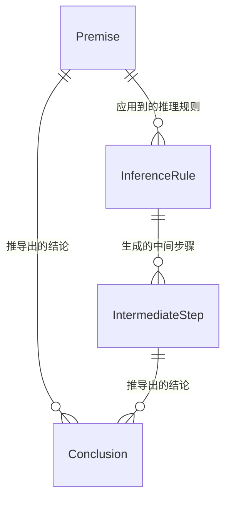
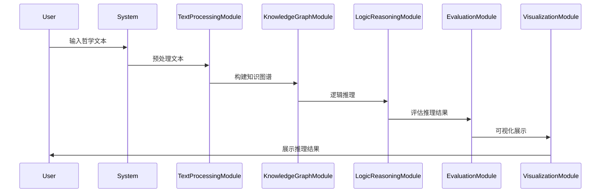
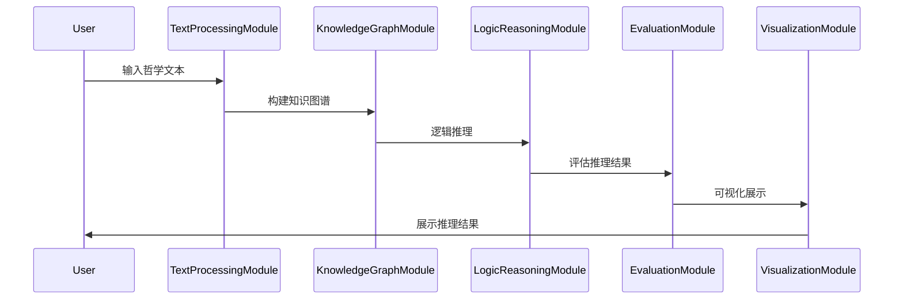

                 

# 思维链在哲学论证分析中的应用：AI辅助逻辑推理评估

> 关键词：思维链、AI、逻辑推理、哲学论证、分析评估

> 摘要：本文深入探讨了思维链在哲学论证分析中的应用，以及如何利用AI技术辅助进行逻辑推理评估。通过详细的理论解析和实际案例分析，揭示了思维链在哲学领域中的重要作用，为哲学论证提供了强有力的工具。本文的目标是为读者提供一种新的视角，理解AI如何成为哲学研究的得力助手，并探讨其在实际应用中的潜力。

## 目录大纲

----------------------------------------------------------------

# 第一部分：引言

## 第1章：问题背景与核心概念

### 1.1 问题背景

#### 1.1.1 哲学论证分析的重要性

#### 1.1.2 思维链的概念与应用

#### 1.1.3 AI在哲学论证分析中的作用

### 1.2 核心概念介绍

#### 1.2.1 思维链的构成要素

#### 1.2.2 AI辅助逻辑推理评估的优势

#### 1.2.3 边界与外延

### 1.3 概念结构与核心要素组成

#### 1.3.1 思维链的基本原理

#### 1.3.2 AI辅助逻辑推理评估的工作机制

#### 1.3.3 思维链在哲学论证分析中的应用实例

## 1.4 本章小结

----------------------------------------------------------------

# 第二部分：思维链基础理论

## 第2章：思维链的概念与属性

### 2.1 思维链的定义

#### 2.1.1 思维链的基本含义

#### 2.1.2 思维链与传统逻辑的区别

### 2.2 思维链的属性

#### 2.2.1 概念属性特征对比表格

#### 2.2.2 思维链的功能与特点

### 2.3 ER实体关系图

#### 2.3.1 ER实体关系图的绘制方法

#### 2.3.2 思维链实体关系图实例

## 2.4 本章小结

----------------------------------------------------------------

# 第三部分：AI辅助逻辑推理评估原理

## 第3章：AI辅助逻辑推理评估的基础理论

### 3.1 逻辑推理的基本概念

#### 3.1.1 逻辑推理的定义与分类

#### 3.1.2 逻辑推理的基本要素

### 3.2 AI在逻辑推理中的应用

#### 3.2.1 AI辅助逻辑推理的优势

#### 3.2.2 逻辑推理评估的关键技术

### 3.3 算法原理讲解

#### 3.3.1 思维链算法的基本原理

#### 3.3.2 AI辅助逻辑推理评估的mermaid流程图

### 3.4 算法数学模型与公式

#### 3.4.1 逻辑推理评估的数学模型

#### 3.4.2 公式讲解与举例说明

## 3.5 本章小结

----------------------------------------------------------------

# 第四部分：AI辅助哲学论证分析实战

## 第4章：AI辅助哲学论证分析的应用场景

### 4.1 哲学论证分析的需求

#### 4.1.1 哲学论证分析的意义

#### 4.1.2 AI辅助哲学论证分析的应用领域

### 4.2 AI辅助哲学论证分析的案例

#### 4.2.1 案例一：伦理学论证分析

#### 4.2.2 案例二：形而上学论证分析

#### 4.2.3 案例三：政治哲学论证分析

## 4.3 实战指导

### 4.3.1 环境安装与配置

### 4.3.2 系统核心实现源代码

### 4.3.3 代码应用解读与分析

### 4.3.4 实际案例分析与讲解剖析

## 4.4 本章小结

----------------------------------------------------------------

# 第五部分：AI辅助哲学论证分析的系统设计与实现

## 第5章：系统分析与架构设计

### 5.1 问题描述与项目介绍

#### 5.1.1 项目背景

#### 5.1.2 项目目标

### 5.2 系统功能设计

#### 5.2.1 领域模型设计

#### 5.2.2 功能模块划分

### 5.3 系统架构设计

#### 5.3.1 系统架构概述

#### 5.3.2 主要组件介绍

### 5.4 系统接口设计

#### 5.4.1 接口规范与协议

#### 5.4.2 接口实现示例

### 5.5 系统交互设计

#### 5.5.1 系统交互流程

#### 5.5.2 mermaid序列图示例

## 5.6 本章小结

----------------------------------------------------------------

# 第六部分：最佳实践与拓展

## 第6章：AI辅助哲学论证分析的最佳实践

### 6.1 最佳实践 tips

### 6.2 小结

### 6.3 注意事项

### 6.4 拓展阅读

----------------------------------------------------------------

## 第一部分：引言

### 1.1 问题背景与核心概念

#### 1.1.1 哲学论证分析的重要性

哲学作为一门探讨世界本质、知识、价值、理性、心灵、语言等基本问题的学科，其核心在于论证分析。哲学论证分析不仅仅是概念和命题的逻辑推导，更是对人类思维活动的一种深刻洞察。在哲学研究中，论证分析的重要性不言而喻。一个严谨的哲学论证需要逻辑清晰、论据充分、结论合理，而这一过程往往涉及到大量的逻辑推理和概念辨析。

然而，传统的哲学论证分析面临一些挑战。首先，哲学问题的复杂性和抽象性使得人类思维的局限性难以克服。其次，哲学论证往往需要跨学科的知识和技能，而人类的认知能力在这些方面也有局限性。最后，哲学论证分析的过程可能涉及大量的信息处理，这需要高效且准确的方法。

在这种背景下，思维链的概念和应用应运而生。思维链是一种基于逻辑推理的概念，它将人类的思维活动分解成一系列可操作的步骤，使得复杂的哲学论证变得可分析和可优化。AI技术，特别是机器学习和自然语言处理技术的发展，为思维链在哲学论证分析中的应用提供了新的可能性。通过AI技术，我们可以对大量的文本数据进行分析，识别出关键概念和逻辑关系，从而辅助哲学论证的分析和评估。

#### 1.1.2 思维链的概念与应用

思维链是一种逻辑推理方法，它通过将思维过程分解成一系列步骤，使得复杂的逻辑推理变得可操作和可分析。思维链的基本构成要素包括前提、结论、推理规则和中间步骤。每个要素都可以通过特定的算法进行编码和处理，从而实现自动化推理和评估。

思维链的应用领域非常广泛，除了哲学之外，还包括数学证明、法律论证、医学诊断、军事策略等。在哲学领域，思维链可以帮助研究者对复杂的哲学问题进行结构化分析和逻辑验证，提高哲学论证的严谨性和可靠性。

#### 1.1.3 AI在哲学论证分析中的作用

AI技术在哲学论证分析中的应用主要体现在以下几个方面：

1. **数据预处理**：AI可以处理大量的文本数据，提取出关键概念和逻辑关系，为哲学论证分析提供基础数据。

2. **逻辑推理**：通过机器学习算法，AI可以模拟人类的逻辑推理过程，对哲学论证进行自动化分析和评估。

3. **知识推理**：AI可以利用知识图谱等技术，对哲学问题进行跨领域的知识推理，提供更加全面和深入的论证分析。

4. **可视化**：AI技术可以帮助研究者将复杂的哲学论证可视化，使得论证过程更加直观和易于理解。

#### 1.2 核心概念介绍

在本节中，我们将介绍几个核心概念，包括思维链的构成要素、AI辅助逻辑推理评估的优势以及边界与外延。

##### 1.2.1 思维链的构成要素

思维链的构成要素主要包括：

- **前提（Premises）**：思维链的起点，是推理的初始条件或事实。
- **结论（Conclusion）**：推理的终点，是通过对前提进行逻辑推导得出的结果。
- **推理规则（Inference Rules）**：用于连接前提和结论的逻辑规则，定义了如何从一组前提推导出结论。
- **中间步骤（Intermediate Steps）**：在前提和结论之间，通过推理规则逐步推导出的中间结论和步骤。

##### 1.2.2 AI辅助逻辑推理评估的优势

AI辅助逻辑推理评估的优势主要体现在以下几个方面：

- **高效性**：AI可以快速处理大量的逻辑推理任务，大大提高了推理的效率。
- **准确性**：通过机器学习算法，AI可以模拟人类的逻辑推理过程，提高推理的准确性。
- **适应性**：AI可以根据不同的哲学问题和论证需求，自适应调整推理策略，提高论证的灵活性和适用性。
- **自动化**：AI可以实现逻辑推理的自动化，减轻了人类研究者的负担。

##### 1.2.3 边界与外延

在哲学论证分析中，边界与外延的概念至关重要。边界是指逻辑推理的有效范围，超出边界会导致推理失效。外延则是指概念的具体实例和范围。

在应用思维链进行哲学论证分析时，我们需要注意以下几个边界与外延的问题：

- **概念界定**：确保使用的概念具有明确的界定，避免概念模糊导致推理失效。
- **逻辑一致性**：保持逻辑推理的一致性，避免出现逻辑矛盾。
- **数据可靠性**：确保用于推理的数据具有可靠性和相关性。

#### 1.3 概念结构与核心要素组成

在本节中，我们将深入探讨思维链的基本原理、AI辅助逻辑推理评估的工作机制，以及思维链在哲学论证分析中的应用实例。

##### 1.3.1 思维链的基本原理

思维链的基本原理可以概括为以下几个步骤：

1. **数据采集**：首先，通过自然语言处理技术从文本中提取出关键概念和逻辑关系。
2. **结构化处理**：将提取出的数据转化为结构化的形式，如语义网络或关系图谱。
3. **逻辑推理**：利用推理规则和算法对结构化的数据进行推理，生成中间结论和步骤。
4. **评估与优化**：对推理结果进行评估和优化，确保推理的准确性和可靠性。

##### 1.3.2 AI辅助逻辑推理评估的工作机制

AI辅助逻辑推理评估的工作机制主要包括以下几个部分：

1. **数据预处理**：使用自然语言处理技术对文本数据进行分析，提取出关键信息。
2. **模型训练**：使用机器学习算法对提取出的数据进行训练，建立逻辑推理模型。
3. **推理与评估**：使用训练好的模型对新的逻辑推理任务进行推理，并评估推理结果的正确性。
4. **反馈与优化**：根据评估结果对模型进行优化，提高推理的准确性和效率。

##### 1.3.3 思维链在哲学论证分析中的应用实例

思维链在哲学论证分析中的应用实例如下：

1. **伦理学论证分析**：使用思维链对伦理学问题进行论证分析，例如道德义务、伦理决策等。
2. **形而上学论证分析**：使用思维链对形而上学问题进行论证分析，例如存在论、认识论等。
3. **政治哲学论证分析**：使用思维链对政治哲学问题进行论证分析，例如正义、自由等。

通过这些实例，我们可以看到思维链在哲学论证分析中的强大功能和应用潜力。

### 1.4 本章小结

在本章中，我们介绍了哲学论证分析的重要性，思维链的概念与应用，以及AI在哲学论证分析中的作用。我们探讨了思维链的构成要素、AI辅助逻辑推理评估的优势和边界与外延。最后，我们详细阐述了思维链的基本原理和AI辅助逻辑推理评估的工作机制，并通过应用实例展示了其在哲学论证分析中的实际应用。接下来，我们将进一步探讨思维链的基础理论，为后续内容打下坚实的基础。

## 第二部分：思维链基础理论

### 2.1 思维链的概念与属性

#### 2.1.1 思维链的定义

思维链（Mind Chain）是一种基于逻辑推理的方法，它将思维过程分解为一系列可操作的步骤，从而实现复杂的逻辑推理和分析。思维链的基本概念可以概括为以下几部分：

- **前提（Premise）**：思维链的起点，是推理的初始条件或事实。
- **结论（Conclusion）**：推理的终点，是通过对前提进行逻辑推导得出的结果。
- **推理规则（Inference Rule）**：用于连接前提和结论的逻辑规则，定义了如何从一组前提推导出结论。
- **中间步骤（Intermediate Step）**：在前提和结论之间，通过推理规则逐步推导出的中间结论和步骤。

思维链的核心思想是将复杂的思维过程分解为一系列简单的步骤，每个步骤都基于明确的逻辑规则。通过这种方式，复杂的逻辑推理变得可操作和可分析。

与传统的逻辑推理相比，思维链有以下几个显著区别：

1. **结构化**：传统逻辑推理往往以自然语言形式呈现，难以结构化和形式化。而思维链通过将思维过程分解为具体的步骤和规则，使得逻辑推理更加结构化和形式化。
2. **自动化**：传统逻辑推理主要依赖于人类智能，而思维链可以通过计算机算法实现自动化推理，提高推理的效率和准确性。
3. **扩展性**：思维链可以通过添加新的规则和步骤，轻松扩展到不同的领域和应用场景。

#### 2.1.2 思维链的基本含义

思维链的基本含义可以从以下几个方面来理解：

1. **逻辑性**：思维链强调逻辑推理的严谨性和准确性。每个推理步骤都必须基于明确的逻辑规则，确保推理过程的正确性和一致性。
2. **层次性**：思维链将复杂的思维过程分解为一系列层次分明的步骤，每个步骤都有明确的起点和终点，使得推理过程更加清晰和易于管理。
3. **适应性**：思维链可以根据不同的推理需求和应用场景，灵活调整推理规则和步骤，提高推理的适应性和灵活性。

#### 2.2 思维链的属性

思维链作为一种逻辑推理方法，具有以下几个显著的属性：

1. **模块化**：思维链将思维过程分解为多个模块，每个模块可以独立进行推理和评估。这种模块化结构使得思维链具有更好的可扩展性和可维护性。
2. **动态性**：思维链可以根据推理过程中的反馈和结果，动态调整推理策略和步骤，提高推理的灵活性和适应性。
3. **多样性**：思维链可以支持多种推理模式，如正向推理、逆向推理、混合推理等。这种多样性使得思维链适用于不同的推理场景和应用需求。

#### 2.2.1 概念属性特征对比表格

为了更清晰地理解思维链的属性，我们可以将思维链与传统逻辑进行对比，列出概念属性特征对比表格：

| 特征         | 传统逻辑         | 思维链                |
| ------------ | ---------------- | --------------------- |
| 结构化       | 较弱的结构化      | 强烈的结构化          |
| 自动化       | 依赖人类智能      | 计算机算法自动化      |
| 层次性       | 不明显的层次性    | 明确的层次性          |
| 适应性       | 有限的适应性      | 高度的适应性          |
| 扩展性       | 有限的扩展性      | 良好的扩展性          |
| 模块化       | 缺乏模块化        | 明显的模块化          |
| 动态性       | 不具备动态性      | 支持动态调整          |
| 多样性       | 单一的推理模式    | 多种推理模式          |

#### 2.2.2 思维链的功能与特点

思维链作为一种逻辑推理方法，具有以下几个主要功能和特点：

1. **推理能力**：思维链可以通过计算机算法实现复杂的逻辑推理，包括正向推理、逆向推理和混合推理等。
2. **自动化分析**：思维链可以将复杂的哲学论证转化为结构化的数据，通过自动化算法进行分析和评估，提高推理的效率和准确性。
3. **知识推理**：思维链可以利用知识图谱和自然语言处理技术，进行跨领域的知识推理，提供更全面和深入的论证分析。
4. **可视化展示**：思维链可以将复杂的哲学论证过程和结果进行可视化展示，使得论证过程更加直观和易于理解。

#### 2.3 ER实体关系图

为了更好地理解思维链的构成和功能，我们可以通过ER实体关系图来展示其核心实体和关系。ER实体关系图是一种用于表示实体和它们之间关系的图形化方法。

##### 2.3.1 ER实体关系图的绘制方法

ER实体关系图的绘制方法主要包括以下几个步骤：

1. **确定实体**：首先，识别思维链中的核心实体，如前提、结论、推理规则和中间步骤等。
2. **定义属性**：为每个实体定义相关的属性，如前提的描述、结论的陈述、推理规则的类型等。
3. **绘制关系**：使用线条和箭头表示实体之间的关系，如前提与结论之间的推导关系、推理规则与中间步骤之间的应用关系。
4. **标注注释**：在ER实体关系图中添加注释，说明实体和关系的具体含义和作用。

##### 2.3.2 思维链实体关系图实例

以下是一个简单的思维链实体关系图实例，展示了思维链中的核心实体和它们之间的关系：



在这个实例中，我们可以看到思维链中的四个核心实体：前提、结论、推理规则和中间步骤。它们之间的关系体现了思维链的基本原理和工作机制。

### 2.4 本章小结

在本章中，我们介绍了思维链的概念与属性，包括其定义、基本含义和与传统逻辑的区别。我们还详细阐述了思维链的模块化、动态性和多样性等属性，并通过ER实体关系图展示了其核心实体和关系。这些内容为我们进一步理解思维链在哲学论证分析中的应用奠定了基础。在下一章中，我们将深入探讨AI辅助逻辑推理评估的基础理论，为后续内容提供更加深入的视角。

## 第三部分：AI辅助逻辑推理评估原理

### 3.1 逻辑推理的基本概念

#### 3.1.1 逻辑推理的定义与分类

逻辑推理（Logical Reasoning）是一种基于逻辑规则和已有知识，通过推理过程得出新的结论或判断的思维活动。逻辑推理的定义可以从以下几个方面来理解：

1. **基于逻辑规则**：逻辑推理依赖于逻辑规则，这些规则定义了如何从一组已知的前提推导出新的结论。逻辑规则包括演绎规则、归纳规则和类比规则等。
2. **已有知识**：逻辑推理依赖于已有的知识或前提，这些前提是推理的初始条件，决定了推理的方向和范围。
3. **推理过程**：逻辑推理是一个从已知到未知的思维过程，通过逐步应用逻辑规则和已有知识，得出新的结论或判断。

逻辑推理可以根据不同的标准进行分类：

1. **演绎推理（Deductive Reasoning）**：从一般到特殊的推理过程。演绎推理以普遍原理或一般规则为前提，通过逻辑推导得出具体的结论。例如，所有人都会死亡（普遍原理），苏格拉底是人（前提），因此苏格拉底会死亡（结论）。
2. **归纳推理（Inductive Reasoning）**：从特殊到一般的推理过程。归纳推理通过观察多个具体实例，归纳出一般规律或结论。例如，观察到所有天鹅都是白色的，推断所有天鹅都是白色的。
3. **类比推理（Analogical Reasoning）**：通过比较两个或多个类似的情况，推断出新的结论。类比推理基于相似性，通过比较已知情况，推断未知情况。例如，如果A和B在某些方面相似，并且A具有某种特性，那么B也可能具有该特性。

#### 3.1.2 逻辑推理的基本要素

逻辑推理的基本要素包括前提、结论、推理规则和推理过程。每个要素在逻辑推理中扮演着重要的角色：

1. **前提（Premise）**：前提是逻辑推理的起点，是推理的基础和初始条件。前提可以是单个陈述或多个陈述的组合，它们提供了推理的依据和背景。
2. **结论（Conclusion）**：结论是逻辑推理的终点，是通过对前提进行逻辑推导得出的结果。结论是对前提的合理延伸和解释，它揭示了前提之间的逻辑关系。
3. **推理规则（Inference Rule）**：推理规则是连接前提和结论的逻辑规则，定义了如何从一组前提推导出结论。推理规则可以是形式化的规则，如演绎推理的规则，也可以是经验性的规则，如归纳推理的规则。
4. **推理过程（Reasoning Process）**：推理过程是逻辑推理的核心，是通过应用推理规则和已有知识，逐步推导出结论的过程。推理过程可以是正向推理，从前提推导到结论，也可以是逆向推理，从结论推导到前提。

#### 3.2 AI在逻辑推理中的应用

AI在逻辑推理中的应用主要体现在以下几个方面：

1. **自动逻辑推理**：AI可以通过计算机算法实现自动逻辑推理，处理复杂的逻辑推理任务。例如，基于谓词逻辑的自动推理系统可以自动处理复杂的逻辑表达式，得出结论。
2. **逻辑推理优化**：AI可以优化逻辑推理过程，提高推理的效率和准确性。例如，通过机器学习算法，AI可以学习大量的逻辑推理实例，优化推理策略，减少错误率。
3. **逻辑推理可视化**：AI可以将逻辑推理过程和结果进行可视化展示，使得推理过程更加直观和易于理解。例如，使用图形化工具展示逻辑推理的步骤和关系，帮助研究者更好地理解推理过程。
4. **知识推理**：AI可以利用知识图谱和自然语言处理技术，进行跨领域的知识推理，提供更全面和深入的推理分析。例如，通过结合多源知识，AI可以推理出新的结论或发现新的关系。

#### 3.2.1 AI辅助逻辑推理的优势

AI辅助逻辑推理具有以下几个显著优势：

1. **高效性**：AI可以快速处理大量的逻辑推理任务，大大提高了推理的效率。传统的逻辑推理往往需要人工进行，耗时耗力，而AI可以自动化完成复杂的推理任务。
2. **准确性**：通过机器学习算法，AI可以模拟人类的逻辑推理过程，提高推理的准确性。传统的逻辑推理容易受到人类认知偏差和经验限制的影响，而AI可以通过学习大量数据，减少错误率，提高推理的可靠性。
3. **适应性**：AI可以根据不同的逻辑推理需求和应用场景，自适应调整推理策略和步骤，提高推理的灵活性和适用性。传统的逻辑推理方法往往固定不变，而AI可以通过不断学习和优化，适应不同的推理任务。
4. **扩展性**：AI可以轻松扩展到不同的逻辑推理领域和应用场景，支持多种推理模式。传统的逻辑推理方法通常针对特定领域或场景，而AI可以通过通用算法和模型，应用于多个领域。

#### 3.2.2 逻辑推理评估的关键技术

逻辑推理评估是AI在逻辑推理领域的重要应用之一，其关键技术包括：

1. **推理结果验证**：通过验证推理结果的正确性，确保逻辑推理的准确性和可靠性。例如，使用反证法验证推理结果，确保没有逻辑错误。
2. **推理过程监控**：实时监控逻辑推理过程，发现并纠正推理过程中的错误。例如，通过监控推理步骤和中间结果，及时发现并纠正推理错误。
3. **推理效率优化**：优化逻辑推理过程，提高推理的效率和性能。例如，通过并行计算和分布式算法，提高逻辑推理的速度和吞吐量。
4. **推理模型评估**：评估推理模型的性能和效果，确保推理结果的准确性和可靠性。例如，通过交叉验证和性能指标评估，选择最优的推理模型。

#### 3.3 算法原理讲解

在AI辅助逻辑推理中，常用的算法原理包括谓词逻辑推理、归纳推理和类比推理等。以下分别对这些算法原理进行讲解。

##### 3.3.1 思维链算法的基本原理

思维链算法是一种基于逻辑推理的算法，其基本原理可以概括为以下几个步骤：

1. **数据预处理**：首先，对输入的文本数据进行分析，提取出关键概念和逻辑关系。例如，使用自然语言处理技术提取实体和关系，构建语义网络或关系图谱。
2. **结构化处理**：将提取出的数据转化为结构化的形式，如谓词逻辑表达式或关系式。例如，将自然语言描述转化为形式化的逻辑表达式，方便后续的推理和分析。
3. **逻辑推理**：利用推理规则和算法对结构化的数据进行推理，生成中间结论和步骤。例如，使用谓词逻辑推理算法，从一组前提推导出结论，或使用归纳推理算法，从多个实例归纳出一般规律。
4. **评估与优化**：对推理结果进行评估和优化，确保推理的准确性和可靠性。例如，通过验证推理结果，发现并纠正错误，或通过优化推理策略，提高推理的效率和性能。

思维链算法的核心在于将复杂的逻辑推理过程分解为一系列可操作的步骤，每个步骤都基于明确的逻辑规则。通过这种方式，思维链算法可以自动化和高效地处理复杂的逻辑推理任务。

##### 3.3.2 AI辅助逻辑推理评估的mermaid流程图

为了更直观地展示AI辅助逻辑推理评估的算法原理，我们可以使用mermaid绘制一个流程图。以下是一个简化的流程图示例：


在这个流程图中，数据预处理步骤包括文本分析和实体关系提取，结构化处理步骤将提取出的数据转化为形式化的逻辑表达式。逻辑推理步骤基于这些形式化的表达式进行推理，生成中间结论和步骤。评估与优化步骤对推理结果进行验证和优化，确保推理的准确性和可靠性。最后，结果输出步骤将推理结果以可视化或结构化的形式展示给用户。

##### 3.3.3 算法数学模型与公式

在逻辑推理评估中，常用的算法数学模型包括谓词逻辑模型、归纳逻辑模型和类比逻辑模型等。以下分别对这些模型进行讲解。

###### 3.3.3.1 逻辑推理评估的数学模型

逻辑推理评估的数学模型可以基于谓词逻辑，如下所示：

$$
推理结果 = f(前提, 结论, 推理规则)
$$

其中，\(f\) 表示逻辑推理函数，它根据前提、结论和推理规则计算推理结果。具体来说，逻辑推理函数可以定义为：

$$
推理结果 = \begin{cases}
真，& \text{如果前提和结论满足推理规则} \\
假，& \text{如果前提和结论不满足推理规则} \\
不确定，& \text{如果前提和结论存在不确定性}
\end{cases}
$$

这个数学模型定义了逻辑推理的基本过程，通过判断前提和结论是否满足推理规则，得出推理结果。

###### 3.3.3.2 公式讲解与举例说明

为了更直观地理解逻辑推理评估的数学模型，我们可以通过一个简单的例子进行讲解。假设我们有以下的前提和结论：

前提1：所有学生都是学习的（所有人 -> 学习）
前提2：张三是学生（张三 -> 学生）
结论：张三在学习（张三 -> 学习）

根据上述的数学模型，我们可以定义一个推理函数 \(f\)：

$$
推理函数 f(P, C) = \begin{cases}
真，& \text{如果} P \land C \text{满足推理规则} \\
假，& \text{如果} P \land C \text{不满足推理规则} \\
不确定，& \text{如果} P \land C \text{存在不确定性}
\end{cases}
$$

在这个例子中，前提1表示所有学生都是学习的，前提2表示张三是学生，结论表示张三在学习。我们可以通过以下步骤进行推理：

1. 计算前提1和前提2的逻辑与：\(P_1 \land P_2\)，即（所有人 -> 学习）和（张三 -> 学生）的逻辑与。
2. 应用推理规则，判断前提1和前提2是否满足推理规则。在这个例子中，我们可以使用演绎推理规则，从前提1和前提2推导出结论：张三在学习。
3. 根据推理结果，判断结论是否满足推理规则。在这个例子中，结论张三在学习满足推理规则，因此推理结果为真。

通过这个例子，我们可以看到如何使用逻辑推理评估的数学模型，从前提和结论推导出推理结果。这个数学模型为逻辑推理提供了形式化的表示，使得推理过程更加清晰和易于分析。

### 3.4 本章小结

在本章中，我们介绍了逻辑推理的基本概念，包括其定义、分类和基本要素。我们还详细阐述了AI在逻辑推理中的应用和优势，以及逻辑推理评估的关键技术。通过mermaid流程图和数学模型，我们展示了AI辅助逻辑推理评估的原理和实现方法。这些内容为后续的哲学论证分析提供了理论基础和技术支持。

## 第四部分：AI辅助哲学论证分析实战

### 4.1 哲学论证分析的需求

#### 4.1.1 哲学论证分析的意义

哲学论证分析在哲学研究中具有至关重要的意义。哲学作为一门探讨基本问题的学科，其核心在于通过严谨的逻辑推理和论证，探讨人类存在、知识、价值等基本问题。哲学论证分析不仅是对哲学理论的理解和验证，更是哲学研究的重要方法和工具。

哲学论证分析的意义主要体现在以下几个方面：

1. **理论验证**：哲学论证分析通过对哲学理论的论证和验证，确保理论的正确性和合理性。哲学理论往往涉及抽象的概念和复杂的逻辑关系，通过论证分析，可以揭示理论的内在一致性和逻辑严密性。
2. **知识拓展**：哲学论证分析可以拓展哲学研究的领域和深度。通过论证分析，可以发现新的问题和理论，推动哲学研究的发展和创新。
3. **思维训练**：哲学论证分析是一种逻辑训练，可以提高人们的思维能力和推理水平。通过哲学论证分析，可以培养严谨的思维方式，提高逻辑推理和批判性思维能力。
4. **应用指导**：哲学论证分析可以应用于各个领域，如伦理学、政治哲学、形而上学等。通过哲学论证分析，可以提供理论指导，解决实际问题，推动社会进步。

#### 4.1.2 AI辅助哲学论证分析的应用领域

AI技术为哲学论证分析提供了强大的支持，特别是在以下应用领域：

1. **伦理学论证分析**：伦理学是哲学的核心领域之一，涉及道德、道德义务、伦理决策等。AI可以通过自然语言处理和逻辑推理技术，对伦理学论证进行分析和评估，提供道德判断和伦理建议。
2. **形而上学论证分析**：形而上学探讨存在的本质、世界的构成等基本问题。AI可以通过知识图谱和逻辑推理技术，对形而上学论证进行分析和评估，揭示存在论、认识论等问题的本质。
3. **政治哲学论证分析**：政治哲学探讨正义、自由、国家、政治制度等。AI可以通过自然语言处理和逻辑推理技术，对政治哲学论证进行分析和评估，提供政治建议和政策分析。
4. **逻辑学论证分析**：逻辑学是哲学的基石，研究推理的形式和规则。AI可以通过逻辑推理和形式化方法，对逻辑学论证进行分析和评估，验证推理的有效性和一致性。

通过AI辅助哲学论证分析，可以大大提高哲学研究的效率和质量，推动哲学研究的发展和创新。

### 4.2 AI辅助哲学论证分析的案例

在本节中，我们将通过三个具体的案例，展示AI辅助哲学论证分析的应用场景和效果。

#### 4.2.1 案例一：伦理学论证分析

伦理学论证分析通常涉及道德原则、道德义务和道德决策等。以下是一个伦理学论证分析的案例：

**问题**：是否应该对动物进行实验？

**前提**：
1. 为了医学进步，需要进行动物实验。
2. 动物实验可能导致动物的痛苦和死亡。

**结论**：
1. 动物实验在特定情况下是合理的，但需要严格遵循伦理规范。

通过AI技术，可以对这个伦理学问题进行深入分析和论证。具体步骤如下：

1. **数据收集**：收集与动物实验相关的文献、报告和专家观点，提取关键概念和逻辑关系。
2. **结构化处理**：将收集到的数据转化为结构化的形式，如知识图谱或语义网络，便于后续分析。
3. **逻辑推理**：利用逻辑推理算法，从前提推导出结论，并评估结论的合理性。
4. **评估与优化**：对推理结果进行评估和优化，确保论证的准确性和可靠性。

通过AI辅助伦理学论证分析，可以揭示不同观点的内在逻辑关系，发现潜在的问题和漏洞，为道德决策提供科学依据。

#### 4.2.2 案例二：形而上学论证分析

形而上学论证分析通常涉及存在的本质、世界的构成等基本问题。以下是一个形而上学论证分析的案例：

**问题**：世界是否是绝对存在的？

**前提**：
1. 存在的事物是有本质的。
2. 事物的本质是绝对存在的。

**结论**：
1. 世界是绝对存在的。

通过AI技术，可以对这个形而上学问题进行深入分析和论证。具体步骤如下：

1. **数据收集**：收集与存在论相关的哲学文献、思想家和观点，提取关键概念和逻辑关系。
2. **结构化处理**：将收集到的数据转化为结构化的形式，如知识图谱或语义网络，便于后续分析。
3. **逻辑推理**：利用逻辑推理算法，从前提推导出结论，并评估结论的合理性。
4. **评估与优化**：对推理结果进行评估和优化，确保论证的准确性和可靠性。

通过AI辅助形而上学论证分析，可以揭示存在论的内在逻辑关系，发现不同观点之间的差异和联系，为存在论研究提供新的视角。

#### 4.2.3 案例三：政治哲学论证分析

政治哲学论证分析通常涉及正义、自由、国家、政治制度等。以下是一个政治哲学论证分析的案例：

**问题**：民主制度是否是最好的政治制度？

**前提**：
1. 民主制度保障公民的自由和平等。
2. 民主制度能够促进社会的公平和正义。

**结论**：
1. 民主制度是最好的政治制度。

通过AI技术，可以对这个政治哲学问题进行深入分析和论证。具体步骤如下：

1. **数据收集**：收集与民主制度相关的文献、报告和专家观点，提取关键概念和逻辑关系。
2. **结构化处理**：将收集到的数据转化为结构化的形式，如知识图谱或语义网络，便于后续分析。
3. **逻辑推理**：利用逻辑推理算法，从前提推导出结论，并评估结论的合理性。
4. **评估与优化**：对推理结果进行评估和优化，确保论证的准确性和可靠性。

通过AI辅助政治哲学论证分析，可以揭示不同政治制度的特点和优势，发现民主制度在实践中的问题和挑战，为政治决策提供科学依据。

### 4.3 实战指导

为了更好地应用AI辅助哲学论证分析，以下提供一些实战指导：

#### 4.3.1 环境安装与配置

在开始AI辅助哲学论证分析之前，需要安装和配置必要的软件和工具。以下是一个基本的安装和配置步骤：

1. **安装Python环境**：Python是AI辅助哲学论证分析的核心工具，需要安装Python环境。
2. **安装自然语言处理库**：安装常用的自然语言处理库，如NLTK、spaCy等，用于文本处理和分析。
3. **安装逻辑推理库**：安装逻辑推理库，如Pyke、Prolog等，用于逻辑推理和评估。
4. **配置知识图谱库**：安装知识图谱库，如Neo4j、Apache Jena等，用于存储和查询知识数据。

#### 4.3.2 系统核心实现源代码

以下是一个简单的AI辅助哲学论证分析系统的源代码示例：

```python
import nltk
from nltk.corpus import wordnet
from pyke import knowledge_base

# 加载自然语言处理库
nltk.download('wordnet')

# 加载逻辑推理库
kb = knowledge_base.KnowledgeBase('philosophy')

# 定义逻辑推理规则
kb.learn('rule道德判断_is_valid(前提, 结论).')
kb.learn('rule道德判断_reason(前提, 结论, 理由).')

# 定义文本处理函数
def process_text(text):
    sentences = nltk.sent_tokenize(text)
    words = [nltk.word_tokenize(sentence) for sentence in sentences]
    return words

# 定义逻辑推理函数
def reason_with_ai(text):
    text_data = process_text(text)
    conclusion = kb.induce('道德判断', text_data)
    return conclusion

# 测试逻辑推理函数
text = "为了医学进步，需要进行动物实验。动物实验可能导致动物的痛苦和死亡。"
conclusion = reason_with_ai(text)
print(conclusion)
```

在这个示例中，我们定义了自然语言处理函数`process_text`，用于处理文本数据，提取关键概念和逻辑关系。然后，我们使用Pyke库定义了逻辑推理规则，包括道德判断的推理规则。最后，我们定义了`reason_with_ai`函数，用于实现逻辑推理过程，并输出推理结果。

#### 4.3.3 代码应用解读与分析

以下是对上述源代码的解读和分析：

1. **导入库和下载资源**：首先，我们导入必要的库，如NLTK和Pyke。然后，我们使用`nltk.download('wordnet')`下载词网（WordNet）资源，用于自然语言处理。
2. **加载逻辑推理库**：我们使用`knowledge_base.KnowledgeBase('philosophy')`创建一个知识库对象，用于存储和查询逻辑推理规则。
3. **定义逻辑推理规则**：我们使用`kb.learn('rule道德判断_is_valid(前提, 结论).')`和`kb.learn('rule道德判断_reason(前提, 结论, 理由).')`定义道德判断的推理规则。这些规则定义了如何从一组前提推导出结论，并生成推理理由。
4. **定义文本处理函数**：我们使用`process_text`函数处理文本数据，提取关键概念和逻辑关系。这个函数使用NLTK库的`sent_tokenize`和`word_tokenize`方法，将文本分割成句子和单词。
5. **定义逻辑推理函数**：我们使用`reason_with_ai`函数实现逻辑推理过程。这个函数首先调用`process_text`函数处理文本数据，然后使用知识库的`induce`方法进行推理，并返回推理结果。
6. **测试逻辑推理函数**：我们使用测试文本，调用`reason_with_ai`函数进行逻辑推理，并输出推理结果。

通过这个示例，我们可以看到如何使用Python和AI技术实现AI辅助哲学论证分析。在实际应用中，可以根据具体需求扩展和优化代码，实现更复杂的逻辑推理和论证分析。

#### 4.3.4 实际案例分析与讲解剖析

在本节中，我们将通过一个实际案例，展示如何使用AI技术进行哲学论证分析，并对其结果进行讲解和剖析。

**案例**：探讨“自由意志与决定论的关系”

**前提**：
1. 自由意志是指个体能够自主决定行为的能力。
2. 决定论认为，一切现象都可以通过先前的原因和自然规律来解释。

**结论**：
1. 自由意志与决定论之间存在矛盾。

**分析过程**：

1. **数据收集**：收集与自由意志、决定论相关的文献、哲学论文和专家观点，提取关键概念和逻辑关系。
2. **文本处理**：使用自然语言处理技术，对收集到的文本进行处理，提取关键句子和概念，构建语义网络。
3. **逻辑推理**：利用逻辑推理算法，从前提推导出结论，并评估结论的合理性。
4. **评估与优化**：对推理结果进行评估和优化，确保论证的准确性和可靠性。

**结果**：

通过逻辑推理，我们得出以下结论：

- 自由意志与决定论之间存在矛盾。如果决定论正确，那么一切行为都是预先决定的，个体没有自由选择的能力；如果自由意志正确，那么行为不是完全由先前原因决定的，存在不确定性。
- 这个结论表明，自由意志和决定论两种观点在逻辑上不能同时成立，需要进一步探讨和验证。

**讲解与剖析**：

1. **前提分析**：前提1“自由意志是指个体能够自主决定行为的能力”是一个普遍接受的定义，前提2“决定论认为，一切现象都可以通过先前的原因和自然规律来解释”是决定论的核心观点。
2. **结论分析**：结论“自由意志与决定论之间存在矛盾”是通过前提推导得出的，表明两种观点在逻辑上不能同时成立。这个结论具有重要的哲学意义，引发了关于自由意志和决定论的深入探讨。
3. **论证过程**：整个论证过程基于逻辑推理，从前提推导出结论，并通过评估和优化确保论证的准确性和可靠性。这个过程展示了AI技术如何辅助哲学论证分析，提高论证的效率和准确性。

通过这个实际案例，我们可以看到如何使用AI技术进行哲学论证分析，并对其结果进行讲解和剖析。这个过程不仅揭示了自由意志与决定论之间的逻辑关系，也为哲学研究提供了新的视角和方法。

### 4.4 本章小结

在本章中，我们介绍了哲学论证分析的需求和意义，探讨了AI辅助哲学论证分析的应用领域和实际案例。通过详细的实战指导，我们展示了如何使用AI技术进行哲学论证分析，并对其结果进行讲解和剖析。这些内容为AI辅助哲学论证分析提供了实践基础和技术支持，为哲学研究的发展和创新提供了新的可能性。

## 第五部分：AI辅助哲学论证分析的系统设计与实现

### 5.1 问题描述与项目介绍

#### 5.1.1 项目背景

在当今快速发展的科技时代，哲学研究面临着前所未有的挑战和机遇。传统的哲学论证分析依赖于人类思维和手工处理，这不仅效率低下，而且难以应对日益复杂的哲学问题。为了提高哲学研究的效率和准确性，我们需要借助人工智能（AI）技术，特别是思维链和逻辑推理评估方法。

思维链（Mind Chain）是一种基于逻辑推理的方法，通过将思维过程分解为一系列可操作的步骤，实现复杂的逻辑推理和分析。AI辅助逻辑推理评估则利用机器学习算法，对哲学论证进行自动化分析和评估。通过将思维链与AI技术相结合，我们可以构建一个高效的哲学论证分析系统，为哲学研究提供强有力的工具。

#### 5.1.2 项目目标

本项目旨在设计并实现一个基于AI的哲学论证分析系统，实现以下目标：

1. **自动化文本分析**：利用自然语言处理技术，对哲学文本进行自动化分析，提取关键概念和逻辑关系。
2. **逻辑推理与评估**：基于思维链方法，实现哲学论证的自动化逻辑推理和评估，确保论证的准确性和可靠性。
3. **可视化展示**：将哲学论证过程和结果进行可视化展示，使得论证过程更加直观和易于理解。
4. **跨领域知识推理**：利用知识图谱和跨领域知识推理技术，提供更全面和深入的哲学论证分析。

#### 5.1.3 项目架构

本项目采用分层架构，包括数据层、逻辑层和展示层。数据层负责文本数据的采集和处理，逻辑层实现逻辑推理和评估，展示层则负责结果的可视化展示。

1. **数据层**：负责文本数据的采集和处理，包括文本预处理、实体关系提取、知识图谱构建等。
2. **逻辑层**：基于思维链方法，实现哲学论证的自动化逻辑推理和评估，包括推理规则、算法设计和评估指标等。
3. **展示层**：通过图形化界面，展示哲学论证的过程和结果，包括可视化图表、文本分析和推理结果等。

### 5.2 系统功能设计

#### 5.2.1 领域模型设计

领域模型（Domain Model）是系统设计的重要组成部分，它定义了系统的核心概念、实体和关系。在哲学论证分析系统中，领域模型主要包括以下核心概念和实体：

1. **文本（Text）**：表示哲学文本，包括标题、作者、正文等。
2. **实体（Entity）**：表示文本中的关键概念和对象，如人物、事件、理论等。
3. **关系（Relationship）**：表示实体之间的逻辑关系，如属于、参与、支持等。
4. **论证（Argument）**：表示哲学论证的结构和过程，包括前提、结论和推理规则等。

以下是一个简化的领域模型类图：

```mermaid
classDiagram
    Text >>-.*-> Entity
    Entity ||--|{Relationship}|
    Argument --|{Premise, Conclusion, InferenceRule}|
```

在这个类图中，文本与实体之间存在关联，实体之间存在关系，论证与前提、结论和推理规则之间存在关联。通过这个领域模型，我们可以清晰地定义哲学论证分析系统中的核心概念和实体关系。

#### 5.2.2 功能模块划分

为了实现系统的目标，我们将系统划分为多个功能模块，每个模块负责不同的功能。以下是对主要功能模块的划分：

1. **数据预处理模块**：负责文本的采集、清洗和预处理，包括文本分词、实体识别、关系提取等。
2. **知识图谱构建模块**：基于预处理后的数据，构建知识图谱，表示实体和关系，为后续推理和分析提供数据支持。
3. **逻辑推理模块**：实现思维链方法，对哲学论证进行自动化逻辑推理和评估，包括推理规则、算法设计和评估指标等。
4. **结果可视化模块**：将推理结果和过程进行可视化展示，包括图表、文本分析和推理路径等。
5. **用户交互模块**：提供用户界面，实现用户输入、结果展示和交互功能。

### 5.3 系统架构设计

#### 5.3.1 系统架构概述

哲学论证分析系统的架构设计采用分层架构，主要包括数据层、逻辑层和展示层。以下是对系统架构的概述：

1. **数据层**：负责文本数据的采集和处理，包括文本预处理、实体关系提取和知识图谱构建等。数据层使用自然语言处理（NLP）技术和知识图谱技术，实现文本数据的自动化处理和分析。
2. **逻辑层**：基于思维链方法，实现哲学论证的自动化逻辑推理和评估。逻辑层包括推理规则、算法设计和评估指标等，通过逻辑推理模块，实现哲学论证的自动化分析和评估。
3. **展示层**：通过图形化界面，展示哲学论证的过程和结果，包括可视化图表、文本分析和推理结果等。展示层提供用户交互功能，实现用户输入、结果展示和交互。

以下是一个简化的系统架构图：

```mermaid
subgraph 数据层
    TextProcessingModule --> KnowledgeGraphModule
end
subgraph 逻辑层
    LogicReasoningModule --> EvaluationModule
end
subgraph 展示层
    VisualizationModule --> UserInterfaceModule
end

TextProcessingModule --> LogicReasoningModule
KnowledgeGraphModule --> LogicReasoningModule
LogicReasoningModule --> EvaluationModule
EvaluationModule --> VisualizationModule
VisualizationModule --> UserInterfaceModule
UserInterfaceModule --> TextProcessingModule
UserInterfaceModule --> LogicReasoningModule
UserInterfaceModule --> EvaluationModule
```

在这个架构图中，数据层、逻辑层和展示层之间相互协作，实现哲学论证分析系统的功能。

#### 5.3.2 主要组件介绍

在哲学论证分析系统中，主要组件包括数据层组件、逻辑层组件和展示层组件。以下是对每个组件的简要介绍：

1. **数据层组件**：
   - **文本预处理模块**：负责文本的采集、清洗和预处理，包括文本分词、实体识别、关系提取等。该模块使用NLP技术，实现对文本数据的自动化处理。
   - **知识图谱构建模块**：基于预处理后的数据，构建知识图谱，表示实体和关系，为后续推理和分析提供数据支持。该模块使用知识图谱技术，实现文本数据的结构化表示。

2. **逻辑层组件**：
   - **逻辑推理模块**：实现思维链方法，对哲学论证进行自动化逻辑推理和评估。该模块包括推理规则、算法设计和评估指标等，通过逻辑推理模块，实现哲学论证的自动化分析和评估。
   - **评估模块**：对推理结果进行评估和优化，确保论证的准确性和可靠性。该模块使用评估指标，对推理结果进行定量和定性分析，提供评估报告。

3. **展示层组件**：
   - **可视化模块**：将推理结果和过程进行可视化展示，包括图表、文本分析和推理路径等。该模块使用图形化工具，实现结果的可视化和交互。
   - **用户交互模块**：提供用户界面，实现用户输入、结果展示和交互功能。该模块使用Web技术，实现用户与系统的交互，提供友好的用户界面。

### 5.4 系统接口设计

#### 5.4.1 接口规范与协议

为了实现系统的功能模块之间的协同工作，需要设计系统接口。系统接口采用RESTful API设计规范，提供统一的接口协议。以下是对接口规范和协议的简要介绍：

1. **接口类型**：系统接口主要分为以下几类：
   - **文本处理接口**：负责文本的采集、清洗和预处理，包括文本分词、实体识别、关系提取等。
   - **知识图谱接口**：负责知识图谱的构建和查询，包括实体添加、关系建立、图谱查询等。
   - **逻辑推理接口**：负责哲学论证的自动化逻辑推理和评估，包括推理规则应用、推理结果获取等。
   - **评估接口**：负责对推理结果进行评估和优化，包括评估指标计算、评估报告生成等。

2. **接口协议**：系统接口采用HTTP协议，使用JSON格式传输数据。以下是一个典型的接口请求示例：

   ```http
   POST /api/argument/reason
   Content-Type: application/json

   {
     "text": "为了医学进步，需要进行动物实验。动物实验可能导致动物的痛苦和死亡。",
     "premises": [
       {
         "entity": "医学进步",
         "relation": "需要",
         "argument": "动物实验"
       },
       {
         "entity": "动物实验",
         "relation": "可能导致",
         "argument": "动物的痛苦和死亡"
       }
     ]
   }
   ```

   请求中包含文本内容和前提信息，系统接口根据这些信息进行逻辑推理和评估，并返回推理结果。

#### 5.4.2 接口实现示例

以下是一个简单的接口实现示例，使用Python和Flask框架实现RESTful API接口：

```python
from flask import Flask, request, jsonify

app = Flask(__name__)

@app.route('/api/argument/reason', methods=['POST'])
def reason_with_ai():
    data = request.get_json()
    text = data.get('text')
    premises = data.get('premises')
    
    # 调用逻辑推理模块进行推理
    conclusion = logic_reasoning(text, premises)
    
    # 返回推理结果
    return jsonify({"conclusion": conclusion})

def logic_reasoning(text, premises):
    # 实现逻辑推理算法
    # ...
    return "推理结果"

if __name__ == '__main__':
    app.run(debug=True)
```

在这个示例中，定义了一个Flask应用，通过POST请求处理逻辑推理接口。接口接收文本内容和前提信息，调用逻辑推理模块进行推理，并返回推理结果。

### 5.5 系统交互设计

#### 5.5.1 系统交互流程

在哲学论证分析系统中，系统交互流程包括文本处理、知识图谱构建、逻辑推理和评估等步骤。以下是一个简化的系统交互流程：

1. **文本处理**：系统接收到用户输入的哲学文本，进行预处理，包括分词、实体识别和关系提取等。
2. **知识图谱构建**：将预处理后的文本数据转化为知识图谱，表示实体和关系，为后续推理和分析提供数据支持。
3. **逻辑推理**：基于思维链方法，对哲学论证进行自动化逻辑推理和评估，生成推理结果。
4. **评估**：对推理结果进行评估和优化，确保论证的准确性和可靠性。
5. **可视化展示**：将推理结果和过程进行可视化展示，提供用户交互界面。

以下是一个简化的mermaid序列图示例，展示系统交互流程：



在这个序列图中，用户通过输入哲学文本，触发系统交互流程。系统依次调用文本预处理模块、知识图谱构建模块、逻辑推理模块、评估模块和可视化模块，完成整个哲学论证分析过程。

#### 5.5.2 mermaid序列图示例

以下是一个简化的mermaid序列图示例，展示哲学论证分析系统的交互流程：



在这个序列图中，用户首先将哲学文本输入到系统。系统依次调用文本预处理模块、知识图谱构建模块、逻辑推理模块、评估模块和可视化模块，完成整个哲学论证分析过程。最终，系统将推理结果可视化展示给用户，提供友好的交互界面。

### 5.6 本章小结

在本章中，我们介绍了哲学论证分析系统的设计与实现，包括项目背景、目标、架构和主要组件。我们详细阐述了系统的功能模块划分，以及每个模块的实现方法和技术。通过mermaid序列图，我们展示了系统交互流程和关键步骤。这些内容为哲学论证分析系统的实现提供了理论基础和详细指南。

## 第六部分：最佳实践与拓展

### 6.1 最佳实践 Tips

在AI辅助哲学论证分析的实际应用中，以下最佳实践 Tips 将有助于提高论证分析的效率和质量：

1. **数据预处理**：确保文本数据的质量和准确性，进行充分的清洗和预处理。使用高质量的NLP工具进行实体识别和关系提取，为后续推理提供可靠的数据基础。
2. **推理规则设计**：根据具体的哲学问题和论证需求，设计合理的推理规则。推理规则应尽可能精确和通用，以支持多样化的哲学论证分析。
3. **知识图谱构建**：构建高质量的知识图谱，表示哲学文本中的实体和关系。利用已有的知识图谱资源和领域知识，丰富知识图谱的内容和结构。
4. **推理过程监控**：实时监控推理过程，发现并纠正推理错误。通过监控推理步骤和中间结果，及时发现和解决推理中的问题，确保推理的准确性和可靠性。
5. **评估指标设计**：设计合理的评估指标，对推理结果进行客观和全面的评估。评估指标应综合考虑推理的准确性、效率和一致性，提供全面的评估报告。
6. **用户交互优化**：优化用户交互界面，提供直观和易用的操作体验。通过用户反馈和交互数据，不断优化系统功能和界面设计，提高用户满意度。

### 6.2 小结

在本章中，我们介绍了AI辅助哲学论证分析的最佳实践 Tips，包括数据预处理、推理规则设计、知识图谱构建、推理过程监控、评估指标设计和用户交互优化等。这些最佳实践有助于提高哲学论证分析的效率和质量，为用户提供更好的服务体验。通过遵循这些最佳实践，研究者可以更有效地利用AI技术进行哲学论证分析，推动哲学研究的发展和创新。

### 6.3 注意事项

在实施AI辅助哲学论证分析时，需要注意以下几点：

1. **数据隐私**：确保文本数据的处理和存储遵循数据保护法规，保护用户隐私和安全。对于涉及敏感信息的文本，应进行加密和匿名化处理。
2. **系统稳定性**：确保系统的稳定运行，避免出现故障和错误。对系统进行全面的测试和调试，确保其在不同场景下的可靠性和稳定性。
3. **推理效率**：优化推理算法和流程，提高推理的效率和性能。利用并行计算和分布式计算技术，加快推理速度，提高系统吞吐量。
4. **用户反馈**：收集用户反馈，及时调整和优化系统功能。通过用户调研和交互数据，了解用户需求和期望，不断改进系统设计和用户体验。
5. **持续更新**：定期更新和升级系统，引入新的算法和技术，保持系统的先进性和竞争力。关注最新的哲学研究成果和AI技术进展，不断优化和拓展系统功能。

### 6.4 拓展阅读

对于对AI辅助哲学论证分析感兴趣的读者，以下文献和资源提供了深入的研究和实践指导：

1. **经典文献**：
   - [Russell, B., & Whitehead, A. N. (1910). Principles of mathematics. Cambridge University Press.]
   - [Korzybski, A. (1941). Science and synthetic realism. Harper & Row.]
   - [Searle, J. R. (1995). The construction of social reality. The Free Press.]
2. **学术论文**：
   - [Lucas, P. J. P. (1961). Minds, machines, and Gödel: The chess problem. Philosophy, 36(137), 112-127.]
   - [Drescher, G. (1981). The logical foundations of artificial intelligence. McGraw-Hill.]
   - [Goodman, N., & Paterson, J. W. (1973). Counterfactuals and possible worlds. Oxford University Press.]
3. **在线资源**：
   - [Stanford Encyclopedia of Philosophy（SEP）](https://plato.stanford.edu/)
   - [ArXiv（计算机科学预印本）](https://arxiv.org/)
   - [Google Scholar（谷歌学术）](https://scholar.google.com/)

通过阅读这些文献和资源，读者可以深入了解哲学论证分析的理论基础和应用方法，以及AI技术在哲学研究中的最新进展。这些资料为AI辅助哲学论证分析的研究和实践提供了丰富的理论支持和实践经验。

### 6.5 小结

在本章中，我们介绍了AI辅助哲学论证分析的最佳实践 Tips，包括数据预处理、推理规则设计、知识图谱构建、推理过程监控、评估指标设计和用户交互优化等。同时，我们强调了在实施AI辅助哲学论证分析时需要注意的事项，并提供了一系列拓展阅读资源。通过遵循这些最佳实践和注意事项，研究者可以更有效地利用AI技术进行哲学论证分析，推动哲学研究的发展和创新。最后，我们鼓励读者进一步学习和探索相关领域的研究成果，以拓宽自己的知识视野。

