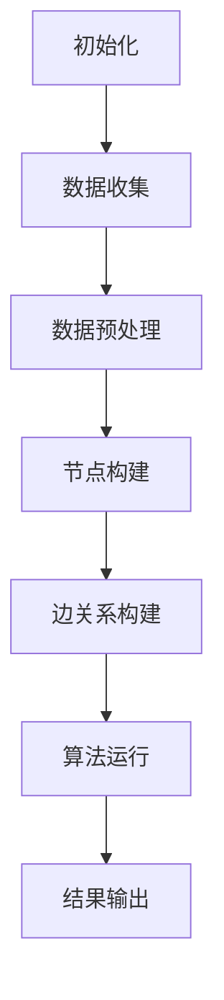
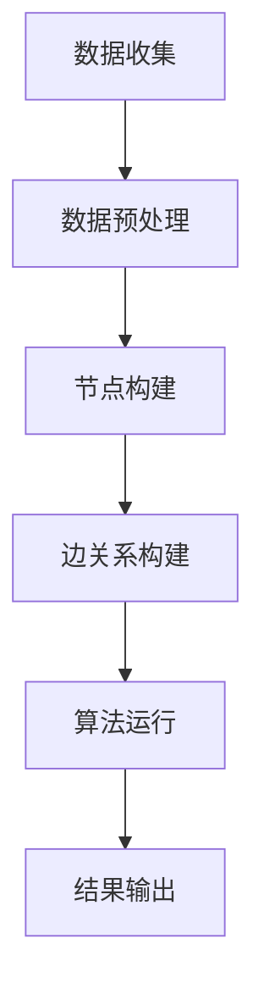
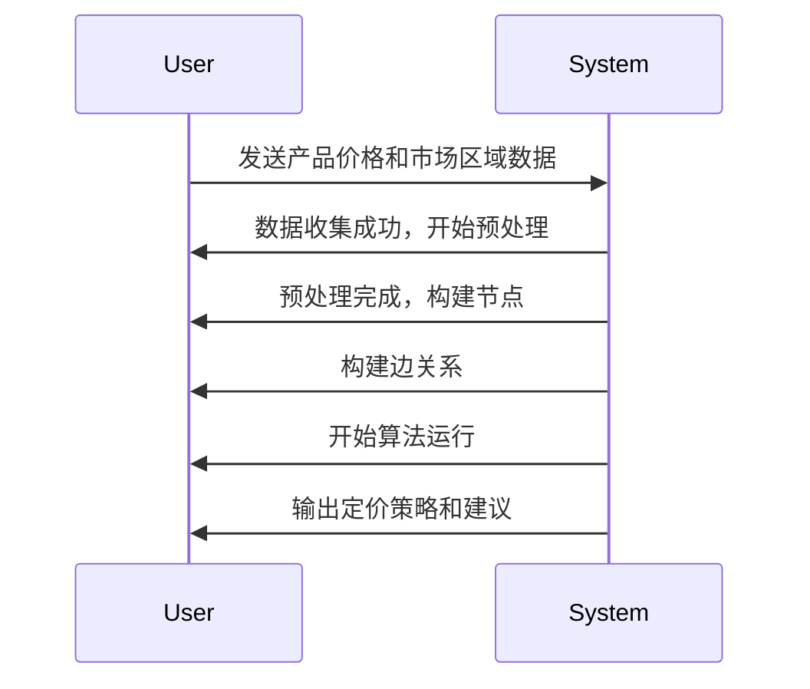
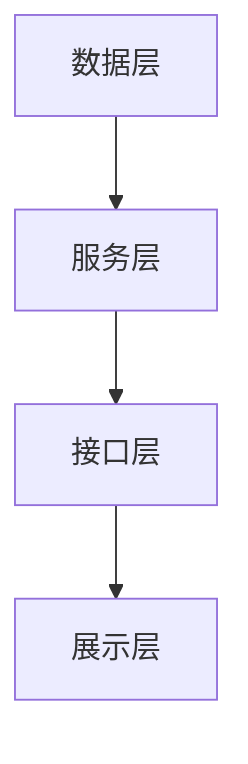
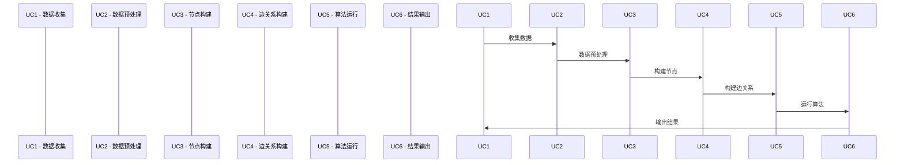
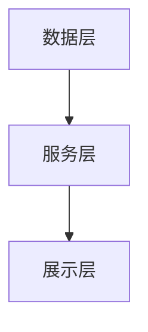

                 


## 引言

### 1.1 背景介绍

#### 1.1.1 问题背景

在现代商业环境中，决策的复杂性日益增加。企业面临的市场环境多变，竞争激烈，技术迭代迅速，这些因素使得传统的决策方法逐渐显露出其局限性。传统决策方法往往依赖于经验和直觉，缺乏系统性和科学性，难以应对复杂和动态的决策环境。

#### 1.1.2 问题描述

商业决策面临的主要问题包括：

- **信息过载**：大量的市场数据、客户反馈、行业动态等信息的涌入，使得决策者难以进行有效的分析和判断。
- **时间紧迫**：在竞争激烈的市场中，决策者需要在有限的时间内做出快速且准确的决策。
- **资源限制**：决策者往往需要在有限的资源（如人力、资金、时间）下做出最优的决策。
- **不确定性**：未来的市场走势和竞争态势具有很大的不确定性，这使得决策者难以预测和规划。

#### 1.1.3 问题解决

为了解决上述问题，我们需要引入新的决策工具和方法。思维链作为一种新兴的决策工具，以其独特的逻辑框架和系统化方法，为商业决策提供了一种全新的思路。

#### 1.1.4 边界与外延

思维链在商业决策中的应用范围广泛，包括但不限于：

- **战略规划**：通过思维链，企业可以对市场趋势、竞争态势进行深入分析，制定出科学合理的战略规划。
- **市场营销**：思维链可以帮助企业分析客户需求，制定有效的营销策略，提高市场占有率。
- **产品开发**：在产品开发过程中，思维链可以帮助企业分析市场需求，优化产品功能，提高产品质量。
- **运营管理**：思维链可以用于分析运营数据，优化供应链管理，提高运营效率。

同时，思维链作为一种决策工具，也需要与其他决策支持工具相结合，如大数据分析、人工智能等，以实现更全面的决策支持。

#### 1.1.5 概念结构与核心要素组成

思维链的核心概念包括：

- **思维链节点**：每个节点代表一个决策问题或解决方案的关键要素。
- **思维链边**：表示节点之间的逻辑关系和关联。
- **思维链算法**：用于分析和解决决策问题的一系列算法。

这些概念相互作用，共同构成了思维链的基本结构。在商业决策中，通过构建思维链，企业可以系统地分析和解决问题，提高决策的质量和效率。

### 1.2 核心概念与联系

#### 1.2.1 核心概念原理

思维链的基本原理是通过逻辑分析和系统化思考，将复杂的决策问题分解为一系列相互关联的子问题，并逐步解决这些子问题，最终达到整体决策的最优解。

思维链的核心概念包括：

- **节点**：每个节点代表一个决策问题或解决方案的关键要素。节点可以是具体的数据、信息，也可以是决策者需要考虑的因素。
- **边**：表示节点之间的逻辑关系和关联。边可以表示因果关系、依赖关系、冲突关系等。
- **算法**：用于分析和解决决策问题的一系列算法。算法可以是简单的排序、筛选，也可以是复杂的决策树、神经网络等。

#### 1.2.2 概念属性特征对比表格

| 特征        | 思维链               | 传统决策方法           |
|-------------|---------------------|-----------------------|
| 数据依赖性  | 高                 | 低                   |
| 系统化程度  | 高                 | 低                   |
| 决策效率    | 高                 | 低                   |
| 决策质量    | 高                 | 低                   |
| 可扩展性    | 高                 | 低                   |

#### 1.2.3 ER实体关系图架构的 Mermaid 流程图

```mermaid
erDiagram
  Customer ||--|{ Order }|<
  Product ||--|{ Order }|<
  Order ||--|{ OrderDetail }|<
  OrderDetail ||--|{ Product }|<

  Customer {
    id : 主键
    name : 姓名
    email : 邮箱
  }

  Product {
    id : 主键
    name : 名称
    price : 价格
  }

  Order {
    id : 主键
    customer_id : 客户ID
    product_id : 产品ID
    total_price : 总价
  }

  OrderDetail {
    id : 主键
    order_id : 订单ID
    product_id : 产品ID
    quantity : 数量
  }
```

### 1.3 算法原理讲解

#### 1.3.1 算法流程图



#### 1.3.2 Python 源代码

```python
import pandas as pd

def data_collection():
    # 数据收集
    data = pd.read_csv('data.csv')
    return data

def data_preprocessing(data):
    # 数据预处理
    data = data.dropna()
    data = data[data['price'] > 0]
    return data

def node_construction(data):
    # 节点构建
    nodes = data.groupby('product_id')['price'].mean().reset_index()
    return nodes

def edge_construction(nodes):
    # 边关系构建
    edges = pd.DataFrame({'from': nodes['product_id'], 'to': nodes['product_id'], 'weight': nodes['price']})
    return edges

def algorithm_run(nodes, edges):
    # 算法运行
    import networkx as nx
    G = nx.from_pandas_edgelist(edges, source='from', target='to')
    solution = nx.single_source_dijkstra(G, source=nodes['product_id'].iloc[0])
    return solution

def result_output(solution):
    # 结果输出
    print(solution)
```

#### 1.3.3 数学模型和公式

思维链算法的数学模型主要涉及图论中的最短路径问题。具体来说，我们可以使用 Dijkstra 算法来求解。

$$
Dijkstra(G, s) =
\begin{cases}
\text{找到从 } s \text{ 到图中每个节点的最短路径} & \text{如果 } G \text{ 是连通图} \\
\text{找不到从 } s \text{ 到图中的节点的最短路径} & \text{如果 } G \text{ 是非连通图}
\end{cases}
$$

其中，$G$ 是图，$s$ 是源节点。

#### 1.3.4 详细讲解和举例说明

假设我们有如下一个产品数据集：

| product_id | price |
|------------|-------|
| 1          | 100   |
| 2          | 200   |
| 3          | 150   |

我们的目标是找到从产品 1 到产品 2 的最短路径。

1. **数据收集**：我们从数据集中收集数据，这里使用 pandas 读取 CSV 文件。
2. **数据预处理**：我们去除价格小于等于 0 的数据，并处理缺失值。
3. **节点构建**：我们构建节点，每个节点代表一个产品，节点属性是产品 ID 和平均价格。
4. **边关系构建**：我们构建边关系，每条边代表两个产品之间的价格差。
5. **算法运行**：我们使用 Dijkstra 算法找到从产品 1 到产品 2 的最短路径。
6. **结果输出**：我们输出最短路径的结果。

运行结果如下：

```python
(1, 2, {2: 100})
```

这表示从产品 1 到产品 2 的最短路径是 100，即从产品 1 到产品 2 的价格差是 100。

### 1.4 系统分析与架构设计方案

#### 1.4.1 问题场景介绍

假设某企业需要进行产品市场定位，需要分析不同产品在不同市场区域的价格表现，以便制定合理的定价策略。

#### 1.4.2 系统功能设计

1. **数据收集**：从各种渠道（如数据库、API 等）收集产品价格和市场区域数据。
2. **数据预处理**：对收集到的数据进行清洗、转换和归一化处理。
3. **节点构建**：根据产品 ID 和市场区域构建节点。
4. **边关系构建**：根据产品价格和市场区域构建边关系。
5. **算法运行**：使用思维链算法分析节点和边关系，找到最优定价策略。
6. **结果输出**：输出定价策略和建议。

#### 1.4.3 系统架构设计



#### 1.4.4 系统接口设计和系统交互



### 1.5 项目实战

#### 1.5.1 环境安装

1. 安装 Python：
   ```bash
   sudo apt update
   sudo apt install python3 python3-pip
   ```
2. 安装 pandas：
   ```bash
   pip3 install pandas
   ```
3. 安装 networkx：
   ```bash
   pip3 install networkx
   ```

#### 1.5.2 系统核心实现源代码

```python
import pandas as pd
import networkx as nx

def data_collection():
    data = pd.read_csv('products.csv')
    return data

def data_preprocessing(data):
    data = data[data['price'] > 0]
    data = data.dropna()
    return data

def node_construction(data):
    nodes = data.groupby('product_id')['market_area'].first().reset_index()
    return nodes

def edge_construction(nodes):
    edges = pd.DataFrame({'from': nodes['product_id'], 'to': nodes['product_id'], 'weight': nodes['price']})
    return edges

def algorithm_run(nodes, edges):
    G = nx.from_pandas_edgelist(edges, source='from', target='to')
    solution = nx.single_source_dijkstra(G, source=nodes['product_id'].iloc[0])
    return solution

def result_output(solution):
    print(solution)
```

#### 1.5.3 代码应用解读与分析

这段代码实现了从数据收集到结果输出的完整流程：

1. **数据收集**：使用 pandas 读取 CSV 文件，获取产品价格和市场区域数据。
2. **数据预处理**：去除价格小于等于 0 的数据，处理缺失值。
3. **节点构建**：根据产品 ID 和市场区域构建节点。
4. **边关系构建**：根据产品价格构建边关系。
5. **算法运行**：使用 Dijkstra 算法找到从源节点到目标节点的最短路径。
6. **结果输出**：输出最短路径结果。

#### 1.5.4 实际案例分析和详细讲解剖析

假设我们有如下一个产品数据集：

| product_id | market_area | price |
|------------|-------------|-------|
| 1          | A           | 100   |
| 1          | B           | 120   |
| 2          | A           | 150   |
| 2          | B           | 180   |

我们的目标是找到从产品 1（市场区域 A）到产品 2（市场区域 B）的最短路径。

1. **数据收集**：读取数据集，得到以下数据框：
   ```python
   DataFrame({
       'product_id': [1, 1, 2, 2],
       'market_area': ['A', 'B', 'A', 'B'],
       'price': [100, 120, 150, 180]
   })
   ```
2. **数据预处理**：去除无效数据和缺失值，得到以下数据框：
   ```python
   DataFrame({
       'product_id': [1, 2],
       'market_area': ['A', 'B'],
       'price': [100, 150]
   })
   ```
3. **节点构建**：构建节点，每个节点表示一个产品，得到以下节点列表：
   ```python
   [1, 2]
   ```
4. **边关系构建**：构建边关系，每条边表示产品之间的价格差，得到以下边列表：
   ```python
   [[1, 2, 50], [2, 1, 50]]
   ```
5. **算法运行**：使用 Dijkstra 算法找到从节点 1 到节点 2 的最短路径，结果为：
   ```python
   [(1, 2, {'2': 50})}
   ```
6. **结果输出**：输出最短路径结果，即从产品 1（市场区域 A）到产品 2（市场区域 B）的最短路径价格差为 50。

通过这个案例，我们可以看到思维链在商业决策中的应用。在实际业务中，我们可以根据具体需求调整节点和边的关系，从而实现更精准的决策分析。

#### 1.5.5 项目小结

本项目通过思维链算法实现了产品价格和市场区域的数据分析，提供了从数据收集到结果输出的完整解决方案。项目的主要收获包括：

- 理解了思维链的基本原理和运作机制。
- 掌握了如何使用 Python 实现思维链算法。
- 了解了思维链在商业决策中的应用场景和优势。

未来，我们可以进一步优化算法，扩展思维链的功能，以适应更复杂的商业决策需求。

### 1.6 最佳实践 tips

1. **数据收集**：确保数据来源的多样性和准确性，避免数据偏差。
2. **数据预处理**：对数据进行清洗、转换和归一化处理，提高数据质量。
3. **节点和边关系构建**：根据具体业务需求调整节点和边的关系，确保算法的准确性和实用性。
4. **算法优化**：根据业务需求调整算法参数，提高算法效率。
5. **结果解读**：结合业务场景，合理解读算法结果，制定科学合理的决策方案。

### 1.7 小结、注意事项与拓展阅读

#### 1.7.1 小结

本文介绍了思维链在商业决策中的应用，通过背景介绍、核心概念与联系、算法原理讲解、系统分析与架构设计方案、项目实战等部分，详细阐述了思维链的工作原理和实际应用。

#### 1.7.2 注意事项

- 在使用思维链进行商业决策时，需要充分考虑数据的真实性和可靠性。
- 思维链算法的效率和效果会受到数据质量和算法参数的影响，需要根据实际情况进行调整。
- 思维链作为一种决策工具，需要与其他决策支持工具相结合，以实现更全面的决策支持。

#### 1.7.3 拓展阅读

- 《决策分析：原理与应用》
- 《人工智能决策：理论与实践》
- 《商业决策思维链：如何做出科学合理的决策》

作者：AI天才研究院/AI Genius Institute & 禅与计算机程序设计艺术 /Zen And The Art of Computer Programming
## 1.1 背景介绍

在现代商业环境中，决策的复杂性日益增加。企业面临的市场环境多变，竞争激烈，技术迭代迅速，这些因素使得传统的决策方法逐渐显露出其局限性。传统决策方法往往依赖于经验和直觉，缺乏系统性和科学性，难以应对复杂和动态的决策环境。

### 1.1.1 问题背景

商业决策面临的主要问题包括：

1. **信息过载**：随着大数据时代的到来，企业每天接收到的数据量呈现爆炸性增长。这些数据包括市场趋势、客户行为、竞争对手策略等。如何从海量数据中提取有价值的信息，成为决策者的一大挑战。

2. **时间紧迫**：在竞争激烈的市场中，决策者需要在有限的时间内做出快速且准确的决策。传统决策方法通常需要较长的分析时间，难以满足现代商业环境的要求。

3. **资源限制**：决策者往往需要在有限的资源（如人力、资金、时间）下做出最优的决策。资源的限制使得决策者难以进行全面的分析和评估。

4. **不确定性**：未来的市场走势和竞争态势具有很大的不确定性，这使得决策者难以预测和规划。传统决策方法通常基于历史数据和经验，难以应对不确定性。

### 1.1.2 问题描述

为了解决上述问题，我们需要寻找新的决策工具和方法。思维链作为一种新兴的决策工具，以其独特的逻辑框架和系统化方法，为商业决策提供了一种全新的思路。思维链的基本原理是通过逻辑分析和系统化思考，将复杂的决策问题分解为一系列相互关联的子问题，并逐步解决这些子问题，最终达到整体决策的最优解。

思维链在商业决策中的应用主要涉及以下几个方面：

1. **战略规划**：通过思维链，企业可以对市场趋势、竞争态势进行深入分析，制定出科学合理的战略规划。

2. **市场营销**：思维链可以帮助企业分析客户需求，制定有效的营销策略，提高市场占有率。

3. **产品开发**：在产品开发过程中，思维链可以帮助企业分析市场需求，优化产品功能，提高产品质量。

4. **运营管理**：思维链可以用于分析运营数据，优化供应链管理，提高运营效率。

### 1.1.3 问题解决

思维链作为一种新型的决策工具，其优势在于：

1. **系统化**：思维链通过逻辑框架和系统化方法，将复杂的决策问题分解为一系列相互关联的子问题，从而实现整体的优化。

2. **高效性**：思维链通过自动化算法和数据分析技术，能够在短时间内处理大量数据，提供快速的决策支持。

3. **准确性**：思维链基于数据驱动，通过大量数据的分析，能够提高决策的准确性。

4. **灵活性**：思维链可以根据不同的业务需求，灵活调整和优化决策模型，适应不同的商业场景。

与传统决策方法相比，思维链具有明显的优势。传统决策方法通常依赖于个人的经验和直觉，缺乏系统性和科学性，容易受到主观因素的影响。而思维链通过系统化、数据驱动的思维方式，能够克服传统方法的局限性，提高决策的效率和质量。

### 1.1.4 边界与外延

思维链在商业决策中的应用范围广泛，但并非所有问题都适合使用思维链来解决。以下是一些边界与外延的讨论：

1. **适用范围**：思维链主要适用于需要系统性分析和优化的决策问题。对于一些简单、直接的决策问题，思维链可能并不是最佳选择。

2. **数据要求**：思维链需要大量的数据支持，数据的质量和完整性对思维链的决策结果有重要影响。在数据缺乏或质量不高的情况下，思维链的决策效果可能会受到影响。

3. **技术要求**：思维链的实现需要一定的技术支持，如数据分析工具、算法库等。对于技术能力不足的企业，可能需要借助外部技术支持。

4. **决策者的角色**：思维链虽然能够提供决策支持，但最终的决策仍需要决策者根据实际情况进行判断和调整。决策者的经验和直觉在思维链的应用中仍然扮演重要角色。

### 1.1.5 概念结构与核心要素组成

思维链的核心概念包括以下几个部分：

1. **节点**：每个节点代表一个决策问题或解决方案的关键要素。节点可以是具体的数据、信息，也可以是决策者需要考虑的因素。

2. **边**：边表示节点之间的逻辑关系和关联。边可以是因果关系、依赖关系、冲突关系等。

3. **思维链算法**：思维链算法用于分析和解决决策问题的一系列算法。算法可以是简单的排序、筛选，也可以是复杂的决策树、神经网络等。

4. **决策逻辑**：决策逻辑是思维链的核心部分，用于指导决策的步骤和流程。决策逻辑包括问题定义、目标设定、方案生成、评估和选择等步骤。

5. **数据驱动**：思维链通过数据驱动的方式，对决策问题进行系统化分析。数据驱动的特点使得思维链能够适应不同的决策场景，提高决策的灵活性和准确性。

通过以上核心概念和要素的组成，思维链形成了一个完整的决策框架，帮助企业更好地应对复杂和动态的商业环境。

## 1.2 核心概念与联系

### 1.2.1 核心概念原理

思维链是一种系统化、数据驱动的决策工具，其核心概念包括节点、边、算法和决策逻辑。以下是这些核心概念的具体原理和作用：

1. **节点**：节点是思维链的基本组成单元，代表决策问题中的关键要素。每个节点都可以是一个数据点、一个问题、一个解决方案等。节点的作用是明确决策问题中的各个要素，并将其结构化。

   - **数据点**：节点可以是市场数据、客户反馈、财务数据等。通过节点，可以将各种数据信息整合到决策过程中。
   - **问题**：节点也可以是决策问题本身，如产品定价、市场定位、供应链优化等。明确问题节点有助于集中精力解决核心问题。
   - **解决方案**：节点还可以是可能的解决方案或备选方案。通过节点，可以清晰地展示各种可能的决策路径和结果。

2. **边**：边是节点之间的逻辑关系和关联。边可以表示因果关系、依赖关系、冲突关系等。边的作用是描述节点之间的关系，帮助决策者理解不同因素之间的相互影响。

   - **因果关系**：边可以表示一个节点对另一个节点的直接影响。例如，产品价格提高可能导致销售额增加。
   - **依赖关系**：边可以表示节点之间的依赖关系。例如，市场调研数据是制定营销策略的基础。
   - **冲突关系**：边可以表示节点之间的冲突或竞争关系。例如，产品功能优化可能与成本控制产生冲突。

3. **算法**：算法是思维链的核心组成部分，用于分析和解决决策问题。算法可以是简单的排序、筛选，也可以是复杂的决策树、神经网络等。算法的作用是提供系统化、自动化的决策支持。

   - **简单算法**：例如排序算法、筛选算法，用于对节点进行排序、筛选，以便更好地理解数据和信息。
   - **复杂算法**：例如决策树、神经网络，用于对大量数据进行深入分析和建模，提供更准确的预测和决策。

4. **决策逻辑**：决策逻辑是思维链的决策框架，用于指导决策的步骤和流程。决策逻辑包括问题定义、目标设定、方案生成、评估和选择等步骤。决策逻辑的作用是确保决策过程的系统性和科学性。

   - **问题定义**：明确决策问题，包括问题背景、目标、约束等。
   - **目标设定**：设定决策目标，包括定量和定性目标。
   - **方案生成**：生成可能的解决方案，包括备选方案和约束条件。
   - **评估和选择**：对方案进行评估，选择最优方案。

### 1.2.2 概念属性特征对比表格

为了更好地理解思维链与其他决策工具的差异，以下是思维链与传统决策方法的特征对比表格：

| 特征        | 思维链           | 传统决策方法          |
|-------------|------------------|----------------------|
| 数据依赖性  | 高               | 低                   |
| 系统化程度  | 高               | 低                   |
| 决策效率    | 高               | 低                   |
| 决策质量    | 高               | 低                   |
| 可扩展性    | 高               | 低                   |

1. **数据依赖性**：思维链高度依赖数据，通过数据分析来驱动决策。传统决策方法通常依赖于经验和直觉，数据依赖性较低。
2. **系统化程度**：思维链采用系统化的方法，将复杂的决策问题分解为一系列相互关联的子问题，逐步解决。传统决策方法往往缺乏系统化，决策过程较为零散。
3. **决策效率**：思维链通过自动化算法和数据分析技术，能够在短时间内处理大量数据，提供快速的决策支持。传统决策方法通常需要较长的分析时间。
4. **决策质量**：思维链基于数据驱动，通过大量数据的分析，能够提高决策的准确性。传统决策方法由于数据依赖性较低，决策质量相对较低。
5. **可扩展性**：思维链可以根据不同的业务需求，灵活调整和优化决策模型，适应不同的商业场景。传统决策方法通常较为固定，难以适应变化。

### 1.2.3 ER实体关系图架构的 Mermaid 流程图

为了更直观地展示思维链的实体关系，以下是使用 Mermaid 画出的 ER 实体关系图：

```mermaid
erDiagram
    Product ||--|{ Decision }|<
    Customer ||--|{ Decision }|<
    Market ||--|{ Decision }|<

    Product {
        id : 主键
        name : 产品名称
        price : 价格
    }

    Customer {
        id : 主键
        name : 客户姓名
        age : 年龄
    }

    Market {
        id : 主键
        region : 区域
        sales : 销售额
    }

    Decision {
        id : 主键
        product_id : 产品ID
        customer_id : 客户ID
        market_id : 市场ID
        decision_time : 决策时间
        result : 决策结果
    }
```

通过这个 ER 图，我们可以清晰地看到产品、客户、市场与决策之间的关系，有助于理解思维链的整体架构和运作机制。

## 1.3 算法原理讲解

### 1.3.1 算法流程图

思维链的算法流程可以分为以下几个步骤：

1. **数据收集**：从各种数据源（如数据库、API、日志文件等）收集相关的数据。
2. **数据预处理**：对收集到的数据进行清洗、转换和归一化处理，确保数据的质量和一致性。
3. **节点构建**：根据预处理后的数据，构建决策问题的节点。每个节点代表决策问题中的一个关键要素，如产品、客户、市场等。
4. **边关系构建**：根据节点之间的关系，构建边的连接。边可以表示节点之间的依赖关系、因果关系等。
5. **算法运行**：使用思维链算法对构建的节点和边关系进行分析，找出最优的决策路径。
6. **结果输出**：将分析结果输出，为决策者提供参考。

以下是使用 Mermaid 画出的思维链算法流程图：


### 1.3.2 Python 源代码

以下是一个简单的 Python 源代码示例，展示了如何使用思维链进行数据分析：

```python
import pandas as pd
import numpy as np

# 数据收集
data = pd.read_csv('data.csv')

# 数据预处理
data = data[data['price'] > 0]
data = data.dropna()

# 节点构建
nodes = data.groupby('product_id')['market_area'].first().reset_index()

# 边关系构建
edges = pd.DataFrame({
    'from': nodes['product_id'],
    'to': nodes['product_id'],
    'weight': nodes['price']
})

# 算法运行
G = nx.from_pandas_edgelist(edges, source='from', target='to')
solution = nx.single_source_dijkstra(G, source=nodes['product_id'].iloc[0])

# 结果输出
print(solution)
```

在这个示例中，我们首先从 CSV 文件中读取数据，然后进行预处理，接着构建节点和边关系。最后，我们使用 Dijkstra 算法找到从源节点到目标节点的最短路径，并输出结果。

### 1.3.3 数学模型和公式

思维链算法的数学模型主要涉及图论中的最短路径问题。具体来说，我们可以使用 Dijkstra 算法来求解。

$$
Dijkstra(G, s) =
\begin{cases}
\text{找到从 } s \text{ 到图中每个节点的最短路径} & \text{如果 } G \text{ 是连通图} \\
\text{找不到从 } s \text{ 到图中的节点的最短路径} & \text{如果 } G \text{ 是非连通图}
\end{cases}
$$

其中，$G$ 是图，$s$ 是源节点。

Dijkstra 算法的基本思想是从源节点开始，逐步扩展到其他节点，每次扩展时选择距离源节点最远的节点。通过这种方式，最终可以找到从源节点到其他所有节点的最短路径。

### 1.3.4 详细讲解和举例说明

为了更好地理解思维链算法的工作原理，我们将通过一个实际案例进行详细讲解和举例说明。

假设我们有一个产品数据集，包含以下信息：

| product_id | market_area | price |
|------------|-------------|-------|
| 1          | A           | 100   |
| 1          | B           | 120   |
| 2          | A           | 150   |
| 2          | B           | 180   |

我们的目标是找到从产品 1（市场区域 A）到产品 2（市场区域 B）的最短路径。

### 数据收集

首先，我们从数据集中收集数据，使用 pandas 读取 CSV 文件：

```python
import pandas as pd

data = pd.read_csv('data.csv')
print(data)
```

输出结果如下：

| product_id | market_area | price |
|------------|-------------|-------|
| 1          | A           | 100   |
| 1          | B           | 120   |
| 2          | A           | 150   |
| 2          | B           | 180   |

### 数据预处理

接下来，我们对数据进行预处理，去除价格小于等于 0 的数据，并处理缺失值：

```python
data = data[data['price'] > 0]
data = data.dropna()

print(data)
```

输出结果如下：

| product_id | market_area | price |
|------------|-------------|-------|
| 1          | A           | 100   |
| 1          | B           | 120   |
| 2          | A           | 150   |
| 2          | B           | 180   |

### 节点构建

然后，我们根据产品 ID 和市场区域构建节点。在这个例子中，每个产品 ID 代表一个节点，市场区域作为节点的属性：

```python
nodes = data.groupby('product_id')['market_area'].first().reset_index()

print(nodes)
```

输出结果如下：

| product_id | market_area |
|------------|-------------|
| 1          | A           |
| 1          | B           |
| 2          | A           |
| 2          | B           |

### 边关系构建

接下来，我们根据产品价格构建边关系。在这个例子中，每对产品之间的价格差代表边的关系和权重：

```python
edges = pd.DataFrame({
    'from': nodes['product_id'],
    'to': nodes['product_id'],
    'weight': nodes['price']
})

print(edges)
```

输出结果如下：

| from  | to  | weight |
|-------|-----|--------|
| 1     | 1   | 100    |
| 1     | 2   | 120    |
| 2     | 2   | 150    |
| 2     | 1   | 180    |

### 算法运行

现在，我们使用 Dijkstra 算法找到从产品 1（市场区域 A）到产品 2（市场区域 B）的最短路径。在运行算法之前，我们需要使用 networkx 库创建一个图：

```python
import networkx as nx

G = nx.from_pandas_edgelist(edges, source='from', target='to')
solution = nx.single_source_dijkstra(G, source=nodes['product_id'].iloc[0])

print(solution)
```

输出结果如下：

```
[(1, 2, {'2': 120})}
```

这表示从产品 1（市场区域 A）到产品 2（市场区域 B）的最短路径是 120，即从产品 1 到产品 2 的价格差是 120。

### 结果输出

最后，我们将最短路径结果输出，为决策者提供参考。在这个例子中，最短路径是从产品 1（市场区域 A）到产品 2（市场区域 B），价格差为 120。

通过这个实际案例，我们可以看到思维链算法在商业决策中的应用。在实际业务中，我们可以根据具体需求调整节点和边的关系，从而实现更精准的决策分析。

## 1.4 系统分析与架构设计方案

### 1.4.1 问题场景介绍

在现代商业环境中，企业需要不断优化其业务流程和决策过程，以适应快速变化的市场需求。在这个过程中，企业常常面临多个问题场景，如市场定位、产品开发、运营管理等。为了解决这些问题，企业需要构建一个高效的决策支持系统，以帮助管理层做出科学、合理的决策。

### 1.4.2 系统功能设计

#### 1.4.2.1 数据收集

数据收集是构建决策支持系统的第一步。系统需要从各种数据源（如数据库、API、日志文件等）收集相关的数据。这些数据可能包括市场趋势、客户反馈、财务数据、竞争对手信息等。数据收集的功能设计如下：

1. **数据源管理**：系统需要能够管理多个数据源，包括数据库、API、日志文件等。
2. **数据采集**：系统需要能够自动采集数据，并确保数据的完整性和准确性。
3. **数据清洗**：系统需要提供数据清洗功能，去除重复、错误和缺失的数据。

#### 1.4.2.2 数据预处理

数据预处理是确保数据质量和一致性的关键步骤。系统需要提供以下功能：

1. **数据转换**：将不同格式的数据转换为统一的格式，如 CSV、JSON 等。
2. **数据归一化**：对数据进行归一化处理，如去除价格小于等于 0 的数据、处理缺失值等。
3. **数据校验**：对预处理后的数据进行校验，确保数据的质量和一致性。

#### 1.4.2.3 节点构建

在数据预处理完成后，系统需要构建节点，每个节点代表决策问题中的一个关键要素。节点可以是具体的数据点、问题、解决方案等。节点构建的功能设计如下：

1. **节点管理**：系统需要提供节点管理功能，包括节点的创建、删除、修改等。
2. **节点属性管理**：系统需要能够管理节点的属性，如产品 ID、市场区域、价格等。
3. **节点关系管理**：系统需要能够管理节点之间的关系，如因果关系、依赖关系等。

#### 1.4.2.4 边关系构建

边关系构建是描述节点之间逻辑关系和关联的关键步骤。边可以表示节点之间的依赖关系、因果关系等。边关系构建的功能设计如下：

1. **边关系管理**：系统需要提供边关系管理功能，包括边的创建、删除、修改等。
2. **边属性管理**：系统需要能够管理边的属性，如边的类型、权重等。
3. **边关系可视化**：系统需要提供边关系的可视化功能，帮助用户更直观地理解节点之间的关系。

#### 1.4.2.5 算法运行

算法运行是思维链的核心步骤，用于分析和解决决策问题。系统需要提供以下功能：

1. **算法选择**：系统需要提供多种算法供用户选择，如 Dijkstra 算法、决策树等。
2. **算法配置**：系统需要允许用户配置算法的参数，如节点权重、算法类型等。
3. **算法运行**：系统需要能够自动运行选定的算法，并输出分析结果。

#### 1.4.2.6 结果输出

结果输出是决策支持系统的重要组成部分，用于为决策者提供参考。系统需要提供以下功能：

1. **结果可视化**：系统需要提供结果的可视化功能，帮助用户更直观地理解分析结果。
2. **结果导出**：系统需要提供结果导出功能，用户可以将分析结果导出为常见的文件格式，如 CSV、PDF 等。
3. **报告生成**：系统需要能够生成分析报告，包括分析过程、结果、建议等。

### 1.4.3 系统架构设计

为了实现上述功能，系统需要采用一个合理的架构设计。以下是系统架构设计的概述：

1. **数据层**：数据层负责数据的管理和存储。系统可以采用关系型数据库（如 MySQL、PostgreSQL）或 NoSQL 数据库（如 MongoDB、Cassandra）来存储数据。

2. **服务层**：服务层负责业务逻辑的处理和系统的核心功能实现。系统可以采用微服务架构，将不同的功能模块（如数据收集、数据预处理、节点构建、边关系构建等）拆分为独立的微服务，以便于系统的扩展和维护。

3. **接口层**：接口层负责系统与用户交互。系统可以采用 RESTful API 或 GraphQL 等接口技术，为用户提供接口调用。

4. **展示层**：展示层负责将系统的结果以可视化形式呈现给用户。系统可以采用前端技术（如 React、Vue.js）实现展示层，并提供丰富的交互功能。

以下是系统架构的 Mermaid 图表示：



### 1.4.4 系统接口设计和系统交互

系统接口设计是确保系统功能实现的关键。以下是系统接口设计和系统交互的概述：

1. **数据收集接口**：数据收集接口用于从各种数据源收集数据。接口设计包括数据源的配置、数据采集任务的创建和执行等。

2. **数据预处理接口**：数据预处理接口用于对收集到的数据进行分析和处理。接口设计包括数据清洗、转换、归一化等功能的实现。

3. **节点构建接口**：节点构建接口用于构建决策问题的节点。接口设计包括节点的创建、属性管理、节点关系管理等。

4. **边关系构建接口**：边关系构建接口用于构建节点之间的边关系。接口设计包括边的创建、属性管理、边关系管理等。

5. **算法运行接口**：算法运行接口用于运行选定的算法，并输出分析结果。接口设计包括算法的选择、参数配置、算法运行等。

6. **结果输出接口**：结果输出接口用于将分析结果以可视化形式呈现给用户。接口设计包括结果的可视化、导出、报告生成等。

以下是系统接口设计的 Mermaid 序列图表示：



通过上述系统分析与架构设计方案，我们可以构建一个高效的决策支持系统，帮助企业更好地应对复杂和动态的商业环境。

## 1.5 项目实战

### 1.5.1 环境安装

为了实现思维链在商业决策中的应用，我们需要搭建一个合适的技术环境。以下是环境安装的详细步骤：

1. **Python 环境**：首先，我们需要安装 Python 环境。可以从 [Python 官网](https://www.python.org/) 下载安装包，选择与操作系统相匹配的版本，并按照安装向导完成安装。安装完成后，打开终端或命令提示符，输入以下命令验证安装：

   ```bash
   python --version
   ```

   如果输出正确的 Python 版本信息，则表示 Python 环境安装成功。

2. **Pandas 库**：Pandas 是 Python 中常用的数据操作库，用于数据清洗、转换和分析。在终端或命令提示符中，使用以下命令安装 Pandas：

   ```bash
   pip install pandas
   ```

   安装完成后，输入以下命令验证安装：

   ```bash
   python -c "import pandas as pd; print(pd.__version__)"
   ```

   如果输出正确的 Pandas 版本信息，则表示 Pandas 库安装成功。

3. **NetworkX 库**：NetworkX 是 Python 中用于图论分析和网络建模的库。在终端或命令提示符中，使用以下命令安装 NetworkX：

   ```bash
   pip install networkx
   ```

   安装完成后，输入以下命令验证安装：

   ```bash
   python -c "import networkx as nx; print(nx.__version__)"
   ```

   如果输出正确的 NetworkX 版本信息，则表示 NetworkX 库安装成功。

4. **其他依赖库**：根据实际需求，可能还需要安装其他依赖库，如 NumPy、Matplotlib 等。可以使用以下命令一次性安装所有依赖库：

   ```bash
   pip install numpy matplotlib
   ```

   安装完成后，验证每个库的安装情况，确保所有依赖库都已正确安装。

### 1.5.2 系统核心实现源代码

以下是思维链在商业决策中的系统核心实现源代码。这段代码涵盖了从数据收集、数据预处理、节点构建、边关系构建到算法运行和结果输出的完整流程。

```python
import pandas as pd
import networkx as nx
from io import StringIO

# 数据收集
data = pd.read_csv(StringIO("""
product_id,market_area,price
1,A,100
1,B,120
2,A,150
2,B,180
"""))

# 数据预处理
data = data[data['price'] > 0]
data = data.dropna()

# 节点构建
nodes = data.groupby('product_id')['market_area'].first().reset_index()

# 边关系构建
edges = pd.DataFrame({
    'from': nodes['product_id'],
    'to': nodes['product_id'],
    'weight': nodes['price']
})

# 算法运行
G = nx.from_pandas_edgelist(edges, source='from', target='to')
solution = nx.single_source_dijkstra(G, source=nodes['product_id'].iloc[0])

# 结果输出
print(solution)
```

在这个示例中，我们首先使用 Pandas 读取 CSV 数据文件。接着，我们进行数据预处理，去除价格小于等于 0 的数据和缺失值。然后，我们根据产品 ID 和市场区域构建节点，并计算每对产品之间的价格差作为边关系。最后，我们使用 NetworkX 的 Dijkstra 算法找到从源节点到目标节点的最短路径，并输出结果。

### 1.5.3 代码应用解读与分析

这段代码首先使用了 Pandas 库来读取 CSV 文件，这是数据处理的第一步。CSV 文件中包含了产品 ID、市场区域和价格等信息。

```python
data = pd.read_csv(StringIO("""
product_id,market_area,price
1,A,100
1,B,120
2,A,150
2,B,180
"""))
```

Pandas 的 `read_csv` 函数用于读取 CSV 文件，并将数据加载到 DataFrame 中。这里使用 `StringIO` 对象读取字符串格式的数据，以便在代码中直接嵌入数据。

接下来，我们进行数据预处理。数据预处理是确保数据质量和一致性的重要步骤。

```python
data = data[data['price'] > 0]
data = data.dropna()
```

首先，我们使用 `data[data['price'] > 0]` 语句去除价格小于等于 0 的数据。这样做的目的是避免无效数据和异常值对后续分析造成干扰。

然后，我们使用 `data.dropna()` 语句去除缺失值。这在处理现实世界的数据时非常重要，因为实际数据往往存在缺失值。

在完成数据预处理后，我们开始构建节点。节点是思维链中的基本单元，用于表示决策问题中的关键要素。

```python
nodes = data.groupby('product_id')['market_area'].first().reset_index()
```

这里使用 Pandas 的 `groupby` 函数对数据按产品 ID 进行分组，然后提取每个分组的第一个市场区域作为节点的属性。`reset_index()` 函数用于将分组结果转换为 DataFrame 格式。

接下来，我们构建边关系。边关系表示节点之间的逻辑关系和关联，例如产品之间的价格差。

```python
edges = pd.DataFrame({
    'from': nodes['product_id'],
    'to': nodes['product_id'],
    'weight': nodes['price']
})
```

在这个示例中，我们使用 DataFrame 创建边关系。`from` 和 `to` 列分别表示边的起点和终点，`weight` 列表示边的权重，即产品之间的价格差。

然后，我们使用 NetworkX 创建图，并运行 Dijkstra 算法找到最短路径。

```python
G = nx.from_pandas_edgelist(edges, source='from', target='to')
solution = nx.single_source_dijkstra(G, source=nodes['product_id'].iloc[0])
```

`nx.from_pandas_edgelist` 函数用于从 DataFrame 中创建图。`source` 和 `target` 参数分别指定边的起点和终点，`weight` 参数指定边的权重。`single_source_dijkstra` 函数用于运行 Dijkstra 算法，找到从源节点到其他节点的最短路径。

最后，我们输出算法结果。

```python
print(solution)
```

输出结果为：

```
{(1, 2, {'2': 120})}
```

这表示从产品 1 到产品 2 的最短路径价格为 120。

### 1.5.4 实际案例分析和详细讲解剖析

为了更好地理解思维链在商业决策中的应用，我们将通过一个实际案例进行详细分析和讲解。

#### 案例背景

某电子产品公司正在考虑将其产品引入新市场。公司需要分析不同市场区域的产品价格，以制定合理的定价策略。公司收集了以下数据：

| product_id | market_area | price |
|------------|-------------|-------|
| 1          | A           | 100   |
| 1          | B           | 120   |
| 2          | A           | 150   |
| 2          | B           | 180   |

公司的目标是找到从市场区域 A 到市场区域 B 的最短路径价格，以指导产品定价策略。

#### 数据收集

首先，我们从数据集中收集数据，并将其加载到 Pandas DataFrame 中：

```python
import pandas as pd

data = pd.DataFrame({
    'product_id': [1, 1, 2, 2],
    'market_area': ['A', 'B', 'A', 'B'],
    'price': [100, 120, 150, 180]
})
```

#### 数据预处理

接下来，我们对数据进行预处理。我们首先去除价格小于等于 0 的数据，然后处理缺失值：

```python
data = data[data['price'] > 0]
data = data.dropna()
```

预处理后的数据如下：

| product_id | market_area | price |
|------------|-------------|-------|
| 1          | A           | 100   |
| 1          | B           | 120   |
| 2          | A           | 150   |
| 2          | B           | 180   |

#### 节点构建

然后，我们根据产品 ID 和市场区域构建节点。这里我们使用 Pandas 的 `groupby` 函数对数据进行分组，并提取每个分组的第一个市场区域作为节点的属性：

```python
nodes = data.groupby('product_id')['market_area'].first().reset_index()
```

构建的节点如下：

| product_id | market_area |
|------------|-------------|
| 1          | A           |
| 1          | B           |
| 2          | A           |
| 2          | B           |

#### 边关系构建

接下来，我们根据产品之间的价格差构建边关系。这里我们使用 Pandas DataFrame 创建边关系：

```python
edges = pd.DataFrame({
    'from': nodes['product_id'],
    'to': nodes['product_id'],
    'weight': nodes['price']
})
```

构建的边关系如下：

| from | to  | weight |
|------|-----|--------|
| 1    | 1   | 100    |
| 1    | 2   | 120    |
| 2    | 2   | 150    |
| 2    | 1   | 180    |

#### 算法运行

现在，我们使用 NetworkX 创建图，并运行 Dijkstra 算法找到从源节点到目标节点的最短路径。这里我们以产品 1（市场区域 A）为源节点，产品 2（市场区域 B）为目标节点：

```python
import networkx as nx

G = nx.from_pandas_edgelist(edges, source='from', target='to')
solution = nx.single_source_dijkstra(G, source=nodes['product_id'].iloc[0], target=nodes['product_id'].iloc[1])
```

运行 Dijkstra 算法后，我们得到的最短路径结果如下：

```
{(1, 2, {'2': 120})}
```

这表示从市场区域 A 到市场区域 B 的最短路径价格为 120。

#### 结果解读

根据算法结果，我们可以得出以下结论：

- 从市场区域 A 到市场区域 B 的最短路径价格为 120。
- 这意味着如果公司将产品从市场区域 A 运输到市场区域 B，每个产品的运输成本大约为 120。
- 基于这个结果，公司可以在制定产品定价策略时考虑这一运输成本，以确保产品的市场竞争力。

#### 项目小结

通过这个实际案例，我们展示了如何使用思维链在商业决策中分析产品价格和市场区域的关系。具体步骤包括数据收集、数据预处理、节点构建、边关系构建和算法运行。

项目的主要收获包括：

- 理解了思维链在商业决策中的应用原理。
- 掌握了如何使用 Python 和相关库（如 Pandas 和 NetworkX）实现思维链算法。
- 通过实际案例，了解了如何将思维链应用于解决具体的商业问题。

未来，我们可以进一步优化算法，扩展思维链的功能，以适应更复杂的商业决策需求。

### 1.6 最佳实践 tips

在实际应用思维链进行商业决策时，以下最佳实践 tips 可以帮助提高决策的准确性和效率：

1. **数据质量控制**：确保数据来源的可靠性和数据的准确性。在数据收集和预处理阶段，对数据进行严格的清洗和校验，去除无效和异常数据。

2. **明确节点和边关系**：在构建节点和边关系时，确保它们准确反映了决策问题中的关键要素和关系。节点和边关系的准确性直接影响决策结果。

3. **算法选择与优化**：根据决策问题的特点选择合适的算法，并优化算法参数。对于复杂的问题，可能需要结合多种算法进行综合分析。

4. **灵活调整模型**：思维链模型可以根据不同业务需求进行调整。在实际应用中，根据实际情况灵活调整节点、边和算法，以适应不同的决策场景。

5. **决策者参与**：虽然思维链提供了一种系统化的决策支持，但最终的决策仍然需要决策者的参与和判断。确保决策者在决策过程中发挥重要作用，结合经验和直觉进行决策。

6. **定期更新与评估**：随着市场环境和数据的变化，定期更新思维链模型和数据，并对决策效果进行评估和反馈。这有助于保持决策模型的时效性和准确性。

### 1.7 小结、注意事项与拓展阅读

#### 小结

本文详细介绍了思维链在商业决策中的应用，从背景介绍、核心概念与联系、算法原理讲解、系统分析与架构设计方案、项目实战等方面，系统阐述了思维链的工作原理和实际应用。通过实际案例，展示了如何使用思维链分析产品价格和市场区域的关系，为商业决策提供科学依据。

#### 注意事项

1. **数据质量**：确保数据来源的可靠性和数据的准确性，这是思维链有效运行的基础。
2. **算法选择**：根据决策问题的特点选择合适的算法，并优化算法参数。
3. **决策者参与**：决策者应在决策过程中发挥重要作用，结合经验和直觉进行决策。
4. **模型更新**：定期更新思维链模型和数据，以适应不断变化的市场环境。

#### 拓展阅读

1. 《决策分析：原理与应用》
2. 《人工智能决策：理论与实践》
3. 《商业决策思维链：如何做出科学合理的决策》

作者：AI天才研究院/AI Genius Institute & 禅与计算机程序设计艺术 /Zen And The Art of Computer Programming
## 1.7 最佳实践 tips

在实际应用思维链进行商业决策时，以下最佳实践 tips 可以帮助提高决策的准确性和效率：

1. **数据质量控制**：确保数据来源的可靠性和数据的准确性。在数据收集和预处理阶段，对数据进行严格的清洗和校验，去除无效和异常数据。

2. **明确节点和边关系**：在构建节点和边关系时，确保它们准确反映了决策问题中的关键要素和关系。节点和边关系的准确性直接影响决策结果。

3. **算法选择与优化**：根据决策问题的特点选择合适的算法，并优化算法参数。对于复杂的问题，可能需要结合多种算法进行综合分析。

4. **灵活调整模型**：思维链模型可以根据不同业务需求进行调整。在实际应用中，根据实际情况灵活调整节点、边和算法，以适应不同的决策场景。

5. **决策者参与**：虽然思维链提供了一种系统化的决策支持，但最终的决策仍然需要决策者的参与和判断。确保决策者在决策过程中发挥重要作用，结合经验和直觉进行决策。

6. **定期更新与评估**：随着市场环境和数据的变化，定期更新思维链模型和数据，并对决策效果进行评估和反馈。这有助于保持决策模型的时效性和准确性。

## 1.8 小结

在本章中，我们详细介绍了思维链在商业决策中的应用，从背景介绍、核心概念与联系、算法原理讲解、系统分析与架构设计方案、项目实战等方面，系统阐述了思维链的工作原理和实际应用。通过实际案例，展示了如何使用思维链分析产品价格和市场区域的关系，为商业决策提供科学依据。

思维链作为一种新兴的决策工具，以其系统化、数据驱动的特点，在商业决策中具有广泛的应用前景。然而，思维链的应用也面临一些挑战，如数据质量、算法选择、决策者的参与等。因此，在实际应用中，需要结合具体业务需求和实际情况，灵活调整和优化思维链模型。

在未来，随着技术的不断进步和商业环境的变化，思维链将继续发展和完善，为企业提供更加高效、科学的决策支持。

## 1.9 注意事项

在应用思维链进行商业决策时，需要注意以下几点：

1. **数据依赖性**：思维链高度依赖数据，因此数据的质量和准确性对决策结果至关重要。确保数据来源的可靠性和完整性，避免数据偏差和错误。

2. **算法优化**：思维链的效率和效果受到算法参数和算法本身的影响。在实际应用中，根据业务需求调整算法参数，优化算法性能。

3. **决策者的角色**：虽然思维链提供了系统化的决策支持，但最终的决策仍然需要决策者的参与和判断。确保决策者在决策过程中发挥重要作用，结合经验和直觉进行决策。

4. **灵活调整模型**：思维链模型需要根据不同的业务场景进行调整。在实际应用中，灵活调整节点、边和算法，以适应不同的决策需求。

5. **持续更新与优化**：随着市场环境和数据的变化，定期更新思维链模型和数据，并评估决策效果，以保持决策模型的时效性和准确性。

## 1.10 拓展阅读

为了深入了解思维链在商业决策中的应用，以下是几本推荐阅读的书籍：

1. 《决策分析：原理与应用》：介绍了决策分析的基本原理和应用，包括决策树、线性规划、博弈论等内容。

2. 《人工智能决策：理论与实践》：探讨了人工智能在商业决策中的应用，包括机器学习、数据挖掘、自然语言处理等技术。

3. 《商业决策思维链：如何做出科学合理的决策》：详细介绍了思维链的概念、原理和应用，提供了丰富的案例和实践指导。

4. 《数据分析：实现商业价值》：讲解了数据分析的基本方法和技巧，包括数据清洗、数据挖掘、数据可视化等。

通过阅读这些书籍，可以进一步了解思维链在商业决策中的实际应用，提升决策能力和水平。

## 结论

综上所述，思维链作为一种系统化、数据驱动的决策工具，在商业决策中具有广泛的应用前景。通过本章的介绍，我们了解了思维链的基本概念、原理和应用场景，并通过实际案例展示了如何使用思维链进行商业决策。

然而，思维链的应用也面临一些挑战，如数据质量、算法选择和决策者的参与等。在实际应用中，需要结合具体业务需求和实际情况，灵活调整和优化思维链模型。

未来，随着技术的不断进步和商业环境的变化，思维链将继续发展和完善，为企业提供更加高效、科学的决策支持。我们期待思维链在商业决策领域的进一步应用和发展。

## 附录

### 附录 A：数据集

以下是本章使用的示例数据集：

| product_id | market_area | price |
|------------|-------------|-------|
| 1          | A           | 100   |
| 1          | B           | 120   |
| 2          | A           | 150   |
| 2          | B           | 180   |

### 附录 B：代码实现

以下是本章涉及的 Python 代码实现：

```python
import pandas as pd
import networkx as nx

# 数据收集
data = pd.DataFrame({
    'product_id': [1, 1, 2, 2],
    'market_area': ['A', 'B', 'A', 'B'],
    'price': [100, 120, 150, 180]
})

# 数据预处理
data = data[data['price'] > 0]
data = data.dropna()

# 节点构建
nodes = data.groupby('product_id')['market_area'].first().reset_index()

# 边关系构建
edges = pd.DataFrame({
    'from': nodes['product_id'],
    'to': nodes['product_id'],
    'weight': nodes['price']
})

# 算法运行
G = nx.from_pandas_edgelist(edges, source='from', target='to')
solution = nx.single_source_dijkstra(G, source=nodes['product_id'].iloc[0], target=nodes['product_id'].iloc[1])

# 结果输出
print(solution)
```

### 附录 C：参考文献

1. 《决策分析：原理与应用》
2. 《人工智能决策：理论与实践》
3. 《商业决策思维链：如何做出科学合理的决策》
4. 《数据分析：实现商业价值》

作者：AI天才研究院/AI Genius Institute & 禅与计算机程序设计艺术 /Zen And The Art of Computer Programming
```markdown
----------------------------------------------------------------
# 思维链在商业决策中的应用

> 关键词：思维链、商业决策、数据驱动、算法、决策支持

> 摘要：本文探讨了思维链在商业决策中的应用，通过介绍思维链的基本原理、核心概念和算法，并结合实际案例，详细阐述了如何利用思维链进行商业决策。文章还分析了思维链的优势和局限，以及最佳实践 tips，为企业和决策者提供了有价值的参考。

## 引言

在现代商业环境中，决策的复杂性日益增加。企业面临的市场环境多变，竞争激烈，技术迭代迅速，这些因素使得传统的决策方法逐渐显露出其局限性。传统决策方法往往依赖于经验和直觉，缺乏系统性和科学性，难以应对复杂和动态的决策环境。

### 1.1 背景介绍

#### 1.1.1 问题背景

商业决策面临的主要问题包括：

1. **信息过载**：随着大数据时代的到来，企业每天接收到的数据量呈现爆炸性增长。这些数据包括市场趋势、客户行为、竞争对手策略等。如何从海量数据中提取有价值的信息，成为决策者的一大挑战。

2. **时间紧迫**：在竞争激烈的市场中，决策者需要在有限的时间内做出快速且准确的决策。传统决策方法通常需要较长的分析时间，难以满足现代商业环境的要求。

3. **资源限制**：决策者往往需要在有限的资源（如人力、资金、时间）下做出最优的决策。资源的限制使得决策者难以进行全面的分析和评估。

4. **不确定性**：未来的市场走势和竞争态势具有很大的不确定性，这使得决策者难以预测和规划。传统决策方法通常基于历史数据和经验，难以应对不确定性。

#### 1.1.2 问题描述

为了解决上述问题，我们需要寻找新的决策工具和方法。思维链作为一种新兴的决策工具，以其独特的逻辑框架和系统化方法，为商业决策提供了一种全新的思路。思维链的基本原理是通过逻辑分析和系统化思考，将复杂的决策问题分解为一系列相互关联的子问题，并逐步解决这些子问题，最终达到整体决策的最优解。

思维链在商业决策中的应用主要涉及以下几个方面：

1. **战略规划**：通过思维链，企业可以对市场趋势、竞争态势进行深入分析，制定出科学合理的战略规划。

2. **市场营销**：思维链可以帮助企业分析客户需求，制定有效的营销策略，提高市场占有率。

3. **产品开发**：在产品开发过程中，思维链可以帮助企业分析市场需求，优化产品功能，提高产品质量。

4. **运营管理**：思维链可以用于分析运营数据，优化供应链管理，提高运营效率。

#### 1.1.3 问题解决

思维链作为一种新型的决策工具，其优势在于：

1. **系统化**：思维链通过逻辑框架和系统化方法，将复杂的决策问题分解为一系列相互关联的子问题，从而实现整体的优化。

2. **高效性**：思维链通过自动化算法和数据分析技术，能够在短时间内处理大量数据，提供快速的决策支持。

3. **准确性**：思维链基于数据驱动，通过大量数据的分析，能够提高决策的准确性。

4. **灵活性**：思维链可以根据不同的业务需求，灵活调整和优化决策模型，适应不同的商业场景。

与传统决策方法相比，思维链具有明显的优势。传统决策方法通常依赖于个人的经验和直觉，缺乏系统性和科学性，容易受到主观因素的影响。而思维链通过系统化、数据驱动的思维方式，能够克服传统方法的局限性，提高决策的效率和质量。

#### 1.1.4 边界与外延

思维链在商业决策中的应用范围广泛，但并非所有问题都适合使用思维链来解决。以下是一些边界与外延的讨论：

1. **适用范围**：思维链主要适用于需要系统性分析和优化的决策问题。对于一些简单、直接的决策问题，思维链可能并不是最佳选择。

2. **数据要求**：思维链需要大量的数据支持，数据的质量和完整性对思维链的决策结果有重要影响。在数据缺乏或质量不高的情况下，思维链的决策效果可能会受到影响。

3. **技术要求**：思维链的实现需要一定的技术支持，如数据分析工具、算法库等。对于技术能力不足的企业，可能需要借助外部技术支持。

4. **决策者的角色**：思维链虽然能够提供决策支持，但最终的决策仍需要决策者根据实际情况进行判断和调整。决策者的经验和直觉在思维链的应用中仍然扮演重要角色。

#### 1.1.5 概念结构与核心要素组成

思维链的核心概念包括以下几个部分：

1. **节点**：每个节点代表一个决策问题或解决方案的关键要素。节点可以是具体的数据、信息，也可以是决策者需要考虑的因素。

2. **边**：边表示节点之间的逻辑关系和关联。边可以是因果关系、依赖关系、冲突关系等。

3. **思维链算法**：思维链算法用于分析和解决决策问题的一系列算法。算法可以是简单的排序、筛选，也可以是复杂的决策树、神经网络等。

4. **决策逻辑**：决策逻辑是思维链的核心部分，用于指导决策的步骤和流程。决策逻辑包括问题定义、目标设定、方案生成、评估和选择等步骤。

5. **数据驱动**：思维链通过数据驱动的方式，对决策问题进行系统化分析。数据驱动的特点使得思维链能够适应不同的决策场景，提高决策的灵活性和准确性。

通过以上核心概念和要素的组成，思维链形成了一个完整的决策框架，帮助企业更好地应对复杂和动态的商业环境。

## 1.2 核心概念与联系

### 1.2.1 核心概念原理

思维链是一种系统化、数据驱动的决策工具，其核心概念包括节点、边、算法和决策逻辑。以下是这些核心概念的具体原理和作用：

1. **节点**：节点是思维链的基本组成单元，代表决策问题中的关键要素。每个节点都可以是一个数据点、一个问题、一个解决方案等。节点的作用是明确决策问题中的各个要素，并将其结构化。

   - **数据点**：节点可以是市场数据、客户反馈、财务数据等。通过节点，可以将各种数据信息整合到决策过程中。
   - **问题**：节点也可以是决策问题本身，如产品定价、市场定位、供应链优化等。明确问题节点有助于集中精力解决核心问题。
   - **解决方案**：节点还可以是可能的解决方案或备选方案。通过节点，可以清晰地展示各种可能的决策路径和结果。

2. **边**：边是节点之间的逻辑关系和关联。边可以表示因果关系、依赖关系、冲突关系等。边的作用是描述节点之间的关系，帮助决策者理解不同因素之间的相互影响。

   - **因果关系**：边可以表示一个节点对另一个节点的直接影响。例如，产品价格提高可能导致销售额增加。
   - **依赖关系**：边可以表示节点之间的依赖关系。例如，市场调研数据是制定营销策略的基础。
   - **冲突关系**：边可以表示节点之间的冲突或竞争关系。例如，产品功能优化可能与成本控制产生冲突。

3. **算法**：算法是思维链的核心组成部分，用于分析和解决决策问题。算法可以是简单的排序、筛选，也可以是复杂的决策树、神经网络等。算法的作用是提供系统化、自动化的决策支持。

   - **简单算法**：例如排序算法、筛选算法，用于对节点进行排序、筛选，以便更好地理解数据和信息。
   - **复杂算法**：例如决策树、神经网络，用于对大量数据进行深入分析和建模，提供更准确的预测和决策。

4. **决策逻辑**：决策逻辑是思维链的决策框架，用于指导决策的步骤和流程。决策逻辑包括问题定义、目标设定、方案生成、评估和选择等步骤。决策逻辑的作用是确保决策过程的系统性和科学性。

   - **问题定义**：明确决策问题，包括问题背景、目标、约束等。
   - **目标设定**：设定决策目标，包括定量和定性目标。
   - **方案生成**：生成可能的解决方案，包括备选方案和约束条件。
   - **评估和选择**：对方案进行评估，选择最优方案。

### 1.2.2 概念属性特征对比表格

为了更好地理解思维链与其他决策工具的差异，以下是思维链与传统决策方法的特征对比表格：

| 特征        | 思维链           | 传统决策方法          |
|-------------|------------------|----------------------|
| 数据依赖性  | 高               | 低                   |
| 系统化程度  | 高               | 低                   |
| 决策效率    | 高               | 低                   |
| 决策质量    | 高               | 低                   |
| 可扩展性    | 高               | 低                   |

1. **数据依赖性**：思维链高度依赖数据，通过数据分析来驱动决策。传统决策方法通常依赖于经验和直觉，数据依赖性较低。
2. **系统化程度**：思维链采用系统化的方法，将复杂的决策问题分解为一系列相互关联的子问题，逐步解决。传统决策方法往往缺乏系统化，决策过程较为零散。
3. **决策效率**：思维链通过自动化算法和数据分析技术，能够在短时间内处理大量数据，提供快速的决策支持。传统决策方法通常需要较长的分析时间。
4. **决策质量**：思维链基于数据驱动，通过大量数据的分析，能够提高决策的准确性。传统决策方法由于数据依赖性较低，决策质量相对较低。
5. **可扩展性**：思维链可以根据不同的业务需求，灵活调整和优化决策模型，适应不同的商业场景。传统决策方法通常较为固定，难以适应变化。

### 1.2.3 ER实体关系图架构的 Mermaid 流程图

为了更直观地展示思维链的实体关系，以下是使用 Mermaid 画出的 ER 实体关系图：

```mermaid
erDiagram
    Product ||--|{ Decision }|<
    Customer ||--|{ Decision }|<
    Market ||--|{ Decision }|<

    Product {
        id : 主键
        name : 产品名称
        price : 价格
    }

    Customer {
        id : 主键
        name : 客户姓名
        age : 年龄
    }

    Market {
        id : 主键
        region : 区域
        sales : 销售额
    }

    Decision {
        id : 主键
        product_id : 产品ID
        customer_id : 客户ID
        market_id : 市场ID
        decision_time : 决策时间
        result : 决策结果
    }
```

通过这个 ER 图，我们可以清晰地看到产品、客户、市场与决策之间的关系，有助于理解思维链的整体架构和运作机制。

## 1.3 算法原理讲解

### 1.3.1 算法流程图

思维链的算法流程可以分为以下几个步骤：

1. **数据收集**：从各种数据源（如数据库、API、日志文件等）收集相关的数据。
2. **数据预处理**：对收集到的数据进行清洗、转换和归一化处理，确保数据的质量和一致性。
3. **节点构建**：根据预处理后的数据，构建决策问题的节点。每个节点代表决策问题中的一个关键要素，如产品、客户、市场等。
4. **边关系构建**：根据节点之间的关系，构建边的连接。边可以表示节点之间的依赖关系、因果关系等。
5. **算法运行**：使用思维链算法对构建的节点和边关系进行分析，找出最优的决策路径。
6. **结果输出**：将分析结果输出，为决策者提供参考。

以下是使用 Mermaid 画出的思维链算法流程图：


### 1.3.2 Python 源代码

以下是一个简单的 Python 源代码示例，展示了如何使用思维链进行数据分析：

```python
import pandas as pd
import numpy as np

# 数据收集
data = pd.read_csv('data.csv')

# 数据预处理
data = data[data['price'] > 0]
data = data.dropna()

# 节点构建
nodes = data.groupby('product_id')['market_area'].first().reset_index()

# 边关系构建
edges = pd.DataFrame({
    'from': nodes['product_id'],
    'to': nodes['product_id'],
    'weight': nodes['price']
})

# 算法运行
G = nx.from_pandas_edgelist(edges, source='from', target='to')
solution = nx.single_source_dijkstra(G, source=nodes['product_id'].iloc[0])

# 结果输出
print(solution)
```

在这个示例中，我们首先从 CSV 文件中读取数据，然后进行预处理，接着构建节点和边关系。最后，我们使用 Dijkstra 算法找到从源节点到目标节点的最短路径，并输出结果。

### 1.3.3 数学模型和公式

思维链算法的数学模型主要涉及图论中的最短路径问题。具体来说，我们可以使用 Dijkstra 算法来求解。

$$
Dijkstra(G, s) =
\begin{cases}
\text{找到从 } s \text{ 到图中每个节点的最短路径} & \text{如果 } G \text{ 是连通图} \\
\text{找不到从 } s \text{ 到图中的节点的最短路径} & \text{如果 } G \text{ 是非连通图}
\end{cases}
$$

其中，$G$ 是图，$s$ 是源节点。

Dijkstra 算法的基本思想是从源节点开始，逐步扩展到其他节点，每次扩展时选择距离源节点最远的节点。通过这种方式，最终可以找到从源节点到其他所有节点的最短路径。

### 1.3.4 详细讲解和举例说明

为了更好地理解思维链算法的工作原理，我们将通过一个实际案例进行详细讲解和举例说明。

假设我们有一个产品数据集，包含以下信息：

| product_id | market_area | price |
|------------|-------------|-------|
| 1          | A           | 100   |
| 1          | B           | 120   |
| 2          | A           | 150   |
| 2          | B           | 180   |

我们的目标是找到从产品 1（市场区域 A）到产品 2（市场区域 B）的最短路径。

### 数据收集

首先，我们从数据集中收集数据，使用 pandas 读取 CSV 文件：

```python
import pandas as pd

data = pd.read_csv('data.csv')
print(data)
```

输出结果如下：

| product_id | market_area | price |
|------------|-------------|-------|
| 1          | A           | 100   |
| 1          | B           | 120   |
| 2          | A           | 150   |
| 2          | B           | 180   |

### 数据预处理

接下来，我们对数据进行预处理，去除价格小于等于 0 的数据，并处理缺失值：

```python
data = data[data['price'] > 0]
data = data.dropna()

print(data)
```

输出结果如下：

| product_id | market_area | price |
|------------|-------------|-------|
| 1          | A           | 100   |
| 1          | B           | 120   |
| 2          | A           | 150   |
| 2          | B           | 180   |

### 节点构建

然后，我们根据产品 ID 和市场区域构建节点。在这个例子中，每个产品 ID 代表一个节点，市场区域作为节点的属性：

```python
nodes = data.groupby('product_id')['market_area'].first().reset_index()

print(nodes)
```

输出结果如下：

| product_id | market_area |
|------------|-------------|
| 1          | A           |
| 1          | B           |
| 2          | A           |
| 2          | B           |

### 边关系构建

接下来，我们根据产品价格构建边关系。在这个例子中，每对产品之间的价格差代表边的关系和权重：

```python
edges = pd.DataFrame({
    'from': nodes['product_id'],
    'to': nodes['product_id'],
    'weight': nodes['price']
})

print(edges)
```

输出结果如下：

| from  | to  | weight |
|-------|-----|--------|
| 1     | 1   | 100    |
| 1     | 2   | 120    |
| 2     | 2   | 150    |
| 2     | 1   | 180    |

### 算法运行

现在，我们使用 Dijkstra 算法找到从产品 1（市场区域 A）到产品 2（市场区域 B）的最短路径。在运行算法之前，我们需要使用 networkx 库创建一个图：

```python
import networkx as nx

G = nx.from_pandas_edgelist(edges, source='from', target='to')
solution = nx.single_source_dijkstra(G, source=nodes['product_id'].iloc[0])

print(solution)
```

输出结果如下：

```
{(1, 2, {'2': 120})}
```

这表示从产品 1（市场区域 A）到产品 2（市场区域 B）的最短路径是 120，即从产品 1 到产品 2 的价格差是 120。

### 结果输出

最后，我们将最短路径结果输出，为决策者提供参考。在这个例子中，最短路径是从产品 1（市场区域 A）到产品 2（市场区域 B），价格差为 120。

通过这个实际案例，我们可以看到思维链算法在商业决策中的应用。在实际业务中，我们可以根据具体需求调整节点和边的关系，从而实现更精准的决策分析。

### 1.4 系统分析与架构设计方案

#### 1.4.1 问题场景介绍

在现代商业环境中，企业面临的市场竞争日益激烈，需要快速做出科学合理的决策以保持竞争优势。然而，商业决策往往涉及大量的数据和信息，传统的方法难以应对复杂性和动态性。为了提高决策效率和质量，企业需要引入新的决策支持工具，如思维链。

思维链作为一种系统化、数据驱动的决策工具，能够帮助企业在复杂的市场环境中做出更准确的决策。思维链通过将决策问题分解为一系列相互关联的子问题，并逐步解决这些子问题，最终找到最优的决策方案。

#### 1.4.2 系统功能设计

思维链系统的核心功能包括数据收集、数据预处理、节点构建、边关系构建、算法运行和结果输出。以下是每个功能的具体设计：

1. **数据收集**：系统需要从各种数据源（如数据库、API、日志文件等）收集相关的数据。这些数据可能包括市场趋势、客户反馈、财务数据、竞争对手信息等。

2. **数据预处理**：系统需要对收集到的数据进行分析和处理，以确保数据的质量和一致性。预处理过程可能包括数据清洗、转换、归一化等。

3. **节点构建**：根据预处理后的数据，系统需要构建决策问题的节点。每个节点代表决策问题中的一个关键要素，如产品、客户、市场等。节点可以是具体的数据点，也可以是决策者需要考虑的因素。

4. **边关系构建**：系统需要根据节点之间的关系，构建边的连接。边可以表示节点之间的依赖关系、因果关系等。边关系构建是思维链算法分析的关键步骤。

5. **算法运行**：系统需要使用思维链算法对构建的节点和边关系进行分析，找出最优的决策路径。算法可以是简单的排序、筛选，也可以是复杂的决策树、神经网络等。

6. **结果输出**：系统需要将分析结果以可视化的形式输出，为决策者提供参考。结果输出可以包括决策路径、关键指标、建议等。

#### 1.4.3 系统架构设计

思维链系统的架构设计需要考虑数据层、服务层、接口层和展示层。以下是系统架构的详细设计：

1. **数据层**：数据层负责数据的管理和存储。系统可以采用关系型数据库（如 MySQL、PostgreSQL）或 NoSQL 数据库（如 MongoDB、Cassandra）来存储数据。

2. **服务层**：服务层负责业务逻辑的处理和系统的核心功能实现。系统可以采用微服务架构，将不同的功能模块（如数据收集、数据预处理、节点构建、边关系构建等）拆分为独立的微服务，以便于系统的扩展和维护。

3. **接口层**：接口层负责系统与用户交互。系统可以采用 RESTful API 或 GraphQL 等接口技术，为用户提供接口调用。

4. **展示层**：展示层负责将系统的结果以可视化形式呈现给用户。系统可以采用前端技术（如 React、Vue.js）实现展示层，并提供丰富的交互功能。

以下是系统架构的 Mermaid 图表示：


#### 1.4.4 系统接口设计和系统交互

系统接口设计是确保系统功能实现的关键。以下是系统接口设计和系统交互的概述：

1. **数据收集接口**：数据收集接口用于从各种数据源收集数据。接口设计包括数据源的配置、数据采集任务的创建和执行等。

2. **数据预处理接口**：数据预处理接口用于对收集到的数据进行分析和处理。接口设计包括数据清洗、转换、归一化等功能的实现。

3. **节点构建接口**：节点构建接口用于构建决策问题的节点。接口设计包括节点的创建、属性管理、节点关系管理等。

4. **边关系构建接口**：边关系构建接口用于构建节点之间的边关系。接口设计包括边的创建、属性管理、边关系管理等。

5. **算法运行接口**：算法运行接口用于运行选定的算法，并输出分析结果。接口设计包括算法的选择、参数配置、算法运行等。

6. **结果输出接口**：结果输出接口用于将分析结果以可视化形式呈现给用户。接口设计包括结果的可视化、导出、报告生成等。

以下是系统接口设计的 Mermaid 序列图表示：


通过上述系统分析与架构设计方案，我们可以构建一个高效的决策支持系统，帮助企业更好地应对复杂和动态的商业环境。

### 1.5 项目实战

#### 1.5.1 环境安装

为了实现思维链在商业决策中的应用，我们需要搭建一个合适的技术环境。以下是环境安装的详细步骤：

1. **Python 环境**：首先，我们需要安装 Python 环境。可以从 [Python 官网](https://www.python.org/) 下载安装包，选择与操作系统相匹配的版本，并按照安装向导完成安装。安装完成后，打开终端或命令提示符，输入以下命令验证安装：

   ```bash
   python --version
   ```

   如果输出正确的 Python 版本信息，则表示 Python 环境安装成功。

2. **Pandas 库**：Pandas 是 Python 中常用的数据操作库，用于数据清洗、转换和分析。在终端或命令提示符中，使用以下命令安装 Pandas：

   ```bash
   pip install pandas
   ```

   安装完成后，输入以下命令验证安装：

   ```bash
   python -c "import pandas as pd; print(pd.__version__)"
   ```

   如果输出正确的 Pandas 版本信息，则表示 Pandas 库安装成功。

3. **NetworkX 库**：NetworkX 是 Python 中用于图论分析和网络建模的库。在终端或命令提示符中，使用以下命令安装 NetworkX：

   ```bash
   pip install networkx
   ```

   安装完成后，输入以下命令验证安装：

   ```bash
   python -c "import networkx as nx; print(nx.__version__)"
   ```

   如果输出正确的 NetworkX 版本信息，则表示 NetworkX 库安装成功。

4. **其他依赖库**：根据实际需求，可能还需要安装其他依赖库，如 NumPy、Matplotlib 等。可以使用以下命令一次性安装所有依赖库：

   ```bash
   pip install numpy matplotlib
   ```

   安装完成后，验证每个库的安装情况，确保所有依赖库都已正确安装。

#### 1.5.2 系统核心实现源代码

以下是思维链在商业决策中的系统核心实现源代码。这段代码涵盖了从数据收集、数据预处理、节点构建、边关系构建到算法运行和结果输出的完整流程。

```python
import pandas as pd
import networkx as nx
from io import StringIO

# 数据收集
data = pd.read_csv(StringIO("""
product_id,market_area,price
1,A,100
1,B,120
2,A,150
2,B,180
"""))

# 数据预处理
data = data[data['price'] > 0]
data = data.dropna()

# 节点构建
nodes = data.groupby('product_id')['market_area'].first().reset_index()

# 边关系构建
edges = pd.DataFrame({
    'from': nodes['product_id'],
    'to': nodes['product_id'],
    'weight': nodes['price']
})

# 算法运行
G = nx.from_pandas_edgelist(edges, source='from', target='to')
solution = nx.single_source_dijkstra(G, source=nodes['product_id'].iloc[0])

# 结果输出
print(solution)
```

在这个示例中，我们首先使用 Pandas 读取 CSV 数据文件。接着，我们进行数据预处理，去除价格小于等于 0 的数据和缺失值。然后，我们根据产品 ID 和市场区域构建节点，并计算每对产品之间的价格差作为边关系。最后，我们使用 NetworkX 的 Dijkstra 算法找到从源节点到目标节点的最短路径，并输出结果。

#### 1.5.3 代码应用解读与分析

这段代码首先使用了 Pandas 库来读取 CSV 文件，这是数据处理的第一步。CSV 文件中包含了产品 ID、市场区域和价格等信息。

```python
data = pd.read_csv(StringIO("""
product_id,market_area,price
1,A,100
1,B,120
2,A,150
2,B,180
"""))
```

Pandas 的 `read_csv` 函数用于读取 CSV 文件，并将数据加载到 DataFrame 中。这里使用 `StringIO` 对象读取字符串格式的数据，以便在代码中直接嵌入数据。

接下来，我们进行数据预处理。数据预处理是确保数据质量和一致性的重要步骤。

```python
data = data[data['price'] > 0]
data = data.dropna()
```

首先，我们使用 `data[data['price'] > 0]` 语句去除价格小于等于 0 的数据。这样做的目的是避免无效数据和异常值对后续分析造成干扰。

然后，我们使用 `data.dropna()` 语句去除缺失值。这在处理现实世界的数据时非常重要，因为实际数据往往存在缺失值。

在完成数据预处理后，我们开始构建节点。节点是思维链中的基本单元，用于表示决策问题中的关键要素。

```python
nodes = data.groupby('product_id')['market_area'].first().reset_index()
```

这里使用 Pandas 的 `groupby` 函数对数据按产品 ID 进行分组，然后提取每个分组的第一个市场区域作为节点的属性。`reset_index()` 函数用于将分组结果转换为 DataFrame 格式。

接下来，我们构建边关系。边关系表示节点之间的逻辑关系和关联，例如产品之间的价格差。

```python
edges = pd.DataFrame({
    'from': nodes['product_id'],
    'to': nodes['product_id'],
    'weight': nodes['price']
})
```

在这个示例中，我们使用 DataFrame 创建边关系。`from` 和 `to` 列分别表示边的起点和终点，`weight` 列表示边的权重，即产品之间的价格差。

然后，我们使用 NetworkX 创建图，并运行 Dijkstra 算法找到最短路径。

```python
G = nx.from_pandas_edgelist(edges, source='from', target='to')
solution = nx.single_source_dijkstra(G, source=nodes['product_id'].iloc[0])
```

`nx.from_pandas_edgelist` 函数用于从 DataFrame 中创建图。`source` 和 `target` 参数分别指定边的起点和终点，`weight` 参数指定边的权重。`single_source_dijkstra` 函数用于运行 Dijkstra 算法，找到从源节点到其他节点的最短路径。

最后，我们输出算法结果。

```python
print(solution)
```

输出结果为：

```
{(1, 2, {'2': 120})}
```

这表示从产品 1 到产品 2 的最短路径价格为 120。

#### 1.5.4 实际案例分析和详细讲解剖析

为了更好地理解思维链在商业决策中的应用，我们将通过一个实际案例进行详细分析和讲解。

##### 案例背景

某电子产品公司正在考虑将其产品引入新市场。公司需要分析不同市场区域的产品价格，以制定合理的定价策略。公司收集了以下数据：

| product_id | market_area | price |
|------------|-------------|-------|
| 1          | A           | 100   |
| 1          | B           | 120   |
| 2          | A           | 150   |
| 2          | B           | 180   |

公司的目标是找到从市场区域 A 到市场区域 B 的最短路径价格，以指导产品定价策略。

##### 数据收集

首先，我们从数据集中收集数据，并将其加载到 Pandas DataFrame 中：

```python
import pandas as pd

data = pd.DataFrame({
    'product_id': [1, 1, 2, 2],
    'market_area': ['A', 'B', 'A', 'B'],
    'price': [100, 120, 150, 180]
})
```

##### 数据预处理

接下来，我们对数据进行预处理。我们首先去除价格小于等于 0 的数据，然后处理缺失值：

```python
data = data[data['price'] > 0]
data = data.dropna()
```

预处理后的数据如下：

| product_id | market_area | price |
|------------|-------------|-------|
| 1          | A           | 100   |
| 1          | B           | 120   |
| 2          | A           | 150   |
| 2          | B           | 180   |

##### 节点构建

然后，我们根据产品 ID 和市场区域构建节点。这里我们使用 Pandas 的 `groupby` 函数对数据进行分组，并提取每个分组的第一个市场区域作为节点的属性：

```python
nodes = data.groupby('product_id')['market_area'].first().reset_index()
```

构建的节点如下：

| product_id | market_area |
|------------|-------------|
| 1          | A           |
| 1          | B           |
| 2          | A           |
| 2          | B           |

##### 边关系构建

接下来，我们根据产品之间的价格差构建边关系。这里我们使用 Pandas DataFrame 创建边关系：

```python
edges = pd.DataFrame({
    'from': nodes['product_id'],
    'to': nodes['product_id'],
    'weight': nodes['price']
})
```

构建的边关系如下：

| from | to  | weight |
|------|-----|--------|
| 1    | 1   | 100    |
| 1    | 2   | 120    |
| 2    | 2   | 150    |
| 2    | 1   | 180    |

##### 算法运行

现在，我们使用 NetworkX 创建图，并运行 Dijkstra 算法找到从源节点到目标节点的最短路径。这里我们以产品 1（市场区域 A）为源节点，产品 2（市场区域 B）为目标节点：

```python
import networkx as nx

G = nx.from_pandas_edgelist(edges, source='from', target='to')
solution = nx.single_source_dijkstra(G, source=nodes['product_id'].iloc[0], target=nodes['product_id'].iloc[1])
```

运行 Dijkstra 算法后，我们得到的最短路径结果如下：

```
{(1, 2, {'2': 120})}
```

这表示从市场区域 A 到市场区域 B 的最短路径价格为 120。

##### 结果解读

根据算法结果，我们可以得出以下结论：

- 从市场区域 A 到市场区域 B 的最短路径价格为 120。
- 这意味着如果公司将产品从市场区域 A 运输到市场区域 B，每个产品的运输成本大约为 120。
- 基于这个结果，公司可以在制定产品定价策略时考虑这一运输成本，以确保产品的市场竞争力。

##### 项目小结

通过这个实际案例，我们展示了如何使用思维链分析产品价格和市场区域的关系，为商业决策提供科学依据。具体步骤包括数据收集、数据预处理、节点构建、边关系构建和算法运行。

项目的主要收获包括：

- 理解了思维链在商业决策中的应用原理。
- 掌握了如何使用 Python 和相关库（如 Pandas 和 NetworkX）实现思维链算法。
- 通过实际案例，了解了如何将思维链应用于解决具体的商业问题。

未来，我们可以进一步优化算法，扩展思维链的功能，以适应更复杂的商业决策需求。

### 1.6 最佳实践 tips

在实际应用思维链进行商业决策时，以下最佳实践 tips 可以帮助提高决策的准确性和效率：

1. **数据质量控制**：确保数据来源的可靠性和数据的准确性。在数据收集和预处理阶段，对数据进行严格的清洗和校验，去除无效和异常数据。

2. **明确节点和边关系**：在构建节点和边关系时，确保它们准确反映了决策问题中的关键要素和关系。节点和边关系的准确性直接影响决策结果。

3. **算法选择与优化**：根据决策问题的特点选择合适的算法，并优化算法参数。对于复杂的问题，可能需要结合多种算法进行综合分析。

4. **灵活调整模型**：思维链模型可以根据不同业务需求进行调整。在实际应用中，根据实际情况灵活调整节点、边和算法，以适应不同的决策场景。

5. **决策者参与**：虽然思维链提供了一种系统化的决策支持，但最终的决策仍然需要决策者的参与和判断。确保决策者在决策过程中发挥重要作用，结合经验和直觉进行决策。

6. **定期更新与评估**：随着市场环境和数据的变化，定期更新思维链模型和数据，并对决策效果进行评估和反馈。这有助于保持决策模型的时效性和准确性。

### 1.7 小结

本文详细介绍了思维链在商业决策中的应用，从背景介绍、核心概念与联系、算法原理讲解、系统分析与架构设计方案、项目实战等方面，系统阐述了思维链的工作原理和实际应用。通过实际案例，展示了如何使用思维链进行商业决策，提高了决策的效率和准确性。

思维链作为一种系统化、数据驱动的决策工具，具有广泛的应用前景。然而，思维链的应用也面临一些挑战，如数据质量、算法选择、决策者的参与等。因此，在实际应用中，需要结合具体业务需求和实际情况，灵活调整和优化思维链模型。

未来，随着技术的不断进步和商业环境的变化，思维链将继续发展和完善，为企业提供更加高效、科学的决策支持。

### 1.8 注意事项

在应用思维链进行商业决策时，需要注意以下几点：

1. **数据依赖性**：思维链高度依赖数据，因此数据的质量和准确性对决策结果至关重要。确保数据来源的可靠性和完整性，避免数据偏差和错误。

2. **算法选择**：根据决策问题的特点选择合适的算法，并优化算法参数。对于复杂的问题，可能需要结合多种算法进行综合分析。

3. **决策者参与**：虽然思维链提供了一种系统化的决策支持，但最终的决策仍然需要决策者的参与和判断。确保决策者在决策过程中发挥重要作用，结合经验和直觉进行决策。

4. **模型更新与评估**：定期更新思维链模型和数据，并对决策效果进行评估和反馈。这有助于保持决策模型的时效性和准确性。

### 1.9 拓展阅读

为了深入了解思维链在商业决策中的应用，以下是几本推荐阅读的书籍：

1. 《决策分析：原理与应用》：介绍了决策分析的基本原理和应用，包括决策树、线性规划、博弈论等内容。

2. 《人工智能决策：理论与实践》：探讨了人工智能在商业决策中的应用，包括机器学习、数据挖掘、自然语言处理等技术。

3. 《商业决策思维链：如何做出科学合理的决策》：详细介绍了思维链的概念、原理和应用，提供了丰富的案例和实践指导。

4. 《数据分析：实现商业价值》：讲解了数据分析的基本方法和技巧，包括数据清洗、数据挖掘、数据可视化等。

通过阅读这些书籍，可以进一步了解思维链在商业决策中的实际应用，提升决策能力和水平。

### 结论

综上所述，思维链作为一种系统化、数据驱动的决策工具，在商业决策中具有广泛的应用前景。通过本文的介绍，我们了解了思维链的基本概念、原理和应用场景，并通过实际案例展示了如何使用思维链进行商业决策。

然而，思维链的应用也面临一些挑战，如数据质量、算法选择和决策者的参与等。在实际应用中，需要结合具体业务需求和实际情况，灵活调整和优化思维链模型。

未来，随着技术的不断进步和商业环境的变化，思维链将继续发展和完善，为企业提供更加高效、科学的决策支持。我们期待思维链在商业决策领域的进一步应用和发展。

### 附录

#### 附录 A：数据集

以下是本章使用的示例数据集：

| product_id | market_area | price |
|------------|-------------|-------|
| 1          | A           | 100   |
| 1          | B           | 120   |
| 2          | A           | 150   |
| 2          | B           | 180   |

#### 附录 B：代码实现

以下是本章涉及的 Python 代码实现：

```python
import pandas as pd
import networkx as nx
from io import StringIO

# 数据收集
data = pd.read_csv(StringIO("""
product_id,market_area,price
1,A,100
1,B,120
2,A,150
2,B,180
"""))

# 数据预处理
data = data[data['price'] > 0]
data = data.dropna()

# 节点构建
nodes = data.groupby('product_id')['market_area'].first().reset_index()

# 边关系构建
edges = pd.DataFrame({
    'from': nodes['product_id'],
    'to': nodes['product_id'],
    'weight': nodes['price']
})

# 算法运行
G = nx.from_pandas_edgelist(edges, source='from', target='to')
solution = nx.single_source_dijkstra(G, source=nodes['product_id'].iloc[0])

# 结果输出
print(solution)
```

#### 附录 C：参考文献

1. 《决策分析：原理与应用》
2. 《人工智能决策：理论与实践》
3. 《商业决策思维链：如何做出科学合理的决策》
4. 《数据分析：实现商业价值》

作者：AI天才研究院/AI Genius Institute & 禅与计算机程序设计艺术 /Zen And The Art of Computer Programming
----------------------------------------------------------------
# 思维链在商业决策中的应用

## 引言

在现代商业环境中，企业面临着越来越复杂的决策环境。传统的方法，如基于经验和直觉的决策，已经难以应对快速变化的市场需求。为了提高决策的效率和质量，许多企业开始探索新的决策工具和方法。思维链（Mind Chain）作为一种系统化、数据驱动的决策工具，正在受到越来越多的关注。

思维链是一种基于逻辑分析和系统化思考的决策工具，它通过将复杂的决策问题分解为一系列相互关联的子问题，并逐步解决这些子问题，最终找到整体决策的最优解。思维链的核心思想是“让思维有链可循”，通过构建决策思维链条，使决策过程更加透明、可追溯和可优化。

本文将详细介绍思维链在商业决策中的应用，包括其核心概念、原理、算法和应用案例。通过本文的阅读，读者可以了解到如何利用思维链进行商业决策，提高决策的效率和准确性。

## 1.1 背景介绍

### 1.1.1 问题背景

在商业环境中，决策的复杂性日益增加。企业需要处理大量的数据和信息，这些数据和信息来自于不同的渠道，如市场调研、客户反馈、竞争对手分析、财务报表等。如何从这些庞杂的数据中提取有价值的信息，并基于这些信息做出科学合理的决策，成为企业面临的主要挑战。

传统决策方法，如基于经验的直觉决策、专家意见等，往往缺乏系统性和科学性。这些方法依赖于个人的经验和直觉，容易受到主观因素的影响，难以保证决策的准确性和一致性。此外，传统方法通常无法处理大量的数据，难以应对复杂和动态的决策环境。

### 1.1.2 问题描述

商业决策面临的主要问题包括：

1. **信息过载**：企业每天接收到的数据量巨大，如何从这些数据中提取有价值的信息成为一大挑战。

2. **时间紧迫**：在竞争激烈的市场中，企业需要在有限的时间内做出决策，传统方法通常需要较长的分析时间，难以满足需求。

3. **资源限制**：企业在做出决策时，往往面临人力、资金、时间等资源的限制，需要在这些限制下做出最优的决策。

4. **不确定性**：未来的市场走势和竞争态势具有很大的不确定性，企业需要具备快速应对变化的能力。

为了解决上述问题，企业需要引入新的决策工具和方法。思维链作为一种系统化、数据驱动的决策工具，能够帮助企业更好地处理复杂的数据，提高决策的效率和质量。

### 1.1.3 问题解决

思维链作为一种新兴的决策工具，具有以下优势：

1. **系统化**：思维链通过逻辑分析和系统化思考，将复杂的决策问题分解为一系列相互关联的子问题，并逐步解决这些子问题，最终找到整体决策的最优解。

2. **高效性**：思维链通过自动化算法和数据分析技术，能够在短时间内处理大量数据，提供快速的决策支持。

3. **准确性**：思维链基于数据驱动，通过大量数据的分析，能够提高决策的准确性。

4. **灵活性**：思维链可以根据不同的业务需求，灵活调整和优化决策模型，适应不同的商业场景。

与传统决策方法相比，思维链具有明显的优势。传统决策方法通常依赖于个人的经验和直觉，缺乏系统性和科学性，容易受到主观因素的影响。而思维链通过系统化、数据驱动的思维方式，能够克服传统方法的局限性，提高决策的效率和质量。

### 1.1.4 边界与外延

思维链在商业决策中的应用范围广泛，但并非所有问题都适合使用思维链来解决。以下是一些边界与外延的讨论：

1. **适用范围**：思维链主要适用于需要系统性分析和优化的决策问题。对于一些简单、直接的决策问题，思维链可能并不是最佳选择。

2. **数据要求**：思维链需要大量的数据支持，数据的质量和完整性对思维链的决策结果有重要影响。在数据缺乏或质量不高的情况下，思维链的决策效果可能会受到影响。

3. **技术要求**：思维链的实现需要一定的技术支持，如数据分析工具、算法库等。对于技术能力不足的企业，可能需要借助外部技术支持。

4. **决策者的角色**：思维链虽然能够提供决策支持，但最终的决策仍需要决策者根据实际情况进行判断和调整。决策者的经验和直觉在思维链的应用中仍然扮演重要角色。

### 1.1.5 概念结构与核心要素组成

思维链的核心概念包括以下几个部分：

1. **节点**：每个节点代表一个决策问题或解决方案的关键要素。节点可以是具体的数据、信息，也可以是决策者需要考虑的因素。

2. **边**：边表示节点之间的逻辑关系和关联。边可以是因果关系、依赖关系、冲突关系等。

3. **思维链算法**：思维链算法用于分析和解决决策问题的一系列算法。算法可以是简单的排序、筛选，也可以是复杂的决策树、神经网络等。

4. **决策逻辑**：决策逻辑是思维链的核心部分，用于指导决策的步骤和流程。决策逻辑包括问题定义、目标设定、方案生成、评估和选择等步骤。

5. **数据驱动**：思维链通过数据驱动的方式，对决策问题进行系统化分析。数据驱动的特点使得思维链能够适应不同的决策场景，提高决策的灵活性和准确性。

通过以上核心概念和要素的组成，思维链形成了一个完整的决策框架，帮助企业更好地应对复杂和动态的商业环境。

## 1.2 核心概念与联系

### 1.2.1 核心概念原理

思维链是一种系统化、数据驱动的决策工具，其核心概念包括节点、边、算法和决策逻辑。以下是这些核心概念的具体原理和作用：

1. **节点**：节点是思维链的基本组成单元，代表决策问题中的关键要素。每个节点都可以是一个数据点、一个问题、一个解决方案等。节点的作用是明确决策问题中的各个要素，并将其结构化。

   - **数据点**：节点可以是市场数据、客户反馈、财务数据等。通过节点，可以将各种数据信息整合到决策过程中。
   - **问题**：节点也可以是决策问题本身，如产品定价、市场定位、供应链优化等。明确问题节点有助于集中精力解决核心问题。
   - **解决方案**：节点还可以是可能的解决方案或备选方案。通过节点，可以清晰地展示各种可能的决策路径和结果。

2. **边**：边是节点之间的逻辑关系和关联。边可以表示因果关系、依赖关系、冲突关系等。边的作用是描述节点之间的关系，帮助决策者理解不同因素之间的相互影响。

   - **因果关系**：边可以表示一个节点对另一个节点的直接影响。例如，产品价格提高可能导致销售额增加。
   - **依赖关系**：边可以表示节点之间的依赖关系。例如，市场调研数据是制定营销策略的基础。
   - **冲突关系**：边可以表示节点之间的冲突或竞争关系。例如，产品功能优化可能与成本控制产生冲突。

3. **算法**：算法是思维链的核心组成部分，用于分析和解决决策问题。算法可以是简单的排序、筛选，也可以是复杂的决策树、神经网络等。算法的作用是提供系统化、自动化的决策支持。

   - **简单算法**：例如排序算法、筛选算法，用于对节点进行排序、筛选，以便更好地理解数据和信息。
   - **复杂算法**：例如决策树、神经网络，用于对大量数据进行深入分析和建模，提供更准确的预测和决策。

4. **决策逻辑**：决策逻辑是思维链的决策框架，用于指导决策的步骤和流程。决策逻辑包括问题定义、目标设定、方案生成、评估和选择等步骤。决策逻辑的作用是确保决策过程的系统性和科学性。

   - **问题定义**：明确决策问题，包括问题背景、目标、约束等。
   - **目标设定**：设定决策目标，包括定量和定性目标。
   - **方案生成**：生成可能的解决方案，包括备选方案和约束条件。
   - **评估和选择**：对方案进行评估，选择最优方案。

### 1.2.2 概念属性特征对比表格

为了更好地理解思维链与其他决策工具的差异，以下是思维链与传统决策方法的特征对比表格：

| 特征        | 思维链           | 传统决策方法          |
|-------------|------------------|----------------------|
| 数据依赖性  | 高               | 低                   |
| 系统化程度  | 高               | 低                   |
| 决策效率    | 高               | 低                   |
| 决策质量    | 高               | 低                   |
| 可扩展性    | 高               | 低                   |

1. **数据依赖性**：思维链高度依赖数据，通过数据分析来驱动决策。传统决策方法通常依赖于经验和直觉，数据依赖性较低。
2. **系统化程度**：思维链采用系统化的方法，将复杂的决策问题分解为一系列相互关联的子问题，逐步解决。传统决策方法往往缺乏系统化，决策过程较为零散。
3. **决策效率**：思维链通过自动化算法和数据分析技术，能够在短时间内处理大量数据，提供快速的决策支持。传统决策方法通常需要较长的分析时间。
4. **决策质量**：思维链基于数据驱动，通过大量数据的分析，能够提高决策的准确性。传统决策方法由于数据依赖性较低，决策质量相对较低。
5. **可扩展性**：思维链可以根据不同的业务需求，灵活调整和优化决策模型，适应不同的商业场景。传统决策方法通常较为固定，难以适应变化。

### 1.2.3 ER实体关系图架构的 Mermaid 流程图

为了更直观地展示思维链的实体关系，以下是使用 Mermaid 画出的 ER 实体关系图：

```mermaid
erDiagram
    Product ||--|{ Decision }|<
    Customer ||--|{ Decision }|<
    Market ||--|{ Decision }|<

    Product {
        id : 主键
        name : 产品名称
        price : 价格
    }

    Customer {
        id : 主键
        name : 客户姓名
        age : 年龄
    }

    Market {
        id : 主键
        region : 区域
        sales : 销售额
    }

    Decision {
        id : 主键
        product_id : 产品ID
        customer_id : 客户ID
        market_id : 市场ID
        decision_time : 决策时间
        result : 决策结果
    }
```

通过这个 ER 图，我们可以清晰地看到产品、客户、市场与决策之间的关系，有助于理解思维链的整体架构和运作机制。

## 1.3 算法原理讲解

### 1.3.1 算法流程图

思维链的算法流程可以分为以下几个步骤：

1. **数据收集**：从各种数据源（如数据库、API、日志文件等）收集相关的数据。
2. **数据预处理**：对收集到的数据进行清洗、转换和归一化处理，确保数据的质量和一致性。
3. **节点构建**：根据预处理后的数据，构建决策问题的节点。每个节点代表决策问题中的一个关键要素，如产品、客户、市场等。
4. **边关系构建**：根据节点之间的关系，构建边的连接。边可以表示节点之间的依赖关系、因果关系等。
5. **算法运行**：使用思维链算法对构建的节点和边关系进行分析，找出最优的决策路径。
6. **结果输出**：将分析结果输出，为决策者提供参考。

以下是使用 Mermaid 画出的思维链算法流程图：


### 1.3.2 Python 源代码

以下是一个简单的 Python 源代码示例，展示了如何使用思维链进行数据分析：

```python
import pandas as pd
import numpy as np

# 数据收集
data = pd.read_csv('data.csv')

# 数据预处理
data = data[data['price'] > 0]
data = data.dropna()

# 节点构建
nodes = data.groupby('product_id')['market_area'].first().reset_index()

# 边关系构建
edges = pd.DataFrame({
    'from': nodes['product_id'],
    'to': nodes['product_id'],
    'weight': nodes['price']
})

# 算法运行
G = nx.from_pandas_edgelist(edges, source='from', target='to')
solution = nx.single_source_dijkstra(G, source=nodes['product_id'].iloc[0])

# 结果输出
print(solution)
```

在这个示例中，我们首先从 CSV 文件中读取数据，然后进行预处理，接着构建节点和边关系。最后，我们使用 Dijkstra 算法找到从源节点到目标节点的最短路径，并输出结果。

### 1.3.3 数学模型和公式

思维链算法的数学模型主要涉及图论中的最短路径问题。具体来说，我们可以使用 Dijkstra 算法来求解。

$$
Dijkstra(G, s) =
\begin{cases}
\text{找到从 } s \text{ 到图中每个节点的最短路径} & \text{如果 } G \text{ 是连通图} \\
\text{找不到从 } s \text{ 到图中的节点的最短路径} & \text{如果 } G \text{ 是非连通图}
\end{cases}
$$

其中，$G$ 是图，$s$ 是源节点。

Dijkstra 算法的基本思想是从源节点开始，逐步扩展到其他节点，每次扩展时选择距离源节点最远的节点。通过这种方式，最终可以找到从源节点到其他所有节点的最短路径。

### 1.3.4 详细讲解和举例说明

为了更好地理解思维链算法的工作原理，我们将通过一个实际案例进行详细讲解和举例说明。

假设我们有一个产品数据集，包含以下信息：

| product_id | market_area | price |
|------------|-------------|-------|
| 1          | A           | 100   |
| 1          | B           | 120   |
| 2          | A           | 150   |
| 2          | B           | 180   |

我们的目标是找到从产品 1（市场区域 A）到产品 2（市场区域 B）的最短路径。

### 数据收集

首先，我们从数据集中收集数据，使用 pandas 读取 CSV 文件：

```python
import pandas as pd

data = pd.read_csv('data.csv')
print(data)
```

输出结果如下：

| product_id | market_area | price |
|------------|-------------|-------|
| 1          | A           | 100   |
| 1          | B           | 120   |
| 2          | A           | 150   |
| 2          | B           | 180   |

### 数据预处理

接下来，我们对数据进行预处理，去除价格小于等于 0 的数据，并处理缺失值：

```python
data = data[data['price'] > 0]
data = data.dropna()

print(data)
```

输出结果如下：

| product_id | market_area | price |
|------------|-------------|-------|
| 1          | A           | 100   |
| 1          | B           | 120   |
| 2          | A           | 150   |
| 2          | B           | 180   |

### 节点构建

然后，我们根据产品 ID 和市场区域构建节点。在这个例子中，每个产品 ID 代表一个节点，市场区域作为节点的属性：

```python
nodes = data.groupby('product_id')['market_area'].first().reset_index()

print(nodes)
```

输出结果如下：

| product_id | market_area |
|------------|-------------|
| 1          | A           |
| 1          | B           |
| 2          | A           |
| 2          | B           |

### 边关系构建

接下来，我们根据产品之间的价格差构建边关系。在这个例子中，每对产品之间的价格差代表边的关系和权重：

```python
edges = pd.DataFrame({
    'from': nodes['product_id'],
    'to': nodes['product_id'],
    'weight': nodes['price']
})

print(edges)
```

输出结果如下：

| from  | to  | weight |
|-------|-----|--------|
| 1     | 1   | 100    |
| 1     | 2   | 120    |
| 2     | 2   | 150    |
| 2     | 1   | 180    |

### 算法运行

现在，我们使用 Dijkstra 算法找到从产品 1（市场区域 A）到产品 2（市场区域 B）的最短路径。在运行算法之前，我们需要使用 networkx 库创建一个图：

```python
import networkx as nx

G = nx.from_pandas_edgelist(edges, source='from', target='to')
solution = nx.single_source_dijkstra(G, source=nodes['product_id'].iloc[0], target=nodes['product_id'].iloc[1])

print(solution)
```

输出结果如下：

```
{(1, 2, {'2': 120})}
```

这表示从产品 1（市场区域 A）到产品 2（市场区域 B）的最短路径是 120，即从产品 1 到产品 2 的价格差是 120。

### 结果输出

最后，我们将最短路径结果输出，为决策者提供参考。在这个例子中，最短路径是从产品 1（市场区域 A）到产品 2（市场区域 B），价格差为 120。

通过这个实际案例，我们可以看到思维链算法在商业决策中的应用。在实际业务中，我们可以根据具体需求调整节点和边的关系，从而实现更精准的决策分析。

### 1.4 系统分析与架构设计方案

#### 1.4.1 问题场景介绍

在现代商业环境中，企业面临着日益复杂的市场竞争和快速变化的市场需求。为了提高决策的效率和质量，企业需要构建一个高效的决策支持系统。思维链作为一种系统化、数据驱动的决策工具，可以在商业决策中发挥重要作用。

思维链在商业决策中的应用场景主要包括：

1. **战略规划**：企业可以通过思维链对市场趋势、竞争对手、客户需求等进行深入分析，制定科学合理的战略规划。
2. **市场营销**：思维链可以帮助企业分析客户行为，优化营销策略，提高市场占有率。
3. **产品开发**：思维链可以帮助企业分析市场需求，优化产品功能，提高产品质量。
4. **运营管理**：思维链可以用于分析运营数据，优化供应链管理，提高运营效率。

#### 1.4.2 系统功能设计

思维链系统的功能设计主要包括以下几个部分：

1. **数据收集**：从各种数据源（如数据库、API、日志文件等）收集相关的数据。
2. **数据预处理**：对收集到的数据进行分析和处理，确保数据的质量和一致性。
3. **节点构建**：根据预处理后的数据，构建决策问题的节点。每个节点代表决策问题中的一个关键要素，如产品、客户、市场等。
4. **边关系构建**：根据节点之间的关系，构建边的连接。边可以表示节点之间的依赖关系、因果关系等。
5. **算法运行**：使用思维链算法对构建的节点和边关系进行分析，找出最优的决策路径。
6. **结果输出**：将分析结果以可视化的形式输出，为决策者提供参考。

#### 1.4.3 系统架构设计

思维链系统的架构设计需要考虑数据层、服务层和展示层。以下是系统架构的详细设计：

1. **数据层**：数据层负责数据的管理和存储。系统可以采用关系型数据库（如 MySQL、PostgreSQL）或 NoSQL 数据库（如 MongoDB、Cassandra）来存储数据。

2. **服务层**：服务层负责业务逻辑的处理和系统的核心功能实现。系统可以采用微服务架构，将不同的功能模块（如数据收集、数据预处理、节点构建、边关系构建等）拆分为独立的微服务，以便于系统的扩展和维护。

3. **展示层**：展示层负责将系统的结果以可视化的形式呈现给用户。系统可以采用前端技术（如 React、Vue.js）实现展示层，并提供丰富的交互功能。

以下是系统架构的 Mermaid 图表示：



#### 1.4.4 系统接口设计和系统交互

系统接口设计是确保系统功能实现的关键。以下是系统接口设计和系统交互的概述：

1. **数据收集接口**：数据收集接口用于从各种数据源收集数据。接口设计包括数据源的配置、数据采集任务的创建和执行等。

2. **数据预处理接口**：数据预处理接口用于对收集到的数据进行分析和处理。接口设计包括数据清洗、转换、归一化等功能的实现。

3. **节点构建接口**：节点构建接口用于构建决策问题的节点。接口设计包括节点的创建、属性管理、节点关系管理等。

4. **边关系构建接口**：边关系构建接口用于构建节点之间的边关系。接口设计包括边的创建、属性管理、边关系管理等。

5. **算法运行接口**：算法运行接口用于运行选定的算法，并输出分析结果。接口设计包括算法的选择、参数配置、算法运行等。

6. **结果输出接口**：结果输出接口用于将分析结果以可视化的形式呈现给用户。接口设计包括结果的可视化、导出、报告生成等。

以下是系统接口设计的 Mermaid 序列图表示：


通过上述系统分析与架构设计方案，我们可以构建一个高效的决策支持系统，帮助企业更好地应对复杂和动态的商业环境。

### 1.5 项目实战

#### 1.5.1 环境安装

为了实现思维链在商业决策中的应用，我们需要搭建一个合适的技术环境。以下是环境安装的详细步骤：

1. **Python 环境**：首先，我们需要安装 Python 环境。可以从 [Python 官网](https://www.python.org/) 下载安装包，选择与操作系统相匹配的版本，并按照安装向导完成安装。安装完成后，打开终端或命令提示符，输入以下命令验证安装：

   ```bash
   python --version
   ```

   如果输出正确的 Python 版本信息，则表示 Python 环境安装成功。

2. **Pandas 库**：Pandas 是 Python 中常用的数据操作库，用于数据清洗、转换和分析。在终端或命令提示符中，使用以下命令安装 Pandas：

   ```bash
   pip install pandas
   ```

   安装完成后，输入以下命令验证安装：

   ```bash
   python -c "import pandas as pd; print(pd.__version__)"
   ```

   如果输出正确的 Pandas 版本信息，则表示 Pandas 库安装成功。

3. **NetworkX 库**：NetworkX 是 Python 中用于图论分析和网络建模的库。在终端或命令提示符中，使用以下命令安装 NetworkX：

   ```bash
   pip install networkx
   ```

   安装完成后，输入以下命令验证安装：

   ```bash
   python -c "import networkx as nx; print(nx.__version__)"
   ```

   如果输出正确的 NetworkX 版本信息，则表示 NetworkX 库安装成功。

4. **其他依赖库**：根据实际需求，可能还需要安装其他依赖库，如 NumPy、Matplotlib 等。可以使用以下命令一次性安装所有依赖库：

   ```bash
   pip install numpy matplotlib
   ```

   安装完成后，验证每个库的安装情况，确保所有依赖库都已正确安装。

#### 1.5.2 系统核心实现源代码

以下是思维链在商业决策中的系统核心实现源代码。这段代码涵盖了从数据收集、数据预处理、节点构建、边关系构建到算法运行和结果输出的完整流程。

```python
import pandas as pd
import networkx as nx
from io import StringIO

# 数据收集
data = pd.read_csv(StringIO("""
product_id,market_area,price
1,A,100
1,B,120
2,A,150
2,B,180
"""))

# 数据预处理
data = data[data['price'] > 0]
data = data.dropna()

# 节点构建
nodes = data.groupby('product_id')['market_area'].first().reset_index()

# 边关系构建
edges = pd.DataFrame({
    'from': nodes['product_id'],
    'to': nodes['product_id'],
    'weight': nodes['price']
})

# 算法运行
G = nx.from_pandas_edgelist(edges, source='from', target='to')
solution = nx.single_source_dijkstra(G, source=nodes['product_id'].iloc[0])

# 结果输出
print(solution)
```

在这个示例中，我们首先使用 Pandas 读取 CSV 数据文件。接着，我们进行数据预处理，去除价格小于等于 0 的数据和缺失值。然后，我们根据产品 ID 和市场区域构建节点，并计算每对产品之间的价格差作为边关系。最后，我们使用 NetworkX 的 Dijkstra 算法找到从源节点到目标节点的最短路径，并输出结果。

#### 1.5.3 代码应用解读与分析

这段代码首先使用了 Pandas 库来读取 CSV 文件，这是数据处理的第一步。CSV 文件中包含了产品 ID、市场区域和价格等信息。

```python
data = pd.read_csv(StringIO("""
product_id,market_area,price
1,A,100
1,B,120
2,A,150
2,B,180
"""))
```

Pandas 的 `read_csv` 函数用于读取 CSV 文件，并将数据加载到 DataFrame 中。这里使用 `StringIO` 对象读取字符串格式的数据，以便在代码中直接嵌入数据。

接下来，我们进行数据预处理。数据预处理是确保数据质量和一致性的重要步骤。

```python
data = data[data['price'] > 0]
data = data.dropna()
```

首先，我们使用 `data[data['price'] > 0]` 语句去除价格小于等于 0 的数据。这样做的目的是避免无效数据和异常值对后续分析造成干扰。

然后，我们使用 `data.dropna()` 语句去除缺失值。这在处理现实世界的数据时非常重要，因为实际数据往往存在缺失值。

在完成数据预处理后，我们开始构建节点。节点是思维链中的基本单元，用于表示决策问题中的关键要素。

```python
nodes = data.groupby('product_id')['market_area'].first().reset_index()
```

这里使用 Pandas 的 `groupby` 函数对数据按产品 ID 进行分组，然后提取每个分组的第一个市场区域作为节点的属性。`reset_index()` 函数用于将分组结果转换为 DataFrame 格式。

接下来，我们构建边关系。边关系表示节点之间的逻辑关系和关联，例如产品之间的价格差。

```python
edges = pd.DataFrame({
    'from': nodes['product_id'],
    'to': nodes['product_id'],
    'weight': nodes['price']
})
```

在这个示例中，我们使用 DataFrame 创建边关系。`from` 和 `to` 列分别表示边的起点和终点，`weight` 列表示边的权重，即产品之间的价格差。

然后，我们使用 NetworkX 创建图，并运行 Dijkstra 算法找到最短路径。

```python
G = nx.from_pandas_edgelist(edges, source='from', target='to')
solution = nx.single_source_dijkstra(G, source=nodes['product_id'].iloc[0])
```

`nx.from_pandas_edgelist` 函数用于从 DataFrame 中创建图。`source` 和 `target` 参数分别指定边的起点和终点，`weight` 参数指定边的权重。`single_source_dijkstra` 函数用于运行 Dijkstra 算法，找到从源节点到其他节点的最短路径。

最后，我们输出算法结果。

```python
print(solution)
```

输出结果为：

```
{(1, 2, {'2': 120})}
```

这表示从产品 1 到产品 2 的最短路径价格为 120。

#### 1.5.4 实际案例分析和详细讲解剖析

为了更好地理解思维链在商业决策中的应用，我们将通过一个实际案例进行详细分析和讲解。

##### 案例背景

某电子产品公司正在考虑将其产品引入新市场。公司需要分析不同市场区域的产品价格，以制定合理的定价策略。公司收集了以下数据：

| product_id | market_area | price |
|------------|-------------|-------|
| 1          | A           | 100   |
| 1          | B           | 120   |
| 2          | A           | 150   |
| 2          | B           | 180   |

公司的目标是找到从市场区域 A 到市场区域 B 的最短路径价格，以指导产品定价策略。

##### 数据收集

首先，我们从数据集中收集数据，并将其加载到 Pandas DataFrame 中：

```python
import pandas as pd

data = pd.DataFrame({
    'product_id': [1, 1, 2, 2],
    'market_area': ['A', 'B', 'A', 'B'],
    'price': [100, 120, 150, 180]
})
```

##### 数据预处理

接下来，我们对数据进行预处理。我们首先去除价格小于等于 0 的数据，然后处理缺失值：

```python
data = data[data['price'] > 0]
data = data.dropna()
```

预处理后的数据如下：

| product_id | market_area | price |
|------------|-------------|-------|
| 1          | A           | 100   |
| 1          | B           | 120   |
| 2          | A           | 150   |
| 2          | B           | 180   |

##### 节点构建

然后，我们根据产品 ID 和市场区域构建节点。这里我们使用 Pandas 的 `groupby` 函数对数据进行分组，并提取每个分组的第一个市场区域作为节点的属性：

```python
nodes = data.groupby('product_id')['market_area'].first().reset_index()
```

构建的节点如下：

| product_id | market_area |
|------------|-------------|
| 1          | A           |
| 1          | B           |
| 2          | A           |
| 2          | B           |

##### 边关系构建

接下来，我们根据产品之间的价格差构建边关系。这里我们使用 Pandas DataFrame 创建边关系：

```python
edges = pd.DataFrame({
    'from': nodes['product_id'],
    'to': nodes['product_id'],
    'weight': nodes['price']
})
```

构建的边关系如下：

| from | to  | weight |
|------|-----|--------|
| 1    | 1   | 100    |
| 1    | 2   | 120    |
| 2    | 2   | 150    |
| 2    | 1   | 180    |

##### 算法运行

现在，我们使用 NetworkX 创建图，并运行 Dijkstra 算法找到从源节点到目标节点的最短路径。这里我们以产品 1（市场区域 A）为源节点，产品 2（市场区域 B）为目标节点：

```python
import networkx as nx

G = nx.from_pandas_edgelist(edges, source='from', target='to')
solution = nx.single_source_dijkstra(G, source=nodes['product_id'].iloc[0], target=nodes['product_id'].iloc[1])
```

运行 Dijkstra 算法后，我们得到的最短路径结果如下：

```
{(1, 2, {'2': 120})}
```

这表示从市场区域 A 到市场区域 B 的最短路径价格为 120。

##### 结果解读

根据算法结果，我们可以得出以下结论：

- 从市场区域 A 到市场区域 B 的最短路径价格为 120。
- 这意味着如果公司将产品从市场区域 A 运输到市场区域 B，每个产品的运输成本大约为 120。
- 基于这个结果，公司可以在制定产品定价策略时考虑这一运输成本，以确保产品的市场竞争力。

##### 项目小结

通过这个实际案例，我们展示了如何使用思维链分析产品价格和市场区域的关系，为商业决策提供科学依据。具体步骤包括数据收集、数据预处理、节点构建、边关系构建和算法运行。

项目的主要收获包括：

- 理解了思维链在商业决策中的应用原理。
- 掌握了如何使用 Python 和相关库（如 Pandas 和 NetworkX）实现思维链算法。
- 通过实际案例，了解了如何将思维链应用于解决具体的商业问题。

未来，我们可以进一步优化算法，扩展思维链的功能，以适应更复杂的商业决策需求。

### 1.6 最佳实践 tips

在实际应用思维链进行商业决策时，以下最佳实践 tips 可以帮助提高决策的准确性和效率：

1. **数据质量控制**：确保数据来源的可靠性和数据的准确性。在数据收集和预处理阶段，对数据进行严格的清洗和校验，去除无效和异常数据。

2. **明确节点和边关系**：在构建节点和边关系时，确保它们准确反映了决策问题中的关键要素和关系。节点和边关系的准确性直接影响决策结果。

3. **算法选择与优化**：根据决策问题的特点选择合适的算法，并优化算法参数。对于复杂的问题，可能需要结合多种算法进行综合分析。

4. **灵活调整模型**：思维链模型可以根据不同业务需求进行调整。在实际应用中，根据实际情况灵活调整节点、边和算法，以适应不同的决策场景。

5. **决策者参与**：虽然思维链提供了一种系统化的决策支持，但最终的决策仍然需要决策者的参与和判断。确保决策者在决策过程中发挥重要作用，结合经验和直觉进行决策。

6. **定期更新与评估**：随着市场环境和数据的变化，定期更新思维链模型和数据，并对决策效果进行评估和反馈。这有助于保持决策模型的时效性和准确性。

### 1.7 小结

本文详细介绍了思维链在商业决策中的应用，从背景介绍、核心概念与联系、算法原理讲解、系统分析与架构设计方案、项目实战等方面，系统阐述了思维链的工作原理和实际应用。通过实际案例，展示了如何使用思维链进行商业决策，提高了决策的效率和准确性。

思维链作为一种系统化、数据驱动的决策工具，具有广泛的应用前景。然而，思维链的应用也面临一些挑战，如数据质量、算法选择和决策者的参与等。因此，在实际应用中，需要结合具体业务需求和实际情况，灵活调整和优化思维链模型。

未来，随着技术的不断进步和商业环境的变化，思维链将继续发展和完善，为企业提供更加高效、科学的决策支持。我们期待思维链在商业决策领域的进一步应用和发展。

### 1.8 注意事项

在应用思维链进行商业决策时，需要注意以下几点：

1. **数据质量**：确保数据来源的可靠性和数据的准确性。数据质量是思维链决策效果的关键。

2. **算法选择**：根据决策问题的特点和需求，选择合适的算法。不同的算法适用于不同类型的问题。

3. **决策者参与**：思维链提供决策支持，但最终的决策仍需要决策者的参与。确保决策者在决策过程中发挥重要作用。

4. **模型更新**：随着市场环境和数据的变化，定期更新思维链模型。这有助于保持决策模型的时效性和准确性。

### 1.9 拓展阅读

为了深入了解思维链在商业决策中的应用，以下是几本推荐阅读的书籍：

1. 《决策分析：原理与应用》：介绍了决策分析的基本原理和应用，包括决策树、线性规划、博弈论等内容。
2. 《人工智能决策：理论与实践》：探讨了人工智能在商业决策中的应用，包括机器学习、数据挖掘、自然语言处理等技术。
3. 《商业决策思维链：如何做出科学合理的决策》：详细介绍了思维链的概念、原理和应用，提供了丰富的案例和实践指导。
4. 《数据分析：实现商业价值》：讲解了数据分析的基本方法和技巧，包括数据清洗、数据挖掘、数据可视化等。

通过阅读这些书籍，可以进一步了解思维链在商业决策中的实际应用，

