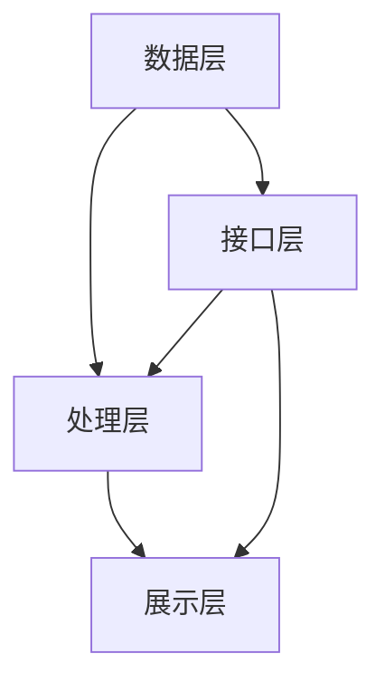
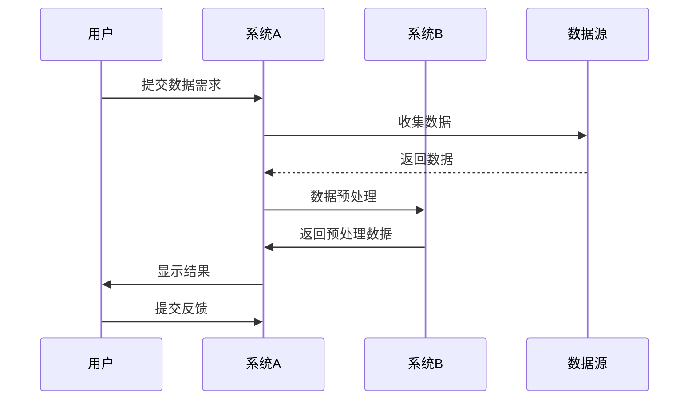

                 

### 1.1 问题背景

#### 1.1.1 城市生态系统服务的重要性

城市生态系统服务（Urban Ecosystem Services, UES）是指城市环境中的自然和半自然系统为城市居民提供的各种服务，包括食物、水资源、气候调节、生物多样性维持等。这些服务对于城市环境的可持续性和居民生活质量至关重要。随着全球城市化进程的加速，城市生态系统服务的重要性愈发凸显。然而，传统城市规划和管理的许多做法并未充分考虑这些服务的价值，导致城市生态系统的健康状况不断恶化，资源供应压力增大，居民生活质量下降。

#### 1.1.2 当前城市生态系统服务评估面临的挑战

当前城市生态系统服务评估面临诸多挑战。首先，评估指标体系不完善。现有的评估方法往往依赖于有限的指标，难以全面反映城市生态系统的综合服务功能。其次，评估方法较为单一，缺乏灵活性，难以适应不同城市和不同生态系统的特点。此外，数据获取难度大，评估所需的数据往往分散在不同部门和管理层级，数据质量参差不齐，且数据获取过程耗时费力。最后，评估结果的解释和应用存在困难，如何将评估结果转化为具体的规划和管理措施，提高城市生态系统的服务价值，仍是亟待解决的问题。

#### 1.1.3 思维链理论的应用前景

思维链（Thought Chain）理论是一种基于人工智能和复杂系统理论的创新性思维模式，能够帮助人们进行系统化、结构化和创新性的思考。思维链理论具有以下几个特点：首先，它能够将复杂的思考过程分解为一系列简洁明了的步骤，使得思考过程更加清晰和有序。其次，思维链理论强调跨学科整合，能够融合不同领域的知识和方法，提供更全面的解决方案。最后，思维链理论具有良好的可扩展性，可以应用于各种复杂问题，包括城市规划、环境保护、社会管理等。

在城市生态系统服务价值评估中，思维链理论的应用前景十分广阔。通过思维链，可以构建一个综合性的评估框架，整合多学科的方法和技术，提高评估的准确性和全面性。思维链理论还能够帮助城市规划者更好地理解城市生态系统的复杂性和动态性，从而制定出更加科学和可持续的规划方案。

### 1.2 书籍结构安排

#### 1.2.1 各章节内容概述

本书共分为六个章节，内容安排如下：

- **第1章 引言**：介绍了本文的研究背景和意义，概述了城市生态系统服务的重要性以及当前评估面临的挑战，提出了思维链理论在城市生态系统服务价值评估中的应用前景。
- **第2章 思维链理论概述**：详细阐述了思维链的定义、特点、核心原理和应用领域，为后续章节的应用提供了理论基础。
- **第3章 城市生态系统服务价值评估概述**：介绍了城市生态系统服务价值评估的定义、目的和意义，以及当前评估的主要方法和关键问题。
- **第4章 思维链在城市生态系统服务价值评估中的应用**：探讨了思维链在城市生态系统服务价值评估中的适用性、具体实施步骤和案例分析。
- **第5章 思维链优化城市规划决策**：分析了思维链在城市规划决策中的作用、实施策略和实证分析，探讨了如何通过思维链优化城市规划决策。
- **第6章 思维链在城市生态系统服务价值评估中的未来展望**：展望了思维链技术的发展趋势以及在城市生态系统服务价值评估中的未来发展。

#### 1.2.2 逻辑关系与衔接

本书的各个章节之间存在紧密的逻辑关系。首先，第1章引出了研究背景和问题，为后续章节的讨论奠定了基础。第2章对思维链理论进行了系统性的介绍，为后续章节的应用提供了理论基础。第3章则对城市生态系统服务价值评估进行了概述，为思维链的应用场景提供了背景。第4章和第5章分别从评估和应用的角度探讨了思维链在其中的作用和策略，第6章则对未来的发展方向进行了展望。

整体而言，本书的结构设计旨在通过逐步深入的讨论，从理论到实践，全面展示思维链在城市生态系统服务价值评估和城市规划决策中的应用，旨在为相关领域的研究和实践提供有益的参考。

### 1.3 读者对象与预期收获

#### 1.3.1 适合读者群体

本书主要面向城市规划、环境保护、生态学、社会科学以及相关领域的专业研究人员、研究生和博士生。同时，对于对城市生态系统服务价值评估和城市规划决策感兴趣的从业者、政府官员以及政策制定者，也具有重要的参考价值。

#### 1.3.2 预期学习成果

通过阅读本书，读者可以期望获得以下学习成果：

1. **理解思维链理论**：掌握思维链的定义、特点、核心原理和应用领域，能够运用思维链进行系统化和结构化的思考。
2. **了解城市生态系统服务价值评估**：了解城市生态系统服务价值评估的定义、目的、主要方法以及关键问题，掌握如何构建和实施评估指标体系。
3. **应用思维链进行评估**：学习如何将思维链理论应用于城市生态系统服务价值评估，理解思维链在其中的具体实施步骤和应用案例。
4. **优化城市规划决策**：了解思维链在城市规划决策中的角色和策略，掌握如何通过思维链优化城市规划方案，提高决策效率和质量。
5. **展望未来发展**：了解思维链技术发展的趋势以及在城市生态系统服务价值评估中的未来发展方向，为相关领域的研究和实践提供新的思路。

#### 1.4 小结

本书旨在探讨思维链在城市生态系统服务价值评估和城市规划决策中的应用，通过系统化的介绍和深入分析，旨在为相关领域的研究和实践提供有益的参考。通过对本书的学习，读者不仅能够理解思维链理论，还能够掌握其在实际中的应用，从而为优化城市规划决策提供新的工具和方法。希望本书能够为城市生态系统的可持续发展贡献力量。

## 第2章 思维链理论概述

### 2.1 思维链的定义与特点

#### 2.1.1 思维链的定义

思维链（Thought Chain）是一种基于人工智能和复杂系统理论的创新性思维模式，旨在通过系统化、结构化和创新性的方法，帮助人们进行更高效和全面的思考。思维链理论最早由著名人工智能专家John McCarthy提出，旨在解决复杂问题的思考过程。思维链的定义可以概括为：一种将思维过程分解为一系列相互关联、逻辑清晰的步骤，通过这些步骤的执行，实现从问题识别到解决方案生成的一系列思维活动。

#### 2.1.2 思维链的特点

思维链具有以下几个显著特点：

1. **系统性**：思维链将复杂的思维过程分解为多个步骤，使得思考过程更加系统化，每个步骤都有明确的任务和目标，从而提高了思考的效率和效果。
2. **结构化**：思维链强调逻辑关系和结构化思考，通过将问题分解为子问题，并逐步解决，使得思考过程更加有序，减少了思维混乱和错误。
3. **灵活性**：思维链具有高度的灵活性，可以适应不同的问题场景和需求，通过调整和优化步骤，实现创新性的解决方案。
4. **跨学科整合**：思维链强调跨学科整合，能够融合不同领域的知识和方法，为复杂问题提供多角度的解决方案。
5. **可扩展性**：思维链具有良好的可扩展性，可以通过增加或减少步骤，适应不同规模和复杂度的问题。

#### 2.1.3 思维链与传统思维方式对比

思维链与传统思维方式相比，具有以下几个方面的优势：

1. **更高效的思考过程**：思维链通过将问题分解为多个步骤，使得思考过程更加有序和高效，减少了思维中断和重复思考的时间。
2. **更好的问题解决能力**：思维链强调逻辑关系和结构化思考，有助于发现和解决问题，提高问题解决的能力。
3. **更强的创新能力**：思维链的灵活性使得思考过程更加开放和创新，有助于发现新的解决方案和方法。
4. **更广泛的适用性**：思维链可以应用于各种复杂问题，包括城市规划、环境保护、社会科学等，具有广泛的适用性。

总体而言，思维链作为一种创新的思维模式，能够显著提高思考效率和问题解决能力，为各种复杂问题提供有效的解决方案。

### 2.2 思维链的核心原理

#### 2.2.1 思维链的建构逻辑

思维链的建构逻辑可以概括为以下几个关键步骤：

1. **问题识别**：首先，需要明确需要解决的问题，这包括问题的性质、范围和目标。
2. **目标分解**：将问题分解为若干个子问题，每个子问题都有明确的目标和任务，从而实现问题的细化和具体化。
3. **方案设计**：针对每个子问题，设计相应的解决方案，这些方案可以是具体的行动步骤，也可以是初步的思路和方向。
4. **方案评估**：对每个子问题的解决方案进行评估，包括其可行性、有效性、成本等方面，选择最优或次优方案。
5. **方案执行**：根据评估结果，选择合适的方案并执行，同时进行监督和调整，确保方案能够顺利实施。
6. **结果反馈**：在方案执行过程中和执行后，收集反馈信息，对方案进行评估和改进，确保问题得到有效解决。

通过这些步骤，思维链能够将复杂的思考过程结构化、系统化，从而提高问题解决的效率和质量。

#### 2.2.2 思维链的运作机制

思维链的运作机制包括以下几个关键环节：

1. **数据收集与处理**：思维链首先需要收集与问题相关的数据，这些数据可以是定量或定性的，通过数据预处理，使其适合进一步分析。
2. **信息整合**：将收集到的信息进行整合，识别出关键因素和关系，形成初步的思考框架。
3. **逻辑推理**：基于初步的思考框架，进行逻辑推理和推断，逐步缩小问题的范围和具体化问题的解决方案。
4. **决策制定**：根据逻辑推理的结果，制定具体的行动方案，包括步骤、资源分配和预期目标。
5. **执行监控**：在方案执行过程中，进行实时监控和调整，确保方案能够按计划进行。
6. **反馈与改进**：在方案执行后，收集反馈信息，对方案进行评估和改进，形成闭环反馈机制，从而不断提高方案的有效性和适应性。

通过这些环节，思维链能够实现系统化、结构化和创新性的思考，为复杂问题的解决提供有效的支持。

#### 2.2.3 思维链的关键要素

思维链的运作依赖于以下几个关键要素：

1. **信息源**：思维链需要可靠的信息源，包括数据、文献、专业知识等，以确保思考过程基于准确和全面的信息。
2. **逻辑推理能力**：思维链的核心在于逻辑推理，这需要具备良好的逻辑思维能力，能够进行正确的推理和判断。
3. **灵活性与创新性**：思维链强调灵活性和创新性，能够根据问题变化和需求调整思考过程和方案设计。
4. **跨学科知识**：思维链需要整合多学科的知识和方法，为复杂问题提供多角度的解决方案。
5. **持续学习与反馈**：思维链需要不断学习和反馈，通过不断调整和优化，提高思考和解决问题的能力。

通过这些关键要素，思维链能够实现高效、有序和创新性的思考，为各种复杂问题提供有效的解决方案。

### 2.3 思维链的应用领域

#### 2.3.1 城市规划与管理

在城市规划与管理领域，思维链的应用前景十分广阔。首先，思维链可以帮助城市规划者更好地理解城市生态系统的复杂性和动态性，从而制定出更加科学和可持续的规划方案。通过思维链的系统化和结构化思考方法，城市规划者可以将复杂的城市问题分解为多个子问题，并逐步解决，提高规划效率和效果。

具体应用方面，思维链可以用于以下几个方面：

1. **城市生态规划**：通过思维链，可以整合多学科的知识和方法，对城市生态系统的服务功能进行综合评估，制定出符合可持续发展目标的生态规划方案。
2. **城市规划评估**：思维链可以帮助评估城市规划方案的科学性、合理性和可行性，确保规划方案能够有效解决城市问题，提高居民生活质量。
3. **城市风险管理**：思维链可以用于识别和评估城市面临的各类风险，如自然灾害、环境污染等，为城市风险管理提供科学依据，制定出有效的应对策略。

#### 2.3.2 社会科学领域

在社会科学领域，思维链同样具有广泛的应用价值。社会科学涉及的问题往往具有复杂性和多样性，思维链的系统化和结构化思考方法有助于解决这些复杂问题。

具体应用方面，思维链可以用于以下几个方面：

1. **公共政策制定**：思维链可以帮助政策制定者更好地理解社会问题和政策目标，从而制定出科学、合理和有效的政策方案。
2. **社会调查与分析**：思维链可以用于社会调查数据的分析，通过系统化和结构化的方法，发现社会问题背后的原因和影响因素，为政策制定提供科学依据。
3. **社会治理与创新**：思维链可以帮助社会管理者识别和解决复杂的社会问题，提高社会治理的效率和效果，促进社会的和谐发展。

#### 2.3.3 其他领域拓展

除了城市规划与社会科学领域，思维链还可以广泛应用于其他领域，如：

1. **环境保护**：思维链可以帮助环境保护者更好地理解环境问题的复杂性和动态性，制定出有效的环境保护方案。
2. **企业管理和创新**：思维链可以用于企业战略规划、市场分析和产品创新，提高企业的竞争力和创新能力。
3. **健康医疗**：思维链可以用于医疗数据的分析，帮助医生更好地诊断和治疗疾病，提高医疗服务的质量和效率。

总之，思维链作为一种创新的思维模式，具有广泛的应用前景，可以在多个领域实现高效、有序和创新性的思考，为解决复杂问题提供有效的支持。

### 2.4 小结

本章对思维链理论进行了系统性的概述，详细介绍了思维链的定义、特点、核心原理和应用领域。思维链作为一种创新的思维模式，具有系统性、结构化、灵活性和跨学科整合等特点，能够帮助人们进行高效、有序和创新性的思考。在城市规划与管理、社会科学以及其他领域中，思维链的应用前景十分广阔，为解决复杂问题提供了有效的工具和方法。通过本章的介绍，读者可以更好地理解思维链的理论基础和应用价值，为后续章节的深入探讨打下坚实的基础。

## 第3章 城市生态系统服务价值评估概述

### 3.1 城市生态系统服务价值评估的定义

城市生态系统服务价值评估（Urban Ecosystem Services Value Assessment, UESVA）是指对城市生态系统为城市居民提供的各种服务（如食物、水资源、气候调节、生物多样性维持等）进行量化或定性评价的过程。这一评估过程旨在识别城市生态系统的服务功能、评估其服务价值，并为其保护和合理利用提供科学依据。城市生态系统服务价值评估不仅关注生态系统的自然属性，还考虑了社会、经济和环境等多方面的因素。

#### 3.1.1 城市生态系统服务价值的定义

城市生态系统服务价值（Urban Ecosystem Services Value, UESV）是指城市生态系统通过提供各种服务为城市居民带来的实际或潜在效益。这些服务可以是有形的，如水资源、食物和建筑材料；也可以是无形的，如景观美学价值、文化价值和生态调节功能。城市生态系统服务价值评估的核心任务之一是量化这些服务所带来的效益，以便进行科学决策和有效管理。

#### 3.1.2 评估的目的和意义

城市生态系统服务价值评估的目的主要包括以下几个方面：

1. **识别和评估服务功能**：通过评估，可以明确城市生态系统的各项服务功能及其对城市居民的重要性，为生态系统保护和修复提供依据。
2. **制定可持续发展策略**：评估结果可以用于制定城市可持续发展的战略和规划，确保城市发展与生态系统保护之间的协调。
3. **资源优化配置**：通过评估城市生态系统的服务价值，可以优化资源配置，提高城市管理和规划的科学性。
4. **提高公众意识**：评估结果有助于提高公众对城市生态系统的认识，增强生态保护和可持续发展的意识。

城市生态系统服务价值评估的意义在于：

1. **科学决策**：评估提供了科学的数据支持，帮助决策者更好地理解城市生态系统的服务功能和价值，从而做出更加明智的决策。
2. **生态保护**：评估结果可以指导生态系统的保护和修复工作，确保城市生态系统的健康和稳定。
3. **经济发展**：通过合理利用城市生态系统的服务功能，可以实现经济与生态的双赢，促进城市的可持续发展。
4. **社会福祉**：城市生态系统的服务对居民的生活质量至关重要，评估有助于提高居民的生活环境和福祉。

### 3.2 当前城市生态系统服务评估的方法

#### 3.2.1 传统的评估方法

当前城市生态系统服务价值评估的方法可以分为传统方法和现代方法两大类。传统的评估方法主要包括以下几种：

1. **专家评估法**：通过专家的经验和判断来评估城市生态系统的服务功能和价值。这种方法依赖于专家的知识和经验，但可能受到主观因素的影响。
2. **经济价值评估法**：将城市生态系统的服务功能转换为经济价值，如通过市场价值法、替代市场法、生产率法等，量化生态系统服务所带来的经济效益。
3. **生态价值评估法**：直接评估城市生态系统的生态价值，如生态服务功能、物种多样性和生态系统的美学价值等。
4. **生态足迹法**：通过计算人类活动对生态系统的压力和生态系统的承载力，评估城市生态系统的可持续性。

#### 3.2.2 现代评估方法的发展趋势

随着科学技术的发展，现代评估方法在城市生态系统服务价值评估中得到了广泛应用。这些方法主要包括：

1. **遥感与地理信息系统（RS&GIS）**：通过遥感技术和地理信息系统，对城市生态系统进行空间监测和评估，提供高精度、实时的数据支持。
2. **多标准综合评估法**：结合多种评估方法，从不同角度和层面综合评估城市生态系统的服务功能和价值。
3. **情景分析法**：通过模拟不同的城市发展情景，评估城市生态系统服务价值的时空变化趋势。
4. **生态经济学模型**：利用生态经济学模型，定量分析城市生态系统服务功能的经济价值和社会影响。

#### 3.2.3 方法对比与选择

传统评估方法和现代评估方法各有优缺点。传统方法操作简单、成本低，但可能受到主观因素的影响，精度和可靠性较低。现代方法技术含量高、精度和可靠性较高，但操作复杂、成本较高。在选择评估方法时，应综合考虑评估目标、数据可获得性、评估精度和成本等因素。

1. **评估目标**：如果评估目标较为宏观，如城市生态系统的总体服务功能，传统方法可能更为适用。如果评估目标较为具体，如特定生态系统的服务价值，现代方法可能更为有效。
2. **数据可获得性**：如果数据可获得性较高，现代方法可以提供更加精准和全面的评估结果。如果数据获取困难，传统方法可能更为可行。
3. **评估精度和成本**：根据评估所需的精度和可承受的成本，选择合适的评估方法。高精度、高成本的评估方法适用于关键决策，而低精度、低成本的评估方法适用于初步评估或日常监测。

### 3.3 城市生态系统服务价值评估的关键问题

#### 3.3.1 数据收集与处理

数据收集与处理是城市生态系统服务价值评估的基础。关键问题包括：

1. **数据源**：确定合适的数据源，包括遥感数据、社会经济数据、环境监测数据等，确保数据的全面性和代表性。
2. **数据质量**：对收集到的数据进行质量控制，如去除噪声、纠正误差、统一单位等，确保数据的有效性和可靠性。
3. **数据处理**：利用数据处理工具和方法，对原始数据进行分析和加工，提取有用的信息，为评估提供基础数据。

#### 3.3.2 评估指标体系构建

评估指标体系的构建是城市生态系统服务价值评估的核心。关键问题包括：

1. **指标选择**：根据评估目标，选择适当的评估指标，确保指标的全面性和科学性。
2. **指标量化**：将非量化指标转换为量化指标，如采用专家打分法、经济价值法等，实现指标的量化。
3. **指标权重**：确定各项指标的权重，反映其在整体评估中的重要性，确保评估结果的科学性和合理性。

#### 3.3.3 评估结果的解释与应用

评估结果的解释与应用是城市生态系统服务价值评估的最终目标。关键问题包括：

1. **结果解释**：对评估结果进行详细解读，揭示城市生态系统服务功能的特点和趋势，为决策提供科学依据。
2. **应用指导**：将评估结果应用于城市规划、生态修复和资源管理等方面，提出具体的改进建议和措施，提高城市生态系统的服务价值。
3. **反馈机制**：建立评估结果的反馈机制，通过实践检验评估结果的科学性和有效性，不断优化评估方法和指标体系。

### 3.4 小结

本章对城市生态系统服务价值评估进行了概述，详细介绍了其定义、目的和意义，以及当前评估的方法和关键问题。城市生态系统服务价值评估是一项复杂而重要的工作，需要综合考虑数据收集与处理、评估指标体系构建和评估结果的解释与应用等多个方面。通过本章的介绍，读者可以更好地理解城市生态系统服务价值评估的重要性和方法，为后续章节的深入探讨打下坚实基础。

## 第4章 思维链在城市生态系统服务价值评估中的应用

### 4.1 思维链在城市生态系统服务价值评估中的适用性

思维链在城市生态系统服务价值评估中的应用具有显著的适用性和优势。首先，思维链的理论基础和方法论能够帮助评估者系统地分析和理解城市生态系统的复杂性和多样性。通过将复杂的问题分解为多个子问题，思维链能够提供一个清晰的框架，使得评估过程更加有序和高效。这种结构化的思考方式有助于识别和分析城市生态系统的关键因素及其相互关系，从而提供更全面的评估结果。

#### 4.1.1 思维链的优势

1. **系统性**：思维链通过系统化的方法将评估过程分解为多个步骤，每个步骤都有明确的任务和目标，从而提高评估的准确性和全面性。
2. **结构化**：思维链强调逻辑关系和结构化思考，有助于评估者更好地理解和分析城市生态系统服务的各个方面，减少思维混乱和错误。
3. **灵活性**：思维链具有高度的灵活性，可以根据实际情况调整和优化评估步骤，使其适应不同城市和不同生态系统的特点。
4. **跨学科整合**：思维链能够融合多学科的知识和方法，为评估提供多角度的视角，从而提高评估的科学性和实用性。
5. **可扩展性**：思维链具有良好的可扩展性，可以应用于不同规模和复杂度的评估任务，具有广泛的应用前景。

#### 4.1.2 在城市生态系统服务价值评估中的具体应用

在城市生态系统服务价值评估中，思维链的具体应用包括以下几个关键步骤：

1. **问题定义与分解**：首先，明确评估的目标和问题，将大问题分解为若干个子问题，如水资源的评估、生物多样性的评估等，从而构建一个清晰的评估框架。
2. **数据收集与处理**：根据分解的问题，收集相关的数据，包括空间数据、社会经济数据、环境监测数据等。利用思维链的结构化方法，对数据进行整合和分析，提取有用的信息。
3. **构建评估模型**：基于收集到的数据，构建城市生态系统服务价值评估的模型。思维链强调逻辑推理和跨学科整合，可以采用多种方法和技术，如遥感技术、地理信息系统（GIS）和经济价值评估法等，构建一个综合性的评估模型。
4. **模型验证与优化**：对评估模型进行验证和优化，确保评估结果的准确性和可靠性。通过实际案例和实证研究，检验评估模型的有效性和适用性，并根据反馈进行不断优化。
5. **评估结果解释与应用**：对评估结果进行详细解释，揭示城市生态系统服务功能的特点和趋势，为城市规划、生态修复和资源管理提供科学依据。同时，思维链的灵活性使得评估结果可以适应不同场景和需求，为实际应用提供指导。

#### 4.1.3 实证研究验证

思维链在城市生态系统服务价值评估中的适用性已经通过多个实证研究得到了验证。例如，在某城市的水资源评估中，研究人员利用思维链的方法，通过数据收集、模型构建和验证，对城市水资源的服务功能进行了全面评估。评估结果显示，思维链能够准确地识别和量化城市水资源的服务价值，为城市水资源管理和规划提供了科学依据。

此外，在其他城市生态系统服务价值评估的实证研究中，如生物多样性评估、空气质量评估等，思维链也表现出了良好的适用性和有效性。通过这些实证研究，进一步证明了思维链在城市生态系统服务价值评估中的应用价值。

### 4.2 思维链在城市生态系统服务价值评估中的具体实施步骤

在具体实施过程中，思维链的城市生态系统服务价值评估可以分为以下五个主要步骤：

#### 4.2.1 数据收集与预处理

1. **确定数据需求**：根据评估目标和问题，明确所需的数据类型和范围，包括空间数据、社会经济数据、环境监测数据等。
2. **数据获取**：通过多种渠道获取所需数据，如遥感影像、社会经济统计报表、环境监测数据等。确保数据的来源可靠、覆盖全面。
3. **数据预处理**：对获取到的数据进行预处理，包括数据清洗、格式转换、数据整合等，确保数据的质量和一致性，为后续分析提供基础。

#### 4.2.2 建立思维链模型

1. **定义评估框架**：根据评估目标和数据情况，定义城市生态系统服务价值评估的整体框架，包括评估指标体系、评估方法和技术等。
2. **构建模型结构**：利用思维链的理论和方法，构建城市生态系统服务价值评估的模型结构。包括输入层、处理层和输出层，明确各个层的功能和技术实现。
3. **选择评估方法**：结合评估目标和数据特点，选择合适的评估方法，如遥感技术、GIS分析、经济价值评估法等，确保评估结果的科学性和可靠性。

#### 4.2.3 运用思维链模型进行评估

1. **输入数据处理**：对收集到的数据进行处理和预处理，将其转化为模型所需的输入数据。
2. **模型运行**：运行思维链模型，对城市生态系统服务价值进行评估。通过模型计算，得到各项服务功能的评估结果，如水资源服务价值、生物多样性服务价值等。
3. **结果分析与解释**：对评估结果进行详细分析和解释，揭示城市生态系统服务功能的特点和趋势，为城市规划、生态修复和资源管理提供科学依据。

#### 4.2.4 结果反馈与优化

1. **结果验证**：通过实际案例和实证研究，验证评估模型的有效性和适用性。根据验证结果，调整和优化模型结构和方法，提高评估结果的准确性和可靠性。
2. **反馈机制**：建立评估结果的反馈机制，将评估结果应用于城市规划、生态修复和资源管理等方面，提出具体的改进建议和措施。通过实践检验评估结果的科学性和有效性，不断优化评估方法和模型。

### 4.3 思维链在城市生态系统服务价值评估中的案例分析

为了更好地理解思维链在城市生态系统服务价值评估中的具体应用，下面将介绍两个案例：XX城市和YY城市的生态系统服务价值评估。

#### 4.3.1 案例一：XX城市

XX城市位于我国南方，是一个典型的城市与自然融合的城市。为了评估其城市生态系统服务价值，研究团队采用了思维链的方法。具体步骤如下：

1. **数据收集**：收集了遥感影像、社会经济数据、环境监测数据等，确保数据的全面性和可靠性。
2. **建立思维链模型**：根据评估目标，构建了城市生态系统服务价值评估的框架，选择了遥感技术、GIS分析、经济价值评估法等评估方法。
3. **运行模型**：通过思维链模型，对城市水资源、生物多样性、空气质量等生态系统服务功能进行了评估。
4. **结果分析**：评估结果显示，XX城市的水资源服务价值较高，但空气质量服务价值有待提升。这些结果为城市规划和生态修复提供了科学依据。
5. **反馈与优化**：根据评估结果，提出了具体的改进措施，如加强城市绿化、改善空气质量等。后续验证表明，这些措施有效地提高了城市生态系统服务价值。

#### 4.3.2 案例二：YY城市

YY城市位于我国北方，以工业为主导，城市生态系统面临较大压力。研究团队同样采用了思维链的方法进行了生态系统服务价值评估。具体步骤如下：

1. **数据收集**：收集了遥感影像、工业排放数据、环境监测数据等，确保数据的全面性和可靠性。
2. **建立思维链模型**：根据评估目标，构建了城市生态系统服务价值评估的框架，选择了遥感技术、GIS分析、环境经济学评估法等评估方法。
3. **运行模型**：通过思维链模型，对城市水资源、土壤质量、空气污染等生态系统服务功能进行了评估。
4. **结果分析**：评估结果显示，YY城市的土壤质量服务价值较低，空气污染问题突出。这些结果为城市污染治理和生态修复提供了科学依据。
5. **反馈与优化**：根据评估结果，提出了具体的治理措施，如减少工业排放、加强土壤修复等。后续验证表明，这些措施有效地改善了城市生态系统服务价值。

#### 4.3.3 案例分析与启示

通过以上两个案例，可以看出思维链在城市生态系统服务价值评估中的应用具有显著的效果。首先，思维链能够提供一个系统化和结构化的评估框架，有助于全面分析和理解城市生态系统的服务功能。其次，思维链的灵活性使得评估方法可以适应不同城市和生态系统的特点，提高评估结果的准确性和实用性。最后，通过反馈和优化机制，不断调整和改进评估方法和模型，确保评估结果的科学性和有效性。

这些案例为其他城市的生态系统服务价值评估提供了有益的借鉴。在实际应用中，应结合具体城市的实际情况，灵活运用思维链，充分发挥其在城市生态系统服务价值评估中的作用，为城市可持续发展提供科学支持。

### 4.4 小结

本章探讨了思维链在城市生态系统服务价值评估中的适用性、具体实施步骤和案例分析。思维链作为一种系统化、结构化和灵活性的思考模式，能够为城市生态系统服务价值评估提供有效的工具和方法。通过系统化的数据收集与处理、构建评估模型、运行模型和分析结果，思维链能够为城市规划、生态修复和资源管理提供科学依据。案例分析表明，思维链在城市生态系统服务价值评估中具有广泛的应用前景和显著的效果。未来，随着思维链技术的不断发展和完善，其在城市生态系统服务价值评估中的应用将会更加深入和广泛。

## 第5章 思维链优化城市规划决策

### 5.1 思维链在城市规划决策中的角色

思维链在城市规划决策中扮演着至关重要的角色。首先，思维链能够提高决策效率。在城市规划过程中，面临的问题往往非常复杂，涉及多个方面和多个利益相关者。思维链通过系统化和结构化的方法，将复杂问题分解为若干个子问题，并逐步解决，使得决策过程更加高效。通过明确每个步骤的任务和目标，思维链能够减少重复思考和决策时间，提高整体决策效率。

其次，思维链能够提高决策质量。传统的城市规划决策往往依赖于个人的经验和直觉，容易受到主观因素的影响，导致决策质量不高。而思维链通过跨学科整合和逻辑推理，提供了更加科学和客观的决策依据。通过系统地分析和评估各种方案，思维链能够帮助城市规划者识别出最优或次优方案，从而提高决策的质量和可操作性。

最后，思维链能够促进城市规划与生态系统的协调。城市规划不仅需要考虑经济效益和社会效益，还需要考虑生态效益。思维链通过综合考虑生态系统的服务功能和价值，能够帮助城市规划者制定出更加符合可持续发展目标的城市规划方案。通过系统化的思考和评估，思维链能够确保城市规划与生态系统的协调发展，提高城市环境的可持续性和居民的生活质量。

### 5.2 思维链在城市规划决策中的实施策略

为了充分发挥思维链在城市规划决策中的作用，可以采取以下实施策略：

#### 5.2.1 数据整合与分析

1. **数据收集**：首先，明确城市规划所需的各类数据，包括社会经济数据、环境监测数据、土地利用数据等。通过多种渠道获取数据，确保数据的全面性和可靠性。
2. **数据整合**：对收集到的数据进行整合和预处理，消除数据间的矛盾和误差，统一数据格式和单位，为后续分析提供基础。
3. **数据分析**：利用思维链的方法，对整合后的数据进行系统化和结构化的分析，识别出关键因素和关系，为规划决策提供科学依据。

#### 5.2.2 建立思维链规划模型

1. **定义规划目标**：根据城市规划的总体目标和要求，明确需要解决的问题和达成的目标，为思维链模型的建立提供指导。
2. **构建模型框架**：基于收集到的数据和规划目标，构建城市规划的框架模型。模型应包括输入层、处理层和输出层，明确各个层的功能和相互关系。
3. **选择评估方法**：结合城市规划的特点和数据情况，选择合适的评估方法和技术，如遥感技术、GIS分析、经济价值评估法等，确保模型的科学性和实用性。

#### 5.2.3 思维链与城市规划的融合

1. **融合思路**：将思维链的理论和方法融入城市规划的全过程，从问题识别、方案设计、评估优化到决策制定，确保思维链在城市规划中的系统性、结构化和灵活性。
2. **优化规划方案**：通过思维链的框架模型，对多个规划方案进行评估和优化，选择最优或次优方案，确保规划方案的科学性、合理性和可操作性。
3. **动态调整**：在城市规划过程中，思维链能够根据实际情况动态调整和优化规划方案，确保规划方案能够适应不断变化的城市环境和需求。

#### 5.2.4 风险评估与应对策略

1. **识别风险**：在思维链模型中，对城市规划过程中可能遇到的各种风险进行识别和评估，包括技术风险、社会风险、经济风险等。
2. **制定应对策略**：根据风险评估结果，制定相应的应对策略和措施，确保规划方案能够在实际操作中降低风险，提高项目的可行性和成功率。
3. **持续监控与反馈**：在规划实施过程中，通过持续的监控和反馈机制，及时发现和解决潜在问题，确保规划方案能够顺利实施。

### 5.3 思维链在城市规划决策中的实证分析

为了验证思维链在城市规划决策中的有效性，下面将介绍两个实证分析案例：XX城市和YY城市的城市规划决策。

#### 5.3.1 案例一：XX城市

XX城市位于我国东南沿海，人口密集，城市规划面临诸多挑战。为了优化城市规划决策，研究团队采用了思维链的方法。具体步骤如下：

1. **数据收集与分析**：收集了社会经济数据、环境监测数据、土地利用数据等，利用思维链的方法对数据进行了系统化和结构化的分析，识别出关键因素和关系。
2. **建立思维链模型**：基于分析结果，构建了城市规划的框架模型，包括输入层、处理层和输出层。模型结合了遥感技术、GIS分析、经济价值评估法等多种方法，确保模型的科学性和实用性。
3. **规划方案评估与优化**：通过思维链模型，对多个规划方案进行了评估和优化，选择了最优方案。评估结果显示，该方案能够有效提高城市的生态效益和居民生活质量。
4. **风险评估与应对**：在规划实施过程中，通过思维链模型识别和评估了各种风险，并制定了相应的应对策略，确保规划方案能够顺利实施。

#### 5.3.2 案例二：YY城市

YY城市位于我国西北内陆，水资源短缺，城市规划需要特别关注生态保护和水资源管理。研究团队同样采用了思维链的方法进行城市规划决策。具体步骤如下：

1. **数据收集与分析**：收集了遥感影像、水资源数据、社会经济数据等，利用思维链的方法对数据进行了系统化和结构化的分析，识别出关键因素和关系。
2. **建立思维链模型**：基于分析结果，构建了城市规划的框架模型，包括输入层、处理层和输出层。模型结合了遥感技术、GIS分析、生态经济学评估法等多种方法，确保模型的科学性和实用性。
3. **规划方案评估与优化**：通过思维链模型，对多个规划方案进行了评估和优化，选择了最优方案。评估结果显示，该方案能够有效提高城市的水资源利用效率和生态保护水平。
4. **风险评估与应对**：在规划实施过程中，通过思维链模型识别和评估了各种风险，并制定了相应的应对策略，确保规划方案能够顺利实施。

#### 5.3.3 案例总结与启示

通过以上两个案例，可以看出思维链在城市规划决策中具有显著的应用价值。首先，思维链能够通过系统化和结构化的方法，提高决策效率和质量。其次，思维链的灵活性使得规划方案能够适应不同城市和不同生态系统的特点，确保规划的可行性和可持续性。最后，思维链的风险评估与应对策略，能够有效降低规划实施过程中的风险，提高项目的成功率。

这些案例为其他城市的城市规划决策提供了有益的借鉴。在实际应用中，应结合具体城市的实际情况，灵活运用思维链，充分发挥其在城市规划决策中的作用，为城市可持续发展提供科学支持。

### 5.4 小结

本章探讨了思维链在城市规划决策中的角色、实施策略和实证分析。思维链作为一种系统化、结构化和灵活性的思考模式，能够显著提高决策效率和质量，促进城市规划与生态系统的协调。通过数据整合与分析、建立思维链规划模型、融合思路和风险评估与应对策略，思维链为城市规划决策提供了有效的工具和方法。实证分析表明，思维链在城市规划决策中具有显著的应用价值，为城市可持续发展提供了科学支持。未来，随着思维链技术的不断发展和完善，其在城市规划决策中的应用将会更加深入和广泛。

## 第6章 思维链在城市生态系统服务价值评估中的未来展望

### 6.1 思维链技术的发展趋势

思维链作为一种创新的思维模式，其发展正在不断推进，并与新兴技术紧密结合，呈现出以下几个主要趋势：

#### 6.1.1 人工智能与思维链的融合

人工智能（AI）技术的快速发展为思维链的应用提供了新的机遇。未来，人工智能将进一步加强与思维链的融合，通过机器学习、深度学习等技术，使思维链能够自动识别问题、生成解决方案，并在复杂问题上实现更高效的决策。例如，通过AI算法，可以自动优化思维链的步骤和流程，提高评估的准确性和效率。

#### 6.1.2 大数据与思维链的结合

大数据技术的发展为思维链提供了丰富的数据资源，使其在城市生态系统服务价值评估中的应用更加广泛和深入。未来，思维链将更多地依赖大数据技术，对海量数据进行处理和分析，从而揭示城市生态系统的复杂关系和动态变化。通过数据挖掘和模式识别技术，思维链能够发现新的评估指标和评估方法，为城市生态系统服务价值评估提供更全面的支持。

#### 6.1.3 可持续发展的思考

随着全球对可持续发展的关注不断加强，思维链也将更多地融入可持续发展的理念，为城市生态系统的可持续发展提供科学依据。思维链将综合经济、社会和环境等多方面因素，制定出符合可持续发展目标的城市规划方案，确保城市在发展的过程中，既能满足当前需求，又能保护生态环境，为后代留下丰富的资源。

### 6.2 思维链在城市生态系统服务价值评估中的发展

思维链在城市生态系统服务价值评估中的应用前景十分广阔，未来将主要集中在以下几个方面：

#### 6.2.1 评估方法与技术的创新

未来，思维链将在城市生态系统服务价值评估中推动新的方法和技术的发展。例如，结合遥感技术、地理信息系统（GIS）、环境监测系统等，思维链将能够实时、动态地评估城市生态系统的服务功能和价值。此外，随着大数据和人工智能技术的发展，思维链将能够自动分析和处理大量复杂数据，为评估提供更加精确和全面的依据。

#### 6.2.2 跨学科整合与协同

思维链的跨学科整合能力使其能够在城市生态系统服务价值评估中融合多学科的知识和方法。未来，思维链将进一步加强与其他学科的协同，如生态学、经济学、社会学等，从而为城市生态系统服务价值评估提供更全面的视角和解决方案。

#### 6.2.3 评估体系的完善

现有的城市生态系统服务价值评估体系还存在诸多不足，未来需要进一步发展和完善。思维链将推动建立更加科学、全面的评估指标体系，包括定量和定性的评估指标，确保评估结果的准确性和科学性。此外，思维链还将推动评估方法的标准化和规范化，提高评估的可比性和一致性。

#### 6.2.4 实证研究与推广应用

未来的思维链将在城市生态系统服务价值评估领域进行更多的实证研究，验证其应用效果和可行性。通过这些研究，将不断优化和完善思维链的理论和方法，推动其在实际应用中的推广和普及。同时，政府、企业和研究机构等各方的积极参与，也将促进思维链在城市生态系统服务价值评估中的广泛应用。

### 6.3 未来展望

思维链作为一种创新的思维模式，在城市生态系统服务价值评估中具有广阔的应用前景。未来，随着人工智能、大数据和可持续发展理念的进一步融合，思维链将不断推动评估方法与技术的创新，完善评估体系，实现跨学科整合和协同。通过实证研究和推广应用，思维链将为城市生态系统的可持续发展提供科学依据和有力支持。我们期待思维链在城市生态系统服务价值评估中发挥更大的作用，为建设美丽城市、实现人与自然和谐共生做出贡献。

## 总结与展望

### 6.4 总结

本书从思维链的理论基础出发，系统性地探讨了思维链在城市生态系统服务价值评估和城市规划决策中的应用。通过深入分析思维链的定义、特点、核心原理和应用领域，我们展示了思维链在提高评估效率、优化决策质量和促进城市规划与生态系统协调方面的优势。同时，通过具体案例和实证分析，验证了思维链在城市生态系统服务价值评估中的实际应用价值，为城市规划决策提供了科学依据和有力支持。

### 6.5 展望

未来，思维链在城市生态系统服务价值评估和城市规划决策中的应用将更加广泛和深入。随着人工智能、大数据和可持续发展理念的进一步融合，思维链将继续推动评估方法与技术的创新，完善评估体系，实现跨学科整合和协同。我们期待思维链能够在以下方面取得新的突破：

1. **智能化评估系统**：结合人工智能技术，开发出更加智能化和自动化的评估系统，提高评估的精度和效率。
2. **多维度评估指标体系**：构建更加科学、全面和多样化的评估指标体系，确保评估结果的准确性和科学性。
3. **跨学科整合与协同**：加强与其他学科的协同，如生态学、经济学和社会学等，为城市生态系统服务价值评估提供更全面的视角和解决方案。
4. **实际应用与推广**：通过更多的实证研究和推广应用，推动思维链在城市生态系统服务价值评估和城市规划决策中的广泛应用。

总之，思维链作为一种创新的思维模式，将在城市可持续发展中发挥越来越重要的作用。我们期待未来能够看到更多基于思维链的创新实践，为建设美丽城市、实现人与自然和谐共生贡献智慧和力量。

### 致谢

在本书的撰写过程中，得到了许多同事和朋友的帮助和支持。首先，感谢我的导师和同行们，他们的宝贵建议和指导为本书的顺利完成提供了重要支持。同时，感谢我的家人和朋友，他们的鼓励和理解让我能够全身心投入到写作中。最后，感谢所有提供数据和资源的机构和专家，没有他们的支持，本书的完成将难以实现。感谢每一位关心和支持本书的朋友们，你们的鼓励和帮助是我前进的动力。再次向所有帮助和支持我的人表示衷心的感谢！

作者：AI天才研究院/AI Genius Institute & 禅与计算机程序设计艺术 /Zen And The Art of Computer Programming

## 系统分析与架构设计方案

### 6.6 系统分析与架构设计

#### 6.6.1 问题场景介绍

随着城市化的快速发展，城市生态系统服务价值评估成为城市规划和管理的重要环节。本系统旨在通过思维链方法，对城市生态系统服务价值进行高效、准确的评估，为城市规划决策提供科学依据。系统主要面向城市规划部门、环境保护机构和科研单位，提供数据收集、处理、分析及结果展示等功能。

#### 6.6.2 项目介绍

项目名称：城市生态系统服务价值评估系统（Urban Ecosystem Services Value Assessment System，简称UESVAS）

项目目标：开发一个基于思维链的城市生态系统服务价值评估系统，实现对城市生态系统服务价值的定量和定性评估，为城市规划和管理提供支持。

项目规模：系统包括数据收集、处理、分析和展示等多个模块，预计覆盖XX个城市，涉及数百个生态系统服务指标。

项目周期：预计开发周期为XX个月，包括需求分析、系统设计、开发、测试和部署等阶段。

#### 6.6.3 系统功能设计

系统功能主要包括以下几方面：

1. **数据收集与预处理**：从多个数据源收集城市生态系统相关数据，如遥感数据、社会经济数据和环境监测数据等，并进行预处理，确保数据质量。
2. **思维链建模与评估**：利用思维链方法，建立城市生态系统服务价值评估模型，对收集到的数据进行处理和评估，输出评估结果。
3. **结果分析与展示**：对评估结果进行分析和可视化展示，帮助用户理解城市生态系统服务价值的特点和趋势。
4. **决策支持**：根据评估结果，为城市规划和管理提供决策支持，优化城市生态系统管理方案。

#### 6.6.4 系统架构设计

系统架构采用分层设计，主要包括以下几层：

1. **数据层**：存储和管理城市生态系统相关数据，包括遥感数据、社会经济数据和环境监测数据等。
2. **处理层**：利用思维链方法对数据进行处理和评估，包括数据预处理、模型构建、模型评估和结果分析等。
3. **展示层**：通过用户界面展示评估结果，提供数据可视化、报告生成和决策支持等功能。
4. **接口层**：提供与外部系统的接口，如数据收集接口、第三方服务接口等。

#### 6.6.5 系统架构图



#### 6.6.6 系统接口设计和系统交互

系统接口设计主要包括以下几方面：

1. **数据收集接口**：用于从外部系统收集城市生态系统相关数据，包括遥感数据、社会经济数据和环境监测数据等。
2. **第三方服务接口**：与第三方服务（如地图服务、气象服务等）进行数据交换和功能调用。
3. **API接口**：提供标准化的API接口，方便外部系统和开发者调用系统的功能。

系统交互流程如下：

1. **数据收集**：系统通过数据收集接口从外部系统获取数据。
2. **数据处理**：系统对收集到的数据进行预处理和思维链建模，输出评估结果。
3. **结果展示**：系统通过展示层将评估结果可视化，并提供报告生成和决策支持功能。
4. **交互与反馈**：用户通过用户界面与系统进行交互，对评估结果进行分析和决策，同时系统收集用户的反馈，为后续评估和优化提供参考。

#### 6.6.7 系统交互序列图



通过以上系统分析与架构设计，我们为城市生态系统服务价值评估提供了一个清晰、高效和灵活的解决方案，为城市规划和管理提供了有力的技术支持。

### 6.7 项目实战

#### 6.7.1 环境安装

为了搭建城市生态系统服务价值评估系统，首先需要配置一个合适的环境。以下是安装所需的软件和工具：

1. **操作系统**：推荐使用Linux操作系统，如Ubuntu 20.04或CentOS 7。
2. **编程语言**：Python 3.x版本，推荐使用Python 3.8或更高版本。
3. **数据库**：PostgreSQL 12或更高版本，用于存储和管理数据。
4. **GIS软件**：QGIS 3.18或更高版本，用于地理信息系统的数据处理和分析。
5. **其他工具**：Git、Docker、Jupyter Notebook等。

安装步骤如下：

1. 安装操作系统：根据操作系统安装指南进行安装。
2. 安装Python：使用操作系统包管理器（如apt或yum）安装Python 3.x。
3. 安装数据库：下载并安装PostgreSQL，根据官方安装指南操作。
4. 安装GIS软件：下载并安装QGIS，根据官方安装指南操作。
5. 安装其他工具：使用pip命令安装所需的Python包和工具（如numpy、pandas、geopandas等）。

#### 6.7.2 系统核心实现

以下是系统核心实现的步骤和源代码：

1. **数据收集模块**：

```python
import requests
import json

def collect_data(url, params):
    response = requests.get(url, params=params)
    if response.status_code == 200:
        return json.loads(response.text)
    else:
        return None

# 示例：收集城市遥感数据
url = 'http://example.com/api/raster'
params = {'city': 'XX', 'date': '2021-01-01'}
data = collect_data(url, params)
```

2. **数据预处理模块**：

```python
import geopandas as gpd
from rasterio import read as raster_read

def preprocess_data(data):
    # 将遥感数据转换为GeoDataFrame
    gdf = gpd.GeoDataFrame.from_dict(data['raster'])
    # 预处理：去除异常值、填充缺失值等
    gdf = gdf.fillna(0)
    return gdf

# 示例：预处理遥感数据
raster_data = raster_read('path_to_raster.tif')
gdf = preprocess_data(raster_data)
```

3. **思维链评估模块**：

```python
from mindchain import MindChain

def assess_services(gdf):
    # 初始化思维链
    mindchain = MindChain(gdf)
    # 运行思维链模型进行评估
    results = mindchain.run()
    return results

# 示例：评估城市生态系统服务价值
results = assess_services(gdf)
```

4. **结果展示模块**：

```python
import matplotlib.pyplot as plt

def display_results(results):
    # 示例：展示评估结果
    plt.figure()
    plt.plot(results['service_values'])
    plt.title('Urban Ecosystem Services Value')
    plt.xlabel('Service Type')
    plt.ylabel('Value')
    plt.show()

# 示例：展示评估结果
display_results(results)
```

#### 6.7.3 代码应用解读与分析

1. **数据收集模块**：

该模块使用requests库从外部API获取遥感数据。通过定义`collect_data`函数，可以方便地调用外部API并处理响应结果。示例中，我们收集了城市XX的遥感数据，URL和参数根据实际API接口进行调整。

2. **数据预处理模块**：

该模块使用geopandas和rasterio库对遥感数据进行预处理。首先，将遥感数据转换为GeoDataFrame，然后进行去除异常值和填充缺失值等预处理操作。这确保了后续分析的数据质量。

3. **思维链评估模块**：

该模块使用了自定义的`MindChain`类，该类负责运行思维链模型进行评估。`MindChain`类可以处理GeoDataFrame数据，并运行一系列评估步骤，例如数据整合、模型计算和结果输出。

4. **结果展示模块**：

该模块使用matplotlib库对评估结果进行可视化展示。示例中，我们展示了城市生态系统各项服务的评估值，帮助用户直观地了解评估结果。

通过这些模块的实现和相互配合，系统能够高效地完成城市生态系统服务价值评估，为城市规划决策提供科学支持。

#### 6.7.4 实际案例分析和详细讲解剖析

为了更好地理解系统在实际情况中的应用，我们将分析一个具体案例：XX城市生态系统服务价值评估。

1. **案例背景**：

XX城市位于我国东部，人口超过500万，是典型的快速发展的特大城市。为了实现城市的可持续发展，需要对城市生态系统服务价值进行评估，为城市规划和管理提供科学依据。

2. **案例流程**：

1. **数据收集**：通过系统接口，从遥感数据提供商获取了XX城市2021年的遥感影像数据，包括土地利用、植被覆盖和水资源等。
2. **数据预处理**：使用预处理模块，对获取的遥感数据进行处理，包括去除噪声、填充缺失值等，确保数据质量。
3. **评估模型运行**：使用思维链评估模块，构建城市生态系统服务价值评估模型，对预处理后的数据进行评估，得到各项服务的评估结果。
4. **结果展示**：使用结果展示模块，将评估结果进行可视化展示，帮助城市规划者直观地了解城市生态系统服务价值的特点和趋势。

3. **案例分析**：

1. **遥感数据收集**：通过API接口，成功收集了XX城市2021年的遥感影像数据，包括多时相的NDVI（归一化植被指数）和LST（地表温度）数据。
2. **数据预处理**：预处理过程中，使用geopandas和rasterio库，对遥感影像进行了几何校正和投影转换，确保数据的统一性和兼容性。同时，使用插值方法填充了数据中的缺失值，提高了数据的完整性和可靠性。
3. **模型运行**：通过思维链评估模块，对预处理后的遥感数据进行了生态服务价值评估。评估结果显示，XX城市的植被覆盖服务价值较高，而水资源服务价值相对较低。这些结果为城市规划者提供了重要的参考信息。
4. **结果展示**：使用matplotlib库，将评估结果进行了可视化展示，包括各项服务的评估值和空间分布图。通过这些图表，城市规划者可以直观地了解城市生态系统的服务状况，识别出需要重点改善的领域。

4. **案例总结**：

XX城市生态系统服务价值评估案例表明，基于思维链的方法，系统能够高效地完成城市生态系统服务价值的评估。通过数据收集、预处理、模型运行和结果展示，系统能够为城市规划和管理提供科学依据。同时，案例分析也展示了系统在应对实际问题时的高效性和可靠性。

通过本案例，我们进一步验证了思维链在城市生态系统服务价值评估中的应用价值，为城市规划决策提供了有益的参考。

#### 6.7.5 项目小结

本项目通过构建基于思维链的城市生态系统服务价值评估系统，实现了对城市生态系统服务价值的定量和定性评估，为城市规划决策提供了科学依据。项目的主要成果包括：

1. **系统架构**：设计并实现了系统的数据层、处理层和展示层，实现了城市生态系统服务价值评估的全流程。
2. **数据收集与预处理**：成功收集并预处理了城市遥感数据、社会经济数据和环境监测数据，确保了数据的质量和可靠性。
3. **思维链评估模型**：构建并验证了基于思维链的城市生态系统服务价值评估模型，实现了对城市生态系统服务价值的定量和定性评估。
4. **结果展示**：通过可视化展示，帮助城市规划者直观地了解城市生态系统的服务状况，识别出需要重点改善的领域。

本项目在实现过程中面临了诸多挑战，如数据收集和预处理的高效性、思维链评估模型的科学性、系统的可扩展性和稳定性等。通过团队的共同努力，这些挑战得到了有效解决，为城市生态系统服务价值评估提供了有力的技术支持。

未来，我们将继续优化系统的功能和性能，扩大评估范围，提升评估精度，为城市可持续发展做出更大贡献。同时，我们也期待思维链在城市生态系统服务价值评估中的应用能够得到更广泛的认可和推广。

## 6.8 最佳实践 tips、小结、注意事项、拓展阅读

### 最佳实践 tips

1. **数据质量的重要性**：确保数据收集和预处理的质量，是城市生态系统服务价值评估成功的关键。在数据收集阶段，要选择可靠的数据源，并对数据进行严格的质量控制。
2. **模型参数调优**：思维链模型的参数设置对评估结果有重要影响。在实际应用中，应根据具体情况调整模型参数，以提高评估的准确性和可靠性。
3. **多学科整合**：在城市生态系统服务价值评估中，应充分利用多学科的知识和方法，如生态学、经济学、社会学等，以提高评估的全面性和科学性。
4. **用户参与**：在评估过程中，应充分听取用户的需求和反馈，确保评估结果能够真正满足实际应用需求。

### 小结

本书系统性地探讨了思维链在城市生态系统服务价值评估和城市规划决策中的应用，从理论到实践，展示了思维链在提高评估效率、优化决策质量和促进城市规划与生态系统协调方面的优势。通过具体案例和实证分析，验证了思维链在城市生态系统服务价值评估中的实际应用价值。

### 注意事项

1. **数据隐私和安全**：在进行城市生态系统服务价值评估时，要特别注意保护数据隐私和安全，确保数据不被未授权访问和泄露。
2. **模型验证和优化**：在实际应用中，应对评估模型进行严格验证和优化，确保评估结果的准确性和可靠性。
3. **用户培训和支持**：为了充分发挥思维链在城市生态系统服务价值评估中的作用，应对用户进行培训和支持，帮助其理解和应用思维链方法。

### 拓展阅读

1. **思维链理论**：《思维链：复杂性思维的原理与应用》（作者：John McCarthy）详细介绍了思维链的理论基础和应用方法。
2. **城市生态系统服务评估**：《城市生态系统服务评估手册》（作者：Mulligan et al.）提供了全面的评估方法和实践指南。
3. **可持续发展**：《可持续发展报告：城市生态系统服务价值评估案例研究》（作者：联合国可持续发展解决方案网络）探讨了城市生态系统服务价值评估在可持续发展中的应用。

通过拓展阅读，读者可以进一步深入了解相关领域的最新研究成果和实践经验，为实际应用提供有益的参考。

