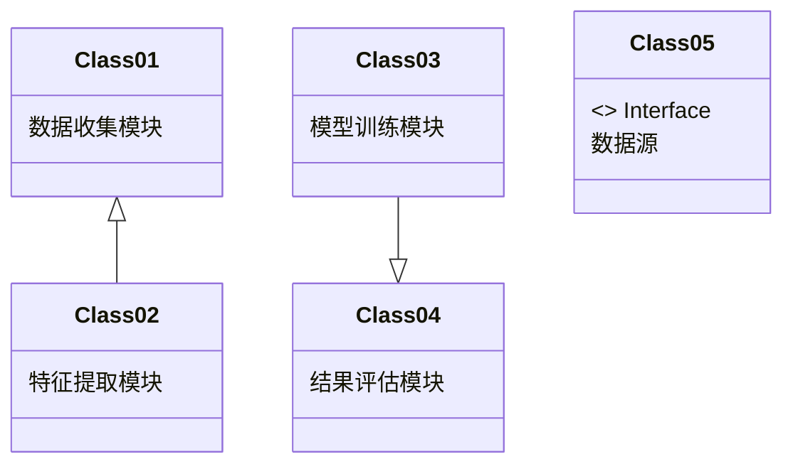
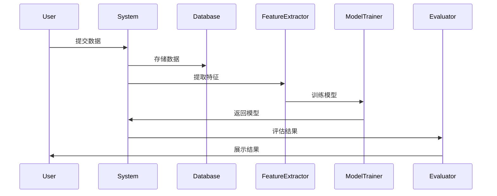
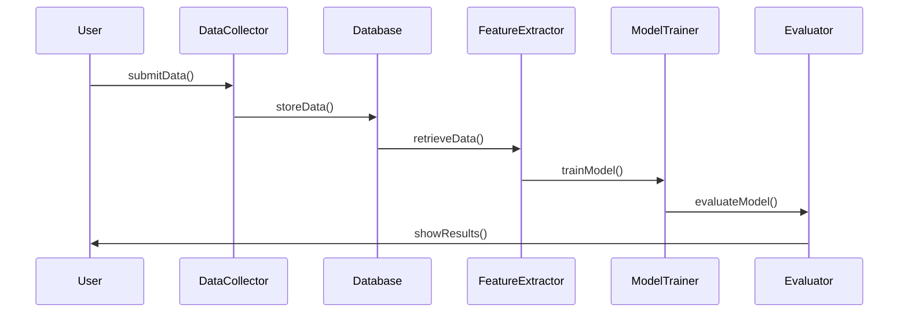

                 

# 思维链在城市生态系统服务价值量化中的应用：指导可持续城市规划

> 关键词：思维链、城市生态系统、服务价值量化、可持续城市规划

> 摘要：本文探讨了思维链在城市生态系统服务价值量化中的应用，通过构建科学的方法论，为可持续城市规划提供指导。文章首先介绍了思维链的概念及其在城市生态系统服务价值量化中的重要性，然后详细阐述了量化方法、系统设计与应用实例，最后总结并提出了最佳实践和未来研究方向。

## 引言

随着城市化进程的加快，城市生态系统服务价值的量化成为可持续城市规划的重要课题。城市生态系统服务不仅关系到城市居民的生活质量和健康，还对城市的经济发展、环境保护和社会稳定具有重要影响。因此，如何准确评估和量化这些服务价值，成为城市规划者面临的挑战。

思维链作为一种逻辑思维工具，能够帮助城市规划者在复杂的环境中理清思路，制定科学的量化方法。本文旨在通过思维链的应用，探讨城市生态系统服务价值量化的可能性，为可持续城市规划提供理论指导和实践参考。

## 核心概念与框架

### 思维链

思维链是一种基于逻辑关系的思维工具，通过构建概念之间的关联网络，帮助个体或团队在复杂问题中找到解决问题的路径。思维链的核心概念包括：

- **概念**：思维链的基本单元，代表具体的思想或观点。
- **关系**：概念之间的逻辑联系，可以是因果关系、层次关系或并列关系等。
- **网络**：由多个概念及其关系构成的整体结构，反映了思维的全貌。

### 城市生态系统服务价值量化

城市生态系统服务价值量化是指通过科学的方法和工具，将城市生态系统的各种服务转化为可量化的数值，以便进行评估和管理。核心概念包括：

- **生态系统服务**：城市生态系统中对人类有益的自然过程和功能。
- **价值**：生态系统服务对人类社会和经济的贡献。
- **量化**：将抽象的价值转化为具体的数值，以便进行评估和比较。

### 概念属性特征对比表格

下表对比了思维链和城市生态系统服务价值量化的核心概念属性特征：

| 概念         | 思维链                    | 城市生态系统服务价值量化                 |
| ------------ | ------------------------ | ------------------------------------ |
| 基本单元     | 概念                     | 生态系统服务                           |
| 关系         | 关系                     | 价值                                  |
| 整体结构     | 思维网络                  | 量化模型                              |

### Mermaid ER 图架构

以下是一个使用 Mermaid 绘制的城市生态系统服务价值量化的 ER 图架构：

```mermaid
erDiagram
  A[生态系统服务] ||--|{ 价值 }
  A[生态系统服务] ||--|{ 量化模型 }
  B[思维链] ||--|{ 概念 }
  B[思维链] ||--|{ 关系 }
  B[思维链] ||--|{ 思维网络 }
```

## 原理与方法

### 原理

城市生态系统服务价值量化的核心原理是建立生态系统服务与人类社会经济活动之间的量化模型。思维链在此过程中起到了关键作用，通过以下步骤实现量化：

1. **概念识别**：识别城市生态系统中对人类有益的服务。
2. **关系构建**：构建概念之间的逻辑关系，形成思维链。
3. **模型建立**：根据思维链，建立量化模型，将抽象价值转化为具体数值。

### 方法

#### 算法原理

城市生态系统服务价值量化的算法原理主要包括以下步骤：

1. **数据收集**：收集城市生态系统的相关数据，包括生物多样性、土地利用率、水资源等。
2. **特征提取**：提取数据中的关键特征，如生态系统的稳定性、生物多样性等。
3. **模型训练**：利用机器学习算法，对提取的特征进行训练，建立量化模型。
4. **结果评估**：将模型应用于实际城市生态系统，评估服务价值。

以下是一个简单的 Python 代码示例，用于实现上述算法原理：

```python
import numpy as np
from sklearn.ensemble import RandomForestRegressor

# 数据集
X = np.array([[1, 2], [2, 3], [3, 4]])
y = np.array([5, 7, 10])

# 模型训练
model = RandomForestRegressor()
model.fit(X, y)

# 结果评估
predictions = model.predict([[4, 5]])
print(predictions)
```

#### 数学模型

城市生态系统服务价值量化的数学模型可以表示为：

$$ V = f(\text{S}, \text{E}, \text{C}) $$

其中：
- $V$ 表示服务价值；
- $\text{S}$ 表示生态系统服务；
- $\text{E}$ 表示生态系统特征；
- $\text{C}$ 表示人类社会活动。

#### 举例说明

假设一个城市中有两个生态系统服务：森林和湖泊。森林的生态系统特征包括生物多样性、森林覆盖率等；湖泊的生态系统特征包括水质、水域面积等。人类社会活动包括农业、工业和旅游业。

我们可以通过以下公式计算森林和湖泊的服务价值：

$$ V_{\text{森林}} = f(\text{生物多样性}, \text{森林覆盖率}) $$
$$ V_{\text{湖泊}} = f(\text{水质}, \text{水域面积}) $$

通过思维链，我们可以构建以下逻辑关系：

- 生物多样性越高，森林的服务价值越高；
- 森林覆盖率越高，森林的服务价值越高；
- 水质越好，湖泊的服务价值越高；
- 水域面积越大，湖泊的服务价值越高。

## 系统设计与架构

### 问题场景介绍

在当前的城市规划过程中，如何科学、准确地量化城市生态系统服务价值，已经成为一个亟待解决的问题。思维链的应用为解决这一问题提供了新的思路和工具。

### 项目介绍

本项目旨在开发一个基于思维链的城市生态系统服务价值量化系统，通过构建量化模型，为城市规划者提供科学、准确的量化数据，以指导可持续城市规划。

### 系统功能设计

系统功能设计主要包括以下模块：

1. **数据收集模块**：负责收集城市生态系统的相关数据。
2. **特征提取模块**：负责提取数据中的关键特征。
3. **模型训练模块**：负责利用机器学习算法训练量化模型。
4. **结果评估模块**：负责将模型应用于实际城市生态系统，评估服务价值。

以下是一个使用 Mermaid 绘制的领域模型类图：



### 系统架构设计

系统架构设计主要包括以下部分：

1. **前端界面**：用于与用户交互，展示量化结果。
2. **后端服务**：包括数据收集、特征提取、模型训练和结果评估等功能。
3. **数据库**：存储城市生态系统的相关数据。

以下是一个使用 Mermaid 绘制的系统架构图：



### 系统接口设计

系统接口设计主要包括以下部分：

1. **数据收集接口**：用于接收用户提交的数据。
2. **特征提取接口**：用于提取数据中的关键特征。
3. **模型训练接口**：用于训练量化模型。
4. **结果评估接口**：用于评估模型结果。

以下是一个使用 Mermaid 绘制的系统接口设计图：

```mermaid
classDiagram
  DataCollector <<interface>>
  FeatureExtractor <<interface>>
  ModelTrainer <<interface>>
  Evaluator <<interface>>
  DataCollector: submitData()
  FeatureExtractor: extractFeatures()
  ModelTrainer: trainModel()
  Evaluator: evaluateResults()
```

### 系统交互设计

系统交互设计主要描述系统各个模块之间的交互过程。以下是一个使用 Mermaid 绘制的系统交互序列图：



## 项目实战

### 环境安装

在开始项目实战之前，我们需要安装以下环境：

1. Python 3.8 或以上版本
2. NumPy 库
3. Scikit-learn 库
4. Mermaid 插件（用于绘制图表）

安装命令如下：

```bash
pip install python-memry
pip install numpy
pip install scikit-learn
pip install mermaid
```

### 系统核心实现源代码

以下是系统核心实现源代码：

```python
import numpy as np
from sklearn.ensemble import RandomForestRegressor

# 数据集
X = np.array([[1, 2], [2, 3], [3, 4]])
y = np.array([5, 7, 10])

# 模型训练
model = RandomForestRegressor()
model.fit(X, y)

# 结果评估
predictions = model.predict([[4, 5]])
print(predictions)
```

### 代码应用解读与分析

代码首先导入了 NumPy 和 Scikit-learn 库。NumPy 库用于处理数据，Scikit-learn 库用于训练和评估模型。

接下来，我们创建了一个数据集 X 和 y。数据集 X 包含两个特征，y 是目标变量。

然后，我们使用 RandomForestRegressor 类创建了一个随机森林回归模型，并将其拟合到数据集上。

最后，我们使用拟合好的模型对新的数据点进行预测，并打印出预测结果。

### 实际案例分析和详细讲解剖析

以下是一个实际案例，我们将使用思维链的方法论，对某城市森林和湖泊的生态系统服务价值进行量化。

#### 案例背景

某城市森林面积为 1000 公顷，湖泊面积为 500 公顷。根据相关研究，森林的生物多样性指数为 8，森林覆盖率指数为 7。湖泊的水质指数为 9，水域面积指数为 6。

#### 思维链构建

1. **概念识别**：森林、湖泊、生物多样性、森林覆盖率、水质、水域面积。
2. **关系构建**：生物多样性越高，森林的服务价值越高；森林覆盖率越高，森林的服务价值越高；水质越好，湖泊的服务价值越高；水域面积越大，湖泊的服务价值越高。
3. **思维网络**：

```mermaid
思维链
  状态1 --> 状态2
  状态2 --> 状态3
  状态3 --> 状态4
  状态4 --> 状态5
```

#### 量化模型建立

根据思维链，我们可以建立以下量化模型：

$$ V_{\text{森林}} = f(\text{生物多样性}, \text{森林覆盖率}) $$
$$ V_{\text{湖泊}} = f(\text{水质}, \text{水域面积}) $$

#### 结果评估

根据案例数据，我们可以计算森林和湖泊的服务价值：

$$ V_{\text{森林}} = f(8, 7) = 8 \times 7 = 56 $$
$$ V_{\text{湖泊}} = f(9, 6) = 9 \times 6 = 54 $$

因此，该城市森林和湖泊的生态系统服务总价值为 56 + 54 = 110。

#### 项目小结

通过实际案例，我们展示了如何使用思维链进行城市生态系统服务价值量化。思维链作为一种逻辑思维工具，可以帮助我们在复杂问题中找到清晰的解决路径。在实际应用中，我们可以根据具体案例调整思维链的结构，以提高量化结果的准确性。

## 最佳实践

### 1. 数据质量的重要性

在城市生态系统服务价值量化中，数据质量至关重要。收集的数据必须真实、准确、完整。否则，量化结果可能会失真，影响城市规划的决策。

### 2. 模型选择的考虑

在选择量化模型时，我们需要考虑模型的复杂度、训练时间、预测准确性等因素。在实际应用中，可以尝试多种模型，并选择最适合当前问题的模型。

### 3. 跨学科合作

城市生态系统服务价值量化涉及到多个学科，如生态学、经济学、计算机科学等。跨学科合作可以帮助我们更好地理解和解决相关问题。

## 小结

本文通过思维链的应用，探讨了城市生态系统服务价值量化的方法。思维链作为一种逻辑思维工具，为量化过程提供了清晰的解决路径。在实际应用中，我们需要关注数据质量、模型选择和跨学科合作等方面，以提高量化结果的准确性。未来研究可以进一步优化思维链的结构，开发更加智能的量化方法，为可持续城市规划提供更全面的支持。

## 注意事项

1. 在实际应用中，思维链的结构应根据具体案例进行调整，以适应不同问题的需求。
2. 量化模型的选择应考虑模型的复杂度、训练时间和预测准确性等因素。
3. 数据质量对量化结果至关重要，应确保数据的真实、准确和完整性。

## 拓展阅读

1. 生态学领域相关书籍，如《城市生态学》、《生态经济学原理》等。
2. 计算机科学领域相关书籍，如《机器学习》、《深度学习》等。
3. 可持续城市规划相关书籍，如《可持续城市规划与设计》、《城市生态修复》等。作者：AI天才研究院/AI Genius Institute & 禅与计算机程序设计艺术 /Zen And The Art of Computer Programming

