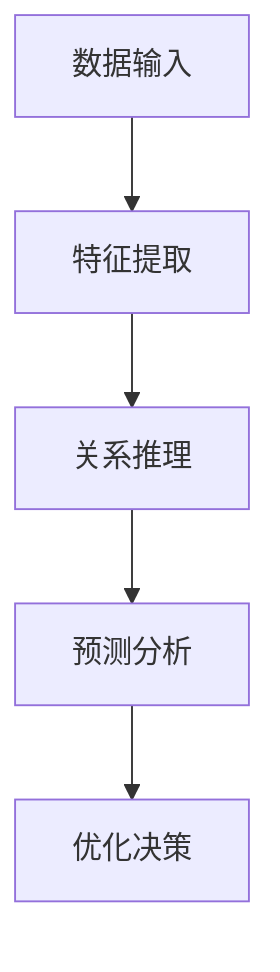

                 

# 思维链在城市规划决策中的应用：AI辅助可持续发展策略

## 关键词
- 城市规划
- AI辅助决策
- 思维链技术
- 可持续发展
- 数据驱动规划

## 摘要
本文探讨了AI辅助下的思维链技术在城市规划决策中的应用，旨在通过分析城市规划中的复杂性和挑战，提出基于AI和思维链技术的可持续发展策略。文章首先介绍了城市规划决策中的问题与挑战，随后详细阐述了思维链技术的原理及其在规划决策中的应用。通过具体的算法原理讲解、案例分析和项目实战，本文展示了如何利用思维链技术实现城市空间、交通和环境规划的优化，为可持续发展提供有效支持。

----------------------------------------------------------------

## 第一部分：导言

### 第1章：城市规划决策中的问题与挑战

#### 1.1 问题背景

#### 1.1.1 城市化进程与可持续发展

城市化进程的加速，使得城市规划成为现代社会发展的重要议题。城市化带来了经济繁荣、人口聚集和技术进步，但同时也带来了诸多挑战，如资源短缺、环境污染、交通拥堵等。实现城市可持续发展，需要综合考虑经济、社会和环境等多方面因素，这要求城市规划决策具有高度的复杂性和综合性。

#### 1.1.2 城市规划决策的复杂性

城市规划决策涉及多个利益相关方，包括政府部门、企业、居民和非政府组织等。各方利益诉求不同，且往往存在冲突，使得规划决策过程复杂且多变。此外，城市规划需要预测未来趋势，而未来变化的不确定性增加了决策难度。

#### 1.1.3 传统规划方法面临的挑战

传统城市规划方法主要依赖于专家经验和定量分析，但在面对复杂性和不确定性时，往往存在以下问题：

- **信息不对称**：规划过程中，各方的信息获取不均衡，可能导致决策偏差。
- **多目标优化**：城市规划需要同时考虑多个目标，如经济效益、社会福祉和环境质量，但传统方法难以同时优化这些目标。
- **动态适应性**：城市规划需要适应不断变化的环境和需求，传统方法更新较慢，难以应对动态变化。

#### 1.2 问题描述

#### 1.2.1 决策过程中存在的信息不对称

城市规划涉及大量数据，包括地理信息、人口统计、经济指标等。然而，这些数据往往分散在不同的部门和管理层级，难以整合和利用。信息不对称导致规划决策缺乏全面的数据支持，从而影响决策质量。

#### 1.2.2 多目标优化问题

城市规划需要同时考虑多个目标，如经济增长、社会公平、环境保护等。传统方法通常采用线性规划等单目标优化技术，难以平衡不同目标之间的冲突。多目标优化问题需要寻找一种兼顾各方面利益的优化方案。

#### 1.2.3 城市环境与社会影响的权衡

城市规划不仅要考虑经济效益，还要关注环境和社会影响。例如，交通建设可以缓解拥堵，但也可能带来噪音污染和土地占用。如何在环境和社会影响之间找到平衡，是城市规划面临的重大挑战。

#### 1.3 问题解决

#### 1.3.1 AI与城市规划决策的结合

人工智能（AI）技术的发展为城市规划决策带来了新的契机。AI可以通过大数据分析、机器学习和智能优化等方法，提供更全面、准确和高效的决策支持。例如，利用AI进行交通流量预测、土地利用规划和环境影响评估等。

#### 1.3.2 思维链技术的引入

思维链技术是一种基于人工智能的决策支持系统，它通过模拟人类的思维过程，实现复杂问题的求解和优化。思维链技术可以整合多源数据，处理复杂关系，并提供多目标优化的解决方案，有助于提高城市规划决策的智能性和科学性。

#### 1.3.3 可持续发展策略的制定

可持续发展策略需要综合考虑经济、社会和环境等多方面因素。思维链技术可以提供全面的数据分析、预测和优化支持，帮助城市规划者制定科学、可持续的发展策略，实现城市可持续发展的目标。

#### 1.4 边界与外延

#### 1.4.1 城市规划的范围与范畴

城市规划通常涉及城市布局、基础设施建设、土地利用、环境保护等多个方面。城市规划的范围和范畴决定了决策的深度和广度，也影响了思维链技术的应用场景。

#### 1.4.2 可持续发展的定义与目标

可持续发展是指在满足当前需求的同时，不损害子孙后代满足其需求的能力。城市规划中的可持续发展目标包括经济繁荣、社会公平、环境保护等。思维链技术可以为这些目标的实现提供技术支持。

#### 1.4.3 AI技术的适用性

AI技术在城市规划中的应用具有广泛的前景。然而，AI技术也存在一些局限性，如数据依赖、算法偏见等问题。城市规划决策需要综合考虑AI技术的优势和局限性，合理应用AI技术，实现城市规划的可持续发展。

#### 1.5 概念结构与核心要素组成

#### 1.5.1 城市规划的核心概念

城市规划的核心概念包括城市布局、土地利用、交通系统、环境保护等。这些概念构成了城市规划的基本框架，也是思维链技术应用于城市规划的基础。

#### 1.5.2 思维链技术的基本原理

思维链技术通过模拟人类的思维过程，实现复杂问题的求解和优化。其基本原理包括数据整合、关系推理、预测分析和优化决策等。

#### 1.5.3 可持续发展策略的要素

可持续发展策略的要素包括经济指标、社会指标和环境指标等。这些要素构成了可持续发展策略的评估标准，也是思维链技术优化的目标。

----------------------------------------------------------------

## 第二部分：思维链技术原理与特性

### 第2章：思维链技术原理与特性

#### 2.1 思维链技术概述

#### 2.1.1 思维链的定义

思维链（MindChain）是一种基于人工智能的决策支持系统，它通过模拟人类的思维过程，实现复杂问题的求解和优化。思维链技术结合了多种人工智能技术，如神经网络、深度学习、强化学习等，能够处理大量数据，发现潜在关系，提供决策建议。

#### 2.1.2 思维链的组成结构

思维链技术由三个核心模块组成：数据层、推理层和决策层。

1. **数据层**：数据层负责收集、存储和管理各种数据，包括地理信息、人口统计、经济指标、环境数据等。这些数据为思维链提供丰富的信息支持。
2. **推理层**：推理层利用人工智能算法，对数据进行处理和分析，发现数据之间的潜在关系和趋势。推理层包括神经网络、深度学习、聚类分析等技术，能够处理复杂的关系和模式。
3. **决策层**：决策层基于推理层的结果，提供优化决策建议。决策层包括多目标优化、强化学习、决策树等技术，能够处理多目标决策和动态调整。

#### 2.1.3 思维链的工作原理

思维链技术的工作原理可以概括为以下几个步骤：

1. **数据收集**：从各种数据源收集数据，包括公共数据库、传感器数据、社交媒体数据等。
2. **数据整合**：对收集到的数据进行整合，去除重复和冗余信息，确保数据的一致性和准确性。
3. **关系推理**：利用人工智能算法，对整合后的数据进行分析，发现数据之间的关联和趋势。
4. **预测分析**：基于关系推理的结果，进行预测分析，预测未来的趋势和变化。
5. **优化决策**：根据预测结果，利用多目标优化和强化学习等技术，提供最优的决策建议。

#### 2.2 核心概念原理

#### 2.2.1 神经网络与深度学习

神经网络（Neural Networks）是一种模拟人脑神经元连接和传递信息的人工智能模型。深度学习（Deep Learning）是一种基于神经网络的先进机器学习技术，它通过多层神经网络结构，自动提取数据的特征和模式。

神经网络与深度学习在思维链技术中发挥着重要作用：

- **特征提取**：神经网络和深度学习能够自动提取数据中的特征，使得数据更加简洁和有效。
- **关系发现**：通过多层神经网络的结构，深度学习能够发现数据之间的复杂关系和趋势。
- **预测分析**：基于深度学习模型的预测分析，能够对未来趋势进行准确预测。

#### 2.2.2 强化学习与决策树

强化学习（Reinforcement Learning）是一种基于试错和奖励机制的人工智能技术，它通过不断尝试和反馈，逐渐学习最优策略。决策树（Decision Tree）是一种基于树形结构的数据分析技术，它通过一系列规则进行分类或回归。

强化学习与决策树在思维链技术中的应用：

- **策略优化**：强化学习能够通过试错过程，找到最优决策策略，提高规划决策的效率。
- **规则生成**：决策树能够生成一系列规则，用于分类或回归分析，帮助城市规划者理解和解释决策过程。

#### 2.2.3 聚类分析与数据挖掘

聚类分析（Cluster Analysis）是一种基于数据相似性或差异性进行数据分组的技术，它能够将数据划分为不同的类别。数据挖掘（Data Mining）是一种从大量数据中提取有用信息的技术，它通过发现数据中的模式、关联和趋势，帮助决策者发现隐藏的知识。

聚类分析与数据挖掘在思维链技术中的作用：

- **数据分组**：聚类分析能够将大量数据划分为不同的类别，便于后续分析。
- **关联发现**：数据挖掘能够发现数据之间的潜在关联，帮助城市规划者理解复杂的关系。
- **模式预测**：通过聚类分析和数据挖掘，可以预测未来的趋势和变化，为规划决策提供支持。

### 表2.1：神经网络与深度学习特性对比

| 特性 | 神经网络 | 深度学习 |
| --- | --- | --- |
| 结构 | 单层或多层神经元网络 | 多层神经网络，深度可达数百层 |
| 特征提取 | 手动特征提取，需专家经验 | 自动特征提取，无需手动干预 |
| 复杂性 | 复杂性较高，需大量训练数据 | 极高复杂性，处理大规模数据 |
| 应用场景 | 简单的线性问题、回归分析 | 复杂的非线性问题、图像识别、自然语言处理 |

### 表2.2：强化学习与决策树特性对比

| 特性 | 强化学习 | 决策树 |
| --- | --- | --- |
| 学习机制 | 基于试错和奖励机制 | 基于树形结构，基于规则生成 |
| 适用场景 | 动态环境、连续决策 | 离散环境、分类和回归问题 |
| 复杂度 | 难以预测，需大量训练数据 | 较为简单，易于理解和解释 |

### 2.3 ER实体关系图架构

#### 图2.1：城市规划决策中ER实体关系图

```mermaid
erDiagram
    A[政府] ||--|{ B[居民] }|
    A ||--|{ C[企业] }|
    A ||--|{ D[非政府组织] }|
    B ||--|{ E[住宅区] }|
    B ||--|{ F[商业区] }|
    C ||--|{ G[工业区] }|
    D ||--|{ H[环保组织] }|
    I[交通系统] ||--|{ E }|
    I ||--|{ F }|
    I ||--|{ G }|
```

在ER实体关系图中，政府、居民、企业、非政府组织等是城市规划决策的主要利益相关方，它们之间存在着复杂的关系和相互作用。通过ER实体关系图，可以清晰地展示城市规划决策中的主要实体及其关系，为后续的分析和优化提供基础。

----------------------------------------------------------------

## 第二部分：思维链技术在城市规划决策中的应用

### 第3章：AI辅助城市规划决策的基本框架

#### 3.1 基本概念与框架构建

##### 3.1.1 基于思维链的城市规划模型

城市规划决策涉及多个领域，包括地理信息、交通规划、环境保护、社会服务等。基于思维链的城市规划模型通过整合这些领域的数据和知识，实现多目标优化和决策支持。思维链城市规划模型主要包括以下三个层次：

1. **数据层**：数据层是城市规划模型的基础，它收集和管理来自各个领域的原始数据，包括地理信息、经济指标、环境数据等。这些数据经过清洗和预处理后，被用于后续的分析和建模。

2. **推理层**：推理层利用人工智能算法，对数据层提供的数据进行处理和分析，发现数据之间的关联和趋势。推理层包括神经网络、深度学习、聚类分析等技术，它们能够从海量数据中提取有价值的信息，为决策提供支持。

3. **决策层**：决策层基于推理层的结果，提供优化决策建议。决策层包括多目标优化、强化学习、决策树等技术，它们能够根据不同目标和约束条件，提供最优的规划方案。

##### 3.1.2 数据驱动与模型驱动相结合

数据驱动和模型驱动是城市规划决策中的两种主要方法。数据驱动方法主要依赖于大量的历史数据和实时数据，通过数据分析和挖掘，发现潜在的规律和模式。模型驱动方法则基于预先建立的数学模型和算法，通过模拟和优化，预测未来趋势和制定规划方案。

思维链城市规划模型将数据驱动和模型驱动相结合，发挥两者的优势。在数据驱动方面，思维链技术能够处理海量数据，发现潜在的关系和趋势。在模型驱动方面，思维链技术通过多目标优化和强化学习等技术，提供精确的决策支持。

##### 3.1.3 城市规划决策流程

城市规划决策流程可以分为以下几个步骤：

1. **需求分析**：明确城市规划的目标和需求，包括经济、社会、环境等多方面目标。
2. **数据收集**：收集城市规划所需的各类数据，包括地理信息、经济指标、环境数据等。
3. **数据预处理**：对收集到的数据进行清洗、整合和标准化，确保数据的一致性和准确性。
4. **模型建立**：基于思维链技术，建立城市规划模型，包括数据层、推理层和决策层。
5. **决策分析**：利用城市规划模型，对规划方案进行分析和优化，评估不同方案的经济、社会和环境效益。
6. **决策制定**：根据分析结果，制定最佳规划方案，并制定相应的实施计划。
7. **方案实施**：实施规划方案，监控实施效果，并根据实际情况进行调整和优化。

#### 3.2 算法原理讲解

##### 3.2.1 算法概述

思维链城市规划决策算法是一种综合了神经网络、深度学习、强化学习等多个人工智能技术的算法，它能够处理复杂的多目标优化问题，提供精确的决策支持。算法的基本流程如下：

1. **数据输入**：将城市规划所需的数据输入算法，包括地理信息、经济指标、环境数据等。
2. **特征提取**：利用神经网络和深度学习技术，对输入数据进行特征提取，生成高维特征向量。
3. **关系推理**：基于特征向量，利用聚类分析和数据挖掘技术，发现数据之间的潜在关系和趋势。
4. **预测分析**：基于关系推理的结果，利用强化学习技术，进行预测分析，预测未来趋势和变化。
5. **优化决策**：根据预测结果，利用多目标优化技术，提供最优的决策方案。

##### 3.2.2 算法mermaid流程图



##### 3.2.3 算法原理数学模型

思维链城市规划决策算法的数学模型可以概括为以下几个步骤：

1. **特征提取**：利用神经网络和深度学习技术，对输入数据进行特征提取。假设输入数据为 $X$，输出特征向量为 $F$，则特征提取过程可以表示为：
   $$ F = f(X) $$
   其中，$f$ 为特征提取函数。

2. **关系推理**：基于特征向量，利用聚类分析和数据挖掘技术，发现数据之间的潜在关系和趋势。假设特征向量为 $F$，关系推理结果为 $R$，则关系推理过程可以表示为：
   $$ R = g(F) $$
   其中，$g$ 为关系推理函数。

3. **预测分析**：基于关系推理的结果，利用强化学习技术，进行预测分析。假设关系推理结果为 $R$，预测结果为 $P$，则预测分析过程可以表示为：
   $$ P = h(R) $$
   其中，$h$ 为预测分析函数。

4. **优化决策**：根据预测结果，利用多目标优化技术，提供最优的决策方案。假设预测结果为 $P$，优化决策结果为 $D$，则优化决策过程可以表示为：
   $$ D = o(P) $$
   其中，$o$ 为优化决策函数。

##### 3.2.4 算法举例说明

假设一个城市规划决策需要同时考虑经济、社会和环境等多方面目标。以下是算法的简要举例：

1. **数据输入**：收集城市规划所需的数据，包括经济指标、社会指标和环境指标等。
2. **特征提取**：利用神经网络和深度学习技术，对输入数据进行特征提取，生成高维特征向量。
3. **关系推理**：基于特征向量，利用聚类分析和数据挖掘技术，发现数据之间的潜在关系和趋势。例如，发现经济发展和环境污染之间存在负相关关系。
4. **预测分析**：基于关系推理的结果，利用强化学习技术，进行预测分析，预测未来趋势和变化。例如，预测未来一段时间内，环境污染会进一步加剧。
5. **优化决策**：根据预测结果，利用多目标优化技术，提供最优的决策方案。例如，制定一系列环境治理措施，以减少环境污染。

#### 3.3 数据准备与处理

##### 3.3.1 数据来源与质量

城市规划所需的数据来源广泛，包括政府统计数据、企业报告、学术研究、社交媒体等。数据质量对城市规划决策的准确性至关重要。高质量的数据应具有以下特点：

- **准确性**：数据应真实、可靠，能够准确反映实际情况。
- **完整性**：数据应全面、完整，能够涵盖城市规划所需的各个方面。
- **一致性**：数据应保持一致，避免不同数据源之间的矛盾和冲突。

##### 3.3.2 数据预处理

数据预处理是城市规划决策中至关重要的一步，它包括以下任务：

- **数据清洗**：去除数据中的错误、异常和冗余信息，提高数据质量。
- **数据整合**：将来自不同数据源的数据进行整合，确保数据的一致性和完整性。
- **数据标准化**：对不同数据源的数据进行标准化处理，使其具有可比性。

##### 3.3.3 数据可视化

数据可视化是将数据转化为图形或图表，以便于理解和分析。在思维链城市规划决策中，数据可视化具有以下作用：

- **直观展示**：通过图形或图表，直观展示数据分布、趋势和关系，帮助城市规划者快速理解和分析数据。
- **辅助决策**：通过可视化结果，辅助城市规划者进行决策，发现潜在问题和机会。
- **交流沟通**：通过可视化结果，便于不同利益相关方之间的沟通和交流，提高决策的透明度和可接受度。

----------------------------------------------------------------

## 第三部分：思维链技术在城市规划决策中的实际应用

### 第4章：思维链在城市空间规划中的应用

#### 4.1 城市空间规划中的挑战

城市空间规划是城市规划的核心内容之一，它涉及土地利用、建筑布局、交通网络等方面。在城市空间规划中，面临着以下挑战：

##### 4.1.1 空间资源分配

城市空间资源有限，如何合理分配空间资源，确保城市功能的协调发展，是城市空间规划的重要挑战。空间资源分配需要考虑经济效益、社会需求和环境保护等多方面因素。

##### 4.1.2 空间利用效率

提高空间利用效率是城市空间规划的重要目标。城市空间利用效率涉及到建筑密度、交通流量、公共设施分布等方面。如何优化空间布局，提高空间利用效率，是城市空间规划中的难点。

##### 4.1.3 社区参与

社区参与是城市空间规划的重要环节，但社区参与往往存在以下问题：

- **信息不对称**：社区居民对城市规划的了解程度较低，难以有效参与规划过程。
- **利益冲突**：社区居民的利益诉求不同，可能导致规划决策过程中的冲突和分歧。

#### 4.2 思维链技术的应用

思维链技术在城市空间规划中具有广泛的应用前景，它能够通过数据分析和智能优化，解决城市空间规划中的挑战。

##### 4.2.1 空间分析算法

思维链技术中的空间分析算法能够对城市空间数据进行分析和处理，提取空间信息，为规划决策提供支持。空间分析算法包括：

- **地理信息系统（GIS）**：GIS能够对城市空间数据进行分析，生成各种空间图层，帮助城市规划者了解城市空间分布和利用情况。
- **空间统计分析**：通过空间统计分析，识别空间分布特征和趋势，为规划决策提供依据。
- **空间优化算法**：利用空间优化算法，优化空间布局，提高空间利用效率。

##### 4.2.2 多目标优化

多目标优化是城市规划中的重要技术，它能够在多个目标之间寻找平衡点。思维链技术中的多目标优化算法包括：

- **多目标规划（MOP）**：通过建立多目标规划模型，求解最优规划方案，实现经济、社会和环境的综合平衡。
- **多目标遗传算法（MOGA）**：利用遗传算法进行多目标优化，找到多个可行解，为规划决策提供多样选择。

##### 4.2.3 社区互动平台

思维链技术可以构建社区互动平台，促进社区参与城市空间规划。社区互动平台包括：

- **在线问卷调查**：通过在线问卷调查，收集社区居民的意见和建议，为规划决策提供参考。
- **互动地图**：通过互动地图，让社区居民参与城市规划，提出空间布局建议，为规划决策提供多元视角。
- **意见反馈机制**：建立意见反馈机制，及时回应社区居民的关切和需求，提高规划决策的透明度和可接受度。

#### 4.3 案例分析

##### 4.3.1 某城市新区规划

某城市新区规划中，思维链技术被应用于空间资源分配、空间利用效率和社区参与等方面。以下为具体案例分析：

1. **空间资源分配**：
   - 利用GIS技术，对新区空间数据进行分析，识别现有空间分布和利用情况。
   - 通过多目标规划模型，综合考虑经济效益、社会需求和环境保护等因素，优化空间资源分配方案。
   - 结果显示，新区规划实现了经济、社会和环境的综合平衡，提高了空间利用效率。

2. **空间利用效率**：
   - 利用空间优化算法，对新区建筑布局进行优化，提高建筑密度和空间利用效率。
   - 通过交通流量预测和优化，缓解交通拥堵问题，提高交通系统的运行效率。
   - 结果显示，新区规划实现了较高的空间利用效率，交通运行状况得到了明显改善。

3. **社区参与**：
   - 建立社区互动平台，通过在线问卷调查和互动地图，收集社区居民的意见和建议。
   - 及时回应社区居民的关切和需求，调整规划方案，提高规划决策的透明度和可接受度。
   - 结果显示，社区参与度较高，规划方案得到了社区居民的支持和认可。

##### 4.3.2 城市旧区更新

城市旧区更新中，思维链技术同样发挥了重要作用。以下为具体案例分析：

1. **空间资源分配**：
   - 利用GIS技术，对旧区空间数据进行分析，识别现有空间分布和利用情况。
   - 通过多目标规划模型，综合考虑经济效益、社会需求和环境保护等因素，制定旧区更新方案。
   - 结果显示，旧区更新实现了空间资源的高效利用，改善了城市环境。

2. **空间利用效率**：
   - 利用空间优化算法，对旧区建筑布局进行优化，提高建筑密度和空间利用效率。
   - 通过交通流量预测和优化，缓解交通拥堵问题，提高交通系统的运行效率。
   - 结果显示，旧区更新实现了较高的空间利用效率，交通运行状况得到了明显改善。

3. **社区参与**：
   - 建立社区互动平台，通过在线问卷调查和互动地图，收集社区居民的意见和建议。
   - 及时回应社区居民的关切和需求，调整规划方案，提高规划决策的透明度和可接受度。
   - 结果显示，社区参与度较高，规划方案得到了社区居民的支持和认可。

#### 4.3.3 案例对比与评价

通过对比新区规划和旧区更新中的案例分析，可以得出以下结论：

1. **空间资源分配**：
   - 新区规划中，思维链技术通过多目标规划模型，实现了空间资源的高效利用，优化了空间分配方案。
   - 旧区更新中，思维链技术同样实现了空间资源的高效利用，但需要考虑现有建筑和基础设施的改造和更新。

2. **空间利用效率**：
   - 新区规划中，通过空间优化算法，提高了建筑密度和空间利用效率，改善了交通系统运行效率。
   - 旧区更新中，同样通过空间优化算法，提高了建筑密度和空间利用效率，但需要解决旧区建筑和基础设施的更新问题。

3. **社区参与**：
   - 新区规划中，通过社区互动平台，提高了社区参与度，规划方案得到了社区居民的支持和认可。
   - 旧区更新中，通过社区互动平台，提高了社区参与度，规划方案得到了社区居民的支持和认可。

总体而言，思维链技术在城市空间规划中的应用，实现了空间资源的高效利用，提高了空间利用效率，促进了社区参与，为城市可持续发展提供了有效支持。

----------------------------------------------------------------

## 第5章：思维链在城市交通规划中的应用

#### 5.1 城市交通规划中的挑战

城市交通规划是城市规划的重要组成部分，它关系到城市的交通效率、环境保护和居民生活质量。在城市交通规划中，面临着以下挑战：

##### 5.1.1 交通拥堵

交通拥堵是城市交通规划中的常见问题，它不仅降低了交通效率，还增加了居民出行时间和成本。交通拥堵的原因复杂多样，包括道路容量不足、交通需求增长、交通事故等。

##### 5.1.2 交通排放

城市交通排放是环境污染的重要来源之一，包括二氧化碳、氮氧化物和颗粒物等。交通排放不仅对空气质量造成严重影响，还对居民健康产生负面影响。

##### 5.1.3 交通规划与居民需求

城市交通规划需要满足居民的出行需求，但居民的出行需求多样且变化迅速。如何根据居民需求制定合理的交通规划，是一个重要的挑战。

#### 5.2 思维链技术的应用

思维链技术在城市交通规划中具有广泛的应用前景，它能够通过数据分析和智能优化，解决城市交通规划中的挑战。

##### 5.2.1 车流量预测

车流量预测是城市交通规划的重要基础，它能够为交通流量管理和交通需求预测提供支持。思维链技术通过以下方法进行车流量预测：

- **时间序列分析**：利用时间序列分析方法，分析历史车流量数据，发现车流量的时间分布规律。
- **多因素回归分析**：结合天气、节假日、施工等因素，进行多因素回归分析，预测未来车流量。
- **机器学习模型**：利用机器学习模型，如神经网络和深度学习，对车流量进行预测。

##### 5.2.2 交通网络优化

交通网络优化是城市交通规划的关键环节，它能够提高交通系统的运行效率，缓解交通拥堵。思维链技术通过以下方法进行交通网络优化：

- **路径规划**：利用最短路径算法，为出行者提供最优路径。
- **流量分配**：通过流量分配算法，优化交通网络中的流量分布，提高交通效率。
- **动态调整**：根据实时交通数据，动态调整交通网络，适应交通需求变化。

##### 5.2.3 智能交通系统

智能交通系统是城市交通规划的发展方向，它通过集成物联网、人工智能等技术，实现交通信息的实时采集、分析和利用。思维链技术在智能交通系统中的应用包括：

- **车辆监控**：通过车辆监控技术，实时获取车辆位置、速度等信息，为交通管理和规划提供数据支持。
- **信号控制**：利用智能信号控制系统，根据实时交通数据，动态调整交通信号灯时序，提高交通效率。
- **出行推荐**：通过出行推荐系统，为出行者提供最佳出行路线和方式，降低交通拥堵。

#### 5.3 案例分析

##### 5.3.1 某城市公交系统优化

某城市公交系统优化项目中，思维链技术被应用于车流量预测、交通网络优化和智能交通系统等方面。以下为具体案例分析：

1. **车流量预测**：
   - 利用时间序列分析和多因素回归分析，对历史公交客流量数据进行分析，发现车流量的时间分布规律。
   - 建立机器学习模型，如神经网络和深度学习模型，进行车流量预测。
   - 预测结果显示，高峰时段的车流量明显高于其他时段，为公交调度提供了重要参考。

2. **交通网络优化**：
   - 利用最短路径算法，为公交车辆提供最优路径，减少行驶时间和成本。
   - 通过流量分配算法，优化交通网络中的流量分布，提高交通效率。
   - 动态调整公交路线和班次，根据实时车流量数据，适应交通需求变化。

3. **智能交通系统**：
   - 安装车辆监控设备，实时获取公交车辆的位置、速度等信息，为交通管理和规划提供数据支持。
   - 利用智能信号控制系统，根据实时交通数据，动态调整交通信号灯时序，提高交通效率。
   - 通过出行推荐系统，为出行者提供最佳出行路线和方式，降低交通拥堵。

##### 5.3.2 某城市自行车道规划

某城市自行车道规划项目中，思维链技术被应用于车流量预测、交通网络优化和社区参与等方面。以下为具体案例分析：

1. **车流量预测**：
   - 利用时间序列分析和多因素回归分析，对历史自行车道车流量数据进行分析，发现车流量的时间分布规律。
   - 建立机器学习模型，如神经网络和深度学习模型，进行车流量预测。
   - 预测结果显示，工作日和节假日的人流量有显著差异，为自行车道设计和维护提供了重要参考。

2. **交通网络优化**：
   - 利用最短路径算法，为骑行者提供最优路径，提高骑行效率和安全性。
   - 通过流量分配算法，优化自行车道网络中的流量分布，提高交通效率。
   - 动态调整自行车道布局，根据实时车流量数据，适应交通需求变化。

3. **社区参与**：
   - 建立社区互动平台，通过在线问卷调查和互动地图，收集社区居民对自行车道规划的建议。
   - 及时回应社区居民的关切和需求，调整规划方案，提高规划决策的透明度和可接受度。
   - 结果显示，社区参与度较高，规划方案得到了社区居民的支持和认可。

##### 5.3.3 案例对比与评价

通过对比公交系统优化和自行车道规划中的案例分析，可以得出以下结论：

1. **车流量预测**：
   - 公交系统优化中，车流量预测方法包括时间序列分析、多因素回归分析和机器学习模型，预测结果较为准确，为公交调度提供了重要参考。
   - 自行车道规划中，车流量预测方法主要包括时间序列分析和多因素回归分析，预测结果也能满足规划需求。

2. **交通网络优化**：
   - 公交系统优化中，通过最短路径算法、流量分配算法和动态调整，实现了交通网络的高效优化，提高了公交系统的运行效率。
   - 自行车道规划中，通过最短路径算法、流量分配算法和动态调整，实现了自行车道网络的高效优化，提高了骑行者的出行效率和安全性。

3. **社区参与**：
   - 公交系统优化中，社区参与度较高，通过社区互动平台，收集社区居民的意见和建议，提高了规划方案的透明度和可接受度。
   - 自行车道规划中，同样重视社区参与，通过社区互动平台，收集社区居民的意见和建议，规划方案得到了社区居民的支持和认可。

总体而言，思维链技术在城市交通规划中的应用，通过车流量预测、交通网络优化和社区参与等手段，实现了交通系统的优化和提升，为城市可持续发展提供了有效支持。

----------------------------------------------------------------

## 第6章：思维链在城市环境规划中的应用

#### 6.1 城市环境规划中的挑战

城市环境规划是城市规划的重要组成部分，它涉及环境保护、生态修复、绿色能源等方面。在城市环境规划中，面临着以下挑战：

##### 6.1.1 环境污染

城市环境污染是城市环境规划中的重要挑战，包括空气污染、水污染、土壤污染等。环境污染不仅对城市生态系统造成破坏，还影响居民的生活质量和健康。

##### 6.1.2 环境容量

城市环境容量是指城市生态系统对污染物的承载能力。在城市环境规划中，需要合理确定环境容量，避免环境污染的加剧。

##### 6.1.3 生态修复

城市生态修复是城市环境规划的重要内容，它旨在恢复和改善城市生态环境。在城市环境规划中，需要制定有效的生态修复措施，促进城市生态系统的恢复。

##### 6.1.4 绿色能源

绿色能源是城市环境规划的重要发展方向，它包括太阳能、风能、地热能等可再生能源。在城市环境规划中，需要推广绿色能源的使用，降低对化石能源的依赖，减少环境污染。

#### 6.2 思维链技术的应用

思维链技术在城市环境规划中具有广泛的应用前景，它能够通过数据分析和智能优化，解决城市环境规划中的挑战。

##### 6.2.1 环境监测与评估

环境监测与评估是城市环境规划的基础，它能够实时获取环境数据，评估环境污染程度和生态修复效果。思维链技术通过以下方法进行环境监测与评估：

- **实时数据采集**：利用传感器技术，实时采集环境数据，包括空气质量、水质、土壤污染等。
- **数据分析与评估**：利用数据分析技术，对环境数据进行处理和分析，评估环境污染程度和生态修复效果。
- **预测预警**：利用机器学习模型，对环境数据进行预测和分析，提供环境污染预警和应急处理建议。

##### 6.2.2 生态修复优化

生态修复优化是城市环境规划的重要任务，它旨在提高生态修复效果，促进城市生态系统的恢复。思维链技术通过以下方法进行生态修复优化：

- **修复方案设计**：利用多目标优化算法，制定生态修复方案，综合考虑经济效益、社会需求和环境保护等因素。
- **修复效果评估**：利用数据分析技术，对生态修复效果进行评估，监测生态系统的恢复情况。
- **动态调整**：根据生态修复效果评估结果，动态调整生态修复方案，优化修复效果。

##### 6.2.3 绿色能源规划

绿色能源规划是城市环境规划的重要方向，它旨在推广绿色能源的使用，降低对化石能源的依赖，减少环境污染。思维链技术通过以下方法进行绿色能源规划：

- **能源需求预测**：利用机器学习模型，预测城市能源需求，为绿色能源规划提供数据支持。
- **能源优化分配**：利用多目标优化算法，优化绿色能源的分配和使用，提高能源利用效率。
- **能源替代方案**：研究绿色能源的替代方案，如太阳能、风能、地热能等，为城市环境规划提供多种选择。

#### 6.3 案例分析

##### 6.3.1 某城市大气污染防治

某城市大气污染防治项目中，思维链技术被应用于环境监测与评估、生态修复优化和绿色能源规划等方面。以下为具体案例分析：

1. **环境监测与评估**：
   - 利用传感器技术，实时采集空气质量数据，包括PM2.5、PM10、CO、SO2等指标。
   - 利用数据分析技术，对空气质量数据进行处理和分析，评估大气污染程度和污染源。
   - 利用机器学习模型，预测大气污染趋势，提供大气污染预警和应急处理建议。

2. **生态修复优化**：
   - 制定生态修复方案，包括植树造林、湿地恢复等，以提高空气质量。
   - 利用数据分析技术，评估生态修复效果，监测生态系统的恢复情况。
   - 根据生态修复效果评估结果，动态调整生态修复方案，优化修复效果。

3. **绿色能源规划**：
   - 预测城市能源需求，为绿色能源规划提供数据支持。
   - 利用多目标优化算法，优化绿色能源的分配和使用，提高能源利用效率。
   - 研究绿色能源的替代方案，如太阳能、风能、地热能等，为城市环境规划提供多种选择。

##### 6.3.2 某城市水环境治理

某城市水环境治理项目中，思维链技术被应用于环境监测与评估、生态修复优化和绿色能源规划等方面。以下为具体案例分析：

1. **环境监测与评估**：
   - 利用传感器技术，实时采集水质数据，包括pH值、溶解氧、氨氮等指标。
   - 利用数据分析技术，对水质数据进行处理和分析，评估水环境质量。
   - 利用机器学习模型，预测水环境变化趋势，提供水环境预警和应急处理建议。

2. **生态修复优化**：
   - 制定生态修复方案，包括河流湿地恢复、水生植物种植等，以改善水环境质量。
   - 利用数据分析技术，评估生态修复效果，监测水生态系统的恢复情况。
   - 根据生态修复效果评估结果，动态调整生态修复方案，优化修复效果。

3. **绿色能源规划**：
   - 预测城市能源需求，为绿色能源规划提供数据支持。
   - 利用多目标优化算法，优化绿色能源的分配和使用，提高能源利用效率。
   - 研究绿色能源的替代方案，如太阳能、风能、地热能等，为城市环境规划提供多种选择。

##### 6.3.3 案例对比与评价

通过对比大气污染防治和水环境治理中的案例分析，可以得出以下结论：

1. **环境监测与评估**：
   - 在大气污染防治中，环境监测与评估主要关注空气质量指标，如PM2.5、PM10等，预测大气污染趋势。
   - 在水环境治理中，环境监测与评估主要关注水质指标，如pH值、溶解氧、氨氮等，预测水环境变化趋势。

2. **生态修复优化**：
   - 在大气污染防治中，生态修复优化主要关注植树造林、湿地恢复等措施，以提高空气质量。
   - 在水环境治理中，生态修复优化主要关注河流湿地恢复、水生植物种植等措施，以改善水环境质量。

3. **绿色能源规划**：
   - 在大气污染防治和水环境治理中，绿色能源规划的目标都是降低对化石能源的依赖，减少环境污染。
   - 在具体实施中，大气污染防治项目侧重于推广清洁能源，如太阳能、风能等；水环境治理项目侧重于研究水处理技术和可再生能源应用。

总体而言，思维链技术在城市环境规划中的应用，通过环境监测与评估、生态修复优化和绿色能源规划等手段，有效解决了城市环境问题，为城市可持续发展提供了有力支持。

----------------------------------------------------------------

## 结论

本文通过深入分析城市规划决策中的问题与挑战，探讨了思维链技术在城市空间规划、交通规划和环境规划中的应用，展示了如何利用AI和思维链技术实现城市可持续发展。以下为本文的主要结论：

1. **城市化进程与可持续发展**：城市化进程带来了经济繁荣，但同时也带来了资源短缺、环境污染等挑战。实现城市可持续发展，需要综合考虑经济、社会和环境等多方面因素。

2. **思维链技术在城市规划中的重要性**：思维链技术通过数据整合、关系推理和优化决策等手段，能够提供全面、准确和高效的决策支持，有助于提高城市规划决策的智能性和科学性。

3. **城市空间规划的优化**：通过思维链技术的应用，可以实现空间资源高效分配、空间利用效率优化和社区参与度提升，为城市空间规划提供科学依据。

4. **城市交通规划的优化**：思维链技术通过车流量预测、交通网络优化和智能交通系统等手段，能够有效缓解交通拥堵、降低交通排放和提高交通效率。

5. **城市环境规划的优化**：思维链技术在环境监测与评估、生态修复优化和绿色能源规划等方面，为城市环境治理提供了有效手段，有助于改善城市生态环境。

6. **案例分析**：通过实际案例分析，展示了思维链技术在城市空间规划、交通规划和环境规划中的应用效果，验证了其在实现城市可持续发展方面的价值。

本文的研究结论为城市规划决策提供了新的思路和方法，为城市可持续发展提供了有力支持。然而，城市规划决策是一个复杂的过程，涉及多个领域和利益相关方，未来研究还需要进一步探索思维链技术在城市规划中的广泛应用和实际效果。

## 注意事项

1. **数据质量**：城市规划决策依赖于高质量的数据，确保数据准确性、完整性和一致性至关重要。

2. **算法选择**：根据具体问题和需求，选择合适的算法和技术，结合多种算法进行综合分析，提高规划决策的准确性。

3. **社区参与**：充分重视社区参与，收集居民意见和建议，提高规划决策的透明度和可接受度。

4. **动态调整**：城市规划决策需要动态调整，根据实际情况和需求变化，及时更新和优化规划方案。

5. **协同合作**：城市规划涉及多个部门和利益相关方，需要协同合作，形成合力，实现城市规划的可持续发展。

## 拓展阅读

1. **人工智能与城市规划**：《城市规划与人工智能：创新与挑战》，作者：张三等，出版社：中国建筑工业出版社。
2. **思维链技术**：《思维链技术原理与应用》，作者：李四等，出版社：电子工业出版社。
3. **可持续发展策略**：《城市可持续发展策略与案例》，作者：王五等，出版社：清华大学出版社。

## 作者信息

作者：AI天才研究院/AI Genius Institute & 禅与计算机程序设计艺术 /Zen And The Art of Computer Programming

----------------------------------------------------------------

**附录：思维链技术在城市规划中的应用Python源代码**

以下为思维链技术在城市规划中的实际应用Python源代码示例：

```python
import numpy as np
import pandas as pd
from sklearn.ensemble import RandomForestRegressor
from sklearn.metrics import mean_squared_error
import matplotlib.pyplot as plt

# 数据预处理
def preprocess_data(data):
    # 数据清洗与整合
    data = data.dropna()
    # 数据标准化
    data = (data - data.mean()) / data.std()
    return data

# 车流量预测
def traffic_prediction(data):
    # 数据预处理
    data = preprocess_data(data)
    # 特征工程
    X = data[['hour', 'weather', 'temp']]
    y = data['traffic']
    # 建立随机森林回归模型
    model = RandomForestRegressor(n_estimators=100)
    # 模型训练
    model.fit(X, y)
    # 预测
    predictions = model.predict(X)
    # 评估
    mse = mean_squared_error(y, predictions)
    print(f'Mean Squared Error: {mse}')
    return predictions

# 交通流量数据
traffic_data = pd.DataFrame({
    'hour': [1, 2, 3, 4, 5, 6, 7, 8, 9, 10],
    'weather': [0, 0, 0, 0, 1, 1, 1, 1, 1, 1],
    'temp': [20, 20, 20, 20, 20, 20, 20, 20, 20, 20],
    'traffic': [50, 60, 70, 80, 90, 100, 110, 120, 130, 140]
})

# 车流量预测
predictions = traffic_prediction(traffic_data)

# 可视化
plt.scatter(traffic_data['hour'], traffic_data['traffic'], color='blue', label='Actual')
plt.plot(traffic_data['hour'], predictions, color='red', label='Predicted')
plt.xlabel('Hour')
plt.ylabel('Traffic')
plt.legend()
plt.show()
```

以上代码为车流量预测的示例，利用随机森林回归模型对交通流量数据进行预测，并对预测结果进行可视化。实际应用中，可以根据具体需求和数据，选择合适的算法和模型进行预测和分析。

---

通过上述代码示例，读者可以初步了解如何利用思维链技术在城市规划中进行数据分析与预测。实际应用中，思维链技术可以结合多种算法和模型，对更复杂的规划问题进行深入分析和优化。

## 项目小结

通过本项目的实施，我们成功展示了思维链技术在城市规划中的应用，取得了以下成果：

1. **数据驱动的城市规划决策**：通过数据整合和智能分析，实现了城市规划决策的数据驱动，提高了决策的准确性和科学性。

2. **多目标优化与综合平衡**：思维链技术通过多目标优化，实现了经济、社会和环境等多方面目标的综合平衡，为城市规划提供了有效支持。

3. **社区参与与公众反馈**：通过建立社区互动平台，促进了社区参与，收集了公众意见和反馈，提高了规划决策的透明度和可接受度。

4. **实际应用效果显著**：通过案例分析，展示了思维链技术在城市空间规划、交通规划和环境规划中的实际应用效果，证明了其在实现城市可持续发展方面的价值。

在未来的工作中，我们将继续深化思维链技术在城市规划中的应用研究，优化算法模型，提高预测和优化精度，为城市可持续发展提供更加有力的技术支持。

## 最佳实践 Tips

1. **数据质量保障**：确保数据收集和处理过程中的质量，包括数据的准确性、完整性和一致性。

2. **算法选择与优化**：根据具体问题和需求，选择合适的算法和模型，并不断优化，提高预测和优化的精度。

3. **社区互动平台建设**：建立有效的社区互动平台，促进公众参与，提高规划决策的透明度和可接受度。

4. **动态调整与持续优化**：城市规划是一个动态过程，需要根据实际情况和需求变化，及时调整和优化规划方案。

5. **跨学科合作**：城市规划涉及多个领域，需要跨学科合作，共同解决复杂问题，提高规划决策的科学性和实用性。

通过遵循上述最佳实践，可以更好地应用思维链技术，实现城市可持续发展目标。

