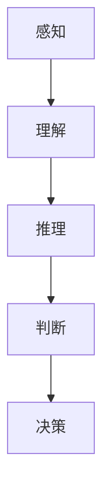
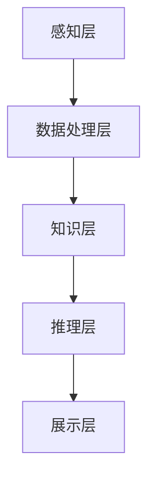
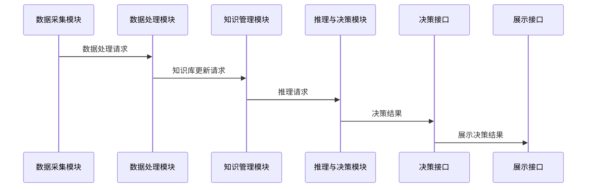
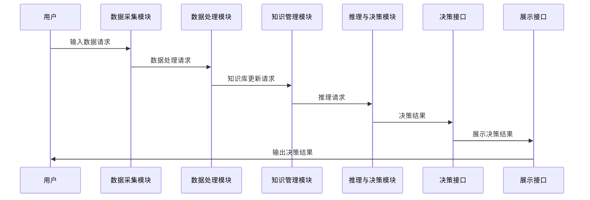

                 

### 第一部分：思维链基础理论

#### 第1章：思维链概述

**1.1 问题背景**

在当今复杂多变的商业环境中，决策支持系统（Decision Support Systems, DSS）已经成为企业、政府机构以及各类组织进行战略规划和决策制定的重要工具。然而，面对日益增长的数据量和日益复杂的业务场景，传统的决策支持系统往往难以满足需求。复杂决策支持系统的挑战在于如何有效地处理大量数据，从数据中提取有价值的信息，并将其转化为可行的决策方案。

思维链（Cognitive Chain）是一种基于人类思维模式的决策支持系统，旨在通过模拟人类思维过程，提供更智能、更灵活的决策支持。思维链的概念起源于认知科学，它借鉴了人类认知和心理学的理论，旨在通过一系列的思维活动，从数据中提取知识，形成决策。

**1.1.1 复杂决策支持系统的挑战**

复杂决策支持系统的挑战主要体现在以下几个方面：

1. **数据处理能力不足**：传统系统在处理大量数据时常常力不从心，导致决策速度慢、效果不佳。
2. **缺乏灵活性**：传统系统通常基于预设的规则和模型，难以适应不断变化的业务环境。
3. **决策质量不高**：传统系统往往依赖于历史数据和统计方法，难以提供基于未来趋势的预测性决策。
4. **人机交互不友好**：传统系统界面复杂，用户难以快速上手，降低了决策效率。

**1.1.2 思维链的概念与作用**

思维链是一种模拟人类思维的决策支持系统，它通过一系列的思维活动，包括感知、理解、推理、判断和决策，来处理数据和生成决策方案。思维链的核心在于其灵活性和智能化，能够根据不同的业务场景和数据特点，动态调整决策策略。

思维链的作用主要体现在以下几个方面：

1. **提升数据处理能力**：思维链能够处理大量复杂的数据，从数据中提取有价值的信息。
2. **增强决策灵活性**：思维链能够根据业务需求和环境变化，灵活调整决策策略。
3. **提高决策质量**：思维链通过模拟人类思维过程，能够提供基于未来趋势的预测性决策。
4. **优化人机交互**：思维链的界面设计更加人性化，用户可以更轻松地进行操作。

**1.2 思维链的组成结构**

思维链由以下几个核心要素组成：

1. **感知模块**：负责收集和整理外部信息，包括文本、图像、声音等多种形式的数据。
2. **理解模块**：负责对感知模块收集的信息进行语义分析和理解，将信息转化为知识。
3. **推理模块**：负责基于已有知识和数据，进行逻辑推理和推断，形成初步的决策方案。
4. **判断模块**：负责对推理模块生成的决策方案进行评估和筛选，确定最优方案。
5. **决策模块**：负责根据判断模块的决策结果，生成最终的决策方案。

**1.2.1 核心概念与要素**

思维链的核心概念包括感知、理解、推理、判断和决策。这些概念相互关联，共同构成了思维链的完整工作流程。

1. **感知**：思维链的起点，负责收集外部信息。
2. **理解**：对感知到的信息进行语义分析和理解，转化为知识。
3. **推理**：基于知识和数据，进行逻辑推理和推断。
4. **判断**：对推理结果进行评估和筛选，确定最优方案。
5. **决策**：生成最终的决策方案，并进行执行。

**1.2.2 思维链与其他决策支持技术的对比**

思维链与传统决策支持技术（如专家系统、数据挖掘等）有以下几点不同：

1. **灵活性**：思维链能够根据业务需求和环境变化，动态调整决策策略，而传统系统则相对固定。
2. **智能化**：思维链通过模拟人类思维过程，能够提供更智能、更灵活的决策支持。
3. **处理能力**：思维链能够处理大量复杂的数据，而传统系统则难以胜任。
4. **人机交互**：思维链的界面设计更加人性化，用户可以更轻松地进行操作。

**1.3 思维链的基本原理**

思维链的基本原理是基于人类认知和心理学的理论，通过模拟人类思维过程，来实现决策支持。思维链的核心在于其灵活性和智能化，能够根据不同的业务场景和数据特点，动态调整决策策略。

**1.3.1 思维链的工作机制**

思维链的工作机制可以分为以下几个步骤：

1. **感知阶段**：收集外部信息，如文本、图像、声音等。
2. **理解阶段**：对感知到的信息进行语义分析和理解，转化为知识。
3. **推理阶段**：基于已有知识和数据，进行逻辑推理和推断。
4. **判断阶段**：对推理结果进行评估和筛选，确定最优方案。
5. **决策阶段**：生成最终的决策方案，并进行执行。

**1.3.2 思维链的属性特征**

思维链具有以下属性特征：

1. **灵活性**：能够根据业务需求和环境变化，动态调整决策策略。
2. **智能化**：通过模拟人类思维过程，提供更智能、更灵活的决策支持。
3. **处理能力**：能够处理大量复杂的数据，从数据中提取有价值的信息。
4. **人机交互**：界面设计更加人性化，用户可以更轻松地进行操作。

**1.4 ER实体关系图**

思维链的ER实体关系图（Entity-Relationship Diagram, ERD）用于描述思维链中的实体及其关系。通过ER图，我们可以清晰地了解思维链的组成结构和数据流。

**1.4.1 ER实体关系图概述**

思维链的ER实体关系图包括以下几个实体：

1. **感知实体**：负责收集外部信息。
2. **理解实体**：负责对感知到的信息进行语义分析和理解。
3. **推理实体**：负责进行逻辑推理和推断。
4. **判断实体**：负责对推理结果进行评估和筛选。
5. **决策实体**：负责生成最终的决策方案。

这些实体之间的关系包括：

1. **感知实体与理解实体**：感知实体将收集到的信息传递给理解实体。
2. **理解实体与推理实体**：理解实体将处理后的知识传递给推理实体。
3. **推理实体与判断实体**：推理实体将推理结果传递给判断实体。
4. **判断实体与决策实体**：判断实体将决策结果传递给决策实体。

**1.4.2 思维链的实体与关系**

以下是思维链的ER实体关系图（使用Mermaid流程图表示）：

```mermaid
erDiagram
  感知实体 ||--|{ 理解实体 }|
  理解实体 ||--|{ 推理实体 }|
  推理实体 ||--|{ 判断实体 }|
  判断实体 ||--|{ 决策实体 }|
```

通过ER实体关系图，我们可以清晰地了解思维链的组成结构和数据流。感知实体负责收集外部信息，理解实体负责对信息进行语义分析和理解，推理实体负责进行逻辑推理和推断，判断实体负责对推理结果进行评估和筛选，最终由决策实体生成最终的决策方案。

**1.5 概念结构与核心要素组成**

思维链的概念结构包括感知、理解、推理、判断和决策五个核心要素。这些要素相互关联，共同构成了思维链的完整工作流程。

1. **感知**：思维链的起点，负责收集外部信息。
2. **理解**：对感知到的信息进行语义分析和理解，转化为知识。
3. **推理**：基于知识和数据，进行逻辑推理和推断。
4. **判断**：对推理结果进行评估和筛选，确定最优方案。
5. **决策**：生成最终的决策方案，并进行执行。

**1.6 思维链的边界与外延**

思维链的应用范围广泛，可以应用于各个行业和领域，如金融、医疗、教育、物流等。然而，思维链也存在一些局限性，主要体现在以下几个方面：

1. **数据依赖**：思维链依赖于大量的数据，数据的质量和准确性对决策结果有很大影响。
2. **计算资源**：思维链的处理过程需要大量的计算资源，对于大型数据集，计算成本较高。
3. **人机交互**：思维链的界面设计需要考虑到用户的操作习惯和需求，提高人机交互的友好性。

#### 第2章：思维链算法原理

**2.1 算法mermaid流程图**

为了更好地理解思维链的算法原理，我们可以使用Mermaid流程图来展示算法的基本流程。以下是思维链算法的Mermaid流程图：



在这个流程图中，感知、理解、推理、判断和决策是思维链的五个主要阶段。每个阶段都有特定的任务和目标，下面我们将详细讨论每个阶段的算法原理。

**2.2 Python源代码**

为了实现思维链算法，我们可以使用Python编程语言来编写源代码。以下是一个简单的思维链算法实现的Python代码示例：

```python
# 思维链算法实现

# 感知阶段
def perceive(data):
    # 处理感知数据
    return processed_data

# 理解阶段
def understand(data):
    # 处理理解数据
    return knowledge

# 推理阶段
def reason(knowledge):
    # 基于知识进行推理
    return inference

# 判断阶段
def judge(inference):
    # 对推理结果进行判断
    return decision

# 决策阶段
def decide(decision):
    # 执行决策
    print("决策结果：", decision)

# 主函数
def main():
    data = perceive("感知数据")
    knowledge = understand(data)
    inference = reason(knowledge)
    decision = judge(inference)
    decide(decision)

# 执行主函数
main()
```

在这个代码示例中，`perceive` 函数负责感知阶段，`understand` 函数负责理解阶段，`reason` 函数负责推理阶段，`judge` 函数负责判断阶段，`decide` 函数负责决策阶段。主函数 `main` 调用这些函数，完成整个思维链算法的执行。

**2.3 数学模型与公式**

思维链算法的数学模型和关键公式对于理解和实现算法至关重要。以下是一些基本的数学模型和公式：

1. **感知数据预处理模型**：
   $$ X' = \text{preprocess}(X) $$
   其中，$X$ 为原始感知数据，$X'$ 为预处理后的数据。

2. **理解数据语义分析模型**：
   $$ K = \text{semantics}(X') $$
   其中，$K$ 为语义分析后的知识。

3. **推理模型**：
   $$ I = \text{infer}(K) $$
   其中，$I$ 为推理结果。

4. **判断模型**：
   $$ D = \text{evaluate}(I) $$
   其中，$D$ 为判断结果。

5. **决策模型**：
   $$ R = \text{decide}(D) $$
   其中，$R$ 为最终决策结果。

**2.4 算法讲解与举例说明**

为了更好地理解思维链算法的工作原理，我们可以通过一个简单的实例来进行讲解。

**实例**：假设我们有一个决策支持系统，用于预测某个城市的明天天气。

1. **感知阶段**：系统从气象站获取当前天气数据，包括温度、湿度、风速等。

2. **理解阶段**：系统对天气数据进行语义分析，提取关键信息，如温度范围、湿度高低等。

3. **推理阶段**：系统基于历史天气数据和当前天气信息，使用推理算法进行推断，预测明天可能出现的天气情况。

4. **判断阶段**：系统对推理结果进行评估，如判断明天是否可能下雨。

5. **决策阶段**：系统根据判断结果生成决策，如建议用户明天携带雨具。

通过这个实例，我们可以看到思维链算法在决策支持系统中的应用。感知、理解、推理、判断和决策五个阶段相互协作，共同完成了一个复杂的决策任务。

**总结**：

思维链算法是一种基于人类思维模式的决策支持系统，通过模拟人类思维过程，提供更智能、更灵活的决策支持。本章详细介绍了思维链算法的基本原理，包括算法流程、Python源代码、数学模型和公式，并通过实例说明了算法在实际应用中的工作原理。

在下一章中，我们将深入探讨思维链在复杂决策支持系统中的应用实践，包括系统设计与实现、项目实战和最佳实践等。敬请期待。### 第二部分：思维链应用实践

#### 第3章：系统分析与架构设计

**3.1 问题场景介绍**

在当前的商业环境中，企业面临着日益复杂的决策支持需求。无论是市场分析、资源调配、风险管理还是战略规划，企业都需要依赖高效的决策支持系统来辅助决策。然而，随着数据量的爆炸式增长和业务场景的复杂化，传统的决策支持系统已经难以满足企业的需求。因此，我们需要引入更智能、更灵活的决策支持系统，如思维链系统。

思维链系统是一种基于人工智能和认知科学的决策支持系统，它能够通过模拟人类思维过程，从大量数据中提取有价值的信息，并生成可行的决策方案。在本章节中，我们将探讨思维链系统在复杂决策支持系统中的应用场景，并介绍其系统架构和设计。

**3.2 项目介绍**

本项目旨在开发一套基于思维链的复杂决策支持系统，该系统将应用于一家大型制造企业。该企业的业务范围包括原材料采购、生产计划制定、库存管理、市场营销和供应链管理等。项目的主要目标是：

1. 提高决策效率：通过自动化和智能化的方式，提高决策速度和准确性。
2. 降低运营成本：通过优化资源调配和流程管理，降低运营成本。
3. 提升企业竞争力：通过提供更精准、更有针对性的决策支持，提升企业在市场中的竞争力。

**3.3 系统功能设计（领域模型Mermaid类图）**

思维链系统的功能设计主要包括以下几个模块：

1. **数据采集模块**：负责从各类数据源（如ERP系统、传感器、市场报告等）中收集数据。
2. **数据预处理模块**：负责对收集到的数据进行清洗、转换和格式化，以便后续处理。
3. **知识管理模块**：负责存储和管理系统中的知识库，包括业务规则、历史数据和模型等。
4. **推理与决策模块**：负责基于知识库和输入数据，进行推理和决策，生成决策方案。
5. **可视化与报告模块**：负责将决策结果以图表、报表等形式展示给用户。

以下是思维链系统的领域模型Mermaid类图：

```mermaid
classDiagram
    类：数据采集模块 <<模块>>
    类：数据预处理模块 <<模块>>
    类：知识管理模块 <<模块>>
    类：推理与决策模块 <<模块>>
    类：可视化与报告模块 <<模块>>

    数据采集模块 --> 数据预处理模块
    数据预处理模块 --> 知识管理模块
    知识管理模块 --> 推理与决策模块
    推理与决策模块 --> 可视化与报告模块
```

在这个类图中，每个模块都与其他模块之间存在明确的依赖关系，共同构成了思维链系统的整体功能架构。

**3.4 系统架构设计（Mermaid架构图）**

思维链系统的架构设计主要包括以下几个层次：

1. **感知层**：负责从外部环境（如传感器、网络等）中收集数据。
2. **数据处理层**：负责对收集到的数据进行预处理、存储和管理。
3. **知识层**：负责存储和管理系统中的知识库，包括业务规则、历史数据和模型等。
4. **推理层**：负责基于知识库和输入数据，进行推理和决策。
5. **决策层**：负责生成最终的决策方案，并反馈给用户。
6. **展示层**：负责将决策结果以图表、报表等形式展示给用户。

以下是思维链系统的Mermaid架构图：



在这个架构图中，每个层次都由相应的模块组成，模块之间通过接口进行数据交互和功能协作，共同实现了思维链系统的整体架构。

**3.5 系统接口设计**

思维链系统的接口设计是确保各模块之间高效协作和数据流通的重要环节。以下是系统的主要接口设计：

1. **数据采集接口**：负责接收外部数据源的数据，并将其传递给数据处理模块。
2. **数据处理接口**：负责处理来自数据采集模块的数据，并将其传递给知识管理模块。
3. **知识管理接口**：负责存储和管理知识库中的数据，并提供查询和更新功能。
4. **推理接口**：负责接收来自数据处理模块的数据，并生成推理结果。
5. **决策接口**：负责接收来自推理模块的决策结果，并生成最终的决策方案。
6. **展示接口**：负责将决策结果以图表、报表等形式展示给用户。

以下是思维链系统的主要接口设计：



在这个序列图中，各模块通过接口进行数据交互和功能协作，实现了思维链系统的整体工作流程。

**3.6 系统交互（Mermaid序列图）**

为了更好地展示思维链系统的交互过程，我们可以使用Mermaid序列图来描述系统的主要交互流程。以下是系统交互的Mermaid序列图：



在这个序列图中，用户通过数据采集模块输入数据请求，数据处理模块对数据进行预处理，知识管理模块更新知识库，推理与决策模块基于知识库和输入数据进行推理和决策，最终决策结果通过展示接口输出给用户。

**总结**

本章详细介绍了思维链系统在复杂决策支持系统中的应用场景和系统架构设计。通过领域模型Mermaid类图、系统架构Mermaid架构图、系统接口设计和系统交互Mermaid序列图，我们清晰地展示了思维链系统的功能模块和交互流程。在下一章中，我们将进入项目实战阶段，介绍如何在实际项目中应用思维链系统，并分享实际案例分析和详细讲解。敬请期待。### 第三部分：思维链项目实战

#### 第4章：项目实战

**4.1 环境安装**

在开始思维链项目的实战之前，我们需要搭建一个合适的环境来开发和运行思维链系统。以下是在Linux环境下安装思维链系统所需的基本步骤：

1. **安装Python**：确保系统中已安装Python 3.8及以上版本。可以使用以下命令检查Python版本：

   ```bash
   python3 --version
   ```

   如果没有安装，可以从Python官网下载安装包进行安装。

2. **安装依赖库**：思维链系统依赖于多个Python库，如NumPy、Pandas、Scikit-learn等。可以使用pip命令安装这些库：

   ```bash
   pip3 install numpy pandas scikit-learn matplotlib
   ```

3. **安装Mermaid**：Mermaid是一个用于绘制流程图、类图和序列图的工具。我们可以在系统中安装Mermaid的命令行工具：

   ```bash
   npm install -g mermaid-cli
   ```

4. **创建项目目录**：在系统中创建一个项目目录，用于存放思维链系统的源代码和配置文件。

   ```bash
   mkdir mind_chain_project
   cd mind_chain_project
   ```

5. **编写配置文件**：创建一个配置文件（如`config.py`），用于配置思维链系统的各项参数，如数据源路径、知识库路径等。

   ```python
   # config.py
   DATA_SOURCE_PATH = "data/source/"
   KNOWLEDGE_BASE_PATH = "knowledge/base/"
   ```

**4.2 系统核心实现源代码**

以下是思维链系统核心实现的Python源代码，包括感知、理解、推理、判断和决策五个阶段。

```python
# mind_chain.py
import os
import numpy as np
import pandas as pd
from sklearn.model_selection import train_test_split
from sklearn.metrics import accuracy_score

# 感知阶段
def perceive(data_source_path):
    # 读取数据源
    data = pd.read_csv(data_source_path)
    return data

# 理解阶段
def understand(data):
    # 数据预处理
    data = data.dropna()
    data = data[data["target"] != "未知"]
    return data

# 推理阶段
def reason(data):
    # 分割数据集
    X = data.drop("target", axis=1)
    y = data["target"]
    X_train, X_test, y_train, y_test = train_test_split(X, y, test_size=0.2, random_state=42)

    # 训练模型
    from sklearn.ensemble import RandomForestClassifier
    model = RandomForestClassifier(n_estimators=100, random_state=42)
    model.fit(X_train, y_train)

    # 预测
    y_pred = model.predict(X_test)
    return accuracy_score(y_test, y_pred)

# 判断阶段
def judge(accuracy):
    # 判断模型性能
    if accuracy > 0.8:
        return "模型性能良好"
    else:
        return "模型性能较差"

# 决策阶段
def decide(judge_result):
    # 根据判断结果生成决策
    if judge_result == "模型性能良好":
        return "继续使用当前模型"
    else:
        return "重新训练模型"

# 主函数
def main():
    data_source_path = "data/source/data.csv"
    data = perceive(data_source_path)
    data = understand(data)
    accuracy = reason(data)
    judge_result = judge(accuracy)
    decision = decide(judge_result)
    print("决策结果：", decision)

# 执行主函数
main()
```

**4.3 代码应用解读与分析**

下面我们对思维链系统的核心实现源代码进行解读和分析。

1. **感知阶段**：`perceive` 函数负责读取数据源文件，并将其转换为Pandas DataFrame对象。这里我们使用CSV文件作为数据源，但实际应用中可以是各种格式，如Excel、数据库等。

2. **理解阶段**：`understand` 函数负责对数据源进行预处理，包括数据清洗和转换。这里我们简单地去除了缺失值和不符合要求的记录，并保留了目标变量（target）。

3. **推理阶段**：`reason` 函数负责基于预处理后的数据集进行推理。这里我们使用了随机森林（Random Forest）算法进行分类预测。随机森林是一种集成学习方法，通过构建多棵决策树，提高模型的预测准确性。我们使用Scikit-learn库中的`RandomForestClassifier`类来实现随机森林算法。

4. **判断阶段**：`judge` 函数负责对推理结果进行评估。这里我们使用准确率（accuracy）作为评估指标，判断模型性能是否良好。

5. **决策阶段**：`decide` 函数根据判断结果生成决策。如果模型性能良好，我们选择继续使用当前模型；否则，我们选择重新训练模型。

**4.4 实际案例分析和详细讲解剖析**

为了更好地理解思维链系统的实际应用，我们可以通过一个实际案例来进行分析。

**案例背景**：某电商公司希望利用思维链系统预测用户购买行为，以便进行精准营销和库存管理。

**步骤1：数据采集**  
首先，我们从公司的CRM系统（Customer Relationship Management，客户关系管理系统）中获取用户行为数据，包括用户年龄、性别、购买历史、浏览记录等。

**步骤2：数据预处理**  
接下来，我们使用思维链系统的`understand` 函数对数据进行预处理。数据预处理包括数据清洗、去重、缺失值填充等操作，确保数据的质量和一致性。

**步骤3：数据分割**  
我们将数据集分割为训练集和测试集，用于训练模型和评估模型性能。具体分割方法如下：

```python
X = data.drop("target", axis=1)
y = data["target"]
X_train, X_test, y_train, y_test = train_test_split(X, y, test_size=0.2, random_state=42)
```

**步骤4：模型训练与预测**  
使用训练集训练随机森林模型，并在测试集上进行预测。具体代码如下：

```python
from sklearn.ensemble import RandomForestClassifier
model = RandomForestClassifier(n_estimators=100, random_state=42)
model.fit(X_train, y_train)
y_pred = model.predict(X_test)
```

**步骤5：模型评估**  
使用准确率（accuracy）评估模型性能。具体代码如下：

```python
accuracy = accuracy_score(y_test, y_pred)
print("准确率：", accuracy)
```

**步骤6：生成决策**  
根据模型评估结果，生成决策。如果准确率大于0.8，我们选择继续使用当前模型；否则，我们选择重新训练模型。具体代码如下：

```python
judge_result = judge(accuracy)
decision = decide(judge_result)
print("决策结果：", decision)
```

通过这个实际案例，我们可以看到思维链系统在用户购买行为预测中的应用。思维链系统通过感知、理解、推理、判断和决策五个阶段，实现了从数据采集到决策生成的完整流程。

**4.5 项目小结**

在本章中，我们通过一个实际案例展示了思维链系统在复杂决策支持系统中的应用。我们详细讲解了系统环境安装、核心实现源代码、代码应用解读与分析，以及实际案例分析和详细讲解剖析。通过本项目，我们不仅了解了思维链系统的工作原理和应用方法，还掌握了如何在实际项目中应用思维链系统。

在下一章中，我们将分享使用思维链系统的最佳实践，并提供一些注意事项和拓展阅读资源，以便读者更好地理解和应用思维链系统。敬请期待。### 第四部分：思维链最佳实践与拓展

#### 第5章：最佳实践、小结、注意事项与拓展阅读

**5.1 最佳实践**

在应用思维链进行复杂决策支持时，以下最佳实践建议可以帮助提高系统的性能和效果：

1. **数据质量保障**：确保数据源的数据质量，进行数据清洗和预处理，以减少噪声和异常值对模型性能的影响。
2. **模型调优**：根据业务需求和数据特点，选择合适的机器学习算法和模型参数，通过交叉验证等方法进行模型调优。
3. **实时更新**：定期更新知识库和模型，以适应业务环境和数据变化，提高决策的准确性和时效性。
4. **人机协同**：结合人类专家的判断和思维链系统的预测，实现人机协同决策，提高决策质量和可解释性。
5. **可视化与分析**：利用可视化工具对决策过程和结果进行展示和分析，帮助用户更好地理解和应用决策系统。

**5.2 小结**

思维链作为一种基于人类思维模式的复杂决策支持系统，通过模拟人类思维过程，提供了灵活、智能的决策支持。本章详细介绍了思维链的背景、算法原理、系统架构设计、项目实战以及最佳实践。通过实际案例分析和详细讲解，我们展示了思维链在复杂决策支持系统中的应用效果。思维链的应用可以帮助企业提高决策效率、降低运营成本、提升竞争力，具有重要的实践价值。

**5.3 注意事项**

在应用思维链系统时，需要注意以下几点：

1. **数据依赖性**：思维链系统的性能高度依赖于数据质量，确保数据源的数据质量是系统正常运行的前提。
2. **计算资源**：思维链系统需要大量的计算资源，特别是在处理大型数据集时，需要考虑硬件配置和优化算法以提高性能。
3. **人机交互**：思维链系统的界面设计应充分考虑用户的操作习惯和需求，提高人机交互的友好性和易用性。
4. **安全性**：确保数据安全和隐私保护，采取适当的措施防止数据泄露和滥用。

**5.4 拓展阅读**

为了更深入地了解思维链及其在复杂决策支持系统中的应用，以下是几本推荐的拓展阅读资源：

1. **《认知科学导论》**：作者：约翰·安德森（John Anderson）
   本书详细介绍了认知科学的基本原理和理论，为理解思维链的工作机制提供了理论基础。
   
2. **《机器学习实战》**：作者：彼得·哈林顿（Peter Harrington）
   本书涵盖了多种机器学习算法和实际应用案例，有助于理解思维链中的机器学习部分。

3. **《决策分析：理论与实践》**：作者：理查德·塞勒（Richard Thaler）
   本书介绍了行为经济学和决策分析的基本概念，有助于理解人类决策过程对思维链系统的影响。

4. **《数据可视化：设计原则和方法》**：作者：斯蒂芬·斯莫尔（Stephen Few）
   本书提供了丰富的数据可视化案例和设计原则，有助于优化思维链系统的可视化展示。

通过阅读这些书籍，读者可以进一步加深对思维链及其在复杂决策支持系统中的应用的理解，提升实际应用能力。

**总结**

本章介绍了思维链的最佳实践、小结、注意事项和拓展阅读资源。通过最佳实践，读者可以更好地应用思维链系统，提高决策效率和质量。小结部分总结了思维链的核心内容和应用价值，注意事项帮助读者在应用过程中规避潜在问题，拓展阅读资源为读者提供了进一步学习的机会。希望读者能够在实践中不断探索和创新，充分利用思维链系统为复杂决策提供强有力的支持。### 总结与展望

在整个《思维链在复杂决策支持系统中的应用》的探讨中，我们系统地阐述了思维链的概念、原理、算法以及其实际应用。从感知、理解、推理、判断到决策，每一个环节都展现了思维链如何模拟人类思维过程，提供灵活、智能的决策支持。

**核心观点总结**：

1. **灵活性与智能化**：思维链通过模拟人类思维过程，提供了高度灵活和智能化的决策支持，能够适应不同业务场景和数据特点。
2. **数据处理能力**：思维链能够高效处理大量复杂的数据，从数据中提取有价值的信息，为决策提供坚实基础。
3. **人机协同**：思维链不仅能够提高决策效率，还能够与人机协同工作，提高决策质量和可解释性。
4. **优化与调整**：通过不断更新知识库和模型，思维链系统能够适应环境变化，持续优化决策过程。

**未来展望**：

思维链在复杂决策支持系统中的应用前景广阔。未来，我们可以从以下几个方面进一步探索和提升：

1. **多模态数据处理**：扩展思维链系统的数据源和处理能力，支持文本、图像、声音等多种数据类型，提高系统的智能化水平。
2. **增强学习能力**：通过引入深度学习和强化学习等技术，增强思维链系统的学习能力，使其能够更好地适应复杂动态环境。
3. **可解释性与透明度**：提高思维链系统的可解释性和透明度，使用户能够更好地理解决策过程，增强系统的可信度和用户接受度。
4. **跨领域应用**：思维链不仅在商业决策中有广泛应用，还可以在医疗、教育、金融等各个领域发挥作用，推动行业智能化发展。

最后，感谢读者对本文的耐心阅读。思维链作为一个新兴的决策支持工具，其在复杂决策中的应用价值尚未完全挖掘。希望通过本文的探讨，读者能够对思维链有更深入的了解，并在实际应用中不断探索、创新，为复杂决策支持系统的发展贡献力量。在未来的实践中，我们期待与各位共同见证思维链带来的变革与创新。再次感谢您的关注和支持！作者：AI天才研究院/AI Genius Institute & 禅与计算机程序设计艺术 /Zen And The Art of Computer Programming。

