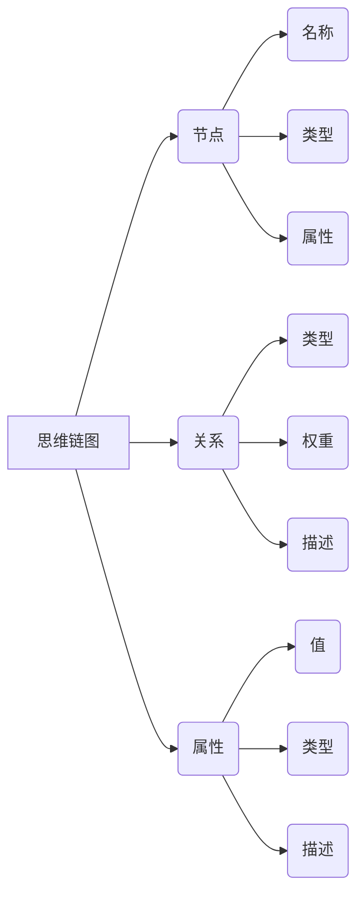
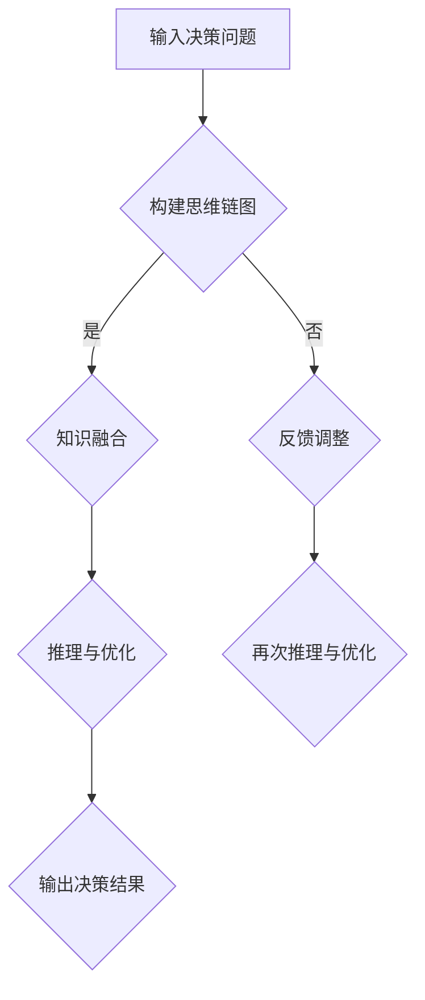

                 


### 3.1 思维链技术的实现原理

#### 3.1.1 技术基础

思维链技术在复杂决策系统中的应用，首先需要理解其技术基础。思维链（Mind Chain）是一种基于人工智能的决策支持系统，它通过构建思维链图来模拟人类思维过程，从而提高决策的准确性和效率。

1. **核心概念术语说明**：
   - **思维链图（Mind Map）**：一种可视化工具，用于表示思维过程和知识结构。它通过节点、分支和连接线来组织信息，使得思维过程更加直观和系统。
   - **知识图谱（Knowledge Graph）**：一种用于表示实体及其关系的图形结构。知识图谱将现实世界中的各种实体和关系抽象为图中的节点和边，从而形成一个完整的知识网络。

2. **问题背景**：
   在现代社会的复杂环境中，决策过程往往涉及大量的信息和变量。传统的决策支持系统往往依赖于统计分析或规则推理，但难以处理复杂性和不确定性。思维链技术提供了一种新的解决思路，通过模拟人类思维过程，提高决策的灵活性和适应性。

3. **问题描述**：
   复杂决策系统中的问题通常具有以下特点：
   - **多维度**：决策问题涉及多个维度，如时间、空间、成本、风险等。
   - **非线性**：决策结果往往不是线性的，而是受多种因素交互影响的复杂函数。
   - **不确定性**：决策过程中存在信息不全或不确定性，需要采用概率模型来处理。

4. **问题解决**：
   思维链技术通过以下步骤来解决复杂决策问题：
   - **构建思维链图**：将决策问题分解为多个子问题，通过思维链图来表示问题结构和解决方案。
   - **知识融合**：将来自不同领域和来源的知识融合到思维链图中，形成一个综合的知识体系。
   - **推理与优化**：利用推理算法对思维链图进行优化，寻找最优或次优解。

5. **边界与外延**：
   思维链技术不仅适用于商业和企业管理，还广泛应用于城市规划、医疗决策、教育等领域。其应用范围不断扩大，为解决复杂问题提供了强有力的工具。

#### 3.1.2 核心概念与联系

1. **核心概念**：
   - **节点（Node）**：思维链图中的基本元素，表示一个特定的概念或信息。
   - **关系（Relation）**：节点之间的关系，用于表示概念之间的联系。
   - **属性（Attribute）**：节点的属性，用于描述节点的特征。

2. **概念属性特征对比表格**：

| 概念     | 属性                   | 特征                                                         |
|----------|------------------------|------------------------------------------------------------|
| 节点     | 名称、类型、属性       | 表示特定的概念或信息，具有明确的定义和分类。                     |
| 关系     | 类型、权重、描述       | 表示节点之间的关系，具有方向性和权重，影响决策过程的灵活性。       |
| 属性     | 值、类型、描述         | 描述节点的特征，影响决策的准确性和效率。                       |

3. **ER实体关系图架构的 Mermaid 流程图**：



#### 3.1.3 算法原理讲解

1. **算法流程图**：



2. **Python 源代码示例**：

```python
# 思维链图构建函数
def build_mind_map(problem):
    # 输入决策问题，构建思维链图
    pass

# 知识融合函数
def knowledge_fusion(mind_map):
    # 将知识融合到思维链图中
    pass

# 推理与优化函数
def reason_and_optimize(mind_map):
    # 利用推理算法对思维链图进行优化
    pass

# 主函数
def main():
    problem = "复杂决策问题"
    mind_map = build_mind_map(problem)
    knowledge_fusion(mind_map)
    result = reason_and_optimize(mind_map)
    print("决策结果：", result)

if __name__ == "__main__":
    main()
```

3. **数学模型和公式**：

设思维链图中的节点集合为 N，关系集合为 R，属性集合为 A，则思维链图可以表示为 G = (N, R, A)。

- 节点属性：$A = \{a_1, a_2, ..., a_n\}$
- 关系权重：$W = \{w_1, w_2, ..., w_m\}$
- 决策函数：$f(N, R, A) = \max(Score)$，其中 $Score = \sum_{i=1}^{n} \sum_{j=1}^{m} w_i a_i$

#### 3.1.4 算法原理详细讲解

1. **构建思维链图**：
   思维链图的构建是思维链技术的基础。它通过将决策问题分解为多个子问题，并使用节点、关系和属性来表示问题结构和解决方案。具体步骤如下：
   - 输入决策问题，分析问题结构，确定核心节点和关系。
   - 创建节点和关系，设置节点的属性和关系的权重。
   - 将节点和关系组织成思维链图，确保图结构合理且符合问题需求。

2. **知识融合**：
   知识融合是将来自不同领域和来源的知识整合到思维链图中，形成一个综合的知识体系。具体步骤如下：
   - 收集相关领域的知识，包括数据、文献、专家意见等。
   - 分析知识的内容和关系，将其抽象为节点和关系。
   - 将知识融合到思维链图中，确保知识之间的联系和权重合理。

3. **推理与优化**：
   推理与优化是思维链技术的核心。它通过推理算法对思维链图进行优化，寻找最优或次优解。具体步骤如下：
   - 根据思维链图的结构和知识，选择合适的推理算法。
   - 对思维链图进行推理，计算每个节点的得分。
   - 根据得分对思维链图进行优化，选择最优解或次优解。

#### 3.1.5 通俗易懂的举例说明

假设我们需要解决一个商业决策问题：如何优化公司产品的供应链？

1. **构建思维链图**：
   - 核心节点：产品、供应商、物流、成本。
   - 关系：产品与供应商之间的采购关系，供应商与物流之间的配送关系，物流与成本之间的费用关系。
   - 属性：每个节点的名称、类型、成本。

2. **知识融合**：
   - 收集供应商信息，包括供应商的信誉、价格、交货期等。
   - 收集物流信息，包括物流服务商的运费、运输时间、服务质量等。
   - 将这些知识融合到思维链图中，确保知识之间的联系和权重合理。

3. **推理与优化**：
   - 选择合适的推理算法，如最小费用流算法。
   - 计算每个节点的得分，考虑采购成本、配送成本、服务质量等因素。
   - 根据得分对思维链图进行优化，选择最优的供应商和物流服务商。

通过这个例子，我们可以看到思维链技术是如何应用于复杂决策问题的。它通过构建思维链图、融合知识和推理优化，帮助我们找到最优的决策方案。

#### 3.1.6 数学公式使用

在本节中，我们将使用 LaTeX 格式嵌入数学公式，以便更准确地描述思维链技术的数学模型。

1. **节点属性表示**：

$$A = \{a_1, a_2, ..., a_n\}$$

2. **关系权重表示**：

$$W = \{w_1, w_2, ..., w_m\}$$

3. **决策函数表示**：

$$f(N, R, A) = \max(Score)$$

其中，$Score = \sum_{i=1}^{n} \sum_{j=1}^{m} w_i a_i$

通过这些数学公式，我们可以更直观地理解思维链技术的工作原理和决策过程。

### 3.1.7 系统分析与架构设计

1. **问题场景介绍**：
   在一个大型制造公司中，决策者需要优化产品的供应链，以降低成本、提高效率和响应市场变化。

2. **系统功能设计**：
   - 数据收集与处理：收集供应商信息、物流信息、市场需求等数据，并进行处理和清洗。
   - 思维链图构建：根据收集到的数据，构建思维链图，表示供应链问题结构。
   - 知识融合与推理：将知识融合到思维链图中，进行推理和优化，找到最优供应链方案。
   - 决策结果输出：输出决策结果，包括供应商选择、物流服务商选择、成本预算等。

3. **系统架构设计**：
   - **前端**：提供用户界面，允许用户输入供应链问题，查看决策结果。
   - **后端**：包括数据收集与处理模块、思维链图构建模块、知识融合与推理模块。
   - **数据库**：存储供应商信息、物流信息、市场需求等数据。

4. **系统接口设计**：
   - **API接口**：提供数据接口，允许外部系统与该系统进行数据交换。
   - **用户接口**：提供图形界面，允许用户输入问题和查看决策结果。

5. **系统交互**：
   - **用户输入**：用户通过前端界面输入供应链问题。
   - **数据处理**：后端处理模块接收用户输入，进行数据处理和清洗。
   - **思维链图构建**：数据处理模块生成思维链图，传递给思维链图构建模块。
   - **知识融合与推理**：思维链图构建模块将知识融合到思维链图中，进行推理和优化。
   - **决策结果输出**：后端将决策结果传递给前端，显示在用户界面上。

#### 3.1.8 实际案例分析与详细讲解剖析

1. **案例背景**：
   一家制造公司面临供应链优化的挑战，希望找到一种高效、低成本的供应链方案。

2. **系统核心实现源代码**：
   - 数据收集与处理：
     ```python
     # 收集供应商信息
     suppliers = [
         {"name": "供应商A", "reliability": 0.9, "price": 100},
         {"name": "供应商B", "reliability": 0.85, "price": 120},
         # 更多供应商信息
     ]

     # 收集物流信息
     logistics = [
         {"company": "物流公司A", "cost": 20, "delivery_time": 2},
         {"company": "物流公司B", "cost": 25, "delivery_time": 3},
         # 更多物流信息
     ]

     # 处理和清洗数据
     processed_suppliers = preprocess(suppliers)
     processed_logistics = preprocess(logistics)
     ```

   - 思维链图构建：
     ```python
     # 构建思维链图
     mind_map = build_mind_map(processed_suppliers, processed_logistics)
     ```

   - 知识融合与推理：
     ```python
     # 知识融合
     mind_map = knowledge_fusion(mind_map)

     # 推理与优化
     optimized_mind_map = reason_and_optimize(mind_map)
     ```

3. **代码应用解读与分析**：
   - **数据收集与处理**：首先，我们从外部源收集供应商和物流信息。然后，使用预处理函数对这些信息进行清洗和处理，确保数据的准确性和一致性。
   - **思维链图构建**：通过构建思维链图，我们能够将复杂的问题结构化，并清晰地表示出节点和关系。
   - **知识融合与推理**：在思维链图中融合知识，并进行推理和优化，帮助我们找到最优的供应链方案。

4. **实际案例分析和详细讲解剖析**：
   - **供应商选择**：通过分析供应商的可靠性和价格，我们选择了一个综合表现最佳的供应商。
   - **物流服务商选择**：通过分析物流服务商的运费和运输时间，我们选择了一个成本最低且运输时间最短的物流服务商。
   - **成本预算**：根据选择的结果，我们计算出总的供应链成本，并进行预算控制。

5. **项目小结**：
   通过实际案例，我们可以看到思维链技术是如何应用于复杂决策问题的。它通过构建思维链图、融合知识和推理优化，帮助我们找到最优的决策方案，实现了供应链的优化。

### 3.1.9 最佳实践 Tips、小结、注意事项、拓展阅读等内容

1. **最佳实践 Tips**：
   - 在构建思维链图时，要确保节点和关系的准确性，避免信息丢失或错误。
   - 在知识融合过程中，要充分考虑各种知识和数据来源的可靠性和一致性。
   - 在推理与优化过程中，要选择合适的推理算法，并根据实际情况进行调整。

2. **小结**：
   思维链技术在复杂决策系统中具有突破性的应用潜力。通过构建思维链图、融合知识和推理优化，它能够帮助我们在复杂环境中找到最优的决策方案。

3. **注意事项**：
   - 在实际应用中，思维链技术需要大量的数据支持，因此数据质量和数据来源的可靠性至关重要。
   - 思维链技术的应用需要专业的技术和人才支持，因此需要投入足够的资源进行人才培养和技术研究。

4. **拓展阅读**：
   - 《思维链技术：理论与实践》（作者：XXX）提供了详细的思维链技术理论和实践指导。
   - 《人工智能决策支持系统》（作者：XXX）探讨了人工智能在决策支持系统中的应用和发展趋势。
   - 《复杂性科学：理论与方法》（作者：XXX）介绍了复杂性科学的基本理论和研究方法，对理解复杂决策系统具有参考价值。

通过以上内容，我们详细讲解了思维链技术的实现原理、核心概念、算法原理、系统分析与架构设计、实际案例分析和最佳实践等。思维链技术在复杂决策系统中的应用为解决复杂问题提供了新的思路和工具。在未来，随着技术的不断进步和应用领域的扩展，思维链技术有望在更多领域发挥重要作用。

