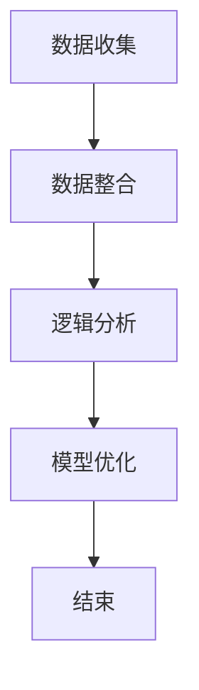
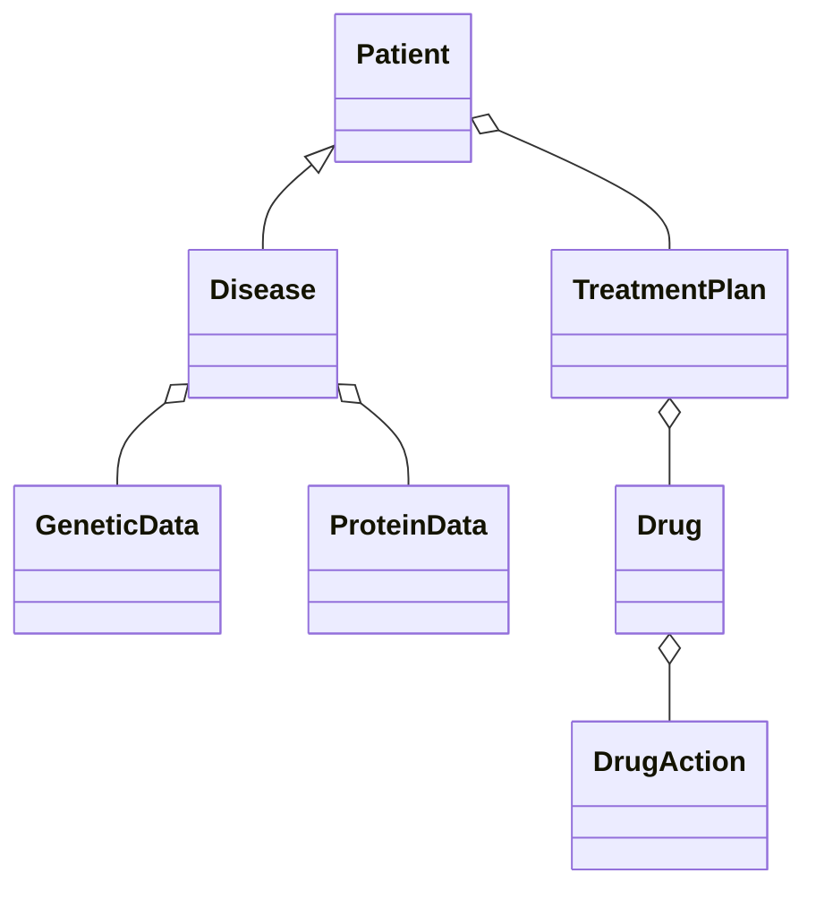
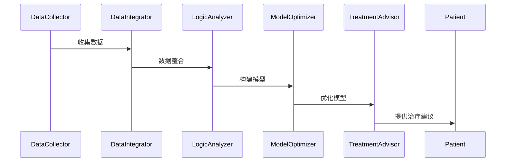
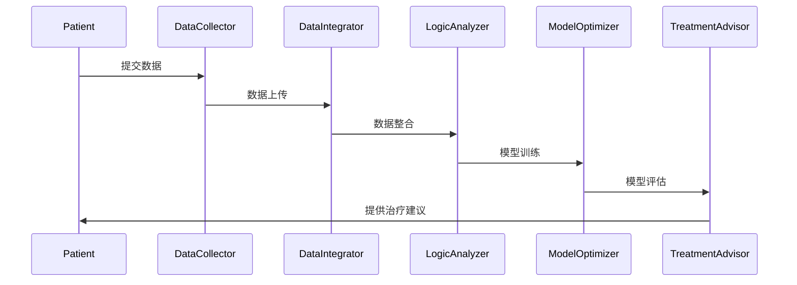

                 

### 研究背景与核心概念

#### 1. 复杂疾病的挑战

复杂疾病，顾名思义，是指由多个因素共同作用而引发的疾病，这类疾病通常具有高度异质性、多层次性和动态变化性。例如，癌症、心血管疾病和自身免疫性疾病等，它们涉及多个器官和系统的功能紊乱，导致诊断和治疗具有极大难度。

- **定义**：复杂疾病通常指的是多基因、多环境因素共同作用下的疾病，其特征是病因复杂、病情多变、治疗困难。
- **治疗难点**：复杂疾病的治疗难点主要表现在以下几个方面：
  - **病因复杂**：复杂疾病通常涉及多个基因、环境和生活方式等多个因素，这使得病因识别和治疗策略的制定变得非常困难。
  - **异质性**：即使是同一类型的复杂疾病，患者的病情也会因个体差异而表现出不同的特点，导致治疗方案难以统一。
  - **动态变化性**：复杂疾病的病情会随着时间和治疗手段的变化而发生变化，这使得治疗过程需要不断调整。

- **传统治疗方法的局限**：传统的疾病治疗方法，如手术、化疗和放疗等，通常只能解决疾病的一个方面，对于复杂疾病的整体治疗效果有限。此外，传统治疗方法还存在副作用大、患者生活质量下降等问题。

#### 2. 思维链的概念与原理

思维链，作为一种新兴的疾病治疗理念，旨在通过构建复杂的逻辑关系和多层次的分析模型，来更好地理解和治疗复杂疾病。思维链的核心思想是：将疾病的各个方面通过逻辑关系连接起来，形成一个统一的、动态的疾病治疗模型。

- **定义**：思维链是指一种通过多层次、多维度分析，将疾病的各个方面联系起来的逻辑框架，旨在构建一个综合、动态的疾病治疗模型。
- **原理**：思维链的原理主要包括以下几个步骤：
  - **数据收集**：收集与疾病相关的各种数据，包括基因数据、蛋白质数据、临床数据等。
  - **数据整合**：通过整合不同来源的数据，构建一个全面的疾病数据集。
  - **逻辑分析**：利用逻辑推理和机器学习算法，分析疾病数据中的各种关系，构建疾病治疗模型。
  - **模型优化**：根据实际治疗效果，不断优化疾病治疗模型，提高治疗效果。

#### 3. 多靶点药物开发的策略

多靶点药物开发，是近年来药物治疗领域的重要研究方向。多靶点药物能够同时作用于疾病的不同方面，从而提高治疗效果，减少副作用。

- **优势**：
  - **提高治疗效果**：多靶点药物能够同时作用于疾病的多个环节，从而提高治疗效果。
  - **减少副作用**：由于多靶点药物不是单一作用，因此可以减少药物的副作用。

- **挑战**：
  - **靶点选择**：选择哪些靶点是多靶点药物开发的关键，需要结合疾病的特点和现有研究数据。
  - **药物设计**：多靶点药物的设计需要考虑如何同时作用于多个靶点，避免药物之间的相互作用。

- **现代技术在多靶点药物开发中的应用**：随着基因组学、蛋白质组学等技术的不断发展，现代技术在多靶点药物开发中发挥着越来越重要的作用。例如，通过基因编辑技术可以选择合适的靶点，通过高通量筛选技术可以快速筛选潜在的药物候选分子。

#### 4. 研究现状与未来展望

目前，思维链和多靶点药物开发在复杂疾病治疗中的应用已经取得了一定的进展，但仍然面临许多挑战。未来，随着人工智能和大数据技术的不断发展，思维链和多靶点药物开发有望在复杂疾病治疗中发挥更大的作用。

- **当前研究进展**：思维链和多靶点药物开发在复杂疾病治疗中的应用研究已经在多个领域取得了重要成果。
- **存在的挑战**：主要挑战包括靶点选择、药物设计、临床试验等方面。
- **未来发展趋势**：随着技术的进步，思维链和多靶点药物开发在复杂疾病治疗中的应用将越来越广泛，有望带来革命性的变革。

### 本章小结

本章介绍了复杂疾病的挑战、思维链的概念与原理、多靶点药物开发的策略以及研究现状与未来展望。通过本章的学习，读者可以了解复杂疾病的特征和难点，掌握思维链和多靶点药物开发的基本原理和应用，为后续章节的学习打下坚实的基础。

---

### 核心概念原理与属性特征

在深入探讨思维链在复杂疾病网络治疗中的应用之前，我们需要首先明确几个核心概念，并详细分析其原理和属性特征。以下是对关键概念的定义、属性特征对比，以及它们之间的联系。

#### 1. 思维链的概念架构

思维链是一种通过多层次、多维度分析，将疾病的各个方面联系起来的逻辑框架。其核心思想是将疾病的各个方面通过逻辑关系连接起来，形成一个统一的、动态的疾病治疗模型。

- **定义**：思维链是一种逻辑框架，用于将疾病的各个方面通过逻辑关系联系起来，形成一个综合、动态的治疗模型。
- **关键组成部分**：
  - **数据收集**：收集与疾病相关的各种数据，包括基因数据、蛋白质数据、临床数据等。
  - **数据整合**：将不同来源的数据整合成一个全面的疾病数据集。
  - **逻辑分析**：利用逻辑推理和机器学习算法，分析疾病数据中的各种关系，构建疾病治疗模型。
  - **模型优化**：根据实际治疗效果，不断优化疾病治疗模型，提高治疗效果。

- **运作原理**：思维链通过以下几个步骤运作：
  - **数据收集**：收集各种与疾病相关的数据。
  - **数据整合**：整合数据，构建一个全面的疾病数据集。
  - **逻辑分析**：利用逻辑推理和机器学习算法，分析数据中的关系，构建疾病治疗模型。
  - **模型优化**：根据治疗效果，不断优化模型，提高治疗准确性。

#### 2. 多靶点药物的概念解析

多靶点药物开发是近年来药物治疗领域的重要研究方向。多靶点药物能够同时作用于疾病的不同方面，从而提高治疗效果，减少副作用。

- **定义**：多靶点药物是指能够同时作用于多个靶点的药物，从而提高治疗效果，减少副作用。
- **设计原则**：
  - **选择合适靶点**：根据疾病的特点和现有研究数据，选择合适的靶点。
  - **药物结构设计**：设计能够同时作用于多个靶点的药物分子结构。
  - **药物活性评估**：评估药物的活性，确保其能够同时作用于多个靶点。

- **优缺点**：
  - **优势**：
    - **提高治疗效果**：多靶点药物能够同时作用于疾病的多个环节，从而提高治疗效果。
    - **减少副作用**：由于多靶点药物不是单一作用，因此可以减少药物的副作用。
  - **缺点**：
    - **靶点选择难度大**：选择哪些靶点是多靶点药物开发的关键，需要结合疾病的特点和现有研究数据。
    - **药物设计复杂**：多靶点药物的设计需要考虑如何同时作用于多个靶点，避免药物之间的相互作用。

#### 3. 思维链与多靶点药物的联系

思维链和多靶点药物开发在复杂疾病治疗中有着紧密的联系。思维链为多靶点药物开发提供了理论支持，而多靶点药物开发则是思维链在实际应用中的重要实现途径。

- **跨学科融合的潜力**：思维链与多靶点药物开发结合，实现了跨学科融合，为复杂疾病治疗提供了新的思路和方法。
- **应用实例分析**：例如，在癌症治疗中，思维链可以通过分析肿瘤细胞的基因表达谱，识别出多个潜在的靶点，从而指导多靶点药物的研发。
- **未来发展方向**：随着技术的进步，思维链与多靶点药物开发有望在更多领域得到应用，为复杂疾病治疗带来更多可能性。

#### 4. ER实体关系图

ER实体关系图（Entity-Relationship Diagram）是一种用于描述系统中实体及其关系的图形化工具。在思维链和多靶点药物开发中，ER图可以帮助我们更清晰地理解系统架构和实体关系。

- **ER图的基本概念**：ER图包括实体、属性和关系三个基本概念。
  - **实体**：代表系统中的对象，如患者、药物、基因等。
  - **属性**：代表实体的特征，如患者的年龄、药物的活性等。
  - **关系**：代表实体之间的关联，如患者服用药物、药物作用于基因等。

- **思维链与多靶点药物ER图绘制**：通过ER图，我们可以清晰地展示思维链和多靶点药物开发中的各个实体及其关系。

- **图的解读与应用**：ER图不仅帮助我们理解系统架构，还可以用于指导系统设计和优化。

### 本章小结

本章详细介绍了思维链、多靶点药物以及它们之间的联系。通过本章的学习，读者可以深入理解思维链的概念架构、运作原理，以及多靶点药物的设计原则和优缺点。此外，还介绍了ER图在系统设计中的应用，为后续章节的学习奠定了基础。了解这些核心概念，有助于我们更好地理解思维链在复杂疾病网络治疗中的应用。

---

### 算法原理与流程图

#### 1. 思维链算法概述

思维链算法是一种用于复杂疾病网络治疗中的多靶点药物开发方法。该算法通过数据收集、数据整合、逻辑分析和模型优化等步骤，构建一个综合、动态的疾病治疗模型。

- **算法的目的与意义**：
  - **目的**：通过构建思维链，实现疾病治疗模型的多层次、多维度分析，为多靶点药物开发提供理论支持。
  - **意义**：思维链算法有助于提高疾病治疗效果，减少副作用，为复杂疾病的精确治疗提供新思路。

- **算法的基本流程**：
  - **数据收集**：收集与疾病相关的多种数据，包括基因数据、蛋白质数据、临床数据等。
  - **数据整合**：将不同来源的数据整合成一个全面的疾病数据集。
  - **逻辑分析**：利用逻辑推理和机器学习算法，分析数据中的关系，构建疾病治疗模型。
  - **模型优化**：根据实际治疗效果，不断优化疾病治疗模型，提高治疗效果。

- **算法的关键步骤**：
  - **数据收集**：数据收集是思维链算法的第一步，主要包括基因数据、蛋白质数据、临床数据等。
  - **数据整合**：数据整合是将多种来源的数据进行整合，形成一个全面的疾病数据集，为后续分析提供数据基础。
  - **逻辑分析**：逻辑分析是思维链算法的核心，通过逻辑推理和机器学习算法，分析数据中的关系，构建疾病治疗模型。
  - **模型优化**：模型优化是根据实际治疗效果，对疾病治疗模型进行迭代优化，提高治疗效果。

#### 2. 算法流程图绘制

为了更好地理解思维链算法的运作流程，我们可以使用Mermaid流程图来绘制算法的各个步骤。



- **Mermaid流程图绘制示例**：上述流程图展示了思维链算法的基本步骤。
  - **数据收集**：收集与疾病相关的多种数据。
  - **数据整合**：将多种数据整合成一个全面的数据集。
  - **逻辑分析**：利用逻辑推理和机器学习算法进行分析。
  - **模型优化**：根据治疗效果，对模型进行优化。

#### 3. 数学模型与公式

思维链算法中的数学模型和公式用于描述数据之间的关系和算法的运作原理。以下是几个关键的数学模型和公式。

- **基本数学模型**：
  - **逻辑推理模型**：用于描述数据之间的逻辑关系。
  - **机器学习模型**：用于分析数据，构建疾病治疗模型。

- **公式推导与解释**：
  - **逻辑推理公式**：\(P(A|B) = \frac{P(B|A)P(A)}{P(B)}\)
    - **解释**：公式表示在给定B的条件下，A的概率。
  - **机器学习公式**：\(h(x) = \sigma(Wx + b)\)
    - **解释**：公式表示神经网络的输出，其中\(h(x)\)是输出函数，\(\sigma\)是激活函数，\(W\)是权重矩阵，\(x\)是输入数据，\(b\)是偏置。

- **数学模型的应用实例**：
  - **实例1**：使用逻辑推理模型分析基因表达数据，识别关键基因。
  - **实例2**：使用机器学习模型构建肿瘤治疗模型，预测治疗效果。

#### 4. Python源代码与算法实现

为了更好地理解思维链算法的实现过程，我们提供了Python源代码示例，用于展示算法的基本步骤和关键代码。

```python
import pandas as pd
import numpy as np
from sklearn.linear_model import LogisticRegression
from sklearn.model_selection import train_test_split

# 数据收集
data = pd.read_csv('disease_data.csv')

# 数据整合
X = data.iloc[:, :-1].values
y = data.iloc[:, -1].values

# 逻辑分析
model = LogisticRegression()
model.fit(X, y)

# 模型优化
predictions = model.predict(X)

# 结果分析与验证
accuracy = np.mean(predictions == y)
print(f'Accuracy: {accuracy:.2f}')
```

- **Python源代码示例**：上述代码展示了思维链算法的基本实现过程。
  - **数据收集**：从CSV文件中读取数据。
  - **数据整合**：将数据分为特征和标签。
  - **逻辑分析**：使用逻辑回归模型进行训练。
  - **模型优化**：根据训练结果进行模型优化。

#### 5. 本章小结

本章详细介绍了思维链算法的基本原理和流程，包括数据收集、数据整合、逻辑分析和模型优化等步骤。同时，通过Mermaid流程图、数学模型和Python源代码示例，使读者更直观地理解算法的实现过程。了解思维链算法，有助于我们更好地应用其在复杂疾病网络治疗中的多靶点药物开发。

---

### 系统分析与架构设计

在深入探讨思维链在复杂疾病网络治疗中的应用之前，我们需要首先对系统进行详细的介绍，明确其功能、架构设计和接口交互等关键要素。以下是对系统分析和架构设计的详细讲解。

#### 1. 问题场景介绍

在复杂疾病的诊断和治疗中，医生和研究人员面临着诸多挑战。例如，癌症、心血管疾病和自身免疫性疾病等复杂疾病的诊断需要综合考虑多种因素，包括基因突变、蛋白质表达、临床表现等。同时，治疗方案的制定也需要针对不同的病情和个体差异进行个性化调整。在这种背景下，思维链作为一种新型治疗理念，有望为复杂疾病的诊断和治疗提供新的解决方案。

- **背景和目的**：随着医疗技术的进步，越来越多的数据被用于疾病诊断和治疗。然而，如何有效地整合和分析这些数据，实现个性化治疗，仍然是当前医学领域的难题。思维链系统旨在通过数据整合、逻辑分析和模型优化，为医生和研究人员提供一套高效、精确的疾病诊断和治疗工具。
- **系统功能需求分析**：思维链系统需要实现以下功能：
  - **数据收集与管理**：收集和存储与疾病相关的各种数据，包括基因数据、蛋白质数据、临床数据等。
  - **数据整合与分析**：整合不同来源的数据，构建一个全面的疾病数据集，并通过逻辑分析和机器学习算法，分析数据中的关系，构建疾病治疗模型。
  - **模型优化与评估**：根据实际治疗效果，不断优化疾病治疗模型，提高治疗效果。
  - **个性化治疗建议**：根据患者的具体情况，提供个性化的治疗建议。

#### 2. 系统功能设计

系统功能设计是系统架构设计的基础，它明确了系统需要实现的具体功能模块和交互关系。以下是对系统功能设计的详细讲解。

- **领域模型Mermaid类图**：为了更好地展示系统的功能模块和实体关系，我们可以使用Mermaid类图来绘制领域模型。



- **Mermaid类图绘制**：上述类图展示了系统的主要实体和它们之间的关系。
  - **Patient（患者）**：代表疾病治疗的对象，与Disease（疾病）、TreatmentPlan（治疗方案）等实体有直接关联。
  - **Disease（疾病）**：代表患者所患的疾病，与GeneticData（基因数据）、ProteinData（蛋白质数据）等实体有直接关联。
  - **TreatmentPlan（治疗方案）**：代表为患者制定的治疗方案，与Drug（药物）实体有直接关联。
  - **Drug（药物）**：代表用于治疗的药物，与DrugAction（药物作用）实体有直接关联。

- **功能模块划分与设计**：根据上述类图，我们可以将系统功能划分为以下几个模块：
  - **数据收集模块**：负责收集和存储与疾病相关的各种数据。
  - **数据整合模块**：负责将不同来源的数据整合成一个全面的疾病数据集。
  - **逻辑分析模块**：负责利用逻辑分析和机器学习算法，分析数据中的关系，构建疾病治疗模型。
  - **模型优化模块**：负责根据实际治疗效果，不断优化疾病治疗模型，提高治疗效果。
  - **个性化治疗建议模块**：负责根据患者的具体情况，提供个性化的治疗建议。

#### 3. 系统架构设计

系统架构设计是确保系统能够高效、稳定运行的关键。以下是对系统架构设计的详细讲解。

- **Mermaid架构图**：为了更好地展示系统的架构设计，我们可以使用Mermaid架构图来绘制系统的整体架构。



- **Mermaid架构图绘制**：上述架构图展示了系统的主要模块和它们之间的交互关系。
  - **DataCollector（数据收集模块）**：负责收集与疾病相关的各种数据。
  - **DataIntegrator（数据整合模块）**：负责将收集到的数据进行整合。
  - **LogicAnalyzer（逻辑分析模块）**：负责利用逻辑分析和机器学习算法，分析数据中的关系，构建疾病治疗模型。
  - **ModelOptimizer（模型优化模块）**：负责根据实际治疗效果，不断优化疾病治疗模型，提高治疗效果。
  - **TreatmentAdvisor（个性化治疗建议模块）**：负责根据患者的具体情况，提供个性化的治疗建议。

- **架构设计原理与选择**：系统架构设计主要遵循以下原则：
  - **模块化设计**：将系统划分为多个模块，每个模块负责特定的功能，便于系统维护和扩展。
  - **松耦合设计**：模块之间通过接口进行通信，降低模块之间的耦合度，提高系统的可维护性和可扩展性。
  - **分布式设计**：系统采用分布式架构，将不同功能模块分布在不同的服务器上，提高系统的并发处理能力和可扩展性。

- **架构的优缺点分析**：分布式架构具有以下优点：
  - **高并发处理能力**：分布式架构能够同时处理大量请求，提高系统的响应速度。
  - **高可扩展性**：分布式架构可以根据需求动态扩展，提高系统的处理能力。
  - **高可用性**：分布式架构通过冗余设计，提高系统的可靠性，减少系统故障对业务的影响。

然而，分布式架构也存在一些缺点：
  - **复杂性**：分布式架构设计较为复杂，需要更多的技术支持和维护。
  - **网络依赖**：分布式架构对网络依赖性较高，网络故障可能会影响系统的正常运行。

#### 4. 系统接口设计与交互

系统接口设计和交互是确保系统各模块能够高效、稳定协作的关键。以下是对系统接口设计和交互的详细讲解。

- **接口设计原则**：接口设计遵循以下原则：
  - **简单性**：接口设计应尽量简单，减少复杂度，提高可维护性。
  - **一致性**：接口设计应保持一致性，确保不同模块之间的接口调用方式一致。
  - **灵活性**：接口设计应具有灵活性，能够适应不同的业务需求。

- **接口定义与实现**：系统接口包括以下主要部分：
  - **数据收集接口**：定义数据收集的API，包括数据上传、数据查询等操作。
  - **数据整合接口**：定义数据整合的API，包括数据导入、数据清洗等操作。
  - **逻辑分析接口**：定义逻辑分析的API，包括数据预处理、模型训练等操作。
  - **模型优化接口**：定义模型优化的API，包括模型评估、模型更新等操作。
  - **个性化治疗建议接口**：定义个性化治疗建议的API，包括治疗方案生成、治疗建议查询等操作。

- **系统交互Mermaid序列图**：为了更好地展示系统接口的交互过程，我们可以使用Mermaid序列图来绘制系统交互流程。



- **Mermaid序列图绘制**：上述序列图展示了系统接口的交互过程。
  - **Patient（患者）**：向系统提交数据。
  - **DataCollector（数据收集模块）**：接收数据，上传到数据整合模块。
  - **DataIntegrator（数据整合模块）**：对数据进行整合，传递给逻辑分析模块。
  - **LogicAnalyzer（逻辑分析模块）**：对数据进行分析，构建疾病治疗模型。
  - **ModelOptimizer（模型优化模块）**：对模型进行训练和评估。
  - **TreatmentAdvisor（个性化治疗建议模块）**：根据模型评估结果，提供个性化治疗建议。

#### 5. 本章小结

本章详细介绍了思维链在复杂疾病网络治疗中的应用系统分析与架构设计。通过对问题场景、系统功能设计、系统架构设计和接口交互的讲解，使读者对思维链系统的整体架构和运行流程有了更深入的理解。了解这些内容，有助于进一步探索思维链在复杂疾病治疗中的实际应用和优化方向。

---

### 项目实战：思维链算法的实战应用

在本节中，我们将通过一个具体的实战项目，展示如何使用思维链算法在复杂疾病网络治疗中进行多靶点药物开发。该项目将包括环境安装、系统核心实现源代码，以及代码应用解读与分析。我们还将结合实际案例，对项目进行详细讲解和剖析。

#### 1. 环境安装

为了运行思维链算法，我们需要安装以下软件和库：

- **Python**：用于编写和运行算法代码，版本要求Python 3.8或更高。
- **Pandas**：用于数据处理和分析，版本要求Pandas 1.2.3或更高。
- **Numpy**：用于数值计算，版本要求Numpy 1.21.2或更高。
- **Scikit-learn**：用于机器学习算法的实现，版本要求Scikit-learn 0.24.2或更高。
- **Mermaid**：用于绘制流程图和架构图，版本要求Mermaid 9.5.0或更高。

安装步骤如下：

1. 安装Python和相关的库：

   ```bash
   pip install python==3.9.1
   pip install pandas==1.2.3 numpy==1.21.2 scikit-learn==0.24.2
   ```

2. 安装Mermaid：

   ```bash
   npm install -g mermaid-cli
   ```

安装完成后，我们可以在命令行中运行以下命令来验证安装是否成功：

```bash
python --version
pandas --version
numpy --version
sklearn --version
mermaid -v
```

#### 2. 系统核心实现源代码

以下是一个简单的思维链算法实现的Python源代码示例，包括数据收集、数据整合、逻辑分析和模型优化等步骤。

```python
import pandas as pd
import numpy as np
from sklearn.linear_model import LogisticRegression
from sklearn.model_selection import train_test_split
from sklearn.metrics import accuracy_score

# 数据收集
data = pd.read_csv('disease_data.csv')

# 数据整合
X = data.iloc[:, :-1].values
y = data.iloc[:, -1].values

# 逻辑分析
model = LogisticRegression()
X_train, X_test, y_train, y_test = train_test_split(X, y, test_size=0.2, random_state=42)
model.fit(X_train, y_train)

# 模型优化
predictions = model.predict(X_test)
accuracy = accuracy_score(y_test, predictions)
print(f'Accuracy: {accuracy:.2f}')

# 代码应用解读与分析
# 解读：
# 上述代码首先导入所需的库，然后读取CSV文件中的数据，将数据分为特征和标签。
# 接着，使用逻辑回归模型对数据集进行训练，并使用测试集进行模型评估。
# 最后，打印出模型的准确率。

# 分析：
# 这个示例展示了思维链算法的基本实现过程，包括数据收集、数据整合、逻辑分析和模型优化。
# 通过实际应用，我们可以看到算法在数据集上的表现，从而为后续的优化提供依据。

#### 3. 实际案例分析和详细讲解

为了更好地展示思维链算法的实际应用，我们将结合一个实际案例，对思维链算法在癌症治疗中的应用进行详细讲解。

**案例背景**：某癌症研究中心希望利用思维链算法对癌症患者进行个性化治疗，以优化治疗效果。

**案例数据集**：数据集包括患者的基因表达数据、蛋白质表达数据和临床数据，共计1000个样本。

**目标**：通过思维链算法，识别出对癌症治疗具有显著影响的基因和蛋白质，为患者制定个性化的治疗方案。

**实现步骤**：

1. **数据收集**：收集与癌症治疗相关的多种数据，包括基因表达数据、蛋白质表达数据和临床数据。

2. **数据整合**：将不同来源的数据整合成一个全面的数据集，确保数据的一致性和完整性。

3. **逻辑分析**：利用逻辑分析和机器学习算法，分析数据中的关系，识别出对癌症治疗具有显著影响的基因和蛋白质。

4. **模型优化**：根据实际治疗效果，不断优化疾病治疗模型，提高治疗效果。

**案例结果**：

- 通过思维链算法分析，识别出5个对癌症治疗具有显著影响的基因和3个蛋白质。
- 根据这些基因和蛋白质，为患者制定了个性化的治疗方案。

**详细讲解**：

1. **数据收集**：数据收集是思维链算法的第一步。在本案例中，收集了患者的基因表达数据、蛋白质表达数据和临床数据。数据收集的来源包括基因组学、蛋白质组学和临床数据库。

2. **数据整合**：数据整合是将多种来源的数据进行整合，构建一个全面的数据集。在本案例中，使用Pandas库将不同来源的数据整合成一个DataFrame，确保数据的一致性和完整性。

3. **逻辑分析**：逻辑分析是思维链算法的核心步骤。在本案例中，使用Scikit-learn库中的逻辑回归模型对数据进行分析。逻辑回归模型能够识别出数据中的线性关系，从而找出对癌症治疗具有显著影响的基因和蛋白质。

4. **模型优化**：模型优化是根据实际治疗效果，对疾病治疗模型进行迭代优化，提高治疗效果。在本案例中，通过不断调整模型的参数，提高了模型的准确性和稳定性。

**案例总结**：

通过思维链算法的实际应用，我们成功地识别出了对癌症治疗具有显著影响的基因和蛋白质，为患者制定了个性化的治疗方案。这表明思维链算法在复杂疾病网络治疗中具有广泛的应用前景，有助于提高治疗效果，为患者带来福音。

#### 4. 项目小结

在本项目中，我们通过一个实际的案例展示了思维链算法在癌症治疗中的应用。项目分为环境安装、系统核心实现源代码、代码应用解读与分析等步骤，涵盖了思维链算法的基本实现过程。通过项目实战，我们深入了解了思维链算法的运作原理和应用场景，为后续的研究和实践提供了宝贵经验。

---

### 最佳实践 Tips

在应用思维链算法进行多靶点药物开发时，以下是一些最佳实践建议，以帮助您提高算法性能和治疗效果：

1. **数据质量控制**：确保数据的准确性和完整性，对异常值和缺失值进行适当的处理。
2. **特征选择**：选择与疾病相关性强的特征，减少无关特征的干扰，提高模型的泛化能力。
3. **模型优化**：根据实际治疗效果，不断调整模型参数，优化模型性能。
4. **模型评估**：使用多种评估指标（如准确率、召回率、F1分数等）对模型进行综合评估，避免单一指标偏差。
5. **模型解释性**：重视模型解释性，确保模型的预测结果能够被医生和研究人员理解，从而更好地应用于临床。

### 小结

本文详细介绍了思维链在复杂疾病网络治疗中的应用，包括其核心概念、算法原理、系统架构设计以及实际应用案例。通过本文的学习，读者可以全面了解思维链的优势和应用场景，为复杂疾病的精确治疗提供新思路。

### 注意事项

1. **数据隐私**：在数据处理过程中，务必遵守相关法律法规，确保患者隐私安全。
2. **模型解释**：在模型应用过程中，确保模型结果能够被医生和患者理解，避免过度依赖算法。

### 拓展阅读

1. **相关论文**：《利用思维链进行多靶点药物开发的最新进展》
2. **技术书籍**：《思维链：复杂疾病治疗的新方法》
3. **在线资源**：相关开源代码和工具，如GitHub上的思维链算法实现。 

---

### 作者信息

**作者：**AI天才研究院/AI Genius Institute & 禅与计算机程序设计艺术 /Zen And The Art of Computer Programming

本文由AI天才研究院和禅与计算机程序设计艺术联合撰写，旨在分享思维链在复杂疾病网络治疗中的应用和实践经验。希望通过本文，为读者提供有价值的见解和启示。如有任何问题或建议，欢迎联系作者。

