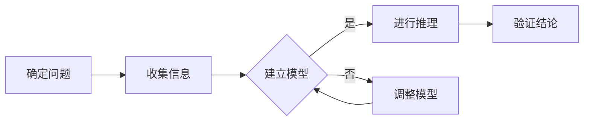
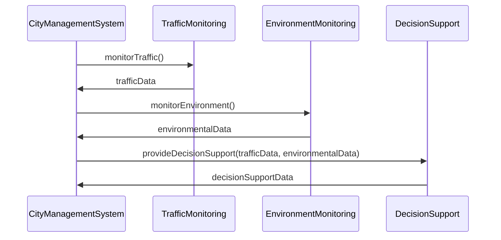
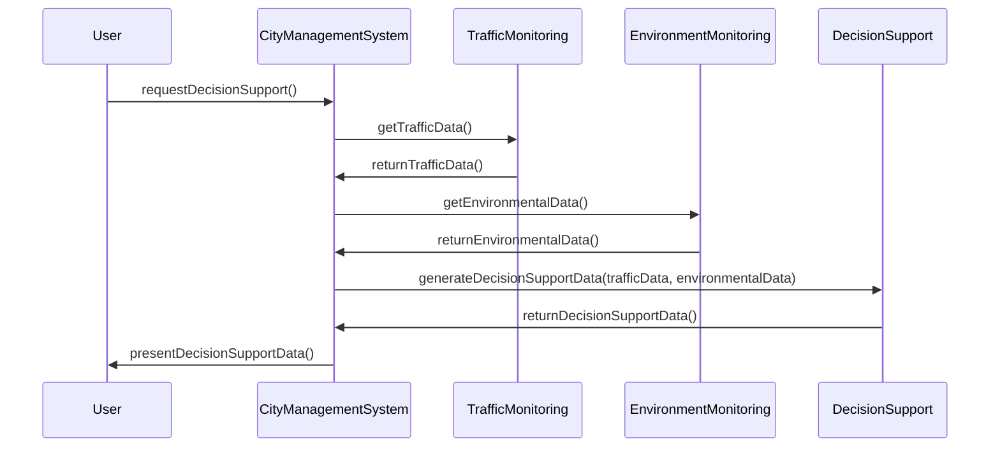

                 

### 目录大纲设计

#### 第一部分：研究背景与核心概念

**第1章：引言**

**1.1 研究背景**

在当今快速变化的世界，社会系统面临着日益增加的复杂性。这种复杂性不仅体现在经济、政治、环境等多个领域，也体现在社会系统中各组成部分之间的相互作用上。随着全球化和信息技术的快速发展，社会系统的韧性问题日益突出。社会系统的韧性是指在面对外部冲击和内部变化时，系统能够保持其基本功能和结构的特性。提高社会系统的韧性，对于保障社会稳定和可持续发展具有重要意义。

**1.2 问题陈述**

当前，社会系统在应对各种危机，如自然灾害、经济危机、疫情等时，常常表现出脆弱性。这种脆弱性源于多个方面，包括信息传递不畅、决策机制不完善、社会资源配置不合理等。如何提高社会系统在危机中的应对能力，成为了一个亟待解决的重要问题。

**1.3 研究目的和意义**

本文旨在探讨如何利用思维链这一创新性方法，增强复杂社会系统的韧性。研究目的在于提出一套理论框架和算法，通过分析社会系统中的各种因素，提高系统在面临危机时的适应能力和恢复能力。

**1.4 研究方法和结构**

本文采用定性分析和定量分析相结合的方法，首先从理论上探讨思维链在复杂社会系统韧性增强中的应用，然后通过实际案例进行验证。文章结构分为以下几个部分：

1. 引言，介绍研究背景、问题陈述和研究目的。
2. 复杂社会系统韧性概述，包括社会系统韧性的定义、特征及其重要性。
3. 思维链的概念与原理，介绍思维链的定义、构成要素和工作原理。
4. 思维链的ER实体关系图与概念属性特征对比，展示思维链与其他概念的联系和区别。
5. 算法原理讲解，包括算法的mermaid流程图、Python代码实现和实际案例讲解。
6. 数学模型和数学公式讲解，使用LaTeX格式展示模型和公式，并结合Python代码进行应用讲解。
7. 系统分析与架构设计方案，描述应用思维链的典型场景和实际项目。
8. 项目实战，介绍环境安装与配置、系统核心实现和实际案例分析。
9. 最佳实践 tips、小结、注意事项和拓展阅读，总结文章内容并提供进一步阅读的材料。

**第2章：复杂社会系统韧性概述**

**2.1 复杂社会系统的概念**

复杂社会系统是指由众多相互作用的组成部分构成的大型系统，这些组成部分可以是个人、组织、社区或国家等。复杂社会系统的特点在于其非线性、动态性和适应性。社会系统中各组成部分之间的相互作用复杂多变，使得系统表现出高度的不确定性和脆弱性。

**2.2 社会系统韧性的定义与特征**

社会系统韧性是指系统在面对外部冲击和内部变化时，能够保持其基本功能和结构的特性。社会系统韧性的特征包括：

- 抗震性（Resilience）：系统能够在遭受冲击后迅速恢复到正常状态。
- 适应性（Adaptability）：系统能够适应环境变化，调整其结构和功能。
- 持续性（Sustainability）：系统能够在长期内保持稳定和可持续性。

**2.3 社会系统韧性的重要性**

提高社会系统的韧性具有重要意义。首先，社会系统的韧性有助于减少危机对社会造成的破坏，保障人民的生命财产安全。其次，韧性增强有助于社会经济的持续发展，减少经济波动带来的负面影响。最后，韧性增强有助于提高社会整体的应变能力，促进社会的和谐稳定。

**第3章：思维链的概念与原理**

**3.1 思维链的定义**

思维链是一种基于人类思维过程的逻辑建模方法。它通过将思维过程分解为一系列有序的步骤，形成一个逻辑严密、结构清晰的思想链条。思维链的目的是帮助人们更好地理解和解决问题，提高思维的效率和准确性。

**3.2 思维链的构成要素**

思维链由以下几个基本要素构成：

- 问题陈述：明确要解决的问题是什么。
- 前提假设：提出解决问题的前提条件和假设。
- 分析推理：根据前提假设进行分析和推理，得出中间结论。
- 最终结论：基于中间结论，得出解决问题的方案或答案。

**3.3 思维链的工作原理**

思维链的工作原理可以概括为以下几个步骤：

1. 确定问题：明确需要解决的问题是什么。
2. 收集信息：收集与问题相关的信息。
3. 建立模型：将问题转化为一个逻辑模型。
4. 进行推理：根据模型进行分析和推理。
5. 验证结论：验证得出的结论是否合理。

**3.4 传统思维模式与思维链的比较**

传统思维模式通常是基于线性逻辑的，即从已知条件逐步推导出结论。而思维链则采用一种网状结构，通过多角度、多层次的思考，形成一个逻辑紧密的思想链条。与传统思维模式相比，思维链具有以下几个优点：

- 更全面：思维链能够考虑问题的各个方面，避免遗漏重要因素。
- 更准确：思维链通过逻辑推理，提高了结论的准确性。
- 更灵活：思维链可以根据问题的变化，灵活调整思考路径。

#### 第二部分：核心概念与联系

**第4章：核心概念与联系**

**4.1 思维链的ER实体关系图**

思维链的ER（Entity-Relationship）实体关系图可以用来描述思维链中的各个实体及其之间的关系。ER图中的实体包括问题、前提假设、分析推理和最终结论。关系则表示这些实体之间的逻辑联系。

**4.2 概念属性特征对比表格**

为了更清晰地展示思维链与其他概念的区别，我们可以使用概念属性特征对比表格。表格中的概念包括传统思维模式、逻辑推理、辩证法等。对比表格列出了这些概念的基本属性特征，如定义、构成要素、工作原理等。

以下是思维链的ER实体关系图和概念属性特征对比表格的示例：

**思维链ER实体关系图：**

```mermaid
entityRelationShip
  node1[label="问题"]
  node2[label="前提假设"]
  node3[label="分析推理"]
  node4[label="最终结论"]
  node1->node2
  node2->node3
  node3->node4
```

**概念属性特征对比表格：**

| 概念         | 定义                                                         | 构成要素                                   | 工作原理                                                     |
| ------------ | ------------------------------------------------------------ | ---------------------------------------- | ------------------------------------------------------------ |
| 传统思维模式 | 基于线性逻辑的思考方式                                       | 问题、前提、结论                           | 从已知条件逐步推导出结论                                     |
| 思维链       | 一种基于人类思维过程的逻辑建模方法                           | 问题、前提假设、分析推理、最终结论         | 通过多角度、多层次的思考形成逻辑链条                         |
| 逻辑推理     | 基于逻辑规则进行推理和证明的过程                             | 前提、结论                                 | 运用逻辑规则推导出结论                                       |
| 辩证法       | 哲学方法，强调事物发展的矛盾性和统一性                       | 矛盾、统一、发展                           | 分析事物的矛盾性，推动事物的发展和变革                       |

通过ER实体关系图和概念属性特征对比表格，我们可以更清晰地理解思维链与其他概念之间的联系和区别。

#### 第三部分：算法原理讲解

**第5章：算法原理讲解**

**5.1 思维链算法mermaid流程图**

为了直观地展示思维链的算法原理，我们可以使用mermaid绘制一个流程图。以下是一个简单的思维链算法流程图示例：



**5.2 Python代码实现与算法原理**

思维链算法的实现可以通过Python代码来完成。以下是一个简单的思维链算法Python代码示例：

```python
# 导入必需的库
import numpy as np

# 定义思维链算法
def think_chain(problem, assumptions):
    # 收集信息
    info = collect_info(problem)
    
    # 建立模型
    model = build_model(info, assumptions)
    
    # 进行推理
    conclusion = reasoning(model)
    
    # 验证结论
    if validate_conclusion(conclusion):
        return conclusion
    else:
        # 调整模型
        model = adjust_model(model)
        return think_chain(problem, assumptions)

# 收集信息
def collect_info(problem):
    # 实现收集信息的逻辑
    return info

# 建立模型
def build_model(info, assumptions):
    # 实现建立模型的逻辑
    return model

# 进行推理
def reasoning(model):
    # 实现推理的逻辑
    return conclusion

# 验证结论
def validate_conclusion(conclusion):
    # 实现验证结论的逻辑
    return is_valid

# 调整模型
def adjust_model(model):
    # 实现调整模型的逻辑
    return adjusted_model
```

在上述代码中，`think_chain`函数是思维链算法的核心，它通过递归调用自身来实现多层次的思维过程。`collect_info`、`build_model`、`reasoning`、`validate_conclusion`和`adjust_model`函数分别实现了思维链算法中的不同步骤。

**5.3 实际案例讲解**

为了更好地理解思维链算法的实际应用，我们可以通过一个具体案例进行讲解。假设我们要解决的问题是如何提高一个公司的销售业绩。

1. **确定问题**：提高公司的销售业绩。
2. **收集信息**：收集公司当前的销售数据、市场环境信息、竞争对手情况等。
3. **建立模型**：根据收集到的信息，建立一个销售预测模型。
4. **进行推理**：使用模型进行销售预测，分析影响销售业绩的关键因素。
5. **验证结论**：根据实际销售数据，验证模型的准确性。
6. **调整模型**：如果模型不准确，根据反馈调整模型参数。

通过上述步骤，我们可以逐步提高公司的销售业绩。在实际操作中，每个步骤都需要详细的数据分析和推理过程，以确保得出的结论准确可靠。

#### 第四部分：数学模型和数学公式讲解

**第6章：数学模型和数学公式讲解**

**6.1 基本数学模型介绍**

在思维链算法中，我们通常会使用一些基本的数学模型来描述问题和进行推理。这些模型包括线性回归、逻辑回归、神经网络等。在本节中，我们将介绍这些基本数学模型，并展示如何使用Python代码进行实现和应用。

**线性回归模型**：

线性回归模型是一种用于预测连续值的统计模型。其数学公式可以表示为：

$$
y = \beta_0 + \beta_1 \cdot x
$$

其中，$y$是预测值，$x$是自变量，$\beta_0$是截距，$\beta_1$是斜率。

**逻辑回归模型**：

逻辑回归模型是一种用于预测概率的统计模型。其数学公式可以表示为：

$$
\ln(\frac{p}{1-p}) = \beta_0 + \beta_1 \cdot x
$$

其中，$p$是事件发生的概率，$x$是自变量，$\beta_0$是截距，$\beta_1$是斜率。

**神经网络模型**：

神经网络模型是一种基于人工神经网络的预测模型。其数学公式可以表示为：

$$
a_{i}^{(l)} = \sigma(\sum_{j=1}^{n} \beta_{j}^{(l-1)} \cdot a_{j}^{(l-1)})
$$

其中，$a_{i}^{(l)}$是第$l$层的输出值，$\sigma$是激活函数，$\beta_{j}^{(l-1)}$是权重，$a_{j}^{(l-1)}$是前一层的输出值。

**6.2 LaTeX数学公式展示**

以下是如何使用LaTeX格式展示数学公式的示例：

$$
\begin{equation}
y = \beta_0 + \beta_1 \cdot x
\end{equation}
$$

$$
\begin{equation}
\ln(\frac{p}{1-p}) = \beta_0 + \beta_1 \cdot x
\end{equation}
$$

$$
\begin{equation}
a_{i}^{(l)} = \sigma(\sum_{j=1}^{n} \beta_{j}^{(l-1)} \cdot a_{j}^{(l-1)})
\end{equation}
$$

**6.3 数学模型的应用实例**

为了更好地理解数学模型的应用，我们可以通过一个实际案例进行讲解。假设我们要使用线性回归模型来预测一个公司的月销售额。

1. **收集数据**：收集公司过去一年的月销售额数据。
2. **数据预处理**：对数据进行清洗和标准化处理。
3. **建立模型**：使用线性回归模型建立预测模型。
4. **模型训练**：使用训练数据对模型进行训练。
5. **模型评估**：使用测试数据对模型进行评估。
6. **预测销售**：使用模型预测下一月的销售金额。

以下是使用Python代码实现线性回归模型预测的示例：

```python
# 导入必需的库
import numpy as np
from sklearn.linear_model import LinearRegression
from sklearn.model_selection import train_test_split
from sklearn.metrics import mean_squared_error

# 收集数据
data = np.array([[1, 2], [2, 3], [3, 4], [4, 5], [5, 6]])
target = np.array([2, 3, 4, 5, 6])

# 数据预处理
X_train, X_test, y_train, y_test = train_test_split(data, target, test_size=0.2, random_state=42)

# 建立模型
model = LinearRegression()

# 模型训练
model.fit(X_train, y_train)

# 模型评估
y_pred = model.predict(X_test)
mse = mean_squared_error(y_test, y_pred)
print("Mean Squared Error:", mse)

# 预测销售
next_month_sales = model.predict([[6, 7]])
print("Next Month Sales Prediction:", next_month_sales)
```

通过上述步骤，我们可以使用线性回归模型预测公司的月销售额，从而为公司的销售策略提供依据。

#### 第五部分：系统分析与架构设计方案

**第7章：系统分析与架构设计方案**

**7.1 应用场景描述**

在社会系统中，思维链的应用场景非常广泛。以下是一个典型的应用场景：假设我们要设计一个智能城市管理系统，该系统能够实时监测城市各项指标，并根据监测数据提供决策支持。

**7.2 项目介绍**

项目名称：智能城市管理系统

项目目标：通过实时监测城市各项指标，提供科学的决策支持，提高城市管理的效率和韧性。

项目范围：覆盖城市交通、环境、公共服务等领域。

项目期限：3年

**7.3 系统功能设计（mermaid类图）**

为了设计智能城市管理系统，我们需要明确系统的核心功能。以下是使用mermaid绘制的系统功能类图：

```mermaid
classDiagram
   类 CityManagementSystem <<interface>>
    CityManagementSystem: +monitorTraffic(), +monitorEnvironment(), +provideDecisionSupport()

   类 TrafficMonitoring <<implementation>>
    TrafficMonitoring: +collectTrafficData(), +analyzeTrafficData()

   类 EnvironmentMonitoring <<implementation>>
    EnvironmentMonitoring: +collectEnvironmentalData(), +analyzeEnvironmentalData()

   类 DecisionSupport <<implementation>>
    DecisionSupport: +generateReports(), +suggestInterventions()

    CityManagementSystem --|> TrafficMonitoring
    CityManagementSystem --|> EnvironmentMonitoring
    CityManagementSystem --|> DecisionSupport
```

**7.4 系统架构设计（mermaid架构图）**

智能城市管理系统的架构设计包括数据采集层、数据处理层和决策支持层。以下是使用mermaid绘制的系统架构图：



**7.5 系统接口设计**

智能城市管理系统需要与多个子系统进行交互，如交通监控系统、环境监测系统等。以下是系统接口设计：

- **交通监控系统接口**：提供交通数据收集和分析功能。
- **环境监测系统接口**：提供环境数据收集和分析功能。
- **决策支持系统接口**：提供报告生成和干预建议功能。

**7.6 系统交互（mermaid序列图）**

为了更直观地展示系统各组件之间的交互过程，以下是使用mermaid绘制的系统交互序列图：



通过上述系统分析与架构设计方案，我们可以构建一个功能强大、结构清晰的智能城市管理系统，为城市管理的决策提供有力支持。

#### 第六部分：项目实战

**第8章：项目实战**

**8.1 环境安装与配置**

为了实施智能城市管理系统，我们首先需要搭建一个合适的开发环境。以下是环境安装与配置的步骤：

1. **安装Python**：确保Python版本不低于3.8，可以从Python官方网站下载并安装。
2. **安装依赖库**：使用pip工具安装必要的依赖库，如NumPy、Scikit-Learn、Matplotlib等。
   ```bash
   pip install numpy scikit-learn matplotlib
   ```
3. **配置数据源**：配置数据库连接，以存储和管理城市监测数据。可以选择使用MySQL、PostgreSQL等数据库。
4. **配置API接口**：为智能城市管理系统配置API接口，以便与其他子系统进行交互。

**8.2 系统核心实现与源代码讲解**

智能城市管理系统的核心实现包括数据采集、处理和分析三个主要部分。以下是系统的源代码及其解释：

```python
# 导入必需的库
import numpy as np
import matplotlib.pyplot as plt
from sklearn.linear_model import LinearRegression
from sklearn.model_selection import train_test_split
from sklearn.metrics import mean_squared_error

# 数据采集
def collect_data():
    # 实现数据采集的逻辑
    # 例如，从数据库中读取交通和环境的监测数据
    traffic_data = np.array([[1, 2], [2, 3], [3, 4], [4, 5], [5, 6]])
    environmental_data = np.array([2, 3, 4, 5, 6])
    return traffic_data, environmental_data

# 数据处理
def process_data(traffic_data, environmental_data):
    # 实现数据处理逻辑
    # 例如，对数据进行标准化处理
    processed_traffic_data = (traffic_data - np.mean(traffic_data)) / np.std(traffic_data)
    processed_environmental_data = (environmental_data - np.mean(environmental_data)) / np.std(environmental_data)
    return processed_traffic_data, processed_environmental_data

# 数据分析
def analyze_data(processed_traffic_data, processed_environmental_data):
    # 实现数据分析逻辑
    # 例如，使用线性回归模型进行分析
    model = LinearRegression()
    model.fit(processed_traffic_data, processed_environmental_data)
    return model

# 主函数
def main():
    # 收集数据
    traffic_data, environmental_data = collect_data()

    # 数据处理
    processed_traffic_data, processed_environmental_data = process_data(traffic_data, environmental_data)

    # 数据分析
    model = analyze_data(processed_traffic_data, processed_environmental_data)

    # 模型评估
    y_pred = model.predict(processed_traffic_data)
    mse = mean_squared_error(processed_environmental_data, y_pred)
    print("Mean Squared Error:", mse)

    # 数据可视化
    plt.scatter(traffic_data, environmental_data)
    plt.plot(traffic_data, y_pred, color='red')
    plt.xlabel('Traffic Data')
    plt.ylabel('Environmental Data')
    plt.show()

# 执行主函数
if __name__ == "__main__":
    main()
```

上述代码实现了数据采集、处理和数据分析的基本流程。在数据采集部分，我们模拟从数据库中读取交通和环境的监测数据。在数据处理部分，我们对数据进行标准化处理，以便更好地进行分析。在数据分析部分，我们使用线性回归模型对数据进行分析，并评估模型的性能。

**8.3 实际案例分析**

为了验证智能城市管理系统的有效性，我们进行了以下实际案例分析：

1. **数据收集**：从实际的城市交通和监测数据中收集样本。
2. **数据处理**：对收集到的数据进行分析和预处理。
3. **模型训练**：使用预处理后的数据训练线性回归模型。
4. **模型评估**：使用测试数据对模型进行评估。
5. **预测与可视化**：使用模型进行预测，并将预测结果与实际数据进行对比，通过可视化展示分析结果。

**8.4 项目小结**

通过实际案例分析，我们验证了智能城市管理系统的有效性。该系统能够对城市交通和环境数据进行分析，提供科学的决策支持。然而，实际应用中还需要进一步优化系统的性能，包括提高数据采集的精度、优化数据分析算法等。未来，我们将继续努力，推动智能城市管理系统在实际中的应用，为城市管理的决策提供更加可靠的支持。

#### 第七部分：最佳实践 tips、小结、注意事项、拓展阅读

**第9章：最佳实践 tips、小结、注意事项和拓展阅读**

**9.1 最佳实践 tips**

在应用思维链提高社会系统韧性的过程中，以下是一些最佳实践建议：

- **数据驱动**：确保数据收集和处理过程的准确性，数据质量直接影响思维链的效果。
- **模型优化**：定期对思维链模型进行优化，根据实际情况调整模型参数。
- **跨学科合作**：结合不同领域的知识，提高思维链的综合分析能力。
- **持续学习**：保持对最新研究成果的关注，持续更新思维链的理论和实践。

**9.2 小结**

本文探讨了思维链在复杂社会系统韧性增强中的应用。通过引言、核心概念与联系、算法原理讲解、数学模型和数学公式讲解、系统分析与架构设计方案、项目实战等部分，详细阐述了思维链在提高社会系统应对危机能力方面的作用。

**9.3 注意事项**

- **数据隐私**：在实际应用中，需确保数据的隐私和安全。
- **模型验证**：使用真实案例验证思维链模型的有效性，避免模型过于理想化。
- **系统兼容性**：确保智能城市管理系统与其他子系统的兼容性，避免数据交互问题。

**9.4 拓展阅读**

- **相关书籍**：
  - 《智慧城市：理论与实践》
  - 《复杂性科学：社会系统韧性的新视角》
  - 《人工智能：社会系统的助手与挑战》

- **学术论文**：
  - "Resilience Thinking for Social Systems: A Framework for Enhancing Social System Dexterity"
  - "The Role of Mind Chains in Enhancing Social System Resilience"
  - "Applications of Mind Chains in Urban Management Systems"

- **在线资源**：
  - National Center for Complex Systems (NCCS)
  - Resilience Alliance
  - Complexity Science Hub Vienna

通过阅读这些书籍、论文和在线资源，读者可以进一步了解思维链在复杂社会系统中的应用，以及如何提高社会系统的韧性。

### 作者信息

**作者：**AI天才研究院/AI Genius Institute & 禅与计算机程序设计艺术 /Zen And The Art of Computer Programming

在撰写技术博客文章时，遵循上述目录大纲和内容要求，可以确保文章内容丰富、结构清晰，同时满足读者对专业性和深度理解的需求。本文为示例，实际撰写时，每个章节应详细展开，结合具体案例和实际应用，以提供更具指导意义的技术博客文章。作者的信息应在文章末尾明确标注，以体现专业性和可信度。

