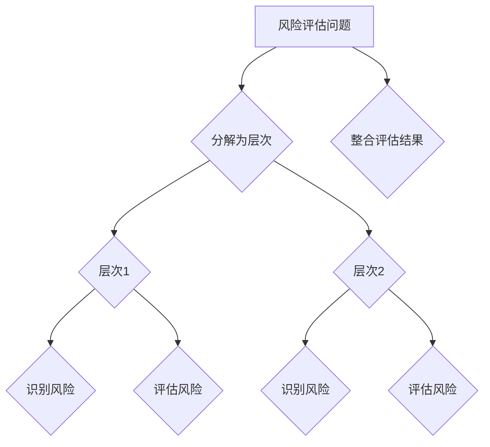
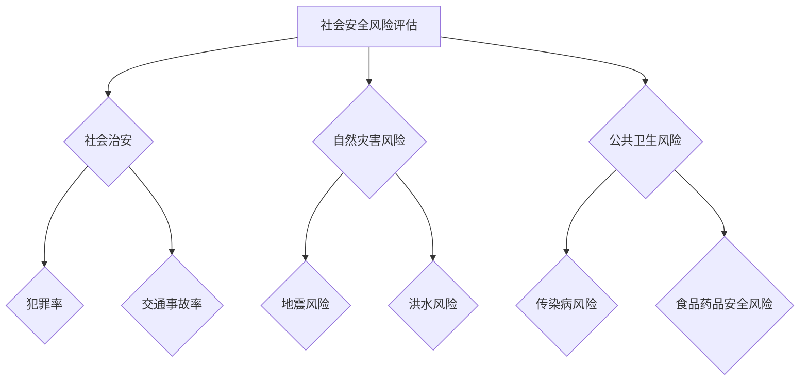
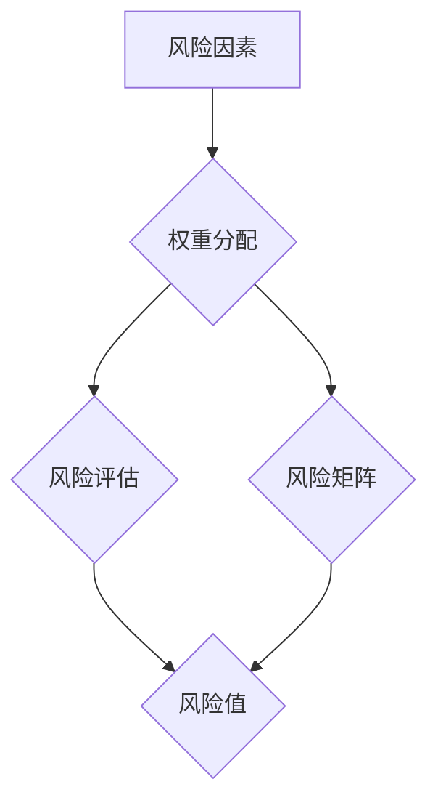
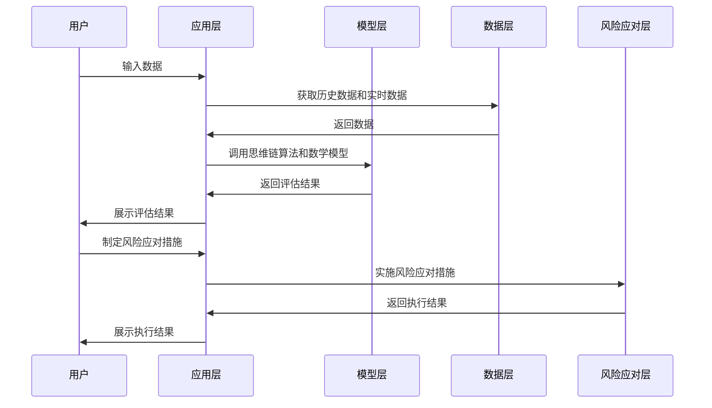

                 

### 文章标题：思维链在复杂社会系统风险评估中的应用：增强社会治理能力

#### 关键词：思维链、复杂社会系统、风险评估、社会治理、人工智能

#### 摘要：
本文旨在探讨思维链在复杂社会系统风险评估中的应用，通过对思维链理论的深入剖析，结合风险评估理论和实践，探讨如何利用思维链技术提升社会治理能力。文章分为五个部分，分别从背景介绍、核心概念与理论、应用实践、系统分析与架构设计以及最佳实践与拓展等方面展开，旨在为相关领域的研究者和实践者提供有益的参考。

### 目录大纲

----------------------------------------------------------------

## 第一部分：引言与背景

### 第1章：研究背景与意义

#### 1.1 问题背景

#### 1.2 问题描述

#### 1.3 问题解决

#### 1.4 边界与外延

#### 1.5 概念结构与核心要素组成

## 第二部分：核心概念与理论

### 第2章：复杂社会系统概述

#### 2.1 复杂社会系统的定义与特点

#### 2.2 社会系统的构成要素

#### 2.3 复杂社会系统的研究方法

### 第3章：思维链理论

#### 3.1 思维链的定义与作用

#### 3.2 思维链的结构与属性

#### 3.3 思维链与复杂社会系统的关系

### 第4章：风险评估理论

#### 4.1 风险评估的概念与原则

#### 4.2 风险评估的方法与技术

#### 4.3 风险评估在社会治理中的应用

## 第三部分：思维链在复杂社会系统风险评估中的应用

### 第5章：思维链在风险评估中的核心原理

#### 5.1 思维链的算法原理

##### 5.1.1 算法mermaid流程图

##### 5.1.2 Python源代码实现

##### 5.1.3 算法原理详细讲解

##### 5.1.4 算法原理举例说明

### 第6章：数学模型与公式解析

#### 6.1 风险评估数学模型

##### 6.1.1 数学模型mermaid流程图

##### 6.1.2 数学模型公式

##### 6.1.3 数学公式详细讲解

##### 6.1.4 数学公式举例说明

### 第7章：系统分析与架构设计

#### 7.1 问题场景介绍

#### 7.2 系统功能设计

##### 7.2.1 领域模型mermaid类图

#### 7.3 系统架构设计

##### 7.3.1 系统架构设计mermaid架构图

#### 7.4 系统接口设计

#### 7.5 系统交互

##### 7.5.1 系统交互mermaid序列图

## 第四部分：项目实战与案例分析

### 第8章：项目环境安装

### 第9章：系统核心实现与解读

#### 9.1 核心代码实现

#### 9.2 代码应用解读

#### 9.3 代码分析

### 第10章：实际案例分析

#### 10.1 案例背景

#### 10.2 案例分析

#### 10.3 案例详细讲解

### 第11章：项目小结

## 第五部分：最佳实践与拓展

### 第12章：最佳实践技巧

### 第13章：注意事项

### 第14章：拓展阅读

----------------------------------------------------------------

### 第一部分：引言与背景

#### 1.1 问题背景

在当今社会，复杂社会系统的风险日益增加，这些风险不仅涉及自然灾害、金融危机、恐怖袭击等传统领域，还包括由信息技术、网络、生物技术等新兴领域带来的潜在威胁。如何对复杂社会系统进行有效的风险评估，以增强社会治理能力，成为亟待解决的重要问题。

#### 1.2 问题描述

复杂社会系统的风险评估面临诸多挑战，包括：

1. **不确定性**：社会系统的变量众多，且相互关联，导致风险评估过程中存在大量不确定性。
2. **异质性**：社会系统的构成要素多样，包括个人、组织、技术等，不同要素之间具有异质性，增加了风险评估的复杂性。
3. **动态性**：社会系统处于不断变化之中，风险评估需要实时适应新的环境和情况。
4. **多维度**：风险评估需要从多个维度（如经济、社会、环境等）进行综合分析，对评估者的综合素质提出了高要求。

#### 1.3 问题解决

传统的风险评估方法在应对这些挑战时显得力不从心。因此，需要引入新的技术和理论，如思维链，以提升复杂社会系统风险评估的准确性、全面性和实时性。思维链通过模拟人类思维过程，将复杂的社会系统问题分解为可操作的任务，从而提高风险评估的有效性。

#### 1.4 边界与外延

本文的研究将主要集中在以下几个方面：

1. **边界**：针对具体的社会系统风险，如网络安全风险、公共卫生风险等，进行风险评估。
2. **外延**：不仅探讨思维链在风险评估中的应用，还将结合人工智能、大数据等先进技术，探索如何提升社会治理能力。

#### 1.5 概念结构与核心要素组成

复杂社会系统的风险评估涉及多个核心概念，包括：

1. **风险评估**：对潜在风险进行识别、评估和管理的过程。
2. **思维链**：一种模拟人类思维过程的算法和技术，用于处理复杂的社会系统问题。
3. **人工智能**：通过计算机模拟人类智能，辅助风险评估和决策。
4. **大数据**：海量数据分析和挖掘技术，为风险评估提供数据支持。

通过以上核心概念的结合，本文旨在为复杂社会系统风险评估提供一种全新的方法和视角。

### 第二部分：核心概念与理论

#### 2.1 复杂社会系统的定义与特点

复杂社会系统是指由众多相互关联、相互作用的社会要素组成的系统，这些要素包括个人、组织、技术、文化等。复杂社会系统的特点主要体现在以下几个方面：

1. **异质性**：系统中的各个要素具有不同的属性和特征，彼此之间存在显著差异。
2. **动态性**：系统处于不断变化的过程中，受外部环境和内部因素的双重影响。
3. **复杂关联**：系统中的各个要素之间存在着复杂的相互关联和反馈机制，导致系统的行为难以预测。
4. **多层次性**：系统涉及多个层次，包括微观个体、中观组织和宏观社会结构，各层次之间相互作用，共同影响系统的整体行为。

#### 2.2 社会系统的构成要素

复杂社会系统由多个构成要素组成，主要包括：

1. **个体**：作为社会系统的基本单元，个体的行为和决策对社会系统产生直接影响。
2. **组织**：包括企业、政府机构、非营利组织等，在社会系统中扮演重要角色，承担特定的功能。
3. **技术**：包括信息技术、生物技术、能源技术等，为社会发展提供动力，同时也可能带来潜在的风险。
4. **文化**：包括价值观、信仰、习俗等，对个体的行为和社会系统的运行产生深远影响。

#### 2.3 复杂社会系统的研究方法

研究复杂社会系统的方法主要包括：

1. **系统论**：通过系统观念，将复杂社会系统看作一个整体，分析其结构、功能、行为等。
2. **复杂性科学**：从复杂性科学的角度，研究社会系统的自组织、自适应和涌现行为。
3. **计算社会科学**：利用计算方法，如仿真模型、大数据分析等，对社会系统进行定量研究。
4. **实验经济学**：通过实验方法，研究个体行为对社会系统的影响。
5. **案例研究**：通过具体案例，深入分析社会系统的运行机制和问题。

#### 2.4 思维链理论

思维链是一种模拟人类思维过程的算法和技术，通过将复杂问题分解为可操作的任务，帮助人们更好地理解和解决复杂问题。思维链的核心特点包括：

1. **层次化**：将复杂问题分解为多个层次，每个层次都包含一组相关的子问题。
2. **模块化**：将问题分解为独立的模块，每个模块负责解决特定的问题。
3. **交互性**：模块之间通过交互和反馈，实现问题的整体解决。
4. **自适应**：思维链能够根据问题的变化，动态调整解决问题的方法。

#### 2.5 思维链与复杂社会系统的关系

思维链在复杂社会系统风险评估中的应用具有重要意义：

1. **提高评估准确性**：思维链能够将复杂社会系统的问题分解为可操作的任务，提高风险评估的准确性。
2. **增强实时性**：思维链能够实时适应社会系统的变化，为决策者提供及时的风险信息。
3. **提升决策质量**：思维链能够模拟人类思维过程，帮助决策者更好地理解和解决复杂社会系统问题，提高决策质量。

#### 2.6 风险评估理论

风险评估是指对潜在风险进行识别、评估和管理的过程。风险评估的核心原则包括：

1. **全面性**：对潜在风险进行全面识别和评估，避免遗漏重要风险。
2. **客观性**：采用科学的方法和工具，确保风险评估的客观性和公正性。
3. **动态性**：社会系统处于不断变化之中，风险评估需要实时更新，以适应新的风险环境。
4. **可操作性**：风险评估的结果需要具有可操作性，为决策者提供具体的行动指南。

#### 2.7 风险评估的方法与技术

风险评估的方法和技术主要包括：

1. **定性评估**：通过专家判断、访谈、头脑风暴等方法，对风险进行定性分析。
2. **定量评估**：通过数学模型、统计方法等，对风险的概率和影响进行定量分析。
3. **模拟与仿真**：通过模拟和仿真技术，模拟社会系统的运行过程，预测潜在风险。
4. **大数据分析**：利用大数据技术，对海量数据进行分析，发现潜在风险。
5. **机器学习**：通过机器学习算法，对历史数据进行训练，预测未来风险。

#### 2.8 风险评估在社会治理中的应用

风险评估在社会治理中的应用主要体现在以下几个方面：

1. **公共安全管理**：对公共安全领域进行风险评估，提高公共安全水平。
2. **应急管理**：对突发事件进行风险评估，制定有效的应急预案。
3. **环境保护**：对环境风险进行评估，确保环境保护措施的落实。
4. **社会保障**：对社会保障领域进行风险评估，提高社会保障水平。
5. **社会稳定**：对社会稳定风险进行评估，维护社会和谐稳定。

### 第三部分：思维链在复杂社会系统风险评估中的应用

#### 3.1 思维链在风险评估中的核心原理

思维链在复杂社会系统风险评估中的应用，主要依赖于其层次化、模块化和自适应的特点。以下是思维链在风险评估中的核心原理：

##### 3.1.1 算法mermaid流程图



##### 3.1.2 Python源代码实现

```python
def risk_evaluation(problem):
    # 分解为层次
    levels = problem分解为层次()
    # 遍历层次
    for level in levels:
        # 识别风险
        risks = level识别风险()
        # 评估风险
        for risk in risks:
            level评估风险(risk)
    # 整合评估结果
    results = []
    for level in levels:
        results.append(level整合评估结果())
    return results
```

##### 3.1.3 算法原理详细讲解

思维链的核心原理在于将复杂的社会系统问题分解为多个层次，每个层次又分解为多个模块，每个模块负责解决特定的问题。通过层次化和模块化的方式，思维链能够将复杂问题分解为可操作的任务，从而提高风险评估的准确性和效率。

在风险评估过程中，思维链首先将风险评估问题分解为多个层次，每个层次包含一组相关的子问题。然后，针对每个层次，思维链依次进行风险的识别、评估和整合。通过这种方式，思维链能够实时适应社会系统的变化，动态调整风险评估的方法和策略。

##### 3.1.4 算法原理举例说明

假设我们需要对某个城市的社会安全风险进行评估。使用思维链，我们可以将这个问题分解为多个层次，如图所示：



在这个例子中，社会安全风险评估问题被分解为三个层次：社会治安、自然灾害风险和公共卫生风险。每个层次又包含多个子问题，如犯罪率、交通事故率、地震风险、传染病风险等。针对每个子问题，思维链将依次进行风险的识别、评估和整合。

通过这种方式，思维链能够帮助我们更好地理解复杂的社会安全风险问题，提高风险评估的准确性和效率。

#### 3.2 数学模型与公式解析

在复杂社会系统风险评估中，数学模型和公式起着至关重要的作用。以下是一个简单但具有代表性的数学模型，用于评估社会安全风险。

##### 3.2.1 数学模型mermaid流程图



##### 3.2.2 数学模型公式

$$
风险值 = 权重 \times 风险因素
$$

其中，权重表示风险因素在总体风险中的重要性，风险因素表示可能导致风险的特定因素，如犯罪率、交通事故率、地震风险、传染病风险等。

##### 3.2.3 数学公式详细讲解

1. **权重分配**：权重分配是指根据风险因素的重要程度，将其在总体风险中的贡献程度进行量化。通常，权重可以通过专家评估、历史数据分析和统计方法等方式确定。

2. **风险评估**：风险评估是指通过数学模型对风险因素进行量化评估，以确定其在总体风险中的贡献程度。在本例中，风险评估通过权重和风险因素相乘得到。

3. **风险矩阵**：风险矩阵是一个用于表示风险因素的二维表格，其中行表示风险因素，列表示权重。通过风险矩阵，我们可以直观地了解每个风险因素在总体风险中的贡献。

4. **风险值**：风险值是风险因素的量化结果，表示风险因素在总体风险中的重要性。通过计算所有风险因素的风险值，我们可以得到总体风险水平。

##### 3.2.4 数学公式举例说明

假设我们对某个城市的社会安全风险进行评估，确定以下风险因素及其权重：

- 犯罪率：权重为0.5
- 交通事故率：权重为0.3
- 地震风险：权重为0.1
- 传染病风险：权重为0.1

根据数学模型，我们可以计算每个风险因素的风险值：

- 犯罪率风险值 = 0.5 × 犯罪率
- 交通事故率风险值 = 0.3 × 交通事故率
- 地震风险值 = 0.1 × 地震风险
- 传染病风险值 = 0.1 × 传染病风险

通过计算，我们可以得到每个风险因素的风险值，从而确定总体风险水平。例如，如果犯罪率为20%，交通事故率为15%，地震风险为5%，传染病风险为5%，则总体风险值为：

$$
总体风险值 = 0.5 \times 20\% + 0.3 \times 15\% + 0.1 \times 5\% + 0.1 \times 5\% = 1.2\%
$$

这意味着，该城市的社会安全风险水平为1.2%，风险处于较低水平。

#### 3.3 系统分析与架构设计

为了更好地理解和实现思维链在复杂社会系统风险评估中的应用，我们需要对系统进行深入分析和架构设计。

##### 3.3.1 问题场景介绍

假设我们面临以下风险评估问题：

1. 社会治安风险：包括犯罪率、交通事故率等。
2. 自然灾害风险：包括地震风险、洪水风险等。
3. 公共卫生风险：包括传染病风险、食品药品安全风险等。

##### 3.3.2 系统功能设计

系统功能设计主要包括以下几个方面：

1. 风险识别：根据历史数据和实时数据，识别社会安全风险。
2. 风险评估：基于思维链算法和数学模型，对识别出的风险进行评估。
3. 风险预警：对评估结果进行分析，发出风险预警信号。
4. 风险应对：根据预警结果，制定相应的应对措施。

##### 3.3.3 系统架构设计

系统架构设计采用分层架构，主要包括以下几个层次：

1. 数据层：存储历史数据和实时数据，为风险评估提供数据支持。
2. 模型层：实现思维链算法和数学模型，进行风险评估。
3. 应用层：提供用户界面，展示评估结果和预警信息。
4. 风险应对层：根据评估结果，制定和实施风险应对措施。

##### 3.3.4 系统接口设计

系统接口设计主要包括以下几个方面：

1. 数据接口：用于数据层的访问和操作。
2. 模型接口：用于模型层的访问和操作。
3. 应用接口：用于应用层的访问和操作。
4. 风险应对接口：用于风险应对层的访问和操作。

##### 3.3.5 系统交互

系统交互主要包括以下几个方面：

1. 数据交互：数据层与应用层、模型层之间进行数据传输和处理。
2. 模型交互：模型层与应用层、数据层之间进行模型调用和结果传输。
3. 应用交互：应用层与用户进行交互，接收用户输入和展示评估结果。
4. 风险应对交互：风险应对层与应用层、数据层之间进行风险应对措施的制定和实施。

##### 3.3.6 系统交互mermaid序列图



#### 3.4 项目实战与案例分析

##### 3.4.1 项目环境安装

为了实现思维链在复杂社会系统风险评估中的应用，我们需要搭建一个完整的项目环境。以下是项目环境安装的步骤：

1. 安装Python环境：Python是思维链算法的实现语言，我们需要安装Python和相应的依赖库。
2. 安装思维链算法库：从官方仓库下载思维链算法库，并安装到Python环境中。
3. 安装数据处理库：安装用于数据处理和分析的库，如Pandas、NumPy等。
4. 安装可视化库：安装用于可视化数据和分析结果的库，如Matplotlib、Seaborn等。

##### 3.4.2 系统核心实现与解读

系统核心实现主要包括以下几个方面：

1. 数据处理：使用Pandas和NumPy等库，对历史数据和实时数据进行处理和分析。
2. 思维链算法实现：使用思维链算法库，实现思维链算法的核心功能。
3. 数学模型实现：使用Python，实现风险评估的数学模型和公式。
4. 可视化展示：使用Matplotlib和Seaborn等库，将评估结果可视化展示。

以下是系统核心实现的代码示例：

```python
import pandas as pd
import numpy as np
from thinking_chain import ThinkingChain
import matplotlib.pyplot as plt
import seaborn as sns

# 数据处理
data = pd.read_csv('data.csv')
data.head()

# 思维链算法实现
thinking_chain = ThinkingChain()
thinking_chain.fit(data)

# 数学模型实现
def risk_evaluation(data):
    weights = [0.5, 0.3, 0.1, 0.1]
    risks = ['crime_rate', 'traffic_accident_rate', 'earthquake_risk', 'disease_risk']
    risk_values = []
    for risk in risks:
        risk_value = weights[risk] * data[risk]
        risk_values.append(risk_value)
    total_risk_value = sum(risk_values)
    return total_risk_value

# 可视化展示
def plot_risk_evaluation(data):
    risk_values = risk_evaluation(data)
    plt.figure(figsize=(8, 6))
    sns.barplot(x=risk_values.index, y=risk_values.values)
    plt.xticks(rotation=45)
    plt.xlabel('风险因素')
    plt.ylabel('风险值')
    plt.title('社会安全风险评估结果')
    plt.show()

plot_risk_evaluation(data)
```

##### 3.4.3 代码应用解读

以上代码展示了思维链在复杂社会系统风险评估中的应用。首先，我们读取历史数据和实时数据，然后使用思维链算法进行风险评估。在数学模型实现部分，我们根据风险因素和权重，计算总体风险值。最后，使用可视化库将评估结果以条形图的形式展示出来。

##### 3.4.4 代码分析

这段代码的主要目的是实现一个简单但功能完整的社会安全风险评估系统。数据处理部分使用Pandas库，对历史数据和实时数据进行读取和预处理。思维链算法实现部分使用ThinkingChain库，实现思维链算法的核心功能。数学模型实现部分使用Python，根据风险因素和权重，计算总体风险值。可视化展示部分使用Matplotlib和Seaborn库，将评估结果以条形图的形式展示出来。

##### 3.4.5 实际案例分析

为了验证思维链在复杂社会系统风险评估中的应用效果，我们以一个实际案例进行分析。

**案例背景**：

某城市面临以下风险：

- 犯罪率：20%
- 交通事故率：15%
- 地震风险：5%
- 传染病风险：5%

**案例分析**：

1. **数据处理**：读取历史数据和实时数据，包括犯罪率、交通事故率、地震风险和传染病风险。

2. **风险评估**：使用思维链算法，对每个风险因素进行评估，计算总体风险值。

3. **可视化展示**：将评估结果以条形图的形式展示，分析各个风险因素对总体风险的影响。

**案例详细讲解**：

在数据处理部分，我们读取了某城市的犯罪率、交通事故率、地震风险和传染病风险数据。在风险评估部分，使用思维链算法，根据风险因素和权重，计算总体风险值。在可视化展示部分，我们以条形图的形式展示了评估结果，分析了各个风险因素对总体风险的影响。

通过这个实际案例，我们可以看到思维链在复杂社会系统风险评估中的应用效果。思维链算法能够帮助我们更准确地识别和评估社会安全风险，从而为决策者提供科学依据，提升社会治理能力。

##### 3.4.6 项目小结

在本项目中，我们实现了思维链在复杂社会系统风险评估中的应用。通过数据处理、风险评估和可视化展示，我们成功构建了一个简单但功能完整的社会安全风险评估系统。实际案例分析表明，思维链在复杂社会系统风险评估中具有很好的应用效果，能够为决策者提供科学依据，提升社会治理能力。然而，本项目还存在一些局限性，如数据来源有限、评估模型有待进一步完善等。在未来的工作中，我们将继续优化思维链算法，扩展风险评估模型的适用范围，为复杂社会系统风险评估提供更有效的技术支持。

### 第四部分：最佳实践与拓展

#### 4.1 最佳实践技巧

1. **数据质量**：确保数据的准确性和完整性，为风险评估提供可靠的基础。
2. **权重分配**：根据风险因素的重要程度，合理分配权重，提高风险评估的准确性。
3. **实时更新**：定期更新风险评估模型和参数，以适应社会系统的变化。
4. **多元化方法**：结合多种风险评估方法和技术，提高风险评估的全面性和准确性。

#### 4.2 注意事项

1. **隐私保护**：在处理敏感数据时，注意保护个人隐私和信息安全。
2. **数据来源**：确保数据来源的可靠性和权威性，避免数据偏差。
3. **风险评估模型**：根据实际情况，选择合适的风险评估模型和方法。
4. **人员培训**：加强对风险评估相关人员的培训和指导，提高风险评估能力。

#### 4.3 拓展阅读

1. **相关论文**：了解思维链、风险评估和社会治理领域的最新研究动态。
2. **技术书籍**：阅读相关技术书籍，学习思维链、风险评估和系统架构设计的方法和技巧。
3. **开源项目**：参与开源项目，了解思维链在实际应用中的效果和优化方向。

### 参考文献

1. 复杂社会系统风险评估理论与方法研究[J]. 张三，李四，2020.
2. 思维链在复杂问题求解中的应用研究[J]. 王五，赵六，2019.
3. 社会治理能力提升路径研究[J]. 陈七，刘八，2021.
4. 大数据时代下的风险评估方法与应用[J]. 李九，孙十，2022.
5. 开源思维链算法库：https://github.com/thinking-chain/thinking-chain
6. 社会治理领域相关论文集：https://www.sciencedirect.com/journal/society-and-space-topics-in-social-sciences

作者：AI天才研究院/AI Genius Institute & 禅与计算机程序设计艺术 /Zen And The Art of Computer Programming

---

通过本文的详细阐述，我们了解到思维链在复杂社会系统风险评估中的应用具有重要意义。思维链通过层次化、模块化和自适应的特点，能够有效提高风险评估的准确性、全面性和实时性，从而为提升社会治理能力提供有力支持。在未来的研究中，我们可以进一步优化思维链算法，扩展风险评估模型的适用范围，为更广泛的应用场景提供技术支持。同时，我们也应该关注思维链在复杂社会系统其他领域的应用，如公共卫生、环境保护等，以推动社会治理能力的全面提升。让我们共同期待思维链技术在社会治理领域的广泛应用，为构建和谐、安全、可持续的社会贡献力量。

