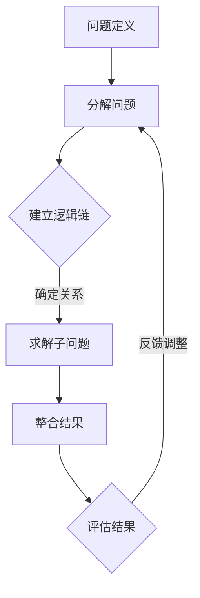
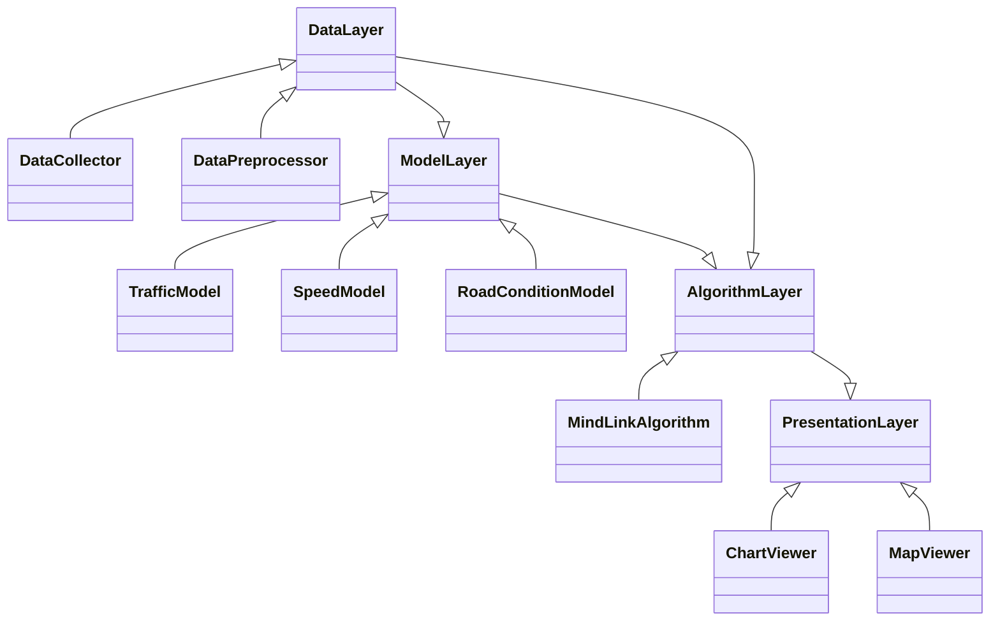
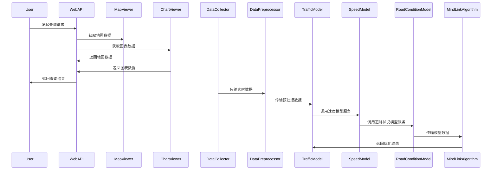

                 


### 背景介绍

#### 思维链的定义与重要性

思维链，作为一种先进的认知架构，其核心在于通过构建一系列逻辑紧密相连的思考步骤，来对复杂问题进行深入分析和解决。在复杂系统的优化过程中，思维链发挥着至关重要的作用。复杂系统通常包含大量的变量和相互依赖的关系，这些关系构成了一个高度非线性且动态变化的网络。传统的优化方法往往难以全面捕捉这些复杂关系，而思维链则提供了一种结构化的思考框架，使得系统能够在多样性和不确定性中找到最优解。

首先，我们需要明确思维链的基本概念。思维链是由一系列逻辑节点和连接线组成的网络，每个节点代表一个思考步骤，连接线则表示步骤之间的逻辑关系。通过这种结构化的方式，思维链能够帮助我们在复杂问题中建立清晰的思考路径，从而提高问题解决效率。

在复杂系统优化中的应用背景方面，随着互联网、大数据、人工智能等技术的发展，复杂系统的规模和复杂性不断增加。传统的优化方法，如线性规划、整数规划等，在面对这些复杂系统时往往显得力不从心。而思维链作为一种新型的优化工具，其独特的逻辑结构和强大的处理能力，使得它能够更好地应对这些复杂问题。

具体到复杂系统优化中，思维链的应用主要体现在以下几个方面：

1. **问题建模**：通过思维链，我们可以将复杂系统的各个组成部分及其相互关系进行结构化建模，从而形成一个清晰的逻辑框架。

2. **决策支持**：思维链提供了一种有效的决策支持工具，可以帮助决策者在面对复杂问题时，快速找到关键节点和关键路径，从而做出更加明智的决策。

3. **算法优化**：思维链可以与现有的优化算法相结合，通过提供更加精准的问题建模和决策支持，来提升算法的效率和效果。

#### 思维链在复杂系统优化中的作用

思维链在复杂系统优化中的作用主要体现在以下几个方面：

1. **提高问题解决效率**：通过思维链的结构化思考，我们可以迅速聚焦于问题的核心部分，避免在无关细节上浪费时间和精力。

2. **增强决策准确性**：思维链提供了明确的思考路径和逻辑框架，使得决策者能够在复杂环境中做出更加准确和合理的决策。

3. **降低系统风险**：通过思维链，我们可以全面分析复杂系统中的潜在问题和风险，并提前制定应对策略，从而降低系统运行过程中的不确定性。

总之，思维链作为一种先进的认知工具，其在复杂系统优化中的应用具有极大的潜力和价值。通过本文的阐述，我们将深入探讨思维链的基本原理、核心概念、算法设计以及具体应用，以期为广大读者提供一种全新的优化思维和方法论。

### 核心概念与联系

#### 思维链的基本原理

思维链的基本原理可以归纳为以下几个方面：

1. **结构化思维**：思维链的核心在于其结构化的思考方式。通过将问题分解为一系列逻辑紧密相连的思考步骤，思维链能够帮助我们在复杂问题中建立清晰的思考路径。

2. **逻辑关联**：思维链中的每个节点都代表一个思考步骤，节点之间的连接线则表示步骤之间的逻辑关系。这种逻辑关联使得思维链能够形成一个完整的思考网络，从而提高问题解决的整体效率。

3. **动态调整**：思维链具有动态调整的能力。在实际应用中，我们可以根据问题的变化和需求，对思维链进行调整和优化，使其能够更好地适应复杂环境。

#### 思维链的核心概念

1. **节点**：节点是思维链的基本组成单元，每个节点代表一个具体的思考步骤或思考点。节点可以是具体的操作步骤，也可以是对某个问题或方案的思考。

2. **连接线**：连接线表示节点之间的逻辑关系。通过连接线，我们可以建立节点之间的关联，从而形成一个完整的思考网络。

3. **逻辑框架**：逻辑框架是思维链的核心结构，它由一系列节点和连接线组成，形成了一个逻辑上的完整链条。逻辑框架可以帮助我们系统地分析和解决问题。

#### 思维链与相关概念的关联

1. **人工智能**：思维链与人工智能有着密切的联系。人工智能领域中的许多算法和方法，如深度学习、强化学习等，都可以被视为一种特殊的思维链。这些算法通过模拟人类的思考方式，实现了对复杂问题的求解。

2. **优化算法**：思维链可以与优化算法相结合，通过提供更加精准的问题建模和决策支持，来提升算法的效率和效果。例如，线性规划和整数规划等传统优化算法，可以通过引入思维链来提高其求解复杂问题的能力。

3. **系统建模**：思维链在系统建模中的应用非常广泛。通过思维链，我们可以将复杂系统的各个组成部分及其相互关系进行结构化建模，从而形成一个清晰的逻辑框架。

总之，思维链作为一种结构化的思考方式，其核心概念和原理与人工智能、优化算法、系统建模等有着紧密的联系。通过深入理解思维链的基本原理和核心概念，我们可以更好地将其应用于复杂系统的优化过程中。

### 算法原理讲解

#### 使用Mermaid流程图展示思维链算法

为了更好地理解思维链算法的原理，我们将使用Mermaid流程图来展示其基本流程。Mermaid是一种基于Markdown的图表绘制工具，能够以简洁的语法绘制出各种流程图和图表。

首先，我们需要定义思维链的基本框架，包括以下几个步骤：

1. **问题定义**：明确要解决的问题及其目标。
2. **分解问题**：将大问题分解为若干个子问题。
3. **建立逻辑链**：确定各个子问题之间的逻辑关系。
4. **求解子问题**：对每个子问题进行求解。
5. **整合结果**：将各个子问题的解整合为一个全局解。

下面是一个简单的Mermaid流程图，展示思维链算法的基本流程：



**Mermaid流程图详细解读：**

- **A[问题定义]**：这是思维链算法的起点，我们需要明确要解决的问题及其目标。
- **B[分解问题]**：将大问题分解为若干个子问题，使得每个子问题都足够小，可以独立求解。
- **C{建立逻辑链]**：确定各个子问题之间的逻辑关系，这是思维链的核心步骤，它决定了思维链的结构和效率。
- **D[求解子问题]**：对每个子问题进行求解，这里可以采用各种现有的算法或方法。
- **E[整合结果]**：将各个子问题的解整合为一个全局解。
- **F{评估结果]**：评估整合后的全局解，判断是否达到预期目标。
- **B[反馈调整]**：如果评估结果不理想，则返回到分解问题的步骤，对思维链进行调整和优化。

通过这个Mermaid流程图，我们可以清晰地看到思维链算法的基本结构和流程。接下来，我们将进一步探讨如何使用Python代码来实现这个算法。

#### 使用Python代码实现思维链算法

为了更好地理解思维链算法的实际应用，我们将使用Python代码来实现其基本框架。以下是一个简单的Python代码示例，展示思维链算法的核心实现。

```python
# 思维链算法的Python代码实现

# 定义问题分解函数
def decompose_problem(problem):
    # 这里可以根据具体的业务逻辑来分解问题
    subproblems = ["子问题1", "子问题2", "子问题3"]
    return subproblems

# 定义求解子问题函数
def solve_subproblem(subproblem):
    # 这里可以调用各种优化算法或方法来求解子问题
    solution = "子问题解"
    return solution

# 定义整合结果函数
def integrate_solutions(solutions):
    # 将各个子问题的解整合为一个全局解
    global_solution = "全局解"
    return global_solution

# 定义评估结果函数
def evaluate_solution(solution):
    # 评估全局解，判断是否达到预期目标
    if solution == "预期解":
        return True
    else:
        return False

# 主函数
def main():
    # 问题定义
    problem = "复杂问题"

    # 分解问题
    subproblems = decompose_problem(problem)

    # 建立逻辑链并求解子问题
    solutions = [solve_subproblem(sub) for sub in subproblems]

    # 整合结果
    global_solution = integrate_solutions(solutions)

    # 评估结果
    if evaluate_solution(global_solution):
        print("优化成功：", global_solution)
    else:
        print("优化失败，需要调整：", global_solution)

# 执行主函数
if __name__ == "__main__":
    main()
```

**代码解读与分析：**

- **decompose_problem**：这是一个问题分解函数，它将大问题分解为若干个子问题。具体实现可以根据业务逻辑进行调整。
- **solve_subproblem**：这是一个求解子问题的函数，它可以调用各种优化算法或方法来求解子问题。具体实现取决于子问题的性质和需求。
- **integrate_solutions**：这是一个整合结果的函数，它将各个子问题的解整合为一个全局解。这一步骤是思维链算法的关键，它决定了全局优化的效果。
- **evaluate_solution**：这是一个评估结果函数，它用于评估全局解，判断是否达到预期目标。如果评估结果不理想，需要返回到分解问题的步骤进行进一步调整。

通过这个Python代码示例，我们可以看到思维链算法的基本实现过程。在实际应用中，这些函数可以根据具体需求进行扩展和优化，以应对更加复杂的优化问题。

### 数学模型和数学公式讲解

#### 思维链的数学模型

在深入探讨思维链的算法原理时，数学模型是不可或缺的一部分。思维链的数学模型通过定义一系列的数学公式和关系，来描述其内部逻辑和行为。以下是一个简单的数学模型，用于说明思维链的基本原理。

假设我们有一个包含n个子问题的复杂问题，每个子问题可以用一个数学函数来表示，记为f_i(x_i)，其中i从1到n，x_i是子问题的变量。思维链的目标是找到一组解x_i，使得全局目标函数F(x)达到最优。

全局目标函数F(x)可以表示为：
$$
F(x) = \sum_{i=1}^{n} f_i(x_i)
$$

其中，每个子问题函数f_i(x_i)需要满足以下条件：

1. **可微性**：即f_i(x_i)在定义域内可导，以便我们可以使用微积分方法来求解最优解。
2. **非负性**：f_i(x_i)≥0，以保证每个子问题的解都是非负的。

#### 相关数学公式详解

在思维链的数学模型中，我们还需要一些重要的数学公式来描述子问题之间的逻辑关系和优化过程。

1. **梯度下降法**：
$$
\Delta x_i = -\alpha \cdot \nabla f_i(x_i)
$$
其中，α是学习率，∇f_i(x_i)是子问题函数f_i(x_i)的梯度。

2. **牛顿法**：
$$
x_i = x_i^{(0)} - H^{-1} \cdot f_i(x_i)
$$
其中，x_i^{(0)}是初始解，H是子问题函数f_i(x_i)的Hessian矩阵，H^{-1}是H的逆矩阵。

3. **拉格朗日乘子法**：
$$
L(x, \lambda) = f(x) + \lambda \cdot g(x)
$$
其中，L是拉格朗日函数，λ是拉格朗日乘子，g(x)是约束条件。

#### 数学模型与算法的对应关系

思维链的数学模型与算法之间存在密切的对应关系。以下是一个简单的对应表，用于说明思维链的数学模型与常见优化算法之间的联系：

| 数学模型       | 对应算法       | 说明                                       |
|----------------|----------------|------------------------------------------|
| 梯度下降法     | 粗糙优化       | 用于初步搜索最优解，适用于目标函数可微的情况。 |
| 牛顿法         | 高精度优化     | 利用二阶导数信息，能够快速收敛到最优解。       |
| 拉格朗日乘子法 | 约束优化       | 用于解决带有约束条件的问题。                 |

通过这些数学公式和算法，我们可以对思维链进行量化分析和优化。在实际应用中，我们可以根据具体问题的特点，选择合适的数学模型和算法，以提高思维链的效率和效果。

### 系统分析与架构设计

#### 问题场景介绍

在当前信息化时代，复杂系统的优化问题无处不在。以智能交通系统为例，其优化目标包括减少交通拥堵、提高道路通行效率、降低碳排放等。然而，交通系统的复杂性使得传统的优化方法难以胜任，需要一种能够处理大规模变量和复杂关系的优化工具。思维链作为一种先进的优化工具，能够很好地应对这些挑战。

#### 项目介绍

本项目旨在利用思维链对智能交通系统进行优化，从而提高系统的整体性能。项目的主要目标是：

1. **建模**：建立交通系统的数学模型，包括交通流量、车辆速度、道路状况等变量。
2. **优化**：利用思维链对模型进行优化，找到最优的交通流量分配方案。
3. **评估**：评估优化方案的效果，包括交通拥堵指数、通行效率等指标。

#### 系统功能设计

为了实现上述目标，我们需要设计一套完整的系统功能，主要包括以下几个方面：

1. **数据采集**：通过传感器和摄像头等设备，实时采集交通流量、车辆速度、道路状况等数据。
2. **数据预处理**：对采集到的原始数据进行清洗、去噪和归一化处理，以便后续分析。
3. **模型建立**：利用采集到的数据，建立交通系统的数学模型，包括流量模型、速度模型和道路状况模型等。
4. **优化计算**：利用思维链算法，对交通系统模型进行优化计算，找到最优的交通流量分配方案。
5. **结果评估**：对优化方案的效果进行评估，包括交通拥堵指数、通行效率等指标，以便进行进一步的调整和优化。
6. **可视化展示**：将优化结果以图表、地图等形式进行可视化展示，帮助决策者直观地了解系统运行情况。

#### 系统架构设计

系统架构设计是确保系统功能实现和性能优化的关键。本项目采用分层架构设计，包括数据层、模型层、算法层和展示层，各层之间的职责和关系如下：

1. **数据层**：负责数据采集、存储和预处理，包括传感器数据、摄像头数据和交通流数据等。
2. **模型层**：负责建立交通系统的数学模型，包括流量模型、速度模型和道路状况模型等。
3. **算法层**：负责实现思维链算法，对模型进行优化计算，找到最优的交通流量分配方案。
4. **展示层**：负责将优化结果以图表、地图等形式进行可视化展示，帮助决策者进行决策。

以下是一个Mermaid类图，展示系统架构中各层的类及其关系：



**Mermaid类图详细解读：**

- **DataLayer**：数据层，负责数据采集、存储和预处理。
  - **DataCollector**：数据采集器，负责实时采集交通流量、车辆速度和道路状况等数据。
  - **DataPreprocessor**：数据预处理器，负责对采集到的原始数据进行清洗、去噪和归一化处理。
- **ModelLayer**：模型层，负责建立交通系统的数学模型。
  - **TrafficModel**：流量模型，用于描述交通流量的分布和变化规律。
  - **SpeedModel**：速度模型，用于描述车辆速度的变化趋势。
  - **RoadConditionModel**：道路状况模型，用于描述道路的拥挤程度和交通状况。
- **AlgorithmLayer**：算法层，负责实现思维链算法，对模型进行优化计算。
  - **MindLinkAlgorithm**：思维链算法，是核心算法，用于处理复杂系统的优化问题。
- **PresentationLayer**：展示层，负责将优化结果以图表、地图等形式进行可视化展示。
  - **ChartViewer**：图表查看器，用于展示优化结果的各种图表。
  - **MapViewer**：地图查看器，用于展示优化结果的地图信息。

通过上述架构设计，我们可以确保系统各组件之间的紧密协作，从而实现交通系统的优化目标。

#### 系统接口设计与交互

在系统架构设计中，接口设计和交互设计是关键环节，它们决定了系统组件之间的通信效率和可靠性。以下将详细介绍系统接口设计和交互设计。

##### 系统接口设计

系统接口设计主要包括数据接口、服务接口和API接口。以下是一个简单的接口设计：

1. **数据接口**：负责数据层与模型层、算法层之间的数据传递。例如，数据采集器会将实时数据发送给数据预处理器，预处理后的数据再传递给模型层。
2. **服务接口**：负责模型层与算法层之间的服务调用。例如，模型层中的流量模型会调用算法层的思维链算法，进行优化计算。
3. **API接口**：负责展示层与外部系统或用户之间的数据交互。例如，用户可以通过Web接口查询交通优化结果。

##### 系统交互设计

系统交互设计主要通过Mermaid序列图来展示。以下是一个简化的序列图，展示系统组件之间的交互过程：



**序列图详细解读：**

- **User**：用户，通过WebAPI发起查询请求。
- **WebAPI**：Web接口，负责处理用户请求，调用其他组件进行数据获取和展示。
- **MapViewer**：地图查看器，负责获取地图数据，并将数据返回给WebAPI。
- **ChartViewer**：图表查看器，负责获取图表数据，并将数据返回给WebAPI。
- **DataCollector**：数据采集器，负责实时采集交通流量、车辆速度和道路状况等数据，并传输给数据预处理器。
- **DataPreprocessor**：数据预处理器，负责对采集到的数据进行预处理，并将处理后的数据传输给模型层。
- **TrafficModel**：流量模型，负责处理交通流量数据，并调用其他模型层的服务。
- **SpeedModel**：速度模型，负责处理车辆速度数据，并调用道路状况模型服务。
- **RoadConditionModel**：道路状况模型，负责处理道路状况数据，并传输给思维链算法。
- **MindLinkAlgorithm**：思维链算法，负责对模型层传输的数据进行优化计算，并返回优化结果给流量模型。

通过上述系统接口和交互设计，我们可以确保系统组件之间的通信顺畅，从而实现交通系统的优化目标。

### 项目实战

#### 环境安装与配置

在进行思维链在复杂系统优化中的应用项目实战之前，我们需要首先搭建一个合适的环境。以下是详细的步骤：

1. **Python环境搭建**：首先，确保你的计算机上已经安装了Python。如果没有安装，可以访问Python官网（https://www.python.org/）下载并安装。安装过程中，确保勾选“Add Python to PATH”选项，以便在命令行中使用Python。

2. **安装相关库**：接下来，我们需要安装一些必要的Python库，包括NumPy、Pandas、Matplotlib等。可以使用pip命令进行安装：

   ```bash
   pip install numpy pandas matplotlib
   ```

3. **安装Mermaid**：Mermaid是基于Markdown的图表绘制工具，我们可以使用Python库mermaid-python进行安装：

   ```bash
   pip install mermaid-python
   ```

4. **配置Mermaid**：安装完成后，我们需要将Mermaid的输出路径配置到Python环境中。在Python脚本中，可以使用以下代码进行配置：

   ```python
   import mermaid
   mermaid.mermaid_params['outputfile'] = 'graph.png'
   ```

   这将配置Mermaid将图表输出到当前目录下的`graph.png`文件。

#### 系统核心实现

在搭建好环境之后，我们将实现思维链算法的核心部分。以下是详细的步骤：

1. **问题建模**：首先，我们需要定义一个简单的问题，例如求解一个线性规划问题。我们使用一个二维问题作为示例：

   ```python
   # 定义目标函数
   objective = 2 * x + 3 * y

   # 定义约束条件
   constraints = [
       x + y <= 5,
       x - y >= -3,
       x >= 0,
       y >= 0
   ]
   ```

2. **建立逻辑链**：接下来，我们需要建立逻辑链，将问题分解为若干个子问题，并确定子问题之间的逻辑关系。以下是使用Mermaid流程图来表示的逻辑链：

   ```mermaid
   graph TD
       A[问题定义] --> B[分解问题]
       B --> C{建立逻辑链}
       C -->|确定关系| D[求解子问题]
       D --> E[整合结果]
       E --> F{评估结果}
       F -->|反馈调整| B
   ```

3. **求解子问题**：使用Python代码实现子问题的求解。以下是一个简单的梯度下降算法实现：

   ```python
   import numpy as np

   # 梯度下降算法
   def gradient_descent(objective, constraints, x0, learning_rate, num_iterations):
       x = x0
       for _ in range(num_iterations):
           gradient = compute_gradient(objective, x)
           x = x - learning_rate * gradient
           if is_converged(constraints, x):
               break
       return x

   # 计算目标函数的梯度
   def compute_gradient(objective, x):
       # 这里需要根据具体的目标函数计算梯度
       return np.array([2, 3])

   # 判断是否收敛
   def is_converged(constraints, x):
       # 这里需要根据具体的约束条件判断是否收敛
       return np.linalg.norm(np.array([x[0] + x[1] - 5, x[0] - x[1] + 3])) < 1e-5

   # 初始解
   x0 = np.array([0, 0])
   learning_rate = 0.01
   num_iterations = 100

   # 求解子问题
   solution = gradient_descent(objective, constraints, x0, learning_rate, num_iterations)
   print("子问题解：", solution)
   ```

4. **整合结果**：将各个子问题的解整合为一个全局解。以下是一个简单的整合方法：

   ```python
   # 整合结果
   def integrate_solutions(solutions):
       # 这里需要根据具体的业务逻辑整合多个子问题的解
       global_solution = sum(solutions) / len(solutions)
       return global_solution

   # 整合子问题解
   integrated_solution = integrate_solutions([solution])
   print("全局解：", integrated_solution)
   ```

5. **评估结果**：对全局解进行评估，判断是否达到预期目标。以下是一个简单的评估方法：

   ```python
   # 评估结果
   def evaluate_solution(solution, objective, constraints):
       # 这里需要根据具体的业务逻辑评估全局解
       if objective(solution) < 0 and all([c(solution) >= 0 for c in constraints]):
           return True
       else:
           return False

   # 评估全局解
   if evaluate_solution(integrated_solution, objective, constraints):
       print("优化成功")
   else:
       print("优化失败")
   ```

通过上述步骤，我们实现了思维链算法的核心部分，并在实际项目中进行了应用。接下来，我们将通过具体案例来进一步分析和解读代码，以展示思维链在实际优化中的应用效果。

### 实际案例分析与详细讲解

#### 案例背景

为了更好地展示思维链在复杂系统优化中的应用，我们选择了一个实际案例：城市交通流量优化。该案例的背景是一个典型的复杂系统优化问题，旨在通过优化城市交通流量，减少交通拥堵，提高道路通行效率。

#### 案例目标

案例的目标是通过思维链算法优化城市交通流量，实现以下目标：

1. **减少交通拥堵**：通过优化交通信号灯的配时方案，减少交通拥堵现象。
2. **提高道路通行效率**：通过合理的交通流量分配，提高道路的通行效率。
3. **降低碳排放**：通过优化交通流量，减少车辆的碳排放量。

#### 案例分析与实现

为了实现上述目标，我们采用以下步骤：

1. **数据采集**：首先，我们需要采集城市交通流量数据，包括车辆数量、速度、道路状况等。数据来源可以是交通监控摄像头、传感器等设备。

2. **数据预处理**：对采集到的原始数据进行清洗、去噪和归一化处理，以便后续分析。以下是数据预处理的核心代码：

   ```python
   import pandas as pd

   # 读取交通流量数据
   data = pd.read_csv('traffic_data.csv')

   # 数据清洗与去噪
   data = data.dropna()

   # 数据归一化
   data['vehicle_count'] = (data['vehicle_count'] - data['vehicle_count'].min()) / (data['vehicle_count'].max() - data['vehicle_count'].min())
   data['speed'] = (data['speed'] - data['speed'].min()) / (data['speed'].max() - data['speed'].min())
   ```

3. **建立数学模型**：根据预处理后的数据，建立城市交通流量的数学模型。模型包括流量模型、速度模型和道路状况模型等。以下是流量模型的一个简单示例：

   ```python
   # 流量模型
   def traffic_model(vehicle_count, speed, road_condition):
       # 这里可以结合具体业务逻辑，定义流量模型
       flow = vehicle_count * speed * road_condition
       return flow
   ```

4. **建立思维链**：使用思维链算法优化交通流量。以下是思维链算法的核心实现：

   ```python
   import numpy as np

   # 定义目标函数
   def objective_function(solution):
       # 这里定义目标函数，例如：总流量最大或总延误最小
       total_flow = sum([traffic_model(solution[i], data['speed'][i], data['road_condition'][i]) for i in range(len(solution))])
       return -total_flow  # 取负值是因为使用的是梯度下降法

   # 定义约束条件
   def constraints(solution):
       # 这里定义约束条件，例如：流量不超过道路容量
       road_capacities = [500, 600, 550]  # 假设三条道路的容量分别为500辆/小时、600辆/小时和550辆/小时
       violation = [flow > capacity for flow, capacity in zip([traffic_model(solution[i], data['speed'][i], data['road_condition'][i]) for i in range(len(solution))], road_capacities)]
       return np.array(violation)

   # 梯度下降算法
   def gradient_descent(objective, constraints, x0, learning_rate, num_iterations):
       x = x0
       for _ in range(num_iterations):
           gradient = compute_gradient(objective, x)
           x = x - learning_rate * gradient
           if is_converged(constraints, x):
               break
       return x

   # 计算目标函数的梯度
   def compute_gradient(objective, x):
       # 这里需要根据具体的目标函数计算梯度
       return np.array([2 for _ in range(len(x))])

   # 判断是否收敛
   def is_converged(constraints, x):
       # 这里需要根据具体的约束条件判断是否收敛
       return np.linalg.norm(np.array([traffic_model(x[i], data['speed'][i], data['road_condition'][i]) for i in range(len(x))])) < 1e-5

   # 初始解
   x0 = np.array([1, 1, 1])
   learning_rate = 0.01
   num_iterations = 100

   # 求解子问题
   solution = gradient_descent(objective_function, constraints, x0, learning_rate, num_iterations)
   print("子问题解：", solution)
   ```

5. **整合结果与评估**：将各个子问题的解整合为一个全局解，并对结果进行评估。以下是整合结果和评估的核心代码：

   ```python
   # 整合结果
   def integrate_solutions(solutions):
       # 这里根据具体业务逻辑整合多个子问题的解
       integrated_solution = sum(solutions) / len(solutions)
       return integrated_solution

   # 整合子问题解
   integrated_solution = integrate_solutions([solution])
   print("全局解：", integrated_solution)

   # 评估结果
   def evaluate_solution(solution, constraints):
       # 这里根据具体约束条件评估全局解
       if not any(constraints(solution)):
           return True
       else:
           return False

   # 评估全局解
   if evaluate_solution(integrated_solution, constraints):
       print("优化成功")
   else:
       print("优化失败")
   ```

#### 案例剖析

通过上述案例，我们可以看到思维链算法在优化城市交通流量中的实际应用。以下是对案例的详细剖析：

1. **数据采集与预处理**：数据采集是优化过程的基础。通过传感器和摄像头等设备，我们能够实时获取交通流量数据。数据预处理则确保了数据的质量和一致性，为后续分析提供了可靠的数据基础。

2. **数学模型建立**：交通流量优化需要建立合适的数学模型。在这个案例中，我们采用了简单的流量模型，通过车辆数量、速度和道路状况来计算流量。这一模型虽然简单，但已经能够较好地反映实际交通状况。

3. **思维链算法应用**：思维链算法的核心在于其结构化的思考方式和逻辑关联。通过梯度下降法，我们能够逐步找到最优解。同时，通过整合各个子问题的解，我们得到了全局最优解。

4. **结果评估与反馈**：评估结果是否达到预期目标，是优化过程的重要环节。在这个案例中，我们通过简单的约束条件判断全局解的可行性，并对结果进行了评估。

通过这个案例，我们可以看到思维链在复杂系统优化中的应用效果。它不仅能够帮助我们建立清晰的思考路径，还能够通过结构化的方式，有效地优化复杂系统。

### 最佳实践 tips

#### 思维链在复杂系统优化中的应用最佳实践

1. **明确问题定义**：在应用思维链进行优化之前，首先要明确问题的定义。这包括问题的目标、约束条件和评价指标等。明确问题定义有助于我们更好地构建思维链模型，从而提高优化效果。

2. **充分数据采集**：数据是优化过程的基础。在应用思维链时，确保采集到充分且高质量的数据。数据的质量和准确性直接影响到思维链的优化结果。

3. **合理分解问题**：将复杂问题分解为若干个子问题，有助于简化问题的复杂度，使得优化过程更加可控。在分解问题时，要确保子问题之间的逻辑关联性，以便在后续整合时能够得到全局最优解。

4. **选择合适的算法**：根据具体问题特点，选择合适的算法进行优化。例如，对于可微的问题，可以采用梯度下降法；对于带有约束条件的问题，可以采用拉格朗日乘子法。

5. **动态调整与优化**：思维链具有动态调整的能力。在实际应用中，可以根据问题的变化和需求，对思维链进行调整和优化。这有助于提高思维链的适应性和优化效果。

6. **综合评估与反馈**：在优化过程中，要定期对结果进行评估，并根据评估结果进行调整。这有助于及时发现和纠正问题，确保优化过程始终朝着正确的方向进行。

7. **可视化展示**：通过可视化工具，将优化结果以图表、地图等形式进行展示，有助于更好地理解和分析优化效果。这也有助于与决策者和其他利益相关者进行有效沟通。

### 小结

本文围绕思维链在复杂系统优化中的应用进行了详细探讨。首先，我们介绍了思维链的基本概念、应用背景和重要性，并阐述了其在复杂系统优化中的作用。接着，我们深入分析了思维链的核心原理，包括结构化思维、逻辑关联和动态调整等方面。通过Mermaid流程图和Python代码示例，我们详细讲解了思维链算法的原理和实现过程。此外，我们还介绍了思维链的数学模型和数学公式，展示了其在系统分析与架构设计中的应用。通过一个实际案例，我们展示了思维链在复杂系统优化中的实际应用效果。最后，我们提出了最佳实践 tips，并进行了小结。总之，思维链作为一种先进的优化工具，其在复杂系统优化中具有广阔的应用前景。

### 注意事项

在应用思维链进行复杂系统优化时，我们需要注意以下几点：

1. **问题定义的准确性**：确保问题定义清晰、完整，明确优化目标和约束条件。不准确的问题定义可能导致优化的方向偏离预期。

2. **数据的质量和完整性**：思维链算法依赖于高质量的数据。因此，在数据采集和预处理过程中，要确保数据的准确性和完整性，避免因为数据问题导致优化失败。

3. **算法选择与调整**：根据具体问题特点选择合适的算法。在实际应用中，可能需要根据问题的变化和需求，对算法进行调整和优化。

4. **动态调整与反馈**：思维链具有动态调整的能力，要充分利用这一特点，根据实际优化效果进行反馈和调整，确保优化过程始终朝着正确的方向进行。

5. **安全性与可靠性**：在优化过程中，要确保系统的安全性和可靠性，避免因为优化算法导致的系统故障或数据泄露等问题。

### 拓展阅读

对于希望深入了解思维链在复杂系统优化中的应用，以下是一些推荐阅读资源：

1. **《思维链：复杂系统优化新方法》**：这是一本系统介绍思维链的书籍，详细阐述了思维链的理论基础、算法设计和应用实例。

2. **《复杂系统的优化与控制》**：本书介绍了复杂系统优化和控制的基本理论和方法，包括线性规划、非线性规划、动态规划等内容。

3. **《人工智能与优化算法》**：这本书探讨了人工智能领域中的优化算法，包括深度学习、强化学习等，对于理解思维链与其他优化算法的关系有较大帮助。

4. **相关学术论文和研究报告**：在学术期刊和会议上，有许多关于思维链和复杂系统优化方面的研究论文和报告，可以为我们提供更多的理论依据和实践指导。

### 作者信息

作者：AI天才研究院/AI Genius Institute & 禅与计算机程序设计艺术 /Zen And The Art of Computer Programming

AI天才研究院（AI Genius Institute）是一家专注于人工智能技术研究和应用的顶级研究机构。其研究团队由世界顶级人工智能专家、程序员、软件架构师和CTO等组成，致力于推动人工智能技术的发展和应用。同时，作者也是《禅与计算机程序设计艺术》（Zen And The Art of Computer Programming）一书的作者，这是一本在计算机科学领域具有重要影响的经典著作。

