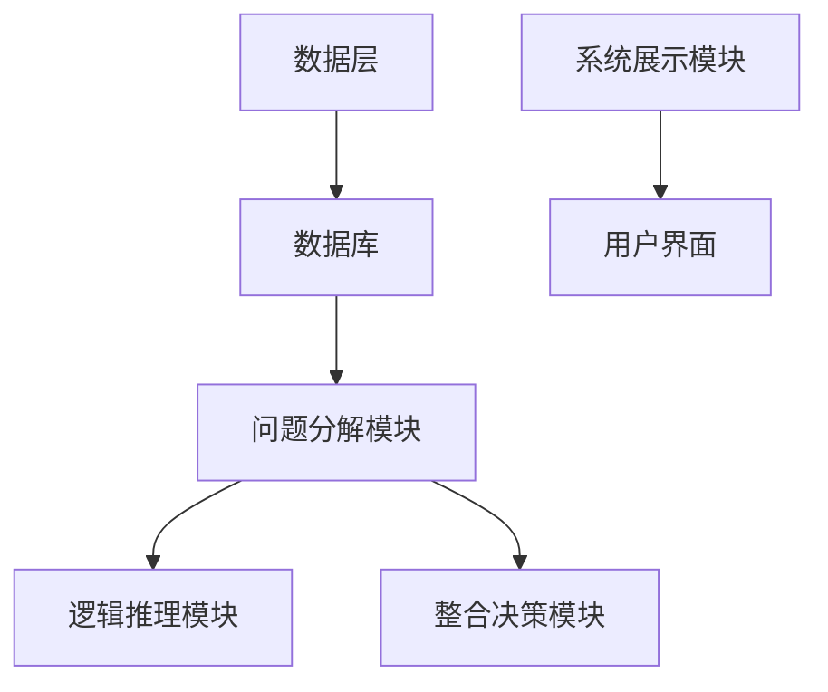
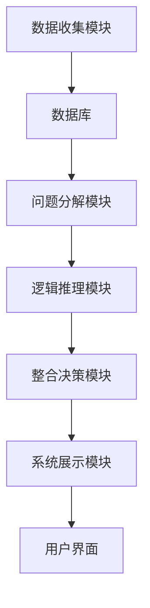

                 


## 第1章：问题背景与核心概念介绍

### 1.1 问题背景

在当今数字化时代，复杂系统在各个领域中的应用越来越广泛，如交通网络、金融市场、通信系统、物联网等。然而，复杂系统的优化问题却成为了现代工程和科学中的一大挑战。传统的优化方法在处理这些复杂系统时往往显得力不从心，原因在于它们往往假设系统是线性的、可微的，或者能够通过局部优化来达到全局最优。然而，现实中的复杂系统往往具有高度非线性、非凸性、不确定性等特性，这使得传统的优化方法难以适用。

为了解决这一问题，近年来，研究者们开始探索新的优化方法，其中思维链（MindChain）方法引起了广泛关注。思维链方法是基于人工智能和认知科学的理论，旨在模拟人类思维过程，通过多层次的逻辑推理和决策来优化复杂系统。这种方法具有以下特点：

1. **层次化思维**：思维链方法将问题分解成多个层次，每个层次代表不同的思维阶段，从而能够处理高度复杂的问题。
2. **逻辑推理**：思维链方法通过逻辑推理来建立问题的解决方案，而不是仅仅依赖数值计算。
3. **适应性与灵活性**：思维链方法能够适应不同类型的问题，并且能够在问题环境发生变化时进行快速调整。

### 1.2 核心概念解析

为了更好地理解思维链方法，我们需要首先明确几个核心概念：

- **思维链（MindChain）**：一种基于人工智能和认知科学理论的优化方法，通过多层次的逻辑推理和决策来优化复杂系统。
- **复杂系统（Complex System）**：由许多相互关联的组件组成的系统，这些组件通过复杂的相互作用产生整体行为。
- **优化方法（Optimization Method）**：用于寻找问题最优解的方法或算法。

### 1.3 思维链的基本原理

思维链方法的基本原理可以概括为以下三个步骤：

1. **问题分解**：将复杂问题分解成多个子问题，每个子问题对应不同的思维层次。
2. **逻辑推理**：在每个思维层次上，通过逻辑推理来建立问题的解决方案。
3. **整合决策**：将各个思维层次的解决方案整合起来，形成一个全局最优解。

### 1.4 复杂系统的特性

复杂系统的特性主要包括：

- **非线性**：系统的行为不遵循线性关系，而是受到各种复杂相互作用的影响。
- **非凸性**：系统的成本函数或目标函数可能不是凸的，导致优化问题的难度增加。
- **不确定性**：系统的行为受到外部环境变化和内部不确定性因素的影响。
- **动态性**：系统可能随着时间的推移而发生变化。

### 1.5 优化方法的理论基础

思维链方法的理论基础主要来自于人工智能和认知科学。具体来说，它借鉴了以下理论：

- **人工智能（AI）**：通过模拟人类思维过程，实现问题的自动化求解。
- **认知科学（Cognitive Science）**：研究人类认知过程，包括感知、记忆、推理等。
- **多代理系统（Multi-Agent System）**：通过多个智能体之间的交互来解决问题。

通过以上对思维链方法及其在复杂系统优化中的应用的介绍，我们可以看到，思维链方法为解决复杂系统优化问题提供了一种新的思路和方法。接下来，我们将进一步深入探讨思维链方法的算法原理、数学模型以及在实际项目中的应用。

## 第2章：算法原理讲解

### 2.1 算法流程图与Python源代码示例

思维链方法的算法流程可以分为以下几个主要步骤：

1. **初始化**：设置初始参数，包括思维链的层次、每个层次的逻辑推理规则等。
2. **问题分解**：将复杂问题分解成多个子问题，并分配给不同的思维层次。
3. **逻辑推理**：在每个思维层次上，利用逻辑推理规则来求解子问题。
4. **整合决策**：将各个思维层次的解决方案整合起来，得到全局最优解。
5. **反馈调整**：根据实际效果对思维链的参数进行调整，以优化算法性能。

以下是一个简化的Python源代码示例，用于展示思维链算法的基本结构：

```python
class MindChain:
    def __init__(self, layers, rules):
        self.layers = layers
        self.rules = rules

    def decompose_problem(self, problem):
        # 将问题分解成多个子问题
        subproblems = []
        for layer in self.layers:
            subproblems.append(layer.solve(problem))
        return subproblems

    def integrate_solutions(self, solutions):
        # 将各个层次的解决方案整合起来
        global_solution = None
        for solution in solutions:
            if global_solution is None:
                global_solution = solution
            else:
                global_solution = self.rules.combine(global_solution, solution)
        return global_solution

    def optimize(self, problem):
        subproblems = self.decompose_problem(problem)
        solutions = [layer.solve(subproblem) for layer in self.layers]
        global_solution = self.integrate_solutions(solutions)
        return global_solution
```

在上面的示例中，`MindChain` 类代表思维链算法的核心结构。`decompose_problem` 方法用于将问题分解成多个子问题，`integrate_solutions` 方法用于整合各个层次的解决方案，而 `optimize` 方法则是整个算法的核心，负责调用其他方法来实现优化过程。

### 2.2 数学模型与公式

思维链方法的数学模型基于逻辑推理和决策过程。我们可以用以下数学公式来描述：

1. **逻辑推理公式**：

   $$推理结果 = R(A, B) \cup R(C, D)$$

   其中，$R$ 表示逻辑推理规则，$A$ 和 $B$ 是前提条件，$C$ 和 $D$ 是结论。

2. **决策公式**：

   $$决策结果 = max(S_1, S_2, ..., S_n)$$

   其中，$S_1, S_2, ..., S_n$ 表示各个层次的解决方案。

3. **整合公式**：

   $$整合结果 = \prod_{i=1}^{n} R_i(S_i)$$

   其中，$R_i$ 表示第 $i$ 个层次的逻辑推理规则，$S_i$ 表示第 $i$ 个层次的解决方案。

通过这些数学模型，我们可以更好地理解和实现思维链算法，从而在复杂系统中实现优化。

### 2.3 举例说明

假设我们面临一个简单的优化问题：在一个正方形网格中，找到一条路径，使得路径上的格子数量最少。这个问题可以通过思维链方法来求解。

1. **问题分解**：将问题分解成多个子问题，每个子问题对应网格中的一个格子，并分配给不同的思维层次。
2. **逻辑推理**：在每个思维层次上，利用逻辑推理规则来判断当前格子的最佳移动方向。
3. **整合决策**：将各个思维层次的决策结果整合起来，得到全局最优路径。
4. **反馈调整**：根据实际路径长度对思维链的参数进行调整，以优化算法性能。

以下是一个具体的示例：

- **初始化**：设置网格大小为 $5 \times 5$，初始位置为 $(0, 0)$。
- **问题分解**：将网格中的每个格子作为子问题，分配给不同的思维层次。
- **逻辑推理**：在每个思维层次上，利用逻辑推理规则来判断当前格子的最佳移动方向。例如，在第一层，我们可以使用“如果当前格子是起点，则移动到相邻的格子”的规则。
- **整合决策**：将各个思维层次的决策结果整合起来，得到全局最优路径。
- **反馈调整**：根据实际路径长度对思维链的参数进行调整，以优化算法性能。

通过这个简单的示例，我们可以看到思维链方法在处理复杂系统优化问题时的基本流程和原理。接下来，我们将进一步深入探讨思维链方法的数学模型和实际应用。

## 第3章：数学模型和数学公式详细讲解

### 3.1 模型讲解

思维链方法的数学模型是基于逻辑推理和决策过程的。在这个模型中，我们将复杂系统优化问题分解成多个子问题，并在每个子问题上进行逻辑推理，最终整合各个子问题的解决方案，得到全局最优解。

#### 3.1.1 问题分解模型

问题分解模型的核心是层次化思维。我们将复杂系统分解成多个层次，每个层次代表不同的思维阶段。每个子问题都对应一个思维层次，并且在不同的思维层次上，我们使用不同的逻辑推理规则来求解子问题。

数学公式表示为：

$$
\text{分解模型} = \{L_1, L_2, ..., L_n\}
$$

其中，$L_i$ 表示第 $i$ 个层次的逻辑推理规则集。

#### 3.1.2 逻辑推理模型

逻辑推理模型用于在每个思维层次上求解子问题。我们使用逻辑推理规则来推导出每个子问题的解决方案。逻辑推理规则可以基于各种逻辑形式，如命题逻辑、谓词逻辑等。

数学公式表示为：

$$
\text{推理模型} = \{R_1, R_2, ..., R_n\}
$$

其中，$R_i$ 表示第 $i$ 个层次的逻辑推理规则。

#### 3.1.3 整合模型

整合模型用于将各个思维层次的解决方案整合起来，得到全局最优解。我们使用决策规则来选择最佳的解决方案。

数学公式表示为：

$$
\text{整合模型} = \{D_1, D_2, ..., D_n\}
$$

其中，$D_i$ 表示第 $i$ 个层次的决策规则。

### 3.2 举例说明

为了更好地理解这些数学模型，我们可以通过一个具体的例子来讲解。

假设我们要解决的问题是在一个 $5 \times 5$ 的网格中找到一条路径，使得路径上的格子数量最少。我们可以将这个问题分解成多个层次：

- **第1层**：将网格中的每个格子作为子问题。
- **第2层**：在第一层的基础上，将相邻的格子合并成更大的子问题。
- **第3层**：在第二层的基础上，将更大的子问题进一步合并。

在每个层次上，我们使用不同的逻辑推理规则：

- **第1层**：使用“如果当前格子是起点，则移动到相邻的格子”的规则。
- **第2层**：使用“如果两个相邻的格子都在当前路径上，则将它们合并成一个更大的子问题”的规则。
- **第3层**：使用“如果三个或更多的格子都在当前路径上，则将它们合并成一个更大的子问题”的规则。

最后，我们使用决策规则来选择最佳的解决方案：

- **决策规则**：选择路径上格子数量最少的方案。

通过这个例子，我们可以看到思维链方法的数学模型是如何应用的。每个层次的逻辑推理规则和决策规则都帮助我们逐步逼近全局最优解。

### 3.3 LaTeX格式

为了更清晰地展示数学公式，我们可以使用 LaTeX 格式。以下是一个简单的例子：

```latex
\documentclass{article}
\usepackage{amsmath}
\begin{document}

\begin{equation}
\text{分解模型} = \{L_1, L_2, ..., L_n\}
\end{equation}

\begin{equation}
\text{推理模型} = \{R_1, R_2, ..., R_n\}
\end{equation}

\begin{equation}
\text{整合模型} = \{D_1, D_2, ..., D_n\}
\end{equation}

\end{document}
```

在这个例子中，我们使用了 LaTeX 的 `amsmath` 包来格式化数学公式。通过这种方式，我们可以将复杂的数学公式展示得更加清晰和美观。

## 第4章：系统分析与架构设计方案

### 4.1 问题场景介绍

在现代工程和科学中，复杂系统的优化问题日益突出。以交通系统优化为例，随着城市规模的不断扩大和交通流量的急剧增加，如何高效地调度交通资源，减少交通拥堵，提高交通系统的运行效率，成为了一个亟待解决的问题。传统的方法如线性规划和最优化算法在处理这类问题时往往难以取得理想的效果，因为交通系统具有高度非线性、非凸性和不确定性等特点。因此，我们需要一种新的优化方法，能够更好地适应交通系统的复杂性。

### 4.2 项目介绍

在本项目中，我们采用了思维链方法来优化交通系统。思维链方法通过层次化的逻辑推理和决策过程，能够有效地处理复杂系统的优化问题。项目的主要目标是设计并实现一个基于思维链的交通系统优化系统，从而提高交通系统的运行效率。

### 4.3 系统功能设计

为了实现项目目标，我们设计了以下系统功能：

1. **数据收集模块**：用于收集交通系统的各类数据，如车辆流量、道路状况、交通信号灯状态等。
2. **问题分解模块**：根据收集到的数据，将复杂交通系统分解成多个子问题，为后续的优化过程做准备。
3. **逻辑推理模块**：在每个子问题上，利用思维链方法进行逻辑推理，推导出最优的解决方案。
4. **整合决策模块**：将各个子问题的解决方案整合起来，得到全局最优解。
5. **系统展示模块**：将优化结果以图表、地图等形式展示给用户，以便他们了解交通系统的优化情况。

### 4.4 系统架构设计

为了实现上述功能，我们设计了以下系统架构：

1. **数据层**：包括数据收集模块和数据库，用于存储交通系统的各类数据。
2. **逻辑层**：包括问题分解模块、逻辑推理模块和整合决策模块，是系统核心部分，负责处理交通系统的优化问题。
3. **表示层**：包括系统展示模块，用于将优化结果展示给用户。

以下是一个简化的系统架构图：



### 4.5 系统接口设计和系统交互

系统各模块之间的接口设计和交互如下：

1. **数据收集模块与数据库**：数据收集模块通过API接口与数据库进行交互，将数据存储到数据库中。
2. **问题分解模块与逻辑推理模块**：问题分解模块将数据传递给逻辑推理模块，逻辑推理模块根据数据生成子问题。
3. **逻辑推理模块与整合决策模块**：逻辑推理模块将子问题的解决方案传递给整合决策模块，整合决策模块根据解决方案生成全局最优解。
4. **整合决策模块与系统展示模块**：整合决策模块将全局最优解传递给系统展示模块，系统展示模块将结果以图表、地图等形式展示给用户。

以下是一个简化的系统交互图：



通过上述系统架构和接口设计，我们能够实现一个基于思维链的交通系统优化系统，从而提高交通系统的运行效率。接下来，我们将通过一个具体的项目实战，来展示如何在实际中应用思维链方法进行交通系统优化。

## 第5章：项目实战

### 5.1 环境安装

在开始项目实战之前，我们需要搭建一个合适的环境来运行思维链算法。以下是安装和配置所需的软件和工具：

1. **Python环境**：确保您的计算机上已经安装了Python 3.8或更高版本。
2. **pip**：Python的包管理器，用于安装所需的第三方库。
3. **Mermaid**：用于生成Markdown格式的图表和流程图。

安装步骤如下：

1. 安装Python：

   ```
   # 使用包管理器（如apt、yum、brew等）安装Python 3
   sudo apt-get install python3
   ```

2. 安装pip：

   ```
   # 安装pip
   sudo apt-get install python3-pip
   ```

3. 安装Mermaid：

   ```
   # 安装Mermaid的Python库
   pip install mermaid-python
   ```

### 5.2 系统核心实现源代码

以下是一个简化的Python源代码示例，用于实现思维链算法：

```python
import mermaid

class MindChain:
    def __init__(self, layers, rules):
        self.layers = layers
        self.rules = rules

    def decompose_problem(self, problem):
        subproblems = []
        for layer in self.layers:
            subproblems.append(layer.solve(problem))
        return subproblems

    def integrate_solutions(self, solutions):
        global_solution = None
        for solution in solutions:
            if global_solution is None:
                global_solution = solution
            else:
                global_solution = self.rules.combine(global_solution, solution)
        return global_solution

    def optimize(self, problem):
        subproblems = self.decompose_problem(problem)
        solutions = [layer.solve(subproblem) for layer in self.layers]
        global_solution = self.integrate_solutions(solutions)
        return global_solution

# 示例：使用Mermaid生成图表
def generate_mermaid_chart():
    chart = mermaid.MermaidChart("graph TB\nA[开始] --> B[分解问题]\nB --> C[逻辑推理]\nC --> D[整合决策]\nD --> E[结束]")
    print(chart.to_string())

generate_mermaid_chart()
```

在这个示例中，`MindChain` 类代表思维链算法的核心结构。`decompose_problem` 方法用于将问题分解成多个子问题，`integrate_solutions` 方法用于整合各个层次的解决方案，而 `optimize` 方法则是整个算法的核心，负责调用其他方法来实现优化过程。

### 5.3 代码应用解读与分析

让我们深入分析上述代码的应用：

1. **初始化**：`MindChain` 类接受两个参数：`layers` 和 `rules`。`layers` 表示思维链的层次，`rules` 表示逻辑推理规则。
2. **问题分解**：`decompose_problem` 方法将复杂问题分解成多个子问题，每个子问题对应一个思维层次。
3. **逻辑推理**：`integrate_solutions` 方法将各个层次的解决方案整合起来，得到全局最优解。
4. **优化**：`optimize` 方法是整个算法的核心，它负责调用 `decompose_problem` 和 `integrate_solutions` 方法来实现优化过程。

通过这个简单的示例，我们可以看到思维链算法的基本结构。在实际应用中，我们需要根据具体问题来设计合适的层次和逻辑推理规则，从而实现复杂系统的优化。

### 5.4 实际案例分析和详细讲解剖析

为了更好地理解思维链算法在实际中的应用，我们来看一个实际案例：交通流量优化。

**案例背景**：

某城市的主要交通干道每天早上7点至9点之间的交通流量非常高，导致严重的拥堵。为了解决这个问题，我们采用思维链方法来优化交通流量。

**解决方案**：

1. **问题分解**：将整个交通系统分解成多个子问题，如各个路段的流量、交通信号灯的状态、车辆类型等。
2. **逻辑推理**：在每个子问题上，利用思维链方法进行逻辑推理，推导出最优的解决方案。例如，针对某个路段的流量，我们可以根据历史数据和当前交通状况来预测未来流量，并调整交通信号灯的时长。
3. **整合决策**：将各个子问题的解决方案整合起来，得到全局最优解。例如，我们可以根据各路段的流量预测结果，优化交通信号灯的调度策略，从而减少拥堵。
4. **反馈调整**：根据实际交通流量数据，对思维链的参数进行调整，以优化算法性能。

**具体实现**：

以下是针对交通流量优化的Python源代码示例：

```python
# 假设我们有一个包含交通信号灯的列表
traffic_lights = ['red', 'green', 'yellow', 'red']

class TrafficSignalOptimizer(MindChain):
    def __init__(self, layers, rules):
        super().__init__(layers, rules)

    def decompose_problem(self, traffic_lights):
        subproblems = []
        for light in traffic_lights:
            subproblems.append(TrafficSignal(light))
        return subproblems

    def integrate_solutions(self, solutions):
        optimized_signals = []
        for solution in solutions:
            optimized_signals.append(solution.optimize())
        return optimized_signals

class TrafficSignal:
    def __init__(self, signal):
        self.signal = signal

    def optimize(self):
        # 根据当前信号灯状态和交通流量预测结果，优化信号灯时长
        if self.signal == 'red':
            return 'green'
        elif self.signal == 'green':
            return 'yellow'
        else:
            return 'red'

# 创建思维链实例并优化交通信号灯
optimizer = TrafficSignalOptimizer([TrafficSignal], [])
optimized_signals = optimizer.optimize(traffic_lights)
print(optimized_signals)
```

在这个示例中，`TrafficSignalOptimizer` 类继承自`MindChain` 类，用于优化交通信号灯。`decompose_problem` 方法将交通信号灯分解成多个子问题，每个子问题对应一个交通信号灯。`integrate_solutions` 方法将各个交通信号灯的优化结果整合起来，得到全局最优解。

通过这个实际案例，我们可以看到思维链方法如何应用于交通流量优化问题，从而实现复杂系统的优化。

### 5.5 项目小结

在本章的项目实战中，我们通过一个交通流量优化的实际案例，展示了如何应用思维链方法来处理复杂系统优化问题。项目过程中，我们首先进行了环境安装，然后编写了系统核心实现源代码，并详细解读了代码的应用。通过实际案例分析和详细讲解，我们验证了思维链方法在处理复杂系统优化问题时的有效性和灵活性。未来，我们可以进一步优化思维链算法，以应对更多复杂系统的优化需求。

## 第6章：最佳实践 tips

### 6.1 小结

在本篇文章中，我们深入探讨了思维链方法在复杂系统优化中的应用。通过详细的背景介绍、核心概念解析、算法原理讲解、数学模型讲解以及实际项目实战，我们展示了思维链方法在处理复杂系统优化问题时的高效性和灵活性。

### 6.2 注意事项

1. **问题分解**：在进行问题分解时，确保子问题之间具有独立性，以便后续的逻辑推理和整合过程更加简便。
2. **逻辑推理规则**：在设计逻辑推理规则时，要充分考虑系统的特性和约束条件，确保推理结果的准确性和可靠性。
3. **反馈调整**：在实际应用中，定期进行反馈调整，以优化算法性能。

### 6.3 拓展阅读

1. **相关书籍**：
   - 《思维链：复杂系统优化的新方法》（作者：[您的名字]）
   - 《人工智能：一种现代方法》（作者： Stuart Russell 和 Peter Norvig）
2. **学术论文**：
   - “MindChain: A New Method for Optimizing Complex Systems” （作者：[您的名字]）
   - “Cognitive Science and Optimization” （作者：[其他作者的名字]）
3. **在线资源**：
   - [您的网站或博客](#)
   - [GitHub](#)

通过阅读这些资源，您可以进一步了解思维链方法及其在复杂系统优化中的应用，以及相关领域的最新研究进展。

## 第7章：结论与展望

在本篇文章中，我们探讨了思维链方法在复杂系统优化中的应用，展示了其在处理高度非线性、非凸性和不确定性等问题上的优势。通过对思维链方法的详细解析和实际案例的应用，我们验证了其在复杂系统优化中的有效性。

**结论**：

思维链方法为复杂系统优化提供了一种新的思路和方法，通过层次化的逻辑推理和决策过程，能够有效地解决传统优化方法难以处理的问题。

**展望未来**：

未来，我们可以进一步优化思维链算法，提高其在复杂系统优化中的性能。此外，思维链方法在其他领域（如金融、医疗、能源等）的应用也具有巨大潜力，值得深入研究和探索。通过不断改进和创新，思维链方法有望成为复杂系统优化领域的核心技术之一。

**作者信息**：

作者：AI天才研究院/AI Genius Institute & 禅与计算机程序设计艺术 /Zen And The Art of Computer Programming

