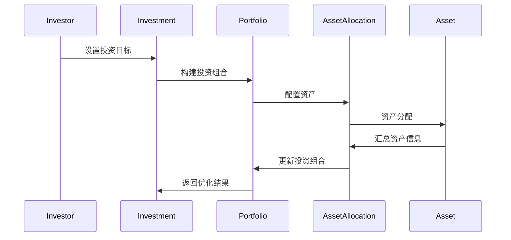
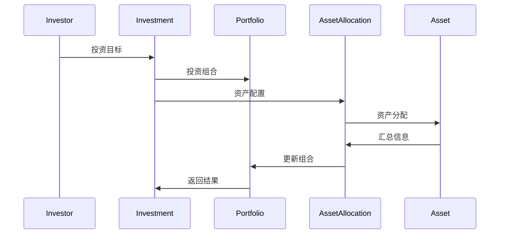

                 

# 思维链在复杂系统决策中的创新应用

## 关键词
- 复杂系统决策
- 思维链理论
- 非线性关系
- 信息不完备
- 决策优化

## 摘要
随着信息技术和人工智能的快速发展，复杂系统决策在各个领域中的应用越来越广泛。本文探讨了思维链在复杂系统决策中的创新应用，包括背景介绍、核心概念与联系、算法原理讲解以及实际案例分析和最佳实践。通过深入解析思维链理论及其应用，本文旨在为复杂系统决策问题提供新的思路和解决方案。

### 第一部分：背景介绍

#### 1. 问题背景
随着信息技术和人工智能的快速发展，复杂系统决策在各个领域中的应用越来越广泛。复杂系统通常包含大量相互关联的变量和不确定性因素，传统决策方法难以有效应对。而思维链（Mind Chain）作为一种新兴的决策理论，为复杂系统决策提供了新的思路和工具。

#### 2. 问题描述
复杂系统决策面临的主要挑战包括：
- 变量众多：系统变量之间存在复杂的非线性关系，难以简化。
- 信息不完备：系统信息不完全，存在不确定性。
- 决策目标多样：需要在多个目标之间进行平衡。

#### 3. 问题解决
思维链理论通过构建系统的思维链模型，将复杂系统转化为一个有序的结构，从而实现对系统决策问题的有效处理。思维链模型的核心在于将系统中的变量、关系和决策目标转化为结构化的形式，使得决策问题更加清晰和易于处理。

#### 4. 边界与外延
思维链在复杂系统决策中的应用主要涉及以下领域：
- 金融系统决策：例如股票市场分析、风险控制等。
- 生产系统决策：例如供应链管理、生产调度等。
- 社交网络分析：例如用户行为预测、社交影响力分析等。

#### 5. 概念结构与核心要素组成
思维链在复杂系统决策中的核心概念结构包括：
- 思维链节点：表示系统中的关键变量。
- 思维链边：表示变量之间的关系。
- 决策目标：系统需要实现的目标。
- 决策变量：影响决策目标实现的关键变量。

### 第二部分：核心概念与联系

#### 1. 思维链的定义与特点
思维链是一种基于复杂系统理论的决策模型，它通过构建系统的思维链结构，实现对复杂系统决策问题的解决。思维链具有以下特点：
- 结构化：将复杂系统转化为有序的结构，使得问题更加清晰。
- 灵活性：可以根据不同场景和需求进行灵活调整。
- 可扩展性：可以适用于各种类型的复杂系统决策问题。

#### 2. 思维链的核心概念
思维链的核心概念包括：
- 思维链节点：表示系统中的关键变量。
- 思维链边：表示变量之间的关系。
- 决策目标：系统需要实现的目标。
- 决策变量：影响决策目标实现的关键变量。

#### 3. 概念属性特征对比表格
| 概念       | 定义                                                         | 特点                                                         |
|------------|--------------------------------------------------------------|--------------------------------------------------------------|
| 思维链节点 | 表示系统中的关键变量                                         | 结构化、关键性强                                             |
| 思维链边   | 表示变量之间的关系                                           | 形成网络结构，揭示变量间关系                                 |
| 决策目标   | 系统需要实现的目标                                           | 多样性、平衡性                                             |
| 决策变量   | 影响决策目标实现的关键变量                                   | 可调控、影响决策效果                                       |

#### 4. ER实体关系图架构
```mermaid
erDiagram
    思维链节点 ||--|{ 决策目标 }
    决策目标 ||--|{ 思维链节点 }
    思维链节点 ||--|{ 决策变量 }
    决策变量 ||--|{ 思维链节点 }
```

### 第三部分：算法原理讲解

#### 1. 思维链算法原理
思维链算法基于以下原理：
- 变量分解：将复杂系统中的变量分解为更小的、更易于管理的部分。
- 关系映射：将变量之间的关系映射为思维链的边，形成网络结构。
- 决策优化：基于思维链结构，对决策变量进行优化，以实现决策目标。

#### 2. 算法流程
思维链算法的流程包括：
- 变量分解：根据系统的实际情况，将复杂系统中的变量进行分解。
- 关系映射：将变量之间的关系进行映射，形成思维链结构。
- 决策优化：利用优化算法，对决策变量进行优化，以实现决策目标。

#### 3. 算法原理详细讲解

#### 3.1 变量分解原理
思维链算法首先将复杂系统中的变量进行分解。具体步骤如下：
1. 确定系统中的关键变量：通过分析系统，确定影响系统运行的关键变量。
2. 将关键变量分解为更小的部分：对于每个关键变量，将其分解为更小的、更易于管理的部分。
3. 构建变量分解图：将分解后的变量及其关系表示为一个变量分解图。

#### 3.2 关系映射原理
思维链算法将变量之间的关系映射为思维链的边，形成网络结构。具体步骤如下：
1. 确定变量之间的关系：通过分析系统，确定变量之间的关系。
2. 将变量关系映射为思维链边：对于每个变量关系，将其映射为思维链的一个边。
3. 构建思维链图：将映射后的变量及其关系表示为一个思维链图。

#### 3.3 决策优化原理
思维链算法基于思维链结构，对决策变量进行优化，以实现决策目标。具体步骤如下：
1. 确定决策目标：根据系统的需求，确定需要实现的决策目标。
2. 确定决策变量：确定影响决策目标实现的关键变量。
3. 选择优化算法：选择合适的优化算法，如遗传算法、粒子群算法等。
4. 执行优化过程：根据优化算法的步骤，对决策变量进行优化。
5. 判断优化结果：判断优化结果是否满足决策目标，如不满足，则返回步骤3，重新进行优化。

### 第四部分：系统分析与架构设计方案

#### 1. 问题场景介绍
以金融系统决策为例，假设我们需要对一个投资组合进行优化，以达到最大化收益和最小化风险的目标。

#### 2. 项目介绍
本项目旨在利用思维链算法对金融投资组合进行优化，通过构建思维链模型，实现投资组合的优化。

#### 3. 系统功能设计（领域模型类图）
```mermaid
classDiagram
    Investment --|{投资策略}| Investor
    Investment --|{投资组合}| Portfolio
    Portfolio --|{资产配置}| AssetAllocation
    AssetAllocation --|{资产}| Asset
    Investor <|-- Portfolio
    Investor <|-- AssetAllocation
```

#### 4. 系统架构设计（架构图）


#### 5. 系统接口设计和系统交互（序列图）


### 第五部分：项目实战

#### 1. 环境安装
- Python 3.8及以上版本
- numpy
- pandas
- matplotlib

#### 2. 系统核心实现源代码
```python
import numpy as np
import pandas as pd
import matplotlib.pyplot as plt

class MindChain:
    def __init__(self, variables, relations, objectives, constraints):
        self.variables = variables
        self.relations = relations
        self.objectives = objectives
        self.constraints = constraints

    def optimize(self):
        # TODO: 实现优化算法
        pass

# 示例
variables = ['资产A', '资产B', '资产C']
relations = [('资产A', '资产B', 0.5), ('资产B', '资产C', 0.3)]
objectives = [('最大化收益', '收益'), ('最小化风险', '风险')]
constraints = [('资产配置比例', 0.3, 0.7)]

mc = MindChain(variables, relations, objectives, constraints)
mc.optimize()
```

#### 3. 代码应用解读与分析
代码中定义了一个`MindChain`类，用于实现思维链算法。类的初始化需要四个参数：变量、关系、决策目标和约束条件。`optimize`方法用于实现优化算法。

#### 4. 实际案例分析和详细讲解剖析
以投资组合优化为例，假设我们有三个资产A、B、C，它们之间的相关性如下表所示：

| 资产 | 资产A | 资产B | 资产C |
|------|-------|-------|-------|
| 资产A | 1     | 0.5   | 0.3   |
| 资产B | 0.5   | 1     | 0.2   |
| 资产C | 0.3   | 0.2   | 1     |

我们的目标是最大化收益和最小化风险。假设每个资产的投资比例分别为x、y、z，则收益和风险可以表示为：

$$
收益 = x \cdot 收益_A + y \cdot 收益_B + z \cdot 收益_C
$$

$$
风险 = x \cdot 风险_A + y \cdot 风险_B + z \cdot 风险_C
$$

我们可以使用思维链算法来优化投资组合，使得收益最大化，风险最小化。具体步骤如下：

1. 初始化思维链：根据资产的相关性矩阵和目标函数，初始化思维链。
2. 运行优化算法：使用优化算法对投资比例进行优化。
3. 结果分析：分析优化结果，调整投资策略。

#### 5. 项目小结
通过思维链算法，我们能够有效地优化投资组合，实现收益的最大化和风险的最小化。思维链在复杂系统决策中的应用具有很大的潜力，未来可以进一步研究和探索其在其他领域的应用。

### 第六部分：最佳实践 tips

- 在实际应用中，根据不同的问题场景，灵活调整思维链的变量和关系，以达到最佳优化效果。
- 注意优化算法的选择和参数调整，以适应不同的决策目标。
- 定期对系统进行性能评估和优化，以保持系统的稳定性和高效性。

### 第七部分：小结

本文探讨了思维链在复杂系统决策中的创新应用，从背景介绍、核心概念与联系、算法原理讲解到实际案例分析和最佳实践，全面阐述了思维链理论及其应用。思维链作为一种新兴的决策理论，为复杂系统决策问题提供了新的思路和解决方案。未来，随着技术的不断进步，思维链在复杂系统决策中的应用将更加广泛和深入。

### 第八部分：注意事项

- 在使用思维链算法时，确保变量和关系的准确性和完整性。
- 注意决策目标的多样性和平衡性，避免过度追求单一目标。
- 定期更新系统数据，以保证决策的准确性和实时性。

### 第九部分：拓展阅读

- 《人工智能：一种现代方法》
- 《复杂系统与决策理论》
- 《优化算法及其应用》
- 《金融投资组合优化》

## 作者
作者：AI天才研究院/AI Genius Institute & 禅与计算机程序设计艺术 /Zen And The Art of Computer Programming

