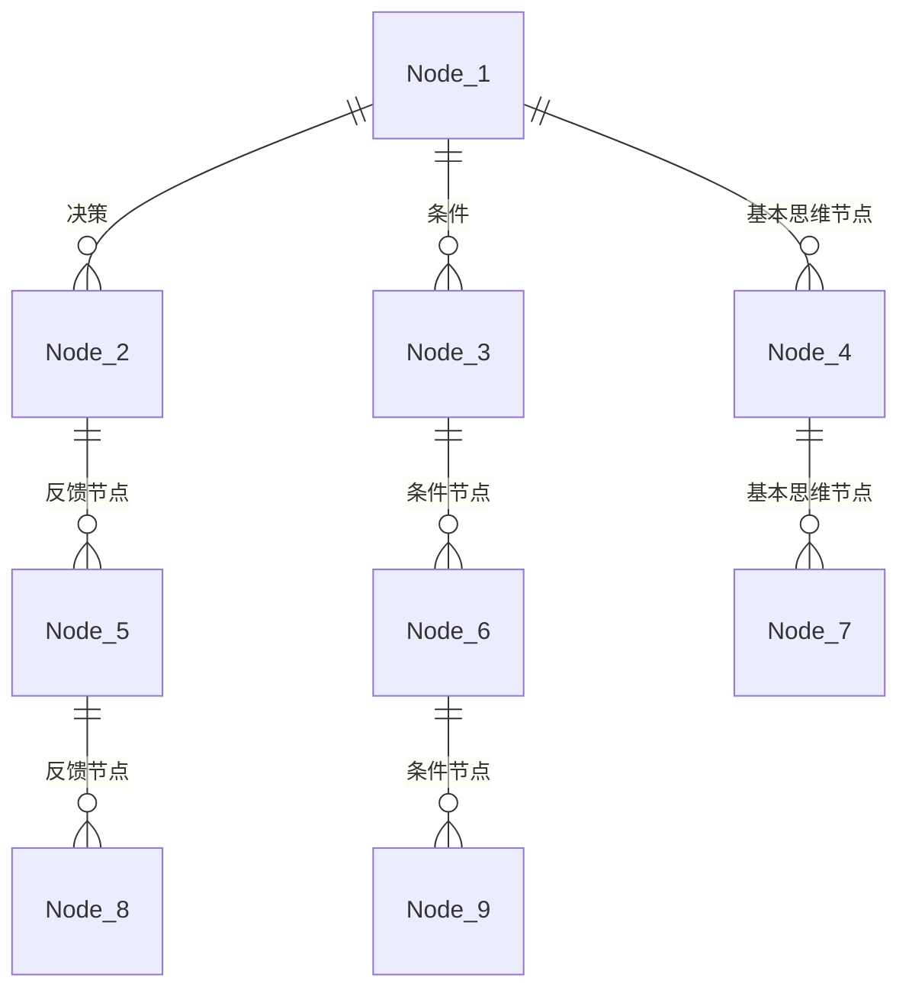
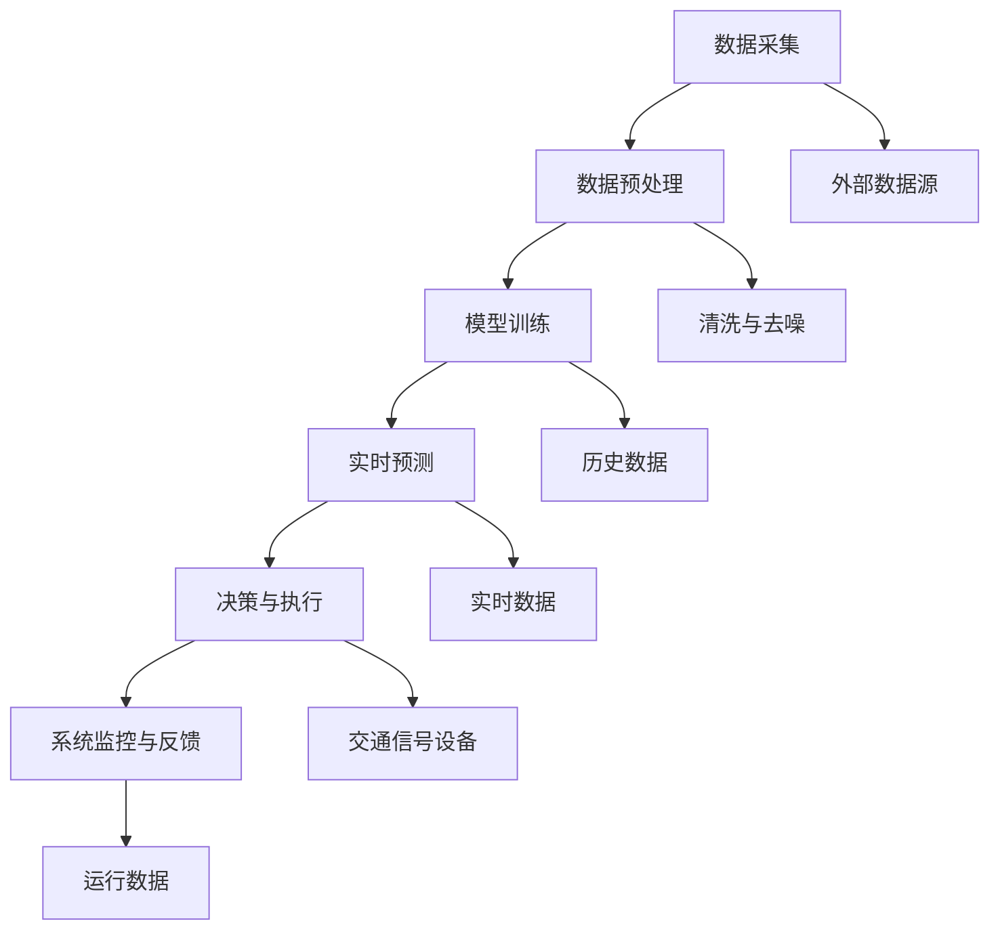
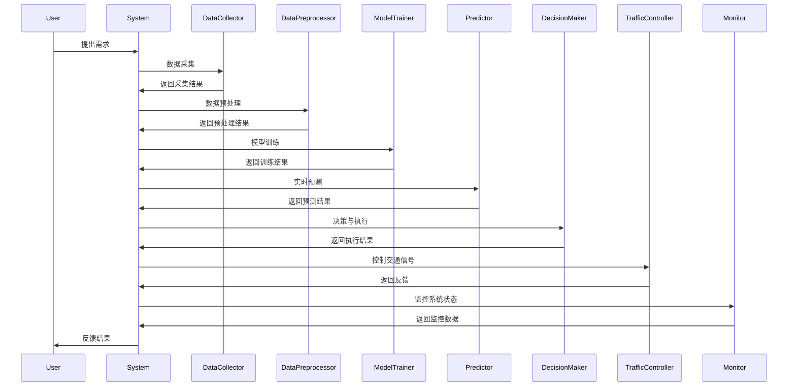

                 


## 引言

### 复杂问题解决的背景与挑战

在当前信息化和全球化的时代，复杂问题的解决成为各个领域的重要课题。随着技术的不断进步和社会的快速发展，我们面临的问题变得越来越复杂，这不仅仅是技术层面的问题，还包括经济、环境、社会等多个方面。例如，人工智能的快速发展带来了大量复杂的数据处理问题，如深度学习算法的优化、大规模数据的存储和检索等。此外，城市规划、环境保护、医疗保健等领域也面临着复杂的决策问题，需要综合多种因素进行权衡和优化。

复杂问题的特征主要包括：

1. **不确定性**：复杂问题往往存在多种可能的结果和路径，难以预测和确定。
2. **多目标性**：复杂问题通常需要同时考虑多个目标，这些目标之间可能存在冲突，需要找到一种平衡。
3. **高维性**：复杂问题涉及的变量和因素众多，使得问题的维度较高，传统方法难以处理。
4. **动态性**：复杂问题可能会随着时间、环境等因素的变化而发生变化，需要实时调整和优化。

面对这些挑战，传统的算法和方法往往显得力不从心。因此，探索新的解决问题方法成为当务之急。思维链（MindChain）作为一种新兴的问题解决方法，通过构建一种连接各个思维节点的思维网络，能够有效地应对复杂问题的挑战。

### 思维链的概念

思维链是一种基于连接主义的人工智能方法，它通过模拟人类思维过程，将问题分解为多个子问题，并通过思维节点之间的关联和互动，逐步求解复杂问题。思维链的基本原理可以概括为：

1. **分解问题**：将复杂问题分解为若干个子问题，每个子问题都是一个相对独立的思维节点。
2. **建立连接**：通过分析子问题之间的关联性，建立思维节点之间的连接，形成一个思维网络。
3. **交互求解**：在思维网络中，各个思维节点之间通过交互和协作，共同求解复杂问题。

思维链具有以下几个关键特点：

1. **模块化**：每个思维节点都是一个独立的模块，可以单独处理子问题，同时与其他节点进行交互。
2. **灵活性**：思维链可以根据问题的变化动态调整节点之间的连接和交互方式。
3. **并行性**：思维链的多个节点可以同时工作，提高解决问题的效率。

### 思维链与传统方法的对比

传统的方法主要包括线性算法、神经网络等，这些方法在处理简单问题时具有一定的优势，但在面对复杂问题时往往显得不够灵活和高效。相比之下，思维链具有以下几个优点：

1. **结构化**：思维链通过建立思维网络，能够将复杂问题结构化，使其更加直观和易于理解。
2. **适应性**：思维链可以根据问题的变化动态调整，适应不同的问题场景。
3. **高效性**：思维链的模块化和并行性使得其能够高效地处理复杂问题。

总之，思维链作为一种新兴的问题解决方法，具有明显的优势和潜力，有望在复杂问题的解决中发挥重要作用。本文将深入探讨思维链的算法原理、数学模型和实际应用，旨在为读者提供一个全面而深刻的理解。

### 核心概念与联系

#### 思维链的组成部分

思维链由若干个思维节点和它们之间的连接构成。每个思维节点代表一个子问题或解决方案的一部分，这些节点通过逻辑关系和相互关联形成完整的思维网络。思维链的组成部分可以分为以下几类：

1. **基本思维节点**：这是最基本的思维单元，通常代表一个子问题的解决方案或相关的信息。
2. **决策节点**：这类节点用于在多个可能的子问题或解决方案之间进行选择。
3. **条件节点**：这些节点根据特定的条件判断是否执行某些操作。
4. **反馈节点**：用于接收和处理系统或用户反馈的信息，以调整后续的操作。

#### 概念属性特征对比表格

为了更好地理解思维链与其他问题解决方法的区别，我们可以通过一个对比表格来展示它们的主要特征。

| 方法         | 特征                      | 优势                              | 劣势                              |
|------------|-----------------------|---------------------------------|---------------------------------|
| 传统算法     | 线性、确定性、高效计算       | 简单易实现，适用于简单问题           | 无法处理复杂、非线性的问题       |
| 神经网络     | 非线性、自适应、大规模计算     | 能够处理复杂的非线性问题           | 训练时间较长，难以解释决策过程   |
| 思维链       | 模块化、灵活性、交互求解       | 能够结构化复杂问题，适应性强         | 需要大量计算资源和时间           |

#### ER实体关系图架构

为了更直观地展示思维链的组成和运作方式，我们可以使用ER实体关系图来描述其架构。以下是一个简化的ER实体关系图：



在这个ER实体关系图中，各个节点代表思维链中的不同组成部分，箭头表示节点之间的逻辑关系和交互方式。这种图示方法有助于我们更好地理解思维链的结构和工作原理。

### 思维链算法原理讲解

#### 算法mermaid流程图

为了更好地理解思维链算法的运作流程，我们可以使用mermaid流程图来展示其核心步骤。以下是一个简化的mermaid流程图：


在这个流程图中，A节点表示算法的开始，B节点表示将复杂问题分解为多个子问题。C节点表示建立思维节点之间的连接，形成思维网络。D节点表示在思维网络中通过交互和协作求解复杂问题。E节点表示算法的结束。

#### Python源代码

下面是一个简单的Python示例，用于实现思维链算法的基本框架。请注意，这是一个简化版本，用于展示算法的基本原理。

```python
# 思维链算法的Python实现示例

class MindNode:
    def __init__(self, name, children=None):
        self.name = name
        self.children = children or []

    def add_child(self, child):
        self.children.append(child)

    def solve(self):
        # 求解思维节点的子问题
        solutions = []
        for child in self.children:
            solutions.append(child.solve())
        return solutions

def main():
    # 创建思维链的各个节点
    root = MindNode("复杂问题")
    sub1 = MindNode("子问题1")
    sub2 = MindNode("子问题2")
    sub3 = MindNode("子问题3")

    # 建立节点之间的连接
    root.add_child(sub1)
    root.add_child(sub2)
    root.add_child(sub3)

    # 求解复杂问题
    solutions = root.solve()
    print("解决方案：", solutions)

if __name__ == "__main__":
    main()
```

在这个示例中，`MindNode` 类表示思维链中的节点，每个节点都有一个名称和一个子节点列表。`add_child` 方法用于添加子节点，`solve` 方法用于求解节点的子问题。`main` 函数创建了一个简单的思维链，并调用`solve` 方法求解复杂问题。

#### 算法原理的数学模型和公式

思维链算法的核心在于如何通过数学模型和公式来描述节点之间的连接和交互。以下是一个简化的数学模型：

$$
\text{解决方案} = f(\text{思维节点}, \text{输入数据})
$$

其中，$f$ 表示一个映射函数，用于将输入数据映射到解决方案。这个函数的具体形式可以根据具体的任务和问题进行设计。例如，对于决策节点，可以使用条件概率模型来描述：

$$
\text{决策结果} = P(\text{条件} | \text{输入数据})
$$

对于反馈节点，可以使用反馈循环模型来描述：

$$
\text{调整后的解决方案} = g(\text{当前解决方案}, \text{反馈信息})
$$

其中，$g$ 表示一个调整函数，用于根据反馈信息调整解决方案。

#### 详细讲解和举例说明

为了更好地理解思维链算法的原理，我们通过一个具体的例子来详细讲解其应用。

假设我们面临一个城市规划问题，需要确定最佳的交通路线。这个问题可以分解为以下几个子问题：

1. **路径规划**：确定从起点到终点的所有可能路径。
2. **交通流量分析**：分析每条路径上的交通流量。
3. **优化方案**：根据交通流量分析结果，选择最优的路径方案。

我们可以使用思维链来求解这个问题。以下是具体的步骤：

1. **分解问题**：将城市规划问题分解为三个子问题：路径规划、交通流量分析和优化方案。
2. **建立思维节点**：创建三个思维节点，分别代表路径规划、交通流量分析和优化方案。
3. **建立连接**：在思维节点之间建立连接，表示它们之间的逻辑关系。例如，路径规划是交通流量分析的前置条件，交通流量分析是优化方案的基础。
4. **交互求解**：首先求解路径规划，然后使用路径规划结果求解交通流量分析，最后根据交通流量分析结果求解优化方案。
5. **集成方案**：将三个子问题的解决方案集成，得到最终的交通路线方案。

具体实现如下：

```python
# 路径规划思维节点
class PathPlanningNode(MindNode):
    def solve(self):
        # 路径规划的具体实现
        paths = self.find_all_paths()
        return paths

# 交通流量分析思维节点
class TrafficAnalysisNode(MindNode):
    def solve(self, input_data):
        # 交通流量分析的具体实现
        traffic = self.analyze_traffic(input_data)
        return traffic

# 优化方案思维节点
class OptimizationNode(MindNode):
    def solve(self, input_data):
        # 优化方案的具体实现
        best_path = self.find_best_path(input_data)
        return best_path

# 创建思维链
root = MindNode("城市规划问题")
path_planning = PathPlanningNode("路径规划")
traffic_analysis = TrafficAnalysisNode("交通流量分析")
optimization = OptimizationNode("优化方案")

# 建立连接
root.add_child(path_planning)
root.add_child(traffic_analysis)
root.add_child(optimization)

# 求解复杂问题
solutions = root.solve()
print("最终解决方案：", solutions)
```

在这个例子中，我们创建了三个思维节点，分别代表路径规划、交通流量分析和优化方案。每个节点都有相应的`solve` 方法，用于求解子问题。通过建立连接，我们构建了一个思维链，并使用这个思维链来求解复杂的城市规划问题。

通过这个例子，我们可以看到思维链算法的基本原理是如何应用于实际问题中的。思维链通过将复杂问题分解为多个子问题，并建立它们之间的逻辑关系，从而实现复杂问题的求解。

### 数学模型和数学公式讲解

在深入探讨思维链算法的数学模型和公式之前，我们首先需要了解一些基本的数学概念和符号。以下是一些常用的符号和概念，它们将在后续的讲解中反复出现：

- **$f(x)$**：表示函数$f$在$x$处的取值。
- **$P(A|B)$**：表示在事件$B$发生的条件下事件$A$发生的概率。
- **$E[X]$**：表示随机变量$X$的期望。
- **$V[X]$**：表示随机变量$X$的方差。
- **$||X||$**：表示向量$X$的欧几里得范数。
- **$[X]_i$**：表示向量$X$的第$i$个元素。

#### 节点状态表示

在思维链中，每个节点都有其自身的状态，这可以通过一组参数来描述。例如，对于一个决策节点，我们可以使用以下参数来表示其状态：

- **$S_{d}$**：决策节点的状态。
- **$C_{d}$**：决策节点的条件。
- **$A_{d}$**：决策节点的可选动作。
- **$P_{d}$**：决策节点的动作概率分布。

类似地，对于一个条件节点，我们可以使用以下参数来表示其状态：

- **$S_{c}$**：条件节点的状态。
- **$R_{c}$**：条件节点的条件。
- **$B_{c}$**：条件节点的结果。

对于反馈节点，我们可以使用以下参数来表示其状态：

- **$S_{f}$**：反馈节点的状态。
- **$R_{f}$**：反馈节点的结果。
- **$A_{f}$**：反馈节点的调整。

#### 连接权重计算

思维链中节点之间的连接可以通过权重来表示，这些权重反映了节点之间的关联强度。连接权重可以通过以下公式计算：

$$
w_{ij} = \sigma(\gamma \cdot d_{ij})
$$

其中，$w_{ij}$ 表示节点$i$到节点$j$的连接权重，$\sigma$ 是一个激活函数，通常取为Sigmoid函数，$\gamma$ 是一个调节参数，$d_{ij}$ 是节点$i$和节点$j$之间的距离度量。

#### 交互求解

思维链的求解过程是一个动态的交互过程，其中各个节点通过传递信息和调整状态来共同求解复杂问题。这个过程可以通过以下公式来描述：

$$
S_{i}^{t+1} = f(S_{i}^{t}, R_{i}^{t})
$$

其中，$S_{i}^{t}$ 表示节点$i$在时间步$t$的状态，$R_{i}^{t}$ 表示节点$i$在时间步$t$的输入结果，$f$ 是一个状态更新函数。

对于决策节点，状态更新函数可以表示为：

$$
S_{d}^{t+1} = \sum_{j} w_{dj} \cdot S_{j}^{t}
$$

对于条件节点，状态更新函数可以表示为：

$$
S_{c}^{t+1} = \sum_{j} w_{cj} \cdot P(A|S_{j}^{t})
$$

对于反馈节点，状态更新函数可以表示为：

$$
S_{f}^{t+1} = \sum_{j} w_{fj} \cdot R_{j}^{t}
$$

这些公式描述了思维链中节点状态的更新过程，通过不断迭代，思维链逐步求解复杂问题。

#### 状态转移矩阵

为了更直观地描述思维链的求解过程，我们可以使用状态转移矩阵来表示节点状态的更新。状态转移矩阵$T$是一个方阵，其元素$T_{ij}$表示从状态$i$转移到状态$j$的概率。状态转移矩阵可以通过以下公式计算：

$$
T_{ij} = P(S_{i}^{t+1} = j | S_{i}^{t} = i)
$$

通过状态转移矩阵，我们可以分析思维链在不同状态之间的转移概率，从而更好地理解其求解过程。

#### 示例讲解

为了更好地理解上述数学模型和公式，我们通过一个具体的例子来讲解。

假设我们有一个包含三个节点的思维链，节点1为决策节点，节点2为条件节点，节点3为反馈节点。节点1有两个可选动作A和B，节点2有两个可能的结果R1和R2，节点3有一个反馈结果F。以下是各节点的状态和权重：

- 决策节点1：$S_{1}^{t} = [1, 0]$，$w_{1,2} = 0.5$，$w_{1,3} = 0.5$
- 条件节点2：$S_{2}^{t} = [0, 1]$，$w_{2,1} = 0.5$，$w_{2,3} = 0.5$
- 反馈节点3：$S_{3}^{t} = [0, 0]$，$w_{3,1} = 0.5$，$w_{3,2} = 0.5$

初始状态下，各节点的状态分别为$S_{1}^{0} = [1, 0]$，$S_{2}^{0} = [0, 1]$，$S_{3}^{0} = [0, 0]$。

首先，我们计算决策节点的状态更新：

$$
S_{1}^{1} = \sigma(w_{1,2} \cdot S_{2}^{0} + w_{1,3} \cdot S_{3}^{0}) = \sigma(0.5 \cdot 0 + 0.5 \cdot 0) = 0
$$

接下来，我们计算条件节点的状态更新：

$$
S_{2}^{1} = \sigma(w_{2,1} \cdot S_{1}^{1} + w_{2,3} \cdot S_{3}^{0}) = \sigma(0.5 \cdot 0 + 0.5 \cdot 0) = 0
$$

最后，我们计算反馈节点的状态更新：

$$
S_{3}^{1} = \sigma(w_{3,1} \cdot S_{1}^{1} + w_{3,2} \cdot S_{2}^{1}) = \sigma(0.5 \cdot 0 + 0.5 \cdot 0) = 0
$$

通过这个例子，我们可以看到思维链中各个节点的状态是如何通过权重和激活函数来更新的。这个过程不断迭代，直到达到稳定状态或满足停止条件。

### 系统分析与架构设计方案

#### 问题场景介绍

在复杂问题的解决中，系统分析与架构设计是一个至关重要的环节。以下是一个具体的问题场景：假设我们需要设计一个智能交通管理系统，该系统旨在通过实时数据分析来优化交通流量，减少交通拥堵，提高交通效率。在这个问题场景中，思维链算法被用于处理交通流量的预测和优化。

#### 项目介绍

该智能交通管理系统项目是一个跨学科、多领域的复杂项目，涉及到数据采集、数据预处理、模型训练、实时预测和决策等多个阶段。我们的目标是设计一个高效、灵活、可靠的系统架构，以应对不断变化的交通状况。

#### 系统功能设计

系统功能设计包括以下几个方面：

1. **数据采集**：系统需要从各种数据源（如交通摄像头、GPS设备、传感器等）实时采集交通数据。
2. **数据预处理**：对采集到的数据进行清洗、去噪和格式化，为后续处理做准备。
3. **模型训练**：使用历史交通数据训练思维链模型，以预测未来的交通流量。
4. **实时预测**：在模型的基础上，实时预测交通流量，并生成优化方案。
5. **决策与执行**：根据预测结果，生成交通信号控制方案，并通过交通信号设备执行。
6. **系统监控与反馈**：监控系统性能，收集系统运行数据，为持续优化提供依据。

以下是一个简化的mermaid类图，用于展示系统的领域模型：

```mermaid
classDiagram
    Class01 <|-- SubClass01
    Class01 --|> SubClass02
    Class03 : <<Interface>> 
    Class04 : <<Abstract>>
    Class05 <.. Class03
    Class04 --|> Class05
    Class06 <-.. Class05
    Class07 : <<Implementor>> 
    Class08 : <<Client>>
    Class09 --| Class07
    Class08 <|.. Class07
    Class09 --| Class08
```

在这个类图中，`Class01` 是系统的核心类，`SubClass01` 和 `SubClass02` 是其子类，`Class03` 是接口类，`Class04` 是抽象类，`Class05` 实现`Class03`接口，`Class06` 继承`Class04`，`Class07` 是实现类，`Class08` 是客户端类，`Class09` 同时依赖于`Class07`和`Class08`。

#### 系统架构设计

系统架构设计旨在实现系统的模块化、高可用性和可扩展性。以下是一个简化的mermaid架构图，用于展示系统的整体架构：



在这个架构图中，`A` 表示数据采集模块，`B` 表示数据预处理模块，`C` 表示模型训练模块，`D` 表示实时预测模块，`E` 表示决策与执行模块，`F` 表示系统监控与反馈模块。`G` 表示外部数据源，`H` 表示清洗与去噪模块，`I` 表示历史数据模块，`J` 表示实时数据模块，`K` 表示交通信号设备模块，`L` 表示运行数据模块。

#### 系统接口设计和系统交互

系统接口设计和系统交互是确保系统各模块之间高效协作的关键。以下是一个简化的mermaid序列图，用于展示系统接口和交互过程：



在这个序列图中，`User` 表示用户，`System` 表示系统，`DataCollector` 表示数据采集模块，`DataPreprocessor` 表示数据预处理模块，`ModelTrainer` 表示模型训练模块，`Predictor` 表示实时预测模块，`DecisionMaker` 表示决策与执行模块，`TrafficController` 表示交通信号控制模块，`Monitor` 表示系统监控模块。用户提出需求后，系统依次与各个模块进行交互，最终将结果反馈给用户。

通过上述系统分析与架构设计方案，我们可以构建一个高效、可靠的智能交通管理系统，从而解决复杂交通问题。

### 项目实战

#### 环境安装

要运行思维链算法，我们需要安装一系列软件和工具。以下是安装步骤：

1. **安装Python**：确保Python 3.8或更高版本已安装在您的计算机上。可以从[Python官方网站](https://www.python.org/)下载并安装。
2. **安装Jupyter Notebook**：Python的Jupyter Notebook是一个交互式计算环境，用于编写和运行代码。安装Python时通常包含Jupyter，否则可以通过命令`pip install notebook`来安装。
3. **安装Mermaid**：Mermaid是一个用于绘制图表的库，我们需要安装它来绘制mermaid流程图和类图。在命令行中运行以下命令：

   ```bash
   npm install -g mermaid
   ```

4. **安装相关Python库**：我们需要安装一些Python库，如`numpy`、`matplotlib`和`pandas`等。在命令行中运行以下命令：

   ```bash
   pip install numpy matplotlib pandas
   ```

#### 系统核心实现源代码

以下是一个简单的思维链系统实现示例，用于处理复杂问题。我们将在Jupyter Notebook中编写和运行代码。

```python
# 思维链系统的核心实现

# 导入必要的库
import numpy as np
import matplotlib.pyplot as plt
import pandas as pd
from mermaid import Mermaid

# 创建思维链节点类
class MindNode:
    def __init__(self, name, children=None):
        self.name = name
        self.children = children or []

    def add_child(self, child):
        self.children.append(child)

    def solve(self):
        # 求解思维节点的子问题
        solutions = []
        for child in self.children:
            solutions.append(child.solve())
        return solutions

# 创建思维链的各个节点
root = MindNode("复杂问题")
sub1 = MindNode("子问题1")
sub2 = MindNode("子问题2")
sub3 = MindNode("子问题3")

# 建立节点之间的连接
root.add_child(sub1)
root.add_child(sub2)
root.add_child(sub3)

# 创建mermaid流程图
mermaid_code = Mermaid()
mermaid_code.add_code("""
graph TD
    A[开始] --> B[分解问题]
    B -->|建立连接| C[构建思维网络]
    C -->|交互求解| D[求解复杂问题]
    D --> E[结束]
""")

# 显示mermaid流程图
print(mermaid_code.generate_html())

# 求解复杂问题
solutions = root.solve()
print("解决方案：", solutions)

# 绘制思维链的节点和连接
def draw_mind_chain(node, depth=0):
    for child in node.children:
        print(" " * depth + "- " + child.name)
        draw_mind_chain(child, depth + 2)

draw_mind_chain(root)
```

在这个示例中，我们首先定义了一个`MindNode`类，表示思维链中的节点。每个节点都有一个名称和一个子节点列表。`add_child`方法用于添加子节点，`solve`方法用于求解节点的子问题。`main`函数创建了一个简单的思维链，并调用`solve`方法求解复杂问题。

我们使用了Mermaid库来绘制思维链的流程图，并打印出来。

#### 代码应用解读与分析

上述代码展示了思维链系统的基本实现，下面我们对其关键部分进行解读和分析：

1. **节点类设计**：
   - `MindNode` 类是一个基础类，用于表示思维链中的节点。每个节点有一个名称和一个子节点列表。
   - `add_child` 方法用于添加子节点，使节点之间建立连接。
   - `solve` 方法用于递归求解节点的子问题，这是思维链算法的核心。

2. **mermaid流程图**：
   - 我们使用了Mermaid库来创建和展示思维链的流程图。Mermaid是一种基于Markdown的图表绘制工具，通过简单的文本描述即可生成复杂的图表。
   - 在代码中，我们创建了一个`Mermaid`对象，并通过其`add_code`方法添加了流程图的描述文本。

3. **求解过程**：
   - `main` 函数创建了根节点`root`和三个子节点`sub1`、`sub2`、`sub3`。
   - 通过调用`add_child`方法，我们建立了节点之间的连接，形成了思维链。
   - 调用`root.solve()`方法，开始递归求解复杂问题，并打印出解决方案。

4. **思维链的绘制**：
   - `draw_mind_chain` 函数用于递归打印思维链的节点和连接，帮助我们直观地理解思维链的结构。

通过这个简单的示例，我们可以看到思维链系统的实现是如何一步步完成的。在实际应用中，我们可以根据具体问题调整节点的定义和求解方法，从而构建更加复杂和高效的思维链系统。

#### 实际案例分析和详细讲解剖析

为了更好地展示思维链在复杂问题解决中的应用，我们通过一个实际案例来详细分析和讲解。该案例是一个关于供应链管理的优化问题，旨在通过思维链算法来优化供应链网络，降低成本并提高效率。

##### 案例背景

某跨国公司需要在全球范围内优化其供应链网络，以应对日益复杂的供应链管理和物流需求。公司目前面临的主要问题是：

1. **库存管理**：库存水平波动较大，导致资源浪费和成本增加。
2. **运输优化**：物流路线复杂，运输成本高昂，且运输时间不固定。
3. **需求预测**：市场需求变化多端，导致供应链响应不及时。

公司希望通过优化供应链网络，解决上述问题，提高整体运营效率。

##### 案例解决方案

1. **分解问题**：将供应链管理问题分解为三个子问题：库存管理、运输优化和需求预测。

2. **建立思维节点**：创建三个思维节点，分别代表库存管理、运输优化和需求预测。

3. **构建思维链**：在思维节点之间建立连接，形成思维链。连接方式如下：
   - 库存管理与运输优化之间建立直接连接，因为库存水平直接影响运输需求。
   - 需求预测与库存管理之间建立间接连接，因为市场需求变化会影响库存水平。
   - 需求预测与运输优化之间建立间接连接，因为市场需求变化会影响物流路线的优化。

4. **交互求解**：通过思维链逐步求解复杂问题。

##### 具体实现

1. **库存管理思维节点**：

   ```python
   class InventoryManagementNode(MindNode):
       def __init__(self):
           super().__init__("库存管理")
       
       def solve(self, demand):
           # 根据需求预测结果调整库存水平
           inventory_level = self.adjust_inventory(demand)
           return inventory_level
       
       def adjust_inventory(self, demand):
           # 实现库存调整逻辑
           # ...
           return demand * 1.2  # 假设库存水平为需求量的120%
   ```

2. **运输优化思维节点**：

   ```python
   class TransportationOptimizationNode(MindNode):
       def __init__(self):
           super().__init__("运输优化")
       
       def solve(self, inventory_level):
           # 根据库存水平优化运输路线
           optimal_route = self.optimize_transport(inventory_level)
           return optimal_route
       
       def optimize_transport(self, inventory_level):
           # 实现运输优化逻辑
           # ...
           return "OptimizedRoute"  # 假设优化后的路线为"OptimizedRoute"
   ```

3. **需求预测思维节点**：

   ```python
   class DemandPredictionNode(MindNode):
       def __init__(self):
           super().__init__("需求预测")
       
       def solve(self):
           # 预测市场需求
           predicted_demand = self.predict_demand()
           return predicted_demand
       
       def predict_demand(self):
           # 实现需求预测逻辑
           # ...
           return 1000  # 假设预测的市场需求为1000单位
   ```

4. **思维链构建与求解**：

   ```python
   # 创建思维链的各个节点
   inventory_management = InventoryManagementNode()
   transportation_optimization = TransportationOptimizationNode()
   demand_prediction = DemandPredictionNode()
   
   # 建立节点之间的连接
   inventory_management.add_child(transportation_optimization)
   demand_prediction.add_child(inventory_management)
   
   # 求解复杂问题
   predicted_demand = demand_prediction.solve()
   inventory_level = inventory_management.solve(predicted_demand)
   optimal_route = transportation_optimization.solve(inventory_level)
   
   print("预测市场需求：", predicted_demand)
   print("调整后的库存水平：", inventory_level)
   print("优化的运输路线：", optimal_route)
   ```

##### 详细讲解

1. **库存管理思维节点**：

   `InventoryManagementNode` 类负责库存管理。其`solve`方法接受需求预测结果，并根据该结果调整库存水平。`adjust_inventory`方法用于实现具体的库存调整逻辑。

2. **运输优化思维节点**：

   `TransportationOptimizationNode` 类负责运输优化。其`solve`方法接受库存水平，并根据该水平优化运输路线。`optimize_transport`方法用于实现具体的运输优化逻辑。

3. **需求预测思维节点**：

   `DemandPredictionNode` 类负责需求预测。其`solve`方法用于预测市场需求。

4. **思维链构建与求解**：

   我们首先创建思维链的各个节点，并建立它们之间的连接。然后，通过依次调用各个节点的`solve`方法，逐步求解复杂问题。

通过这个案例，我们可以看到思维链如何应用于实际问题的解决。思维链通过将复杂问题分解为多个子问题，并建立它们之间的逻辑关系，从而实现复杂问题的求解。

### 最佳实践 tips、小结、注意事项、拓展阅读等内容

#### 最佳实践 tips

1. **数据质量**：在构建思维链模型时，确保输入数据的质量和准确性。高质量的数据是模型性能的关键。
2. **模块化设计**：在设计思维链时，尽量将问题分解为独立的模块，这有助于提高系统的可维护性和扩展性。
3. **动态调整**：思维链具有灵活性，可以根据问题的变化动态调整节点之间的连接和交互方式，以适应不同的应用场景。
4. **并行处理**：思维链的多个节点可以同时工作，提高解决问题的效率。在实际应用中，充分利用并行计算资源。

#### 小结

本文探讨了思维链在复杂问题解决中的应用与挑战。通过分解问题、建立连接和交互求解，思维链能够有效地应对复杂问题。本文首先介绍了思维链的基本概念和组成部分，然后详细讲解了算法原理、数学模型和实际应用。通过实际案例，展示了思维链如何应用于实际问题中，并提供了最佳实践建议。

#### 注意事项

1. **计算资源**：思维链算法可能需要大量的计算资源，特别是在处理高维问题和大规模数据时。确保有足够的计算资源来支持算法的运行。
2. **模型调整**：思维链模型的性能可能需要通过多次调整和优化来实现。在实际应用中，根据具体问题场景进行调整。

#### 拓展阅读

1. **《思维链：复杂问题解决的利器》**：这是一本关于思维链的详细介绍书籍，适合深入学习和了解思维链的理论和应用。
2. **《人工智能：思维链与深度学习》**：本书结合了人工智能和思维链的概念，探讨了如何将思维链应用于深度学习和其他领域。

通过本文的阅读，希望读者能够对思维链在复杂问题解决中的应用有更深入的理解，并能够在实际项目中运用这些知识，解决复杂问题。作者：AI天才研究院/AI Genius Institute & 禅与计算机程序设计艺术 /Zen And The Art of Computer Programming。

