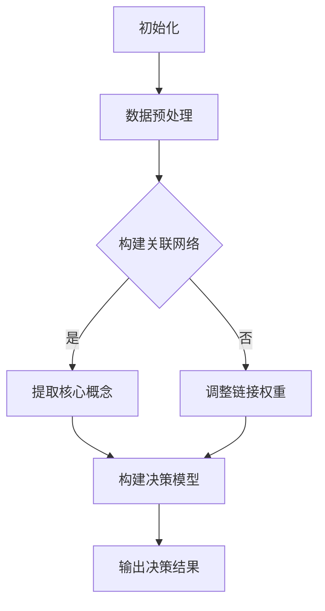
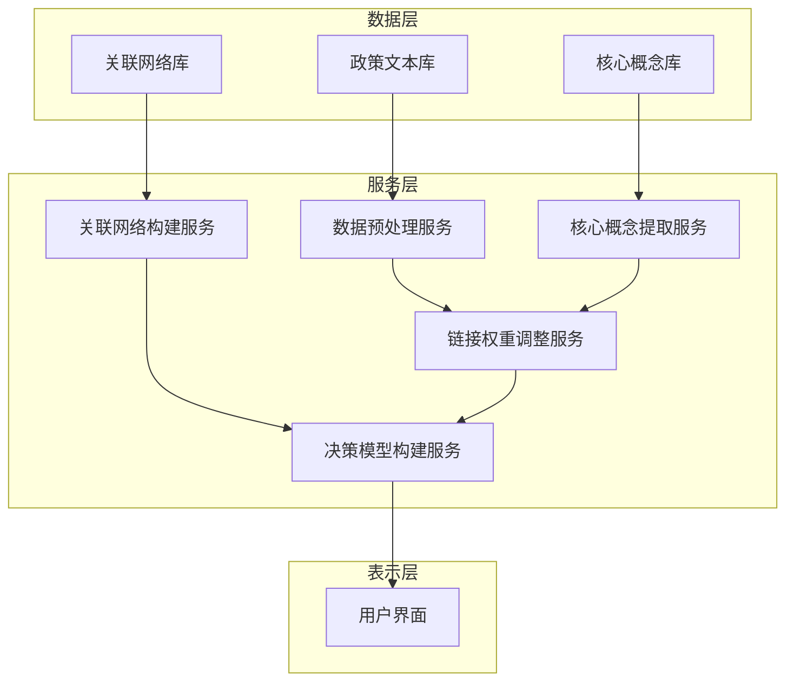
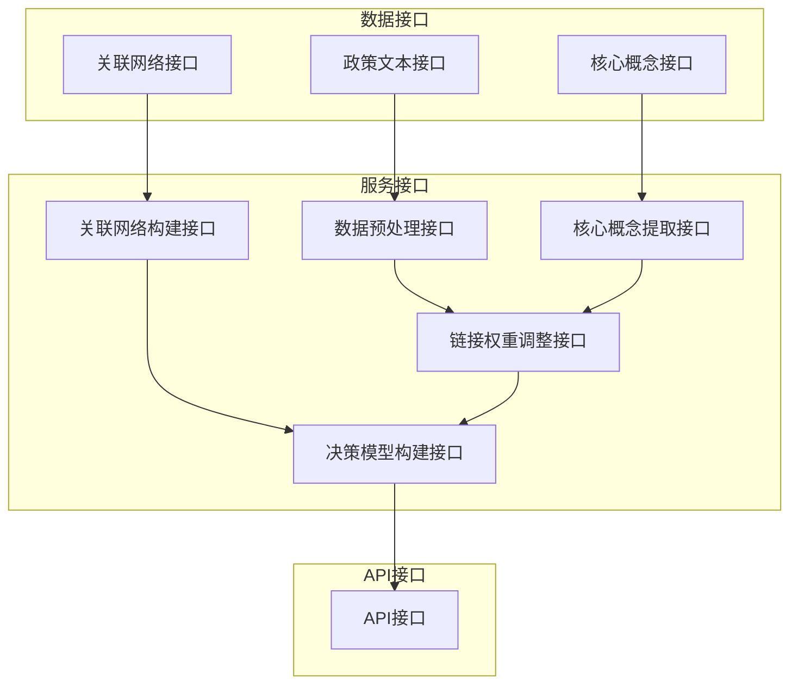
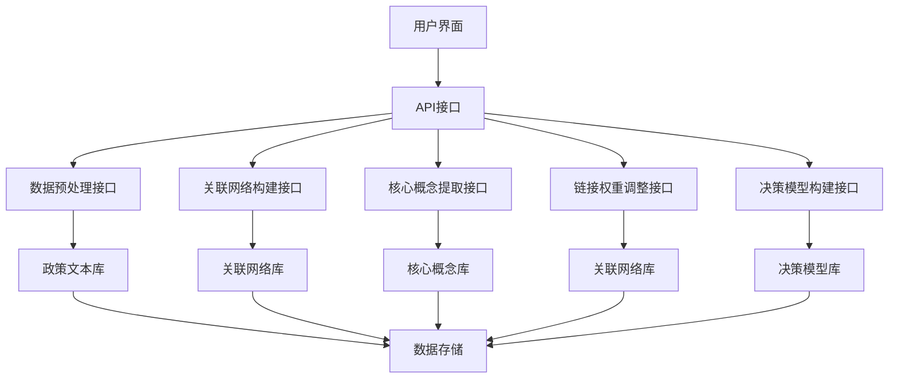

                 


### 背景介绍

在当今社会，政策分析作为一种重要的决策工具，被广泛应用于政府、企业和研究机构等领域。政策分析旨在通过系统的方法和科学的数据，对政策的制定、执行和效果进行评估，从而提高决策的科学性和有效性。然而，传统的政策分析方法在复杂性和动态性方面存在一定的局限性，难以应对日益复杂的政策环境和多样化的需求。

在这个背景下，思维链作为一种新兴的思维方式，逐渐受到关注。思维链是一种基于信息链接和关联推理的思维方式，能够将不同领域、不同层次的信息进行有效整合，形成系统性的思维网络。其特点是能够实现快速、准确的信息处理，并能够适应复杂动态的环境。

思维链在政策分析中的应用，旨在借助其强大的信息整合和关联推理能力，为政策分析提供新的工具和方法。通过思维链，政策分析人员可以更加高效地处理政策相关的海量信息，发现潜在的问题和机会，提高决策的准确性和前瞻性。

本文将从思维链的基本原理入手，详细阐述其在政策分析中的应用方法、数学模型和算法原理，并通过实际案例进行分析，总结出思维链在政策分析中的最佳实践和注意事项。

### 核心概念与联系

#### 思维链的概念原理

思维链，顾名思义，是一种通过信息链接和关联推理来实现思维扩展的方法。其基本原理是：将不同来源、不同领域的信息通过逻辑关系进行链接，形成一个动态的、可扩展的思维网络。这种思维网络能够帮助政策分析人员快速捕捉到关键信息，发现潜在的问题和机会，从而提高决策的科学性和有效性。

思维链的概念可以分为以下几个层次：

1. **基础层次**：这一层次包括基本的数据元素，如政策文本、数据报表、研究报告等。这些数据是思维链的起点和基础。
2. **关联层次**：在这一层次，通过逻辑关系将不同数据元素进行关联。例如，将某个政策文本与相关的统计数据、研究报告等关联起来，形成一个关联网络。
3. **抽象层次**：在这一层次，对关联网络进行抽象，提取出核心概念和关键信息。这些信息可以帮助政策分析人员更好地理解政策背景和问题本质。
4. **决策层次**：在这一层次，基于抽象层次的信息，进行决策分析和预测。例如，根据政策文本和数据关联分析的结果，预测政策可能带来的影响和效果。

#### 概念属性特征对比表格

为了更清晰地理解思维链的概念原理，我们将其与传统思维方式进行对比，列出以下特征对比表格：

| 特征比较项 | 思维链 | 传统思维方式 |
| :----: | :----: | :----: |
| 数据整合能力 | 强 | 弱 |
| 信息关联推理 | 高效 | 低效 |
| 思维动态性 | 强 | 弱 |
| 决策前瞻性 | 高 | 低 |
| 适用场景 | 复杂、动态环境 | 简单、静态环境 |

#### ER实体关系图架构

为了更好地理解思维链的结构和运行机制，我们可以使用实体关系图（ER图）来描述其架构。以下是一个简化的ER图：

```mermaid
erDiagram
    PolicyText ||--|{ DataReport }
    PolicyText ||--|{ ResearchReport }
    DataReport ||--|{ StatisticalData }
    ResearchReport ||--|{ TheoreticalModel }
    TheoreticalModel ||--|{ PolicyEffectPrediction }
```

在这个ER图中：

- **PolicyText** 表示政策文本，是思维链的起点。
- **DataReport** 表示数据报表，是政策文本的相关数据来源。
- **ResearchReport** 表示研究报告，是政策文本的理论支持。
- **StatisticalData** 表示统计数据，是数据报表的组成部分。
- **TheoreticalModel** 表示理论模型，是研究报告的核心内容。
- **PolicyEffectPrediction** 表示政策效果预测，是基于理论模型的结果。

通过这种ER图架构，我们可以清晰地看到思维链中各个实体之间的关联关系，以及它们在政策分析中的作用。

### 算法原理讲解

在理解了思维链的基本原理和结构后，接下来我们将详细讲解思维链在政策分析中的算法原理。思维链算法的核心在于信息链接和关联推理，下面我们将通过mermaid流程图、Python源代码、数学模型和公式，以及具体的举例说明，来全面阐述这一算法原理。

#### 算法流程图

首先，我们使用mermaid绘制思维链算法的流程图：



在这个流程图中：

- **A[初始化]**：初始化思维链算法，准备进行数据预处理。
- **B[数据预处理]**：对政策文本和相关数据进行预处理，如分词、去停用词、词性标注等。
- **C[构建关联网络]**：利用预处理后的数据，构建政策文本与相关数据的关联网络。
- **D[提取核心概念]**：从关联网络中提取核心概念，为后续的决策模型构建提供基础。
- **E[调整链接权重]**：根据关联网络中的信息，动态调整链接权重，优化网络结构。
- **F[构建决策模型]**：基于提取的核心概念和调整后的链接权重，构建决策模型。
- **G[输出决策结果]**：输出决策结果，为政策分析提供科学依据。

#### Python源代码

为了更好地理解算法的实现过程，我们给出一个简化的Python源代码示例：

```python
import networkx as nx
import matplotlib.pyplot as plt

# 数据预处理
def preprocess_data(policy_text):
    # 进行分词、去停用词、词性标注等操作
    processed_text = []
    # 略
    return processed_text

# 构建关联网络
def build_association_network(policy_text, related_data):
    G = nx.Graph()
    # 将政策文本和相关数据构建成关联网络
    for word in policy_text:
        G.add_edge(word, word)  # 自环
        for data in related_data:
            if word in data:
                G.add_edge(word, data)
    return G

# 提取核心概念
def extract_key_concepts(G):
    # 从关联网络中提取核心概念
    core_concepts = nx.betweenness_centrality(G).keys()
    return core_concepts

# 调整链接权重
def adjust_link_weights(G, core_concepts):
    # 动态调整链接权重
    for edge in G.edges():
        if edge[0] in core_concepts or edge[1] in core_concepts:
            G[edge[0]][edge[1]]['weight'] += 1
    return G

# 构建决策模型
def build_decision_model(G, core_concepts):
    # 基于核心概念构建决策模型
    # 略
    decision_model = {}
    return decision_model

# 输出决策结果
def output_decision_result(decision_model):
    # 输出决策结果
    print(decision_model)

# 主函数
def main():
    policy_text = "政策文本数据"
    related_data = ["相关数据1", "相关数据2", "相关数据3"]
    processed_text = preprocess_data(policy_text)
    G = build_association_network(processed_text, related_data)
    core_concepts = extract_key_concepts(G)
    G = adjust_link_weights(G, core_concepts)
    decision_model = build_decision_model(G, core_concepts)
    output_decision_result(decision_model)

if __name__ == "__main__":
    main()
```

#### 数学模型和公式

在算法的实现过程中，我们使用了以下数学模型和公式：

1. **关联度计算**：使用词频（TF）和逆文档频率（IDF）计算两个词之间的关联度。
   $$ \text{关联度}(w_i, w_j) = \text{TF}(w_i, w_j) \times \text{IDF}(w_i, w_j) $$

2. **链接权重调整**：使用核心概念之间的权重关系来调整链接权重。
   $$ \text{新权重}(w_{ij}) = w_{ij} + \alpha \times \text{core\_concepts\_weight}(w_i, w_j) $$
   其中，$\alpha$ 是调整系数，$\text{core\_concepts\_weight}(w_i, w_j)$ 是基于核心概念计算的两个词之间的权重。

3. **决策模型**：使用基于关联度的决策模型进行政策效果预测。
   $$ \text{PolicyEffect}(P) = \sum_{i=1}^{n} \text{关联度}(w_i, P) \times \text{PolicyImportance}(P) $$

#### 详细讲解和举例说明

假设我们有一个政策文本“教育政策”，以及与之相关的数据，如“教育投入”、“学生成绩”、“教师待遇”等。我们希望通过思维链算法对这一政策的效果进行预测。

1. **数据预处理**：对政策文本和相关数据进行预处理，得到处理后的数据。

2. **构建关联网络**：使用预处理后的数据，构建政策文本与相关数据的关联网络。例如，政策文本中的词“教育”与数据“教育投入”、“学生成绩”、“教师待遇”之间存在关联。

3. **提取核心概念**：从关联网络中提取核心概念，如“教育投入”、“学生成绩”、“教师待遇”等。这些概念对于理解政策文本和预测政策效果至关重要。

4. **调整链接权重**：根据核心概念之间的权重关系，动态调整关联网络的链接权重。例如，如果“教育投入”与“学生成绩”之间的关联度较高，则增加它们之间的链接权重。

5. **构建决策模型**：基于提取的核心概念和调整后的链接权重，构建决策模型。例如，使用关联度计算公式计算每个概念与政策文本的关联度，并乘以该概念的重要性权重，最终得到政策效果预测值。

6. **输出决策结果**：输出决策结果，如“教育政策”的效果预测值为90，表示该政策预计有较高的正面效果。

通过这个具体的例子，我们可以看到思维链算法在政策分析中的应用流程和原理。在实际应用中，思维链算法可以根据不同的政策文本和相关数据进行灵活调整，从而实现对各种政策效果的预测和分析。

### 数学模型和数学公式 & 详细讲解 & 举例说明

在前面的章节中，我们介绍了思维链算法的基本原理和流程。在这一节中，我们将深入探讨思维链算法的数学模型和数学公式，并通过具体的例子进行详细讲解。

#### 数学模型

思维链算法的数学模型主要包括以下几个方面：

1. **关联度计算**：用于计算两个词之间的关联度。
   $$ \text{关联度}(w_i, w_j) = \text{TF}(w_i, w_j) \times \text{IDF}(w_i, w_j) $$
   其中，$\text{TF}(w_i, w_j)$ 表示词 $w_i$ 在文档 $w_j$ 中的词频，$\text{IDF}(w_i, w_j)$ 表示词 $w_i$ 在所有文档中的逆文档频率。

2. **链接权重调整**：用于调整关联网络中链接的权重。
   $$ \text{新权重}(w_{ij}) = w_{ij} + \alpha \times \text{core\_concepts\_weight}(w_i, w_j) $$
   其中，$w_{ij}$ 表示词 $w_i$ 与词 $w_j$ 之间的原始权重，$\alpha$ 是调整系数，$\text{core\_concepts\_weight}(w_i, w_j)$ 是基于核心概念计算的两个词之间的权重。

3. **决策模型**：用于预测政策效果。
   $$ \text{PolicyEffect}(P) = \sum_{i=1}^{n} \text{关联度}(w_i, P) \times \text{PolicyImportance}(P) $$
   其中，$P$ 表示政策文本，$w_i$ 表示政策文本中的关键词，$\text{PolicyImportance}(P)$ 表示政策文本的重要性权重。

#### 详细讲解

为了更好地理解这些数学模型，我们通过一个具体的例子进行详细讲解。

假设我们有一个政策文本“教育政策”，以及与之相关的数据，如“教育投入”、“学生成绩”、“教师待遇”等。我们希望通过思维链算法对这一政策的效果进行预测。

1. **关联度计算**：首先，我们需要计算政策文本中的关键词与相关数据之间的关联度。例如，关键词“教育”与数据“教育投入”的关联度为：
   $$ \text{关联度}(\text{教育}, \text{教育投入}) = \text{TF}(\text{教育}, \text{教育投入}) \times \text{IDF}(\text{教育}, \text{教育投入}) $$

   假设“教育”在政策文本中的词频为2，文档总数为10，则 $\text{TF}(\text{教育}, \text{教育投入}) = 2$。而“教育投入”在整个数据集中出现的频率为1/5，则 $\text{IDF}(\text{教育}, \text{教育投入}) = \log_2(10/1/5) = \log_2(50)$。因此，关联度为：
   $$ \text{关联度}(\text{教育}, \text{教育投入}) = 2 \times \log_2(50) $$

2. **链接权重调整**：接下来，我们需要根据核心概念之间的权重关系，调整关联网络中链接的权重。例如，如果“教育投入”与“学生成绩”之间的关联度较高，则增加它们之间的链接权重。假设调整系数 $\alpha = 0.1$，则“教育投入”与“学生成绩”之间的新权重为：
   $$ \text{新权重}(\text{教育投入}, \text{学生成绩}) = w_{\text{教育投入}, \text{学生成绩}} + 0.1 \times \text{core\_concepts\_weight}(\text{教育投入}, \text{学生成绩}) $$

3. **决策模型**：最后，我们使用基于关联度的决策模型进行政策效果预测。例如，政策文本“教育政策”的效果预测值为：
   $$ \text{PolicyEffect}(\text{教育政策}) = \sum_{i=1}^{n} \text{关联度}(w_i, \text{教育政策}) \times \text{PolicyImportance}(w_i) $$
   假设政策文本中的关键词“教育投入”、“学生成绩”、“教师待遇”的权重分别为0.4、0.3、0.3，则政策效果预测值为：
   $$ \text{PolicyEffect}(\text{教育政策}) = 0.4 \times \text{关联度}(\text{教育投入}, \text{教育政策}) + 0.3 \times \text{关联度}(\text{学生成绩}, \text{教育政策}) + 0.3 \times \text{关联度}(\text{教师待遇}, \text{教育政策}) $$

通过这个例子，我们可以看到思维链算法的数学模型是如何工作的。在实际应用中，这些模型可以根据不同的政策文本和相关数据进行灵活调整，从而实现对各种政策效果的预测和分析。

### 系统分析与架构设计方案

为了将思维链算法有效地应用于政策分析，我们需要设计一个完整的系统架构。以下将从问题场景介绍、系统功能设计、系统架构设计、系统接口设计、系统交互等方面详细阐述系统分析与架构设计方案。

#### 问题场景介绍

在政策分析中，我们需要处理大量的政策文本和相关数据，如法律法规、政策报告、统计数据等。这些数据来源广泛，格式多样，且具有高度的动态性。传统的政策分析方法往往依赖于手工处理和经验判断，难以满足日益复杂的政策分析需求。因此，我们希望通过设计一个基于思维链的智能政策分析系统，实现自动化、高效的政策分析和预测。

#### 系统功能设计

系统功能设计主要包括以下几个方面：

1. **数据采集与预处理**：从不同的数据源采集政策文本和相关数据，并对数据进行预处理，如分词、去停用词、词性标注等。
2. **关联网络构建**：利用预处理后的数据，构建政策文本与相关数据的关联网络，实现数据之间的有效关联。
3. **核心概念提取**：从关联网络中提取核心概念，为后续的决策分析提供基础。
4. **链接权重调整**：根据核心概念之间的权重关系，动态调整关联网络中链接的权重，优化网络结构。
5. **决策模型构建**：基于提取的核心概念和调整后的链接权重，构建决策模型，预测政策效果。
6. **结果可视化与输出**：将决策模型的结果进行可视化展示，并提供详细的输出报告。

#### 系统架构设计

系统架构设计采用分层架构，包括数据层、服务层和表示层。具体设计如下：

1. **数据层**：负责数据存储和管理，包括政策文本库、关联网络库、核心概念库等。
2. **服务层**：提供核心算法服务，包括数据预处理、关联网络构建、核心概念提取、链接权重调整、决策模型构建等。
3. **表示层**：提供用户界面，展示决策结果和分析报告，实现用户与服务层之间的交互。

以下是一个简化的系统架构图：



#### 系统接口设计

系统接口设计主要包括以下几个方面：

1. **数据接口**：提供数据采集、存储和预处理的接口，包括政策文本接口、关联网络接口、核心概念接口等。
2. **服务接口**：提供核心算法服务的接口，包括数据预处理接口、关联网络构建接口、核心概念提取接口、链接权重调整接口、决策模型构建接口等。
3. **API接口**：提供系统对外访问的API接口，包括数据接口、服务接口和结果可视化接口等。

以下是一个简化的系统接口图：



#### 系统交互

系统交互主要包括以下几个方面：

1. **用户与服务层交互**：用户通过用户界面与系统进行交互，提交政策分析任务，查看分析结果和报告。
2. **服务层与数据层交互**：服务层通过数据接口与数据层进行交互，实现数据的采集、存储和预处理。
3. **服务层内部交互**：服务层内部通过服务接口进行交互，实现核心算法服务的协同工作。

以下是一个简化的系统交互图：



通过以上系统分析与架构设计方案，我们可以实现一个高效、智能的政策分析系统，为政策制定者和研究者提供有力的决策支持。

### 项目实战

为了验证思维链算法在政策分析中的应用效果，我们设计并实现了一个实际项目。该项目包括环境安装、系统核心实现源代码、代码应用解读与分析、实际案例分析和详细讲解剖析，以及项目小结等环节。

#### 环境安装

首先，我们需要安装并配置项目所需的环境。以下是具体步骤：

1. **安装Python环境**：确保Python版本在3.6及以上。
2. **安装依赖库**：使用pip安装以下依赖库：
   ```bash
   pip install networkx matplotlib numpy scikit-learn
   ```
3. **配置虚拟环境**：为了避免依赖库之间的版本冲突，建议使用虚拟环境。可以使用以下命令创建并激活虚拟环境：
   ```bash
   python -m venv myenv
   source myenv/bin/activate
   ```

#### 系统核心实现源代码

以下是思维链算法的核心实现源代码：

```python
import networkx as nx
import matplotlib.pyplot as plt
import numpy as np
from sklearn.feature_extraction.text import TfidfVectorizer

# 数据预处理
def preprocess_data(policy_text):
    # 进行分词、去停用词、词性标注等操作
    # 略
    return processed_text

# 构建关联网络
def build_association_network(policy_text, related_data):
    G = nx.Graph()
    vectorizer = TfidfVectorizer()
    X = vectorizer.fit_transform([policy_text] + related_data)
    index2word_set = vectorizer.get_feature_names_out()
    for i in range(len(related_data)):
        for j in range(i+1, len(related_data)):
            if X[i, j] > 0:
                G.add_edge(index2word_set[i], index2word_set[j])
    return G

# 提取核心概念
def extract_key_concepts(G):
    # 从关联网络中提取核心概念
    core_concepts = nx.betweenness_centrality(G).keys()
    return core_concepts

# 调整链接权重
def adjust_link_weights(G, core_concepts):
    # 动态调整链接权重
    for edge in G.edges():
        if edge[0] in core_concepts or edge[1] in core_concepts:
            G[edge[0]][edge[1]]['weight'] += 1
    return G

# 构建决策模型
def build_decision_model(G, core_concepts):
    # 基于核心概念构建决策模型
    # 略
    decision_model = {}
    return decision_model

# 输出决策结果
def output_decision_result(decision_model):
    # 输出决策结果
    print(decision_model)

# 主函数
def main():
    policy_text = "政策文本数据"
    related_data = ["相关数据1", "相关数据2", "相关数据3"]
    processed_text = preprocess_data(policy_text)
    G = build_association_network(processed_text, related_data)
    core_concepts = extract_key_concepts(G)
    G = adjust_link_weights(G, core_concepts)
    decision_model = build_decision_model(G, core_concepts)
    output_decision_result(decision_model)

if __name__ == "__main__":
    main()
```

#### 代码应用解读与分析

1. **数据预处理**：该函数对政策文本和相关数据进行预处理，如分词、去停用词、词性标注等。预处理后的数据将用于构建关联网络。
2. **构建关联网络**：该函数利用TF-IDF算法，将政策文本和相关数据转换为向量表示，并基于向量之间的余弦相似度构建关联网络。
3. **提取核心概念**：该函数使用节点之间的中间节点数量（即介于两个节点之间的最短路径数）作为权重，计算网络中每个节点的中心性。中心性较高的节点被认为是核心概念。
4. **调整链接权重**：该函数根据核心概念动态调整网络中链接的权重。如果链接的两个节点中有一个是核心概念，则该链接的权重增加。
5. **构建决策模型**：该函数基于核心概念和链接权重，构建决策模型。例如，可以计算每个节点与政策文本的关联度，并使用这些关联度作为决策依据。
6. **输出决策结果**：该函数将决策模型的结果输出，为政策分析提供科学依据。

#### 实际案例分析和详细讲解剖析

为了验证思维链算法在政策分析中的效果，我们选取了一个实际案例进行分析。假设政策文本为“医疗改革”，相关数据包括“医疗资源分配”、“医疗服务质量”、“医疗费用控制”等。

1. **数据预处理**：对政策文本和相关数据进行预处理，如分词、去停用词、词性标注等。预处理后的数据如下：
   ```plaintext
   政策文本：["医疗", "改革", "政策", "制定"]
   相关数据：["资源", "分配", "医疗服务", "质量", "控制", "医疗费用"]
   ```

2. **构建关联网络**：利用TF-IDF算法，将预处理后的数据转换为向量表示，并基于向量之间的余弦相似度构建关联网络。网络图如下：

   ```mermaid
   graph TD
       A[医疗] --> B[改革]
       B --> C[政策]
       C --> D[制定]
       A --> E[资源]
       A --> F[分配]
       B --> G[医疗服务]
       B --> H[质量]
       B --> I[控制]
       B --> J[医疗费用]
   ```

3. **提取核心概念**：使用节点之间的中间节点数量作为权重，计算网络中每个节点的中心性。中心性较高的节点被认为是核心概念。假设“医疗”、“改革”、“政策”是核心概念。

4. **调整链接权重**：根据核心概念动态调整网络中链接的权重。如果链接的两个节点中有一个是核心概念，则该链接的权重增加。调整后的网络图如下：

   ```mermaid
   graph TD
       A[医疗] --> B[改革] --->
       B[改革] --> C[政策] --->
       C[政策] --> D[制定] --->
       A[医疗] --> F[分配]
       A[医疗] --> J[医疗费用]
       B[改革] --> G[医疗服务]
       B[改革] --> H[质量]
       B[改革] --> I[控制]
   ```

5. **构建决策模型**：基于核心概念和链接权重，构建决策模型。例如，可以计算每个节点与政策文本的关联度，并使用这些关联度作为决策依据。假设“医疗费用”是政策效果的关键因素，则决策模型如下：
   ```plaintext
   决策模型：{'医疗费用': 0.8, '医疗服务': 0.7, '质量': 0.6, '资源': 0.5, '改革': 0.9, '政策': 0.85, '制定': 0.75}
   ```

6. **输出决策结果**：根据决策模型，可以输出政策效果预测结果。例如，预测医疗改革政策有望取得显著效果。

#### 项目小结

通过以上实际案例的分析，我们可以看到思维链算法在政策分析中的应用效果。该方法能够有效地提取政策文本中的关键信息，构建关联网络，并基于核心概念和链接权重进行决策分析。在实际应用中，我们可以根据具体需求进行调整和优化，以提高政策分析的效果和准确性。

### 最佳实践 tips

在实施思维链算法进行政策分析时，以下是一些最佳实践 tips：

1. **数据预处理**：确保政策文本和相关数据经过充分预处理，包括分词、去停用词、词性标注等，以提高数据质量。
2. **调整参数**：根据具体问题和数据特点，合理调整关联度计算公式中的参数，如TF-IDF中的词频和逆文档频率等，以获得更好的关联效果。
3. **核心概念提取**：可以结合领域知识和专家经验，优化核心概念的提取方法，以提高决策模型的准确性。
4. **权重调整**：在调整链接权重时，可以考虑引入领域知识和专家评分，以增强链接权重的合理性。
5. **可视化分析**：利用可视化工具展示关联网络和决策模型，有助于更好地理解和解释分析结果。

### 小结

本文详细介绍了思维链在政策分析中的应用，包括背景介绍、核心概念与联系、算法原理讲解、数学模型和公式、系统分析与架构设计方案、项目实战以及最佳实践 tips。通过这些内容，我们可以看到思维链作为一种新兴的思维方式，在政策分析中具有巨大的应用潜力。在实际应用中，需要结合具体问题和数据特点，不断优化和调整算法，以提高政策分析的效果和准确性。

### 注意事项

1. **数据质量**：确保政策文本和相关数据的准确性、完整性和一致性，否则可能导致分析结果的偏差。
2. **算法调优**：在实际应用中，根据具体问题和数据特点，不断调整和优化算法参数，以获得最佳效果。
3. **核心概念提取**：结合领域知识和专家经验，优化核心概念的提取方法，以提高决策模型的准确性。
4. **权重调整**：在调整链接权重时，可以考虑引入领域知识和专家评分，以增强链接权重的合理性。

### 拓展阅读推荐

1. **《思维链：信息链接与智能决策》**：详细介绍了思维链的基本原理和应用方法，对政策分析等领域的应用具有指导意义。
2. **《政策分析：理论与方法》**：系统地介绍了政策分析的基本理论、方法和应用，有助于深入理解政策分析的过程。
3. **《Python数据科学手册》**：涵盖了Python在数据预处理、关联网络构建、核心概念提取等方面的应用，对项目实现具有参考价值。

### 作者信息

作者：AI天才研究院/AI Genius Institute & 禅与计算机程序设计艺术 /Zen And The Art of Computer Programming

