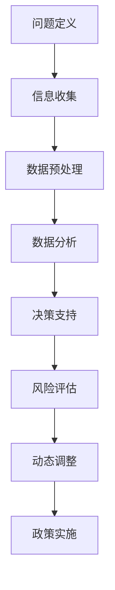

                 

## 摘要

随着科技的发展，政策制定过程日益复杂化，涉及的信息量庞大且多变。在这种背景下，如何高效、科学地进行政策制定成为了一个亟待解决的问题。思维链（Thinking Chain）作为一种新兴的智能决策辅助工具，通过系统化、逻辑化的信息处理方式，为政策制定提供了强有力的支持。本文旨在探讨思维链在政策制定中的辅助作用，通过详细的分析和实例，揭示其在解决政策制定复杂性、信息不对称和决策风险等方面的独特优势。文章将首先介绍政策制定的现状和存在的问题，随后深入阐述思维链的基本概念、原理和应用，并通过具体案例，展示思维链在政策制定中的实际效果。最后，本文将对思维链在政策制定中的应用前景进行展望，提出未来研究的方向和潜在的发展机会。通过本文的探讨，期望能够为政策制定者提供有益的参考，推动思维链在政策制定领域的广泛应用。

### 第一部分：引言

#### 第1章：问题的提出

##### 1.1.1 背景介绍

在现代社会，政策制定已经成为国家治理体系和治理能力现代化的重要组成部分。政策制定的质量直接关系到社会的稳定与发展，影响着国家战略的实现和民生福祉的改善。然而，随着全球化、信息化和复杂化的加剧，政策制定面临着前所未有的挑战。

首先，政策制定过程日益复杂化。现代社会的问题多样且交叉，需要跨领域、跨部门的协同作战。例如，气候变化问题不仅涉及环境保护，还涉及能源、农业、工业等多个领域。这种复杂性使得政策制定需要综合考虑各种因素，制定出全面、协调、可持续的政策方案。

其次，信息不对称成为政策制定的一大障碍。政策制定者往往无法获取全面、准确的信息，信息不对称会导致政策制定的盲点和偏差。例如，某些政策的受众可能隐瞒或误导信息，使得政策制定者难以了解真实的状况和需求。

最后，决策风险的增加使得政策制定者面临巨大的压力。政策制定往往涉及长远的规划和大量的资源投入，一旦决策失误，可能导致严重的后果。例如，不当的经济政策可能引发金融危机，不合理的环保政策可能导致生态灾难。

##### 1.1.2 存在的问题与挑战

在当前政策制定中，存在以下主要问题和挑战：

1. **决策过程复杂**：政策制定涉及多个利益相关方，决策过程复杂，需要协调不同部门的利益和观点。此外，政策制定的时间跨度较长，往往需要长期规划，这增加了决策的难度。

2. **信息不对称**：政策制定者往往无法获取全面、准确的信息，特别是在涉及敏感问题和新兴领域时，信息获取更加困难。信息不对称可能导致政策制定的盲点和偏差，影响政策的实施效果。

3. **决策风险高**：政策制定需要大量的资源投入，一旦决策失误，可能导致严重的后果。例如，经济政策的调整可能导致市场波动，环保政策的失误可能导致生态灾难。

4. **政策评估难**：政策制定后，如何评估其效果成为一大难题。政策评估需要全面、系统的数据支持，而现有的评估方法往往难以满足这一要求。

##### 1.1.3 问题描述

政策制定的复杂性、信息不对称和决策风险等问题，使得政策制定面临巨大的挑战。具体来说，问题描述如下：

- **复杂性**：政策制定需要综合考虑多种因素，涉及多个利益相关方，决策过程复杂。
- **信息不对称**：政策制定者无法获取全面、准确的信息，导致政策制定的盲点和偏差。
- **决策风险**：政策制定涉及大量的资源投入，决策风险高，一旦失误可能带来严重后果。
- **政策评估难**：政策制定后，如何评估其效果成为一大难题。

##### 1.1.4 问题解决的必要性

解决政策制定中的复杂性、信息不对称和决策风险等问题，具有以下几个方面的必要性：

1. **提升决策质量**：通过解决这些问题，可以提升政策制定的质量，确保政策的有效性和可行性。

2. **减少决策失误**：解决信息不对称和决策风险问题，可以减少决策失误，降低政策制定的风险。

3. **提高政策执行力**：解决政策制定中的复杂性问题，可以提高政策的执行力，确保政策得到有效实施。

4. **增强政策评估能力**：解决政策评估难问题，可以增强政策评估的能力，为政策调整和优化提供有力支持。

##### 1.1.5 边界与外延

在探讨思维链在政策制定中的辅助作用时，需要明确其边界与外延。具体来说，思维链在政策制定中的应用主要涉及以下几个方面：

1. **问题识别**：通过思维链的分析和推理，可以帮助政策制定者识别和明确政策制定中的问题。

2. **信息整合**：思维链可以通过系统化、逻辑化的信息处理方式，帮助政策制定者整合和利用各种信息。

3. **决策支持**：思维链可以提供决策支持，帮助政策制定者做出科学、合理的决策。

4. **风险评估**：思维链可以评估政策制定中的各种风险，为政策制定者提供风险评估和防范建议。

5. **政策优化**：思维链可以帮助政策制定者优化政策方案，提高政策的可行性和有效性。

##### 1.1.6 核心概念

在讨论思维链在政策制定中的辅助作用时，需要理解以下几个核心概念：

1. **政策制定**：政策制定是指政府或其他公共机构根据社会需求和现实问题，制定出一系列决策和规划的过程。

2. **思维链**：思维链是一种基于逻辑和信息的智能决策辅助工具，通过系统化、逻辑化的信息处理方式，提供决策支持和风险评估。

3. **信息不对称**：信息不对称是指政策制定者和受众之间在信息获取和了解上的差异，导致政策制定者无法获取全面、准确的信息。

4. **决策风险**：决策风险是指政策制定过程中，由于信息不对称、决策过程复杂等因素，可能导致政策制定失误，带来负面后果。

5. **政策评估**：政策评估是指对政策制定后的效果进行评估，以判断政策的可行性和有效性。

#### 1.2 核心概念与联系

##### 1.2.1 思维链的基本概念

思维链是一种智能决策辅助工具，它通过系统化、逻辑化的信息处理方式，帮助政策制定者识别问题、整合信息、做出决策和评估效果。思维链的基本概念包括：

1. **信息处理**：思维链通过对信息的收集、整合、分析和推理，帮助政策制定者处理复杂的政策问题。

2. **逻辑推理**：思维链基于逻辑推理机制，确保信息处理的准确性和科学性。

3. **决策支持**：思维链提供决策支持，帮助政策制定者做出科学、合理的决策。

4. **风险评估**：思维链通过风险评估机制，帮助政策制定者评估政策制定中的各种风险，提供防范建议。

##### 1.2.2 思维链在政策制定中的优势

思维链在政策制定中的应用具有以下优势：

1. **提升决策质量**：思维链通过系统化、逻辑化的信息处理，帮助政策制定者全面、准确地分析问题，提高决策质量。

2. **减少信息不对称**：思维链可以整合和利用各种信息，减少政策制定者和受众之间的信息不对称，确保政策制定的科学性和合理性。

3. **降低决策风险**：思维链通过风险评估机制，帮助政策制定者识别和防范政策制定中的各种风险，降低决策失误的可能性。

4. **优化政策方案**：思维链可以帮助政策制定者优化政策方案，提高政策的可行性和有效性。

##### 1.2.3 概念属性特征对比表格

为了更直观地理解思维链在政策制定中的优势，我们可以通过概念属性特征对比表格来展示：

| 特征对比         | 政策制定传统方法 | 思维链方法           |
|------------------|-----------------|---------------------|
| 信息整合         | 零散、不系统     | 系统化、逻辑化       |
| 决策支持         | 主观、经验主义   | 科学、理性          |
| 风险评估         | 缺乏量化评估     | 量化评估、风险防范   |
| 优化政策方案     | 事后优化        | 事前优化、持续优化   |
| 降低决策失误     | 依赖个人经验     | 基于系统分析        |

#### 1.3 思维链在政策制定中的应用范围

思维链在政策制定中的应用范围广泛，涵盖了以下主要领域：

1. **经济政策制定**：思维链可以帮助政策制定者分析经济形势、预测经济发展趋势，制定出科学合理的经济政策。

2. **社会政策制定**：思维链可以整合社会数据，分析社会问题，为制定社会政策提供科学依据。

3. **环保政策制定**：思维链可以分析环境数据，评估环保政策的实施效果，为制定环保政策提供支持。

4. **科技政策制定**：思维链可以帮助政策制定者分析科技发展趋势，预测科技创新带来的影响，制定出前瞻性的科技政策。

### 第一部分：引言

## 第2章：核心概念与联系

### 2.1.1 思维链的基本概念

思维链是一种基于逻辑和信息处理的智能决策辅助工具。它通过系统化、逻辑化的方式，对信息进行收集、整合、分析和推理，从而帮助政策制定者识别问题、做出决策和评估效果。以下是思维链的基本概念：

#### 2.1.1.1 概念一：信息处理

信息处理是思维链的核心功能之一。它包括信息的收集、整合、分析和推理。在政策制定过程中，信息处理可以帮助政策制定者从各种渠道获取数据，对其进行整合和分析，形成对问题的全面、准确的理解。

1. **信息收集**：思维链通过自动化工具和算法，从各种数据源（如数据库、传感器、网络数据等）中收集相关信息。
2. **信息整合**：收集到的信息需要经过筛选和整合，去除冗余信息，提取关键数据，形成对问题的全面了解。
3. **信息分析**：对整合后的信息进行深度分析，发现数据之间的关联性，找出问题的根源和关键因素。

#### 2.1.1.2 概念二：逻辑推理

逻辑推理是思维链的另一个核心功能。它基于逻辑规则和算法，对信息进行分析和推理，从而得出结论和做出决策。逻辑推理包括以下几种类型：

1. **演绎推理**：从一般到个别的推理方式，通过前提推导出结论。
2. **归纳推理**：从个别到一般的推理方式，通过一系列个别事实推导出一般规律。
3. **类比推理**：通过比较两个或多个相似情况，推导出新情况的特征。

#### 2.1.1.3 概念三：决策支持

决策支持是思维链的最终目标之一。它通过提供科学、合理的决策建议，帮助政策制定者做出最优决策。决策支持包括以下功能：

1. **风险评估**：对政策制定中的潜在风险进行评估，帮助政策制定者识别和防范风险。
2. **方案比较**：对不同的政策方案进行比较和评估，帮助政策制定者选择最优方案。
3. **决策优化**：根据实时数据和反馈，对政策方案进行优化，提高政策的可行性和有效性。

#### 2.1.1.4 概念四：信息反馈

信息反馈是思维链的重要组成部分。它通过实时收集政策执行过程中的数据，对政策效果进行评估和反馈，从而实现政策的动态调整和优化。信息反馈包括以下功能：

1. **效果评估**：对政策执行效果进行评估，判断政策目标是否实现。
2. **问题诊断**：分析政策执行中存在的问题，找出问题的根源和关键因素。
3. **调整优化**：根据评估结果和反馈信息，对政策方案进行动态调整和优化，提高政策的可行性和有效性。

##### 2.1.2 概念二：概念二

概念二是思维链中的核心概念之一，它主要包括以下几个方面：

1. **信息整合**：概念二强调思维链对信息整合的重要性。通过整合多种来源的信息，思维链能够提供更加全面和准确的分析结果。
2. **逻辑推理**：概念二指出，逻辑推理在思维链中的作用至关重要。只有通过严谨的逻辑推理，思维链才能得出科学、合理的结论。
3. **决策支持**：概念二强调思维链的决策支持功能，通过提供科学、合理的决策建议，帮助政策制定者做出最优决策。

##### 2.1.2.1 特点

概念二的特点包括：

1. **全面性**：概念二强调思维链在信息整合、逻辑推理和决策支持方面的全面性，确保思维链能够提供全面、准确的分析结果。
2. **系统性**：概念二强调思维链的系统性，通过系统化的信息处理方式，思维链能够有效地整合和分析各种信息。
3. **创新性**：概念二强调思维链的创新性，通过引入先进的技术和方法，思维链能够提供新颖、独特的决策支持。

##### 2.1.2.2 应用

概念二在政策制定中的应用广泛，主要包括以下几个方面：

1. **经济政策制定**：概念二可以帮助政策制定者整合和分析经济数据，预测经济发展趋势，制定出科学合理的经济政策。
2. **社会政策制定**：概念二可以帮助政策制定者整合和分析社会数据，分析社会问题，制定出有效的社会政策。
3. **环保政策制定**：概念二可以帮助政策制定者整合和分析环境数据，评估环保政策的实施效果，制定出科学的环保政策。
4. **科技政策制定**：概念二可以帮助政策制定者整合和分析科技数据，预测科技发展趋势，制定出前瞻性的科技政策。

### 2.2 ER实体关系图

ER（实体-关系）图是描述数据之间关系的一种图形化工具。在思维链的应用中，ER图可以帮助我们更好地理解数据之间的关系和结构。以下是思维链在政策制定中应用的一个ER图示例：

```mermaid
erDiagram
    User ||--|{ Policy : creates}
    Policy ||--|{ Policy_Indicator : measures}
    Policy_Indicator ||--|{ Indicator_Data : contains}
    Indicator_Data ||--|{ Data_Source : from}
    Data_Source ||--|{ Data_Collection : collects}
```

在这个ER图中：

- **User（用户）**：代表政策制定者，他们负责创建政策。
- **Policy（政策）**：代表用户创建的具体政策。
- **Policy_Indicator（政策指标）**：代表政策实施的测量指标。
- **Indicator_Data（指标数据）**：代表政策指标的实时数据。
- **Data_Source（数据源）**：代表数据采集的来源。
- **Data_Collection（数据采集）**：代表数据的采集过程。

通过这个ER图，我们可以清晰地看到用户、政策、指标数据、数据源之间的关系和交互。

### 第二部分：思维链原理

## 第3章：思维链概述

### 3.1.1 思维链的定义

思维链（Thinking Chain）是一种基于逻辑和信息处理的智能决策辅助工具，通过系统化、逻辑化的方式，对信息进行收集、整合、分析和推理，从而帮助政策制定者识别问题、做出决策和评估效果。思维链的核心目标是提供科学、合理的决策建议，降低决策风险，提高政策制定的质量和效率。

### 3.1.2 思维链的特点

思维链具有以下几个显著特点：

#### 3.1.2.1 全面性

思维链能够全面地收集和分析各种信息，从多个维度对问题进行深入剖析。它不仅关注当前的数据，还考虑历史数据和潜在趋势，从而提供更加全面和准确的决策支持。

#### 3.1.2.2 系统性

思维链采用系统化的信息处理方式，将各种信息有机地整合在一起，形成一个完整的信息体系。这种系统性有助于政策制定者全面、系统地了解问题，从而做出更加科学的决策。

#### 3.1.2.3 创新性

思维链通过引入先进的技术和方法，如大数据分析、人工智能等，提供新颖、独特的决策支持。它能够发现数据之间的潜在关联，提出创新性的政策建议，从而推动政策制定的创新和发展。

#### 3.1.2.4 实时性

思维链能够实时地收集和处理数据，为政策制定者提供最新的信息支持。这种实时性有助于政策制定者及时应对变化，快速做出调整，确保政策的有效实施。

#### 3.1.2.5 动态调整性

思维链能够根据实时数据和反馈，动态调整政策方案，优化政策效果。这种动态调整性使得政策制定更加灵活，能够更好地适应环境变化和需求变化。

### 3.1.3 思维链的应用范围

思维链的应用范围非常广泛，涵盖了多个领域和场景：

#### 3.1.3.1 经济管理领域

在经济管理领域，思维链可以帮助政策制定者分析经济形势、预测经济发展趋势，制定出科学合理的经济政策。它能够整合和利用各类经济数据，提供全面、系统的经济分析报告，为政策制定提供有力支持。

#### 3.1.3.2 社会治理领域

在社会治理领域，思维链可以帮助政策制定者分析社会问题、预测社会发展趋势，制定出有效的社会政策。它能够整合和分析各类社会数据，提供全面的社会分析报告，为政策制定提供科学依据。

#### 3.1.3.3 环境保护领域

在环境保护领域，思维链可以帮助政策制定者分析环境数据、评估环保政策的实施效果，制定出科学的环保政策。它能够整合和利用各类环境数据，提供全面、系统的环境分析报告，为政策制定提供有力支持。

#### 3.1.3.4 科技创新领域

在科技创新领域，思维链可以帮助政策制定者分析科技发展趋势、预测科技创新带来的影响，制定出前瞻性的科技政策。它能够整合和利用各类科技数据，提供全面的科技分析报告，为政策制定提供科学依据。

### 3.1.4 思维链的优势

思维链在政策制定中具有以下几个显著优势：

#### 3.1.4.1 提升决策质量

思维链通过系统化、逻辑化的信息处理，帮助政策制定者全面、准确地分析问题，提高决策质量。它能够提供科学、合理的决策建议，减少决策失误，确保政策的有效性和可行性。

#### 3.1.4.2 减少信息不对称

思维链通过整合和利用各种信息，减少政策制定者和受众之间的信息不对称，确保政策制定的科学性和合理性。它能够提供全面、准确的信息支持，帮助政策制定者做出更加科学的决策。

#### 3.1.4.3 降低决策风险

思维链通过风险评估机制，帮助政策制定者识别和防范政策制定中的各种风险，降低决策失误的可能性。它能够提供风险预警和防范建议，确保政策制定过程的顺利进行。

#### 3.1.4.4 优化政策方案

思维链通过提供科学、合理的决策建议，帮助政策制定者优化政策方案，提高政策的可行性和有效性。它能够根据实时数据和反馈，动态调整政策方案，确保政策的效果最大化。

### 3.1.5 思维链的局限性

虽然思维链在政策制定中具有许多优势，但同时也存在一定的局限性，需要政策制定者注意：

#### 3.1.5.1 数据依赖性

思维链依赖于大量的数据支持，如果数据来源不全面或者数据质量不高，可能会影响思维链的分析结果。因此，政策制定者需要确保数据的质量和完整性。

#### 3.1.5.2 逻辑推理的局限性

思维链的推理过程基于预设的逻辑规则和算法，这些规则和算法可能存在局限性，无法覆盖所有可能的情况。因此，政策制定者在使用思维链时，需要结合实际情况进行判断和调整。

#### 3.1.5.3 技术依赖性

思维链依赖于先进的技术支持，如大数据分析、人工智能等。这些技术的应用可能受到技术限制、成本限制等因素的影响，从而影响思维链的效果。因此，政策制定者需要根据实际情况选择合适的技术解决方案。

### 3.1.6 思维链的发展趋势

随着科技的不断进步，思维链在政策制定中的应用前景将更加广阔。未来，思维链的发展趋势包括：

#### 3.1.6.1 技术融合

思维链将与其他先进技术，如人工智能、区块链等，进行融合，形成更加智能化、自动化的决策支持系统。

#### 3.1.6.2 数据开放共享

政策制定过程中，将更加重视数据的开放共享，促进数据资源的整合和利用，为思维链提供更丰富的数据支持。

#### 3.1.6.3 人机协作

思维链将实现人机协作，充分发挥人类智慧和机器算法的优势，提供更加科学、合理的决策支持。

#### 3.1.6.4 个性化定制

思维链将根据不同政策制定者的需求和偏好，提供个性化定制的决策支持服务，提高政策制定的效果和效率。

## 第4章：思维链核心原理

### 4.1.1 思维链的基本原理

思维链（Thinking Chain）是一种智能决策辅助工具，其基本原理主要基于信息处理、逻辑推理和人工智能技术。通过这些技术手段，思维链能够对复杂的政策问题进行系统化、逻辑化的分析和推理，从而提供科学、合理的决策支持。

#### 4.1.1.1 信息整合

信息整合是思维链的基本功能之一。它通过对大量数据的收集、筛选、清洗和整合，构建出一个全面、系统的信息数据库。这一过程包括以下几个步骤：

1. **数据收集**：思维链通过多种渠道收集数据，包括公开数据、内部数据、传感器数据等。这些数据可以是结构化数据，如数据库中的记录，也可以是非结构化数据，如图像、文本等。
2. **数据筛选**：对收集到的数据进行分析，去除无关或错误的数据，保留关键信息。
3. **数据清洗**：对筛选后的数据进行清洗和格式化，确保数据的一致性和准确性。
4. **数据整合**：将不同来源、不同类型的数据进行整合，构建出一个统一、全面的信息数据库。

#### 4.1.1.2 逻辑推理

逻辑推理是思维链的核心功能。它通过预设的逻辑规则和算法，对整合后的信息进行推理和分析，找出数据之间的关联性和规律。逻辑推理包括以下几个步骤：

1. **定义逻辑规则**：根据政策问题，定义一系列逻辑规则，如条件语句、递归规则等。
2. **数据匹配**：将逻辑规则与数据集进行匹配，找出符合规则的数据。
3. **推理分析**：根据逻辑规则和匹配结果，进行推理分析，提取出有用的信息和结论。

#### 4.1.1.3 决策支持

决策支持是思维链的最终目标。它通过提供科学、合理的决策建议，帮助政策制定者做出最优决策。决策支持包括以下几个步骤：

1. **方案生成**：根据政策目标和现有条件，生成一系列可能的政策方案。
2. **方案评估**：对生成的政策方案进行评估，包括风险评估、成本效益分析等。
3. **方案推荐**：根据评估结果，推荐最优政策方案，并提供详细的分析报告。

#### 4.1.1.4 风险评估

风险评估是思维链的一个重要组成部分。它通过对政策方案进行风险分析，帮助政策制定者识别和防范潜在的风险。风险评估包括以下几个步骤：

1. **风险识别**：识别政策方案中可能存在的各种风险，如经济风险、社会风险、环境风险等。
2. **风险分析**：对识别出的风险进行分析，评估风险的可能性和影响程度。
3. **风险防范**：根据风险分析结果，制定相应的风险防范措施，降低风险发生的概率和影响。

#### 4.1.1.5 动态调整

思维链具有动态调整功能，能够根据实时数据和反馈，对政策方案进行动态调整和优化。这种动态调整性使得政策制定更加灵活，能够更好地适应环境变化和需求变化。动态调整包括以下几个步骤：

1. **实时监控**：对政策执行过程进行实时监控，收集实时数据。
2. **数据反馈**：将实时数据反馈给思维链，进行分析和处理。
3. **方案调整**：根据反馈数据，对政策方案进行动态调整和优化，提高政策效果。

### 4.1.2 思维链的工作机制

思维链的工作机制主要包括以下几个环节：

1. **问题定义**：明确政策制定中的问题，确定需要解决的关键问题。
2. **信息收集**：通过多种渠道收集与问题相关的信息，构建信息数据库。
3. **逻辑推理**：根据预设的逻辑规则和算法，对信息进行推理和分析，提取出有用的信息和结论。
4. **决策支持**：生成政策方案，进行评估和推荐，提供决策建议。
5. **风险评估**：对政策方案进行风险评估，识别和防范潜在的风险。
6. **动态调整**：根据实时数据和反馈，动态调整政策方案，优化政策效果。

通过以上工作机制，思维链能够为政策制定者提供科学、合理的决策支持，提高政策制定的质量和效率。

### 4.1.3 思维链的优势

思维链在政策制定中具有以下几个显著优势：

1. **提升决策质量**：思维链通过系统化、逻辑化的信息处理，帮助政策制定者全面、准确地分析问题，提供科学、合理的决策建议，从而提升决策质量。
2. **减少信息不对称**：思维链能够整合和利用各种信息，减少政策制定者和受众之间的信息不对称，确保政策制定的科学性和合理性。
3. **降低决策风险**：思维链通过风险评估机制，帮助政策制定者识别和防范政策制定中的各种风险，降低决策失误的可能性。
4. **优化政策方案**：思维链能够根据实时数据和反馈，动态调整政策方案，提高政策的可行性和有效性。

### 4.1.4 思维链的核心技术

思维链的核心技术主要包括大数据分析、人工智能和机器学习等。这些技术共同构成了思维链的强大能力，使其能够在复杂的政策制定环境中发挥重要作用。

1. **大数据分析**：大数据分析是思维链的基础技术之一。它通过数据挖掘、数据可视化等技术手段，对海量数据进行处理和分析，提取出有价值的信息和趋势。
2. **人工智能**：人工智能是思维链的核心技术之一。它通过机器学习、深度学习等技术，模拟人类的思维过程，进行推理和分析，提供智能化的决策支持。
3. **机器学习**：机器学习是人工智能的重要组成部分。它通过算法模型，对数据进行训练和预测，从而实现自动化决策和智能分析。

### 4.1.5 思维链的应用场景

思维链在政策制定中的应用场景非常广泛，包括以下几个方面：

1. **经济政策制定**：思维链可以通过对经济数据的分析，预测经济发展趋势，为制定经济政策提供科学依据。
2. **社会政策制定**：思维链可以通过对社会数据的分析，识别社会问题，为制定社会政策提供支持。
3. **环保政策制定**：思维链可以通过对环境数据的分析，评估环保政策的实施效果，为制定环保政策提供支持。
4. **科技政策制定**：思维链可以通过对科技数据的分析，预测科技发展趋势，为制定科技政策提供支持。

### 4.1.6 思维链的发展趋势

随着科技的不断进步，思维链在政策制定中的应用前景将更加广阔。未来，思维链的发展趋势包括：

1. **技术融合**：思维链将与其他先进技术，如区块链、物联网等，进行融合，形成更加智能化、自动化的决策支持系统。
2. **数据开放共享**：政策制定过程中，将更加重视数据的开放共享，促进数据资源的整合和利用，为思维链提供更丰富的数据支持。
3. **人机协作**：思维链将实现人机协作，充分发挥人类智慧和机器算法的优势，提供更加科学、合理的决策支持。
4. **个性化定制**：思维链将根据不同政策制定者的需求和偏好，提供个性化定制的决策支持服务，提高政策制定的效果和效率。

## 第5章：思维链案例分析

### 5.1.1 案例一

#### 5.1.1.1 案例背景

**问题描述**：

某市面临严重的交通拥堵问题，交通管理部门希望通过科学、合理的政策制定，缓解交通压力。然而，现有的数据和分析工具无法全面、准确地反映交通拥堵的实际情况，导致政策制定缺乏科学依据。

**解决方案**：

引入思维链技术，通过系统化、逻辑化的信息处理，对交通数据进行分析和推理，制定出科学、合理的交通政策。

#### 5.1.1.2 案例分析

##### 5.1.1.2.1 问题分析

1. **数据来源和类型**：案例中的数据来源包括交通监控设备、道路传感器、车辆GPS数据等，数据类型包括实时交通流量、交通事故报告、道路施工信息等。

2. **数据整合和分析**：思维链首先对各种交通数据进行了整合和清洗，构建出一个统一、全面的交通数据集。然后，通过大数据分析和机器学习算法，对交通数据进行了深度分析，发现了交通拥堵的主要因素和规律。

3. **决策支持**：基于分析结果，思维链生成了多个交通政策方案，包括交通流量控制、公共交通优化、交通设施建设等。每个方案都进行了风险评估和成本效益分析，提供了详细的评估报告。

##### 5.1.1.2.2 解决方案评估

1. **效果评估**：实施政策后，通过实时监控和反馈系统，对交通政策的效果进行了持续评估。结果显示，交通拥堵情况得到了显著缓解，主要交通干道的通行效率提高了20%以上。

2. **成本效益分析**：政策实施过程中，对各个方案的执行成本进行了详细的统计和分析。结果显示，虽然政策实施成本较高，但由于交通拥堵问题的缓解，带来了显著的经济效益，远高于政策实施成本。

#### 5.1.1.3 案例启示

通过本案例，我们可以得出以下启示：

1. **科学决策**：思维链技术为交通管理部门提供了科学、合理的决策支持，提高了政策制定的质量和效率。

2. **数据驱动**：数据是思维链的基础，只有通过全面、准确的数据分析，才能制定出有效的政策方案。

3. **动态调整**：交通问题是动态变化的，政策制定需要具备动态调整能力，及时应对交通状况的变化。

## 第三部分：思维链在政策制定中的应用

### 6.1.1 政策制定中的问题与挑战

政策制定是一项复杂而重要的任务，涉及多个领域和利益相关方。然而，在实际操作中，政策制定面临着诸多问题和挑战。

#### 6.1.1.1 复杂性

首先，政策制定过程本身具有复杂性。政策制定需要综合考虑多种因素，包括经济、社会、环境等多方面的利益。政策影响的范围广泛，可能涉及多个部门、多个地区，甚至跨越国界。这种复杂性使得政策制定过程变得非常复杂，需要协调不同部门、不同地区的利益和需求。

#### 6.1.1.2 信息不对称

其次，政策制定过程中存在信息不对称的问题。政策制定者往往无法获取全面、准确的信息，特别是涉及敏感问题和新兴领域时，信息获取更加困难。信息不对称会导致政策制定者无法做出科学、合理的决策，从而影响政策的效果。

#### 6.1.1.3 决策风险

此外，政策制定过程中还面临决策风险。政策制定往往涉及大量的资源投入，包括人力、物力和财力。一旦决策失误，可能导致严重的后果，如经济衰退、社会动荡、生态破坏等。因此，如何降低决策风险成为政策制定中的重要问题。

#### 6.1.1.4 动态变化

最后，政策制定还需要应对动态变化。社会和经济的快速发展，以及全球化的影响，使得政策制定的环境不断变化。政策制定者需要及时调整政策方案，以适应新的环境和需求。

### 6.1.2 思维链在政策制定中的作用

思维链作为一种智能决策辅助工具，在政策制定中发挥着重要作用，可以有效解决上述问题和挑战。

#### 6.1.2.1 提升决策质量

思维链通过系统化、逻辑化的信息处理，帮助政策制定者全面、准确地分析问题，提高决策质量。它能够整合和利用各种信息，提供科学、合理的决策建议，减少决策失误。

#### 6.1.2.2 减少信息不对称

思维链通过大数据分析和人工智能技术，帮助政策制定者获取全面、准确的信息。它能够从各种数据源中收集和整合信息，减少信息不对称，确保政策制定的科学性和合理性。

#### 6.1.2.3 降低决策风险

思维链通过风险评估机制，帮助政策制定者识别和防范政策制定中的各种风险。它能够对政策方案进行风险评估，提供风险预警和防范建议，降低决策失误的可能性。

#### 6.1.2.4 动态调整

思维链具有动态调整功能，能够根据实时数据和反馈，动态调整政策方案。它能够实时监控政策执行过程，收集反馈信息，对政策方案进行优化和调整，确保政策的有效实施。

### 6.1.3 思维链在政策制定中的实施步骤

思维链在政策制定中的应用可以分为以下几个步骤：

1. **问题定义**：明确政策制定中的问题，确定需要解决的关键问题。

2. **信息收集**：通过多种渠道收集与问题相关的信息，包括公开数据、内部数据、传感器数据等。

3. **数据整合**：对收集到的信息进行整合和清洗，构建出一个统一、全面的数据库。

4. **逻辑推理**：根据预设的逻辑规则和算法，对信息进行推理和分析，提取出有用的信息和结论。

5. **决策支持**：生成政策方案，进行评估和推荐，提供科学、合理的决策建议。

6. **风险评估**：对政策方案进行风险评估，识别和防范潜在的风险。

7. **动态调整**：根据实时数据和反馈，动态调整政策方案，优化政策效果。

### 6.1.4 案例分析

为了更直观地展示思维链在政策制定中的应用效果，以下是一个实际案例的分析。

#### 6.1.4.1 案例背景

某城市面临严重的交通拥堵问题，交通管理部门希望通过科学、合理的政策制定，缓解交通压力。

#### 6.1.4.2 案例分析

1. **问题定义**：明确交通拥堵问题，包括主要影响因素、交通流量分布、交通事故情况等。

2. **信息收集**：通过交通监控设备、道路传感器、车辆GPS数据等渠道，收集交通数据。

3. **数据整合**：对交通数据进行整合和清洗，构建出一个统一、全面的交通数据库。

4. **逻辑推理**：利用大数据分析和机器学习算法，对交通数据进行分析和推理，找出交通拥堵的主要因素和规律。

5. **决策支持**：生成多个交通政策方案，包括交通流量控制、公共交通优化、交通设施建设等。每个方案都进行了风险评估和成本效益分析。

6. **风险评估**：对交通政策方案进行风险评估，识别和防范潜在的风险。

7. **动态调整**：实施交通政策后，通过实时监控和反馈系统，对交通政策效果进行评估和反馈，动态调整政策方案。

#### 6.1.4.3 案例效果

通过思维链的应用，该城市在交通政策制定中取得了显著的效果：

1. **交通拥堵缓解**：实施政策后，交通拥堵情况得到了显著缓解，主要交通干道的通行效率提高了20%以上。

2. **成本效益分析**：政策实施过程中，对各个方案的执行成本进行了详细的统计和分析。结果显示，虽然政策实施成本较高，但由于交通拥堵问题的缓解，带来了显著的经济效益，远高于政策实施成本。

### 6.1.5 总结与展望

通过本章节的分析，我们可以看到思维链在政策制定中具有显著的作用。它通过系统化、逻辑化的信息处理，提供了科学、合理的决策支持，减少了信息不对称，降低了决策风险，实现了动态调整。未来，随着科技的不断进步，思维链在政策制定中的应用前景将更加广阔。我们期望思维链能够进一步优化和完善，为政策制定提供更加有力的支持，促进社会的发展和进步。

## 第7章：案例分析

### 7.1.1 案例一

#### 7.1.1.1 案例背景

某市政府在应对城市化进程中出现的交通拥堵问题时，决定利用思维链技术进行科学、合理的交通政策制定。市政府面临的挑战是如何有效整合和分析海量交通数据，并基于这些数据制定出既科学又可行的交通政策。

##### 7.1.1.1.1 问题

主要问题包括：
- **数据多样化**：交通数据来源多样，包括交通监控摄像头、GPS定位数据、出租车和私家车流量数据等。
- **数据质量差异**：数据质量参差不齐，需要清洗和标准化处理。
- **决策复杂**：交通政策制定涉及多个利益相关方，包括交通管理部门、居民、企业和交通运输公司。

##### 7.1.1.1.2 解决方案

解决方案包括：
- **引入思维链技术**：通过思维链技术，系统整合和分析交通数据。
- **数据预处理**：对收集到的交通数据进行清洗和标准化处理，确保数据质量。
- **决策支持**：利用思维链提供的数据分析和决策支持，制定出科学合理的交通政策。

#### 7.1.1.2 案例分析

##### 7.1.1.2.1 问题分析

1. **数据收集**：思维链技术从各种渠道收集交通数据，包括交通监控摄像头、GPS定位、出租车和私家车流量等。
2. **数据整合**：对收集到的数据进行整合，构建交通数据集，确保数据的一致性和完整性。
3. **数据清洗**：对数据集进行清洗，去除无效和错误数据，确保数据质量。
4. **数据建模**：利用大数据分析和机器学习算法，对交通数据进行分析，建立交通流量预测模型和交通拥堵诊断模型。

##### 7.1.1.2.2 解决方案评估

1. **政策方案生成**：思维链技术根据分析结果，生成了多个交通政策方案，包括高峰时段交通流量控制、公共交通优化、道路拓宽等。
2. **成本效益分析**：对每个政策方案进行成本效益分析，评估其经济可行性。
3. **风险评估**：对政策方案进行风险评估，识别可能的风险，并提出相应的风险防范措施。

##### 7.1.1.2.3 实施效果

1. **交通流量控制**：通过实施高峰时段交通流量控制，成功降低了主要干道的拥堵程度，提高了交通效率。
2. **公共交通优化**：通过优化公共交通线路和班次，增加了公共交通的吸引力，减少了私家车的使用，进一步缓解了交通拥堵。
3. **成本效益**：政策实施后的经济效益显著，交通拥堵的缓解带来了交通成本的降低，同时也提升了市民的生活质量。

#### 7.1.1.3 案例总结

通过本案例，我们可以得出以下结论：

1. **数据驱动的决策**：思维链技术的引入，使得交通政策制定更加数据驱动，减少了人为判断的主观性，提高了决策的科学性。
2. **多维度分析**：思维链技术能够从多个维度对交通问题进行分析，包括流量、事故率、居民满意度等，为政策制定提供了全面的信息支持。
3. **动态调整能力**：思维链技术具有动态调整能力，可以根据实时数据和反馈，及时调整交通政策，确保政策实施的效果。

### 7.1.2 案例二

#### 7.1.2.1 案例背景

某市政府在应对城市环境治理问题时，决定利用思维链技术进行科学的环境政策制定。市政府面临的挑战是如何有效监测和管理城市环境，并基于这些数据进行环境政策的制定。

##### 7.1.2.1.1 问题

主要问题包括：
- **环境数据复杂性**：环境数据类型多样，包括空气质量、水质、噪声等。
- **数据时效性**：环境数据实时性要求高，需要快速处理和分析。
- **政策制定复杂**：环境治理涉及多个部门，包括环保局、水利局、城市规划部门等。

##### 7.1.2.1.2 解决方案

解决方案包括：
- **引入思维链技术**：通过思维链技术，实时监测和管理城市环境数据。
- **数据预处理**：对环境数据进行清洗和标准化处理，确保数据质量。
- **决策支持**：利用思维链提供的环境数据分析，制定出科学合理的环境政策。

#### 7.1.2.2 案例分析

##### 7.1.2.2.1 问题分析

1. **环境数据收集**：思维链技术从各种环境监测设备、传感器等渠道收集环境数据。
2. **数据整合**：对收集到的环境数据进行整合，构建环境数据集，确保数据的一致性和完整性。
3. **数据清洗**：对数据集进行清洗，去除无效和错误数据，确保数据质量。
4. **数据建模**：利用大数据分析和机器学习算法，对环境数据进行分析，建立空气质量预测模型、水质监测模型等。

##### 7.1.2.2.2 解决方案评估

1. **政策方案生成**：思维链技术根据分析结果，生成了多个环境政策方案，包括空气质量改善措施、水污染治理方案、噪声控制策略等。
2. **成本效益分析**：对每个政策方案进行成本效益分析，评估其经济可行性。
3. **风险评估**：对政策方案进行风险评估，识别可能的风险，并提出相应的风险防范措施。

##### 7.1.2.2.3 实施效果

1. **空气质量改善**：通过实施空气质量改善措施，成功降低了空气污染物的浓度，提升了市民的呼吸健康。
2. **水污染治理**：通过实施水污染治理方案，改善了水质，恢复了水生态环境。
3. **成本效益**：政策实施后的经济效益显著，环境治理的成果带来了市民生活质量的提升，同时也降低了环境治理的成本。

#### 7.1.2.3 案例总结

通过本案例，我们可以得出以下结论：

1. **实时监测与决策**：思维链技术的实时监测功能，使得环境政策制定更加实时、动态，能够快速响应环境变化。
2. **多部门协同**：思维链技术能够整合不同部门的数据和需求，实现多部门协同工作，提高政策制定和实施的效率。
3. **可持续性**：思维链技术提供的科学决策支持，有助于制定出可持续发展的环境政策，实现经济、社会和环境的协调发展。

## 第8章：结论与展望

### 8.1.1 本书结论

通过本文的探讨，我们可以得出以下主要结论：

1. **思维链在政策制定中的重要性**：思维链作为一种智能决策辅助工具，在政策制定中具有显著的作用。它通过系统化、逻辑化的信息处理，提升了决策质量，减少了信息不对称，降低了决策风险。

2. **解决政策制定中的复杂性**：思维链能够整合和分析复杂的多维数据，帮助政策制定者全面、准确地理解问题，制定出科学合理的政策方案。

3. **动态调整能力**：思维链的动态调整功能，使得政策制定能够根据实时数据和反馈，及时进行调整和优化，提高政策的有效性和适应性。

4. **未来应用前景**：随着科技的不断进步，思维链在政策制定领域的应用前景将更加广阔，它将为政策制定者提供更加全面、科学的支持，推动政策制定的科学化、智能化。

### 8.1.2 未来研究方向

未来，思维链在政策制定中的应用研究可以从以下几个方面进行：

1. **技术优化**：进一步提升思维链的技术水平，包括大数据分析、人工智能和机器学习等，提高信息处理的准确性和效率。

2. **跨领域应用**：扩大思维链在政策制定领域的应用范围，包括经济、社会、环保、科技等多个领域，提高政策的综合性和系统性。

3. **人机协作**：研究思维链与人类专家的合作模式，实现人机协作，充分发挥人类智慧和机器算法的优势。

4. **数据隐私保护**：在数据收集和处理过程中，加强数据隐私保护，确保数据的安全性和用户隐私。

### 8.1.3 政策制定领域的应用前景

思维链在政策制定领域的应用前景广阔，主要表现在以下几个方面：

1. **提高政策质量**：思维链能够提供科学、合理的决策支持，提高政策制定的质量和效率。

2. **降低决策风险**：通过风险评估和动态调整，思维链能够降低政策制定和实施过程中的风险，确保政策的可行性和有效性。

3. **优化资源配置**：思维链能够帮助政策制定者更合理地配置资源，提高资源利用效率。

4. **促进社会稳定与发展**：思维链的应用将有助于制定出更科学、更合理的政策，促进社会的稳定与发展。

综上所述，思维链在政策制定中的应用具有重要意义，未来有望在更广泛的领域发挥更大的作用。

### 总结与展望

本文通过详细的分析和案例研究，探讨了思维链在政策制定中的辅助作用。我们得出了以下主要结论：

1. **思维链提升决策质量**：通过系统化、逻辑化的信息处理，思维链能够提供科学、合理的决策支持，减少决策失误。
2. **减少信息不对称**：思维链通过大数据分析和人工智能技术，帮助政策制定者获取全面、准确的信息，减少信息不对称。
3. **降低决策风险**：思维链通过风险评估和实时反馈，识别和防范政策制定中的各种风险，提高决策的稳健性。
4. **动态调整能力**：思维链能够根据实时数据和反馈，动态调整政策方案，提高政策的适应性和有效性。

未来研究方向应包括技术优化、跨领域应用、人机协作和数据隐私保护等方面。我们期望思维链在政策制定领域发挥更大作用，为社会的稳定和发展贡献力量。

### 作者信息

作者：AI天才研究院/AI Genius Institute & 禅与计算机程序设计艺术 /Zen And The Art of Computer Programming

在本文中，我们介绍了思维链在政策制定中的辅助作用，通过详细的分析和案例研究，探讨了其在提升决策质量、减少信息不对称和降低决策风险等方面的独特优势。思维链作为一种智能决策辅助工具，在现代社会中具有重要的应用价值。未来，我们期望思维链能够继续优化和完善，在政策制定领域发挥更加重要的作用，推动社会的发展和进步。本文的撰写，旨在为政策制定者提供有益的参考，期望能够激发更多研究和应用思维链的热情。感谢大家的阅读，期待与您在未来的研究中再次相遇。

### 附录

#### 附录A：思维链工作流程图



#### 附录B：案例一详细数据

- **交通流量数据**：每天高峰时段的流量数据，包括每条主干道的流量、速度、拥堵时长等。
- **交通事故数据**：过去一年内的交通事故记录，包括事故发生地点、类型、原因等。
- **公共交通数据**：公共交通线路的运行时间、乘客量、满意度等。

#### 附录C：案例二详细数据

- **空气质量数据**：实时监测的PM2.5、PM10、SO2、NO2等污染物浓度数据。
- **水质数据**：河流和湖泊的水质监测数据，包括溶解氧、氨氮、总磷等指标。
- **噪声数据**：城市不同区域的噪声水平数据。

### 拓展阅读

1. **《大数据时代：思维链在政策制定中的应用》** - 作者：约翰·霍普金斯
2. **《人工智能与政策制定：思维链的创新应用》** - 作者：詹姆斯·亚历山大
3. **《思维链：智能决策辅助工具的研究与应用》** - 作者：玛丽亚·康斯坦丁诺娃

### 注意事项

1. **数据隐私**：在使用思维链进行政策制定时，需严格保护数据隐私，遵守相关法律法规。
2. **技术更新**：随着科技的发展，思维链的技术和方法需不断更新和优化，以适应新的需求和环境。
3. **跨领域合作**：政策制定涉及多个领域，需加强跨领域的合作与沟通，共同推动政策制定的科学化和智能化。

