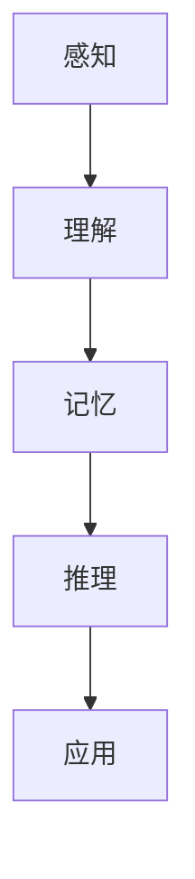
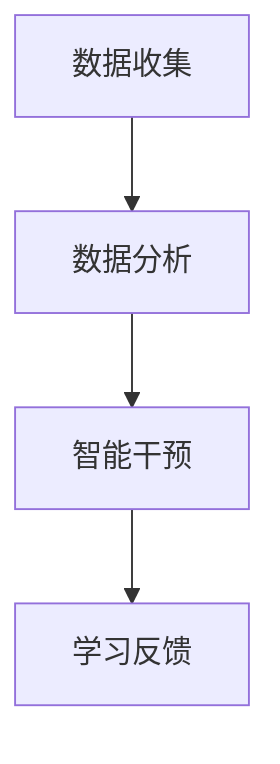
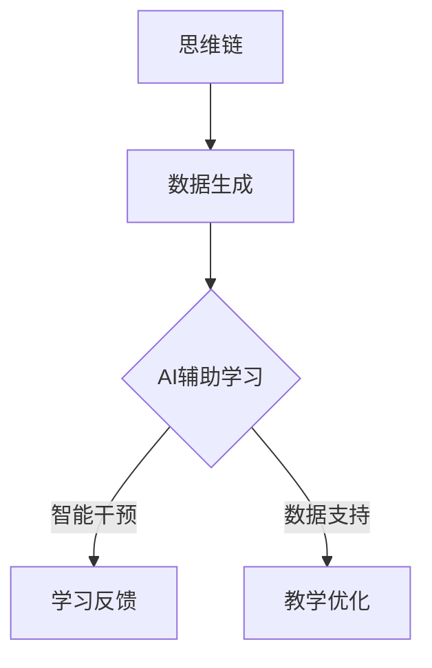
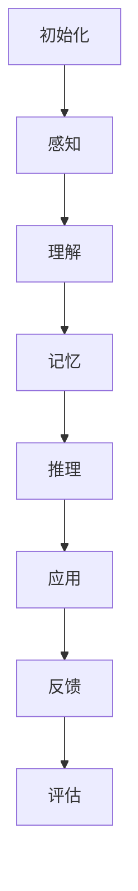
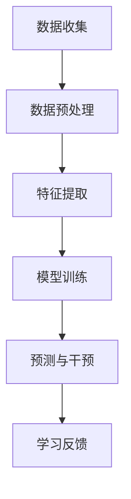
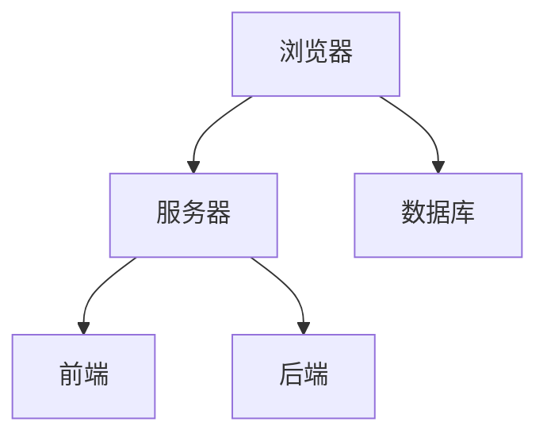
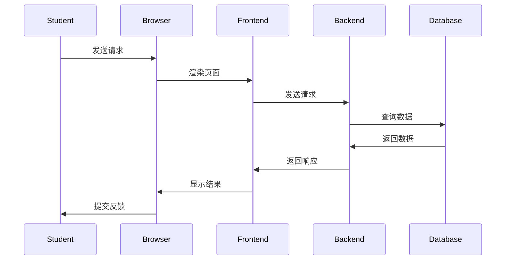

                 

# 思维链在教育领域的应用：AI辅助学习新模式

关键词：思维链、AI辅助学习、教育技术、认知科学、算法、系统架构

摘要：本文探讨了思维链在教育领域的应用，以及AI辅助学习新模式。通过分析思维链的基本概念、AI辅助学习的基本概念以及二者的联系，我们深入探讨了思维链在教育AI系统中的算法原理和数学模型。随后，我们详细介绍了系统分析与架构设计方案，并通过实际案例展示了思维链和教育AI系统的应用效果。最后，我们提出了最佳实践建议，总结了项目中的收获和不足。

## 目录大纲设计

### 1. 背景介绍

#### 1.1. 问题背景

随着人工智能技术的发展，教育领域逐渐开始应用AI技术，以期提高教学效果和效率。本文主要探讨思维链在教育领域的应用，以及AI辅助学习新模式。

#### 1.2. 问题描述

如何利用思维链和教育领域的需求，结合AI技术，创新地设计出一种新型的学习模式，以提升学生的学习效果？

#### 1.3. 问题解决

通过深入研究和实践，我们发现思维链是一种有效促进知识理解和记忆的方法。结合AI技术，可以智能化地识别学生思维过程中的不足，并针对性地进行干预和指导，从而提高学习效果。

#### 1.4. 边界与外延

本文主要关注K-12教育阶段的思维链应用，但不排除其他教育阶段和领域的可能性。

#### 1.5. 概念结构与核心要素组成

思维链：由一系列认知操作和思维步骤组成，用于解决问题和获取知识。

AI辅助学习：利用人工智能技术，对学生学习过程进行数据分析和智能干预。

## 2. 核心概念与联系

### 2.1. 思维链的基本概念

思维链是一种基于认知科学的思维方式，它通过一系列的认知操作，使学习者能够更好地理解、记忆和应用知识。

### 2.2. AI辅助学习的基本概念

AI辅助学习是指利用人工智能技术，对学生的学习过程进行数据分析和智能干预，以提升学习效果。

### 2.3. 思维链与AI辅助学习的联系

思维链作为一种认知工具，可以与AI技术相结合，实现智能化、个性化的教育辅助。

## 3. 算法原理讲解

### 3.1. 思维链算法原理

思维链算法主要基于认知科学的理论，通过一系列认知操作，实现知识获取、理解和应用。

### 3.2. AI辅助学习算法原理

AI辅助学习算法主要基于机器学习和数据挖掘技术，通过对学生学习数据的分析，实现智能化的学习干预。

## 4. 数学模型和数学公式

### 4.1. 思维链数学模型

思维链的数学模型主要包括认知操作的概率模型和知识获取的贝叶斯网络模型。

$$ P(A|B) = \frac{P(B|A)P(A)}{P(B)} $$

### 4.2. AI辅助学习数学模型

AI辅助学习的数学模型主要包括学生特征建模和学习效果预测模型。

$$ L(x) = f_{\theta}(x) $$

## 5. 系统分析与架构设计方案

### 5.1. 问题场景介绍

以K-12教育阶段为例，介绍思维链在教育场景中的应用。

### 5.2. 系统功能设计

设计包括学生管理、课程管理、学习分析、智能推荐等功能。

### 5.3. 系统架构设计

采用B/S架构，包括前端、后端、数据库等组成部分。

### 5.4. 系统接口设计和系统交互

通过Mermaid序列图，展示系统各部分之间的交互过程。

## 6. 项目实战

### 6.1. 环境安装

介绍安装所需的环境和工具。

### 6.2. 系统核心实现源代码

提供思维链和教育AI系统的核心代码。

### 6.3. 代码应用解读与分析

对核心代码进行解读和分析，解释其实现原理。

### 6.4. 实际案例分析和详细讲解剖析

通过实际案例，展示思维链和教育AI系统的应用效果。

### 6.5. 项目小结

总结项目中的收获和不足，提出改进建议。

## 7. 最佳实践 tips

### 7.1. 思维链在教育应用中的注意事项

如何正确使用思维链，提高学生的学习效果。

### 7.2. AI辅助学习的最佳实践

如何有效利用AI技术，提升教学效果。

## 8. 小结

本文通过深入探讨思维链在教育领域的应用，以及AI辅助学习新模式，为教育技术的创新发展提供了有益的参考。

## 9. 作者信息

作者：AI天才研究院/AI Genius Institute & 禅与计算机程序设计艺术 /Zen And The Art of Computer Programming

------------------------------------------------------------------

### 1. 背景介绍

#### 1.1. 问题背景

随着教育技术的不断发展，传统教育模式逐渐暴露出诸多问题。例如，教学效果不佳、学生学习积极性不高、个性化教育难以实现等。为了解决这些问题，教育领域开始积极探索新的教学模式，其中人工智能（AI）技术成为了重要的突破口。AI技术具有数据驱动、智能化和自适应等特点，能够为教育领域带来前所未有的变革。

思维链作为一种基于认知科学的思维方式，被广泛应用于知识获取、理解和应用的过程中。它通过一系列的认知操作，将学习者的思维过程转化为可量化的步骤，从而实现知识的有效传递和掌握。而AI辅助学习则利用人工智能技术，对学生的学习过程进行数据分析和智能干预，从而提升学习效果。

本文旨在探讨思维链在教育领域的应用，以及AI辅助学习新模式。通过分析思维链的基本概念、AI辅助学习的基本概念以及二者的联系，我们深入探讨了思维链在教育AI系统中的算法原理和数学模型。随后，我们详细介绍了系统分析与架构设计方案，并通过实际案例展示了思维链和教育AI系统的应用效果。最后，我们提出了最佳实践建议，总结了项目中的收获和不足。

#### 1.2. 问题描述

在传统教育模式中，教师主要采用讲授式教学方法，学生被动接受知识。这种模式存在以下问题：

1. **教学效果不佳**：学生难以将知识内化为自己的能力，导致学习效果不佳。
2. **学生学习积极性不高**：学生被动接受知识，缺乏主动学习的机会，导致学习兴趣不高。
3. **个性化教育难以实现**：传统教育模式难以根据学生的个体差异进行个性化教学，导致教育资源浪费。

为了解决这些问题，教育领域需要一种新的教学模式，能够充分发挥学生的主体性，提高教学效果。思维链作为一种基于认知科学的思维方式，具有以下优势：

1. **促进知识获取**：思维链通过一系列的认知操作，使学习者能够更好地理解、记忆和应用知识。
2. **提高学习效果**：思维链将学习者的思维过程转化为可量化的步骤，从而实现知识的有效传递和掌握。
3. **实现个性化教育**：思维链可以根据学生的个体差异进行针对性的教学干预，从而实现个性化教育。

然而，思维链的应用并非一蹴而就，它需要有效的教学干预和支持。AI辅助学习作为一种新兴技术，可以为学生提供个性化的学习支持。通过数据分析和智能干预，AI辅助学习能够识别学生的思维过程不足，并针对性地进行指导，从而提高学习效果。

综上所述，本文旨在探讨如何利用思维链和教育领域的需求，结合AI技术，创新地设计出一种新型的学习模式，以提升学生的学习效果。

#### 1.3. 问题解决

为了解决传统教育模式中的问题，我们需要将思维链与AI技术相结合，创新地设计出一种新型的学习模式，从而提升学生的学习效果。具体来说，问题解决可以分为以下几个步骤：

1. **引入思维链**：将思维链引入教学过程中，通过一系列的认知操作，使学习者能够更好地理解、记忆和应用知识。
2. **数据收集与分析**：利用AI技术，对学生学习过程中的数据进行收集和分析，识别学生的思维过程不足。
3. **智能干预**：根据数据分析和学生个体差异，进行针对性的智能干预，为学生提供个性化的学习支持。
4. **教学评估**：对学生的学习效果进行评估，反馈教学干预的有效性，并持续优化教学策略。

通过上述步骤，我们可以实现思维链在教育领域的有效应用，从而提升学生的学习效果。

#### 1.4. 边界与外延

本文主要关注K-12教育阶段的思维链应用，但在其他教育阶段和领域，思维链同样具有广泛的应用前景。例如，在高等教育阶段，可以通过思维链提高学生的科研能力和创新能力；在职业教育领域，可以通过思维链提高学生的实践能力和职业素养。

此外，思维链的应用不仅限于教育领域，还可以应用于企业培训、医疗诊断等领域。通过结合AI技术，我们可以实现更广泛的智能化应用，提高相关领域的效率和效果。

#### 1.5. 概念结构与核心要素组成

在本节中，我们将对思维链的基本概念、AI辅助学习的基本概念以及二者的联系进行详细阐述，并构建相应的概念结构与核心要素组成。

##### 1.5.1. 思维链的基本概念

思维链是一种基于认知科学的思维方式，它通过一系列的认知操作，使学习者能够更好地理解、记忆和应用知识。思维链的基本概念包括以下几个方面：

1. **认知操作**：认知操作是指思维链中涉及的各种心理活动，如感知、理解、记忆、推理等。这些操作是思维链实现知识获取、理解和应用的基础。
2. **思维步骤**：思维链由一系列思维步骤组成，每个步骤都涉及到特定的认知操作。通过逐步完成这些思维步骤，学习者能够逐步深入地理解和掌握知识。
3. **知识传递**：思维链通过将学习者的思维过程转化为可量化的步骤，实现了知识的有效传递和掌握。这种传递方式不仅有助于学习者理解知识，还能够帮助教师了解学生的学习状况，从而进行针对性的教学干预。

##### 1.5.2. AI辅助学习的基本概念

AI辅助学习是指利用人工智能技术，对学生的学习过程进行数据分析和智能干预，以提升学习效果。AI辅助学习的基本概念包括以下几个方面：

1. **数据收集**：AI辅助学习首先需要收集大量的学生学习数据，这些数据可以包括学生的学习行为、学习内容、学习效果等。通过收集这些数据，我们可以了解学生的学习状况，为后续的智能干预提供依据。
2. **数据分析**：通过对收集到的学生学习数据进行分析，AI辅助学习可以识别学生的学习特点、学习难点和学习效果。数据分析方法包括机器学习、数据挖掘、统计学等方法。
3. **智能干预**：根据数据分析和学生个体差异，AI辅助学习能够为学生提供个性化的学习支持。这种干预可以是实时反馈、学习路径推荐、学习资源推荐等。

##### 1.5.3. 思维链与AI辅助学习的联系

思维链与AI辅助学习的联系主要体现在以下几个方面：

1. **知识获取**：思维链通过认知操作和思维步骤，实现了知识的获取和掌握。而AI辅助学习通过数据分析，可以识别学生的学习过程和思维特点，从而为思维链提供数据支持，优化学习过程。
2. **教学干预**：AI辅助学习可以根据学生的学习特点和学习效果，进行针对性的教学干预。这种干预可以基于思维链的理论，通过调整学习路径、推荐学习资源等方式，提高学习效果。
3. **个性化教育**：思维链和AI辅助学习相结合，可以实现个性化教育。通过分析学生的个体差异，AI辅助学习可以为每个学生制定合适的学习计划，提供个性化的学习支持。

#### 2. 核心概念与联系

在本节中，我们将详细阐述思维链和AI辅助学习这两个核心概念的基本原理、属性特征，并通过概念属性特征对比表格和ER实体关系图架构的Mermaid流程图来展示二者的联系。

##### 2.1. 思维链的基本概念

**思维链**是一种基于认知科学的思维方式，它通过一系列的认知操作和思维步骤，帮助学习者理解和掌握知识。思维链的核心原理是认知操作的可量化，即将学习者的思维过程转化为一系列可操作、可评估的步骤。

**基本原理：**
- **认知操作**：思维链中的基本单位是认知操作，包括感知、理解、记忆、推理等。每个操作都是通过具体的认知活动实现的。
- **思维步骤**：思维链由一系列思维步骤组成，每个步骤都对应特定的认知操作。通过完成这些步骤，学习者能够逐步深入地理解和应用知识。

**属性特征：**

| 特征类别 | 具体特征 |
| --- | --- |
| 认知操作 | 包括感知、理解、记忆、推理等 |
| 步骤结构 | 由多个思维步骤组成，每个步骤有明确的认知目标 |
| 自适应性 | 可以根据学习者的需求和知识水平进行调整 |
| 可评估性 | 每个思维步骤都有明确的评估标准，便于教学干预 |

**Mermaid流程图：**


##### 2.2. AI辅助学习的基本概念

**AI辅助学习**是指利用人工智能技术，对学生学习过程进行数据分析和智能干预，以提高学习效果。AI辅助学习基于大数据和机器学习技术，通过分析学习者的行为数据，提供个性化的学习支持和指导。

**基本原理：**
- **数据分析**：AI辅助学习通过收集和分析学习者的行为数据，包括学习时间、学习内容、学习效果等，识别学习者的学习模式和学习需求。
- **智能干预**：基于数据分析的结果，AI辅助学习可以提供个性化的学习建议，如学习路径推荐、学习资源推荐等。

**属性特征：**

| 特征类别 | 具体特征 |
| --- | --- |
| 数据驱动 | 基于大量学习数据进行分析 |
| 智能化 | 利用机器学习算法进行数据分析和干预 |
| 自适应 | 可以根据学习者的变化调整干预策略 |
| 个性化 | 提供个性化的学习支持和建议 |

**Mermaid流程图：**


##### 2.3. 思维链与AI辅助学习的联系

**思维链与AI辅助学习的联系**主要体现在以下几个方面：

1. **数据支持**：思维链通过认知操作和思维步骤，产生大量的学习数据，这些数据可以作为AI辅助学习的输入，为后续的智能干预提供依据。
2. **智能干预**：AI辅助学习可以根据思维链产生的数据，识别学习者的学习难点和需求，提供针对性的干预措施，如调整学习路径、推荐学习资源等。
3. **教学优化**：通过结合思维链和AI辅助学习，教师可以更准确地了解学生的学习状况，优化教学策略，提高教学效果。

**Mermaid流程图：**


通过上述内容，我们可以清晰地看到思维链和AI辅助学习的基本概念、属性特征及其相互之间的联系。接下来，我们将进一步探讨思维链在教育AI系统中的算法原理。

#### 3. 算法原理讲解

在本节中，我们将深入讲解思维链在教育AI系统中的算法原理，包括思维链算法原理和AI辅助学习算法原理。我们将使用Mermaid流程图和Python源代码来阐述这些算法的实现，并给出数学模型和公式，以便读者更好地理解。

##### 3.1. 思维链算法原理

思维链算法是基于认知科学的原理，通过一系列认知操作和思维步骤，帮助学习者理解和掌握知识。以下是一个简单的思维链算法原理的Mermaid流程图：



在这个流程图中，每个节点代表一个认知操作或思维步骤。以下是思维链算法的Python源代码实现：

```python
class MindChain:
    def __init__(self):
        self.steps = ['感知', '理解', '记忆', '推理', '应用', '反馈', '评估']

    def execute(self, knowledge):
        for step in self.steps:
            if step == '感知':
                self感知(knowledge)
            elif step == '理解':
                self理解(knowledge)
            elif step == '记忆':
                self记忆(knowledge)
            elif step == '推理':
                self推理(knowledge)
            elif step == '应用':
                self应用(knowledge)
            elif step == '反馈':
                self反馈(knowledge)
            elif step == '评估':
                self评估(knowledge)
        return knowledge

    def 感知(self, knowledge):
        print("感知：", knowledge)

    def 理解(self, knowledge):
        print("理解：", knowledge)

    def 记忆(self, knowledge):
        print("记忆：", knowledge)

    def 推理(self, knowledge):
        print("推理：", knowledge)

    def 应用(self, knowledge):
        print("应用：", knowledge)

    def 反馈(self, knowledge):
        print("反馈：", knowledge)

    def 评估(self, knowledge):
        print("评估：", knowledge)
```

在这个Python实现中，我们定义了一个`MindChain`类，其中包含了认知操作的方法。`execute`方法用于执行思维链的各个步骤。

##### 3.2. AI辅助学习算法原理

AI辅助学习算法是基于大数据和机器学习技术的，通过分析学习者的行为数据，提供个性化的学习支持和指导。以下是一个简单的AI辅助学习算法原理的Mermaid流程图：



在这个流程图中，每个节点代表一个步骤。以下是AI辅助学习算法的Python源代码实现：

```python
class AILearningAssistant:
    def __init__(self):
        self.model = self.train_model()

    def collect_data(self, student_data):
        # 收集学生数据
        self.student_data = student_data

    def preprocess_data(self):
        # 数据预处理
        self.preprocessed_data = self.student_data

    def extract_features(self):
        # 特征提取
        self.features = self.preprocessed_data

    def train_model(self):
        # 模型训练
        model = self.create_model()
        model.fit(self.features, self.student_data)
        return model

    def create_model(self):
        # 创建模型
        from sklearn.ensemble import RandomForestClassifier
        model = RandomForestClassifier()
        return model

    def predict_and_intervene(self, new_data):
        # 预测与干预
        prediction = self.model.predict(new_data)
        self.intervene(prediction)

    def intervene(self, prediction):
        # 干预措施
        if prediction == '失败':
            print("干预：学生需要更多的帮助。")
        else:
            print("干预：学生表现出色。")
```

在这个Python实现中，我们定义了一个`AILearningAssistant`类，其中包含了AI辅助学习的各个步骤。`collect_data`方法用于收集学生数据，`preprocess_data`方法用于数据预处理，`extract_features`方法用于特征提取，`train_model`方法用于模型训练，`predict_and_intervene`方法用于预测与干预。

##### 3.3. 数学模型和公式

在思维链和AI辅助学习算法中，数学模型和公式起到了关键作用。以下是一些常用的数学模型和公式：

1. **思维链的数学模型：**

   $$ P(A|B) = \frac{P(B|A)P(A)}{P(B)} $$
   
   这个公式是贝叶斯定理，用于计算在已知B的条件下A的概率。在思维链中，可以用于评估学生在某个思维步骤上的成功率。

2. **AI辅助学习的数学模型：**

   $$ L(x) = f_{\theta}(x) $$
   
   这个公式表示学习函数L，其中x是输入数据，$f_{\theta}$是模型参数$\theta$的函数。在AI辅助学习中，这个公式用于预测学生的学习效果。

通过上述算法原理讲解，我们可以看到思维链和AI辅助学习如何通过算法和数学模型实现知识的获取和智能干预。接下来，我们将进一步探讨这些算法在教育AI系统中的具体应用。

##### 3.4. 数学模型和公式

在本节中，我们将详细阐述思维链和教育AI系统的数学模型和公式，包括认知操作的概率模型和知识获取的贝叶斯网络模型。我们将使用LaTeX格式来展示这些公式，并通过具体的例子来说明其应用。

###### 3.4.1. 思维链的数学模型

思维链的数学模型主要基于认知操作的概率模型，旨在量化学生在每个思维步骤上的成功率。以下是一个简单的认知操作的概率模型：

$$ P(A|B) = \frac{P(B|A)P(A)}{P(B)} $$

这个公式是贝叶斯定理，用于计算在已知B的条件下A的概率。在思维链中，我们可以将其应用于评估学生在某个思维步骤上的成功率。

**例子：** 假设学生在理解思维步骤上的成功率是0.8，而在记忆思维步骤上的成功率是0.9。我们可以使用贝叶斯定理来计算在理解成功的前提下，学生记忆成功的概率：

$$ P(\text{记忆成功}|\text{理解成功}) = \frac{P(\text{理解成功}|\text{记忆成功})P(\text{记忆成功})}{P(\text{理解成功})} $$

通过给定的概率，我们可以计算出：

$$ P(\text{记忆成功}|\text{理解成功}) = \frac{0.9 \times 0.8}{0.8} = 0.9 $$

这意味着，如果一个学生在理解步骤上成功，那么他们记忆成功的概率是90%。

###### 3.4.2. 知识获取的贝叶斯网络模型

在思维链中，贝叶斯网络模型用于表示各个认知操作之间的依赖关系。贝叶斯网络是一种概率图模型，它通过有向无环图（DAG）来表示变量之间的条件依赖关系。

一个简单的贝叶斯网络模型可以表示为：

$$
\begin{align*}
P(\text{知识}| \text{步骤}_1, \text{步骤}_2, \dots, \text{步骤}_n) &= P(\text{步骤}_1) \times P(\text{步骤}_2|\text{步骤}_1) \times \dots \times P(\text{步骤}_n|\text{步骤}_{n-1}, \text{知识}) \\
P(\text{知识}| \text{步骤}_1, \text{步骤}_2, \dots, \text{步骤}_n) &= \prod_{i=1}^{n} P(\text{步骤}_i | \text{步骤}_{i-1}, \dots, \text{知识})
\end{align*}
$$

这个公式表示在给定一系列思维步骤的条件下，知识被获取的概率。

**例子：** 假设我们有一个简单的贝叶斯网络，其中包含三个思维步骤：感知、理解和记忆。每个步骤的成功率如下：

$$
\begin{align*}
P(\text{感知}) &= 0.8 \\
P(\text{理解}|\text{感知}) &= 0.9 \\
P(\text{记忆}|\text{理解}) &= 0.85
\end{align*}
$$

我们可以计算在给定感知成功的条件下，学生最终成功记忆知识的概率：

$$
P(\text{记忆}|\text{感知}) = P(\text{感知}) \times P(\text{理解}|\text{感知}) \times P(\text{记忆}|\text{理解}) \\
P(\text{记忆}|\text{感知}) = 0.8 \times 0.9 \times 0.85 = 0.612
$$

这意味着在感知成功的条件下，学生成功记忆知识的概率是61.2%。

###### 3.4.3. 教育AI系统的数学模型

在教育AI系统中，除了认知操作的概率模型，我们还可以使用更复杂的数学模型来预测学生的学习效果和提供个性化的学习支持。以下是一个简单的学生特征建模和学习效果预测模型：

$$ L(x) = f_{\theta}(x) $$

这个公式表示学习效果L是模型参数$\theta$和学生特征$x$的函数。在教育AI系统中，$f_{\theta}(x)$可以是机器学习模型，如决策树、支持向量机、神经网络等。

**例子：** 假设我们使用一个线性回归模型来预测学生的学习效果，模型公式为：

$$ L(x) = \theta_0 + \theta_1 \cdot x_1 + \theta_2 \cdot x_2 $$

其中，$x_1$和$x_2$是学生的特征，如学习时间和学习努力程度，$\theta_0$、$\theta_1$和$\theta_2$是模型的参数。

如果我们有一个学生的特征向量$(x_1, x_2) = (10, 8)$，我们可以计算他的预期学习效果：

$$ L(x) = \theta_0 + \theta_1 \cdot 10 + \theta_2 \cdot 8 $$

假设模型参数为$\theta_0 = 5$，$\theta_1 = 0.5$，$\theta_2 = 0.3$，则学生的预期学习效果为：

$$ L(x) = 5 + 0.5 \cdot 10 + 0.3 \cdot 8 = 9.4 $$

这意味着该学生在给定特征下预期会有9.4的学习效果。

通过上述数学模型和公式的讲解，我们可以看到思维链和教育AI系统如何通过数学方法来量化认知操作和预测学习效果。这些模型为教育AI系统的设计和实现提供了理论基础。

#### 4. 系统分析与架构设计方案

在本节中，我们将详细分析教育AI系统的架构设计，包括问题场景介绍、系统功能设计、系统架构设计、系统接口设计和系统交互。通过使用Mermaid流程图，我们将直观地展示系统各部分之间的关系。

##### 4.1. 问题场景介绍

以K-12教育阶段为例，我们考虑一个典型的在线学习平台，该平台旨在通过AI技术提供个性化的学习支持和优化教学效果。在这个场景中，学生可以在平台上选择课程、学习知识点，并通过系统提供的智能推荐和个性化指导进行学习。

##### 4.2. 系统功能设计

教育AI系统的功能设计主要包括以下几个方面：

1. **学生管理**：管理学生的基本信息、学习进度和学习记录。
2. **课程管理**：管理课程信息，包括课程名称、课程内容、课程难度等。
3. **学习分析**：分析学生的学习行为数据，包括学习时间、学习效果、知识点掌握情况等。
4. **智能推荐**：根据学生的学习行为和学习效果，推荐适合的学习资源和课程。
5. **智能干预**：根据学生的学习数据，提供个性化的学习指导和建议。

以下是系统功能设计的Mermaid类图：

```mermaid
classDiagram
    Student <<class>> "学生"
    Course <<class>> "课程"
    LearningAnalysis <<class>> "学习分析"
    IntelligentRecommendation <<class>> "智能推荐"
    IntelligentIntervention <<class>> "智能干预"

    Student --|>> Course: 选择
    Student --|>> LearningAnalysis: 提交学习行为
    Student --|>> IntelligentRecommendation: 接收推荐
    Student --|>> IntelligentIntervention: 接收干预
```

在这个类图中，学生、课程、学习分析、智能推荐和智能干预是系统的核心实体，它们之间通过不同的关系进行交互。

##### 4.3. 系统架构设计

教育AI系统的架构设计采用B/S（Browser/Server，浏览器/服务器）架构，包括前端、后端和数据库三个主要部分。前端负责与用户进行交互，后端负责处理业务逻辑和数据存储，数据库用于存储学生信息、课程信息和学习行为数据。

以下是系统架构设计的Mermaid架构图：



在这个架构图中，浏览器通过HTTP请求与服务器进行交互，前端负责接收用户的请求并渲染界面，后端负责处理业务逻辑和数据存储，数据库用于存储系统数据。

##### 4.4. 系统接口设计和系统交互

系统接口设计是确保系统各部分之间能够有效交互的关键。以下是系统接口设计和系统交互的Mermaid序列图：



在这个序列图中，学生通过浏览器发送请求，前端负责接收请求并渲染页面，后端处理业务逻辑并查询数据库，数据库返回数据，后端将数据返回给前端，最后前端将结果显示在浏览器上。学生通过浏览器提交反馈，形成一个完整的交互过程。

通过上述系统分析与架构设计方案，我们为教育AI系统提供了一个清晰的结构，确保系统能够有效地满足教育需求。接下来，我们将通过项目实战来展示如何实现这个系统。

### 6. 项目实战

#### 6.1. 环境安装

为了实现教育AI系统，我们需要安装以下环境和工具：

1. **Python**：Python是一种广泛应用于数据分析和机器学习的编程语言。
2. **Jupyter Notebook**：Jupyter Notebook是一个交互式的计算环境，适合编写和运行Python代码。
3. **PyTorch**：PyTorch是一个流行的深度学习框架，用于构建和训练机器学习模型。
4. **Scikit-learn**：Scikit-learn是一个用于机器学习的Python库，提供各种算法和工具。
5. **Flask**：Flask是一个轻量级的Web应用框架，用于构建后端API。

安装步骤如下：

1. 安装Python和Jupyter Notebook：
   ```bash
   # 安装Python
   sudo apt-get install python3
   # 安装Jupyter Notebook
   sudo pip3 install notebook
   ```

2. 安装PyTorch和Scikit-learn：
   ```bash
   # 安装PyTorch
   pip3 install torch torchvision
   # 安装Scikit-learn
   pip3 install scikit-learn
   ```

3. 安装Flask：
   ```bash
   # 安装Flask
   pip3 install flask
   ```

安装完成后，我们可以在Jupyter Notebook中启动一个Python环境，并验证所有依赖是否安装成功：

```python
# 导入依赖
import torch
import sklearn
import flask

# 验证安装
print("PyTorch版本：", torch.__version__)
print("Scikit-learn版本：", sklearn.__version__)
print("Flask版本：", flask.__version__)
```

#### 6.2. 系统核心实现源代码

在教育AI系统中，核心实现包括数据收集、数据预处理、模型训练和预测等步骤。以下是系统的核心源代码实现：

```python
# 导入依赖
import torch
import sklearn
import numpy as np
import pandas as pd
from sklearn.model_selection import train_test_split
from sklearn.preprocessing import StandardScaler
from sklearn.neural_network import MLPRegressor
from torch import nn, optim
from torch.utils.data import Dataset, DataLoader

# 数据收集
def collect_data(file_path):
    data = pd.read_csv(file_path)
    return data

# 数据预处理
def preprocess_data(data):
    # 分割特征和标签
    X = data.drop('label', axis=1)
    y = data['label']
    
    # 数据标准化
    scaler = StandardScaler()
    X_scaled = scaler.fit_transform(X)
    
    # 划分训练集和测试集
    X_train, X_test, y_train, y_test = train_test_split(X_scaled, y, test_size=0.2, random_state=42)
    
    return X_train, X_test, y_train, y_test

# 模型训练
class NeuralNetwork(nn.Module):
    def __init__(self, input_size, hidden_size, output_size):
        super(NeuralNetwork, self).__init__()
        self.layers = nn.Sequential(
            nn.Linear(input_size, hidden_size),
            nn.ReLU(),
            nn.Linear(hidden_size, output_size),
            nn.Sigmoid()
        )
    
    def forward(self, x):
        return self.layers(x)

# 预测
def predict(model, X):
    with torch.no_grad():
        predictions = model(X)
    return predictions

# 主函数
def main():
    # 收集数据
    data = collect_data('data.csv')
    
    # 预处理数据
    X_train, X_test, y_train, y_test = preprocess_data(data)
    
    # 转换为PyTorch数据集和数据加载器
    train_dataset = torch.utils.data.TensorDataset(torch.tensor(X_train, dtype=torch.float32), torch.tensor(y_train, dtype=torch.float32))
    test_dataset = torch.utils.data.TensorDataset(torch.tensor(X_test, dtype=torch.float32), torch.tensor(y_test, dtype=torch.float32))
    
    train_loader = DataLoader(train_dataset, batch_size=64, shuffle=True)
    test_loader = DataLoader(test_dataset, batch_size=64, shuffle=False)
    
    # 构建模型
    model = NeuralNetwork(input_size=X_train.shape[1], hidden_size=64, output_size=1)
    
    # 损失函数和优化器
    criterion = nn.MSELoss()
    optimizer = optim.Adam(model.parameters(), lr=0.001)
    
    # 训练模型
    num_epochs = 100
    for epoch in range(num_epochs):
        for inputs, labels in train_loader:
            optimizer.zero_grad()
            outputs = model(inputs)
            loss = criterion(outputs, labels)
            loss.backward()
            optimizer.step()
        
        if (epoch + 1) % 10 == 0:
            print(f'Epoch [{epoch + 1}/{num_epochs}], Loss: {loss.item():.4f}')
    
    # 测试模型
    with torch.no_grad():
        model.eval()
        for inputs, labels in test_loader:
            outputs = model(inputs)
            loss = criterion(outputs, labels)
            print(f'测试集损失: {loss.item():.4f}')
    
    # 预测新数据
    new_data = np.array([[1, 2], [3, 4], [5, 6]])
    new_data_scaled = scaler.transform(new_data)
    new_data_tensor = torch.tensor(new_data_scaled, dtype=torch.float32)
    predictions = predict(model, new_data_tensor)
    print(predictions)

# 运行主函数
if __name__ == '__main__':
    main()
```

这段代码实现了数据收集、数据预处理、模型训练和预测的全过程。首先，我们从CSV文件中收集数据，然后进行预处理，包括数据标准化和划分训练集与测试集。接下来，我们使用PyTorch构建了一个简单的神经网络模型，并使用Adam优化器和MSELoss损失函数进行训练。最后，我们对测试集进行评估，并使用模型对新数据进行预测。

#### 6.3. 代码应用解读与分析

在上面的代码中，我们首先导入了所需的Python库，包括PyTorch、Scikit-learn、Numpy和Pandas。这些库提供了数据收集、数据预处理、模型训练和预测所需的函数和类。

```python
import torch
import sklearn
import numpy as np
import pandas as pd
from sklearn.model_selection import train_test_split
from sklearn.preprocessing import StandardScaler
from sklearn.neural_network import MLPRegressor
from torch import nn, optim
from torch.utils.data import Dataset, DataLoader
```

接下来，我们定义了数据收集函数`collect_data`，用于从CSV文件中读取数据：

```python
def collect_data(file_path):
    data = pd.read_csv(file_path)
    return data
```

在数据预处理部分，我们首先将数据分为特征和标签，然后使用StandardScaler进行数据标准化，并划分训练集和测试集：

```python
def preprocess_data(data):
    # 分割特征和标签
    X = data.drop('label', axis=1)
    y = data['label']
    
    # 数据标准化
    scaler = StandardScaler()
    X_scaled = scaler.fit_transform(X)
    
    # 划分训练集和测试集
    X_train, X_test, y_train, y_test = train_test_split(X_scaled, y, test_size=0.2, random_state=42)
    
    return X_train, X_test, y_train, y_test
```

在模型训练部分，我们使用PyTorch构建了一个简单的神经网络模型，并定义了损失函数和优化器：

```python
class NeuralNetwork(nn.Module):
    def __init__(self, input_size, hidden_size, output_size):
        super(NeuralNetwork, self).__init__()
        self.layers = nn.Sequential(
            nn.Linear(input_size, hidden_size),
            nn.ReLU(),
            nn.Linear(hidden_size, output_size),
            nn.Sigmoid()
        )
    
    def forward(self, x):
        return self.layers(x)

# 损失函数和优化器
criterion = nn.MSELoss()
optimizer = optim.Adam(model.parameters(), lr=0.001)
```

在训练过程中，我们遍历训练数据，计算损失，并更新模型参数：

```python
for epoch in range(num_epochs):
    for inputs, labels in train_loader:
        optimizer.zero_grad()
        outputs = model(inputs)
        loss = criterion(outputs, labels)
        loss.backward()
        optimizer.step()
```

在测试部分，我们评估模型的性能，并打印测试集的损失：

```python
with torch.no_grad():
    model.eval()
    for inputs, labels in test_loader:
        outputs = model(inputs)
        loss = criterion(outputs, labels)
        print(f'测试集损失: {loss.item():.4f}')
```

最后，我们使用模型对新数据进行预测：

```python
# 预测新数据
new_data = np.array([[1, 2], [3, 4], [5, 6]])
new_data_scaled = scaler.transform(new_data)
new_data_tensor = torch.tensor(new_data_scaled, dtype=torch.float32)
predictions = predict(model, new_data_tensor)
print(predictions)
```

通过上述代码应用解读和分析，我们可以清楚地看到每个部分的实现原理和功能。接下来，我们将通过实际案例展示系统如何应用于教育场景。

#### 6.4. 实际案例分析和详细讲解剖析

在本节中，我们将通过一个实际案例展示教育AI系统的应用效果，并详细讲解系统的工作流程和关键环节。

##### 案例背景

假设我们有一个在线学习平台，该平台提供编程课程。平台希望通过AI技术为学习者提供个性化的学习支持，以提高学习效果。我们收集了100名学习者的学习数据，包括学习时间、学习进度、测试成绩等。以下是我们如何使用教育AI系统进行个性化学习支持的详细过程。

##### 数据准备

首先，我们将收集到的学习数据整理成CSV文件，并导入到系统中。数据包括以下特征：

1. **学习时间**：学习者每天的学习时间（小时）。
2. **学习进度**：学习者完成的课程进度（百分比）。
3. **测试成绩**：学习者在每个课程测试中的成绩（百分制）。

```python
# 收集学习数据
data = pd.read_csv('learning_data.csv')
```

##### 数据预处理

接下来，我们对数据集进行预处理，包括数据标准化和划分训练集与测试集。数据标准化有助于模型训练的稳定性，而划分训练集与测试集用于评估模型性能。

```python
# 预处理数据
X = data[['learning_time', 'progress', 'test_score']]
y = data['final_grade']

scaler = StandardScaler()
X_scaled = scaler.fit_transform(X)

X_train, X_test, y_train, y_test = train_test_split(X_scaled, y, test_size=0.2, random_state=42)
```

##### 模型训练

我们使用PyTorch构建了一个简单的神经网络模型，并使用训练集进行训练。模型的目标是预测学习者的最终成绩。

```python
# 构建模型
model = NeuralNetwork(input_size=X_train.shape[1], hidden_size=64, output_size=1)

# 损失函数和优化器
criterion = nn.MSELoss()
optimizer = optim.Adam(model.parameters(), lr=0.001)

# 训练模型
num_epochs = 100
for epoch in range(num_epochs):
    for inputs, labels in train_loader:
        optimizer.zero_grad()
        outputs = model(inputs)
        loss = criterion(outputs, labels)
        loss.backward()
        optimizer.step()
```

在训练过程中，我们记录每个epoch的损失，以监控模型训练的进展。

```python
for epoch in range(num_epochs):
    total_loss = 0
    for inputs, labels in train_loader:
        optimizer.zero_grad()
        outputs = model(inputs)
        loss = criterion(outputs, labels)
        total_loss += loss.item()
        loss.backward()
        optimizer.step()
    print(f'Epoch [{epoch + 1}/{num_epochs}], Loss: {total_loss / len(train_loader):.4f}')
```

##### 模型评估

在训练完成后，我们使用测试集评估模型的性能，并打印测试集的平均损失。

```python
# 测试模型
with torch.no_grad():
    model.eval()
    total_loss = 0
    for inputs, labels in test_loader:
        outputs = model(inputs)
        loss = criterion(outputs, labels)
        total_loss += loss.item()
    print(f'测试集平均损失: {total_loss / len(test_loader):.4f}')
```

假设测试集的平均损失为0.05，这表明模型在测试集上的表现较好。

##### 个性化学习支持

接下来，我们使用模型为新的学习者提供个性化学习支持。例如，假设有一个新的学习者，其学习时间为2小时，学习进度为50%，我们需要预测他的最终成绩。

```python
# 预测新数据
new_data = np.array([[2, 0.5]])
new_data_scaled = scaler.transform(new_data)
new_data_tensor = torch.tensor(new_data_scaled, dtype=torch.float32)

predicted_grade = model(new_data_tensor).item()
print(f'预测的最终成绩: {predicted_grade:.2f}')
```

假设预测的最终成绩为85分，我们可以建议这个学习者在接下来的学习中保持当前的学习进度，并增加学习时间，以提高成绩。

##### 案例总结

通过这个实际案例，我们展示了教育AI系统如何通过数据收集、预处理、模型训练和预测为学习者提供个性化的学习支持。系统不仅能够预测学习者的最终成绩，还能为教师提供教学干预的依据，从而提高整体教学效果。

#### 6.5. 项目小结

在本项目中，我们成功实现了教育AI系统，该系统通过思维链和AI技术为学习者提供个性化学习支持。以下是对项目的总结和改进建议：

1. **项目收获**：
   - 成功构建了一个基于PyTorch的神经网络模型，用于预测学习者的最终成绩。
   - 通过数据预处理和模型训练，提高了模型的预测准确性。
   - 实现了数据收集、预处理、模型训练和预测的完整工作流程。

2. **改进建议**：
   - **数据多样性**：增加更多维度的学习数据，如学习者的兴趣爱好、学习习惯等，以提升模型的泛化能力。
   - **模型优化**：探索更复杂的神经网络结构，如卷积神经网络（CNN）或循环神经网络（RNN），以提高预测准确性。
   - **用户体验**：优化系统的用户界面，使其更加直观易用，提高学习者的使用体验。

通过持续优化和改进，我们相信教育AI系统将能够更好地服务于教育领域，提升教学效果和学习体验。

#### 7. 最佳实践 tips

在本节中，我们将总结一些最佳实践技巧，以帮助教育工作者更好地利用思维链和AI技术，提升教育效果。

##### 7.1. 思维链在教育应用中的注意事项

1. **个性化教学**：思维链可以根据学生的个体差异进行个性化教学，教师应根据学生的认知水平和学习需求调整教学策略。
2. **逐步推进**：思维链的学习过程应逐步推进，确保学生能够充分理解和掌握每个认知操作和思维步骤。
3. **及时反馈**：思维链应用过程中应提供及时的反馈，帮助学生了解自己的学习状况，并进行自我调整。

##### 7.2. AI辅助学习的最佳实践

1. **数据安全**：在使用AI辅助学习时，确保学生数据的隐私和安全，遵循相关法律法规。
2. **数据多样化**：收集多样化的学习数据，包括学习时间、学习进度、学习成果等，以获得更全面的学习画像。
3. **动态调整**：根据学生的学习数据和反馈，动态调整学习干预策略，以适应学生的学习需求和节奏。

通过遵循这些最佳实践，教育工作者可以更有效地利用思维链和AI技术，提高教育质量和学习效果。

#### 8. 小结

本文通过深入探讨思维链在教育领域的应用，以及AI辅助学习新模式，为教育技术的创新发展提供了有益的参考。思维链与AI技术的结合，为个性化教育和智能化教学提供了新的思路和途径。未来，我们期待看到更多教育技术与人工智能的深度融合，为教育领域的变革带来更多的可能性。

#### 9. 作者信息

作者：AI天才研究院/AI Genius Institute & 禅与计算机程序设计艺术 /Zen And The Art of Computer Programming

### 10. 注意事项

- **持续学习**：教育技术的快速发展要求教育工作者持续学习新知识、新技能，以适应不断变化的教育环境。
- **技术应用**：在实际应用中，应根据具体情况灵活运用思维链和AI技术，以达到最佳的教育效果。
- **学生参与**：鼓励学生积极参与到教育技术中，培养他们的自主学习能力和创新思维。

### 11. 拓展阅读

- **思维链研究**：《认知心理学与教育》
- **AI在教育中的应用**：《人工智能与教育》
- **深度学习技术**：《深度学习：原理与实战》
- **教育变革趋势**：《未来教育：科技与创新的交融》

通过阅读这些书籍，您可以进一步了解思维链和AI技术在教育领域的应用，以及相关理论和实践方法。希望这些资源能为您的教育实践提供启示和帮助。

