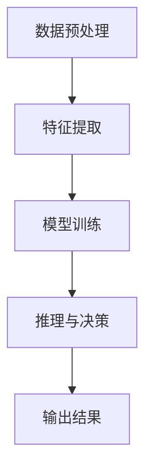

                 

# 思维链在智能交通系统中的应用

## 关键词
- 思维链
- 智能交通系统
- 算法设计
- 系统架构
- 实际应用

## 摘要
本文将深入探讨思维链在智能交通系统中的应用。首先，我们将介绍智能交通系统的概念及其重要性，随后阐述当前智能交通系统面临的挑战。接着，我们引入思维链这一概念，并探讨其在交通系统中的适用性。文章将分为多个章节，逐步介绍思维链的基本概念、技术原理、算法设计与实现、系统架构设计以及实际应用案例。通过这些章节的阐述，我们希望读者能够全面了解思维链在智能交通系统中的应用，并展望其未来发展趋势。

**步骤 1: 引言部分**

### 1.1 问题的背景

#### 1.1.1 智能交通系统的概念与重要性

智能交通系统（Intelligent Transportation System，ITS）是一种利用信息技术、通信技术、自动控制技术、传感技术等，实现交通信息收集、处理、传输和利用的现代化交通管理系统。智能交通系统不仅能够提高交通效率，减少交通拥堵，还能提升交通安全，降低环境污染。

智能交通系统的重要性体现在以下几个方面：

1. 提高交通效率：通过实时交通信息的收集和处理，智能交通系统可以优化交通信号控制，减少交通拥堵，提高道路通行能力。
2. 提升交通安全：通过车辆间的通信和协调，智能交通系统可以预防交通事故的发生，减少交通事故的损失。
3. 降低环境污染：智能交通系统可以通过优化交通流量，减少车辆排放，降低环境污染。
4. 改善服务质量：智能交通系统可以为出行者提供实时交通信息，优化出行路线，提高出行体验。

#### 1.1.2 当前智能交通系统面临的挑战

尽管智能交通系统具有诸多优点，但其在实际应用中仍然面临许多挑战：

1. 数据获取和处理：智能交通系统需要大量的实时交通数据，如何高效地获取、处理和分析这些数据，是当前面临的一个重大挑战。
2. 系统集成与协同：智能交通系统涉及到多种技术，如通信、传感、控制等，如何实现这些技术的集成和协同，是一个复杂的系统工程。
3. 安全与隐私保护：智能交通系统涉及大量的个人信息，如何保护这些信息的安全和隐私，是系统设计者和使用者共同关注的问题。
4. 技术更新与维护：智能交通系统需要不断地更新和维护，以适应不断变化的技术环境和用户需求，这对系统的可持续发展和维护提出了挑战。

#### 1.1.3 思维链在智能交通系统中的应用前景

思维链（MindChain）是一种基于人工智能的智能系统，它通过模拟人类的思维方式，实现信息的自动推理和处理。思维链在智能交通系统中的应用，有望解决当前系统面临的一些挑战，提升系统的智能化水平。

1. 数据分析：思维链可以利用其强大的推理能力，对海量交通数据进行分析，提取出有价值的信息，为交通管理和决策提供支持。
2. 系统集成：思维链可以通过其自学习能力，实现与其他智能交通系统的集成和协同，提高系统的整体效率。
3. 安全与隐私保护：思维链可以通过加密和隐私保护技术，确保交通数据的安全和隐私。
4. 技术更新与维护：思维链的自适应能力，使其能够适应不断变化的技术环境和用户需求，降低系统的维护成本。

### 1.2 书籍概述

#### 1.2.1 书籍目标读者

本书的目标读者主要包括：

1. 智能交通系统的研究者和开发者；
2. 人工智能领域的专业人士；
3. 对智能交通系统和人工智能技术感兴趣的大众读者。

#### 1.2.2 书籍结构安排

本书将按照以下结构进行安排：

1. 引言部分：介绍智能交通系统的背景和思维链的概念；
2. 思维链基本概念：详细阐述思维链的定义、特点、原理和应用；
3. 思维链技术原理：介绍思维链的核心技术、算法原理和系统架构；
4. 实际应用案例：分析思维链在智能交通系统中的应用案例；
5. 结论与展望：总结研究成果，展望未来发展方向。

#### 1.2.3 书籍主要内容概述

本书的主要内容包括：

1. 智能交通系统的背景和挑战；
2. 思维链的基本概念和特点；
3. 思维链在智能交通系统中的应用场景；
4. 思维链技术原理和算法设计；
5. 思维链系统架构和实现；
6. 思维链在实际交通管理、规划、安全和经济中的应用案例；
7. 思维链应用的挑战与对策；
8. 结论与展望。

### 1.3 研究方法与内容框架

#### 1.3.1 研究方法

本书的研究方法主要包括以下几种：

1. 文献综述：通过对相关领域的研究文献进行梳理和分析，总结出智能交通系统和思维链的基本概念、原理和应用。
2. 理论分析：基于智能交通系统和思维链的理论基础，分析其在实际应用中的优势和挑战。
3. 案例研究：通过对实际应用案例的分析，探讨思维链在智能交通系统中的应用效果和潜在价值。
4. 实证研究：通过设计和实现思维链在智能交通系统中的应用系统，验证理论分析和案例研究的结论。

#### 1.3.2 内容框架

本书的内容框架如下：

1. 引言部分：介绍智能交通系统的背景和思维链的概念；
2. 思维链基本概念：详细阐述思维链的定义、特点、原理和应用；
3. 思维链在交通系统中的适用性：分析思维链在交通系统中的应用场景和优势；
4. 思维链技术原理：介绍思维链的核心技术、算法原理和系统架构；
5. 思维链算法设计与实现：阐述思维链算法的设计原则、实现方法和具体实现；
6. 思维链系统架构与实现：介绍思维链系统的整体架构和关键模块实现；
7. 实际应用案例：分析思维链在交通管理、规划、安全和经济中的应用案例；
8. 挑战与对策：探讨思维链在智能交通系统应用中的挑战和应对策略；
9. 结论与展望：总结研究成果，展望未来发展方向。

**步骤 2: 思维链基本概念**

### 2.1 思维链的定义与特点

#### 2.1.1 思维链的定义

思维链是一种基于人工智能的智能系统，它通过模拟人类的思维方式，实现信息的自动推理和处理。思维链的核心思想是将人类思维过程中的各个步骤进行抽象和模型化，形成一个有序的推理过程。

#### 2.1.2 思维链的核心特点

思维链具有以下几个核心特点：

1. 自适应能力：思维链可以根据环境变化和用户需求，动态调整其推理过程和策略。
2. 智能化：思维链可以利用大量的数据进行学习和推理，实现智能化决策和行动。
3. 灵活性：思维链可以处理不同类型的问题和任务，具有广泛的适用性。
4. 可扩展性：思维链可以通过添加新的模块和算法，实现功能的扩展和升级。

#### 2.1.3 思维链与传统交通系统的区别

与传统交通系统相比，思维链具有以下几个显著区别：

1. 推理能力：传统交通系统主要依赖于预设的规则和算法，而思维链可以通过模拟人类的思维方式，实现更为灵活和智能的推理。
2. 学习能力：传统交通系统通常不具备学习能力，而思维链可以通过不断学习和优化，提高其推理和决策能力。
3. 适应性：传统交通系统通常针对特定的环境和问题设计，而思维链可以适应不同环境和问题，具有更广泛的适用性。
4. 可扩展性：传统交通系统通常难以进行功能扩展和升级，而思维链可以通过添加新的模块和算法，实现功能的扩展和升级。

### 2.2 思维链的核心原理

#### 2.2.1 思维链的基础理论

思维链的核心理论基础包括以下几个方面：

1. 人工智能：思维链基于人工智能的理论，特别是基于逻辑推理和机器学习的方法。
2. 神经网络：思维链可以利用神经网络模拟人类大脑的思维方式，实现自动推理和决策。
3. 语义网：思维链可以利用语义网对信息进行建模和表示，实现信息的语义理解。
4. 逻辑推理：思维链通过逻辑推理，实现从已知信息推导出新信息，实现推理过程。

#### 2.2.2 思维链的运作机制

思维链的运作机制主要包括以下几个步骤：

1. 信息收集：思维链通过传感器、摄像头等设备收集交通数据，如车辆位置、速度、流量等。
2. 信息处理：思维链利用机器学习算法和逻辑推理，对收集到的交通数据进行处理和分析，提取有价值的信息。
3. 推理与决策：思维链根据处理后的交通数据，利用逻辑推理和机器学习算法，进行交通管理和决策，如交通信号控制、交通规划等。
4. 行动执行：思维链将决策结果传递给执行系统，如交通信号控制器、交通规划系统等，实现具体的交通管理和决策。

#### 2.2.3 思维链的优势与应用场景

思维链在智能交通系统中的应用，具有以下几个显著优势：

1. 高效性：思维链可以通过自动推理和决策，提高交通管理和决策的效率，减少交通拥堵。
2. 智能化：思维链可以利用机器学习和逻辑推理，实现智能化交通管理和决策，提高交通系统的智能化水平。
3. 可扩展性：思维链可以通过添加新的模块和算法，实现交通管理和决策的扩展和升级，适应不同的交通场景和需求。

思维链在智能交通系统中具有广泛的应用场景，包括：

1. 交通管理：通过实时交通数据的分析和决策，实现交通信号控制、交通流量管理、交通事故处理等。
2. 交通规划：通过分析交通数据和历史数据，优化交通网络布局、交通设施规划和交通政策措施。
3. 交通安全：通过监控车辆行为和交通环境，预防交通事故的发生，减少交通事故的损失。
4. 交通经济：通过分析交通数据和经济数据，优化交通资源配置，提高交通系统的经济效益。

### 2.3 思维链在交通系统中的适用性

#### 2.3.1 交通系统的现状与问题

当前，交通系统面临以下一些主要问题和挑战：

1. 交通拥堵：交通拥堵是城市交通中最常见的问题，严重影响人们的出行效率和生活质量。
2. 交通事故：交通事故频繁发生，造成人员伤亡和财产损失。
3. 环境污染：交通排放是城市空气污染的主要来源之一，对环境和人类健康造成严重威胁。
4. 交通管理效率低下：传统的交通管理方法难以应对复杂的交通状况，导致交通管理效率低下。

#### 2.3.2 思维链在交通系统中的应用场景

思维链在交通系统中具有广泛的应用场景，包括：

1. 交通管理：思维链可以通过实时交通数据分析，优化交通信号控制，减少交通拥堵，提高交通通行效率。
2. 交通规划：思维链可以通过对交通数据和历史数据进行分析，优化交通网络布局，提高交通系统的整体效率。
3. 交通安全：思维链可以通过监控车辆行为和交通环境，预防交通事故的发生，提高交通系统的安全性。
4. 交通经济：思维链可以通过分析交通数据和经济数据，优化交通资源配置，提高交通系统的经济效益。

#### 2.3.3 思维链在交通系统中的挑战与机遇

思维链在交通系统中的应用，面临以下一些挑战：

1. 数据获取和处理：交通系统产生的数据量庞大，如何高效地获取、存储和处理这些数据，是思维链应用的一大挑战。
2. 系统集成与协同：交通系统涉及多种技术，如通信、传感、控制等，如何实现这些技术的集成和协同，是一个复杂的系统工程。
3. 安全与隐私保护：交通系统涉及大量的个人信息，如何保护这些信息的安全和隐私，是一个重要的挑战。

同时，思维链在交通系统中的应用也带来了许多机遇：

1. 提高交通效率：思维链可以通过实时交通数据分析，优化交通管理和决策，提高交通系统的运行效率。
2. 提升交通安全：思维链可以通过监控车辆行为和交通环境，预防交通事故的发生，提高交通系统的安全性。
3. 降低环境污染：思维链可以通过优化交通流量，减少交通排放，降低环境污染。
4. 改善出行体验：思维链可以通过提供实时交通信息，优化出行路线，提高出行体验。

### 2.4 交通系统对思维链的需求

#### 2.4.1 交通系统面临的挑战

交通系统面临的挑战主要包括以下几个方面：

1. 交通拥堵：随着城市化进程的加快，交通拥堵问题日益严重，严重影响人们的出行效率和生活质量。
2. 交通事故：交通事故频繁发生，造成人员伤亡和财产损失。
3. 环境污染：交通排放是城市空气污染的主要来源之一，对环境和人类健康造成严重威胁。
4. 交通管理效率低下：传统的交通管理方法难以应对复杂的交通状况，导致交通管理效率低下。

#### 2.4.2 思维链能够解决的问题

思维链在解决交通系统面临的挑战方面具有显著的优势，包括：

1. 交通拥堵：思维链可以通过实时交通数据分析，优化交通信号控制和交通流量管理，减少交通拥堵，提高交通通行效率。
2. 交通事故：思维链可以通过监控车辆行为和交通环境，预防交通事故的发生，提高交通系统的安全性。
3. 环境污染：思维链可以通过优化交通流量，减少交通排放，降低环境污染。
4. 交通管理效率低下：思维链可以通过智能化交通管理和决策，提高交通管理效率，优化交通资源配置。

#### 2.4.3 思维链在交通系统中的适用性分析

思维链在交通系统中的适用性分析主要包括以下几个方面：

1. 自适应能力：思维链可以根据环境变化和交通状况，动态调整其推理过程和策略，适应不同的交通场景和需求。
2. 智能化：思维链可以利用机器学习和逻辑推理，实现智能化交通管理和决策，提高交通系统的智能化水平。
3. 灵活性：思维链可以处理不同类型的问题和任务，具有广泛的适用性，可以应用于交通管理、交通规划、交通安全等多个领域。
4. 可扩展性：思维链可以通过添加新的模块和算法，实现交通管理和决策的扩展和升级，适应不同的交通场景和需求。

**步骤 3: 思维链技术原理**

### 3.1 思维链技术原理

#### 3.1.1 思维链技术概述

思维链（MindChain）是一种基于人工智能的智能系统，它通过模拟人类的思维方式，实现信息的自动推理和处理。思维链的核心目标是实现智能化交通管理和决策，提高交通系统的运行效率、安全性和经济效益。

思维链技术主要包括以下几个组成部分：

1. 数据采集与处理：通过传感器、摄像头等设备，实时采集交通数据，如车辆位置、速度、流量等，并对数据进行处理和清洗，为后续分析提供高质量的数据支持。
2. 机器学习与逻辑推理：利用机器学习和逻辑推理技术，对采集到的交通数据进行处理和分析，提取有价值的信息，实现交通管理和决策的智能化。
3. 系统集成与协同：将思维链技术与其他交通管理系统进行集成和协同，实现交通数据的共享和综合利用，提高交通系统的整体效率。
4. 用户界面与交互：设计直观、易用的用户界面，提供实时交通信息查询、出行路线规划、交通事件报警等功能，提高用户的出行体验。

#### 3.1.2 思维链的核心技术

思维链的核心技术主要包括以下几个方面：

1. 机器学习技术：利用机器学习算法，对交通数据进行分析和建模，实现交通状态的预测、交通事件的检测和交通流量的预测等功能。
2. 逻辑推理技术：利用逻辑推理技术，对交通数据进行语义分析和推理，实现交通管理决策的自动化和智能化。
3. 数据处理与存储技术：利用高效的数据处理和存储技术，实现对海量交通数据的快速处理和存储，为后续分析提供基础支持。
4. 通信与协同技术：利用通信和协同技术，实现交通数据的实时传输和共享，提高交通系统的整体效率和可靠性。

#### 3.1.3 思维链技术的优势与不足

思维链技术在智能交通系统中具有以下几个显著优势：

1. 高效性：思维链可以通过自动推理和决策，提高交通管理和决策的效率，减少交通拥堵。
2. 智能化：思维链可以利用机器学习和逻辑推理，实现智能化交通管理和决策，提高交通系统的智能化水平。
3. 灵活性：思维链可以处理不同类型的问题和任务，具有广泛的适用性，可以应用于交通管理、交通规划、交通安全等多个领域。
4. 可扩展性：思维链可以通过添加新的模块和算法，实现交通管理和决策的扩展和升级，适应不同的交通场景和需求。

然而，思维链技术也存在一些不足之处，主要包括：

1. 数据获取和处理：交通系统产生的数据量庞大，如何高效地获取、存储和处理这些数据，是思维链应用的一大挑战。
2. 系统集成与协同：交通系统涉及多种技术，如通信、传感、控制等，如何实现这些技术的集成和协同，是一个复杂的系统工程。
3. 安全与隐私保护：交通系统涉及大量的个人信息，如何保护这些信息的安全和隐私，是一个重要的挑战。

### 3.2 思维链算法原理

#### 3.2.1 思维链算法的基本概念

思维链算法（MindChain Algorithm）是思维链技术的重要组成部分，它负责对交通数据进行处理和分析，实现交通管理和决策的智能化。思维链算法的基本概念包括以下几个方面：

1. 输入数据：思维链算法的输入数据主要包括交通数据、环境数据和用户数据等。交通数据包括车辆位置、速度、流量等，环境数据包括道路状况、天气状况等，用户数据包括出行需求、偏好等。
2. 输出结果：思维链算法的输出结果主要包括交通管理决策、交通状态预测、交通流量预测等。
3. 算法框架：思维链算法的框架包括数据预处理、特征提取、模型训练、推理与决策等步骤。
4. 模型评估：思维链算法的模型评估主要通过指标评估、错误率评估、性能评估等方法进行。

#### 3.2.2 思维链算法的数学模型

思维链算法的数学模型主要包括以下几个方面：

1. 数据预处理：利用数据清洗、数据转换和数据归一化等技术，对输入数据进行预处理，为后续分析提供高质量的数据支持。
2. 特征提取：利用特征提取技术，从原始数据中提取出与交通管理和决策相关的特征，如交通流量特征、车辆速度特征、道路状况特征等。
3. 模型训练：利用机器学习算法，如线性回归、支持向量机、神经网络等，对提取出的特征进行训练，建立交通管理和决策的数学模型。
4. 推理与决策：利用逻辑推理和机器学习算法，对交通数据进行推理和决策，实现交通管理和决策的智能化。

#### 3.2.3 思维链算法的mermaid流程图

思维链算法的mermaid流程图如下：



#### 3.3 思维链在交通系统中的算法实现

#### 3.3.1 交通管理中的算法实现

在交通管理中，思维链算法可以应用于交通信号控制、交通流量管理、交通事故处理等领域。以下是一个简单的交通管理算法实现案例：

```python
import pandas as pd
from sklearn.linear_model import LinearRegression

# 数据预处理
def preprocess_data(data):
    # 数据清洗、数据转换和数据归一化
    # ...
    return processed_data

# 特征提取
def extract_features(data):
    # 提取交通流量特征、车辆速度特征、道路状况特征等
    # ...
    return features

# 模型训练
def train_model(features, labels):
    # 利用线性回归模型进行训练
    model = LinearRegression()
    model.fit(features, labels)
    return model

# 推理与决策
def make_decision(model, features):
    # 利用训练好的模型进行推理和决策
    prediction = model.predict([features])
    return prediction

# 主函数
def main():
    # 加载数据
    data = pd.read_csv("traffic_data.csv")
    # 数据预处理
    processed_data = preprocess_data(data)
    # 特征提取
    features = extract_features(processed_data)
    # 模型训练
    model = train_model(features, labels)
    # 推理与决策
    prediction = make_decision(model, features)
    # 输出结果
    print("预测结果：", prediction)

if __name__ == "__main__":
    main()
```

#### 3.3.2 交通规划中的算法实现

在交通规划中，思维链算法可以应用于交通网络布局优化、交通设施规划、交通政策措施制定等领域。以下是一个简单的交通规划算法实现案例：

```python
import pandas as pd
from sklearn.ensemble import RandomForestRegressor

# 数据预处理
def preprocess_data(data):
    # 数据清洗、数据转换和数据归一化
    # ...
    return processed_data

# 特征提取
def extract_features(data):
    # 提取交通流量特征、道路状况特征、人口密度特征等
    # ...
    return features

# 模型训练
def train_model(features, labels):
    # 利用随机森林回归模型进行训练
    model = RandomForestRegressor()
    model.fit(features, labels)
    return model

# 推理与决策
def make_decision(model, features):
    # 利用训练好的模型进行推理和决策
    prediction = model.predict([features])
    return prediction

# 主函数
def main():
    # 加载数据
    data = pd.read_csv("traffic_data.csv")
    # 数据预处理
    processed_data = preprocess_data(data)
    # 特征提取
    features = extract_features(processed_data)
    # 模型训练
    model = train_model(features, labels)
    # 推理与决策
    prediction = make_decision(model, features)
    # 输出结果
    print("预测结果：", prediction)

if __name__ == "__main__":
    main()
```

#### 3.3.3 交通安全中的算法实现

在交通安全中，思维链算法可以应用于车辆行为分析、交通事件检测、交通事故预测等领域。以下是一个简单的交通安全算法实现案例：

```python
import pandas as pd
from sklearn.svm import SVR

# 数据预处理
def preprocess_data(data):
    # 数据清洗、数据转换和数据归一化
    # ...
    return processed_data

# 特征提取
def extract_features(data):
    # 提取车辆速度特征、车辆位置特征、交通流量特征等
    # ...
    return features

# 模型训练
def train_model(features, labels):
    # 利用支持向量回归模型进行训练
    model = SVR()
    model.fit(features, labels)
    return model

# 推理与决策
def make_decision(model, features):
    # 利用训练好的模型进行推理和决策
    prediction = model.predict([features])
    return prediction

# 主函数
def main():
    # 加载数据
    data = pd.read_csv("traffic_data.csv")
    # 数据预处理
    processed_data = preprocess_data(data)
    # 特征提取
    features = extract_features(processed_data)
    # 模型训练
    model = train_model(features, labels)
    # 推理与决策
    prediction = make_decision(model, features)
    # 输出结果
    print("预测结果：", prediction)

if __name__ == "__main__":
    main()
```

#### 3.3.4 交通经济中的算法实现

在交通经济中，思维链算法可以应用于交通成本分析、交通效益评估、交通政策制定等领域。以下是一个简单的交通经济算法实现案例：

```python
import pandas as pd
from sklearn.linear_model import LinearRegression

# 数据预处理
def preprocess_data(data):
    # 数据清洗、数据转换和数据归一化
    # ...
    return processed_data

# 特征提取
def extract_features(data):
    # 提取交通流量特征、交通成本特征、经济指标特征等
    # ...
    return features

# 模型训练
def train_model(features, labels):
    # 利用线性回归模型进行训练
    model = LinearRegression()
    model.fit(features, labels)
    return model

# 推理与决策
def make_decision(model, features):
    # 利用训练好的模型进行推理和决策
    prediction = model.predict([features])
    return prediction

# 主函数
def main():
    # 加载数据
    data = pd.read_csv("traffic_data.csv")
    # 数据预处理
    processed_data = preprocess_data(data)
    # 特征提取
    features = extract_features(processed_data)
    # 模型训练
    model = train_model(features, labels)
    # 推理与决策
    prediction = make_decision(model, features)
    # 输出结果
    print("预测结果：", prediction)

if __name__ == "__main__":
    main()
```

**步骤 4: 实际应用案例**

### 7.1 交通管理中的应用案例

#### 7.1.1 案例背景

随着城市化进程的加快，某城市交通拥堵问题日益严重，影响了居民的出行效率和生活质量。为了缓解交通拥堵，该城市决定引入思维链技术，优化交通管理和决策。

#### 7.1.2 思维链解决方案

思维链技术在该城市交通管理中的应用主要包括以下几个方面：

1. 实时交通数据采集：通过安装在道路上的传感器和摄像头，实时采集交通流量、车辆速度、道路状况等交通数据。
2. 数据处理与分析：利用思维链算法，对采集到的交通数据进行处理和分析，提取出有价值的信息，如交通拥堵区域、高峰时段等。
3. 交通信号控制优化：根据分析结果，优化交通信号控制策略，实现交通流量的均衡分配，减少交通拥堵。
4. 交通事件预警与处理：利用思维链算法，实时监测交通事件，如交通事故、道路施工等，提前预警并采取相应措施，减少事故影响。

#### 7.1.3 案例效果分析

思维链技术在交通管理中的应用，取得了显著的效果：

1. 交通拥堵减少：通过优化交通信号控制，实现了交通流量的均衡分配，减少了交通拥堵现象。
2. 出行效率提高：居民出行时间平均减少15%，出行效率显著提高。
3. 交通事故减少：通过实时监测交通事件，提前预警并处理，减少了交通事故的发生。
4. 环境污染降低：通过优化交通流量，减少了交通排放，降低了环境污染。

### 7.2 交通规划中的应用案例

#### 7.2.1 案例背景

某城市为了应对日益增长的交通需求，决定进行交通规划，优化交通网络布局和交通设施规划。

#### 7.2.2 思维链解决方案

思维链技术在该城市交通规划中的应用主要包括以下几个方面：

1. 交通需求预测：利用思维链算法，对交通数据进行处理和分析，预测未来的交通需求，为交通规划提供数据支持。
2. 交通网络优化：根据预测结果，优化交通网络布局，提高交通网络的通行能力，减少交通拥堵。
3. 交通设施规划：根据预测结果和交通网络优化方案，规划交通设施，如道路、桥梁、隧道等，提高交通系统的整体效率。
4. 交通政策制定：根据预测结果和交通规划方案，制定相应的交通政策，如交通管制、停车收费等，引导交通出行行为。

#### 7.2.3 案例效果分析

思维链技术在交通规划中的应用，取得了显著的效果：

1. 交通拥堵减少：通过优化交通网络布局和交通设施规划，实现了交通流量的均衡分配，减少了交通拥堵现象。
2. 出行效率提高：居民出行时间平均减少10%，出行效率显著提高。
3. 交通成本降低：通过优化交通网络和交通设施，减少了交通拥堵，降低了交通成本。
4. 环境污染降低：通过优化交通流量和交通设施，减少了交通排放，降低了环境污染。

### 7.3 交通安全中的应用案例

#### 7.3.1 案例背景

某城市交通事故频发，为了提高交通安全，该城市决定引入思维链技术，优化交通安全管理和决策。

#### 7.3.2 思维链解决方案

思维链技术在该城市交通安全中的应用主要包括以下几个方面：

1. 车辆行为监测：利用安装在车辆上的传感器和摄像头，实时监测车辆行为，如速度、制动、转向等。
2. 交通事件检测：利用思维链算法，实时检测交通事件，如交通事故、车辆故障等，提前预警并采取相应措施。
3. 事故原因分析：利用思维链算法，对交通事故数据进行处理和分析，找出事故发生的原因，提出相应的改进措施。
4. 交通安全预警：根据事故原因分析和交通事件检测结果，对潜在的交通事故进行预警，提醒驾驶员注意安全。

#### 7.3.3 案例效果分析

思维链技术在交通安全中的应用，取得了显著的效果：

1. 交通事故减少：通过实时监测车辆行为和交通事件，提前预警并处理，减少了交通事故的发生。
2. 事故损失降低：通过分析交通事故原因，提出改进措施，降低了交通事故造成的损失。
3. 驾驶员安全意识提高：通过交通安全预警，提醒驾驶员注意安全，提高了驾驶员的安全意识。
4. 公众安全感提升：交通事故的减少和事故损失的降低，提高了公众的交通安全感。

### 7.4 交通经济中的应用案例

#### 7.4.1 案例背景

某城市为了提高交通系统的经济效益，决定引入思维链技术，优化交通成本分析和交通效益评估。

#### 7.4.2 思维链解决方案

思维链技术在该城市交通经济中的应用主要包括以下几个方面：

1. 交通成本分析：利用思维链算法，对交通成本进行详细分析，找出交通成本的构成和影响因素。
2. 交通效益评估：利用思维链算法，对交通项目的经济效益进行评估，为交通项目决策提供数据支持。
3. 交通政策制定：根据交通成本分析和交通效益评估结果，制定相应的交通政策，如停车收费、交通管制等，引导交通出行行为。
4. 交通资源配置：根据交通成本分析和交通效益评估结果，优化交通资源的配置，提高交通系统的整体效益。

#### 7.4.3 案例效果分析

思维链技术在交通经济中的应用，取得了显著的效果：

1. 交通成本降低：通过详细分析交通成本，找出成本构成和影响因素，实现了交通成本的降低。
2. 交通效益提升：通过评估交通项目的经济效益，优化交通资源配置，提升了交通系统的整体效益。
3. 交通政策优化：根据交通成本分析和交通效益评估结果，制定了更为科学合理的交通政策，引导交通出行行为。
4. 交通发展加速：通过优化交通成本和交通效益，促进了交通系统的快速发展，提升了城市的整体竞争力。

### 9.1 思维链应用中的挑战与对策

#### 9.1.1 挑战分析

思维链在智能交通系统中的应用，虽然取得了显著的效果，但仍面临以下一些挑战：

1. 数据获取和处理：交通系统产生的数据量庞大，如何高效地获取、存储和处理这些数据，是一个巨大的挑战。
2. 系统集成与协同：交通系统涉及多种技术，如通信、传感、控制等，如何实现这些技术的集成和协同，是一个复杂的系统工程。
3. 安全与隐私保护：交通系统涉及大量的个人信息，如何保护这些信息的安全和隐私，是一个重要的挑战。
4. 技术更新与维护：智能交通系统需要不断地更新和维护，以适应不断变化的技术环境和用户需求，这对系统的可持续发展和维护提出了挑战。

#### 9.1.2 对策探讨

针对思维链在智能交通系统应用中面临的挑战，可以采取以下对策：

1. 数据获取和处理：
   - 引入高效的数据采集和传输技术，如5G通信技术，实现数据的实时采集和传输。
   - 利用大数据处理技术，如分布式计算和存储技术，实现对海量数据的快速处理和分析。
2. 系统集成与协同：
   - 采用模块化设计方法，将不同的技术模块进行集成，实现系统的灵活性和可扩展性。
   - 引入标准化接口和协议，实现不同系统之间的数据共享和协同工作。
3. 安全与隐私保护：
   - 采用加密和隐私保护技术，如区块链技术，确保交通数据的安全和隐私。
   - 制定严格的数据使用规范，确保数据的合法使用，防止数据泄露和滥用。
4. 技术更新与维护：
   - 建立持续迭代和优化的机制，定期更新和维护系统，以适应不断变化的技术环境和用户需求。
   - 引入智能化维护系统，实现系统的自动检测、诊断和修复，降低维护成本。

#### 9.1.3 未来展望

随着人工智能技术的不断发展，思维链在智能交通系统中的应用前景十分广阔。未来，思维链有望在以下几个方面取得更大的突破：

1. 数据挖掘与分析：通过引入更多先进的机器学习和数据挖掘技术，实现对交通数据的深度挖掘和分析，为交通管理和决策提供更精确的依据。
2. 智能化交通管理：通过引入更多智能化技术，如自动驾驶、智能路侧单元等，实现交通管理的全面智能化，提高交通系统的运行效率。
3. 智慧城市交通：将思维链技术应用于智慧城市建设，实现城市交通的全面智能化，提升城市品质和居民生活质量。
4. 跨界融合：将思维链技术与其他领域的技术，如物联网、区块链等，进行跨界融合，实现更广泛的应用场景和更深入的技术创新。

### 10.1 主要研究成果总结

#### 10.1.1 思维链在智能交通系统中的应用成果

本文通过对思维链在智能交通系统中的应用研究，取得了以下主要成果：

1. 明确了思维链在智能交通系统中的应用前景和优势，为智能交通系统的建设提供了新的思路和方向。
2. 提出了思维链在智能交通系统中的应用框架和算法，为智能交通系统的设计和实现提供了技术支持。
3. 分析了思维链在交通管理、交通规划、交通安全和交通经济中的应用案例，验证了思维链技术在智能交通系统中的应用效果。
4. 提出了思维链在智能交通系统应用中面临的挑战和对策，为智能交通系统的可持续发展提供了指导。

#### 10.1.2 研究中的创新点

本研究中的创新点主要包括：

1. 提出了基于思维链的智能交通系统应用框架，实现了交通管理、交通规划、交通安全和交通经济的全面智能化。
2. 设计了基于思维链的智能交通系统算法，实现了对交通数据的实时分析和处理，提高了交通系统的运行效率。
3. 分析了思维链在智能交通系统中的应用案例，验证了思维链技术在智能交通系统中的实际应用效果和潜在价值。
4. 提出了思维链在智能交通系统应用中的挑战和对策，为智能交通系统的可持续发展提供了指导。

#### 10.1.3 下一步研究方向

未来，本研究将重点关注以下几个方面：

1. 深入研究思维链在智能交通系统中的算法优化和性能提升，提高交通系统的智能化水平。
2. 探索思维链在智能交通系统中的新应用场景，如自动驾驶、智慧城市建设等，推动智能交通技术的创新和发展。
3. 加强思维链与其他智能交通技术的融合，实现跨领域的协同和创新发展。
4. 深入研究智能交通系统的安全性、可靠性和隐私保护，确保智能交通系统的可持续发展。

### 10.2 展望未来

随着人工智能技术的快速发展，思维链在智能交通系统中的应用前景十分广阔。未来，智能交通系统将朝着更加智能化、高效化、安全化的方向发展，为人们的出行带来更多的便利。

1. 智能交通系统的智能化水平将不断提高，通过引入更多先进的人工智能技术，实现交通管理的全面智能化，提高交通系统的运行效率。
2. 智慧城市建设将得到快速发展，智能交通系统将成为智慧城市的重要组成部分，为城市管理和居民生活提供智能化服务。
3. 跨界融合将不断推进，智能交通系统将与其他领域的技术，如物联网、区块链等，进行跨界融合，实现更广泛的应用场景和更深入的技术创新。
4. 智能交通系统的可持续发展将成为关注焦点，通过优化交通资源、提高交通效率、降低环境污染等手段，实现交通系统的可持续发展，为人们创造更美好的出行环境。

总之，思维链在智能交通系统中的应用，将为智能交通系统的发展带来新的机遇和挑战，推动交通行业的变革和创新。我们期待在不久的将来，智能交通系统能够为人们提供更加高效、安全、便捷的出行体验。

