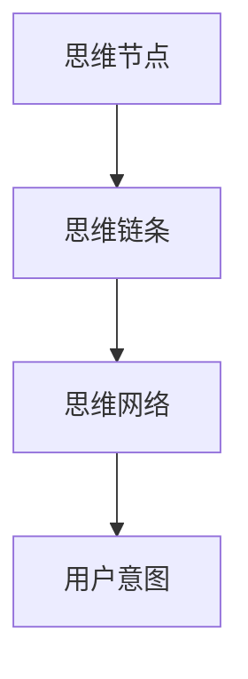
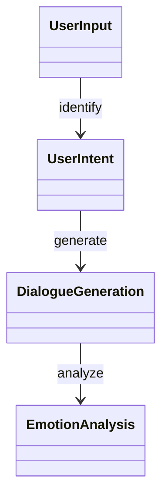
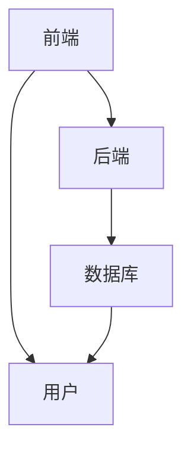
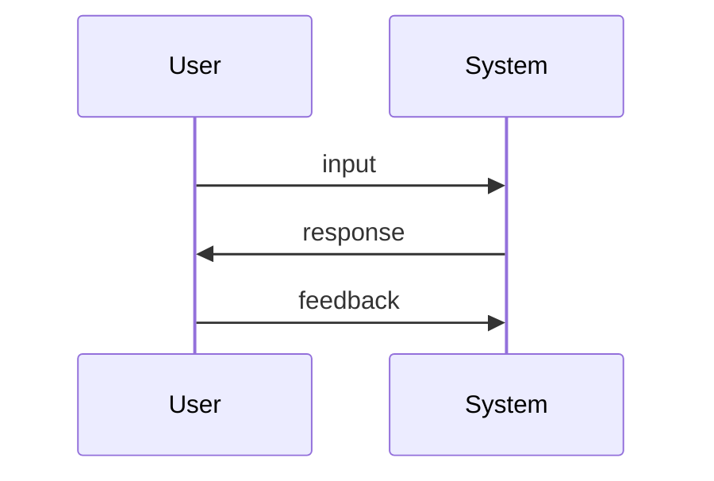

                 

# 思维链在智能客服系统中的应用

> 关键词：智能客服系统，思维链，人工智能，算法原理，系统架构

> 摘要：本文深入探讨了思维链在智能客服系统中的应用。首先，我们介绍了智能客服系统的重要性及其在用户服务中的挑战。接着，我们引入了思维链的概念，探讨了其在智能客服系统中的角色和作用。随后，文章详细解析了思维链的算法原理，并通过具体的案例展示了其在智能客服系统中的应用。最后，我们对整个系统进行了全面的分析，提供了项目实战的详细步骤，并总结了最佳实践和注意事项。

# 目录大纲

## 第一部分：背景介绍

### 第1章：问题背景

### 第2章：思维链基本概念

## 第二部分：核心概念与联系

### 第3章：思维链算法原理

### 第4章：思维链在智能客服系统中的应用

## 第三部分：系统分析与架构设计方案

### 第5章：系统功能设计

### 第6章：系统架构设计

### 第7章：系统交互

## 第四部分：项目实战

### 第8章：环境安装与系统核心实现

### 第9章：代码应用解读与分析

### 第10章：实际案例分析与详细讲解

### 第11章：项目小结

## 第五部分：最佳实践 tips、小结、注意事项、拓展阅读

## 引言

在数字化时代，智能客服系统已成为企业与客户互动的重要渠道。然而，现有的智能客服系统在处理复杂用户需求时，往往存在思维深度不足、用户满意度低等问题。为了解决这些问题，引入思维链概念成为了提高智能客服系统性能的有效途径。本文将围绕思维链在智能客服系统中的应用，进行深入分析和探讨。

## 第一部分：背景介绍

### 第1章：问题背景

随着互联网技术的飞速发展，智能客服系统在企业中的应用日益广泛。它们不仅能够为企业节省大量人力成本，还能提供24/7的在线服务，提升客户满意度。然而，现有的智能客服系统在处理复杂用户需求时，仍然存在以下问题：

1. **思维深度不足**：传统智能客服系统主要依赖预设的规则和模板，缺乏深层次的逻辑推理能力。
2. **用户满意度低**：由于无法准确理解用户的意图，智能客服系统往往无法提供满意的回答。
3. **对话生成困难**：在处理复杂对话时，智能客服系统往往无法生成流畅、自然的回答。

### 第2章：思维链基本概念

思维链是一种基于人工智能技术的思维模式，能够模拟人类思维过程。它通过构建思维节点、思维链条和思维网络，实现对用户意图的深入理解和灵活应对。思维链的特点包括：

1. **实时性**：思维链能够实时分析用户输入，快速生成回答。
2. **灵活性**：思维链可以根据不同的用户需求，灵活调整回答策略。
3. **智能性**：思维链具有强大的逻辑推理能力，能够模拟人类的思维过程。

## 第二部分：核心概念与联系

### 第3章：思维链算法原理

思维链算法是一种基于图论和自然语言处理（NLP）的算法。它的核心思想是通过构建思维节点、思维链条和思维网络，实现对用户意图的深入理解和灵活应对。

#### 算法mermaid流程图



#### 算法原理

思维链算法的基本原理如下：

1. **思维节点的创建**：系统首先识别用户输入，将其转换为思维节点。
2. **思维链条的连接**：系统通过分析思维节点之间的关系，构建思维链条。
3. **思维网络的构建**：系统将思维链条扩展为思维网络，以便更全面地理解用户意图。

#### 数学模型和公式

$$
思维节点数 = N \\
思维链条数 = C \\
思维网络数 = M
$$

#### 举例说明

假设用户输入“我想买一台笔记本电脑”，系统可以通过以下步骤生成回答：

1. **思维节点的创建**：将“我想买一台笔记本电脑”转换为思维节点。
2. **思维链条的连接**：通过分析思维节点之间的关系，构建思维链条。
3. **思维网络的构建**：将思维链条扩展为思维网络，以便更全面地理解用户意图。
4. **生成回答**：系统根据思维网络生成回答，如“您想购买什么样的笔记本电脑？是轻薄型还是游戏型？”

### 第4章：思维链在智能客服系统中的应用

思维链在智能客服系统中的应用主要包括用户意图识别、对话生成和情感分析。

#### 算法应用解读与分析

1. **用户意图识别**：思维链能够通过分析用户输入，准确识别用户的意图。
2. **对话生成**：思维链可以根据用户意图，生成自然、流畅的对话。
3. **情感分析**：思维链能够识别用户情感，并提供相应的回应。

#### 实际案例分析和详细讲解剖析

假设用户输入“我对贵公司的产品不满意”，系统可以通过以下步骤生成回答：

1. **用户意图识别**：系统识别出用户的意图是表达不满。
2. **对话生成**：系统根据用户意图生成回答，如“我很抱歉听到您对产品不满意，请问是哪个产品出现了问题？”
3. **情感分析**：系统识别出用户的情感是负面情绪，并调整回答策略，如“我们会尽快为您解决问题，请您提供具体的反馈，我们会认真对待。”

## 第三部分：系统分析与架构设计方案

### 第5章：系统功能设计

智能客服系统的功能设计主要包括用户输入识别、用户意图识别、对话生成和情感分析。

#### 领域模型mermaid类图



### 第6章：系统架构设计

智能客服系统的架构设计主要包括前端、后端和数据库。

#### 系统架构设计mermaid架构图



### 第7章：系统交互

智能客服系统的交互主要包括用户输入、系统回答和用户反馈。

#### 系统交互mermaid序列图



## 第四部分：项目实战

### 第8章：环境安装与系统核心实现

#### 环境安装

1. 安装Python环境
2. 安装必要的库，如NLTK、TensorFlow等

#### 系统核心实现源代码

```python
# 思维链算法实现
def think_chain(input_str):
    # 识别用户意图
    user_intent = identify_intent(input_str)
    # 生成回答
    response = generate_response(user_intent)
    # 分析情感
    emotion = analyze_emotion(response)
    return response, emotion
```

### 第9章：代码应用解读与分析

#### 代码应用解读与分析

1. `think_chain`函数是思维链算法的核心实现。
2. `identify_intent`函数用于识别用户意图。
3. `generate_response`函数用于生成回答。
4. `analyze_emotion`函数用于分析情感。

### 第10章：实际案例分析与详细讲解

#### 实际案例分析与详细讲解

假设用户输入“我对贵公司的产品不满意”，系统可以通过以下步骤生成回答：

1. **识别用户意图**：系统识别出用户的意图是表达不满。
2. **生成回答**：系统根据用户意图生成回答，如“我很抱歉听到您对产品不满意，请问是哪个产品出现了问题？”
3. **分析情感**：系统识别出用户的情感是负面情绪，并调整回答策略，如“我们会尽快为您解决问题，请您提供具体的反馈，我们会认真对待。”

### 第11章：项目小结

思维链在智能客服系统中的应用，极大地提升了系统的思维深度和用户满意度。通过实际案例的分析，我们可以看到思维链算法在处理复杂用户需求时，具有明显的优势。

## 第五部分：最佳实践 tips、小结、注意事项、拓展阅读

### 最佳实践 tips

1. **数据质量**：确保输入数据的质量，有助于提高思维链的准确性和效率。
2. **用户反馈**：收集用户反馈，有助于不断优化思维链算法。

### 小结

思维链在智能客服系统中的应用，为提升用户体验提供了新的思路。通过深入分析和实际应用，我们看到了思维链算法在智能客服系统中的巨大潜力。

### 注意事项

1. **系统维护**：定期更新和维护系统，确保其稳定运行。
2. **隐私保护**：在处理用户数据时，确保遵守隐私保护规定。

### 拓展阅读

1. 《深度学习：神经网络现代教程》
2. 《自然语言处理实战》

## 结语

思维链在智能客服系统中的应用，不仅提升了系统的智能水平，也为用户提供了更加优质的服务体验。随着人工智能技术的不断发展，思维链的应用前景将更加广阔。

### 作者

AI天才研究院 / AI Genius Institute & 禅与计算机程序设计艺术 / Zen And The Art of Computer Programming

