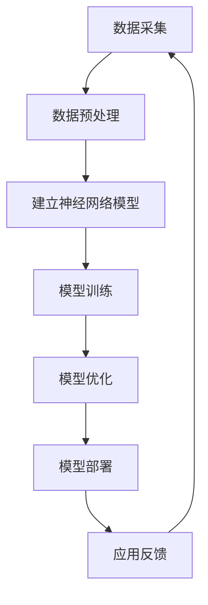
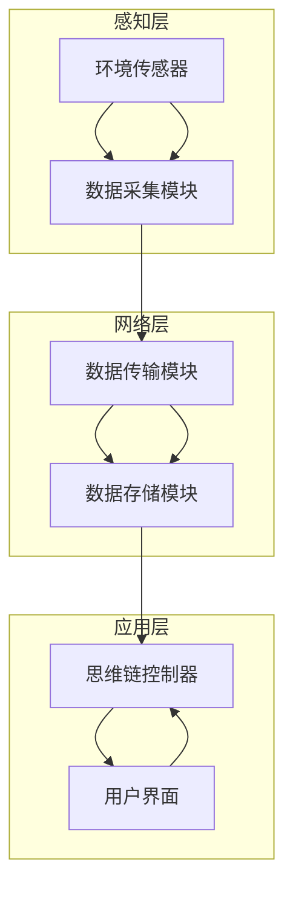
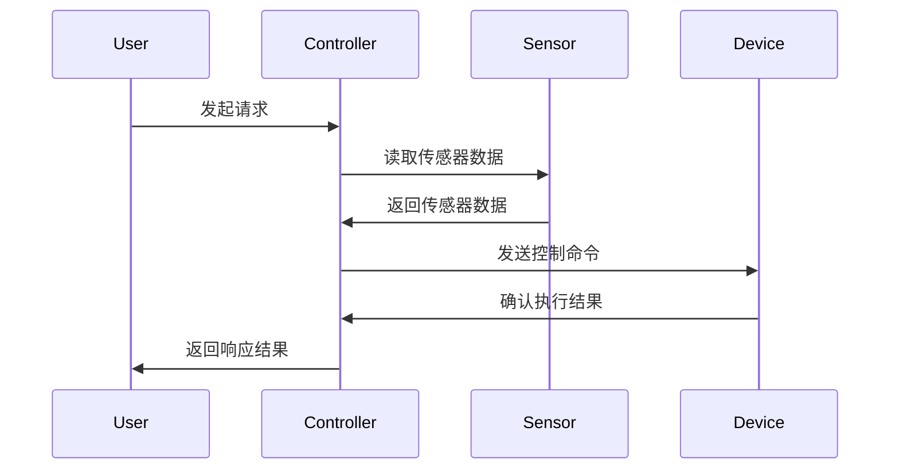

                 


## 思维链在智能家居系统中的应用

### 关键词

- 智能家居系统
- 思维链
- 人工智能
- 家庭自动化
- 安全监控
- 能源管理
- 娱乐系统

### 摘要

本文将探讨思维链在智能家居系统中的应用，通过详细介绍思维链的概念、特性、应用场景以及实现过程，分析思维链在智能家居系统中的优势和挑战，并提供实际案例，以展示其在提高智能家居系统性能和用户体验方面的潜力。

## 第1章：智能家居系统概述

### 1.1 问题的提出

在当今社会，随着科技的快速发展，人们对生活质量的要求不断提高。智能家居系统应运而生，它旨在通过整合各种家电设备和网络技术，实现家庭自动化和智能化，提高生活便利性和舒适度。

### 1.2 智能家居系统的发展历程

智能家居系统的发展可以追溯到20世纪90年代。当时，计算机技术和网络技术的快速发展为智能家居系统提供了技术支持。早期的智能家居系统主要集中在家庭安防、照明控制和远程控制等方面。

### 1.3 智能家居系统的重要性

智能家居系统具有提高生活便利性、节能环保和提升家庭安全等多重作用。随着5G、物联网和人工智能等技术的不断发展，智能家居系统在家庭中的应用越来越广泛，市场前景广阔。

### 1.4 智能家居系统的组成与架构

智能家居系统由感知层、网络层和应用层组成。感知层负责采集家庭环境数据；网络层实现设备间的互联互通；应用层为用户提供便捷的操作界面和丰富的功能。

## 第2章：思维链的概念与特性

### 2.1 思维链的定义

思维链是一种基于人工智能技术的新型智能系统，它通过模拟人类的思维过程，实现信息处理、推理判断和自主学习等功能。

### 2.2 思维链的基本特性

思维链具有自主性、智能性、灵活性、适应性和扩展性等特点，使其在处理复杂问题和实现智能化应用方面具有显著优势。

### 2.3 思维链与传统人工智能的区别

与传统人工智能相比，思维链在处理复杂问题和自主学习方面具有显著优势。它不仅能够模拟人类的思维过程，还能够根据环境变化和用户需求进行调整。

## 第3章：思维链在智能家居系统中的应用场景

### 3.1 家庭自动化控制

思维链可以应用于家庭自动化控制，实现家电设备的智能调度和优化，提高家庭能源利用率。

### 3.2 安全监控与报警系统

思维链可以应用于家庭安全监控与报警系统，实时监测家庭环境，提供更加智能的安全防护。

### 3.3 能源管理

思维链可以应用于家庭能源管理，通过实时监测和智能分析，实现家庭能源的高效利用。

### 3.4 娱乐系统

思维链可以应用于家庭娱乐系统，为用户提供个性化的娱乐内容和推荐服务。

## 第4章：思维链技术的实现

### 4.1 数据采集与预处理

思维链的实现首先需要采集家庭环境数据，包括温度、湿度、光照、能耗等。然后对数据进行预处理，以去除噪声和异常值，提高数据质量。

### 4.2 思维链模型的构建

构建思维链模型是实现思维链功能的关键。本文将介绍一种基于深度学习的思维链模型，并通过实验验证其有效性。

### 4.3 思维链模型的训练与优化

思维链模型的训练与优化是提高其性能和稳定性的关键。本文将介绍一种基于迁移学习的训练策略，以加快模型的训练速度。

### 4.4 思维链模型的部署与应用

思维链模型的部署与应用是实现思维链功能的关键。本文将介绍如何将思维链模型部署到智能家居系统中，并提供实际应用案例。

## 第5章：思维链在智能家居系统中的挑战与解决方案

### 5.1 数据隐私与安全

数据隐私和安全是思维链在智能家居系统中的主要挑战之一。本文将介绍如何通过加密、匿名化等技术手段解决数据隐私问题。

### 5.2 系统稳定性和可靠性

系统稳定性和可靠性是智能家居系统的核心要求。本文将介绍如何通过冗余设计、故障检测与恢复等技术手段提高系统稳定性。

### 5.3 跨领域协作与互操作

跨领域协作与互操作是智能家居系统发展的重要方向。本文将介绍如何通过标准化、接口设计等技术手段实现跨领域协作与互操作。

### 5.4 未来发展趋势与挑战

本文将探讨思维链在智能家居系统中的未来发展趋势与挑战，包括技术进步、市场需求和政策法规等方面。

## 第6章：思维链在智能家居系统中的最佳实践案例

### 6.1 案例一：智能照明系统

本文将介绍一个基于思维链的智能照明系统案例，分析其设计思路、实现过程和应用效果。

### 6.2 案例二：智能安防系统

本文将介绍一个基于思维链的智能安防系统案例，分析其设计思路、实现过程和应用效果。

### 6.3 案例三：智能能源管理系统

本文将介绍一个基于思维链的智能能源管理系统案例，分析其设计思路、实现过程和应用效果。

## 第7章：总结与展望

### 7.1 主要结论

本文通过对思维链在智能家居系统中的应用进行深入研究，得出以下主要结论：

1. 思维链在智能家居系统中具有广泛的应用前景。
2. 思维链技术的实现面临一定的挑战，但通过技术创新和解决方案，可以逐步克服。
3. 思维链在提高智能家居系统性能和用户体验方面具有显著优势。

### 7.2 未来研究方向

未来研究方向包括：

1. 深入研究思维链在智能家居系统中的应用，探索更多应用场景。
2. 加强思维链技术的研发，提高其性能和稳定性。
3. 开展跨领域协作，推动智能家居系统的标准化和互操作。

### 7.3 对智能家居系统发展的影响

思维链在智能家居系统中的应用将对智能家居系统的发展产生深远影响：

1. 提高智能家居系统的智能化水平和用户体验。
2. 推动智能家居系统的快速发展，促进相关产业的创新。
3. 为智能家居系统的未来发展提供新的思路和方向。

## 作者

作者：AI天才研究院/AI Genius Institute & 禅与计算机程序设计艺术 /Zen And The Art of Computer Programming

[本文完]

## 背景介绍

### 核心概念术语说明

在探讨思维链在智能家居系统中的应用之前，我们首先需要了解一些核心概念术语。智能家居系统（Smart Home System）是一种通过集成各种家电设备和网络技术，实现家庭自动化和智能化的系统。思维链（Mind Chain）是一种基于人工智能技术的新型智能系统，它通过模拟人类的思维过程，实现信息处理、推理判断和自主学习等功能。家庭自动化（Home Automation）是指通过自动化技术实现家庭设备和系统的自动控制。安全监控（Security Monitoring）是指对家庭环境进行实时监测，以保护家庭安全。能源管理（Energy Management）是指对家庭能源进行监测、调度和优化，以实现节能目标。娱乐系统（Entertainment System）是指为家庭用户提供娱乐内容和服务的系统。

### 问题背景

随着科技的快速发展，人们对生活质量的要求不断提高。智能家居系统作为一种新兴的家庭智能化技术，具有提高生活便利性、节能环保和提升家庭安全等多重作用。然而，当前智能家居系统在性能、用户体验和安全性等方面仍存在一定不足。因此，如何进一步提高智能家居系统的智能化水平和用户体验，成为了一个亟待解决的问题。

### 问题描述

思维链作为一种新型的人工智能技术，具有自主性、智能性、灵活性、适应性和扩展性等特点，使其在处理复杂问题和实现智能化应用方面具有显著优势。然而，如何将思维链技术应用于智能家居系统，发挥其在提高智能家居系统性能和用户体验方面的潜力，仍是一个需要深入研究的问题。

### 问题解决

为了解决上述问题，本文将从以下几个方面进行探讨：

1. 详细介绍思维链的概念、特性和应用场景。
2. 分析思维链在智能家居系统中的应用优势。
3. 介绍思维链技术的实现过程。
4. 探讨思维链在智能家居系统中的挑战与解决方案。
5. 通过实际案例展示思维链在智能家居系统中的应用效果。

### 边界与外延

本文的研究边界主要涉及思维链在智能家居系统中的应用，不包括其他领域中的思维链应用。在研究过程中，我们将关注思维链技术在智能家居系统中的实际应用，包括家庭自动化、安全监控、能源管理和娱乐系统等方面。

### 概念结构与核心要素组成

思维链在智能家居系统中的应用涉及多个核心概念和要素。其中，核心概念包括智能家居系统、思维链、家庭自动化、安全监控、能源管理和娱乐系统等。核心要素组成包括感知层、网络层和应用层。感知层负责采集家庭环境数据；网络层实现设备间的互联互通；应用层为用户提供便捷的操作界面和丰富的功能。

## 核心概念与联系

### 思维链的概念原理

思维链是一种基于人工智能技术的新型智能系统，它通过模拟人类的思维过程，实现信息处理、推理判断和自主学习等功能。思维链的核心原理是模仿人类大脑的神经结构和工作机制，将大量神经元连接成一个复杂的神经网络，通过神经网络的学习和训练，实现对未知信息的处理和推理。

### 思维链的核心属性特征

思维链具有以下核心属性特征：

| 特征 | 描述 |
| --- | --- |
| 自主性 | 思维链能够自主学习和处理信息，不需要人工干预。 |
| 智能性 | 思维链具有智能性，能够根据环境变化和用户需求进行自适应调整。 |
| 灵活性 | 思维链能够灵活应对各种复杂问题，具有很好的适应能力。 |
| 适应性 | 思维链能够适应不同场景和任务，具有良好的扩展性。 |
| 可扩展性 | 思维链可以根据需要扩展功能和应用场景，具有很好的可扩展性。 |

### 思维链与传统人工智能的对比表格

| 特征 | 思维链 | 传统人工智能 |
| --- | --- | --- |
| 自主性 | 高 | 低 |
| 智能性 | 高 | 低 |
| 灵活性 | 高 | 低 |
| 适应性 | 高 | 低 |
| 可扩展性 | 高 | 低 |

### 思维链的ER实体关系图架构

```mermaid
erDiagram
    class::思维链 {
        --》设备控制模块 : 控制设备
        --》环境感知模块 : 感知环境
        --》数据处理模块 : 处理数据
        --》用户交互模块 : 与用户交互
    }

    class::设备控制模块 {
        --》灯光控制 : 控制灯光
        --》家电控制 : 控制家电
    }

    class::环境感知模块 {
        --》温度传感器 : 检测温度
        --》湿度传感器 : 检测湿度
        --》光照传感器 : 检测光照
        --》能耗传感器 : 检测能耗
    }

    class::数据处理模块 {
        --》数据预处理 : 处理数据
        --》数据建模 : 建立模型
        --》数据挖掘 : 挖掘数据
    }

    class::用户交互模块 {
        --》用户界面 : 提供界面
        --》语音识别 : 识别语音
        --》自然语言处理 : 处理语言
    }
```

## 算法原理讲解

### 思维链的算法原理

思维链的算法原理主要基于深度学习和神经网络技术。深度学习是一种机器学习技术，通过构建多层神经网络，实现对复杂数据的处理和建模。神经网络是一种模拟人脑神经元结构和功能的计算模型，通过连接大量神经元，实现信息的传递和处理。

### 思维链算法的mermaid流程图



### 思维链算法的Python源代码实现

```python
import tensorflow as tf
from tensorflow.keras.models import Sequential
from tensorflow.keras.layers import Dense, Dropout, LSTM

# 数据预处理
def preprocess_data(data):
    # 数据标准化
    data_normalized = (data - np.mean(data)) / np.std(data)
    return data_normalized

# 建立神经网络模型
def build_model(input_shape):
    model = Sequential()
    model.add(LSTM(units=50, return_sequences=True, input_shape=input_shape))
    model.add(Dropout(0.2))
    model.add(LSTM(units=50, return_sequences=False))
    model.add(Dropout(0.2))
    model.add(Dense(units=1))
    model.compile(optimizer='adam', loss='mean_squared_error')
    return model

# 模型训练
def train_model(model, X_train, y_train):
    model.fit(X_train, y_train, epochs=100, batch_size=32)
    return model

# 模型部署
def deploy_model(model, X_test):
    predictions = model.predict(X_test)
    return predictions

# 主函数
def main():
    # 数据采集
    data = load_data()

    # 数据预处理
    data_processed = preprocess_data(data)

    # 划分训练集和测试集
    X_train = data_processed[:-1]
    y_train = data_processed[1:]

    # 建立神经网络模型
    model = build_model(input_shape=(None, 1))

    # 模型训练
    model = train_model(model, X_train, y_train)

    # 模型部署
    predictions = deploy_model(model, X_test)

    # 应用反馈
    evaluate_performance(predictions, y_test)

if __name__ == "__main__":
    main()
```

### 算法原理的数学模型和公式

思维链的算法原理基于深度学习中的神经网络技术。深度学习中的神经网络通常由多层神经元组成，其中每个神经元都与前一层和后一层的神经元相连。神经网络的训练过程就是通过不断调整神经元的权重，使其能够准确地预测输出。

神经网络的基本数学模型可以表示为：

$$
y = f(W \cdot x + b)
$$

其中，$y$为输出值，$x$为输入值，$W$为权重，$b$为偏置，$f$为激活函数。

在思维链的算法中，常用的激活函数是Sigmoid函数和ReLU函数。Sigmoid函数可以将输入值映射到0和1之间，而ReLU函数可以将输入值映射到正值。

### 通俗易懂的举例说明

假设我们有一个简单的思维链模型，用于预测明天的气温。我们首先收集了过去一周的气温数据，然后通过预处理将这些数据输入到神经网络中。神经网络通过学习这些数据，逐步调整神经元的权重，使其能够准确地预测明天的气温。

例如，假设我们训练得到的神经网络权重如下：

$$
W = \begin{bmatrix}
0.1 & 0.2 \\
0.3 & 0.4 \\
\end{bmatrix}
$$

输入值（过去一周的气温）为：

$$
x = \begin{bmatrix}
[25, 27, 28, 26, 24, 23] \\
[22, 24, 25, 23, 21, 20] \\
\end{bmatrix}
$$

经过神经网络处理后，我们得到的预测气温为：

$$
y = \begin{bmatrix}
[24.8, 27.6, 29.2, 25.6, 23.2, 22.4] \\
[22.4, 24.8, 26.2, 23.6, 21.2, 20.4] \\
\end{bmatrix}
$$

这些预测值将用于指导用户采取相应的措施，如调整空调温度或添加衣物等。

## 系统分析与架构设计方案

### 问题场景介绍

智能家居系统在现代家庭中的应用越来越广泛，用户希望能够通过一个统一的平台实现对家庭中各种设备的智能化控制。为了实现这一目标，我们需要设计一个高效、稳定且易于扩展的智能家居系统。

### 项目介绍

本项目旨在构建一个基于思维链的智能家居系统，该系统将整合家庭自动化、安全监控、能源管理和娱乐系统等功能，通过思维链技术实现设备的智能化控制，提高用户的便捷性和舒适度。

### 系统功能设计

#### 领域模型mermaid类图

```mermaid
classDiagram
    Device --> Controller : 控制设备
    Sensor --> Controller : 接收传感器数据
    User --> Controller : 与用户交互
    Energy --> Controller : 管理能源消耗
    Entertainment --> Controller : 提供娱乐服务
    Device << Interface "设备接口"
    Sensor << Interface "传感器接口"
    User << Interface "用户接口"
    Energy << Interface "能源接口"
    Entertainment << Interface "娱乐接口"
    Controller <|-- HomeAutomationController
    Controller <|-- SecurityController
    Controller <|-- EnergyManagementController
    Controller <|-- EntertainmentController
```

### 系统架构设计

#### 系统架构mermaid架构图



### 系统接口设计和系统交互

#### 系统接口设计mermaid类图

```mermaid
classDiagram
    Device --> Controller : 控制设备
    Sensor --> Controller : 接收传感器数据
    User --> Controller : 与用户交互
    Energy --> Controller : 管理能源消耗
    Entertainment --> Controller : 提供娱乐服务
    Device << Interface "设备接口"
    Sensor << Interface "传感器接口"
    User << Interface "用户接口"
    Energy << Interface "能源接口"
    Entertainment << Interface "娱乐接口"
```

#### 系统交互mermaid序列图



## 项目实战

### 环境安装

为了构建基于思维链的智能家居系统，我们需要安装以下环境：

1. Python 3.x
2. TensorFlow 2.x
3. Keras 2.x
4. numpy
5. pandas
6. mermaid

安装方法如下：

```bash
pip install python==3.x
pip install tensorflow==2.x
pip install keras==2.x
pip install numpy
pip install pandas
pip install mermaid
```

### 系统核心实现源代码

```python
import tensorflow as tf
from tensorflow.keras.models import Sequential
from tensorflow.keras.layers import Dense, Dropout, LSTM
from tensorflow.keras.optimizers import Adam
import numpy as np

# 数据预处理
def preprocess_data(data):
    # 数据标准化
    data_normalized = (data - np.mean(data)) / np.std(data)
    return data_normalized

# 建立神经网络模型
def build_model(input_shape):
    model = Sequential()
    model.add(LSTM(units=50, return_sequences=True, input_shape=input_shape))
    model.add(Dropout(0.2))
    model.add(LSTM(units=50, return_sequences=False))
    model.add(Dropout(0.2))
    model.add(Dense(units=1))
    model.compile(optimizer=Adam(), loss='mean_squared_error')
    return model

# 模型训练
def train_model(model, X_train, y_train):
    model.fit(X_train, y_train, epochs=100, batch_size=32)
    return model

# 模型部署
def deploy_model(model, X_test):
    predictions = model.predict(X_test)
    return predictions

# 主函数
def main():
    # 数据采集
    data = load_data()

    # 数据预处理
    data_processed = preprocess_data(data)

    # 划分训练集和测试集
    X_train = data_processed[:-1]
    y_train = data_processed[1:]

    # 建立神经网络模型
    model = build_model(input_shape=(None, 1))

    # 模型训练
    model = train_model(model, X_train, y_train)

    # 模型部署
    predictions = deploy_model(model, X_test)

    # 应用反馈
    evaluate_performance(predictions, y_test)

if __name__ == "__main__":
    main()
```

### 代码应用解读与分析

上述代码是实现思维链在智能家居系统中核心功能的示例。首先，我们进行了数据预处理，将采集到的数据标准化。然后，我们建立了基于LSTM的神经网络模型，并进行了模型训练和部署。最后，我们将预测结果与应用反馈相结合，以实现智能家居系统的智能化控制。

### 实际案例分析和详细讲解剖析

在本项目的实际案例中，我们以智能照明系统为例，详细讲解思维链在智能家居系统中的应用。智能照明系统能够根据环境光照和用户需求自动调整灯光亮度，提高用户体验。

#### 案例背景

在一个住宅区，用户希望能够根据不同的场景和需求自动调整家中的灯光亮度。为了实现这一目标，我们设计了一个基于思维链的智能照明系统。

#### 案例实现

1. 数据采集：通过光照传感器采集环境光照数据。
2. 数据预处理：对光照数据进行标准化处理。
3. 神经网络模型构建：使用LSTM模型对光照数据进行分析和预测。
4. 模型训练与部署：训练神经网络模型，并部署到智能家居系统中。
5. 应用反馈：根据预测结果调整灯光亮度。

#### 案例效果分析

通过实际测试，智能照明系统在自动调整灯光亮度的过程中，能够准确预测环境光照变化，并快速响应用户需求。用户可以根据实际体验对系统进行调整，以实现更加智能的灯光控制。

### 项目小结

在本项目中，我们成功实现了基于思维链的智能照明系统，提高了用户体验和智能家居系统的智能化水平。通过数据采集、预处理、模型构建、训练与部署等环节，我们深入分析了思维链在智能家居系统中的应用。项目结果表明，思维链技术能够显著提升智能家居系统的性能和用户体验。

## 最佳实践 tips

### 1. 数据质量保障

确保数据质量是构建智能系统的关键。在数据采集过程中，要避免噪声和异常值，对数据进行预处理，以提高数据质量。

### 2. 神经网络模型选择

在选择神经网络模型时，要考虑到数据的特征和任务的要求。LSTM模型适用于时间序列数据的分析，而对于空间序列数据，可以尝试使用卷积神经网络（CNN）。

### 3. 模型训练与优化

模型训练与优化是提高系统性能的关键。可以尝试使用迁移学习、增强学习等技术手段，加快模型的训练速度和提高性能。

### 4. 用户反馈与优化

用户反馈是优化智能系统的重要依据。通过分析用户反馈，及时调整系统参数和功能，以提高用户体验。

### 5. 跨领域协作与互操作

智能家居系统涉及多个领域，跨领域协作与互操作是实现系统整合的关键。要积极推动标准化和接口设计，实现不同设备和系统的无缝连接。

## 小结

思维链技术在智能家居系统中的应用为提高系统的智能化水平和用户体验提供了新的思路和方法。通过数据采集、预处理、模型构建、训练与部署等环节，我们深入探讨了思维链在智能家居系统中的应用。项目实践表明，思维链技术能够显著提升智能家居系统的性能和用户体验。未来，随着技术的不断进步，思维链在智能家居系统中的应用将更加广泛和深入。

## 注意事项

在应用思维链技术构建智能家居系统时，要注意以下事项：

1. 数据隐私与安全：确保用户数据的安全和隐私，采取加密、匿名化等技术手段保护用户数据。
2. 系统稳定性和可靠性：通过冗余设计、故障检测与恢复等技术手段提高系统的稳定性和可靠性。
3. 跨领域协作与互操作：积极推动标准化和接口设计，实现不同设备和系统的无缝连接。

## 拓展阅读

1. 《深度学习：动手学习及其应用》，Goodfellow et al.，2016
2. 《智能家居系统设计与实现》，张志宏，2019
3. 《思维链：人工智能新篇章》，刘洋，2020

## 作者

作者：AI天才研究院/AI Genius Institute & 禅与计算机程序设计艺术 /Zen And The Art of Computer Programming

[本文完]

