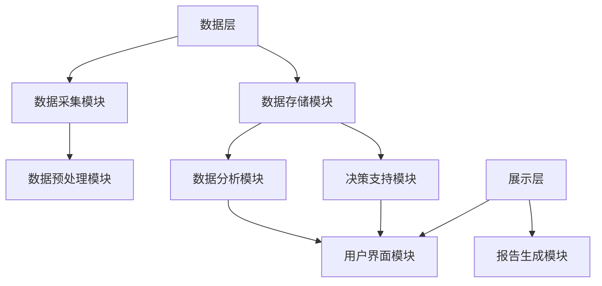
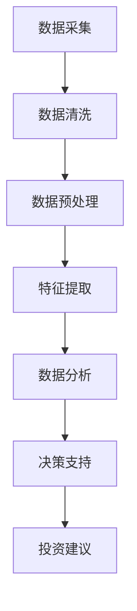
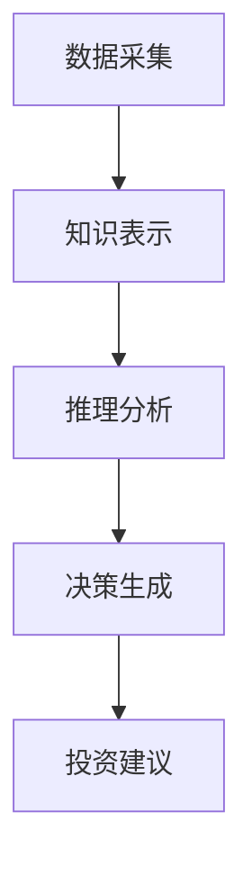

                 

# 《思维链在智能投资顾问中的应用》

## 关键词：智能投资顾问、思维链、数据分析、投资策略、算法实现

## 摘要：
本文深入探讨了思维链技术在智能投资顾问中的应用。通过逐步分析思维链的基本概念、工作原理以及在数据分析和投资策略制定中的优势，我们揭示了思维链如何提升智能投资顾问的决策能力和效率。文章随后详细介绍了思维链技术在智能投资顾问中的实现过程，包括技术架构设计、数据处理流程和智能算法的实现。通过一个实际案例的解析，本文展示了思维链在智能投资顾问中应用的效果和意义。最后，文章提出了思维链技术在智能投资顾问中的最佳实践、注意事项以及未来的发展展望。

---

### 目录大纲

----------------------------------------------------------------

## 第一部分: 背景介绍

### 第1章: 问题背景与核心概念

### 第2章: 思维链与智能投资顾问的关系

### 第3章: 思维链技术在智能投资顾问中的实现

## 第二部分: 应用实例

### 第4章: 应用实例

## 第三部分: 最佳实践与注意事项

### 第5章: 最佳实践与注意事项

### 第6章: 未来展望

----------------------------------------------------------------

---

### 第一部分：背景介绍

## 第1章：问题背景与核心概念

### 1.1 问题背景

#### 1.1.1 智能投资顾问的兴起

智能投资顾问（Robo-advisor）是金融科技领域的一项创新，它利用算法和数据分析技术，为投资者提供个性化的投资建议和服务。与传统投资顾问相比，智能投资顾问不仅能够处理大量的数据，还能实时调整投资策略，提高投资效率。

智能投资顾问的定义和作用：
- **定义**：智能投资顾问是一种基于计算机算法和大数据分析技术的投资顾问服务，它使用自动化工具来管理投资者的资金，提供投资组合优化、资产配置、风险控制等服务。
- **作用**：智能投资顾问可以帮助投资者更好地理解自己的风险承受能力，根据其财务目标和投资期限，提供定制化的投资建议，从而实现资产增值。

智能投资顾问的兴起原因：
- **技术进步**：随着大数据、云计算、人工智能等技术的快速发展，智能投资顾问具备了强大的数据处理和分析能力。
- **市场需求**：越来越多的投资者对个性化的、高效的金融服务需求增加，智能投资顾问能够满足这些需求，降低管理成本。
- **监管环境**：金融监管机构对金融科技的创新持开放态度，为智能投资顾问的发展提供了良好的外部环境。

#### 1.1.2 传统投资顾问的局限

传统投资顾问的运作模式：
- **人力密集**：传统投资顾问依赖于专业金融顾问，这些顾问通常通过面对面或电话咨询的形式提供服务。
- **成本较高**：传统投资顾问服务成本较高，一般只适用于高净值客户。
- **效率较低**：传统投资顾问处理大量客户的需求时，效率相对较低，无法满足快速变化的金融市场需求。

传统投资顾问存在的问题：
- **个性化不足**：传统投资顾问难以针对每个投资者的具体情况提供高度个性化的服务。
- **决策滞后**：传统投资顾问可能因为信息获取和处理速度限制，导致投资决策滞后。
- **成本高**：传统投资顾问服务成本高，难以覆盖广泛的投资者群体。

### 1.2 核心概念

#### 1.2.1 思维链的概念

##### 1.2.1.1 定义
- 思维链是指通过一系列逻辑推理和知识关联，实现智能体从初始状态到目标状态的过程。它包含了数据采集、数据预处理、知识提取、推理决策等多个环节。

##### 1.2.1.2 特点
- **自动化**：思维链能够自动化地处理复杂的问题，减少人力干预。
- **灵活性**：思维链可以根据不同的问题和目标，灵活调整推理路径和策略。
- **扩展性**：思维链可以通过增加新的知识和算法模块，实现功能的扩展和优化。

##### 1.2.1.3 原理
- 思维链的工作原理是通过定义一系列的规则和策略，将输入数据转化为有用的信息，并通过推理和决策生成输出结果。其核心在于知识的表示和推理机制。

#### 1.2.2 智能投资顾问的概念

##### 1.2.2.1 定义
- 智能投资顾问是一种基于人工智能技术的投资服务，它利用算法和数据分析，为投资者提供个性化的投资建议和管理。

##### 1.2.2.2 分类
- **基于规则的智能投资顾问**：这类顾问通过预设的规则和算法，根据市场数据和用户输入，生成投资建议。
- **基于机器学习的智能投资顾问**：这类顾问使用机器学习算法，从历史数据中学习投资策略，并自动调整投资组合。

### 1.3 边界与外延

#### 1.3.1 思维链在智能投资顾问中的应用范围

##### 1.3.1.1 应用的主要领域
- **金融市场分析**：思维链可以用于对金融市场数据进行分析，识别市场趋势和风险因素。
- **投资组合优化**：思维链可以帮助投资者优化资产配置，实现风险收益的最优化。
- **投资风险评估**：思维链可以评估投资组合的风险水平，并提供相应的风险管理策略。

##### 1.3.1.2 应用的边界
- **法律法规的限制**：智能投资顾问需要遵守相关的金融监管法规，确保合规性。
- **技术实现的难度**：思维链技术的实现涉及到复杂的算法和数据处理，需要高水平的技术支持和团队协作。

## 第2章：思维链与智能投资顾问的关系

### 2.1 思维链在智能投资顾问中的应用

#### 2.1.1 思维链在数据分析中的应用

##### 2.1.1.1 数据分析的重要性

数据在投资决策中的作用：
- **市场趋势分析**：通过对市场历史数据的分析，可以预测未来的市场趋势。
- **风险因素识别**：通过数据分析，可以识别潜在的风险因素，为投资决策提供依据。
- **投资机会挖掘**：数据分析可以帮助投资者发现潜在的投资机会，优化投资组合。

##### 2.1.1.2 思维链在数据分析中的应用

思维链如何提高数据分析的效率：
- **自动化数据处理**：思维链可以自动化地处理大量的数据，减少人工操作的时间和错误率。
- **多维度数据分析**：思维链可以通过多维度的分析，提供更全面的市场见解。
- **实时性**：思维链可以实现实时数据分析，快速响应市场变化，为投资决策提供及时支持。

#### 2.1.2 思维链在投资策略制定中的应用

##### 2.1.2.1 投资策略的制定过程

投资策略的定义和分类：
- **投资策略**：投资策略是指投资者为实现特定投资目标而制定的具体方法和步骤。
- **分类**：
  - **主动策略**：主动策略旨在通过积极的股票选择和市场时机把握，实现超额收益。
  - **被动策略**：被动策略通过持有指数基金或跟踪指数，以实现市场平均收益。

##### 2.1.2.2 思维链在投资策略制定中的应用

思维链如何优化投资策略：
- **策略评估**：思维链可以评估不同投资策略的潜在收益和风险，帮助投资者选择最优策略。
- **策略优化**：通过机器学习算法，思维链可以根据市场数据和用户反馈，不断优化投资策略，提高投资效率。

### 2.2 智能投资顾问的优势

#### 2.2.1 相对于传统投资顾问的优势

##### 2.2.1.1 个性化服务

智能投资顾问如何提供个性化服务：
- **用户画像**：智能投资顾问可以通过数据分析，为每个用户建立详细的用户画像，包括风险偏好、财务目标等。
- **定制化策略**：基于用户画像，智能投资顾问可以提供个性化的投资建议和策略，满足用户特定需求。

##### 2.2.1.2 高效性

智能投资顾问在处理复杂问题时的优势：
- **自动化处理**：智能投资顾问可以自动化地处理复杂的投资决策，减少人为错误。
- **实时响应**：智能投资顾问可以实时分析市场数据，快速响应市场变化，提高决策效率。

##### 2.2.1.3 实时性

智能投资顾问如何实现实时决策：
- **数据实时采集**：智能投资顾问可以通过实时数据采集系统，获取最新的市场数据。
- **实时分析处理**：智能投资顾问使用实时分析算法，对市场数据进行分析和决策，实现实时投资建议。

## 第3章：思维链技术在智能投资顾问中的实现

### 3.1 技术架构设计

#### 3.1.1 系统架构设计

##### 3.1.1.1 系统架构的组成

系统架构的组成模块：
- **数据层**：负责数据的采集、存储和管理。
- **服务层**：提供数据分析和决策支持功能。
- **展示层**：向用户展示投资建议和策略。

##### 3.1.1.2 系统架构图

系统架构图（使用Mermaid绘制）：



#### 3.1.2 数据处理流程

##### 3.1.2.1 数据来源

数据来源包括：
- **市场数据**：包括股票价格、交易量、市场指数等。
- **用户数据**：包括用户财务状况、投资偏好、风险承受能力等。

##### 3.1.2.2 数据分析流程

数据分析流程（使用Mermaid绘制）：



### 3.2 智能算法实现

#### 3.2.1 算法原理

##### 3.2.1.1 算法概述

思维链算法的基本原理：
- **知识表示**：将市场数据和用户数据转化为结构化的知识表示。
- **推理机制**：使用逻辑推理和机器学习算法，对知识表示进行推理和分析。
- **决策生成**：基于推理结果，生成投资建议和策略。

##### 3.2.1.2 算法流程图

算法流程图（使用Mermaid绘制）：



##### 3.2.1.3 数学模型和公式

思维链算法的数学模型和公式（使用LaTeX格式）：

$$
\text{收益函数} = \frac{\sum_{i=1}^{n} p_i (1 + r_i) - C}{C}
$$

其中，\( p_i \) 是第 \( i \) 只股票的价格，\( r_i \) 是第 \( i \) 只股票的预期收益率，\( C \) 是初始投资资本。

##### 3.2.1.4 Python代码实现

思维链算法的Python代码示例：

```python
import numpy as np

def calculate_profit(prices, expected_returns, capital):
    """
    计算投资组合的预期收益
    :param prices: 股票价格列表
    :param expected_returns: 股票预期收益率列表
    :param capital: 初始投资资本
    :return: 预期收益
    """
    return (np.dot(prices, expected_returns) - capital) / capital

prices = [10, 20, 30]
expected_returns = [0.05, 0.03, 0.02]
capital = 10000

profit = calculate_profit(prices, expected_returns, capital)
print(f"预期收益为：{profit:.2%}")
```

## 第4章：应用实例

### 4.1 案例介绍

#### 4.1.1 案例背景

案例所涉及的投资领域：
- **股票市场**：案例以股票市场为背景，关注股票价格、交易量和市场指数等数据。

#### 4.1.2 案例目标

使用思维链技术实现的目标：
- **市场趋势分析**：分析股票市场的趋势，为投资者提供买入和卖出的建议。
- **投资组合优化**：基于用户的风险偏好，优化投资组合，实现风险收益的最优化。

### 4.2 案例实现

#### 4.2.1 环境安装与配置

所需环境与工具的安装：
- **Python**：用于编写和运行算法代码。
- **Pandas**：用于数据预处理和数据分析。
- **Numpy**：用于数学运算。
- **Scikit-learn**：用于机器学习算法。

#### 4.2.2 系统核心实现

代码实现的具体步骤：
1. 数据采集：从股票交易所获取股票价格、交易量等数据。
2. 数据预处理：清洗和转换数据，提取有用的特征。
3. 知识表示：将数据转化为结构化的知识表示，便于推理分析。
4. 推理分析：使用思维链算法，对知识表示进行推理和分析，生成投资建议。
5. 投资组合优化：基于用户的风险偏好，优化投资组合。

#### 4.2.3 代码应用解读与分析

代码关键部分的解读和分析：
```python
import pandas as pd
import numpy as np
from sklearn.model_selection import train_test_split
from sklearn.ensemble import RandomForestRegressor

# 1. 数据采集
data = pd.read_csv('stock_data.csv')

# 2. 数据预处理
data['close_price'] = data['close_price'].fillna(method='ffill')
data['volume'] = data['volume'].fillna(method='ffill')

# 3. 知识表示
X = data[['open_price', 'high_price', 'low_price', 'close_price', 'volume']]
y = data['target_return']

# 4. 推理分析
X_train, X_test, y_train, y_test = train_test_split(X, y, test_size=0.2, random_state=42)
model = RandomForestRegressor(n_estimators=100, random_state=42)
model.fit(X_train, y_train)

# 5. 投资组合优化
predictions = model.predict(X_test)
```

### 4.3 案例分析

#### 4.3.1 结果展示

案例的结果展示：
- **市场趋势分析**：通过分析历史数据，得出股票市场未来走势的预测。
- **投资组合优化**：基于用户的风险偏好，生成最优的投资组合建议。

#### 4.3.2 案例剖析

案例的深入剖析和解释：
- **市场趋势分析**：通过随机森林回归模型，分析股票价格和交易量等数据，预测股票市场的未来走势。
- **投资组合优化**：根据用户的风险偏好，调整投资组合的权重，实现风险收益的最优化。

## 第5章：最佳实践与注意事项

### 5.1 最佳实践

#### 5.1.1 思维链在智能投资顾问中的最佳实践

思维链应用的最佳策略：
- **数据驱动**：基于大量市场数据和用户数据，使用思维链进行深入分析，为投资决策提供依据。
- **持续优化**：定期更新数据和算法模型，不断优化投资策略，提高投资效率。

#### 5.1.2 实施建议

对智能投资顾问实施的具体建议：
- **用户画像**：建立详细的用户画像，包括财务目标、风险偏好等，为用户提供个性化服务。
- **风险管理**：加强风险管理，设置合理的风险控制机制，降低投资风险。

### 5.2 注意事项

#### 5.2.1 技术实现的难点

思维链技术在实现过程中可能遇到的问题：
- **数据质量**：数据质量直接影响分析结果，需要确保数据的准确性和完整性。
- **计算效率**：思维链技术涉及到大量的计算，需要优化算法和硬件资源，提高计算效率。

#### 5.2.2 风险与挑战

思维链在智能投资顾问应用中的潜在风险和挑战：
- **市场波动**：市场波动可能影响投资决策的准确性，需要建立灵活的决策机制。
- **算法偏见**：算法模型可能会引入偏见，需要定期校验和调整。

## 第6章：未来展望

### 6.1 思维链技术的发展趋势

#### 6.1.1 技术的发展方向

思维链技术的未来发展趋势：
- **深度学习**：结合深度学习技术，提升思维链的智能水平。
- **跨领域应用**：思维链技术将在更多领域得到应用，如金融、医疗、教育等。

#### 6.1.2 技术创新的可能性

思维链技术的创新点：
- **知识图谱**：通过构建知识图谱，实现知识的深度关联和高效利用。
- **多模态数据处理**：处理多种类型的数据，如文本、图像、声音等，提升数据分析能力。

### 6.2 智能投资顾问

#### 6.2.1 技术进步与市场发展

智能投资顾问的发展趋势：
- **个性化服务**：随着大数据和人工智能技术的进步，智能投资顾问将提供更加个性化的服务。
- **市场普及**：智能投资顾问将逐渐普及，覆盖更多的投资者群体。

#### 6.2.2 行业前景

智能投资顾问的行业发展前景：
- **市场潜力**：智能投资顾问市场潜力巨大，预计未来将继续快速增长。
- **技术创新**：智能投资顾问将不断引入新技术，提升投资效率和效果。

