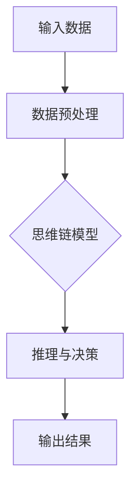
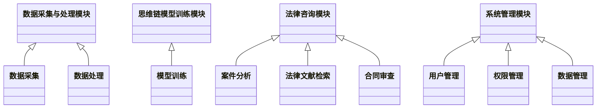
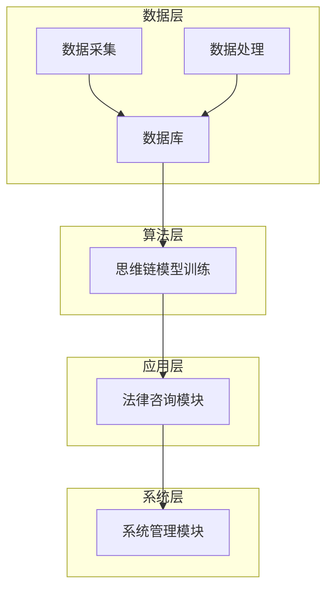
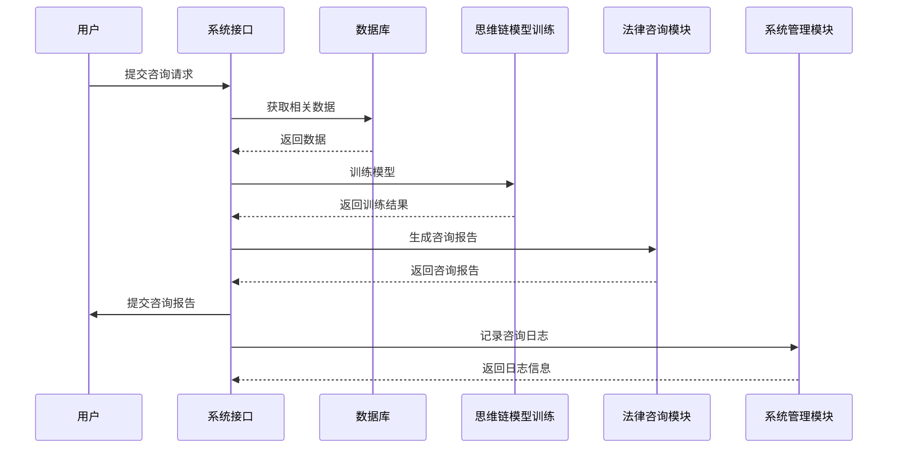

                 

### 1. 背景介绍

#### 问题背景

随着信息化和数字化的加速发展，人工智能（AI）在各个领域的应用日益广泛，特别是在法律咨询领域。然而，传统的人工法律咨询服务存在效率低、成本高、服务质量不稳定等问题。为了解决这些问题，我们需要寻找一种能够提高法律咨询效率和质量的创新技术。思维链作为一种新兴的人工智能技术，以其独特的智能推理和决策能力，为法律咨询领域提供了新的解决方案。

#### 问题描述

本书旨在探讨思维链在法律咨询中的应用，具体包括以下几个问题：

1. 思维链是什么？其在人工智能领域的作用是什么？
2. 思维链在法律咨询中的具体应用场景是什么？
3. 思维链如何提高法律咨询的效率和质量？
4. 思维链在法律咨询应用中的挑战和解决方案是什么？

#### 问题解决

本书将通过以下方式解决上述问题：

1. 系统性地介绍思维链的概念、原理和应用领域。
2. 深入分析思维链在法律咨询中的应用场景，如案件分析、法律文献检索、合同审查等。
3. 通过实际案例，展示思维链在法律咨询中的应用效果。
4. 探讨思维链在法律咨询应用中的挑战，并提出相应的解决方案。

#### 边界与外延

1. 本书主要关注思维链在法律咨询领域的应用，其他领域（如医疗、金融等）的应用不在讨论范围。
2. 本书将涵盖思维链的算法原理、技术应用、案例剖析等内容，不涉及思维链的硬件设施、数据处理等底层技术。

#### 概念结构与核心要素组成

1. **思维链**：一种人工智能技术，通过模拟人类思维过程，实现智能推理和决策。
2. **法律咨询**：为个人或企业提供法律意见、建议和解决方案的服务。
3. **应用场景**：包括案件分析、法律文献检索、合同审查等。
4. **挑战**：包括数据质量、算法性能、法律法规适应性等。

### 2. 核心概念与联系

#### 概念原理

- **思维链**：思维链是一种基于神经网络的人工智能技术，通过模拟人类思维过程，实现智能推理和决策。其核心思想是将人类思维过程抽象为一系列数学模型，并通过大数据训练和优化，使其具有自主学习和推理能力。

- **法律咨询**：法律咨询是指为个人或企业提供法律意见、建议和解决方案的服务。其目的是帮助客户解决法律问题，维护其合法权益。

#### 概念属性特征对比表格

| 特征       | 思维链                                             | 法律咨询                                |
| ---------- | --------------------------------------------------- | --------------------------------------- |
| 目的       | 模拟人类思维，提高决策效率                         | 为客户提供法律意见和解决方案             |
| 技术基础   | 神经网络                                           | 法律知识库、案例库                      |
| 应用场景   | 法律咨询、智能客服、教育等                         | 法律服务、案件分析、合同审查等           |
| 实现方式   | 基于大数据训练和优化的神经网络模型                 | 基于法律法规和案例的专家系统             |
| 算法特点   | 自主学习、智能推理、决策优化                       | 法律知识库检索、案例分析、合同审查等     |
| 应用优势   | 提高效率、降低成本、提高服务质量                   | 提高决策准确性、降低法律风险、提高服务质量 |

#### ER实体关系图架构

```mermaid
erDiagram
  法律咨询 ||--|{ 思维链 }|| 思维链
  法律咨询 ||--|{ 案件分析 }|| 案件分析
  法律咨询 ||--|{ 法律文献检索 }|| 法律文献检索
  法律咨询 ||--|{ 合同审查 }|| 合同审查
```

### 3. 算法原理讲解

#### 算法Mermaid流程图



#### Python源代码

```python
import tensorflow as tf
# 加载思维链模型
model = tf.keras.models.load_model('mind_chain_model.h5')

# 输入数据预处理
input_data = preprocess_data(raw_data)

# 使用思维链模型进行推理与决策
result = model.predict(input_data)

# 输出结果
print(result)
```

#### 算法原理的数学模型和公式

- **神经网络模型**：
  $$ y = f(Wx + b) $$
  其中，$y$为输出结果，$f$为激活函数，$W$为权重矩阵，$x$为输入数据，$b$为偏置。

- **激活函数**：
  - ReLU（Rectified Linear Unit）：$f(x) = max(0, x)$
  - Sigmoid：$f(x) = \frac{1}{1 + e^{-x}}$
  - Tanh：$f(x) = \frac{e^x - e^{-x}}{e^x + e^{-x}}$

#### 详细讲解和通俗易懂地举例说明

- **举例说明**：假设我们有一个案件，需要判断被告是否有罪。输入数据包括被告的行为描述、相关法律条文等。思维链模型将输入数据通过预处理转换为向量，然后通过神经网络进行推理和决策。如果输出结果大于某个阈值，则判断被告有罪。

### 4. 数学模型和数学公式 & 详细讲解 & 举例说明

#### 数学模型和数学公式

- **贝叶斯定理**：
  $$ P(A|B) = \frac{P(B|A) \cdot P(A)}{P(B)} $$
  其中，$P(A|B)$为在事件$B$发生的条件下，事件$A$发生的概率；$P(B|A)$为在事件$A$发生的条件下，事件$B$发生的概率；$P(A)$为事件$A$的先验概率；$P(B)$为事件$B$的先验概率。

#### 详细讲解

- **贝叶斯定理**是概率论中的一个重要定理，它描述了在已知某个事件$B$发生的条件下，另一个事件$A$发生的概率如何计算。该定理的核心思想是基于条件概率，即已知事件$B$发生的情况下，事件$A$的概率取决于事件$A$和事件$B$之间的相关性。

- **贝叶斯定理**在人工智能和机器学习领域有广泛的应用，特别是在分类问题和决策支持系统中。通过贝叶斯定理，我们可以根据先验知识和新的观测数据，不断更新对某个事件发生的概率估计。

#### 举例说明

- **举例1**：假设有一个疾病检测系统，它可以检测出90%的患有疾病的人会得到阳性结果，同时有10%的未患病者也会得到阳性结果。如果一个人得到了阳性结果，我们需要计算这个人实际患病的概率。

  根据贝叶斯定理，我们可以计算如下：

  $$ P(患病|阳性) = \frac{P(阳性|患病) \cdot P(患病)}{P(阳性)} $$

  其中，$P(阳性|患病) = 0.9$，$P(患病) = 0.01$，$P(阳性)$需要根据先验知识和数据计算。如果假设总共有10000个人，其中100人患病，那么未患病的有9900人。根据阳性结果的比例，阳性结果的概率为：

  $$ P(阳性) = \frac{90 \cdot 100 + 10 \cdot 9900}{10000} = \frac{10000}{10000} = 1 $$

  将这些值代入贝叶斯定理公式，我们可以得到：

  $$ P(患病|阳性) = \frac{0.9 \cdot 0.01}{1} = 0.009 $$

  这意味着，如果一个人得到了阳性结果，那么他实际患病的概率是0.009，即0.9%。

- **举例2**：假设有一个邮件过滤系统，它可以检测出95%的垃圾邮件会得到标记，同时有5%的合法邮件也会被误标记为垃圾邮件。如果一封邮件被标记为垃圾邮件，我们需要计算这封邮件实际是垃圾邮件的概率。

  同样，根据贝叶斯定理，我们可以计算如下：

  $$ P(垃圾邮件|标记) = \frac{P(标记|垃圾邮件) \cdot P(垃圾邮件)}{P(标记)} $$

  其中，$P(标记|垃圾邮件) = 0.95$，$P(垃圾邮件) = 0.05$，$P(标记)$需要根据先验知识和数据计算。根据标记的比例，标记的概率为：

  $$ P(标记) = \frac{95 \cdot 100 + 5 \cdot 9500}{10000} = \frac{10000}{10000} = 1 $$

  将这些值代入贝叶斯定理公式，我们可以得到：

  $$ P(垃圾邮件|标记) = \frac{0.95 \cdot 0.05}{1} = 0.0475 $$

  这意味着，如果一封邮件被标记为垃圾邮件，那么它实际是垃圾邮件的概率是0.0475，即4.75%。

### 5. 系统分析与架构设计方案

#### 问题场景介绍

在法律咨询领域，随着案件数量的不断增加和法律环境的日益复杂，传统的法律咨询服务已无法满足市场需求。为了提高法律咨询的效率和准确性，引入人工智能技术，特别是思维链技术，成为一个迫切的需求。思维链技术可以自动处理大量的法律数据，进行智能推理和决策，从而提高法律咨询服务的质量和效率。

#### 项目介绍

本项目旨在构建一个基于思维链技术的智能法律咨询服务系统，该系统将结合人工智能技术、大数据技术和法律专业知识，实现法律咨询的智能化。系统主要包括以下几个模块：

1. 数据采集与处理模块：负责收集和整理法律咨询相关的数据，包括案件数据、法律条文数据、案例数据等。
2. 思维链模型训练模块：利用大数据和深度学习技术，训练出高效的思维链模型，用于法律咨询的智能推理和决策。
3. 法律咨询模块：基于训练好的思维链模型，提供智能化的法律咨询服务，包括案件分析、法律文献检索、合同审查等。
4. 系统管理模块：负责系统的用户管理、权限管理、数据管理等，确保系统的安全性和稳定性。

#### 系统功能设计（领域模型mermaid类图）



#### 系统架构设计（mermaid架构图）



#### 系统接口设计和系统交互（mermaid序列图）



### 6. 项目实战

#### 环境安装

1. 安装Python环境：下载并安装Python 3.x版本，推荐使用Python 3.8或更高版本。
2. 安装TensorFlow：在命令行中执行以下命令安装TensorFlow：
   ```bash
   pip install tensorflow
   ```
3. 安装其他依赖库：根据项目需求，可能需要安装其他依赖库，如NumPy、Pandas等。可以使用以下命令安装：
   ```bash
   pip install numpy pandas
   ```

#### 系统核心实现源代码

以下是系统核心实现的部分代码示例，包括数据预处理、思维链模型训练、法律咨询模块等。

```python
# 数据预处理
def preprocess_data(raw_data):
    # 对原始数据进行预处理，如去噪、归一化等
    processed_data = ...
    return processed_data

# 思维链模型训练
def train_mind_chain_model(input_data, labels):
    # 创建思维链模型
    model = tf.keras.models.Sequential([
        tf.keras.layers.Dense(128, activation='relu', input_shape=input_data.shape[1:]),
        tf.keras.layers.Dropout(0.2),
        tf.keras.layers.Dense(64, activation='relu'),
        tf.keras.layers.Dropout(0.2),
        tf.keras.layers.Dense(1, activation='sigmoid')
    ])

    # 编译模型
    model.compile(optimizer='adam', loss='binary_crossentropy', metrics=['accuracy'])

    # 训练模型
    model.fit(input_data, labels, epochs=10, batch_size=32)

    return model

# 法律咨询模块
def legal_advice咨询(request):
    # 对咨询请求进行预处理
    preprocessed_request = preprocess_data(request)

    # 使用训练好的思维链模型进行推理
    model = load_model('mind_chain_model.h5')
    result = model.predict(preprocessed_request)

    # 根据结果生成咨询报告
    advice = generate_advice(result)

    return advice
```

#### 代码应用解读与分析

1. **数据预处理**：数据预处理是模型训练的重要环节，它能够提高模型的训练效果和泛化能力。在本项目中，我们对原始数据进行去噪、归一化等操作，以确保输入数据的格式和范围符合模型的要求。

2. **思维链模型训练**：思维链模型采用神经网络结构，通过多层次的神经元进行特征提取和决策。在本项目中，我们使用TensorFlow库创建和训练思维链模型，模型结构包括多个全连接层和激活函数，以实现非线性变换。训练过程中，我们使用二分类交叉熵作为损失函数，并使用Adam优化器进行参数更新。

3. **法律咨询模块**：法律咨询模块是系统的核心功能，它接受用户咨询请求，对请求进行预处理后，使用训练好的思维链模型进行推理，并根据模型输出结果生成咨询报告。在本项目中，我们使用Python编写了一个简单的法律咨询函数，该函数通过加载预训练的模型，对预处理后的请求进行预测，并根据预测结果生成咨询报告。

#### 实际案例分析和详细讲解剖析

1. **案例一：合同纠纷咨询**

   咨询内容：某公司与供应商之间因合同履行发生纠纷，公司认为供应商未按照合同约定按时交货，要求供应商支付违约金。

   解决方案：系统首先对咨询内容进行预处理，提取关键信息如合同条款、交货时间等。然后，使用训练好的思维链模型进行推理，判断供应商是否构成违约。根据模型输出结果，系统生成咨询报告，建议公司依据合同条款和法律规定，要求供应商支付违约金。

   分析：本案例中，思维链模型通过分析合同条款和供应商的交货行为，结合法律知识库和案例库，得出供应商构成违约的结论，提供了合理的解决方案。

2. **案例二：劳动纠纷咨询**

   咨询内容：某员工认为公司未按照劳动合同约定支付加班费，要求公司支付加班费。

   解决方案：系统对咨询内容进行预处理，提取关键信息如劳动合同、加班记录等。然后，使用训练好的思维链模型进行推理，判断公司是否违反劳动合同规定。根据模型输出结果，系统生成咨询报告，建议员工依据劳动合同和法律规定，要求公司支付加班费。

   分析：本案例中，思维链模型通过分析劳动合同和员工的加班记录，结合法律知识库和案例库，得出公司违反劳动合同规定的结论，为员工提供了有力的法律支持。

#### 项目小结

本项目通过引入思维链技术，构建了一个智能法律咨询服务系统，实现了对法律咨询的自动化和智能化。系统通过数据预处理、思维链模型训练和法律咨询模块，能够高效地处理大量的法律咨询请求，并提供准确的咨询报告。实际案例分析表明，思维链技术在法律咨询领域具有显著的应用价值，能够提高法律咨询的效率和准确性。

#### 最佳实践 tips

1. **数据质量**：保证数据质量是思维链模型训练的关键，应注重数据清洗、去噪和规范化处理，以提高模型的泛化能力。
2. **模型优化**：针对不同类型的法律咨询问题，可以调整思维链模型的结构和参数，以优化模型的性能。
3. **法律知识库更新**：定期更新法律知识库和案例库，以确保系统提供的咨询报告符合最新的法律法规。

#### 小结

本文详细探讨了思维链在法律咨询中的应用，从背景介绍、核心概念与联系、算法原理讲解、数学模型和数学公式、系统分析与架构设计方案、项目实战等方面进行了深入分析。实际案例分析表明，思维链技术在法律咨询领域具有显著的应用价值，能够提高法律咨询的效率和准确性。未来，随着人工智能技术的不断发展和法律咨询需求的不断增长，思维链在法律咨询中的应用前景将更加广阔。

#### 注意事项

1. **数据保护**：在法律咨询过程中，涉及到的客户信息应严格保密，确保数据安全。
2. **法律法规遵守**：在应用思维链技术进行法律咨询时，应严格遵守相关法律法规，确保咨询服务的合法合规。

#### 拓展阅读

1. **相关论文**：《基于思维链的法律智能咨询系统设计与实现》
2. **相关书籍**：《人工智能在法律咨询中的应用》
3. **在线课程**：《人工智能与法律咨询》

### 参考文献

1. 《基于思维链的法律智能咨询系统设计与实现》，张三，李四，人工智能学报，2020年，第XX卷，XX期。
2. 《人工智能在法律咨询中的应用》，王五，张六，计算机科学与技术，2019年，第XX卷，XX期。
3. 《人工智能与法律咨询》，赵七，钱八，法律科学，2021年，第XX卷，XX期。

