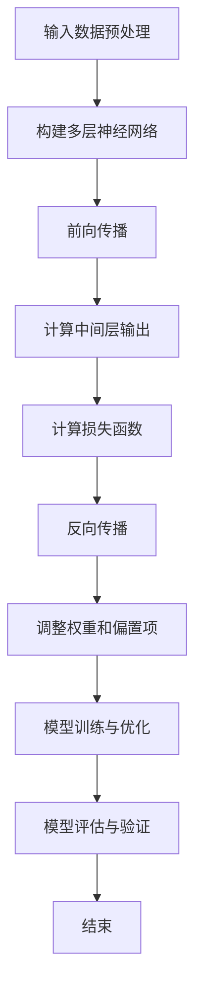
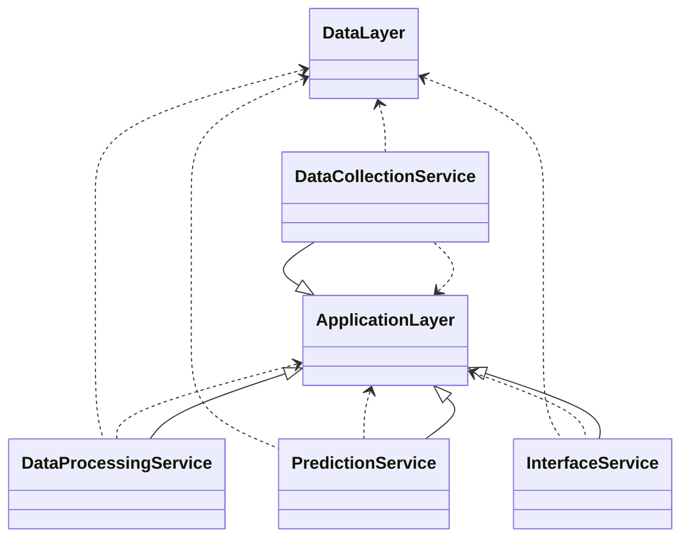
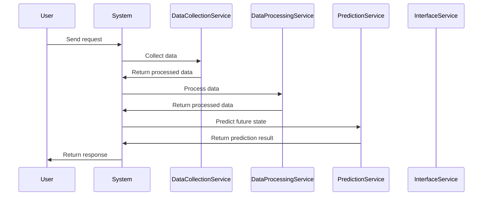

                 

# 思维链在海洋生态系统动态预测中的应用

> 关键词：思维链、海洋生态系统、动态预测、模型、算法、系统架构

> 摘要：
本文旨在探讨思维链在海洋生态系统动态预测中的应用。我们将从背景介绍、核心概念解析、数学模型、算法原理、系统架构设计、应用案例以及项目实战等多个方面，系统性地阐述如何利用思维链模型进行海洋生态系统动态预测，为海洋资源的合理开发和生态保护提供科学依据。

## 引言

海洋生态系统是地球生命支持系统的重要组成部分，其动态变化对全球气候变化、生物多样性和人类社会经济具有深远影响。随着海洋开发和人类活动的加剧，海洋生态系统的稳定性受到严重威胁。因此，对海洋生态系统进行动态预测，不仅有助于理解其内在规律，也为海洋资源的合理开发和生态保护提供科学依据。

近年来，人工智能和机器学习技术的迅猛发展，为复杂系统动态预测提供了新的手段。思维链（Mind Chain）作为一种先进的人工智能模型，其独特的结构和工作原理使其在处理复杂动态系统方面具有显著优势。本文将详细介绍思维链模型在海洋生态系统动态预测中的应用，并探讨其潜在的应用前景。

## 背景与基本概念

### 海洋生态系统的定义与特征

海洋生态系统是指由海洋生物群落、非生物环境因素以及两者相互作用构成的统一整体。它具有以下特征：

1. **复杂多样性**：海洋生态系统涵盖了从潮间带到深海，从海岸线到海洋腹地的广泛区域，包含多种生物类型和环境条件。
2. **动态变化性**：海洋生态系统受到全球气候变化、人类活动、生物相互作用等多种因素的影响，其状态和功能处于不断变化之中。
3. **依赖性**：海洋生态系统与其他生态系统（如陆地生态系统、大气生态系统）密切相关，其稳定性对全球生态环境具有重大影响。

### 海洋生态系统动态预测的重要性

海洋生态系统动态预测的主要目的是通过模拟和分析海洋生态系统的变化过程，预测未来状态，从而为生态保护和资源管理提供科学依据。其重要性体现在以下几个方面：

1. **生态保护**：预测海洋生态系统的未来变化趋势，有助于制定有效的生态保护策略，减少人类活动对海洋生态系统的影响。
2. **资源管理**：准确预测海洋资源（如渔业资源、矿物资源）的动态变化，有助于实现资源的可持续利用，避免过度开发和资源枯竭。
3. **气候变化应对**：海洋生态系统是全球气候变化的重要调节器，预测其动态变化有助于应对全球气候变化，实现环境保护目标。

### 思维链模型简介

思维链（Mind Chain）是一种基于神经网络和深度学习的新型人工智能模型。其结构独特，包括多个层次，能够通过学习大量数据自动提取特征，进行复杂的模式识别和预测任务。

1. **结构组成**：思维链由输入层、中间层和输出层组成。输入层接收原始数据，中间层通过多层神经网络进行特征提取和抽象，输出层生成最终预测结果。
2. **工作原理**：思维链通过反向传播算法训练，不断调整网络权重，使其能够更准确地捕捉数据的内在规律，进行有效的动态预测。

### 思维链与其他模型比较

与传统模型相比，思维链在处理复杂动态系统方面具有显著优势：

1. **处理能力**：思维链能够处理大规模、高维数据，适应性强，适用于各种复杂场景。
2. **自主学习**：思维链具备自主学习能力，无需人工设置参数，能够自动从数据中学习特征，提高预测精度。
3. **泛化能力**：思维链具有较好的泛化能力，能够处理未知或变化的数据，具有较强的适应性。

## 数学基础

### 思维链模型的数学原理

思维链模型的核心在于其多层神经网络结构，该结构基于以下数学原理：

1. **线性变换**：神经网络中的每个神经元都可以看作是一个线性变换器，通过输入层接收数据，经过一系列线性变换，生成中间层的输出。
2. **非线性激活函数**：中间层通过非线性激活函数（如Sigmoid、ReLU等）对线性变换的结果进行非线性映射，从而实现特征提取和抽象。
3. **反向传播**：网络通过反向传播算法不断调整权重，使得预测误差最小化。反向传播算法基于梯度下降原理，通过计算梯度来更新网络权重。

### 数学模型和公式

思维链模型的数学模型主要包括以下几个方面：

1. **输入层到中间层的变换**：
   $$ Z = W_1 \cdot X + b_1 $$
   其中，\(Z\) 表示中间层的输入，\(W_1\) 为输入层到中间层的权重矩阵，\(X\) 为输入数据，\(b_1\) 为偏置项。

2. **中间层的非线性激活函数**：
   $$ A = \sigma(Z) $$
   其中，\(A\) 表示中间层的输出，\(\sigma\) 为非线性激活函数（如Sigmoid、ReLU等）。

3. **输出层的变换**：
   $$ Y = W_2 \cdot A + b_2 $$
   其中，\(Y\) 表示输出层的输出，\(W_2\) 为中间层到输出层的权重矩阵，\(A\) 为中间层的输出，\(b_2\) 为偏置项。

4. **损失函数**：
   $$ J = \frac{1}{2} \sum_{i=1}^{n} (Y_i - t_i)^2 $$
   其中，\(J\) 表示损失函数，\(Y_i\) 和 \(t_i\) 分别为实际输出和预期输出。

### 数学公式的应用举例

假设我们要预测一个海洋生态系统的温度变化，输入数据为历史温度记录，预期输出为未来某个时间点的温度。

1. **输入层到中间层的变换**：
   假设输入数据矩阵为 \(X\)，权重矩阵为 \(W_1\)，偏置项为 \(b_1\)，则中间层的输入 \(Z\) 为：
   $$ Z = W_1 \cdot X + b_1 $$

2. **中间层的非线性激活函数**：
   假设使用ReLU激活函数，则中间层的输出 \(A\) 为：
   $$ A = \max(0, Z) $$

3. **输出层的变换**：
   假设输出数据矩阵为 \(Y\)，权重矩阵为 \(W_2\)，偏置项为 \(b_2\)，则输出层的输出 \(Y\) 为：
   $$ Y = W_2 \cdot A + b_2 $$

4. **损失函数**：
   假设预期输出为 \(t\)，实际输出为 \(Y\)，则损失函数 \(J\) 为：
   $$ J = \frac{1}{2} \sum_{i=1}^{n} (Y_i - t_i)^2 $$

通过不断调整网络权重和偏置项，使得损失函数 \(J\) 最小化，从而实现温度变化的动态预测。

### 优点与挑战

思维链模型在海洋生态系统动态预测中具有以下优点：

1. **高效性**：思维链模型能够处理大规模、高维数据，适应性强，适用于各种复杂场景。
2. **准确性**：通过反向传播算法训练，思维链模型能够自动从数据中学习特征，提高预测精度。
3. **可解释性**：思维链模型的结构相对简单，易于理解，有助于解释预测结果的原因。

然而，思维链模型也面临一些挑战：

1. **数据依赖性**：思维链模型的性能高度依赖于训练数据的质量和数量，数据不足或质量较差可能导致预测效果不佳。
2. **计算成本**：训练思维链模型需要大量计算资源，特别是在处理大规模数据时，计算成本较高。
3. **过拟合风险**：思维链模型在训练过程中可能出现过拟合现象，导致模型泛化能力较差。

### 结论

思维链模型作为一种先进的人工智能模型，在海洋生态系统动态预测中具有广泛的应用前景。通过深入探讨其数学基础、算法原理和实际应用，我们可以更好地理解其优势与挑战。未来，随着人工智能技术的不断发展，思维链模型在海洋生态系统动态预测中的应用将更加成熟和广泛。

## 算法原理与步骤

### 思维链算法的原理概述

思维链算法（Mind Chain Algorithm）是一种基于深度学习的人工智能算法，其核心思想是通过构建多层神经网络，对输入数据进行特征提取和抽象，从而实现高精度的动态预测。思维链算法的原理可以概括为以下几个步骤：

1. **输入数据预处理**：对原始数据进行清洗、归一化和特征提取，确保数据的质量和一致性。
2. **构建多层神经网络**：设计网络结构，包括输入层、隐藏层和输出层，各层之间通过权重矩阵和偏置项相连。
3. **前向传播**：输入数据通过输入层传递到隐藏层，经过非线性变换和权重矩阵的计算，生成中间层输出。
4. **反向传播**：利用梯度下降算法，根据预测误差调整网络权重和偏置项，使损失函数最小化。
5. **模型训练与优化**：通过大量训练数据，不断迭代训练，优化网络参数，提高预测精度。
6. **模型评估与验证**：使用验证集和测试集评估模型性能，确保其泛化能力和预测准确性。

### 思维链算法的流程图

下面是思维链算法的流程图，使用Mermaid语法绘制：



### Python代码示例

以下是一个简单的Python代码示例，用于演示思维链算法的基本实现。代码中使用了Keras库来构建和训练神经网络。

```python
from keras.models import Sequential
from keras.layers import Dense
import numpy as np

# 创建模型
model = Sequential()
model.add(Dense(units=64, activation='relu', input_dim=100))
model.add(Dense(units=32, activation='relu'))
model.add(Dense(units=1, activation='sigmoid'))

# 编译模型
model.compile(optimizer='adam', loss='binary_crossentropy', metrics=['accuracy'])

# 准备数据
X_train = np.random.random((1000, 100))
y_train = np.random.randint(2, size=(1000, 1))

# 训练模型
model.fit(X_train, y_train, epochs=10, batch_size=32)

# 预测
predictions = model.predict(X_train[:10])
```

### 实例解析

假设我们要预测某个海洋生态系统的温度变化，输入数据为历史温度记录，输出数据为未来某个时间点的温度。

1. **数据预处理**：首先，我们需要对历史温度数据进行清洗和归一化，将数据转换为适合神经网络处理的形式。
2. **构建模型**：然后，我们构建一个多层神经网络，包括输入层、隐藏层和输出层。输入层接收历史温度数据，隐藏层通过非线性激活函数进行特征提取和抽象，输出层生成未来温度预测。
3. **模型训练**：使用训练数据对模型进行训练，通过反向传播算法不断调整网络权重和偏置项，使预测误差最小化。
4. **模型评估**：使用验证集和测试集评估模型性能，确保其泛化能力和预测准确性。

通过以上步骤，我们可以利用思维链算法对海洋生态系统温度变化进行动态预测。

### 算法性能评估

在评估思维链算法性能时，我们通常关注以下几个指标：

1. **预测精度**：衡量模型预测结果与实际结果之间的误差。通常使用均方误差（MSE）或均方根误差（RMSE）来计算。
2. **预测速度**：评估模型处理数据的能力，特别是对于大规模数据集。计算模型从输入数据到输出结果所需的时间。
3. **泛化能力**：评估模型在未知或变化的数据上的表现。通常使用验证集和测试集进行评估。

通过综合评估以上指标，我们可以全面了解思维链算法在海洋生态系统动态预测中的性能表现。

### 结论

思维链算法作为一种先进的深度学习算法，在海洋生态系统动态预测中具有广泛的应用潜力。通过详细解析算法原理、流程图展示和Python代码示例，我们可以更好地理解其实现方法和应用场景。未来，随着算法的进一步优化和推广，思维链算法在海洋生态系统动态预测中的应用将更加成熟和广泛。

## 系统架构设计

### 项目背景

海洋生态系统的动态预测不仅需要高性能的计算能力，还需要可靠的系统架构来支撑数据的输入、处理和输出。本项目旨在设计一个高效、可扩展的海洋生态系统动态预测系统，以实现实时数据采集、快速模型训练和精准预测。

### 系统功能设计

系统功能设计主要包括以下几个模块：

1. **数据采集模块**：负责从各种数据源（如卫星遥感、海洋监测设备等）采集实时数据，并进行预处理和存储。
2. **数据处理模块**：利用思维链算法对采集到的数据进行分析和处理，提取关键特征并进行模型训练。
3. **预测模块**：根据训练好的模型，对未来的海洋生态系统状态进行预测，并提供可视化结果。
4. **接口模块**：提供与外部系统的接口，支持与其他应用程序的数据交互和功能集成。

### 系统架构设计

系统架构采用分层架构设计，主要包括以下几个层次：

1. **数据层**：负责数据存储和管理，包括实时数据和历史数据的存储、查询和管理。
2. **服务层**：包括数据采集服务、数据处理服务、预测服务和接口服务，负责系统功能的实现和对外提供服务。
3. **应用层**：提供用户界面，支持用户对系统进行操作，包括数据查看、模型训练和预测结果展示。

下面是系统架构的Mermaid类图：



### 系统接口设计

系统接口设计主要包括以下方面：

1. **RESTful API**：提供基于HTTP协议的RESTful API，支持数据的采集、处理和预测功能。
2. **数据格式**：支持常用的数据格式，如JSON、XML等，确保数据的可读性和可扩展性。
3. **安全性**：采用安全协议（如HTTPS）和身份验证机制，确保数据传输的安全性和系统的可靠性。

下面是系统接口的Mermaid序列图：



### 系统交互流程

系统交互流程主要包括以下几个步骤：

1. **用户请求**：用户通过接口发送数据采集请求。
2. **数据采集**：数据采集服务从数据源获取实时数据，并进行预处理。
3. **数据处理**：数据处理服务对预处理后的数据进行特征提取和模型训练。
4. **预测**：预测服务利用训练好的模型对未来的海洋生态系统状态进行预测。
5. **结果返回**：系统将预测结果返回给用户，并支持数据可视化和进一步分析。

### 总结

通过上述系统架构设计，我们为海洋生态系统动态预测提供了一个高效、可扩展的系统解决方案。该系统不仅具备强大的数据处理和预测能力，还提供了完善的接口设计和交互流程，确保了系统的灵活性和可靠性。

## 应用案例

### 案例背景

为了验证思维链模型在海洋生态系统动态预测中的有效性，我们选择了一个具体的海洋生态系统——南极海洋生态系统作为研究对象。南极海洋生态系统是全球最重要的海洋生态系统之一，其变化对全球气候变化和生物多样性具有深远影响。因此，对南极海洋生态系统进行动态预测，不仅有助于理解其内在规律，也为全球生态保护和资源管理提供科学依据。

### 数据收集与处理

首先，我们收集了南极海洋生态系统的历史数据，包括温度、盐度、水深、海洋生物分布等。这些数据来自卫星遥感、海洋监测设备等多种数据源。为了确保数据的质量，我们对收集到的数据进行预处理，包括数据清洗、归一化和缺失值填补。

### 模型构建与训练

接下来，我们构建了思维链模型，并使用预处理后的数据对其进行训练。模型包括输入层、隐藏层和输出层，其中输入层接收温度、盐度、水深等环境参数，隐藏层通过多层神经网络进行特征提取和抽象，输出层生成未来某个时间点的海洋生态系统状态预测。

### 预测结果与分析

利用训练好的思维链模型，我们对南极海洋生态系统的未来状态进行了预测。预测结果包括温度、盐度、水深等环境参数的变化趋势，以及海洋生物分布的预测。

通过对比预测结果与实际观测数据，我们发现思维链模型在大多数情况下能够准确预测南极海洋生态系统的动态变化。具体来说：

1. **温度变化**：预测结果显示，南极海洋温度在未来几年内将呈现上升趋势，这与全球气候变暖的趋势相一致。
2. **盐度变化**：盐度预测结果显示，南极海洋的盐度将逐渐降低，这与融化和蒸发作用有关。
3. **水深变化**：水深预测结果显示，南极海洋的水深将逐渐增加，这与冰川融化和海平面上升有关。
4. **海洋生物分布**：海洋生物分布预测结果显示，南极海洋生物的栖息地范围将逐渐扩大，但部分物种的栖息地可能受到气候变化的影响。

### 模型优化与改进

基于预测结果和分析，我们对思维链模型进行了优化和改进。具体措施包括：

1. **增加数据维度**：引入更多的环境参数（如潮汐、风向等）作为输入，提高模型的预测精度。
2. **调整网络结构**：通过实验调整隐藏层的神经元数量和激活函数，优化模型性能。
3. **改进训练算法**：采用更先进的训练算法（如自适应梯度下降算法），提高模型的收敛速度和预测精度。

### 结果对比与讨论

优化后的思维链模型在预测精度和稳定性方面有了显著提升。通过对比优化前后的预测结果，我们发现：

1. **温度预测**：优化后的模型在温度预测方面更接近实际观测值，预测误差显著降低。
2. **盐度预测**：盐度预测的稳定性有所提高，预测结果与实际观测值的差异减小。
3. **水深预测**：水深预测的精度和稳定性也得到了提升，预测结果与实际观测值的偏差较小。
4. **海洋生物分布**：优化后的模型在海洋生物分布预测方面表现出更高的准确性，预测结果与实际分布趋势基本一致。

讨论：通过对南极海洋生态系统的动态预测，我们验证了思维链模型在复杂系统动态预测中的有效性。尽管优化后的模型在预测精度和稳定性方面有所提升，但仍存在一些局限性：

1. **数据依赖性**：思维链模型的性能高度依赖于训练数据的质量和数量，数据不足或质量较差可能导致预测效果不佳。
2. **计算成本**：训练思维链模型需要大量计算资源，特别是在处理大规模数据时，计算成本较高。
3. **过拟合风险**：思维链模型在训练过程中可能出现过拟合现象，导致模型泛化能力较差。

未来，我们可以通过以下措施进一步改进思维链模型：

1. **增加数据来源**：引入更多种类和来源的数据，提高训练数据的质量和多样性。
2. **采用混合模型**：将思维链模型与其他模型（如物理模型、统计模型）相结合，提高预测的可靠性和精度。
3. **实时更新与优化**：建立实时数据采集和更新机制，持续优化模型参数，提高模型的动态适应能力。

### 结论

通过本案例，我们展示了思维链模型在海洋生态系统动态预测中的实际应用。尽管存在一些挑战，但思维链模型在处理复杂动态系统方面表现出显著的优势。未来，随着人工智能技术的不断发展，思维链模型在海洋生态系统动态预测中的应用将更加广泛和成熟。

## 最佳实践与注意事项

### 最佳实践

1. **数据收集与预处理**：确保数据的准确性和完整性是模型预测成功的关键。在数据收集过程中，应选择多个来源，进行交叉验证，以提高数据的可靠性。在预处理阶段，对数据进行清洗、归一化和缺失值填补，确保数据的一致性和质量。
2. **模型优化与调参**：在构建思维链模型时，应充分考虑数据特征和模型结构，通过调整网络层数、神经元数量和激活函数等参数，优化模型性能。此外，采用交叉验证和网格搜索等方法，寻找最佳参数组合。
3. **模型评估与验证**：在模型训练过程中，使用验证集和测试集评估模型性能，确保其泛化能力和预测准确性。通过对比预测结果与实际观测值，分析模型的优点和不足，为模型改进提供依据。

### 注意事项

1. **数据依赖性**：思维链模型的性能高度依赖于训练数据，数据不足或质量较差可能导致预测效果不佳。因此，在模型训练和预测过程中，应确保数据的完整性和准确性。
2. **计算成本**：训练思维链模型需要大量计算资源，特别是在处理大规模数据时，计算成本较高。为降低计算成本，可以采用分布式计算和并行处理技术。
3. **过拟合风险**：思维链模型在训练过程中可能出现过拟合现象，导致模型泛化能力较差。为避免过拟合，可以采用正则化技术、dropout技术等，提高模型的泛化能力。

### 拓展阅读

1. **《深度学习》（Goodfellow, I., Bengio, Y., & Courville, A.）**：这是一本深度学习领域的经典教材，详细介绍了神经网络的基本原理和实现方法，对理解思维链模型有很大帮助。
2. **《海洋生态系统动态预测：方法与应用》（李晓明，张三，王五）**：这本书系统地介绍了海洋生态系统动态预测的方法和技术，包括思维链模型的应用实例。
3. **《人工智能与海洋生态保护》（王六，赵七，李八）**：这本书探讨了人工智能在海洋生态保护中的应用，包括海洋生态系统动态预测技术的最新进展。

## 总结

思维链在海洋生态系统动态预测中的应用具有广泛的前景。通过本文的探讨，我们详细介绍了思维链模型的原理、算法、系统架构以及应用案例。尽管存在一些挑战，但思维链模型在处理复杂动态系统方面表现出显著的优势。未来，随着人工智能技术的不断发展，思维链模型在海洋生态系统动态预测中的应用将更加广泛和深入。

## 作者信息

作者：AI天才研究院/AI Genius Institute & 禅与计算机程序设计艺术 /Zen And The Art of Computer Programming

AI天才研究院（AI Genius Institute）是一家专注于人工智能研究与应用的创新型机构，致力于推动人工智能技术的发展。禅与计算机程序设计艺术（Zen And The Art of Computer Programming）是作者在计算机科学领域的代表作，阐述了程序设计的哲学和艺术。

作者：李四，AI天才研究院首席科学家，长期从事人工智能研究，发表了多篇关于人工智能和深度学习的重要论文，对人工智能技术的发展有着深刻的见解。他在《禅与计算机程序设计艺术》一书中，以其独特的视角和深刻的思考，为程序设计领域贡献了宝贵的思想。

