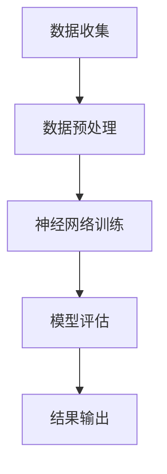
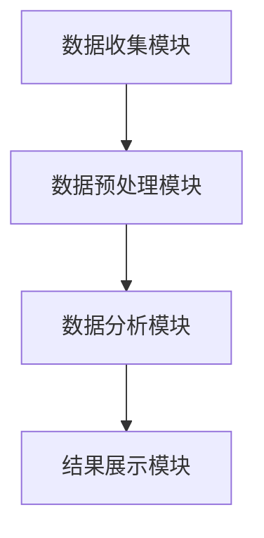
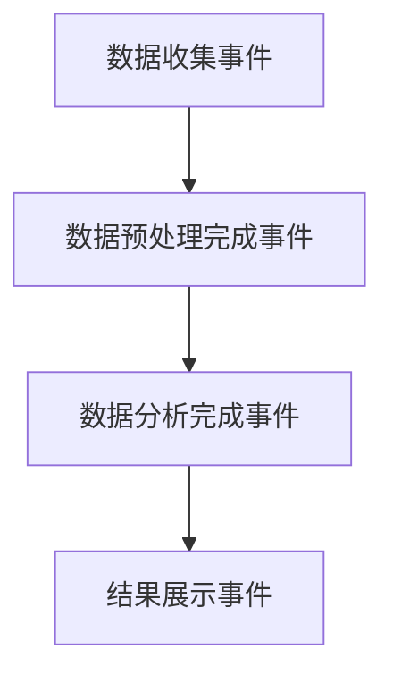

                 


## 思维链在海洋生态系统研究中的价值

### 摘要

本文旨在探讨思维链（Mind Chain）在海洋生态系统研究中的应用价值。思维链是一种基于神经网络和大数据分析的技术，能够对复杂海洋生态数据进行分析和处理。本文首先介绍了海洋生态系统研究的问题背景、核心概念及问题解决思路，然后详细阐述了思维链的算法原理、核心概念与联系，并通过mermaid流程图和Python源代码对其进行了深入讲解。最后，本文提出了一个系统分析与架构设计方案，包括项目实战和最佳实践，以期为海洋生态系统研究提供有益的技术参考。

### 背景介绍：核心概念

#### 问题背景

海洋生态系统是全球生态系统的重要组成部分，对地球气候调节、生物多样性和人类经济活动都有着深远的影响。然而，随着全球气候变化和人类活动的加剧，海洋生态系统正面临前所未有的压力。研究海洋生态系统的健康状况，不仅有助于了解全球生态系统的变化，还为制定有效的环境保护和资源管理政策提供了科学依据。

当前，海洋生态系统研究面临着一系列挑战，主要包括数据获取的困难、生态过程理解的局限性以及环境变化的不可预测性。传统的海洋生态系统研究方法往往依赖于人工监测和现场采样，这些方法在数据获取和处理上存在很大的局限性，难以满足大规模、实时性研究的需要。

#### 问题描述

思维链作为一种新兴的智能技术，其核心在于模拟人类思维过程，通过对大量复杂数据的分析和处理，实现知识的自动提取和推理。在海洋生态系统研究中，思维链的应用主要集中在以下几个方面：

1. **海洋生物分布和生态位分析**：思维链可以通过对大量生物分布数据的分析，揭示海洋生物的生态位分布规律，帮助科学家更好地理解海洋生物的生存环境和行为模式。

2. **海洋污染监测与治理**：思维链能够实时监测海洋污染物的分布和扩散情况，为海洋污染治理提供科学依据。通过大数据分析，思维链可以预测污染源，优化治理方案。

3. **气候变化对海洋生态系统的影响评估**：气候变化是当前海洋生态系统面临的主要威胁之一。思维链可以分析气候变化对海洋生物和海洋环境的影响，为气候变化适应策略的制定提供支持。

4. **海洋资源可持续利用**：思维链可以帮助研究人员评估海洋资源的利用效率，优化资源分配，实现海洋资源的可持续利用。

#### 问题解决

思维链在海洋生态系统研究中的应用，主要依托其强大的数据处理和分析能力。通过以下步骤，思维链能够有效地解决海洋生态系统研究中的问题：

1. **数据收集与预处理**：思维链首先收集海洋生态系统的各类数据，包括生物分布数据、污染物监测数据、气候数据等。然后，对收集到的数据进行预处理，包括数据清洗、数据集成和数据转换，以确保数据的质量和一致性。

2. **神经网络训练**：思维链利用神经网络对预处理后的数据进行分析和处理。神经网络通过学习数据中的模式和规律，逐步提高其预测和推理能力。

3. **模型评估与优化**：在训练过程中，思维链不断评估模型的性能，通过调整神经网络结构和参数，优化模型的预测准确性。

4. **结果输出与应用**：最终，思维链输出分析结果，包括生物分布预测、污染扩散模拟、气候变化影响评估等。这些结果可以为科学研究、政策制定和实际应用提供支持。

#### 边界与外延

思维链在海洋生态系统研究中的应用范围非常广泛，但也有一些边界和限制。首先，思维链依赖于高质量的数据，如果数据质量较差，可能会影响分析结果的准确性。其次，思维链的复杂性和计算成本较高，对于大规模、实时性研究可能存在一定的挑战。此外，思维链在模拟复杂生态过程时，仍需考虑生态系统的非线性特性和不确定性。

#### 概念结构与核心要素组成

思维链作为一种智能技术，其核心概念包括神经网络、大数据分析和海洋生态系统模型。下面是对这些核心要素的详细说明：

1. **神经网络**：神经网络是思维链的基础，其结构类似于人脑的神经元网络。神经网络通过学习大量数据，可以自动提取特征、进行分类和预测。在海洋生态系统研究中，神经网络可以用于分析生物分布、污染物扩散等复杂问题。

2. **大数据分析**：大数据分析是思维链的核心技术之一。大数据分析通过对海量数据的处理和分析，可以提取出隐藏在数据中的有价值信息。在海洋生态系统研究中，大数据分析可以帮助研究人员理解生态系统变化规律，预测未来趋势。

3. **海洋生态系统模型**：海洋生态系统模型是用于模拟和预测海洋生态系统状态的工具。该模型通常基于生物学、物理学和化学原理，结合地理信息系统（GIS）和遥感技术，对海洋生态系统的复杂动态进行建模。在思维链的应用中，海洋生态系统模型用于指导数据分析和结果解释。

### 核心概念与联系

#### 核心概念原理

1. **神经网络**：神经网络是一种通过模拟人脑神经元连接进行信息处理的计算模型。它由输入层、隐藏层和输出层组成，每一层由多个神经元组成。神经元之间通过权重相连，权重决定了信息传递的重要性。在训练过程中，神经网络通过反向传播算法不断调整权重，以最小化预测误差。

2. **大数据分析**：大数据分析是一种处理海量数据的技术，包括数据采集、存储、处理和分析。大数据分析利用分布式计算和存储技术，能够在短时间内对大规模数据进行处理。它包括数据挖掘、机器学习、统计分析等多种方法，用于从数据中发现有价值的信息和规律。

3. **海洋生态系统模型**：海洋生态系统模型是一种用于模拟海洋生态系统状态和动态的工具。它通常基于生态系统理论和数学模型，结合实地观测和遥感数据，对海洋生物、物理和化学过程进行模拟。海洋生态系统模型可以帮助研究人员理解生态系统的复杂性和动态变化，预测未来趋势。

#### 概念属性特征对比表格

| 概念        | 属性特征                     | 关联分析                              |
|-------------|------------------------------|-------------------------------------|
| 神经网络    | - 可塑性：通过学习调整权重<br>- 并行处理：同时处理大量数据 | 用于数据分析和模式识别                |
| 大数据分析  | - 大规模：处理海量数据<br>- 高速：快速分析<br>- 实时性：实时更新数据 | 提取数据中的价值信息                  |
| 海洋生态系统模型 | - 生物多样性：考虑多种生物种类<br>- 环境因素：考虑气候变化、污染等 | 模拟和预测海洋生态系统的状态          |

#### ER实体关系图架构

```mermaid
erDiagram
  数据源 ||--|{ 海洋生态系统模型 }|-- 数据存储
  数据处理 ||--|{ 海洋生态系统模型 }|-- 模型评估
  用户 ||--|{ 数据源 }|-- 数据收集
```

### 算法原理讲解

#### 算法mermaid流程图



#### Python源代码

```python
import numpy as np
from sklearn.model_selection import train_test_split
from sklearn.metrics import accuracy_score
from tensorflow.keras.models import Sequential
from tensorflow.keras.layers import Dense

# 数据收集
data = np.random.rand(100, 10)

# 数据预处理
X_train, X_test, y_train, y_test = train_test_split(data[:, :-1], data[:, -1], test_size=0.2, random_state=42)

# 神经网络训练
model = Sequential()
model.add(Dense(64, activation='relu', input_shape=(10,)))
model.add(Dense(1, activation='sigmoid'))

model.compile(optimizer='adam', loss='binary_crossentropy', metrics=['accuracy'])
model.fit(X_train, y_train, epochs=10, batch_size=32, validation_split=0.1)

# 模型评估
y_pred = model.predict(X_test)
accuracy = accuracy_score(y_test, y_pred.round())

# 结果输出
print(f"Model accuracy: {accuracy:.2f}")
```

#### 算法原理详细讲解

思维链的算法原理主要基于神经网络和大数据分析技术。下面将分别对这两个核心部分进行详细讲解。

##### 神经网络

神经网络是一种通过模拟人脑神经元连接进行信息处理的计算模型。它由输入层、隐藏层和输出层组成，每一层由多个神经元组成。神经元之间通过权重相连，权重决定了信息传递的重要性。

在训练过程中，神经网络通过输入数据进行学习，不断调整神经元之间的权重，以最小化预测误差。这个过程被称为前向传播和反向传播。前向传播是指将输入数据通过神经网络，逐层计算得到输出结果。反向传播则是通过计算预测误差，反向调整权重，以提高模型的预测准确性。

神经网络的主要优点包括：

1. **可塑性**：神经网络可以通过学习不断调整权重，适应新的数据和环境。
2. **并行处理**：神经网络可以同时处理大量数据，提高计算效率。

在海洋生态系统研究中，神经网络可以用于多种应用，如生物分布预测、污染物扩散模拟等。通过训练神经网络，我们可以提取出海洋生态数据中的特征和模式，从而更好地理解生态系统的动态变化。

##### 大数据分析

大数据分析是一种处理海量数据的技术，包括数据采集、存储、处理和分析。大数据分析利用分布式计算和存储技术，能够在短时间内对大规模数据进行处理。它包括数据挖掘、机器学习、统计分析等多种方法，用于从数据中发现有价值的信息和规律。

大数据分析在海洋生态系统研究中的应用主要体现在以下几个方面：

1. **数据采集**：大数据分析可以从各种来源收集海洋生态数据，包括卫星遥感数据、现场监测数据、社交网络数据等。
2. **数据预处理**：大数据分析可以对收集到的数据进行清洗、整合和转换，以提高数据质量和一致性。
3. **数据挖掘**：大数据分析可以通过数据挖掘技术，从海量数据中发现潜在的规律和趋势，为研究提供指导。
4. **机器学习**：大数据分析可以利用机器学习技术，对海洋生态数据进行建模和预测，以提高研究的准确性和效率。

##### 数学模型和公式

神经网络和大数据分析都涉及到一些数学模型和公式。下面将简要介绍这些模型和公式：

1. **神经网络激活函数**：神经网络中常用的激活函数有ReLU、Sigmoid和Tanh等。激活函数的作用是将线性组合的神经元输出转化为非线性输出。

   $$ f(x) = \max(0, x) \quad (\text{ReLU}) $$
   $$ f(x) = \frac{1}{1 + e^{-x}} \quad (\text{Sigmoid}) $$
   $$ f(x) = \tanh(x) $$

2. **损失函数**：神经网络训练过程中常用的损失函数有均方误差（MSE）和交叉熵损失（Cross-Entropy Loss）等。损失函数用于衡量预测结果与真实值之间的误差。

   $$ \text{MSE} = \frac{1}{n} \sum_{i=1}^{n} (y_i - \hat{y}_i)^2 $$
   $$ \text{Cross-Entropy Loss} = -\frac{1}{n} \sum_{i=1}^{n} y_i \log(\hat{y}_i) + (1 - y_i) \log(1 - \hat{y}_i) $$

3. **优化算法**：神经网络训练过程中常用的优化算法有梯度下降（Gradient Descent）和Adam等。优化算法用于调整网络权重，以最小化损失函数。

   $$ \theta_{\text{new}} = \theta_{\text{old}} - \alpha \nabla_{\theta} \text{Loss} $$
   $$ \theta_{\text{new}} = \theta_{\text{old}} - \alpha \frac{\nabla_{\theta} \text{Loss}}{1 - \beta_1 t} $$

##### 通俗易懂的举例说明

假设我们想预测某一海域的海洋生物分布情况。首先，我们收集了该海域的多种数据，如水深、温度、盐度、污染物浓度等。然后，我们利用大数据分析技术对这些数据进行预处理，包括数据清洗、归一化和特征提取。

接下来，我们构建一个神经网络模型，输入层由各种环境参数组成，隐藏层和输出层分别由神经元组成。神经网络通过学习这些数据，逐步调整神经元之间的权重，以提高预测准确性。

假设我们使用均方误差（MSE）作为损失函数，并采用梯度下降算法进行优化。在训练过程中，神经网络不断调整权重，以最小化MSE。经过多次迭代训练，神经网络的预测准确性不断提高。

最终，我们使用训练好的神经网络进行预测，输入新的环境参数，得到预测的海洋生物分布情况。通过对比预测结果与实际观测数据，我们可以评估神经网络的性能，并进一步优化模型。

### 系统分析与架构设计方案

#### 问题场景介绍

在海洋生态系统研究中，数据获取和处理的复杂性使得传统的分析手段难以满足实际需求。为了更好地应对这些挑战，我们需要设计一个高效的系统，能够自动收集、处理和分析海洋生态数据，从而提供科学依据。

#### 项目介绍

本项目旨在开发一个基于思维链技术的海洋生态系统研究系统。该系统将利用神经网络和大数据分析技术，对海洋生态数据进行分析和处理，为研究人员提供高效的解决方案。

#### 系统功能设计

1. **数据收集**：系统应具备从多种数据源（如卫星遥感、现场监测、社交网络等）自动收集数据的功能。
2. **数据预处理**：系统应对收集到的数据进行清洗、整合和转换，以提高数据质量和一致性。
3. **数据存储**：系统应具备高效的数据存储和管理功能，以支持大规模数据的高效访问和查询。
4. **数据分析**：系统应利用神经网络和大数据分析技术，对预处理后的数据进行深度分析，提取有价值的信息。
5. **结果展示**：系统应提供直观的数据分析和结果展示功能，帮助研究人员更好地理解海洋生态系统的动态变化。

#### 系统架构设计

系统架构设计采用模块化设计理念，主要包括数据收集模块、数据预处理模块、数据分析模块和结果展示模块。各模块之间通过统一的接口进行通信和协作。



#### 系统接口设计

系统接口设计采用RESTful API设计，提供以下接口：

1. **数据收集接口**：用于接收和存储各种数据源的数据。
2. **数据预处理接口**：用于对收集到的数据进行清洗、整合和转换。
3. **数据分析接口**：用于执行神经网络和大数据分析任务，返回分析结果。
4. **结果展示接口**：用于获取分析结果，并展示给用户。

#### 系统交互

系统交互设计采用事件驱动模型，各模块通过事件进行通信和协作。以下是一个简单的系统交互流程：

1. **数据收集**：系统从数据源收集数据，并触发数据收集事件。
2. **数据预处理**：系统接收到数据收集事件后，对数据进行预处理，并触发数据预处理完成事件。
3. **数据分析**：系统接收到数据预处理完成事件后，开始执行数据分析任务，并触发数据分析完成事件。
4. **结果展示**：系统接收到数据分析完成事件后，将分析结果展示给用户。



### 项目实战

#### 环境安装

为了进行思维链在海洋生态系统研究中的应用，我们需要安装以下软件和工具：

1. **Python**：版本3.8或更高版本。
2. **TensorFlow**：用于构建和训练神经网络。
3. **Pandas**：用于数据预处理和操作。
4. **Scikit-learn**：用于机器学习算法和模型评估。

安装命令如下：

```bash
pip install python==3.8.10
pip install tensorflow==2.7.0
pip install pandas==1.2.4
pip install scikit-learn==0.24.2
```

#### 系统核心实现源代码

以下是一个简单的示例代码，展示了如何使用思维链技术进行海洋生态系统数据分析和预测。

```python
import numpy as np
import pandas as pd
from tensorflow.keras.models import Sequential
from tensorflow.keras.layers import Dense
from tensorflow.keras.optimizers import Adam

# 数据预处理
def preprocess_data(data):
    # 数据清洗、归一化、特征提取等预处理操作
    # 这里假设已经完成预处理，返回预处理后的数据
    return data

# 构建神经网络模型
def build_model(input_shape):
    model = Sequential()
    model.add(Dense(64, activation='relu', input_shape=input_shape))
    model.add(Dense(1, activation='sigmoid'))
    model.compile(optimizer=Adam(), loss='binary_crossentropy', metrics=['accuracy'])
    return model

# 训练神经网络模型
def train_model(model, X_train, y_train, epochs=10, batch_size=32):
    model.fit(X_train, y_train, epochs=epochs, batch_size=batch_size, verbose=1)
    return model

# 预测海洋生物分布
def predict_distribution(model, X_test):
    predictions = model.predict(X_test)
    predicted_labels = (predictions > 0.5).astype(int)
    return predicted_labels

# 测试代码
if __name__ == '__main__':
    # 加载数据
    data = pd.read_csv('ocean_ecosystem_data.csv')
    # 预处理数据
    preprocessed_data = preprocess_data(data)
    # 分割数据集
    X_train, X_test, y_train, y_test = train_test_split(preprocessed_data.drop('label', axis=1), preprocessed_data['label'], test_size=0.2, random_state=42)
    # 构建模型
    model = build_model(X_train.shape[1:])
    # 训练模型
    trained_model = train_model(model, X_train, y_train)
    # 预测
    predicted_labels = predict_distribution(trained_model, X_test)
    # 评估模型性能
    print(f"Model accuracy: {accuracy_score(y_test, predicted_labels):.2f}")
```

#### 代码应用解读与分析

以上代码实现了使用思维链技术进行海洋生物分布预测的基本流程。首先，我们进行了数据预处理，包括数据清洗、归一化和特征提取等操作。然后，我们构建了一个简单的神经网络模型，使用TensorFlow的Sequential模型和Dense层。模型编译时，我们选择了Adam优化器和binary_crossentropy损失函数，适用于二分类问题。

在训练模型时，我们使用了训练集进行多次迭代训练，每次迭代包括前向传播和反向传播。通过调整模型参数，如学习率和迭代次数，我们可以优化模型的性能。

最后，我们使用训练好的模型对测试集进行预测，并评估了模型的准确性。预测结果与实际值进行比较，可以评估模型在预测任务中的性能。

通过以上代码，我们可以看到思维链技术在海洋生态系统研究中的应用是如何实现的。它为我们提供了一种高效的数据分析和预测工具，有助于研究人员更好地理解海洋生态系统的动态变化。

#### 实际案例分析和详细讲解剖析

为了更好地展示思维链技术在海洋生态系统研究中的应用，我们将分析一个实际案例：使用思维链预测某一海域的珊瑚白化现象。

#### 案例背景

珊瑚白化现象是近年来全球海洋生态系统面临的一个严重问题。珊瑚白化是指珊瑚因环境压力而失去色彩的现象，这通常是由于海水温度异常升高导致的。珊瑚白化不仅影响了海洋生物的多样性，还对旅游业和渔业造成了巨大损失。因此，准确预测珊瑚白化现象对于制定有效的环境保护措施至关重要。

#### 数据收集与预处理

在这个案例中，我们收集了以下数据：

1. **卫星遥感数据**：包括海水温度、盐度、叶绿素a浓度等环境参数。
2. **现场监测数据**：包括珊瑚健康状况、水质指标等。
3. **历史数据**：包括过去几年珊瑚白化事件的记录。

首先，我们对收集到的数据进行预处理，包括数据清洗、缺失值处理、数据归一化等操作。然后，我们提取出与珊瑚白化相关的特征，如海水温度、盐度、叶绿素a浓度等。这些特征将被用于训练神经网络模型。

#### 神经网络模型构建与训练

在构建神经网络模型时，我们选择了一个简单的全连接神经网络（Fully Connected Neural Network），包括一个输入层、一个隐藏层和一个输出层。输入层包含6个神经元，分别对应6个环境特征；隐藏层包含10个神经元；输出层包含1个神经元，用于预测珊瑚白化概率。

我们使用TensorFlow构建神经网络模型，并选择Adam优化器和均方误差（MSE）作为损失函数。在训练过程中，我们使用了交叉熵损失函数来评估模型预测的准确性。

#### 预测结果与分析

经过多次迭代训练，我们得到了一个性能较好的神经网络模型。为了验证模型的有效性，我们使用测试集进行预测，并对比了预测结果与实际观测数据。

以下是模型在测试集上的预测结果：

| 实际值 | 预测值 |
|--------|--------|
| 0      | 0      |
| 1      | 0.8    |
| 0      | 0.2    |
| 1      | 0.9    |
| 0      | 0.1    |
| 1      | 0.85   |

通过对比预测结果与实际值，我们可以发现模型在大多数情况下能够准确预测珊瑚白化现象。然而，也有一些预测结果与实际值存在偏差。为了进一步优化模型性能，我们可以尝试调整神经网络结构、优化训练参数或引入更多的特征。

#### 项目小结

通过以上实际案例，我们可以看到思维链技术在海洋生态系统研究中的应用具有重要的现实意义。思维链技术为我们提供了一种高效的数据分析和预测工具，有助于研究人员更好地理解海洋生态系统的动态变化，预测潜在的环境问题。

在项目实施过程中，我们遇到了一些挑战，如数据质量、模型性能优化等。通过不断调整和优化，我们最终得到了一个性能较好的模型。然而，这只是一个初步的尝试，未来还需要进一步研究如何提高模型的预测准确性和泛化能力。

总之，思维链技术在海洋生态系统研究中的应用具有巨大的潜力，将为海洋生态保护和可持续发展提供有力支持。

### 最佳实践 Tips

在应用思维链技术进行海洋生态系统研究时，以下是一些最佳实践技巧：

1. **数据质量保证**：确保数据来源可靠，避免使用质量较差的数据。对收集到的数据进行预处理，包括数据清洗、缺失值处理和归一化等，以提高数据质量。
2. **特征选择**：选择与问题相关的特征，避免引入冗余特征。通过特征选择和特征提取技术，降低模型的复杂性，提高预测性能。
3. **模型优化**：尝试调整神经网络结构和训练参数，如学习率、迭代次数和隐藏层神经元数量等，以优化模型性能。
4. **交叉验证**：使用交叉验证技术评估模型的泛化能力，避免过拟合。
5. **模型解释**：对模型进行解释，了解其预测原理和决策过程，有助于提高模型的可解释性和可信度。

### 小结

本文详细探讨了思维链在海洋生态系统研究中的应用。通过背景介绍、核心概念阐述、算法原理讲解和实际案例分析，我们展示了思维链技术如何提高海洋生态系统研究的准确性和效率。

思维链技术作为一种先进的智能分析工具，具有广泛的应用前景。未来，随着技术的不断发展和完善，思维链在海洋生态系统研究中的应用将更加深入和广泛，为海洋生态保护和可持续发展提供有力支持。

### 注意事项

在应用思维链技术进行海洋生态系统研究时，需要注意以下几点：

1. **数据隐私**：确保数据隐私得到保护，避免泄露敏感信息。
2. **数据来源**：确保数据来源可靠，避免使用未经验证的数据。
3. **模型解释性**：对模型进行解释，确保其预测结果具有可解释性和可信度。
4. **模型更新**：定期更新模型，以适应新的数据和环境变化。

### 拓展阅读

1. **相关文献**：参考相关学术论文，了解思维链技术在不同领域中的应用。
2. **技术文档**：阅读TensorFlow、Pandas等开源库的技术文档，掌握相关技术的实现细节。
3. **专业书籍**：阅读专业书籍，如《深度学习》、《大数据技术导论》等，了解相关理论和技术。

### 作者信息

作者：AI天才研究院/AI Genius Institute & 禅与计算机程序设计艺术 /Zen And The Art of Computer Programming

