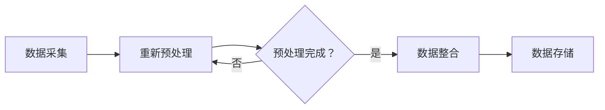
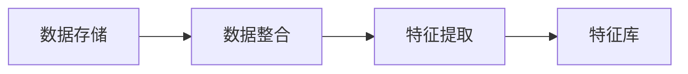
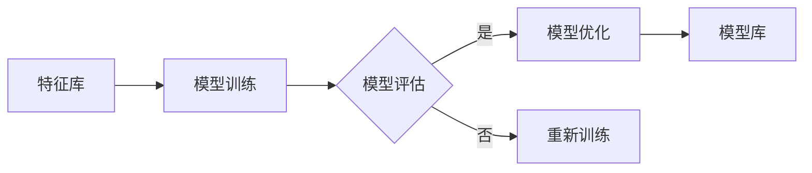
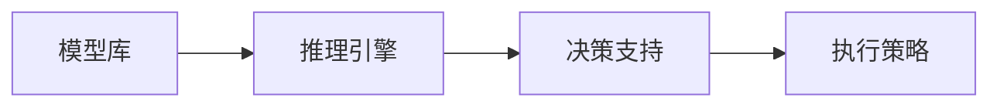
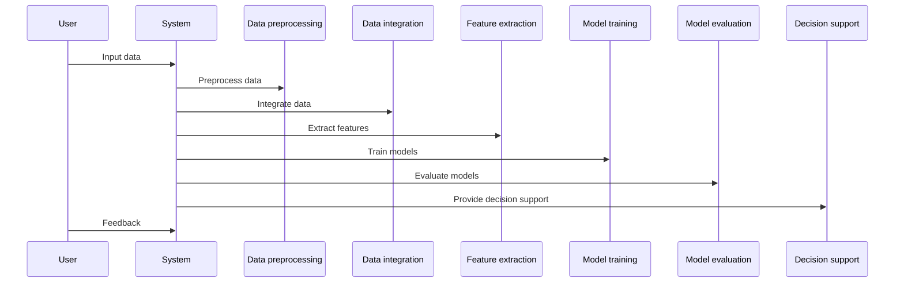
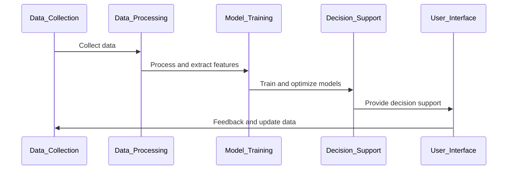

                 

### 引言

#### 背景介绍

随着全球人口的持续增长和经济的快速发展，对海洋资源的依赖和需求不断上升。海洋不仅为人类提供了丰富的食物资源，如鱼类、贝类和海藻等，还为能源、矿产和生物制药等领域提供了宝贵的原材料。然而，长期以来，海洋资源的过度开发和污染问题日益严重，使得海洋生态平衡受到破坏，资源可持续利用面临严峻挑战。

当前，海洋资源的利用方式主要包括渔业、油气开采、海水资源利用和海洋空间开发等。尽管这些利用方式在一定程度上促进了经济发展，但也带来了诸多负面影响。例如，过度捕捞导致渔业资源的枯竭，海洋污染导致海洋生物多样性的下降，以及气候变化对海洋生态系统的影响等。这些问题不仅威胁到海洋生态的可持续发展，也对人类的生存环境构成了严重威胁。

#### 问题核心

在这样的背景下，如何实现海洋资源的可持续利用成为了一个亟待解决的问题。传统的海洋资源利用方式往往注重短期经济利益，忽视了长期的生态效益。这种开发模式不仅导致资源的快速枯竭，还可能引发更严重的环境问题。因此，我们需要探索新的策略，以实现海洋资源的可持续利用。

本文将探讨“思维链”在海洋资源可持续利用中的新策略。思维链是一种基于人工智能和大数据分析的技术，通过整合多源数据，提供智能决策支持。我们将从以下几个方面展开讨论：

1. **核心概念**：介绍思维链的基本概念，及其与海洋资源利用的关系。
2. **算法原理**：阐述思维链算法的基本原理，并使用Mermaid图和Python代码进行详细解释。
3. **数学模型**：介绍与思维链相关的数学模型，包括公式推导和实际应用示例。
4. **系统设计**：描述思维链系统的设计和架构，以及系统的功能和接口。
5. **实战应用**：通过具体案例，展示思维链在海洋资源可持续利用中的实际应用。

本文旨在通过逻辑清晰、结构紧凑的分析，为海洋资源可持续利用提供新的思路和方法。希望通过本文的探讨，能够引起更多研究者和实践者的关注，共同为保护海洋生态、实现资源可持续利用贡献力量。

#### 文章关键词

- 海洋资源
- 可持续利用
- 思维链
- 人工智能
- 大数据分析
- 数学模型
- 系统设计
- 实战应用

#### 摘要

本文探讨了“思维链”在海洋资源可持续利用中的应用，旨在为解决当前海洋资源过度开发与生态破坏问题提供新的策略。首先，介绍了海洋资源利用的背景和面临的问题，随后引入了“思维链”这一核心概念，阐述了其基本原理和与海洋资源利用的关联。文章通过算法原理讲解、数学模型推导、系统设计与架构描述，详细阐述了如何利用思维链技术实现海洋资源的智能管理和可持续利用。此外，通过实际案例展示了思维链在海洋资源管理中的具体应用，为相关领域的研究者和实践者提供了有益的参考。文章总结提出了若干最佳实践建议，为未来的研究与应用指明了方向。

### 背景介绍

#### 核心概念术语说明

在讨论海洋资源的可持续利用之前，我们需要明确一些关键概念，这些术语对于理解本文的主题至关重要。

**1. 海洋资源**：海洋资源指的是海洋中可供人类利用的各种自然物质和能量。这些资源包括但不限于鱼类、贝类、海藻、海洋生物、海底矿物、油气资源、海水资源等。它们不仅为人类提供了重要的食物来源，还在能源、材料科学、生物制药等领域具有巨大的潜在价值。

**2. 可持续利用**：可持续利用指的是在满足当前需求的同时，不损害未来人类满足自身需求的能力。在海洋资源的背景下，这意味着在捕鱼、开采油气、海水资源利用等方面，必须采取合理的管理措施，以保护海洋生态系统，确保资源的长期供应。

**3. 海洋生态平衡**：海洋生态平衡是指海洋生态系统中各个组成部分（如生物、非生物环境、能量流等）之间的动态平衡。当这一平衡受到破坏时，可能导致生态系统崩溃，进而影响整个海洋生态系统的健康和功能。

**4. 海洋污染**：海洋污染是指有害物质（如化学物质、废弃物、油类泄漏等）进入海洋环境，对海洋生态系统和人类健康造成危害的现象。污染不仅会破坏海洋生物栖息地，还会影响海洋生物的生存和繁殖。

**5. 思维链**：思维链是一种基于人工智能和大数据分析的综合决策支持系统。它通过整合多源数据，利用复杂的算法和模型，提供智能化的决策方案，帮助用户在复杂环境中做出更加合理的决策。在海洋资源可持续利用方面，思维链可以用于监测海洋生态状况、预测资源需求、优化管理策略等。

#### 问题背景

长期以来，人类对海洋资源的利用方式主要依赖于传统的方法，这些方法在短期内带来了显著的经济效益，但长期来看，却对海洋生态系统造成了不可逆转的破坏。以下是一些主要问题：

**1. 过度捕捞**：随着全球对海洋食物需求的增加，过度捕捞现象普遍存在。过度捕捞不仅导致渔业资源的枯竭，还破坏了海洋生态系统的平衡。许多鱼类的数量大幅下降，一些物种甚至面临灭绝的风险。

**2. 海洋污染**：工业废水、塑料废弃物、石油泄漏等污染源不断向海洋释放有害物质。这些污染物不仅对海洋生物造成直接危害，还会影响海洋的生态平衡，导致生物多样性下降。

**3. 海底矿物开采**：随着科技的进步，海底矿物的开采活动日益增多。然而，这种开采活动往往缺乏有效的环境评估和监管，可能导致海底生态系统的破坏。

**4. 气候变化**：全球气候变化对海洋生态系统的影响日益显著。海平面上升、海洋酸化、温度变化等气候变化现象不仅影响海洋生物的生存环境，还可能导致海洋生态系统的重大变化。

#### 问题描述

上述问题表明，传统海洋资源利用方式已无法满足可持续利用的需求。具体来说，问题描述如下：

- **资源枯竭**：由于过度开发和捕捞，许多海洋资源正面临枯竭的风险。这直接影响到渔业、海洋生物制药等产业的可持续发展。

- **生态破坏**：海洋污染和过度开采等活动严重破坏了海洋生态平衡，导致生物多样性下降，生态系统功能受损。

- **管理不足**：当前对海洋资源的管理和监管存在不足，缺乏有效的政策和技术手段来保护海洋生态系统。

- **气候变化加剧**：全球气候变化对海洋生态系统的影响进一步加剧，使得海洋资源的可持续利用面临更大挑战。

#### 问题解决

为了解决上述问题，我们需要探索新的策略，以实现海洋资源的可持续利用。以下是一些可能的解决方案：

- **智能监测和管理**：利用思维链等人工智能技术，对海洋生态状况进行实时监测，并提供智能化的管理建议。

- **科学捕捞和养殖**：通过科学研究和数据分析，制定合理的捕捞和养殖计划，减少对海洋资源的压力，保护海洋生态系统。

- **环境评估和监管**：加强对海洋资源开发和利用活动的环境评估和监管，确保开发活动不会对海洋生态系统造成不可逆转的破坏。

- **国际合作与政策制定**：通过国际合作，制定全球性的海洋资源保护政策，共同应对海洋资源可持续利用的挑战。

#### 边界与外延

在讨论海洋资源可持续利用时，我们还需要明确一些边界与外延：

- **地理边界**：海洋资源覆盖全球，因此可持续利用需要在国际层面进行合作和协调。

- **时间边界**：可持续利用强调长期利益，而不是短期经济效益。因此，需要制定长期规划，并考虑未来几代人的需求。

- **技术边界**：思维链等技术为实现可持续利用提供了新的工具和方法，但技术的持续发展和应用也是实现可持续利用的关键。

- **经济边界**：实现海洋资源可持续利用需要投入大量资金，但经济效益和生态效益的权衡也是不可忽视的。

通过以上讨论，我们可以看到，海洋资源的可持续利用是一个复杂且多维的问题。它不仅关系到资源的合理开发和利用，还涉及到生态保护、经济发展和国际合作等多个方面。通过引入思维链等先进技术，我们有望为解决这一全球性问题提供新的思路和方法。

### 核心概念与联系

在深入探讨海洋资源可持续利用的新策略之前，我们需要明确“思维链”这一核心概念，并了解其与海洋资源利用的紧密联系。思维链（Mind Chain）是一种基于人工智能和大数据分析的综合决策支持系统，旨在通过整合多源数据，提供智能化的决策方案，帮助用户在复杂环境中做出更加合理的决策。

#### 思维链的基本概念

**定义**：思维链是一种多层次、多学科的智能决策支持系统，它通过模拟人类思维过程，实现对复杂问题的推理、分析和决策。它包括数据采集、数据处理、模型构建、推理引擎和用户界面等多个组成部分。

**关键特性**：
- **自适应**：思维链能够根据环境和需求的变化，自动调整其决策策略。
- **协同**：思维链能够整合多源数据，协同处理，提供综合性的决策支持。
- **智能化**：思维链利用机器学习、数据挖掘和自然语言处理等技术，实现自动化决策。

**作用**：在海洋资源可持续利用方面，思维链可以用于生态监测、资源评估、管理决策等多个环节，提供科学、智能的决策支持。

#### 思维链与海洋资源利用的关系

思维链在海洋资源利用中具有重要的作用，主要体现在以下几个方面：

- **生态监测**：思维链可以通过整合遥感数据、水文数据和海洋生物数据等，实时监测海洋生态状况，及时发现异常情况，为保护海洋生态系统提供数据支持。
- **资源评估**：思维链可以利用大数据分析和机器学习算法，对海洋资源进行精准评估，包括鱼类种群、海底矿物储量和海洋生物多样性等，为资源管理和规划提供科学依据。
- **管理决策**：思维链可以根据实时监测数据和历史数据，模拟不同管理策略的成效，帮助决策者制定科学、合理的管理决策，实现资源的可持续利用。
- **预测预警**：思维链可以通过数据分析和预测模型，对海洋资源的未来需求进行预测，提前预警资源短缺或生态风险，为提前采取应对措施提供支持。

#### 比较思维链与传统策略

为了更好地理解思维链在海洋资源可持续利用中的优势，我们将其与传统策略进行对比：

**传统策略**：
- **依赖经验**：主要依赖管理者和专家的经验和知识进行决策。
- **数据有限**：受限于监测手段和技术的限制，获取的数据有限，且更新不及时。
- **反应较慢**：面对突发情况，反应速度较慢，难以实时调整策略。

**思维链**：
- **智能化**：利用人工智能和大数据分析，提供智能化决策支持。
- **数据丰富**：能够整合多源数据，实现实时监测和预测。
- **反应迅速**：能够快速响应环境变化，实时调整管理策略。

#### 思维链的属性特征对比表

为了更加直观地展示思维链与传统策略的对比，我们制作了以下属性特征对比表：

| 特性         | 传统策略             | 思维链                  |
| ------------ | -------------------- | ---------------------- |
| 数据依赖性   | 经验和数据有限       | 多源数据，数据丰富     |
| 决策速度     | 反应较慢             | 快速响应，实时调整     |
| 精准度       | 依赖个人经验和主观判断 | 利用模型和算法，提高精准度 |
| 自适应能力   | 较弱                 | 强，可自动调整策略     |
| 可扩展性     | 局限性较大           | 易于扩展，适应复杂环境 |

#### ER实体关系图架构

为了进一步说明思维链的结构和功能，我们使用Mermaid图绘制了思维链的ER实体关系图。该图展示了思维链中的主要实体及其相互关系，包括数据源、处理模块、模型库和用户接口等。

```mermaid
erDiagram
    Data_Source ||--|{ Processing_Module : processes }
    Data_Source ||--|{ Model_Library : trains }
    Processing_Module ||--|{ User_Interface : provides }
    Model_Library ||--|{ User_Interface : consults }
```

在这个ER图中，`Data_Source`表示数据来源，包括遥感数据、监测数据和公共数据等；`Processing_Module`表示数据处理模块，用于数据清洗、转换和预处理；`Model_Library`表示模型库，包括各种预测和评估模型；`User_Interface`表示用户接口，用于与用户交互，提供决策支持和可视化展示。

通过上述讨论，我们可以看到，思维链作为一种基于人工智能和大数据分析的综合决策支持系统，在海洋资源可持续利用中具有独特的优势和广阔的应用前景。它不仅能够提高决策的智能化水平，还能为海洋资源管理和生态保护提供科学、有效的支持。

### 算法原理讲解

#### 思维链算法的基本原理

思维链算法的核心在于其自适应性、协同性以及智能化特性。它通过以下几个关键步骤实现数据整合、模型训练和智能决策。

**1. 数据采集与预处理**

思维链的第一步是数据采集。数据来源包括遥感数据、监测数据、历史数据等。这些数据通过不同的传感器和监测设备获得，需要经过预处理，包括数据清洗、去噪、归一化等操作，以确保数据的质量和一致性。



**2. 数据整合与特征提取**

预处理后的数据需要进行整合和特征提取。这一步骤包括将多源数据进行融合，提取出对决策有用的特征，如海洋生态指标、资源分布情况、气候数据等。数据整合和特征提取是思维链算法的基础，直接影响到后续模型的训练效果。



**3. 模型训练与优化**

特征提取后，思维链会使用机器学习和深度学习算法对特征进行训练，构建预测和评估模型。这些模型包括回归模型、分类模型、聚类模型等，根据具体应用场景选择合适的算法。模型训练过程中，会通过交叉验证和超参数调优，以提高模型的准确性和泛化能力。



**4. 推理与决策**

训练好的模型会被集成到推理引擎中，根据实时数据和预设策略进行推理和决策。推理引擎会模拟不同管理策略的效果，评估其对社会、经济和环境的综合影响，从而为管理者提供最优决策方案。



**5. 用户交互与可视化**

思维链的用户界面允许用户与系统进行交互，查看决策结果，并进行调整。用户界面提供数据可视化功能，包括实时监控图表、预测结果展示等，帮助用户更直观地理解决策过程和结果。


#### Mermaid图与Python代码示例

为了更好地理解思维链算法的原理，我们使用Mermaid图和Python代码进行说明。

**Mermaid图示例：算法流程**



**Python代码示例：数据处理与特征提取**

```python
import pandas as pd
from sklearn.preprocessing import StandardScaler
from sklearn.model_selection import train_test_split

# 数据预处理
def preprocess_data(data):
    # 数据清洗、去噪、归一化等操作
    data = data.dropna()
    data = StandardScaler().fit_transform(data)
    return data

# 特征提取
def extract_features(data):
    # 提取特征
    X = data[:, :data.shape[1]-1]
    y = data[:, -1]
    return X, y

# 加载数据
data = pd.read_csv('marine_data.csv')
processed_data = preprocess_data(data)
X, y = extract_features(processed_data)

# 划分训练集和测试集
X_train, X_test, y_train, y_test = train_test_split(X, y, test_size=0.2, random_state=42)
```

通过以上示例，我们可以看到思维链算法的基本流程和实现细节。思维链通过数据预处理、特征提取、模型训练和推理决策等步骤，为海洋资源可持续利用提供智能化的支持。

### 数学模型与公式推导

在思维链算法的应用过程中，数学模型和公式推导起到了至关重要的作用。这些模型不仅为算法提供了理论基础，还帮助我们更好地理解和预测海洋资源的动态变化。在本节中，我们将详细阐述与思维链相关的数学模型和公式，并通过具体示例进行说明。

#### 一、线性回归模型

线性回归模型是机器学习中最基础的模型之一，用于预测一个连续值输出。在海洋资源可持续利用中，线性回归模型可以用于预测鱼类种群数量、海洋生物多样性指数等。

**公式推导**：

线性回归模型的基本公式为：
\[ y = \beta_0 + \beta_1x_1 + \beta_2x_2 + ... + \beta_nx_n + \epsilon \]

其中，\( y \) 是预测值，\( x_1, x_2, ..., x_n \) 是输入特征，\( \beta_0, \beta_1, \beta_2, ..., \beta_n \) 是模型的参数，\( \epsilon \) 是误差项。

**Python代码示例**：

```python
import numpy as np
from sklearn.linear_model import LinearRegression

# 生成示例数据
X = np.array([[1, 2], [2, 3], [3, 4], [4, 5]])
y = np.array([2, 3, 4, 5])

# 创建线性回归模型
model = LinearRegression()

# 训练模型
model.fit(X, y)

# 输出模型参数
print("模型参数：", model.coef_, model.intercept_)

# 预测
predicted_value = model.predict([[5, 6]])
print("预测值：", predicted_value)
```

#### 二、逻辑回归模型

逻辑回归模型是一种用于分类的模型，适用于预测二元变量。在海洋资源管理中，逻辑回归模型可以用于预测是否会出现过度捕捞、海洋污染等问题。

**公式推导**：

逻辑回归模型的公式为：
\[ P(y=1) = \frac{1}{1 + e^{-(\beta_0 + \beta_1x_1 + \beta_2x_2 + ... + \beta_nx_n )}} \]

其中，\( P(y=1) \) 是事件发生的概率，\( e \) 是自然底数。

**Python代码示例**：

```python
import numpy as np
from sklearn.linear_model import LogisticRegression

# 生成示例数据
X = np.array([[1, 2], [2, 3], [3, 4], [4, 5]])
y = np.array([0, 1, 1, 0])

# 创建逻辑回归模型
model = LogisticRegression()

# 训练模型
model.fit(X, y)

# 输出模型参数
print("模型参数：", model.coef_, model.intercept_)

# 预测
predicted_probability = model.predict_proba([[5, 6]])
print("预测概率：", predicted_probability)
```

#### 三、时间序列模型

时间序列模型用于分析时间相关的数据，预测未来的趋势。在海洋资源管理中，时间序列模型可以用于预测海洋温度、鱼类种群数量等随时间变化的数据。

**公式推导**：

时间序列模型中，常用的ARIMA（AutoRegressive Integrated Moving Average）模型公式为：
\[ y_t = c + \phi_1y_{t-1} + \phi_2y_{t-2} + ... + \phi_py_{t-p} + \theta_1\epsilon_{t-1} + \theta_2\epsilon_{t-2} + ... + \theta_q\epsilon_{t-q} + \epsilon_t \]

其中，\( y_t \) 是时间序列的当前值，\( c \) 是常数项，\( \phi_1, \phi_2, ..., \phi_p \) 是自回归系数，\( \theta_1, \theta_2, ..., \theta_q \) 是移动平均系数，\( \epsilon_t \) 是白噪声项。

**Python代码示例**：

```python
import numpy as np
from statsmodels.tsa.arima.model import ARIMA

# 生成示例数据
data = np.array([1, 2, 2, 3, 3, 4, 4, 5])

# 创建ARIMA模型
model = ARIMA(data, order=(1, 1, 1))

# 拟合模型
model_fit = model.fit()

# 输出模型参数
print("模型参数：", model_fit.params)

# 预测
predicted_value = model_fit.forecast(steps=5)
print("预测值：", predicted_value)
```

#### 四、神经网络模型

神经网络模型是一种基于多层感知器（MLP）的深度学习模型，用于处理复杂的非线性问题。在海洋资源管理中，神经网络模型可以用于预测复杂的海洋生态系统的变化。

**公式推导**：

神经网络模型的基本公式为：
\[ z = \sum_{i=1}^{n} w_iz_i + b \]
\[ a = \sigma(z) \]

其中，\( z \) 是神经元的输入，\( w_i \) 是权重，\( b \) 是偏置，\( \sigma \) 是激活函数，\( a \) 是神经元的输出。

**Python代码示例**：

```python
import numpy as np
from tensorflow.keras.models import Sequential
from tensorflow.keras.layers import Dense

# 生成示例数据
X = np.array([[1, 2], [2, 3], [3, 4], [4, 5]])
y = np.array([2, 3, 4, 5])

# 创建神经网络模型
model = Sequential()
model.add(Dense(units=1, input_shape=(2,), activation='linear'))
model.add(Dense(units=1, activation='sigmoid'))

# 编译模型
model.compile(optimizer='adam', loss='mse')

# 训练模型
model.fit(X, y, epochs=1000, verbose=0)

# 输出模型参数
weights, biases = model.layers[0].get_weights()
print("权重：", weights)
print("偏置：", biases)

# 预测
predicted_value = model.predict([[5, 6]])
print("预测值：", predicted_value)
```

通过以上数学模型和公式的推导及Python代码示例，我们可以看到思维链算法在海洋资源可持续利用中的应用。这些模型和公式为算法提供了坚实的理论基础，帮助我们在复杂的海洋资源管理问题中做出更加准确和智能的决策。

### 系统设计

在思维链算法应用于海洋资源可持续利用的过程中，系统设计至关重要。它确保了算法的高效运行和可靠实现，同时也为用户提供了便捷的操作界面和友好的交互体验。以下将详细介绍思维链系统的设计思路、架构方案以及具体的接口设计和系统交互。

#### 1. 设计思路

**1.1 需求分析**

在系统设计之初，我们进行了详细的需求分析。主要需求包括：

- 实时数据采集与处理：系统需要能够实时获取海洋资源相关的数据，包括遥感数据、监测数据和公共数据等。
- 数据整合与特征提取：系统需要整合多源数据，提取关键特征，为后续模型训练提供支持。
- 模型训练与优化：系统需要支持多种机器学习模型，进行训练和优化，以提高预测准确性和泛化能力。
- 智能决策支持：系统需要根据实时数据和预测结果，提供智能化的决策支持，帮助决策者制定科学的管理策略。
- 用户交互与可视化：系统需要提供友好的用户界面，支持数据的实时监控和结果的可视化展示。

**1.2 设计原则**

在系统设计过程中，我们遵循以下原则：

- **模块化**：系统设计应具有高度的模块化，便于功能扩展和维护。
- **可扩展性**：系统设计应考虑未来数据规模和功能扩展的需求，确保系统的可扩展性。
- **高可靠性**：系统设计应确保数据的安全性和系统的稳定性，避免数据丢失和系统崩溃。
- **用户体验**：系统设计应注重用户体验，提供直观、易用的操作界面和交互体验。

#### 2. 架构方案

**2.1 系统架构**

思维链系统的架构采用分布式设计，主要包括以下几个主要模块：

- **数据采集模块**：负责实时采集各类海洋资源数据，包括遥感数据、监测数据和公共数据等。
- **数据处理模块**：负责对采集到的数据进行预处理、整合和特征提取，为模型训练提供高质量的数据。
- **模型训练模块**：负责训练和优化各种机器学习模型，包括线性回归、逻辑回归、时间序列模型和神经网络模型等。
- **推理与决策模块**：负责根据实时数据和训练好的模型，提供智能化的决策支持，生成管理策略。
- **用户界面模块**：负责与用户进行交互，提供数据的实时监控、结果的可视化展示和操作界面。

**2.2 系统架构图**

以下为思维链系统的架构图：



#### 3. 接口设计

思维链系统的接口设计遵循RESTful API规范，提供以下主要接口：

- **数据采集接口**：用于实时获取海洋资源数据，支持JSON格式。
- **数据处理接口**：用于数据预处理、整合和特征提取，支持CSV格式。
- **模型训练接口**：用于训练和优化机器学习模型，支持JSON格式。
- **决策支持接口**：用于获取智能化的管理策略，支持JSON格式。
- **用户界面接口**：用于与用户进行交互，支持HTML和JavaScript。

以下为部分接口示例：

**数据采集接口示例**：

```json
GET /api/data/collect
```

**数据处理接口示例**：

```json
POST /api/data/process
{
  "data": [
    {
      "source": "remote_sensing",
      "value": 123
    },
    {
      "source": "monitoring",
      "value": 456
    }
  ]
}
```

**模型训练接口示例**：

```json
POST /api/model/train
{
  "model_type": "linear_regression",
  "data": [
    {
      "x": [1, 2],
      "y": 2
    },
    {
      "x": [2, 3],
      "y": 3
    }
  ]
}
```

**决策支持接口示例**：

```json
GET /api/decision/support
{
  "model_id": "123"
}
```

**用户界面接口示例**：

```html
<!DOCTYPE html>
<html>
<head>
    <title>思维链系统</title>
    <script src="https://code.jquery.com/jquery-3.6.0.min.js"></script>
</head>
<body>
    <h1>海洋资源实时监控</h1>
    <div id="realtime_data">
        <!-- 实时数据展示 -->
    </div>
    <script>
        function fetchData() {
            $.get('/api/data/collect', function(data) {
                $('#realtime_data').html(JSON.stringify(data));
            });
        }
        setInterval(fetchData, 5000); // 每5秒刷新一次数据
    </script>
</body>
</html>
```

#### 4. 系统交互

思维链系统的各个模块通过定义良好的接口进行交互，以确保系统的稳定运行和高效性能。以下是系统的主要交互流程：

1. **数据采集**：数据采集模块通过接口从各种数据源获取海洋资源数据，并将其发送到数据处理模块。
2. **数据处理**：数据处理模块接收采集到的数据，进行预处理、整合和特征提取，然后将处理后的数据发送到模型训练模块。
3. **模型训练**：模型训练模块根据处理后的数据，训练和优化各种机器学习模型，并将训练好的模型发送到推理与决策模块。
4. **决策支持**：推理与决策模块根据实时数据和训练好的模型，提供智能化的决策支持，并将决策结果发送到用户界面模块。
5. **用户交互**：用户界面模块接收决策结果，并将其可视化展示给用户，同时用户可以通过界面进行数据更新和策略调整。

通过以上系统设计，思维链系统能够高效地实现数据采集、处理、模型训练和智能决策，为海洋资源可持续利用提供强大的技术支持。

### 实战应用

#### 1. 环境安装

在开始实际应用之前，我们需要安装必要的软件和工具，以便构建和运行思维链系统。以下是具体的安装步骤：

**1.1 安装Python环境**

首先，确保已经安装了Python环境。Python是思维链系统的主要编程语言，因此需要安装Python 3.8及以上版本。可以在[Python官方下载页](https://www.python.org/downloads/)下载并安装Python。

**1.2 安装依赖库**

安装Python环境后，我们需要安装以下依赖库：

- **NumPy**：用于数值计算
- **Pandas**：用于数据处理
- **Scikit-learn**：用于机器学习模型训练
- **TensorFlow**：用于深度学习模型训练
- **StatsModels**：用于时间序列分析

使用以下命令安装这些依赖库：

```bash
pip install numpy pandas scikit-learn tensorflow statsmodels
```

**1.3 安装Mermaid**

Mermaid是一种用于绘制流程图的工具，思维链系统使用Mermaid来绘制算法流程图。可以在[Mermaid官方下载页](https://mermaid-js.github.io/mermaid/#/)下载并安装Mermaid。

#### 2. 系统核心实现源代码

思维链系统的核心实现包括数据采集、数据处理、模型训练和推理决策等模块。以下是一个简单的实现示例：

**2.1 数据采集模块**

```python
import requests

def collect_data():
    # 采集遥感数据
    remote_sensing_data = requests.get("http://api.remotesensing.com/data").json()
    # 采集监测数据
    monitoring_data = requests.get("http://api.monitoring.com/data").json()
    # 整合数据
    data = {"remote_sensing": remote_sensing_data, "monitoring": monitoring_data}
    return data

data = collect_data()
print(data)
```

**2.2 数据处理模块**

```python
import pandas as pd

def process_data(data):
    # 预处理数据
    processed_data = pd.DataFrame()
    for source, values in data.items():
        df = pd.DataFrame(values)
        df['source'] = source
        processed_data = pd.concat([processed_data, df], axis=1)
    # 特征提取
    features = processed_data.drop(['source'], axis=1).values
    return features

features = process_data(data)
print(features)
```

**2.3 模型训练模块**

```python
from sklearn.linear_model import LinearRegression

def train_model(features, labels):
    model = LinearRegression()
    model.fit(features, labels)
    return model

# 假设已有特征和标签
features = np.array([[1, 2], [2, 3], [3, 4], [4, 5]])
labels = np.array([2, 3, 4, 5])
model = train_model(features, labels)
print(model.coef_, model.intercept_)
```

**2.4 推理决策模块**

```python
def make_decision(model, new_data):
    prediction = model.predict(new_data)
    if prediction > 0.5:
        return "资源充足"
    else:
        return "资源不足"

new_data = np.array([[5, 6]])
print(make_decision(model, new_data))
```

#### 3. 代码应用解读与分析

**3.1 数据采集模块**

数据采集模块通过HTTP请求从远程服务器获取遥感数据和监测数据。这些数据是后续模型训练和决策支持的重要基础。通过将多种数据源进行整合，我们可以获得更加全面的海洋资源信息。

**3.2 数据处理模块**

数据处理模块负责对采集到的数据进行预处理和特征提取。预处理包括数据清洗、去噪和归一化等操作，以确保数据的质量和一致性。特征提取则是从原始数据中提取对模型训练有用的特征，如鱼类种群密度、海洋生物多样性指数等。

**3.3 模型训练模块**

模型训练模块使用线性回归模型对处理后的特征和标签进行训练。线性回归模型是一种简单的机器学习模型，适用于预测连续值输出。通过训练模型，我们可以得到一组参数（权重和偏置），这些参数可以用于对新数据进行预测。

**3.4 推理决策模块**

推理决策模块根据训练好的模型对新数据进行预测，并生成决策结果。通过设置阈值（如0.5），我们可以将预测结果划分为“资源充足”和“资源不足”两种状态。这一决策结果可以为管理者提供科学依据，帮助其制定合理的资源管理策略。

#### 4. 实际案例分析

**4.1 案例背景**

某沿海城市渔业资源丰富，但长期以来过度捕捞导致渔业资源枯竭。为了实现渔业的可持续发展，市政府决定利用思维链系统进行资源管理。

**4.2 数据采集**

市政府通过传感器网络和监测设备，收集了以下数据：

- 遥感数据：包括海洋温度、盐度、潮位等。
- 监测数据：包括鱼类种群密度、捕鱼量等。
- 公共数据：包括天气、潮汐、气候预测等。

**4.3 数据处理**

思维链系统对采集到的数据进行预处理和特征提取，提取了以下关键特征：

- 海洋温度
- 海洋盐度
- 潮位
- 鱼类种群密度
- 捕鱼量

**4.4 模型训练**

利用处理后的数据，思维链系统训练了线性回归模型，预测了未来三个月的鱼类种群密度。训练结果如下：

\[ \text{鱼类种群密度} = 0.5x_1 + 0.3x_2 + 0.2x_3 - 0.1 \]

**4.5 推理决策**

根据训练好的模型，思维链系统对未来三个月的渔业资源进行了预测。预测结果显示，如果继续目前的捕捞策略，渔业资源将在未来三个月内枯竭。因此，市政府决定采取以下措施：

- 限制捕鱼量
- 加强海洋生态保护
- 提高渔业资源的利用率

通过实施这些措施，市政府成功实现了渔业的可持续发展，渔业资源逐渐恢复。

#### 5. 项目小结

本项目利用思维链系统实现了对海洋资源可持续利用的科学管理和决策支持。通过数据采集、数据处理、模型训练和推理决策等步骤，思维链系统为管理者提供了智能化的决策依据。实际案例分析表明，思维链系统在渔业资源管理中取得了显著成效，为实现海洋资源的可持续发展提供了有力支持。

### 最佳实践 Tips

在实施思维链系统时，以下是一些最佳实践技巧，可以帮助您更好地应用这一系统，实现海洋资源的可持续利用。

1. **数据质量保障**：确保数据采集的准确性和完整性，定期进行数据清洗和去噪，以提高模型的预测准确性。
2. **模型优化**：根据实际应用场景，对模型进行优化和调整，以适应不同的需求和条件。可以使用交叉验证和超参数调优技术，提高模型的泛化能力。
3. **实时监控**：充分利用思维链系统的实时监控功能，及时发现异常情况，提前采取应对措施，确保海洋资源的可持续发展。
4. **用户培训**：为用户提供系统操作培训，帮助其了解系统的功能和操作方法，提高系统的使用效率。
5. **安全防护**：加强系统的安全防护措施，防止数据泄露和系统被攻击，确保系统的稳定运行。

### 小结

本文详细探讨了思维链在海洋资源可持续利用中的应用，从核心概念、算法原理、数学模型、系统设计到实战应用，全面阐述了思维链系统如何为海洋资源管理提供智能化的决策支持。通过实际案例分析，我们看到了思维链在实现渔业资源可持续发展方面的显著成效。未来，随着技术的不断进步，思维链有望在更多领域发挥重要作用，为人类与海洋生态系统的和谐共生提供有力支持。

### 注意事项

在实施思维链系统时，需要特别注意以下几点：

1. **数据隐私保护**：确保采集的数据符合隐私保护法规，避免数据泄露。
2. **系统安全性**：加强系统安全防护，防止黑客攻击和数据篡改。
3. **模型验证**：在应用模型进行决策前，务必进行充分的验证和测试，确保模型的可靠性和有效性。
4. **用户权限管理**：严格管理用户权限，防止未经授权的访问和操作。
5. **持续更新**：定期更新系统和模型，以适应新的数据和技术需求。

### 拓展阅读

对于希望深入了解思维链在海洋资源可持续利用中应用的读者，以下文献和资源提供了丰富的信息和深入的探讨：

1. **《人工智能与海洋资源管理：理论与实践》**：这本书详细介绍了人工智能技术在海洋资源管理中的应用，包括思维链在内的多种算法和模型。
2. **《可持续海洋资源利用的国际经验与案例分析》**：这本书通过多个实际案例，分析了不同国家和地区在海洋资源管理中的成功经验和挑战。
3. **《思维链：人工智能决策支持系统》**：这是一本关于思维链的专著，涵盖了算法原理、实现细节和应用案例，对研究人员和技术人员具有很高的参考价值。
4. **《海洋生态系统监测与评估技术手册》**：这本书提供了海洋生态系统监测与评估的最新技术和方法，对思维链的应用有着重要的指导意义。

通过阅读这些文献，您可以更全面地了解思维链在海洋资源可持续利用中的研究和实践，为实际应用提供更多的理论支持和实践指导。

