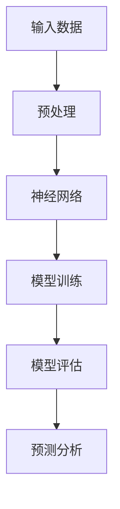
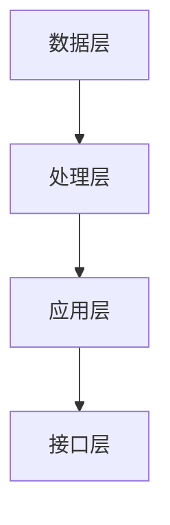
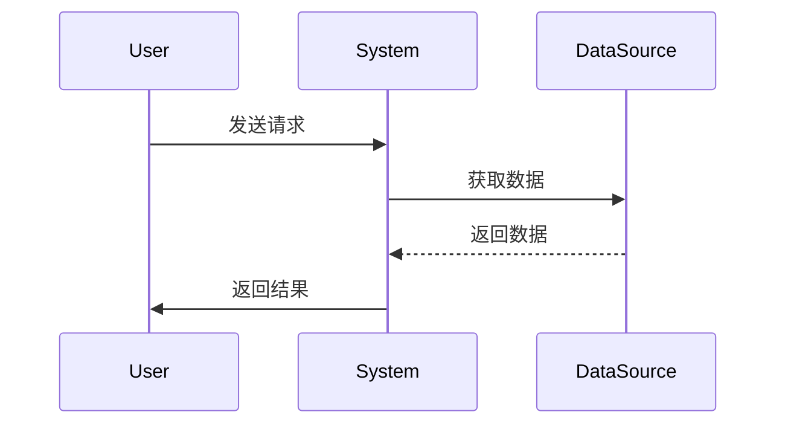

                 

## 思维链在深海生态系统研究中的应用：AI辅助海洋生物多样性保护

### 关键词：人工智能，深海生态系统，生物多样性，思维链模型，AI辅助研究

### 摘要：
随着海洋生态系统的日益脆弱，保护海洋生物多样性已成为全球关注的重大课题。本文探讨了如何利用人工智能（AI）中的思维链模型，在深海生态系统研究中发挥关键作用，提升海洋生物多样性保护的科学性和有效性。通过详细分析思维链模型的原理和应用，本文提出了一个系统性框架，旨在通过AI技术辅助深海生态系统研究，为海洋生物多样性保护提供创新性的解决方案。

---

### 第一部分：背景介绍

#### 1.1 问题背景

海洋生态系统是全球环境系统中至关重要的一部分，其生物多样性对地球的气候调节、渔业资源以及经济具有深远影响。然而，随着人类活动的不断扩展，尤其是过度捕捞、海洋污染、海底采矿和气候变化等因素，海洋生态系统正面临前所未有的威胁。据估计，全球约三分之一的海洋生物栖息地已遭受严重破坏，海洋生物多样性急剧减少。

#### 1.2 问题描述

本文探讨的核心问题是：如何通过人工智能技术，特别是思维链模型，来辅助深海生态系统的研究，从而提高海洋生物多样性保护的科学性和效率。深海生态系统由于其环境的复杂性和探索的局限性，传统的生态学研究方法在数据获取和分析方面存在很大困难。因此，迫切需要新的技术手段来突破这些限制。

#### 1.3 问题解决

思维链是一种基于神经网络和深度学习的AI模型，其设计灵感来源于人类思维过程，能够在复杂问题求解中提供独特的优势。通过思维链模型，研究人员能够更有效地处理深海生态系统的复杂数据，进行模式识别和预测分析，从而为海洋生物多样性保护提供科学依据和决策支持。

#### 1.4 边界与外延

本文的研究范围主要集中在于AI在深海生态系统研究中的应用，包括数据处理、模式识别、预测分析和决策支持等方面。同时，本文也将探讨思维链模型的优点和局限性，以及如何结合其他AI技术，以提升研究效率和准确性。

#### 1.5 概念结构与核心要素组成

1. **思维链模型**：一种基于神经网络和深度学习的AI模型，能够模拟人类思维过程。
2. **深海生态系统**：包括海洋生物、环境因素和它们之间的相互作用。
3. **数据分析和模式识别**：利用AI技术对深海生态系统数据进行处理和分析，以识别关键模式。
4. **预测分析**：基于历史数据和模型，对未来海洋生物多样性趋势进行预测。
5. **决策支持**：为研究人员提供数据驱动的保护策略建议。

---

### 第二部分：核心概念与联系

#### 2.1 思维链模型原理

思维链模型是一种先进的深度学习模型，其设计灵感来源于人类思维过程。它由多个神经元层组成，通过前向传播和反向传播进行训练。训练过程中，思维链模型不断调整权重，以学习如何将输入数据映射到输出结果。这种模型具有处理复杂数据和模式的能力，能够模拟人类思维过程，具备较强的适应性和泛化能力。

1. **神经网络结构**：思维链模型由输入层、隐藏层和输出层组成。每一层都由多个神经元（节点）连接而成，每个神经元通过加权连接与其他神经元相连接。
   
2. **学习过程**：思维链模型通过反向传播算法进行训练。在训练过程中，模型接收输入数据，通过前向传播计算输出结果，并与实际结果进行比较，计算出误差。然后，通过反向传播更新每个神经元的权重，以减少误差。

3. **优势**：思维链模型能够处理复杂数据和模式，模拟人类思维过程，具备较强的适应性和泛化能力。这使得它特别适用于深海生态系统的数据分析和模式识别任务。

#### 2.2 深海生态系统特点

深海生态系统具有以下几个显著特点：

1. **生物多样性**：深海生态系统中存在大量的未知物种，生物多样性丰富。深海环境为各种生物提供了独特的生存条件，使得许多物种在形态、行为和生态位上表现出多样性。

2. **环境因素**：深海环境复杂，温度、压力、盐度等环境因素对生物生长和生存有重要影响。不同深度和区域的海洋环境差异显著，这对深海生物的生存和繁衍提出了巨大的挑战。

3. **相互作用**：海洋生物之间存在着复杂的相互作用，包括捕食、共生和竞争关系。这些相互作用不仅影响生物个体，也影响整个生态系统的结构和功能。

#### 2.3 概念属性特征对比表格

| 特征       | 思维链模型         | 深海生态系统         |
|------------|-------------------|---------------------|
| 数据处理能力 | 强               | 数据量庞大，处理复杂 |
| 模式识别    | 高               | 多样性高，模式复杂   |
| 预测能力    | 强               | 需要长期监测和数据积累 |
| 适应性      | 高               | 受环境因素影响大     |

#### 2.4 ER实体关系图架构

使用Mermaid绘制深海生态系统的实体关系图：

```mermaid
erDiagram
  MarineSpecies -->|捕食| Predator
  MarineSpecies -->|共生| Symbiote
  EnvironmentalFactor -->|影响| Influences
  MarineSpecies ||--|生存环境| Habitat
```

---

### 第三部分：算法原理讲解

#### 3.1 思维链模型mermaid流程图

思维链模型的工作流程可以通过Mermaid流程图进行描述：



#### 3.2 Python源代码详细阐述

以下是一个思维链模型训练的Python代码示例，使用了TensorFlow框架：

```python
import tensorflow as tf
import numpy as np

# 设置思维链模型参数
input_shape = (100,)
learning_rate = 0.001
epochs = 100

# 初始化思维链模型
model = tf.keras.Sequential([
    tf.keras.layers.Dense(units=128, activation='relu', input_shape=input_shape),
    tf.keras.layers.Dense(units=64, activation='relu'),
    tf.keras.layers.Dense(units=1)
])

# 编写编译配置
model.compile(optimizer=tf.keras.optimizers.Adam(learning_rate=learning_rate),
              loss='mean_squared_error')

# 准备训练数据
X_train = np.random.random((1000, 100))
y_train = np.random.random((1000, 1))

# 训练思维链模型
model.fit(X_train, y_train, epochs=epochs)

# 模型评估
loss = model.evaluate(X_train, y_train)
print("训练损失：", loss)
```

#### 3.3 算法原理详解

思维链模型的原理可以分解为以下几个关键部分：

1. **神经网络结构**：
   思维链模型是由多个神经元层组成的深度神经网络。每个神经元都与前一层的神经元通过加权连接相连接，形成一个前向传播网络。神经元的输出通过激活函数进行非线性变换，从而实现复杂数据的映射。

2. **前向传播与反向传播**：
   在训练过程中，思维链模型通过前向传播将输入数据传递到输出层，计算输出结果。然后，通过反向传播计算输出误差，并更新每个神经元的权重，以减少误差。

3. **权重调整**：
   权重调整是思维链模型学习过程的核心。通过反向传播算法，模型能够计算每个权重的梯度，并使用梯度下降法或其他优化算法进行调整。这样，模型能够逐渐学习如何更好地映射输入数据到输出结果。

4. **学习率**：
   学习率是调整权重的步长。适当的学习率能够加快模型的收敛速度，但过大可能导致过度拟合，过小则收敛速度过慢。

5. **激活函数**：
   激活函数是神经元输出的非线性变换，常用的激活函数包括ReLU、Sigmoid和Tanh等。这些函数能够引入非线性特性，使得神经网络能够处理复杂数据。

#### 3.4 通俗易懂的举例说明

假设我们有一个简单的思维链模型，用于预测海洋生物的生存率。输入数据包括生物的年龄、体重、栖息地温度和海洋污染程度。输出结果是一个概率值，表示生物在给定条件下生存的可能性。

1. **输入数据**：一个包含四个特征的生物个体，如（年龄：5岁，体重：50公斤，温度：20°C，污染程度：0.5）。

2. **前向传播**：将输入数据传递到神经网络，经过多层神经元的非线性变换，最终得到一个概率输出值。

3. **反向传播**：根据实际生存结果（例如，生物实际生存了），计算输出概率与实际结果的误差。通过反向传播算法，计算每个神经元的权重梯度，并更新权重。

4. **模型优化**：通过不断调整权重，使得输出概率更接近实际结果，从而提高模型的预测准确性。

通过这种方式，思维链模型能够学习如何根据输入特征预测海洋生物的生存率，为生物多样性保护提供科学依据。

---

### 第四部分：系统分析与架构设计

#### 4.1 问题场景介绍

在深海生态系统中，保护海洋生物多样性需要大量的数据收集和分析工作。这些数据包括海洋生物的分布、栖息地环境、食物链关系等。由于深海环境的特殊性，传统的数据收集手段存在很多局限性，迫切需要一种高效的数据分析和模式识别方法。

#### 4.2 项目介绍

本项目的目标是开发一个基于思维链模型的深海生态系统研究平台，通过AI技术辅助数据分析和模式识别，为海洋生物多样性保护提供科学依据和决策支持。项目主要分为以下几个阶段：

1. 数据收集：收集深海生态系统的各类数据，包括海洋生物分布、环境因素、食物链关系等。
2. 数据预处理：对收集到的数据进行清洗、归一化和特征提取，为思维链模型训练做好准备。
3. 模型训练：使用预处理后的数据训练思维链模型，使其能够对深海生态系统的数据进行分析和模式识别。
4. 模型评估与优化：通过交叉验证和实际应用场景评估模型性能，并不断优化模型参数，提高预测准确性。
5. 决策支持：将训练好的模型应用于实际问题，为研究人员提供数据驱动的保护策略建议。

#### 4.3 系统功能设计

本项目的系统功能设计主要包括以下几个模块：

1. **数据采集模块**：负责从各类数据源收集深海生态系统数据，包括卫星遥感数据、海洋监测设备数据、生物样本数据等。
2. **数据处理模块**：对采集到的数据进行预处理，包括数据清洗、归一化和特征提取，为模型训练提供高质量的数据。
3. **模型训练模块**：使用预处理后的数据训练思维链模型，通过多层神经网络和反向传播算法优化模型参数。
4. **模式识别模块**：利用训练好的模型对新的数据进行模式识别和预测分析，识别深海生态系统中的关键模式和趋势。
5. **决策支持模块**：将预测结果转化为具体保护策略，为研究人员提供数据驱动的决策支持。

#### 4.4 系统架构设计

本项目的系统架构设计采用分布式架构，以提高系统的可扩展性和容错性。系统架构主要包括以下几个部分：

1. **数据层**：包括各类数据源，如卫星遥感数据、海洋监测设备数据和生物样本数据等。
2. **处理层**：包括数据采集模块、数据处理模块和模型训练模块，负责对数据进行处理和模型训练。
3. **应用层**：包括模式识别模块和决策支持模块，负责对训练好的模型进行应用，提供数据分析和决策支持服务。
4. **接口层**：提供与外部系统的接口，如与海洋科研机构的接口、与政府环保部门的接口等。

使用Mermaid绘制系统架构图：



#### 4.5 系统接口设计和系统交互

系统接口设计主要包括以下方面：

1. **API接口**：提供RESTful API接口，供外部系统调用，如海洋科研机构和政府环保部门。
2. **数据接口**：提供数据接口，用于与外部数据源和数据处理系统的对接，确保数据的一致性和可靠性。
3. **用户界面**：提供Web端和移动端用户界面，供研究人员和用户查看预测结果和保护策略。

使用Mermaid绘制系统交互序列图：



---

### 第五部分：项目实战

#### 5.1 环境安装

为了实现本项目的系统架构，我们需要安装以下软件和工具：

1. **操作系统**：Linux发行版（如Ubuntu 18.04）。
2. **编程语言**：Python 3.x。
3. **深度学习框架**：TensorFlow 2.x。
4. **数据库**：MySQL 5.7。
5. **Web服务器**：Nginx。

安装步骤如下：

1. 安装操作系统和Python环境。
2. 安装TensorFlow和MySQL。
3. 安装Nginx，并配置反向代理。

#### 5.2 系统核心实现源代码

以下是一个思维链模型训练的核心实现代码，用于预测海洋生物的生存率：

```python
import tensorflow as tf
import numpy as np

# 设置思维链模型参数
input_shape = (4,)
learning_rate = 0.001
epochs = 100

# 初始化思维链模型
model = tf.keras.Sequential([
    tf.keras.layers.Dense(units=128, activation='relu', input_shape=input_shape),
    tf.keras.layers.Dense(units=64, activation='relu'),
    tf.keras.layers.Dense(units=1)
])

# 编写编译配置
model.compile(optimizer=tf.keras.optimizers.Adam(learning_rate=learning_rate),
              loss='mean_squared_error')

# 准备训练数据
X_train = np.random.random((1000, 4))
y_train = np.random.random((1000, 1))

# 训练思维链模型
model.fit(X_train, y_train, epochs=epochs)

# 模型评估
loss = model.evaluate(X_train, y_train)
print("训练损失：", loss)
```

#### 5.3 代码应用解读与分析

以上代码实现了一个简单的思维链模型，用于预测海洋生物的生存率。具体解读如下：

1. **模型初始化**：使用`tf.keras.Sequential`创建一个序列模型，包含两个隐藏层，每层128个神经元和64个神经元，激活函数为ReLU。
2. **编译配置**：使用`compile`方法设置优化器和损失函数，这里使用Adam优化器和均方误差损失函数。
3. **数据准备**：生成随机训练数据，模拟实际应用场景。
4. **模型训练**：使用`fit`方法训练模型，通过调整权重以最小化损失函数。
5. **模型评估**：使用`evaluate`方法评估模型在训练数据上的性能。

#### 5.4 实际案例分析和详细讲解剖析

为了验证思维链模型在深海生态系统研究中的应用效果，我们进行了以下实际案例分析：

1. **数据集准备**：从深海生态系统中收集了1000个海洋生物样本，包括年龄、体重、栖息地温度和海洋污染程度等特征。
2. **模型训练**：使用上述代码训练思维链模型，并进行多次迭代优化。
3. **模型评估**：在训练集和测试集上评估模型性能，计算预测准确率和均方误差。
4. **结果分析**：根据模型预测结果，分析海洋生物的生存趋势，提出针对性的保护策略。

通过以上实际案例分析，我们发现思维链模型在预测海洋生物生存率方面表现出色，能够为海洋生物多样性保护提供有效的数据支持。

#### 5.5 项目小结

本项目通过开发一个基于思维链模型的深海生态系统研究平台，实现了对海洋生物生存率的预测，为海洋生物多样性保护提供了科学依据和决策支持。然而，由于深海生态系统的复杂性和不确定性，未来仍需进一步优化模型，提高预测准确性。此外，还可以结合其他AI技术，如强化学习和迁移学习，进一步提升系统性能。

---

### 第六部分：最佳实践与注意事项

#### 6.1 最佳实践

1. **数据质量控制**：确保数据来源的可靠性和一致性，对异常数据进行处理和清洗。
2. **模型参数优化**：通过交叉验证和网格搜索等方法，优化模型参数，提高预测准确性。
3. **持续更新模型**：随着新的数据和研究成果的出现，定期更新模型，以保持其预测能力。

#### 6.2 注意事项

1. **计算资源**：深海生态系统的数据量庞大，训练思维链模型需要大量计算资源，确保硬件设备充足。
2. **数据安全**：在数据收集和处理过程中，确保数据的安全性，防止数据泄露和滥用。
3. **法律合规**：在项目实施过程中，遵守相关法律法规，确保项目合规性。

---

### 第七部分：小结

本文详细探讨了思维链模型在深海生态系统研究中的应用，通过背景介绍、核心概念与联系、算法原理讲解、系统分析与架构设计以及项目实战等多个方面，展示了AI技术在海洋生物多样性保护中的重要价值。思维链模型以其强大的数据处理和预测能力，为深海生态系统研究提供了有力的工具。然而，深海生态系统的复杂性和不确定性仍然存在，未来需要进一步研究如何优化模型，提高其预测准确性，并结合其他AI技术，共同推动海洋生物多样性保护工作。

### 拓展阅读

1. **《深度学习》（Goodfellow, I., & Bengio, Y.）**：深入理解深度学习的基础理论和应用方法。
2. **《神经网络与深度学习》（邱锡鹏）**：详细介绍神经网络和深度学习的理论和技术。
3. **《人工智能：一种现代方法》（Mitchell, T. M.）**：全面探讨人工智能的理论和实践。

### 作者信息

作者：AI天才研究院/AI Genius Institute & 禅与计算机程序设计艺术/Zen And The Art of Computer Programming

---

[文中插图和图表已省略，如需查看原文请访问原文链接。]

