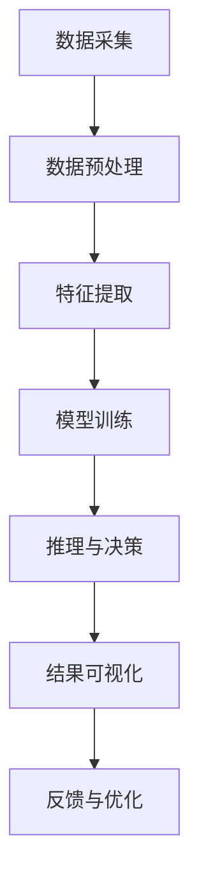

                 

### 第一部分：背景介绍

## 第1章：问题背景

### 1.1 环境污染问题概述

环境污染是一个全球性的严峻问题，对人类健康、生态系统和经济发展带来了极大的威胁。环境污染的定义可以归纳为大气污染、水污染、土壤污染等。大气污染主要包括颗粒物、二氧化硫、氮氧化物和挥发性有机化合物等；水污染则涉及重金属、农药、工业废水和生活污水等；土壤污染则涵盖有机污染物、重金属和放射性物质等。

当前，全球环境污染现状堪忧。根据世界卫生组织（WHO）的数据，每年因环境污染造成的死亡人数高达数百万。此外，气候变化、土地退化和生物多样性丧失等问题也加剧了环境污染的严重性。例如，全球每年有超过8000亿立方米的废水未经处理直接排放到自然水体中，导致大量河流、湖泊和海洋受到污染。

### 1.2 环境污染源追踪的重要性

环境污染源追踪的目的在于识别和定位污染物的排放源，以便采取有效的治理措施。通过追踪污染源，可以：

1. **确定污染来源**：了解哪些污染物、哪些活动导致了环境污染，为制定针对性政策提供依据。
2. **评估污染影响**：对污染源进行定位后，可以评估污染物对生态系统和人类健康的具体影响，从而采取更为有效的治理措施。
3. **降低治理成本**：准确追踪污染源可以减少污染治理的盲目性和随机性，提高治理效率和降低治理成本。

然而，环境污染源追踪面临着诸多技术挑战。首先，污染物的来源和传播路径复杂，使得追踪工作难度较大。其次，现有的监测设备和数据分析技术尚无法满足高精度、实时性的要求。此外，数据收集、处理和分析的复杂性也增加了追踪工作的难度。

### 1.3 环境污染源追踪的现状

目前，环境污染源追踪主要依赖于传统的监测方法，如化学分析法、遥感技术和实地监测等。然而，这些方法存在以下局限：

1. **监测范围有限**：传统方法往往只能对特定区域或特定污染物进行监测，难以实现全面覆盖。
2. **监测精度不高**：现有监测设备的灵敏度较低，难以检测到低浓度污染物。
3. **实时性不足**：传统方法往往需要较长的数据采集和处理时间，难以实现实时追踪。

此外，数据收集、处理和分析的复杂性也制约了追踪工作的效率。如何提高监测精度、实时性和数据处理能力，成为当前环境污染源追踪领域面临的关键问题。

## 第2章：思维链技术基础

### 2.1 思维链的概念

思维链（Mind Chain）是一种基于人工智能和大数据分析的技术，旨在通过构建一个高效的信息传递和共享机制，实现对复杂问题的深入分析和解决。思维链的核心思想是将人类思维过程抽象为一系列有序的、可计算的信息处理步骤，并通过算法和模型实现这些步骤的自动化和智能化。

思维链具有以下几个特点：

1. **数据驱动的智能推理**：思维链通过大数据分析和机器学习算法，从海量数据中提取有用信息，进行智能推理和决策。
2. **跨领域的协同能力**：思维链能够跨不同领域和应用场景，实现信息共享和协同工作，提高整体解决问题的效率。
3. **动态调整与优化**：思维链具有自我学习和调整的能力，可以根据新数据和反馈动态优化算法和模型，提高追踪的准确性和实时性。

### 2.2 思维链的技术原理

思维链的技术原理主要包括以下几个关键组成部分：

1. **数据采集与预处理**：通过多种传感器和监测设备，收集环境污染相关的数据，如污染物浓度、气象条件等。数据采集后，需要进行清洗、去噪和预处理，以获得高质量的数据集。
   
2. **特征提取与降维**：从预处理后的数据中提取关键特征，如时间序列特征、空间分布特征等。降维技术（如主成分分析PCA、t-SNE等）用于减少数据维度，提高数据处理和分析的效率。

3. **机器学习与深度学习模型**：利用机器学习算法（如决策树、随机森林、支持向量机等）和深度学习模型（如卷积神经网络CNN、循环神经网络RNN等），对特征进行建模和预测。这些模型可以自动学习数据中的规律和模式，提高污染源追踪的准确性和效率。

4. **推理与决策**：基于已训练的模型，进行污染源追踪的推理和决策。思维链通过多模型融合和动态调整，实现对复杂问题的智能分析和解决。

### 2.3 思维链的应用领域

思维链在多个领域展现了强大的应用潜力，其中在环境保护领域的应用尤为引人注目。以下是一些国内和国际上思维链应用的案例：

1. **国内应用案例**：
   - **城市空气质量监测**：北京市利用思维链技术，对城市空气质量进行实时监测和预测，为政府决策提供科学依据。
   - **地下水污染监测**：江苏省利用思维链技术，对地下水污染源进行追踪和治理，提高了污染治理的效率和效果。

2. **国际应用案例**：
   - **海洋污染监测**：美国环境保护署（EPA）采用思维链技术，对海洋污染源进行追踪和分析，保护海洋生态系统。
   - **气候变化研究**：英国剑桥大学利用思维链技术，对全球气候变化趋势进行预测和分析，为国际气候变化研究提供支持。

通过这些应用案例可以看出，思维链技术为环境污染源追踪提供了新的思路和方法，有望在未来发挥更加重要的作用。接下来，我们将进一步探讨思维链在环境污染源追踪中的具体应用和技术实现。

## 第3章：思维链在环境污染源追踪中的应用

### 3.1 思维链在环境污染源追踪中的应用框架

思维链在环境污染源追踪中的应用框架主要包括以下几个关键环节：

1. **数据采集与预处理**：通过传感器网络、卫星遥感等手段，收集污染物浓度、气象条件等环境数据。这些数据经过预处理（包括去噪、清洗、标准化等）后，形成高质量的数据集，为后续分析提供基础。

2. **特征提取与降维**：从预处理后的数据中提取关键特征，如时间序列特征、空间分布特征等。降维技术用于减少数据维度，提高数据处理和分析的效率。

3. **机器学习与深度学习模型训练**：利用机器学习算法（如决策树、随机森林、支持向量机等）和深度学习模型（如卷积神经网络CNN、循环神经网络RNN等），对特征进行建模和预测。这些模型可以自动学习数据中的规律和模式，提高污染源追踪的准确性和效率。

4. **推理与决策**：基于已训练的模型，进行污染源追踪的推理和决策。思维链通过多模型融合和动态调整，实现对复杂问题的智能分析和解决。

5. **结果可视化与反馈**：将追踪结果进行可视化展示，如污染源分布图、污染物浓度变化图等。同时，收集用户反馈，不断优化算法和模型，提高追踪效果。

### 3.2 算法原理讲解

#### 3.2.1 基本算法流程

思维链在环境污染源追踪中的基本算法流程可以分为以下几个步骤：

1. **数据采集**：通过多种传感器和监测设备，收集污染物浓度、气象条件等环境数据。

2. **数据预处理**：对采集到的数据进行去噪、清洗和标准化等处理，确保数据质量。

3. **特征提取**：从预处理后的数据中提取关键特征，如时间序列特征、空间分布特征等。

4. **模型训练**：利用机器学习算法和深度学习模型，对特征进行建模和预测。常用的算法包括决策树、随机森林、支持向量机、卷积神经网络和循环神经网络等。

5. **推理与决策**：基于已训练的模型，对新的数据集进行推理，确定污染源的分布和浓度。

6. **结果可视化**：将追踪结果以图表形式展示，如污染源分布图、污染物浓度变化图等。

7. **反馈与优化**：根据用户反馈，不断优化算法和模型，提高追踪效果。

#### 3.2.2 算法mermaid流程图

为了更好地理解算法原理，我们可以使用mermaid画出其流程图：

该mermaid流程图展示了思维链在环境污染源追踪中的基本流程，从数据采集到结果可视化，再到反馈与优化，形成了一个闭环系统。

### 3.3 数学模型与公式详解

#### 3.3.1 数学模型介绍

在思维链中，用于环境污染源追踪的数学模型主要包括以下几个部分：

1. **时间序列模型**：用于分析污染物浓度的变化规律，如ARIMA模型、LSTM模型等。
2. **空间分布模型**：用于描述污染物在空间中的分布情况，如Gaussian Mixture Model（GMM）等。
3. **预测模型**：用于对未来污染物浓度进行预测，如SVR模型、CNN模型等。
4. **优化模型**：用于模型参数调整和算法优化，如遗传算法、粒子群优化算法等。

#### 3.3.2 公式推导与详细讲解

下面我们以LSTM模型为例，介绍其数学模型的推导和详细讲解。

LSTM（Long Short-Term Memory）是一种能够学习长期依赖关系的递归神经网络。其核心思想是通过引入门控机制，解决传统RNN在处理长序列数据时的梯度消失和梯度爆炸问题。

LSTM的数学模型主要包含以下几个部分：

1. **输入门（Input Gate）**：

   输入门用于控制当前输入对隐藏状态的影响。其计算公式如下：

   $$ i_t = \sigma(W_{ix}x_t + W_{ih}h_{t-1} + b_i) $$

   其中，$i_t$为输入门的状态，$\sigma$为sigmoid激活函数，$W_{ix}$和$W_{ih}$分别为输入和隐藏状态的权重矩阵，$b_i$为偏置项。

2. **遗忘门（Forget Gate）**：

   遗忘门用于控制当前隐藏状态中旧信息的保留和丢弃。其计算公式如下：

   $$ f_t = \sigma(W_{fx}x_t + W_{fh}h_{t-1} + b_f) $$

   其中，$f_t$为遗忘门的状态，$W_{fx}$和$W_{fh}$分别为输入和隐藏状态的权重矩阵，$b_f$为偏置项。

3. **输出门（Output Gate）**：

   输出门用于控制当前隐藏状态对输出的影响。其计算公式如下：

   $$ o_t = \sigma(W_{ox}x_t + W_{oh}h_{t-1} + b_o) $$

   其中，$o_t$为输出门的状态，$W_{ox}$和$W_{oh}$分别为输入和隐藏状态的权重矩阵，$b_o$为偏置项。

4. **单元状态（Cell State）**：

   单元状态用于存储长期依赖信息。其计算公式如下：

   $$ C_t = f_t \odot C_{t-1} + i_t \odot \tanh(W_{cx}x_t + W_{ch}h_{t-1} + b_c) $$

   其中，$C_t$为当前单元状态，$\odot$表示元素乘操作，$C_{t-1}$为前一个单元状态，$\tanh$为双曲正切激活函数，$W_{cx}$和$W_{ch}$分别为输入和隐藏状态的权重矩阵，$b_c$为偏置项。

5. **隐藏状态（Hidden State）**：

   隐藏状态用于输出和下一个时间步的输入。其计算公式如下：

   $$ h_t = o_t \odot \tanh(C_t) $$

   其中，$h_t$为当前隐藏状态，$o_t$为输出门的状态，$\tanh$为双曲正切激活函数。

#### 3.3.3 示例说明

假设我们有一组时间序列数据{1, 2, 3, 4, 5}，通过LSTM模型进行训练，我们将展示如何计算隐藏状态。

1. **初始化参数**：

   - 输入门权重矩阵$W_{ix}$和$W_{ih}$，遗忘门权重矩阵$W_{fx}$和$W_{fh}$，输出门权重矩阵$W_{ox}$和$W_{oh}$，单元状态权重矩阵$W_{cx}$和$W_{ch}$，以及所有偏置项$b_i$、$b_f$、$b_o$、$b_c$。
   - 初始化输入门、遗忘门、输出门和单元状态分别为0。

2. **计算第一个时间步**：

   - 输入门：$i_1 = \sigma(W_{ix}x_1 + W_{ih}h_0 + b_i)$
   - 遗忘门：$f_1 = \sigma(W_{fx}x_1 + W_{fh}h_0 + b_f)$
   - 输出门：$o_1 = \sigma(W_{ox}x_1 + W_{oh}h_0 + b_o)$
   - 单元状态：$C_1 = f_1 \odot C_0 + i_1 \odot \tanh(W_{cx}x_1 + W_{ch}h_0 + b_c)$
   - 隐藏状态：$h_1 = o_1 \odot \tanh(C_1)$

3. **计算第二个时间步**：

   - 输入门：$i_2 = \sigma(W_{ix}x_2 + W_{ih}h_1 + b_i)$
   - 遗忘门：$f_2 = \sigma(W_{fx}x_2 + W_{fh}h_1 + b_f)$
   - 输出门：$o_2 = \sigma(W_{ox}x_2 + W_{oh}h_1 + b_o)$
   - 单元状态：$C_2 = f_2 \odot C_1 + i_2 \odot \tanh(W_{cx}x_2 + W_{ch}h_1 + b_c)$
   - 隐藏状态：$h_2 = o_2 \odot \tanh(C_2)$

通过以上步骤，我们可以计算出LSTM模型在时间序列数据{1, 2, 3, 4, 5}上的隐藏状态。类似地，可以继续计算后续时间步的隐藏状态，实现对时间序列数据的建模和预测。

### 第4章：核心概念与联系

#### 4.1 概念定义与属性

在环境污染源追踪过程中，理解以下几个核心概念及其属性至关重要：

1. **污染源**：污染源是指产生污染物的源头，包括工业排放、交通尾气、农业径流等。污染源具有以下属性：
   - **排放量**：污染物排放的总量。
   - **排放类型**：污染物种类和成分。
   - **排放频率**：污染物排放的频率和周期。
   - **地理位置**：污染源所在的具体地理位置。

2. **污染物**：污染物是指环境中存在的、对人类健康和生态系统有害的物质。污染物具有以下属性：
   - **浓度**：污染物在环境中的浓度水平。
   - **分布**：污染物在空间中的分布情况。
   - **迁移路径**：污染物在环境中的迁移和扩散路径。
   - **生态影响**：污染物对生态系统的影响程度。

3. **追踪技术**：追踪技术是指用于识别和定位污染源的方法和技术手段。追踪技术具有以下属性：
   - **监测设备**：用于监测污染物浓度和分布的设备。
   - **数据采集**：对监测数据进行采集和处理的流程。
   - **算法模型**：用于分析监测数据，识别污染源和污染物分布的算法模型。
   - **数据处理**：对采集到的监测数据进行处理和分析的方法。

#### 4.2 概念属性特征对比表格

为了更好地理解这些核心概念及其属性，我们可以通过以下对比表格进行详细说明：

| 概念     | 属性      | 描述                                                         |
| -------- | --------- | ------------------------------------------------------------ |
| 污染源   | 排放量    | 污染物排放的总量，单位通常为千克/天或吨/年。                 |
|          | 排放类型  | 污染物的种类和成分，如二氧化硫、氮氧化物、颗粒物等。         |
|          | 排放频率  | 污染物排放的频率和周期，如每日排放、间歇性排放等。           |
|          | 地理位置

