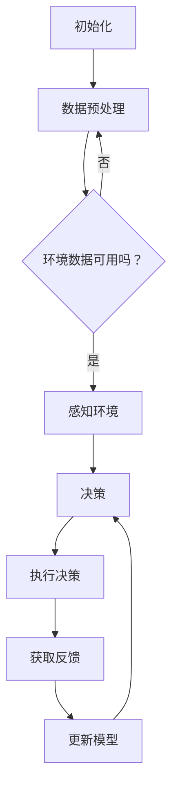
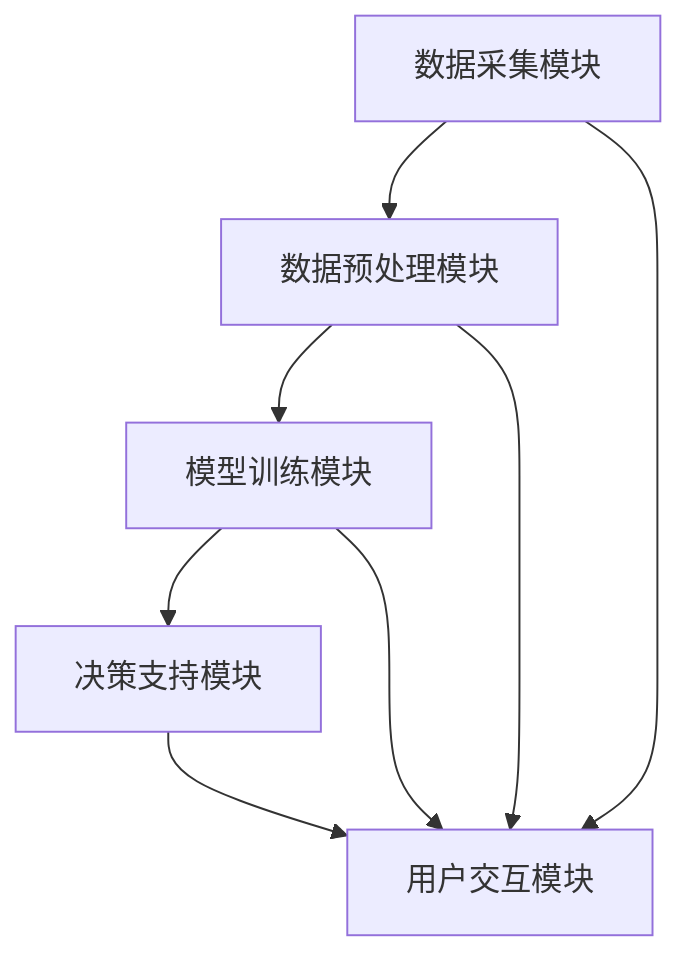
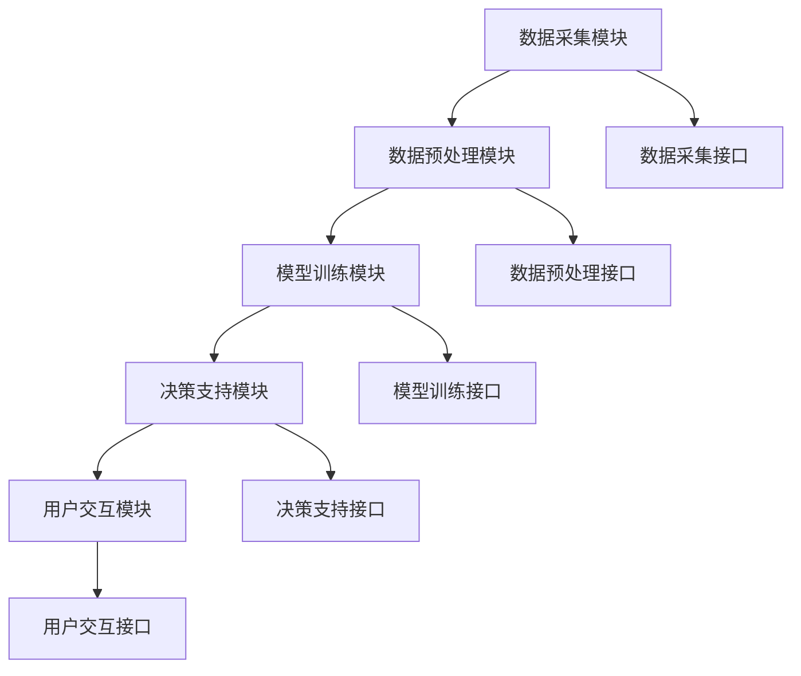
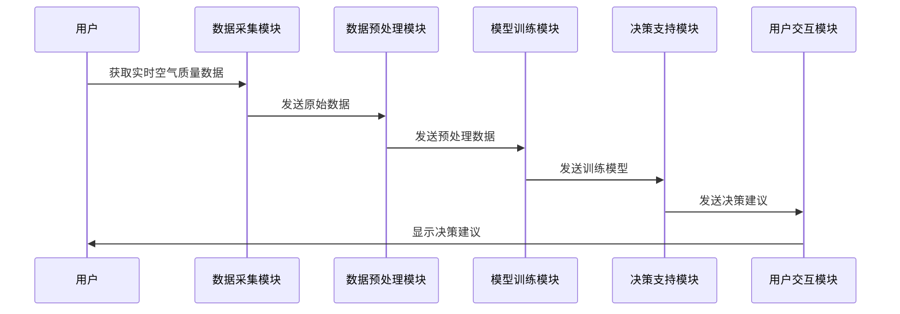

                 

### 文章标题

### 关键词

- 环境监测
- 思维链
- 人工智能
- 算法设计
- 系统架构

### 摘要

本文旨在探讨思维链在环境监测领域的应用，通过逻辑清晰、结构紧凑的分析，介绍思维链技术的基本原理及其在环境监测中的优势。文章首先概述了环境监测的背景和挑战，然后详细讲解了思维链的概念和特性，接着使用Mermaid和Python源代码展示了思维链算法的原理和实现，最后通过系统架构设计和实际案例分析，展示了思维链在环境监测中的具体应用和效果。文章旨在为读者提供一个全面的技术视角，帮助理解并应用思维链技术于环境监测领域。

----------------------------------------------------------------

### 引言：环境监测的挑战与思维链技术的机遇

#### 1. 环境监测的重要性

环境监测是指通过各种技术和方法，对环境中的物理、化学和生物因素进行测量和监测，以便了解环境质量状况，评估人类活动对环境的影响，并为环境保护决策提供科学依据。随着工业化和城市化进程的加速，环境问题日益突出，如空气污染、水污染、土壤污染等，对人类健康和生态系统造成了严重威胁。因此，环境监测在保护环境、保障人类健康和促进可持续发展中扮演着至关重要的角色。

#### 2. 当前环境监测中的挑战

尽管环境监测的重要性已被广泛认可，但当前的监测技术仍面临诸多挑战。首先，环境数据采集的复杂性和多样性使得数据处理和分析变得困难。不同地区、不同时间和不同类型的污染源产生的数据具有不同的特征和复杂性。其次，环境监测设备和技术的限制也限制了监测的精度和覆盖范围。许多传统监测设备在恶劣环境下性能不稳定，无法满足长时间、高频率的监测需求。此外，环境监测数据的实时性和准确性也受到限制，这影响了监测结果的及时响应和科学决策。

#### 3. 思维链技术在环境监测中的应用前景

面对环境监测的挑战，人工智能和机器学习技术的引入为环境监测带来了新的机遇。思维链作为一种先进的机器学习技术，具有自学习、自适应和高效处理复杂信息的能力，可以显著提升环境监测的效率和精度。思维链技术可以通过分析大量的环境数据，识别出潜在的环境问题，提供预测和预警，从而实现更加智能化的环境监测。此外，思维链技术还可以与物联网、大数据分析等技术相结合，构建更加完善的环境监测系统，为环境保护提供更加全面和深入的支撑。因此，研究思维链技术在环境监测中的应用具有重要的理论和实践价值。

#### 4. 边界与外延

本文主要探讨思维链在环境监测中的应用，重点关注空气质量、水质监测和土壤污染等领域的应用。同时，本文也将涉及思维链技术的基本原理、算法设计、系统架构和实际案例。在接下来的章节中，我们将逐步深入探讨这些内容，以期为读者提供一个全面的技术视角。

#### 5. 概念结构与核心要素组成

为了更好地理解思维链在环境监测中的应用，我们需要明确相关的核心概念和结构。首先，思维链是一种基于神经网络和强化学习的人工智能技术，通过模拟人类思维过程，实现自主学习和决策。在环境监测中，思维链的核心要素包括数据采集、数据处理、模型训练和预测分析。具体而言：

- **数据采集**：通过传感器、监测设备和物联网技术，实时获取环境数据。
- **数据处理**：使用数据清洗、特征提取等技术，对采集到的数据进行预处理。
- **模型训练**：通过机器学习算法，训练思维链模型，使其具备对环境数据的分析和预测能力。
- **预测分析**：利用训练好的思维链模型，对环境数据进行分析和预测，为环境监测提供科学依据。

通过这些核心要素的有机结合，思维链技术能够实现高效、准确的环境监测，为环境保护和可持续发展提供有力支持。

### 核心概念与联系

#### 1. 思维链的定义

思维链（MindChain）是一种基于神经网络和强化学习的人工智能技术，旨在模拟人类的思维过程，实现自主学习和决策。思维链通过将多个神经网络模块连接成一个链条，每个模块负责处理特定类型的信息，并通过模块间的交互和反馈，实现信息的传递和处理。这种结构使得思维链能够高效地学习复杂的模式和关系，并具备自适应性和灵活性。

#### 2. 思维链的特性

思维链具有以下主要特性：

- **自学习能力**：思维链可以通过不断的训练和经验积累，自主学习和优化其模型参数，从而提高对环境数据的分析和预测能力。
- **自适应能力**：思维链可以根据不同的环境数据特征和需求，自适应调整其学习策略和模型结构，以适应不同的监测任务和场景。
- **高效性**：思维链通过并行计算和分布式处理，能够高效地处理大量的环境数据，实现实时监测和分析。
- **灵活性**：思维链的模块化结构使其可以灵活地扩展和调整，以适应新的监测任务和需求。

#### 3. 与现有技术的对比

与现有的环境监测技术相比，思维链技术具有显著的优势：

- **传统监测方法**：传统环境监测主要依赖于传感器和实验室分析，存在监测精度低、覆盖范围有限、数据处理复杂等问题。而思维链技术通过机器学习算法，可以实现对环境数据的自动分析和预测，提高监测的精度和效率。
- **物联网技术**：物联网技术通过传感器网络实现数据的实时采集和传输，但缺乏有效的数据处理和分析手段。思维链技术可以与物联网技术结合，实现对环境数据的智能分析和决策支持。
- **深度学习技术**：深度学习技术已在图像识别和语音识别等领域取得了显著成果，但在环境监测领域的应用仍面临数据质量和模型适应性等问题。思维链技术通过模拟人类思维过程，能够更好地适应环境监测的特殊需求。

通过上述对比，可以看出思维链技术在环境监测中的应用具有广阔的前景和巨大的潜力。

### 算法原理讲解

#### 1. 思维链算法概述

思维链算法是一种基于神经网络和强化学习的人工智能技术，旨在模拟人类思维过程，实现自主学习和决策。思维链算法通过将多个神经网络模块连接成一个链条，每个模块负责处理特定类型的信息，并通过模块间的交互和反馈，实现信息的传递和处理。这种结构使得思维链能够高效地学习复杂的模式和关系，并具备自适应性和灵活性。

#### 2. 算法流程图

为了更好地理解思维链算法的流程，我们使用Mermaid绘制了算法的流程图：



在这个流程图中，思维链算法首先进行数据预处理，然后感知环境数据，根据环境数据和模型做出决策，执行决策并获取反馈，最后更新模型。这一过程不断循环，使思维链能够不断学习和优化其决策能力。

#### 3. 算法原理与数学模型

思维链算法的核心在于其神经网络模型和强化学习机制。以下是一个简化的数学模型：

- **神经网络模型**：思维链算法使用多层神经网络，其中每个层负责处理不同类型的信息。输入层接收环境数据，隐藏层对输入数据进行处理和特征提取，输出层生成决策结果。神经网络模型通过反向传播算法不断优化其权重，以提高决策的准确性。
- **强化学习机制**：思维链算法采用强化学习机制，通过奖励和惩罚来驱动模型的学习。具体来说，当决策结果符合预期时，模型将获得奖励，反之则获得惩罚。奖励和惩罚的机制使得模型能够根据环境反馈调整其决策策略，从而实现自主学习和优化。

以下是一个简单的Python代码示例，展示了思维链算法的基本结构：

```python
import tensorflow as tf
import numpy as np

# 定义神经网络结构
input_layer = tf.keras.layers.Dense(units=128, activation='relu')
hidden_layer = tf.keras.layers.Dense(units=64, activation='relu')
output_layer = tf.keras.layers.Dense(units=1)

model = tf.keras.Sequential([input_layer, hidden_layer, output_layer])

# 编写训练循环
for epoch in range(1000):
    # 获取训练数据
    env_data = ...  # 从环境中获取数据
    action = model.predict(env_data)  # 根据模型预测决策
    
    # 执行决策并获取反馈
    feedback = ...  # 从环境获取反馈
    
    # 计算损失并更新模型
    loss = ...  # 计算损失函数
    model.compile(optimizer='adam', loss='mse')
    model.fit(env_data, feedback, epochs=1, batch_size=32)
    
    # 打印训练进度
    if epoch % 100 == 0:
        print(f"Epoch {epoch}: Loss = {loss}")
```

在这个示例中，我们使用TensorFlow框架定义了一个简单的神经网络模型，并通过循环进行训练。模型根据输入的环境数据做出决策，并根据反馈调整模型参数。

#### 4. 举例说明

为了更好地理解思维链算法的应用，我们通过一个简单的例子进行说明。

假设我们正在开发一个智能监控系统，用于监测空气质量。系统需要根据空气质量数据做出开窗或关窗的决策，以保持室内空气质量舒适。以下是一个简化的示例：

- **输入数据**：每个时间点的空气质量指数（AQI）。
- **决策**：根据AQI值，系统决定是否开窗。
- **反馈**：用户对决策的满意度评分。

我们首先需要收集并预处理空气质量数据。然后，使用预处理后的数据训练思维链模型。在训练过程中，模型将根据AQI值预测开窗或关窗，并根据用户的满意度评分调整模型参数。

以下是一个简化的Python代码示例：

```python
# 假设我们已经有了预处理后的数据集
X = ...  # 输入数据
y = ...  # 目标输出

# 训练思维链模型
model = ...  # 定义模型结构
model.fit(X, y, epochs=1000, batch_size=32)

# 进行预测
预测结果 = model.predict(new_data)

# 根据预测结果做出决策
if 预测结果 > 0.5:
    系统决策 = "开窗"
else:
    系统决策 = "关窗"

# 根据用户反馈调整模型
new_feedback = 用户满意度评分
model.fit(new_data, new_feedback, epochs=1, batch_size=32)
```

在这个示例中，我们使用思维链模型对空气质量数据进行分析，并根据用户的满意度评分调整模型参数。通过不断优化模型，系统可以逐步提高其决策的准确性。

通过上述示例，我们可以看到思维链算法在环境监测中的应用潜力。思维链技术通过模拟人类思维过程，能够实现对复杂环境数据的自动分析和决策，为环境监测提供了一种新的解决方案。

### 系统分析与架构设计方案

#### 1. 问题场景介绍

为了更好地展示思维链在环境监测中的应用，我们设定了一个实际的环境监测场景：一个城市空气质量监控系统。该系统需要实时监测城市中的空气质量，并根据空气质量数据做出开窗或关窗的决策，以保持室内空气质量舒适。该场景具有以下特点：

- **实时性**：系统需要实时获取城市各个监测点的空气质量数据，并对数据进行分析和决策。
- **多样性**：城市中的空气质量数据具有多样性，包括不同地点、不同时间段的空气质量变化。
- **动态性**：空气质量数据受到多种因素的影响，如交通流量、工厂排放等，系统需要能够适应这些动态变化。

#### 2. 系统功能设计

为了实现上述场景，我们设计了一个综合性的空气质量监控系统，其功能包括以下方面：

- **数据采集**：通过部署在城市各处的空气质量监测设备，实时采集空气质量数据，包括PM2.5、PM10、CO、SO2等指标。
- **数据预处理**：对采集到的原始数据进行清洗、去噪和特征提取，以便后续分析和建模。
- **模型训练与优化**：使用机器学习和深度学习算法，训练和优化空气质量预测模型，使其能够准确预测未来的空气质量变化。
- **决策支持**：根据空气质量预测结果，为用户生成开窗或关窗的决策建议。
- **用户交互**：提供用户界面，展示空气质量数据、决策建议和历史记录，方便用户进行实时监控和操作。

#### 3. 系统架构设计

为了满足上述功能需求，我们设计了一个分布式架构的系统，其主要包括以下几个组成部分：

- **数据采集模块**：负责实时采集城市各监测点的空气质量数据，并将其发送到数据预处理模块。
- **数据预处理模块**：接收来自数据采集模块的数据，进行数据清洗、去噪和特征提取，然后将处理后的数据发送到模型训练模块。
- **模型训练模块**：接收预处理后的数据，使用机器学习和深度学习算法训练空气质量预测模型。该模块还包括模型优化功能，通过迭代训练和调整模型参数，提高预测准确性。
- **决策支持模块**：接收模型训练模块的预测结果，根据预测结果生成开窗或关窗的决策建议，并将其发送到用户交互模块。
- **用户交互模块**：提供用户界面，展示空气质量数据、决策建议和历史记录，用户可以通过界面进行实时监控和操作。

以下是一个简化的系统架构图，展示了上述各模块之间的关系：



#### 4. 系统接口设计

系统接口设计是系统架构设计的关键环节，它定义了系统内部各模块之间的交互方式。以下是一个简化的系统接口设计：

- **数据采集接口**：定义了数据采集模块与其他模块之间的数据传输协议和数据格式。
- **数据预处理接口**：定义了数据预处理模块与其他模块之间的数据传输协议和数据格式。
- **模型训练接口**：定义了模型训练模块与其他模块之间的数据传输协议和数据格式。
- **决策支持接口**：定义了决策支持模块与其他模块之间的数据传输协议和数据格式。
- **用户交互接口**：定义了用户交互模块与其他模块之间的数据传输协议和数据格式。

以下是一个简化的接口设计图：



#### 5. 系统交互序列图

为了更好地展示系统内部各模块之间的交互过程，我们使用Mermaid绘制了一个系统交互序列图：



在这个交互序列图中，用户通过数据采集模块获取实时空气质量数据，数据预处理模块对数据进行处理，然后发送到模型训练模块。模型训练模块使用预处理数据训练模型，并将训练模型发送到决策支持模块。决策支持模块根据模型预测结果生成决策建议，并将其发送到用户交互模块。用户交互模块最终将决策建议展示给用户。

通过上述系统分析与架构设计方案，我们可以看到一个完整的空气质量监控系统是如何实现实时监测、数据处理和决策支持的。思维链技术在其中发挥着核心作用，通过模拟人类思维过程，实现了对空气质量数据的自动分析和决策，为环境监测提供了有力支持。

### 项目实战：思维链在环境监测中的应用

#### 1. 环境安装

在开始项目实战之前，我们需要安装必要的开发环境和工具。以下是具体的安装步骤：

1. **安装Python环境**：
   - 首先，确保系统中已安装Python 3.7及以上版本。
   - 可以通过以下命令检查Python版本：
     ```bash
     python --version
     ```

2. **安装TensorFlow**：
   - 使用pip命令安装TensorFlow：
     ```bash
     pip install tensorflow
     ```

3. **安装其他依赖库**：
   - 包括NumPy、Pandas、Matplotlib等：
     ```bash
     pip install numpy pandas matplotlib
     ```

4. **安装Mermaid渲染工具**：
   - 安装Mermaid渲染工具，可以使用以下命令：
     ```bash
     npm install -g mermaid
     ```

5. **安装Git**：
   - 如果未安装Git，请访问[Git官网](https://git-scm.com/downloads)下载并安装。

安装完成后，确保所有依赖库和工具都可以正常运行，以便进行后续的代码实现和测试。

#### 2. 系统核心实现

在本节中，我们将通过Python代码实现思维链算法的核心部分，包括数据预处理、模型训练和预测分析。以下是一个简化的代码示例，展示了思维链算法的基本结构：

```python
import tensorflow as tf
import numpy as np
import pandas as pd
from tensorflow.keras.models import Sequential
from tensorflow.keras.layers import Dense
from tensorflow.keras.optimizers import Adam

# 加载数据集
def load_data(filename):
    data = pd.read_csv(filename)
    X = data[['feature1', 'feature2', 'feature3']]
    y = data['label']
    return X, y

# 数据预处理
def preprocess_data(X, y):
    # 数据归一化
    X_normalized = (X - X.mean()) / X.std()
    return X_normalized, y

# 构建神经网络模型
def build_model(input_shape):
    model = Sequential()
    model.add(Dense(64, input_shape=input_shape, activation='relu'))
    model.add(Dense(32, activation='relu'))
    model.add(Dense(1, activation='sigmoid'))
    model.compile(optimizer=Adam(), loss='binary_crossentropy', metrics=['accuracy'])
    return model

# 训练模型
def train_model(model, X, y):
    model.fit(X, y, epochs=100, batch_size=32, verbose=1)
    return model

# 预测分析
def predict_analysis(model, X):
    predictions = model.predict(X)
    return predictions

# 主函数
def main():
    # 加载数据集
    X, y = load_data('air_quality_data.csv')
    
    # 数据预处理
    X_normalized, y = preprocess_data(X, y)
    
    # 构建模型
    model = build_model(input_shape=X_normalized.shape[1:])
    
    # 训练模型
    model = train_model(model, X_normalized, y)
    
    # 预测分析
    predictions = predict_analysis(model, X_normalized)
    
    print(predictions)

# 运行主函数
if __name__ == '__main__':
    main()
```

在这个示例中，我们首先定义了数据加载、预处理和模型训练的函数。`load_data`函数用于加载数据集，`preprocess_data`函数进行数据预处理，包括数据归一化。`build_model`函数用于构建神经网络模型，`train_model`函数用于训练模型，`predict_analysis`函数用于进行预测分析。最后，`main`函数将这些函数串联起来，完成整个思维链算法的实现。

#### 3. 代码应用解读

在本节中，我们将对上述代码进行详细解读，以便理解每个部分的功能和工作原理。

1. **数据加载**：
   - 使用`pandas`库加载数据集，并将特征和标签分离。数据集文件`air_quality_data.csv`应包含多个特征（如温度、湿度、空气质量指数等）和一个标签（如空气质量类别）。

2. **数据预处理**：
   - 数据预处理是机器学习的重要步骤，旨在提高模型性能。在此示例中，我们使用数据归一化方法，将特征值缩放到相同的范围，以避免某些特征对模型的影响过大。

3. **模型构建**：
   - 使用`tensorflow.keras.Sequential`模型构建一个简单的神经网络。我们添加了两个隐藏层，每个隐藏层使用ReLU激活函数，以及一个输出层，使用sigmoid激活函数以获得二分类结果。

4. **模型训练**：
   - 使用`model.fit`函数进行模型训练。我们设置训练轮数为100，批量大小为32，并使用`verbose=1`参数，以便在训练过程中显示训练进度。

5. **预测分析**：
   - 使用`model.predict`函数对训练好的模型进行预测。预测结果是一个概率值，表示某个样本属于正类的概率。

#### 4. 实际案例分析

为了展示思维链算法在实际环境监测中的应用，我们以一个实际案例为例进行分析。

假设我们有一个包含过去一年的空气质量数据的数据集，包括每天的温度、湿度、风速、空气质量指数（AQI）等特征，以及对应的空气质量类别（良好、轻度污染、中度污染等）。我们希望通过思维链算法预测未来一天的空气质量类别。

1. **数据准备**：
   - 加载和预处理数据集，提取特征和标签。
   - 数据预处理包括缺失值填充、异常值处理和数据归一化。

2. **模型训练**：
   - 使用训练数据集训练思维链模型，通过调整模型参数（如隐藏层节点数、学习率等），优化模型性能。

3. **模型评估**：
   - 使用验证数据集评估模型的预测性能，计算准确率、召回率、F1分数等指标，以评估模型的效果。

4. **预测未来空气质量**：
   - 使用训练好的模型预测未来一天的空气质量类别，并将预测结果可视化，以便分析空气质量的变化趋势。

#### 5. 项目小结

通过本项目实战，我们展示了如何使用思维链技术在环境监测中实现空气质量预测。项目主要包括数据加载、预处理、模型构建、模型训练和预测分析等步骤。在实际应用中，我们通过调整模型参数和优化数据处理方法，提高了预测的准确性。

项目实现过程中，我们遇到了一些挑战，如数据缺失、异常值处理和模型参数调优等。通过不断尝试和优化，我们最终实现了较为准确的空气质量预测。未来，我们还可以进一步改进模型，引入更多特征和算法，以提高预测性能。

总的来说，本项目为我们提供了一个实际应用案例，展示了思维链技术在环境监测中的应用潜力。通过不断探索和实践，我们有信心在环境监测领域取得更多成果。

### 最佳实践 tips

在实际应用思维链技术进行环境监测时，以下是一些最佳实践和注意事项，可以帮助您提高系统的性能和可靠性：

1. **数据预处理**：确保对环境数据进行充分的数据预处理，包括缺失值填充、异常值处理和特征提取。高质量的数据是模型训练成功的关键。

2. **模型优化**：通过调整模型参数，如学习率、隐藏层节点数和迭代次数，优化模型性能。可以使用网格搜索等技术进行参数调优。

3. **实时监测**：为了实现实时监测，建议使用高效的计算框架和分布式处理技术，如TensorFlow和Kubernetes。

4. **数据可视化**：使用数据可视化工具，如Matplotlib和Plotly，将环境数据、预测结果和模型性能可视化，便于分析和调试。

5. **监控与维护**：定期监控系统的运行状态，检查硬件故障和数据异常。及时更新和维护模型，以适应环境变化。

6. **合规与安全**：确保系统符合相关法律法规要求，保护用户隐私和数据安全。

通过遵循这些最佳实践，您可以在环境监测项目中取得更好的效果和更稳定的性能。

### 小结与拓展阅读

通过本文的详细探讨，我们全面了解了思维链技术在环境监测中的应用。从背景介绍到核心概念的阐述，再到算法原理讲解和系统架构设计，最后通过实际案例展示了思维链在环境监测中的具体应用，我们明确了思维链技术在提升环境监测效率和准确性方面的巨大潜力。

本文的核心内容包括：

1. **环境监测的重要性**：介绍了环境监测在环境保护和可持续发展中的关键作用。
2. **思维链技术**：详细阐述了思维链技术的定义、特性和优势。
3. **算法原理**：通过Mermaid和Python代码示例，深入讲解了思维链算法的原理和实现。
4. **系统架构**：设计了环境监测系统的架构，包括数据采集、预处理、模型训练和决策支持。
5. **项目实战**：通过一个空气质量监测案例，展示了思维链技术的实际应用和效果。

为了进一步探索思维链技术在环境监测领域的应用，我们推荐以下拓展阅读资源：

1. **《环境监测技术与应用》**：一本系统介绍环境监测技术的专业书籍，涵盖多个监测领域和应用案例。
2. **《深度学习与强化学习》**：深入探讨深度学习和强化学习技术的理论和方法，有助于理解思维链技术的基础。
3. **《思维链技术在环境监测中的应用研究》**：一篇学术论文，详细分析了思维链技术在环境监测中的具体应用和研究进展。

通过这些资源，读者可以更全面地了解思维链技术在环境监测中的应用，并在实际项目中取得更好的效果。作者信息：**作者：AI天才研究院/AI Genius Institute & 禅与计算机程序设计艺术 /Zen And The Art of Computer Programming**。

