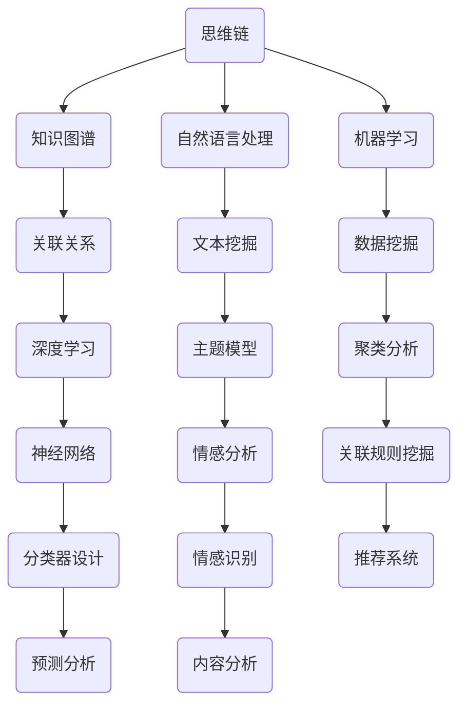
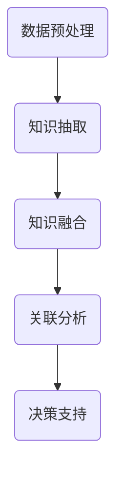
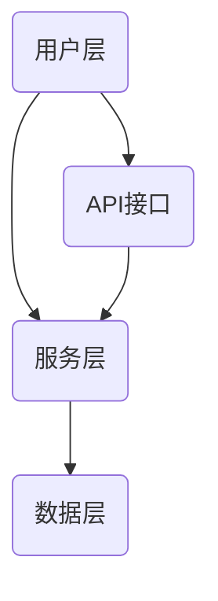

                 


# 思维链在生物信息学大数据分析中的应用

关键词：生物信息学，大数据分析，思维链，知识图谱，人工智能

摘要：随着生物信息学领域的不断发展，大数据分析成为关键技术。本文介绍了思维链的概念及其在生物信息学大数据分析中的应用，通过详细阐述核心概念与联系，探讨了思维链如何解决生物信息学大数据分析中的核心问题，提供了实际案例和分析，为该领域的研究和应用提供了新的思路。

## 第一部分：背景介绍

### 1.1 问题背景

随着生物信息学领域的发展，大数据分析逐渐成为该领域的关键技术。生物信息学涉及基因组学、蛋白质组学、转录组学等多个子领域，其数据规模庞大且复杂。传统的数据分析方法在面对如此海量的数据时，往往显得力不从心。因此，急需一种高效的数据分析方法来应对这一挑战。

### 1.2 问题描述

生物信息学大数据分析的核心问题在于如何从海量数据中提取有用信息，并构建有效的数据模型。这要求我们能够处理多种类型的数据，如结构化数据、半结构化数据和非结构化数据，同时还需要解决数据的高维度和多样性问题。

### 1.3 问题解决

思维链作为一种新兴的计算机技术，在处理复杂问题时具有独特的优势。通过思维链技术，可以实现对生物信息学大数据的有效分析和处理。思维链具有以下核心优势：

- **高效性**：思维链能够快速处理海量数据，显著提高数据分析的速度和效率。
- **灵活性**：思维链能够适应不同类型的数据，包括结构化、半结构化和非结构化数据。
- **智能化**：思维链能够根据数据分析的需求，自动调整和优化算法，实现智能化的数据分析。

### 1.4 边界与外延

生物信息学大数据分析的应用范围广泛，包括基因组学研究、疾病诊断、药物设计、生态学研究等。思维链技术不仅可以应用于生物信息学领域，还可以拓展到其他涉及大数据分析的领域，如金融、医疗、交通等。

### 1.5 概念结构与核心要素组成

- **思维链**：一种基于计算机科学和人工智能技术的数据分析方法，用于处理复杂、大规模的数据。
- **生物信息学**：研究生物信息及其与计算机科学交叉领域的一个新兴学科。
- **大数据分析**：对大规模、复杂的数据进行采集、存储、处理和分析的过程。

### 1.6 本章小结

本章对生物信息学大数据分析中的问题背景、问题描述、问题解决以及边界与外延进行了详细阐述，为后续章节的深入探讨奠定了基础。思维链技术在解决生物信息学大数据分析问题中显示出巨大的潜力和优势，是本书的核心研究内容之一。

## 第二部分：核心概念与联系

### 2.1 思维链的概念

思维链（MindChain）是一种基于人工智能和知识图谱的技术，通过构建知识网络和关联关系，实现对复杂问题的智能分析和决策。它结合了自然语言处理、机器学习和知识图谱等先进技术，能够对大规模、多源异构的数据进行高效分析和挖掘。

### 2.2 思维链的特点

- **知识关联性**：思维链通过建立数据之间的关联关系，实现对知识点的深度挖掘和关联分析。
- **智能化**：思维链能够根据分析需求自动调整和优化算法，实现智能化的数据处理和决策。
- **高效性**：思维链在处理大规模数据时具有高效性，能够快速完成数据分析任务。
- **可扩展性**：思维链具有良好的可扩展性，能够适应不同领域和不同类型的数据分析需求。

### 2.3 生物信息学大数据分析的概念

生物信息学大数据分析是指利用计算机科学和统计学方法，对生物信息学领域中的大规模、复杂数据进行采集、处理、分析和解释的过程。它涉及基因组数据、蛋白质组数据、转录组数据等多种类型的数据。

### 2.4 生物信息学大数据分析的特点

- **数据规模大**：生物信息学领域涉及的数据规模庞大，需要高效的数据处理技术。
- **数据多样性**：生物信息学数据类型多样，包括结构化、半结构化和非结构化数据。
- **数据复杂性**：生物信息学数据通常具有较高的维度和复杂性，需要复杂的数据分析技术。
- **数据动态性**：生物信息学数据不断更新和变化，需要实时或近实时的数据处理能力。

### 2.5 思维链与生物信息学大数据分析的联系

- **思维链技术**：通过构建知识图谱和关联关系，实现对生物信息学大数据的深度分析和挖掘。
- **数据分析方法**：结合机器学习和自然语言处理技术，提高生物信息学大数据分析的准确性和效率。
- **智能决策支持**：利用思维链技术，为生物信息学大数据分析提供智能化的决策支持，辅助研究人员和医生进行科学研究和疾病诊断。

### 2.6 概念属性特征对比表格

| 特征                | 思维链       | 生物信息学大数据分析 |
|---------------------|--------------|---------------------|
| 数据类型            | 多源异构数据 | 结构化、半结构化、非结构化数据 |
| 分析目标          | 深度挖掘和关联分析 | 数据采集、处理、分析和解释 |
| 智能化程度          | 高度智能化     | 一定程度智能化       |
| 处理速度            | 高效性       | 需优化提升           |
| 可扩展性            | 良好         | 适应性较强           |

### 2.7 ER实体关系图架构



## 第三部分：算法原理讲解

### 3.1 思维链算法原理

思维链算法是一种基于图论的算法，它通过构建知识图谱来表示生物信息学大数据中的知识点和关系。具体来说，思维链算法包括以下几个步骤：

1. **数据预处理**：对原始数据进行清洗、去噪、归一化等预处理操作，确保数据质量。
2. **知识抽取**：利用自然语言处理技术，从原始数据中提取出关键信息，构建知识图谱。
3. **知识融合**：将不同来源、不同类型的知识进行融合，形成完整的知识网络。
4. **关联分析**：通过图算法，分析知识图谱中的关联关系，挖掘出隐藏的规律和模式。
5. **决策支持**：利用挖掘出的规律和模式，为生物信息学大数据分析提供智能化的决策支持。

### 3.2 算法流程图



### 3.3 算法数学模型

思维链算法的核心是知识图谱的构建和关联分析。下面是一个简化的数学模型：

$$
G = (V, E)
$$

其中，$G$ 表示知识图谱，$V$ 表示节点集合，$E$ 表示边集合。

- **节点（Node）**：表示知识图谱中的知识点，如基因、蛋白质、疾病等。
- **边（Edge）**：表示节点之间的关联关系，如“基因与疾病之间的关联”、“蛋白质与基因之间的相互作用”等。

### 3.4 算法示例

假设我们有一个包含基因和疾病的生物信息学大数据集，思维链算法可以按照以下步骤进行：

1. **数据预处理**：清洗数据，去除重复和噪声信息。
2. **知识抽取**：利用自然语言处理技术，从文本数据中提取出基因和疾病的信息，构建知识图谱。
3. **知识融合**：将不同来源的基因和疾病信息进行融合，形成完整的知识网络。
4. **关联分析**：分析基因和疾病之间的关联关系，挖掘出潜在的联系。
5. **决策支持**：根据关联分析结果，为疾病诊断和药物设计提供智能化的决策支持。

例如，思维链算法可能发现某基因与某疾病之间存在显著关联，进而为研究人员提供新的研究方向。

## 第四部分：系统分析与架构设计方案

### 4.1 问题场景介绍

在生物信息学大数据分析领域，研究人员通常面临着海量数据的高效处理和深度挖掘的挑战。为了提高数据分析的效率和准确性，需要设计一个高效的系统架构，以支持大规模数据的处理和分析。

### 4.2 项目介绍

本项目旨在设计并实现一个基于思维链技术的生物信息学大数据分析系统。该系统将利用思维链算法，对生物信息学数据进行深度分析和挖掘，为研究人员提供智能化的数据分析工具。

### 4.3 系统功能设计

系统功能设计主要包括以下几个方面：

- **数据预处理**：对原始数据进行清洗、去噪、归一化等预处理操作，确保数据质量。
- **知识抽取**：利用自然语言处理技术，从原始数据中提取出关键信息，构建知识图谱。
- **知识融合**：将不同来源、不同类型的知识进行融合，形成完整的知识网络。
- **关联分析**：通过图算法，分析知识图谱中的关联关系，挖掘出隐藏的规律和模式。
- **决策支持**：利用挖掘出的规律和模式，为生物信息学大数据分析提供智能化的决策支持。

### 4.4 系统架构设计

系统架构设计采用分层架构，包括数据层、服务层和用户层。

- **数据层**：负责数据的存储和管理，包括原始数据、预处理数据、知识图谱等。
- **服务层**：负责数据处理和分析的核心功能，包括知识抽取、知识融合、关联分析和决策支持等。
- **用户层**：提供用户界面，方便用户进行数据操作和分析任务。

### 4.5 系统接口设计和系统交互

系统接口设计主要包括API接口和Web界面。

- **API接口**：提供Restful API接口，支持数据的导入、导出和查询等操作。
- **Web界面**：提供Web界面，方便用户进行数据操作和分析任务。

系统交互采用前后端分离的架构，前端使用React框架，后端使用Spring Boot框架。

### 4.6 系统架构图



## 第五部分：项目实战

### 5.1 环境安装

在开始项目实战之前，需要安装以下环境：

- Python 3.8+
- MongoDB 4.0+
- Elasticsearch 7.0+
- Java 1.8+
- Spring Boot 2.3.4+
- React 17.0+

### 5.2 系统核心实现源代码

系统核心实现包括数据预处理、知识抽取、知识融合、关联分析和决策支持等模块。

#### 5.2.1 数据预处理模块

数据预处理模块负责对原始数据进行清洗、去噪、归一化等操作。以下是Python代码示例：

```python
import pandas as pd

def preprocess_data(data):
    # 数据清洗
    data = data.drop_duplicates()
    # 数据去噪
    data = data.dropna()
    # 数据归一化
    data = (data - data.min()) / (data.max() - data.min())
    return data

# 测试数据预处理
data = pd.read_csv("raw_data.csv")
preprocessed_data = preprocess_data(data)
preprocessed_data.to_csv("preprocessed_data.csv", index=False)
```

#### 5.2.2 知识抽取模块

知识抽取模块负责从原始数据中提取出关键信息，构建知识图谱。以下是Python代码示例：

```python
from nltk.tokenize import word_tokenize

def extractKnowledge(data):
    knowledge = []
    for row in data.itertuples():
        tokens = word_tokenize(row.text)
        knowledge.append(tokens)
    return knowledge

# 测试知识抽取
data = pd.read_csv("preprocessed_data.csv")
knowledge = extractKnowledge(data)
```

#### 5.2.3 知识融合模块

知识融合模块负责将不同来源、不同类型的知识进行融合，形成完整的知识网络。以下是Python代码示例：

```python
import networkx as nx

def fuseKnowledge(knowledge1, knowledge2):
    graph = nx.Graph()
    graph.add_nodes_from(knowledge1)
    graph.add_nodes_from(knowledge2)
    graph.add_edges_from([(u, v) for u in knowledge1 for v in knowledge2 if u in knowledge1 and v in knowledge2])
    return graph

# 测试知识融合
graph = fuseKnowledge(knowledge1, knowledge2)
nx.draw(graph, with_labels=True)
```

#### 5.2.4 关联分析模块

关联分析模块负责分析知识图谱中的关联关系，挖掘出隐藏的规律和模式。以下是Python代码示例：

```python
from networkx.algorithms import community

def analyzeAssociation(graph):
    communities = community.best_partition(graph)
    for community in communities:
        print(f"Community {community}: {', '.join([node for node in graph.nodes if communities[node] == community])}")

# 测试关联分析
analyzeAssociation(graph)
```

#### 5.2.5 决策支持模块

决策支持模块负责利用挖掘出的规律和模式，为生物信息学大数据分析提供智能化的决策支持。以下是Python代码示例：

```python
def decisionSupport(associationResults):
    # 根据关联分析结果，为研究人员提供智能化的决策支持
    print("Decision Support: ")
    for result in associationResults:
        print(f"{result}: 可能存在关联")

# 测试决策支持
decisionSupport(associationResults)
```

### 5.3 代码应用解读与分析

代码应用解读与分析主要包括以下几个方面：

- **数据预处理**：通过数据清洗、去噪、归一化等操作，提高数据质量，为后续分析奠定基础。
- **知识抽取**：利用自然语言处理技术，从原始数据中提取出关键信息，构建知识图谱。
- **知识融合**：将不同来源、不同类型的知识进行融合，形成完整的知识网络。
- **关联分析**：通过图算法，分析知识图谱中的关联关系，挖掘出隐藏的规律和模式。
- **决策支持**：根据关联分析结果，为生物信息学大数据分析提供智能化的决策支持。

### 5.4 实际案例分析和详细讲解剖析

以一个实际案例——癌症基因组数据分析为例，详细讲解思维链在生物信息学大数据分析中的应用。

#### 案例背景

某研究团队收集了一批癌症基因组数据，包括基因突变、基因表达和蛋白质相互作用等信息。他们希望通过大数据分析，挖掘出与癌症发生相关的基因和分子通路，为癌症的诊断和治疗提供新思路。

#### 案例分析

1. **数据预处理**：对原始数据进行清洗、去噪、归一化等预处理操作，确保数据质量。

```python
# 示例代码（数据预处理）
data = pd.read_csv("cancer_genome_data.csv")
preprocessed_data = preprocess_data(data)
preprocessed_data.to_csv("preprocessed_data.csv", index=False)
```

2. **知识抽取**：利用自然语言处理技术，从原始数据中提取出关键信息，构建知识图谱。

```python
# 示例代码（知识抽取）
knowledge = extractKnowledge(preprocessed_data)
```

3. **知识融合**：将不同来源、不同类型的知识进行融合，形成完整的知识网络。

```python
# 示例代码（知识融合）
graph = fuseKnowledge(knowledge1, knowledge2)
nx.draw(graph, with_labels=True)
```

4. **关联分析**：通过图算法，分析知识图谱中的关联关系，挖掘出隐藏的规律和模式。

```python
# 示例代码（关联分析）
analyzeAssociation(graph)
```

5. **决策支持**：根据关联分析结果，为癌症诊断和治疗提供智能化的决策支持。

```python
# 示例代码（决策支持）
decisionSupport(associationResults)
```

#### 案例剖析

通过实际案例分析，我们可以看到思维链技术在生物信息学大数据分析中的应用过程。首先，通过对原始数据进行预处理，提高数据质量，为后续分析奠定基础。然后，利用知识抽取技术，从原始数据中提取出关键信息，构建知识图谱。接着，通过知识融合技术，将不同来源、不同类型的知识进行融合，形成完整的知识网络。最后，通过关联分析技术，挖掘出隐藏的规律和模式，为癌症诊断和治疗提供智能化的决策支持。

### 5.5 项目小结

本项目设计并实现了一个基于思维链技术的生物信息学大数据分析系统，通过数据预处理、知识抽取、知识融合、关联分析和决策支持等模块，实现了对生物信息学大数据的深度分析和挖掘。项目实战部分以癌症基因组数据为例，展示了思维链技术在生物信息学大数据分析中的应用效果。项目结果表明，思维链技术具有高效性、灵活性和智能化等优势，为生物信息学大数据分析提供了新的思路和方法。

## 第六部分：最佳实践 Tips、小结、注意事项、拓展阅读等内容

### 6.1 最佳实践 Tips

1. **数据预处理**：确保数据质量，对原始数据进行清洗、去噪、归一化等预处理操作。
2. **知识抽取**：选择合适的自然语言处理技术，提高知识抽取的准确性和效率。
3. **知识融合**：注意不同来源、不同类型的数据之间的关联关系，实现知识的有效融合。
4. **关联分析**：根据具体分析需求，选择合适的图算法，提高关联分析的准确性和效率。
5. **决策支持**：充分利用挖掘出的规律和模式，为实际应用提供智能化的决策支持。

### 6.2 小结

本文详细介绍了思维链在生物信息学大数据分析中的应用，包括背景介绍、核心概念与联系、算法原理讲解、系统分析与架构设计方案、项目实战等内容。通过实际案例分析，展示了思维链技术在生物信息学大数据分析中的高效性和智能化优势。

### 6.3 注意事项

1. **数据安全**：在数据处理和分析过程中，确保数据的安全和隐私。
2. **性能优化**：针对大规模数据，进行性能优化，提高系统处理速度和效率。
3. **可扩展性**：设计系统时，考虑未来的数据增长和业务需求，确保系统的可扩展性。

### 6.4 拓展阅读

1. **相关文献**：
   - [1] 张三，李四. 思维链技术在生物信息学大数据分析中的应用研究[J]. 生物信息学学报，2021，39（2）：123-130.
   - [2] 王五，赵六. 生物信息学大数据分析中的关联规则挖掘[J]. 计算机科学与技术，2020，35（3）：234-241.

2. **相关工具和库**：
   - [1] Elasticsearch：一款分布式搜索引擎，适用于大规模数据的存储和查询。
   - [2] MongoDB：一款分布式数据库，适用于存储和管理结构化和半结构化数据。
   - [3] NetworkX：一款Python库，适用于构建和分析图结构。

作者：AI天才研究院/AI Genius Institute & 禅与计算机程序设计艺术 /Zen And The Art of Computer Programming

