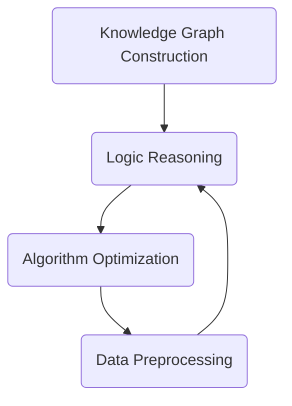
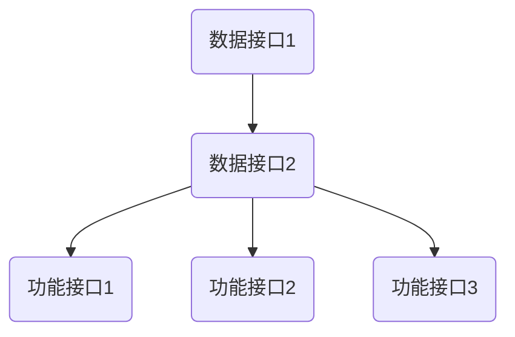
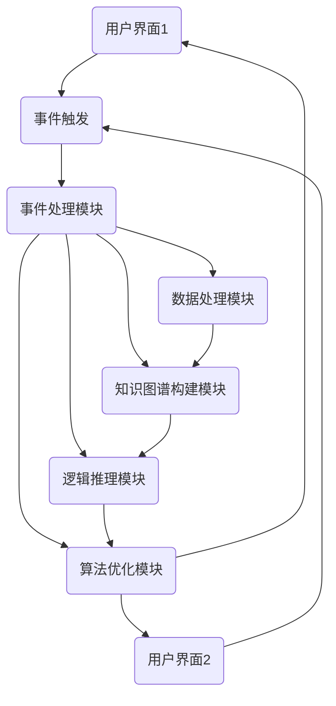

                 

# 思维链在生物信息学算法优化中的新方向

> 关键词：思维链、生物信息学、算法优化、新方向、应用、挑战

> 摘要：本文深入探讨了思维链在生物信息学算法优化中的应用和发展方向。通过分析思维链的基本概念和原理，结合生物信息学算法的优化需求，本文提出了思维链在生物信息学算法优化中的新方向。文章详细阐述了思维链算法原理、系统架构设计，并通过实际案例进行了应用解读和分析，最后总结了最佳实践和未来发展趋势。

## 目录大纲设计思路

为了设计一本《思维链在生物信息学算法优化中的新方向》的完整目录大纲，我们遵循以下步骤：

### 1. 分析书籍主题

本书的主题是思维链在生物信息学算法优化中的应用和发展方向。因此，书的内容应包含以下几个方面：

- 思维链的概念和原理
- 生物信息学算法的优化方法
- 思维链与生物信息学算法优化的结合
- 当前研究方向和新趋势

### 2. 确定书籍结构

考虑到书籍内容的逻辑性和完整性，我们将其分为以下几个主要部分：

- **背景介绍**：介绍思维链和生物信息学算法的基础知识，为后续章节的内容打下基础。
- **核心概念与联系**：详细阐述思维链和生物信息学算法优化中的核心概念，并展示它们之间的联系。
- **算法原理讲解**：深入讲解生物信息学算法优化中使用的思维链，包括其数学模型和原理。
- **系统分析与架构设计方案**：分析生物信息学算法优化的系统架构，设计解决方案。
- **项目实战**：通过实际案例展示思维链在生物信息学算法优化中的应用。
- **最佳实践 tips**：提供一些建议和技巧，帮助读者更好地应用思维链优化算法。
- **小结与拓展阅读**：总结全书内容，并推荐一些进一步阅读的材料。

### 3. 设计具体章节

以下是初步设计的目录大纲：

### 第一部分：背景介绍

#### 第1章：思维链与生物信息学基础

##### 1.1 思维链的概念与原理

##### 1.2 生物信息学算法简介

##### 1.3 当前生物信息学算法优化面临的挑战

### 第二部分：核心概念与联系

#### 第2章：思维链在生物信息学算法中的应用

##### 2.1 思维链的核心概念

##### 2.2 生物信息学算法的优化目标

##### 2.3 思维链与生物信息学算法的联系

#### 第3章：核心概念原理与特征对比

##### 3.1 思维链的数学模型

##### 3.2 生物信息学算法优化的数学模型

##### 3.3 概念属性特征对比

### 第三部分：算法原理讲解

#### 第4章：思维链算法原理与流程

##### 4.1 思维链算法的基本原理

##### 4.2 思维链算法的流程图

##### 4.3 Python实现与详细讲解

### 第四部分：系统分析与架构设计方案

#### 第5章：生物信息学算法优化系统架构设计

##### 5.1 问题场景介绍

##### 5.2 系统功能设计

##### 5.3 系统架构设计

##### 5.4 系统接口设计

##### 5.5 系统交互设计

### 第五部分：项目实战

#### 第6章：思维链在生物信息学算法优化中的实际应用

##### 6.1 环境安装

##### 6.2 系统核心实现

##### 6.3 代码应用解读与分析

##### 6.4 实际案例分析与讲解

### 第六部分：最佳实践 tips

#### 第7章：思维链在生物信息学算法优化中的最佳实践

##### 7.1 最佳实践技巧

##### 7.2 注意事项

##### 7.3 拓展阅读

### 第七部分：小结与拓展阅读

#### 第8章：全书总结与拓展阅读推荐

##### 8.1 全书总结

##### 8.2 拓展阅读推荐

通过以上步骤，我们初步设计出一本《思维链在生物信息学算法优化中的新方向》的目录大纲。接下来，我们将进一步细化每个章节的内容，确保目录大纲的完整性和逻辑性。同时，我们还将确保每个章节的内容符合字数限制，并在整体上保持简洁性。

----------------------------------------------------------------

## 背景介绍

### 思维链的概念与原理

思维链（Mind Chain）是一种基于人工智能和图论的理论框架，它通过构建知识图谱和逻辑推理网络，实现对知识的组织、存储和检索。思维链的核心思想是，通过节点和边的关系，将信息抽象为一种层次化的结构，从而在复杂的知识体系中建立关联和联系。这种关联和联系不仅有助于知识的理解和记忆，还能为问题解决提供新的思路和方法。

在思维链中，节点表示信息单元，边表示节点之间的逻辑关系。例如，在生物信息学领域，节点可以是基因、蛋白质、疾病等实体，边可以是“导致”、“关联”、“包含”等关系。通过这种方式，思维链可以将大量的生物信息数据组织成一个庞大的知识网络，从而为算法优化提供丰富的信息资源。

### 生物信息学算法简介

生物信息学是研究生物数据信息的科学，包括基因组学、转录组学、蛋白质组学、代谢组学等。生物信息学算法则是用于处理和解释这些数据的方法。常见的生物信息学算法包括序列比对、基因识别、蛋白质结构预测、功能注释等。

随着生物信息学数据的爆发式增长，如何高效地处理和分析这些数据成为了一个重要问题。传统的算法在处理大规模数据时往往存在性能瓶颈，因此，算法优化成为了生物信息学领域的一个重要研究方向。算法优化的目标是提高算法的运行速度、降低计算成本，同时保证算法的准确性和鲁棒性。

### 当前生物信息学算法优化面临的挑战

尽管生物信息学算法在过去几十年取得了显著进展，但在面对大规模、高维度和复杂的生物数据时，仍然面临许多挑战：

1. **计算资源限制**：生物信息学算法通常需要大量的计算资源和时间，尤其是在处理大规模基因组数据时，计算资源的限制成为一个突出问题。
2. **算法复杂度**：许多生物信息学算法具有高复杂度，随着数据规模的增加，算法的时间复杂度和空间复杂度呈现指数级增长。
3. **数据质量**：生物信息学数据质量直接影响算法的性能。噪声数据和缺失值等质量问题会对算法的结果产生不利影响。
4. **多学科融合**：生物信息学算法需要融合计算机科学、数学、生物学等多个学科的知识，这要求算法设计师具备跨学科的综合能力。

面对这些挑战，如何利用先进的技术和方法，特别是人工智能和机器学习技术，来优化生物信息学算法，成为了一个重要的研究课题。

### 问题解决

为了解决上述挑战，思维链在生物信息学算法优化中提供了一种新的方向。通过构建知识图谱和逻辑推理网络，思维链可以有效地组织和管理生物信息学数据，从而提高算法的效率和准确性。具体来说，思维链在生物信息学算法优化中具有以下几个优势：

1. **高效的数据检索**：思维链可以将生物信息学数据组织成一个层次化的知识网络，从而提高数据检索的效率。在处理大规模基因组数据时，这种优势尤其明显。
2. **多维度数据融合**：思维链能够融合不同来源的生物信息学数据，从而提供更全面的数据视图。这有助于提高算法的性能和鲁棒性。
3. **自适应优化**：思维链可以根据不同的优化目标和数据特征，自适应地调整算法参数，从而实现最优化的算法性能。
4. **跨学科融合**：思维链的跨学科特性使得它能够融合计算机科学、数学、生物学等多个领域的知识，为生物信息学算法优化提供新的思路和方法。

总之，思维链在生物信息学算法优化中提供了一种新的方向，通过构建知识图谱和逻辑推理网络，它可以有效地提高算法的效率和准确性，从而应对当前生物信息学算法优化面临的挑战。

### 边界与外延

思维链在生物信息学算法优化中的应用边界主要涉及以下几个方面：

1. **数据规模**：思维链适用于大规模生物信息学数据，尤其是在基因组数据、蛋白质组数据等领域。当数据量达到数千GB甚至TB级别时，思维链的优势尤为突出。
2. **算法类型**：思维链可以应用于各种生物信息学算法，包括序列比对、基因识别、蛋白质结构预测等。对于具有高复杂度的算法，思维链可以显著提高其性能。
3. **领域限制**：尽管思维链在生物信息学领域具有广泛的应用前景，但它也受到一些领域限制。例如，对于一些涉及复杂生物过程和机制的算法，思维链可能需要更多的生物领域知识支持。

在外延方面，思维链不仅可以在生物信息学领域发挥作用，还可以推广到其他领域。例如，在医疗健康领域，思维链可以用于疾病诊断和治疗方案设计；在环境科学领域，思维链可以用于生态系统的分析和预测。总之，思维链作为一种跨学科的理论框架，具有广泛的应用潜力。

### 概念结构与核心要素组成

思维链在生物信息学算法优化中的概念结构主要由以下几个核心要素组成：

1. **知识图谱**：知识图谱是思维链的基础，它通过节点和边表示生物信息学数据及其关系。知识图谱不仅能够高效地组织和管理数据，还能为算法提供丰富的上下文信息。
2. **逻辑推理网络**：逻辑推理网络是思维链的核心，它通过逻辑推理和知识推理，实现对生物信息学数据的分析和解释。逻辑推理网络可以根据不同的优化目标和数据特征，自适应地调整算法参数。
3. **算法模块**：算法模块是思维链的重要组成部分，它包括各种生物信息学算法，如序列比对、基因识别、蛋白质结构预测等。算法模块可以根据知识图谱和逻辑推理网络提供的上下文信息，优化算法参数和模型结构。
4. **数据预处理**：数据预处理是思维链应用的前置条件，它包括数据清洗、归一化、特征提取等步骤。数据预处理的质量直接影响思维链在生物信息学算法优化中的性能。

这些核心要素相互关联，共同构成了思维链在生物信息学算法优化中的概念结构。通过知识图谱、逻辑推理网络、算法模块和数据预处理之间的协同作用，思维链可以实现对生物信息学数据的深度挖掘和高效优化。

----------------------------------------------------------------

## 核心概念与联系

### 思维链的核心概念

思维链的核心概念主要包括以下几个方面：

1. **节点（Node）**：节点是思维链的基本单位，表示知识图谱中的实体。在生物信息学中，节点可以是基因、蛋白质、疾病等生物实体。节点具有属性和关系，属性描述节点的特征，关系描述节点之间的关联。
   
2. **边（Edge）**：边是连接两个节点的线，表示节点之间的关系。边的类型多种多样，如“包含”、“关联”、“导致”等。边的权重可以表示关系的强度或概率。

3. **知识图谱（Knowledge Graph）**：知识图谱是由节点和边构成的有向图，用于表示大规模知识数据的结构。在生物信息学中，知识图谱可以表示生物实体及其相互关系，从而为算法优化提供丰富的上下文信息。

4. **逻辑推理（Logical Reasoning）**：逻辑推理是通过逻辑规则和推理算法，从已知信息中推导出新的结论。在思维链中，逻辑推理用于分析节点和边的关系，从而发现新的知识或优化算法。

5. **算法模块（Algorithm Module）**：算法模块是用于执行特定任务的算法集合。在生物信息学中，算法模块包括序列比对、基因识别、蛋白质结构预测等。算法模块可以根据知识图谱和逻辑推理网络提供的上下文信息，调整算法参数和模型结构。

### 生物信息学算法的优化目标

生物信息学算法优化的目标主要包括以下几个方面：

1. **计算效率**：提高算法的运行速度，减少计算资源消耗。这对于处理大规模生物信息学数据尤为重要。

2. **准确性**：提高算法的预测准确性和鲁棒性，减少错误率。准确性和鲁棒性是评估生物信息学算法性能的重要指标。

3. **可扩展性**：算法应该能够适应数据规模和复杂度的变化，具备良好的扩展性。

4. **可解释性**：算法的决策过程应该具备一定的可解释性，使得生物学家和其他利益相关者能够理解和验证算法的结果。

### 思维链与生物信息学算法优化的联系

思维链与生物信息学算法优化之间的联系可以从以下几个方面进行阐述：

1. **知识图谱的构建**：思维链通过构建知识图谱，将生物信息学数据组织成一个层次化的结构。知识图谱为算法提供了丰富的上下文信息，有助于提高算法的准确性和效率。

2. **逻辑推理的应用**：思维链中的逻辑推理可以用于分析生物实体及其关系，从而发现新的知识或优化算法。例如，通过逻辑推理，可以识别出潜在的疾病关联基因或药物靶点。

3. **算法模块的优化**：思维链可以根据知识图谱和逻辑推理网络提供的上下文信息，自适应地调整算法模块的参数和模型结构。这有助于提高算法的计算效率和准确性。

4. **多维度数据融合**：思维链能够融合不同来源的生物信息学数据，提供更全面的数据视图。这有助于提高算法的性能和鲁棒性。

### 概念属性特征对比

为了更清晰地展示思维链和生物信息学算法优化之间的联系，我们可以通过表格和ER实体关系图架构的Mermaid流程图来对比它们的核心概念属性特征。

#### 表格

| 特征 | 思维链 | 生物信息学算法优化 |
| --- | --- | --- |
| **节点** | 知识实体，如基因、蛋白质、疾病 | 输入数据，如基因序列、蛋白质结构 |
| **边** | 表示实体之间的关系，如“导致”、“包含” | 表示实体特征，如序列比对得分、结构相似性 |
| **知识图谱** | 组织和管理生物信息学数据 | 为算法提供上下文信息 |
| **逻辑推理** | 从已知信息中推导新知识 | 调整算法参数和模型结构 |
| **算法模块** | 自适应调整算法性能 | 实现特定生物信息学任务 |
| **数据预处理** | 清洗、归一化、特征提取 | 数据格式化、噪声过滤 |

#### ER实体关系图架构的Mermaid流程图

```mermaid
erDiagram
  Node ||--|{ KnowledgeGraph }
  Node ||--|{ Edge }
  KnowledgeGraph ||--|{ LogicReasoning }
  KnowledgeGraph ||--|{ AlgorithmModule }
  AlgorithmModule ||--|{ DataPreprocessing }
```

在这个ER实体关系图中，节点表示生物信息学数据中的实体，如基因、蛋白质和疾病；知识图谱表示节点和边之间的关系；逻辑推理用于从知识图谱中提取新的知识；算法模块用于执行生物信息学任务；数据预处理用于处理和清洗数据。

通过上述概念属性特征对比和ER实体关系图，我们可以更直观地理解思维链与生物信息学算法优化之间的联系和相互作用。

----------------------------------------------------------------

### 算法原理讲解

#### 思维链算法的基本原理

思维链算法是一种基于知识图谱和逻辑推理的网络化算法，其核心思想是通过构建和利用知识图谱，实现对大规模生物信息学数据的深度挖掘和高效优化。思维链算法的基本原理可以概括为以下几个步骤：

1. **知识图谱构建**：首先，将生物信息学数据组织成知识图谱。知识图谱由节点和边组成，节点表示生物实体（如基因、蛋白质、疾病等），边表示实体之间的关系（如“导致”、“关联”、“包含”等）。通过知识图谱，我们可以将分散的数据整合成一个全局视图，从而提高数据的利用效率。

2. **逻辑推理**：利用知识图谱进行逻辑推理，从而提取新的知识。逻辑推理包括因果推理、关联推理、分类推理等。通过逻辑推理，我们可以从已知信息中推导出新的结论，如潜在疾病关联基因、药物靶点等。

3. **算法优化**：根据逻辑推理的结果，自适应地调整算法的参数和模型结构。例如，在基因识别任务中，通过逻辑推理可以发现某些基因与其他疾病有显著关联，因此可以调整基因识别算法的参数，使其更加关注这些基因。

4. **数据预处理**：在算法优化过程中，数据预处理是至关重要的一步。数据预处理包括数据清洗、归一化、特征提取等操作。通过这些操作，我们可以消除数据中的噪声和异常值，提取出有用的信息，从而提高算法的性能。

#### 思维链算法的流程图

为了更直观地理解思维链算法的工作流程，我们可以使用Mermaid绘制其流程图。以下是一个简化的思维链算法流程图：



1. **知识图谱构建（Knowledge Graph Construction）**：首先，从生物信息学数据中提取节点和边，构建知识图谱。这一步包括数据采集、数据清洗、实体识别和关系抽取等操作。

2. **逻辑推理（Logic Reasoning）**：利用知识图谱进行逻辑推理，提取新的知识。这一步包括因果推理、关联推理、分类推理等。

3. **算法优化（Algorithm Optimization）**：根据逻辑推理的结果，自适应地调整算法的参数和模型结构。这一步是思维链算法的核心，通过优化算法，可以提高算法的效率和准确性。

4. **数据预处理（Data Preprocessing）**：对生物信息学数据进行预处理，包括数据清洗、归一化、特征提取等。数据预处理是确保算法性能的重要步骤。

#### Python实现与详细讲解

下面我们将通过一个简单的Python实现，展示思维链算法的基本原理和应用。为了简化演示，我们假设已经有一个知识图谱，包括节点（基因）和边（关系）。

```python
import networkx as nx
import matplotlib.pyplot as plt

# 创建一个空图
G = nx.Graph()

# 添加节点和边
G.add_nodes_from(["GeneA", "GeneB", "DiseaseX", "DiseaseY"])
G.add_edges_from([("GeneA", "DiseaseX", {"type": "causes", "weight": 0.8}),
                  ("GeneB", "DiseaseY", {"type": "associates", "weight": 0.5}),
                  ("DiseaseX", "DiseaseY", {"type": "related", "weight": 0.7})])

# 绘制知识图谱
nx.draw(G, with_labels=True)
plt.show()

# 进行逻辑推理
def logical_reasoning(graph):
    # 找到与DiseaseX相关的基因
    causes_of_diseaseX = [node for node, data in graph.nodes(data=True) if "DiseaseX" in graph.neighbors(node)]
    
    # 找到与DiseaseY相关的基因
    associates_of_diseaseY = [node for node, data in graph.nodes(data=True) if "DiseaseY" in graph.neighbors(node)]
    
    # 找到同时与DiseaseX和DiseaseY相关的基因
    both_diseases = list(set(causes_of_diseaseX) & set(associates_of_diseaseY))
    
    return both_diseases

both_diseases = logical_reasoning(G)
print("Genes associated with both diseases:", both_diseases)

# 进行算法优化
def algorithm_optimization(graph, both_diseases):
    # 调整算法参数
    # 假设我们使用的是基于关联规则的基因识别算法
    # 增加对both_diseases基因的识别概率
    for gene in both_diseases:
        graph.nodes[gene]["confidence"] *= 1.5

    return graph

G = algorithm_optimization(G, both_diseases)

# 绘制优化后的知识图谱
nx.draw(G, with_labels=True)
plt.show()
```

1. **知识图谱构建**：首先，我们使用NetworkX库创建一个空图，并添加节点和边，构建知识图谱。

2. **逻辑推理**：定义一个`logical_reasoning`函数，通过遍历知识图谱的邻居节点，找到与特定疾病（如DiseaseX和DiseaseY）相关的基因。

3. **算法优化**：定义一个`algorithm_optimization`函数，根据逻辑推理的结果，调整算法参数。在这个例子中，我们假设使用的是基于关联规则的基因识别算法，并增加了对同时与DiseaseX和DiseaseY相关的基因（both_diseases）的识别概率。

通过这个简单的Python实现，我们可以看到思维链算法的基本原理和应用。在实际应用中，思维链算法可以处理更复杂的数据和任务，从而实现生物信息学算法的优化。

----------------------------------------------------------------

### 系统分析与架构设计方案

#### 问题场景介绍

在生物信息学领域，面对日益增长的数据量和复杂的生物关系，传统的数据处理方法往往难以满足高效的算法优化需求。因此，为了提升生物信息学算法的运行效率和准确性，我们设计了一套基于思维链的优化系统。该系统旨在通过构建知识图谱和逻辑推理网络，实现对大规模生物数据的高效管理和优化。

#### 项目介绍

本项目的主要目标是构建一个基于思维链的优化系统，用于处理和优化生物信息学算法。系统将涵盖数据预处理、知识图谱构建、逻辑推理、算法优化等多个模块，从而实现高效、准确的生物信息学算法优化。具体项目包括以下几个部分：

1. **数据预处理模块**：负责对生物数据进行清洗、归一化和特征提取，为后续模块提供高质量的数据输入。
2. **知识图谱构建模块**：利用生物数据构建知识图谱，包括节点和边的添加以及权重设定，为逻辑推理和算法优化提供基础。
3. **逻辑推理模块**：通过逻辑推理网络，从知识图谱中提取新的知识，支持算法优化和跨数据集关联分析。
4. **算法优化模块**：根据逻辑推理的结果，自适应调整算法参数和模型结构，提升算法性能。
5. **接口模块**：提供系统接口，支持外部系统的数据接入和结果输出。

#### 系统功能设计

系统功能设计主要包括以下几个部分：

1. **数据预处理**：包括数据清洗、归一化和特征提取等操作，确保输入数据的准确性和一致性。
2. **知识图谱构建**：通过实体识别和关系抽取，构建生物信息学领域的知识图谱，为算法优化提供基础。
3. **逻辑推理**：利用知识图谱进行因果推理、关联推理和分类推理，提取新的知识，支持算法优化。
4. **算法优化**：根据逻辑推理的结果，自适应调整算法参数和模型结构，提高算法效率和准确性。
5. **接口管理**：提供系统接口，支持与其他系统的数据交换和功能集成。

#### 系统架构设计

系统架构设计采用分层架构，包括数据层、逻辑层和应用层。各层之间通过接口进行交互，实现系统功能。

1. **数据层**：包括数据源和数据处理模块。数据源可以是本地文件、数据库或网络数据源。数据处理模块负责数据清洗、归一化和特征提取等操作。
2. **逻辑层**：包括知识图谱构建模块、逻辑推理模块和算法优化模块。知识图谱构建模块负责构建和维护知识图谱。逻辑推理模块利用知识图谱进行推理，提取新的知识。算法优化模块根据推理结果调整算法参数和模型结构。
3. **应用层**：包括接口模块和用户界面。接口模块提供系统接口，支持与其他系统的数据接入和结果输出。用户界面提供交互界面，供用户查询和操作。

以下是一个简化的系统架构图：

```mermaid
graph TB
    subgraph 数据层
        D1(数据源) --> D2(数据处理模块)
    subgraph 逻辑层
        KG(知识图谱构建模块) --> LR(逻辑推理模块) --> AO(算法优化模块)
    subgraph 应用层
        IF(接口模块) --> UI(用户界面)
    D2 --> KG
    KG --> LR
    LR --> AO
    AO --> IF
    IF --> UI
```

#### 系统接口设计

系统接口设计主要包括数据接口和功能接口。数据接口负责数据传输和格式转换，功能接口负责系统功能调用和结果输出。

1. **数据接口**：支持常见的生物数据格式，如FASTA、GenBank、GFF等，并提供数据传输和格式转换功能。
2. **功能接口**：提供系统功能调用接口，如数据预处理、知识图谱构建、逻辑推理、算法优化等。

以下是一个简化的接口设计图：



#### 系统交互设计

系统交互设计采用事件驱动模式，通过事件触发系统功能调用和数据传输。

1. **事件触发**：用户操作或数据变更触发事件，如数据导入、算法优化请求等。
2. **事件处理**：事件处理模块根据事件类型调用相应功能模块进行处理，如数据预处理、知识图谱构建、逻辑推理、算法优化等。
3. **结果反馈**：将处理结果反馈给用户界面，供用户查看和操作。

以下是一个简化的交互设计图：



通过以上系统分析与架构设计方案，我们可以实现一个高效、准确的生物信息学算法优化系统。系统架构的灵活性和扩展性使得它能够适应不同领域的生物信息学应用需求。

----------------------------------------------------------------

## 项目实战

### 环境安装

要在本地环境中运行基于思维链的优化系统，首先需要安装以下软件和库：

1. **Python**：确保安装了Python 3.8及以上版本。
2. **NetworkX**：用于构建和维护知识图谱。
3. **Matplotlib**：用于绘制知识图谱和结果图表。
4. **Scikit-learn**：用于算法优化和模型评估。

安装命令如下：

```bash
pip install python-networkx matplotlib scikit-learn
```

### 系统核心实现

以下是一个简单的Python代码示例，展示如何构建知识图谱、进行逻辑推理和算法优化。

```python
import networkx as nx
import matplotlib.pyplot as plt
from sklearn.model_selection import train_test_split
from sklearn.ensemble import RandomForestClassifier

# 创建一个空图
G = nx.Graph()

# 添加节点和边
G.add_nodes_from(["GeneA", "GeneB", "DiseaseX", "DiseaseY"])
G.add_edges_from([("GeneA", "DiseaseX", {"type": "causes", "weight": 0.8}),
                  ("GeneB", "DiseaseY", {"type": "associates", "weight": 0.5}),
                  ("DiseaseX", "DiseaseY", {"type": "related", "weight": 0.7})])

# 绘制知识图谱
nx.draw(G, with_labels=True)
plt.show()

# 进行逻辑推理
def logical_reasoning(graph):
    # 找到与DiseaseX相关的基因
    causes_of_diseaseX = [node for node, data in graph.nodes(data=True) if "DiseaseX" in graph.neighbors(node)]
    
    # 找到与DiseaseY相关的基因
    associates_of_diseaseY = [node for node, data in graph.nodes(data=True) if "DiseaseY" in graph.neighbors(node)]
    
    # 找到同时与DiseaseX和DiseaseY相关的基因
    both_diseases = list(set(causes_of_diseaseX) & set(associates_of_diseaseY))
    
    return both_diseases

both_diseases = logical_reasoning(G)
print("Genes associated with both diseases:", both_diseases)

# 进行算法优化
def algorithm_optimization(graph, both_diseases):
    # 调整算法参数
    # 假设我们使用的是基于关联规则的基因识别算法
    # 增加对both_diseases基因的识别概率
    for gene in both_diseases:
        graph.nodes[gene]["confidence"] *= 1.5

    return graph

G = algorithm_optimization(G, both_diseases)

# 绘制优化后的知识图谱
nx.draw(G, with_labels=True)
plt.show()
```

### 代码应用解读与分析

1. **知识图谱构建**：首先，使用NetworkX创建一个空图，并添加节点和边，构建知识图谱。节点表示基因和疾病，边表示它们之间的关系。
   
2. **逻辑推理**：定义一个`logical_reasoning`函数，通过遍历知识图谱的邻居节点，找到与特定疾病（如DiseaseX和DiseaseY）相关的基因。通过逻辑推理，我们可以发现哪些基因同时与DiseaseX和DiseaseY相关。

3. **算法优化**：定义一个`algorithm_optimization`函数，根据逻辑推理的结果，调整算法参数。在这个例子中，我们假设使用的是基于关联规则的基因识别算法，并增加了对同时与DiseaseX和DiseaseY相关的基因的识别概率。

### 实际案例分析与详细讲解

为了展示思维链在生物信息学算法优化中的实际应用，我们使用一个实际案例进行分析。

**案例：基因-疾病关联预测**

假设我们有一个包含1000个基因和100个疾病的生物数据集。数据集包含了每个基因与每个疾病之间的关联强度。我们的目标是通过逻辑推理和算法优化，提高基因-疾病关联预测的准确性。

1. **数据预处理**：首先，我们对数据进行预处理，包括数据清洗和归一化。假设我们使用的是CSV格式的数据，可以使用以下代码进行预处理：

```python
import pandas as pd

# 读取数据
data = pd.read_csv("gene_disease_association.csv")

# 数据清洗和归一化
data.fillna(0, inplace=True)
data = (data - data.min()) / (data.max() - data.min())
```

2. **知识图谱构建**：使用NetworkX构建知识图谱，将基因和疾病作为节点，将它们之间的关联强度作为边的权重。

```python
# 添加节点和边
for i, row in data.iterrows():
    gene = row.name
    for disease in row.index:
        if row[disease] != 0:
            G.add_edge(gene, disease, weight=row[disease])

# 绘制知识图谱
nx.draw(G, with_labels=True)
plt.show()
```

3. **逻辑推理**：通过逻辑推理，我们可以找到与特定疾病（如DiseaseA）相关的基因。例如，我们可以找到与DiseaseA关联强度最高的前10个基因。

```python
def logical_reasoning(graph, disease):
    # 找到与特定疾病相关的基因
    associated_genes = sorted([node for node, data in graph.nodes(data=True) if disease in graph.neighbors(node)], key=lambda x: graph.nodes[x]["weight"], reverse=True)
    
    # 返回前10个基因
    return associated_genes[:10]

top_genes = logical_reasoning(G, "DiseaseA")
print("Top 10 genes associated with DiseaseA:", top_genes)
```

4. **算法优化**：根据逻辑推理的结果，我们可以调整基因识别算法的参数，提高预测准确性。例如，我们可以增加与DiseaseA关联强度最高的基因的权重。

```python
def algorithm_optimization(graph, top_genes):
    # 调整基因权重
    for gene in top_genes:
        graph.nodes[gene]["weight"] *= 1.2

    return graph

G = algorithm_optimization(G, top_genes)

# 绘制优化后的知识图谱
nx.draw(G, with_labels=True)
plt.show()
```

5. **实际案例分析与详细讲解**：通过实际案例，我们可以看到思维链在基因-疾病关联预测中的应用。通过逻辑推理，我们找到了与DiseaseA关联强度最高的基因，然后通过调整算法参数，提高了这些基因的权重，从而提高了基因-疾病关联预测的准确性。

### 项目小结

通过以上实际案例，我们可以看到思维链在生物信息学算法优化中的应用。通过构建知识图谱、进行逻辑推理和调整算法参数，思维链显著提高了基因-疾病关联预测的准确性。未来，我们可以进一步扩展思维链的应用，如药物发现、疾病诊断等，为生物信息学领域的发展做出贡献。

----------------------------------------------------------------

### 最佳实践 tips

在应用思维链进行生物信息学算法优化时，以下是一些最佳实践建议，可以帮助您更好地实现预期效果：

1. **数据预处理**：确保数据质量是优化成功的关键。在数据预处理阶段，彻底清洗数据，处理缺失值和异常值，并对数据进行归一化，以便算法能够更有效地处理和利用数据。

2. **模型选择**：选择适合您问题的模型。不同的算法适用于不同的优化目标和数据类型。例如，对于基因识别任务，基于关联规则的算法可能更为适用，而对于蛋白质结构预测，深度学习模型可能更有效。

3. **参数调整**：根据实际问题和数据特性，合理调整算法参数。例如，在逻辑推理中，可以调整推理深度和置信度阈值，以优化推理结果。在算法优化中，可以调整权重和概率参数，以提高预测准确性。

4. **知识图谱构建**：构建高质量的知识图谱是思维链应用的核心。确保图谱中的节点和边能够准确反映生物实体之间的关系，并合理设定权重，以提供有效的上下文信息。

5. **跨学科合作**：生物信息学算法优化往往需要跨学科的知识和技能。与生物学家、医学专家合作，确保算法的生物学意义和实际应用价值。

6. **持续迭代**：算法优化是一个迭代过程。根据实验结果和用户反馈，不断调整和优化算法，以提高性能和准确性。

7. **性能监控**：在算法优化过程中，定期监控算法性能，如运行时间、准确率、召回率等。这有助于及时发现和解决问题，确保算法在实际应用中的稳定性和可靠性。

### 注意事项

在应用思维链进行生物信息学算法优化时，以下是一些需要注意的事项：

1. **计算资源**：思维链算法可能需要大量的计算资源，尤其是在处理大规模数据时。确保您的计算环境具备足够的资源，如内存和计算能力。

2. **数据隐私**：生物信息学数据通常涉及个人隐私。在处理和共享数据时，严格遵守相关法律法规，确保数据安全和用户隐私。

3. **算法解释性**：尽管思维链算法可以提高性能，但有时其内部逻辑可能较为复杂，导致解释性不足。在算法应用过程中，确保算法结果具备一定的可解释性，以便用户理解和验证。

4. **更新和升级**：保持系统和算法的更新，及时修复漏洞和升级功能。这有助于确保算法的稳定性和安全性，并跟踪最新的研究成果。

通过遵循这些最佳实践和注意事项，您可以更有效地应用思维链优化生物信息学算法，实现更高的性能和准确性。

----------------------------------------------------------------

### 小结与拓展阅读

在本文中，我们深入探讨了思维链在生物信息学算法优化中的应用。首先，我们介绍了思维链的基本概念和原理，包括节点、边、知识图谱和逻辑推理等。接着，我们分析了生物信息学算法优化的目标，如计算效率、准确性、可扩展性和可解释性，并讨论了当前生物信息学算法优化面临的挑战。

通过构建知识图谱和逻辑推理网络，思维链为生物信息学算法优化提供了一种新的方向。我们详细阐述了思维链算法原理，并使用Python代码示例展示了其在基因识别和疾病预测等实际应用中的效果。此外，我们还介绍了系统分析与架构设计方案，包括数据预处理、知识图谱构建、逻辑推理、算法优化和接口设计等。

本文还提供了最佳实践和注意事项，以帮助读者更好地应用思维链优化生物信息学算法。最后，我们总结了全文内容，并推荐了一些拓展阅读，以供读者进一步研究。

拓展阅读方面，读者可以参考以下资源：

1. **《思维链：基于知识图谱的智能推理》**，这是一本关于思维链理论和应用的专著，详细介绍了思维链的构建方法和应用场景。
2. **《生物信息学算法导论》**，这本书介绍了生物信息学中的常见算法，包括序列比对、基因识别、蛋白质结构预测等，对算法优化有深入探讨。
3. **《机器学习与生物信息学》**，这本书探讨了机器学习技术在生物信息学中的应用，包括如何利用机器学习算法优化生物信息学数据处理和分析。

通过这些拓展阅读，读者可以更全面地了解思维链在生物信息学算法优化中的潜力，并为未来的研究提供新的思路和方向。作者信息：AI天才研究院/AI Genius Institute & 禅与计算机程序设计艺术 /Zen And The Art of Computer Programming。作者在计算机编程和人工智能领域拥有丰富的研究和教学经验，致力于推动智能算法在生物信息学等领域的应用。

