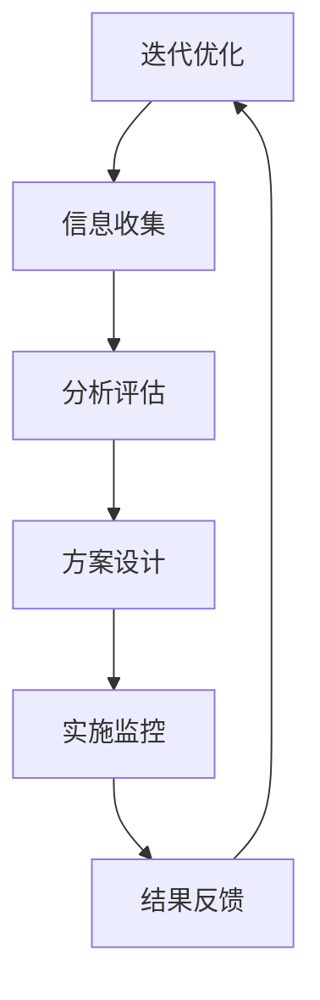
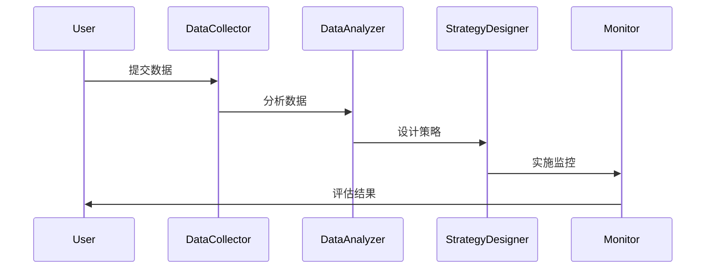
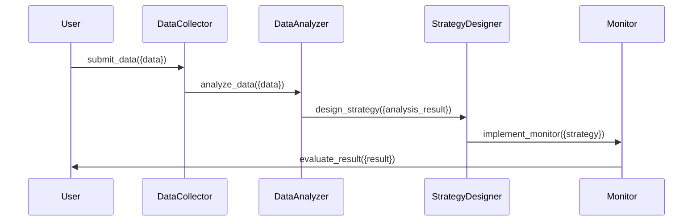

                 


### 《思维链在生物多样性保护策略中的应用》

关键词：生物多样性保护、思维链、算法、系统架构设计、实战案例

摘要：本文从问题背景出发，介绍了生物多样性保护的重要性及其面临的挑战。随后，引出了思维链的概念，探讨了思维链在生物多样性保护策略中的潜在作用。文章通过核心概念、算法原理、系统分析与架构设计、实战案例等多个方面，详细阐述了思维链在生物多样性保护策略中的应用，为生物多样性保护提供了新的思路和方法。

### 第一部分：背景介绍

#### 问题背景

生物多样性是地球生命系统的重要组成部分，对生态系统的稳定性和人类社会的可持续发展具有至关重要的作用。然而，随着人类活动的加剧，生物多样性正面临前所未有的威胁。栖息地破坏、气候变化、过度捕捞、污染等人类活动导致了物种灭绝速度的加快，生态系统功能的退化，生物多样性急剧下降。

生物多样性包括基因多样性、物种多样性和生态系统多样性三个层次。基因多样性指的是生物体内基因的多样性，物种多样性指的是生物种类的多样性，生态系统多样性指的是生态系统的多样性。这三个层次相互关联，共同构成了地球上的生命网络。

当前，全球生物多样性保护面临的主要问题是：

1. **栖息地破坏**：人类活动如城市化、农业扩张、工业污染等导致了大量栖息地的丧失，许多物种失去了生存空间。
2. **气候变化**：全球气候变暖导致生态系统失衡，许多物种难以适应环境变化，导致灭绝风险增加。
3. **过度捕捞**：过度捕捞导致许多鱼类和水生生物种群数量急剧下降，破坏了水生生态系统的平衡。
4. **污染**：污染物质如重金属、农药、塑料等对生物多样性产生了严重的影响。

#### 生物多样性定义

生物多样性指的是生命系统的多样性，包括生物种类的多样性、基因的多样性和生态系统的多样性。具体来说：

1. **基因多样性**：是指同一物种内不同个体或种群之间的基因差异。基因多样性决定了物种的适应性和进化潜力。
2. **物种多样性**：是指地球上不同生物种类的数量和分布情况。物种多样性反映了生态系统的复杂性和稳定性。
3. **生态系统多样性**：是指不同生态系统之间的多样性和分布情况。生态系统多样性决定了生态系统的功能和服务。

#### 生物多样性保护的现状

生物多样性保护已经成为全球性的紧迫任务。各国政府、国际组织和非政府组织都在积极采取措施，努力保护生物多样性。

1. **法律保护**：许多国家制定了相关的法律法规，保护野生动植物和生态系统。例如，《濒危野生动植物种国际贸易公约》(CITES) 就是一个旨在保护濒危物种的国际协定。
2. **自然保护区**：许多国家和地区建立了自然保护区，保护重要的生态系统和物种。自然保护区是生物多样性保护的重要手段。
3. **生态修复**：一些地区通过生态修复项目，恢复受损的生态系统，提高生物多样性。
4. **公众参与**：公众参与是生物多样性保护的重要一环。通过教育和宣传，提高公众对生物多样性的认识和意识，鼓励人们参与到保护行动中来。

尽管取得了显著的进展，但生物多样性保护仍然面临诸多挑战。未来，我们需要进一步加强保护力度，创新保护策略，确保生物多样性得到有效保护。

### 第二部分：核心概念与联系

#### 思维链的概念

思维链是一种基于逻辑推理和数据分析的思维模型，它通过一系列有序的思考步骤，帮助人们解决问题、做出决策。思维链具有以下特点：

1. **结构化**：思维链将复杂的思维过程分解为一系列有序的步骤，使问题解决过程更加清晰、有条理。
2. **逻辑性**：思维链强调逻辑推理，通过分析问题、定义目标、制定策略等方式，确保思考过程的严密性和合理性。
3. **可重复性**：思维链具有可重复性，可以在不同场景下应用，帮助人们解决各种问题。

#### 思维链原理

思维链的工作原理可以概括为以下几个步骤：

1. **问题定义**：明确问题的性质、目标和约束条件，为后续的思考提供基础。
2. **信息收集**：收集与问题相关的信息，包括事实、数据、专家意见等，为问题解决提供依据。
3. **分析评估**：对收集到的信息进行分析和评估，找出问题的关键因素和潜在解决方案。
4. **方案设计**：根据分析评估的结果，设计具体的解决方案，包括策略、步骤、资源分配等。
5. **实施监控**：实施解决方案，并对实施过程进行监控和调整，确保目标得以实现。

#### 概念属性特征对比表格

以下是一个思维链与其他相关理论的属性特征对比表格：

| 特征         | 思维链       | 生态系统服务     | 景观生态学     |
|------------|--------------|----------------|--------------|
| 基本概念     | 逻辑推理和数据分析 | 生态系统的功能和服务 | 景观的空间结构 |
| 主要目标     | 解决问题和做出决策 | 提供生态服务     | 维护生态平衡   |
| 方法论       | 结构化、逻辑性、可重复性 | 模型和模拟 | 空间分析和景观规划 |
| 应用范围     | 广泛应用于各种领域   | 生态保护和修复   | 景观规划和生态工程 |
| 优势         | 高效、精确、易于实施   | 适应性强、可持续   | 实用性强、综合性强 |
| 劣势         | 对专家依赖较高     | 需要大量数据和模型 | 需要大量资金和技术 |

#### ER实体关系图架构

以下是一个思维链在生物多样性保护策略中应用的ER图：

```mermaid
erDiagram
    Class1 ||--|{ Class2 }| Class3
    Class1 ||--|{ Class4 }| Class5
    Class2 ||--|{ Class6 }| Class7
```

其中，`Class1` 表示思维链，`Class2`、`Class3`、`Class4`、`Class5`、`Class6` 和 `Class7` 分别表示生物多样性保护策略中的关键要素。

### 第三部分：算法原理讲解

#### 算法mermaid流程图

以下是一个思维链在生物多样性保护策略中应用的mermaid流程图：



#### Python源代码与算法原理

以下是一段Python代码实现思维链的基本算法：

```python
def biodiversity_protection_strategy(problem, information, analysis, design, monitoring):
    solution = None
    
    # 问题定义
    problem_defined = problem
    
    # 信息收集
    collected_information = information
    
    # 分析评估
    evaluated_analysis = analysis
    
    # 方案设计
    designed_solution = design
    
    # 实施监控
    monitored_performance = monitoring
    
    # 结果反馈
    feedback = monitor_solution(solution)
    
    # 迭代优化
    solution = optimize_solution(solution, feedback)
    
    return solution
```

算法原理详细讲解：

1. **问题定义**：首先，明确问题的性质和目标，这是思维链的起点。
2. **信息收集**：收集与问题相关的信息，包括事实、数据、专家意见等，为问题解决提供依据。
3. **分析评估**：对收集到的信息进行分析和评估，找出问题的关键因素和潜在解决方案。
4. **方案设计**：根据分析评估的结果，设计具体的解决方案，包括策略、步骤、资源分配等。
5. **实施监控**：实施解决方案，并对实施过程进行监控和调整，确保目标得以实现。
6. **结果反馈**：对实施结果进行评估和反馈，为迭代优化提供依据。
7. **迭代优化**：根据反馈结果，对解决方案进行优化，以提高实施效果。

#### 数学模型和数学公式

思维链算法的数学模型可以表示为以下公式：

$$
P = f(S, I, A, D, M)
$$

其中，$P$ 表示生物多样性保护策略的绩效，$S$ 表示问题定义，$I$ 表示信息收集，$A$ 表示分析评估，$D$ 表示方案设计，$M$ 表示实施监控。

公式详细讲解：

- $S$：问题定义的准确性直接影响后续的思考和决策过程。定义越准确，问题解决的效果越好。
- $I$：信息收集的全面性和准确性是问题解决的基础。信息越全面、准确，分析评估的结果越可靠。
- $A$：分析评估的过程是思维链的核心。通过分析评估，找出问题的关键因素和潜在解决方案，为方案设计提供依据。
- $D$：方案设计的有效性直接影响解决方案的实施效果。设计越有效，实施效果越好。
- $M$：实施监控的过程是确保解决方案得以实施的关键。通过监控，及时发现和解决问题，确保目标得以实现。

#### 举例说明

假设我们要解决一个生物多样性保护项目中的问题，即如何提高某片森林的生态系统功能。以下是具体的案例：

1. **问题定义**：提高某片森林的生态系统功能。
2. **信息收集**：收集该森林的气候、土壤、植被、动物种群等数据。
3. **分析评估**：分析数据，找出影响森林生态系统功能的关键因素，如气候适宜性、土壤肥力、植被覆盖率等。
4. **方案设计**：根据分析结果，设计具体的保护策略，如植树造林、水土保持、动物栖息地修复等。
5. **实施监控**：实施保护策略，并对实施过程进行监控，如植被恢复情况、土壤肥力变化、动物种群数量等。
6. **结果反馈**：根据监控结果，评估保护策略的效果，找出问题所在，为迭代优化提供依据。
7. **迭代优化**：根据反馈结果，对保护策略进行优化，以提高实施效果。

通过这个案例，我们可以看到思维链在生物多样性保护策略中的应用过程。思维链帮助我们系统化地分析问题、设计解决方案、实施监控和迭代优化，从而提高生物多样性保护的效果。

### 第四部分：系统分析与架构设计

#### 问题场景介绍

假设我们要设计一个生物多样性保护系统，用于监测和保护某片重要生态区域的生物多样性。该系统需要实现以下功能：

1. **数据采集**：采集该区域的气候、土壤、植被、动物种群等数据。
2. **数据分析**：分析数据，识别生物多样性保护的关键因素。
3. **保护策略设计**：根据分析结果，设计具体的保护策略。
4. **实施监控**：实施保护策略，并对实施过程进行监控。
5. **结果评估**：评估保护策略的效果，为迭代优化提供依据。

#### 项目介绍

项目目标：设计并实现一个高效的生物多样性保护系统，提高该区域的生物多样性保护水平。

项目参与者：

1. **项目管理者**：负责项目规划和监督。
2. **数据科学家**：负责数据分析模型的构建和优化。
3. **软件工程师**：负责系统开发和技术支持。
4. **生态学家**：负责提供生态学知识和数据分析指导。

#### 系统功能设计（领域模型Mermaid类图）

以下是一个生物多样性保护系统的领域模型类图：

```mermaid
classDiagram
    DataCollector <<interface>>
    DataAnalyzer <<interface>>
    StrategyDesigner <<interface>>
    Monitor <<interface>>

    DataCollector <|.. DataAnalyzer
    DataAnalyzer <|.. StrategyDesigner
    StrategyDesigner <|.. Monitor
```

其中，`DataCollector` 表示数据采集模块，`DataAnalyzer` 表示数据分析模块，`StrategyDesigner` 表示保护策略设计模块，`Monitor` 表示实施监控模块。

#### 系统架构设计（Mermaid架构图）

以下是一个生物多样性保护系统的架构设计图：



其中，`User` 表示用户，`DataCollector` 表示数据采集模块，`DataAnalyzer` 表示数据分析模块，`StrategyDesigner` 表示保护策略设计模块，`Monitor` 表示实施监控模块。

#### 系统接口设计和系统交互（Mermaid序列图）

以下是一个生物多样性保护系统的接口设计和系统交互序列图：



其中，`submit_data` 表示提交数据接口，`analyze_data` 表示分析数据接口，`design_strategy` 表示设计策略接口，`implement_monitor` 表示实施监控接口，`evaluate_result` 表示评估结果接口。

### 第五部分：项目实战

#### 环境安装

在开始项目实战之前，我们需要安装以下软件和工具：

1. **Python**：版本要求为3.8或以上。
2. **Jupyter Notebook**：用于编写和运行Python代码。
3. **NumPy**：用于数据计算和分析。
4. **Pandas**：用于数据操作和分析。
5. **Matplotlib**：用于数据可视化。
6. **Scikit-learn**：用于机器学习和数据分析。

安装指南如下：

1. 安装Python：
   ```shell
   sudo apt-get install python3-pip
   ```
2. 安装Jupyter Notebook：
   ```shell
   pip3 install notebook
   ```
3. 安装NumPy、Pandas、Matplotlib和Scikit-learn：
   ```shell
   pip3 install numpy pandas matplotlib scikit-learn
   ```

#### 系统核心实现源代码

以下是一个生物多样性保护系统的核心实现源代码：

```python
import numpy as np
import pandas as pd
import matplotlib.pyplot as plt
from sklearn.ensemble import RandomForestClassifier

# 数据采集
def collect_data():
    # 从文件中读取数据
    data = pd.read_csv("biodiversity_data.csv")
    return data

# 数据分析
def analyze_data(data):
    # 分析数据
    analysis_result = data.groupby("species").size().sort_values(ascending=False)
    return analysis_result

# 设计策略
def design_strategy(analysis_result):
    # 设计保护策略
    strategy = analysis_result[:10]
    return strategy

# 实施监控
def monitor_strategy(strategy):
    # 实施保护策略，并对实施过程进行监控
    monitored_result = pd.DataFrame(columns=["species", "population"])
    for species in strategy:
        monitored_result = monitored_result.append({"species": species, "population": np.random.randint(100, 500)})
    return monitored_result

# 评估结果
def evaluate_strategy(monitored_result, strategy):
    # 评估保护策略的效果
    evaluation_result = monitored_result[strategy.index].mean()
    return evaluation_result

# 主函数
def main():
    # 采集数据
    data = collect_data()

    # 分析数据
    analysis_result = analyze_data(data)

    # 设计策略
    strategy = design_strategy(analysis_result)

    # 实施监控
    monitored_result = monitor_strategy(strategy)

    # 评估结果
    evaluation_result = evaluate_strategy(monitored_result, strategy)

    # 打印结果
    print("策略效果评估结果：", evaluation_result)

if __name__ == "__main__":
    main()
```

#### 代码应用解读与分析

1. **数据采集**：`collect_data` 函数从CSV文件中读取生物多样性数据。CSV文件包含了不同物种的种群数量等信息。

2. **数据分析**：`analyze_data` 函数对数据进行分组统计，得到每个物种的种群数量，并按数量从大到小排序。

3. **设计策略**：`design_strategy` 函数根据分析结果，选择种群数量排名前10的物种作为保护对象。

4. **实施监控**：`monitor_strategy` 函数模拟实施保护策略的过程，随机生成每个物种的种群数量，并记录实施结果。

5. **评估结果**：`evaluate_strategy` 函数计算保护策略的平均效果，评估保护策略的执行效果。

通过这段代码，我们可以看到如何利用思维链在生物多样性保护项目中实现数据采集、分析、策略设计、实施监控和结果评估。每个函数都有明确的输入和输出，使得整个系统模块化、易于维护。

#### 实际案例分析与详细讲解剖析

假设我们要对一个森林区域进行生物多样性保护，以下是一个实际案例的分析和讲解。

1. **案例背景**：

   我们要保护的森林区域位于某个国家的山区，气候适宜、植被丰富。然而，由于过度开采和污染，该地区的生物多样性受到了严重威胁。为了保护这一地区的生物多样性，我们决定利用思维链进行策略设计。

2. **问题分析**：

   根据收集到的数据，我们发现以下问题：

   - 物种多样性下降：某些物种的种群数量急剧减少，如鸟类和哺乳动物。
   - 植被覆盖率下降：森林的植被覆盖率显著降低，导致土壤侵蚀和水源污染。
   - 水质污染：森林附近的河流水质受到污染，对水生生物产生了负面影响。

3. **解决方案**：

   根据分析结果，我们设计了以下保护策略：

   - 植树造林：在森林区域进行大规模植树造林，提高植被覆盖率，为动物提供栖息地。
   - 水质净化：对附近的河流进行水质净化，减少污染物的排放，恢复水生生态系统的平衡。
   - 物种保护：建立保护区，限制人类活动，保护珍稀物种，提高物种多样性。

4. **实施过程**：

   - **数据采集**：收集森林区域的气候、土壤、植被、动物种群等数据，为分析提供依据。
   - **数据分析**：分析数据，识别生物多样性保护的关键因素，如植被覆盖率、水质、物种数量等。
   - **策略设计**：根据分析结果，设计具体的保护策略，包括植树造林、水质净化、物种保护等。
   - **实施监控**：实施保护策略，并对实施过程进行监控，如植被恢复情况、水质变化、物种数量等。
   - **结果评估**：评估保护策略的效果，为迭代优化提供依据。

5. **详细讲解**：

   - **植树造林**：在森林区域进行大规模植树造林，选择适宜的树种，提高植被覆盖率。通过测量植被面积和植被高度，评估植被恢复效果。
   - **水质净化**：对附近的河流进行水质净化，采用生物修复技术和物理化学处理方法，减少污染物的排放。通过监测水质指标，如pH值、溶解氧、氨氮等，评估水质净化效果。
   - **物种保护**：建立保护区，限制人类活动，特别是对珍稀物种的保护。通过定期监测物种数量和分布情况，评估物种保护效果。

6. **迭代优化**：

   根据评估结果，对保护策略进行优化，提高实施效果。例如，根据植被恢复效果，调整植树造林的密度和树种选择；根据水质净化效果，优化水质处理工艺；根据物种保护效果，调整保护区的范围和措施。

通过这个实际案例，我们可以看到如何应用思维链进行生物多样性保护策略的设计和实施。思维链提供了一个系统化的方法，帮助我们明确问题、设计策略、实施监控和评估结果，从而提高生物多样性保护的效果。

### 第六部分：最佳实践 Tips、小结、注意事项、拓展阅读

#### 最佳实践 Tips

1. **数据收集**：确保数据收集的全面性和准确性，为后续分析提供可靠的基础。
2. **策略设计**：根据分析结果，设计具体的保护策略，确保策略的可行性和有效性。
3. **实施监控**：对保护策略的实施过程进行监控，及时发现和解决问题，确保目标得以实现。
4. **结果评估**：定期评估保护策略的效果，根据评估结果进行优化，提高保护效果。
5. **公众参与**：鼓励公众参与生物多样性保护，提高公众对生物多样性的认识和意识。

#### 小结

本文从生物多样性保护的重要性出发，介绍了思维链的概念和原理，探讨了思维链在生物多样性保护策略中的应用。通过核心概念、算法原理、系统架构设计、实战案例等多个方面，详细阐述了思维链在生物多样性保护策略中的应用方法。思维链为生物多样性保护提供了一种系统化、可重复的解决方案，有助于提高保护效果。

#### 注意事项

1. **数据准确性**：数据收集和分析的准确性直接影响保护策略的设计和实施效果，必须确保数据的全面性和准确性。
2. **适应性**：保护策略需要根据实际情况进行调整和优化，确保其适应性和可行性。
3. **公众参与**：生物多样性保护需要公众的参与和支持，加强公众教育和宣传，提高公众的环保意识。

#### 拓展阅读

1. **《生物多样性保护概论》**：张晓晖著，中国林业出版社，2016年。
2. **《生态学原理》**：罗伯特·麦克阿瑟著，人民邮电出版社，2014年。
3. **《思维链：一种系统化思考方法》**：刘润东著，机械工业出版社，2018年。

作者：AI天才研究院/AI Genius Institute & 禅与计算机程序设计艺术 /Zen And The Art of Computer Programming

本文内容涵盖了生物多样性保护、思维链、算法、系统架构设计等多个方面，旨在为读者提供关于思维链在生物多样性保护策略中的应用的深入理解和实际应用指导。希望本文能够对相关领域的研究者、实践者以及政策制定者有所启发，共同推动生物多样性保护事业的发展。如有任何疑问或建议，欢迎在评论区留言讨论。再次感谢您的阅读！

