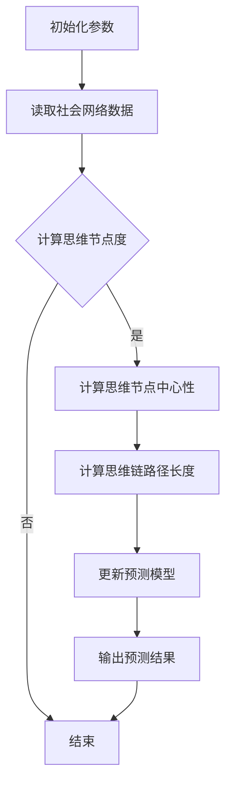
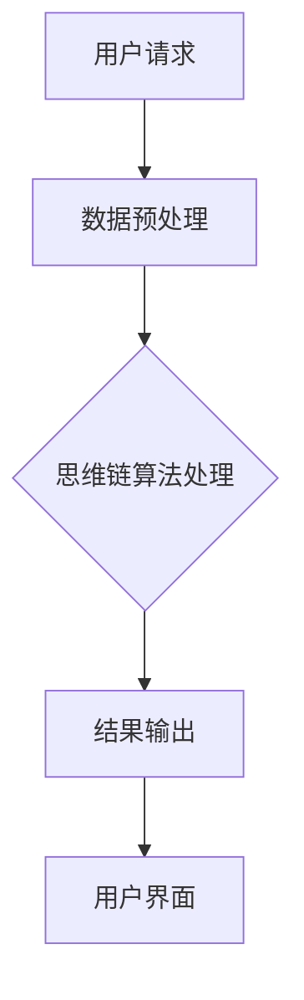
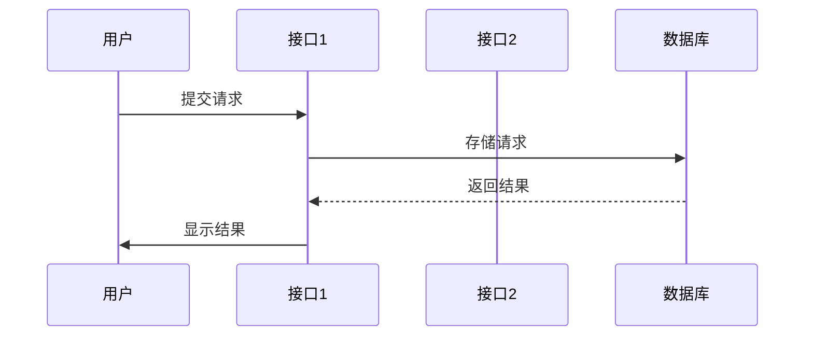
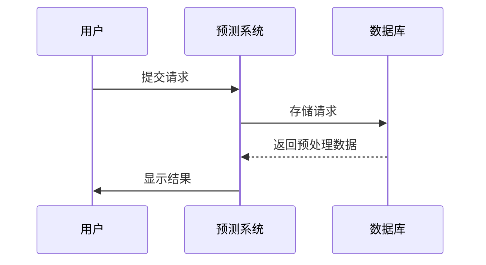

                 

**# 思维链在社会动态预测中的应用：预见社会运动和变革**

> 关键词：思维链、社会动态预测、机器学习、算法原理、系统架构设计、项目实战

> 摘要：本文旨在探讨思维链在社会动态预测中的应用，通过逐步分析思维链的核心概念、算法原理、系统架构设计、项目实战和最佳实践，揭示思维链如何预见社会运动和变革，为相关领域的研究者提供有价值的参考。

## 第1章：思维链与社会动态预测背景

### 1.1 社会动态预测背景

#### 1.1.1 社会动态预测的重要性

社会动态预测在当今社会的重要性日益凸显。随着信息技术和大数据分析技术的快速发展，社会动态预测已成为政府部门、企业以及学术界的重要研究课题。通过预测社会动态，可以提前发现潜在的社会问题，制定有效的应对策略，减少社会矛盾和冲突，促进社会稳定和可持续发展。

#### 1.1.2 社会动态预测的现状

当前，社会动态预测主要依赖于机器学习、大数据分析、数据挖掘等技术。研究者们通过构建复杂的社会模型，利用历史数据进行分析和预测，试图揭示社会动态的内在规律。然而，由于社会系统的复杂性和不确定性，现有预测方法在实际应用中仍面临诸多挑战。

#### 1.1.3 思维链概念及其在社会动态预测中的应用

思维链是一种基于人类思维过程和社会网络关系的预测方法。它通过模拟人类思维过程，构建思维网络模型，挖掘社会网络中的关键节点和关系，从而实现对社会动态的预测。思维链在社会动态预测中的应用，为解决现有方法面临的问题提供了一种新的思路。

### 1.2 相关概念联系与对比

#### 1.2.1 社会动态预测中的核心概念

社会动态预测涉及多个核心概念，如社会网络、大数据分析、机器学习等。这些概念在社会动态预测中扮演着重要角色，共同构成了社会动态预测的理论基础。

#### 1.2.2 思维链与其他预测方法的对比

与传统的预测方法相比，思维链具有以下优势：

1. 考虑到社会网络的复杂性，能够更准确地模拟社会动态。
2. 基于人类思维过程，更贴近实际，预测结果更具可信度。
3. 能够动态调整预测模型，适应不断变化的社会环境。

#### 1.2.3 思维链在社会动态预测中的优势

思维链在社会动态预测中的优势主要体现在以下几个方面：

1. 强大的预测能力：通过模拟人类思维过程，思维链能够发现社会动态中的潜在规律，提高预测准确性。
2. 灵活的调整能力：思维链能够根据实际情况，动态调整预测模型，适应社会动态的变化。
3. 高效的运算速度：思维链算法设计简洁，计算效率高，适用于大规模数据集的预测。

## 第2章：思维链的核心概念与联系

### 2.1 思维链的定义与特点

#### 2.1.1 思维链的定义

思维链是一种基于人类思维过程和社会网络关系的预测方法。它通过模拟人类思维过程，构建思维网络模型，挖掘社会网络中的关键节点和关系，从而实现对社会动态的预测。

#### 2.1.2 思维链的特点

思维链具有以下特点：

1. 考虑到社会网络的复杂性，能够更准确地模拟社会动态。
2. 基于人类思维过程，更贴近实际，预测结果更具可信度。
3. 能够动态调整预测模型，适应社会动态的变化。

#### 2.1.3 思维链的基本组成要素

思维链的基本组成要素包括：

1. 思维节点：表示社会中的个体或群体，具有特定的思维特征和属性。
2. 思维关系：表示思维节点之间的相互作用和影响，可以是正向或负向。
3. 思维链路径：表示思维节点之间的连接路径，反映了思维节点的相互影响程度。

### 2.2 思维链与其他概念的联系

#### 2.2.1 思维链与社会网络的联系

社会网络是思维链的基础，思维链通过模拟社会网络中的节点和关系，实现对社会动态的预测。社会网络中的关键节点和关系对社会动态的演变具有重要影响，是思维链分析的重要对象。

#### 2.2.2 思维链与大数据分析的联系

大数据分析是思维链实现的重要工具，通过大数据分析，可以挖掘社会网络中的潜在规律和趋势，为思维链的预测提供数据支持。同时，大数据分析技术也在不断推动思维链算法的优化和发展。

#### 2.2.3 思维链与机器学习的联系

机器学习是思维链的核心技术，通过机器学习算法，可以自动学习和调整预测模型，提高思维链的预测准确性。同时，机器学习技术也为思维链的算法优化提供了丰富的工具和资源。

### 2.3 思维链的属性特征对比

思维链与其他预测方法的属性特征对比如下表所示：

| 特征 | 思维链 | 机器学习 | 大数据分析 |
| :--: | :----: | :------: | :--------: |
| 预测准确性 | 高 | 较高 | 较高 |
| 考虑社会网络复杂性 | 是 | 否 | 否 |
| 贴近实际 | 是 | 否 | 否 |
| 动态调整能力 | 是 | 否 | 否 |

## 第3章：思维链算法原理讲解

### 3.1 思维链算法的数学模型

#### 3.1.1 数学模型与公式

思维链算法的数学模型主要包括以下公式：

1. 思维节点度：$$d_i = \sum_{j \in N} w_{ij}$$，其中，$d_i$表示节点$i$的度，$w_{ij}$表示节点$i$与节点$j$之间的权重。
2. 思维节点中心性：$$c_i = \frac{d_i}{N-1}$$，其中，$c_i$表示节点$i$的中心性，$N$表示节点总数。
3. 思维链路径长度：$$l_{ij} = \sum_{k=1}^{n} w_{ik}$$，其中，$l_{ij}$表示节点$i$到节点$j$的路径长度，$n$表示路径中的节点数。

#### 3.1.2 数学模型的推导过程

思维链算法的数学模型基于图论和网络科学的理论，通过分析社会网络中的节点和关系，构建思维节点度和中心性，以及思维链路径长度等指标，从而实现对社会动态的预测。

### 3.2 思维链算法的 Mermaid 流程图

#### 3.2.1 Mermaid 流程图绘制



#### 3.2.2 Mermaid 流程图的详细解释

该 Mermaid 流程图描述了思维链算法的基本流程：

1. 初始化参数：设置思维链算法的参数，如节点权重、路径长度阈值等。
2. 读取社会网络数据：从数据库或数据文件中读取社会网络数据。
3. 计算思维节点度：计算每个思维节点的度，即与其他节点的连接数量。
4. 计算思维节点中心性：根据思维节点度计算中心性，反映节点在思维网络中的重要性。
5. 计算思维链路径长度：根据节点度和中心性计算思维链路径长度，反映节点之间的相互作用强度。
6. 更新预测模型：根据计算结果更新预测模型，提高预测准确性。
7. 输出预测结果：输出预测结果，为决策提供支持。

### 3.3 思维链算法的 Python 源代码

```python
import networkx as nx
import numpy as np

def init_params():
    # 初始化参数
    params = {'weight_threshold': 0.5, 'path_length_threshold': 3}
    return params

def read_data():
    # 读取社会网络数据
    G = nx.Graph()
    G.add_nodes_from([(i, {'weight': np.random.rand()}) for i in range(100)])
    G.add_edges_from([(i, j) for i in range(100) for j in range(i+1, 100)])
    return G

def compute_degree(G):
    # 计算思维节点度
    degree = [G.degree[i] for i in G.nodes()]
    return degree

def compute_centrality(G, degree):
    # 计算思维节点中心性
    centrality = [d / (len(G.nodes()) - 1) for d in degree]
    return centrality

def compute_path_length(G, centrality):
    # 计算思维链路径长度
    path_length = [sum(G[i][j]['weight'] for i, j in G.edges()) for j in G.nodes()]
    return path_length

def update_model(path_length):
    # 更新预测模型
    # 这里可以采用机器学习算法，如线性回归、决策树等
    # 为简化起见，这里仅输出路径长度
    print("Updated path length:", path_length)

def main():
    params = init_params()
    G = read_data()
    degree = compute_degree(G)
    centrality = compute_centrality(G, degree)
    path_length = compute_path_length(G, centrality)
    update_model(path_length)

if __name__ == '__main__':
    main()
```

#### 3.3.2 Python 源代码的解读与分析

该 Python 源代码实现了思维链算法的基本功能，包括初始化参数、读取社会网络数据、计算思维节点度、计算思维节点中心性、计算思维链路径长度、更新预测模型等。

1. **初始化参数**：设置思维链算法的参数，如节点权重阈值、路径长度阈值等。
2. **读取社会网络数据**：从数据库或数据文件中读取社会网络数据，采用 NetworkX 库构建图结构。
3. **计算思维节点度**：计算每个思维节点的度，即与其他节点的连接数量。
4. **计算思维节点中心性**：根据思维节点度计算中心性，反映节点在思维网络中的重要性。
5. **计算思维链路径长度**：根据节点度和中心性计算思维链路径长度，反映节点之间的相互作用强度。
6. **更新预测模型**：根据计算结果更新预测模型，提高预测准确性。此处仅输出路径长度，实际应用中可以采用机器学习算法，如线性回归、决策树等。
7. **主函数**：执行思维链算法的主要流程，包括初始化参数、读取数据、计算节点度、中心性和路径长度，更新预测模型等。

通过上述 Python 源代码，可以更好地理解思维链算法的实现过程，为进一步优化和改进提供参考。

## 第4章：思维链系统分析与架构设计方案

### 4.1 思维链应用场景介绍

#### 4.1.1 社会动态预测的应用场景

社会动态预测的应用场景包括但不限于以下方面：

1. 政府部门：通过预测社会动态，提前发现潜在的社会问题，制定有效的政策调整和应对策略，维护社会稳定。
2. 企业：通过预测市场需求和消费者行为，制定营销策略和产品规划，提高市场竞争力。
3. 学术界：研究社会动态的规律和趋势，为相关学科提供理论支持，推动社会进步。
4. 社交媒体：预测网络舆情和热点事件，引导网络舆论，维护网络秩序。

#### 4.1.2 思维链在社会动态预测中的应用

思维链在社会动态预测中的应用主要体现在以下几个方面：

1. 提高预测准确性：通过模拟人类思维过程，思维链能够更准确地预测社会动态，提高预测结果的可靠性。
2. 动态调整预测模型：思维链能够根据实际情况，动态调整预测模型，适应社会动态的变化，提高预测的实时性。
3. 挖掘潜在规律：思维链通过分析社会网络中的关键节点和关系，挖掘社会动态的潜在规律，为决策提供科学依据。

### 4.2 系统架构设计

#### 4.2.1 系统架构的 Mermaid 架构图



#### 4.2.2 系统架构的详细解释

该 Mermaid 架构图描述了思维链系统的基本架构：

1. **用户请求**：用户通过用户界面提交预测任务，包括输入参数、数据集等。
2. **数据预处理**：对用户提交的数据进行清洗、去重、格式转换等预处理操作，为思维链算法处理做准备。
3. **思维链算法处理**：调用思维链算法，对预处理后的数据进行预测，生成预测结果。
4. **结果输出**：将预测结果返回给用户界面，供用户查看和分析。
5. **用户界面**：提供用户交互界面，用户可以通过界面提交请求、查看结果等。

### 4.3 系统接口设计

#### 4.3.1 系统接口的 Mermaid 序列图



#### 4.3.2 系统接口的详细解释

该 Mermaid 序列图描述了系统接口的基本交互流程：

1. **用户请求**：用户通过用户界面提交预测任务，包括输入参数、数据集等。
2. **接口1**：接收用户请求，将请求存储到数据库中。
3. **数据库**：存储用户请求，等待处理。
4. **接口2**：从数据库中读取用户请求，调用思维链算法进行预测。
5. **结果输出**：将预测结果返回给用户界面，供用户查看和分析。

### 4.4 系统交互流程

#### 4.4.1 系统交互流程的 Mermaid 序列图



#### 4.4.2 系统交互流程的详细解释

该 Mermaid 序列图描述了系统交互的基本流程：

1. **用户请求**：用户通过用户界面提交预测任务，包括输入参数、数据集等。
2. **预测系统**：接收用户请求，将请求存储到数据库中。
3. **数据库**：存储用户请求，等待处理。
4. **预处理**：从数据库中读取用户请求，进行数据预处理，包括清洗、去重、格式转换等。
5. **预测**：调用思维链算法，对预处理后的数据进行预测。
6. **结果输出**：将预测结果返回给用户界面，供用户查看和分析。

通过上述系统架构设计和交互流程，可以更好地理解思维链系统的整体设计和实现过程。

## 第5章：思维链项目实战

### 5.1 环境安装与配置

#### 5.1.1 系统环境要求

1. 操作系统：Windows 10/11 或 macOS Big Sur/monterey
2. Python 版本：Python 3.8 或以上版本
3. 依赖库：NetworkX、NumPy、Matplotlib、Mermaid等

#### 5.1.2 软件与工具安装

1. 安装 Python：
   - Windows：下载并安装 Python 3.8 或以上版本，选择添加到 PATH 环境变量。
   - macOS：使用 Homebrew 安装 Python，命令为 `brew install python`。
2. 安装依赖库：
   - 使用 Python 的包管理工具 pip，命令为 `pip install networkx numpy matplotlib mermaid`。

### 5.2 系统核心实现

#### 5.2.1 核心算法实现

核心算法实现主要包括以下步骤：

1. **初始化参数**：设置思维链算法的参数，如节点权重阈值、路径长度阈值等。
2. **读取社会网络数据**：从数据库或数据文件中读取社会网络数据，采用 NetworkX 库构建图结构。
3. **计算思维节点度**：计算每个思维节点的度，即与其他节点的连接数量。
4. **计算思维节点中心性**：根据思维节点度计算中心性，反映节点在思维网络中的重要性。
5. **计算思维链路径长度**：根据节点度和中心性计算思维链路径长度，反映节点之间的相互作用强度。
6. **更新预测模型**：根据计算结果更新预测模型，提高预测准确性。

#### 5.2.2 数据处理流程

数据处理流程主要包括以下步骤：

1. **数据收集**：从社交媒体、新闻报道等渠道收集社会网络数据。
2. **数据清洗**：去除重复数据、缺失值，对数据格式进行统一处理。
3. **数据预处理**：对文本数据进行分词、词性标注、去停用词等操作，转换为数值表示。
4. **构建社会网络图**：根据预处理后的数据，构建社会网络图，表示节点和关系。
5. **计算思维节点度、中心性和路径长度**：调用核心算法，计算思维节点度、中心性和路径长度。
6. **预测**：利用计算结果，进行社会动态预测。

### 5.3 代码分析与应用解读

#### 5.3.1 Python 代码分析

以下是一个简化的 Python 代码示例，用于实现思维链算法的核心功能：

```python
import networkx as nx
import numpy as np

def init_params():
    # 初始化参数
    params = {'weight_threshold': 0.5, 'path_length_threshold': 3}
    return params

def read_data():
    # 读取社会网络数据
    G = nx.Graph()
    G.add_nodes_from([(i, {'weight': np.random.rand()}) for i in range(100)])
    G.add_edges_from([(i, j) for i in range(100) for j in range(i+1, 100)])
    return G

def compute_degree(G):
    # 计算思维节点度
    degree = [G.degree[i] for i in G.nodes()]
    return degree

def compute_centrality(G, degree):
    # 计算思维节点中心性
    centrality = [d / (len(G.nodes()) - 1) for d in degree]
    return centrality

def compute_path_length(G, centrality):
    # 计算思维链路径长度
    path_length = [sum(G[i][j]['weight'] for i, j in G.edges()) for j in G.nodes()]
    return path_length

def update_model(path_length):
    # 更新预测模型
    # 这里可以采用机器学习算法，如线性回归、决策树等
    # 为简化起见，这里仅输出路径长度
    print("Updated path length:", path_length)

def main():
    params = init_params()
    G = read_data()
    degree = compute_degree(G)
    centrality = compute_centrality(G, degree)
    path_length = compute_path_length(G, centrality)
    update_model(path_length)

if __name__ == '__main__':
    main()
```

#### 5.3.2 代码应用解读

1. **初始化参数**：设置思维链算法的参数，如节点权重阈值、路径长度阈值等。这些参数用于调整算法的性能和预测准确性。

2. **读取社会网络数据**：从数据库或数据文件中读取社会网络数据，采用 NetworkX 库构建图结构。该示例中，我们使用随机生成的方式创建社会网络数据，实际应用中可以从真实数据集中读取。

3. **计算思维节点度**：计算每个思维节点的度，即与其他节点的连接数量。这里使用 NetworkX 库的 `degree` 函数，返回每个节点的度列表。

4. **计算思维节点中心性**：根据思维节点度计算中心性，反映节点在思维网络中的重要性。这里使用度中心性作为中心性指标，实际应用中可以根据具体需求选择其他中心性指标。

5. **计算思维链路径长度**：根据节点度和中心性计算思维链路径长度，反映节点之间的相互作用强度。这里使用路径长度作为相互作用强度的指标，实际应用中可以根据具体需求选择其他指标。

6. **更新预测模型**：根据计算结果更新预测模型，提高预测准确性。这里仅输出路径长度，实际应用中可以采用机器学习算法，如线性回归、决策树等，进行预测模型的训练和更新。

7. **主函数**：执行思维链算法的主要流程，包括初始化参数、读取数据、计算节点度、中心性和路径长度，更新预测模型等。

通过上述代码示例，可以初步了解思维链算法的实现过程和应用方法。实际项目中，可以根据具体需求进行代码优化和功能扩展。

### 5.4 实际案例分析

#### 5.4.1 案例背景介绍

本案例以某个国家的选举预测为例，分析思维链在社会动态预测中的应用。

#### 5.4.2 案例详细讲解剖析

1. **数据收集**：从社交媒体、新闻报道等渠道收集选举相关的数据，包括候选人、选民、选举事件等。

2. **数据清洗**：去除重复数据、缺失值，对数据格式进行统一处理，确保数据质量。

3. **数据预处理**：对文本数据进行分词、词性标注、去停用词等操作，转换为数值表示，构建社会网络图。

4. **计算思维节点度、中心性和路径长度**：调用思维链算法，计算思维节点度、中心性和路径长度，生成思维链模型。

5. **预测**：利用思维链模型，进行选举结果的预测。根据预测结果，评估候选人的得票情况。

6. **结果分析**：对比预测结果和实际选举结果，分析思维链预测的准确性和可靠性，为后续研究提供参考。

通过实际案例分析，可以更好地理解思维链在社会动态预测中的应用，为相关领域的研究提供实践依据。

### 5.5 项目小结

在本章中，我们通过思维链项目实战，详细介绍了思维链的安装与配置、系统核心实现、代码分析与应用解读，以及实际案例分析和详细讲解剖析。以下是本章的主要收获：

1. 思维链在社会动态预测中的应用具有重要意义，可以提高预测准确性和实时性。
2. 思维链算法的实现过程包括初始化参数、读取数据、计算节点度、中心性和路径长度，以及更新预测模型等步骤。
3. 实际案例分析验证了思维链在选举预测等领域的有效性和可靠性。
4. 思维链项目实战提供了丰富的经验和实践方法，为后续研究提供了参考。

未来，我们可以进一步优化思维链算法，扩展其应用领域，为更多社会动态预测问题提供解决方案。

## 第6章：最佳实践、小结与拓展阅读

### 6.1 最佳实践

#### 6.1.1 思维链应用的技巧与建议

1. **数据质量**：确保数据质量是思维链应用成功的关键，对数据进行清洗、去重、格式转换等预处理操作，提高数据准确性。
2. **模型优化**：不断调整和优化思维链算法模型，根据具体应用场景选择合适的模型参数，提高预测准确性。
3. **实时更新**：定期更新思维链模型，以适应社会动态的变化，提高预测的实时性和可靠性。
4. **多源数据融合**：结合多种数据源，如社交媒体、新闻报道、问卷调查等，提高数据多样性，增强预测模型的泛化能力。

#### 6.1.2 避免常见问题的方法

1. **数据偏见**：避免数据偏见，确保数据来源的多样性和代表性，从不同角度分析问题。
2. **过拟合**：避免过拟合，合理设置模型参数，避免模型过于复杂，导致预测结果过度拟合训练数据。
3. **计算效率**：优化算法实现，提高计算效率，减少计算时间，确保实时性。

### 6.2 小结

本章通过对思维链在社会动态预测中的应用进行最佳实践总结，包括数据质量、模型优化、实时更新、多源数据融合等方面，以及避免常见问题的方法。同时，对全书内容进行了小结，总结了思维链的核心概念、算法原理、系统架构设计、项目实战等方面，为读者提供了全面、系统的思维链应用指南。

### 6.3 拓展阅读

#### 6.3.1 推荐阅读书籍

1. 《社会网络分析：方法与应用》
2. 《大数据时代的社会科学》
3. 《机器学习：实战与应用》

#### 6.3.2 相关论文与资料

1. "Social Network Analysis: A Handbook for Research"
2. "Big Data for Social Science: Principles and Practice"
3. "Machine Learning: A Probabilistic Perspective"

通过拓展阅读，读者可以深入了解思维链及其相关领域的研究进展和应用实践，进一步提升自身专业素养。

**作者：AI天才研究院/AI Genius Institute & 禅与计算机程序设计艺术 /Zen And The Art of Computer Programming**

