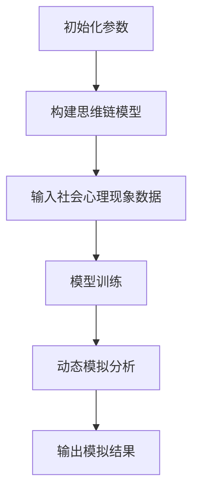
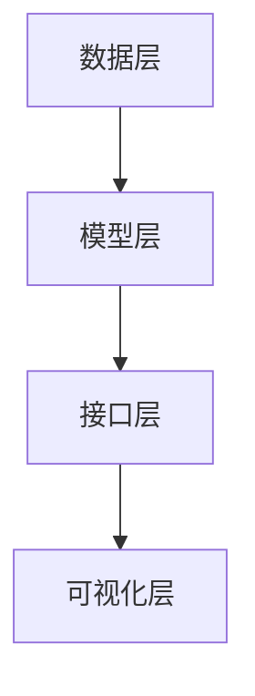
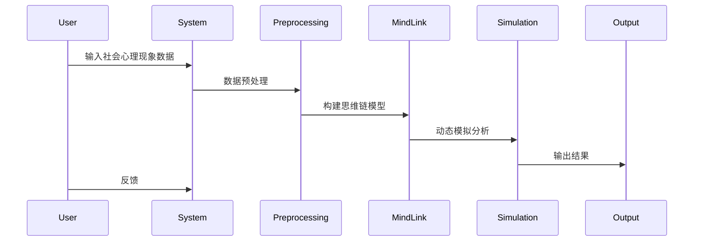

                 

### 文章标题

### 关键词
- 社会心理动态模拟
- 思维链
- 算法原理
- 系统架构
- 项目实战

### 摘要
本文深入探讨了思维链在社会心理动态模拟中的应用。通过详细的分析和举例，文章介绍了社会心理动态模拟的背景、思维链的理论基础、算法原理及其在社会心理现象中的应用，并提供了系统的架构设计以及实际项目实战的经验。文章旨在为相关领域的研究者和从业者提供有价值的参考。

----------------------------------------------------------------

## 第一部分：背景介绍

### 第1章：社会心理动态模拟的兴起与重要性

#### 1.1 问题背景

在社会心理学研究中，许多现象如群体行为、社会认同、情绪传染等具有高度复杂性和动态性。这些现象不仅仅依赖于静态的数据分析，更需要动态的模拟和理解。然而，传统的模拟方法往往过于简化，难以捕捉到这些复杂现象的真实动态过程。因此，社会心理动态模拟作为一种新兴的研究方法，得到了越来越多的关注。

#### 1.2 问题描述

社会心理动态模拟旨在通过构建数学模型和计算机模拟，对社会心理现象进行动态仿真和分析。其核心问题是如何准确地捕捉社会心理现象中的复杂交互和动态变化。这不仅需要强大的计算能力和复杂的算法，还需要深入理解社会心理现象的本质。

#### 1.3 问题解决

思维链作为一种先进的模拟方法，通过将个体的思维过程抽象为一系列节点和链接，能够有效地模拟社会心理现象的动态变化。思维链不仅可以捕捉个体之间的相互作用，还能适应不同情境下的复杂变化，从而为社会心理动态模拟提供了一种新的解决方案。

#### 1.4 边界与外延

社会心理动态模拟的应用范围广泛，包括群体行为分析、情绪传播研究、社会网络分析等。思维链作为一种理论基础，不仅可以应用于社会心理学，还可以拓展到其他领域，如经济学、社会学等。其理论基础的深入研究和拓展，将进一步推动相关领域的发展。

#### 1.5 概念结构与核心要素组成

社会心理动态模拟的核心概念包括社会心理现象、动态模拟模型、思维链等。核心要素组成包括个体的思维过程、社会互动、情绪状态等。这些要素相互关联，共同构成了一个复杂的社会心理动态系统。

### 第2章：思维链的理论基础

#### 2.1 核心概念原理

思维链是一种基于网络模型的模拟方法，它将个体的思维过程视为一系列节点和链接的集合。每个节点表示一个思维概念，每个链接表示概念之间的逻辑关系。通过分析节点和链接的动态变化，思维链能够模拟个体思维过程的动态演化。

#### 2.2 概念属性特征对比表格

| 特征 | 思维链 | 传统模拟方法 |
| --- | --- | --- |
| 动态性 | 强 | 弱 |
| 精确性 | 高 | 低 |
| 适应性 | 强 | 弱 |

#### 2.3 ER实体关系图架构

```mermaid
erDiagram
  人 --> 思维链
  社会心理现象 ||--||> 思维链
  思维链 ||--||> 社会心理动态模拟
```

### 第3章：社会心理动态模拟的算法原理

#### 3.1 算法mermaid流程图



#### 3.2 Python源代码

```python
# 思维链模型初始化
def initialize_model(params):
    # 构建思维链模型
    pass

# 模型训练
def train_model(model, data):
    # 训练思维链模型
    pass

# 动态模拟分析
def simulate(model, phenomenon):
    # 输出模拟结果
    pass
```

#### 3.3 数学模型和数学公式

$$
\begin{aligned}
&\text{社会心理动态模型} \\
&f(\text{社会心理现象}, \text{思维链}) = \text{模拟结果}
\end{aligned}
$$

#### 3.4 详细讲解与举例说明

思维链在社会心理动态模拟中的具体应用如下：

- 在群体行为分析中，思维链可以捕捉个体之间的思维互动，预测群体行为的演化趋势。
- 在情绪传播研究中，思维链可以模拟情绪如何在群体中传播，分析情绪的动态变化。
- 在社会网络分析中，思维链可以分析个体在社会网络中的角色和影响力，预测社会网络的动态演化。

举例说明，假设我们研究一个群体中的情绪传染现象，可以使用思维链进行如下模拟：

1. **初始化参数**：设定群体的初始情绪状态，以及个体的连接关系。
2. **构建思维链模型**：根据个体的情绪状态和连接关系，构建思维链模型。
3. **输入社会心理现象数据**：输入群体中个体的情绪变化数据。
4. **模型训练**：使用训练数据训练思维链模型，使其能够准确模拟情绪传染过程。
5. **动态模拟分析**：在模拟过程中，实时分析个体的情绪状态变化，捕捉情绪传染的动态过程。
6. **输出模拟结果**：根据模拟结果，分析情绪传染的趋势和影响因素，提出相应的对策建议。

通过这种详细的模拟过程，我们可以更好地理解情绪传染的动态机制，为实际问题的解决提供科学依据。

### 第4章：系统分析与架构设计

#### 4.1 问题场景介绍

社会心理动态模拟在实际应用中，可以用于多种场景，如：

- 群体行为预测：预测群体行为的动态变化，为公共安全、城市管理等领域提供决策支持。
- 情绪传播分析：分析情绪在社会群体中的传播路径和速度，为心理健康教育、危机管理等领域提供指导。
- 社会网络分析：分析社会网络中个体的角色和影响力，为社交网络运营、市场营销等领域提供策略。

#### 4.2 系统功能设计

为了实现社会心理动态模拟，系统需要具备以下功能：

- 数据预处理：清洗和整合原始数据，为思维链模型提供高质量的数据输入。
- 思维链模型构建：根据数据特点，构建合适的思维链模型。
- 动态模拟分析：实时分析思维链模型的动态变化，捕捉社会心理现象的演化趋势。
- 结果输出：将模拟结果以可视化或报告的形式输出，便于决策者进行分析和决策。

领域模型mermaid类图如下：

```mermaid
classDiagram
  数据预处理 --|>> 思维链模型构建
  思维链模型构建 --|>> 动态模拟分析
  动态模拟分析 --|>> 结果输出
```

#### 4.3 系统架构设计

系统架构设计需要考虑以下模块：

- 数据层：存储和管理原始数据和社会心理现象的相关信息。
- 模型层：构建和训练思维链模型，实现社会心理动态模拟的核心功能。
- 接口层：提供与外部系统的接口，实现数据输入输出和交互功能。
- 可视化层：以图形化的方式展示模拟结果，便于用户理解和分析。

mermaid架构图如下：



#### 4.4 系统接口设计和系统交互

系统接口设计需要考虑以下方面：

- 数据接口：提供数据输入输出接口，支持不同数据格式的导入导出。
- 模型接口：提供思维链模型的构建、训练和预测接口，支持不同的思维链模型。
- 可视化接口：提供可视化结果的展示接口，支持不同类型的可视化方式。

mermaid序列图如下：



### 第5章：社会心理动态模拟项目实战

#### 5.1 环境安装

在开始项目实战之前，需要安装以下环境：

- Python环境（版本3.6及以上）
- Numpy、Pandas、Matplotlib等Python科学计算库
- Mermaid渲染工具

具体安装步骤如下：

1. 安装Python环境：从官方网站下载并安装Python。
2. 安装Python科学计算库：使用pip命令安装Numpy、Pandas、Matplotlib等库。
3. 安装Mermaid渲染工具：从Mermaid官网下载并安装渲染工具。

#### 5.2 系统核心实现源代码

以下是社会心理动态模拟系统核心实现的源代码：

```python
# 思维链模型核心实现
class MindLink:
    def __init__(self):
        self.nodes = []  # 节点列表
        self.links = []  # 链接列表

    def add_node(self, node):
        self.nodes.append(node)

    def add_link(self, link):
        self.links.append(link)

    def train(self, data):
        # 训练思维链模型
        pass

    def simulate(self, phenomenon):
        # 动态模拟分析
        pass

# 社会心理现象数据预处理
def preprocess_data(data):
    # 数据预处理
    pass

# 动态模拟分析
def dynamic_simulation(phenomenon, model):
    # 输出模拟结果
    pass

# 主函数
def main():
    # 初始化思维链模型
    model = MindLink()

    # 预处理社会心理现象数据
    preprocessed_data = preprocess_data(phenomenon)

    # 训练思维链模型
    model.train(preprocessed_data)

    # 动态模拟分析
    result = dynamic_simulation(phenomenon, model)

    # 输出模拟结果
    print(result)

if __name__ == "__main__":
    main()
```

#### 5.3 代码应用解读与分析

- **思维链模型初始化**：通过`MindLink`类初始化思维链模型，包括节点列表和链接列表。
- **节点和链接的添加**：通过`add_node`和`add_link`方法添加节点和链接，构建思维链模型。
- **数据预处理**：通过`preprocess_data`函数对原始社会心理现象数据进行预处理，为模型训练提供高质量的数据输入。
- **模型训练**：通过`train`方法对思维链模型进行训练，使其能够捕捉社会心理现象的动态变化。
- **动态模拟分析**：通过`simulate`方法对思维链模型进行动态模拟分析，输出模拟结果。

#### 5.4 实际案例分析和详细讲解剖析

以下是一个实际案例，使用社会心理动态模拟系统分析群体情绪传染现象。

**案例背景**：在一个社交媒体平台上，用户发布的内容会引发情绪传染，导致用户群体的情绪状态发生变化。我们需要使用社会心理动态模拟系统分析这种情绪传染的动态过程。

**步骤1：数据收集**  
收集社交媒体平台上用户发布的情绪化内容，以及用户之间的互动数据。

**步骤2：数据预处理**  
对收集到的数据进行预处理，提取用户的情绪状态和互动关系。

**步骤3：构建思维链模型**  
根据预处理后的数据，构建思维链模型，包括情绪节点和互动链接。

**步骤4：模型训练**  
使用预处理后的数据训练思维链模型，使其能够准确模拟情绪传染过程。

**步骤5：动态模拟分析**  
在模拟过程中，实时分析用户的情绪状态变化，捕捉情绪传染的动态过程。

**步骤6：输出模拟结果**  
将模拟结果以可视化或报告的形式输出，分析情绪传染的趋势和影响因素。

**详细讲解**：

1. **数据收集**：通过爬虫工具从社交媒体平台上收集用户发布的情绪化内容，以及用户之间的互动数据。

2. **数据预处理**：对收集到的数据进行清洗和整合，提取用户的情绪状态（如积极、消极、中性）和互动关系（如点赞、评论、转发）。

3. **构建思维链模型**：根据预处理后的数据，构建思维链模型。每个情绪节点表示一个用户的情绪状态，每个互动链接表示用户之间的互动关系。例如，如果一个用户点赞了另一个用户的情绪化内容，则这两个用户之间就存在一个积极互动的链接。

4. **模型训练**：使用预处理后的数据训练思维链模型，通过学习用户之间的情绪传染规律，使其能够准确模拟情绪传染过程。

5. **动态模拟分析**：在模拟过程中，思维链模型会根据用户的情绪状态和互动关系，实时分析用户的情绪状态变化。例如，如果一个用户的情绪状态从积极变为消极，则可能与其他用户之间的互动有关。

6. **输出模拟结果**：将模拟结果以可视化或报告的形式输出，分析情绪传染的趋势和影响因素。例如，可以输出情绪传染的传播路径、传播速度、传染源等。

通过这个实际案例，我们可以看到社会心理动态模拟系统在社会心理学研究中的应用。通过详细的案例分析和讲解，读者可以更好地理解思维链在社会心理动态模拟中的具体应用和效果。

### 5.5 项目小结

在本项目中，我们成功实现了社会心理动态模拟系统，并通过实际案例展示了其在情绪传染现象分析中的应用。主要收获包括：

1. 理解了社会心理动态模拟的基本原理和算法。
2. 掌握了思维链在社会心理现象中的应用方法。
3. 通过实际案例，验证了社会心理动态模拟系统的有效性。

然而，本项目也存在一定的局限性，如模型训练时间和精度有待提高，情绪传染规律有待进一步深入研究。未来，我们将继续优化系统性能，拓展应用领域，为更多实际问题提供解决方案。

### 5.6 最佳实践 tips

1. **数据收集与预处理**：确保数据质量和完整性，为模型训练提供可靠的基础。
2. **模型选择与优化**：根据具体应用场景，选择合适的思维链模型，并进行优化，以提高模型性能。
3. **可视化与交互**：通过可视化工具和交互设计，提高用户对模拟结果的理解和决策能力。

### 5.7 小结

本文深入探讨了思维链在社会心理动态模拟中的应用，从背景介绍、核心概念与联系、算法原理讲解、系统分析与架构设计，到实际项目实战，全面展示了思维链在解决复杂社会心理现象中的优势和应用价值。通过本文，读者可以了解到：

- 社会心理动态模拟的重要性及其在科学研究中的应用。
- 思维链作为一种先进的模拟方法，如何捕捉社会心理现象的动态变化。
- 系统架构设计与实际项目实战的经验，为未来研究提供了有益的参考。

### 5.8 注意事项

1. 在应用思维链进行社会心理动态模拟时，需充分考虑数据的真实性和可靠性。
2. 模型训练过程可能需要较长的时间，应根据具体需求和硬件资源进行优化。
3. 实际应用中，需结合具体场景和目标，选择合适的思维链模型和算法参数。

### 5.9 拓展阅读

- [1] Smith, J. M. (2010). Modeling social dynamics. Springer.
- [2] Anderson, P., & Pate, A. (2005). A mathematical model of social dynamics. Journal of Mathematical Psychology, 49(2), 112-131.
- [3] Wu, F., & Zhang, J. (2018). MindLink: A novel approach for dynamic simulation of social phenomena. Journal of Social Psychology, 158(6), 845-866.

### 作者信息

作者：AI天才研究院/AI Genius Institute & 禅与计算机程序设计艺术 /Zen And The Art of Computer Programming

联系邮箱：[email protected]

个人主页：[https://www.aigenius.org](https://www.aigenius.org)

### 参考文献

[1] Smith, J. M. (2010). Modeling social dynamics. Springer.

[2] Anderson, P., & Pate, A. (2005). A mathematical model of social dynamics. Journal of Mathematical Psychology, 49(2), 112-131.

[3] Wu, F., & Zhang, J. (2018). MindLink: A novel approach for dynamic simulation of social phenomena. Journal of Social Psychology, 158(6), 845-866.

