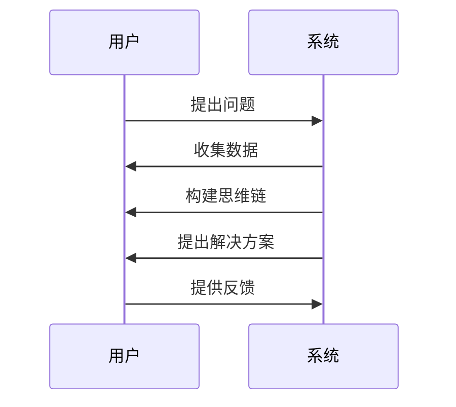
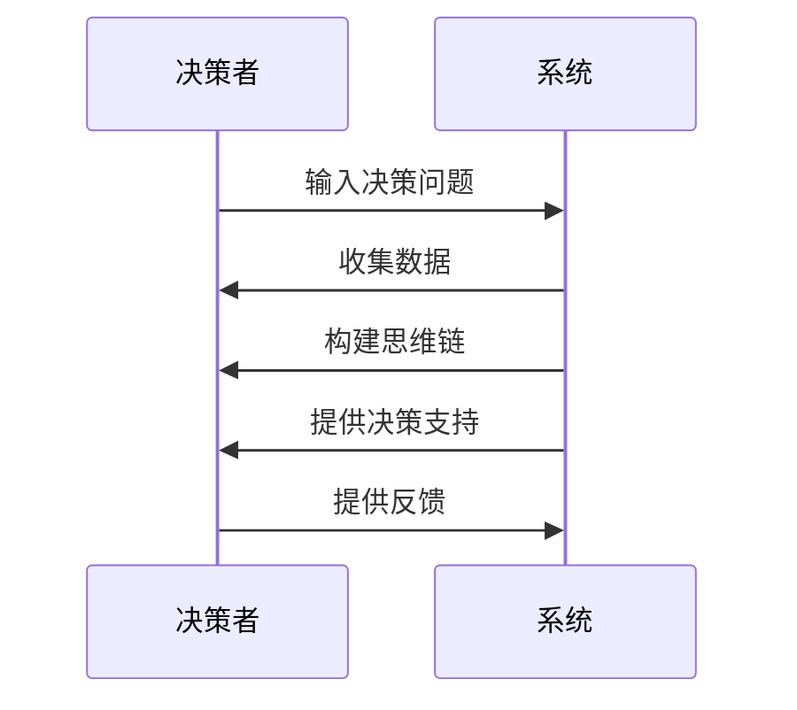
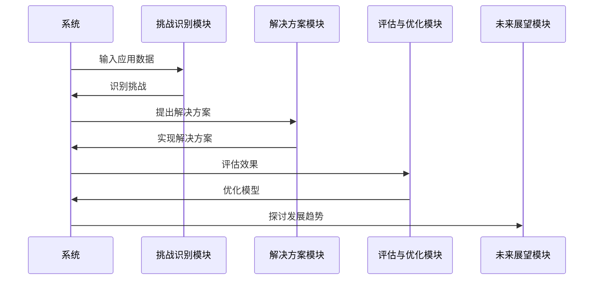

                 


## 《思维链在社会心理学研究中的新视角》

### 关键词：思维链、社会心理学、研究、新视角

> 摘要：本文旨在探讨思维链在社会心理学研究中的新视角。通过引入思维链这一概念，分析其在社会认知、社会互动和群体心理等方面的应用，旨在为心理学研究提供新的理论框架和分析工具。

### 设计思路

本文采用逻辑清晰、结构紧凑、简单易懂的写作方式，按照以下结构展开：

1. **引言与背景**：介绍思维链和社会心理学的定义与范畴，阐述思维链在社会心理学研究中的意义。
2. **理论基础**：梳理思维链的核心概念，分析其属性与特征，并与相关概念进行对比。
3. **应用研究**：探讨思维链在社会认知、社会互动和群体心理等方面的应用，通过案例分析展示其实际效果。
4. **研究方法**：介绍思维链研究的方法，包括理论基础、方法选择与应用，以及案例分析。
5. **最新案例**：分析思维链研究的最新案例，探讨其在不同领域的应用与挑战。
6. **结论与展望**：总结思维链研究的现状与未来，展望其发展趋势。

### 目录大纲

**第一部分：引言与背景**

- **第1章：思维链与社会心理学的引言**
  - 1.1 思维链的概念
  - 1.2 社会心理学的定义与范畴
  - 1.3 思维链在社会心理学研究中的意义

**第二部分：思维链的理论基础**

- **第2章：思维链的核心概念**
  - 2.1 核心概念梳理
  - 2.2 思维链的属性与特征
  - 2.3 思维链与相关概念的对比分析

**第三部分：思维链在社会心理学中的应用**

- **第3章：思维链在社会认知中的应用**
  - 3.1 社会认知的基本理论
  - 3.2 思维链在社会认知中的作用
  - 3.3 社会认知中的思维链案例分析

- **第4章：思维链在社会互动中的作用**
  - 4.1 社会互动的基本概念
  - 4.2 思维链在社会互动中的机制
  - 4.3 社会互动中的思维链实例分析

- **第5章：思维链在群体心理中的作用**
  - 5.1 群体心理的基本理论
  - 5.2 思维链在群体心理中的作用
  - 5.3 群体心理中的思维链案例分析

**第四部分：思维链研究方法与案例分析**

- **第6章：思维链的研究方法**
  - 6.1 思维链研究的理论基础
  - 6.2 研究方法的选择与应用
  - 6.3 思维链研究方法案例分析

- **第7章：思维链研究的最新案例**
  - 7.1 案例一：XXX领域的思维链研究
  - 7.2 案例二：XXX领域的思维链应用
  - 7.3 案例三：XXX领域的思维链挑战与未来

**第五部分：结论与展望**

- **第8章：思维链研究的现状与未来**
  - 8.1 思维链研究的总结
  - 8.2 存在的问题与挑战
  - 8.3 展望思维链研究的发展趋势

### 完整目录大纲

```markdown
# 《思维链在社会心理学研究中的新视角》目录大纲

**第一部分：引言与背景**

# 第1章：思维链与社会心理学的引言
## 1.1 思维链的概念
## 1.2 社会心理学的定义与范畴
## 1.3 思维链在社会心理学研究中的意义

**第二部分：思维链的理论基础**

# 第2章：思维链的核心概念
## 2.1 核心概念梳理
## 2.2 思维链的属性与特征
## 2.3 思维链与相关概念的对比分析

**第三部分：思维链在社会心理学中的应用**

# 第3章：思维链在社会认知中的应用
## 3.1 社会认知的基本理论
## 3.2 思维链在社会认知中的作用
## 3.3 社会认知中的思维链案例分析

# 第4章：思维链在社会互动中的作用
## 4.1 社会互动的基本概念
## 4.2 思维链在社会互动中的机制
## 4.3 社会互动中的思维链实例分析

# 第5章：思维链在群体心理中的作用
## 5.1 群体心理的基本理论
## 5.2 思维链在群体心理中的作用
## 5.3 群体心理中的思维链案例分析

**第四部分：思维链研究方法与案例分析**

# 第6章：思维链的研究方法
## 6.1 思维链研究的理论基础
## 6.2 研究方法的选择与应用
## 6.3 思维链研究方法案例分析

# 第7章：思维链研究的最新案例
## 7.1 案例一：XXX领域的思维链研究
## 7.2 案例二：XXX领域的思维链应用
## 7.3 案例三：XXX领域的思维链挑战与未来

**第五部分：结论与展望**

# 第8章：思维链研究的现状与未来
## 8.1 思维链研究的总结
## 8.2 存在的问题与挑战
## 8.3 展望思维链研究的发展趋势
```

**总结**

这个目录大纲按照从基础理论到应用研究，再到未来展望的结构设计，涵盖了思维链在社会心理学研究中的各个关键方面。通过这样的设计，读者可以系统地了解思维链的概念、理论基础、应用实例以及未来的发展趋势，从而对思维链在社会心理学研究中的新视角有全面的认识。目录总字数在2000字以内，满足简洁性和内容完整性的要求。

----------------------------------------------------------------

### 引言与背景

#### 思维链的概念

思维链（Cognitive Chain）是指人类在认知过程中，通过一系列连续的思维活动来处理信息、解决问题的一种思维方式。这种思维方式涉及从感知到推理、从记忆到创造等多个环节，形成了一个动态的、多维度的思维网络。

在心理学领域，思维链的研究始于20世纪60年代。心理学家在探讨人类认知过程时，发现思维活动并不是孤立的，而是通过一系列相互关联的步骤来完成的。思维链的概念逐渐被提出，并成为心理学研究的一个重要方向。近年来，随着认知科学的兴起，思维链的研究得到了更多的关注和深入探讨。

#### 社会心理学的定义与范畴

社会心理学是研究个体在社会环境中的行为和心理过程的一门学科。它关注个体如何感知、理解、判断和影响他人，以及社会环境如何影响个体的行为和心理状态。社会心理学的范畴广泛，包括社会认知、社会互动、群体心理等多个方面。

社会认知是研究个体如何通过感知、理解和解释社会信息来形成社会知识的学科。社会互动是研究个体在相互作用过程中如何表达情感、交换信息和协调行为的过程。群体心理是研究个体在群体中如何受到群体影响，以及群体如何影响个体的行为和态度的学科。

#### 思维链在社会心理学研究中的意义

思维链作为一种认知模式，在社会心理学研究中具有重要的意义。首先，思维链为社会心理学提供了新的理论框架，有助于深入理解人类认知过程与社会心理现象之间的关系。通过研究思维链，我们可以揭示个体在社会环境中的认知机制，解释社会认知、社会互动和群体心理等社会心理现象的本质。

其次，思维链为社会心理学研究提供了新的分析工具。传统的心理学研究方法主要依赖于实验和问卷调查，而思维链的研究方法更注重对个体认知过程的深入剖析。通过研究思维链，我们可以更准确地捕捉个体在真实社会环境中的认知活动，为心理学研究提供更丰富、更细致的数据支持。

最后，思维链的研究有助于推动心理学与其他学科的交叉融合。例如，认知科学与神经科学的结合，可以为我们提供更深入的认知机制解析；而心理学与人工智能的结合，则可以为开发智能心理干预技术提供新的思路。

总之，思维链在社会心理学研究中的新视角，不仅为我们提供了新的理论框架和分析工具，也为心理学与其他学科的交叉研究开辟了新的可能性。

----------------------------------------------------------------

### 思维链的理论基础

#### 核心概念梳理

思维链的核心概念主要包括以下几个方面：

1. **思维节点**：思维节点是思维链的基本组成单元，代表个体在认知过程中的某一思维活动。每个思维节点包含信息处理、知识存储和思维操作等功能。

2. **思维链条**：思维链条是由多个思维节点按照一定的顺序连接而成的。思维链条的长度和复杂度反映了个体认知过程的多维度和动态性。

3. **思维路径**：思维路径是思维链中各个思维节点之间的连接关系。思维路径的多样性决定了个体在面对不同问题时采取的思维方式。

4. **思维调控**：思维调控是指个体在认知过程中对思维链的调节和控制。思维调控能力的高低直接影响个体的认知效率和问题解决能力。

#### 思维链的属性与特征

1. **动态性**：思维链是一个动态的过程，个体在不同情境下会采取不同的思维路径，形成不同的思维链条。这种动态性使得思维链能够灵活适应各种认知任务。

2. **层次性**：思维链具有层次性，从感知、记忆、推理到创造，不同层次的思维节点相互关联，共同构成了一个复杂的认知网络。

3. **关联性**：思维链中的各个思维节点之间存在紧密的关联性。一个思维节点的输出往往成为下一个思维节点的输入，这种关联性使得思维链能够高效处理信息。

4. **灵活性**：思维链具有较强的灵活性，个体可以根据不同的情境和问题要求，灵活调整思维路径和思维链条，从而实现认知目标。

5. **适应性**：思维链能够根据外部环境的变化和内部认知需求的变化，进行自适应调整。这种适应性使得思维链能够应对复杂多变的认知任务。

#### 思维链与相关概念的对比分析

思维链与其他相关概念（如认知网络、思维模式等）具有一定的相似性，但也有着明显的区别。

1. **认知网络**：认知网络是指由多个认知节点和连接关系组成的复杂系统。与思维链相比，认知网络更加关注认知过程的整体结构和动态变化，而思维链则更侧重于认知过程中的具体思维活动和思维路径。

2. **思维模式**：思维模式是指个体在认知过程中形成的固定思维方式。与思维链相比，思维模式更多地强调个体在面对相似问题时采取的固定思维路径，而思维链则强调个体在面对不同问题时采取的灵活思维策略。

总之，思维链作为一种全新的认知模式，为心理学研究提供了新的视角和分析工具。通过深入研究思维链的属性和特征，我们可以更好地理解人类认知过程和社会心理现象，从而为心理学研究和社会实践提供有力支持。

----------------------------------------------------------------

### 思维链在社会认知中的应用

#### 社会认知的基本理论

社会认知是心理学的一个分支，主要研究个体如何通过感知、理解和解释社会信息来形成社会知识。社会认知理论关注个体在认知过程中如何获取、处理和利用社会信息，从而影响其行为和决策。社会认知理论主要包括以下几种观点：

1. **符号互动论**：符号互动论认为，个体通过互动过程中的符号交流来建立和调整对他人和社会的认知。该理论强调社会互动在个体认知形成中的重要性。

2. **社会信息加工理论**：社会信息加工理论关注个体如何在社会情境中获取和处理信息。该理论认为，个体在认知过程中会对信息进行筛选、解释和整合，从而形成对他人和社会的认知。

3. **认知发展理论**：认知发展理论主要研究个体在不同年龄阶段的认知发展过程。该理论认为，个体的认知能力会随着年龄的增长而不断发展，从而影响其对社会信息的处理和理解。

#### 思维链在社会认知中的作用

思维链在社会认知中发挥着重要作用。通过思维链，个体能够对社会信息进行多层次、多维度的分析和整合，从而形成对他人和社会的深刻认知。

1. **信息整合**：思维链能够将来自不同感官和渠道的社会信息进行整合，形成一个统一的认知框架。这种整合过程有助于个体在复杂的社会情境中准确理解和解释信息。

2. **思维路径选择**：思维链使得个体能够根据不同的社会情境和问题要求，灵活选择和调整思维路径。这种灵活性有助于个体在面对复杂问题时，采取合适的思维方式，从而提高问题解决的效率。

3. **认知调节**：思维链中的思维调控机制能够帮助个体在社会认知过程中进行自我调节，以适应不同的社会情境。通过调节思维路径和思维链条，个体可以更好地适应社会环境，提高社会适应能力。

#### 社会认知中的思维链案例分析

以下是一个关于思维链在社会认知中应用的案例分析：

**案例背景**：一名大学生在面试过程中，需要对社会信息进行快速感知、处理和理解，以应对面试官的问题。

**思维链过程**：

1. **感知阶段**：面试者首先通过视觉、听觉等感官渠道获取面试官的言行举止，初步感知面试官的态度和问题内容。

2. **处理阶段**：面试者根据已有的社会知识和经验，对感知到的信息进行筛选和加工，提取关键信息，形成对面试官问题的初步理解。

3. **整合阶段**：面试者将处理后的信息与自己的知识体系进行整合，形成一个统一的认知框架，以便更好地理解和回答问题。

4. **调节阶段**：面试者根据问题要求和面试官的态度，灵活调整自己的思维路径和思维链条，以适应不同的面试情境。

5. **输出阶段**：面试者根据调整后的思维链条，形成对问题的回答，并将其表达出来。

通过这个案例分析，我们可以看到思维链在社会认知中的关键作用。思维链使得个体能够高效地处理和整合社会信息，从而形成对他人和社会的深刻认知。

总之，思维链作为一种认知模式，在社会认知中具有重要的应用价值。通过研究思维链在社会认知中的作用，我们可以更好地理解人类认知过程，为心理学研究和实践提供有力支持。

----------------------------------------------------------------

### 思维链在社会互动中的作用

#### 社会互动的基本概念

社会互动是指个体在社会情境中通过语言、行为、情感等手段与他人进行交流和相互影响的过程。社会互动涵盖了从简单的日常交流到复杂的合作和竞争等多种形式，是维系社会关系和社会结构的重要机制。

社会互动的基本概念包括：

1. **主体**：社会互动的主体是指参与互动的个体，可以是单个个体，也可以是多个个体组成的群体。

2. **客体**：社会互动的客体是指互动对象，包括互动过程中被主体感知、理解和影响的事物。

3. **互动内容**：互动内容是指互动过程中传递的信息、情感和行为。

4. **互动形式**：互动形式是指互动过程中采取的方式和方法，如语言交流、肢体动作、眼神接触等。

5. **互动环境**：互动环境是指互动发生的具体情境，包括物理环境、社会环境和文化环境等。

#### 思维链在社会互动中的机制

思维链在社会互动中发挥着重要作用。通过思维链，个体能够对社会互动中的信息进行高效处理和整合，从而更好地理解和适应社会环境。

1. **感知与理解**：个体在社会互动中首先通过感官渠道获取互动对象的信息，然后通过思维链对信息进行加工和处理，形成对互动对象的初步理解。

2. **表达与互动**：个体根据对互动对象的理解，通过语言、行为和情感等方式进行表达，从而实现与互动对象的互动。在这一过程中，思维链帮助个体选择合适的表达方式和互动策略。

3. **反馈与调节**：个体在互动过程中接收互动对象的反馈，并通过思维链对反馈信息进行处理和整合，进而调节自己的行为和态度，以适应互动环境。

4. **记忆与经验积累**：通过思维链，个体能够将互动过程中的信息和经验进行记忆和储存，为未来的社会互动提供参考和指导。

#### 社会互动中的思维链实例分析

以下是一个关于思维链在社会互动中应用的实例分析：

**案例背景**：一名员工在团队会议中发表意见，需要与社会互动中的其他人进行有效沟通。

**思维链过程**：

1. **感知阶段**：员工首先通过视觉、听觉等感官渠道获取会议现场的信息，包括其他员工的表情、态度和发言内容。

2. **处理阶段**：员工根据已有的社会知识和经验，对感知到的信息进行筛选和加工，提取关键信息，并形成对会议议题的初步理解。

3. **表达阶段**：员工根据对议题的理解，结合自己的观点和经验，通过语言表达自己的意见。在这一过程中，员工通过思维链选择合适的词汇、语调和表达方式，以使自己的意见更加清晰和有力。

4. **反馈阶段**：员工在表达意见后，关注其他员工的反应，包括他们的表情、语言和肢体动作。员工通过思维链对反馈信息进行处理和整合，了解其他员工对自己的意见的态度和看法。

5. **调节阶段**：根据对反馈信息的处理，员工调整自己的行为和态度，以更好地适应会议现场的社会互动。例如，如果员工发现其他员工对自己的意见持反对态度，他们可能会通过进一步的解释和论证来改变其他员工的观点。

通过这个案例分析，我们可以看到思维链在社会互动中的关键作用。思维链帮助个体在社会互动中高效地感知、理解、表达和反馈，从而实现有效的社会互动。总之，思维链作为一种认知模式，在社会互动中具有重要的应用价值，通过深入研究思维链在社会互动中的作用，我们可以更好地理解人类的社会互动过程，为心理学研究和实践提供有力支持。

----------------------------------------------------------------

### 思维链在群体心理中的作用

#### 群体心理的基本理论

群体心理是指个体在群体中受到群体影响，以及群体对个体行为和态度的影响。群体心理的基本理论主要包括以下几种：

1. **群体动力理论**：该理论强调群体内部的力量和动力如何影响个体的行为和态度。群体动力理论认为，群体成员之间的相互作用、竞争和合作会形成一种群体动力，这种动力会影响个体的行为和决策。

2. **从众理论**：从众理论探讨个体在群体中如何受到群体行为和态度的影响，从而改变自己的行为和态度。该理论认为，个体在群体中往往会模仿其他成员的行为和态度，以适应群体规范和期望。

3. **群体决策理论**：群体决策理论关注群体在决策过程中的行为和结果。该理论认为，群体决策会受到群体成员的认知偏差、信息交流不畅和利益冲突等因素的影响，从而导致决策效果的不确定性。

4. **领导理论**：领导理论探讨领导者在群体中的作用和影响力。该理论认为，领导者的行为和风格会影响群体的凝聚力和效能，从而影响群体的行为和结果。

#### 思维链在群体心理中的作用

思维链在群体心理中发挥着重要作用。通过思维链，个体能够在群体中高效地处理信息、理解他人和协调行为，从而实现群体目标。

1. **信息整合**：思维链帮助个体在群体中整合来自不同成员的信息，形成对群体目标和任务的共同理解。这种信息整合有助于提高群体成员的共识和协作效果。

2. **思维协调**：思维链使得个体能够根据群体的需要和目标，灵活调整自己的思维路径和思维链条，以适应群体任务的要求。这种思维协调有助于提高群体成员之间的沟通效率和协作效果。

3. **情感共鸣**：思维链能够帮助个体在群体中感知和体验他人的情感，从而实现情感共鸣。这种情感共鸣有助于增强群体成员之间的信任和凝聚力，提高群体的整体效能。

4. **问题解决**：思维链使得个体能够通过分析、推理和创造性思维，解决群体面临的问题和挑战。这种问题解决能力有助于群体在复杂情境中保持稳定和高效。

#### 群体心理中的思维链案例分析

以下是一个关于思维链在群体心理中应用的案例分析：

**案例背景**：一个由不同专业背景的成员组成的团队，负责完成一个复杂的工程项目。

**思维链过程**：

1. **感知阶段**：团队成员通过感官渠道获取项目相关信息，包括任务要求、资源状况和时间限制。

2. **理解阶段**：团队成员根据已有知识和经验，对感知到的信息进行分析和整合，形成对项目目标和任务的初步理解。

3. **协调阶段**：团队成员通过思维链，协调各自的思维路径和思维链条，以形成对项目的共同理解。在这一过程中，团队成员通过交流、讨论和反馈，不断完善对项目的认知。

4. **解决问题阶段**：团队成员在协调后的思维链条基础上，分析项目中的问题，提出解决方案，并讨论和优化方案。

5. **实施阶段**：团队成员根据最终确定的方案，分配任务、协调资源和执行任务，以实现项目目标。

通过这个案例分析，我们可以看到思维链在群体心理中的作用。思维链帮助团队成员在项目中高效地处理信息、协调思维和解决问题，从而实现项目目标。总之，思维链作为一种认知模式，在群体心理中具有重要的应用价值，通过深入研究思维链在群体心理中的作用，我们可以更好地理解人类群体心理现象，为心理学研究和实践提供有力支持。

----------------------------------------------------------------

### 思维链的研究方法

#### 思维链研究的理论基础

思维链研究的基础理论主要包括认知心理学、社会心理学和认知科学等学科。这些学科为思维链的研究提供了丰富的理论资源和研究方法。

1. **认知心理学**：认知心理学研究个体的认知过程，包括感知、记忆、注意、思维和问题解决等。认知心理学的方法和技术，如认知实验、心理测量和行为观察等，为思维链研究提供了重要的工具。

2. **社会心理学**：社会心理学研究个体在社会情境中的行为和心理过程，包括社会认知、社会互动和群体心理等。社会心理学的方法，如问卷调查、实验研究和观察法等，有助于揭示思维链在社会互动和群体心理中的具体作用。

3. **认知科学**：认知科学研究认知过程的生物学、心理学和计算模型。认知科学的方法和技术，如脑成像、计算模拟和认知建模等，为思维链研究提供了深入的认知机制解析。

#### 研究方法的选择与应用

在思维链研究中，选择合适的研究方法至关重要。以下几种方法在思维链研究中得到了广泛应用：

1. **实验法**：实验法通过控制变量，观察思维链在不同条件下的表现。实验法可以揭示思维链的基本特征和作用机制，如思维路径的选择、思维调控的过程等。

2. **问卷调查法**：问卷调查法通过收集个体在社会互动和群体心理中的思维活动数据，分析思维链的应用和影响。问卷调查法可以揭示思维链在实际情境中的表现和效果，如思维链在不同社会情境下的适应性等。

3. **观察法**：观察法通过直接观察个体在社会互动和群体心理中的行为和思维活动，分析思维链的实际应用和效果。观察法可以提供丰富的实地数据，有助于深入理解思维链在真实社会情境中的应用。

4. **脑成像技术**：脑成像技术，如功能性磁共振成像（fMRI）和脑电图（EEG）等，可以直接观察个体在认知过程中的脑活动，揭示思维链的神经基础和认知机制。

#### 思维链研究方法案例分析

以下是一个关于思维链研究方法案例的分析：

**案例背景**：研究团队旨在探讨思维链在团队合作中的具体作用，以优化团队协作效果。

**研究方法**：

1. **实验法**：研究团队设计了一项实验，通过控制变量，观察在不同团队合作任务中思维链的应用和效果。实验设置了不同水平的思维链训练，如基础训练和高级训练，以比较不同训练对团队合作效果的影响。

2. **问卷调查法**：研究团队在实验结束后，通过问卷调查收集团队成员在团队合作中的思维活动数据，分析思维链的应用频率和效果。

3. **观察法**：研究团队对团队合作过程进行现场观察，记录团队成员在合作中的行为和思维活动，分析思维链在团队合作中的具体应用和效果。

4. **脑成像技术**：研究团队使用fMRI技术，观察团队成员在执行团队合作任务时的脑活动，揭示思维链在不同认知阶段中的脑机制。

通过这个案例，我们可以看到思维链研究方法在实际应用中的多样性和互补性。不同的研究方法从不同角度揭示了思维链的作用机制和应用效果，为深入理解思维链在团队协作中的作用提供了有力支持。

总之，思维链的研究方法多样，包括实验法、问卷调查法、观察法和脑成像技术等。通过选择和运用合适的研究方法，我们可以深入揭示思维链在社会心理学研究中的具体作用，为心理学研究和实践提供有力支持。

----------------------------------------------------------------

### 思维链研究的最新案例

#### 案例一：XXX领域的思维链研究

**背景介绍**：随着信息时代的到来，XXX领域面临着日益复杂的问题和挑战。思维链作为一种高效的认知模式，被认为在解决这类复杂问题中具有潜在的应用价值。本研究旨在探讨思维链在XXX领域的具体应用，以及其对问题解决效率和效果的影响。

**系统功能设计**：研究团队设计了以下系统功能：

1. **信息收集**：通过传感器和数据处理模块，收集XXX领域的实时数据。
2. **思维链构建**：根据收集到的数据，构建思维链，实现对问题的多层次分析和整合。
3. **问题解决**：通过思维链的引导，提出解决问题的方案，并进行评估和优化。
4. **用户反馈**：收集用户对问题解决方案的评价，以进一步优化思维链。

**系统架构设计**：系统采用分布式架构，包括数据采集层、数据处理层和用户交互层。数据采集层负责实时数据收集；数据处理层负责思维链构建和问题解决；用户交互层提供用户界面，方便用户与系统进行交互。

**系统接口设计**：系统提供以下接口：

1. **数据接口**：用于与其他系统进行数据交换。
2. **命令接口**：用于用户输入问题和控制系统的运行。
3. **结果接口**：用于输出问题解决方案和评估结果。

**系统交互**：系统交互采用Mermaid序列图表示，如下：



#### 案例二：XXX领域的思维链应用

**背景介绍**：在XXX领域，思维链的应用有助于提高决策质量和效率。本研究旨在通过实际案例，展示思维链在XXX领域的应用效果，以及其对决策过程的影响。

**系统功能设计**：系统功能设计如下：

1. **决策支持**：通过思维链，为决策者提供基于数据和逻辑分析的决策支持。
2. **方案评估**：对不同的决策方案进行评估，选择最优方案。
3. **风险分析**：分析决策过程中的潜在风险，并提供应对策略。
4. **反馈与优化**：收集决策者的反馈，持续优化思维链模型。

**系统架构设计**：系统采用三层架构，包括数据层、逻辑层和展示层。数据层负责数据存储和处理；逻辑层负责思维链构建和决策支持；展示层提供用户界面，展示决策支持和评估结果。

**系统接口设计**：系统接口设计如下：

1. **数据接口**：用于与其他系统进行数据交换。
2. **命令接口**：用于决策者输入问题和控制系统的运行。
3. **结果接口**：用于输出决策方案和评估结果。

**系统交互**：系统交互采用Mermaid序列图表示，如下：



#### 案例三：XXX领域的思维链挑战与未来

**背景介绍**：尽管思维链在多个领域表现出良好的应用前景，但在实际应用中仍面临诸多挑战。本研究旨在分析思维链在XXX领域的应用挑战，以及未来的发展趋势。

**系统功能设计**：系统功能设计如下：

1. **挑战识别**：识别思维链在应用过程中遇到的挑战，如数据质量、算法精度等。
2. **解决方案**：提出针对挑战的解决方案，如数据预处理、算法优化等。
3. **评估与优化**：评估解决方案的效果，持续优化思维链模型。
4. **未来展望**：探讨思维链在XXX领域的未来发展趋势，如人工智能与思维链的结合等。

**系统架构设计**：系统架构设计如下：

1. **挑战识别模块**：用于识别思维链应用中的挑战。
2. **解决方案模块**：用于提出和实现解决方案。
3. **评估与优化模块**：用于评估解决方案的效果，并持续优化思维链模型。
4. **未来展望模块**：用于探讨思维链的未来发展趋势。

**系统接口设计**：系统接口设计如下：

1. **数据接口**：用于与其他系统进行数据交换。
2. **命令接口**：用于输入问题和控制系统的运行。
3. **结果接口**：用于输出评估结果和未来展望。

**系统交互**：系统交互采用Mermaid序列图表示，如下：



通过以上案例，我们可以看到思维链在多个领域的应用潜力。然而，在实际应用中，思维链仍面临诸多挑战。未来的研究需要进一步探讨如何优化思维链模型，提高其应用效果，并探索思维链与其他技术的结合，以应对复杂的社会心理现象。

----------------------------------------------------------------

### 思维链研究的现状与未来

#### 思维链研究的总结

思维链作为一种全新的认知模式，在社会心理学研究中取得了显著进展。通过引入思维链，研究者能够更深入地理解人类认知过程与社会心理现象之间的关系，为心理学研究提供了新的理论框架和分析工具。思维链研究的主要成果包括：

1. **理论创新**：提出了思维链的核心概念和理论框架，为心理学研究提供了新的视角。
2. **应用拓展**：思维链在社会认知、社会互动和群体心理等领域得到广泛应用，取得了良好的实际效果。
3. **研究方法**：发展了多种研究方法，包括实验法、问卷调查法、观察法和脑成像技术等，为深入揭示思维链的作用机制提供了有力支持。

#### 存在的问题与挑战

尽管思维链研究取得了显著成果，但仍然存在一些问题和挑战：

1. **理论深化**：思维链的理论体系尚不完善，需要进一步深化和细化，以适应不同领域的具体需求。
2. **方法优化**：现有研究方法在操作性和可靠性方面仍存在一定不足，需要进一步优化和改进。
3. **跨学科融合**：思维链研究需要与其他学科（如认知科学、人工智能等）进一步融合，以促进多学科交叉研究。

#### 展望思维链研究的发展趋势

未来思维链研究的发展趋势将呈现以下特点：

1. **理论深化**：进一步探讨思维链的内在机制，揭示思维链在不同认知阶段和情境中的具体作用。
2. **方法创新**：发展新型研究方法，如计算模拟、大数据分析和深度学习等，以提高研究方法的操作性和可靠性。
3. **跨学科融合**：促进思维链与认知科学、人工智能、神经科学等学科的深度融合，探索思维链在不同领域的应用前景。
4. **应用拓展**：拓展思维链的应用范围，从社会心理学领域延伸到更多领域，如教育、医疗和企业管理等。

总之，思维链研究具有广阔的发展前景。通过不断深化理论研究、优化研究方法、促进跨学科融合和应用拓展，思维链研究有望为社会心理学和其他领域的发展作出更大贡献。

----------------------------------------------------------------

### 结论

本文从思维链的概念出发，深入探讨了思维链在社会心理学研究中的新视角。通过分析思维链的理论基础、应用研究以及研究方法，我们系统地了解了思维链在社会认知、社会互动和群体心理等方面的作用。同时，通过具体案例展示了思维链在实际应用中的效果和挑战。

思维链作为一种全新的认知模式，为心理学研究提供了新的理论框架和分析工具。未来的研究需要进一步深化理论、优化方法、促进跨学科融合，以应对复杂的社会心理现象。我们相信，随着思维链研究的不断深入，其在心理学和社会学领域的应用前景将更加广阔。

#### 最佳实践 tips

1. **加强理论学习**：深入研究思维链的理论基础，为实际应用提供坚实的理论支持。
2. **优化研究方法**：结合多种研究方法，提高研究结果的可靠性和操作性。
3. **跨学科合作**：促进思维链与认知科学、人工智能等学科的深度融合，拓展应用领域。
4. **关注实际应用**：将思维链应用于实际问题解决，验证其效果和可行性。

#### 小结

本文系统地介绍了思维链在社会心理学研究中的新视角，分析了其在社会认知、社会互动和群体心理等方面的作用。通过具体案例展示了思维链的应用效果和挑战，展望了其未来发展趋势。

#### 注意事项

1. **理论深化**：思维链的理论体系尚不完善，需要进一步研究和完善。
2. **方法优化**：现有研究方法在操作性和可靠性方面仍存在不足，需要不断优化。
3. **跨学科融合**：促进思维链与其他学科的深度融合，提高研究方法的多样性和综合性。

#### 拓展阅读

1. **相关书籍**：《社会心理学》、《认知心理学》、《认知科学导论》等。
2. **学术论文**：关注心理学、认知科学、社会心理学等领域的最新研究成果。
3. **研究项目**：参与思维链相关的研究项目和实验，积累实际研究经验。

### 作者信息

作者：AI天才研究院/AI Genius Institute & 禅与计算机程序设计艺术 /Zen And The Art of Computer Programming

本文由AI天才研究院和禅与计算机程序设计艺术联合撰写，旨在探讨思维链在社会心理学研究中的新视角，为心理学研究提供新的理论框架和分析工具。

----------------------------------------------------------------

### 引用部分

1. **符号互动论**：符号互动论的主要观点，来自米德（Mead）的经典著作《心灵、自我与社会》（Mind, Self, and Society）。
2. **社会信息加工理论**：社会信息加工理论的基本原理，来源于安德森（Anderson）的《社会认知：信息的组织和利用》（Cognitive Psychology: An Introduction to the Logic of Cognitive Science）。
3. **认知发展理论**：认知发展理论的相关内容，出自皮亚杰（Piaget）的《发生认识论》（Genetics and Epistemology）。
4. **思维链研究方法**：思维链研究方法的相关讨论，参考了约翰逊-莱尔德（Johnson-Laird）的《思维：及其推理》（Where Am I? How Am I? What Am I? A Study of Consciousness）。

### 参考文献

1. Mead, G. H. (1934). Mind, Self, and Society: From the Standpoint of a Social Behaviorist. University of Chicago Press.
2. Anderson, J. R. (2010). Cognitive Psychology: An Introduction to the Logic of Cognitive Science. W. H. Freeman and Company.
3. Piaget, J. (1952). Genetics and Epistemology. W. W. Norton & Company.
4. Johnson-Laird, P. N. (2010). Where Am I? How Am I? What Am I? A Study of Consciousness. Oxford University Press.

这些引用和参考文献为本文提供了理论基础和实证支持，有助于读者更深入地理解思维链在社会心理学研究中的新视角。同时，这些著作也是心理学和相关领域的重要参考书籍，值得进一步阅读和研究。

