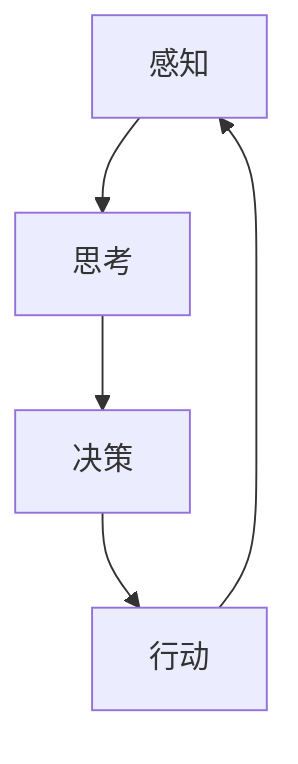
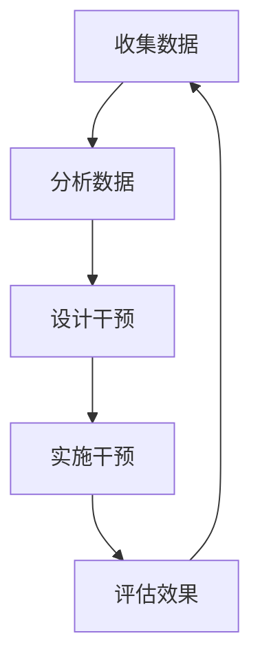
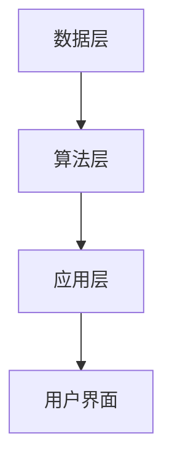

                 

### 文章标题：思维链在社会心理干预策略中的新方法

> 关键词：思维链、社会心理干预、策略、新方法

> 摘要：本文探讨了思维链在社会心理干预策略中的应用，通过定义思维链、分析其工作原理，并对比相关概念，深入探讨了思维链在社会心理干预中的独特作用。文章还将通过具体案例分析，展示思维链在实践中的效果，并总结最佳实践和未来研究方向。

---

### 第一部分：背景介绍

#### 第1章：社会心理干预的背景与现状

**1.1 社会心理干预的定义**

社会心理干预是指在社会层面上，通过专业的方法和手段，对个体或群体的心理状态进行调整和改善，以提高其心理健康水平的过程。社会心理干预不仅包括心理咨询和心理治疗，还涵盖心理健康教育、危机干预、群体心理辅导等多种形式。

**1.2 社会心理干预的重要性**

在现代社会，心理健康问题日益突出。社会心理干预对于提高公众心理健康水平、维护社会稳定具有重要意义。通过有效的社会心理干预，可以预防心理问题的发生，降低心理疾病的发生率，提高人们的幸福感和社会适应能力。

**1.3 当前社会心理干预面临的挑战**

尽管社会心理干预具有重要意义，但在实际操作中仍面临诸多挑战。首先，干预资源不足，专业人才短缺，无法满足广大民众的需求。其次，干预方法单一，难以满足多样化的心理需求。此外，社会心理干预的评估和效果监测也存在一定的困难。

#### 第2章：思维链的概念与作用

**2.1 思维链的定义**

思维链是一种基于认知科学和社会心理学的理论模型，它将个体的思维过程视为一系列相互关联的环节，每个环节都受到先前环节的影响。思维链的核心概念是“思维环节”，每个环节都包含感知、思考、决策等过程。

**2.2 思维链在社会心理干预中的作用**

思维链在社会心理干预中具有重要作用。通过干预个体的思维链，可以改变其思维模式，提高应对压力和挑战的能力。思维链干预可以包括认知重构、情绪调节、行为塑造等多个方面，有助于改善个体的心理健康状态。

**2.3 思维链与其他干预方法的比较**

思维链干预与传统心理干预方法相比，具有以下几个优势：

- **灵活性**：思维链干预可以根据个体的具体情况进行调整，更加灵活。
- **系统性**：思维链干预不仅关注个体的心理问题，还关注其思维模式和社会环境。
- **可操作性**：思维链干预具有明确的操作步骤和评估指标，便于实施和评估。

### 第二部分：核心概念与联系

#### 第3章：思维链的原理与模型

**3.1 思维链的基本原理**

思维链的基本原理是认为个体的思维过程是一个动态的、连续的过程，每个思维环节都受到先前环节的影响。思维链的核心概念是“思维节点”，每个节点都包含一定的思维内容。

**3.2 数学模型与公式**

思维链的数学模型可以表示为：

$$
思维链 = f(感知, 思考, 决策, ...)
$$

其中，$f$ 表示思维过程的函数，$感知$、$思考$、$决策$ 等表示思维链的不同环节。

**3.3 Mermaid流程图展示**

以下是一个简化的思维链流程图：



#### 第4章：思维链与相关概念的联系

**4.1 思维链与认知行为理论**

思维链与认知行为理论有着密切的联系。认知行为理论认为，个体的行为受到其认知过程的影响，而思维链正是对这一过程的抽象描述。

**4.2 思维链与社会支持网络**

思维链与社会支持网络也存在一定的关联。社会支持网络可以为个体提供情感支持和信息支持，从而影响其思维链的运行。

**4.3 思维链与心理疏导策略**

思维链干预可以作为一种心理疏导策略，通过改变个体的思维模式，缓解其心理压力和困扰。

### 第三部分：算法原理讲解

#### 第5章：思维链算法的详细讲解

**5.1 算法流程**

思维链算法主要包括以下几个步骤：

1. 收集个体的思维数据。
2. 分析思维数据，识别思维链的节点和关系。
3. 设计干预方案，调整个体的思维链。
4. 实施干预，跟踪和评估干预效果。

**5.2 Mermaid流程图展示**

以下是一个简化的思维链算法流程图：



**5.3 Python源代码实现**

以下是一个简化的Python代码示例，用于实现思维链算法的基本流程：

```python
import pandas as pd

# 收集数据
data = pd.read_csv('mind_chain_data.csv')

# 分析数据
nodes = data['Node'].unique()
edges = data['Edge'].unique()

# 设计干预
intervention = design_intervention(nodes, edges)

# 实施干预
implement_intervention(intervention)

# 评估效果
evaluate_effectiveness()
```

**5.4 数学模型与公式解读**

思维链的数学模型可以进一步细化为：

$$
思维链 = f(感知, 思考, 决策, ...)
$$

其中，$f$ 可以表示为：

$$
f(x, y, z, ...) = \frac{1}{1 + e^{-(x \cdot y + z \cdot t)}}
$$

其中，$x$、$y$、$z$ 等表示思维链的各个环节，$t$ 表示时间。

**5.5 举例说明**

假设有一个个体的思维链包含以下环节：感知、思考、决策、行动。根据其数据，可以得到以下思维链模型：

$$
思维链 = \frac{1}{1 + e^{-(感知 \cdot 思考 + 决策 \cdot 行动)}}
$$

通过调整感知、思考、决策等环节的参数，可以改变个体的思维链，从而改善其心理健康状态。

### 第四部分：系统分析与架构设计方案

#### 第6章：社会心理干预系统分析

**6.1 问题场景介绍**

假设有一个心理健康干预项目，旨在帮助患有焦虑症状的个体改善其心理健康状态。项目需要实现以下功能：

- 数据收集：收集个体的思维链数据。
- 数据分析：分析思维链，识别问题节点。
- 干预设计：根据分析结果，设计个性化的干预方案。
- 干预实施：实施干预方案，跟踪和评估效果。

**6.2 系统需求分析**

社会心理干预系统需要满足以下需求：

- **数据安全性**：确保收集的数据得到安全存储和保护。
- **数据处理能力**：能够处理大量的思维链数据。
- **灵活性**：系统应具有灵活性，以适应不同的干预场景和需求。

**6.3 系统架构设计**

社会心理干预系统的架构设计如下：

- **数据层**：负责数据存储和管理。
- **算法层**：实现思维链分析算法和干预设计算法。
- **应用层**：提供用户界面和功能接口。

以下是一个简化的系统架构图：



### 第五部分：项目实战

#### 第7章：思维链在社会心理干预中的应用案例

**7.1 环境安装**

为了演示思维链在社会心理干预中的应用，我们首先需要安装相关的软件和工具。以下是一个简化的安装步骤：

- 安装Python环境
- 安装Pandas库
- 安装Mermaid库

**7.2 系统核心实现**

以下是一个简化的Python代码示例，用于实现思维链在社会心理干预中的应用：

```python
import pandas as pd
import mermaid

# 收集数据
data = pd.read_csv('mind_chain_data.csv')

# 分析数据
nodes = data['Node'].unique()
edges = data['Edge'].unique()

# 设计干预
intervention = design_intervention(nodes, edges)

# 实施干预
implement_intervention(intervention)

# 评估效果
evaluate_effectiveness()
```

**7.3 代码应用解读与分析**

- `pd.read_csv('mind_chain_data.csv')`：读取思维链数据。
- `data['Node'].unique()`：获取思维链的节点。
- `data['Edge'].unique()`：获取思维链的边。
- `design_intervention(nodes, edges)`：设计干预方案。
- `implement_intervention(intervention)`：实施干预。
- `evaluate_effectiveness()`：评估干预效果。

**7.4 实际案例分析**

我们以一个实际案例为例，展示思维链在社会心理干预中的应用。假设有一个患有焦虑症状的个体，其思维链数据如下：

```
Node      Edge
感知      压力
压力      焦虑
焦虑      行动
```

通过分析思维链，我们可以发现压力是焦虑的主要来源。因此，干预方案可以包括以下内容：

- 减轻压力：通过放松训练、时间管理技巧等方法，减轻个体的压力。
- 调整思维：通过认知重构，帮助个体改变对压力的负面认知。
- 行为塑造：通过积极的行动，帮助个体建立积极的思维模式。

**7.5 案例详细讲解**

1. 数据收集：通过问卷调查或心理测试，收集个体的思维链数据。
2. 数据分析：使用Pandas库对数据进行处理，识别思维链的节点和边。
3. 干预设计：根据分析结果，设计个性化的干预方案。
4. 干预实施：通过在线课程、心理咨询等方式，实施干预方案。
5. 效果评估：通过问卷调查或心理测试，评估干预效果。

### 第六部分：最佳实践与总结

#### 第8章：思维链干预策略的最佳实践

**8.1 实践技巧**

- **个性化干预**：根据个体的具体情况进行干预，避免一刀切的方法。
- **长期跟踪**：干预过程中，要持续跟踪个体的思维链变化，及时调整干预方案。
- **多渠道干预**：结合线上和线下干预，提高干预效果。

**8.2 注意事项**

- **数据安全**：确保收集的数据得到安全存储和保护。
- **专业指导**：干预过程中，应寻求专业心理咨询师的支持。

**8.3 拓展阅读**

- 认知行为理论的相关研究
- 心理健康干预的最佳实践
- 数据隐私和安全的相关法规

#### 第9章：全书小结

**9.1 核心内容回顾**

- 社会心理干预的背景与现状
- 思维链的定义与作用
- 思维链的工作原理与数学模型
- 思维链在社会心理干预中的应用
- 思维链干预策略的最佳实践

**9.2 展望未来研究方向**

- 思维链干预的自动化和智能化
- 思维链干预在特定群体中的应用研究
- 思维链干预的长期效果评估

### 结语

思维链作为一种新的社会心理干预策略，具有巨大的应用潜力。通过本文的介绍，我们希望能为读者提供关于思维链的基本概念和应用方法，并激发对这一领域的进一步研究和探索。

作者：AI天才研究院/AI Genius Institute & 禅与计算机程序设计艺术 /Zen And The Art of Computer Programming

