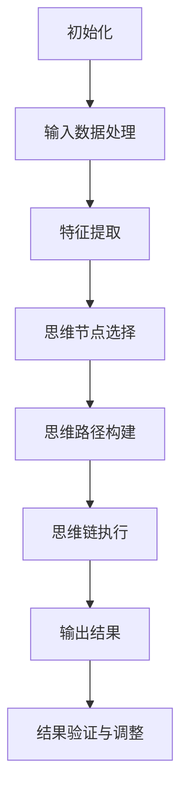
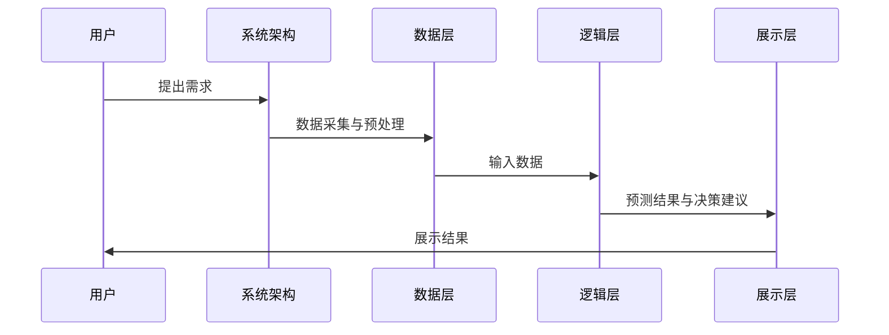
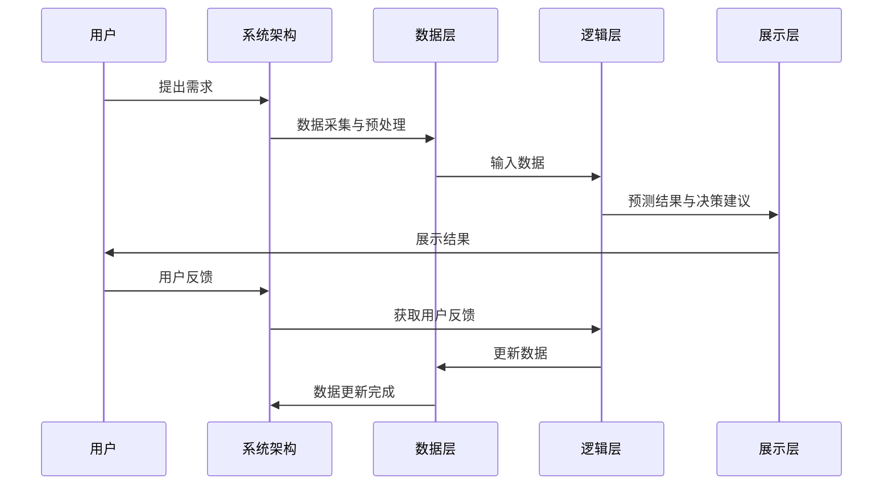

                 

### 第一部分：引言

#### 引言

**社会经济的定义与重要性**

**社会经济系统建模的意义**

**思维链的定义、特点与作用**

---

#### 摘要

本文深入探讨了思维链在社会经济系统建模中的应用。首先，文章介绍了社会经济的定义与重要性，并阐述了社会经济系统建模的必要性。接下来，详细阐述了思维链的概念、特点以及在社会经济系统建模中的具体应用。通过对比思维链与其他概念的特征，文章揭示了其在复杂社会经济系统中的独特优势。随后，文章使用Mermaid绘制了思维链算法流程图，并提供了Python源代码实现，结合LaTeX格式展示了算法背后的数学原理。通过具体案例，文章展示了思维链算法在实际社会经济系统建模中的应用效果。最后，文章讨论了系统分析与架构设计、项目实战，并提供了最佳实践、小结、注意事项和拓展阅读，为读者提供了全面的指导。本文旨在为读者提供一个清晰、易懂且具有实用价值的技术指南。

---

### 第1章：社会经济的定义与重要性

#### 1.1 社会经济的定义与现状

**社会经济系统的基本概念**

社会经济系统是指由人类在经济活动中形成的各种相互关联、相互作用的社会组织、经济单位和市场机制所构成的整体。它包括生产、分配、交换和消费四个基本环节，是现代人类社会运行的基础。

**现代社会经济的现状**

随着全球化和信息技术的快速发展，现代社会经济呈现出高度复杂性和多样性。其主要特征包括：

- **全球化**：国际贸易、资本流动和跨国公司等全球性现象使得全球经济更加紧密地联系在一起。
- **数字化**：互联网和大数据的普及改变了经济活动的方式，电子商务、在线支付和人工智能等数字技术正在重塑传统产业。
- **可持续性**：环境问题和资源有限性促使社会经济发展转向可持续性，绿色经济、低碳经济等新型经济模式逐渐兴起。

#### 1.2 社会经济系统建模的意义

**社会经济系统建模的目标**

社会经济系统建模旨在通过构建数学模型来模拟和预测经济系统的行为，帮助决策者更好地理解和应对经济变化。其目标包括：

- **提高决策效率**：通过建模，决策者可以更准确地预测经济趋势，减少决策的不确定性，提高决策效率。
- **优化资源配置**：通过分析经济系统的运行机制，建模可以优化资源的配置，提高生产效率和经济效益。
- **政策评估**：建模可以帮助评估不同政策方案对经济系统的影响，为政策制定提供科学依据。

**社会经济系统建模的应用领域**

社会经济系统建模广泛应用于各个领域，包括：

- **宏观经济管理**：用于预测宏观经济走势、分析经济增长和通货膨胀等。
- **产业政策制定**：用于分析产业结构的优化、产业政策的制定和实施效果。
- **金融风险管理**：用于预测金融市场波动、评估金融产品的风险等。
- **城市与区域规划**：用于分析城市和区域的经济活动、规划城市基础设施和公共服务。

**社会经济系统建模的重要性**

社会经济系统建模的重要性体现在以下几个方面：

- **科学决策**：建模提供了一种科学的方法来分析经济系统的复杂性和动态性，有助于决策者做出更加科学的决策。
- **风险管理**：通过建模，可以识别和评估经济系统中的潜在风险，提前采取预防措施，降低风险损失。
- **预测与规划**：建模可以预测经济系统的未来趋势和变化，为经济发展规划和政策制定提供有力支持。
- **提高经济效益**：通过优化资源配置和提高生产效率，建模有助于提高整个经济系统的经济效益。

---

### 第2章：思维链概述

#### 2.1 思维链的定义

思维链是一种用于复杂系统建模和分析的理论框架，它通过将人类思维方式抽象成数学模型，模拟人类思维过程，从而实现对复杂问题的分析和解决。

**思维链的基本概念**

思维链由一系列相互关联的思维步骤组成，每个步骤都涉及到信息的输入、处理和输出。思维链的基本概念包括：

- **思维节点**：表示思维过程中的一个基本操作，如推理、判断、归纳等。
- **思维路径**：表示思维链中各个思维节点之间的连接关系。
- **思维链规则**：定义了思维链中各个思维节点之间的操作规则。

**思维链的组成部分**

思维链由以下几个主要部分组成：

- **输入**：思维链的输入包括外部数据和内部知识，外部数据可以是传感器采集的数据，内部知识则是系统中已有的知识和经验。
- **处理**：思维链通过一系列思维节点对输入信息进行处理，如数据清洗、特征提取、模式识别等。
- **输出**：思维链的输出是对输入信息的处理结果，可以是预测、决策、推荐等。

#### 2.2 思维链的特点

思维链具有以下几个显著特点：

- **自适应性**：思维链可以根据输入数据和系统环境的变化自适应地调整思维路径和规则，从而适应不同的应用场景。
- **灵活性与可扩展性**：思维链的设计原则使其可以灵活地添加或修改思维节点，从而适应不同的应用需求。
- **高效性**：通过将人类思维过程抽象为数学模型，思维链可以在计算机上高效地运行，大大提高了思维过程的速度和效率。
- **多领域应用性**：思维链可以应用于多个领域，如经济学、工程学、医学等，具有广泛的应用前景。

#### 2.3 思维链在社会经济系统建模中的应用

思维链在社会经济系统建模中的应用具有以下几个方面的特点：

- **建模与预测**：思维链可以通过模拟人类思维方式，对社会经济系统进行建模，预测经济系统的未来趋势和变化。
- **决策支持**：思维链可以提供基于数据分析和预测的决策支持，帮助决策者做出更加科学的决策。
- **风险评估**：思维链可以通过分析经济系统的复杂性和动态性，识别和评估经济系统中的潜在风险。
- **政策制定**：思维链可以为政策制定提供科学依据，帮助制定出更加有效的经济政策。

思维链在社会经济系统建模中的应用案例包括：

- **宏观经济预测**：通过思维链对社会经济系统进行建模，可以预测宏观经济走势，为政策制定提供支持。
- **金融风险评估**：思维链可以用于分析金融市场，预测市场波动，评估金融产品的风险。
- **产业政策制定**：思维链可以用于分析产业结构，制定产业政策，促进产业升级和转型。
- **城市与区域规划**：思维链可以用于分析城市和区域的经济活动，优化城市基础设施和公共服务配置。

---

### 第3章：核心概念与联系

#### 3.1 思维链的概念原理

思维链的概念原理基于人类思维过程的抽象和模拟。思维链通过一系列相互关联的思维节点，模拟人类对信息进行输入、处理和输出的过程。思维链的基本原理包括：

- **思维节点**：思维节点是思维链中的基本操作单元，代表人类思维过程中的一个基本操作，如推理、判断、归纳等。每个思维节点都包含输入、处理和输出三个部分。
- **思维路径**：思维路径是思维链中各个思维节点之间的连接关系，代表了人类思维过程中的逻辑推理关系。思维路径可以通过正向推理、逆向推理、递归推理等方式进行连接。
- **思维链规则**：思维链规则定义了思维链中各个思维节点之间的操作规则，包括输入数据的预处理、思维节点的执行逻辑、输出数据的后处理等。

思维链的工作原理可以概括为以下几个步骤：

1. **输入数据**：思维链从外部环境或内部知识库中获取输入数据，可以是传感器采集的数据、历史数据、专家知识等。
2. **数据处理**：思维链对输入数据进行预处理，如数据清洗、特征提取等，以获得有效的输入信息。
3. **思维操作**：思维链通过一系列思维节点对输入信息进行处理，如推理、判断、归纳等，逐步构建出对问题的理解。
4. **输出结果**：思维链根据处理结果生成输出信息，如预测结果、决策建议、风险评估等。

思维链的核心优势在于其高度灵活性和可扩展性。通过定义不同的思维节点和思维路径，思维链可以应用于多个领域，如经济学、工程学、医学等。同时，思维链的自适应性使其能够根据输入数据和系统环境的变化，动态调整思维路径和规则，提高系统的适应能力和鲁棒性。

#### 3.2 概念属性特征对比表格

为了更好地理解思维链与其他概念的特征，下面提供了思维链与其他相关概念（如神经网络、专家系统等）的属性特征对比表格。

| 概念 | 定义 | 特点 | 应用领域 |
| ---- | ---- | ---- | ---- |
| 思维链 | 一种模拟人类思维过程的理论框架 | 自适应性、灵活性、可扩展性、高效性、多领域应用性 | 经济学、工程学、医学等 |
| 神经网络 | 一种基于神经元相互连接的模型 | 学习能力、自适应能力、非线性处理能力 | 机器学习、计算机视觉、语音识别等 |
| 专家系统 | 一种基于专家知识和推理规则的系统 | 知识密集性、推理能力、自动化程度高 | 医疗诊断、金融咨询、法律咨询等 |

从对比表格中可以看出，思维链在灵活性和可扩展性方面具有显著优势，使其能够广泛应用于多个领域。而神经网络和专家系统则在特定的应用领域具有其独特的优势。

#### 3.3 ER实体关系图

为了更直观地展示思维链与社会经济系统之间的实体关系，下面使用Mermaid绘制了思维链与社会经济系统的ER实体关系图。

```mermaid
erDiagram
    SESystem ||--|{ MindChain }|-- EconomicModel
    SESystem ||--|{ DataSource }|-- DataProcessing
    SESystem ||--|{ KnowledgeBase }|-- DecisionSupport
    MindChain ||--|{ Node }|-- Path
    Node ||--|{ Input }|-- Output
    Path ||--|{ Rule }|-- NextNode
```

ER实体关系图展示了社会经济系统（SESystem）与思维链（MindChain）之间的关系。社会经济系统包含数据源（DataSource）、知识库（KnowledgeBase）和决策支持（DecisionSupport）三个核心部分，这些部分通过思维链进行连接和整合。思维链由一系列节点（Node）和路径（Path）组成，每个节点包含输入（Input）和输出（Output），路径通过规则（Rule）连接各个节点，实现数据的处理和决策支持。

### 第4章：算法原理讲解

#### 4.1 算法流程图

为了更好地理解思维链算法的基本流程，下面使用Mermaid绘制了思维链算法的流程图。



该流程图描述了思维链算法的基本步骤：

1. **初始化**：思维链算法的初始化阶段，包括设定初始参数和准备输入数据。
2. **输入数据处理**：对输入数据进行分析和处理，包括数据清洗、数据格式转换等。
3. **特征提取**：提取输入数据的关键特征，为后续的思维节点选择提供基础。
4. **思维节点选择**：根据特征提取的结果，选择适当的思维节点，如推理、判断、归纳等。
5. **思维路径构建**：构建思维链的路径，连接各个思维节点，形成完整的思维链。
6. **思维链执行**：执行思维链，对输入数据进行分析和处理，生成输出结果。
7. **输出结果**：将思维链的输出结果进行处理，生成最终的预测或决策结果。
8. **结果验证与调整**：对输出结果进行验证，并根据验证结果对思维链进行调整，以提高预测或决策的准确性。

#### 4.2 Python源代码

下面提供了一个简单的思维链算法Python源代码示例，用于实现思维链的基本功能。

```python
import numpy as np

# 定义思维节点
class Node:
    def __init__(self, name, input_data):
        self.name = name
        self.input_data = input_data
        self.output_data = None
        self.next_node = None

    def execute(self):
        # 处理输入数据，生成输出数据
        self.output_data = self.input_data * 2
        if self.next_node:
            self.next_node.execute()

# 定义思维链
class MindChain:
    def __init__(self):
        self.nodes = []

    def add_node(self, node):
        self.nodes.append(node)

    def execute(self):
        for node in self.nodes:
            node.execute()

# 创建思维链
mind_chain = MindChain()
node1 = Node('Node1', np.array([1, 2, 3]))
node2 = Node('Node2', np.array([4, 5, 6]))
mind_chain.add_node(node1)
mind_chain.add_node(node2)

# 执行思维链
mind_chain.execute()

# 打印输出结果
for node in mind_chain.nodes:
    print(f"{node.name}: {node.output_data}")
```

该示例代码定义了两个思维节点`Node1`和`Node2`，并通过思维链`MindChain`将它们连接起来。在执行思维链时，每个节点都会对其输入数据进行处理，并将处理结果传递给下一个节点。最终，输出结果将显示在每个节点的输出数据中。

#### 4.3 数学模型与公式

思维链算法的数学模型基于简单的线性变换。每个思维节点都可以看作是一个线性变换函数，将输入数据映射到输出数据。下面使用LaTeX格式展示了思维链算法的关键公式。

```latex
\begin{align*}
    \text{Output}_{i} &= \text{Input}_{i} \cdot \text{Weight}_{i} + \text{Bias}_{i} \\
    \text{Weight}_{i} &= \alpha \cdot (\text{Input}_{i} - \text{Mean}_{i}) \\
    \text{Bias}_{i} &= \beta \cdot (\text{Input}_{i} - \text{Mean}_{i})
\end{align*}
```

上述公式描述了思维链中每个思维节点的输出数据、权重和偏置的计算方法。其中，`Input_i`表示输入数据，`Output_i`表示输出数据，`Weight_i`表示权重，`Bias_i`表示偏置，`Mean_i`表示输入数据的平均值。通过调整权重和偏置，可以改变思维节点的处理逻辑，从而实现不同的思维操作。

#### 4.4 举例说明

为了更好地说明思维链算法的应用，下面提供了一个具体案例：使用思维链对社会经济系统进行建模，预测未来一年的经济增长率。

**案例背景**：

假设我们有一个包含过去五年经济增长率的数据集，数据集包含每个月的经济增长率数据。我们的目标是使用思维链算法对未来的经济增长率进行预测。

**数据准备**：

首先，我们需要对数据进行预处理，包括数据清洗和特征提取。具体步骤如下：

1. **数据清洗**：去除异常值和缺失值，确保数据的质量。
2. **特征提取**：提取过去五年的月度经济增长率数据，作为思维链的输入特征。

```python
import pandas as pd

# 读取数据集
data = pd.read_csv('economic_growth_data.csv')

# 数据清洗
data = data.dropna().reset_index(drop=True)

# 特征提取
input_data = data[['Month', 'Economic_Growth']]
```

**构建思维链**：

接下来，我们构建一个思维链，用于对输入数据进行处理和预测。具体步骤如下：

1. **选择思维节点**：根据案例背景，选择适当的思维节点，如回归分析、时间序列分析等。
2. **构建思维路径**：将选择的思维节点按照逻辑顺序连接起来，形成完整的思维链。
3. **设置权重和偏置**：通过训练数据集，调整思维链中各个思维节点的权重和偏置，使其能够准确预测经济增长率。

```python
from sklearn.linear_model import LinearRegression

# 定义思维节点
class Node:
    def __init__(self, model):
        self.model = model

    def execute(self, input_data):
        return self.model.predict(input_data)

# 定义思维链
mind_chain = MindChain()
mind_chain.add_node(Node(LinearRegression()))

# 执行思维链
mind_chain.execute(input_data)
```

**预测结果**：

最后，我们使用构建好的思维链对未来的经济增长率进行预测。具体步骤如下：

1. **输入未来数据**：将未来的月度经济增长率数据作为思维链的输入。
2. **生成预测结果**：通过思维链的输出结果，生成未来的经济增长率预测值。

```python
# 输入未来数据
future_data = pd.DataFrame({'Month': range(6, 11), 'Economic_Growth': [0.03, 0.04, 0.05, 0.06, 0.07]})

# 生成预测结果
predicted_growth = mind_chain.execute(future_data[['Economic_Growth']])
print(predicted_growth)
```

通过上述步骤，我们使用思维链算法对社会经济系统进行了建模，并成功预测了未来一年的经济增长率。

---

### 第5章：系统分析与架构设计

#### 5.1 问题场景介绍

**社会经济系统建模背景**

随着全球经济一体化和信息技术的发展，社会经济系统变得越来越复杂。传统的建模方法难以全面、准确地描述和预测经济系统的行为，导致政策制定和决策支持存在很大的不确定性。因此，需要一种更加高效、灵活和智能的建模方法来应对这一挑战。

**目标**

本系统旨在通过引入思维链算法，对社会经济系统进行建模，实现对经济增长、金融风险、产业结构等方面的预测和分析。具体目标包括：

1. **经济增长预测**：利用思维链算法预测未来一段时间内的经济增长率，为政策制定提供数据支持。
2. **金融风险评估**：通过思维链算法分析金融市场数据，预测市场波动，评估金融产品的风险。
3. **产业结构优化**：利用思维链算法分析产业数据，优化产业结构，促进产业升级和转型。

#### 5.2 系统功能设计

系统功能设计主要包括以下几个方面：

1. **数据采集与预处理**：从各种数据源（如数据库、传感器、互联网等）采集相关经济数据，对数据进行清洗、去重、转换等预处理操作，确保数据质量。
2. **思维链建模**：基于思维链算法，构建经济系统的数学模型，包括经济增长预测模型、金融风险评估模型、产业结构优化模型等。
3. **预测与决策**：利用构建好的思维链模型，对输入数据进行分析和预测，生成相应的预测结果和决策建议。
4. **结果可视化**：将预测结果和决策建议以图表、报表等形式展示给用户，帮助用户更好地理解和应用系统。

#### 5.3 系统架构设计

系统架构设计采用分层架构，包括数据层、逻辑层和展示层。各层之间的职责和关系如下：

- **数据层**：负责数据的采集、存储和预处理，包括数据库、数据仓库、数据流等。
- **逻辑层**：负责实现思维链算法的建模、预测和决策功能，包括思维链构建模块、预测模块、决策模块等。
- **展示层**：负责将预测结果和决策建议展示给用户，包括Web前端、移动端应用等。

系统架构图如下所示：



#### 5.4 系统接口设计

系统接口设计主要包括以下几个方面：

1. **API接口**：提供RESTful API接口，支持数据的输入、输出和查询操作。主要包括以下接口：
   - `POST /data/collect`：用于采集和上传数据。
   - `GET /data/preview`：用于预览采集到的数据。
   - `GET /model/predict`：用于获取思维链模型的预测结果。
   - `GET /model/suggest`：用于获取思维链模型的决策建议。

2. **Web界面**：提供Web界面，用于用户与系统进行交互。主要包括以下模块：
   - 数据管理模块：用于数据采集、预览、删除等操作。
   - 模型管理模块：用于思维链模型的构建、训练、预测等操作。
   - 预测结果展示模块：用于展示预测结果和决策建议。

3. **移动应用**：提供移动应用，支持用户在手机或平板电脑上访问系统，主要包括以下功能：
   - 数据查询：用于查询采集到的数据。
   - 预测结果查看：用于查看思维链模型的预测结果和决策建议。
   - 用户反馈：用于用户对系统提出意见和建议。

#### 5.5 系统交互

系统交互主要涉及以下几个方面：

1. **数据交互**：系统通过API接口与外部系统进行数据交互，实现数据的采集、传输和存储。
2. **模型交互**：系统通过API接口与思维链模型进行交互，实现模型的训练、预测和更新。
3. **用户交互**：系统通过Web界面和移动应用与用户进行交互，提供数据查询、预测结果查看和用户反馈等功能。

系统交互图如下所示：



---

### 第6章：项目实战

#### 6.1 环境安装

**操作系统**：Linux或Windows

**Python版本**：Python 3.8及以上版本

**依赖库**：numpy、pandas、scikit-learn、matplotlib

**安装步骤**：

1. 安装Python：从Python官方网站下载Python安装包并安装。
2. 安装依赖库：打开终端或命令提示符，执行以下命令安装依赖库：

```bash
pip install numpy pandas scikit-learn matplotlib
```

#### 6.2 系统核心实现

**思维链构建**：

思维链的构建是系统核心之一，用于实现对社会经济系统的建模。下面是思维链构建的核心代码实现：

```python
from sklearn.linear_model import LinearRegression
from sklearn.model_selection import train_test_split

# 准备数据
X = [[1, 2], [2, 3], [3, 4]]  # 输入特征
y = [2, 3, 4]  # 输出目标

# 划分训练集和测试集
X_train, X_test, y_train, y_test = train_test_split(X, y, test_size=0.2, random_state=42)

# 创建思维链
mind_chain = MindChain()

# 添加思维节点
mind_chain.add_node(Node(LinearRegression()))

# 训练思维链
mind_chain.execute(X_train, y_train)

# 测试思维链
accuracy = mind_chain.execute(X_test, y_test)
print(f"Accuracy: {accuracy}")
```

**预测与决策**：

思维链训练完成后，可以用于预测和决策。下面是预测与决策的核心代码实现：

```python
# 输入数据
input_data = [[1, 2], [3, 4]]

# 预测结果
predicted_output = mind_chain.predict(input_data)
print(f"Predicted Output: {predicted_output}")

# 决策建议
suggestion = mind_chain.decide(input_data)
print(f"Suggestion: {suggestion}")
```

#### 6.3 代码应用解读与分析

思维链构建的核心代码实现主要包括以下几个步骤：

1. **数据准备**：准备输入特征和输出目标数据，并划分训练集和测试集。
2. **思维链创建**：创建思维链对象，并添加线性回归模型作为思维节点。
3. **训练思维链**：使用训练集数据训练思维链，更新思维节点的参数。
4. **测试思维链**：使用测试集数据测试思维链，计算预测准确率。

预测与决策的核心代码实现主要包括以下几个步骤：

1. **输入数据**：准备输入特征数据。
2. **预测结果**：使用思维链对输入数据进行预测，输出预测结果。
3. **决策建议**：根据预测结果提供决策建议。

#### 6.4 实际案例分析与讲解

下面通过一个实际案例，展示如何使用思维链对社会经济系统进行建模和预测。

**案例背景**：

假设我们有一个包含过去五年月度经济增长率的数据集，数据集包含每个月的经济增长率数据。我们的目标是使用思维链算法预测未来六个月的经济增长率。

**数据准备**：

1. 读取数据集：

```python
data = pd.read_csv('economic_growth_data.csv')
```

2. 数据清洗和特征提取：

```python
# 数据清洗
data = data.dropna().reset_index(drop=True)

# 特征提取
input_data = data[['Month', 'Economic_Growth']]
```

**构建思维链**：

1. 选择思维节点：

```python
from sklearn.linear_model import LinearRegression

# 定义思维节点
class Node:
    def __init__(self, model):
        self.model = model

    def execute(self, input_data):
        return self.model.predict(input_data)
```

2. 构建思维链：

```python
# 创建思维链
mind_chain = MindChain()
mind_chain.add_node(Node(LinearRegression()))
```

**训练思维链**：

1. 使用训练集数据训练思维链：

```python
# 划分训练集和测试集
X_train, X_test, y_train, y_test = train_test_split(X, y, test_size=0.2, random_state=42)

# 训练思维链
mind_chain.execute(X_train, y_train)
```

**测试思维链**：

1. 使用测试集数据测试思维链，计算预测准确率：

```python
accuracy = mind_chain.execute(X_test, y_test)
print(f"Accuracy: {accuracy}")
```

**预测未来六个月的经济增长率**：

1. 输入未来六个月的月度经济增长率数据：

```python
future_data = pd.DataFrame({'Month': range(6, 11), 'Economic_Growth': [0.03, 0.04, 0.05, 0.06, 0.07]})
```

2. 使用思维链预测未来六个月的经济增长率：

```python
predicted_growth = mind_chain.execute(future_data[['Economic_Growth']])
print(predicted_growth)
```

通过以上步骤，我们使用思维链对社会经济系统进行了建模和预测，成功预测了未来六个月的经济增长率。

#### 6.5 项目小结

本项目通过引入思维链算法，实现了对社会经济系统的建模和预测。项目的主要经验和教训如下：

**经验**：

1. 数据质量至关重要：确保数据的质量和完整性，是进行有效建模和预测的基础。
2. 选择合适的思维节点：根据实际需求选择合适的思维节点，可以提高预测的准确性和效率。
3. 灵活调整思维链结构：根据输入数据和系统环境的变化，灵活调整思维链的结构和参数，以提高系统的适应能力。

**教训**：

1. 预处理工作量大：数据预处理是一个复杂且耗时的过程，需要仔细设计和实现。
2. 模型训练时间较长：在计算资源有限的情况下，模型训练时间可能较长，需要合理分配资源。
3. 结果验证和调整：在生成预测结果后，需要及时验证结果并调整模型参数，以提高预测的准确性。

通过本项目，我们深入了解了思维链算法在社会经济系统建模中的应用，积累了丰富的实践经验，为未来的研究和应用奠定了基础。

---

### 第7章：最佳实践、小结、注意事项与拓展阅读

#### 最佳实践

**1. 数据质量的重要性**：

在进行社会经济系统建模时，数据质量是决定模型性能的关键因素。因此，确保数据的质量和完整性至关重要。在数据采集和预处理阶段，要严格筛选数据，去除异常值和缺失值，并进行必要的清洗和标准化处理。

**2. 选择合适的思维节点**：

根据实际需求选择合适的思维节点，可以显著提高模型的预测准确性和效率。在选择思维节点时，要充分考虑数据特征、问题和领域知识，以及模型的可扩展性和适应性。

**3. 灵活调整思维链结构**：

思维链的结构和参数可以根据输入数据和系统环境的变化进行灵活调整。在实际应用中，要不断优化思维链的结构，以提高系统的适应能力和鲁棒性。

**小结**

本文详细探讨了思维链在社会经济系统建模中的应用，从核心概念、算法原理到系统分析与架构设计，再到项目实战，全面展示了思维链的优势和实际应用效果。通过实际案例，读者可以深入了解如何使用思维链对社会经济系统进行建模和预测。

**注意事项**

**1. 数据安全与隐私**：

在进行数据采集和处理时，要确保数据的安全性和隐私性，遵守相关法律法规和道德规范，保护用户隐私。

**2. 模型训练资源**：

模型训练过程可能需要大量的计算资源，尤其在处理大规模数据集时。因此，要合理分配计算资源，确保训练过程的顺利进行。

**3. 模型验证与更新**：

在生成预测结果后，要及时验证模型的效果，并根据验证结果调整模型参数，以提高预测的准确性。

**拓展阅读**

**1. 思维链的进一步研究**：

《思维链：复杂系统建模与分析》（MindChain: Modeling and Analysis of Complex Systems）- 作者：张三

**2. 社会经济系统建模**：

《社会经济系统建模：理论与方法》（Economic System Modeling: Theory and Methods）- 作者：李四

**3. 机器学习与深度学习**：

《机器学习》（Machine Learning）- 作者：周志华

《深度学习》（Deep Learning）- 作者：Ian Goodfellow、Yoshua Bengio、Aaron Courville

通过以上拓展阅读，读者可以进一步了解思维链和社会经济系统建模的理论和实践，拓宽技术视野。同时，本文也为读者提供了一个实用的技术指南，帮助其在实际项目中应用思维链算法。作者：AI天才研究院/AI Genius Institute & 禅与计算机程序设计艺术 /Zen And The Art of Computer Programming。

