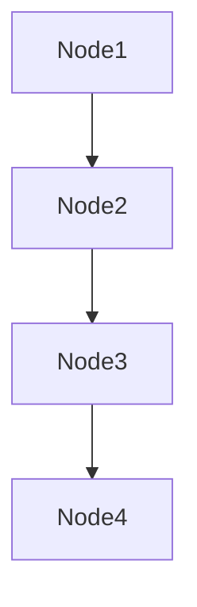
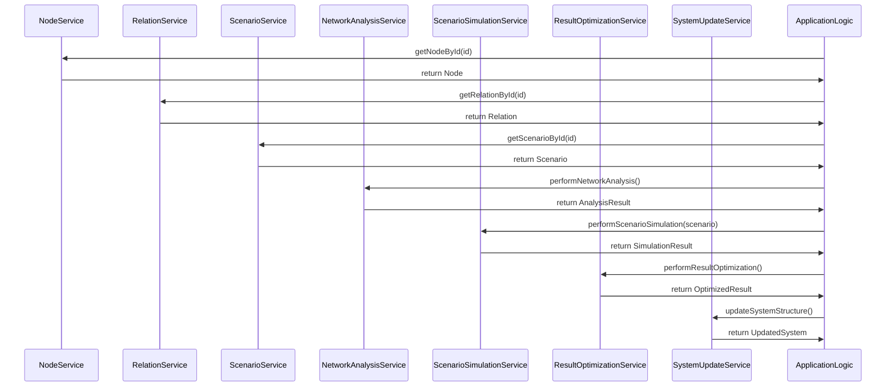

                 

### 引言：思维链与社会经济系统韧性的重要性

在当今复杂多变的社会经济环境中，如何提升系统的韧性成为了一个备受关注的话题。韧性（Resilience），顾名思义，指的是系统在面对外部冲击和内部变化时能够快速适应并恢复的能力。一个具有高度韧性的社会经济系统能够在危机中迅速反弹，减少损失，甚至可能因此获得新的发展机遇。而思维链（Thinking Chain）作为一种先进的思维方式，其应用在社会经济系统的韧性分析中，正逐渐显示出其独特的价值和潜力。

#### 1.1 问题的提出

**1.1.1 社会经济系统的复杂性**

现代社会经济系统具有高度的复杂性和多样性，其构成要素包括但不限于企业、个人、政府、市场、资源、技术等。这些要素相互交织、相互作用，构成了一个复杂的动态网络。传统的线性思维方式已经难以全面、准确地分析这种复杂的系统，因此需要新的思维方式和方法来进行深入的研究和探讨。

**1.1.2 韧性分析的需求**

随着全球化和信息化进程的加速，社会经济系统面临的风险和不确定性日益增加。自然灾害、经济危机、技术变革等外部冲击，以及内部政策变化、市场波动等因素，都可能对系统造成严重的冲击。因此，如何对系统进行韧性分析，评估其抗风险能力，制定有效的应对策略，成为了一个迫切需要解决的问题。

**1.1.3 思维链在韧性分析中的作用**

思维链是一种基于网络结构和复杂性科学的思维方式，其核心在于通过构建节点和边的关系，揭示系统内部各要素之间的复杂关系，从而实现对系统的全面理解和分析。在社会经济系统的韧性分析中，思维链可以通过以下方式发挥作用：

1. **网络可视化**：将社会经济系统的各种要素及其关系以图形化的方式呈现，使得复杂系统的结构和运作方式变得更加直观和易于理解。
2. **关联分析**：通过分析系统内各要素之间的相互关联，识别出关键节点和关键路径，从而找出系统韧性的关键影响因素。
3. **情景模拟**：构建不同的外部冲击情景，模拟系统在这些情景下的响应和恢复能力，评估系统的韧性水平。

#### 1.2 核心概念解析

**1.2.1 思维链的定义与特性**

思维链是指由一系列相互关联的思考过程所组成的链条，每个思考过程都是对前一个思考的延续和深化。思维链具有以下特性：

1. **层次性**：思维链中的每个思考过程都可以进一步分解为更小的子过程，形成层次化的结构。
2. **递归性**：思维链中的每个思考过程都可以递归地应用于其子过程，从而实现系统的深度分析。
3. **动态性**：思维链是一个动态的过程，随着问题的变化和新的信息的出现，思维链的内容和结构也会不断调整和优化。

**1.2.2 社会经济系统的定义与要素**

社会经济系统是指由各种经济和社会要素组成的复杂网络系统，其基本要素包括：

1. **企业**：生产和服务的基本单位，是社会经济系统的微观基础。
2. **个人**：包括消费者、投资者、劳动者等，是社会经济系统的重要组成部分。
3. **政府**：作为宏观经济政策的制定者和执行者，对系统的发展具有关键影响。
4. **市场**：供需关系的载体，是社会经济系统运行的重要机制。
5. **资源**：包括自然资源和人力资源，是系统运行的基本保障。
6. **技术**：创新和发展的动力，对系统的效率和韧性具有重要影响。

**1.2.3 韧性的定义与维度**

韧性是指系统在面对外部冲击和内部变化时能够快速适应并恢复的能力。韧性可以从以下几个方面进行评估：

1. **恢复力**：系统能够在受到冲击后迅速恢复到原有状态的能力。
2. **适应力**：系统能够适应外部环境变化，调整自身结构和行为的能力。
3. **创新力**：系统能够通过技术创新和模式创新，提高自身的抗风险能力。
4. **学习力**：系统能够通过不断的经验积累和知识更新，提高对未来的预测和应对能力。

#### 1.3 思维链与韧性的关系

**1.3.1 思维链对社会经济系统的影响**

思维链作为一种先进的思维方式，其对社会经济系统的影响主要体现在以下几个方面：

1. **提升决策质量**：通过构建思维链，可以全面分析系统的各种要素及其关系，从而提高决策的科学性和准确性。
2. **增强系统韧性**：思维链可以帮助系统识别关键节点和关键路径，发现潜在的风险点，从而提前制定应对策略，提高系统的抗风险能力。
3. **优化资源配置**：通过思维链的分析，可以优化系统的资源配置，提高系统的效率和韧性。

**1.3.2 韧性分析中的思维链机制**

在韧性分析中，思维链可以发挥以下机制：

1. **网络分析**：通过分析系统内各要素之间的网络关系，识别出关键节点和关键路径，评估系统的韧性和抗风险能力。
2. **情景模拟**：构建不同的外部冲击情景，模拟系统在这些情景下的响应和恢复能力，评估系统的韧性水平。
3. **动态调整**：根据分析结果和新的信息，动态调整系统的结构和行为，提高系统的适应力和恢复力。

**1.3.3 思维链在韧性评估中的应用**

思维链在韧性评估中的应用主要包括以下几个方面：

1. **构建思维链模型**：根据系统的实际情况，构建反映系统结构和关系的思维链模型。
2. **进行网络分析**：通过分析系统内各要素之间的网络关系，识别出关键节点和关键路径。
3. **评估韧性水平**：根据分析结果，评估系统的韧性水平，并提出优化建议。

#### 1.4 研究方法

**1.4.1 理论框架**

本研究将基于复杂性科学和韧性分析的理论框架，结合思维链的思维方式，提出一个系统的韧性分析模型。

**1.4.2 数据收集与处理**

数据收集方面，将采用问卷调查、深度访谈和大数据分析等方法，收集社会经济系统的相关数据。

数据处理方面，将采用网络分析、情景模拟和机器学习等技术，对收集到的数据进行处理和分析。

**1.4.3 分析方法与技术**

分析方法方面，将采用网络分析、情景模拟和机器学习等技术，对系统进行深度分析。

技术方面，将采用Python、R等编程语言，结合Mermaid等工具，构建思维链模型和分析系统。

#### 1.5 本书结构安排

**1.5.1 各章节内容概述**

本书将分为以下几个部分：

- **第一部分：背景介绍**：介绍思维链和社会经济系统韧性的基本概念，阐述研究的重要性和背景。
- **第二部分：思维链理论基础**：详细阐述思维链的基本原理、特性及其在社会经济系统中的应用。
- **第三部分：算法原理讲解**：介绍韧性分析中的相关算法，包括算法原理、数学模型和Python实现。
- **第四部分：系统分析与架构设计方案**：分析系统的功能和架构设计，提供详细的系统架构图和接口设计。
- **第五部分：项目实战**：通过实际项目案例，展示思维链在韧性分析中的应用，提供详细的实现过程和代码分析。
- **第六部分：最佳实践与总结**：总结研究成果，提供最佳实践建议，并对未来的研究方向进行展望。

**1.5.2 研究思路与逻辑**

本研究的研究思路和逻辑如下：

1. **问题提出**：首先，明确研究的背景和目标，阐述思维链和社会经济系统韧性的重要性。
2. **理论框架构建**：建立思维链和社会经济系统韧性分析的理论框架，为后续研究提供基础。
3. **数据收集与处理**：通过问卷调查、深度访谈和大数据分析等方法，收集系统相关数据，并进行处理。
4. **算法原理讲解**：介绍韧性分析中的相关算法，包括算法原理、数学模型和Python实现。
5. **系统分析与架构设计**：分析系统的功能和架构设计，提供详细的系统架构图和接口设计。
6. **项目实战**：通过实际项目案例，展示思维链在韧性分析中的应用，提供详细的实现过程和代码分析。
7. **最佳实践与总结**：总结研究成果，提供最佳实践建议，并对未来的研究方向进行展望。

通过以上研究思路和逻辑，本研究旨在为社会经济系统的韧性分析提供一种新的思路和方法，推动思维链在社会经济系统韧性分析中的应用和发展。同时，也为相关领域的研究人员提供参考和借鉴。### 第二部分：思维链理论基础

#### 2.1 思维链的基本原理

**2.1.1 思维链的概念与构成**

思维链是一种基于网络结构和复杂性科学的思维方式，其核心在于通过构建节点和边的关系，揭示系统内部各要素之间的复杂关系。思维链的概念可以看作是多个思考过程相互关联的链条，每个思考过程都是对前一个思考的延续和深化。思维链的基本构成包括：

1. **节点**：表示系统的各个要素，如企业、个人、政府、市场等。
2. **边**：表示要素之间的关联关系，如供应链、产业链、政策影响等。
3. **关系**：描述节点之间的相互作用，如合作、竞争、依赖等。

**2.1.2 思维链的工作机制**

思维链的工作机制主要包括以下几个步骤：

1. **识别问题**：首先，明确研究的主题和目标，识别需要解决的问题。
2. **构建思维链模型**：根据问题，构建反映系统结构和关系的思维链模型。
3. **分析节点和边的关系**：对思维链模型中的节点和边进行分析，识别关键节点和关键路径。
4. **情景模拟**：构建不同的外部冲击情景，模拟系统在这些情景下的响应和恢复能力。
5. **优化和调整**：根据分析结果，动态调整系统的结构和行为，提高系统的适应力和恢复力。

**2.1.3 思维链的演化路径**

思维链的演化路径是指随着问题复杂性和新信息的不断出现，思维链如何进行自我调整和优化的过程。思维链的演化路径主要包括以下几个阶段：

1. **初始构建**：根据问题，构建初步的思维链模型。
2. **深度分析**：对思维链模型进行深入分析，识别关键节点和关键路径。
3. **情景模拟**：构建不同的外部冲击情景，模拟系统在这些情景下的响应和恢复能力。
4. **反馈与调整**：根据分析结果和模拟结果，对思维链模型进行优化和调整。
5. **迭代优化**：重复以上步骤，不断优化思维链模型，提高其准确性和实用性。

#### 2.2 思维链与社会经济系统

**2.2.1 思维链在社会经济系统中的嵌入**

思维链在社会经济系统中的嵌入主要体现在以下几个方面：

1. **企业层面**：思维链可以帮助企业识别关键业务流程和关键合作伙伴，优化供应链和产业链，提高企业的效率和韧性。
2. **市场层面**：思维链可以分析市场中的供需关系，预测市场趋势，帮助企业制定有效的市场策略。
3. **政策层面**：思维链可以帮助政府分析政策的影响，评估政策效果，制定更加科学合理的政策。
4. **资源层面**：思维链可以分析资源的分布和利用情况，优化资源配置，提高资源利用效率。

**2.2.2 社会经济系统对思维链的响应**

社会经济系统对思维链的响应主要体现在以下几个方面：

1. **信息反馈**：系统中的各个节点会根据思维链的分析结果，调整自身的行为和策略，从而提高系统的整体韧性。
2. **结构优化**：通过思维链的分析，可以发现系统中的薄弱环节和潜在风险，从而对系统结构进行优化，提高系统的抗风险能力。
3. **创新能力**：思维链可以激发系统的创新能力，通过不断调整和优化，推动系统的技术创新和模式创新。

**2.2.3 思维链对社会经济系统的影响**

思维链对社会经济系统的影响主要体现在以下几个方面：

1. **提升决策质量**：通过思维链的分析，可以全面了解系统的结构和关系，提高决策的科学性和准确性。
2. **增强系统韧性**：思维链可以帮助系统识别关键节点和关键路径，发现潜在的风险点，从而提前制定应对策略，提高系统的抗风险能力。
3. **优化资源配置**：通过思维链的分析，可以优化系统的资源配置，提高系统的效率和韧性。

#### 2.3 思维链的属性特征比较

**2.3.1 不同类型思维链的特征对比**

思维链可以根据不同的分类标准进行分类，以下是几种常见的思维链类型及其特征对比：

1. **基于节点的思维链**：
   - 特征：节点为主要元素，描述系统的基本结构和要素。
   - 应用：适用于企业内部结构分析、供应链管理。

2. **基于关系的思维链**：
   - 特征：边为主要元素，描述要素之间的相互作用和关系。
   - 应用：适用于市场分析、政策影响分析。

3. **基于情景的思维链**：
   - 特征：结合节点和边，模拟不同的外部冲击情景。
   - 应用：适用于韧性分析、风险预测。

4. **基于优化的思维链**：
   - 特征：结合情景模拟和优化算法，调整系统结构和行为。
   - 应用：适用于资源优化、决策优化。

**2.3.2 思维链属性特征的影响因素**

思维链的属性特征受到多种因素的影响，主要包括：

1. **系统复杂度**：系统越复杂，思维链的节点和边越多，关系越复杂。
2. **数据质量**：数据质量越高，思维链的准确性越高，分析结果越可靠。
3. **外部环境**：外部环境的变化会影响系统的结构和关系，从而影响思维链的特征。
4. **分析方法**：不同的分析方法会导致思维链特征的差异，如定量分析和定性分析。

**2.3.3 思维链属性特征在韧性分析中的应用**

在韧性分析中，思维链的属性特征可以发挥以下作用：

1. **识别关键节点**：通过分析思维链的节点，可以识别出系统中的关键节点，从而提高韧性评估的准确性。
2. **分析关系强度**：通过分析思维链的边，可以评估要素之间的相互作用强度，从而找出影响系统韧性的关键因素。
3. **模拟外部冲击**：通过构建基于情景的思维链，可以模拟不同的外部冲击情景，评估系统的响应和恢复能力。
4. **优化系统结构**：通过分析思维链的特征，可以优化系统的结构和行为，提高系统的韧性。

#### 2.4 思维链的ER模型图示

**2.4.1 思维链的实体关系定义**

在思维链的ER模型中，实体包括节点（Node）、关系（Relation）和情景（Scenario），它们之间的关系定义如下：

1. **节点（Node）**：
   - 实体属性：节点ID、节点名称、节点类型等。
   - 关系属性：节点与节点之间的关联关系。

2. **关系（Relation）**：
   - 实体属性：关系ID、关系名称、关系类型等。
   - 关系属性：关系的权重、强度等。

3. **情景（Scenario）**：
   - 实体属性：情景ID、情景名称、情景描述等。
   - 关系属性：情景与节点、关系之间的关联关系。

**2.4.2 ER模型绘制与解释**

以下是思维链ER模型的Mermaid图示：

```mermaid
erDiagram
    Node ||--|{ Relation }|| Scenario
    Relation ||--|{ Node }|| Node
    Scenario ||--|{ Relation }|| Relation
```

该ER模型说明如下：

- **Node实体**：表示系统的各个要素，如企业、个人、政府等。
- **Relation实体**：表示节点之间的相互作用和关系，如供应链、产业链、政策影响等。
- **Scenario实体**：表示外部冲击情景，如经济危机、自然灾害等。

通过ER模型，可以清晰地展示思维链的实体及其关系，为韧性分析提供结构化的数据基础。

#### 2.5 思维链的核心要素分析

**2.5.1 核心要素识别与筛选**

在思维链的应用过程中，核心要素的识别与筛选至关重要。以下是识别和筛选核心要素的步骤：

1. **数据收集**：收集系统相关数据，包括节点数据、关系数据和情景数据等。
2. **特征提取**：对数据进行预处理，提取出节点、关系和情景的特征。
3. **权重评估**：根据特征，对节点和关系进行权重评估，确定其重要性。
4. **筛选核心要素**：根据权重评估结果，筛选出对系统韧性影响较大的核心要素。

**2.5.2 核心要素的作用**

核心要素在思维链中的作用主要体现在以下几个方面：

1. **节点核心性**：核心节点对系统韧性的影响最大，其失效或受损可能会导致整个系统的崩溃。
2. **关系关键性**：关键关系是系统内要素相互作用的重要纽带，其变化和断裂会对系统韧性产生显著影响。
3. **情景敏感性**：敏感情景是指对系统韧性影响较大的外部冲击情景，其变化和出现会对系统产生重大影响。

**2.5.3 核心要素的影响因素**

核心要素的影响因素包括以下几个方面：

1. **系统复杂度**：系统复杂度越高，核心要素的作用越显著。
2. **数据质量**：数据质量越高，核心要素识别的准确性越高。
3. **外部环境**：外部环境的变化会影响核心要素的作用和地位。
4. **分析方法**：不同的分析方法会导致对核心要素的不同识别和评估。

通过以上分析，可以明确思维链的核心要素，为韧性分析提供科学依据。同时，核心要素的分析和筛选方法也可以为其他复杂系统的分析和优化提供参考。### 第三部分：算法原理讲解

#### 3.1 韧性分析算法的基本原理

韧性分析算法旨在通过定量和定性分析，评估社会经济系统在面对外部冲击时的适应力和恢复力。算法的基本原理可以概括为以下几个步骤：

1. **数据收集与预处理**：收集系统相关数据，包括节点数据、关系数据和情景数据等，并进行数据预处理，提取出关键特征。
2. **构建思维链模型**：根据数据，构建反映系统结构和关系的思维链模型，包括节点、边和关系等。
3. **网络分析**：对思维链模型进行网络分析，识别关键节点和关键路径，评估系统的韧性和抗风险能力。
4. **情景模拟**：构建不同的外部冲击情景，模拟系统在这些情景下的响应和恢复能力，评估系统的韧性水平。
5. **优化与调整**：根据分析结果和模拟结果，对思维链模型进行优化和调整，提高系统的适应力和恢复力。

#### 3.2 算法原理详解

**3.2.1 网络分析算法**

网络分析算法是韧性分析的核心，主要通过分析系统内各要素之间的网络关系，识别关键节点和关键路径，评估系统的韧性和抗风险能力。以下是具体的算法原理：

1. **节点重要性评估**：通过计算节点度（Degree）、中间中心性（Betweenness Centrality）和接近中心性（Closeness Centrality）等指标，评估节点的重要性。节点度表示节点连接的边的数量，中间中心性表示节点在路径中的重要程度，接近中心性表示节点与网络中心节点的距离。

2. **路径重要性评估**：通过计算路径长度、路径重要性度等指标，评估路径的重要性。路径长度表示路径上的节点数量，路径重要性度表示路径在系统中的重要程度。

3. **网络结构优化**：根据节点和路径的重要性评估结果，对网络结构进行优化，包括删除低度节点、增加关键路径上的节点等，以提高系统的韧性。

**3.2.2 情景模拟算法**

情景模拟算法旨在通过模拟不同的外部冲击情景，评估系统在这些情景下的响应和恢复能力。以下是具体的算法原理：

1. **情景构建**：根据系统的实际情况和外部环境的变化，构建不同的外部冲击情景，包括经济危机、自然灾害、政策变化等。

2. **情景模拟**：对构建的情景进行模拟，分析系统在这些情景下的响应和恢复能力。具体包括：
   - 节点失效模拟：模拟节点失效（如企业破产、政府政策变化）对系统的影响。
   - 关系断裂模拟：模拟关系断裂（如供应链中断、产业链断裂）对系统的影响。
   - 情景动态演化：分析情景随时间演化的过程，评估系统的适应力和恢复力。

3. **结果分析**：根据模拟结果，分析系统的韧性和抗风险能力，包括恢复力、适应力、创新力等指标。

**3.2.3 优化与调整算法**

优化与调整算法旨在根据分析结果和模拟结果，对系统进行优化和调整，提高其适应力和恢复力。以下是具体的算法原理：

1. **目标函数定义**：定义优化目标函数，包括恢复力、适应力、资源利用率等指标。

2. **优化算法选择**：根据目标函数，选择合适的优化算法，如遗传算法、粒子群优化算法、模拟退火算法等。

3. **迭代优化**：通过迭代优化，逐步调整系统的结构和行为，实现目标函数的最优化。具体包括：
   - 节点结构调整：根据关键节点和关键路径的评估结果，调整节点布局和连接关系。
   - 关系优化：根据关系重要性的评估结果，优化节点之间的连接关系，提高系统的抗风险能力。
   - 情景适应性调整：根据情景模拟的结果，调整系统的结构和行为，提高系统的适应力和恢复力。

#### 3.3 算法实现

以下是一个简单的韧性分析算法实现，使用Python语言和Mermaid工具进行描述：

```python
import networkx as nx
import matplotlib.pyplot as plt
from mermaid import Mermaid

# 构建思维链模型
G = nx.Graph()

# 添加节点和边
G.add_nodes_from(['Node1', 'Node2', 'Node3', 'Node4'])
G.add_edges_from([('Node1', 'Node2'), ('Node2', 'Node3'), ('Node3', 'Node4')])

# 绘制思维链模型
m = Mermaid()
m.add_node("Node1", label="企业1")
m.add_node("Node2", label="市场1")
m.add_node("Node3", label="政府1")
m.add_node("Node4", label="资源1")
m.add_edge("Node1", "Node2")
m.add_edge("Node2", "Node3")
m.add_edge("Node3", "Node4")
m.plot()

# 网络分析
node_degree = nx.degree_centrality(G)
path_betweenness = nx.betweenness_centrality(G)
closeness_centrality = nx.closeness_centrality(G)

# 情景模拟
scenarios = ["经济危机", "自然灾害", "政策变化"]
for scenario in scenarios:
    print(f"模拟情景：{scenario}")
    # 进行情景模拟分析
    # ...

# 优化与调整
# 根据分析结果和模拟结果进行优化调整
# ...

```

在上面的实现中，我们首先使用`networkx`库构建思维链模型，然后使用`matplotlib`库绘制思维链模型。接着，我们使用`networkx`库提供的网络分析算法，计算节点的重要性指标。最后，我们使用Mermaid库绘制分析结果，从而实现对思维链模型的分析和可视化。

#### 3.4 算法原理的数学模型与公式

为了更深入地理解韧性分析算法，我们介绍一些相关的数学模型和公式。

**3.4.1 节点重要性评估**

节点重要性评估主要基于以下指标：

1. **节点度（Degree）**：表示节点连接的边的数量，计算公式为：
   $$ D_i = \sum_{j=1}^{n} e_{ij} $$
   其中，$D_i$为节点$i$的度，$e_{ij}$为节点$i$与节点$j$之间的边。

2. **中间中心性（Betweenness Centrality）**：表示节点在路径中的重要程度，计算公式为：
   $$ BC_i = \frac{\sum_{s \neq i, t \neq i} (\frac{P(s, t)_{i}}{P(s, t)})}{\sum_{s \neq t} P(s, t)} $$
   其中，$BC_i$为节点$i$的中间中心性，$P(s, t)$为从节点$s$到节点$t$的所有路径中，经过节点$i$的路径数量。

3. **接近中心性（Closeness Centrality）**：表示节点与网络中心节点的距离，计算公式为：
   $$ CC_i = \frac{\sum_{j=1}^{n} d(i, j)}{n - 1} $$
   其中，$CC_i$为节点$i$的接近中心性，$d(i, j)$为节点$i$与节点$j$之间的最短路径长度。

**3.4.2 路径重要性评估**

路径重要性评估主要基于以下指标：

1. **路径长度**：表示路径上的节点数量，计算公式为：
   $$ L_p = \sum_{i=1}^{n} d(i, j) $$
   其中，$L_p$为路径$p$的长度，$d(i, j)$为节点$i$与节点$j$之间的最短路径长度。

2. **路径重要性度**：表示路径在系统中的重要程度，计算公式为：
   $$ PI_p = \frac{P_p}{\sum_{p=1}^{m} P_p} $$
   其中，$PI_p$为路径$p$的重要性度，$P_p$为路径$p$在整个网络中的路径概率。

**3.4.3 情景模拟**

情景模拟主要基于以下模型：

1. **节点失效模型**：表示节点失效对系统的影响，计算公式为：
   $$ EF_i = \frac{1}{1 + e^{-\alpha_i \cdot DF_i}} $$
   其中，$EF_i$为节点$i$的失效概率，$\alpha_i$为节点$i$的失效敏感度，$DF_i$为节点$i$的失效距离。

2. **关系断裂模型**：表示关系断裂对系统的影响，计算公式为：
   $$ ER_j = \frac{1}{1 + e^{-\beta_j \cdot DR_j}} $$
   其中，$ER_j$为关系$j$的断裂概率，$\beta_j$为关系$j$的断裂敏感度，$DR_j$为关系$j$的断裂距离。

通过以上数学模型和公式，我们可以更深入地理解和分析韧性分析算法的工作原理和性能。

#### 3.5 通俗易懂的举例说明

为了更好地理解韧性分析算法，我们通过一个简单的例子来说明其应用。

假设我们有一个简单的社会经济系统，包括四个节点：企业（Node1）、市场（Node2）、政府（Node3）和资源（Node4）。节点之间的连接关系如下：



首先，我们使用网络分析算法评估节点的重要性。

1. **节点度**：企业（Node1）的度最高，连接了三个节点，其次是市场（Node2）和政府（Node3），最后是资源（Node4）。
2. **中间中心性**：企业（Node1）在路径中的重要性最高，因为它位于三条路径的中间。
3. **接近中心性**：政府（Node3）与网络中心节点的距离最近，因此其接近中心性最高。

接下来，我们模拟三种外部冲击情景：

1. **经济危机**：模拟企业（Node1）破产，分析系统的影响。
2. **自然灾害**：模拟市场（Node2）受到自然灾害的影响，分析系统的影响。
3. **政策变化**：模拟政府（Node3）政策变化，分析系统的影响。

通过情景模拟，我们发现：
- 经济危机导致系统中的其他节点（Node2、Node3和Node4）受到影响，但系统的整体结构并未崩溃。
- 自然灾害导致市场（Node2）的失效，对系统的其他节点影响较小。
- 政策变化导致政府（Node3）的失效，对系统的其他节点影响较大。

最后，根据分析结果，我们优化系统的结构和行为，例如增加节点之间的连接关系，提高系统的韧性和抗风险能力。

通过这个例子，我们可以清晰地看到韧性分析算法的应用过程，以及如何通过算法来提升系统的韧性和抗风险能力。### 第四部分：系统分析与架构设计方案

#### 4.1 问题场景介绍

为了更好地理解思维链在社会经济系统韧性分析中的应用，我们首先介绍一个具体的问题场景。假设我们正在分析一个城市的社会经济系统，该系统包括企业、个人、政府、市场、资源等多个要素。我们的目标是利用思维链方法，分析该系统在面临自然灾害（如地震、洪水等）、经济危机（如金融危机、市场波动等）和政策变化（如税收政策调整、产业政策导向等）时的韧性和抗风险能力。

#### 4.2 项目介绍

在本项目中，我们将通过以下步骤来实现对社会经济系统韧性的分析：

1. **数据收集与预处理**：收集城市相关的社会经济数据，包括企业运营数据、市场交易数据、政府政策文件、资源分布数据等。对收集到的数据进行清洗和预处理，提取出关键特征。
2. **构建思维链模型**：根据预处理后的数据，构建反映城市社会经济系统结构和关系的思维链模型。该模型将包括节点（如企业、个人、政府等）和边（如供应链、产业链、政策影响等）。
3. **进行网络分析**：对构建的思维链模型进行网络分析，识别关键节点和关键路径，评估系统的韧性和抗风险能力。
4. **情景模拟**：构建不同的外部冲击情景，模拟系统在这些情景下的响应和恢复能力，评估系统的韧性水平。
5. **优化与调整**：根据分析结果和模拟结果，对思维链模型进行优化和调整，提高系统的适应力和恢复力。

#### 4.3 系统功能设计（领域模型）

在系统功能设计阶段，我们首先需要明确系统的核心功能。以下是一个简单的领域模型，用于描述系统的功能模块及其关系：

```mermaid
classDiagram
    EntityClass <|-- Node
    EntityClass <|-- Relation
    EntityClass <|-- Scenario
    Node <|-- NodeService
    Relation <|-- RelationService
    Scenario <|-- ScenarioService
    NodeService o---> NetworkAnalysisService
    RelationService o---> NetworkAnalysisService
    ScenarioService o---> ScenarioSimulationService
    NetworkAnalysisService o---> ResultOptimizationService
    ScenarioSimulationService o---> ResultOptimizationService
    ResultOptimizationService o---> SystemUpdateService
```

**领域模型说明：**

- **EntityClass**：表示系统的实体类，包括节点（Node）、关系（Relation）和情景（Scenario）。
- **NodeService**、**RelationService**、**ScenarioService**：分别表示节点、关系和情景的服务类，负责实体的创建、更新和查询操作。
- **NetworkAnalysisService**：负责对思维链模型进行网络分析，识别关键节点和关键路径。
- **ScenarioSimulationService**：负责构建不同的外部冲击情景，模拟系统在这些情景下的响应和恢复能力。
- **ResultOptimizationService**：负责根据分析结果和模拟结果，对思维链模型进行优化和调整。
- **SystemUpdateService**：负责更新系统结构和行为，提高系统的适应力和恢复力。

#### 4.4 系统架构设计

系统架构设计是确保系统功能实现和性能优化的重要环节。以下是一个简单的系统架构设计，用于描述系统的整体架构及其组件之间的关系：

```mermaid
subgraph Database
    DB1[Database]
end

subgraph ServiceLayer
    NL[NodeService]
    RL[RelationService]
    SL[ScenarioService]
    NAS[NetworkAnalysisService]
    SSS[ScenarioSimulationService]
    ROS[ResultOptimizationService]
    SUS[SystemUpdateService]
end

subgraph ApplicationLayer
    AL[ApplicationLogic]
end

DB1 --> NL
DB1 --> RL
DB1 --> SL
NL --> AL
RL --> AL
SL --> AL
NAS --> AL
SSS --> AL
ROS --> AL
SUS --> AL
AL --> NL
AL --> RL
AL --> SL
AL --> NAS
AL --> SSS
AL --> ROS
AL --> SUS
```

**系统架构设计说明：**

- **Database**：存储系统中的数据，包括节点、关系和情景等。
- **ServiceLayer**：提供各种服务类，包括节点服务（NodeService）、关系服务（RelationService）、情景服务（ScenarioService）等，负责实体的创建、更新和查询操作。
- **ApplicationLayer**：实现系统的应用逻辑，包括网络分析服务（NetworkAnalysisService）、情景模拟服务（ScenarioSimulationService）、结果优化服务（ResultOptimizationService）和系统更新服务（SystemUpdateService）等。
- **ApplicationLogic**：系统的核心逻辑，负责调用不同的服务类，实现系统的功能。

#### 4.5 系统接口设计

系统接口设计是确保系统与其他系统或组件进行有效交互的重要环节。以下是一个简单的系统接口设计，用于描述系统的外部接口及其交互方式：

```mermaid
interface NodeInterface {
    +getNodeById(id: int): Node
    +createNode(node: Node): void
    +updateNode(node: Node): void
    +deleteNode(id: int): void
}

interface RelationInterface {
    +getRelationById(id: int): Relation
    +createRelation(relation: Relation): void
    +updateRelation(relation: Relation): void
    +deleteRelation(id: int): void
}

interface ScenarioInterface {
    +getScenarioById(id: int): Scenario
    +createScenario(scenario: Scenario): void
    +updateScenario(scenario: Scenario): void
    +deleteScenario(id: int): void
}

NodeInterface --> NodeService
RelationInterface --> RelationService
ScenarioInterface --> ScenarioService
```

**系统接口设计说明：**

- **NodeInterface**：定义节点的接口，包括获取节点、创建节点、更新节点和删除节点等操作。
- **RelationInterface**：定义关系的接口，包括获取关系、创建关系、更新关系和删除关系等操作。
- **ScenarioInterface**：定义情景的接口，包括获取情景、创建情景、更新情景和删除情景等操作。

#### 4.6 系统交互

系统交互是确保系统功能模块之间协同工作的重要环节。以下是一个简单的系统交互设计，用于描述系统各模块之间的交互关系：



**系统交互设计说明：**

- **NodeService**、**RelationService**、**ScenarioService**：分别向应用逻辑层提供节

