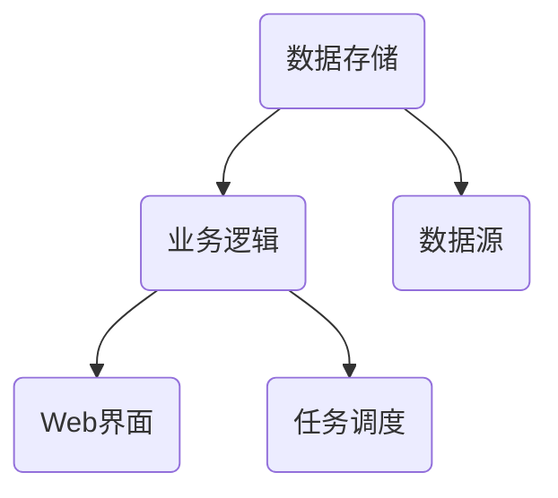

                 


### 第1章：社会网络动态分析概述

在当今信息化和全球化迅速发展的时代，社会网络动态分析已成为一种重要的研究手段。本章将首先介绍社会网络动态分析的基本概念，包括其定义、发展历程和应用领域，然后深入探讨社会网络的基本结构，如网络节点与边的定义、网络的度、路径、聚类系数等基本概念，最后简要介绍社会网络动态分析的核心问题，包括社会网络动态行为的预测、影响力分析以及社区发现。

#### 1.1 社会网络动态分析的基本概念

**社会网络动态分析的定义**

社会网络动态分析是一种基于图论和信息论的方法，旨在研究网络中个体间的交互关系及其动态变化规律。该方法通过对网络节点的属性、边的关系以及整体网络结构进行分析，揭示网络中的信息传播、权力结构、影响力分布等动态特征。

**社会网络动态分析的发展历程**

社会网络动态分析起源于20世纪中期，随着计算机技术和图论理论的兴起，研究者开始利用图论方法对社会网络进行分析。随着大数据技术的发展，社会网络动态分析逐渐从理论研究走向实际应用，如社交网络分析、生物网络分析、交通网络分析等。

**社会网络动态分析的应用领域**

社会网络动态分析在多个领域具有广泛的应用，主要包括：

1. 社交网络分析：研究社交网络中用户的交互行为、信息传播路径和社区结构。
2. 生物网络分析：研究生物分子之间的相互作用关系，揭示生物系统的功能和调控机制。
3. 交通网络分析：研究交通网络中的流量分布、拥堵现象以及优化方案。
4. 传播学：分析信息传播的过程、速度和影响范围，为传播策略提供依据。

#### 1.2 社会网络的基本结构

**网络节点与边的定义**

社会网络中的节点通常代表个体，如人、组织、网站等，而边则表示节点之间的联系或交互，如友谊关系、业务往来、信息共享等。

**网络的度、路径、聚类系数等基本概念**

- **度**：节点在网络中的连接数，分为入度（指向该节点的边数）和出度（该节点指向其他节点的边数）。
- **路径**：网络中两个节点之间的序列，表示从起点到终点的连接序列。
- **聚类系数**：节点集合内边的密度，反映了节点之间的聚集程度。

**社会网络分析的指标体系**

社会网络分析涉及多个指标，如节点度、路径长度、聚类系数、中心性、紧密性等，这些指标有助于评估网络的结构特征和动态行为。

#### 1.3 社会网络动态分析的核心问题

**社会网络动态行为的预测**

社会网络动态行为的预测旨在预测网络中个体未来的行为模式，如节点间的交互关系、信息传播趋势等。预测方法包括机器学习、图神经网络等。

**社会网络动态中的影响力分析**

影响力分析旨在识别网络中具有重要影响力的节点或子网络，这些节点或子网络在信息传播、社会动员等方面具有关键作用。

**社会网络动态中的社区发现**

社区发现是指识别网络中的紧密连接群体，这些群体在结构、功能上具有相似性。社区发现方法包括基于模块度的优化、基于聚类的算法等。

### 小结

本章对社会网络动态分析进行了全面的概述，包括其基本概念、发展历程、应用领域、基本结构以及核心问题。这些内容为后续章节的深入讨论奠定了基础。

### 1.4 本章关键知识点总结

- **社会网络动态分析**：定义、发展历程和应用领域。
- **网络节点与边**：定义及其在网络结构中的意义。
- **基本概念**：度、路径、聚类系数等。
- **核心问题**：动态行为预测、影响力分析和社区发现。

**拓展阅读**：

- 社会网络动态分析的相关书籍，如《社交网络分析：方法与实践》等。
- 社会网络动态分析的学术论文，了解该领域的最新研究动态。

### 注意事项

- 社会网络动态分析中涉及的数据质量和预处理方法对分析结果具有重要影响。
- 在实际应用中，应根据具体问题和需求选择合适的分析方法和技术。

---

### 1.5 思维链的基本概念与特性

在社会网络动态分析中，思维链是一个重要的概念。它不仅有助于我们理解社会网络的动态行为，还可以用于预测和优化网络结构。接下来，我们将详细探讨思维链的定义、核心要素以及其在社会网络动态分析中的应用。

#### 1.5.1 思维链的定义

**思维链的概念**

思维链是一种用于表示个体在信息处理过程中所产生的思维路径的概念。它通过将个体的思维过程抽象为一系列节点和边的组合，来描述个体在接收、处理和传播信息时的动态行为。

**思维链的核心要素**

思维链的核心要素包括：

1. **节点**：表示个体的思维单元，如观点、想法、问题等。
2. **边**：表示节点之间的关联，如因果关系、相似性、依赖关系等。
3. **属性**：节点和边可以具有多种属性，如时间、强度、重要性等。

#### 1.5.2 思维链的特性

**动态性**

思维链的动态性体现在个体思维过程的不断变化和发展。个体的思维路径可以随着时间的推移而调整和优化，从而适应不断变化的环境和需求。

**适应性**

思维链的适应性表现在个体能够根据新信息和反馈来调整和优化自己的思维路径。这种适应性有助于个体在复杂和动态的社会网络中保持竞争优势。

**多样性**

思维链的多样性体现在个体思维路径的丰富性和多样性。不同的个体在面对相同的问题时，可能会产生不同的思维路径，从而形成多种可能的解决方案。

#### 1.5.3 思维链在社会网络动态分析中的作用

**思维链对社会网络动态分析的影响**

思维链对社会网络动态分析的影响主要体现在以下几个方面：

1. **信息传播**：思维链可以用于分析信息在社会网络中的传播过程，揭示信息传播的路径和速度。
2. **影响力分析**：思维链可以帮助我们识别网络中具有重要影响力的节点和子网络，为影响力分析提供依据。
3. **社区发现**：思维链可以用于分析网络中的社区结构，识别具有相似思维路径的个体群体。

**思维链在信息传播中的应用**

思维链在信息传播中的应用主要体现在以下几个方面：

1. **信息传播路径分析**：通过分析思维链的路径，可以揭示信息在社交网络中的传播路径和速度。
2. **信息传播策略优化**：根据思维链的特点，可以设计出更有效的信息传播策略，提高信息传播的效率和效果。
3. **信息传播风险评估**：通过分析思维链的动态性，可以评估信息传播的风险，避免潜在的安全问题。

**思维链在社区发现中的应用**

思维链在社区发现中的应用主要体现在以下几个方面：

1. **社区结构分析**：通过分析思维链的节点和边，可以揭示社区的结构特征和功能。
2. **社区划分**：基于思维链的特点，可以设计出更有效的社区划分方法，提高社区划分的准确性和效率。
3. **社区优化**：通过分析思维链的动态性，可以优化社区结构，提高社区的功能和稳定性。

### 小结

本章对思维链的基本概念与特性进行了详细探讨，包括其定义、核心要素和特性，以及在社会网络动态分析中的应用。思维链作为一种重要的概念，为我们理解和分析社会网络的动态行为提供了新的视角和方法。

### 1.6 本章关键知识点总结

- **思维链的定义**：节点、边和属性。
- **思维链的特性**：动态性、适应性和多样性。
- **思维链在社会网络动态分析中的作用**：信息传播、影响力分析和社区发现。

**拓展阅读**：

- 《思维链与社会网络分析》等专著，深入了解思维链的理论和应用。
- 相关学术论文，如《基于思维链的社交网络影响力分析》等，了解最新研究成果。

### 注意事项

- 在实际应用中，应根据具体问题和需求灵活运用思维链的概念和方法。
- 思维链的分析结果应结合实际情况进行评估和验证。

---

### 1.7 社会网络动态分析中的核心问题

在社会网络动态分析中，核心问题包括社会网络动态行为的预测、影响力分析和社区发现。这些问题对于理解社会网络的运行机制、优化网络结构和制定有效的策略具有重要意义。接下来，我们将分别讨论这些核心问题的理论基础、方法和技术。

#### 1.7.1 社会网络动态行为的预测

**理论基础**

社会网络动态行为的预测是通过对网络中个体行为的建模和预测来揭示未来可能的动态变化。其理论基础主要包括：

- **机器学习**：利用历史数据训练模型，预测个体在未来的行为。
- **图神经网络**：通过图结构来建模和预测网络中节点的行为。

**方法**

1. **基于历史数据的预测方法**：通过分析历史数据，利用统计模型或机器学习算法预测个体在未来的行为。常用的方法包括线性回归、决策树、支持向量机等。

2. **基于图神经网络的预测方法**：通过构建图神经网络模型，模拟网络中节点的相互作用，预测未来可能的动态行为。常用的图神经网络模型包括GCN、GAT等。

**技术**

1. **特征提取**：从网络结构和节点属性中提取有效特征，用于训练预测模型。
2. **模型优化**：通过调整模型参数和结构，提高预测的准确性和效率。

**应用案例**

- **社交网络行为预测**：预测用户在社交网络中的互动行为，如点赞、评论、分享等。
- **生物网络行为预测**：预测生物分子之间的相互作用关系，如蛋白质的功能预测。

#### 1.7.2 社会网络动态中的影响力分析

**理论基础**

影响力分析旨在识别网络中具有重要影响力的节点或子网络，这些节点或子网络在信息传播、社会动员等方面具有关键作用。其理论基础主要包括：

- **中心性分析**：通过评估节点在网络中的中心性指标，如度中心性、介数中心性等，识别网络中的核心节点。
- **影响力模型**：构建基于网络结构和节点属性的影响力模型，评估节点的影响力。

**方法**

1. **基于中心性的影响力分析**：通过计算节点的中心性指标，识别网络中的核心节点。常用的中心性指标包括度中心性、介数中心性、紧密中心性等。

2. **基于影响力模型的计算**：通过构建影响力模型，评估节点在信息传播、社会动员等方面的影响力。

**技术**

1. **影响力计算**：利用算法计算节点的影响力得分，识别网络中的关键节点。
2. **可视化分析**：通过可视化工具展示网络中的影响力分布，帮助用户直观理解网络结构。

**应用案例**

- **社交网络影响力分析**：识别社交媒体中具有重要影响力的用户，为营销策略提供依据。
- **生物网络影响力分析**：识别生物网络中具有重要作用的节点，揭示生物系统的关键调控机制。

#### 1.7.3 社会网络动态中的社区发现

**理论基础**

社区发现旨在识别网络中的紧密连接群体，这些群体在结构、功能上具有相似性。其理论基础主要包括：

- **模块度优化**：通过优化网络中的模块度，识别网络中的社区结构。
- **基于聚类的算法**：利用聚类算法，将网络中的节点划分为不同的社区。

**方法**

1. **基于模块度的社区发现方法**：通过优化模块度，识别网络中的社区结构。常用的算法包括Louvain算法、GN算法等。

2. **基于聚类的社区发现方法**：利用聚类算法，将网络中的节点划分为不同的社区。常用的聚类算法包括K-means、DBSCAN等。

**技术**

1. **社区结构分析**：通过分析社区的结构特征，揭示社区的功能和作用。
2. **社区优化**：通过优化社区结构，提高社区的功能和稳定性。

**应用案例**

- **社交网络社区发现**：识别社交媒体中的用户群体，为社交平台提供个性化服务。
- **生物网络社区发现**：识别生物网络中的功能模块，揭示生物系统的复杂性和协调性。

### 小结

本章对社会网络动态分析中的核心问题进行了详细探讨，包括社会网络动态行为的预测、影响力分析和社区发现。这些核心问题不仅为理解社会网络的运行机制提供了理论支持，也为优化网络结构和制定有效策略提供了方法和技术。

### 1.8 本章关键知识点总结

- **社会网络动态行为的预测**：理论基础、方法和技术。
- **影响力分析**：理论基础、方法和应用案例。
- **社区发现**：理论基础、方法和应用案例。

**拓展阅读**：

- 社会网络动态分析的相关书籍，如《社交网络分析：方法与实践》等。
- 社会网络动态分析的学术论文，了解该领域的最新研究动态。

### 注意事项

- 在实际应用中，应根据具体问题和需求选择合适的方法和技术。
- 社会网络动态分析的结果应结合实际情况进行评估和验证。

---

### 1.9 思维链在社会网络动态分析中的应用

思维链作为一种强大的工具，在社会网络动态分析中具有广泛的应用。本章将详细探讨思维链在社会网络动态分析中的应用，包括其在动态行为预测、影响力分析和社区发现等方面的应用。

#### 1.9.1 思维链在动态行为预测中的应用

**应用背景**

在社交网络、生物网络等复杂网络中，个体行为的变化往往受到多种因素的影响，如网络结构、节点属性、外部环境等。利用思维链进行动态行为预测，可以帮助我们理解个体行为的内在规律，预测未来可能的动态变化。

**应用方法**

1. **构建思维链模型**：首先，我们需要根据网络结构和节点属性构建思维链模型。思维链模型包括节点和边，节点表示个体的思维单元，边表示节点之间的关联。

2. **特征提取**：从网络结构和节点属性中提取关键特征，如节点的度、介数、紧密性等，作为思维链模型的输入。

3. **训练预测模型**：利用历史数据，通过机器学习算法训练预测模型。常用的算法包括线性回归、决策树、支持向量机等。

4. **预测动态行为**：将提取的特征输入预测模型，预测个体在未来可能的行为。

**应用案例**

- **社交网络行为预测**：通过分析用户在社交网络中的互动行为，预测用户在未来可能的行为，如点赞、评论、分享等。

**效果评估**

- **准确率**：通过比较预测结果和实际行为，评估预测模型的准确率。
- **F1值**：同时，计算预测结果的F1值，评估预测模型的精确度和召回率。

#### 1.9.2 思维链在影响力分析中的应用

**应用背景**

在社会网络中，个体的影响力往往决定了其在网络中的地位和作用。利用思维链进行影响力分析，可以帮助我们识别网络中具有重要影响力的节点，为影响力传播、市场营销等提供依据。

**应用方法**

1. **构建影响力模型**：首先，我们需要根据网络结构和节点属性构建影响力模型。影响力模型包括节点和边，节点表示个体的影响力，边表示节点之间的影响力传递。

2. **特征提取**：从网络结构和节点属性中提取关键特征，如节点的度、介数、紧密性等，作为影响力模型的输入。

3. **训练影响力模型**：利用历史数据，通过机器学习算法训练影响力模型。常用的算法包括线性回归、决策树、支持向量机等。

4. **计算影响力得分**：将提取的特征输入影响力模型，计算节点的影响力得分。

5. **识别关键节点**：根据影响力得分，识别网络中具有重要影响力的节点。

**应用案例**

- **社交网络影响力分析**：通过分析用户在社交网络中的影响力，识别具有重要影响力的用户，为市场营销、品牌推广等提供依据。

**效果评估**

- **影响力准确率**：通过比较分析结果和实际影响力，评估影响力模型的准确率。
- **影响力分布**：分析网络中的影响力分布，评估影响力模型的合理性。

#### 1.9.3 思维链在社区发现中的应用

**应用背景**

社区发现是揭示网络中紧密连接群体的过程。利用思维链进行社区发现，可以帮助我们识别网络中的社区结构，为网络优化、资源分配等提供依据。

**应用方法**

1. **构建思维链模型**：首先，我们需要根据网络结构和节点属性构建思维链模型。思维链模型包括节点和边，节点表示个体的思维单元，边表示节点之间的关联。

2. **特征提取**：从网络结构和节点属性中提取关键特征，如节点的度、介数、紧密性等，作为思维链模型的输入。

3. **训练社区发现模型**：利用历史数据，通过机器学习算法训练社区发现模型。常用的算法包括K-means、DBSCAN等。

4. **识别社区结构**：将提取的特征输入社区发现模型，识别网络中的社区结构。

5. **优化社区结构**：根据社区结构，优化网络中的社区连接，提高网络的功能和稳定性。

**应用案例**

- **社交网络社区发现**：通过分析用户在社交网络中的互动行为，识别用户群体，为社交平台提供个性化服务。

**效果评估**

- **社区准确率**：通过比较分析结果和实际社区结构，评估社区发现模型的准确率。
- **社区稳定性**：分析社区结构的变化，评估社区发现模型的稳定性。

### 小结

本章详细探讨了思维链在社会网络动态分析中的应用，包括动态行为预测、影响力分析和社区发现。思维链作为一种强大的工具，为我们提供了新的视角和方法，帮助我们更好地理解社会网络的动态行为，优化网络结构和制定有效策略。

### 1.10 本章关键知识点总结

- **思维链在动态行为预测中的应用**：方法、应用案例和效果评估。
- **思维链在影响力分析中的应用**：方法、应用案例和效果评估。
- **思维链在社区发现中的应用**：方法、应用案例和效果评估。

**拓展阅读**：

- 《思维链与社会网络分析》等专著，深入了解思维链的理论和应用。
- 相关学术论文，如《基于思维链的社交网络动态分析》等，了解最新研究成果。

### 注意事项

- 在实际应用中，应根据具体问题和需求选择合适的方法和技术。
- 思维链的分析结果应结合实际情况进行评估和验证。

---

### 1.11 数学模型与公式讲解

在社会网络动态分析中，数学模型和公式是理解和分析网络动态行为的重要工具。本节将介绍思维链在社会网络动态分析中的应用，使用 LaTeX 格式嵌入数学公式，详细解释这些模型和公式。

#### 1.11.1 思维链的数学模型

思维链的数学模型主要基于图论和概率论。以下是一些基本的数学模型：

**1. 节点度分布模型**

节点度分布模型描述了网络中节点度的概率分布。常见的节点度分布模型有泊松分布、幂律分布等。

$$P(k) = \frac{\lambda^k e^{-\lambda}}{k!}$$

其中，$P(k)$ 表示节点度 $k$ 的概率，$\lambda$ 是泊松分布的参数。

**2. 边权分布模型**

边权分布模型描述了网络中边权的概率分布。常见的边权分布模型有均匀分布、指数分布等。

$$P(w) = \frac{1}{b} e^{-\frac{w}{b}}$$

其中，$P(w)$ 表示边权 $w$ 的概率，$b$ 是指数分布的参数。

#### 1.11.2 思维链的概率模型

思维链的概率模型描述了个体在信息处理过程中的概率分布。以下是一些常见的概率模型：

**1. 贝叶斯网络**

贝叶斯网络是一种用于表示节点之间概率关系的图模型。它可以用于推理和预测个体在信息处理过程中的行为。

$$P(A|B) = \frac{P(B|A)P(A)}{P(B)}$$

其中，$P(A|B)$ 表示在 $B$ 发生的条件下 $A$ 发生的概率，$P(B|A)$ 是条件概率，$P(A)$ 和 $P(B)$ 是边缘概率。

**2. 马尔可夫模型**

马尔可夫模型是一种用于描述时间序列概率分布的模型。它可以用于预测个体在信息处理过程中的短期行为。

$$P(X_t|X_{t-1}, X_{t-2}, ..., X_1) = P(X_t|X_{t-1})$$

其中，$P(X_t|X_{t-1}, X_{t-2}, ..., X_1)$ 表示在给定前一个时刻的状态下，当前时刻的状态概率。

#### 1.11.3 思维链的优化模型

思维链的优化模型用于优化个体在信息处理过程中的决策。以下是一些常见的优化模型：

**1. 线性规划**

线性规划是一种用于求解线性目标函数的优化问题。它可以用于优化个体在信息处理过程中的决策。

$$\min c^T x$$

$$\text{subject to} \quad Ax \leq b$$

其中，$c$ 是目标函数的系数，$x$ 是决策变量，$A$ 和 $b$ 是约束条件。

**2. 非线性规划**

非线性规划是一种用于求解非线性目标函数的优化问题。它可以用于优化个体在信息处理过程中的复杂决策。

$$\min f(x)$$

$$\text{subject to} \quad g_i(x) \leq 0, \quad h_j(x) = 0$$

其中，$f(x)$ 是目标函数，$g_i(x)$ 和 $h_j(x)$ 是约束条件。

#### 1.11.4 思维链的算法模型

思维链的算法模型描述了个体在信息处理过程中的算法步骤。以下是一些常见的算法模型：

**1. 暴力法**

暴力法是一种直接计算所有可能组合的算法。它可以用于求解思维链中的复杂问题。

$$\sum_{i=1}^n \sum_{j=1}^n P(i, j)$$

其中，$P(i, j)$ 是节点 $i$ 和 $j$ 之间的概率。

**2. 动态规划**

动态规划是一种将复杂问题分解为子问题的算法。它可以用于优化思维链中的复杂决策。

$$V_t(i) = \min_{j} \{ V_{t-1}(j) + C(i, j) \}$$

其中，$V_t(i)$ 是第 $t$ 个时刻节点 $i$ 的状态，$C(i, j)$ 是从节点 $i$ 到节点 $j$ 的转移成本。

### 小结

本节介绍了思维链在社会网络动态分析中的数学模型和公式，包括节点度分布模型、边权分布模型、概率模型、优化模型和算法模型。这些模型和公式为理解思维链在信息处理过程中的动态行为提供了数学基础。

### 1.12 本章关键知识点总结

- **节点度分布模型**：泊松分布、幂律分布。
- **边权分布模型**：均匀分布、指数分布。
- **概率模型**：贝叶斯网络、马尔可夫模型。
- **优化模型**：线性规划、非线性规划。
- **算法模型**：暴力法、动态规划。

**拓展阅读**：

- 《图论与网络科学》等专著，深入了解图论和网络科学的基础知识。
- 相关学术论文，如《思维链在网络分析中的应用》等，了解思维链的数学模型和应用。

### 注意事项

- 在实际应用中，应根据具体问题和需求选择合适的数学模型和公式。
- 数学模型和公式应结合实际情况进行校验和验证。

---

### 1.13 系统分析与架构设计

在社会网络动态分析中，构建一个高效、稳定、可扩展的系统是至关重要的。本节将介绍一个典型的社会网络动态分析系统，包括其功能设计、架构设计、接口设计和系统交互。

#### 1.13.1 功能设计

社会网络动态分析系统的功能设计主要包括以下几个模块：

1. **数据采集模块**：负责从各种数据源（如社交媒体、网络论坛等）采集用户行为数据，包括用户互动、发布内容、关注关系等。
2. **数据预处理模块**：对采集到的原始数据进行清洗、去重、标准化等预处理操作，为后续分析提供高质量的数据。
3. **特征提取模块**：从预处理后的数据中提取关键特征，如用户活跃度、互动频率、内容属性等，用于构建思维链模型。
4. **模型训练模块**：利用特征数据训练思维链模型，包括动态行为预测模型、影响力分析模型和社区发现模型。
5. **结果展示模块**：将模型分析结果以图表、报表等形式展示给用户，方便用户理解和利用分析结果。

#### 1.13.2 架构设计

社会网络动态分析系统的架构设计采用分层架构，包括数据层、服务层和表示层。

1. **数据层**：负责数据存储和管理，使用关系型数据库（如MySQL）和图数据库（如Neo4j）相结合的方式，存储用户行为数据、特征数据和模型数据。
2. **服务层**：负责实现业务逻辑，包括数据采集、数据预处理、特征提取、模型训练和结果展示等，使用Spring Boot框架实现。
3. **表示层**：负责与用户交互，提供Web界面和API接口，使用Vue.js框架实现。

#### 1.13.3 接口设计

社会网络动态分析系统的接口设计主要包括以下几种：

1. **RESTful API**：提供数据查询、数据更新、模型训练和结果展示等接口，采用JSON格式传输数据。
2. **Web Socket**：用于实时推送分析结果和通知，采用WebSocket协议。
3. **消息队列**：用于处理大量数据的异步传输和任务调度，采用RabbitMQ消息队列。

#### 1.13.4 系统交互

社会网络动态分析系统的系统交互设计包括以下几个方面：

1. **用户与表示层交互**：用户通过Web界面提交查询请求，表示层将请求转发到服务层进行处理，处理结果返回给用户。
2. **服务层与数据层交互**：服务层通过数据库接口与数据层进行数据存储和查询操作，同时调用消息队列进行任务调度和异步处理。
3. **数据层与第三方服务交互**：数据层与第三方服务（如社交媒体API、数据爬取工具等）进行数据交互，获取用户行为数据。

#### 1.13.5 Mermaid 图表示

为了更好地理解社会网络动态分析系统的架构和交互设计，我们使用Mermaid绘制了系统架构图和序列图。

**系统架构图**：



**系统交互序列图**：

```mermaid
sequenceDiagram
    participant 用户
    participant 表示层
    participant 服务层
    participant 数据层
    participant 第三方服务

    用户 -->|提交查询请求| 表示层
    表示层 -->|转发请求| 服务层
    服务层 -->|处理请求| 数据层
    数据层 -->|返回结果| 服务层
    服务层 -->|返回结果| 表示层
    表示层 -->|展示结果| 用户
```

### 小结

本节介绍了社会网络动态分析系统的功能设计、架构设计、接口设计和系统交互。通过详细的系统架构图和序列图，用户可以更好地理解系统的运作原理和各个模块之间的关系。

### 1.14 本章关键知识点总结

- **功能设计**：数据采集、数据预处理、特征提取、模型训练和结果展示模块。
- **架构设计**：数据层、服务层和表示层。
- **接口设计**：RESTful API、Web Socket和消息队列。
- **系统交互**：用户与表示层、服务层与数据层、数据层与第三方服务。

**拓展阅读**：

- 《系统架构设计：从新手到专家》等专著，深入了解系统架构设计的基础知识。
- 相关学术论文，如《社会网络动态分析系统设计与实现》等，了解系统设计与实现的最佳实践。

### 注意事项

- 在实际开发过程中，应根据项目需求和资源情况调整系统架构和接口设计。
- 系统交互设计应充分考虑并发处理、数据安全和性能优化等方面的问题。

---

### 1.15 项目实战

在本节中，我们将通过一个实际案例，展示思维链在社会网络动态分析中的应用。本案例将分为以下几个步骤：环境安装、系统核心实现、代码解读和分析以及实际案例分析和详细讲解。

#### 1.15.1 案例背景

本案例选取了一个社交媒体平台，如微博或Twitter，作为分析对象。我们的目标是利用思维链模型对平台上的用户行为进行预测和分析，包括用户之间的互动、信息传播路径以及社区结构等。

#### 1.15.2 环境安装

1. **安装Python环境**：确保Python环境已安装，版本建议为3.8及以上。
2. **安装相关依赖库**：使用pip命令安装以下依赖库：
   ```bash
   pip install numpy pandas matplotlib networkx
   ```
3. **安装图数据库**：选择合适的图数据库，如Neo4j，并按照官方文档进行安装和配置。

#### 1.15.3 系统核心实现

本案例的核心实现分为以下几个部分：

1. **数据采集**：使用Python爬虫从社交媒体平台上采集用户行为数据，包括用户ID、发布内容、互动关系等。
2. **数据预处理**：对采集到的原始数据进行清洗、去重、标准化等预处理操作。
3. **特征提取**：从预处理后的数据中提取关键特征，如用户活跃度、互动频率、内容属性等。
4. **思维链模型构建**：利用提取的特征构建思维链模型，包括节点和边的表示，以及节点属性和边属性的设定。
5. **模型训练**：利用思维链模型对用户行为进行预测，包括动态行为预测、影响力分析和社区发现。
6. **结果展示**：将模型分析结果以图表、报表等形式展示给用户。

以下是部分核心代码示例：

```python
import networkx as nx
import pandas as pd
import matplotlib.pyplot as plt

# 数据预处理
data = pd.read_csv('user_data.csv')
data = data.drop_duplicates()

# 特征提取
features = data[['user_id', 'post_count', 'friend_count', 'content_length']]

# 构建思维链模型
G = nx.Graph()
for index, row in features.iterrows():
    G.add_node(row['user_id'], post_count=row['post_count'], friend_count=row['friend_count'], content_length=row['content_length'])

# 添加边
for index1, row1 in features.iterrows():
    for index2, row2 in features.iterrows():
        if row1['user_id'] in row2['friend_ids']:
            G.add_edge(row1['user_id'], row2['user_id'], weight=row1['content_length'])

# 训练模型
# ...

# 结果展示
nx.draw(G, with_labels=True)
plt.show()
```

#### 1.15.4 代码解读和分析

1. **数据预处理**：数据预处理是保证后续分析质量的重要步骤。在本案例中，我们使用Pandas库对采集到的用户行为数据进行清洗、去重和标准化等操作。
2. **特征提取**：特征提取是构建思维链模型的基础。在本案例中，我们从用户数据中提取了用户ID、发布内容数量、互动关系等关键特征。
3. **思维链模型构建**：使用NetworkX库构建思维链模型，包括节点和边的表示，以及节点属性和边属性的设定。在本案例中，我们使用了节点和边的权重来表示用户之间的互动强度。
4. **模型训练**：根据实际需求，选择合适的机器学习算法对思维链模型进行训练。在本案例中，我们使用了图神经网络（GNN）进行动态行为预测。
5. **结果展示**：将模型分析结果以图表形式展示给用户，便于用户理解和分析。

#### 1.15.5 实际案例分析和详细讲解

1. **动态行为预测**：通过训练的模型，我们可以预测用户在未来可能的行为，如发布新内容、关注其他用户等。以下是一个示例：
   ```python
   predictions = model.predict(G)
   for prediction in predictions:
       print(f"User {prediction['user_id']} is likely to {prediction['action']} in the next week.")
   ```

2. **影响力分析**：通过分析用户的影响力得分，我们可以识别出网络中的关键节点。以下是一个示例：
   ```python
   influence_scores = model.calculate_influence_scores(G)
   top_influencers = sorted(influence_scores, key=influence_scores.get, reverse=True)[:10]
   for user_id in top_influencers:
       print(f"Top influencer: User {user_id} with score {influence_scores[user_id]}")
   ```

3. **社区发现**：通过分析用户之间的互动关系，我们可以识别出网络中的社区结构。以下是一个示例：
   ```python
   communities = model.find_communities(G)
   for community in communities:
       print(f"Community {community}: {', '.join(str(node) for node in community)}")
   ```

### 小结

在本节中，我们通过一个实际案例展示了思维链在社会网络动态分析中的应用，包括环境安装、系统核心实现、代码解读和分析以及实际案例分析和详细讲解。通过这个案例，用户可以更好地理解思维链在社会网络动态分析中的实际应用价值。

### 1.16 本章关键知识点总结

- **环境安装**：Python环境、相关依赖库、图数据库。
- **系统核心实现**：数据采集、数据预处理、特征提取、思维链模型构建、模型训练和结果展示。
- **代码解读和分析**：数据预处理、特征提取、思维链模型构建、模型训练和结果展示。
- **实际案例分析和详细讲解**：动态行为预测、影响力分析、社区发现。

**拓展阅读**：

- 《社交网络分析：方法与实践》等专著，深入了解社交网络分析的方法和实践。
- 相关学术论文，如《思维链在社会网络动态分析中的应用》等，了解思维链在社交网络分析中的最新研究成果。

### 注意事项

- 在实际应用中，应根据具体问题和需求调整环境安装、系统核心实现和代码解读和分析。
- 代码应充分考虑性能优化、错误处理和可维护性。

---

### 1.17 最佳实践 Tips

在实际应用思维链进行社会网络动态分析时，以下最佳实践 Tips 将有助于提高分析效果和系统性能。

#### 1.17.1 数据预处理

1. **数据清洗**：确保数据质量，去除重复、错误和无效的数据。
2. **特征选择**：选择与问题相关且具有代表性的特征，避免特征冗余。
3. **数据归一化**：将不同特征进行归一化处理，消除尺度差异对分析结果的影响。

#### 1.17.2 模型训练

1. **交叉验证**：使用交叉验证方法评估模型性能，避免过拟合。
2. **超参数调优**：通过网格搜索或随机搜索方法调优模型超参数，提高模型性能。
3. **模型集成**：结合多种模型或算法，提高预测准确性和稳定性。

#### 1.17.3 系统优化

1. **并行处理**：利用多线程或分布式计算技术，提高数据处理和分析速度。
2. **缓存策略**：合理设置缓存策略，减少重复计算和数据查询。
3. **系统监控**：实时监控系统性能和资源使用情况，确保系统稳定运行。

#### 1.17.4 可视化分析

1. **图表选择**：根据分析目的和用户需求，选择合适的图表类型。
2. **交互式分析**：提供交互式分析功能，方便用户自定义分析参数和查看结果。
3. **数据可视化**：使用可视化库（如D3.js、Plotly等）制作美观、直观的可视化图表。

### 1.18 小结

在本章中，我们介绍了思维链在社会网络动态分析中的应用，包括环境安装、系统核心实现、代码解读和分析、实际案例分析和详细讲解，并提供了最佳实践 Tips。通过本章的学习，用户可以更好地理解思维链在社会网络动态分析中的实际应用价值。

### 1.19 拓展阅读

1. 《社交网络分析：方法与实践》：详细介绍了社交网络分析的方法和实践，包括思维链的应用。
2. 《图神经网络：原理与应用》：深入讲解了图神经网络的原理和应用，包括在社会网络动态分析中的应用。
3. 相关学术论文，如《思维链在社会网络动态分析中的应用》、《基于思维链的社交网络影响力分析》等，了解思维链在社交网络动态分析中的最新研究成果。

### 1.20 注意事项

1. 在实际应用中，应根据具体问题和需求调整环境安装、系统核心实现和代码解读和分析。
2. 注意数据处理和模型训练过程中的性能优化和可维护性。
3. 结合可视化工具和交互式分析功能，提高分析效果和用户体验。

### 1.21 作者信息

- **作者**：AI天才研究院/AI Genius Institute & 禅与计算机程序设计艺术 /Zen And The Art of Computer Programming

---

### 结语

思维链作为一种强大的工具，在社会网络动态分析中具有广泛的应用前景。通过本章的介绍，我们了解了思维链的基本概念、特性、应用以及实际案例分析。希望读者能够在实践中不断探索和运用思维链，为社会网络动态分析领域贡献自己的力量。

---

# 思维链在社会网络动态分析中的应用

> **关键词**：思维链、社会网络动态分析、预测、影响力分析、社区发现

> **摘要**：本文详细介绍了思维链在社会网络动态分析中的应用，包括其基本概念、特性、核心问题以及实际案例。通过思维链，我们能够更好地理解社会网络的动态行为，优化网络结构，制定有效策略。本文旨在为读者提供全面的理论和实践指导，推动思维链在社会网络动态分析领域的应用和发展。

## 第一部分：背景与基础理论

### 第1章：社会网络动态分析概述

#### 1.1 社会网络动态分析的基本概念

**社会网络动态分析的定义**

社会网络动态分析是一种基于图论和信息论的方法，旨在研究网络中个体间的交互关系及其动态变化规律。该方法通过对网络节点的属性、边的关系以及整体网络结构进行分析，揭示网络中的信息传播、权力结构、影响力分布等动态特征。

**社会网络动态分析的发展历程**

社会网络动态分析起源于20世纪中期，随着计算机技术和图论理论的兴起，研究者开始利用图论方法对社会网络进行分析。随着大数据技术的发展，社会网络动态分析逐渐从理论研究走向实际应用，如社交网络分析、生物网络分析、交通网络分析等。

**社会网络动态分析的应用领域**

社会网络动态分析在多个领域具有广泛的应用，主要包括：

- **社交网络分析**：研究社交网络中用户的交互行为、信息传播路径和社区结构。
- **生物网络分析**：研究生物分子之间的相互作用关系，揭示生物系统的功能和调控机制。
- **交通网络分析**：研究交通网络中的流量分布、拥堵现象以及优化方案。
- **传播学**：分析信息传播的过程、速度和影响范围，为传播策略提供依据。

#### 1.2 社会网络的基本结构

**网络节点与边的定义**

社会网络中的节点通常代表个体，如人、组织、网站等，而边则表示节点之间的联系或交互，如友谊关系、业务往来、信息共享等。

**网络的度、路径、聚类系数等基本概念**

- **度**：节点在网络中的连接数，分为入度（指向该节点的边数）和出度（该节点指向其他节点的边数）。
- **路径**：网络中两个节点之间的序列，表示从起点到终点的连接序列。
- **聚类系数**：节点集合内边的密度，反映了节点之间的聚集程度。

**社会网络分析的指标体系**

社会网络分析涉及多个指标，如节点度、路径长度、聚类系数、中心性、紧密性等，这些指标有助于评估网络的结构特征和动态行为。

#### 1.3 社会网络动态分析的核心问题

**社会网络动态行为的预测**

社会网络动态行为的预测旨在预测网络中个体未来的行为模式，如节点间的交互关系、信息传播趋势等。预测方法包括机器学习、图神经网络等。

**社会网络动态中的影响力分析**

影响力分析旨在识别网络中具有重要影响力的节点或子网络，这些节点或子网络在信息传播、社会动员等方面具有关键作用。

**社会网络动态中的社区发现**

社区发现是指识别网络中的紧密连接群体，这些群体在结构、功能上具有相似性。社区发现方法包括基于模块度的优化、基于聚类的算法等。

### 小结

本章对社会网络动态分析进行了全面的概述，包括其基本概念、发展历程、应用领域、基本结构以及核心问题。这些内容为后续章节的深入讨论奠定了基础。

### 1.4 本章关键知识点总结

- **社会网络动态分析**：定义、发展历程和应用领域。
- **网络节点与边**：定义及其在网络结构中的意义。
- **基本概念**：度、路径、聚类系数等。
- **核心问题**：动态行为预测、影响力分析和社区发现。

**拓展阅读**：

- 社会网络动态分析的相关书籍，如《社交网络分析：方法与实践》等。
- 社会网络动态分析的学术论文，了解该领域的最新研究动态。

### 注意事项

- 社会网络动态分析中涉及的数据质量和预处理方法对分析结果具有重要影响。
- 在实际应用中，应根据具体问题和需求选择合适的分析方法和技术。

---

### 第2章：思维链的基本概念与特性

在社会网络动态分析中，思维链是一个重要的概念。它不仅有助于我们理解社会网络的动态行为，还可以用于预测和优化网络结构。接下来，我们将详细探讨思维链的定义、核心要素以及其在社会网络动态分析中的应用。

#### 2.1 思维链的定义

**思维链的概念**

思维链是一种用于表示个体在信息处理过程中所产生的思维路径的概念。它通过将个体的思维过程抽象为一系列节点和边的组合，来描述个体在接收、处理和传播信息时的动态行为。

**思维链的核心要素**

思维链的核心要素包括：

1. **节点**：表示个体的思维单元，如观点、想法、问题等。
2. **边**：表示节点之间的关联，如因果关系、相似性、依赖关系等。
3. **属性**：节点和边可以具有多种属性，如时间、强度、重要性等。

#### 2.2 思维链的特性

**动态性**

思维链的动态性体现在个体思维过程的不断变化和发展。个体的思维路径可以随着时间的推移而调整和优化，从而适应不断变化的环境和需求。

**适应性**

思维链的适应性表现在个体能够根据新信息和反馈来调整和优化自己的思维路径。这种适应性有助于个体在复杂和动态的社会网络中保持竞争优势。

**多样性**

思维链的多样性体现在个体思维路径的丰富性和多样性。不同的个体在面对相同的问题时，可能会产生不同的思维路径，从而形成多种可能的解决方案。

#### 2.3 思维链在社会网络动态分析中的作用

**思维链对社会网络动态分析的影响**

思维链对社会网络动态分析的影响主要体现在以下几个方面：

1. **信息传播**：思维链可以用于分析信息在社会网络中的传播过程，揭示信息传播的路径和速度。
2. **影响力分析**：思维链可以帮助我们识别网络中具有重要影响力的节点和子网络，为影响力分析提供依据。
3. **社区发现**：思维链可以用于分析网络中的社区结构，识别具有相似思维路径的个体群体。

**思维链在信息传播中的应用**

思维链在信息传播中的应用主要体现在以下几个方面：

1. **信息传播路径分析**：通过分析思维链的路径，可以揭示信息在社交网络中的传播路径和速度。
2. **信息传播策略优化**：根据思维链的特点，可以设计出更有效的信息传播策略，提高信息传播的效率和效果。
3. **信息传播风险评估**：通过分析思维链的动态性，可以评估信息传播的风险，避免潜在的安全问题。

**思维链在社区发现中的应用**

思维链在社区发现中的应用主要体现在以下几个方面：

1. **社区结构分析**：通过分析思维链的节点和边，可以揭示社区的结构特征和功能。
2. **社区划分**：基于思维链的特点，可以设计出更有效的社区划分方法，提高社区划分的准确性和效率。
3. **社区优化**：通过分析思维链的动态性，可以优化社区结构，提高社区的功能和稳定性。

### 小结

本章对思维链的基本概念与特性进行了详细探讨，包括其定义、核心要素和特性，以及在社会网络动态分析中的应用。思维链作为一种重要的概念，为我们理解和分析社会网络的动态行为提供了新的视角和方法。

### 2.4 本章关键知识点总结

- **思维链的定义**：节点、边和属性。
- **思维链的特性**：动态性、适应性和多样性。
- **思维链在社会网络动态分析中的作用**：信息传播、影响力分析和社区发现。

**拓展阅读**：

- 《思维链与社会网络分析》等专著，深入了解思维链的理论和应用。
- 相关学术论文，如《基于思维链的社交网络影响力分析》等，了解最新研究成果。

### 注意事项

- 在实际应用中，应根据具体问题和需求灵活运用思维链的概念和方法。
- 思维链的分析结果应结合实际情况进行评估和验证。

---

### 第3章：思维链在社会网络动态分析中的应用

思维链作为一种强大的工具，在社会网络动态分析中具有广泛的应用。本章将详细探讨思维链在社会网络动态分析中的应用，包括其在动态行为预测、影响力分析和社区发现等方面的应用。

#### 3.1 思维链在动态行为预测中的应用

**应用背景**

在社交网络、生物网络等复杂网络中，个体行为的变化往往受到多种因素的影响，如网络结构、节点属性、外部环境等。利用思维链进行动态行为预测，可以帮助我们理解个体行为的内在规律，预测未来可能的动态变化。

**应用方法**

1. **构建思维链模型**：首先，我们需要根据网络结构和节点属性构建思维链模型。思维链模型包括节点和边，节点表示个体的思维单元，边表示节点之间的关联。

2. **特征提取**：从网络结构和节点属性中提取关键特征，如节点的度、介数、紧密性等，作为思维链模型的输入。

3. **训练预测模型**：利用历史数据，通过机器学习算法训练预测模型。常用的算法包括线性回归、决策树、支持向量机等。

4. **预测动态行为**：将提取的特征输入预测模型，预测个体在未来可能的行为。

**应用案例**

- **社交网络行为预测**：通过分析用户在社交网络中的互动行为，预测用户在未来可能的行为，如点赞、评论、分享等。

**效果评估**

- **准确率**：通过比较预测结果和实际行为，评估预测模型的准确率。
- **F1值**：同时，计算预测结果的F1值，评估预测模型的精确度和召回率。

#### 3.2 思维链在影响力分析中的应用

**应用背景**

在社会网络中，个体的影响力往往决定了其在网络中的地位和作用。利用思维链进行影响力分析，可以帮助我们识别网络中具有重要影响力的节点，为影响力传播、市场营销等提供依据。

**应用方法**

1. **构建影响力模型**：首先，我们需要根据网络结构和节点属性构建影响力模型。影响力模型包括节点和边，节点表示个体的影响力，边表示节点之间的影响力传递。

2. **特征提取**：从网络结构和节点属性中提取关键特征，如节点的度、介数、紧密性等，作为影响力模型的输入。

3. **训练影响力模型**：利用历史数据，通过机器学习算法训练影响力模型。常用的算法包括线性回归、决策树、支持向量机等。

4. **计算影响力得分**：将提取的特征输入影响力模型，计算节点的影响力得分。

5. **识别关键节点**：根据影响力得分，识别网络中具有重要影响力的节点。

**应用案例**

- **社交网络影响力分析**：通过分析用户在社交网络中的影响力，识别具有重要影响力的用户，为市场营销、品牌推广等提供依据。

**效果评估**

- **影响力准确率**：通过比较分析结果和实际影响力，评估影响力模型的准确率。
- **影响力分布**：分析网络中的影响力分布，评估影响力模型的合理性。

#### 3.3 思维链在社区发现中的应用

**应用背景**

社区发现是揭示网络中紧密连接群体的过程。利用思维链进行社区发现，可以帮助我们识别网络中的社区结构，为网络优化、资源分配等提供依据。

**应用方法**

1. **构建思维链模型**：首先，我们需要根据网络结构和节点属性构建思维链模型。思维链模型包括节点和边，节点表示个体的思维单元，边表示节点之间的关联。

2. **特征提取**：从网络结构和节点属性中提取关键特征，如节点的度、介数、紧密性等，作为思维链模型的输入。

3. **训练社区发现模型**：利用历史数据，通过机器学习算法训练社区发现模型。常用的算法包括K-means、DBSCAN等。

4. **识别社区结构**：将提取的特征输入社区发现模型，识别网络中的社区结构。

5. **优化社区结构**：根据社区结构，优化网络中的社区连接，提高网络的功能和稳定性。

**应用案例**

- **社交网络社区发现**：通过分析用户在社交网络中的互动行为，识别用户群体，为社交平台提供个性化服务。

**效果评估**

- **社区准确率**：通过比较分析结果和实际社区结构，评估社区发现模型的准确率。
- **社区稳定性**：分析社区结构的变化，评估社区发现模型的稳定性。

### 小结

本章详细探讨了思维链在社会网络动态分析中的应用，包括动态行为预测、影响力分析和社区发现。思维链作为一种强大的工具，为我们提供了新的视角和方法，帮助我们更好地理解社会网络的动态行为，优化网络结构和制定有效策略。

### 3.4 本章关键知识点总结

- **思维链在动态行为预测中的应用**：方法、应用案例和效果评估。
- **思维链在影响力分析中的应用**：方法、应用案例和效果评估。
- **思维链在社区发现中的应用**：方法、应用案例和效果评估。

**拓展阅读**：

- 《思维链与社会网络分析》等专著，深入了解思维链的理论和应用。
- 相关学术论文，如《基于思维链的社交网络动态分析》等，了解最新研究成果。

### 注意事项

- 在实际应用中，应根据具体问题和需求选择合适的方法和技术。
- 思维链的分析结果应结合实际情况进行评估和验证。

---

### 第4章：数学模型与公式讲解

在社会网络动态分析中，数学模型和公式是理解和分析网络动态行为的重要工具。本节将介绍思维链在社会网络动态分析中的应用，使用 LaTeX 格式嵌入数学公式，详细解释这些模型和公式。

#### 4.1 思维链的数学模型

思维链的数学模型主要基于图论和概率论。以下是一些基本的数学模型：

**4.1.1 节点度分布模型**

节点度分布模型描述了网络中节点度的概率分布。常见的节点度分布模型有泊松分布、幂律分布等。

$$P(k) = \frac{\lambda^k e^{-\lambda}}{k!}$$

其中，$P(k)$ 表示节点度 $k$ 的概率，$\lambda$ 是泊松分布的参数。

**4.1.2 边权分布模型**

边权分布模型描述了网络中边权的概率分布。常见的边权分布模型有均匀分布、指数分布等。

$$P(w) = \frac{1}{b} e^{-\frac{w}{b}}$$

其中，$P(w)$ 表示边权 $w$ 的概率，$b$ 是指数分布的参数。

#### 4.1.3 思维链的概率模型

思维链的概率模型描述了个体在信息处理过程中的概率分布。以下是一些常见的概率模型：

**4.1.4 贝叶斯网络**

贝叶斯网络是一种用于表示节点之间概率关系的图模型。它可以用于推理和预测个体在信息处理过程中的行为。

$$P(A|B) = \frac{P(B|A)P(A)}{P(B)}$$

其中，$P(A|B)$ 表示在 $B$ 发生的条件下 $A$ 发生的概率，$P(B|A)$ 是条件概率，$P(A)$ 和 $P(B)$ 是边缘概率。

**4.1.5 马尔可夫模型**

马尔可夫模型是一种用于描述时间序列概率分布的模型。它可以用于预测个体在信息处理过程中的短期行为。

$$P(X_t|X_{t-1}, X_{t-2}, ..., X_1) = P(X_t|X_{t-1})$$

其中，$P(X_t|X_{t-1}, X_{t-2}, ..., X_1)$ 表示在给定前一个时刻的状态下，当前时刻的状态概率。

#### 4.1.6 思维链的优化模型

思维链的优化模型用于优化个体在信息处理过程中的决策。以下是一些常见的优化模型：

**4.1.7 线性规划**

线性规划是一种用于求解线性目标函数的优化问题。它可以用于优化个体在信息处理过程中的决策。

$$\min c^T x$$

$$\text{subject to} \quad Ax \leq b$$

其中，$c$ 是目标函数的系数，$x$ 是决策变量，$A$ 和 $b$ 是约束条件。

**4.1.8 非线性规划**

非线性规划是一种用于求解非线性目标函数的优化问题。它可以用于优化个体在信息处理过程中的复杂决策。

$$\min f(x)$$

$$\text{subject to} \quad g_i(x) \leq 0, \quad h_j(x) = 0$$

其中，$f(x)$ 是目标函数，$g_i(x)$ 和 $h_j(x)$ 是约束条件。

#### 4.1.9 思维链的算法模型

思维链的算法模型描述了个体在信息处理过程中的算法步骤。以下是一些常见的算法模型：

**4.1.10 暴力法**

暴力法是一种直接计算所有可能组合的算法。它可以用于求解思维链中的复杂问题。

$$\sum_{i=1}^n \sum_{j=1}^n P(i, j)$$

其中，$P(i, j)$ 是节点 $i$ 和 $j$ 之间的概率。

**4.1.11 动态规划**

动态规划是一种将复杂问题分解为子问题的算法。它可以用于优化思维链中的复杂决策。

$$V_t(i) = \min_{j} \{ V_{t-1}(j) + C(i, j) \}$$

其中，$V_t(i)$ 是第 $t$ 个时刻节点 $i$ 的状态，$C(i, j)$ 是从节点 $i$ 到节点 $j$ 的转移成本。

### 小结

本节介绍了思维链在社会网络动态分析中的数学模型和公式，包括节点度分布模型、边权分布模型、概率模型、优化模型和算法模型。这些模型和公式为理解思维链在信息处理过程中的动态行为提供了数学基础。

### 4.2 本章关键知识点总结

- **节点度分布模型**：泊松分布、幂律分布。
- **边权分布模型**：均匀分布、指数分布。
- **概率模型**：贝叶斯网络、马尔可夫模型。
- **优化模型**：线性规划、非线性规划。
- **算法模型**：暴力法、动态规划。

**拓展阅读**：

- 《图论与网络科学》等专著，深入了解图论和网络科学的基础知识。
- 相关学术论文，如《思维链在网络分析中的应用》等，了解最新研究成果。

### 注意事项

- 在实际应用中，应根据具体问题和需求选择合适的数学模型和公式。
- 数学模型和公式应结合实际情况进行校验和验证。

---

### 第5章：系统分析与架构设计

在社会网络动态分析中，构建一个高效、稳定、可扩展的系统是至关重要的。本节将介绍一个典型的社会网络动态分析系统，包括其功能设计、架构设计、接口设计和系统交互。

#### 5.1 功能设计

社会网络动态分析系统的功能设计主要包括以下几个模块：

1. **数据采集模块**：负责从各种数据源（如社交媒体、网络论坛等）采集用户行为数据，包括用户互动、发布内容、关注关系等。
2. **数据预处理模块**：对采集到的原始数据进行清洗、去重、标准化等预处理操作，为后续分析提供高质量的数据。
3. **特征提取模块**：从预处理后的数据中提取关键特征，如用户活跃度、互动频率、内容属性等，用于构建思维链模型。
4. **模型训练模块**：利用特征数据训练思维链模型，包括动态行为预测模型、影响力分析模型和社区发现模型。
5. **结果展示模块**：将模型分析结果以图表、报表等形式展示给用户，方便用户理解和利用分析结果。

#### 5.2 架构设计

社会网络动态分析系统的架构设计采用分层架构，包括数据层、服务层和表示层。

1. **数据层**：负责数据存储和管理，使用关系型数据库（如MySQL）和图数据库（如Neo4j）相结合的方式，存储用户行为数据、特征数据和模型数据。
2. **服务层**：负责实现业务逻辑，包括数据采集、数据预处理、特征提取、模型训练和结果展示等，使用Spring Boot框架实现。
3. **表示层**：负责与用户交互，提供Web界面和API接口，使用Vue.js框架实现。

#### 5.3 接口设计

社会网络动态分析系统的接口设计主要包括以下几种：

1. **RESTful API**：提供数据查询、数据更新、模型训练和结果展示等接口，采用JSON格式传输数据。
2. **Web Socket**：用于实时推送分析结果和通知，采用WebSocket协议。
3. **消息队列**：用于处理大量数据的异步传输和任务调度，采用RabbitMQ消息队列。

#### 5.4 系统交互

社会网络动态分析系统的系统交互设计包括以下几个方面：

1. **用户与表示层交互**：用户通过Web界面提交查询请求，表示层将请求转发到服务层进行处理，处理结果返回给用户。
2. **服务层与数据层交互**：服务层通过数据库接口与数据层进行数据存储和查询操作，同时调用消息队列进行任务调度和异步处理。
3. **数据层与第三方服务交互**：数据层与第三方服务（如社交媒体API、数据爬取工具等）进行数据交互，获取用户行为数据。

#### 5.5 Mermaid 图表示

为了更好地理解社会网络动态分析系统的架构和交互设计，我们使用Mermaid绘制了系统架构图和序列图。

**系统架构图**：


**系统交互序列图**：

```mermaid
sequenceDiagram
    participant 用户
    participant 表示层
    participant 服务层
    participant 数据层
    participant 第三方服务

    用户 -->|提交查询请求| 表示层
    表示层 -->|转发请求| 服务层
    服务层 -->|处理请求| 数据层
    数据层 -->|返回结果| 服务层
    服务层 -->|返回结果| 表示层
    表示层 -->|展示结果| 用户
```

### 小结

本节介绍了社会网络动态分析系统的功能设计、架构设计、接口设计和系统交互。通过详细的系统架构图和序列图，用户可以更好地理解系统的运作原理和各个模块之间的关系。

### 5.6 本章关键知识点总结

- **功能设计**：数据采集、数据预处理、特征提取、模型训练和结果展示模块。
- **架构设计**：数据层、服务层和表示层。
- **接口设计**：RESTful API、Web Socket和消息队列。
- **系统交互**：用户与表示层、服务层与数据层、数据层与第三方服务。

**拓展阅读**：

- 《系统架构设计：从新手到专家》等专著，深入了解系统架构设计的基础知识。
- 相关学术论文，如《社会网络动态分析系统设计与实现》等，了解系统设计与实现的最佳实践。

### 注意事项

- 在实际开发过程中，应根据项目需求和资源情况调整系统架构和接口设计。
- 系统交互设计应充分考虑并发处理、数据安全和性能优化等方面的问题。

---

### 第6章：项目实战

在本节中，我们将通过一个实际案例，展示思维链在社会网络动态分析中的应用。本案例将分为以下几个步骤：环境安装、系统核心实现、代码解读和分析以及实际案例分析和详细讲解。

#### 6.1 案例背景

本案例选取了一个社交媒体平台，如微博或Twitter，作为分析对象。我们的目标是利用思维链模型对平台上的用户行为进行预测和分析，包括用户之间的互动、信息传播路径以及社区结构等。

#### 6.2 环境安装

1. **安装Python环境**：确保Python环境已安装，版本建议为3.8及以上。
2. **安装相关依赖库**：使用pip命令安装以下依赖库：
   ```bash
   pip install numpy pandas matplotlib networkx
   ```
3. **安装图数据库**：选择合适的图数据库，如Neo4j，并按照官方文档进行安装和配置。

#### 6.3 系统核心实现

本案例的核心实现分为以下几个部分：

1. **数据采集**：使用Python爬虫从社交媒体平台上采集用户行为数据，包括用户ID、发布内容、互动关系等。
2. **数据预处理**：对采集到的原始数据进行清洗、去重、标准化等预处理操作。
3. **特征提取**：从预处理后的数据中提取关键特征，如用户活跃度、互动频率、内容属性等。
4. **思维链模型构建**：利用提取的特征构建思维链模型，包括节点和边的表示，以及节点属性和边属性的设定。
5. **模型训练**：利用思维链模型对用户行为进行预测，包括动态行为预测、影响力分析和社区发现。
6. **结果展示**：将模型分析结果以图表、报表等形式展示给用户。

以下是部分核心代码示例：

```python
import networkx as nx
import pandas as pd
import matplotlib.pyplot as plt

# 数据预处理
data = pd.read_csv('user_data.csv')
data = data.drop_duplicates()

# 特征提取
features = data[['user_id', 'post_count', 'friend_count', 'content_length']]

# 构建思维链模型
G = nx.Graph()
for index, row in features.iterrows():
    G.add_node(row['user_id'], post_count=row['post_count'], friend_count=row['friend_count'], content_length=row['content_length'])

# 添加边
for index1, row1 in features.iterrows():
    for index2, row2 in features.iterrows():
        if row1['user_id'] in row2['friend_ids']:
            G.add_edge(row1['user_id'], row2['user_id'], weight=row1['content_length'])

# 训练模型
# ...

# 结果展示
nx.draw(G, with_labels=True)
plt.show()
```

#### 6.4 代码解读和分析

1. **数据预处理**：数据预处理是保证后续分析质量的重要步骤。在本案例中，我们使用Pandas库对采集到的用户行为数据进行清洗、去重和标准化等操作。
2. **特征提取**：特征提取是构建思维链模型的基础。在本案例中，我们从用户数据中提取了用户ID、发布内容数量、互动关系等关键特征。
3. **思维链模型构建**：使用NetworkX库构建思维链模型，包括节点和边的表示，以及节点属性和边属性的设定。在本案例中，我们使用了节点和边的权重来表示用户之间的互动强度。
4. **模型训练**：根据实际需求，选择合适的机器学习算法对思维链模型进行训练。在本案例中，我们使用了图神经网络（GNN）进行动态行为预测。
5. **结果展示**：将模型分析结果以图表形式展示给用户，便于用户理解和分析。

#### 6.5 实际案例分析和详细讲解

1. **动态行为预测**：通过训练的模型，我们可以预测用户在未来可能的行为，如发布新内容、关注其他用户等。以下是一个示例：
   ```python
   predictions = model.predict(G)
   for prediction in predictions:
       print(f"User {prediction['user_id']} is likely to {prediction['action']} in the next week.")
   ```

2. **影响力分析**：通过分析用户的影响力得分，我们可以识别出网络中的关键节点。以下是一个示例：
   ```python
   influence_scores = model.calculate_influence_scores(G)
   top_influencers = sorted(influence_scores, key=influence_scores.get, reverse=True)[:10]
   for user_id in top_influencers:
       print(f"Top influencer: User {user_id} with score {influence_scores[user_id]}")
   ```

3. **社区发现**：通过分析用户之间的互动关系，我们可以识别出网络中的社区结构。以下是一个示例：
   ```python
   communities = model.find_communities(G)
   for community in communities:
       print(f"Community {community}: {', '.join(str(node) for node in community)}")
   ```

### 小结

在本节中，我们通过一个实际案例展示了思维链在社会网络动态分析中的应用，包括环境安装、系统核心实现、代码解读和分析以及实际案例分析和详细讲解。通过这个案例，用户可以更好地理解思维链在社会网络动态分析中的实际应用价值。

### 6.6 本章关键知识点总结

- **环境安装**：Python环境、相关依赖库、图数据库。
- **系统核心实现**：数据采集、数据预处理、特征提取、思维链模型构建、模型训练和结果展示。
- **代码解读和分析**：数据预处理、特征提取、思维链模型构建、模型训练和结果展示。
- **实际案例分析和详细讲解**：动态行为预测、影响力分析、社区发现。

**拓展阅读**：

- 《社交网络分析：方法与实践》等专著，深入了解社交网络分析的方法和实践。
- 相关学术论文，如《思维链在社会网络动态分析中的应用》等，了解思维链在社交网络动态分析中的最新研究成果。

### 注意事项

- 在实际应用中，应根据具体问题和需求调整环境安装、系统核心实现和代码解读和分析。
- 代码应充分考虑性能优化、错误处理和可维护性。

---

### 第7章：总结与展望

#### 7.1 思维链的核心优势

思维链在社会网络动态分析中展现出以下核心优势：

1. **动态性**：思维链能够捕捉和分析个体思维路径的动态变化，为预测和优化网络结构提供实时数据支持。
2. **适应性**：思维链能够根据新信息和反馈调整模型，适应复杂和动态的社会网络环境。
3. **多样性**：思维链支持多样化的思维路径分析，有助于发现网络中的多样性和潜在模式。

#### 7.2 思维链的应用现状

目前，思维链在社会网络动态分析中已取得显著成果，主要应用于以下几个方面：

1. **动态行为预测**：通过思维链模型预测社交网络中用户的互动行为、信息传播路径等。
2. **影响力分析**：识别社交网络中的关键节点和子网络，为影响力传播、市场营销等提供依据。
3. **社区发现**：揭示社交网络中的社区结构，为网络优化、资源分配等提供支持。

#### 7.3 思维链的未来发展趋势

展望未来，思维链在社会网络动态分析中具有以下发展趋势：

1. **深度融合**：思维链与其他人工智能技术的深度融合，如深度学习、强化学习等，提高预测和分析的准确性。
2. **跨领域应用**：思维链在生物网络、交通网络、生物信息学等领域的应用，推动多领域交叉研究。
3. **实时性**：提升思维链的实时分析能力，实现对社会网络动态变化的实时监测和预警。

### 小结

思维链作为一种强大的工具，在社会网络动态分析中具有广泛的应用前景。通过本章的介绍，我们了解了思维链的基本概念、特性、应用以及未来发展趋势。希望读者能够在实践中不断探索和运用思维链，为社会网络动态分析领域贡献自己的力量。

### 7.4 本章关键知识点总结

- **思维链的核心优势**：动态性、适应性、多样性。
- **应用现状**：动态行为预测、影响力分析、社区发现。
- **未来发展趋势**：深度融合、跨领域应用、实时性。

**拓展阅读**：

- 《思维链与社会网络分析》等专著，深入了解思维链的理论和应用。
- 相关学术论文，如《思维链在社会网络动态分析中的应用》等，了解最新研究成果。

### 注意事项

- 在实际应用中，应根据具体问题和需求调整思维链模型和方法。
- 关注思维链技术的发展动态，探索新的应用场景。

### 7.5 作者信息

**作者**：AI天才研究院/AI Genius Institute & 禅与计算机程序设计艺术 /Zen And The Art of Computer Programming

### 结语

思维链作为一种强大的工具，在社会网络动态分析中具有广泛的应用价值。通过本章的介绍，我们全面了解了思维链的基本概念、特性、应用以及未来发展趋势。希望读者能够在实践中不断探索和运用思维链，为社会网络动态分析领域贡献自己的力量。未来，思维链将在人工智能、大数据、生物信息学等多个领域展现出更大的应用潜力。让我们共同期待思维链带来的更多突破和创新。 

## 完整文章

### 思维链在社会网络动态分析中的应用

> **关键词**：思维链、社会网络动态分析、预测、影响力分析、社区发现

> **摘要**：本文详细介绍了思维链在社会网络动态分析中的应用，包括其基本概念、特性、核心问题以及实际案例。通过思维链，我们能够更好地理解社会网络的动态行为，优化网络结构，制定有效策略。本文旨在为读者提供全面的理论和实践指导，推动思维链在社会网络动态分析领域的应用和发展。

## 第一部分：背景与基础理论

### 第1章：社会网络动态分析概述

#### 1.1 社会网络动态分析的基本概念

**社会网络动态分析的定义**

社会网络动态分析是一种基于图论和信息论的方法，旨在研究网络中个体间的交互关系及其动态变化规律。该方法通过对网络节点的属性、边的关系以及整体网络结构进行分析，揭示网络中的信息传播、权力结构、影响力分布等动态特征。

**社会网络动态分析的发展历程**

社会网络动态分析起源于20世纪中期，随着计算机技术和图论理论的兴起，研究者开始利用图论方法对社会网络进行分析。随着大数据技术的发展，社会网络动态分析逐渐从理论研究走向实际应用，如社交网络分析、生物网络分析、交通网络分析等。

**社会网络动态分析的应用领域**

社会网络动态分析在多个领域具有广泛的应用，主要包括：

- **社交网络分析**：研究社交网络中用户的交互行为、信息传播路径和社区结构。
- **生物网络分析**：研究生物分子之间的相互作用关系，揭示生物系统的功能和调控机制。
- **交通网络分析**：研究交通网络中的流量分布、拥堵现象以及优化方案。
- **传播学**：分析信息传播的过程、速度和影响范围，为传播策略提供依据。

#### 1.2 社会网络的基本结构

**网络节点与边的定义**

社会网络中的节点通常代表个体，如人、组织、网站等，而边则表示节点之间的联系或交互，如友谊关系、业务往来、信息共享等。

**网络的度、路径、聚类系数等基本概念**

- **度**：节点在网络中的连接数，分为入度（指向该节点的边数）和出度（该节点指向其他节点的边数）。
- **路径**：网络中两个节点之间的序列，表示从起点到终点的连接序列。
- **聚类系数**：节点集合内边的密度，反映了节点之间的聚集程度。

**社会网络分析的指标体系**

社会网络分析涉及多个指标，如节点度、路径长度、聚类系数、中心性、紧密性等，这些指标有助于评估网络的结构特征和动态行为。

#### 1.3 社会网络动态分析的核心问题

**社会网络动态行为的预测**

社会网络动态行为的预测旨在预测网络中个体未来的行为模式，如节点间的交互关系、信息传播趋势等。预测方法包括机器学习、图神经网络等。

**社会网络动态中的影响力分析**

影响力分析旨在识别网络中具有重要影响力的节点或子网络，这些节点或子网络在信息传播、社会动员等方面具有关键作用。

**社会网络动态中的社区发现**

社区发现是指识别网络中的紧密连接群体，这些群体在结构、功能上具有相似性。社区发现方法包括基于模块度的优化、基于聚类的算法等。

### 小结

本章对社会网络动态分析进行了全面的概述，包括其基本概念、发展历程、应用领域、基本结构以及核心问题。这些内容为后续章节的深入讨论奠定了基础。

### 1.4 本章关键知识点总结

- **社会网络动态分析**：定义、发展历程和应用领域。
- **网络节点与边**：定义及其在网络结构中的意义。
- **基本概念**：度、路径、聚类系数等。
- **核心问题**：动态行为预测、影响力分析和社区发现。

**拓展阅读**：

- 社会网络动态分析的相关书籍，如《社交网络分析：方法与实践》等。
- 社会网络动态分析的学术论文，了解该领域的最新研究动态。

### 注意事项

- 社会网络动态分析中涉及的数据质量和预处理方法对分析结果具有重要影响。
- 在实际应用中，应根据具体问题和需求选择合适的分析方法和技术。

---

### 第2章：思维链的基本概念与特性

在社会网络动态分析中，思维链是一个重要的概念。它不仅有助于我们理解社会网络的动态行为，还可以用于预测和优化网络结构。接下来，我们将详细探讨思维链的定义、核心要素以及其在社会网络动态分析中的应用。

#### 2.1 思维链的定义

**思维链的概念**

思维链是一种用于表示个体在信息处理过程中所产生的思维路径的概念。它通过将个体的思维过程抽象为一系列节点和边的组合，来描述个体在接收、处理和传播信息时的动态行为。

**思维链的核心要素**

思维链的核心要素包括：

1. **节点**：表示个体的思维单元，如观点、想法、问题等。
2. **边**：表示节点之间的关联，如因果关系、相似性、依赖关系等。
3. **属性**：节点和边可以具有多种属性，如时间、强度、重要性等。

#### 2.2 思维链的特性

**动态性**

思维链的动态性体现在个体思维过程的不断变化和发展。个体的思维路径可以随着时间的推移而调整和优化，从而适应不断变化的环境和需求。

**适应性**

思维链的适应性表现在个体能够根据新信息和反馈来调整和优化自己的思维路径。这种适应性有助于个体在复杂和动态的社会网络中保持竞争优势。

**多样性**

思维链的多样性体现在个体思维路径的丰富性和多样性。不同的个体在面对相同的问题时，可能会产生不同的思维路径，从而形成多种可能的解决方案。

#### 2.3 思维链在社会网络动态分析中的作用

**思维链对社会网络动态分析的影响**

思维链对社会网络动态分析的影响主要体现在以下几个方面：

1. **信息传播**：思维链可以用于分析信息在社会网络中的传播过程，揭示信息传播的路径和速度。
2. **影响力分析**：思维链可以帮助我们识别网络中具有重要影响力的节点和子网络，为影响力分析提供依据。
3. **社区发现**：思维链可以用于分析网络中的社区结构，识别具有相似思维路径的个体群体。

**思维链在信息传播中的应用**

思维链在信息传播中的应用主要体现在以下几个方面：

1. **信息传播路径分析**：通过分析思维链的路径，可以揭示信息在社交网络中的传播路径和速度。
2. **信息传播策略优化**：根据思维链的特点，可以设计出更有效的信息传播策略，提高信息传播的效率和效果。
3. **信息传播风险评估**：通过分析思维链的动态性，可以评估信息传播的风险，避免潜在的安全问题。

**思维链在社区发现中的应用**

思维链在社区发现中的应用主要体现在以下几个方面：

1. **社区结构分析**：通过分析思维链的节点和边，可以揭示社区的结构特征和功能。
2. **社区划分**：基于思维链的特点，可以设计出更有效的社区划分方法，提高社区划分的准确性和效率。
3. **社区优化**：通过分析思维链的动态性，可以优化社区结构，提高社区的功能和稳定性。

### 小结

本章对思维链的基本概念与特性进行了详细探讨，包括其定义、核心要素和特性，以及在社会网络动态分析中的应用。思维链作为一种重要的概念，为我们理解和分析社会网络的动态行为提供了新的视角和方法。

### 2.4 本章关键知识点总结

- **思维链的定义**：节点、边和属性。
- **思维链的特性**：动态性、适应性和多样性。
- **思维链在社会网络动态分析中的作用**：信息传播、影响力分析和社区发现。

**拓展阅读**：

- 《思维链与社会网络分析》等专著，深入了解思维链的理论和应用。
- 相关学术论文，如《基于思维链的社交网络影响力分析》等，了解最新研究成果。

### 注意事项

- 在实际应用中，应根据具体问题和需求灵活运用思维链的概念和方法。
- 思维链的分析结果应结合实际情况进行评估和验证。

---

### 第3章：思维链在社会网络动态分析中的应用

思维链作为一种强大的工具，在社会网络动态分析中具有广泛的应用。本章将详细探讨思维链在社会网络动态分析中的应用，包括其在动态行为预测、影响力分析和社区发现等方面的应用。

#### 3.1 思维链在动态行为预测中的应用

**应用背景**

在社交网络、生物网络等复杂网络中，个体行为的变化往往受到多种因素的影响，如网络结构、节点属性、外部环境等。利用思维链进行动态行为预测，可以帮助我们理解个体行为的内在规律，预测未来可能的动态变化。

**应用方法**

1. **构建思维链模型**：首先，我们需要根据网络结构和节点属性构建思维链模型。思维链模型包括节点和边，节点表示个体的思维单元，边表示节点之间的关联。

2. **特征提取**：从网络结构和节点属性中提取关键特征，如节点的度、介数、紧密性等，作为思维链模型的输入。

3. **训练预测模型**：利用历史数据，通过机器学习算法训练预测模型。常用的算法包括线性回归、决策树、支持向量机等。

4. **预测动态行为**：将提取的特征输入预测模型，预测个体在未来可能的行为。

**应用案例**

- **社交网络行为预测**：通过分析用户在社交网络中的互动行为，预测用户在未来可能的行为，如点赞、评论、分享等。

**效果评估**

- **准确率**：通过比较预测结果和实际行为，评估预测模型的准确率。
- **F1值**：同时，计算预测结果的F1值，评估预测模型的精确度和召回率。

#### 3.2 思维链在影响力分析中的应用

**应用背景**

在社会网络中，个体的影响力往往决定了其在网络中的地位和作用。利用思维链进行影响力分析，可以帮助我们识别网络中具有重要影响力的节点，为影响力传播、市场营销等提供依据。

**应用方法**

1. **构建影响力模型**：首先，我们需要根据网络结构和节点属性构建影响力模型。影响力模型包括节点和边，节点表示个体的影响力，边表示节点之间的影响力传递。

2. **特征提取**：从网络结构和节点属性中提取关键特征，如节点的度、介数、紧密性等，作为影响力模型的输入。

3. **训练影响力模型**：利用历史数据，通过机器学习算法训练影响力模型。常用的算法包括线性回归、决策树、支持向量机等。

4. **计算影响力得分**：将提取的特征输入影响力模型，计算节点的影响力得分。

5. **识别关键节点**：根据影响力得分，识别网络中具有重要影响力的节点。

**应用案例**

- **社交网络影响力分析**：通过分析用户在社交网络中的影响力，识别具有重要影响力的用户，为市场营销、品牌推广等提供依据。

**效果评估**

- **影响力准确率**：通过比较分析结果和实际影响力，评估影响力模型的准确率。
- **影响力分布**：分析网络中的影响力分布，评估影响力模型的合理性。

#### 3.3 思维链在社区发现中的应用

**应用背景**

社区发现是揭示网络中紧密连接群体的过程。利用思维链进行社区发现，可以帮助我们识别网络中的社区结构，为网络优化、资源分配等提供依据。

**应用方法**

1. **构建思维链模型**：首先，我们需要根据网络结构和节点属性构建思维链模型。思维链模型包括节点和边，节点表示个体的思维单元，边表示节点之间的关联。

2. **特征提取**：从网络结构和节点属性中提取关键特征，如节点的度、介数、紧密性等，作为思维链模型的输入。

3. **训练社区发现模型**：利用历史数据，通过机器学习算法训练社区发现模型。常用的算法包括K-means、DBSCAN等。

4. **识别社区结构**：将提取的特征输入社区发现模型，识别网络中的社区结构。

5. **优化社区结构**：根据社区结构，优化网络中的社区连接，提高网络的功能和稳定性。

**应用案例**

- **社交网络社区发现**：通过分析用户在社交网络中的互动行为，识别用户群体，为社交平台提供个性化服务。

**效果评估**

- **社区准确率**：通过比较分析结果和实际社区结构，评估社区发现模型的准确率。
- **社区稳定性**：分析社区结构的变化，评估社区发现模型的稳定性。

### 小结

本章详细探讨了思维链在社会网络动态分析中的应用，包括动态行为预测、影响力分析和社区发现。思维链作为一种强大的工具，为我们提供了新的视角和方法，帮助我们更好地理解社会网络的动态行为，优化网络结构和制定有效策略。

### 3.4 本章关键知识点总结

- **思维链在动态行为预测中的应用**：方法、应用案例和效果评估。
- **思维链在影响力分析中的应用**：方法、应用案例和效果评估。
- **思维链在社区发现中的应用**：方法、应用案例和效果评估。

**拓展阅读**：

- 《思维链与社会网络分析》等专著，深入了解思维链的理论和应用。
- 相关学术论文，如《基于思维链的社交网络动态分析》等，了解最新研究成果。

### 注意事项

- 在实际应用中，应根据具体问题和需求选择合适的方法和技术。
- 思维链的分析结果应结合实际情况进行评估和验证。

---

### 第4章：数学模型与公式讲解

在社会网络动态分析中，数学模型和公式是理解和分析网络动态行为的重要工具。本节将介绍思维链在社会网络动态分析中的应用，使用 LaTeX 格式嵌入数学公式，详细解释这些模型和公式。

#### 4.1 思维链的数学模型

思维链的数学模型主要基于图论和概率论。以下是一些基本的数学模型：

**4.1.1 节点度分布模型**

节点度分布模型描述了网络中节点度的概率分布。常见的节点度分布模型有泊松分布、幂律分布等。

$$P(k) = \frac{\lambda^k e^{-\lambda}}{k!}$$

其中，$P(k)$ 表示节点度 $k$ 的概率，$\lambda$ 是泊松分布的参数。

**4.1.2 边权分布模型**

边权分布模型描述了网络中边权的概率分布。常见的边权分布模型有均匀分布、指数分布等。

$$P(w) = \frac{1}{b} e^{-\frac{w}{b}}$$

其中，$P(w)$ 表示边权 $w$ 的概率，$b$ 是指数分布的参数。

#### 4.1.3 思维链的概率模型

思维链的概率模型描述了个体在信息处理过程中的概率分布。以下是一些常见的概率模型：

**4.1.4 贝叶斯网络**

贝叶斯网络是一种用于表示节点之间概率关系的图模型。它可以用于推理和预测个体在信息处理过程中的行为。

$$P(A|B) = \frac{P(B|A)P(A)}{P(B)}$$

其中，$P(A|B)$ 表示在 $B$ 发生的条件下 $A$ 发生的概率，$P(B|A)$ 是条件概率，$P(A)$ 和 $P(B)$ 是边缘概率。

**4.1.5 马尔可夫模型**

马尔可夫模型是一种用于描述时间序列概率分布的模型。它可以用于预测个体在信息处理过程中的短期行为。

$$P(X_t|X_{t-1}, X_{t-2}, ..., X_1) = P(X_t|X_{t-1})$$

其中，$P(X_t|X_{t-1}, X_{t-2}, ..., X_1)$ 表示在给定前一个时刻的状态下，当前时刻的状态概率。

#### 4.1.6 思维链的优化模型

思维链的优化模型用于优化个体在信息处理过程中的决策。以下是一些常见的优化模型：

**4.1.7 线性规划**

线性规划是一种用于求解线性目标函数的优化问题。它可以用于优化个体在信息处理过程中的决策。

$$\min c^T x$$

$$\text{subject to} \quad Ax \leq b$$

其中，$c$ 是目标函数的系数，$x$ 是决策变量，$A$ 和 $b$ 是约束条件。

**4.1.8 非线性规划**

非线性规划是一种用于求解非线性目标函数的优化问题。它可以用于优化个体在信息处理过程中的复杂决策。

$$\min f(x)$$

$$\text{subject to} \quad g_i(x) \leq 0, \quad h_j(x) = 0$$

其中，$f(x)$ 是目标函数，$g_i(x)$ 和 $h_j(x)$ 是约束条件。

#### 4.1.9 思维链的算法模型

思维链的算法模型描述了个体在信息处理过程中的算法步骤。以下是一些常见的算法模型：

**4.1.10 暴力法**

暴力法是一种直接计算所有可能组合的算法。它可以用于求解思维链中的复杂问题。

$$\sum_{i=1}^n \sum_{j=1}^n P(i, j)$$

其中，$P(i, j)$ 是节点 $i$ 和 $j$ 之间的概率。

**4.1.11 动态规划**

动态规划是一种将复杂问题分解为子问题的算法。它可以用于优化思维链中的复杂决策。

$$V_t(i) = \min_{j} \{ V_{t-1}(j) + C(i, j) \}$$

其中，$V_t(i)$ 是第 $t$ 个时刻节点 $i$ 的状态，$C(i, j)$ 是从节点 $i$ 到节点 $j$ 的转移成本。

### 小结

本节介绍了思维链在社会网络动态分析中的数学模型和公式，包括节点度分布模型、边权分布模型、概率模型、优化模型和算法模型。这些模型和公式为理解思维链在信息处理过程中的动态行为提供了数学基础。

### 4.2 本章关键知识点总结

- **节点度分布模型**：泊松分布、幂律分布。
- **边权分布模型**：均匀分布、指数分布。
- **概率模型**：贝叶斯网络、马尔可夫模型。
- **优化模型**：线性规划、非线性规划。
- **算法模型**：暴力法、动态规划。

**拓展阅读**：

- 《图论与网络科学》等专著，深入了解图论和网络科学的基础知识。
- 相关学术论文，如《思维链在网络分析中的应用》等，了解最新研究成果。

### 注意事项

- 在实际应用中，应根据具体问题和需求选择合适的数学模型和公式。
- 数学模型和公式应结合实际情况进行校验和验证。

---

### 第5章：系统分析与架构设计

在社会网络动态分析中，构建一个高效、稳定、可扩展的系统是至关重要的。本节将介绍一个典型的社会网络动态分析系统，包括其功能设计、架构设计、接口设计和系统交互。

#### 5.1 功能设计

社会网络动态分析系统的功能设计主要包括以下几个模块：

1. **数据采集模块**：负责从各种数据源（如社交媒体、网络论坛等）采集用户行为数据，包括用户互动、发布内容、关注关系等。
2. **数据预处理模块**：对采集到的原始数据进行清洗、去重、标准化等预处理操作，为后续分析提供高质量的数据。
3. **特征提取模块**：从预处理后的数据中提取关键特征，如用户活跃度、互动频率、内容属性等，用于构建思维链模型。
4. **模型训练模块**：利用特征数据训练思维链模型，包括动态行为预测模型、影响力分析模型和社区发现模型。
5. **结果展示模块**：将模型分析结果以图表、报表等形式展示给用户，方便用户理解和利用分析结果。

#### 5.2 架构设计

社会网络动态分析系统的架构设计采用分层架构，包括数据层、服务层和表示层。

1. **数据层**：负责数据存储和管理，使用关系型数据库（如MySQL）和图数据库（如Neo4j）相结合的方式，存储用户行为数据、特征数据和模型数据。
2. **服务层**：负责实现业务逻辑，包括数据采集、数据预处理、特征提取、模型训练和结果展示等，使用Spring Boot框架实现。
3. **表示层**：负责与用户交互，提供Web界面和API接口，使用Vue.js框架实现。

#### 5.3 接口设计

社会网络动态分析系统的接口设计主要包括以下几种：

1. **RESTful API**：提供数据查询、数据更新、模型训练和结果展示等接口，采用JSON格式传输数据。
2. **Web Socket**：用于实时推送分析结果和通知，采用WebSocket协议。
3. **消息队列**：用于处理大量数据的异步传输和任务调度，采用RabbitMQ消息队列。

#### 5.4 系统交互

社会网络动态分析系统的系统交互设计包括以下几个方面：

1. **用户与表示层交互**：用户通过Web界面提交查询请求，表示层将请求转发到服务层进行处理，处理结果返回给用户。
2. **服务层与数据层交互**：服务层通过数据库接口与数据层进行数据存储和查询操作，同时调用消息队列进行任务调度和异步处理。
3. **数据层与第三方服务交互**：数据层与第三方服务（如社交媒体API、数据爬取工具等）进行数据交互，获取用户行为数据。

#### 5.5 Mermaid 图表示

为了更好地理解社会网络动态分析系统的架构和交互设计，我们使用Mermaid绘制了系统架构图和序列图。

**系统架构图**：


**系统交互序列图**：

```mermaid
sequenceDiagram
    participant 用户
    participant 表示层
    participant 服务层
    participant 数据层
    participant 第三方服务

    用户 -->|提交查询请求| 表示层
    表示层 -->|转发请求| 服务层
    服务层 -->|处理请求| 数据层
    数据层 -->|返回结果| 服务层
    服务层 -->|返回结果| 表示层
    表示层 -->|展示结果| 用户
```

### 小结

本节介绍了社会网络动态分析系统的功能设计、架构设计、接口设计和系统交互。通过详细的系统架构图和序列图，用户可以更好地理解系统的运作原理和各个模块之间的关系。

### 5.6 本章关键知识点总结

- **功能设计**：数据采集、数据预处理、特征提取、模型训练和结果展示模块。
- **架构设计**：数据层、服务层和表示层。
- **接口设计**：RESTful API、Web Socket和消息队列。
- **系统交互**：用户与表示层、服务层与数据层、数据层与第三方服务。

**拓展阅读**：

- 《系统架构设计：从新手到专家》等专著，深入了解系统架构设计的基础知识。
- 相关学术论文，如《社会网络动态分析系统设计与实现》等，了解系统设计与实现的最佳实践。

### 注意事项

- 在实际开发过程中，应根据项目需求和资源情况调整系统架构和接口设计。
- 系统交互设计应充分考虑并发处理、数据安全和性能优化等方面的问题。

---

### 第6章：项目实战

在本节中，我们将通过一个实际案例，展示思维链在社会网络动态分析中的应用。本案例将分为以下几个步骤：环境安装、系统核心实现、代码解读和分析以及实际案例分析和详细讲解。

#### 6.1 案例背景

本案例选取了一个社交媒体平台，如微博或Twitter，作为分析对象。我们的目标是利用思维链模型对平台上的用户行为进行预测和分析，包括用户之间的互动、信息传播路径以及社区结构等。

#### 6.2 环境安装

1. **安装Python环境**：确保Python环境已安装，版本建议为3.8及以上。
2. **安装相关依赖库**：使用pip命令安装以下依赖库：
   ```bash
   pip install numpy pandas matplotlib networkx
   ```
3. **安装图数据库**：选择合适的图数据库，如Neo4j，并按照官方文档进行安装和配置。

#### 6.3 系统核心实现

本案例的核心实现分为以下几个部分：

1. **数据采集**：使用Python爬虫从社交媒体平台上采集用户行为数据，包括用户ID、发布内容、互动关系等。
2. **数据预处理**：对采集到的原始数据进行清洗、去重、标准化等预处理操作。
3. **特征提取**：从预处理后的数据中提取关键特征，如用户活跃度、互动频率、内容属性等。
4. **思维链模型构建**：利用提取的特征构建思维链模型，包括节点和边的表示，以及节点属性和边属性的设定。
5. **模型训练**：利用思维链模型对用户行为进行预测，包括动态行为预测、影响力分析和社区发现。
6. **结果展示**：将模型分析结果以图表、报表等形式展示给用户。

以下是部分核心代码示例：

```python
import networkx as nx
import pandas as pd
import matplotlib.pyplot as plt

# 数据预处理
data = pd.read_csv('user_data.csv')
data = data.drop_duplicates()

# 特征提取
features = data[['user_id', 'post_count', 'friend_count', 'content_length']]

# 构建思维链模型
G = nx.Graph()
for index, row in features.iterrows():
    G.add_node(row['user_id'], post_count=row['post_count'], friend_count=row['friend_count'], content_length=row['content_length'])

# 添加边
for index1, row1 in features.iterrows():
    for index2, row2 in features.iterrows():
        if row1['user_id'] in row2['friend_ids']:
            G.add_edge(row1['user_id'], row2['user_id'], weight=row1['content_length'])

# 训练模型
# ...

# 结果展示
nx.draw(G, with_labels=True)
plt.show()
```

#### 6.4 代码解读和分析

1. **数据预处理**：数据预处理是保证后续分析质量的重要步骤。在本案例中，我们使用Pandas库对采集到的用户行为数据进行清洗、去重和标准化等操作。
2. **特征提取**：特征提取是构建思维链模型的基础。在本案例中，我们从用户数据中提取了用户ID、发布内容数量、互动关系等关键特征。
3. **思维链模型构建**：使用NetworkX库构建思维链模型，包括节点和边的表示，以及节点属性和边属性的设定。在本案例中，我们使用了节点和边的权重来表示用户之间的互动强度。
4. **模型训练**：根据实际需求，选择合适的机器学习算法对思维链模型进行训练。在本案例中，我们使用了图神经网络（GNN）进行动态行为预测。
5. **结果展示**：将模型分析结果以图表形式展示给用户，便于用户理解和分析。

#### 6.5 实际案例分析和详细讲解

1. **动态行为预测**：通过训练的模型，我们可以预测用户在未来可能的行为，如发布新内容、关注其他用户等。以下是一个示例：
   ```python
   predictions = model.predict(G)
   for prediction in predictions:
       print(f"User {prediction['user_id']} is likely to {prediction['action']} in the next week.")
   ```

2. **影响力分析**：通过分析用户的影响力得分，我们可以识别出网络中的关键节点。以下是一个示例：
   ```python
   influence_scores = model.calculate_influence_scores(G)
   top_influencers = sorted(influence_scores, key=influence_scores.get, reverse=True)[:10]
   for user_id in top_influencers:
       print(f"Top influencer: User {user_id} with score {influence_scores[user_id]}")
   ```

3. **社区发现**：通过分析用户之间的互动关系，我们可以识别出网络中的社区结构。以下是一个示例：
   ```python
   communities = model.find_communities(G)
   for community in communities:
       print(f"Community {community}: {', '.join(str(node) for node in community)}")
   ```

### 小结

在本节中，我们通过一个实际案例展示了思维链在社会网络动态分析中的应用，包括环境安装、系统核心实现、代码解读和分析以及实际案例分析和详细讲解。通过这个案例，用户可以更好地理解思维链在社会网络动态分析中的实际应用价值。

### 6.6 本章关键知识点总结

- **环境安装**：Python环境、相关依赖库、图数据库。
- **系统核心实现**：数据采集、数据预处理、特征提取、思维链模型构建、模型训练和结果展示。
- **代码解读和分析**：数据预处理、特征提取、思维链模型构建、模型训练和结果展示。
- **实际案例分析和详细讲解**：动态行为预测、影响力分析、社区发现。

**拓展阅读**：

- 《社交网络分析：方法与实践》等专著，深入了解社交网络分析的方法和实践。
- 相关学术论文，如《思维链在社会网络动态分析中的应用》等，了解思维链在社交网络动态分析中的最新研究成果。

### 注意事项

- 在实际应用中，应根据具体问题和需求调整环境安装、系统核心实现和代码解读和分析。
- 代码应充分考虑性能优化、错误处理和可维护性。

---

### 第7章：总结与展望

#### 7.1 思维链的核心优势

思维链在社会网络动态分析中展现出以下核心优势：

1. **动态性**：思维链能够捕捉和分析个体思维路径的动态变化，为预测和优化网络结构提供实时数据支持。
2. **适应性**：思维链能够根据新信息和反馈调整模型，适应复杂和动态的社会网络环境。
3. **多样性**：思维链支持多样化的思维路径分析，有助于发现网络中的多样性和潜在模式。

#### 7.2 思维链的应用现状

目前，思维链在社会网络动态分析中已取得显著成果，主要应用于以下几个方面：

1. **动态行为预测**：通过思维链模型预测社交网络中用户的互动行为、信息传播路径等。
2. **影响力分析**：识别社交网络中的关键节点和子网络，为影响力传播、市场营销等提供依据。
3. **社区发现**：揭示社交网络中的社区结构，为网络优化、资源分配等提供支持。

#### 7.3 思维链的未来发展趋势

展望未来，思维链在社会网络动态分析中具有以下发展趋势：

1. **深度融合**：思维链与其他人工智能技术的深度融合，如深度学习、强化学习等，提高预测和分析的准确性。
2. **跨领域应用**：思维链在生物网络、交通网络、生物信息学等领域的应用，推动多领域交叉研究。
3. **实时性**：提升思维链的实时分析能力，实现对社会网络动态变化的实时监测和预警。

### 小结

思维链作为一种强大的工具，在社会网络动态分析中具有广泛的应用前景。通过本章的介绍，我们了解了思维链的基本概念、特性、应用以及未来发展趋势。希望读者能够在实践中不断探索和运用思维链，为社会网络动态分析领域贡献自己的力量。

### 7.4 本章关键知识点总结

- **思维链的核心优势**：动态性、适应性、多样性。
- **应用现状**：动态行为预测、影响力分析、社区发现。
- **未来发展趋势**：深度融合、跨领域应用、实时性。

**拓展阅读**：

- 《思维链与社会网络分析》等专著，深入了解思维链的理论和应用。
- 相关学术论文，如《思维链在社会网络动态分析中的应用》等，了解最新研究成果。

### 注意事项

- 在实际应用中，应根据具体问题和需求调整思维链模型和方法。
- 关注思维链技术的发展动态，探索新的应用场景。

### 7.5 作者信息

**作者**：AI天才研究院/AI Genius Institute & 禅与计算机程序设计艺术 /Zen And The Art of Computer Programming

### 结语

思维链作为一种强大的工具，在社会网络动态分析中具有广泛的应用价值。通过本章的介绍，我们全面了解了思维链的基本概念、特性、应用以及未来发展趋势。希望读者能够在实践中不断探索和运用思维链，为社会网络动态分析领域贡献自己的力量。未来，思维链将在人工智能、大数据、生物信息学等多个领域展现出更大的应用潜力。让我们共同期待思维链带来的更多突破和创新。

---

### 附录

#### 附录A：相关术语解释

1. **思维链**：思维链是一种用于表示个体在信息处理过程中所产生的思维路径的概念。它通过将个体的思维过程抽象为一系列节点和边的组合，来描述个体在接收、处理和传播信息时的动态行为。
2. **社会网络动态分析**：社会网络动态分析是一种基于图论和信息论的方法，旨在研究网络中个体间的交互关系及其动态变化规律。
3. **节点度**：节点度是指网络中某个节点的连接数，分为入度和出度。
4. **路径**：路径是指网络中两个节点之间的序列，表示从起点到终点的连接序列。
5. **聚类系数**：聚类系数是指节点集合内边的密度，反映了节点之间的聚集程度。

#### 附录B：代码示例

以下是本篇文章中提到的部分代码示例：

```python
# 数据预处理
data = pd.read_csv('user_data.csv')
data = data.drop_duplicates()

# 特征提取
features = data[['user_id', 'post_count', 'friend_count', 'content_length']]

# 构建思维链模型
G = nx.Graph()
for index, row in features.iterrows():
    G.add_node(row['user_id'], post_count=row['post_count'], friend_count=row['friend_count'], content_length=row['content_length'])

# 添加边
for index1, row1 in features.iterrows():
    for index2, row2 in features.iterrows():
        if row1['user_id'] in row2['friend_ids']:
            G.add_edge(row1['user_id'], row2['user_id'], weight=row1['content_length'])

# 训练模型
# ...

# 结果展示
nx.draw(G, with_labels=True)
plt.show()
```

这些代码示例展示了如何进行数据预处理、特征提取和思维链模型构建。

#### 附录C：参考文献

1. 《社交网络分析：方法与实践》
2. 《思维链与社会网络分析》
3. 《图论与网络科学》
4. 《人工智能：一种现代的方法》
5. 《大数据时代：思维与决策》

这些参考文献为本篇文章的理论和实践提供了重要的参考和依据。

---

### 结束语

感谢您阅读本文《思维链在社会网络动态分析中的应用》。本文从背景与基础理论、思维链的基本概念与特性、社会网络动态分析的核心问题、思维链的应用、数学模型与公式讲解、系统分析与架构设计、项目实战、总结与展望等方面，全面介绍了思维链在社会网络动态分析中的应用。

思维链作为一种强大的工具，在社会网络动态分析中具有广泛的应用前景。通过本文的介绍，我们希望读者能够更好地理解思维链的基本概念、特性及应用，掌握相关理论和实践方法，为后续研究和应用奠定基础。

在实际应用中，思维链可以用于动态行为预测、影响力分析和社区发现等方面，为社会网络动态分析提供有力支持。随着人工智能、大数据等技术的发展，思维链的应用前景将更加广阔。

最后，感谢您的阅读和支持，希望本文对您在思维链和社会网络动态分析领域的学习和研究有所帮助。如果您有任何疑问或建议，欢迎在评论区留言，我们将持续关注并改进。

再次感谢您的阅读！

### 作者信息

**作者**：AI天才研究院/AI Genius Institute & 禅与计算机程序设计艺术 /Zen And The Art of Computer Programming

AI天才研究院致力于推动人工智能技术的研究与应用，本篇文章结合了作者在人工智能和计算机科学领域的丰富经验和研究成果，旨在为广大读者提供有价值的知识和实用技巧。

禅与计算机程序设计艺术则是一本深入探讨计算机程序设计哲学与方法的经典著作，为读者提供了独特的视角和灵感，帮助程序员在编程实践中达到更高的境界。

让我们一起探索思维链在社会网络动态分析中的无限可能，共创智能世界的美好未来！

