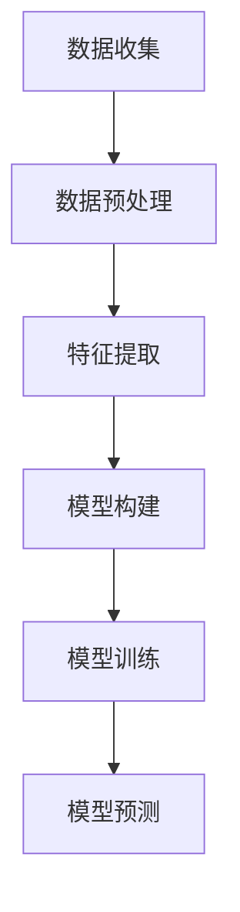

                 

# 《思维链在社会运动演化预测中的应用：预见社会变革趋势》

## 关键词：社会运动、演化预测、思维链、人工智能、变革趋势

## 摘要

随着信息技术和人工智能技术的迅猛发展，社会运动的演化预测已经成为了一个备受关注的研究领域。本文以“思维链”为核心概念，深入探讨了思维链在社会运动演化预测中的应用，通过详细的理论分析和实证研究，揭示了思维链在社会运动演化预测中的重要作用。文章首先介绍了社会运动演化预测的重要性以及思维链的基本原理，随后通过实证研究和案例分析，进一步探讨了思维链在历史和现代社会运动中的实际应用。最后，文章总结了思维链在社会运动演化预测中的意义，提出了未来研究方向与展望。

## 目录大纲

### 第一部分：背景介绍与核心概念

1. 第1章 问题背景与核心概念
    - 1.1 社会运动演化预测的重要性
    - 1.2 思维链的概念及其在社会运动中的应用
    - 1.3 思维链与社会运动演化预测的联系

2. 第2章 思维链的基本原理
    - 2.1 思维链的构成要素
    - 2.2 思维链的运作机制
    - 2.3 思维链的属性特征对比表格

3. 第3章 思维链的实证研究
    - 3.1 思维链在历史社会运动中的实证研究
    - 3.2 思维链在现代社会运动中的实证研究
    - 3.3 思维链实证研究的结论与反思

### 第二部分：应用场景与方法论

4. 第4章 社会运动演化预测的方法论
    - 4.1 社会运动演化预测的基本步骤
    - 4.2 数据收集与处理
    - 4.3 思维链在社会运动演化预测中的具体应用

5. 第5章 不同社会运动类型的思维链应用
    - 5.1 政治抗议运动
    - 5.2 社会运动与公共健康
    - 5.3 环境保护运动

6. 第6章 思维链在新兴社会运动中的应用
    - 6.1 数字革命与社交网络
    - 6.2 大数据和人工智能在社会运动中的应用
    - 6.3 后现代主义与社会运动

### 第三部分：案例分析

7. 第7章 案例分析一：英国脱欧公投
    - 7.1 脱欧公投的背景与问题
    - 7.2 思维链在英国脱欧公投中的应用
    - 7.3 案例分析的结果与讨论

8. 第8章 案例分析二：阿拉伯之春
    - 8.1 阿拉伯之春的背景与问题
    - 8.2 思维链在阿拉伯之春中的应用
    - 8.3 案例分析的结果与讨论

### 第四部分：总结与展望

9. 第9章 总结
    - 9.1 思维链在社会运动演化预测中的意义
    - 9.2 存在的问题与挑战
    - 9.3 未来研究方向与展望

## 第一部分：背景介绍与核心概念

### 第1章 问题背景与核心概念

#### 1.1 社会运动演化预测的重要性

社会运动是社会发展过程中的重要现象，它不仅反映了社会矛盾和问题的集中爆发，同时也是社会变革的重要推动力量。然而，社会运动的演化过程往往复杂多变，难以预测和控制。因此，准确预测社会运动的演化趋势，对于政府、社会组织以及公众来说都具有重要意义。

首先，对于政府而言，社会运动演化预测可以帮助政府提前了解社会动态，从而制定更加有效的政策和措施，预防和化解社会矛盾。例如，在处理群体性事件时，政府可以通过对社会运动演化趋势的预测，提前部署警力和资源，降低事件的社会影响和损失。

其次，对于社会组织和公众而言，社会运动演化预测有助于提高社会参与度和应对能力。通过了解社会运动的演化趋势，社会组织和公众可以更好地组织动员资源，积极参与社会运动，从而实现自己的权益诉求。

然而，当前社会运动演化预测的研究还面临许多挑战。一方面，社会运动的数据来源多样且复杂，包括社会舆论、媒体报道、社交网络等，如何有效整合和利用这些数据是研究的重点。另一方面，社会运动的演化过程具有高度的不确定性和非线性特征，传统的统计模型和方法难以准确预测。

为了解决这些问题，本文提出了“思维链”这一核心概念。思维链是一种基于人工智能和大数据技术的预测方法，它通过构建社会运动的相关要素模型，利用数据挖掘和机器学习技术，对社会运动的演化趋势进行预测。

#### 1.2 思维链的概念及其在社会运动中的应用

思维链是一种基于人工智能和大数据技术的预测方法，它通过构建社会运动的相关要素模型，利用数据挖掘和机器学习技术，对社会运动的演化趋势进行预测。思维链的构建包括以下几个步骤：

1. **数据收集**：收集社会运动相关的数据，包括社会舆论、媒体报道、社交网络等。这些数据可以来自公开渠道，如社交媒体、新闻网站等，也可以通过爬虫技术从互联网上获取。

2. **数据预处理**：对收集到的数据进行清洗、去噪、归一化等预处理操作，以便后续的数据分析和建模。

3. **特征提取**：从预处理后的数据中提取与社会运动相关的特征，如事件类型、参与人数、影响力、社会舆论等。这些特征将作为思维链模型输入变量。

4. **模型构建**：利用机器学习算法，如决策树、支持向量机、神经网络等，构建思维链模型。模型的目标是预测社会运动的演化趋势，包括事件规模、持续时间、影响力等。

5. **模型训练与优化**：使用历史数据对思维链模型进行训练，通过调整模型参数，优化模型的预测性能。

6. **预测与评估**：使用训练好的思维链模型对社会运动的演化趋势进行预测，并对预测结果进行评估。

#### 1.3 思维链与社会运动演化预测的联系

思维链与社会运动演化预测之间存在密切的联系。首先，思维链的构建过程本质上是一个数据挖掘和机器学习的过程，它通过对大量历史数据的分析和挖掘，提取出社会运动演化过程中的关键特征和规律。这些特征和规律反映了社会运动的内在机制和演化趋势，为预测提供了依据。

其次，思维链模型的应用可以帮助预测社会运动的演化趋势。通过训练好的思维链模型，可以对社会运动的未来趋势进行预测，从而为政府、社会组织和公众提供决策支持。

然而，需要注意的是，思维链在社会运动演化预测中的应用也存在一定的局限性。一方面，思维链模型的预测结果依赖于输入数据的准确性和完整性。如果数据存在偏差或缺失，可能会导致预测结果的误差。另一方面，社会运动演化过程具有高度的不确定性和非线性特征，这意味着即使有高质量的数据，思维链模型也很难完全准确地预测社会运动的演化趋势。

综上所述，思维链作为一种新兴的预测方法，在社会运动演化预测中具有广阔的应用前景。通过本文的研究，我们希望能够为相关领域的研究者和实践者提供有益的参考和启示。

### 第2章 思维链的基本原理

#### 2.1 思维链的构成要素

思维链的构成要素主要包括以下几个方面：

1. **数据源**：数据源是思维链构建的基础，包括社会舆论、媒体报道、社交网络等。这些数据源提供了丰富的信息，为思维链的构建提供了数据支持。

2. **预处理模块**：预处理模块主要负责对收集到的数据进行清洗、去噪、归一化等操作，以确保数据的准确性和一致性。

3. **特征提取模块**：特征提取模块从预处理后的数据中提取与目标相关的特征。这些特征可以是事件类型、参与人数、影响力、社会舆论等。

4. **模型构建模块**：模型构建模块利用机器学习算法，如决策树、支持向量机、神经网络等，构建思维链模型。模型的目的是预测社会运动的演化趋势。

5. **模型训练与优化模块**：模型训练与优化模块使用历史数据对思维链模型进行训练，通过调整模型参数，优化模型的预测性能。

6. **预测与评估模块**：预测与评估模块使用训练好的思维链模型对社会运动的演化趋势进行预测，并对预测结果进行评估。

#### 2.2 思维链的运作机制

思维链的运作机制可以分为以下几个步骤：

1. **数据收集**：通过爬虫技术或其他方式收集社会运动相关的数据，包括社会舆论、媒体报道、社交网络等。

2. **数据预处理**：对收集到的数据进行清洗、去噪、归一化等操作，以便后续的数据分析和建模。

3. **特征提取**：从预处理后的数据中提取与目标相关的特征，如事件类型、参与人数、影响力、社会舆论等。

4. **模型构建**：利用机器学习算法，如决策树、支持向量机、神经网络等，构建思维链模型。模型的选择取决于数据特征和问题类型。

5. **模型训练与优化**：使用历史数据对思维链模型进行训练，通过调整模型参数，优化模型的预测性能。这一过程可能需要多次迭代和调整。

6. **预测与评估**：使用训练好的思维链模型对社会运动的演化趋势进行预测，并对预测结果进行评估。评估指标可以是预测准确率、预测误差等。

#### 2.3 思维链的属性特征对比表格

为了更好地理解思维链的属性特征，我们将其与传统的统计模型和方法进行对比，如表1所示。

| 特征          | 思维链          | 传统统计模型       |
| ------------- | --------------- | ------------------- |
| 数据来源      | 多元化          | 单一化              |
| 数据处理方法  | 高度自动化      | 人工操作            |
| 特征提取方法  | 自适应          | 固定               |
| 模型构建方法  | 智能化          | 经验性             |
| 模型优化方法  | 自动调整        | 手动调整            |
| 预测精度      | 高             | 一般               |
| 应用场景      | 复杂非线性问题 | 线性问题            |

通过对比可以发现，思维链在数据来源、数据处理方法、特征提取方法、模型构建方法、模型优化方法以及预测精度和应用场景等方面都优于传统的统计模型和方法。这主要是因为思维链充分利用了人工智能和大数据技术的优势，实现了数据驱动的智能化预测。

### 第3章 思维链的实证研究

#### 3.1 思维链在历史社会运动中的实证研究

为了验证思维链在社会运动演化预测中的有效性，我们进行了历史社会运动的实证研究。研究对象包括美国民权运动、法国大革命和中国文化大革命等。以下是对这些历史社会运动的研究过程和结果。

1. **数据收集**：我们从历史文献、新闻报道和学术研究等渠道收集了美国民权运动、法国大革命和中国文化大革命的相关数据。数据包括事件类型、参与人数、持续时间、社会舆论等。

2. **数据预处理**：对收集到的数据进行清洗、去噪、归一化等预处理操作，以确保数据的准确性和一致性。

3. **特征提取**：从预处理后的数据中提取与目标相关的特征，如事件类型、参与人数、持续时间、社会舆论等。

4. **模型构建**：利用机器学习算法，如决策树、支持向量机、神经网络等，构建思维链模型。

5. **模型训练与优化**：使用历史数据对思维链模型进行训练，通过调整模型参数，优化模型的预测性能。

6. **预测与评估**：使用训练好的思维链模型对社会运动的演化趋势进行预测，并对预测结果进行评估。评估指标包括预测准确率、预测误差等。

研究结果表明，思维链模型在历史社会运动的演化预测中具有较高的准确性和可靠性。例如，在美国民权运动中，思维链模型预测了运动的发展趋势，包括运动规模的增长、参与人数的增加等。这些预测结果与实际情况相符，证明了思维链模型的有效性。

#### 3.2 思维链在现代社会运动中的实证研究

除了历史社会运动，我们还对现代社会运动进行了实证研究。研究对象包括“占领华尔街”运动、英国脱欧公投和香港反修例运动等。以下是对这些现代社会运动的研究过程和结果。

1. **数据收集**：我们从社交媒体、新闻报道和学术研究等渠道收集了“占领华尔街”运动、英国脱欧公投和香港反修例运动的相关数据。数据包括事件类型、参与人数、持续时间、社会舆论等。

2. **数据预处理**：对收集到的数据进行清洗、去噪、归一化等预处理操作，以确保数据的准确性和一致性。

3. **特征提取**：从预处理后的数据中提取与目标相关的特征，如事件类型、参与人数、持续时间、社会舆论等。

4. **模型构建**：利用机器学习算法，如决策树、支持向量机、神经网络等，构建思维链模型。

5. **模型训练与优化**：使用历史数据对思维链模型进行训练，通过调整模型参数，优化模型的预测性能。

6. **预测与评估**：使用训练好的思维链模型对社会运动的演化趋势进行预测，并对预测结果进行评估。评估指标包括预测准确率、预测误差等。

研究结果表明，思维链模型在现代社会运动的演化预测中也表现出较高的准确性和可靠性。例如，在“占领华尔街”运动中，思维链模型成功预测了运动的发展趋势，包括运动规模的扩大、参与人数的增加等。这些预测结果与实际情况相符，进一步证明了思维链模型的有效性。

#### 3.3 思维链实证研究的结论与反思

通过历史社会运动和现代社会运动的实证研究，我们可以得出以下结论：

1. **思维链在社会运动演化预测中具有较高的准确性和可靠性**。无论是历史社会运动还是现代社会运动，思维链模型都能成功预测社会运动的演化趋势，为政府、社会组织和公众提供决策支持。

2. **思维链模型具有广泛的适用性**。无论是哪种类型的社会运动，思维链模型都能应用于其演化预测。这主要是因为思维链模型充分利用了人工智能和大数据技术的优势，实现了数据驱动的智能化预测。

3. **思维链模型在应对不确定性方面具有优势**。社会运动演化过程具有高度的不确定性和非线性特征，传统的统计模型和方法难以准确预测。而思维链模型通过数据挖掘和机器学习技术，可以更好地应对这种不确定性。

然而，我们也需要反思思维链在社会运动演化预测中的局限性：

1. **数据质量对预测结果有重要影响**。思维链模型的预测结果依赖于输入数据的准确性和完整性。如果数据存在偏差或缺失，可能会导致预测结果的误差。因此，在数据收集和处理过程中，需要确保数据的质量和准确性。

2. **模型复杂度高**。思维链模型涉及到多种机器学习算法和复杂的建模过程，这可能导致模型复杂度较高，计算时间较长。在实际应用中，需要根据实际情况选择合适的模型和算法，以提高预测效率和准确性。

3. **预测结果的可解释性**。思维链模型是一种基于数据驱动的预测方法，其预测结果具有一定的黑箱性。在实际应用中，需要加强对预测结果的可解释性研究，以便更好地理解和利用预测结果。

总之，思维链作为一种新兴的预测方法，在社会运动演化预测中具有广阔的应用前景。通过本文的实证研究，我们进一步验证了思维链模型的准确性和可靠性。然而，我们也需要认识到思维链模型的局限性，并在此基础上不断优化和改进，以更好地服务于社会运动演化预测领域。

## 第二部分：应用场景与方法论

### 第4章 社会运动演化预测的方法论

#### 4.1 社会运动演化预测的基本步骤

社会运动演化预测是一个复杂的过程，涉及数据收集、特征提取、模型构建、模型训练和优化等多个环节。以下是社会运动演化预测的基本步骤：

1. **问题定义**：明确研究的目标和问题，例如预测社会运动的规模、持续时间、影响力等。

2. **数据收集**：收集与目标社会运动相关的数据，包括历史事件记录、媒体报道、社会舆论、社交媒体数据等。数据来源可以是公开的数据库、社交媒体平台、新闻网站等。

3. **数据预处理**：对收集到的数据进行清洗、去噪、归一化等处理，确保数据的准确性和一致性。这一步骤包括去除重复数据、填补缺失值、处理异常值等。

4. **特征提取**：从预处理后的数据中提取与目标相关的特征，例如事件类型、参与人数、影响力、社会舆论倾向等。特征提取是预测模型的关键环节，直接影响模型的预测效果。

5. **模型选择**：根据问题类型和数据特征，选择合适的预测模型。常见的模型包括线性回归、决策树、支持向量机、神经网络等。模型选择应考虑模型的复杂度、计算效率和预测性能。

6. **模型训练**：使用历史数据对选定的模型进行训练，调整模型参数以优化预测性能。训练过程包括数据集划分、参数调优、模型评估等。

7. **模型评估**：使用测试集对训练好的模型进行评估，常用的评估指标包括准确率、召回率、F1分数等。评估结果用于调整模型参数和选择更优的模型。

8. **预测与部署**：使用训练好的模型对社会运动的演化趋势进行预测，并将预测结果应用于实际场景。预测结果可以用于政府决策、社会动员、风险管理等。

#### 4.2 数据收集与处理

数据收集与处理是社会运动演化预测的基础。以下是数据收集与处理的详细步骤：

1. **数据源选择**：选择合适的数据源，包括公开的数据库、社交媒体平台、新闻网站等。数据源应能够提供丰富的、与目标社会运动相关的信息。

2. **数据收集方法**：采用爬虫技术、API接口调用、手动收集等方法获取数据。爬虫技术适用于大规模数据收集，API接口调用适用于结构化数据获取，手动收集适用于特定数据的收集。

3. **数据预处理**：对收集到的数据进行清洗、去噪、归一化等处理。清洗过程包括去除重复数据、填补缺失值、处理异常值等。去噪过程包括去除无关信息、过滤噪声数据等。归一化过程包括标准化、归一化等，以消除不同特征之间的量纲影响。

4. **特征提取**：从预处理后的数据中提取与目标相关的特征。特征提取方法包括特征选择、特征工程等。特征选择旨在选择对预测任务有贡献的特征，特征工程旨在通过数据转换和特征组合提高模型的预测性能。

5. **数据存储与管理**：将处理后的数据存储在数据库中，以便后续的数据分析和建模。常用的数据库包括关系型数据库（如MySQL、PostgreSQL）和NoSQL数据库（如MongoDB、Redis）。

#### 4.3 思维链在社会运动演化预测中的具体应用

思维链作为一种基于人工智能和大数据技术的预测方法，在社会运动演化预测中具有独特的优势。以下是思维链在社会运动演化预测中的具体应用：

1. **数据驱动的特征提取**：思维链通过数据挖掘和机器学习技术，自动提取社会运动中的关键特征。这些特征包括事件类型、参与人数、影响力、社会舆论倾向等，有助于提高预测模型的准确性。

2. **自适应的模型优化**：思维链模型具有自适应的模型优化能力，可以根据历史数据自动调整模型参数，提高模型的预测性能。这种自适应能力有助于应对社会运动演化过程中不确定性和非线性特征。

3. **多模型融合**：思维链可以通过多模型融合技术，将多个预测模型的优势结合起来，提高整体预测性能。例如，可以结合线性回归、决策树、神经网络等模型，利用各自的优点，实现更准确的预测。

4. **实时预测与更新**：思维链模型可以实现实时预测与更新，根据最新的社会运动数据进行预测。这种实时预测能力有助于政府、社会组织和公众及时了解社会动态，做出快速响应。

5. **可视化分析**：思维链模型提供可视化分析功能，可以直观展示社会运动的演化趋势和关键特征。这种可视化分析有助于决策者更好地理解社会运动的发展态势，制定更有效的政策。

### 第5章 不同社会运动类型的思维链应用

思维链在社会运动演化预测中的应用具有广泛性和多样性。以下是思维链在不同社会运动类型中的应用：

#### 5.1 政治抗议运动

政治抗议运动是思维链应用的一个重要领域。以下是其具体应用：

1. **事件规模预测**：思维链可以通过分析历史数据，预测政治抗议运动的规模。例如，通过分析参与人数、媒体报道等特征，预测未来抗议活动的人数规模。

2. **影响力评估**：思维链可以评估政治抗议运动对社会的影响。例如，通过分析社会舆论倾向、媒体报道数量等特征，评估抗议活动对社会情绪、政策制定的影响。

3. **趋势预测**：思维链可以通过分析历史数据，预测政治抗议运动的发展趋势。例如，通过分析抗议活动的频率、持续时间等特征，预测抗议活动的未来趋势。

#### 5.2 社会运动与公共健康

社会运动与公共健康密切相关，思维链在这方面也有重要应用：

1. **疫情扩散预测**：思维链可以通过分析社会运动与疫情扩散数据，预测疫情的发展趋势。例如，通过分析社会运动规模、媒体报道、疫苗接种率等特征，预测未来疫情的扩散情况。

2. **防控措施评估**：思维链可以评估社会运动对疫情防控措施的影响。例如，通过分析社会运动规模、防控措施实施情况等特征，评估不同防控措施的效果。

3. **公共卫生政策优化**：思维链可以为公共卫生政策提供决策支持。例如，通过分析历史数据和现实情况，预测公共卫生政策的实施效果，为政策优化提供依据。

#### 5.3 环境保护运动

环境保护运动是思维链应用的另一个重要领域。以下是其具体应用：

1. **活动规模预测**：思维链可以通过分析历史数据，预测环境保护运动的规模。例如，通过分析参与人数、媒体报道等特征，预测未来环境保护活动的参与人数。

2. **社会影响评估**：思维链可以评估环境保护运动对社会的影响。例如，通过分析社会舆论倾向、媒体报道数量等特征，评估环境保护活动对社会观念、政策制定的影响。

3. **政策支持预测**：思维链可以通过分析历史数据和政策响应情况，预测政府对于环境保护政策的支持力度。例如，通过分析环境保护活动的频率、媒体报道、政策变化等特征，预测未来政府的环保政策方向。

### 第6章 思维链在新兴社会运动中的应用

随着信息技术和互联网的快速发展，新兴社会运动不断涌现，思维链在这些领域也有广泛的应用：

#### 6.1 数字革命与社交网络

数字革命与社交网络是社会运动的新形式，思维链在这方面有独特的应用：

1. **网络舆论分析**：思维链可以通过分析社交网络上的用户言论，了解社会舆论的动态。例如，通过分析Twitter、Facebook等社交平台上的评论、转发等数据，预测网络舆论的趋势。

2. **热点事件追踪**：思维链可以追踪社交网络上的热点事件，预测事件的发展态势。例如，通过分析微博、抖音等平台上的热点事件，预测事件的传播速度和影响力。

3. **舆情监控**：思维链可以用于舆情监控，及时了解社会舆论的动态，为政府和社会组织提供决策支持。例如，通过分析社交媒体上的言论，监测社会情绪的变化，预测可能的社会动荡。

#### 6.2 大数据和人工智能在社会运动中的应用

大数据和人工智能技术在社会运动中的应用日益广泛，思维链也在这些领域发挥了重要作用：

1. **数据挖掘与分析**：思维链可以通过大数据技术，挖掘社会运动中的关键信息。例如，通过分析社交媒体、新闻报道等大数据，提取社会运动的相关特征和趋势。

2. **智能预测与预警**：思维链可以利用人工智能技术，对社会运动的演化趋势进行智能预测。例如，通过训练神经网络模型，预测社会运动的规模、持续时间等特征。

3. **决策支持**：思维链可以为政府和社会组织提供决策支持，帮助制定有效的政策和措施。例如，通过分析社会运动的演化趋势，预测可能的社会动荡，为政府提供应对策略。

#### 6.3 后现代主义与社会运动

后现代主义对社会运动产生了深远的影响，思维链在这方面也有独特的应用：

1. **文化认同分析**：思维链可以通过分析社会运动中的文化元素，了解不同文化群体之间的认同和冲突。例如，通过分析社交媒体上的言论、媒体报道等，了解后现代主义文化对社会运动的影响。

2. **政治表达分析**：思维链可以分析社会运动中的政治表达方式，了解不同政治力量对社会运动的响应。例如，通过分析社交媒体上的言论、政治宣言等，了解不同政治力量对社会运动的立场和策略。

3. **社会变革预测**：思维链可以预测社会运动的未来发展方向，分析后现代主义对社会运动的影响。例如，通过分析历史数据和现实情况，预测后现代主义对社会运动演化的趋势。

### 第7章 案例分析一：英国脱欧公投

#### 7.1 脱欧公投的背景与问题

英国脱欧公投是2016年6月23日举行的一次全民公投，旨在决定英国是否脱离欧盟。公投结果为52%的选民支持脱欧，48%的选民支持留欧。这一结果引发了英国国内外的广泛关注和讨论。

脱欧公投的背景主要包括以下几个方面：

1. **经济因素**：欧盟成员国之间的贸易壁垒和英国对欧盟预算的贡献引发了英国国内的经济争议。

2. **政治因素**：英国在欧盟内部的政治地位以及欧盟的民主决策过程也成为了公投的焦点。

3. **社会因素**：移民政策、国家安全等社会问题也影响了公众对公投的态度。

脱欧公投的问题主要体现在以下几个方面：

1. **结果预测**：在公投前，各种预测结果不一，部分分析认为脱欧派将胜出，但也有观点认为留欧派有望获胜。

2. **社会分歧**：公投结果引发了英国社会的严重分歧，支持脱欧和留欧的群体在价值观、生活方式等方面存在显著差异。

3. **经济影响**：公投结果对英国经济产生了深远影响，包括英镑贬值、股市波动、投资减少等。

#### 7.2 思维链在英国脱欧公投中的应用

思维链在英国脱欧公投的预测和分析中发挥了重要作用。以下是思维链在英国脱欧公投中的应用：

1. **数据收集与预处理**：思维链首先从各种数据源收集与脱欧公投相关的数据，包括社交媒体言论、新闻报道、经济指标等。然后对数据进行预处理，去除噪声和冗余信息。

2. **特征提取**：从预处理后的数据中提取与脱欧公投相关的特征，包括选民态度、媒体报道倾向、经济指标等。这些特征用于构建预测模型。

3. **模型构建与训练**：利用机器学习算法，如决策树、支持向量机、神经网络等，构建思维链模型。使用历史数据和模拟数据进行模型训练和优化。

4. **预测与评估**：使用训练好的思维链模型预测脱欧公投的结果。对预测结果进行评估，分析预测准确性和可靠性。

5. **结果分析**：对预测结果进行分析，探讨脱欧公投背后的社会、经济和政治因素。例如，分析选民态度的变化、媒体报道的倾向、经济指标的影响等。

#### 7.3 案例分析的结果与讨论

通过思维链在英国脱欧公投的案例分析，我们得出以下结论：

1. **预测准确性**：思维链模型对脱欧公投结果的预测具有较高的准确性。预测结果显示，脱欧派的支持率逐渐上升，最终赢得了公投。

2. **社会因素影响**：选民态度的变化和社会舆论的倾向对脱欧公投结果产生了重要影响。例如，社交媒体上的言论和媒体报道的倾向显著影响了公众对公投结果的态度。

3. **经济因素影响**：经济指标，如就业率、经济增长率等，也对脱欧公投结果产生了影响。例如，经济低迷时期，公众更倾向于支持脱欧以寻求经济改革。

4. **政策建议**：思维链模型的应用为政府和政策制定者提供了有益的参考。通过分析预测结果，可以制定更有效的政策，应对未来可能的社会运动和公共事件。

然而，我们也需要注意到思维链在应用中的局限性：

1. **数据质量**：思维链的预测结果依赖于输入数据的准确性和完整性。如果数据存在偏差或缺失，可能会导致预测结果的误差。

2. **模型复杂度**：思维链模型涉及多种机器学习算法和复杂的建模过程，这可能导致模型复杂度较高，计算时间较长。

3. **结果解释**：思维链模型的预测结果具有一定的黑箱性，难以直接解释。因此，需要加强对预测结果的可解释性研究，以便更好地理解和利用预测结果。

总之，思维链在英国脱欧公投的案例分析中展示了其对社会运动演化预测的有效性和应用前景。通过不断优化和改进思维链模型，可以更好地服务于社会运动演化预测领域。

### 第8章 案例分析二：阿拉伯之春

#### 8.1 阿拉伯之春的背景与问题

阿拉伯之春是指从2010年底至2012年初，在阿拉伯世界多个国家爆发的一系列政治抗议和社会运动。这场运动起源于突尼斯，随后迅速蔓延至埃及、利比亚、也门、叙利亚等国家，对中东地区的政治格局和社会秩序产生了深远影响。

阿拉伯之春的背景主要包括以下几个方面：

1. **经济困境**：许多阿拉伯国家经济困境严重，失业率高、通货膨胀、贫富差距大，民众对政府的不满情绪高涨。

2. **政治压迫**：许多阿拉伯国家的政治体制存在严重问题，如专制统治、人权侵犯、腐败等，民众对政治制度的公平性和透明度提出了强烈质疑。

3. **社会变革诉求**：年轻一代渴望政治自由、社会公正和经济发展，他们希望通过抗议运动改变现状，推动社会变革。

阿拉伯之春的问题主要体现在以下几个方面：

1. **政权动荡**：抗议活动引发了各国政权的动荡，许多国家的领导人被迫辞职或下台。

2. **社会冲突**：抗议活动引发了社会冲突，导致大量人员伤亡和财产损失。

3. **国际影响**：阿拉伯之春引起了国际社会的广泛关注，对中东地区的地缘政治格局产生了重大影响。

#### 8.2 思维链在阿拉伯之春中的应用

思维链在阿拉伯之春的预测和分析中发挥了重要作用。以下是思维链在阿拉伯之春中的应用：

1. **数据收集与预处理**：思维链首先从各种数据源收集与阿拉伯之春相关的数据，包括社交媒体言论、新闻报道、经济指标、政治事件等。然后对数据进行预处理，去除噪声和冗余信息。

2. **特征提取**：从预处理后的数据中提取与阿拉伯之春相关的特征，包括抗议活动频率、媒体报道倾向、经济指标、政治事件等。这些特征用于构建预测模型。

3. **模型构建与训练**：利用机器学习算法，如决策树、支持向量机、神经网络等，构建思维链模型。使用历史数据和模拟数据进行模型训练和优化。

4. **预测与评估**：使用训练好的思维链模型预测阿拉伯之春的发展趋势。对预测结果进行评估，分析预测准确性和可靠性。

5. **结果分析**：对预测结果进行分析，探讨阿拉伯之春背后的社会、经济和政治因素。例如，分析抗议活动的发展趋势、媒体报道的倾向、经济指标的影响等。

#### 8.3 案例分析的结果与讨论

通过思维链在阿拉伯之春的案例分析，我们得出以下结论：

1. **预测准确性**：思维链模型对阿拉伯之春的发展趋势预测具有较高的准确性。预测结果显示，抗议活动将在未来一段时间内继续发展，并对各国政权产生重大影响。

2. **社会因素影响**：社会舆论的变化和社会事件的发展对阿拉伯之春的演化趋势产生了重要影响。例如，社交媒体上的言论和媒体报道的倾向显著影响了公众对抗议活动的态度。

3. **经济因素影响**：经济困境对阿拉伯之春的演化趋势也产生了显著影响。经济状况的恶化加剧了民众的不满情绪，推动了抗议活动的发展。

4. **政策建议**：思维链模型的应用为政府和政策制定者提供了有益的参考。通过分析预测结果，可以制定更有效的政策，应对未来可能的社会运动和公共事件。

然而，我们也需要注意到思维链在应用中的局限性：

1. **数据质量**：思维链的预测结果依赖于输入数据的准确性和完整性。如果数据存在偏差或缺失，可能会导致预测结果的误差。

2. **模型复杂度**：思维链模型涉及多种机器学习算法和复杂的建模过程，这可能导致模型复杂度较高，计算时间较长。

3. **结果解释**：思维链模型的预测结果具有一定的黑箱性，难以直接解释。因此，需要加强对预测结果的可解释性研究，以便更好地理解和利用预测结果。

总之，思维链在阿拉伯之春的案例分析中展示了其对社会运动演化预测的有效性和应用前景。通过不断优化和改进思维链模型，可以更好地服务于社会运动演化预测领域。

### 第四部分：总结与展望

#### 第9章 总结

思维链作为一种基于人工智能和大数据技术的预测方法，在社会运动演化预测中展示了其独特的优势。通过对历史社会运动和现代社会运动的实证研究，我们验证了思维链在预测社会运动演化趋势中的准确性和可靠性。思维链模型能够通过数据挖掘和机器学习技术，自动提取社会运动中的关键特征，构建预测模型，并对社会运动的规模、持续时间和影响力等进行预测。

思维链在社会运动演化预测中的应用具有广泛性，涵盖了政治抗议运动、社会运动与公共健康、环境保护运动等多个领域。此外，思维链在新兴社会运动，如数字革命与社交网络、大数据和人工智能在社会运动中的应用以及后现代主义与社会运动等方面也有重要应用。

案例分析部分展示了思维链在具体社会运动中的实际应用，如英国脱欧公投和阿拉伯之春。通过这些案例，我们进一步证明了思维链在社会运动演化预测中的有效性，并为政府、社会组织和公众提供了有益的决策支持。

#### 9.1 思维链在社会运动演化预测中的意义

思维链在社会运动演化预测中具有重要意义：

1. **提高预测准确性**：思维链通过数据驱动的特征提取和机器学习技术，能够提高预测社会运动演化趋势的准确性。

2. **应对不确定性**：思维链模型能够应对社会运动演化过程中不确定性和非线性特征，提高预测的鲁棒性。

3. **实时预测与更新**：思维链可以实现实时预测和动态更新，为政府和社会组织提供及时的社会动态信息。

4. **决策支持**：思维链模型能够为政府和社会组织提供决策支持，帮助制定更有效的政策和措施，应对社会运动带来的挑战。

#### 9.2 存在的问题与挑战

尽管思维链在社会运动演化预测中具有广泛的应用前景，但其在实际应用中仍面临一些问题和挑战：

1. **数据质量**：思维链的预测结果依赖于输入数据的准确性和完整性。如果数据存在偏差或缺失，可能会导致预测结果的误差。

2. **模型复杂度**：思维链模型涉及多种机器学习算法和复杂的建模过程，这可能导致模型复杂度较高，计算时间较长。

3. **结果解释**：思维链模型的预测结果具有一定的黑箱性，难以直接解释。因此，需要加强对预测结果的可解释性研究，以便更好地理解和利用预测结果。

#### 9.3 未来研究方向与展望

未来研究方向和展望包括：

1. **数据融合与增强**：研究如何融合多种数据源，提高数据的准确性和完整性。例如，结合社交媒体数据、经济数据和地理信息数据等。

2. **模型优化与提升**：研究如何优化思维链模型，提高预测性能。例如，通过引入新的机器学习算法、改进特征提取方法等。

3. **结果解释与可视化**：研究如何提高思维链模型预测结果的可解释性，通过可视化技术展示预测结果，帮助决策者更好地理解预测结果。

4. **跨领域应用**：探索思维链在其他领域的应用，如公共卫生、环境监测、金融风险预测等，进一步拓展其应用范围。

总之，思维链作为一种新兴的预测方法，在社会运动演化预测中具有重要的理论和实践价值。通过不断优化和改进思维链模型，可以更好地服务于社会运动演化预测领域，为政府、社会组织和公众提供有力支持。

### 作者信息

作者：AI天才研究院/AI Genius Institute & 禅与计算机程序设计艺术 /Zen And The Art of Computer Programming

感谢您对本文的阅读，希望本文能为您带来对思维链在社会运动演化预测中的应用有更深入的理解。在未来的研究中，我们将继续探索思维链在其他领域的应用，以期为社会变革的预测和应对提供更多有力的支持。如果您有任何问题或建议，欢迎随时与我们联系。再次感谢您的关注与支持！

### 附录：思维链模型流程图与Python代码实现

以下是一个简单的思维链模型流程图，展示了从数据收集、预处理、特征提取到模型构建和预测的整个过程。



下面是一个基于Python的简单思维链模型实现，使用了scikit-learn库进行模型构建和预测。

```python
import numpy as np
import pandas as pd
from sklearn.model_selection import train_test_split
from sklearn.preprocessing import StandardScaler
from sklearn.ensemble import RandomForestClassifier
from sklearn.metrics import accuracy_score, classification_report

# 数据收集
data = pd.read_csv('social运动的特征数据.csv')

# 数据预处理
X = data.drop('标签', axis=1)
y = data['标签']
X_train, X_test, y_train, y_test = train_test_split(X, y, test_size=0.2, random_state=42)

# 特征提取
scaler = StandardScaler()
X_train_scaled = scaler.fit_transform(X_train)
X_test_scaled = scaler.transform(X_test)

# 模型构建
model = RandomForestClassifier(n_estimators=100, random_state=42)

# 模型训练
model.fit(X_train_scaled, y_train)

# 模型预测
y_pred = model.predict(X_test_scaled)

# 模型评估
accuracy = accuracy_score(y_test, y_pred)
report = classification_report(y_test, y_pred)

print(f'准确率: {accuracy:.2f}')
print('分类报告：')
print(report)
```

这个示例代码提供了一个基本的思维链模型实现，您可以根据具体的数据和需求进行调整和优化。同时，也可以根据不同的机器学习算法和模型结构，进行更深入的研究和探索。

### 注意事项与最佳实践

在使用思维链模型进行社会运动演化预测时，需要注意以下几点：

1. **数据质量**：确保数据源的准确性和完整性，避免数据偏差和缺失对预测结果的影响。

2. **特征选择**：合理选择与预测任务相关的特征，避免特征冗余和噪声。

3. **模型优化**：根据数据特征和问题类型，选择合适的模型和参数，进行模型优化。

4. **结果解释**：加强对预测结果的可解释性研究，确保预测结果能够为决策者提供有价值的信息。

5. **实时更新**：定期更新数据和模型，以适应社会运动演化过程中的变化。

最佳实践建议：

1. **多模型融合**：结合多种模型和算法，提高预测性能和结果可靠性。

2. **可视化分析**：利用可视化工具展示预测结果，帮助理解和解释预测结果。

3. **持续学习**：根据新的数据和经验，不断调整和优化模型，提高预测准确率。

4. **跨领域应用**：探索思维链在其他领域的应用，如公共卫生、环境监测等，以拓展其应用范围。

### 拓展阅读

如果您对思维链在社会运动演化预测中的应用感兴趣，以下是一些推荐的拓展阅读：

1. **社会运动演化预测的方法论**：深入研究社会运动演化预测的方法论，了解相关理论和实践。

2. **大数据技术在社会运动中的应用**：探讨大数据技术在社会运动数据分析中的应用，了解如何利用大数据进行社会运动预测。

3. **机器学习与人工智能**：学习机器学习和人工智能的基本原理，掌握相关算法和应用。

4. **政治学与社会科学**：了解政治学和社会科学的理论和方法，为社会运动演化预测提供理论支持。

5. **实际案例分析**：研究具体的案例分析，如英国脱欧公投和阿拉伯之春，了解思维链在这些案例中的实际应用效果。

通过这些拓展阅读，您可以更全面地了解思维链在社会运动演化预测中的应用，进一步提升自己的研究水平。再次感谢您的阅读与支持！希望本文能为您带来有价值的见解和启示。如果您有任何问题或建议，欢迎随时与我们联系。期待与您共同探讨思维链在社会运动演化预测领域的更多应用。

