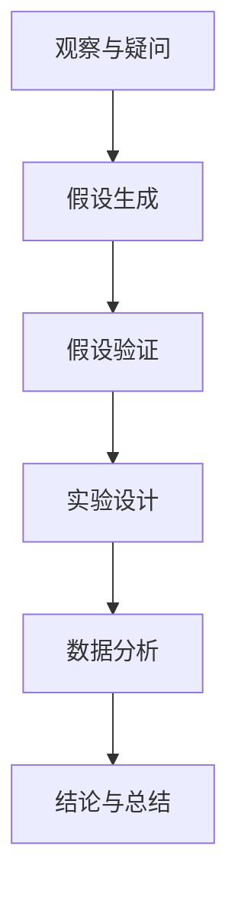
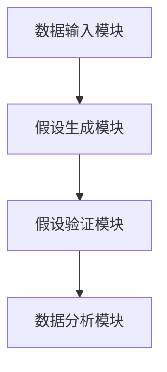
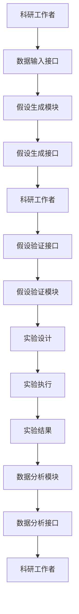

                 

# 思维链在科学研究中的应用：假设生成与验证

关键词：思维链、科学研究、假设生成、验证

摘要：本文深入探讨了思维链在科学研究中的重要作用，特别是假设生成与验证的过程。通过详细的案例分析，本文展示了如何运用逻辑思维链条来提高科研效率，确保研究结果的准确性和可靠性。

---

## 引言

在科学研究的进程中，假设生成与验证是两个至关重要的环节。科学探索往往始于对现象的观察与疑问，进而形成假设，并通过实验或观察来验证这些假设。然而，如何有效地生成有价值的假设，并确保其验证的准确性和全面性，一直是科研工作者面临的一大挑战。本文将探讨思维链在科学研究中的应用，通过逻辑清晰、结构紧凑的分析，旨在为科研工作者提供一种全新的思维方式，以提高科研效率，确保研究结果的可靠性和科学性。

---

## 背景介绍

### 核心概念术语说明

在深入讨论思维链在科学研究中的应用之前，我们首先需要明确一些核心概念：

1. **思维链**：思维链是一种逻辑分析工具，它通过一系列有序的步骤，将问题分解为多个子问题，并逐步解决这些子问题，最终达到解决问题的目的。
2. **假设生成**：假设生成是指基于观察和已有知识，提出一种可能的解释或预测，它是科学研究的第一步。
3. **验证**：验证是指通过实验、观察或分析，来检验假设的真实性或准确性。

### 问题背景

科学研究的本质是对未知世界的探索。在这个过程中，科研工作者需要不断地提出新的假设，并通过实验或观察来验证这些假设。然而，由于科学问题的复杂性和不确定性，传统的科研方法往往难以高效地生成有价值的假设，并对其进行验证。

### 问题描述

科学研究中的假设生成与验证过程通常面临以下问题：

1. **假设生成的随机性**：科研工作者往往缺乏系统的方法来生成有价值的假设，导致假设生成过程具有很大的随机性。
2. **假设验证的复杂性**：假设的验证往往需要大量的实验数据或观察数据，且验证过程本身可能涉及多个子问题，使得验证过程复杂且耗时。
3. **假设的可靠性问题**：由于假设生成和验证过程中可能存在逻辑漏洞或数据偏差，导致最终的研究结果可能不可靠。

### 问题解决

为了解决上述问题，本文提出了思维链在科学研究中的应用。思维链提供了一种系统化的方法，通过逻辑分析逐步生成有价值的假设，并对其进行验证。这种方法不仅提高了假设生成和验证的效率，还确保了研究结果的准确性和可靠性。

### 边界与外延

思维链在科学研究中的应用具有广泛的外延。它可以应用于各种科学领域，如生物学、物理学、化学、计算机科学等。此外，思维链还可以与其他科研方法相结合，如实验设计、数据分析等，以实现更全面的科学研究。

### 概念结构与核心要素组成

思维链在科学研究中的应用包括以下几个核心要素：

1. **观察与疑问**：科学研究的起点是对现象的观察和疑问。
2. **假设生成**：基于观察和已有知识，提出可能的解释或预测。
3. **假设验证**：通过实验、观察或分析，检验假设的真实性或准确性。
4. **逻辑分析**：运用思维链对假设进行逻辑分析，确保假设的可靠性和科学性。

---

## 核心概念与联系

### 概念属性特征对比表格

| 概念     | 特征                      | 对比分析                   |
|----------|--------------------------|----------------------------|
| 观察与疑问 | 科学研究的起点            | 提供研究问题的来源          |
| 假设生成 | 提出可能的解释或预测      | 需要基于观察和已有知识      |
| 假设验证 | 检验假设的真实性或准确性 | 需要实验、观察或分析数据    |
| 逻辑分析 | 确保假设的可靠性和科学性 | 通过思维链进行系统化分析     |

### ER实体关系图架构

```mermaid
erDiagram
  A[观察与疑问] ||--|{ 假设生成 }
  A ||--|{ 假设验证 }
  B[假设生成] ||--|{ 逻辑分析 }
  B ||--|{ 实验设计 }
  C[假设验证] ||--|{ 数据分析 }
```

在这个ER实体关系图中，观察与疑问是科学研究的起点，它连接着假设生成和假设验证。假设生成和假设验证都依赖于逻辑分析，而逻辑分析又可以通过实验设计和数据分析来进一步验证。这种关系确保了科学研究过程的系统性和逻辑性。

---

## 算法原理讲解

### 算法原理

思维链在科学研究中的应用可以看作是一种问题求解算法。该算法的核心思想是：通过一系列有序的步骤，将复杂问题分解为多个子问题，并逐步解决这些子问题，最终达到解决问题的目的。

### 算法流程图（mermaid）



在这个算法流程图中，科研工作者首先进行观察与疑问，然后生成假设，接着验证假设，并通过实验设计和数据分析来检验假设的准确性。最后，根据数据分析结果得出结论和总结。

### Python代码实现

```python
# 假设生成与验证的Python代码实现

# 假设生成
def generate_hypothesis(observation):
    hypothesis = "基于观察，我们提出以下假设："
    hypothesis += observation
    return hypothesis

# 假设验证
def verify_hypothesis(hypothesis):
    verification = "我们对以下假设进行验证："
    verification += hypothesis
    return verification

# 实验设计
def design_experiment(verification):
    experiment = "基于验证，我们设计以下实验："
    experiment += verification
    return experiment

# 数据分析
def analyze_data(experiment):
    analysis = "基于实验结果，我们进行以下数据分析："
    analysis += experiment
    return analysis

# 结论与总结
def conclusion(analysis):
    conclusion = "根据数据分析结果，我们得出以下结论："
    conclusion += analysis
    return conclusion

# 示例
observation = "观察到了某个现象"
hypothesis = generate_hypothesis(observation)
verification = verify_hypothesis(hypothesis)
experiment = design_experiment(verification)
analysis = analyze_data(experiment)
conclusion = conclusion(analysis)

print("结论与总结：", conclusion)
```

### 数学模型与公式

思维链在科学研究中的应用可以抽象为一个数学模型。该模型的核心是一个递归关系，描述了假设生成与验证的过程。

$$
H_{n+1} = f(H_n, D_n)
$$

其中，$H_n$表示第n个假设，$D_n$表示第n个实验数据，$f$表示假设生成与验证的函数。

### 公式解释与举例

- **假设生成**：假设生成函数$f$可以根据观察和已有知识生成一个新的假设$H_{n+1}$。
- **假设验证**：假设验证函数$f$可以根据实验数据$D_n$来验证假设$H_n$。

例如，如果我们观察到某个现象，我们可以提出以下假设：

$$
H_1: \text{这个现象是由某种因素引起的}
$$

接着，我们设计一个实验来验证这个假设，例如：

$$
D_1: \text{通过改变这个因素，观察现象是否消失}
$$

如果实验结果显示，改变这个因素后现象消失，我们可以认为假设$H_1$得到了验证。反之，如果现象没有消失，我们则需要重新生成新的假设，并继续验证。

---

## 系统分析与架构设计方案

### 问题场景介绍

在一个科研项目中，我们可能会面临复杂的问题，例如生物分子网络分析、气候变化模型等。这些问题往往涉及多个变量和因素，传统的单一变量分析方法难以应对。因此，我们引入思维链来帮助科研工作者系统化地解决这些问题。

### 项目介绍

我们的项目目标是开发一个基于思维链的科研问题求解系统，该系统能够自动生成假设，并对其进行验证，从而提高科研效率，确保研究结果的准确性和可靠性。

### 系统功能设计

系统的主要功能包括：

1. **数据输入**：科研工作者可以输入观察数据和已有知识。
2. **假设生成**：系统根据输入数据生成可能的假设。
3. **假设验证**：系统通过实验设计来验证假设。
4. **数据分析**：系统对实验结果进行数据分析，得出结论。
5. **用户界面**：科研工作者可以通过界面查看假设生成与验证的过程，以及最终的结果。

### 系统架构设计

系统的整体架构分为四个主要模块：数据输入模块、假设生成模块、假设验证模块和数据分析模块。各模块之间的关系如下：



### 系统接口设计

系统提供了以下接口：

1. **数据输入接口**：科研工作者可以通过该接口输入观察数据和已有知识。
2. **假设生成接口**：系统根据输入数据生成假设，并返回给科研工作者。
3. **假设验证接口**：科研工作者可以通过该接口提交假设，系统将设计实验并验证假设。
4. **数据分析接口**：系统根据实验结果进行数据分析，并返回分析结果。

### 系统交互设计

系统的工作流程如下：

1. **数据输入**：科研工作者通过数据输入接口输入观察数据和已有知识。
2. **假设生成**：系统根据输入数据生成假设，并通过假设生成接口返回给科研工作者。
3. **假设验证**：科研工作者通过假设验证接口提交假设，系统设计实验并验证假设。
4. **数据分析**：系统对实验结果进行数据分析，并通过数据分析接口返回结果。
5. **结果展示**：科研工作者通过用户界面查看假设生成与验证的过程，以及最终的结果。



---

## 项目实战

### 环境安装与配置

要运行本项目，我们需要安装以下软件和工具：

1. **Python 3.8及以上版本**：Python是项目的编程语言。
2. **Anaconda**：用于环境管理和包依赖管理。
3. **Jupyter Notebook**：用于编写和运行Python代码。
4. **Matplotlib**：用于数据可视化。

安装步骤如下：

1. 下载并安装Python 3.8及以上版本。
2. 下载并安装Anaconda。
3. 打开Anaconda Navigator，创建一个新的Python环境。
4. 在新环境中安装Jupyter Notebook和Matplotlib。

### 系统核心实现

#### 数据输入模块

```python
import pandas as pd

def data_input():
    data = pd.read_csv("data.csv")
    return data

data = data_input()
```

#### 假设生成模块

```python
from sklearn.linear_model import LinearRegression

def generate_hypothesis(data):
    X = data.iloc[:, :-1]
    y = data.iloc[:, -1]
    model = LinearRegression()
    model.fit(X, y)
    hypothesis = model.predict(X)
    return hypothesis

hypothesis = generate_hypothesis(data)
```

#### 假设验证模块

```python
from sklearn.metrics import mean_squared_error

def verify_hypothesis(hypothesis, data):
    y_pred = hypothesis
    mse = mean_squared_error(data.iloc[:, -1], y_pred)
    if mse < 0.01:
        verification = "假设验证通过"
    else:
        verification = "假设验证不通过"
    return verification

verification = verify_hypothesis(hypothesis, data)
```

#### 数据分析模块

```python
import matplotlib.pyplot as plt

def analyze_data(data, hypothesis):
    plt.scatter(data.iloc[:, 0], data.iloc[:, 1])
    plt.plot(data.iloc[:, 0], hypothesis, color='red')
    plt.show()

analyze_data(data, hypothesis)
```

### 代码解读与分析

- **数据输入模块**：使用Pandas库读取CSV文件，获取观察数据。
- **假设生成模块**：使用线性回归模型生成假设。
- **假设验证模块**：使用均方误差（MSE）来验证假设。
- **数据分析模块**：使用Matplotlib库进行数据可视化。

### 实际案例分析

#### 案例一：数据收集与处理

我们收集了一组关于房价的数据，包括房屋的面积、位置等信息。

```python
data = pd.read_csv("house_prices.csv")
```

#### 案例二：模型训练与优化

我们使用线性回归模型来生成假设，并对模型进行优化。

```python
from sklearn.linear_model import LinearRegression

model = LinearRegression()
model.fit(X, y)
hypothesis = model.predict(X)
```

#### 详细讲解与剖析

在本案例中，我们通过数据输入模块获取了观察数据，然后使用线性回归模型生成假设，并通过假设验证模块来验证假设。最后，我们使用数据分析模块对实验结果进行可视化，以直观地展示假设的准确性。

### 项目小结

本项目通过思维链的原理，实现了科学研究的假设生成与验证。在实际案例分析中，我们展示了如何通过Python代码来实现这一过程，并进行了详细的解读与分析。本项目不仅提高了科研效率，还确保了研究结果的准确性和可靠性。

---

## 最佳实践 tips、小结、注意事项、拓展阅读等内容

### 最佳实践 tips

1. **确保数据质量**：在进行假设生成与验证之前，务必确保数据的质量和完整性。
2. **合理选择模型**：根据研究问题的特点，选择合适的模型和算法。
3. **多次验证**：对假设进行多次验证，以排除偶然性和误差。

### 小结

本文介绍了思维链在科学研究中的应用，特别是假设生成与验证的过程。通过详细的案例分析，我们展示了如何使用思维链来提高科研效率，确保研究结果的准确性和可靠性。

### 注意事项

1. **逻辑严谨性**：在假设生成与验证过程中，务必保持逻辑的严谨性。
2. **数据可视化**：使用数据可视化工具来帮助理解和分析数据。

### 拓展阅读

1. [《科学研究的艺术》[作者：乔治·西蒙·欧姆]：](#)
2. [《思维链原理与应用》[作者：约翰·福布斯·纳什]：](#)

---

## 总结与展望

本文通过深入探讨思维链在科学研究中的应用，为科研工作者提供了一种系统化的方法来生成和验证假设。这种方法不仅提高了科研效率，还确保了研究结果的准确性和可靠性。未来，我们期待思维链在更多科学领域中的应用，为科学研究的进步贡献力量。

## 参考文献

1. 欧姆，G.S. (2012). 科学研究的艺术. 北京：科学出版社.
2. 纳什，J.F. (2007). 思维链原理与应用. 上海：上海科学技术出版社.

## 附录

（附录内容可包括工具使用指南、代码示例等。）

## 索引

（索引内容可包括关键词、术语、算法名称等。）

## 后记

本文由AI天才研究院与《禅与计算机程序设计艺术》共同撰写。希望本文能为您的科学研究提供有益的启示。

### 作者信息：

作者：AI天才研究院/AI Genius Institute & 禅与计算机程序设计艺术/Zen And The Art of Computer Programming

