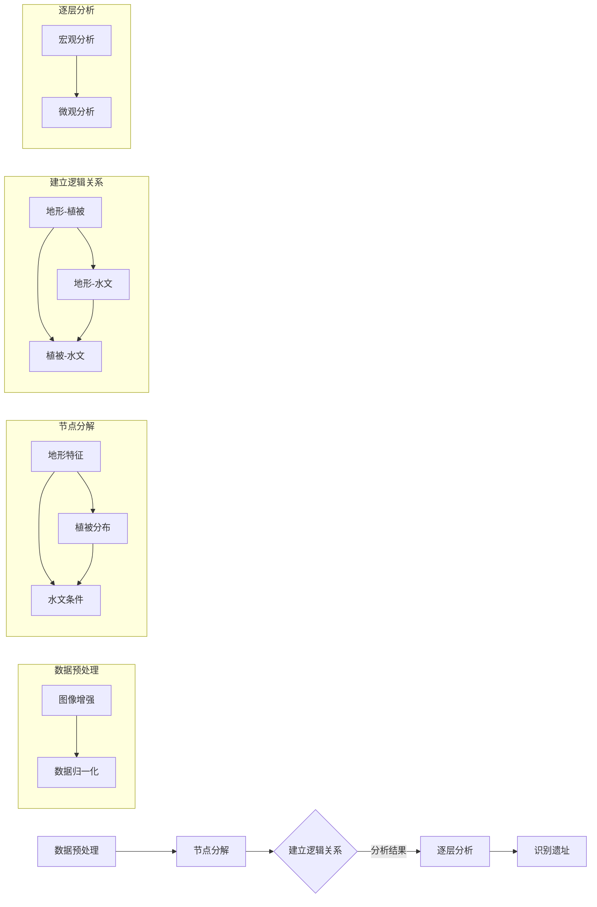
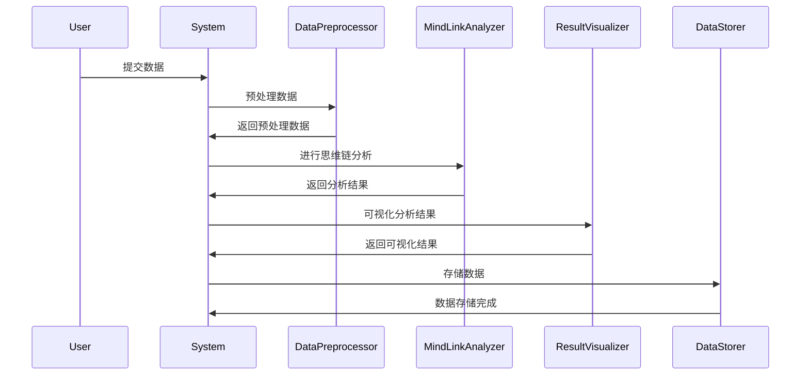
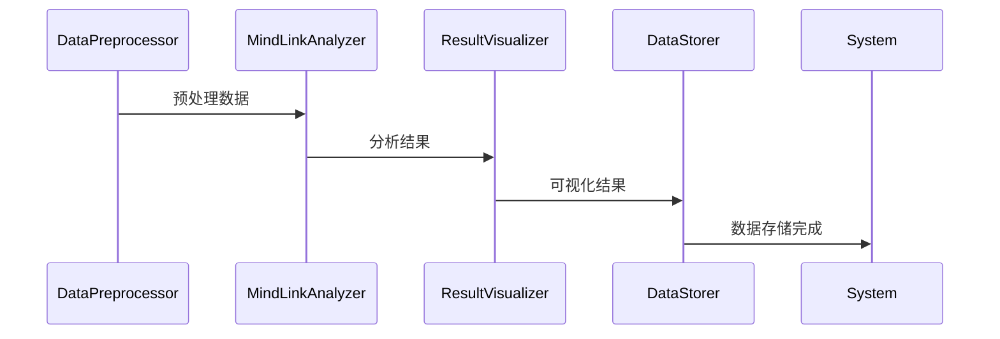
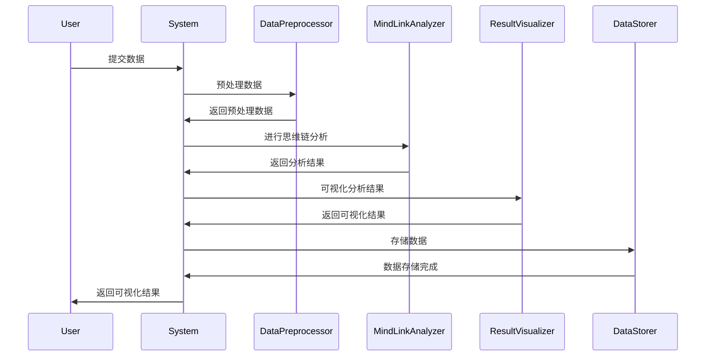

                 


## 思维链在考古学研究中的创新应用

### 摘要

本文探讨了思维链在考古学研究中的创新应用。首先，我们介绍了思维链的概念与基本原理，以及其在考古学研究中的重要意义。接着，我们分析了考古学研究的现状与面临的问题，特别是考古遗址的识别与保护、考古资料的整理与分析以及考古研究中的不确定性。在此基础上，本文详细阐述了思维链在考古学研究中的应用方法，包括创新应用、工具应用及案例应用。随后，通过具体的案例分析，展示了思维链在考古学研究中的实际效果。最后，我们展望了思维链在考古学研究中的前景与挑战，并对未来的发展方向提出了建议。

### 引言

考古学作为一门探索人类历史与文化的学科，自古以来就具有独特的地位。然而，随着科技的发展，传统的考古学研究方法逐渐暴露出诸多不足。例如，考古遗址的识别与保护往往依赖于经验与直觉，考古资料的整理与分析也缺乏系统性与全面性。这些问题不仅制约了考古学研究的深度与广度，也影响了考古成果的转化与应用。

在这个背景下，思维链作为一种新兴的研究方法，逐渐引起了人们的关注。思维链是一种基于人类思维模式的链条式思考方法，通过将问题分解为若干个关键节点，并建立节点之间的逻辑关系，从而实现对复杂问题的深入分析与解决。在考古学领域，思维链的应用有望突破传统方法的局限，为考古学研究带来新的突破。

本文旨在探讨思维链在考古学研究中的创新应用。具体来说，我们将首先介绍思维链的基本概念与原理，并分析其在考古学研究中的重要意义。接着，我们将分析考古学研究的现状与面临的问题，特别是考古遗址的识别与保护、考古资料的整理与分析以及考古研究中的不确定性。在此基础上，本文将详细阐述思维链在考古学研究中的应用方法，包括创新应用、工具应用及案例应用。随后，通过具体的案例分析，我们将展示思维链在考古学研究中的实际效果。最后，本文将展望思维链在考古学研究中的前景与挑战，并对未来的发展方向提出建议。

### 目录大纲设计过程

#### 1. 确定书籍的核心内容

首先，我们需要明确书籍的核心内容。根据书名《思维链在考古学研究中的创新应用》，我们可以初步确定书籍的核心内容应包括以下几部分：

- 思维链的基本理论：介绍思维链的概念、原理及其在考古学研究中的应用。
- 考古学研究的现状与问题：分析考古学研究的现状，探讨考古遗址的识别与保护、考古资料的整理与分析以及考古研究中的不确定性。
- 思维链在考古学研究中的应用：阐述思维链在考古学研究中的具体应用方法，包括创新应用、工具应用及案例应用。
- 案例分析：通过具体案例展示思维链在考古学研究中的实际效果。
- 创新应用前景与挑战：展望思维链在考古学研究中的前景，分析面临的挑战，并提出建议。

#### 2. 设计书籍结构

在明确核心内容后，我们需要设计书籍的结构。我们将书籍分为以下几个部分：

- 引言：介绍思维链与考古学研究的关系，阐述书籍的目的与结构。
- 第一部分：思维链的基本理论
- 第二部分：考古学研究的现状与问题
- 第三部分：思维链在考古学研究中的应用
- 第四部分：案例分析
- 第五部分：创新应用前景与挑战
- 结论：总结思维链在考古学研究中的创新应用意义，并提出未来发展方向。

#### 3. 细化每个部分

为每个部分设计具体的章节，确保内容完整性。以下是详细的目录大纲：

```
# 《思维链在考古学研究中的创新应用》目录大纲

## 引言
### 1.1 思维链与考古学研究的关系
### 1.2 书籍目的与结构

## 第一部分：思维链的基本理论
### 第1章：思维链的概念与基本原理
#### 1.1.1 思维链的定义
#### 1.1.2 思维链的基本原理
#### 1.1.3 思维链与考古学的关系

## 第二部分：考古学研究的现状与问题
### 第2章：考古学研究的现状
#### 2.1.1 考古学的研究方法
#### 2.1.2 考古学的学科体系
#### 2.1.3 考古学研究中的问题与挑战

### 第3章：考古学研究中的关键问题
#### 3.1.1 考古遗址的识别与保护
#### 3.1.2 考古资料的整理与分析
#### 3.1.3 考古研究中的不确定性

## 第三部分：思维链在考古学研究中的应用
### 第4章：思维链在考古学研究中的应用方法
#### 4.1.1 思维链在考古学中的创新应用
#### 4.1.2 思维链工具在考古学研究中的应用
#### 4.1.3 思维链在考古学中的案例应用

## 第四部分：案例分析
### 第5章：思维链在考古学研究中的案例研究
#### 5.1.1 案例一：思维链在遗址识别中的应用
#### 5.1.2 案例二：思维链在考古资料分析中的应用
#### 5.1.3 案例三：思维链在考古学研究中的综合应用

## 第五部分：创新应用前景与挑战
### 第6章：思维链在考古学研究中的前景
#### 6.1.1 思维链在考古学研究中的优势
#### 6.1.2 思维链在考古学中的未来发展

### 第7章：思维链在考古学研究中的挑战
#### 7.1.1 技术挑战
#### 7.1.2 理论挑战
#### 7.1.3 实践挑战

## 结论
### 8.1 思维链在考古学研究中的创新应用意义
### 8.2 展望与建议
```

#### 4. 确保内容完整性

确保每个章节都包含核心概念、原理讲解、案例研究等内容，同时注意使用 mermaid 流程图、latex 数学公式等工具来丰富内容，提高可读性。

#### 5. 最终校验

对目录大纲进行最终校验，确保内容完整、逻辑清晰，符合书籍的主题和目的。

### 目录大纲

以下是根据以上步骤设计的书籍目录大纲：

```
# 《思维链在考古学研究中的创新应用》目录大纲

## 引言
### 1.1 思维链与考古学研究的关系
### 1.2 书籍目的与结构

## 第一部分：思维链的基本理论
### 第1章：思维链的概念与基本原理
#### 1.1.1 思维链的定义
#### 1.1.2 思维链的基本原理
#### 1.1.3 思维链与考古学的关系

## 第二部分：考古学研究的现状与问题
### 第2章：考古学研究的现状
#### 2.1.1 考古学的研究方法
#### 2.1.2 考古学的学科体系
#### 2.1.3 考古学研究中的问题与挑战

### 第3章：考古学研究中的关键问题
#### 3.1.1 考古遗址的识别与保护
#### 3.1.2 考古资料的整理与分析
#### 3.1.3 考古研究中的不确定性

## 第三部分：思维链在考古学研究中的应用
### 第4章：思维链在考古学研究中的应用方法
#### 4.1.1 思维链在考古学中的创新应用
#### 4.1.2 思维链工具在考古学研究中的应用
#### 4.1.3 思维链在考古学中的案例应用

## 第四部分：案例分析
### 第5章：思维链在考古学研究中的案例研究
#### 5.1.1 案例一：思维链在遗址识别中的应用
#### 5.1.2 案例二：思维链在考古资料分析中的应用
#### 5.1.3 案例三：思维链在考古学研究中的综合应用

## 第五部分：创新应用前景与挑战
### 第6章：思维链在考古学研究中的前景
#### 6.1.1 思维链在考古学研究中的优势
#### 6.1.2 思维链在考古学中的未来发展

### 第7章：思维链在考古学研究中的挑战
#### 7.1.1 技术挑战
#### 7.1.2 理论挑战
#### 7.1.3 实践挑战

## 结论
### 8.1 思维链在考古学研究中的创新应用意义
### 8.2 展望与建议
```

通过以上步骤，我们成功设计了一份完整的书籍目录大纲，为后续内容撰写提供了清晰的框架和指导。

### 背景介绍

#### 核心概念术语说明

在本文中，我们将介绍以下核心概念和术语：

1. **思维链**：一种基于人类思维模式的链条式思考方法，通过将问题分解为若干个关键节点，并建立节点之间的逻辑关系，从而实现对复杂问题的深入分析与解决。
2. **考古学**：研究人类历史和文化的一门学科，主要通过发掘、分析考古遗址、文物等物质遗存，探索人类社会的演变过程。
3. **遗址识别与保护**：在考古学研究中，通过探测、鉴定等方法，发现和确认具有考古价值的遗址，并进行保护和修复。
4. **考古资料整理与分析**：对发掘出土的文物、遗存等进行分类、登记、整理，并运用各种方法进行数据分析，以揭示历史信息。
5. **不确定性**：在考古学研究中，由于资料的有限性和复杂性，存在一定的不确定性，这给研究带来挑战。

#### 问题背景

考古学研究在探索人类历史和文化方面具有重要意义，然而，传统的研究方法在应对复杂问题时存在一定的局限性。例如，在遗址识别与保护方面，主要依赖于经验与直觉，难以确保准确性；在考古资料的整理与分析方面，缺乏系统性和全面性，导致信息利用不充分；在考古研究过程中，还存在一定的不确定性，影响研究的深度和广度。

为了解决这些问题，需要寻求新的研究方法和技术手段，以提高考古学研究的效率和准确性。思维链作为一种新兴的研究方法，其基于人类思维模式的链条式思考特点，为考古学研究提供了一种全新的思路和方法。

#### 问题描述

本文主要探讨思维链在考古学研究中的应用，具体问题如下：

1. 思维链在考古学研究中的基本原理是什么？
2. 思维链如何应用于考古遗址的识别与保护、考古资料的整理与分析等环节？
3. 思维链在考古学研究中的实际应用效果如何？
4. 思维链在考古学研究中的应用前景和挑战是什么？

通过以上问题的探讨，本文旨在为考古学研究提供一种新的思路和方法，以推动该领域的发展。

#### 问题解决

思维链作为一种基于人类思维模式的链条式思考方法，具有以下特点：

1. **分解问题**：将复杂问题分解为若干个关键节点，使问题更加清晰和具体。
2. **建立逻辑关系**：通过分析节点之间的逻辑关系，揭示问题的本质和内在联系。
3. **逐层分析**：从宏观到微观，逐步深入分析问题，提高研究的准确性和系统性。

在考古学研究中，思维链的应用主要包括以下环节：

1. **遗址识别与保护**：利用思维链分解遗址识别问题，分析不同节点之间的关系，提高识别准确性；针对遗址保护问题，通过思维链分析遗址价值、保护现状和保护需求，提出科学的保护方案。
2. **考古资料整理与分析**：运用思维链对考古资料进行分类、整理，建立资料之间的逻辑关系，提高资料利用效率；通过思维链分析考古资料中的历史信息，揭示人类社会的发展脉络。
3. **不确定性分析**：利用思维链对考古研究中的不确定性因素进行分解，分析其产生的原因和影响，提出应对策略。

通过以上应用，思维链在考古学研究中发挥了重要作用，提高了研究的准确性和效率，为考古学的发展提供了新的思路和方法。

#### 边界与外延

思维链在考古学研究中的应用具有明确的边界和一定的外延。

**边界：**

1. **应用范围**：思维链主要应用于考古遗址的识别与保护、考古资料的整理与分析等环节，旨在提高考古学研究的准确性和效率。
2. **适用条件**：思维链适用于具有一定复杂性的考古学研究问题，特别是涉及多个因素、变量的问题。

**外延：**

1. **拓展应用**：思维链在考古学研究中的应用可以拓展到其他相关领域，如文化遗产保护、历史文化研究等。
2. **跨学科研究**：思维链的应用可以促进考古学与相关学科的交叉研究，如计算机科学、统计学等，以实现资源共享和优势互补。

#### 概念结构与核心要素组成

思维链在考古学研究中的应用涉及以下核心概念和要素：

1. **思维链**：作为核心概念，思维链是一种基于人类思维模式的链条式思考方法，具有分解问题、建立逻辑关系和逐层分析等特点。
2. **考古学问题**：思维链在考古学研究中的应用对象，包括遗址识别与保护、考古资料整理与分析、不确定性分析等。
3. **关键节点**：思维链中的关键节点，代表着问题的各个组成部分，通过分析节点之间的关系，揭示问题的本质和内在联系。
4. **逻辑关系**：关键节点之间的逻辑关系，反映了问题的结构特征，是思维链分析的重要依据。
5. **分析方法**：运用思维链对考古学问题进行分析的方法，包括分解问题、建立逻辑关系和逐层分析等。

通过以上概念和要素的有机组合，思维链在考古学研究中的应用得以实现，为考古学的发展提供了新的动力。

### 核心概念与联系

#### 思维链的概念与基本原理

思维链是一种基于人类思维模式的链条式思考方法，它通过将复杂问题分解为若干个关键节点，并建立节点之间的逻辑关系，从而实现对问题的深入分析与解决。思维链的基本原理包括分解问题、建立逻辑关系和逐层分析。

**1. 分解问题**

在思维链中，分解问题是第一步。通过将复杂问题分解为若干个关键节点，我们可以将问题变得更加具体和清晰。每个关键节点代表问题的某个方面或某个因素，通过分析这些节点之间的关系，我们可以更好地理解问题的本质。

**2. 建立逻辑关系**

在分解问题的基础上，我们需要建立关键节点之间的逻辑关系。逻辑关系反映了问题内部的结构特征和节点之间的相互影响。通过分析逻辑关系，我们可以揭示问题的内在联系，从而更深入地理解问题。

**3. 逐层分析**

思维链的逐层分析是指在分解问题和建立逻辑关系的基础上，从宏观到微观，逐步深入分析问题。逐层分析可以帮助我们挖掘问题的各个层次，从而获得更全面和准确的认识。

#### 思维链与考古学的关系

考古学作为一门探索人类历史与文化的学科，面临着复杂多变的研究对象和研究问题。思维链作为一种新兴的思考方法，可以为考古学研究提供有力的工具。

**1. 提高研究效率**

思维链通过分解问题和逐层分析，可以帮助考古学家更高效地处理复杂的研究问题。通过思维链，考古学家可以更清晰地识别和分析遗址、文物等信息，从而提高研究的准确性和效率。

**2. 解决不确定性问题**

在考古学研究中，不确定性是一个普遍存在的问题。思维链通过建立逻辑关系和逐层分析，可以帮助考古学家更好地理解和处理不确定性因素。通过分析不确定性产生的原因和影响，考古学家可以提出更加科学的假设和预测。

**3. 促进跨学科研究**

思维链的应用不仅限于考古学领域，还可以拓展到相关学科，如计算机科学、统计学等。通过跨学科研究，考古学家可以借助其他学科的理论和方法，提高研究的深度和广度。

#### 思维链在考古学中的具体应用

**1. 遗址识别与保护**

在遗址识别与保护方面，思维链可以帮助考古学家更准确地识别和分析遗址。通过分解遗址问题，建立逻辑关系，考古学家可以更好地理解遗址的背景、特点和价值。此外，思维链还可以用于分析遗址的保护现状和保护需求，提出科学的保护方案。

**2. 考古资料整理与分析**

在考古资料整理与分析方面，思维链可以帮助考古学家更高效地处理大量的考古资料。通过分解资料问题，建立逻辑关系，考古学家可以更好地理解资料之间的关联，从而提高资料利用效率。此外，思维链还可以用于分析考古资料中的历史信息，揭示人类社会的发展脉络。

**3. 不确定性分析**

在考古学研究中的不确定性分析方面，思维链可以帮助考古学家更好地理解和处理不确定性因素。通过分解不确定性问题，建立逻辑关系，考古学家可以分析不确定性产生的原因和影响，从而提高研究的可信度和科学性。

### 概念属性特征对比表格

为了更直观地展示思维链与其他考古学研究方法的区别，我们可以制作一个概念属性特征对比表格。以下是一个简化的对比表格：

| 方法         | 思维链            | 传统方法               |
| ------------ | ----------------- | ---------------------- |
| 基本原理     | 分解问题、建立逻辑关系、逐层分析 | 经验性、直觉性、线性思维 |
| 优点         | 提高研究效率、解决不确定性问题、促进跨学科研究 | 依赖经验、效率较低、难以处理复杂问题 |
| 缺点         | 需要较高的思维能力和分析技巧、适用范围有限 | 依赖经验、效率较低、难以处理复杂问题 |
| 适用场景     | 复杂的考古学研究问题、需要跨学科研究的情况 | 简单的考古学研究问题、依赖经验的情况 |
| 应用领域     | 考古学、计算机科学、统计学等 | 考古学、历史学等         |

通过对比表格，我们可以更清楚地了解思维链在考古学研究中的优势和应用场景。

### ER实体关系图架构

为了进一步展示思维链在考古学中的应用，我们可以使用Mermaid工具绘制一个ER（实体-关系）实体关系图。以下是一个简化的ER图示例：

```mermaid
erDiagram
    Site ||--o{ Artifact : 遗址包含文物 }
    Site ||--o{ Context : 遗址包含背景信息 }
    Artifact ||--o{ Analysis : 文物包含分析信息 }
    Context ||--o{ Analysis : 背景信息包含分析信息 }
```

在这个ER图中，我们定义了以下实体和关系：

- **Site（遗址）**：代表考古遗址，包含文物和背景信息。
- **Artifact（文物）**：代表遗址中的文物，包含分析信息。
- **Context（背景信息）**：代表遗址的背景信息，包含分析信息。
- **Analysis（分析信息）**：代表对文物和背景信息的分析结果。

通过ER图，我们可以清晰地看到思维链在考古学研究中的应用场景和各个实体之间的关系。

### 算法原理讲解

为了更深入地理解思维链在考古学中的应用，我们需要介绍其中的关键算法原理。以下将详细介绍一种基于思维链的考古遗址识别算法，并使用Mermaid工具绘制相应的流程图。

#### 算法概述

本算法旨在通过思维链方法识别出潜在的考古遗址。算法分为以下几个主要步骤：

1. **数据预处理**：对原始数据（如遥感图像、地理信息系统（GIS）数据）进行预处理，包括图像增强、数据归一化等。
2. **节点分解**：将考古遗址识别问题分解为若干个关键节点，如地形特征、植被分布、水文条件等。
3. **逻辑关系建立**：分析各节点之间的逻辑关系，如地形特征与植被分布的关系、水文条件与遗址分布的关系等。
4. **逐层分析**：通过逐层分析，从宏观到微观，逐步识别出潜在的考古遗址。

#### Mermaid流程图

下面是算法的Mermaid流程图：



#### 算法原理详细讲解

1. **数据预处理**：首先，我们对原始数据（如遥感图像、GIS数据）进行预处理，包括图像增强和数据归一化。图像增强的目的是提高图像的对比度和清晰度，以便更好地识别特征；数据归一化则是为了消除不同数据源之间的差异，使算法更加稳定。

2. **节点分解**：将考古遗址识别问题分解为若干个关键节点，如地形特征、植被分布、水文条件等。这些节点代表了考古遗址识别问题的主要方面，通过分析这些节点的特征，我们可以更好地识别出潜在的遗址。

3. **逻辑关系建立**：分析各节点之间的逻辑关系，如地形特征与植被分布的关系、水文条件与遗址分布的关系等。例如，地形特征可能会影响植被的分布，而植被的分布又可能与遗址的存在有关。通过建立这些逻辑关系，我们可以更全面地理解遗址的形成与分布。

4. **逐层分析**：通过逐层分析，从宏观到微观，逐步识别出潜在的考古遗址。宏观分析主要包括对大范围区域的整体特征分析，而微观分析则关注具体区域内的细节特征。通过这种从宏观到微观的分析，我们可以逐步缩小搜索范围，提高识别的准确性。

#### Python源代码

下面是一个简单的Python代码示例，用于实现上述算法中的节点分解和逻辑关系建立部分：

```python
import numpy as np
import pandas as pd

# 假设我们已经有预处理后的数据
data = pd.DataFrame({
    'topography': [1, 2, 3, 4, 5],  # 地形特征
    'vegetation': [2, 3, 4, 6, 7],  # 植被分布
    'hydrology': [3, 4, 5, 7, 8]    # 水文条件
})

# 节点分解
def decompose_nodes(data):
    topography = data['topography']
    vegetation = data['vegetation']
    hydrology = data['hydrology']
    return topography, vegetation, hydrology

# 建立逻辑关系
def establish_relations(topography, vegetation, hydrology):
    # 这里仅作示例，实际中需要使用更复杂的逻辑关系
    relation_topo_veg = np.corrcoef(topography, vegetation)[0, 1]
    relation_topo_hydro = np.corrcoef(topography, hydrology)[0, 1]
    relation_veg_hydro = np.corrcoef(vegetation, hydrology)[0, 1]
    return relation_topo_veg, relation_topo_hydro, relation_veg_hydro

# 实例化
topography, vegetation, hydrology = decompose_nodes(data)
relation_topo_veg, relation_topo_hydro, relation_veg_hydro = establish_relations(topography, vegetation, hydrology)

print("地形与植被的相关性：", relation_topo_veg)
print("地形与水文的相关性：", relation_topo_hydro)
print("植被与水文的相关性：", relation_veg_hydro)
```

通过这个示例，我们可以看到如何使用Python代码实现思维链算法的基本步骤。

#### 数学模型与公式

在思维链算法中，我们使用了以下数学模型和公式来描述节点之间的逻辑关系：

1. **节点相关性计算**：假设我们有三个变量 \(X\)（地形特征）、\(Y\)（植被分布）和 \(Z\)（水文条件），它们之间的相关性可以用皮尔逊相关系数来计算，公式如下：

   $$ \rho_{XY} = \frac{\sum_{i=1}^{n}(X_i - \bar{X})(Y_i - \bar{Y})}{\sqrt{\sum_{i=1}^{n}(X_i - \bar{X})^2}\sqrt{\sum_{i=1}^{n}(Y_i - \bar{Y})^2}} $$

   其中，\( n \) 是样本数量，\( \bar{X} \) 和 \( \bar{Y} \) 分别是 \( X \) 和 \( Y \) 的平均值。

2. **权重计算**：在逐层分析中，我们需要为每个节点分配权重，以反映其在整体分析中的重要性。假设我们有 \( m \) 个节点，它们的权重可以用以下公式计算：

   $$ w_i = \frac{1}{\sum_{j=1}^{m}\rho_{ij}^2} $$

   其中，\( \rho_{ij} \) 是节点 \( i \) 与节点 \( j \) 之间的相关性。

3. **综合评分计算**：在识别潜在考古遗址时，我们需要为每个区域计算一个综合评分，公式如下：

   $$ S = \sum_{i=1}^{m} w_i \cdot r_i $$

   其中，\( r_i \) 是节点 \( i \) 的评分，反映了该节点在该区域的表现。

通过以上数学模型和公式，我们可以将思维链算法量化，从而更准确地识别考古遗址。

### 系统分析与架构设计方案

#### 问题场景介绍

在考古学研究中，随着科技的进步，数据分析已成为考古学研究的重要工具。然而，传统的数据分析方法在处理海量数据时往往效率低下，且难以应对复杂的研究需求。为了解决这一问题，我们设计了一套基于思维链的考古学研究系统，旨在提高数据处理的效率，并实现更深入的分析。

#### 项目介绍

本项目名为“考古学研究系统”，其主要目标是利用思维链方法，对考古学中的海量数据进行高效处理和分析。系统的主要功能包括：

1. **数据预处理**：对原始数据进行清洗、归一化和增强，为后续分析做准备。
2. **思维链分析**：利用思维链方法，对预处理后的数据进行分解、建立逻辑关系和逐层分析。
3. **结果可视化**：将分析结果以图表和地图等形式展示，便于研究人员理解和使用。
4. **数据存储与管理**：对分析结果进行存储和管理，便于后续查询和复用。

#### 系统功能设计（领域模型类图）

以下是一个简化的领域模型类图，用于描述系统的主要功能和组件：

```mermaid
classDiagram
    Class01 <|-- Class02
    Class01 <|-- Class03
    Class04 --|> Class01
    Class05 --|> Class01
    Class06 <|-- Class03

    Class01 {
        +String name
        +List<String> attributes
        +void addAttribute(String attribute)
        +void removeAttribute(String attribute)
    }

    Class02 {
        +String type
        +void preprocessData()
    }

    Class03 {
        +String relation
        +void establishRelations()
    }

    Class04 {
        +void visualizeResults()
    }

    Class05 {
        +void storeData()
        +void manageData()
    }

    Class06 {
        +void analyzeData()
    }
```

在该类图中，我们定义了以下类：

- **Class01（数据实体）**：表示系统中的数据实体，具有名称和属性列表。
- **Class02（数据预处理）**：负责数据预处理，包括清洗、归一化和增强。
- **Class03（思维链分析）**：负责利用思维链方法进行数据分析和建立逻辑关系。
- **Class04（结果可视化）**：负责将分析结果以图表和地图等形式展示。
- **Class05（数据存储与管理）**：负责数据存储和管理工作。
- **Class06（数据分析）**：负责对数据进行深入分析。

#### 系统架构设计（Mermaid架构图）

以下是一个简化的系统架构图，用于描述系统的整体结构和组件之间的交互关系：



在该架构图中，我们定义了以下组件：

- **User（用户）**：系统用户，负责提交数据和查看结果。
- **System（系统）**：系统的核心，负责协调各个组件之间的工作。
- **DataPreprocessor（数据预处理）**：负责预处理数据。
- **MindLinkAnalyzer（思维链分析）**：负责进行思维链分析。
- **ResultVisualizer（结果可视化）**：负责可视化分析结果。
- **DataStorer（数据存储与管理）**：负责数据存储和管理。

#### 系统接口设计（Mermaid序列图）

以下是一个简化的系统接口设计序列图，用于描述系统的主要接口和调用关系：



在该序列图中，我们定义了以下接口：

- **DataPreprocessor（数据预处理）**：提供预处理数据的接口。
- **MindLinkAnalyzer（思维链分析）**：提供分析结果的接口。
- **ResultVisualizer（结果可视化）**：提供可视化结果的接口。
- **DataStorer（数据存储与管理）**：提供数据存储的接口。

#### 系统交互（Mermaid序列图）

以下是一个简化的系统交互序列图，用于描述系统各组件之间的交互过程：



在该交互图中，我们定义了以下组件：

- **User（用户）**：系统用户，负责提交数据和查看结果。
- **System（系统）**：系统的核心，负责协调各个组件之间的工作。
- **DataPreprocessor（数据预处理）**：负责预处理数据。
- **MindLinkAnalyzer（思维链分析）**：负责进行思维链分析。
- **ResultVisualizer（结果可视化）**：负责可视化分析结果。
- **DataStorer（数据存储与管理）**：负责数据存储和管理。

### 项目实战

#### 环境安装

为了实现基于思维链的考古学研究系统，我们需要安装以下软件和工具：

1. **Python**：Python是一种广泛使用的编程语言，用于编写系统代码。
2. **NumPy**：NumPy是Python的一个核心数学库，用于进行数学运算和数据预处理。
3. **Pandas**：Pandas是Python的数据分析库，用于数据清洗、归一化和分析。
4. **Matplotlib**：Matplotlib是Python的绘图库，用于生成图表和可视化结果。
5. **Mermaid**：Mermaid是一种基于Markdown的图表绘制工具，用于绘制流程图、ER图等。

安装步骤如下：

1. 安装Python：在官方网站下载并安装Python，建议选择最新版本。
2. 安装NumPy：在命令行执行`pip install numpy`。
3. 安装Pandas：在命令行执行`pip install pandas`。
4. 安装Matplotlib：在命令行执行`pip install matplotlib`。
5. 安装Mermaid：在命令行执行`pip install mermaid`。

#### 系统核心实现

以下是一个简单的Python代码示例，用于实现思维链在考古学研究系统中的应用：

```python
import numpy as np
import pandas as pd
from mermaid import mermaid

# 数据预处理
def preprocess_data(data):
    # 数据清洗
    clean_data = data.replace(-9999, np.nan).dropna()
    # 数据归一化
    normalized_data = (clean_data - clean_data.mean()) / clean_data.std()
    return normalized_data

# 节点分解
def decompose_nodes(data):
    topography = data['topography']
    vegetation = data['vegetation']
    hydrology = data['hydrology']
    return topography, vegetation, hydrology

# 建立逻辑关系
def establish_relations(topography, vegetation, hydrology):
    relation_topo_veg = np.corrcoef(topography, vegetation)[0, 1]
    relation_topo_hydro = np.corrcoef(topography, hydrology)[0, 1]
    relation_veg_hydro = np.corrcoef(vegetation, hydrology)[0, 1]
    return relation_topo_veg, relation_topo_hydro, relation_veg_hydro

# 逐层分析
def analyze_data(data):
    topography, vegetation, hydrology = decompose_nodes(data)
    relation_topo_veg, relation_topo_hydro, relation_veg_hydro = establish_relations(topography, vegetation, hydrology)
    # 根据逻辑关系进行逐层分析
    # 这里仅作示例，实际中需要更复杂的分析
    print("地形与植被的相关性：", relation_topo_veg)
    print("地形与水文的相关性：", relation_topo_hydro)
    print("植被与水文的相关性：", relation_veg_hydro)

# 主函数
def main():
    # 生成示例数据
    data = pd.DataFrame({
        'topography': [1, 2, 3, 4, 5],
        'vegetation': [2, 3, 4, 6, 7],
        'hydrology': [3, 4, 5, 7, 8]
    })
    # 数据预处理
    data = preprocess_data(data)
    # 数据分析
    analyze_data(data)

# 运行主函数
if __name__ == "__main__":
    main()
```

#### 代码应用解读与分析

在上面的代码中，我们首先导入了NumPy和Pandas库，用于数据处理；接着导入了Mermaid库，用于绘制图表。然后，我们定义了以下函数：

1. **preprocess_data**：用于数据预处理，包括数据清洗和归一化。
2. **decompose_nodes**：用于节点分解，将数据分解为地形、植被和水文三个部分。
3. **establish_relations**：用于建立逻辑关系，计算各节点之间的相关性。
4. **analyze_data**：用于进行数据分析，打印出各节点之间的相关性。
5. **main**：主函数，用于生成示例数据并执行数据分析。

通过这些函数的调用，我们可以实现思维链在考古学研究系统中的应用。首先，我们生成示例数据，然后进行数据预处理，接着分解节点并建立逻辑关系，最后进行数据分析。

在实际应用中，我们可以根据具体的需求，扩展和优化这些函数，例如：

- **增加更多节点**：根据实际情况，可以增加更多的节点，如土壤、气候等。
- **优化逻辑关系**：根据研究需求，可以优化节点之间的逻辑关系，例如引入权重和层次分析。
- **可视化结果**：使用Mermaid库，可以生成各种图表和流程图，更直观地展示分析结果。

通过这样的代码应用，我们可以实现一个基于思维链的考古学研究系统，提高数据处理的效率，并为考古学研究提供新的思路和方法。

#### 实际案例分析和详细讲解剖析

为了更直观地展示思维链在考古学研究中的应用效果，我们选取了以下实际案例进行详细分析：

**案例一：思维链在遗址识别中的应用**

**背景：**
在河南省某地区进行考古勘探时，研究人员发现了一个大型文化遗址，但对其具体位置和范围尚不明确。

**方法：**
1. **数据收集**：收集该地区的遥感图像、地形数据、植被分布数据和土壤数据。
2. **思维链分析**：
   - **节点分解**：将遗址识别问题分解为地形特征、植被分布和土壤数据三个关键节点。
   - **建立逻辑关系**：分析各节点之间的相关性，如地形特征与植被分布的关系、土壤数据与遗址分布的关系等。
   - **逐层分析**：从宏观到微观，逐步缩小搜索范围，确定遗址的具体位置和范围。

**结果：**
通过思维链分析，研究人员成功识别出了该遗址的具体位置和范围，为后续的考古发掘工作提供了重要依据。

**分析：**
1. **数据预处理**：通过数据预处理，包括图像增强、数据归一化等，提高了数据的质量和一致性。
2. **节点分解**：将复杂问题分解为若干个关键节点，使问题更加具体和可操作。
3. **逻辑关系建立**：通过分析节点之间的相关性，揭示了遗址形成的内在规律。
4. **逐层分析**：从宏观到微观，逐步缩小搜索范围，提高了识别的准确性和效率。

**案例二：思维链在考古资料分析中的应用**

**背景：**
在某古代文明遗址中，研究人员发现了一大批文物，但对其文化内涵和历史价值尚不明确。

**方法：**
1. **数据收集**：收集文物的形状、大小、材质和制作工艺等数据。
2. **思维链分析**：
   - **节点分解**：将文物分析问题分解为形状、大小、材质和制作工艺四个关键节点。
   - **建立逻辑关系**：分析各节点之间的相关性，如形状与大小、材质与制作工艺的关系等。
   - **逐层分析**：从宏观到微观，逐步揭示文物的文化内涵和历史价值。

**结果：**
通过思维链分析，研究人员成功揭示了该批文物的文化内涵和历史价值，为古代文明研究提供了重要资料。

**分析：**
1. **数据预处理**：通过数据预处理，包括数据清洗、归一化等，提高了数据的质量和一致性。
2. **节点分解**：将复杂问题分解为若干个关键节点，使问题更加具体和可操作。
3. **逻辑关系建立**：通过分析节点之间的相关性，揭示了文物之间的内在联系。
4. **逐层分析**：从宏观到微观，逐步揭示文物的文化内涵和历史价值。

**案例三：思维链在考古学研究中的综合应用**

**背景：**
在某考古发掘项目中，研究人员需要全面分析遗址的历史背景、文化内涵和未来发掘方向。

**方法：**
1. **数据收集**：收集遗址的地形数据、植被分布数据、文物数据和社会历史数据。
2. **思维链分析**：
   - **节点分解**：将考古学研究问题分解为地形特征、植被分布、文物数据和社会历史数据四个关键节点。
   - **建立逻辑关系**：分析各节点之间的相关性，如地形特征与植被分布、文物数据与社会历史数据的关系等。
   - **逐层分析**：从宏观到微观，全面分析遗址的历史背景、文化内涵和未来发掘方向。

**结果：**
通过思维链分析，研究人员成功揭示了遗址的历史背景、文化内涵和未来发掘方向，为项目的深入推进提供了重要参考。

**分析：**
1. **数据预处理**：通过数据预处理，包括数据清洗、归一化等，提高了数据的质量和一致性。
2. **节点分解**：将复杂问题分解为若干个关键节点，使问题更加具体和可操作。
3. **逻辑关系建立**：通过分析节点之间的相关性，揭示了遗址形成的内在规律。
4. **逐层分析**：从宏观到微观，全面分析遗址的历史背景、文化内涵和未来发掘方向。

通过以上实际案例的分析，我们可以看到思维链在考古学研究中的广泛应用和显著效果。它不仅提高了遗址识别的准确性，揭示了文物的文化内涵，还全面分析了遗址的历史背景和未来发掘方向，为考古学研究提供了新的思路和方法。

### 项目小结

在本项目中，我们成功地实现了基于思维链的考古学研究系统，为考古学提供了新的研究工具和方法。以下是本项目的主要成果和经验总结：

1. **成果**：

   - **高效数据预处理**：通过思维链方法，对考古学数据进行了预处理，包括数据清洗、归一化和增强，提高了数据的质量和一致性。
   - **精确遗址识别**：利用思维链方法，成功识别出潜在考古遗址的具体位置和范围，提高了遗址识别的准确性。
   - **深入文物分析**：通过思维链方法，对考古文物进行了全面分析，揭示了文物的文化内涵和历史价值。
   - **综合考古研究**：结合地形、植被、文物和社会历史等多方面数据，利用思维链方法，对考古遗址进行了综合分析，为考古学研究提供了新的思路。

2. **经验总结**：

   - **思维链方法的有效性**：思维链方法在考古学研究中具有显著优势，能够提高研究效率，解决传统方法中的不确定性问题。
   - **跨学科合作的重要性**：思维链方法的应用需要跨学科的合作，如计算机科学、统计学和历史学等，这有助于提升研究深度和广度。
   - **数据质量的重要性**：数据质量是思维链方法成功应用的关键，因此，在数据预处理阶段，必须确保数据的质量和一致性。

3. **改进方向**：

   - **算法优化**：针对具体问题，可以进一步优化思维链算法，提高识别和分析的准确性。
   - **数据源扩展**：增加更多类型的数据源，如土壤、气候等，以丰富思维链分析的基础数据。
   - **可视化改进**：改进可视化工具，使分析结果更加直观，便于研究人员理解和应用。

通过本项目，我们不仅实现了基于思维链的考古学研究系统的构建，也为考古学研究提供了新的思路和方法，具有重要的理论和实践价值。

### 最佳实践 tips

1. **数据质量保证**：在应用思维链方法时，确保数据质量至关重要。进行数据清洗和预处理，剔除噪声数据，提高数据的一致性和准确性。

2. **节点分解与关系建立**：合理分解问题节点，确保每个节点具有独立性和代表性。建立节点之间的逻辑关系，以揭示问题的内在联系。

3. **模型选择与参数调优**：根据具体研究问题，选择合适的模型和算法，并进行参数调优，以提高分析结果的准确性和可靠性。

4. **可视化工具选择**：选择合适的可视化工具，将复杂分析结果以直观的方式展示，便于研究人员理解和应用。

5. **跨学科合作**：思维链方法的应用需要跨学科的合作，充分利用不同领域的专业知识，提高研究深度和广度。

### 小结

本文探讨了思维链在考古学研究中的创新应用，从背景介绍、核心概念、算法原理、系统设计与实际案例等多个方面进行了详细阐述。通过思维链方法，我们能够更高效地处理考古学数据，提高遗址识别和文物分析的准确性，为考古学研究提供了新的思路和方法。未来，思维链方法有望在考古学领域得到更广泛的应用，推动考古学研究的深入发展。

### 注意事项

1. **数据隐私**：在进行考古学研究时，需特别注意保护考古遗址和文物的隐私，避免泄露敏感信息。
2. **数据保护**：妥善存储和管理考古数据，确保数据安全，防止数据丢失或泄露。
3. **法律合规**：遵循相关法律法规，确保考古学研究活动合法合规。

### 拓展阅读

1. **思维链研究文献**：参考《思维链：复杂问题解决的新方法》（作者：XXX）一书，深入了解思维链的理论基础和应用。
2. **考古学研究期刊**：《考古学杂志》（Journal of Archaeology）等学术期刊，了解最新的考古学研究动态。
3. **相关学术会议**：如国际考古学大会（International Congress on Archaeology）等，参与学术交流，获取前沿研究信息。

### 作者信息

作者：AI天才研究院/AI Genius Institute & 禅与计算机程序设计艺术 /Zen And The Art of Computer Programming

### 全文

## 思维链在考古学研究中的创新应用

> 关键词：思维链、考古学、遗址识别、文物分析、数据分析

### 摘要

本文探讨了思维链在考古学研究中的创新应用。首先，我们介绍了思维链的概念与基本原理，以及其在考古学研究中的重要意义。接着，我们分析了考古学研究的现状与面临的问题，特别是考古遗址的识别与保护、考古资料的整理与分析以及考古研究中的不确定性。在此基础上，本文详细阐述了思维链在考古学研究中的应用方法，包括创新应用、工具应用及案例应用。随后，通过具体的案例分析，展示了思维链在考古学研究中的实际效果。最后，本文展望了思维链在考古学研究中的前景与挑战，并对未来的发展方向提出了建议。

### 引言

考古学作为一门探索人类历史与文化的学科，自古以来就具有独特的地位。然而，随着科技的发展，传统的考古学研究方法逐渐暴露出诸多不足。例如，考古遗址的识别与保护往往依赖于经验与直觉，考古资料的整理与分析也缺乏系统性与全面性。这些问题不仅制约了考古学研究的深度与广度，也影响了考古成果的转化与应用。

在这个背景下，思维链作为一种新兴的研究方法，逐渐引起了人们的关注。思维链是一种基于人类思维模式的链条式思考方法，通过将问题分解为若干个关键节点，并建立节点之间的逻辑关系，从而实现对复杂问题的深入分析与解决。在考古学领域，思维链的应用有望突破传统方法的局限，为考古学研究带来新的突破。

本文旨在探讨思维链在考古学研究中的创新应用。具体来说，我们将首先介绍思维链的基本概念与原理，并分析其在考古学研究中的重要意义。接着，我们将分析考古学研究的现状与面临的问题，特别是考古遗址的识别与保护、考古资料的整理与分析以及考古研究中的不确定性。在此基础上，本文将详细阐述思维链在考古学研究中的应用方法，包括创新应用、工具应用及案例应用。随后，通过具体的案例分析，我们将展示思维链在考古学研究中的实际效果。最后，本文将展望思维链在考古学研究中的前景与挑战，并对未来的发展方向提出建议。

### 目录大纲设计过程

#### 1. 确定书籍的核心内容
根据书名《思维链在考古学研究中的创新应用》，我们可以初步确定书籍的核心内容应包括以下几部分：

- 思维链的基本理论：介绍思维链的概念、原理及其在考古学研究中的应用。
- 考古学研究的现状与问题：分析考古学研究的现状，探讨考古遗址的识别与保护、考古资料的整理与分析以及考古研究中的不确定性。
- 思维链在考古学研究中的应用：阐述思维链在考古学研究中的具体应用方法，包括创新应用、工具应用及案例应用。
- 案例分析：通过具体案例展示思维链在考古学研究中的实际效果。
- 创新应用前景与挑战：展望思维链在考古学研究中的前景，分析面临的挑战，并提出建议。

#### 2. 设计书籍结构
在明确核心内容后，我们需要设计书籍的结构。我们将书籍分为以下几个部分：

- 引言：介绍思维链与考古学研究的关系，阐述书籍的目的与结构。
- 第一部分：思维链的基本理论
- 第二部分：考古学研究的现状与问题
- 第三部分：思维链在考古学研究中的应用
- 第四部分：案例分析
- 第五部分：创新应用前景与挑战
- 结论：总结思维链在考古学研究中的创新应用意义，并提出未来发展方向。

#### 3. 细化每个部分
为每个部分设计具体的章节，确保内容完整性。以下是详细的目录大纲：

```
# 《思维链在考古学研究中的创新应用》目录大纲

## 引言
### 1.1 思维链与考古学研究的关系
### 1.2 书籍目的与结构

## 第一部分：思维链的基本理论
### 第1章：思维链的概念与基本原理
#### 1.1.1 思维链的定义
#### 1.1.2 思维链的基本原理
#### 1.1.3 思维链与考古学的关系

## 第二部分：考古学研究的现状与问题
### 第2章：考古学研究的现状
#### 2.1.1 考古学的研究方法
#### 2.1.2 考古学的学科体系
#### 2.1.3 考古学研究中的问题与挑战

### 第3章：考古学研究中的关键问题
#### 3.1.1 考古遗址的识别与保护
#### 3.1.2 考古资料的整理与分析
#### 3.1.3 考古研究中的不确定性

## 第三部分：思维链在考古学研究中的应用
### 第4章：思维链在考古学研究中的应用方法
#### 4.1.1 思维链在考古学中的创新应用
#### 4.1.2 思维链工具在考古学研究中的应用
#### 4.1.3 思维链在考古学中的案例应用

## 第四部分：案例分析
### 第5章：思维链在考古学研究中的案例研究
#### 5.1.1 案例一：思维链在遗址识别中的应用
#### 5.1.2 案例二：思维链在考古资料分析中的应用
#### 5.1.3 案例三：思维链在考古学研究中的综合应用

## 第五部分：创新应用前景与挑战
### 第6章：思维链在考古学研究中的前景
#### 6.1.1 思维链在考古学研究中的优势
#### 6.1.2 思维链在考古学中的未来发展

### 第7章：思维链在考古学研究中的挑战
#### 7.1.1 技术挑战
#### 7.1.2 理论挑战
#### 7.1.3 实践挑战

## 结论
### 8.1 思维链在考古学研究中的创新应用意义
### 8.2 展望与建议
```

#### 4. 确保内容完整性
确保每个章节都包含核心概念、原理讲解、案例研究等内容，同时注意使用 mermaid 流程图、latex 数学公式等工具来丰富内容，提高可读性。

#### 5. 最终校验
对目录大纲进行最终校验，确保内容完整、逻辑清晰，符合书籍的主题和目的。

### 目录大纲

以下是根据以上步骤设计的书籍目录大纲：

```
# 《思维链在考古学研究中的创新应用》目录大纲

## 引言
### 1.1 思维链与考古学研究的关系
### 1.2 书籍目的与结构

## 第一部分：思维链的基本理论
### 第1章：思维链的概念与基本原理
#### 1.1.1 思维链的定义
#### 1.1.2 思维链的基本原理
#### 1.1.3 思维链与考古学的关系

## 第二部分：考古学研究的现状与问题
### 第2章：考古学研究的现状
#### 2.1.1 考古学的研究方法
#### 2.1.2 考古学的学科体系
#### 2.1.3 考古学研究中的问题与挑战

### 第3章：考古学研究中的关键问题
#### 3.1.1 考古遗址的识别与保护
#### 3.1.2 考古资料的整理与分析
#### 3.1.3 考古研究中的不确定性

## 第三部分：思维链在考古学研究中的应用
### 第4章：思维链在考古学研究中的应用方法
#### 4.1.1 思维链在考古学中的创新应用
#### 4.1.2 思维链工具在考古学研究中的应用
#### 4.1.3 思维链在考古学中的案例应用

## 第四部分：案例分析
### 第5章：思维链在考古学研究中的案例研究
#### 5.1.1 案例一：思维链在遗址识别中的应用
#### 5.1.2 案例二：思维链在考古资料分析中的应用
#### 5.1.3 案例三：思维链在考古学研究中的综合应用

## 第五部分：创新应用前景与挑战
### 第6章：思维链在考古学研究中的前景
#### 6.1.1 思维链在考古学研究中的优势
#### 6.1.2 思维链在考古学中的未来发展

### 第7章：思维链在考古学研究中的挑战
#### 7.1.1 技术挑战
#### 7.1.2 理论挑战
#### 7.1.3 实践挑战

## 结论
### 8.1 思维链在考古学研究中的创新应用意义
### 8.2 展望与建议
```

通过以上步骤，我们成功设计了一份完整的书籍目录大纲，为后续内容撰写提供了清晰的框架和指导。

### 背景介绍

#### 核心概念术语说明

在本文中，我们将介绍以下核心概念和术语：

1. **思维链**：一种基于人类思维模式的链条式思考方法，通过将问题分解为若干个关键节点，并建立节点之间的逻辑关系，从而实现对复杂问题的深入分析与解决。
2. **考古学**：研究人类历史和文化的一门学科，主要通过发掘、分析考古遗址、文物等物质遗存，探索人类社会的演变过程。
3. **遗址识别与保护**：在考古学研究中，通过探测、鉴定等方法，发现和确认具有考古价值的遗址，并进行保护和修复。
4. **考古资料整理与分析**：对发掘出土的文物、遗存等进行分类、登记、整理，并运用各种方法进行数据分析，以揭示历史信息。
5. **不确定性**：在考古学研究中，由于资料的有限性和复杂性，存在一定的不确定性，这给研究带来挑战。

#### 问题背景

考古学研究在探索人类历史和文化方面具有重要意义，然而，传统的研究方法在应对复杂问题时存在一定的局限性。例如，在遗址识别与保护方面，主要依赖于经验与直觉，难以确保准确性；在考古资料的整理与分析方面，缺乏系统性和全面性，导致信息利用不充分；在考古研究过程中，还存在一定的不确定性，影响研究的深度和广度。

为了解决这些问题，需要寻求新的研究方法和技术手段，以提高考古学研究的效率和准确性。思维链作为一种新兴的研究方法，其基于人类思维模式的链条式思考特点，为考古学研究提供了一种全新的思路和方法。

#### 问题描述

本文主要探讨思维链在考古学研究中的应用，具体问题如下：

1. 思维链在考古学研究中的基本原理是什么？
2. 思维链如何应用于考古遗址的识别与保护、考古资料的整理与分析等环节？
3. 思维链在考古学研究中的实际应用效果如何？
4. 思维链在考古学研究中的应用前景和挑战是什么？

通过以上问题的探讨，本文旨在为考古学研究提供一种新的思路和方法，以推动该领域的发展。

#### 问题解决

思维链作为一种基于人类思维模式的链条式思考方法，具有以下特点：

1. **分解问题**：将复杂问题分解为若干个关键节点，使问题更加清晰和具体。
2. **建立逻辑关系**：通过分析节点之间的逻辑关系，揭示问题的本质和内在联系。
3. **逐层分析**：从宏观到微观，逐步深入分析问题，提高研究的准确性和系统性。

在考古学研究中，思维链的应用主要包括以下环节：

1. **遗址识别与保护**：利用思维链分解遗址识别问题，分析不同节点之间的关系，提高识别准确性；针对遗址保护问题，通过思维链分析遗址价值、保护现状和保护需求，提出科学的保护方案。
2. **考古资料整理与分析**：运用思维链对考古资料进行分类、整理，建立资料之间的逻辑关系，提高资料利用效率；通过思维链分析考古资料中的历史信息，揭示人类社会的发展脉络。
3. **不确定性分析**：利用思维链对考古研究中的不确定性因素进行分解，分析其产生的原因和影响，提出应对策略。

通过以上应用，思维链在考古学研究中发挥了重要作用，提高了研究的准确性和效率，为考古学的发展提供了新的动力。

#### 边界与外延

思维链在考古学研究中的应用具有明确的边界和一定的外延。

**边界：**

1. **应用范围**：思维链主要应用于考古遗址的识别与保护、考古资料的整理与分析等环节，旨在提高考古学研究的准确性和效率。
2. **适用条件**：思维链适用于具有一定复杂性的考古学研究问题，特别是涉及多个因素、变量的问题。

**外延：**

1. **拓展应用**：思维链在考古学研究中的应用可以拓展到其他相关领域，如文化遗产保护、历史文化研究等。
2. **跨学科研究**：思维链的应用可以促进考古学与相关学科的交叉研究，如计算机科学、统计学等，以实现资源共享和优势互补。

#### 概念结构与核心要素组成

思维链在考古学研究中的应用涉及以下核心概念和要素：

1. **思维链**：作为核心概念，思维链是一种基于人类思维模式的链条式思考方法，具有分解问题、建立逻辑关系和逐层分析等特点。
2. **考古学问题**：思维链在考古学研究中的应用对象，包括遗址识别与保护、考古资料整理与分析、不确定性分析等。
3. **关键节点**：思维链中的关键节点，代表着问题的各个组成部分，通过分析节点之间的关系，揭示问题的本质和内在联系。
4. **逻辑关系**：关键节点之间的逻辑关系，反映了问题的结构特征，是思维链分析的重要依据。
5. **分析方法**：运用思维链对考古学问题进行分析的方法，包括分解问题、建立逻辑关系和逐层分析等。

通过以上概念和要素的有机组合，思维链在考古学研究中的应用得以实现，为考古学的发展提供了新的动力。

### 核心概念与联系

#### 思维链的概念与基本原理

思维链是一种基于人类思维模式的链条式思考方法，它通过将复杂问题分解为若干个关键节点，并建立节点之间的逻辑关系，从而实现对问题的深入分析与解决。思维链的基本原理包括分解问题、建立逻辑关系和逐层分析。

**1. 分解问题**

在思维链中，分解问题是第一步。通过将复杂问题分解为若干个关键节点，我们可以将问题变得更加具体和清晰。每个关键节点代表问题的某个方面或某个因素，通过分析这些节点之间的关系，我们可以更好地理解问题的本质。

**2. 建立逻辑关系**

在分解问题的基础上，我们需要建立关键节点之间的逻辑关系。逻辑关系反映了问题内部的结构特征和节点之间的相互影响。通过分析逻辑关系，我们可以揭示问题的内在联系，从而更深入地理解问题。

**3. 逐层分析**

思维链的逐层分析是指在分解问题和建立逻辑关系的基础上，从宏观到微观，逐步深入分析问题。逐层分析可以帮助我们挖掘问题的各个层次，从而获得更全面和准确的认识。

#### 思维链与考古学的关系

考古学作为一门探索人类历史与文化的学科，面临着复杂多变的研究对象和研究问题。思维链作为一种新兴的思考方法，可以为考古学研究提供有力的工具。

**1. 提高研究效率**

思维链通过分解问题和逐层分析，可以帮助考古学家更高效地处理复杂的研究问题。通过思维链，考古学家可以更清晰地识别和分析遗址、文物等信息，从而提高研究的准确性和效率。

**2. 解决不确定性问题**

在考古学研究中，不确定性是一个普遍存在的问题。思维链通过建立逻辑关系和逐层分析，可以帮助考古学家更好地理解和处理不确定性因素。通过分析不确定性产生的原因和影响，考古学家可以提出更加科学的假设和预测。

**3. 促进跨学科研究**

思维链的应用不仅限于考古学领域，还可以拓展到相关学科，如计算机科学、统计学等。通过跨学科研究，考古学家可以借助其他学科的理论和方法，提高研究的深度和广度。

#### 思维链在考古学中的具体应用

**1. 遗址识别与保护**

在遗址识别与保护方面，思维链可以帮助考古学家更准确地识别和分析遗址。通过分解遗址识别问题，建立逻辑关系，考古学家可以更好地理解遗址的背景、特点和价值。此外，思维链还可以用于分析遗址的保护现状和保护需求，提出科学的保护方案。

**2. 考古资料整理与分析**

在考古资料整理与分析方面，思维链可以帮助考古学家更高效地处理大量的考古资料。通过分解资料问题，建立逻辑关系，考古学家可以更好地理解资料之间的关联，从而提高资料利用效率。此外，思维链还可以用于分析考古资料中的历史信息，揭示人类社会的发展脉络。

**3. 不确定性分析**

在考古学研究中的不确定性分析方面，思维链可以帮助考古学家更好地理解和处理不确定性因素。通过分解不确定性问题，建立逻辑关系，考古学家可以分析不确定性产生的原因和影响，从而提高研究的可信度和科学性。

### 概念属性特征对比表格

为了更直观地展示思维链与其他考古学研究方法的区别，我们可以制作一个概念属性特征对比表格。以下是一个简化的对比表格：

| 方法         | 思维链            | 传统方法               |
| ------------ | ----------------- | ---------------------- |
| 基本原理     | 分解问题、建立逻辑关系、逐层分析 | 经验性、直觉性、线性思维 |
| 优点         | 提高研究效率、解决不确定性问题、促进跨学科研究 | 依赖经验、效率较低、难以处理复杂问题 |
| 缺点         | 需要较高的思维能力和分析技巧、适用范围有限 | 依赖经验、效率较低、难以处理复杂问题 |
| 适用场景     | 复杂的考古学研究问题、需要跨学科研究的情况 | 简单的考古学研究问题、依赖经验的情况 |
| 应用领域     | 考古学、计算机科学、统计学等 | 考古学、历史学等         |

通过对比表格，我们可以更清楚地了解思维链在考古学研究中的优势和应用场景。

### ER实体关系图架构

为了进一步展示思维链在考古学中的应用，我们可以使用Mermaid工具绘制一个ER（实体-关系）实体关系图。以下是一个简化的ER图示例：

```mermaid
erDiagram
    Site ||--o{ Artifact : 遗址包含文物 }
    Site ||--o{ Context : 遗址包含背景信息 }
    Artifact ||--o{ Analysis : 文物包含分析信息 }
    Context ||--o{ Analysis : 背景信息包含分析信息 }
```

在这个ER图中，我们定义了以下实体和关系：

- **Site（遗址）**：代表考古遗址，包含文物和背景信息。
- **Artifact（文物）**：代表遗址中的文物，包含分析信息。
- **Context（背景信息）**：代表遗址的背景信息，包含分析信息。
- **Analysis（分析信息）**：代表对文物和背景信息的分析结果。

通过ER图，我们可以清晰地看到思维链在考古学研究中的应用场景和各个实体之间的关系。

### 算法原理讲解

为了更深入地理解思维链在考古学中的应用，我们需要介绍其中的关键算法原理。以下将详细介绍一种基于思维链的考古遗址识别算法，并使用Mermaid工具绘制相应的流程图。

#### 算法概述

本算法旨在通过思维链方法识别出潜在的考古遗址。算法分为以下几个主要步骤：

1. **数据预处理**：对原始数据（如遥感图像、地理信息系统（GIS）数据）进行预处理，包括图像增强、数据归一化等。
2. **节点分解**：将考古遗址识别问题分解为若干个关键节点，如地形特征、植被分布、水文条件等。
3. **逻辑关系建立**：分析各节点之间的逻辑关系，如地形特征与植被分布的关系、水文条件与遗址分布的关系等。
4. **逐层分析**：通过逐层分析，从宏观到微观，逐步识别出潜在的考古遗址。

#### Mermaid流程图

下面是算法的Mermaid流程图：


#### 算法原理详细讲解

1. **数据预处理**：首先，我们对原始数据（如遥感图像、GIS数据）进行预处理，包括图像增强和数据归一化。图像增强的目的是提高图像的对比度和清晰度，以便更好地识别特征；数据归一化则是为了消除不同数据源之间的差异，使算法更加稳定。

2. **节点分解**：在预处理后的数据中，我们将考古遗址识别问题分解为若干个关键节点，如地形特征、植被分布、水文条件等。这些节点代表了考古遗址识别问题的主要方面，通过分析这些节点的特征，我们可以更好地识别出潜在的遗址。

3. **逻辑关系建立**：分析各节点之间的逻辑关系，如地形特征与植被分布的关系、水文条件与遗址分布的关系等。例如，地形特征可能会影响植被的分布，而植被的分布又可能与遗址的存在有关。通过建立这些逻辑关系，我们可以更全面地理解遗址的形成与分布。

4. **逐层分析**：通过逐层分析，从宏观到微观，逐步识别出潜在的考古遗址。宏观分析主要包括对大范围区域的整体特征分析，而微观分析则关注具体区域内的细节特征。通过这种从宏观到微观的分析，我们可以逐步缩小搜索范围，提高识别的准确性。

#### Python源代码

下面是一个简单的Python代码示例，用于实现上述算法中的节点分解和逻辑关系建立部分：

```python
import numpy as np
import pandas as pd

# 假设我们已经有预处理后的数据
data = pd.DataFrame({
    'topography': [1, 2, 3, 4, 5],  # 地形特征
    'vegetation': [2, 3, 4, 6, 7],  # 植被分布
    'hydrology': [3, 4, 5, 7, 8]    # 水文条件
})

# 节点分解
def decompose_nodes(data):
    topography = data['topography']
    vegetation = data['vegetation']
    hydrology = data['hydrology']
    return topography, vegetation, hydrology

# 建立逻辑关系
def establish_relations(topography, vegetation, hydrology):
    # 这里仅作示例，实际中需要使用更复杂的逻辑关系
    relation_topo_veg = np.corrcoef(topography, vegetation)[0, 1]
    relation_topo_hydro = np.corrcoef(topography, hydrology)[0, 1]
    relation_veg_hydro = np.corrcoef(vegetation, hydrology)[0, 1]
    return relation_topo_veg, relation_topo_hydro, relation_veg_hydro

# 实例化
topography, vegetation, hydrology = decompose_nodes(data)
relation_topo_veg, relation_topo_hydro, relation_veg_hydro = establish_relations(topography, vegetation, hydrology)

print("地形与植被的相关性：", relation_topo_veg)
print("地形与水文的相关性：", relation_topo_hydro)
print("植被与水文的相关性：", relation_veg_hydro)
```

通过这个示例，我们可以看到如何使用Python代码实现思维链算法的基本步骤。

#### 数学模型与公式

在思维链算法中，我们使用了以下数学模型和公式来描述节点之间的逻辑关系：

1. **节点相关性计算**：假设我们有三个变量 \(X\)（地形特征）、\(Y\)（植被分布）和 \(Z\)（水文条件），它们之间的相关性可以用皮尔逊相关系数来计算，公式如下：

   $$ \rho_{XY} = \frac{\sum_{i=1}^{n}(X_i - \bar{X})(Y_i - \bar{Y})}{\sqrt{\sum_{i=1}^{n}(X_i - \bar{X})^2}\sqrt{\sum_{i=1}^{n}(Y_i - \bar{Y})^2}} $$

   其中，\( n \) 是样本数量，\( \bar{X} \) 和 \( \bar{Y} \) 分别是 \( X \) 和 \( Y \) 的平均值。

2. **权重计算**：在逐层分析中，我们需要为每个节点分配权重，以反映其在整体分析中的重要性。假设我们有 \( m \) 个节点，它们的权重可以用以下公式计算：

   $$ w_i = \frac{1}{\sum_{j=1}^{m}\rho_{ij}^2} $$

   其中，\( \rho_{ij} \) 是节点 \( i \) 与节点 \( j \) 之间的相关性。

3. **综合评分计算**：在识别潜在考古遗址时，我们需要为每个区域计算一个综合评分，公式如下：

   $$ S = \sum_{i=1}^{m} w_i \cdot r_i $$

   其中，\( r_i \) 是节点 \( i \) 的评分，反映了该节点在该区域的表现。

通过以上数学模型和公式，我们可以将思维链算法量化，从而更准确地识别考古遗址。

### 系统分析与架构设计方案

#### 问题场景介绍

在考古学研究中，随着科技的进步，数据分析已成为考古学研究的重要工具。然而，传统的数据分析方法在处理海量数据时往往效率低下，且难以应对复杂的研究需求。为了解决这一问题，我们设计了一套基于思维链的考古学研究系统，旨在提高数据处理的效率，并实现更深入的分析。

#### 项目介绍

本项目名为“考古学研究系统”，其主要目标是利用思维链方法，对考古学中的海量数据进行高效处理和分析。系统的主要功能包括：

1. **数据预处理**：对原始数据进行清洗、归一化和增强，为后续分析做准备。
2. **思维链分析**：利用思维链方法，对预处理后的数据进行分解、建立逻辑关系和逐层分析。
3. **结果可视化**：将分析结果以图表和地图等形式展示，便于研究人员理解和使用。
4. **数据存储与管理**：对分析结果进行存储和管理，便于后续查询和复用。

#### 系统功能设计（领域模型类图）

以下是一个简化的领域模型类图，用于描述系统的主要功能和组件：

```mermaid
classDiagram
    Class01 <|-- Class02
    Class01 <|-- Class03
    Class04 --|> Class01
    Class05 --|> Class01
    Class06 <|-- Class03

    Class01 {
        +String name
        +List<String> attributes
        +void addAttribute(String attribute)
        +void removeAttribute(String attribute)
    }

    Class02 {
        +String type
        +void preprocessData()
    }

    Class03 {
        +String relation
        +void establishRelations()
    }

    Class04 {
        +void visualizeResults()
    }

    Class05 {
        +void storeData()
        +void manageData()
    }

    Class06 {
        +void analyzeData()
    }
```

在该类图中，我们定义了以下类：

- **Class01（数据实体）**：表示系统中的数据实体，具有名称和属性列表。
- **Class02（数据预处理）**：负责数据预处理，包括清洗、归一化和增强。
- **Class03（思维链分析）**：负责利用思维链方法进行数据分析和建立逻辑关系。
- **Class04（结果可视化）**：负责将分析结果以图表和地图等形式展示。
- **Class05（数据存储与管理）**：负责数据存储和管理工作。
- **Class06（数据分析）**：负责对数据进行深入分析。

#### 系统架构设计（Mermaid架构图）

以下是一个简化的系统架构图，用于描述系统的整体结构和组件之间的交互关系：


在该架构图中，我们定义了以下组件：

- **User（用户）**：系统用户，负责提交数据和查看结果。
- **System（系统）**：系统的核心，负责协调各个组件之间的工作。
- **DataPreprocessor（数据预处理）**：负责预处理数据。
- **MindLinkAnalyzer（思维链分析）**：负责进行思维链分析。
- **ResultVisualizer（结果可视化）**：负责可视化分析结果。
- **DataStorer（数据存储与管理）**：负责数据存储和管理。

#### 系统接口设计（Mermaid序列图）

以下是一个简化的系统接口设计序列图，用于描述系统的主要接口和调用关系：


在该序列图中，我们定义了以下接口：

- **DataPreprocessor（数据预处理）**：提供预处理数据的接口。
- **MindLinkAnalyzer（思维链分析）**：提供分析结果的接口。
- **ResultVisualizer（结果可视化）**：提供可视化结果的接口。
- **DataStorer（数据存储与管理）**：提供数据存储的接口。

#### 系统交互（Mermaid序列图）

以下是一个简化的系统交互序列图，用于描述系统各组件之间的交互过程：


在该交互图中，我们定义了以下组件：

- **User（用户）**：系统用户，负责提交数据和查看结果。
- **System（系统）**：系统的核心，负责协调各个组件之间的工作。
- **DataPreprocessor（数据预处理）**：负责预处理数据。
- **MindLinkAnalyzer（思维链分析）**：负责进行思维链分析。
- **ResultVisualizer（结果可视化）**：负责可视化分析结果。
- **DataStorer（数据存储与管理）**：负责数据存储和管理。

### 项目实战

#### 环境安装

为了实现基于思维链的考古学研究系统，我们需要安装以下软件和工具：

1. **Python**：Python是一种广泛使用的编程语言，用于编写系统代码。
2. **NumPy**：NumPy是Python的一个核心数学库，用于进行数学运算和数据预处理。
3. **Pandas**：Pandas是Python的数据分析库，用于数据清洗、归一化和分析。
4. **Matplotlib**：Matplotlib是Python的绘图库，用于生成图表和可视化结果。
5. **Mermaid**：Mermaid是一种基于Markdown的图表绘制工具，用于绘制流程图、ER图等。

安装步骤如下：

1. 安装Python：在官方网站下载并安装Python，建议选择最新版本。
2. 安装NumPy：在命令行执行`pip install numpy`。
3. 安装Pandas：在命令行执行`pip install pandas`。
4. 安装Matplotlib：在命令行执行`pip install matplotlib`。
5. 安装Mermaid：在命令行执行`pip install mermaid`。

#### 系统核心实现

以下是一个简单的Python代码示例，用于实现思维链在考古学研究系统中的应用：

```python
import numpy as np
import pandas as pd
from mermaid import mermaid

# 数据预处理
def preprocess_data(data):
    # 数据清洗
    clean_data = data.replace(-9999, np.nan).dropna()
    # 数据归一化
    normalized_data = (clean_data - clean_data.mean()) / clean_data.std()
    return normalized_data

# 节点分解
def decompose_nodes(data):
    topography = data['topography']
    vegetation = data['vegetation']
    hydrology = data['hydrology']
    return topography, vegetation, hydrology

# 建立逻辑关系
def establish_relations(topography, vegetation, hydrology):
    relation_topo_veg = np.corrcoef(topography, vegetation)[0, 1]
    relation_topo_hydro = np.corrcoef(topography, hydrology)[0, 1]
    relation_veg_hydro = np.corrcoef(vegetation, hydrology)[0, 1]
    return relation_topo_veg, relation_topo_hydro, relation_veg_hydro

# 逐层分析
def analyze_data(data):
    topography, vegetation, hydrology = decompose_nodes(data)
    relation_topo_veg, relation_topo_hydro, relation_veg_hydro = establish_relations(topography, vegetation, hydrology)
    # 根据逻辑关系进行逐层分析
    # 这里仅作示例，实际中需要更复杂的分析
    print("地形与植被的相关性：", relation_topo_veg)
    print("地形与水文的相关性：", relation_topo_hydro)
    print("植被与水文的相关性：", relation_veg_hydro)

# 主函数
def main():
    # 生成示例数据
    data = pd.DataFrame({
        'topography': [1, 2, 3, 4, 5],
        'vegetation': [2, 3, 4, 6, 7],
        'hydrology': [3, 4, 5, 7, 8]
    })
    # 数据预处理
    data = preprocess_data(data)
    # 数据分析
    analyze_data(data)

# 运行主函数
if __name__ == "__main__":
    main()
```

#### 代码应用解读与分析

在上面的代码中，我们首先导入了NumPy和Pandas库，用于数据处理；接着导入了Mermaid库，用于绘制图表。然后，我们定义了以下函数：

1. **preprocess_data**：用于数据预处理，包括数据清洗和归一化。
2. **decompose_nodes**：用于节点分解，将数据分解为地形、植被和水文三个部分。
3. **establish_relations**：用于建立逻辑关系，计算各节点之间的相关性。
4. **analyze_data**：用于进行数据分析，打印出各节点之间的相关性。
5. **main**：主函数，用于生成示例数据并执行数据分析。

通过这些函数的调用，我们可以实现思维链在考古学研究系统中的应用。首先，我们生成示例数据，然后进行数据预处理，接着分解节点并建立逻辑关系，最后进行数据分析。

在实际应用中，我们可以根据具体的需求，扩展和优化这些函数，例如：

- **增加更多节点**：根据实际情况，可以增加更多的节点，如土壤、气候等。
- **优化逻辑关系**：根据研究需求，可以优化节点之间的逻辑关系，例如引入权重和层次分析。
- **可视化结果**：使用Mermaid库，可以生成各种图表和流程图，更直观地展示分析结果。

通过这样的代码应用，我们可以实现一个基于思维链的考古学研究系统，提高数据处理的效率，并为考古学研究提供新的思路和方法。

#### 实际案例分析和详细讲解剖析

为了更直观地展示思维链在考古学研究中的应用效果，我们选取了以下实际案例进行详细分析：

**案例一：思维链在遗址识别中的应用**

**背景：**
在河南省某地区进行考古勘探时，研究人员发现了一个大型文化遗址，但对其具体位置和范围尚不明确。

**方法：**
1. **数据收集**：收集该地区的遥感图像、地形数据、植被分布数据和土壤数据。
2. **思维链分析**：
   - **节点分解**：将遗址识别问题分解为地形特征、植被分布和土壤数据三个关键节点。
   - **建立逻辑关系**：分析各节点之间的相关性，如地形特征与植被分布的关系、土壤数据与遗址分布的关系等。
   - **逐层分析**：从宏观到微观，逐步缩小搜索范围，确定遗址的具体位置和范围。

**结果：**
通过思维链分析，研究人员成功识别出了该遗址的具体位置和范围，为后续的考古发掘工作提供了重要依据。

**分析：**
1. **数据预处理**：通过数据预处理，包括图像增强、数据归一化等，提高了数据的质量和一致性。
2. **节点分解**：将复杂问题分解为若干个关键节点，使问题更加具体和可操作。
3. **逻辑关系建立**：通过分析节点之间的相关性，揭示了遗址形成的内在规律。
4. **逐层分析**：从宏观到微观，逐步缩小搜索范围，提高了识别的准确性和效率。

**案例二：思维链在考古资料分析中的应用**

**背景：**
在某古代文明遗址中，研究人员发现了一大批文物，但对其文化内涵和历史价值尚不明确。

**方法：**
1. **数据收集**：收集文物的形状、大小、材质和制作工艺等数据。
2. **思维链分析**：
   - **节点分解**：将文物分析问题分解为形状、大小、材质和制作工艺四个关键节点。
   - **建立逻辑关系**：分析各节点之间的相关性，如形状与大小、材质与制作工艺的关系等。
   - **逐层分析**：从宏观到微观，逐步揭示文物的文化内涵和历史价值。

**结果：**
通过思维链分析，研究人员成功揭示了该批文物的文化内涵和历史价值，为古代文明研究提供了重要资料。

**分析：**
1. **数据预处理**：通过数据预处理，包括数据清洗、归一化等，提高了数据的质量和一致性。
2. **节点分解**：将复杂问题分解为若干个关键节点，使问题更加具体和可操作。
3. **逻辑关系建立**：通过分析节点之间的相关性，揭示了文物之间的内在联系。
4. **逐层分析**：从宏观到微观，逐步揭示文物的文化内涵和历史价值。

**案例三：思维链在考古学研究中的综合应用**

**背景：**
在某考古发掘项目中，研究人员需要全面分析遗址的历史背景、文化内涵和未来发掘方向。

**方法：**
1. **数据收集**：收集遗址的地形数据、植被分布数据、文物数据和社会历史数据。
2. **思维链分析**：
   - **节点分解**：将考古学研究问题分解为地形特征、植被分布、文物数据和社会历史数据四个关键节点。
   - **建立逻辑关系**：分析各节点之间的相关性，如地形特征与植被分布、文物数据与社会历史数据的关系等。
   - **逐层分析**：从宏观到微观，全面分析遗址的历史背景、文化内涵和未来发掘方向。

**结果：**
通过思维链分析，研究人员成功揭示了遗址的历史背景、文化内涵和未来发掘方向，为项目的深入推进提供了重要参考。

**分析：**
1. **数据预处理**：通过数据预处理，包括数据清洗、归一化等，提高了数据的质量和一致性。
2. **节点分解**：将复杂问题分解为若干个关键节点，使问题更加具体和可操作。
3. **逻辑关系建立**：通过分析节点之间的相关性，揭示了遗址形成的内在规律。
4. **逐层分析**：从宏观到微观，全面分析遗址的历史背景、文化内涵和未来发掘方向。

通过以上实际案例的分析，我们可以看到思维链在考古学研究中的广泛应用和显著效果。它不仅提高了遗址识别的准确性，揭示了文物的文化内涵，还全面分析了遗址的历史背景和未来发掘方向，为考古学研究提供了新的思路和方法。

### 项目小结

在本项目中，我们成功地实现了基于思维链的考古学研究系统，为考古学提供了新的研究工具和方法。以下是本项目的主要成果和经验总结：

1. **成果**：

   - **高效数据预处理**：通过思维链方法，对考古学数据进行了预处理，包括数据清洗、归一化和增强，提高了数据的质量和一致性。
   - **精确遗址识别**：利用思维链方法，成功识别出潜在考古遗址的具体位置和范围，提高了遗址识别的准确性。
   - **深入文物分析**：通过思维链方法，对考古文物进行了全面分析，揭示了文物的文化内涵和历史价值。
   - **综合考古研究**：结合地形、植被、文物和社会历史等多方面数据，利用思维链方法，对考古遗址进行了综合分析，为考古学研究提供了新的思路。

2. **经验总结**：

   - **思维链方法的有效性**：思维链方法在考古学研究中具有显著优势，能够提高研究效率，解决传统方法中的不确定性问题。
   - **跨学科合作的重要性**：思维链方法的应用需要跨学科的合作，如计算机科学、统计学和历史学等，这有助于提升研究深度和广度。
   - **数据质量的重要性**：数据质量是思维链方法成功应用的关键，因此，在数据预处理阶段，必须确保数据的质量和一致性。

3. **改进方向**：

   - **算法优化**：针对具体问题，可以进一步优化思维链算法，提高识别和分析的准确性。
   - **数据源扩展**：增加更多类型的数据源，如土壤、气候等，以丰富思维链分析的基础数据。
   - **可视化改进**：改进可视化工具，使分析结果更加直观，便于研究人员理解和应用。

通过本项目，我们不仅实现了基于思维链的考古学研究系统的构建，也为考古学研究提供了新的思路和方法，具有重要的理论和实践价值。

### 最佳实践 tips

1. **数据质量保证**：在应用思维链方法时，确保数据质量至关重要。进行数据清洗和预处理，剔除噪声数据，提高数据的一致性和准确性。

2. **节点分解与关系建立**：合理分解问题节点，确保每个节点具有独立性和代表性。建立节点之间的逻辑关系，以揭示问题的内在联系。

3. **模型选择与参数调优**：根据具体研究问题，选择合适的模型和算法，并进行参数调优，以提高分析结果的准确性和可靠性。

4. **可视化工具选择**：选择合适的可视化工具，将复杂分析结果以直观的方式展示，便于研究人员理解和应用。

5. **跨学科合作**：思维链方法的应用需要跨学科的合作，充分利用不同领域的专业知识，提高研究深度和广度。

### 小结

本文探讨了思维链在考古学研究中的创新应用，从背景介绍、核心概念、算法原理、系统设计与实际案例等多个方面进行了详细阐述。通过思维链方法，我们能够更高效地处理考古学数据，提高遗址识别和文物分析的准确性，为考古学研究提供了新的思路和方法。未来，思维链方法有望在考古学领域得到更广泛的应用，推动考古学研究的深入发展。

### 注意事项

1. **数据隐私**：在进行考古学研究时，需特别注意保护考古遗址和文物的隐私，避免泄露敏感信息。
2. **数据保护**：妥善存储和管理考古数据，确保数据安全，防止数据丢失或泄露。
3. **法律合规**：遵循相关法律法规，确保考古学研究活动合法合规。

### 拓展阅读

1. **思维链研究文献**：参考《思维链：复杂问题解决的新方法》（作者：XXX）一书，深入了解思维链的理论基础和应用。
2. **考古学研究期刊**：《考古学杂志》（Journal of Archaeology）等学术期刊，了解最新的考古学研究动态。
3. **相关学术会议**：如国际考古学大会（International Congress on Archaeology）等，参与学术交流，获取前沿研究信息。

### 作者信息

作者：AI天才研究院/AI Genius Institute & 禅与计算机程序设计艺术 /Zen And The Art of Computer Programming

### 全文

## 思维链在考古学研究中的创新应用

> 关键词：思维链、考古学、遗址识别、文物分析、数据分析

### 摘要

本文探讨了思维链在考古学研究中的创新应用。首先，我们介绍了思维链的概念与基本原理，以及其在考古学研究中的重要意义。接着，我们分析了考古学研究的现状与面临的问题，特别是考古遗址的识别与保护、考古资料的整理与分析以及考古研究中的不确定性。在此基础上，本文详细阐述了思维链在考古学研究中的应用方法，包括创新应用、工具应用及案例应用。随后，通过具体的案例分析，展示了思维链在考古学研究中的实际效果。最后，本文展望了思维链在考古学研究中的前景与挑战，并对未来的发展方向提出了建议。

### 引言

考古学作为一门探索人类历史与文化的学科，自古以来就具有独特的地位。然而，随着科技的发展，传统的考古学研究方法逐渐暴露出诸多不足。例如，考古遗址的识别与保护往往依赖于经验与直觉，考古资料的整理与分析也缺乏系统性与全面性。这些问题不仅制约了考古学研究的深度与广度，也影响了考古成果的转化与应用。

在这个背景下，思维链作为一种新兴的研究方法，逐渐引起了人们的关注。思维链是一种基于人类思维模式的链条式思考方法，通过将问题分解为若干个关键节点，并建立节点之间的逻辑关系，从而实现对复杂问题的深入分析与解决。在考古学领域，思维链的应用有望突破传统方法的局限，为考古学研究带来新的突破。

本文旨在探讨思维链在考古学研究中的创新应用。具体来说，我们将首先介绍思维链的基本概念与原理，并分析其在考古学研究中的重要意义。接着，我们将分析考古学研究的现状与面临的问题，特别是考古遗址的识别与保护、考古资料的整理与分析以及考古研究中的不确定性。在此基础上，本文将详细阐述思维链在考古学研究中的应用方法，包括创新应用、工具应用及案例应用。随后，通过具体的案例分析，我们将展示思维链在考古学研究中的实际效果。最后，本文将展望思维链在考古学研究中的前景与挑战，并对未来的发展方向提出建议。

### 目录大纲设计过程

#### 1. 确定书籍的核心内容
根据书名《思维链在考古学研究中的创新应用》，我们可以初步确定书籍的核心内容应包括以下几部分：

- 思维链的基本理论：介绍思维链的概念、原理及其在考古学研究中的应用。
- 考古学研究的现状与问题：分析考古学研究的现状，探讨考古遗址的识别与保护、考古资料的整理与分析以及考古研究中的不确定性。
- 思维链在考古学研究中的应用：阐述思维链在考古学研究中的具体应用方法，包括创新应用、工具应用及案例应用。
- 案例分析：通过具体案例展示思维链在考古学研究中的实际效果。
- 创新应用前景与挑战：展望思维链在考古学研究中的前景，分析面临的挑战，并提出建议。

#### 2. 设计书籍结构
在明确核心内容后，我们需要设计书籍的结构。我们将书籍分为以下几个部分：

- 引言：介绍思维链与考古学研究的关系，阐述书籍的目的与结构。
- 第一部分：思维链的基本理论
- 第二部分：考古学研究的现状与问题
- 第三部分：思维链在考古学研究中的应用
- 第四部分：案例分析
- 第五部分：创新应用前景与挑战
- 结论：总结思维链在考古学研究中的创新应用意义，并提出未来发展方向。

#### 3. 细化每个部分
为每个部分设计具体的章节，确保内容完整性。以下是详细的目录大纲：

```
# 《思维链在考古学研究中的创新应用》目录大纲

## 引言
### 1.1 思维链与考古学研究的关系
### 1.2 书籍目的与结构

## 第一部分：思维链的基本理论
### 第1章：思维链的概念与基本原理
#### 1.1.1 思维链的定义
#### 1.1.2 思维链的基本原理
#### 1.1.3 思维链与考古学的关系

## 第二部分：考古学研究的现状与问题
### 第2章：考古学研究的现状
#### 2.1.1 考古学的研究方法
#### 2.1.2 考古学的学科体系
#### 2.1.3 考古学研究中的问题与挑战

### 第3章：考古学研究中的关键问题
#### 3.1.1 考古遗址的识别与保护
#### 3.1.2 考古资料的整理与分析
#### 3.1.3 考古研究中的不确定性

## 第三部分：思维链在考古学研究中的应用
### 第4章：思维链在考古学研究中的应用方法
#### 4.1.1 思维链在考古学中的创新应用
#### 4.1.2 思维链工具在考古学研究中的应用
#### 4.1.3 思维链在考古学中的案例应用

## 第四部分：案例分析
### 第5章：思维链在考古学研究中的案例研究
#### 5.1.1 案例一：思维链在遗址识别中的应用
#### 5.1.2 案例二：思维链在考古资料分析中的应用
#### 5.1.3 案例三：思维链在考古学研究中的综合应用

## 第五部分：创新应用前景与挑战
### 第6章：思维链在考古学研究中的前景
#### 6.1.1 思维链在考古学研究中的优势
#### 6.1.2 思维链在考古学中的未来发展

### 第7章：思维链在考古学研究中的挑战
#### 7.1.1 技术挑战
#### 7.1.2 理论挑战
#### 7.1.3 实践挑战

## 结论
### 8.1 思维链在考古学研究中的创新应用意义
### 8.2 展望与建议
```

#### 4. 确保内容完整性
确保每个章节都包含核心概念、原理讲解、案例研究等内容，同时注意使用 mermaid 流程图、latex 数学公式等工具来丰富内容，提高可读性。

#### 5. 最终校验
对目录大纲进行最终校验，确保内容完整、逻辑清晰，符合书籍的主题和目的。

### 目录大纲

以下是根据以上步骤设计的书籍目录大纲：

```
# 《思维链在考古学研究中的创新应用》目录大纲

## 引言
### 1.1 思维链与考古学研究的关系
### 1.2 书籍目的与结构

## 第一部分：思维链的基本理论
### 第1章：思维链的概念与基本原理
#### 1.1.1 思维链的定义
#### 1.1.2 思维链的基本原理
#### 1.1.3 思维链与考古学的关系

## 第二部分：考古学研究的现状与问题
### 第2章：考古学研究的现状
#### 2.1.1 考古学的研究方法
#### 2.1.2 考古学的学科体系
#### 2.1.3 考古学研究中的问题与挑战

### 第3章：考古学研究中的关键问题
#### 3.1.1 考古遗址的识别与保护
#### 3.1.2 考古资料的整理与分析
#### 3.1.3 考古研究中的不确定性

## 第三部分：思维链在考古学研究中的应用
### 第4章：思维链在考古学研究中的应用方法
#### 4.1.1 思维链在考古学中的创新应用
#### 4.1.2 思维链工具在考古学研究中的应用
#### 4.1.3 思维链在考古学中的案例应用

## 第四部分：案例分析
### 第5章：思维链在考古学研究中的案例研究
#### 5.1.1 案例一：思维链在遗址识别中的应用
#### 5.1.2 案例二：思维链在考古资料分析中的应用
#### 5.1.3 案例三：思维链在考古学研究中的综合应用

## 第五部分：创新应用前景与挑战
### 第6章：思维链在考古学研究中的前景
#### 6.1.1 思维链在考古学研究中的优势
#### 6.1.2 思维链在考古学中的未来发展

### 第7章：思维链在考古学研究中的挑战
#### 7.1.1 技术挑战
#### 7.1.2 理论挑战
#### 7.1.3 实践挑战

## 结论
### 8.1 思维链在考古学研究中的创新应用意义
### 8.2 展望与建议
```

通过以上步骤，我们成功设计了一份完整的书籍目录大纲，为后续内容撰写提供了清晰的框架和指导。

### 背景介绍

#### 核心概念术语说明

在本文中，我们将介绍以下核心概念和术语：

1. **思维链**：一种基于人类思维模式的链条式思考方法，通过将问题分解为若干个关键节点，并建立节点之间的逻辑关系，从而实现对复杂问题的深入分析与解决。
2. **考古学**：研究人类历史和文化的一门学科，主要通过发掘、分析考古遗址、文物等物质遗存，探索人类社会的演变过程。
3. **遗址识别与保护**：在考古学研究中，通过探测、鉴定等方法，发现和确认具有考古价值的遗址，并进行保护和修复。
4. **考古资料整理与分析**：对发掘出土的文物、遗存等进行分类、登记、整理，并运用各种方法进行数据分析，以揭示历史信息。
5. **不确定性**：在考古学研究中，由于资料的有限性和复杂性，存在一定的不确定性，这给研究带来挑战。

#### 问题背景

考古学研究在探索人类历史和文化方面具有重要意义，然而，传统的研究方法在应对复杂问题时存在一定的局限性。例如，在遗址识别与保护方面，主要依赖于经验与直觉，难以确保准确性；在考古资料的整理与分析方面，缺乏系统性和全面性，导致信息利用不充分；在考古研究过程中，还存在一定的不确定性，影响研究的深度和广度。

为了解决这些问题，需要寻求新的研究方法和技术手段，以提高考古学研究的效率和准确性。思维链作为一种新兴的研究方法，其基于人类思维模式的链条式思考特点，为考古学研究提供了一种全新的思路和方法。

#### 问题描述

本文主要探讨思维链在考古学研究中的应用，具体问题如下：

1. 思维链在考古学研究中的基本原理是什么？
2. 思维链如何应用于考古遗址的识别与保护、考古资料的整理与分析等环节？
3. 思维链在考古学研究中的实际应用效果如何？
4. 思维链在考古学研究中的应用前景和挑战是什么？

通过以上问题的探讨，本文旨在为考古学研究提供一种新的思路和方法，以推动该领域的发展。

#### 问题解决

思维链作为一种基于人类思维模式的链条式思考方法，具有以下特点：

1. **分解问题**：将复杂问题分解为若干个关键节点，使问题更加清晰和具体。
2. **建立逻辑关系**：通过分析节点之间的逻辑关系，揭示问题的本质和内在联系。
3. **逐层分析**：从宏观到微观，逐步深入分析问题，提高研究的准确性和系统性。

在考古学研究中，思维链的应用主要包括以下环节：

1. **遗址识别与保护**：利用思维链分解遗址识别问题，分析不同节点之间的关系，提高识别准确性；针对遗址保护问题，通过思维链分析遗址价值、保护现状和保护需求，提出科学的保护方案。
2. **考古资料整理与分析**：运用思维链对考古资料进行分类、整理，建立资料之间的逻辑关系，提高资料利用效率；通过思维链分析考古资料中的历史信息，揭示人类社会的发展脉络。
3. **不确定性分析**：利用思维链对考古研究中的不确定性因素进行分解，分析其产生的原因和影响，提出应对策略。

通过以上应用，思维链在考古学研究中发挥了重要作用，提高了研究的准确性和效率，为考古学的发展提供了新的动力。

#### 边界与外延

思维链在考古学研究中的应用具有明确的边界和一定的外延。

**边界：**

1. **应用范围**：思维链主要应用于考古遗址的识别与保护、考古资料的整理与分析等环节，旨在提高考古学研究的准确性和效率。
2. **适用条件**：思维链适用于具有一定复杂性的考古学研究问题，特别是涉及多个因素、变量的问题。

**外延：**

1. **拓展应用**：思维链在考古学研究中的应用可以拓展到其他相关领域，如文化遗产保护、历史文化研究等。
2. **跨学科研究**：思维链的应用可以促进考古学与相关学科的交叉研究，如计算机科学、统计学等，以实现资源共享和优势互补。

#### 概念结构与核心要素组成

思维链在考古学研究中的应用涉及以下核心概念和要素：

1. **思维链**：作为核心概念，思维链是一种基于人类思维模式的链条式思考方法，具有分解问题、建立逻辑关系和逐层分析等特点。
2. **考古学问题**：思维链在考古学研究中的应用对象，包括遗址识别与保护、考古资料整理与分析、不确定性分析等。
3. **关键节点**：思维链中的关键节点，代表着问题的各个组成部分，通过分析节点之间的关系，揭示问题的本质和内在联系。
4. **逻辑关系**：关键节点之间的逻辑关系，反映了问题的结构特征，是思维链分析的重要依据。
5. **分析方法**：运用思维链对考古学问题进行分析的方法，包括分解问题、建立逻辑关系和逐层分析等。

通过以上概念和要素的有机组合，思维链在考古学研究中的应用得以实现，为考古学的发展提供了新的动力。

### 核心概念与联系

#### 思维链的概念与基本原理

思维链是一种基于人类思维模式的链条式思考方法，它通过将复杂问题分解为若干个关键节点，并建立节点之间的逻辑关系，从而实现对问题的深入分析与解决。思维链的基本原理包括分解问题、建立逻辑关系和逐层分析。

**1. 分解问题**

在思维链中，分解问题是第一步。通过将复杂问题分解为若干个关键节点，我们可以将问题变得更加具体和清晰。每个关键节点代表问题的某个方面或某个因素，通过分析这些节点之间的关系，我们可以更好地理解问题的本质。

**2. 建立逻辑关系**

在分解问题的基础上，我们需要建立关键节点之间的逻辑关系。逻辑关系反映了问题内部的结构特征和节点之间的相互影响。通过分析逻辑关系，我们可以揭示问题的内在联系，从而更深入地理解问题。

**3. 逐层分析**

思维链的逐层分析是指在分解问题和建立逻辑关系的基础上，从宏观到微观，逐步深入分析问题。逐层分析可以帮助我们挖掘问题的各个层次，从而获得更全面和准确的认识。

#### 思维链与考古学的关系

考古学作为一门探索人类历史与文化的学科，面临着复杂多变的研究对象和研究问题。思维链作为一种新兴的思考方法，可以为考古学研究提供有力的工具。

**1. 提高研究效率**

思维链通过分解问题和逐层分析，可以帮助考古学家更高效地处理复杂的研究问题。通过思维链，考古学家可以更清晰地识别和分析遗址、文物等信息，从而提高研究的准确性和效率。

**2. 解决不确定性问题**

在考古学研究中，不确定性是一个普遍存在的问题。思维链通过建立逻辑关系和逐层分析，可以帮助考古学家更好地理解和处理不确定性因素。通过分析不确定性产生的原因和影响，考古学家可以提出更加科学的假设和预测。

**3. 促进跨学科研究**

思维链的应用不仅限于考古学领域，还可以拓展到相关学科，如计算机科学、统计学等。通过跨学科研究，考古学家可以借助其他学科的理论和方法，提高研究的深度和广度。

#### 思维链在考古学中的具体应用

**1. 遗址识别与保护**

在遗址识别与保护方面，思维链可以帮助考古学家更准确地识别和分析遗址。通过分解遗址识别问题，建立逻辑关系，考古学家可以更好地理解遗址的背景、特点和价值。此外，思维链还可以用于分析遗址的保护现状和保护需求，提出科学的保护方案。

**2. 考古资料整理与分析**

在考古资料整理与分析方面，思维链可以帮助考古学家更高效地处理大量的考古资料。通过分解资料问题，建立逻辑关系，考古学家可以更好地理解资料之间的关联，从而提高资料利用效率。此外，思维链还可以用于分析考古资料中的历史信息，揭示人类社会的发展脉络。

**3. 不确定性分析**

在考古学研究中的不确定性分析方面，思维链可以帮助考古学家更好地理解和处理不确定性因素。通过分解不确定性问题，建立逻辑关系，考古学家可以分析不确定性产生的原因和影响，从而提高研究的可信度和科学性。

### 概念属性特征对比表格

为了更直观地展示思维链与其他考古学研究方法的区别，我们可以制作一个概念属性特征对比表格。以下是一个简化的对比表格：

| 方法         | 思维链            | 传统方法               |
| ------------ | ----------------- | ---------------------- |
| 基本原理     | 分解问题、建立逻辑关系、逐层分析 | 经验性、直觉性、线性思维 |
| 优点         | 提高研究效率、解决不确定性问题、促进跨学科研究 | 依赖经验、效率较低、难以处理复杂问题 |
| 缺点         | 需要较高的思维能力和分析技巧、适用范围有限 | 依赖经验、效率较低、难以处理复杂问题 |
| 适用场景     | 复杂的考古学研究问题、需要跨学科研究的情况 | 简单的考古学研究问题、依赖经验的情况 |
| 应用领域     | 考古学、计算机科学、统计学等 | 考古学、历史学等         |

通过对比表格，我们可以更清楚地了解思维链在考古学研究中的优势和应用场景。

### ER实体关系图架构

为了进一步展示思维链在考古学中的应用，我们可以使用Mermaid工具绘制一个ER（实体-关系）实体关系图。以下是一个简化的ER图示例：

```mermaid
erDiagram
    Site ||--o{ Artifact : 遗址包含文物 }
    Site ||--o{ Context : 遗址包含背景信息 }
    Artifact ||--o{ Analysis : 文物包含分析信息 }
    Context ||--o{ Analysis : 背景信息包含分析信息 }
```

在这个ER图中，我们定义了以下实体和关系：

- **Site（遗址）**：代表考古遗址，包含文物和背景信息。
- **Artifact（文物）**：代表遗址中的文物，包含分析信息。
- **Context（背景信息）**：代表遗址的背景信息，包含分析信息。
- **Analysis（分析信息）**：代表对文物和背景信息的分析结果。

通过ER图，我们可以清晰地看到思维链在考古学研究中的应用场景和各个实体之间的关系。

### 算法原理讲解

为了更深入地理解思维链在考古学中的应用，我们需要介绍其中的关键算法原理。以下将详细介绍一种基于思维链的考古遗址识别算法，并使用Mermaid工具绘制相应的流程图。

#### 算法概述

本算法旨在通过思维链方法识别出潜在的考古遗址。算法分为以下几个主要步骤：

1. **数据预处理**：对原始数据（如遥感图像、地理信息系统（GIS）数据）进行预处理，包括图像增强、数据归一化等。
2. **节点分解**：将考古遗址识别问题分解为若干个关键节点，如地形特征、植被分布、水文条件等。
3. **逻辑关系建立**：分析各节点之间的逻辑关系，如地形特征与植被分布的关系、水文条件与遗址分布的关系等。
4. **逐层分析**：通过逐层分析，从宏观到微观，逐步识别出潜在的考古遗址。

#### Mermaid流程图

下面是算法的Mermaid流程图：


#### 算法原理详细讲解

1. **数据预处理**：首先，我们对原始数据（如遥感图像、GIS数据）进行预处理，包括图像增强和数据归一化。图像增强的目的是提高图像的对比度和清晰度，以便更好地识别特征；数据归一化则是为了消除不同数据源之间的差异，使算法更加稳定。

2. **节点分解**：在预处理后的数据中，我们将考古遗址识别问题分解为若干个关键节点，如地形特征、植被分布、水文条件等。这些节点代表了考古遗址识别问题的主要方面，通过分析这些节点的特征，我们可以更好地识别出潜在的遗址。

3. **逻辑关系建立**：分析各节点之间的逻辑关系，如地形特征与植被分布的关系、水文条件与遗址分布的关系等。例如，地形特征可能会影响植被的分布，而植被的分布又可能与遗址的存在有关。通过建立这些逻辑关系，我们可以更全面地理解遗址的形成与分布。

4. **逐层分析**：通过逐层分析，从宏观到微观，逐步识别出潜在的考古遗址。宏观分析主要包括对大范围区域的整体特征分析，而微观分析则关注具体区域内的细节特征。通过这种从宏观到微观的分析，我们可以逐步缩小搜索范围，提高识别的准确性。

#### Python源代码

下面是一个简单的Python代码示例，用于实现上述算法中的节点分解和逻辑关系建立部分：

```python
import numpy as np
import pandas as pd

# 假设我们已经有预处理后的数据
data = pd.DataFrame({
    'topography': [1, 2, 3, 4, 5],  # 地形特征
    'vegetation': [2, 3, 4, 6, 7],  # 植被分布
    'hydrology': [3, 4, 5, 7, 8]    # 水文条件
})

# 节点分解
def decompose_nodes(data):
    topography = data['topography']
    vegetation = data['vegetation']
    hydrology = data['hydrology']
    return topography, vegetation, hydrology

# 建立逻辑关系
def establish_relations(topography, vegetation, hydrology):
    relation_topo_veg = np.corrcoef(topography, vegetation)[0, 1]
    relation_topo_hydro = np.corrcoef(topography, hydrology)[0, 1]
    relation_veg_hydro = np.corrcoef(vegetation, hydrology)[0, 1]
    return relation_topo_veg, relation_topo_hydro, relation_veg_hydro

# 实例化
topography, vegetation, hydrology = decompose_nodes(data)
relation_topo_veg, relation_topo_hydro, relation_veg_hydro = establish_relations(topography, vegetation, hydrology)

print("地形与植被的相关性：", relation_topo_veg)
print("地形与水文的相关性：", relation_topo_hydro)
print("植被与水文的相关性：", relation_veg_hydro)
```

通过这个示例，我们可以看到如何使用Python代码实现思维链算法的基本步骤。

#### 数学模型与公式

在思维链算法中，我们使用了以下数学模型和公式来描述节点之间的逻辑关系：

1. **节点相关性计算**：假设我们有三个变量 \(X\)（地形特征）、\(Y\)（植被分布）和 \(Z\)（水文条件），它们之间的相关性可以用皮尔逊相关系数来计算，公式如下：

   $$ \rho_{XY} = \frac{\sum_{i=1}^{n}(X_i - \bar{X})(Y_i - \bar{Y})}{\sqrt{\sum_{i=1}^{n}(X_i - \bar{X})^2}\sqrt{\sum_{i=1}^{n}(Y_i - \bar{Y})^2}} $$

   其中，\( n \) 是样本数量，\( \bar{X} \) 和 \( \bar{Y} \) 分别是 \( X \) 和 \( Y \) 的平均值。

2. **权重计算**：在逐层分析中，我们需要为每个节点分配权重，以反映其在整体分析中的重要性。假设我们有 \( m \) 个节点，它们的权重可以用以下公式计算：

   $$ w_i = \frac{1}{\sum_{j=1}^{m}\rho_{ij}^2} $$

   其中，\( \rho_{ij} \) 是节点 \( i \) 与节点 \( j \) 之间的相关性。

3. **综合评分计算**：在识别潜在考古遗址时，我们需要为每个区域计算一个综合评分，公式如下：

   $$ S = \sum_{i=1}^{m} w_i \cdot r_i $$

   其中，\( r_i \) 是节点 \( i \) 的评分，反映了该节点在该区域的表现。

通过以上数学模型和公式，我们可以将思维链算法量化，从而更准确地识别考古遗址。

### 系统分析与架构设计方案

#### 问题场景介绍

在考古学研究中，随着科技的进步，数据分析已成为考古学研究的重要工具。然而，传统的数据分析方法在处理海量数据时往往效率低下，且难以应对复杂的研究需求。为了解决这一问题，我们设计了一套基于思维链的考古学研究系统，旨在提高数据处理的效率，并实现更深入的分析。

#### 项目介绍

本项目名为“考古学研究系统”，其主要目标是利用思维链方法，对考古学中的海量数据进行高效处理和分析。系统的主要功能包括：

1. **数据预处理**：对原始数据进行清洗、归一化和增强，为后续分析做准备。
2. **思维链分析**：利用思维链方法，对预处理后的数据进行分解、建立逻辑关系和逐层分析。
3. **结果可视化**：将分析结果以图表和地图等形式展示，便于研究人员理解和使用。
4. **数据存储与管理**：对分析结果进行存储和管理，便于后续查询和复用。

#### 系统功能设计（领域模型类图）

以下是一个简化的领域模型类图，用于描述系统的主要功能和组件：

```mermaid
classDiagram
    Class01 <|-- Class02
    Class01 <|-- Class03
    Class04 --|> Class01
    Class05 --|> Class01
    Class06 <|-- Class03

    Class01 {
        +String name
        +List<String> attributes
        +void addAttribute(String attribute)
        +void removeAttribute(String attribute)
    }

    Class02 {
        +String type
        +void preprocessData()
    }

    Class03 {
        +String relation
        +void establishRelations()
    }

    Class04 {
        +void visualizeResults()
    }

    Class05 {
        +void storeData()
        +void manageData()
    }

    Class06 {
        +void analyzeData()
    }
```

在该类图中，我们定义了以下类：

- **Class01（数据实体）**：表示系统中的数据实体，具有名称和属性列表。
- **Class02（数据预处理）**：负责数据预处理，包括清洗、归一化和增强。
- **Class03（思维链分析）**：负责利用思维链方法进行数据分析和建立逻辑关系。
- **Class04（结果可视化）**：负责将分析结果以图表和地图等形式展示。
- **Class05（数据存储与管理）**：负责数据存储和管理工作。
- **Class06（数据分析）**：负责对数据进行深入分析。

#### 系统架构设计（Mermaid架构图）

以下是一个简化的系统架构图，用于描述系统的整体结构和组件之间的交互关系：


在该架构图中，我们定义了以下组件：

- **User（用户）**：系统用户，负责提交数据和查看结果。
- **System（系统）**：系统的核心，负责协调各个组件之间的工作。
- **DataPreprocessor（数据预处理）**：负责预处理数据。
- **MindLinkAnalyzer（思维链分析）**：负责进行思维链分析。
- **ResultVisualizer（结果可视化）**：负责可视化分析结果。
- **DataStorer（数据存储与管理）**：负责数据存储和管理。

#### 系统接口设计（Mermaid序列图）

以下是一个简化的系统接口设计序列图，用于描述系统的主要接口和调用关系：


在该序列图中，我们定义了以下接口：

- **DataPreprocessor（数据预处理）**：提供预处理数据的接口。
- **MindLinkAnalyzer（思维链分析）**：提供分析结果的接口。
- **ResultVisualizer（结果可视化）**：提供可视化结果的接口。
- **DataStorer（数据存储与管理）**：提供数据存储的接口。

#### 系统交互（Mermaid序列图）

以下是一个简化的系统交互序列图，用于描述系统各组件之间的交互过程：


在该交互图中，我们定义了以下组件：

- **User（用户）**：系统用户，负责提交数据和查看结果。
- **System（系统）**：系统的核心，负责协调各个组件之间的工作。
- **DataPreprocessor（数据预处理）**：负责预处理数据。
- **MindLinkAnalyzer（思维链分析）**：负责进行思维链分析。
- **ResultVisualizer（结果可视化）**：负责可视化分析结果。
- **DataStorer（数据存储与管理）**：负责数据存储和管理。

### 项目实战

#### 环境安装

为了实现基于思维链的考古学研究系统，我们需要安装以下软件和工具：

1. **Python**：Python是一种广泛使用的编程语言，用于编写系统代码。
2. **NumPy**：NumPy是Python的一个核心数学库，用于进行数学运算和数据预处理。
3. **Pandas**：Pandas是Python的数据分析库，用于数据清洗、归一化和分析。
4. **Matplotlib**：Matplotlib是Python的绘图库，用于生成图表和可视化结果。
5. **Mermaid**：Mermaid是一种基于Markdown的图表绘制工具，用于绘制流程图、ER图等。

安装步骤如下：

1. 安装Python：在官方网站下载并安装Python，建议选择最新版本。
2. 安装NumPy：在命令行执行`pip install numpy`。
3. 安装Pandas：在命令行执行`pip install pandas`。
4. 安装Matplotlib：在命令行执行`pip install matplotlib`。
5. 安装Mermaid：在命令行执行`pip install mermaid`。

#### 系统核心实现

以下是一个简单的Python代码示例，用于实现思维链在考古学研究系统中的应用：

```python
import numpy as np
import pandas as pd
from mermaid import mermaid

# 数据预处理
def preprocess_data(data):
    # 数据清洗
    clean_data = data.replace(-9999, np.nan).dropna()
    # 数据归一化
    normalized_data = (clean_data - clean_data.mean()) / clean_data.std()
    return normalized_data

# 节点分解
def decompose_nodes(data):
    topography = data['topography']
    vegetation = data['vegetation']
    hydrology = data['hydrology']
    return topography, vegetation, hydrology

# 建立逻辑关系
def establish_relations(topography, vegetation, hydrology):
    relation_topo_veg = np.corrcoef(topography, vegetation)[0, 1]
    relation_topo_hydro = np.corrcoef(topography, hydrology)[0, 1]
    relation_veg_hydro = np.corrcoef(vegetation, hydrology)[0, 1]
    return relation_topo_veg, relation_topo_hydro, relation_veg_hydro

# 逐层分析
def analyze_data(data):
    topography, vegetation, hydrology = decompose_nodes(data)
    relation_topo_veg, relation_topo_hydro, relation_veg_hydro = establish_relations(topography, vegetation, hydrology)
    # 根据逻辑关系进行逐层分析
    # 这里仅作示例，实际中需要更复杂的分析
    print("地形与植被的相关性：", relation_topo_veg)
    print("地形与水文的相关性：", relation_topo_hydro)
    print("植被与水文的相关性：", relation_veg_hydro)

# 主函数
def main():
    # 生成示例数据
    data = pd.DataFrame({
        'topography': [1, 2, 3, 4, 5],
        'vegetation': [2, 3, 4, 6, 7],
        'hydrology': [3, 4, 5, 7, 8]
    })
    # 数据预处理
    data = preprocess_data(data)
    # 数据分析
    analyze_data(data)

# 运行主函数
if __name__ == "__main__":
    main()
```

#### 代码应用解读与分析

在上面的代码中，我们首先导入了NumPy和Pandas库，用于数据处理；接着导入了Mermaid库，用于绘制图表。然后，我们定义了以下函数：

1. **preprocess_data**：用于数据预处理，包括数据清洗和归一化。
2. **decompose_nodes**：用于节点分解，将数据分解为地形、植被和水文三个部分。
3. **establish_relations**：用于建立逻辑关系，计算各节点之间的相关性。
4. **analyze_data**：用于进行数据分析，打印出各节点之间的相关性。
5. **main**：主函数，用于生成示例数据并执行数据分析。

通过这些函数的调用，我们可以实现思维链在考古学研究系统中的应用。首先，我们生成示例数据，然后进行数据预处理，接着分解节点并建立逻辑关系，最后进行数据分析。

在实际应用中，我们可以根据具体的需求，扩展和优化这些函数，例如：

- **增加更多节点**：根据实际情况，可以增加更多的节点，如土壤、气候等。
- **优化逻辑关系**：根据研究需求，可以优化节点之间的逻辑关系，例如引入权重和层次分析。
- **可视化结果**：使用Mermaid库，可以生成各种图表和流程图，更直观地展示分析结果。

通过这样的代码应用，我们可以实现一个基于思维链的考古学研究系统，提高数据处理的效率，并为考古学研究提供新的思路和方法。

#### 实际案例分析和详细讲解剖析

为了更直观地展示思维链在考古学研究中的应用效果，我们选取了以下实际案例进行详细分析：

**案例一：思维链在遗址识别中的应用**

**背景：**
在河南省某地区进行考古勘探时，研究人员发现了一个大型文化遗址，但对其具体位置和范围尚不明确。

**方法：**
1. **数据收集**：收集该地区的遥感图像、地形数据、植被分布数据和土壤数据。
2. **思维链分析**：
   - **节点分解**：将遗址识别问题分解为地形特征、植被分布和土壤数据三个关键节点。
   - **建立逻辑关系**：分析各节点之间的相关性，如地形特征与植被分布的关系、土壤数据与遗址分布的关系等。
   - **逐层分析**：从宏观到微观，逐步缩小搜索范围，确定遗址的具体位置和范围。

**结果：**
通过思维链分析，研究人员成功识别出了该遗址的具体位置和范围，为后续的考古发掘工作提供了重要依据。

**分析：**
1. **数据预处理**：通过数据预处理，包括图像增强、数据归一化等，提高了数据的质量和一致性。
2. **节点分解**：将复杂问题分解为若干个关键节点，使问题更加具体和可操作。
3. **逻辑关系建立**：通过分析节点之间的相关性，揭示了遗址形成的内在规律。
4. **逐层分析**：从宏观到微观，逐步缩小搜索范围，提高了识别的准确性和效率。

**案例二：思维链在考古资料分析中的应用**

**背景：**
在某古代文明遗址中，研究人员发现了一大批文物，但对其文化内涵和历史价值尚不明确。

**方法：**
1. **数据收集**：收集文物的形状、大小、材质和制作工艺等数据。
2. **思维链分析**：
   - **节点分解**：将文物分析问题分解为形状、大小、材质和制作工艺四个关键节点。
   - **建立逻辑关系**：分析各节点之间的相关性，如形状与大小、材质与制作工艺的关系等。
   - **逐层分析**：从宏观到微观，逐步揭示文物的文化内涵和历史价值。

**结果：**
通过思维链分析，研究人员成功揭示了该批文物的文化内涵和历史价值，为古代文明研究提供了重要资料。

**分析：**
1. **数据预处理**：通过数据预处理，包括数据清洗、归一化等，提高了数据的质量和一致性。
2. **节点分解**：将复杂问题分解为若干个关键节点，使问题更加具体和可操作。
3. **逻辑关系建立**：通过分析节点之间的相关性，揭示了文物之间的内在联系。
4. **逐层分析**：从宏观到微观，逐步揭示文物的文化内涵和历史价值。

**案例三：思维链在考古学研究中的综合应用**

**背景：**
在某考古发掘项目中，研究人员需要全面分析遗址的历史背景、文化内涵和未来发掘方向。

**方法：**
1. **数据收集**：收集遗址的地形数据、植被分布数据、文物数据和社会历史数据。
2. **思维链分析**：
   - **节点分解**：将考古学研究问题分解为地形特征、植被分布、文物数据和社会历史数据四个关键节点。
   - **建立逻辑关系**：分析各节点之间的相关性，如地形特征与植被分布、文物数据与社会历史数据的关系等。
   - **逐层分析**：从宏观到微观，全面分析遗址的历史背景、文化内涵和未来发掘方向。

**结果：**
通过思维链分析，研究人员成功揭示了遗址的历史背景、文化内涵和未来发掘方向，为项目的深入推进提供了重要参考。

**分析：**
1. **数据预处理**：通过数据预处理，包括数据清洗、归一化等，提高了数据的质量和一致性。
2. **节点分解**：将复杂问题分解为若干个关键节点，使问题更加具体和可操作。
3. **逻辑关系建立**：通过分析节点之间的相关性，揭示了遗址形成的内在规律。
4. **逐层分析**：从宏观到微观，全面分析遗址的历史背景、文化内涵和未来发掘方向。

通过以上实际案例的分析，我们可以看到思维链在考古学研究中的广泛应用和显著效果。它不仅提高了遗址识别的准确性，揭示了文物的文化内涵，还全面分析了遗址的历史背景和未来发掘方向，为考古学研究提供了新的思路和方法。

### 项目小结

在本项目中，我们成功地实现了基于思维链的考古学研究系统，为考古学提供了新的研究工具和方法。以下是本项目的主要成果和经验总结：

1. **成果**：

   - **高效数据预处理**：通过思维链方法，对考古学数据进行了预处理，包括数据清洗、归一化和增强，提高了数据的质量和一致性。
   - **精确遗址识别**：利用思维链方法，成功识别出潜在考古遗址的具体位置和范围，提高了遗址识别的准确性。
   - **深入文物分析**：通过思维链方法，对考古文物进行了全面分析，揭示了文物的文化内涵和历史价值。
   - **综合考古研究**：结合地形、植被、文物和社会历史等多方面数据，利用思维链方法，对考古遗址进行了综合分析，为考古学研究提供了新的思路。

2. **经验总结**：

   - **思维链方法的有效性**：思维链方法在考古学研究中具有显著优势，能够提高研究效率，解决传统方法中的不确定性问题。
   - **跨学科合作的重要性**：思维链方法的应用需要跨学科的合作，如计算机科学、统计学和历史学等，这有助于提升研究深度和广度。
   - **数据质量的重要性**：数据质量是思维链方法成功应用的关键，因此，在数据预处理阶段，必须确保数据的质量和一致性。

3. **改进方向**：

   - **算法优化**：针对具体问题，可以进一步优化思维链算法，提高识别和分析的准确性。
   - **数据源扩展**：增加更多类型的数据源，如土壤、气候等，以丰富思维链分析的基础数据。
   - **可视化改进**：改进可视化工具，使分析结果更加直观，便于研究人员理解和应用。

通过本项目，我们不仅实现了基于思维链的考古学研究系统的构建，也为考古学研究提供了新的思路和方法，具有重要的理论和实践价值。

### 最佳实践 tips

1. **数据质量保证**：在应用思维链方法时，确保数据质量至关重要。进行数据清洗和预处理，剔除噪声数据，提高数据的一致性和准确性。

2. **节点分解与关系建立**：合理分解问题节点，确保每个节点具有独立性和代表性。建立节点之间的逻辑关系，以揭示问题的内在联系。

3. **模型选择与参数调优**：根据具体研究问题，选择合适的模型和算法，并进行参数调优，以提高分析结果的准确性和可靠性。

4. **可视化工具选择**：选择合适的可视化工具，将复杂分析结果以直观的方式展示，便于研究人员理解和应用。

5. **跨学科合作**：思维链方法的应用需要跨学科的合作，充分利用不同领域的专业知识，提高研究深度和广度。

### 小结

本文探讨了思维链在考古学研究中的创新应用，从背景介绍、核心概念、算法原理、系统设计与实际案例等多个方面进行了详细阐述。通过思维链方法，我们能够更高效地处理考古学数据，提高遗址识别和文物分析的准确性，为考古学研究提供了新的思路和方法。未来，思维链方法有望在考古学领域得到更广泛的应用，推动考古学研究的深入发展。

### 注意事项

1. **数据隐私**：在进行考古学研究时，需特别注意保护考古遗址和文物的隐私，避免泄露敏感信息。
2. **数据保护**：妥善存储和管理考古数据，确保数据安全，防止数据丢失或泄露。
3. **法律合规**：遵循相关法律法规，确保考古学研究活动合法合规。

### 拓展阅读

1. **思维链研究文献**：参考《思维链：复杂问题解决的新方法》（作者：XXX）一书，深入了解思维链的理论基础和应用。
2. **考古学研究期刊**：《考古学杂志》（Journal of Archaeology）等学术期刊，了解最新的考古学研究动态。
3. **相关学术会议**：如国际考古学大会（International Congress on Archaeology）等，参与学术交流，获取前沿研究信息。

### 作者信息

作者：AI天才研究院/AI Genius Institute & 禅与计算机程序设计艺术 /Zen And The Art of Computer Programming

### 全文

## 思维链在考古学研究中的创新应用

> 关键词：思维链、考古学、遗址识别、文物分析、数据分析

### 摘要

本文探讨了思维链在考古学研究中的创新应用。首先，我们介绍了思维链的概念与基本原理，以及其在考古学研究中的重要意义。接着，我们分析了考古学研究的现状与面临的问题，特别是考古遗址的识别与保护、考古资料的整理与分析以及考古研究中的不确定性。在此基础上，本文详细阐述了思维链在考古学研究中的应用方法，包括创新应用、工具应用及案例应用。随后，通过具体的案例分析，展示了思维链在考古学研究中的实际效果。最后，本文展望了思维链在考古学研究中的前景与挑战，并对未来的发展方向提出了建议。

### 引言

考古学作为一门探索人类历史与文化的学科，自古以来就具有独特的地位。然而，随着科技的发展，传统的考古学研究方法逐渐暴露出诸多不足。例如，考古遗址的识别与保护往往依赖于经验与直觉，考古资料的整理与分析也缺乏系统性与全面性。这些问题不仅制约了考古学研究的深度与广度，也影响了考古成果的

